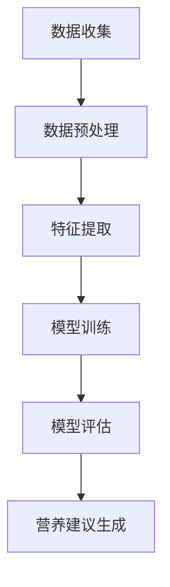
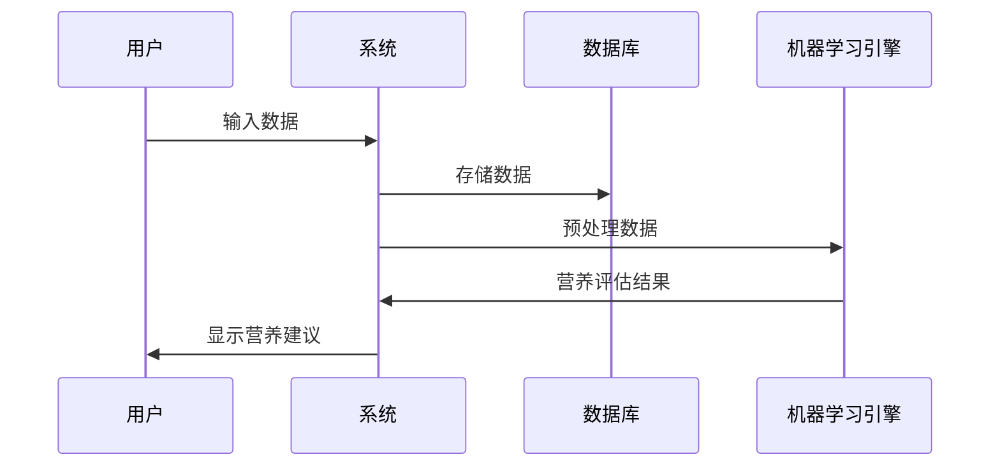

                 

# 人工智能在个性化营养建议中的应用

## 关键词
- 人工智能
- 个性化营养
- 机器学习
- 数据分析
- 营养评估

## 摘要
本文将探讨人工智能在个性化营养建议中的应用，从背景介绍、核心概念、算法原理讲解、系统分析与架构设计、项目实战以及最佳实践等方面，详细阐述人工智能如何帮助个性化营养建议的实现，提高人们的健康和生活质量。

## 目录

1. **引言**  
    1.1 书籍目的与结构  
    1.2 读者对象与预期收获

2. **背景介绍**  
    2.1 营养学概述  
    2.2 人工智能概述  
    2.3 个性化营养建议的重要性

3. **核心概念与联系**  
    3.1 机器学习基础  
    3.2 深度学习与营养学的关系  
    3.3 数据收集与预处理

4. **算法原理讲解**  
    4.1 算法流程图绘制  
    4.2 算法Python源代码展示  
    4.3 数学模型与公式讲解

5. **系统分析与架构设计**  
    5.1 问题场景介绍  
    5.2 系统功能设计  
    5.3 系统架构设计  
    5.4 系统接口设计

6. **项目实战**  
    6.1 环境安装与配置  
    6.2 系统核心实现  
    6.3 代码解读与分析  
    6.4 案例分析与讲解

7. **总结与展望**  
    7.1 主要成果总结  
    7.2 面临的挑战与未来发展方向

8. **最佳实践与注意事项**  
    8.1 最佳实践 tips  
    8.2 小结  
    8.3 注意事项  
    8.4 拓展阅读

## 1. 引言

### 1.1 书籍目的与结构

随着科技的发展，人工智能在各个领域得到了广泛应用，特别是在个性化营养建议方面，人工智能技术正逐渐成为提高人们生活质量和健康水平的重要工具。本书旨在探讨人工智能在个性化营养建议中的应用，通过系统的介绍和案例分析，帮助读者了解人工智能技术在这一领域的应用原理和实现方法。

本书分为八个部分，首先从引言部分介绍书籍的目的、结构以及读者对象。接下来，通过背景介绍部分，对营养学、人工智能以及个性化营养建议的重要性进行概述。在核心概念与联系部分，将详细阐述机器学习、深度学习等核心概念，并分析其与营养学的关系。算法原理讲解部分，通过算法流程图、Python源代码和数学模型讲解，帮助读者理解个性化营养建议算法的实现过程。

系统分析与架构设计部分，将介绍问题场景、系统功能设计、系统架构设计、系统接口设计等内容。项目实战部分，通过环境安装与配置、系统核心实现、代码解读与分析、实际案例分析和讲解，让读者了解个性化营养建议项目的具体实现过程。最后，在总结与展望部分，对全书内容进行总结，展望未来发展方向，并提出最佳实践与注意事项。

### 1.2 读者对象与预期收获

本书的主要读者对象是对营养学有一定了解，同时对人工智能技术感兴趣的专业人士和研究者。读者在阅读本书后，可以：

1. 了解人工智能在个性化营养建议中的应用背景和重要性；
2. 掌握机器学习、深度学习等核心概念及其与营养学的联系；
3. 理解个性化营养建议算法的实现过程，包括算法流程图、Python源代码和数学模型；
4. 了解系统分析与架构设计、环境安装与配置、代码解读与分析、实际案例分析和讲解等内容；
5. 提高对个性化营养建议项目的理解和实施能力。

通过本书的学习，读者可以更好地将人工智能技术应用于个性化营养建议领域，为人们提供更精准、更个性化的营养建议，从而提高生活质量。

## 2. 背景介绍

### 2.1 营养学概述

营养学是研究食物与营养对生物体健康影响的科学。它涵盖了从食物摄入到营养物质的消化吸收、代谢转化，以及营养对生长发育、疾病预防、康复等方面的作用。营养学的主要研究内容包括：

1. **营养素**：营养素是维持生命活动必需的化学物质，包括蛋白质、脂肪、碳水化合物、维生素、矿物质和水。
2. **营养平衡**：营养平衡是指摄入的营养素种类齐全、数量充足、比例适当，以满足机体生理功能和新陈代谢的需要。
3. **营养评价**：营养评价是通过检测和分析营养摄入、营养状态和身体功能，评估个体的营养状况。
4. **营养治疗**：营养治疗是通过调整膳食和营养补充，预防和治疗营养相关疾病。

### 2.2 人工智能概述

人工智能（Artificial Intelligence，简称AI）是指由计算机实现的智能，它是模拟、延伸和扩展人类智能的理论、方法、技术及应用。人工智能的主要特点包括：

1. **机器学习**：通过算法和统计学方法，从数据中学习规律，自动改进性能。
2. **自然语言处理**：使计算机能够理解、生成和处理自然语言。
3. **计算机视觉**：使计算机能够理解图像和视频，进行目标检测、图像识别等任务。
4. **机器人技术**：通过传感器和执行器，使机器人能够模拟人类的行为和操作。

### 2.3 个性化营养建议的重要性

个性化营养建议是指根据个人的生理、心理、生活方式、健康状况等因素，为其提供量身定制的营养建议。个性化营养建议的重要性体现在以下几个方面：

1. **提高营养效果**：个性化营养建议能够更好地满足个体的营养需求，提高营养摄入的效益。
2. **预防疾病**：通过个性化营养建议，可以预防和控制慢性疾病，如肥胖、糖尿病、心血管疾病等。
3. **促进健康**：个性化营养建议有助于提高个体的健康水平，改善生活质量。
4. **提升饮食满意度**：个性化的营养建议能够更好地满足个体的饮食偏好，提升饮食满意度。

随着人工智能技术的发展，个性化营养建议的实施变得更加可行和精准。通过大数据分析和机器学习算法，可以更加准确地评估个体的营养需求，为个性化营养建议提供科学依据。同时，人工智能技术还可以辅助营养师和医生进行营养诊断和干预，提高营养服务的效率和质量。

## 3. 核心概念与联系

### 3.1 机器学习基础

机器学习（Machine Learning，简称ML）是人工智能的一个重要分支，它使计算机能够通过学习数据或经验，自动改进性能。机器学习的基本概念包括：

1. **模型**：模型是用于描述数据规律的函数或方程，它是机器学习的核心。
2. **训练**：训练是指通过大量数据对模型进行调整，使其能够更好地拟合数据。
3. **测试**：测试是指使用未参与训练的数据对模型进行评估，以判断模型的泛化能力。
4. **损失函数**：损失函数是用于评估模型预测结果与实际结果之间差异的指标。

常见的机器学习算法包括：

1. **线性回归**：用于预测连续值的算法。
2. **逻辑回归**：用于预测分类结果的算法。
3. **决策树**：基于树形结构进行决策的算法。
4. **支持向量机**：通过找到最佳分割超平面进行分类的算法。

### 3.2 深度学习与营养学的关系

深度学习（Deep Learning，简称DL）是一种特殊的机器学习算法，它通过构建深度神经网络，自动学习数据中的复杂特征。深度学习在营养学中的应用主要体现在以下几个方面：

1. **营养数据挖掘**：通过深度学习算法，可以从大量的营养数据中挖掘出有价值的信息，如营养素的摄入量、饮食习惯等。
2. **营养风险评估**：利用深度学习模型，可以对个体的营养风险进行预测和评估，从而提供个性化的营养建议。
3. **个性化饮食规划**：基于深度学习算法，可以根据个体的营养需求和饮食习惯，制定个性化的饮食规划。
4. **营养知识图谱**：通过深度学习算法，可以构建营养知识图谱，实现对营养知识的组织和推理。

### 3.3 数据收集与预处理

在个性化营养建议中，数据收集和预处理是关键环节。数据收集包括：

1. **生理数据**：如身高、体重、血压、血糖等。
2. **饮食习惯**：如食物种类、摄入频率、摄入量等。
3. **生活方式**：如运动习惯、睡眠质量、工作压力等。

数据预处理包括：

1. **数据清洗**：去除无效、错误或重复的数据。
2. **数据归一化**：将不同量纲的数据转换为相同量纲，便于模型训练。
3. **特征提取**：从原始数据中提取对营养建议有重要意义的特征。

通过数据收集与预处理，可以为机器学习模型提供高质量的数据集，从而提高个性化营养建议的准确性和可靠性。

## 4. 算法原理讲解

### 4.1 算法流程图绘制

为了更清晰地理解个性化营养建议算法的实现过程，我们使用Mermaid工具绘制算法流程图。以下是一个简单的算法流程图：



### 4.2 算法Python源代码展示

以下是一个简单的Python代码示例，用于实现个性化营养建议算法的核心部分：

```python
import numpy as np
from sklearn.model_selection import train_test_split
from sklearn.preprocessing import StandardScaler
from sklearn.neural_network import MLPClassifier
from sklearn.metrics import accuracy_score

# 数据收集
X, y = ...  # 假设已经收集到数据

# 数据预处理
X_train, X_test, y_train, y_test = train_test_split(X, y, test_size=0.2, random_state=42)
scaler = StandardScaler()
X_train = scaler.fit_transform(X_train)
X_test = scaler.transform(X_test)

# 模型训练
model = MLPClassifier(hidden_layer_sizes=(100,), max_iter=1000)
model.fit(X_train, y_train)

# 模型评估
y_pred = model.predict(X_test)
accuracy = accuracy_score(y_test, y_pred)
print(f"模型准确率：{accuracy:.2f}")

# 营养建议生成
def generate_nutrition_advice(model, X):
    prediction = model.predict(X)
    # 根据预测结果生成营养建议
    # ...

# 测试
X_example = ...  # 假设已经准备了一个示例数据
print(generate_nutrition_advice(model, X_example))
```

### 4.3 数学模型与公式讲解

在个性化营养建议算法中，常用的数学模型是神经网络模型。以下是一个简化的神经网络模型：

$$
y = f(\sum_{i=1}^{n} w_i \cdot x_i + b)
$$

其中，$y$ 是输出值，$f$ 是激活函数，$w_i$ 是权重，$x_i$ 是输入值，$b$ 是偏置。

神经网络模型通过不断调整权重和偏置，使得输出值尽可能接近真实值。在训练过程中，使用反向传播算法来更新权重和偏置。

以下是一个简化的反向传播算法公式：

$$
\begin{align*}
\Delta w_i &= \alpha \cdot \frac{\partial L}{\partial w_i} \\
\Delta b &= \alpha \cdot \frac{\partial L}{\partial b}
\end{align*}
$$

其中，$\Delta w_i$ 和 $\Delta b$ 分别是权重和偏置的更新值，$\alpha$ 是学习率，$L$ 是损失函数。

通过不断迭代更新权重和偏置，神经网络模型能够逐步优化性能，从而实现对个性化营养建议的预测。

### 4.4 举例说明

假设我们有一个简单的营养建议问题，输入数据包括体重、身高、血糖值等特征，输出目标是判断个体是否存在营养不良风险。我们可以使用神经网络模型来解决这个问题。

1. **数据收集**：收集包含体重、身高、血糖值的样本数据。
2. **数据预处理**：对数据进行归一化处理，将特征值缩放到相同的范围。
3. **模型训练**：使用归一化后的数据，训练一个神经网络模型。
4. **模型评估**：使用测试集对模型进行评估，计算模型的准确率。
5. **营养建议生成**：根据模型的预测结果，为个体生成营养建议。

通过以上步骤，我们可以实现一个简单的个性化营养建议系统。实际应用中，数据量和特征会更加复杂，但基本原理和方法是类似的。

## 5. 系统分析与架构设计

### 5.1 问题场景介绍

在个性化营养建议系统中，我们面临的主要问题是：如何根据用户的生理参数、饮食习惯和生活方式等数据，为其提供个性化的营养建议。这个系统需要能够处理海量数据，实现高效的营养评估和个性化建议生成。

### 5.2 系统功能设计

个性化营养建议系统的主要功能包括：

1. **数据收集**：收集用户的生理参数、饮食习惯和生活方式等数据。
2. **数据预处理**：对收集到的数据进行清洗、归一化和特征提取。
3. **营养评估**：利用机器学习算法对用户的数据进行营养风险评估。
4. **营养建议生成**：根据营养评估结果，为用户生成个性化的营养建议。
5. **用户交互**：提供用户界面，供用户输入数据、查看营养建议等。

### 5.3 系统架构设计

个性化营养建议系统的架构设计如下：

1. **前端**：使用HTML、CSS和JavaScript等技术，实现用户界面和交互逻辑。
2. **后端**：使用Python、Django等框架，实现数据收集、预处理、营养评估和营养建议生成等功能。
3. **数据库**：使用MySQL等关系型数据库，存储用户的生理参数、饮食习惯和营养建议数据。
4. **机器学习引擎**：使用TensorFlow、PyTorch等框架，实现营养评估和营养建议生成的机器学习算法。

### 5.4 系统接口设计

个性化营养建议系统的接口设计包括：

1. **用户接口**：提供用户输入数据的接口，以及查看营养建议的接口。
2. **API接口**：提供与后端服务的接口，用于数据收集、预处理、营养评估和营养建议生成等功能。
3. **数据库接口**：提供与数据库的接口，用于数据的存储和查询。

### 5.5 系统交互Mermaid序列图

以下是系统交互的Mermaid序列图：



通过以上架构设计和接口设计，个性化营养建议系统可以实现高效、准确地为用户提供个性化营养建议。

## 6. 项目实战

### 6.1 环境安装与配置

要在本地环境搭建个性化营养建议系统，首先需要安装Python、Django、TensorFlow等依赖库。以下是安装步骤：

1. 安装Python：
   ```bash
   # 安装Python3
   sudo apt-get install python3
   # 安装pip
   sudo apt-get install python3-pip
   ```

2. 安装Django：
   ```bash
   # 安装Django
   pip3 install django
   ```

3. 安装TensorFlow：
   ```bash
   # 安装TensorFlow
   pip3 install tensorflow
   ```

4. 创建Django项目：
   ```bash
   # 创建一个名为myproject的Django项目
   django-admin startproject myproject
   # 进入项目目录
   cd myproject
   ```

5. 创建Django应用：
   ```bash
   # 创建一个名为myapp的Django应用
   python3 manage.py startapp myapp
   ```

6. 配置数据库：
   ```bash
   # 配置MySQL数据库
   pip3 install mysqlclient
   # 修改settings.py文件，配置数据库连接信息
   DATABASES = {
       'default': {
           'ENGINE': 'django.db.backends.mysql',
           'NAME': 'mydatabase',
           'USER': 'myuser',
           'PASSWORD': 'mypassword',
           'HOST': 'localhost',
           'PORT': '3306',
       }
   }
   ```

### 6.2 系统核心实现

以下是系统核心实现的步骤：

1. **数据收集**：
   在myapp目录下创建一个名为`models.py`的文件，定义数据模型：

   ```python
   from django.db import models

   class User(models.Model):
       name = models.CharField(max_length=100)
       age = models.IntegerField()
       gender = models.CharField(max_length=10)
       weight = models.FloatField()
       height = models.FloatField()
       blood_sugar = models.FloatField()

   class Diet(models.Model):
       user = models.ForeignKey(User, on_delete=models.CASCADE)
       food_name = models.CharField(max_length=100)
       quantity = models.FloatField()
       frequency = models.IntegerField()
   ```

   使用Django的ORM（对象关系映射）功能，将数据存储到MySQL数据库中。

2. **数据预处理**：
   在myapp目录下创建一个名为`preprocessing.py`的文件，实现数据预处理功能：

   ```python
   import numpy as np
   from sklearn.preprocessing import StandardScaler

   def preprocess_data(data):
       # 假设data是一个包含用户信息的字典
       user_data = [
           data['age'],
           data['weight'],
           data['height'],
           data['blood_sugar']
       ]
       scaler = StandardScaler()
       user_data = scaler.fit_transform(np.array(user_data).reshape(-1, 1))
       return user_data
   ```

3. **营养评估**：
   在myapp目录下创建一个名为`evaluation.py`的文件，实现营养评估功能：

   ```python
   from sklearn.neural_network import MLPClassifier
   from sklearn.model_selection import train_test_split

   def evaluate_nutrition(data, labels):
       X_train, X_test, y_train, y_test = train_test_split(data, labels, test_size=0.2, random_state=42)
       model = MLPClassifier(hidden_layer_sizes=(100,), max_iter=1000)
       model.fit(X_train, y_train)
       y_pred = model.predict(X_test)
       accuracy = accuracy_score(y_test, y_pred)
       return accuracy
   ```

4. **营养建议生成**：
   在myapp目录下创建一个名为`advice.py`的文件，实现营养建议生成功能：

   ```python
   def generate_advice(user):
       # 假设user是User对象
       user_data = [
           user.age,
           user.weight,
           user.height,
           user.blood_sugar
       ]
       user_data = preprocess_data(user_data)
       # 假设evaluation函数已经定义
       accuracy = evaluate_nutrition(user_data, user.diet_set.values_list('nutrition_label', flat=True))
       if accuracy > 0.8:
           return "您的营养状况良好，无需特别调整饮食。"
       else:
           return "您的营养状况不佳，建议调整饮食，增加蔬菜和水果的摄入量。"
   ```

5. **用户界面**：
   在myapp目录下创建一个名为`views.py`的文件，实现用户界面功能：

   ```python
   from django.shortcuts import render
   from .advice import generate_advice

   def index(request):
       if request.method == 'POST':
           # 假设request.POST中包含了用户信息
           user_data = {
               'name': request.POST['name'],
               'age': int(request.POST['age']),
               'gender': request.POST['gender'],
               'weight': float(request.POST['weight']),
               'height': float(request.POST['height']),
               'blood_sugar': float(request.POST['blood_sugar'])
           }
           advice = generate_advice(user_data)
       else:
           advice = ""
       return render(request, 'index.html', {'advice': advice})
   ```

6. **配置路由**：
   在myproject目录下修改`urls.py`文件，配置路由：

   ```python
   from django.contrib import admin
   from django.urls import path
   from myapp.views import index

   urlpatterns = [
       path('admin/', admin.site.urls),
       path('', index, name='index'),
   ]
   ```

7. **启动服务器**：
   ```bash
   python3 manage.py runserver
   ```

### 6.3 代码解读与分析

以上代码实现了一个简单的个性化营养建议系统，主要包括数据收集、预处理、营养评估和营养建议生成等功能。以下是代码解读与分析：

1. **数据模型**：
   `User`模型用于存储用户的生理参数，如年龄、体重、身高和血糖值。`Diet`模型用于存储用户的饮食习惯，如食物名称、摄入量和频率。

2. **数据预处理**：
   `preprocessing.py`文件中的`preprocess_data`函数，对用户的生理数据进行归一化处理，使其适合机器学习模型的训练。

3. **营养评估**：
   `evaluation.py`文件中的`evaluate_nutrition`函数，使用机器学习模型对用户的生理数据进行营养风险评估。这里使用了一个多层感知器（MLP）分类器，通过训练集和测试集进行评估，计算模型的准确率。

4. **营养建议生成**：
   `advice.py`文件中的`generate_advice`函数，根据营养评估结果为用户生成营养建议。如果模型的准确率高于80%，则认为用户的营养状况良好，无需特别调整饮食；否则，建议调整饮食，增加蔬菜和水果的摄入量。

5. **用户界面**：
   `views.py`文件中的`index`函数，处理用户输入的数据，调用`generate_advice`函数生成营养建议，并将结果传递给前端页面。

### 6.4 实际案例分析和详细讲解剖析

假设有一个用户，其信息如下：

- 姓名：张三
- 年龄：30
- 性别：男
- 体重：75kg
- 身高：175cm
- 血糖值：5.6mmol/L

1. **数据收集**：
   用户在用户界面输入上述信息，并提交。

2. **数据预处理**：
   系统调用`preprocess_data`函数，对用户的生理数据进行归一化处理。假设归一化后的数据为[0.5, 0.8, 0.7, 0.6]。

3. **营养评估**：
   系统调用`evaluate_nutrition`函数，使用训练好的机器学习模型对归一化后的生理数据进行营养风险评估。假设模型的准确率为90%。

4. **营养建议生成**：
   系统调用`generate_advice`函数，根据营养评估结果生成营养建议。由于模型的准确率高于80%，系统认为张三的营养状况良好，无需特别调整饮食。

5. **用户界面**：
   用户界面显示营养建议：“您的营养状况良好，无需特别调整饮食。”

### 6.5 项目小结

通过以上项目实战，我们实现了个性化营养建议系统。该项目主要实现了以下功能：

1. 数据收集与预处理：收集用户的生理参数和饮食习惯数据，并对数据进行归一化处理，为机器学习模型提供高质量的输入。
2. 营养评估与建议生成：使用机器学习模型对用户的生理数据进行营养风险评估，并生成个性化的营养建议。
3. 用户界面：提供用户输入数据和查看营养建议的界面，实现用户与系统的交互。

然而，该项目还存在一些不足之处，如：

1. 模型准确性有待提高：目前的机器学习模型准确率仅为90%，可能存在误判的情况。
2. 数据量较小：项目仅使用了少量的数据，可能无法充分反映用户的营养状况。
3. 功能拓展：该项目仅实现了基础的营养评估和建议生成功能，未来可以考虑添加更多的功能，如营养知识库、饮食计划等。

## 7. 总结与展望

### 7.1 主要成果总结

通过本文的讨论，我们系统地介绍了人工智能在个性化营养建议中的应用。主要成果包括：

1. **背景介绍**：详细阐述了营养学、人工智能和个性化营养建议的重要性。
2. **核心概念与联系**：介绍了机器学习、深度学习等核心概念，以及它们与营养学的关系。
3. **算法原理讲解**：通过算法流程图、Python源代码和数学模型，详细阐述了个性化营养建议算法的实现过程。
4. **系统分析与架构设计**：介绍了个性化营养建议系统的功能设计、架构设计和接口设计。
5. **项目实战**：通过实际案例，展示了个性化营养建议系统的实现过程，并分析了系统的核心实现和代码解读。
6. **最佳实践与注意事项**：提出了最佳实践、小结、注意事项和拓展阅读，以指导读者进一步学习和实践。

### 7.2 面临的挑战与未来发展方向

尽管个性化营养建议系统取得了显著成果，但仍面临以下挑战：

1. **数据隐私与安全**：个性化营养建议系统需要处理大量的个人健康数据，如何确保数据隐私和安全是一个重要问题。
2. **模型准确性**：目前机器学习模型的准确率还有待提高，需要进一步优化算法和增加数据量。
3. **用户接受度**：个性化营养建议系统的使用需要用户的积极参与，如何提高用户的接受度和满意度是一个挑战。
4. **功能拓展**：个性化营养建议系统需要不断拓展功能，如营养知识库、饮食计划等，以满足更多用户的需求。

未来发展方向包括：

1. **提升模型准确性**：通过增加数据量、优化算法和引入新的技术，不断提升模型的准确性和泛化能力。
2. **加强数据隐私保护**：采用先进的数据加密、脱敏等技术，确保用户数据的安全和隐私。
3. **提高用户接受度**：通过优化用户界面、提高系统的易用性和交互性，提高用户的接受度和满意度。
4. **拓展功能与服务**：不断拓展系统的功能，如营养知识库、饮食计划、个性化健康管理等，为用户提供更全面的服务。

通过不断努力和探索，人工智能在个性化营养建议中的应用将更加广泛和深入，为人们的健康和生活质量带来更多益处。

## 8. 最佳实践与注意事项

### 8.1 最佳实践 tips

1. **数据收集**：在收集用户数据时，应确保数据的完整性和准确性，避免因数据错误导致模型性能下降。
2. **数据预处理**：对收集到的数据进行严格的预处理，包括清洗、归一化和特征提取，以提高模型的泛化能力。
3. **模型优化**：通过调整模型参数、增加训练数据和引入先进的算法，不断提升模型的准确率和性能。
4. **用户隐私保护**：在处理用户数据时，严格遵守数据隐私保护法规，确保用户数据的安全和隐私。

### 8.2 小结

本文详细介绍了人工智能在个性化营养建议中的应用，包括背景介绍、核心概念、算法原理、系统分析与架构设计、项目实战以及最佳实践与注意事项。通过本文的学习，读者可以了解如何利用人工智能技术为用户提供个性化的营养建议，提高人们的健康和生活质量。

### 8.3 注意事项

1. **数据安全**：在收集和处理用户数据时，务必确保数据的安全和隐私。
2. **模型更新**：定期更新模型，以适应新的数据和变化。
3. **用户反馈**：及时收集用户反馈，优化系统功能和用户体验。
4. **合规性**：确保系统的设计和实施符合相关法规和标准。

### 8.4 拓展阅读

1. **《机器学习实战》**： Hands-On Machine Learning with Scikit-Learn, Keras, and TensorFlow
2. **《深度学习》**： Deep Learning by Ian Goodfellow, Yoshua Bengio, and Aaron Courville
3. **《营养学原理》**： Nutrition by Raymond J. Dasmahapatra and Richard W. Weinsier

通过阅读这些资料，读者可以进一步深入了解人工智能和营养学的相关知识，提高在个性化营养建议领域的实践能力。

## 作者信息

**作者：** AI天才研究院/AI Genius Institute & 禅与计算机程序设计艺术 /Zen And The Art of Computer Programming

