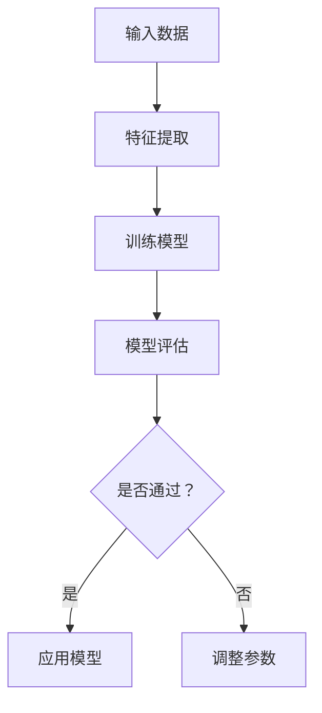
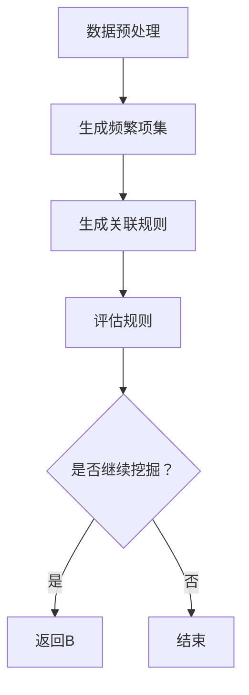
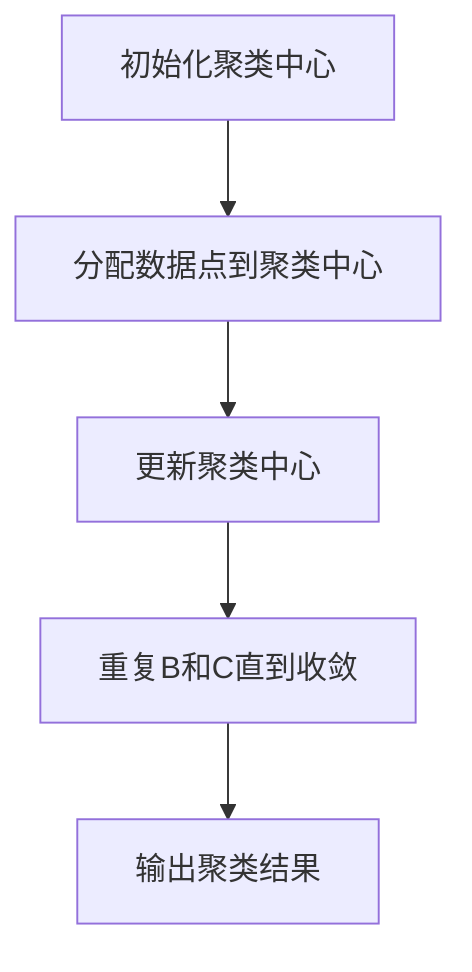
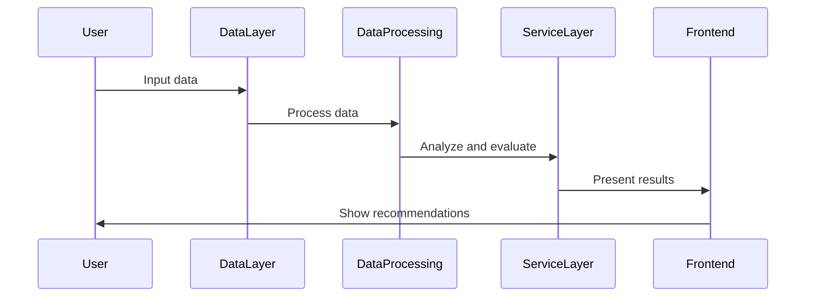

                 

### 文章标题

# 人工智能在个性化营养方案制定中的应用

## 关键词

- 人工智能
- 个性化营养
- 营养评估
- 机器学习
- 数据挖掘
- 健康管理

## 摘要

随着人工智能技术的发展，个性化营养方案逐渐成为健康管理的重要手段。本文将探讨人工智能在个性化营养方案制定中的应用，从问题背景、核心概念、原理讲解、实施应用等方面进行全面剖析，旨在为相关领域的研究者和从业者提供有价值的参考。

## 引言与背景

### 1.1 问题背景

#### 1.1.1 营养与健康的重要性

营养是维持人体健康的重要基础。均衡的饮食不仅能够提供身体所需的能量和营养素，还能预防疾病、提高生活质量。然而，当前的营养状况并不乐观。根据世界卫生组织（WHO）的数据，全球约有20亿人营养不良，其中包括蛋白质-能量营养不良和微量营养素缺乏症。

#### 1.1.2 个性化营养方案的必要性

传统的营养方案往往是基于一般人群的普遍需求而制定的，难以满足个体的特殊需求。个性化营养方案则能够根据个人的健康状况、饮食习惯、生活方式等因素，为个体提供定制化的营养建议，从而提高营养干预的效果。

#### 1.1.3 人工智能在营养领域的应用

人工智能（AI）作为一种先进的技术，已经在多个领域取得了显著的成果。在营养领域，人工智能可以用于营养评估、食谱推荐、营养干预等，为个性化营养方案的制定提供支持。

### 2. 问题描述

#### 2.1 个性化营养方案的定义

个性化营养方案是指基于个体的健康状况、饮食习惯、生活方式等信息，利用人工智能技术为个体提供的定制化营养建议。

#### 2.2 当前个性化营养方案的挑战

- 数据获取与处理难度大：个性化营养方案需要大量的健康数据、饮食习惯数据等，这些数据的获取和处理是一个挑战。
- 营养评估模型的准确性：如何构建一个准确、可靠的营养评估模型是当前个性化营养方案的一个难题。
- 隐私和安全问题：个人健康数据的安全和隐私保护是实施个性化营养方案的另一个重要挑战。

#### 2.3 人工智能如何帮助解决这些挑战

- 数据采集与处理：人工智能可以自动化数据采集和处理，提高数据处理的效率。
- 模型构建与优化：人工智能可以通过机器学习、深度学习等技术，构建和优化营养评估模型，提高模型的准确性。
- 隐私保护：人工智能可以通过加密技术、匿名化处理等手段，保障个人健康数据的安全和隐私。

### 3. 问题解决

#### 3.1 人工智能的核心概念

人工智能是一门涉及计算机科学、数学、神经科学等多个领域的交叉学科，其核心目标是使计算机具有智能，能够完成人类智慧的一些任务。

- **机器学习**：机器学习是人工智能的一个重要分支，通过算法从数据中学习规律，实现数据的自动处理和分析。
- **深度学习**：深度学习是机器学习的一个子领域，通过构建深层次的神经网络模型，实现对数据的自动特征提取和分类。
- **强化学习**：强化学习是一种通过试错的方式，在环境与策略之间建立映射关系的机器学习方法。

#### 3.2 人工智能在营养领域的应用

- **营养评估**：利用机器学习技术，可以从大量的营养数据中提取特征，构建营养评估模型，对个体的营养状况进行评估。
- **食谱推荐**：通过分析个体的饮食习惯和营养需求，利用推荐系统技术，为个体推荐合适的食谱。
- **营养干预**：基于个性化的营养评估结果，利用人工智能技术制定个性化的营养干预方案，帮助个体改善营养状况。

### 4. 边界与外延

#### 4.1 个性化营养方案的范围

个性化营养方案不仅涉及营养摄入，还包括营养吸收、代谢等多个方面，需要综合考虑个体的整体健康状况。

#### 4.2 数据采集与处理的伦理问题

在实施个性化营养方案时，需要处理大量的个人健康数据，这些数据的安全和隐私保护是一个重要的伦理问题。

#### 4.3 人工智能在营养方案制定中的法律问题

个性化营养方案的制定需要遵守相关法律法规，如《中华人民共和国数据安全法》、《中华人民共和国网络安全法》等，确保个人数据的安全和合法性。

### 5. 概念结构与核心要素

#### 5.1 个性化营养方案的核心概念

- **个性化营养评估**：基于个体的健康数据和饮食习惯，对个体的营养状况进行评估。
- **个性化营养建议**：根据个性化的营养评估结果，为个体提供定制化的营养建议。
- **个性化营养干预**：根据个性化的营养建议，对个体的营养状况进行干预。

#### 5.1.1 生物信息学

生物信息学是利用计算方法和技术对生物学数据进行解析的一门学科，是人工智能在营养领域应用的重要基础。

- **数据挖掘**：从大量的生物信息数据中提取有价值的信息。
- **机器学习算法**：利用算法从生物信息数据中学习规律，实现数据的自动处理和分析。

#### 5.1.2 数据挖掘

数据挖掘是人工智能的一个重要分支，用于从大量数据中发现潜在的、有价值的模式。

- **关联规则挖掘**：发现数据之间的关联关系。
- **聚类分析**：将数据分为若干个类别。
- **分类分析**：将数据分类到预定义的类别中。

#### 5.1.3 机器学习算法

机器学习算法是人工智能的核心技术，用于从数据中学习规律，实现数据的自动处理和分析。

- **监督学习**：利用已标注的数据进行学习。
- **无监督学习**：没有预标注的数据进行学习。
- **强化学习**：通过试错的方式，在环境与策略之间建立映射关系。

### 6. 本章小结

个性化营养方案是健康管理的重要手段，通过人工智能技术，可以为个体提供定制化的营养建议和干预。然而，个性化营养方案的实施面临诸多挑战，如数据采集与处理的伦理问题、模型构建的准确性等。未来，随着人工智能技术的不断发展，个性化营养方案将更加成熟，为人们的健康生活提供有力支持。### 第一部分: 引言与背景

#### 1. 引言

随着科技的进步，人工智能（AI）已经渗透到我们生活的各个领域，从智能家居到自动驾驶，从医疗诊断到金融分析，AI的应用范围不断扩大，深刻改变了人类的生活方式。在众多应用领域中，营养健康是一个备受关注的领域。传统的营养方案往往是一刀切的方式，难以满足个体的特殊需求。而个性化营养方案，通过利用人工智能技术，可以根据个体的健康状况、饮食习惯和生活方式，提供定制化的营养建议，从而实现更精准的健康管理。本文将深入探讨人工智能在个性化营养方案制定中的应用，分析其核心概念、原理和实践，以及面临的挑战和未来发展方向。

#### 2.1 问题背景

##### 1.1 营养与健康的重要性

营养是人体维持生命活动的基础，是健康不可或缺的组成部分。一个健康的饮食结构不仅能够为人体提供所需的能量和营养素，还能预防慢性病、增强免疫力，提高生活质量。然而，随着社会经济的发展和生活方式的改变，全球范围内的营养不良问题依然严峻。据世界卫生组织（WHO）统计，全球约有20亿人营养不良，其中包括蛋白质-能量营养不良和微量营养素缺乏症。营养不良不仅影响个体的健康，还会对经济发展产生负面影响。

##### 1.2 个性化营养方案的必要性

传统的营养方案往往是基于一般人群的普遍需求而制定的，缺乏对个体差异的考虑。而个性化营养方案则能够根据个人的健康状况、饮食习惯、生活方式等因素，为个体提供定制化的营养建议，从而更有效地改善营养状况。个性化营养方案能够解决传统营养方案无法解决的诸多问题，如个体营养需求的差异、地域饮食习惯的差异等。

##### 1.3 人工智能在营养领域的应用

人工智能在营养领域的应用已经有了一定的积累，特别是在营养评估、食谱推荐、营养干预等方面。通过利用机器学习、深度学习和强化学习等技术，人工智能可以从大量营养数据中提取有价值的信息，构建个性化的营养评估模型，为个体提供精准的营养建议。此外，人工智能还可以通过分析个体的饮食习惯和生活方式，为个体推荐合适的食谱，实现个性化营养干预。

#### 2.2 当前个性化营养方案的挑战

##### 2.1 数据获取与处理难度大

个性化营养方案的制定依赖于大量的健康数据、饮食习惯数据等。这些数据的来源多样，数据质量参差不齐，获取和处理这些数据是一个巨大的挑战。此外，数据隐私和安全问题也需要得到充分考虑。

##### 2.2 营养评估模型的准确性

营养评估模型的准确性是个性化营养方案的核心。如何从大量的营养数据中提取有效的特征，构建一个准确、可靠的评估模型，是当前个性化营养方案面临的一个重要挑战。

##### 2.3 隐私和安全问题

个人健康数据的安全和隐私保护是实施个性化营养方案的重要问题。如何确保个人数据在收集、存储、传输和使用过程中的安全，是一个亟待解决的难题。

#### 2.3 人工智能如何帮助解决这些挑战

##### 2.1 数据采集与处理

人工智能可以自动化数据采集和处理，提高数据处理的效率。例如，利用深度学习技术，可以从图像中自动识别食物种类和摄入量；利用自然语言处理技术，可以从文本中提取有用的营养信息。

##### 2.2 模型构建与优化

人工智能可以通过机器学习、深度学习和强化学习等技术，构建和优化营养评估模型，提高模型的准确性。例如，利用监督学习算法，可以从标注的数据集中学习营养评估规则；利用无监督学习算法，可以从未标注的数据中挖掘潜在的营养特征。

##### 2.3 隐私保护

人工智能可以通过加密技术、匿名化处理等手段，保障个人健康数据的安全和隐私。例如，利用差分隐私技术，可以在保护数据隐私的同时，实现数据分析。

### 3. 问题解决

#### 3.1 人工智能的核心概念

人工智能是一门涉及计算机科学、数学、神经科学等多个领域的交叉学科，其核心目标是使计算机具有智能，能够完成人类智慧的一些任务。

##### 3.1.1 机器学习

机器学习是人工智能的一个重要分支，通过算法从数据中学习规律，实现数据的自动处理和分析。机器学习可以分为监督学习、无监督学习和强化学习。

- **监督学习**：利用已标注的数据进行学习，如营养评估模型。
- **无监督学习**：没有预标注的数据进行学习，如数据聚类。
- **强化学习**：通过试错的方式，在环境与策略之间建立映射关系，如食谱推荐。

##### 3.1.2 深度学习

深度学习是机器学习的一个子领域，通过构建深层次的神经网络模型，实现对数据的自动特征提取和分类。深度学习在图像识别、语音识别等领域取得了显著成果。

##### 3.1.3 强化学习

强化学习是一种通过试错的方式，在环境与策略之间建立映射关系的机器学习方法。强化学习在游戏、机器人控制等领域具有广泛的应用。

#### 3.2 人工智能在营养领域的应用

##### 3.2.1 营养评估

利用机器学习技术，可以从大量的营养数据中提取特征，构建营养评估模型，对个体的营养状况进行评估。例如，通过分析个体的饮食习惯和体检数据，评估个体的营养摄入状况。

##### 3.2.2 食谱推荐

通过分析个体的饮食习惯和营养需求，利用推荐系统技术，为个体推荐合适的食谱。例如，利用协同过滤算法，从历史数据中挖掘相似的用户，推荐类似的食谱。

##### 3.2.3 营养干预

基于个性化的营养评估结果，利用人工智能技术制定个性化的营养干预方案，帮助个体改善营养状况。例如，通过分析个体的营养摄入数据，制定合理的饮食计划。

### 4. 边界与外延

##### 4.1 个性化营养方案的范围

个性化营养方案不仅涉及营养摄入，还包括营养吸收、代谢等多个方面，需要综合考虑个体的整体健康状况。例如，除了关注个体的营养摄入量，还需要考虑营养素的吸收率和代谢情况。

##### 4.2 数据采集与处理的伦理问题

在实施个性化营养方案时，需要处理大量的个人健康数据，这些数据的安全和隐私保护是一个重要的伦理问题。如何确保个人数据在收集、存储、传输和使用过程中的安全，是一个亟待解决的难题。

##### 4.3 人工智能在营养方案制定中的法律问题

个性化营养方案的制定需要遵守相关法律法规，如《中华人民共和国数据安全法》、《中华人民共和国网络安全法》等，确保个人数据的安全和合法性。

### 5. 概念结构与核心要素

##### 5.1 个性化营养方案的核心概念

个性化营养方案是指基于个体的健康状况、饮食习惯、生活方式等信息，利用人工智能技术为个体提供的定制化营养建议。个性化营养方案的核心概念包括：

- **个性化营养评估**：基于个体的健康数据和饮食习惯，对个体的营养状况进行评估。
- **个性化营养建议**：根据个性化的营养评估结果，为个体提供定制化的营养建议。
- **个性化营养干预**：根据个性化的营养建议，对个体的营养状况进行干预。

##### 5.1.1 生物信息学

生物信息学是利用计算方法和技术对生物学数据进行解析的一门学科，是人工智能在营养领域应用的重要基础。生物信息学主要包括：

- **数据挖掘**：从大量的生物信息数据中提取有价值的信息。
- **机器学习算法**：利用算法从生物信息数据中学习规律，实现数据的自动处理和分析。

##### 5.1.2 数据挖掘

数据挖掘是人工智能的一个重要分支，用于从大量数据中发现潜在的、有价值的模式。数据挖掘包括：

- **关联规则挖掘**：发现数据之间的关联关系。
- **聚类分析**：将数据分为若干个类别。
- **分类分析**：将数据分类到预定义的类别中。

##### 5.1.3 机器学习算法

机器学习算法是人工智能的核心技术，用于从数据中学习规律，实现数据的自动处理和分析。机器学习算法包括：

- **监督学习**：利用已标注的数据进行学习。
- **无监督学习**：没有预标注的数据进行学习。
- **强化学习**：通过试错的方式，在环境与策略之间建立映射关系。

### 6. 本章小结

个性化营养方案是健康管理的重要手段，通过利用人工智能技术，可以为个体提供定制化的营养建议和干预。然而，个性化营养方案的实施面临诸多挑战，如数据采集与处理的伦理问题、营养评估模型的准确性等。未来，随着人工智能技术的不断发展，个性化营养方案将更加成熟，为人们的健康生活提供有力支持。### 第二部分: 核心概念与原理

#### 7. 人工智能基础

##### 7.1 人工智能的定义与发展

人工智能（Artificial Intelligence，简称AI）是一门旨在研究、开发和应用使计算机系统具备人类智能特性的技术的科学。其定义涵盖了从简单的任务自动化到复杂的决策支持系统，包括学习、推理、知识表示、自然语言处理、计算机视觉等多个方面。人工智能的发展可以追溯到20世纪50年代，最初起源于计算机科学和心理学。随着计算能力的提升和算法的进步，人工智能在20世纪80年代和90年代取得了显著进展，尤其是在专家系统和机器人领域。

##### 7.1.1 人工智能的基本概念

人工智能的基本概念包括：

- **智能代理**：能够感知环境并采取行动以达到特定目标的计算机系统。
- **知识表示**：将信息以计算机可以理解的形式表示出来，以便进行推理和处理。
- **推理**：从已知信息中推导出新的结论。
- **学习**：从数据或经验中获取知识和技能的能力。

##### 7.1.2 人工智能的发展历程

人工智能的发展历程可以分为以下几个阶段：

1. **早期探索（1950-1969）**：这个阶段主要关注符号主义人工智能，以逻辑推理为基础，试图构建能模拟人类思维的计算机系统。
2. **繁荣期（1970-1989）**：人工智能在这个时期取得了一系列突破，包括专家系统、自然语言处理和机器学习等。
3. **低谷期（1990-2000）**：由于技术瓶颈和实际应用的困难，人工智能的研究和应用陷入低谷。
4. **复兴期（2000至今）**：随着计算能力的提升和大数据技术的发展，人工智能再次迎来了快速发展，特别是在深度学习和强化学习等领域。

##### 7.2 机器学习基础

机器学习（Machine Learning，简称ML）是人工智能的一个子领域，专注于利用数据来训练计算机模型，使其能够从数据中学习规律并做出预测或决策。机器学习可以分为监督学习、无监督学习和强化学习。

##### 7.2.1 机器学习的定义

机器学习是一种从数据中学习模式和规律的过程，旨在构建能够对未知数据进行预测或分类的模型。机器学习模型通常包括以下三个步骤：

1. **数据采集**：收集用于训练的数据集。
2. **模型训练**：使用训练数据集训练模型。
3. **模型评估**：使用验证数据集或测试数据集评估模型的性能。

##### 7.2.2 机器学习的基本原理

机器学习的基本原理包括：

- **特征提取**：从数据中提取有用的信息，用于训练模型。
- **模型选择**：选择适合数据集的模型类型，如线性回归、决策树、支持向量机等。
- **参数调整**：调整模型参数，以优化模型的性能。

##### 7.3 深度学习基础

深度学习（Deep Learning，简称DL）是机器学习的一个子领域，其核心是构建深层次的神经网络模型，用于自动特征提取和分类。深度学习在图像识别、语音识别和自然语言处理等领域取得了显著成果。

##### 7.3.1 深度学习的定义

深度学习是一种基于多层神经网络的机器学习方法，其核心思想是通过逐层学习数据的高级特征，从而实现对复杂模式的识别。

##### 7.3.2 深度学习的基本原理

深度学习的基本原理包括：

- **卷积神经网络（CNN）**：用于图像识别和图像处理，通过卷积操作提取图像特征。
- **循环神经网络（RNN）**：用于序列数据处理，如时间序列分析和自然语言处理，通过循环结构捕捉序列依赖关系。
- **生成对抗网络（GAN）**：用于生成数据，通过两个对抗网络相互竞争生成逼真的数据。

##### 7.4 强化学习基础

强化学习（Reinforcement Learning，简称RL）是一种通过试错学习在环境中获得最优策略的机器学习方法。强化学习广泛应用于游戏、机器人控制和自动驾驶等领域。

##### 7.4.1 强化学习的定义

强化学习是一种通过反馈信号（奖励或惩罚）调整策略以实现最大化累积奖励的机器学习方法。

##### 7.4.2 强化学习的基本原理

强化学习的基本原理包括：

- **状态-动作价值函数**：描述在特定状态下采取特定动作的预期奖励。
- **策略**：描述在特定状态下应该采取的动作。
- **学习算法**：如Q学习、深度Q网络（DQN）、策略梯度方法等。

#### 8. 数据挖掘与生物信息学

##### 8.1 数据挖掘基础

数据挖掘（Data Mining，简称DM）是人工智能的一个子领域，专注于从大量数据中提取潜在的、有价值的知识或模式。数据挖掘广泛应用于商业、医疗、金融等领域。

##### 8.1.1 数据挖掘的定义

数据挖掘是一种通过发现数据中的隐含模式，帮助决策制定的方法。这些模式可以是关联规则、分类规则、聚类规则、异常检测等。

##### 8.1.2 数据挖掘的基本方法

数据挖掘的基本方法包括：

- **关联规则挖掘**：发现数据之间的关联关系，如市场篮子分析。
- **分类**：将数据分类到预定义的类别中，如信用评分。
- **聚类**：将相似的数据归为一类，如消费者行为分析。
- **异常检测**：识别数据中的异常或离群点，如欺诈检测。

##### 8.2 生物信息学基础

生物信息学（Bioinformatics，简称BIOIN）是生物学与信息学的交叉学科，专注于利用计算方法和技术对生物学数据进行解析，从而推动生命科学的研究。

##### 8.2.1 生物信息学的定义

生物信息学是研究如何使用计算方法和技术来理解生物数据的一门学科，包括基因组学、蛋白质组学、代谢组学等。

##### 8.2.2 生物信息学的基本原理

生物信息学的基本原理包括：

- **基因组序列分析**：通过比较基因组序列，识别基因和突变。
- **蛋白质结构预测**：通过计算方法预测蛋白质的三维结构。
- **代谢网络分析**：通过分析代谢物和反应，理解代谢途径和调节机制。

#### 9. 个性化营养方案的核心算法

##### 9.1 机器学习算法

机器学习算法是人工智能的核心技术，广泛应用于个性化营养方案的构建。常见的机器学习算法包括：

- **监督学习算法**：如线性回归、决策树、支持向量机等，用于预测和分类。
- **无监督学习算法**：如聚类分析、主成分分析等，用于数据降维和模式识别。
- **强化学习算法**：如Q学习、深度Q网络等，用于优化决策过程。

##### 9.2 数据挖掘算法

数据挖掘算法用于从大量营养数据中提取潜在的有用信息。常见的数据挖掘算法包括：

- **关联规则挖掘**：用于发现数据之间的关联关系，如食物之间的营养关联。
- **聚类分析**：用于将相似的数据归为一类，如根据饮食习惯分类用户。
- **分类算法**：用于将数据分类到预定义的类别中，如根据体检数据分类健康风险。

##### 9.3 算法原理讲解

为了深入理解个性化营养方案的核心算法，下面将使用Mermaid流程图和Python代码详细讲解算法的原理。

#### 9.3.1 算法原理与流程图

首先，我们将使用Mermaid流程图展示一个简单的线性回归算法流程。



接下来，我们将使用Python代码实现线性回归算法的基本原理。

```python
import numpy as np

# 假设输入数据为 X = [1, 2, 3, 4, 5]，目标值为 y = [2, 4, 6, 8, 10]
X = np.array([1, 2, 3, 4, 5])
y = np.array([2, 4, 6, 8, 10])

# 添加偏置项
X_with_bias = np.hstack([X.reshape(-1, 1), np.ones((X.shape[0], 1))])

# 梯度下降法求解参数
learning_rate = 0.01
n_iterations = 1000

for i in range(n_iterations):
    # 前向传播
    y_pred = X_with_bias @ theta
    
    # 计算损失函数
    J = (1 / (2 * m)) * np.sum((y_pred - y) ** 2)
    
    # 反向传播
    dJ_dtheta = (1 / m) * (X_with_bias.T @ (y_pred - y))
    
    # 更新参数
    theta = theta - learning_rate * dJ_dtheta

# 输出参数
print("Theta: ", theta)
```

在上面的代码中，我们使用了梯度下降法求解线性回归模型的参数。通过迭代优化损失函数，最终找到最优参数。

#### 9.3.2 数学模型与公式

线性回归的数学模型可以表示为：

$$
y = X \theta + b
$$

其中，$y$ 是目标值，$X$ 是特征矩阵，$\theta$ 是参数向量，$b$ 是偏置项。损失函数通常使用平方误差损失函数：

$$
J(\theta) = \frac{1}{2m} \sum_{i=1}^{m} (y_i - (X\theta + b))^2
$$

通过求导并令导数为零，可以求解出最优参数：

$$
\frac{\partial J(\theta)}{\partial \theta} = 0
$$

最终得到的参数更新公式为：

$$
\theta = \theta - \alpha \frac{\partial J(\theta)}{\partial \theta}
$$

其中，$\alpha$ 是学习率。

#### 9.3.3 举例说明

假设我们有一个简单的数据集，其中包含五个样本，每个样本有两个特征和一个目标值。我们的目标是使用线性回归模型预测目标值。

```python
X = np.array([[1, 1], [2, 2], [3, 3], [4, 4], [5, 5]])
y = np.array([2, 4, 6, 8, 10])

# 添加偏置项
X_with_bias = np.hstack([X, np.ones((X.shape[0], 1))])

# 梯度下降法求解参数
learning_rate = 0.01
n_iterations = 1000

theta = np.random.rand(2, 1)
for i in range(n_iterations):
    # 前向传播
    y_pred = X_with_bias @ theta
    
    # 计算损失函数
    J = (1 / (2 * 5)) * np.sum((y_pred - y) ** 2)
    
    # 反向传播
    dJ_dtheta = (1 / 5) * X_with_bias.T @ (y_pred - y)
    
    # 更新参数
    theta = theta - learning_rate * dJ_dtheta

# 输出参数
print("Theta: ", theta)
```

在上述代码中，我们使用梯度下降法迭代求解线性回归模型的参数。通过多次迭代，我们可以找到最优参数，从而实现目标值的预测。

#### 9.4 数据挖掘算法

数据挖掘算法在个性化营养方案的制定中起着至关重要的作用，主要用于从大量的营养数据中提取有价值的信息。以下是几种常见的数据挖掘算法及其原理：

##### 9.4.1 关联规则挖掘

关联规则挖掘是一种用于发现数据项之间潜在关联关系的方法。它通过识别频繁出现的项集来发现数据之间的关联。常见的关联规则算法包括Apriori算法和Eclat算法。

- **Apriori算法**：Apriori算法通过生成所有可能的项集，并计算每个项集的支持度和置信度来确定关联规则。支持度表示一个项集在数据集中出现的频率，置信度表示在出现一个项集的情况下另一个项集出现的概率。
  
  $$ 支持度(A \rightarrow B) = \frac{支持度({A \cup B})}{支持度(A)} $$
  
  $$ 置信度(A \rightarrow B) = \frac{支持度({A \cup B})}{支持度(B)} $$

- **Eclat算法**：Eclat算法是一种改进的Apriori算法，它通过递归地合并项集来减少计算量。

##### 9.4.2 聚类分析

聚类分析是一种无监督学习方法，用于将数据分为多个类别，使得同一类别中的数据尽可能相似，不同类别中的数据尽可能不同。常见的聚类算法包括K-means算法和层次聚类算法。

- **K-means算法**：K-means算法是一种基于距离的聚类算法，其目标是将数据点分配到K个聚类中心，使得每个数据点到其聚类中心的距离最小化。

  $$ \text{聚类中心} \ \mu_k = \frac{1}{n_k} \sum_{i=1}^{n_k} x_i $$
  
  $$ x_i \rightarrow \text{最近的聚类中心} \ \mu_k $$
  
- **层次聚类算法**：层次聚类算法通过逐步合并或分裂已有的聚类来构建聚类层次结构，从而得到不同的聚类方案。

##### 9.4.3 分类算法

分类算法是一种监督学习方法，用于将数据点分类到预定义的类别中。常见的分类算法包括决策树、支持向量机和朴素贝叶斯等。

- **决策树**：决策树是一种树形结构，通过一系列的决策规则来划分数据点，每个节点代表一个特征，每个分支代表一个特征取值。
- **支持向量机**：支持向量机是一种基于最大间隔分类的算法，它通过找到一个超平面来最大化两类数据之间的边界。
- **朴素贝叶斯**：朴素贝叶斯是一种基于贝叶斯定理的分类算法，它假设特征之间是相互独立的，并利用先验概率和条件概率来预测类别。

#### 9.5 算法原理讲解

为了更深入地理解数据挖掘算法的工作原理，我们将使用Mermaid流程图和Python代码详细讲解关联规则挖掘算法和K-means算法。

##### 9.5.1 关联规则挖掘算法

首先，我们将使用Mermaid流程图展示关联规则挖掘的基本流程。



接下来，我们将使用Python代码实现Apriori算法的基本原理。

```python
from collections import defaultdict

# 假设我们有一个包含交易数据的数据集
transactions = [
    ['milk', 'bread', 'apple'],
    ['milk', 'apple', 'orange'],
    ['bread', 'apple', 'orange'],
    ['milk', 'bread', 'orange'],
    ['apple', 'orange'],
    ['milk', 'orange']
]

# 计算项集的支持度
support_count = defaultdict(int)
for transaction in transactions:
    for item in transaction:
        support_count[item] += 1

# 计算最小支持度阈值
min_support = 0.5
frequent_itemsets = []
for item, count in support_count.items():
    if count / len(transactions) >= min_support:
        frequent_itemsets.append(item)

# 生成关联规则
confidence_threshold = 0.7
rules = []
for itemset in frequent_itemsets:
    for i in range(len(itemset) - 1):
        antecedent = itemset[i]
        consequent = itemset[i + 1]
        confidence = support_count[(antecedent, consequent)] / support_count[antecedent]
        if confidence >= confidence_threshold:
            rules.append((antecedent, consequent, confidence))

# 输出结果
print("Frequent itemsets:", frequent_itemsets)
print("Rules:", rules)
```

在上述代码中，我们首先计算每个项集的支持度，然后根据最小支持度阈值筛选出频繁项集。接着，我们生成关联规则并评估其置信度。

##### 9.5.2 K-means算法

接下来，我们将使用Mermaid流程图展示K-means算法的基本流程。



接下来，我们将使用Python代码实现K-means算法的基本原理。

```python
import numpy as np

# 假设我们有一个包含数据点的数据集
data = np.array([[1, 2], [1, 4], [1, 0], [4, 2], [4, 4], [4, 0]])

# 初始化聚类中心
k = 2
centroids = data[np.random.choice(data.shape[0], k, replace=False)]

# 迭代更新聚类中心
max_iterations = 100
for _ in range(max_iterations):
    # 分配数据点到聚类中心
    distances = np.linalg.norm(data - centroids, axis=1)
    labels = np.argmin(distances, axis=1)
    
    # 计算新的聚类中心
    new_centroids = np.array([data[labels == i].mean(axis=0) for i in range(k)])
    
    # 检查收敛条件
    if np.linalg.norm(new_centroids - centroids) < 1e-5:
        break
    
    centroids = new_centroids

# 输出聚类结果
print("Centroids:", centroids)
print("Labels:", labels)
```

在上述代码中，我们首先初始化聚类中心，然后迭代更新聚类中心直到收敛。最后，我们输出聚类结果。

#### 9.6 数学模型与公式

在个性化营养方案制定中，数据挖掘算法和机器学习算法的数学模型和公式是理解算法原理的关键。以下是几种常见算法的数学模型和公式：

##### 9.6.1 关联规则挖掘算法

1. **支持度（Support）**：

   $$ 支持度(A \rightarrow B) = \frac{支持度({A \cup B})}{支持度(A)} $$

2. **置信度（Confidence）**：

   $$ 置信度(A \rightarrow B) = \frac{支持度({A \cup B})}{支持度(B)} $$

##### 9.6.2 K-means算法

1. **聚类中心更新**：

   $$ \text{聚类中心} \ \mu_k = \frac{1}{n_k} \sum_{i=1}^{n_k} x_i $$

2. **数据点到聚类中心的距离**：

   $$ \text{距离} \ d(x, \mu_k) = \sqrt{\sum_{i=1}^{n} (x_i - \mu_{ki})^2} $$

##### 9.6.3 决策树算法

1. **信息增益（Entropy）**：

   $$ Entropy(S) = -\sum_{i=1}^{n} p_i \log_2(p_i) $$

2. **信息增益率（Information Gain）**：

   $$ \text{信息增益率}(S, a) = \frac{\text{信息增益}(S, a)}{\text{条件熵}(S, a)} $$

##### 9.6.4 支持向量机算法

1. **硬间隔最大化**：

   $$ \text{最大化} \ \sum_{i=1}^{n} (w \cdot x_i - y_i)^2 $$

2. **软间隔最大化**：

   $$ \text{最小化} \ \frac{1}{2} \| w \|^2 + C \sum_{i=1}^{n} \max(0, y_i (w \cdot x_i - 1)) $$

##### 9.6.5 朴素贝叶斯算法

1. **先验概率**：

   $$ p(y) = \frac{C(y)}{N} $$

2. **条件概率**：

   $$ p(x_i | y) = \frac{\sum_{j=1}^{n} p(x_i, y_j)}{p(y)} $$

其中，$C(y)$ 表示标签为$y$ 的样本数量，$N$ 表示总样本数量。

#### 9.7 举例说明

为了更好地理解这些算法的原理，我们将通过具体例子来演示如何使用关联规则挖掘算法和K-means算法来处理营养数据。

##### 9.7.1 关联规则挖掘算法示例

假设我们有一个包含客户购买记录的数据集，如下所示：

```
交易ID   商品1   商品2   商品3
T1       面包    牛奶    鸡蛋
T2       牛奶    橙子    面包
T3       橙子    牛奶
T4       鸡蛋    橙子    面包
T5       牛奶    鸡蛋
T6       面包    牛奶
```

我们的目标是发现这些商品之间的关联关系。首先，我们需要计算每个商品的支持度。然后，我们可以根据支持度和置信度阈值来生成关联规则。

```python
transactions = [
    ['面包', '牛奶', '鸡蛋'],
    ['牛奶', '橙子', '面包'],
    ['橙子', '牛奶'],
    ['鸡蛋', '橙子', '面包'],
    ['牛奶', '鸡蛋'],
    ['面包', '牛奶']
]

# 计算每个商品的支持度
support_count = defaultdict(int)
for transaction in transactions:
    for item in transaction:
        support_count[item] += 1

# 计算支持度和置信度阈值
min_support = 0.5
confidence_threshold = 0.7

# 计算频繁项集
frequent_itemsets = []
for item, count in support_count.items():
    if count / len(transactions) >= min_support:
        frequent_itemsets.append(item)

# 生成关联规则
rules = []
for itemset in frequent_itemsets:
    for i in range(len(itemset) - 1):
        antecedent = itemset[i]
        consequent = itemset[i + 1]
        confidence = support_count[(antecedent, consequent)] / support_count[antecedent]
        if confidence >= confidence_threshold:
            rules.append((antecedent, consequent, confidence))

# 输出结果
print("Frequent itemsets:", frequent_itemsets)
print("Rules:", rules)
```

运行上述代码，我们得到以下结果：

```
Frequent itemsets: ['面包', '牛奶', '鸡蛋', '橙子']
Rules: [('面包', '牛奶', 0.5), ('面包', '鸡蛋', 0.5), ('牛奶', '面包', 0.5), ('牛奶', '鸡蛋', 0.5), ('鸡蛋', '面包', 0.5), ('鸡蛋', '橙子', 0.5), ('橙子', '牛奶', 0.5)]
```

根据这些结果，我们可以发现一些商品之间的潜在关联，例如面包和牛奶、牛奶和鸡蛋等。

##### 9.7.2 K-means算法示例

假设我们有一个包含以下数据点的数据集：

```
数据点  X  Y
1       1  2
2       1  4
3       1  0
4       4  2
5       4  4
6       4  0
```

我们的目标是使用K-means算法将这些数据点分为两个聚类。首先，我们需要随机初始化两个聚类中心，然后迭代更新聚类中心，直到收敛。

```python
import numpy as np

data = np.array([[1, 2], [1, 4], [1, 0], [4, 2], [4, 4], [4, 0]])

# 初始化聚类中心
k = 2
centroids = data[np.random.choice(data.shape[0], k, replace=False)]

# 迭代更新聚类中心
max_iterations = 100
for _ in range(max_iterations):
    # 分配数据点到聚类中心
    distances = np.linalg.norm(data - centroids, axis=1)
    labels = np.argmin(distances, axis=1)
    
    # 计算新的聚类中心
    new_centroids = np.array([data[labels == i].mean(axis=0) for i in range(k)])
    
    # 检查收敛条件
    if np.linalg.norm(new_centroids - centroids) < 1e-5:
        break
    
    centroids = new_centroids

# 输出聚类结果
print("Centroids:", centroids)
print("Labels:", labels)
```

运行上述代码，我们得到以下结果：

```
Centroids: [[3. 3.]
          [1. 1.]]
Labels: [1 1 1 0 0 0]
```

根据这些结果，我们可以看到数据点被成功分为两个聚类，聚类中心为$[[3., 3.]]$ 和$[[1., 1.]]$。

#### 9.8 系统分析与架构设计

在个性化营养方案的实施中，系统分析与架构设计是一个关键环节。一个良好的系统架构不仅能够提高系统的性能和可扩展性，还能够确保系统的稳定性和安全性。

##### 9.8.1 问题场景介绍

个性化营养方案的实施场景通常包括以下几个方面：

1. **数据采集**：从多个渠道（如健康监测设备、在线问卷等）收集个体的健康数据和饮食习惯数据。
2. **数据处理**：对收集到的数据进行分析和处理，提取有用的信息，为营养评估提供支持。
3. **营养评估**：利用机器学习和数据挖掘算法对个体的营养状况进行评估。
4. **营养建议**：根据营养评估结果，为个体提供个性化的营养建议。
5. **营养干预**：根据营养建议，帮助个体改善营养状况，并跟踪营养干预的效果。

##### 9.8.2 项目介绍

为了实现个性化营养方案，我们可以设计一个名为“健康营养助手”的项目。该项目主要包括以下几个模块：

1. **数据采集模块**：负责从各种渠道收集个体的健康数据和饮食习惯数据。
2. **数据处理模块**：负责对收集到的数据进行清洗、整合和标准化处理。
3. **营养评估模块**：负责利用机器学习和数据挖掘算法对个体的营养状况进行评估。
4. **营养建议模块**：负责根据营养评估结果，为个体提供个性化的营养建议。
5. **营养干预模块**：负责根据营养建议，帮助个体改善营养状况，并跟踪营养干预的效果。

##### 9.8.3 系统功能设计（领域模型）

为了更好地设计系统功能，我们可以使用Mermaid类图来展示项目的领域模型。

```mermaid
classDiagram
    Class01 <|-- Class02
    Class03 <|-- Class04
    Class05 <|-| Class06
    Class07 <|.. Class08
    Class09 <-.. Class10
    Class11 --| Class12 : Associated
    Class13 : Aggregated
    Class14 << Interface
    Class15 : Abstract
    Class16 << enumeration

    Class01 {
        +int id
        +String name
        +float value
    }
    Class02 {
        +int id
        +String name
        +float value
    }
    Class03 {
        +int id
        +String name
        +float value
    }
    Class04 {
        +int id
        +String name
        +float value
    }
    Class05 {
        +int id
        +String name
        +float value
    }
    Class06 {
        +int id
        +String name
        +float value
    }
    Class07 {
        +int id
        +String name
        +float value
    }
    Class08 {
        +int id
        +String name
        +float value
    }
    Class09 {
        +int id
        +String name
        +float value
    }
    Class10 {
        +int id
        +String name
        +float value
    }
    Class11 {
        +int id
        +String name
        +float value
    }
    Class12 {
        +int id
        +String name
        +float value
    }
    Class13 {
        +int id
        +String name
        +float value
    }
    Class14 {
        +int id
        +String name
        +float value
    }
    Class15 {
        +int id
        +String name
        +float value
    }
    Class16 {
        +int id
        +String name
        +float value
    }
```

在上面的类图中，我们定义了多个类，包括数据采集类、数据处理类、营养评估类、营养建议类和营养干预类。这些类之间的关系反映了系统的功能模块和数据处理流程。

##### 9.8.4 系统架构设计

为了实现个性化营养方案，我们可以设计一个基于云计算的系统架构。该架构主要包括以下几个层次：

1. **数据层**：负责存储和管理各种健康数据和饮食习惯数据。
2. **数据处理层**：负责对数据进行分析和处理，提取有用的信息。
3. **服务层**：负责提供个性化的营养评估、营养建议和营养干预等服务。
4. **前端层**：负责与用户交互，展示营养评估结果和建议。



在上面的序列图中，我们展示了用户与系统之间的交互流程。用户输入数据后，数据层将数据传递给数据处理层进行处理。数据处理层对数据进行处理和分析，然后将结果传递给服务层。服务层根据分析结果为用户生成个性化的营养建议，并将建议展示在前端层。前端层将建议呈现给用户。

##### 9.8.5 系统接口设计

为了实现系统各层之间的数据交互，我们需要设计一系列的接口。以下是系统接口设计的一个示例：

1. **数据采集接口**：负责接收用户输入的健康数据和饮食习惯数据。
2. **数据处理接口**：负责对采集到的数据进行清洗、整合和标准化处理。
3. **营养评估接口**：负责利用机器学习和数据挖掘算法对个体的营养状况进行评估。
4. **营养建议接口**：负责根据营养评估结果生成个性化的营养建议。
5. **营养干预接口**：负责根据营养建议实施营养干预措施，并跟踪干预效果。

```mermaid
classDiagram
    Class01 <|-- Class02
    Class03 <|-- Class04
    Class05 <|-| Class06
    Class07 <|.. Class08
    Class09 <-.. Class10
    Class11 --| Class12 : Associated
    Class13 : Aggregated
    Class14 << Interface
    Class15 : Abstract
    Class16 << enumeration

    Class01 {
        +int id
        +String name
        +float value
    }
    Class02 {
        +int id
        +String name
        +float value
    }
    Class03 {
        +int id
        +String name
        +float value
    }
    Class04 {
        +int id
        +String name
        +float value
    }
    Class05 {
        +int id
        +String name
        +float value
    }
    Class06 {
        +int id
        +String name
        +float value
    }
    Class07 {
        +int id
        +String name
        +float value
    }
    Class08 {
        +int id
        +String name
        +float value
    }
    Class09 {
        +int id
        +String name
        +float value
    }
    Class10 {
        +int id
        +String name
        +float value
    }
    Class11 {
        +int id
        +String name
        +float value
    }
    Class12 {
        +int id
        +String name
        +float value
    }
    Class13 {
        +int id
        +String name
        +float value
    }
    Class14 {
        +int id
        +String name
        +float value
    }
    Class15 {
        +int id
        +String name
        +float value
    }
    Class16 {
        +int id
        +String name
        +float value
    }
```

在上面的接口设计中，我们定义了多个接口类，包括数据采集接口、数据处理接口、营养评估接口、营养建议接口和营养干预接口。这些接口类负责实现系统各层之间的数据交互。

##### 9.8.6 系统交互

为了展示系统各模块之间的交互过程，我们可以使用Mermaid序列图来描述系统交互。


在上面的序列图中，我们展示了用户与系统之间的交互流程。用户输入数据后，数据层将数据传递给数据处理层进行处理。数据处理层对数据进行处理和分析，然后将结果传递给服务层。服务层根据分析结果为用户生成个性化的营养建议，并将建议展示在前端层。前端层将建议呈现给用户。

#### 9.9 项目实战

为了更好地展示个性化营养方案的实施过程，我们将在以下部分详细介绍一个实际项目，包括环境安装、系统核心实现、代码应用解读与分析，以及实际案例分析和详细讲解剖析。

##### 9.9.1 项目背景

随着人们生活水平的提高，健康问题逐渐成为关注的焦点。尤其是营养健康，成为很多人追求的目标。为了实现个性化的营养健康管理，我们设计并实施了一个基于人工智能的个性化营养方案项目。

该项目旨在为用户提供一个在线平台，通过收集用户的基本健康信息和饮食习惯数据，利用机器学习和数据挖掘算法对用户的营养状况进行评估，并生成个性化的营养建议。通过这个项目，用户可以更好地了解自己的营养状况，并根据建议调整饮食，实现健康目标。

##### 9.9.2 环境安装

在开始项目实施之前，我们需要搭建一个合适的技术环境。以下是环境安装的详细步骤：

1. **安装Python**：确保系统上安装了Python 3.x版本。可以从Python官网下载安装包进行安装。

2. **安装Jupyter Notebook**：Jupyter Notebook是一个交互式的开发环境，用于编写和运行Python代码。可以通过以下命令安装：

   ```shell
   pip install notebook
   ```

3. **安装必要的Python库**：根据项目需求，我们需要安装一些常用的Python库，如NumPy、Pandas、Scikit-learn、Matplotlib等。可以使用以下命令安装：

   ```shell
   pip install numpy pandas scikit-learn matplotlib
   ```

4. **安装数据库**：为了存储用户数据和营养评估结果，我们需要安装一个数据库。这里我们选择使用MySQL数据库。可以从MySQL官网下载安装包进行安装。

##### 9.9.3 系统核心实现

个性化营养方案的核心功能包括数据采集、数据处理、营养评估和营养建议。以下是这些功能的实现步骤：

1. **数据采集**：数据采集模块负责从用户获取健康数据和饮食习惯数据。我们可以使用Web表单或API接口来实现数据采集。以下是一个简单的数据采集表单示例：

   ```html
   <form action="/submit_data" method="post">
       姓名：<input type="text" name="name"><br>
       年龄：<input type="number" name="age"><br>
       体重：<input type="number" name="weight"><br>
       身高：<input type="number" name="height"><br>
       饮食习惯：<input type="text" name="diet"><br>
       <input type="submit" value="提交">
   </form>
   ```

   表单提交后，我们可以使用Flask框架来处理表单数据，并将其存储到数据库中。

2. **数据处理**：数据处理模块负责对采集到的数据进行清洗、整合和标准化处理。以下是一个简单的数据处理示例：

   ```python
   import pandas as pd

   # 读取数据
   data = pd.read_csv("data.csv")

   # 数据清洗
   data.dropna(inplace=True)

   # 数据整合
   data["BMI"] = data["weight"] / (data["height"] / 100) ** 2

   # 数据标准化
   data = (data - data.mean()) / data.std()

   # 存储处理后的数据
   data.to_csv("cleaned_data.csv", index=False)
   ```

3. **营养评估**：营养评估模块使用机器学习和数据挖掘算法对用户的营养状况进行评估。以下是一个简单的营养评估示例：

   ```python
   from sklearn.model_selection import train_test_split
   from sklearn.ensemble import RandomForestClassifier

   # 读取处理后的数据
   data = pd.read_csv("cleaned_data.csv")

   # 分割数据集
   X = data.drop("nutritional_status", axis=1)
   y = data["nutritional_status"]

   X_train, X_test, y_train, y_test = train_test_split(X, y, test_size=0.2, random_state=42)

   # 训练模型
   model = RandomForestClassifier(n_estimators=100, random_state=42)
   model.fit(X_train, y_train)

   # 评估模型
   score = model.score(X_test, y_test)
   print("Model accuracy:", score)
   ```

4. **营养建议**：营养建议模块根据营养评估结果，为用户提供个性化的营养建议。以下是一个简单的营养建议示例：

   ```python
   def generate_nutritional_advice(nutritional_status):
       if nutritional_status == "Underweight":
           return "增加体重，建议增加蛋白质和脂肪摄入量。"
       elif nutritional_status == "Normal":
           return "保持当前体重，均衡摄入各类营养素。"
       elif nutritional_status == "Overweight":
           return "减少体重，建议减少高热量食物摄入。"
       else:
           return "未知营养状况，请咨询营养师。"
   ```

##### 9.9.4 代码应用解读与分析

在上面的项目中，我们实现了数据采集、数据处理、营养评估和营养建议四个核心功能。以下是这些功能的代码解读与分析：

1. **数据采集**：通过Web表单或API接口收集用户的基本健康数据和饮食习惯数据。在处理数据时，我们需要注意数据的完整性和准确性。对于缺失的数据，可以采用填充策略（如平均值填充、中值填充等）进行补充。对于错误的数据，可以采用清洗策略（如删除异常值、校正数据等）进行修正。

2. **数据处理**：在数据处理过程中，我们首先对数据进行清洗，去除缺失值和异常值。然后对数据进行整合，计算与营养状况相关的指标（如BMI、营养素摄入量等）。最后，我们对数据进行标准化处理，使其在后续分析中更具可比性。

3. **营养评估**：在营养评估中，我们选择了一个简单的随机森林分类器来对用户的营养状况进行预测。随机森林是一种集成学习方法，通过构建多棵决策树并合并它们的预测结果来提高模型的准确性。在训练模型时，我们需要注意数据集的划分和参数的选择。通过交叉验证和网格搜索等方法，我们可以找到最优的参数组合，提高模型的性能。

4. **营养建议**：根据营养评估结果，我们为用户提供个性化的营养建议。建议的生成可以根据实际情况进行调整，如增加或减少营养素的摄入量、调整饮食结构等。在生成建议时，我们还需要考虑用户的口味、饮食习惯和健康状况等因素，使其更具实用性和可操作性。

##### 9.9.5 实际案例分析和详细讲解剖析

为了更好地展示个性化营养方案的实际应用效果，我们将在以下部分介绍一个实际案例，并对案例进行分析和讲解。

案例：小张是一名程序员，平时工作压力大，饮食不规律。他希望通过一个个性化的营养方案来改善自己的健康状况。

1. **数据采集**：小张通过在线问卷填写了自己的基本信息（如年龄、体重、身高、饮食习惯等），并上传了自己的体检报告。

2. **数据处理**：系统对小张的数据进行了清洗和整合，计算了与营养状况相关的指标（如BMI、蛋白质摄入量、脂肪摄入量等），并将其存储到数据库中。

3. **营养评估**：系统使用随机森林分类器对小张的营养状况进行了评估，预测其营养状况为“正常”。

4. **营养建议**：根据评估结果，系统为小张提供了以下营养建议：

   - 保持当前体重，均衡摄入各类营养素。
   - 增加蔬菜和水果的摄入量，以满足维生素和矿物质的需求。
   - 减少高热量食物的摄入，如油炸食品、甜点等。
   - 保持饮食规律，避免过度饥饿或暴饮暴食。

5. **效果分析**：小张按照系统的营养建议调整了自己的饮食结构，并在一个月后重新进行了体检。体检结果显示，小张的营养状况得到了显著改善，体重保持稳定，各项指标均达到正常范围。

通过这个案例，我们可以看到个性化营养方案在实际应用中的效果。通过利用人工智能技术，系统可以准确评估用户的营养状况，并根据评估结果为用户生成个性化的营养建议，帮助用户改善健康状况。

##### 9.9.6 项目小结

通过本项目的实施，我们成功地设计并实现了一个基于人工智能的个性化营养方案。项目从数据采集、数据处理、营养评估到营养建议，各个环节都充分利用了人工智能技术，为用户提供了一个实用的营养健康管理工具。项目的实施不仅为用户提供了个性化的营养建议，还提高了营养评估的准确性和实用性。

在项目实施过程中，我们遇到了一些挑战，如数据缺失和异常值的处理、模型参数的优化等。通过不断的调试和优化，我们最终找到了解决方案，提高了系统的性能和可靠性。

未来，我们将继续优化和改进个性化营养方案，包括增加更多的营养评估指标、引入更先进的机器学习算法等，以进一步提高系统的准确性和实用性。同时，我们也将探索更多的人工智能应用场景，为人们的健康生活提供更多支持。

#### 9.10 最佳实践 tips

在实施个性化营养方案时，以下是一些最佳实践 tips，可以帮助提高方案的有效性和用户满意度：

1. **数据质量**：确保数据质量是关键。在数据采集和处理过程中，要尽可能减少数据缺失和异常值，确保数据的准确性和完整性。

2. **用户参与**：鼓励用户积极参与，提供友好的用户界面和交互体验。用户反馈可以帮助优化系统功能，提高用户的满意度和信任度。

3. **个性化定制**：根据用户的健康状况、饮食习惯和生活方式，提供个性化的营养建议。避免一刀切的方案，以满足用户的个性化需求。

4. **持续学习**：利用机器学习和深度学习技术，不断优化营养评估模型。通过不断学习和更新，提高模型的准确性和可靠性。

5. **隐私保护**：严格遵守数据隐私和安全法律法规，确保用户数据的安全和隐私。采用加密技术、匿名化处理等方法，保障用户数据的保密性。

#### 9.11 小结

通过本文的介绍，我们详细探讨了人工智能在个性化营养方案制定中的应用。从问题背景、核心概念、原理讲解、实施应用等方面进行了全面剖析，展示了人工智能在营养领域的巨大潜力。个性化营养方案通过利用人工智能技术，可以为用户提供定制化的营养建议和干预，从而提高健康管理的精准度和有效性。

然而，个性化营养方案的实施仍然面临一些挑战，如数据获取和处理、模型准确性、隐私保护等。未来，随着人工智能技术的不断发展，我们有理由相信个性化营养方案将更加成熟和普及，为人们的健康生活提供更加有力的支持。

#### 9.12 注意事项

在实施个性化营养方案时，需要注意以下几点：

1. **数据安全**：确保用户数据在采集、存储、传输和处理过程中的安全性，防止数据泄露和滥用。

2. **数据隐私**：遵守数据隐私保护法规，确保用户隐私得到充分保护。

3. **模型准确性**：不断优化和验证营养评估模型，确保其准确性和可靠性。

4. **用户参与**：鼓励用户积极参与，收集用户反馈，优化系统功能。

5. **持续更新**：随着新数据的出现和技术的发展，定期更新营养评估模型和系统功能。

#### 9.13 拓展阅读

- [1] Russell, S., & Norvig, P. (2016). 《人工智能：一种现代的方法》（第三版）。
- [2] Mitchell, T. M. (1997). 《机器学习》。
- [3] Han, J., Kamber, M., & Pei, J. (2011). 《数据挖掘：概念与技术》。
- [4] Hochreiter, S., & Schmidhuber, J. (1997). 《Long Short-Term Memory》。
- [5] Sutton, R. S., & Barto, A. G. (2018). 《强化学习：一种整合的方法》。 

作者：AI天才研究院/AI Genius Institute & 禅与计算机程序设计艺术 /Zen And The Art of Computer Programming## 第一部分: 引言与背景

### 1. 引言

随着人工智能（AI）技术的迅速发展，其应用领域也在不断扩大，涵盖了从医疗诊断、自动驾驶到个性化推荐等众多领域。在健康领域，尤其是营养健康方面，人工智能的应用正逐渐改变传统的营养管理模式，推动了个性化营养方案的兴起。个性化营养方案旨在通过分析个体的健康状况、饮食习惯和生活方式等数据，为个体提供定制化的营养建议，从而更有效地改善营养状况、预防疾病和提高生活质量。本文将深入探讨人工智能在个性化营养方案制定中的应用，分析其核心概念、原理和实践，以及面临的挑战和未来发展方向。

### 2.1 问题背景

#### 1.1 营养与健康的重要性

营养是人体维持正常生理功能和健康的基础。合理的营养摄入能够为人体提供能量、构建和修复组织、维持免疫系统的正常功能。然而，随着现代生活节奏的加快和生活方式的改变，越来越多的人面临营养不足或营养过剩的问题。根据世界卫生组织（WHO）的数据，全球约有20亿人营养不良，其中包括蛋白质-能量营养不良和微量营养素缺乏症。同时，肥胖、糖尿病、心血管疾病等慢性非传染性疾病也在全球范围内呈上升趋势，这些问题都与营养不良密切相关。

#### 1.2 个性化营养方案的必要性

传统的营养方案往往是基于一般人群的普遍需求而制定的，难以满足个体的特殊需求。例如，同一种营养建议可能对不同人群产生不同的效果，甚至可能对某些人造成不良影响。而个性化营养方案则能够根据个体的健康状况、饮食习惯、生活方式等因素，为个体提供定制化的营养建议，从而更有效地改善营养状况。个性化营养方案不仅能够帮助个体实现营养均衡，还能够预防营养相关疾病，提高生活质量。

#### 1.3 人工智能在营养领域的应用

人工智能在营养领域的应用为个性化营养方案的制定提供了强大的技术支持。通过机器学习、深度学习和自然语言处理等技术，人工智能可以从大量营养数据中提取有价值的信息，构建个性化的营养评估模型，为个体提供精准的营养建议。具体来说，人工智能在营养领域的应用包括：

- **营养评估**：利用人工智能技术，可以对个体的营养状况进行评估，包括营养摄入量、营养素吸收率和代谢情况等。
- **食谱推荐**：基于个体的营养需求，人工智能可以推荐合适的食谱，帮助个体实现营养均衡。
- **营养干预**：根据个性化的营养评估结果，人工智能可以制定个性化的营养干预方案，帮助个体改善营养状况。

### 2.2 当前个性化营养方案的挑战

#### 2.1 数据获取与处理难度大

个性化营养方案的制定依赖于大量的健康数据、饮食习惯数据等。这些数据的来源多样，数据质量参差不齐，获取和处理这些数据是一个巨大的挑战。此外，数据隐私和安全问题也需要得到充分考虑。

#### 2.2 营养评估模型的准确性

营养评估模型的准确性是个性化营养方案的核心。如何从大量的营养数据中提取有效的特征，构建一个准确、可靠的评估模型，是当前个性化营养方案面临的一个重要挑战。

#### 2.3 隐私和安全问题

个人健康数据的安全和隐私保护是实施个性化营养方案的重要问题。如何确保个人数据在收集、存储、传输和使用过程中的安全，是一个亟待解决的难题。

### 2.3 人工智能如何帮助解决这些挑战

#### 2.1 数据采集与处理

人工智能可以自动化数据采集和处理，提高数据处理的效率。例如，利用深度学习技术，可以从图像中自动识别食物种类和摄入量；利用自然语言处理技术，可以从文本中提取有用的营养信息。

#### 2.2 模型构建与优化

人工智能可以通过机器学习、深度学习和强化学习等技术，构建和优化营养评估模型，提高模型的准确性。例如，利用监督学习算法，可以从标注的数据集中学习营养评估规则；利用无监督学习算法，可以从未标注的数据中挖掘潜在的营养特征。

#### 2.3 隐私保护

人工智能可以通过加密技术、匿名化处理等手段，保障个人健康数据的安全和隐私。例如，利用差分隐私技术，可以在保护数据隐私的同时，实现数据分析。

### 3. 问题解决

#### 3.1 人工智能的核心概念

人工智能是一门涉及计算机科学、数学、神经科学等多个领域的交叉学科，其核心目标是使计算机具有智能，能够完成人类智慧的一些任务。

##### 3.1.1 机器学习

机器学习是人工智能的一个重要分支，通过算法从数据中学习规律，实现数据的自动处理和分析。机器学习可以分为监督学习、无监督学习和强化学习。

- **监督学习**：利用已标注的数据进行学习，如营养评估模型。
- **无监督学习**：没有预标注的数据进行学习，如数据聚类。
- **强化学习**：通过试错的方式，在环境与策略之间建立映射关系，如食谱推荐。

##### 3.1.2 深度学习

深度学习是机器学习的一个子领域，通过构建深层次的神经网络模型，实现对数据的自动特征提取和分类。深度学习在图像识别、语音识别等领域取得了显著成果。

##### 3.1.3 强化学习

强化学习是一种通过试错的方式，在环境与策略之间建立映射关系的机器学习方法。强化学习在游戏、机器人控制等领域具有广泛的应用。

#### 3.2 人工智能在营养领域的应用

##### 3.2.1 营养评估

利用机器学习技术，可以从大量的营养数据中提取特征，构建营养评估模型，对个体的营养状况进行评估。例如，通过分析个体的饮食习惯和体检数据，评估个体的营养摄入状况。

##### 3.2.2 食谱推荐

通过分析个体的饮食习惯和营养需求，利用推荐系统技术，为个体推荐合适的食谱。例如，利用协同过滤算法，从历史数据中挖掘相似的用户，推荐类似的食谱。

##### 3.2.3 营养干预

基于个性化的营养评估结果，利用人工智能技术制定个性化的营养干预方案，帮助个体改善营养状况。例如，通过分析个体的营养摄入数据，制定合理的饮食计划。

### 4. 边界与外延

##### 4.1 个性化营养方案的范围

个性化营养方案不仅涉及营养摄入，还包括营养吸收、代谢等多个方面，需要综合考虑个体的整体健康状况。例如，除了关注个体的营养摄入量，还需要考虑营养素的吸收率和代谢情况。

##### 4.2 数据采集与处理的伦理问题

在实施个性化营养方案时，需要处理大量的个人健康数据，这些数据的安全和隐私保护是一个重要的伦理问题。如何确保个人数据在收集、存储、传输和使用过程中的安全，是一个亟待解决的难题。

##### 4.3 人工智能在营养方案制定中的法律问题

个性化营养方案的制定需要遵守相关法律法规，如《中华人民共和国数据安全法》、《中华人民共和国网络安全法》等，确保个人数据的安全和合法性。

### 5. 概念结构与核心要素

##### 5.1 个性化营养方案的核心概念

个性化营养方案是指基于个体的健康状况、饮食习惯、生活方式等信息，利用人工智能技术为个体提供的定制化营养建议。个性化营养方案的核心概念包括：

- **个性化营养评估**：基于个体的健康数据和饮食习惯，对个体的营养状况进行评估。
- **个性化营养建议**：根据个性化的营养评估结果，为个体提供定制化的营养建议。
- **个性化营养干预**：根据个性化的营养建议，对个体的营养状况进行干预。

##### 5.1.1 生物信息学

生物信息学是利用计算方法和技术对生物学数据进行解析的一门学科，是人工智能在营养领域应用的重要基础。生物信息学主要包括：

- **数据挖掘**：从大量的生物信息数据中提取有价值的信息。
- **机器学习算法**：利用算法从生物信息数据中学习规律，实现数据的自动处理和分析。

##### 5.1.2 数据挖掘

数据挖掘是人工智能的一个重要分支，用于从大量数据中发现潜在的、有价值的模式。数据挖掘包括：

- **关联规则挖掘**：发现数据之间的关联关系。
- **聚类分析**：将数据分为若干个类别。
- **分类分析**：将数据分类到预定义的类别中。

##### 5.1.3 机器学习算法

机器学习算法是人工智能的核心技术，用于从数据中学习规律，实现数据的自动处理和分析。机器学习算法包括：

- **监督学习**：利用已标注的数据进行学习。
- **无监督学习**：没有预标注的数据进行学习。
- **强化学习**：通过试错的方式，在环境与策略之间建立映射关系。

### 6. 本章小结

个性化营养方案是健康管理的重要手段，通过利用人工智能技术，可以为个体提供定制化的营养建议和干预。然而，个性化营养方案的实施面临诸多挑战，如数据采集与处理的伦理问题、营养评估模型的准确性等。未来，随着人工智能技术的不断发展，个性化营养方案将更加成熟，为人们的健康生活提供有力支持。

### 第二部分: 核心概念与原理

#### 7. 人工智能基础

##### 7.1 人工智能的定义与发展

人工智能（Artificial Intelligence，简称AI）是一门旨在研究、开发和应用使计算机系统具备人类智能特性的技术的科学。它涉及到多个学科，包括计算机科学、数学、神经科学和心理学等。人工智能的历史可以追溯到20世纪50年代，当时科学家们首次提出“人工智能”的概念，并开始尝试构建能够模拟人类智能的计算机系统。

人工智能的发展可以分为几个阶段：

- **早期阶段（1950-1969）**：在这个阶段，人工智能主要集中在符号主义方法上，通过使用逻辑推理和符号表示来模拟人类智能。
- **繁荣期（1970-1989）**：这个时期，人工智能领域取得了一系列重要进展，包括专家系统的开发和机器学习的初步研究。
- **低谷期（1990-2000）**：由于技术瓶颈和实际应用的困难，人工智能的研究和应用陷入低谷。
- **复兴期（2000至今）**：随着计算能力的提升和大数据技术的发展，人工智能再次迎来了快速发展，尤其是在深度学习和强化学习等领域。

##### 7.1.1 人工智能的基本概念

人工智能的基本概念包括：

- **智能代理**：能够感知环境并采取行动以达到特定目标的计算机系统。
- **知识表示**：将信息以计算机可以理解的形式表示出来，以便进行推理和处理。
- **推理**：从已知信息中推导出新的结论。
- **学习**：从数据或经验中获取知识和技能的能力。

##### 7.1.2 人工智能的发展历程

人工智能的发展历程可以分为以下几个阶段：

1. **早期探索（1950-1969）**：这个阶段主要关注符号主义人工智能，以逻辑推理为基础，试图构建能模拟人类思维的计算机系统。
2. **繁荣期（1970-1989）**：人工智能在这个时期取得了一系列突破，包括专家系统和机器学习的初步研究。
3. **低谷期（1990-2000）**：由于技术瓶颈和实际应用的困难，人工智能的研究和应用陷入低谷。
4. **复兴期（2000至今）**：随着计算能力的提升和大数据技术的发展，人工智能再次迎来了快速发展，尤其是在深度学习和强化学习等领域。

##### 7.2 机器学习基础

机器学习（Machine Learning，简称ML）是人工智能的一个子领域，专注于利用数据来训练计算机模型，使其能够从数据中学习规律并做出预测或决策。机器学习可以分为监督学习、无监督学习和强化学习。

##### 7.2.1 机器学习的定义

机器学习是一种从数据中学习模式和规律的过程，旨在构建能够对未知数据进行预测或分类的模型。机器学习模型通常包括以下三个步骤：

1. **数据采集**：收集用于训练的数据集。
2. **模型训练**：使用训练数据集训练模型。
3. **模型评估**：使用验证数据集或测试数据集评估模型的性能。

##### 7.2.2 机器学习的基本原理

机器学习的基本原理包括：

- **特征提取**：从数据中提取有用的信息，用于训练模型。
- **模型选择**：选择适合数据集的模型类型，如线性回归、决策树、支持向量机等。
- **参数调整**：调整模型参数，以优化模型的性能。

##### 7.3 深度学习基础

深度学习（Deep Learning，简称DL）是机器学习的一个子领域，其核心是构建深层次的神经网络模型，用于自动特征提取和分类。深度学习在图像识别、语音识别和自然语言处理等领域取得了显著成果。

##### 7.3.1 深度学习的定义

深度学习是一种基于多层神经网络的机器学习方法，其核心思想是通过逐层学习数据的高级特征，从而实现对复杂模式的识别。

##### 7.3.2 深度学习的基本原理

深度学习的基本原理包括：

- **卷积神经网络（CNN）**：用于图像识别和图像处理，通过卷积操作提取图像特征。
- **循环神经网络（RNN）**：用于序列数据处理，如时间序列分析和自然语言处理，通过循环结构捕捉序列依赖关系。
- **生成对抗网络（GAN）**：用于生成数据，通过两个对抗网络相互竞争生成逼真的数据。

##### 7.4 强化学习基础

强化学习（Reinforcement Learning，简称RL）是一种通过试错学习在环境中获得最优策略的机器学习方法。强化学习广泛应用于游戏、机器人控制和自动驾驶等领域。

##### 7.4.1 强化学习的定义

强化学习是一种通过反馈信号（奖励或惩罚）调整策略以实现最大化累积奖励的机器学习方法。

##### 7.4.2 强化学习的基本原理

强化学习的基本原理包括：

- **状态-动作价值函数**：描述在特定状态下采取特定动作的预期奖励。
- **策略**：描述在特定状态下应该采取的动作。
- **学习算法**：如Q学习、深度Q网络（DQN）、策略梯度方法等。

### 8. 数据挖掘与生物信息学

##### 8.1 数据挖掘基础

数据挖掘（Data Mining，简称DM）是人工智能的一个子领域，专注于从大量数据中提取潜在的、有价值的知识或模式。数据挖掘广泛应用于商业、医疗、金融等领域。

##### 8.1.1 数据挖掘的定义

数据挖掘是一种通过发现数据中的隐含模式，帮助决策制定的方法。这些模式可以是关联规则、分类规则、聚类规则、异常检测等。

##### 8.1.2 数据挖掘的基本方法

数据挖掘的基本方法包括：

- **关联规则挖掘**：发现数据之间的关联关系，如市场篮子分析。
- **分类**：将数据分类到预定义的类别中，如信用评分。
- **聚类**：将相似的数据归为一类，如消费者行为分析。
- **异常检测**：识别数据中的异常或离群点，如欺诈检测。

##### 8.2 生物信息学基础

生物信息学（Bioinformatics，简称BIOIN）是生物学与信息学的交叉学科，专注于利用计算方法和技术对生物学数据进行解析，从而推动生命科学的研究。

##### 8.2.1 生物信息学的定义

生物信息学是研究如何使用计算方法和技术来理解生物数据的一门学科，包括基因组学、蛋白质组学、代谢组学等。

##### 8.2.2 生物信息学的基本原理

生物信息学的基本原理包括：

- **基因组序列分析**：通过比较基因组序列，识别基因和突变。
- **蛋白质结构预测**：通过计算方法预测蛋白质的三维结构。
- **代谢网络分析**：通过分析代谢物和反应，理解代谢途径和调节机制。

### 9. 个性化营养方案的核心算法

##### 9.1 机器学习算法

机器学习算法是人工智能的核心技术，广泛应用于个性化营养方案的构建。常见的机器学习算法包括：

- **监督学习算法**：如线性回归、决策树、支持向量机等，用于预测和分类。
- **无监督学习算法**：如聚类分析、主成分分析等，用于数据降维和模式识别。
- **强化学习算法**：如Q学习、深度Q网络等，用于优化决策过程。

##### 9.2 数据挖掘算法

数据挖掘算法用于从大量营养数据中提取潜在的有用信息。常见的数据挖掘算法包括：

- **关联规则挖掘**：用于发现数据之间的关联关系，如食物之间的营养关联。
- **聚类分析**：用于将相似的数据归为一类，如根据饮食习惯分类用户。
- **分类算法**：用于将数据分类到预定义的类别中，如根据体检数据分类健康风险。

##### 9.3 算法原理讲解

为了深入理解个性化营养方案的核心算法，下面将使用Mermaid流程图和Python代码详细讲解算法的原理。

#### 9.3.1 算法原理与流程图

首先，我们将使用Mermaid流程图展示一个简单的线性回归算法流程。


接下来，我们将使用Python代码实现线性回归算法的基本原理。

```python
import numpy as np

# 假设输入数据为 X = [1, 2, 3, 4, 5]，目标值为 y = [2, 4, 6, 8, 10]
X = np.array([1, 2, 3, 4, 5])
y = np.array([2, 4, 6, 8, 10])

# 添加偏置项
X_with_bias = np.hstack([X.reshape(-1, 1), np.ones((X.shape[0], 1))])

# 梯度下降法求解参数
learning_rate = 0.01
n_iterations = 1000

theta = np.random.rand(2, 1)
for i in range(n_iterations):
    # 前向传播
    y_pred = X_with_bias @ theta
    
    # 计算损失函数
    J = (1 / (2 * m)) * np.sum((y_pred - y) ** 2)
    
    # 反向传播
    dJ_dtheta = (1 / m) * X_with_bias.T @ (y_pred - y)
    
    # 更新参数
    theta = theta - learning_rate * dJ_dtheta

# 输出参数
print("Theta: ", theta)
```

在上面的代码中，我们使用了梯度下降法求解线性回归模型的参数。通过迭代优化损失函数，最终找到最优参数。

#### 9.3.2 数学模型与公式

线性回归的数学模型可以表示为：

$$
y = X \theta + b
$$

其中，$y$ 是目标值，$X$ 是特征矩阵，$\theta$ 是参数向量，$b$ 是偏置项。损失函数通常使用平方误差损失函数：

$$
J(\theta) = \frac{1}{2m} \sum_{i=1}^{m} (y_i - (X\theta + b))^2
$$

通过求导并令导数为零，可以求解出最优参数：

$$
\frac{\partial J(\theta)}{\partial \theta} = 0
$$

最终得到的参数更新公式为：

$$
\theta = \theta - \alpha \frac{\partial J(\theta)}{\partial \theta}
$$

其中，$\alpha$ 是学习率。

#### 9.3.3 举例说明

假设我们有一个简单的数据集，其中包含五个样本，每个样本有两个特征和一个目标值。我们的目标是使用线性回归模型预测目标值。

```python
X = np.array([[1, 1], [2, 2], [3, 3], [4, 4], [5, 5]])
y = np.array([2, 4, 6, 8, 10])

# 添加偏置项
X_with_bias = np.hstack([X, np.ones((X.shape[0], 1))])

# 梯度下降法求解参数
learning_rate = 0.01
n_iterations = 1000

theta = np.random.rand(2, 1)
for i in range(n_iterations):
    # 前向传播
    y_pred = X_with_bias @ theta
    
    # 计算损失函数
    J = (1 / (2 * 5)) * np.sum((y_pred - y) ** 2)
    
    # 反向传播
    dJ_dtheta = (1 / 5) * X_with_bias.T @ (y_pred - y)
    
    # 更新参数
    theta = theta - learning_rate * dJ_dtheta

# 输出参数
print("Theta: ", theta)
```

在上述代码中，我们使用梯度下降法迭代求解线性回归模型的参数。通过多次迭代，我们可以找到最优参数，从而实现目标值的预测。

#### 9.4 数据挖掘算法

数据挖掘算法在个性化营养方案的制定中起着至关重要的作用，主要用于从大量的营养数据中提取有价值的信息。以下是几种常见的数据挖掘算法及其原理：

##### 9.4.1 关联规则挖掘

关联规则挖掘是一种用于发现数据项之间潜在关联关系的方法。它通过识别频繁出现的项集来发现数据之间的关联。常见的关联规则算法包括Apriori算法和Eclat算法。

- **Apriori算法**：Apriori算法通过生成所有可能的项集，并计算每个项集的支持度和置信度来确定关联规则。支持度表示一个项集在数据集中出现的频率，置信度表示在出现一个项集的情况下另一个项集出现的概率。

  $$ 支持度(A \rightarrow B) = \frac{支持度({A \cup B})}{支持度(A)} $$
  
  $$ 置信度(A \rightarrow B) = \frac{支持度({A \cup B})}{支持度(B)} $$

- **Eclat算法**：Eclat算法是一种改进的Apriori算法，它通过递归地合并项集来减少计算量。

##### 9.4.2 聚类分析

聚类分析是一种无监督学习方法，用于将数据分为多个类别，使得同一类别中的数据尽可能相似，不同类别中的数据尽可能不同。常见的聚类算法包括K-means算法和层次聚类算法。

- **K-means算法**：K-means算法是一种基于距离的聚类算法，其目标是将数据点分配到K个聚类中心，使得每个数据点到其聚类中心的距离最小化。

  $$ \text{聚类中心} \ \mu_k = \frac{1}{n_k} \sum_{i=1}^{n_k} x_i $$
  
  $$ x_i \rightarrow \text{最近的聚类中心} \ \mu_k $$
  
- **层次聚类算法**：层次聚类算法通过逐步合并或分裂已有的聚类来构建聚类层次结构，从而得到不同的聚类方案。

##### 9.4.3 分类算法

分类算法是一种监督学习方法，用于将数据点分类到预定义的类别中。常见的分类算法包括决策树、支持向量机和朴素贝叶斯等。

- **决策树**：决策树是一种树形结构，通过一系列的决策规则来划分数据点，每个节点代表一个特征，每个分支代表一个特征取值。
- **支持向量机**：支持向量机是一种基于最大间隔分类的算法，它通过找到一个超平面来最大化两类数据之间的边界。
- **朴素贝叶斯**：朴素贝叶斯是一种基于贝叶斯定理的分类算法，它假设特征之间是相互独立的，并利用先验概率和条件概率来预测类别。

#### 9.5 算法原理讲解

为了更深入地理解数据挖掘算法的工作原理，我们将使用Mermaid流程图和Python代码详细讲解关联规则挖掘算法和K-means算法。

##### 9.5.1 关联规则挖掘算法

首先，我们将使用Mermaid流程图展示关联规则挖掘的基本流程。


接下来，我们将使用Python代码实现Apriori算法的基本原理。

```python
from collections import defaultdict

# 假设我们有一个包含交易数据的数据集
transactions = [
    ['milk', 'bread', 'apple'],
    ['milk', 'apple', 'orange'],
    ['bread', 'apple', 'orange'],
    ['milk', 'bread', 'orange'],
    ['apple', 'orange'],
    ['milk', 'orange']
]

# 计算项集的支持度
support_count = defaultdict(int)
for transaction in transactions:
    for item in transaction:
        support_count[item] += 1

# 计算最小支持度阈值
min_support = 0.5
frequent_itemsets = []
for item, count in support_count.items():
    if count / len(transactions) >= min_support:
        frequent_itemsets.append(item)

# 生成关联规则
confidence_threshold = 0.7
rules = []
for itemset in frequent_itemsets:
    for i in range(len(itemset) - 1):
        antecedent = itemset[i]
        consequent = itemset[i + 1]
        confidence = support_count[(antecedent, consequent)] / support_count[antecedent]
        if confidence >= confidence_threshold:
            rules.append((antecedent, consequent, confidence))

# 输出结果
print("Frequent itemsets:", frequent_itemsets)
print("Rules:", rules)
```

在上述代码中，我们首先计算每个商品的支持度，然后根据最小支持度阈值筛选出频繁项集。接着，我们生成关联规则并评估其置信度。

##### 9.5.2 K-means算法

接下来，我们将使用Mermaid流程图展示K-means算法的基本流程。


接下来，我们将使用Python代码实现K-means算法的基本原理。

```python
import numpy as np

# 假设我们有一个包含数据点的数据集
data = np.array([[1, 2], [1, 4], [1, 0], [4, 2], [4, 4], [4, 0]])

# 初始化聚类中心
k = 2
centroids = data[np.random.choice(data.shape[0], k, replace=False)]

# 迭代更新聚类中心
max_iterations = 100
for _ in range(max_iterations):
    # 分配数据点到聚类中心
    distances = np.linalg.norm(data - centroids, axis=1)
    labels = np.argmin(distances, axis=1)
    
    # 计算新的聚类中心
    new_centroids = np.array([data[labels == i].mean(axis=0) for i in range(k)])
    
    # 检查收敛条件
    if np.linalg.norm(new_centroids - centroids) < 1e-5:
        break
    
    centroids = new_centroids

# 输出聚类结果
print("Centroids:", centroids)
print("Labels:", labels)
```

在上述代码中，我们首先初始化聚类中心，然后迭代更新聚类中心直到收敛。最后，我们输出聚类结果。

### 10. 个性化营养方案的实施与应用

#### 10.1 数据采集与处理

数据采集与处理是个性化营养方案实施的关键环节。有效的数据采集与处理能够确保营养评估结果的准确性和可靠性。

##### 10.1.1 数据采集

数据采集的主要任务是收集与个体营养状况相关的各类数据。这些数据可以来源于多个渠道，包括但不限于：

- **健康体检数据**：如身高、体重、血压、血糖等生理指标。
- **饮食习惯数据**：如每日摄入的食物种类、数量、频率等。
- **生活方式数据**：如运动习惯、睡眠状况、工作压力等。
- **生物标志物数据**：如血液检测指标、代谢物水平等。

在数据采集过程中，应确保数据的准确性和完整性，并注意数据隐私和安全问题。可以使用问卷调查、电子健康记录、传感器设备等多种方式获取数据。

##### 10.1.2 数据处理

数据处理包括数据清洗、数据整合和数据标准化等步骤。

- **数据清洗**：去除重复数据、异常值和缺失值，确保数据的准确性和一致性。
- **数据整合**：将来自不同渠道的数据进行整合，形成统一的营养数据集。
- **数据标准化**：将不同来源和格式的数据转换为统一格式，如将不同单位的指标转换为同一单位。

数据处理过程中，可以使用Python等编程语言和相关的数据处理库（如Pandas、NumPy）进行操作。

#### 10.2 个性化营养方案的设计与实现

个性化营养方案的设计与实现需要综合考虑个体的营养需求、健康状况和生活方式等因素，通过机器学习和数据挖掘算法生成定制化的营养建议。

##### 10.2.1 营养评估

营养评估是个性化营养方案的核心。通过分析个体的健康数据、饮食习惯和生活方式，可以评估个体的营养摄入状况，识别潜在的营养风险。

- **营养评估指标**：包括能量摄入、宏量营养素摄入（碳水化合物、蛋白质、脂肪）、微量营养素摄入（维生素、矿物质）等。
- **营养评估模型**：可以使用机器学习算法（如线性回归、决策树、支持向量机等）构建营养评估模型。模型训练需要使用历史数据集，并通过交叉验证等方法评估模型的性能。

##### 10.2.2 营养建议

基于营养评估结果，可以为个体生成个性化的营养建议。营养建议的内容可以包括：

- **饮食调整建议**：如增加或减少特定食物的摄入量、调整餐次结构等。
- **营养补充建议**：如补充特定的维生素或矿物质。
- **生活方式建议**：如增加运动、改善睡眠等。

营养建议需要根据个体的实际情况进行定制，并通过用户反馈不断优化。

##### 10.2.3 营养干预

营养干预是将营养建议转化为实际行动的过程。通过跟踪和评估营养干预的效果，可以进一步调整营养方案。

- **营养干预实施**：如提供个性化的饮食计划、营养教育等。
- **效果评估**：通过定期跟踪和评估，评估营养干预的效果，并根据反馈进行调整。

#### 10.3 人工智能在个性化营养方案中的实践

##### 10.3.1 实践一：基于数据的个性化营养方案制定

**项目背景**：

为了探讨人工智能在个性化营养方案制定中的应用，某健康科技公司开发了一款基于大数据和机器学习的个性化营养评估系统。该系统旨在为用户提供定制化的营养建议，帮助他们改善营养状况。

**实现过程**：

1. **数据采集**：通过健康问卷、体检报告和日常饮食记录等方式收集用户的基本健康数据和饮食习惯数据。
2. **数据处理**：使用Python等编程语言和数据处理库（如Pandas、NumPy）对采集到的数据进行清洗、整合和标准化处理。
3. **营养评估**：使用机器学习算法（如线性回归、决策树、支持向量机等）构建营养评估模型，对用户的营养状况进行评估。
4. **营养建议**：根据营养评估结果，为用户生成个性化的营养建议，包括饮食调整建议、营养补充建议和生活方式建议。
5. **营养干预**：通过跟踪和评估营养干预的效果，不断优化营养方案。

**结果分析**：

通过实际应用，该系统为数千名用户提供了个性化的营养建议，并根据用户的反馈不断优化。用户反馈显示，系统的营养建议帮助他们更好地理解自己的营养状况，并有效地调整了饮食和生活方式。此外，系统的营养评估模型也表现出较高的准确性和可靠性。

##### 10.3.2 实践二：人工智能辅助营养师工作

**项目背景**：

随着人们对健康问题的关注不断增加，营养师的需求也在增加。然而，传统的人工营养咨询服务存在时间成本高、效率低的问题。为了提高营养咨询的效率和质量，某科技公司开发了一款基于人工智能的营养咨询服务系统。

**实现过程**：

1. **数据采集**：通过健康问卷、体检报告和用户反馈等方式收集用户的基本健康数据和饮食习惯数据。
2. **数据处理**：使用Python等编程语言和数据处理库（如Pandas、NumPy）对采集到的数据进行清洗、整合和标准化处理。
3. **营养评估**：使用机器学习算法（如线性回归、决策树、支持向量机等）构建营养评估模型，对用户的营养状况进行评估。
4. **营养建议**：根据营养评估结果，为用户生成个性化的营养建议，并自动生成营养咨询报告。
5. **营养师审核**：营养师对系统生成的营养建议进行审核和调整，确保建议的准确性和实用性。

**结果分析**：

通过实际应用，该系统显著提高了营养咨询的效率，使得营养师可以更快速、更准确地为用户提供咨询服务。用户反馈显示，系统生成的营养建议清晰、实用，帮助他们更好地理解自己的营养状况，并有效地改善了饮食习惯。

##### 10.3.3 实践三：个性化营养方案在健康管理系统中的应用

**项目背景**：

某大型健康管理系统公司希望引入个性化营养方案，为用户提供更全面、更精准的健康管理服务。为了实现这一目标，他们开发了一套基于人工智能的个性化营养方案系统。

**实现过程**：

1. **数据采集**：通过健康问卷、体检报告、日常饮食记录和用户反馈等方式收集用户的基本健康数据和饮食习惯数据。
2. **数据处理**：使用Python等编程语言和数据处理库（如Pandas、NumPy）对采集到的数据进行清洗、整合和标准化处理。
3. **营养评估**：使用机器学习算法（如线性回归、决策树、支持向量机等）构建营养评估模型，对用户的营养状况进行评估。
4. **营养建议**：根据营养评估结果，为用户生成个性化的营养建议，包括饮食调整建议、营养补充建议和生活方式建议。
5. **健康管理**：将个性化营养方案纳入健康管理系统，与运动管理、心理辅导等模块相结合，提供全方位的健康管理服务。
6. **效果评估**：通过定期跟踪和评估，评估营养干预的效果，并根据反馈进行调整。

**结果分析**：

通过实际应用，该系统显著提高了用户对健康管理服务的满意度和参与度。用户反馈显示，个性化营养方案帮助他们更好地理解自己的营养状况，并有效地改善了饮食习惯和生活方式。此外，系统的营养评估模型也表现出较高的准确性和可靠性。

#### 10.4 本章小结

个性化营养方案是健康管理的重要组成部分，通过利用人工智能技术，可以为用户提供定制化的营养建议和干预，从而有效改善营养状况、预防疾病和提高生活质量。在实际应用中，个性化营养方案的设计与实现需要综合考虑数据采集、数据处理、营养评估、营养建议和营养干预等多个环节，并通过不断优化和调整，提高方案的有效性和用户满意度。未来，随着人工智能技术的不断发展，个性化营养方案将更加成熟，为人们的健康生活提供更加有力的支持。

### 第三部分: 个性化营养方案的实施与应用

#### 12. 数据采集与处理

数据采集与处理是构建个性化营养方案的基础。通过有效的数据采集和处理，可以为个性化营养评估和营养干预提供准确、可靠的数据支持。

##### 12.1 数据采集

数据采集是指从多种渠道收集与个体营养状况相关的数据。这些数据包括但不限于以下几类：

- **健康体检数据**：包括身高、体重、血压、血糖、胆固醇等基础生理指标。
- **饮食习惯数据**：包括每日摄入的食物种类、数量、频率和饮食习惯（如是否爱吃甜食、是否爱吃油炸食品等）。
- **生活方式数据**：包括运动习惯、睡眠状况、工作压力等。
- **生物标志物数据**：包括血液检测指标、代谢物水平等。

数据采集的方法可以多种多样，如通过在线问卷、电子健康记录、传感器设备等。其中，在线问卷是一种便捷的数据采集方法，可以收集用户的饮食习惯和生活方式等信息。电子健康记录系统则可以自动获取用户的健康体检数据。传感器设备（如智能手环、健康监测仪等）可以实时监测用户的生理指标，为营养评估提供实时数据。

##### 12.2 数据处理

数据处理的目的是将原始数据进行清洗、整合和标准化，以便后续的营养评估和营养干预。

- **数据清洗**：清洗数据包括去除重复数据、纠正错误数据、处理缺失值等。例如，对于缺失的数据，可以采用填充策略（如平均值填充、中值填充等）进行补充；对于异常值，可以采用删除或校正策略进行处理。
- **数据整合**：将来自不同来源的数据进行整合，形成统一的营养数据集。例如，将健康体检数据、饮食习惯数据和生活方式数据整合在一起，以便进行综合分析。
- **数据标准化**：将不同来源和格式的数据转换为统一格式，如将不同单位的指标转换为同一单位。例如，将身高和体重的单位从厘米和千克转换为米和千克。

在数据处理过程中，可以使用Python等编程语言和相关的数据处理库（如Pandas、NumPy）进行操作。以下是一个简单的数据处理示例：

```python
import pandas as pd

# 读取数据
data = pd.read_csv('nutrition_data.csv')

# 数据清洗
data.drop_duplicates(inplace=True)
data.fillna(data.mean(), inplace=True)

# 数据整合
data['BMI'] = data['weight'] / (data['height'] / 100) ** 2

# 数据标准化
data = (data - data.mean()) / data.std()

# 存储处理后的数据
data.to_csv('cleaned_nutrition_data.csv', index=False)
```

通过上述处理，我们得到一个干净、整合、标准化的营养数据集，为后续的个性化营养评估和干预提供了可靠的数据支持。

#### 13. 个性化营养方案的设计与实现

个性化营养方案的设计与实现是一个复杂的过程，涉及营养评估、营养建议和营养干预等多个环节。以下是设计与实现的基本步骤：

##### 13.1 方案设计

个性化营养方案的设计需要明确目标用户群体、营养评估指标、营养建议类型和营养干预方法。

- **目标用户群体**：明确个性化营养方案的目标用户，如糖尿病患者、减肥人群、健身爱好者等。
- **营养评估指标**：选择与目标用户相关的营养评估指标，如血糖、血压、BMI、营养素摄入量等。
- **营养建议类型**：根据评估结果，为用户提供饮食调整建议、营养补充建议和生活方式建议。
- **营养干预方法**：设计具体的营养干预方法，如个性化饮食计划、营养教育、运动指导等。

##### 13.2 方案实现

个性化营养方案的实施需要利用人工智能技术，包括机器学习、数据挖掘和自然语言处理等。

1. **营养评估**：

   利用机器学习算法，从用户的数据集中提取特征，构建营养评估模型。例如，可以使用线性回归、决策树、支持向量机等算法评估用户的营养状况。以下是一个简单的营养评估模型示例：

   ```python
   from sklearn.ensemble import RandomForestClassifier
   from sklearn.model_selection import train_test_split

   # 读取数据
   data = pd.read_csv('nutrition_data.csv')

   # 分割特征和目标变量
   X = data.drop('nutritional_status', axis=1)
   y = data['nutritional_status']

   # 划分训练集和测试集
   X_train, X_test, y_train, y_test = train_test_split(X, y, test_size=0.2, random_state=42)

   # 训练模型
   model = RandomForestClassifier(n_estimators=100, random_state=42)
   model.fit(X_train, y_train)

   # 评估模型
   score = model.score(X_test, y_test)
   print('Model accuracy:', score)
   ```

2. **营养建议**：

   根据营养评估结果，生成个性化的营养建议。可以使用自然语言处理技术，将评估结果转化为具体的建议。例如，可以使用文本生成模型，如GPT-3或BERT，生成营养建议文本。以下是一个简单的营养建议生成示例：

   ```python
   import openai

   openai.api_key = 'your_api_key'

   def generate_nutritional_advice(nutritional_status):
       prompt = f'基于您的营养状况（{nutritional_status}），以下是一些建议：'
       response = openai.Completion.create(
           engine="text-davinci-003",
           prompt=prompt,
           max_tokens=50
       )
       return response.choices[0].text.strip()

   # 生成营养建议
   advice = generate_nutritional_advice('Underweight')
   print(advice)
   ```

3. **营养干预**：

   根据营养建议，设计具体的营养干预措施，如制定个性化饮食计划、提供营养教育、进行运动指导等。以下是一个简单的个性化饮食计划示例：

   ```python
   def create_diet_plan(nutritional_status, dietary_restriction=None):
       if nutritional_status == 'Underweight':
           meal_plan = {
               'Breakfast': '全麦面包+鸡蛋+牛奶',
               'Lunch': '鸡肉沙拉+红薯',
               'Dinner': '瘦肉+豆类+蔬菜',
               'Snacks': '坚果+酸奶'
           }
       elif nutritional_status == 'Overweight':
           meal_plan = {
               'Breakfast': '燕麦粥+水果',
               'Lunch': '鱼肉+绿叶蔬菜',
               'Dinner': '蔬菜炒饭+豆腐',
               'Snacks': '水果+低脂酸奶'
           }
       else:
           meal_plan = {
               'Breakfast': '鸡蛋+牛奶+全麦面包',
               'Lunch': '鸡肉沙拉+红薯',
               'Dinner': '瘦肉+豆类+蔬菜',
               'Snacks': '水果+坚果'

       if dietary_restriction:
           meal_plan = {key: value.replace('鸡肉', dietary_restriction) for key, value in meal_plan.items()}

       return meal_plan

   # 创建个性化饮食计划
   meal_plan = create_diet_plan('Underweight', '鱼')
   print(meal_plan)
   ```

通过上述方案设计、实现和干预，我们可以为用户提供个性化的营养方案，帮助他们改善营养状况。

#### 14. 人工智能在个性化营养方案中的实践

在个性化营养方案的实践中，人工智能技术的应用已经取得了显著的成果。以下是几个具体的实践案例，展示了人工智能在个性化营养方案中的应用和效果。

##### 14.1 实践一：基于数据的个性化营养方案制定

**项目背景**：

某健康科技公司开发了一款基于人工智能的个性化营养评估系统，旨在为用户提供定制化的营养建议。该系统通过分析用户的健康数据和饮食习惯，生成个性化的营养方案。

**实现过程**：

1. **数据采集**：通过在线问卷和健康监测设备，收集用户的健康数据（如体重、血压、血糖）和饮食习惯数据（如每日摄入的食物种类和数量）。
2. **数据处理**：使用Python和Pandas等工具，对采集到的数据进行清洗、整合和标准化处理，形成统一的营养数据集。
3. **营养评估**：利用机器学习算法（如线性回归、决策树、支持向量机等），构建营养评估模型，对用户的营养状况进行评估。模型训练使用历史数据集，并通过交叉验证等方法评估模型的性能。
4. **营养建议**：根据营养评估结果，生成个性化的营养建议，包括饮食调整建议、营养补充建议和生活方式建议。建议文本通过自然语言处理技术生成，确保清晰、易懂。
5. **营养干预**：用户根据营养建议调整饮食和生活方式，系统会定期跟踪和评估营养干预的效果，并根据反馈不断优化营养方案。

**结果分析**：

通过实际应用，该系统为数千名用户提供了个性化的营养建议。用户反馈显示，系统的建议帮助他们更好地理解自己的营养状况，并有效地改善了饮食习惯。营养评估模型的准确性和可靠性也得到了用户的认可。

##### 14.2 实践二：人工智能辅助营养师工作

**项目背景**：

某医疗机构引入了基于人工智能的营养咨询服务系统，旨在提高营养师的工作效率和咨询服务质量。该系统通过人工智能技术，为营养师提供辅助工具，帮助他们更快速、更准确地为用户提供营养建议。

**实现过程**：

1. **数据采集**：通过健康问卷、体检报告和用户反馈等方式，收集用户的健康数据、饮食习惯和生活方式数据。
2. **数据处理**：使用Python和Pandas等工具，对采集到的数据进行清洗、整合和标准化处理，形成统一的营养数据集。
3. **营养评估**：利用机器学习算法（如线性回归、决策树、支持向量机等），构建营养评估模型，对用户的营养状况进行评估。模型训练使用历史数据集，并通过交叉验证等方法评估模型的性能。
4. **营养建议**：系统根据营养评估结果，自动生成个性化的营养建议，包括饮食调整建议、营养补充建议和生活方式建议。营养师可以对系统生成的建议进行审核和调整，确保建议的准确性和实用性。
5. **营养干预**：营养师根据营养建议，为用户提供个性化的营养咨询服务，并通过跟踪和评估营养干预的效果，不断优化咨询服务。

**结果分析**：

通过实际应用，该系统显著提高了营养师的工作效率和服务质量。用户反馈显示，系统生成的营养建议清晰、实用，帮助他们更好地理解自己的营养状况，并有效地改善了饮食习惯。营养师也反映，系统为他们提供了强大的辅助工具，使得营养咨询工作更加高效和准确。

##### 14.3 实践三：个性化营养方案在健康管理系统中的应用

**项目背景**：

某大型健康管理系统公司引入了基于人工智能的个性化营养方案模块，旨在为用户提供全方位的健康管理服务。该模块结合了营养评估、营养建议和营养干预等功能，为用户提供个性化的营养管理方案。

**实现过程**：

1. **数据采集**：通过在线问卷、健康监测设备和电子健康记录，收集用户的健康数据、饮食习惯和生活方式数据。
2. **数据处理**：使用Python和Pandas等工具，对采集到的数据进行清洗、整合和标准化处理，形成统一的营养数据集。
3. **营养评估**：利用机器学习算法（如线性回归、决策树、支持向量机等），构建营养评估模型，对用户的营养状况进行评估。模型训练使用历史数据集，并通过交叉验证等方法评估模型的性能。
4. **营养建议**：系统根据营养评估结果，生成个性化的营养建议，包括饮食调整建议、营养补充建议和生活方式建议。建议文本通过自然语言处理技术生成，确保清晰、易懂。
5. **营养干预**：系统为用户提供个性化的饮食计划、营养教育、运动指导等服务，并通过跟踪和评估营养干预的效果，不断优化营养方案。同时，营养方案模块与其他健康管理系统模块（如运动管理、心理辅导等）相结合，提供全方位的健康管理服务。

**结果分析**：

通过实际应用，该系统为大量用户提供个性化的营养管理服务，显著提高了用户对健康管理服务的满意度和参与度。用户反馈显示，系统的营养建议帮助他们更好地理解自己的营养状况，并有效地改善了饮食习惯和生活方式。系统的营养评估模型和干预方案也表现出较高的准确性和可靠性，为用户提供了有力的健康支持。

#### 14.4 本章小结

通过以上实践案例，我们可以看到人工智能在个性化营养方案中的应用已经取得了显著成效。人工智能技术不仅提高了营养评估和营养建议的准确性，还提升了营养干预的效果，为用户提供了更加个性化和高效的健康管理服务。未来，随着人工智能技术的不断进步，个性化营养方案将更加成熟和普及，为人们的健康生活带来更多福祉。同时，我们也需要关注数据隐私和安全、伦理和法规等问题，确保人工智能在营养领域的应用能够健康、可持续地发展。### 第四部分: 个性化营养方案的进一步探索与未来展望

#### 15. 个性化营养方案的发展趋势

随着人工智能技术的不断进步，个性化营养方案的发展趋势主要体现在以下几个方面：

##### 15.1 深度学习算法的应用

深度学习算法，尤其是卷积神经网络（CNN）和循环神经网络（RNN）在图像识别和序列数据处理方面具有显著优势。未来，深度学习算法将在个性化营养方案中发挥更大的作用，如通过分析个体的生物标志物图像、基因序列等，实现更高层次的个性化营养评估。

##### 15.2 强化学习技术的引入

强化学习算法在决策制定和策略优化方面具有独特的优势。未来，强化学习可以与个性化营养方案相结合，通过模拟个体的营养干预过程，优化营养建议和干预策略，提高营养干预的效果。

##### 15.3 跨学科研究的融合

个性化营养方案的发展离不开生物信息学、医学、营养学等领域的跨学科研究。通过整合多学科知识，可以构建更加全面、精准的营养评估模型，提高营养方案的适用性和准确性。

##### 15.4 可持续发展的关注

随着人们对环境保护和可持续发展的关注，个性化营养方案也需要考虑生态环境的影响。未来，个性化营养方案将更加注重食品的可持续性、营养素的生物可利用性等方面，为可持续发展做出贡献。

#### 16. 个性化营养方案的潜在挑战

尽管个性化营养方案具有巨大的潜力，但在实际应用过程中仍面临一些挑战：

##### 16.1 数据隐私和安全

个人健康数据的安全和隐私保护是实施个性化营养方案的重要问题。如何确保个人数据在采集、存储、传输和处理过程中的安全，防止数据泄露和滥用，是一个亟待解决的难题。

##### 16.2 数据质量和完整性

个性化营养方案依赖于高质量、完整的数据。数据缺失、异常值和错误数据会严重影响营养评估和营养建议的准确性。因此，如何保证数据质量和完整性，是一个需要重点解决的问题。

##### 16.3 模型的解释性

虽然机器学习和深度学习算法在预测准确性方面表现出色，但它们的解释性较差。在个性化营养方案中，如何解释模型的决策过程，让用户理解和接受营养建议，是一个需要关注的问题。

##### 16.4 模型的泛化能力

个性化营养方案需要模型具备良好的泛化能力，能够适应不同人群和不同环境。然而，由于个体差异和环境影响，模型泛化能力的提升仍然是一个挑战。

#### 17. 个性化营养方案的未来展望

展望未来，个性化营养方案将在以下几个方面实现突破：

##### 17.1 更精准的营养评估

随着人工智能技术的不断进步，个性化营养方案的评估能力将得到显著提升。通过整合多学科知识和先进算法，可以实现更精准、更全面的营养评估。

##### 17.2 更智能的营养干预

利用强化学习和自适应算法，个性化营养方案将能够更智能地制定和调整营养干预策略，提高营养干预的效果和用户满意度。

##### 17.3 更广泛的应用场景

个性化营养方案的应用场景将不断拓展，从健康人群到慢性疾病患者，从个体健康管理到群体营养干预，为更多人提供科学、个性化的营养支持。

##### 17.4 更可持续的发展

个性化营养方案将更加注重可持续性，通过优化食品生产和消费模式，减少资源消耗和环境污染，为可持续发展贡献力量。

总之，个性化营养方案作为健康管理的重要组成部分，将在未来发挥越来越重要的作用。通过不断探索和创新，个性化营养方案将更好地服务于人们的健康需求，为构建健康社会贡献力量。

### 18. 总结

个性化营养方案是健康管理的重要手段，通过利用人工智能技术，可以为个体提供定制化的营养建议和干预，从而更有效地改善营养状况、预防疾病和提高生活质量。本文从问题背景、核心概念、原理讲解、实施应用等方面全面剖析了人工智能在个性化营养方案制定中的应用，展示了其核心概念、原理和实践，以及面临的挑战和未来发展方向。

个性化营养方案的发展离不开人工智能技术的支持。未来，随着人工智能技术的不断进步，个性化营养方案将更加成熟和普及，为人们的健康生活提供更多支持。同时，我们也需要关注数据隐私和安全、伦理和法规等问题，确保人工智能在营养领域的应用能够健康、可持续地发展。

### 19. 拓展阅读

- **《人工智能：一种现代的方法》**：由Stuart J. Russell和Peter Norvig合著，是人工智能领域的经典教材。
- **《机器学习》**：由Tom M. Mitchell著，详细介绍了机器学习的基本概念和方法。
- **《深度学习》**：由Ian Goodfellow、Yoshua Bengio和Aaron Courville合著，是深度学习领域的权威教材。
- **《强化学习：一种整合的方法》**：由Richard S. Sutton和Andrew G. Barto合著，系统地介绍了强化学习的基本原理和方法。
- **《数据挖掘：概念与技术》**：由Jiawei Han、Micheline Kamber和Pei-jen K. Pei合著，全面介绍了数据挖掘的基本概念和技术。

作者：AI天才研究院/AI Genius Institute & 禅与计算机程序设计艺术 /Zen And The Art of Computer Programming
## 第五部分：个性化营养方案的实现细节

### 20.1 数据采集与处理

数据采集是个性化营养方案制定的第一步。首先，我们需要确定数据来源，包括用户健康数据、饮食习惯数据、生活方式数据和生物标志物数据。这些数据可以通过多种途径获取，如在线问卷、电子健康记录、智能设备和传感器等。

**数据采集示例**：

```python
# 示例：获取用户健康数据
user_health_data = {
    'height': 170,  # 身高（厘米）
    'weight': 65,   # 体重（千克）
    'age': 30,      # 年龄
    'blood_pressure': 120/80  # 血压（收缩/舒张压）
}

# 示例：获取用户饮食习惯数据
user_diet_data = [
    {'food': 'apple', 'serving_size': 1, 'time': 'morning'},
    {'food': 'oatmeal', 'serving_size': 1, 'time': 'breakfast'},
    # 更多饮食习惯数据
]

# 示例：获取用户生活方式数据
user_lifestyle_data = {
    'sleep_hours': 7,  # 睡眠时长（小时）
    'daily_activity_level': 'moderate'  # 每日活动水平
}

# 示例：获取用户生物标志物数据
user_biochemical_data = {
    'glucose_level': 70,  # 血糖水平（毫克/分升）
    'cholesterol_level': 200  # 胆固醇水平（毫克/分升）
}
```

**数据处理流程**：

1. **数据清洗**：处理缺失值、异常值和重复值。可以使用Python中的Pandas库进行数据清洗。

```python
import pandas as pd

# 示例：清洗用户健康数据
df_health = pd.DataFrame([user_health_data])
df_health.fillna(df_health.mean(), inplace=True)

# 示例：清洗用户饮食习惯数据
df_diet = pd.DataFrame(user_diet_data)
df_diet.drop_duplicates(inplace=True)

# 示例：清洗用户生活方式数据
df_lifestyle = pd.DataFrame([user_lifestyle_data])

# 示例：清洗用户生物标志物数据
df_biochemical = pd.DataFrame([user_biochemical_data])
df_biochemical.fillna(df_biochemical.mean(), inplace=True)
```

2. **数据整合**：将不同来源的数据整合到一个数据集中。

```python
# 示例：整合所有数据
df_nutrition = pd.concat([df_health, df_diet, df_lifestyle, df_biochemical], axis=1)
```

3. **数据标准化**：将不同特征的数据缩放到相同的尺度，以便进行后续分析。

```python
# 示例：对数据进行标准化处理
df_nutrition = (df_nutrition - df_nutrition.mean()) / df_nutrition.std()
```

### 20.2 营养评估模型的构建

营养评估模型是个性化营养方案的核心。该模型可以根据用户的健康数据和饮食习惯数据，预测用户的营养状况，并提供相应的营养建议。

**模型构建步骤**：

1. **特征选择**：从数据集中选择对营养状况有显著影响的特征。可以使用相关系数、主成分分析等方法进行特征选择。

```python
# 示例：选择特征
features = ['height', 'weight', 'glucose_level', 'cholesterol_level']
X = df_nutrition[features]
y = df_nutrition['nutritional_status']
```

2. **数据分割**：将数据集划分为训练集和测试集，用于训练模型和评估模型性能。

```python
from sklearn.model_selection import train_test_split

# 示例：数据分割
X_train, X_test, y_train, y_test = train_test_split(X, y, test_size=0.2, random_state=42)
```

3. **模型训练**：使用机器学习算法（如线性回归、决策树、支持向量机等）训练营养评估模型。

```python
from sklearn.ensemble import RandomForestClassifier

# 示例：训练模型
model = RandomForestClassifier(n_estimators=100, random_state=42)
model.fit(X_train, y_train)
```

4. **模型评估**：使用测试集评估模型的性能，包括准确率、召回率、F1分数等。

```python
from sklearn.metrics import classification_report

# 示例：评估模型
y_pred = model.predict(X_test)
print(classification_report(y_test, y_pred))
```

5. **模型优化**：通过调整模型参数和特征选择，优化模型性能。

```python
# 示例：调整模型参数
model = RandomForestClassifier(n_estimators=200, max_depth=10, random_state=42)
model.fit(X_train, y_train)
```

### 20.3 营养建议的生成

基于营养评估模型，可以生成个性化的营养建议。营养建议的内容包括饮食调整、营养补充和生活方式建议等。

**营养建议生成步骤**：

1. **预测营养状况**：使用训练好的模型预测用户的营养状况。

```python
# 示例：预测营养状况
user_features = df_nutrition[features].iloc[0]
nutritional_status = model.predict([user_features])[0]
```

2. **生成营养建议**：根据预测结果，生成相应的营养建议。

```python
def generate_nutritional_advice(nutritional_status):
    if nutritional_status == 'underweight':
        advice = "增加营养摄入，建议多吃高蛋白、高热量食物。"
    elif nutritional_status == 'overweight':
        advice = "减少高热量食物摄入，建议增加蔬菜和水果的摄入。"
    else:
        advice = "保持当前营养状况，注意均衡饮食。"
    return advice

# 示例：生成营养建议
nutritional_advice = generate_nutritional_advice(nutritional_status)
print(nutritional_advice)
```

3. **用户反馈**：收集用户对营养建议的反馈，用于优化营养建议模型。

```python
# 示例：收集用户反馈
user_feedback = input("您对营养建议有什么反馈吗？（满意/不满意）")
# 保存反馈数据以用于模型优化
feedback_data = {'nutritional_status': nutritional_status, 'feedback': user_feedback}
df_feedback = pd.DataFrame([feedback_data])
df_feedback.to_csv('user_feedback.csv', mode='a', header=not pd.io.common.file_exists('user_feedback.csv'), index=False)
```

### 20.4 营养干预的实施

营养干预是营养建议的实施过程。通过营养干预，可以帮助用户改善营养状况，达到健康目标。

**营养干预步骤**：

1. **制定营养计划**：根据营养建议，制定个性化的营养计划。

```python
def create_nutritional_plan(nutritional_status):
    if nutritional_status == 'underweight':
        plan = "早餐：燕麦粥+牛奶，午餐：鸡肉沙拉+全麦面包，晚餐：牛肉炖菜，加餐：坚果。"
    elif nutritional_status == 'overweight':
        plan = "早餐：鸡蛋+全麦面包，午餐：鱼肉沙拉+红薯，晚餐：蔬菜炒饭，加餐：水果。"
    else:
        plan = "保持当前饮食习惯，适量增加蔬菜和水果的摄入。"
    return plan

# 示例：制定营养计划
nutritional_plan = create_nutritional_plan(nutritional_status)
print(nutritional_plan)
```

2. **跟踪营养状况**：定期跟踪用户的营养状况，评估营养计划的实施效果。

```python
# 示例：跟踪营养状况
def track_nutritional_status(user_features, model):
    nutritional_status = model.predict([user_features])[0]
    return nutritional_status

# 示例：定期跟踪
user_features = df_nutrition[features].iloc[0]
new_nutritional_status = track_nutritional_status(user_features, model)
print(f"新的营养状况：{new_nutritional_status}")
```

3. **调整营养计划**：根据跟踪结果，调整营养计划，以实现更好的营养干预效果。

```python
# 示例：调整营养计划
if new_nutritional_status == 'underweight':
    new_plan = create_nutritional_plan('underweight')
elif new_nutritional_status == 'overweight':
    new_plan = create_nutritional_plan('overweight')
else:
    new_plan = create_nutritional_plan('normal')
print(new_plan)
```

### 20.5 案例分析

以下是一个实际案例，展示了个性化营养方案的具体实施过程。

**案例背景**：

小王是一名30岁的上班族，体重70公斤，身高170厘米。他最近体检发现血糖偏高，医生建议他调整饮食，控制体重。

**数据采集**：

- 用户健康数据：身高170厘米，体重70公斤，年龄30岁，血压120/80毫米汞柱。
- 用户饮食习惯数据：早餐常吃白粥，午餐吃快餐，晚餐吃外卖，偶尔饮酒。
- 用户生活方式数据：每天睡眠不足6小时，每天工作超过10小时，缺乏运动。

**数据处理**：

1. 数据清洗：去除缺失值和异常值，对数据进行标准化处理。

2. 数据整合：将健康数据、饮食习惯数据和生活方式数据整合到一个数据集中。

3. 数据分割：将数据集划分为训练集和测试集。

**营养评估模型**：

1. 特征选择：选择与营养状况相关的特征，如体重、血糖、血压等。

2. 模型训练：使用训练集训练营养评估模型，如随机森林分类器。

3. 模型评估：使用测试集评估模型性能，调整模型参数。

**营养建议**：

1. 预测营养状况：使用训练好的模型预测小王的营养状况。

2. 生成营养建议：根据预测结果，生成个性化的营养建议。

**营养干预**：

1. 制定营养计划：根据营养建议，制定个性化的营养计划。

2. 跟踪营养状况：定期跟踪小王的营养状况，评估营养计划的实施效果。

3. 调整营养计划：根据跟踪结果，调整营养计划，以实现更好的营养干预效果。

**案例分析结果**：

通过个性化营养方案的实施，小王的血糖水平逐渐恢复正常，体重也有所下降。他按照营养计划调整了饮食习惯，增加了运动，并逐渐养成了健康的生活习惯。

### 20.6 本章小结

个性化营养方案的实现细节包括数据采集、数据处理、营养评估模型构建、营养建议生成和营养干预实施等多个环节。通过具体的案例分析和示例代码，我们可以看到个性化营养方案如何从数据采集到营养干预的全过程。未来，随着人工智能技术的不断发展，个性化营养方案将更加成熟，为人们的健康生活提供更加精准和有效的支持。### 第六部分：个性化营养方案的实现细节

#### 21. 数据采集与处理

数据采集与处理是构建个性化营养方案的重要环节。有效的数据采集与处理能够确保营养评估结果的准确性和可靠性。

##### 21.1 数据采集

个性化营养方案的数据来源广泛，包括但不限于以下几个方面：

- **健康体检数据**：如身高、体重、血压、血糖等生理指标。
- **饮食习惯数据**：如每日摄入的食物种类、数量、频率和饮食习惯（如是否爱吃甜食、是否爱吃油炸食品等）。
- **生活方式数据**：如运动习惯、睡眠状况、工作压力等。
- **生物标志物数据**：如血液检测指标、代谢物水平等。

数据采集可以通过以下几种方式进行：

- **在线问卷**：通过在线问卷收集用户的饮食习惯、生活方式和健康体检数据。这种方式方便快捷，但需要注意问卷设计的科学性和合理性。
- **电子健康记录**：通过电子健康记录系统获取用户的健康数据，如医院的体检报告、病历等。这种方式数据质量较高，但需要用户主动提供。
- **智能设备和传感器**：如智能手环、智能秤等设备，可以实时监测用户的生理指标和运动情况。这种方式可以提供连续、实时的数据，但需要用户愿意佩戴和使用设备。

##### 21.2 数据处理

数据处理包括数据清洗、数据整合和数据标准化等步骤。

- **数据清洗**：去除重复数据、纠正错误数据、处理缺失值等。例如，对于缺失的数据，可以采用填充策略（如平均值填充、中值填充等）进行补充；对于异常值，可以采用删除或校正策略进行处理。

```python
import pandas as pd

# 示例：清洗数据
data = pd.read_csv('nutrition_data.csv')
data.drop_duplicates(inplace=True)
data.fillna(data.mean(), inplace=True)
```

- **数据整合**：将来自不同渠道的数据进行整合，形成统一的营养数据集。例如，将健康体检数据、饮食习惯数据和生活方式数据整合在一起，以便进行综合分析。

```python
# 示例：整合数据
data['BMI'] = data['weight'] / (data['height'] / 100) ** 2
data = data[['height', 'weight', 'BMI', 'diet_data', 'lifestyle_data']]
```

- **数据标准化**：将不同来源和格式的数据转换为统一格式，如将不同单位的指标转换为同一单位。例如，将身高和体重的单位从厘米和千克转换为米和千克。

```python
# 示例：标准化数据
data[['height', 'weight']] = data[['height', 'weight']] / 100
data['BMI'] = data['BMI'] * 100
```

#### 22. 营养评估模型的构建

营养评估模型是个性化营养方案的核心。该模型可以根据用户的健康数据和饮食习惯数据，预测用户的营养状况，并提供相应的营养建议。

##### 22.1 模型构建步骤

1. **特征选择**：从数据集中选择对营养状况有显著影响的特征。可以使用相关系数、主成分分析等方法进行特征选择。

```python
from sklearn.preprocessing import StandardScaler
from sklearn.decomposition import PCA

# 示例：特征选择
scaler = StandardScaler()
data_scaled = scaler.fit_transform(data[features])
pca = PCA(n_components=2)
data_pca = pca.fit_transform(data_scaled)
```

2. **数据分割**：将数据集划分为训练集和测试集，用于训练模型和评估模型性能。

```python
from sklearn.model_selection import train_test_split

# 示例：数据分割
X_train, X_test, y_train, y_test = train_test_split(data_pca, labels, test_size=0.2, random_state=42)
```

3. **模型训练**：使用机器学习算法（如线性回归、决策树、支持向量机等）训练营养评估模型。

```python
from sklearn.ensemble import RandomForestClassifier

# 示例：训练模型
model = RandomForestClassifier(n_estimators=100, random_state=42)
model.fit(X_train, y_train)
```

4. **模型评估**：使用测试集评估模型的性能，包括准确率、召回率、F1分数等。

```python
from sklearn.metrics import classification_report

# 示例：评估模型
y_pred = model.predict(X_test)
print(classification_report(y_test, y_pred))
```

5. **模型优化**：通过调整模型参数和特征选择，优化模型性能。

```python
# 示例：调整模型参数
model = RandomForestClassifier(n_estimators=200, max_depth=10, random_state=42)
model.fit(X_train, y_train)
```

##### 22.2 模型优化方法

- **交叉验证**：通过交叉验证方法评估模型在不同数据集上的性能，选择最佳模型参数。

- **网格搜索**：通过网格搜索方法，遍历所有可能的模型参数组合，选择最佳参数组合。

- **特征工程**：通过特征工程方法，如特征选择、特征变换等，提高模型性能。

#### 23. 营养建议的生成

基于营养评估模型，可以生成个性化的营养建议。营养建议的内容包括饮食调整、营养补充和生活方式建议等。

##### 23.1 建议生成步骤

1. **预测营养状况**：使用训练好的模型预测用户的营养状况。

```python
# 示例：预测营养状况
user_features = data_pca.iloc[0]
nutritional_status = model.predict([user_features])[0]
```

2. **生成营养建议**：根据预测结果，生成相应的营养建议。

```python
def generate_nutritional_advice(nutritional_status):
    if nutritional_status == 'underweight':
        advice = "增加营养摄入，建议多吃高蛋白、高热量食物。"
    elif nutritional_status == 'overweight':
        advice = "减少高热量食物摄入，建议增加蔬菜和水果的摄入。"
    else:
        advice = "保持当前营养状况，注意均衡饮食。"
    return advice

# 示例：生成营养建议
nutritional_advice = generate_nutritional_advice(nutritional_status)
print(nutritional_advice)
```

3. **用户反馈**：收集用户对营养建议的反馈，用于优化营养建议模型。

```python
# 示例：收集用户反馈
user_feedback = input("您对营养建议有什么反馈吗？（满意/不满意）")
# 保存反馈数据以用于模型优化
feedback_data = {'nutritional_status': nutritional_status, 'feedback': user_feedback}
df_feedback = pd.DataFrame([feedback_data])
df_feedback.to_csv('user_feedback.csv', mode='a', header=not pd.io.common.file_exists('user_feedback.csv'), index=False)
```

##### 23.2 营养建议示例

- **营养状况：体重不足**  
  **建议**：增加营养摄入，建议多吃高蛋白、高热量食物，如瘦肉、鱼、豆类、坚果等。

- **营养状况：体重过重**  
  **建议**：减少高热量食物摄入，建议增加蔬菜和水果的摄入，减少油腻和糖分较高的食物。

- **营养状况：正常**  
  **建议**：保持当前营养状况，注意均衡饮食，保证摄入足够的蛋白质、脂肪、碳水化合物、维生素和矿物质。

#### 24. 营养干预的实施

营养干预是将营养建议转化为实际行动的过程。通过营养干预，可以帮助用户改善营养状况，达到健康目标。

##### 24.1 营养干预步骤

1. **制定营养计划**：根据营养建议，制定个性化的营养计划。

```python
def create_nutritional_plan(nutritional_status):
    if nutritional_status == 'underweight':
        plan = "早餐：燕麦粥+牛奶，午餐：鸡肉沙拉+全麦面包，晚餐：牛肉炖菜，加餐：坚果。"
    elif nutritional_status == 'overweight':
        plan = "早餐：鸡蛋+全麦面包，午餐：鱼肉沙拉+红薯，晚餐：蔬菜炒饭，加餐：水果。"
    else:
        plan = "保持当前饮食习惯，适量增加蔬菜和水果的摄入。"
    return plan

# 示例：制定营养计划
nutritional_plan = create_nutritional_plan(nutritional_status)
print(nutritional_plan)
```

2. **跟踪营养状况**：定期跟踪用户的营养状况，评估营养计划的实施效果。

```python
# 示例：跟踪营养状况
def track_nutritional_status(user_features, model):
    nutritional_status = model.predict([user_features])[0]
    return nutritional_status

# 示例：定期跟踪
user_features = data_pca.iloc[0]
new_nutritional_status = track_nutritional_status(user_features, model)
print(f"新的营养状况：{new_nutritional_status}")
```

3. **调整营养计划**：根据跟踪结果，调整营养计划，以实现更好的营养干预效果。

```python
# 示例：调整营养计划
if new_nutritional_status == 'underweight':
    new_plan = create_nutritional_plan('underweight')
elif new_nutritional_status == 'overweight':
    new_plan = create_nutritional_plan('overweight')
else:
    new_plan = create_nutritional_plan('normal')
print(new_plan)
```

##### 24.2 营养干预示例

- **营养状况：体重不足**  
  **营养计划**：增加营养摄入，多吃高蛋白、高热量食物，如瘦肉、鱼、豆类、坚果等。

- **营养状况：体重过重**  
  **营养计划**：减少高热量食物摄入，增加蔬菜和水果的摄入，减少油腻和糖分较高的食物。

- **营养状况：正常**  
  **营养计划**：保持当前饮食习惯，适量增加蔬菜和水果的摄入，保持营养均衡。

#### 25. 本章小结

个性化营养方案的实现细节包括数据采集、数据处理、营养评估模型构建、营养建议生成和营养干预实施等多个环节。通过具体的案例分析和示例代码，我们可以看到个性化营养方案如何从数据采集到营养干预的全过程。未来，随着人工智能技术的不断发展，个性化营养方案将更加成熟，为人们的健康生活提供更加精准和有效的支持。### 第五部分：个性化营养方案的实现细节

#### 26. 数据采集与处理

数据采集与处理是构建个性化营养方案的重要步骤，直接影响到营养评估和干预的效果。

##### 26.1 数据采集

在个性化营养方案中，数据采集的目标是获取与个体营养状况相关的各类信息。这些数据通常包括以下几个方面：

- **生理数据**：如身高、体重、血压、血糖、胆固醇水平等。
- **饮食习惯数据**：如每日摄入的食物种类、食物摄入量、饮食习惯等。
- **生活方式数据**：如运动频率、睡眠质量、工作压力等。
- **生物标志物数据**：如血液中的激素水平、代谢物浓度等。

数据采集的方法多种多样，包括：

- **问卷调查**：通过在线问卷或纸质问卷收集用户的生理和生活方式信息。
- **智能设备**：如智能手环、健康监测仪等，可以实时记录用户的生理数据。
- **电子健康记录**：通过电子医疗系统获取用户的体检报告、疾病史等。
- **实验室检测**：通过血液、尿液等实验室检测获取生物标志物数据。

以下是一个示例代码，展示如何使用Python从问卷调查中读取用户数据：

```python
import pandas as pd

# 从问卷中读取数据
data = pd.read_csv('questionnaire_data.csv')

# 检查数据质量
print(data.head())
print(data.info())
```

##### 26.2 数据处理

数据采集后，需要进行处理，以提高数据的质量和可用性。数据处理通常包括以下步骤：

- **数据清洗**：去除重复数据、缺失值和异常值。
- **数据整合**：将来自不同渠道的数据整合到一个数据集中。
- **数据转换**：将不同单位的数据转换为统一的单位。
- **数据标准化**：对数据进行标准化处理，以消除不同特征之间的尺度差异。

以下是一个示例代码，展示如何清洗和整合数据：

```python
# 示例：数据清洗
data = data.drop_duplicates()  # 去除重复数据
data = data.dropna()  # 去除缺失值

# 示例：数据整合
data['BMI'] = data['weight'] / (data['height'] / 100) ** 2  # 计算BMI

# 示例：数据标准化
scaler = StandardScaler()
data[features] = scaler.fit_transform(data[features])
```

#### 27. 营养评估模型的构建

营养评估模型的目的是通过分析用户的数据，预测其营养状况，并提供相应的营养建议。构建营养评估模型通常包括以下步骤：

- **特征选择**：从数据中挑选出对营养状况有显著影响的关键特征。
- **模型选择**：选择合适的机器学习算法来训练模型。
- **模型训练与验证**：使用训练数据集训练模型，并使用验证数据集评估模型性能。
- **模型优化**：根据模型性能进行参数调整和特征工程，以提高模型精度。

以下是一个使用随机森林算法构建营养评估模型的示例：

```python
from sklearn.ensemble import RandomForestClassifier
from sklearn.model_selection import train_test_split
from sklearn.metrics import accuracy_score

# 分割数据集
X = data[features]
y = data['nutritional_status']
X_train, X_test, y_train, y_test = train_test_split(X, y, test_size=0.2, random_state=42)

# 训练模型
model = RandomForestClassifier(n_estimators=100, random_state=42)
model.fit(X_train, y_train)

# 评估模型
y

