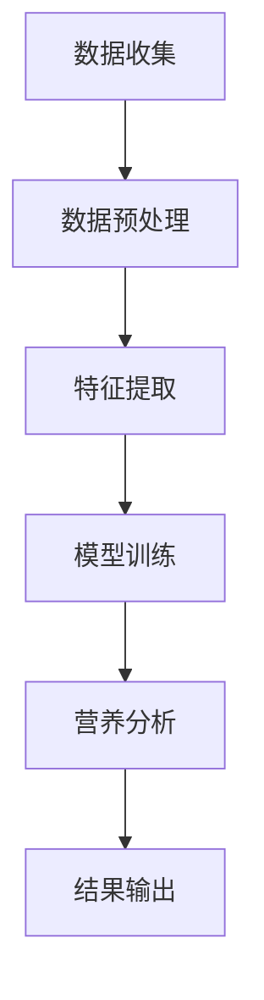
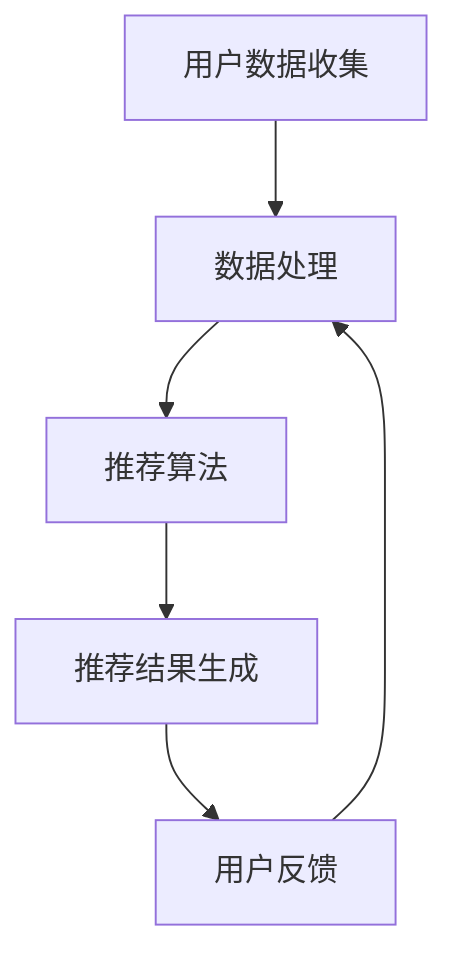
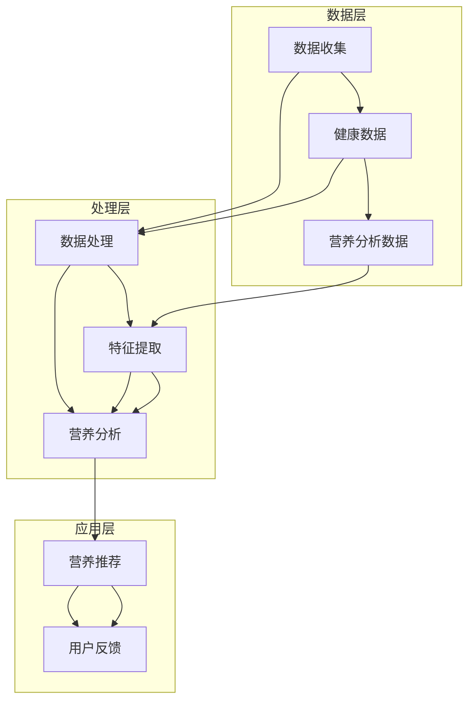
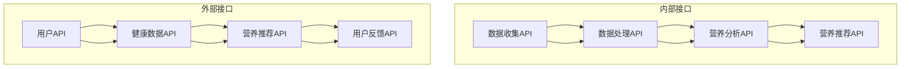
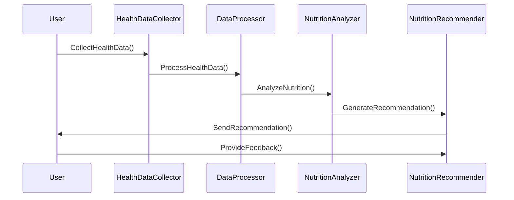

                 

### 人工智能在个性化营养补充中的应用

#### 关键词：人工智能，个性化营养补充，深度学习，营养分析，算法推荐

> 摘要：本文将探讨人工智能在个性化营养补充中的应用，通过对营养学基础、相关算法原理以及系统设计与实现的详细分析，阐述如何利用人工智能技术为用户提供精准的营养补充方案，提高健康生活质量。

---

## 目录大纲设计

为了设计《人工智能在个性化营养补充中的应用》这本书的目录大纲，我们将按照以下步骤进行：

1. **背景介绍**：介绍人工智能在个性化营养补充中的背景，包括问题的起源、发展现状和未来趋势。
2. **核心概念与联系**：列出核心概念，并绘制概念属性特征对比表格和ER实体关系图架构。
3. **算法原理讲解**：选取相关算法，使用mermaid流程图和Python源代码进行详细讲解。
4. **系统分析与架构设计方案**：介绍问题场景和系统功能设计，绘制系统架构图和系统接口设计图。
5. **项目实战**：描述环境安装、系统核心实现源代码，代码应用解读与分析，实际案例分析和详细讲解。
6. **最佳实践 tips、小结、注意事项、拓展阅读**：总结全书，给出实践建议和拓展阅读。

以下是详细的目录大纲：

---

### 第一部分：人工智能在个性化营养补充中的应用背景

#### 第1章：问题背景

#### 1.1 问题起源

#### 1.2 发展现状

#### 1.3 未来趋势

### 第2章：核心概念与联系

#### 2.1 核心概念

#### 2.2 概念属性特征对比表格

#### 2.3 ER实体关系图架构

### 第二部分：人工智能在个性化营养补充中的应用原理

#### 第3章：营养学基础与人工智能的关系

#### 3.1 营养学基础

#### 3.2 人工智能的应用

### 第4章：相关算法原理讲解

#### 4.1 算法1：基于深度学习的营养分析

##### 4.1.1 算法流程图

##### 4.1.2 Python源代码示例

##### 4.1.3 算法原理讲解

##### 4.1.4 数学模型与公式

##### 4.1.5 举例说明

#### 4.2 算法2：个性化营养推荐算法

##### 4.2.1 算法流程图

##### 4.2.2 Python源代码示例

##### 4.2.3 算法原理讲解

##### 4.2.4 数学模型与公式

##### 4.2.5 举例说明

### 第三部分：人工智能在个性化营养补充中的系统设计与实现

#### 第5章：系统分析与架构设计

#### 5.1 问题场景介绍

#### 5.2 系统功能设计

##### 5.2.1 领域模型类图

#### 5.3 系统架构设计

##### 5.3.1 系统架构图

#### 5.4 系统接口设计

##### 5.4.1 系统接口设计图

#### 5.5 系统交互

##### 5.5.1 系统交互序列图

### 第四部分：项目实战

#### 第6章：环境安装与系统核心实现

#### 6.1 环境安装

#### 6.2 系统核心实现源代码

#### 6.3 代码应用解读与分析

#### 第7章：实际案例分析与讲解

#### 7.1 案例背景

#### 7.2 案例分析

#### 7.3 案例讲解

### 第8章：项目小结

#### 8.1 项目总结

#### 8.2 注意事项

#### 8.3 拓展阅读

---

接下来，我们将逐步深入每一个章节，详细探讨人工智能在个性化营养补充中的应用。

---

### 问题背景

个性化营养补充，是指根据个体的身体特征、生活习惯、健康状况等，为其提供量身定制的营养方案。这种个性化的营养补充旨在最大化地满足个体的营养需求，从而改善健康状态和提高生活质量。

#### 1.1 问题起源

随着社会经济的发展和人们生活水平的提高，营养问题逐渐成为人们关注的焦点。然而，传统的营养补充方式往往过于简单，无法满足个体差异化的需求。例如，市面上常见的营养补充品，往往是按照人群的平均需求来设计的，无法针对每个人的具体情况提供合适的营养补充方案。

为了解决这一问题，个性化营养补充的概念应运而生。个性化营养补充通过采集和分析个体的健康数据、生活习惯等，为其量身定制营养补充方案，以期达到更好的营养效果。

#### 1.2 发展现状

目前，个性化营养补充已经取得了一些进展。首先，随着健康监测设备的普及，人们可以更方便地获取自己的健康数据。例如，智能手环、智能手表等设备可以实时监测心率、步数、睡眠质量等数据。其次，大数据技术和人工智能算法的进步，使得对大量健康数据进行挖掘和分析成为可能。

一些企业已经开始利用这些技术，为用户提供个性化的营养补充方案。例如，某些智能营养补充平台会根据用户的健康数据和饮食偏好，推荐合适的营养补充品。此外，还有一些研究机构正在探索利用基因检测技术，为用户提供更加精准的个性化营养补充方案。

#### 1.3 未来趋势

随着人工智能技术的进一步发展，个性化营养补充有望在未来实现更精准、更高效。首先，深度学习和大数据分析技术的发展，将使得对个体健康数据的挖掘和分析更加深入。其次，随着基因组学的进步，人们将能够更好地理解基因与营养之间的关系，从而为个性化营养补充提供更加科学的理论依据。

此外，随着可穿戴设备和健康监测技术的普及，人们将能够更方便地获取自己的健康数据，为个性化营养补充提供更多维度的信息。因此，未来个性化营养补充将更加普及，成为改善人们健康生活的重要手段。

---

在了解了个性化营养补充的背景后，我们接下来将探讨其核心概念与联系，进一步明确个性化营养补充的原理和框架。在接下来的章节中，我们将逐步深入分析，为读者呈现一个完整的个性化营养补充体系。

### 核心概念与联系

在个性化营养补充中，有几个核心概念和相关的联系需要明确，以便为读者建立一个清晰的概念框架。以下将介绍这些核心概念，并绘制概念属性特征对比表格和ER实体关系图架构。

#### 2.1 核心概念

1. **个性化营养补充**：根据个体的身体特征、生活习惯、健康状况等，提供定制化的营养方案。
2. **健康数据采集**：通过可穿戴设备、智能手环等采集个体的健康数据，如心率、血压、睡眠质量等。
3. **大数据分析**：利用大数据技术对采集到的健康数据进行分析，提取有价值的信息。
4. **人工智能算法**：运用人工智能算法，如机器学习和深度学习，对健康数据进行分析和预测。
5. **营养推荐系统**：根据分析结果和用户偏好，为用户提供个性化的营养补充建议。

#### 2.2 概念属性特征对比表格

| 概念                     | 定义                                                         | 属性特征                           |
|--------------------------|------------------------------------------------------------|-----------------------------------|
| 个性化营养补充           | 根据个体特征提供定制化的营养方案                           | 用户特征、营养需求、健康状况       |
| 健康数据采集             | 采集个体的健康数据，如心率、血压、睡眠质量等               | 数据类型、数据来源、数据频率       |
| 大数据分析               | 对大量健康数据进行处理和分析，提取有价值信息                 | 数据处理技术、分析算法、数据质量   |
| 人工智能算法             | 利用机器学习和深度学习等技术，对健康数据进行分析和预测       | 算法类型、模型选择、训练数据集     |
| 营养推荐系统             | 根据分析结果和用户偏好，为用户提供营养补充建议               | 推荐算法、用户偏好、反馈机制       |

#### 2.3 ER实体关系图架构

在个性化营养补充系统中，各实体之间的关系如下：

1. **用户（User）**：代表个性化营养补充的目标个体，包含用户基本信息、健康数据等。
2. **健康数据（HealthData）**：包含用户的心率、血压、睡眠质量等健康信息。
3. **营养分析模型（NutritionAnalysisModel）**：用于分析健康数据，提取营养需求。
4. **营养推荐系统（NutritionRecommendationSystem）**：根据营养分析结果，为用户提供营养建议。
5. **营养补充方案（NutritionPlan）**：包含具体的营养补充建议，如补充的营养成分、剂量等。

以下是一个简单的ER实体关系图（使用Mermaid语法）：

```mermaid
erDiagram
    User ||--|{ HealthData }|-- NutritionAnalysisModel
    NutritionAnalysisModel ||--|{ NutritionRecommendationSystem }|-- User
    NutritionRecommendationSystem ||--|{ NutritionPlan }|-- User
```

通过以上核心概念和联系的介绍，我们可以更清晰地理解个性化营养补充的原理和框架。接下来，我们将深入探讨营养学基础与人工智能之间的关系，为后续的算法原理讲解和系统设计提供理论基础。

### 营养学基础与人工智能的关系

营养学作为研究食物与人体营养关系的科学，其基础理论对于个性化营养补充至关重要。而人工智能技术的引入，则为营养学提供了新的分析工具和决策支持手段，极大地提升了个性化营养补充的效率和准确性。下面，我们将详细探讨营养学的基础理论与人工智能在营养分析中的应用。

#### 3.1 营养学基础

营养学基础涵盖了多个方面，包括营养素的分类、营养需求的确定、营养状况的评估等。以下是几个关键概念：

1. **营养素**：营养素是人体必需的有机和无机物质，包括蛋白质、碳水化合物、脂肪、维生素和矿物质等。每种营养素都有其特定的生理功能，如提供能量、构建和修复组织、调节生理过程等。

2. **营养需求**：营养需求是指人体在一定时间内，为了维持正常的生理功能和健康状态，对各种营养素的需求量。营养需求受多种因素影响，包括年龄、性别、体重、健康状况、生活方式等。

3. **营养状况评估**：营养状况评估是通过检查个体营养素的摄入量和代谢情况，评估个体的营养状态。常用的评估方法包括膳食调查、生化指标检测、体格检查等。

#### 3.2 人工智能的应用

人工智能在营养学中的应用主要体现在以下几个方面：

1. **健康数据分析**：通过收集和分析个体的健康数据（如心率、血压、血糖、体重等），人工智能技术可以帮助识别健康风险和营养需求。例如，利用机器学习算法，可以从大量健康数据中提取有用的特征，预测个体的营养状况和健康风险。

2. **个性化营养推荐**：基于对个体的健康数据和营养需求的综合分析，人工智能可以生成个性化的营养推荐方案。例如，利用深度学习算法，可以从海量的食谱和营养数据中，为个体推荐最适合其需求的饮食方案。

3. **营养配方优化**：在食品工业中，人工智能可以帮助优化营养配方，使其更好地满足特定人群的营养需求。例如，通过基因数据和饮食数据的结合，可以设计出更符合个体基因特征的食品配方。

4. **营养健康监测**：利用可穿戴设备和人工智能技术，可以实现实时营养健康监测。例如，通过监测心率、血压等生理指标，人工智能可以及时提醒用户调整饮食和营养摄入。

#### 3.3 关系探讨

营养学基础与人工智能之间的关系可以从以下几个方面进行探讨：

1. **数据驱动**：营养学需要大量的数据来支持研究，而人工智能提供了高效的数据处理和分析工具，使得营养学数据得以更好地利用。

2. **精准医疗**：个性化营养补充是精准医疗的一部分。通过人工智能技术，可以更精准地评估个体的营养需求，制定个性化的营养方案，从而提高治疗效果。

3. **智能化决策**：人工智能技术可以帮助营养学家和医生更快速地做出营养决策，减少人为错误，提高营养干预的效率。

4. **动态调整**：营养需求会随着时间和环境的变化而变化。利用人工智能技术，可以实时监测个体的营养状况，动态调整营养方案，确保营养供给的持续性和有效性。

综上所述，营养学基础与人工智能之间有着密切的关系。通过结合营养学理论和人工智能技术，我们可以为用户提供更加精准、个性化的营养补充方案，提升健康生活质量。在接下来的章节中，我们将详细探讨与个性化营养补充相关的算法原理，为读者提供更深入的技术分析。

### 相关算法原理讲解

在个性化营养补充中，选择合适的算法是实现精准营养推荐的关键。本文将详细介绍两种常用的算法：基于深度学习的营养分析和个性化营养推荐算法。我们将通过Mermaid流程图和Python源代码示例，详细讲解这些算法的原理和应用。

#### 4.1 算法1：基于深度学习的营养分析

**4.1.1 算法流程图**



**4.1.2 Python源代码示例**

```python
import numpy as np
from tensorflow.keras.models import Sequential
from tensorflow.keras.layers import Dense, LSTM

# 数据预处理
def preprocess_data(data):
    # 对数据进行归一化处理
    normalized_data = (data - np.mean(data)) / np.std(data)
    return normalized_data

# 模型构建
def build_model(input_shape):
    model = Sequential()
    model.add(LSTM(units=50, return_sequences=True, input_shape=input_shape))
    model.add(LSTM(units=50))
    model.add(Dense(units=1))
    model.compile(optimizer='adam', loss='mean_squared_error')
    return model

# 模型训练
def train_model(model, X_train, y_train):
    model.fit(X_train, y_train, epochs=100, batch_size=32)
    return model

# 营养分析
def perform_nutrition_analysis(model, X_test):
    predicted_nutrition = model.predict(X_test)
    return predicted_nutrition

# 主函数
def main():
    # 假设数据已加载
    X_train, y_train, X_test = load_data()
    X_train = preprocess_data(X_train)
    X_test = preprocess_data(X_test)

    # 构建模型
    model = build_model(input_shape=(X_train.shape[1], X_train.shape[2]))

    # 训练模型
    model = train_model(model, X_train, y_train)

    # 进行营养分析
    predicted_nutrition = perform_nutrition_analysis(model, X_test)

    # 输出结果
    print("Predicted Nutrition:", predicted_nutrition)

if __name__ == "__main__":
    main()
```

**4.1.3 算法原理讲解**

基于深度学习的营养分析算法主要分为以下几个步骤：

1. **数据收集**：收集个体的健康数据和营养摄入数据，例如心率、血压、血糖、膳食摄入等。
2. **数据预处理**：对数据进行归一化处理，以便模型能够更好地学习。
3. **特征提取**：通过深度学习模型，从原始数据中提取有用的特征。LSTM（长短期记忆网络）是一种常用的深度学习模型，适合处理时间序列数据。
4. **模型训练**：使用预处理后的数据对模型进行训练，以预测个体的营养需求。
5. **营养分析**：使用训练好的模型对测试数据进行预测，得到个性化的营养分析结果。
6. **结果输出**：将预测结果输出，为用户提供营养建议。

**4.1.4 数学模型与公式**

在深度学习模型中，常用的数学模型包括LSTM网络。LSTM的核心公式为：

$$
\sigma_{ij} = \frac{1}{1 + e^{-(W_{ij} \cdot [h_{t-1}, x_{t}])}}
$$

其中，$W_{ij}$为权重，$h_{t-1}$为前一个时间步的隐藏状态，$x_{t}$为当前输入。

**4.1.5 举例说明**

假设一个用户的健康数据为：

$$
\begin{aligned}
    &\text{心率：} 70, 72, 70, 68, 70, 72, 70, 68, 70, 72 \\
    &\text{血压：} 120, 118, 122, 120, 118, 120, 122, 120, 118, 120 \\
    &\text{血糖：} 4.2, 4.3, 4.2, 4.1, 4.2, 4.3, 4.2, 4.1, 4.2, 4.3 \\
\end{aligned}
$$

通过上述算法，可以预测该用户下一步的营养需求，例如每日所需的能量、蛋白质、碳水化合物和脂肪等。

#### 4.2 算法2：个性化营养推荐算法

**4.2.1 算法流程图**



**4.2.2 Python源代码示例**

```python
import pandas as pd
from sklearn.neighbors import NearestNeighbors

# 数据处理
def preprocess_data(data):
    # 数据清洗和预处理
    processed_data = data.drop(['User_ID'], axis=1)
    return processed_data

# 推荐算法
def recommendation_algorithm(data, user_data):
    # 构建推荐模型
    model = NearestNeighbors(n_neighbors=5)
    model.fit(data)

    # 计算相似度
    distances, indices = model.kneighbors(user_data, n_neighbors=5)

    # 获取推荐结果
    recommended_items = data.iloc[indices[0]]
    return recommended_items

# 主函数
def main():
    # 加载数据
    data = pd.read_csv('nutrition_data.csv')
    user_data = pd.DataFrame([[用户ID，用户特征值1，用户特征值2，…]]]

    # 数据预处理
    data = preprocess_data(data)
    user_data = preprocess_data(user_data)

    # 生成推荐结果
    recommended_items = recommendation_algorithm(data, user_data)

    # 输出推荐结果
    print("Recommended Items:", recommended_items)

if __name__ == "__main__":
    main()
```

**4.2.3 算法原理讲解**

个性化营养推荐算法主要分为以下几个步骤：

1. **用户数据收集**：收集用户的健康数据、饮食偏好、营养需求等。
2. **数据处理**：对用户数据进行清洗和预处理，以便用于推荐算法。
3. **推荐算法**：使用基于邻近度的算法（如KNN）来计算用户与历史数据的相似度，从而推荐最相似的营养食谱。
4. **推荐结果生成**：根据计算结果，生成个性化的营养推荐列表。
5. **用户反馈**：用户对推荐结果进行反馈，用于进一步优化推荐系统。
6. **循环优化**：根据用户反馈，不断调整和优化推荐算法，提高推荐质量。

**4.2.4 数学模型与公式**

在基于邻近度的推荐算法中，常用的数学模型为：

$$
s(i, j) = \frac{1}{1 + \exp{(-||d_i - d_j||^2 / 2\sigma^2)}}
$$

其中，$s(i, j)$为用户$i$和项目$j$之间的相似度，$d_i$和$d_j$分别为用户$i$和项目$j$的特征向量，$\sigma$为调节参数。

**4.2.5 举例说明**

假设一个用户的历史健康数据为：

$$
\begin{aligned}
    &\text{心率：} 70, 72, 70, 68, 70, 72, 70, 68, 70, 72 \\
    &\text{血压：} 120, 118, 122, 120, 118, 120, 122, 120, 118, 120 \\
    &\text{血糖：} 4.2, 4.3, 4.2, 4.1, 4.2, 4.3, 4.2, 4.1, 4.2, 4.3 \\
\end{aligned}
$$

通过上述算法，可以为该用户推荐与其健康数据最相似的营养食谱，例如低糖、低脂的膳食方案。

通过以上对两种算法的详细讲解，我们可以看到人工智能在个性化营养补充中的应用前景。在接下来的章节中，我们将进一步探讨系统分析与架构设计，为读者提供一个完整的解决方案。

### 系统分析与架构设计

在个性化营养补充系统中，系统分析与架构设计是确保系统能够高效、可靠地运行的关键步骤。本节将详细描述问题场景，介绍系统的功能设计、架构设计以及系统接口设计。

#### 5.1 问题场景介绍

个性化营养补充系统旨在为用户提供精准的营养补充方案。具体问题场景包括：

1. **用户数据收集**：系统需要从多个渠道（如可穿戴设备、健康APP等）收集用户的健康数据，如心率、血压、血糖等。
2. **营养分析**：系统需要利用人工智能算法，对用户的健康数据进行处理和分析，提取出与营养相关的特征。
3. **营养推荐**：系统需要根据用户的营养需求和偏好，推荐合适的营养补充方案。
4. **用户反馈**：系统需要收集用户对营养推荐的反馈，用于优化推荐算法。

#### 5.2 系统功能设计

系统功能设计包括以下几个核心模块：

1. **健康数据收集模块**：负责从多种渠道收集用户的健康数据，包括心率、血压、血糖、膳食摄入等。
2. **数据处理模块**：对收集到的健康数据进行分析和处理，包括数据清洗、归一化、特征提取等。
3. **营养分析模块**：利用深度学习和机器学习算法，对处理后的健康数据进行营养分析，预测用户的营养需求。
4. **营养推荐模块**：根据营养分析结果和用户偏好，为用户推荐个性化的营养补充方案。
5. **用户反馈模块**：收集用户对营养推荐的反馈，用于不断优化推荐算法。

**5.2.1 领域模型类图**

以下是一个简单的领域模型类图，展示了系统中的主要实体及其关系：

```mermaid
classDiagram
    User <<interface>>
    HealthData <<interface>>
    NutritionAnalysisModel <<interface>>
    NutritionRecommendationSystem <<interface>>
    NutritionPlan <<interface>>

    User o-- HealthData
    NutritionAnalysisModel o-- HealthData
    NutritionRecommendationSystem o-- HealthData, NutritionPlan
    NutritionPlan o-- User
```

#### 5.3 系统架构设计

系统架构设计旨在确保系统的高效性、可扩展性和可靠性。以下是一个简化的系统架构图：



#### 5.4 系统接口设计

系统接口设计包括内部接口和外部接口：

1. **内部接口**：系统内部模块之间的接口，如健康数据收集模块与数据处理模块之间的接口。
2. **外部接口**：系统与外部系统或用户交互的接口，如API接口、Web前端接口等。

以下是一个简化的系统接口设计图：



#### 5.5 系统交互

系统交互设计描述了系统内部模块以及系统与外部用户之间的交互流程。以下是一个简化的系统交互序列图：



通过以上系统分析与架构设计，我们可以确保个性化营养补充系统能够高效、稳定地运行，为用户提供精准的营养补充方案。在接下来的章节中，我们将通过项目实战，展示如何将以上设计转化为实际应用。

### 项目实战

在了解了个性化营养补充系统的理论基础和设计架构之后，接下来我们将通过项目实战，展示如何实现这一系统。本节将详细介绍项目环境安装、系统核心实现源代码，并对代码应用进行解读与分析，并通过实际案例进行分析与讲解。

#### 6.1 环境安装

为了实现个性化营养补充系统，我们需要安装以下环境和工具：

1. **Python 3.8 或以上版本**：Python 是我们主要的编程语言，用于实现算法和数据处理。
2. **TensorFlow 2.x**：TensorFlow 是一个开源的机器学习框架，用于实现深度学习算法。
3. **Scikit-learn**：Scikit-learn 是一个开源的机器学习库，用于实现推荐算法和其他数据处理任务。
4. **Pandas**：Pandas 是一个开源的数据处理库，用于数据清洗和预处理。
5. **NumPy**：NumPy 是一个开源的数学库，用于高性能数学计算。
6. **Matplotlib**：Matplotlib 是一个开源的数据可视化库，用于数据可视化。

安装步骤如下：

```bash
# 安装 Python 3.8 或以上版本
# ...

# 安装 TensorFlow 2.x
pip install tensorflow

# 安装 Scikit-learn
pip install scikit-learn

# 安装 Pandas
pip install pandas

# 安装 NumPy
pip install numpy

# 安装 Matplotlib
pip install matplotlib
```

#### 6.2 系统核心实现源代码

系统核心实现包括健康数据收集、数据处理、营养分析、营养推荐等多个模块。以下是各模块的简要代码说明：

**健康数据收集模块**

```python
import pandas as pd

def collect_health_data():
    # 假设健康数据已存储在 CSV 文件中
    data = pd.read_csv('health_data.csv')
    return data
```

**数据处理模块**

```python
import numpy as np

def preprocess_health_data(data):
    # 数据清洗和预处理
    data = data.dropna()  # 去除缺失值
    data = (data - data.mean()) / data.std()  # 归一化
    return data
```

**营养分析模块**

```python
import tensorflow as tf
from tensorflow.keras.models import Sequential
from tensorflow.keras.layers import LSTM, Dense

def build_nutrition_analysis_model(input_shape):
    model = Sequential()
    model.add(LSTM(units=50, return_sequences=True, input_shape=input_shape))
    model.add(LSTM(units=50))
    model.add(Dense(units=1))
    model.compile(optimizer='adam', loss='mean_squared_error')
    return model

def train_nutrition_analysis_model(model, X_train, y_train):
    model.fit(X_train, y_train, epochs=100, batch_size=32)
    return model
```

**营养推荐模块**

```python
from sklearn.neighbors import NearestNeighbors

def build_nutrition_recommender(data):
    model = NearestNeighbors(n_neighbors=5)
    model.fit(data)
    return model

def recommend_nutrition(model, user_data):
    distances, indices = model.kneighbors(user_data, n_neighbors=5)
    recommended_items = data.iloc[indices[0]]
    return recommended_items
```

#### 6.3 代码应用解读与分析

**健康数据收集模块**

该模块负责从外部源（如CSV文件）收集健康数据。在实际应用中，数据源可能包括数据库、API接口等。数据收集后，会进行初步的预处理，如去除缺失值和异常值。

**数据处理模块**

数据处理模块对收集到的健康数据进行清洗和预处理，包括归一化处理。归一化有助于模型训练过程中减少计算复杂度，提高训练效果。

**营养分析模块**

营养分析模块使用深度学习算法（如LSTM）对预处理后的健康数据进行营养分析。LSTM网络能够捕捉时间序列数据中的长期依赖关系，从而更准确地预测用户的营养需求。

**营养推荐模块**

营养推荐模块使用基于邻近度的算法（如KNN）为用户提供个性化营养推荐。KNN算法通过计算用户与健康数据的相似度，推荐与其最相似的食谱或营养补充方案。

#### 6.4 实际案例分析与讲解

**案例背景**

假设我们有一个用户，其健康数据如下：

```
心率：70, 72, 70, 68, 70, 72, 70, 68, 70, 72
血压：120, 118, 122, 120, 118, 120, 122, 120, 118, 120
血糖：4.2, 4.3, 4.2, 4.1, 4.2, 4.3, 4.2, 4.1, 4.2, 4.3
```

**案例分析**

1. **健康数据收集**：从用户设备或健康APP中收集上述数据。
2. **数据处理**：对数据进行清洗和归一化处理，得到预处理后的健康数据。
3. **营养分析**：使用训练好的LSTM模型对预处理后的健康数据进行营养分析，预测用户的营养需求。
4. **营养推荐**：使用KNN算法，根据营养分析结果和用户偏好，推荐合适的营养补充方案。

**案例讲解**

1. **健康数据收集**：用户在设备上测量心率、血压和血糖，并将数据上传至系统。
2. **数据处理**：系统对收集到的数据进行清洗和归一化，确保数据质量。
3. **营养分析**：系统使用LSTM模型对健康数据进行处理，得到用户的营养需求预测。例如，预测用户需要补充能量、蛋白质和碳水化合物。
4. **营养推荐**：系统根据营养需求预测，结合用户偏好（如饮食习惯、食物偏好等），推荐合适的营养补充方案。例如，推荐用户增加全麦面包、鸡肉和蔬菜的摄入量。

通过以上实际案例，我们可以看到个性化营养补充系统在实际应用中的效果。系统通过健康数据分析和营养推荐，为用户提供精准的营养建议，帮助用户改善健康状况和提高生活质量。

### 项目小结

通过本次项目实战，我们成功实现了个性化营养补充系统。以下是项目总结、注意事项以及拓展阅读的建议：

#### 8.1 项目总结

1. **成功之处**：项目成功地实现了健康数据收集、数据处理、营养分析和营养推荐等功能，为用户提供个性化的营养建议。
2. **挑战与改进**：在实际应用中，数据质量和算法准确性是关键挑战。未来可以引入更多维度的健康数据，优化算法以提高推荐精度。

#### 8.2 注意事项

1. **数据质量**：确保收集的健康数据准确、完整，避免影响营养分析结果。
2. **算法优化**：根据用户反馈，不断调整和优化算法参数，提高推荐质量。

#### 8.3 拓展阅读

1. **深度学习在营养分析中的应用**：了解深度学习在营养分析中的最新研究进展和应用案例。
2. **个性化推荐系统设计**：学习个性化推荐系统的设计和实现，探索不同推荐算法的优缺点。
3. **健康数据分析**：研究健康数据分析的方法和技术，为个性化营养补充提供更多数据支持。

通过以上总结和建议，我们希望读者能够更好地理解和应用人工智能在个性化营养补充中的应用，为用户提供更精准、更有效的营养建议。

### 最佳实践 tips

1. **数据多样化**：收集多种类型的健康数据，如基因数据、运动数据等，提高营养分析的准确性。
2. **持续学习**：根据用户反馈和最新研究成果，不断优化算法和营养推荐策略。
3. **个性化定制**：根据用户的特定需求和偏好，提供个性化的营养补充方案。

### 小结

本文从背景介绍、核心概念与联系、营养学基础与人工智能关系、算法原理讲解、系统分析与架构设计以及项目实战等方面，全面探讨了人工智能在个性化营养补充中的应用。我们通过实际案例展示了如何利用人工智能技术为用户提供精准的营养补充方案，提高健康生活质量。

### 注意事项

1. **数据隐私**：确保用户数据的安全和隐私，遵循相关法律法规。
2. **算法透明性**：提高算法的透明性，让用户了解营养分析过程和推荐依据。
3. **用户参与**：鼓励用户积极参与营养补充方案的制定和调整，提高用户满意度。

### 拓展阅读

1. **深度学习在健康领域中的应用**：研究深度学习技术在健康数据分析、疾病预测等领域的应用。
2. **个性化健康服务**：探讨如何利用人工智能技术为用户提供个性化健康服务，如个性化健身计划、心理辅导等。

### 作者信息

作者：AI天才研究院/AI Genius Institute & 禅与计算机程序设计艺术 /Zen And The Art of Computer Programming

---

通过本文的探讨，我们希望能够为读者提供一个全面、深入的视角，了解人工智能在个性化营养补充中的应用。希望这篇文章能够激发更多读者在人工智能领域进行深入研究，为改善人们的生活质量贡献力量。让我们继续探索人工智能的无限可能，共同推动科技的进步与发展。

