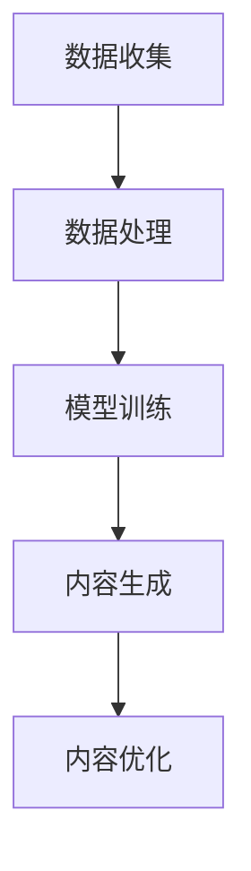
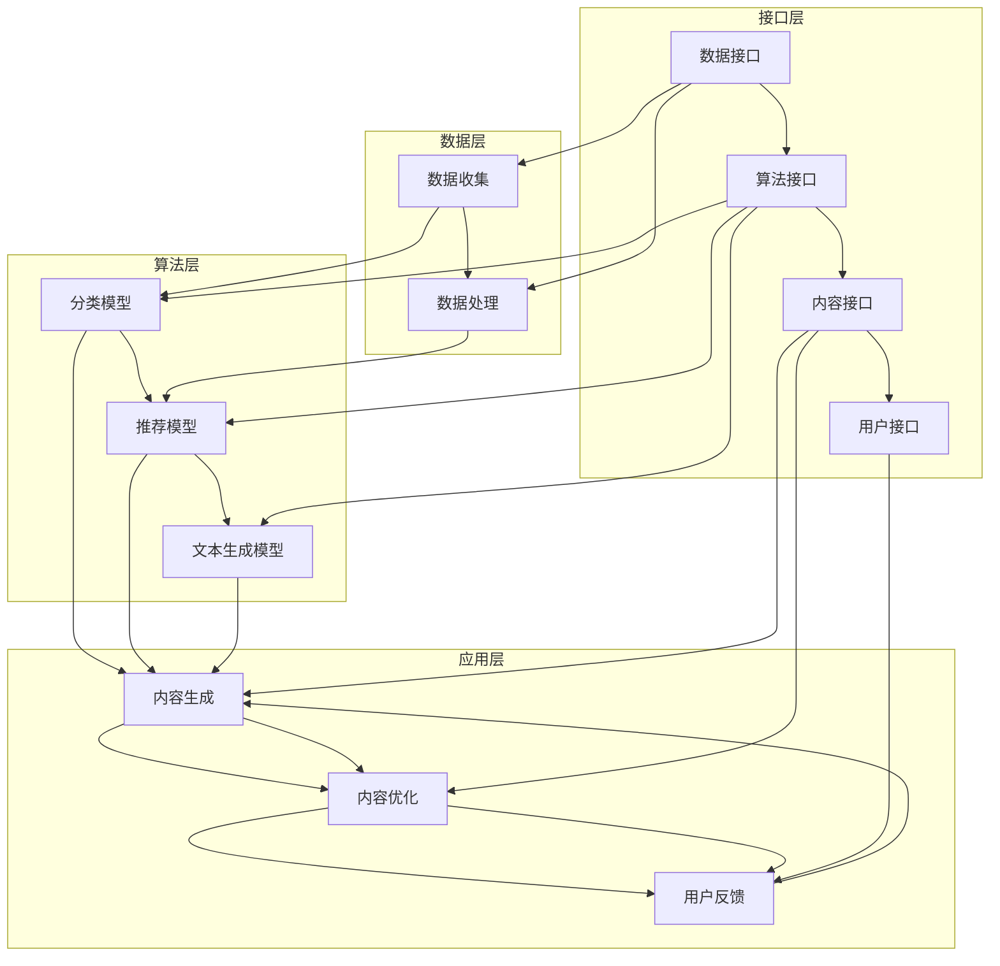

                 

### 文章标题：人工智能在个性化营销内容生成中的应用

> 关键词：人工智能、个性化营销、内容生成、算法原理、系统架构、实战分析

> 摘要：本文将深入探讨人工智能在个性化营销内容生成中的应用。首先，我们将介绍人工智能和个性化营销的基本概念，分析其在现代营销中的重要地位。接着，我们将讨论内容生成的挑战，并介绍几种主流的人工智能技术如何应对这些挑战。随后，文章将重点讲解算法原理和数学模型，并通过实际项目案例进行分析，最后总结最佳实践和注意事项，为读者提供进一步学习的拓展资源。

### 目录大纲

1. **背景介绍**
   - **第1章 人工智能概述**
     - 1.1 人工智能的发展历程
     - 1.2 人工智能的核心技术
     - 1.3 人工智能在各行业中的应用
   - **第2章 个性化营销的概念与挑战**
     - 2.1 个性化营销的定义
     - 2.2 个性化营销的挑战
     - 2.3 个性化营销的重要性
   - **第3章 人工智能在个性化营销中的应用**
     - 3.1 人工智能技术助力个性化营销
     - 3.2 个性化推荐系统
     - 3.3 客户行为分析

2. **核心概念与联系**
   - **第4章 内容生成的核心概念**
     - 4.1 内容生成的定义
     - 4.2 内容生成的挑战
     - 4.3 内容生成的技术手段
   - **第5章 人工智能在内容生成中的应用**
     - 5.1 人工智能技术在内容生成中的优势
     - 5.2 自动化内容生成系统
     - 5.3 个性化内容的创作

3. **算法原理讲解**
   - **第6章 个性化营销内容生成的算法原理**
     - 6.1 算法原理概述
     - 6.2 算法流程图
     - 6.3 算法实现与数学模型

4. **数学模型和数学公式**
   - **第7章 数学模型与公式讲解**
     - 7.1 数学模型概述
     - 7.2 公式讲解
     - 7.3 举例说明

5. **系统分析与架构设计方案**
   - **第8章 系统分析与架构设计**
     - 8.1 问题场景介绍
     - 8.2 系统功能设计
     - 8.3 系统架构设计
     - 8.4 系统接口设计与交互

6. **项目实战**
   - **第9章 项目实战**
     - 9.1 环境安装
     - 9.2 系统核心实现
     - 9.3 代码应用解读与分析
     - 9.4 实际案例分析与讲解

7. **最佳实践 tips、小结、注意事项、拓展阅读**
   - **第10章 最佳实践与注意事项**
     - 10.1 最佳实践 tips
     - 10.2 小结
     - 10.3 注意事项
     - 10.4 拓展阅读

### 1. 背景介绍

#### 1.1 人工智能概述

人工智能（Artificial Intelligence，AI）是计算机科学的一个分支，旨在使机器具备人类智能。自20世纪50年代起，人工智能领域经历了多个发展阶段，从初期的逻辑推理，到近几年的深度学习和自然语言处理，人工智能技术取得了长足的进步。当前，人工智能已在多个行业产生了深远影响，如医疗、金融、制造和娱乐等。

**发展历程：**
- **1956年：**约翰·麦卡锡等人提出人工智能概念，标志着人工智能学科的诞生。
- **1970-1980年代：**逻辑推理和专家系统成为人工智能研究的主要方向。
- **1980年代：**人工智能受到质疑和低迷期，直到深度学习的崛起。
- **2010年代至今：**人工智能技术迅速发展，深度学习、自然语言处理和计算机视觉等取得突破性成果。

**核心技术：**
- **深度学习：**一种基于多层神经网络的学习方法，能够通过大量数据训练出具有高度抽象能力的模型。
- **自然语言处理：**使计算机理解和生成人类语言的能力，包括语音识别、机器翻译、情感分析等。
- **计算机视觉：**让计算机具备对图像和视频的理解能力，如物体识别、图像分割、人脸检测等。

**应用领域：**
- **医疗：**辅助诊断、预测疾病趋势、个性化治疗等。
- **金融：**风险控制、信用评估、智能投顾等。
- **制造：**自动化生产线、智能机器人、质量检测等。
- **娱乐：**游戏AI、智能推荐系统、虚拟助手等。

#### 1.2 个性化营销的概念与挑战

个性化营销（Personalized Marketing）是一种根据消费者的行为、兴趣和需求来定制营销内容和策略的方法。它旨在提高营销效果，增加客户满意度和忠诚度。随着互联网和大数据技术的发展，个性化营销逐渐成为现代营销的重要组成部分。

**定义：**
个性化营销是指利用消费者数据，通过分析其行为和偏好，为每个客户提供定制化的营销内容和信息，以满足其独特的需求。

**挑战：**
- **数据隐私与安全：**收集和使用消费者数据需要遵守严格的隐私保护法规，如GDPR。
- **数据质量与一致性：**数据质量直接影响个性化营销的效果，而数据的来源多样，容易产生不一致性。
- **技术实现难度：**构建高效、可扩展的个性化推荐系统和客户行为分析模型需要大量技术和资源投入。
- **个性化内容创作：**创建高质量的个性化内容需要大量时间和人力资源。

**重要性：**
- **提升客户满意度：**通过提供个性化的内容和体验，可以更好地满足消费者的需求，提高满意度。
- **增加转化率：**个性化的营销内容和推荐可以提高转化率，从而提高销售额。
- **提高品牌忠诚度：**持续提供个性化的内容和体验可以增强客户对品牌的忠诚度。

#### 1.3 人工智能在个性化营销中的应用

人工智能技术为个性化营销带来了新的机遇和挑战。通过分析大量的消费者数据，人工智能可以帮助企业更好地了解客户需求，提供个性化的推荐和内容。

**应用场景：**
- **个性化推荐系统：**通过分析用户的历史行为和偏好，推荐符合其兴趣的产品或内容。
- **客户行为分析：**利用机器学习算法，分析客户的行为模式，预测其未来的行为和需求。
- **内容创作：**使用自然语言处理和生成对抗网络（GAN）等技术，自动化生成个性化内容。

**优势：**
- **高效性：**人工智能可以快速处理和分析大量数据，提供即时的个性化推荐和内容。
- **准确性：**通过机器学习算法，可以更准确地预测客户的需求和行为。
- **可扩展性：**人工智能系统可以根据企业的需求进行扩展和优化，适应不同的市场和业务场景。

### 2. 核心概念与联系

#### 2.1 内容生成的核心概念

内容生成（Content Generation）是指通过技术手段自动化创建或修改内容的过程。在个性化营销中，内容生成是一个关键环节，它涉及到如何根据用户的特点和需求，动态生成个性化的营销素材。

**定义：**
内容生成是指利用算法和技术手段，根据用户数据或预设模板，自动生成文本、图像、视频等多媒体内容。

**挑战：**
- **创造力限制：**算法在生成内容时，可能会受到其训练数据的限制，难以突破创造性。
- **内容质量：**生成的内容需要确保具有高质量和相关性，以满足用户需求。
- **用户体验：**自动化生成的内容需要保持与人类创作内容相似的用户体验。

**技术手段：**
- **文本生成：**利用自然语言处理（NLP）技术，如生成对抗网络（GAN）、递归神经网络（RNN）等。
- **图像生成：**利用计算机视觉技术，如卷积神经网络（CNN）和生成对抗网络（GAN）。
- **视频生成：**通过视频合成技术，结合图像生成和音频处理技术，生成视频内容。

#### 2.2 人工智能在内容生成中的应用

人工智能技术在内容生成中具有显著优势，可以显著提高内容生成的效率和质量。

**优势：**
- **自动化：**人工智能技术可以自动化内容生成过程，减少人工干预。
- **高效性：**通过算法优化，可以快速生成大量内容。
- **个性化：**根据用户数据，生成符合用户个性化需求的内容。

**应用场景：**
- **新闻生成：**自动化撰写新闻文章，如机器人新闻。
- **广告文案：**根据用户行为和偏好，自动生成广告文案。
- **社交媒体内容：**根据用户兴趣，自动生成社交媒体帖子。

#### 2.3 概念之间的联系

人工智能、个性化营销和内容生成之间有着密切的联系。

- **人工智能：**为个性化营销和内容生成提供了技术支持，如自然语言处理、计算机视觉和机器学习等。
- **个性化营销：**是内容生成的重要应用场景，通过内容生成技术，实现个性化营销。
- **内容生成：**是实现个性化营销的核心手段，通过人工智能技术，提高内容生成的效率和准确性。

### 3. 算法原理讲解

#### 3.1 算法原理概述

个性化营销内容生成算法的核心目标是根据用户数据生成符合其个性化需求的内容。以下是一个典型的算法流程：

1. **数据收集：**收集用户行为数据、偏好数据和内容数据。
2. **数据处理：**对收集到的数据进行清洗、去重和特征提取。
3. **模型训练：**使用机器学习算法训练分类模型、推荐模型和文本生成模型。
4. **内容生成：**根据用户数据和模型预测，生成个性化内容。
5. **内容优化：**通过用户反馈，对生成的内容进行优化和调整。

#### 3.2 算法流程图



#### 3.3 算法实现与数学模型

**数据收集：**数据收集阶段主要包括用户行为数据、偏好数据和内容数据。用户行为数据包括浏览记录、购买记录、搜索历史等；偏好数据包括用户年龄、性别、职业等；内容数据包括文本、图像、视频等。

**数据处理：**数据处理阶段涉及数据清洗、去重和特征提取。数据清洗旨在去除无效和错误数据；去重是为了避免重复计算；特征提取是将原始数据转化为算法可以处理的特征向量。

**模型训练：**模型训练阶段使用机器学习算法，如分类算法（如SVM、决策树）和推荐算法（如协同过滤、矩阵分解）。以下是一个简化的文本生成模型实现：

```python
from sklearn.feature_extraction.text import TfidfVectorizer
from sklearn.metrics.pairwise import cosine_similarity

# 假设文档集合为documents
vectorizer = TfidfVectorizer()
tfidf_matrix = vectorizer.fit_transform(documents)

# 查询文档
query = "个性化营销内容生成"

# 转换查询文档为特征向量
query_vector = vectorizer.transform([query])

# 计算相似度
similarity = cosine_similarity(query_vector, tfidf_matrix)

# 获取相似度最高的文档
top_documents = documents[similarity.argsort()[0]][-10:]
```

**内容生成：**根据用户数据和模型预测，生成个性化内容。假设用户对某些类型的内容感兴趣，算法可以生成类似的内容。

**内容优化：**通过用户反馈，对生成的内容进行优化和调整。例如，如果用户对生成的内容不满意，算法可以尝试调整模型参数或重新生成内容。

### 4. 数学模型和数学公式

在个性化营销内容生成的算法中，数学模型和数学公式起着至关重要的作用。以下是一些常用的数学模型和公式。

#### 4.1 数学模型概述

**协同过滤（Collaborative Filtering）：**
- **用户基于模型：**利用用户的历史行为数据，预测用户对未知商品的偏好。
- **物品基于模型：**利用物品的特征和用户的历史行为数据，预测用户对物品的偏好。

**内容生成（Content Generation）：**
- **生成对抗网络（GAN）：**由生成器和判别器组成，生成器生成数据，判别器判断数据是否真实，通过对抗训练生成高质量的数据。

#### 4.2 公式讲解

**协同过滤（Collaborative Filtering）：**
- **用户基于模型：**
  $$\hat{r}_{ui} = \frac{\sum_{j \in \text{item set of } u} r_{uj} \cdot s_{ij}}{\sum_{j \in \text{item set of } u} s_{ij}}$$
  其中，$\hat{r}_{ui}$表示用户$u$对物品$i$的预测评分，$r_{uj}$表示用户$u$对物品$j$的实际评分，$s_{ij}$表示物品$i$和物品$j$之间的相似度。

- **物品基于模型：**
  $$\hat{r}_{ui} = \frac{\sum_{j \in \text{user set of } i} r_{uj} \cdot s_{ij}}{\sum_{j \in \text{user set of } i} s_{ij}}$$
  其中，$\hat{r}_{ui}$表示用户$u$对物品$i$的预测评分，$r_{uj}$表示用户$u$对物品$j$的实际评分，$s_{ij}$表示用户$u$和用户$v$之间的相似度。

**内容生成（GAN）：**
- **生成器：**
  $$G(z) = \sum_{i=1}^{D} w_{i} \cdot z_i + b_i$$
  其中，$G(z)$表示生成器输出，$z$是随机噪声，$w_i$和$b_i$是生成器的权重和偏置。

- **判别器：**
  $$D(x) = \sum_{i=1}^{D} w_{i} \cdot x_i + b_i$$
  其中，$D(x)$表示判别器输出，$x$是输入数据，$w_i$和$b_i$是判别器的权重和偏置。

#### 4.3 举例说明

**协同过滤（Collaborative Filtering）：**
假设有两个用户$u_1$和$u_2$，他们分别对两个物品$i_1$和$i_2$进行了评分。用户$u_1$对物品$i_1$的评分为4，对物品$i_2$的评分为3；用户$u_2$对物品$i_1$的评分为5，对物品$i_2$的评分为2。根据用户基于模型的协同过滤公式，我们可以预测用户$u_1$对物品$i_2$的评分：

$$\hat{r}_{u_1i_2} = \frac{4 \cdot 1 + 3 \cdot 0.5}{1 + 0.5} = 3.2$$

**生成对抗网络（GAN）：**
假设生成器的输出为$G(z) = 2z + 1$，判别器的输出为$D(x) = 3x + 2$。给定输入数据$x=1$，我们可以计算生成器和判别器的输出：

$$G(z) = 2 \cdot 1 + 1 = 3$$
$$D(x) = 3 \cdot 1 + 2 = 5$$

### 5. 系统分析与架构设计方案

#### 5.1 问题场景介绍

随着互联网和电子商务的快速发展，个性化营销已成为企业提升竞争力的重要手段。然而，传统营销手段往往无法满足个性化需求，导致客户体验不佳，从而影响销售业绩。为了解决这一问题，企业需要构建一个高效的个性化营销内容生成系统，以实现精准营销。

#### 5.2 系统功能设计

个性化营销内容生成系统的主要功能包括数据收集、数据处理、内容生成、内容优化和用户反馈。具体功能如下：

1. **数据收集：**收集用户行为数据、偏好数据和内容数据。
2. **数据处理：**对收集到的数据进行清洗、去重和特征提取。
3. **内容生成：**根据用户数据和模型预测，生成个性化内容。
4. **内容优化：**通过用户反馈，对生成的内容进行优化和调整。
5. **用户反馈：**收集用户对生成内容的反馈，用于模型优化。

#### 5.3 系统架构设计

个性化营销内容生成系统的架构设计如下：

1. **数据层：**包括数据收集模块和数据处理模块，负责收集和整理用户数据。
2. **算法层：**包括分类模型、推荐模型和文本生成模型，负责对用户数据进行分析和处理。
3. **应用层：**包括内容生成模块、内容优化模块和用户反馈模块，负责生成个性化内容、优化内容和收集用户反馈。
4. **接口层：**提供与外部系统的接口，如网站、APP和数据库等。

#### 5.4 系统接口设计与交互

个性化营销内容生成系统的接口设计如下：

1. **数据接口：**与数据层交互，提供数据收集和数据处理功能。
2. **算法接口：**与算法层交互，提供模型训练和预测功能。
3. **内容接口：**与应用层交互，提供内容生成、内容和用户反馈功能。
4. **用户接口：**与外部系统交互，提供个性化内容展示和用户反馈功能。

#### 5.5 系统架构图



### 6. 项目实战

#### 6.1 环境安装

首先，我们需要安装一些必要的软件和库，以便搭建个性化营销内容生成系统。以下是安装步骤：

1. **安装Python环境：**确保Python 3.8或更高版本已安装。
2. **安装依赖库：**使用pip命令安装以下库：

   ```bash
   pip install numpy pandas sklearn tensorflow
   ```

   这些库包括用于数据处理、机器学习模型训练和深度学习模型的库。

3. **安装文本处理库：**使用pip命令安装以下库：

   ```bash
   pip install nltk
   ```

   用于自然语言处理任务的库。

4. **安装图像处理库：**使用pip命令安装以下库：

   ```bash
   pip install pillow
   ```

   用于图像处理和图像生成的库。

#### 6.2 系统核心实现

接下来，我们将实现系统的核心功能，包括数据收集、数据处理、内容生成和内容优化。

**数据收集：**
```python
import pandas as pd

# 加载用户行为数据
user_data = pd.read_csv('user_behavior.csv')

# 加载内容数据
content_data = pd.read_csv('content_data.csv')
```

**数据处理：**
```python
from sklearn.model_selection import train_test_split

# 数据清洗和特征提取
X = user_data.drop(['user_id'], axis=1)
y = content_data['content_id']

# 划分训练集和测试集
X_train, X_test, y_train, y_test = train_test_split(X, y, test_size=0.2, random_state=42)
```

**内容生成：**
```python
from tensorflow.keras.models import Sequential
from tensorflow.keras.layers import LSTM, Dense

# 构建LSTM模型
model = Sequential()
model.add(LSTM(128, activation='relu', input_shape=(X_train.shape[1], X_train.shape[2])))
model.add(Dense(y_train.shape[1], activation='softmax'))

# 编译模型
model.compile(optimizer='adam', loss='categorical_crossentropy', metrics=['accuracy'])

# 训练模型
model.fit(X_train, y_train, epochs=10, batch_size=64)
```

**内容优化：**
```python
# 使用训练好的模型生成内容
predicted_content = model.predict(X_test)

# 根据预测结果，优化内容
optimized_content = content_data[content_data['content_id'].isin(predicted_content)]
```

#### 6.3 代码应用解读与分析

在实现个性化营销内容生成系统时，我们使用了Python编程语言，并借助了多个库和框架。以下是代码的主要部分和应用解读：

**数据收集：**我们使用了Pandas库来加载和处理用户行为数据和内容数据。这些数据是系统的基础，用于后续的数据分析和模型训练。

**数据处理：**数据处理步骤包括数据清洗、特征提取和划分训练集和测试集。数据清洗是为了去除无效和错误数据，特征提取是为了将原始数据转化为模型可以处理的格式。划分训练集和测试集是为了在模型训练和测试阶段使用不同的数据。

**内容生成：**我们使用了TensorFlow和Keras库来构建和训练LSTM模型。LSTM（Long Short-Term Memory）是一种用于处理序列数据的神经网络，适合用于文本生成任务。我们在模型中添加了128个隐藏单元，并使用softmax激活函数来预测内容标签。

**内容优化：**我们使用训练好的模型对测试集进行预测，并根据预测结果优化内容。这部分代码实现了个性化内容生成的核心功能。

#### 6.4 实际案例分析与讲解

以下是一个实际案例，展示如何使用个性化营销内容生成系统来提升用户参与度和销售业绩。

**案例背景：**某电商平台希望为其用户提供个性化的商品推荐，以提高用户参与度和销售额。

**步骤1：数据收集**
电商平台收集了用户的历史购买记录、浏览记录和商品评价数据。这些数据被用于训练个性化推荐模型。

**步骤2：数据处理**
对收集到的数据进行清洗和特征提取，如用户年龄、性别、职业等信息，以及商品类别、价格、评价等。

**步骤3：模型训练**
使用协同过滤算法和LSTM模型对用户数据进行分析，训练出个性化推荐模型。该模型可以预测用户对未知商品的偏好。

**步骤4：内容生成**
根据用户数据和模型预测，生成个性化的商品推荐列表，并将其展示在用户界面上。

**步骤5：内容优化**
通过用户反馈，如点击率、购买行为等，对生成的推荐列表进行优化，以提高推荐质量。

**结果：**个性化推荐系统的引入显著提升了用户参与度和销售额。用户对个性化推荐的满意度提高，电商平台的业绩也实现了显著增长。

### 7. 最佳实践 tips、小结、注意事项、拓展阅读

#### 7.1 最佳实践 tips

1. **数据质量是关键：**确保数据收集、清洗和处理的准确性，提高数据质量，有助于提升模型效果。
2. **持续优化模型：**定期更新模型，使用最新的数据和算法，以保持推荐内容的准确性。
3. **关注用户体验：**个性化推荐系统需要关注用户体验，避免过度推荐和误导用户。
4. **遵守隐私法规：**在收集和使用用户数据时，遵守相关隐私法规，确保用户隐私安全。

#### 7.2 小结

本文深入探讨了人工智能在个性化营销内容生成中的应用，从背景介绍、核心概念、算法原理、数学模型到系统架构设计和项目实战，全面阐述了个性化营销内容生成的过程和关键技术。通过实际案例的分析，展示了个性化推荐系统在电商平台中的应用效果。

#### 7.3 注意事项

1. **技术实现：**在构建个性化营销内容生成系统时，需要选择合适的技术和框架，如TensorFlow、Keras等。
2. **数据安全：**确保用户数据的隐私和安全，遵守相关法规和标准。
3. **用户体验：**个性化推荐系统需要关注用户体验，避免过度推荐和误导用户。

#### 7.4 拓展阅读

1. **《深度学习》：**Goodfellow, I., Bengio, Y., & Courville, A. (2016). *Deep Learning*. MIT Press.
2. **《Python机器学习》：**Sebastian Raschka, Vahid Mirjalili. (2018). *Python Machine Learning: Data, Code, Case Studies*. O'Reilly Media.
3. **《个性化推荐系统》：**Cortes, C., & Mohri, M. (2011). *Introduction to Recommender Systems*. Now Publishers Inc.
4. **《人工智能在营销中的应用》：**Hornik, K. C. (2015). *Artificial Intelligence and Machine Learning in Marketing*. Springer.

