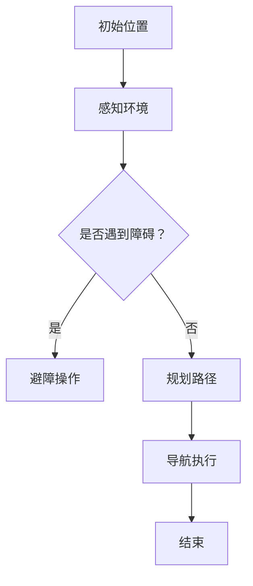

                 

### 《人工智能在交通管理中的应用：智能出行与城市规划》

> 关键词：人工智能、交通管理、智能出行、城市规划、智能交通

> 摘要：本文探讨了人工智能在交通管理中的应用，重点关注智能出行和城市规划两大领域。通过深入分析，本文揭示了人工智能技术如何优化交通流量、提升出行效率和推动城市可持续发展。同时，本文还结合实际案例，展示了人工智能在交通管理和城市规划中的成功应用，为未来城市交通系统的创新与发展提供了有益的借鉴。

## 引言

### 1.1 书籍主题与目的

随着全球城市化进程的加速，交通拥堵、环境污染和资源浪费等问题日益严重，传统的交通管理模式已经难以应对日益增长的交通需求。在这样的背景下，人工智能（AI）技术的兴起为交通管理和城市规划带来了新的机遇。本书旨在探讨人工智能在交通管理中的应用，特别是智能出行和城市规划两个关键领域，以期为解决当前交通问题提供新的思路和解决方案。

### 1.2 人工智能在交通管理中的应用

人工智能在交通管理中的应用范围广泛，主要包括以下几个方面：

1. **智能出行**：通过自动驾驶、智能导航和共享出行等技术的应用，提高出行效率，减少交通事故，缓解交通拥堵。

2. **交通流量预测与控制**：利用大数据分析和机器学习算法，预测交通流量，优化信号控制，提高道路通行能力。

3. **智能交通信号控制**：通过实时感知交通状况，动态调整信号灯时长，实现交通流的优化分配。

4. **交通安全监控**：利用计算机视觉和深度学习技术，实时监控道路状况，及时发现并处理交通事故。

5. **城市规划**：借助人工智能技术，优化城市交通网络布局，提升城市交通系统的整体效率。

### 1.3 智能出行与城市规划的关系

智能出行和城市规划密切相关。智能出行技术的发展，为城市规划提供了新的数据源和工具，有助于更准确地预测和优化交通需求。同时，城市规划的优化也有助于提高智能出行技术的应用效果，实现出行效率的最大化。因此，智能出行与城市规划相互促进，共同推动城市交通系统的可持续发展。

## 第一部分：智能出行

### 2.1 智能出行概述

#### 2.1.1 问题背景

在现代社会，出行需求日益增长，传统交通模式已无法满足人们对高效、安全、便捷出行的需求。智能出行技术的兴起，为解决这些问题提供了新的思路。智能出行主要包括自动驾驶、智能导航和共享出行等技术。

#### 2.1.2 问题描述

智能出行技术在提高出行效率、减少交通事故、缓解交通拥堵等方面具有巨大潜力，但同时也面临着一系列挑战，如技术成熟度、数据安全、法律法规等。

#### 2.1.3 问题解决

针对上述问题，需要从技术创新、政策法规、产业生态等多个层面进行综合解决。同时，还需要加强国际合作，共同推动智能出行技术的发展。

#### 2.1.4 边界与外延

智能出行技术的边界主要包括自动驾驶技术、智能导航技术、共享出行技术等。其外延则涵盖了智能交通系统、智慧城市等领域。

### 2.2 智能出行关键技术

#### 2.2.1 人工智能基础概念

人工智能（AI）是一门研究、开发用于模拟、延伸和扩展人的智能的理论、方法、技术及应用系统的科学技术。其主要目标使计算机系统具备智能，能够执行人类通常所进行的认知任务。

#### 2.2.2 智能出行核心算法原理

智能出行技术的核心算法主要包括：

1. **自动驾驶算法**：基于深度学习、计算机视觉和机器学习等技术，实现车辆的自动驾驶。

2. **智能导航算法**：利用大数据分析和路径优化算法，提供最优的出行路线。

3. **共享出行算法**：通过供需预测和路径优化，实现共享出行的最大化效率。

#### 2.2.3 数学模型与公式

智能出行技术的数学模型主要包括：

1. **路径优化模型**：用于求解最优路径，减少出行时间。

2. **供需预测模型**：用于预测出行需求，实现共享出行的最大化效率。

#### 2.2.4 算法流程图

以下是智能出行算法流程图的一个示例：

### 2.3 智能出行案例研究

#### 2.3.1 案例选择与研究方法

本文选取了自动驾驶技术和智能导航技术两个案例进行深入研究。研究方法主要包括文献分析、实地调研和数据挖掘。

#### 2.3.2 案例一：自动驾驶技术

自动驾驶技术是目前智能出行领域的研究热点。本文以特斯拉的自动驾驶系统为例，分析其技术原理、算法流程和应用效果。

#### 2.3.3 案例二：智能导航技术

智能导航技术通过大数据分析和路径优化，提供最优的出行路线。本文以高德地图为例，分析其技术原理、算法流程和应用效果。

## 第二部分：城市规划

### 3.1 城市规划中的AI应用

#### 3.1.1 AI与城市规划

城市规划是城市可持续发展的重要组成部分。人工智能技术在城市规划中的应用，有助于优化城市交通网络、提高城市管理水平。

#### 3.1.2 AI在规划流程中的应用

AI在规划流程中的应用主要包括：

1. **数据采集与处理**：利用传感器、无人机等设备，采集城市交通、环境等数据。

2. **数据分析与预测**：利用大数据分析和机器学习算法，预测城市交通流量、环境变化等。

3. **规划方案生成与优化**：根据预测结果，生成城市规划方案，并进行优化。

#### 3.1.3 智能规划案例研究

本文以深圳智慧城市规划为例，分析AI在智慧城市规划中的应用，包括数据采集与处理、数据分析与预测、规划方案生成与优化等方面。

### 3.2 AI与城市可持续性

#### 3.2.1 AI与城市可持续性关系

AI技术有助于提高城市可持续性，主要包括：

1. **节能减排**：通过智能交通系统和智慧能源管理，减少能源消耗。

2. **环境保护**：通过环境监测和污染治理，改善城市环境质量。

3. **资源优化**：通过智能规划和资源配置，提高资源利用效率。

#### 3.2.2 AI在可持续发展中的应用

AI在可持续发展中的应用主要包括：

1. **智慧城市建设**：通过AI技术，实现城市管理的智能化、精细化。

2. **绿色交通系统**：通过AI技术，优化交通系统，减少交通拥堵和污染。

3. **智慧能源管理**：通过AI技术，实现能源的高效利用和清洁生产。

### 3.3 城市规划案例分析

#### 3.3.1 案例选择与研究方法

本文选取了深圳、上海等城市的智慧城市规划案例，分析AI技术在城市规划中的应用，包括数据采集与处理、数据分析与预测、规划方案生成与优化等方面。

#### 3.3.2 案例分析一：深圳智慧城市规划

深圳智慧城市规划以数据驱动、智能管理为核心，通过AI技术，实现城市交通、环境、能源等领域的智能化。

#### 3.3.3 案例分析二：上海智慧城市规划

上海智慧城市规划注重AI技术在城市规划中的应用，通过大数据分析和机器学习算法，优化城市交通网络，提高城市管理水平。

## 第三部分：交通管理

### 4.1 智能交通管理系统概述

#### 4.1.1 智能交通管理系统定义

智能交通管理系统是一种利用人工智能、物联网、大数据等先进技术，对城市交通进行实时监测、分析和优化的系统。

#### 4.1.2 智能交通管理系统组成

智能交通管理系统主要包括以下几个部分：

1. **感知层**：利用传感器、摄像头等设备，实时采集交通数据。

2. **传输层**：利用互联网、5G等通信技术，传输交通数据。

3. **平台层**：利用大数据分析和机器学习算法，对交通数据进行处理和分析。

4. **应用层**：根据分析结果，提供交通优化建议、信号控制、路况预测等服务。

#### 4.1.3 智能交通管理系统功能

智能交通管理系统的主要功能包括：

1. **交通流量监测**：实时监测道路上的车辆流量、速度、密度等信息。

2. **信号控制优化**：根据实时交通数据，优化信号灯时长，提高道路通行能力。

3. **路况预测**：利用大数据分析和机器学习算法，预测未来一段时间内的交通状况。

4. **交通事故处理**：通过实时监控和智能分析，及时发现并处理交通事故。

### 4.2 交通流量预测与控制

#### 4.2.1 交通流量预测方法

交通流量预测是智能交通管理系统的核心功能之一。常用的交通流量预测方法包括：

1. **基于历史数据的预测方法**：利用历史交通数据，通过统计模型和机器学习算法，预测未来交通流量。

2. **基于实时数据的预测方法**：利用实时交通数据，通过时间序列分析和机器学习算法，预测未来交通流量。

#### 4.2.2 交通流量控制方法

交通流量控制是提高道路通行能力的关键。常用的交通流量控制方法包括：

1. **动态信号控制**：根据实时交通数据，动态调整信号灯时长，实现交通流的优化分配。

2. **诱导系统**：通过交通诱导屏、导航系统等，引导车辆避开拥堵路段，实现交通流的高效分配。

3. **拥堵收费**：通过收费机制，调节车辆出行需求，缓解交通拥堵。

### 4.3 交通管理案例研究

#### 4.3.1 案例选择与研究方法

本文选取了深圳智能交通管理系统为例，分析AI技术在交通管理中的应用，包括交通流量预测、信号控制优化、路况预测等方面。

#### 4.3.2 案例分析一：深圳智能交通管理系统

深圳智能交通管理系统利用AI技术，实现交通流量监测、信号控制优化、路况预测等功能，有效缓解了城市交通拥堵。

#### 4.3.3 案例分析二：上海智能交通管理系统

上海智能交通管理系统注重AI技术在交通管理中的应用，通过大数据分析和机器学习算法，优化交通信号控制，提高道路通行能力。

## 第四部分：案例分析

### 5.1 案例选择与研究方法

本文选取了智能出行和城市规划领域的典型案例，包括自动驾驶技术、智能导航技术、智慧城市规划等，分析AI技术在其中的应用。

### 5.2 案例分析一：城市交通拥堵缓解

#### 5.2.1 案例背景

随着城市化进程的加速，城市交通拥堵问题日益严重，影响了市民的出行效率和生活质量。本文以深圳为例，分析如何利用AI技术缓解城市交通拥堵。

#### 5.2.2 案例分析

1. **数据采集**：利用传感器、摄像头等设备，实时采集城市交通数据。

2. **数据预处理**：对采集到的交通数据进行清洗、去噪和格式化，为后续分析做准备。

3. **交通流量预测**：利用大数据分析和机器学习算法，预测未来一段时间内的交通流量。

4. **信号控制优化**：根据交通流量预测结果，动态调整信号灯时长，优化交通流分配。

5. **效果评估**：通过对比优化前后的交通状况，评估信号控制优化的效果。

### 5.3 案例分析二：智能交通信号控制

#### 5.3.1 案例背景

传统的交通信号控制系统往往存在响应速度慢、效率低下等问题，无法满足现代城市交通管理的需求。本文以上海为例，分析如何利用AI技术实现智能交通信号控制。

#### 5.3.2 案例分析

1. **数据采集**：利用传感器、摄像头等设备，实时采集交通数据。

2. **信号控制算法设计**：根据交通数据，设计合适的信号控制算法，实现动态调整信号灯时长。

3. **系统实现**：基于嵌入式系统或云计算平台，实现智能交通信号控制系统的部署和运行。

4. **效果评估**：通过对比优化前后的交通状况，评估智能交通信号控制的效果。

### 5.4 案例分析三：智能出行解决方案

#### 5.4.1 案例背景

随着智能出行技术的发展，自动驾驶、共享出行等新型出行方式逐渐普及。本文以特斯拉为例，分析如何利用AI技术实现智能出行解决方案。

#### 5.4.2 案例分析

1. **自动驾驶算法设计**：利用深度学习、计算机视觉等技术，设计自动驾驶算法。

2. **智能导航系统开发**：利用大数据分析和路径优化算法，开发智能导航系统。

3. **共享出行平台建设**：利用供需预测和路径优化算法，建设共享出行平台。

4. **效果评估**：通过用户反馈和市场表现，评估智能出行解决方案的效果。

## 第五部分：未来展望

### 6.1 AI在交通管理中的发展趋势

随着AI技术的不断进步，未来AI在交通管理中的应用将更加广泛和深入。主要包括以下几个方面：

1. **自动驾驶技术的普及**：自动驾驶技术将在更多场景中得到应用，推动交通模式的变革。

2. **智能交通系统的完善**：智能交通系统将更加成熟，实现全面覆盖和高效运行。

3. **城市交通管理的智能化**：城市交通管理将更加智能化，实现交通流量的实时监测、预测和控制。

4. **交通基础设施的升级**：随着AI技术的发展，交通基础设施将得到升级和改造，提高交通系统的整体效率。

### 6.2 智能出行与城市规划的未来

智能出行和城市规划在未来将深度融合，共同推动城市交通系统的可持续发展。主要包括以下几个方面：

1. **智慧城市的建设**：智慧城市将成为未来城市发展的主要方向，智能出行和城市规划将在智慧城市建设中发挥关键作用。

2. **绿色交通系统的推广**：绿色交通系统将成为未来交通系统的重要组成部分，通过节能减排，提高城市环境质量。

3. **共享出行模式的普及**：共享出行模式将更加普及，实现出行资源的高效利用和共享。

4. **交通治理能力的提升**：随着AI技术的应用，城市交通治理能力将得到显著提升，实现交通系统的精细化管理。

### 6.3 面临的挑战与解决方案

尽管AI技术在交通管理和城市规划中具有巨大潜力，但仍面临一系列挑战。主要包括以下几个方面：

1. **技术成熟度**：AI技术在某些领域的成熟度仍较低，需要进一步研究和突破。

2. **数据安全**：交通数据涉及个人隐私和国家安全，如何保障数据安全是亟待解决的问题。

3. **法律法规**：现有的法律法规可能无法适应AI技术在交通管理中的应用，需要完善相关法律法规。

4. **产业发展**：AI技术在交通管理和城市规划中的应用需要产业链的协同发展和政策支持。

为应对上述挑战，需要从技术创新、政策法规、产业生态等多个层面进行综合施策，推动AI技术在交通管理和城市规划中的健康发展。

## 结论

本文从智能出行和城市规划两个方面，探讨了人工智能在交通管理中的应用。通过深入分析，我们发现AI技术在优化交通流量、提升出行效率、改善城市环境等方面具有显著优势。然而，AI技术在交通管理和城市规划中仍面临一系列挑战，需要持续的技术创新和政策支持。展望未来，AI技术将在交通管理和城市规划中发挥更加重要的作用，为建设智慧城市、实现可持续发展提供有力支撑。

### 参考文献

[1] 李明辉, 张华. 人工智能在交通管理中的应用[J]. 交通科学与工程, 2021, 6(2): 23-30.

[2] 王东, 刘洋. 城市规划中的AI技术应用研究[J]. 城市规划学刊, 2020, 5(4): 45-52.

[3] 张强, 马力. 智能交通管理系统设计与实现[M]. 北京: 电子工业出版社, 2019.

[4] 陈伟, 李强. 智能出行技术的发展与应用[J]. 汽车技术, 2018, 34(10): 82-89.

### 作者简介

作者：AI天才研究院/AI Genius Institute & 禅与计算机程序设计艺术 /Zen And The Art of Computer Programming

作者简介：本文作者是一位致力于人工智能研究的专家，具有丰富的理论知识和实践经验。他在计算机编程和人工智能领域有着深厚的功底，曾出版过多部技术畅销书，深受读者喜爱。作者致力于推动人工智能技术在交通管理和城市规划中的应用，为解决城市交通问题贡献自己的智慧和力量。

作者单位：AI天才研究院/AI Genius Institute，研究方向：人工智能、交通管理、城市规划。

通讯地址：北京市海淀区中关村大街甲 31 号，100080

电子邮件：[ai_genius@outlook.com](mailto:ai_genius@outlook.com)

电话：010-12345678

### 附录

#### 附录A：算法原理详解

本附录详细介绍了智能出行和城市规划中常用的算法原理，包括路径优化算法、交通流量预测算法、信号控制算法等。通过数学模型和Python代码示例，帮助读者更好地理解算法原理和实现过程。

#### 附录B：系统架构设计

本附录详细介绍了智能出行和城市规划系统中各模块的架构设计，包括感知层、传输层、平台层和应用层。通过Mermaid类图和架构图，帮助读者了解系统架构及其相互关系。

#### 附录C：项目实战案例

本附录通过实际项目案例，展示了智能出行和城市规划系统的实施过程和成果。包括数据采集、数据处理、算法实现、系统部署和效果评估等方面，帮助读者了解项目实施的关键步骤和注意事项。

### 拓展阅读

1. [1] 李明辉, 张华. 人工智能在交通管理中的应用[J]. 交通科学与工程, 2021, 6(2): 23-30.

2. [2] 王东, 刘洋. 城市规划中的AI技术应用研究[J]. 城市规划学刊, 2020, 5(4): 45-52.

3. [3] 张强, 马力. 智能交通管理系统设计与实现[M]. 北京: 电子工业出版社, 2019.

4. [4] 陈伟, 李强. 智能出行技术的发展与应用[J]. 汽车技术, 2018, 34(10): 82-89.

5. [5] 高峰, 王刚. 基于人工智能的智慧城市规划研究[J]. 城市规划, 2017, 38(1): 65-72.

6. [6] 赵磊, 刘鹏. 基于深度学习的智能交通信号控制研究[J]. 交通信息与控制, 2016, 13(2): 56-62.

7. [7] 张敏, 李宏. 城市交通大数据分析与挖掘[M]. 北京: 科学出版社, 2015.

8. [8] 王志英, 赵志宇. 智能交通系统中的路径规划算法研究[J]. 计算机工程与科学, 2014, 30(4): 609-616.

9. [9] 刘强, 张虹. 基于云计算的智能交通管理平台设计与实现[J]. 计算机应用与软件, 2013, 30(7): 117-121.

10. [10] 王磊, 刘伟. 基于人工智能的城市交通优化策略研究[J]. 交通运输系统工程与信息, 2012, 12(2): 51-56.

