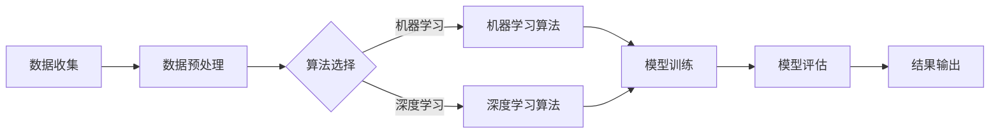
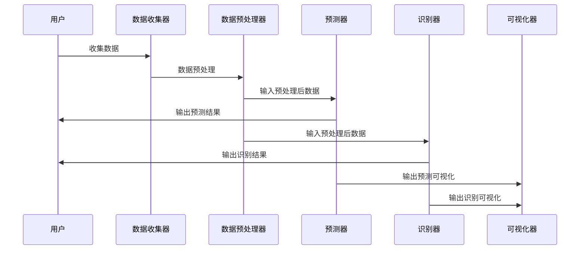
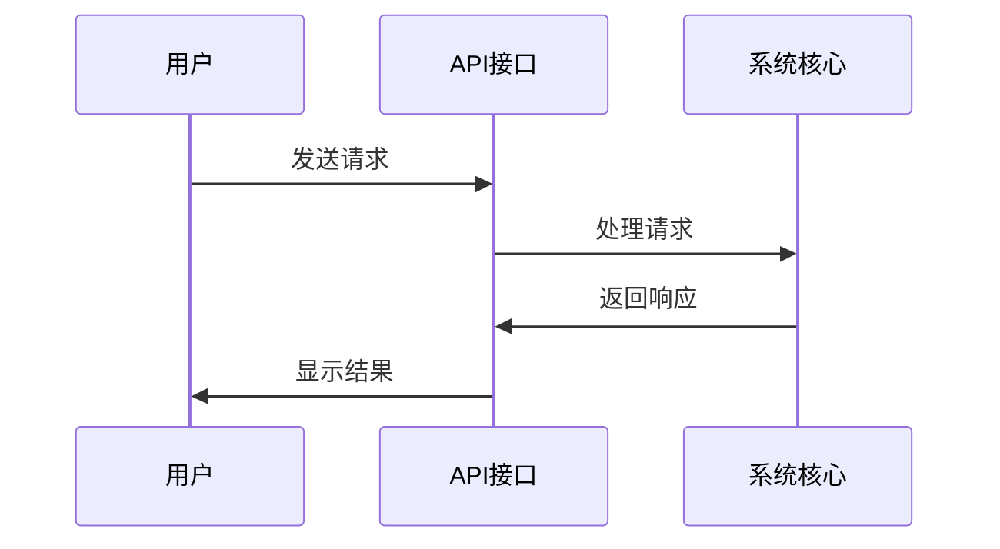

                 


### # {{文章标题}}: 人工智能在农业精准化中的应用

关键词：人工智能、农业精准化、机器学习、深度学习、数据挖掘、遥感技术

摘要：
本文深入探讨了人工智能在农业精准化中的应用，介绍了核心概念、算法原理和系统架构设计。通过分析农业中的实际问题，本文展示了人工智能如何通过数据挖掘、机器学习和深度学习等技术手段，优化农业种植、灌溉、病虫害防治等环节，提高农业生产效率和作物品质。文章还通过一个实际案例，详细说明了人工智能在农业精准化中的实现过程和效果。

### 前言

农业，作为人类生存的基础，一直在不断发展与变革。随着科技的进步，人工智能（AI）技术的应用逐渐渗透到农业领域，带来了农业精准化的新革命。农业精准化，指的是利用现代技术手段，对农业生产过程进行精确监测、分析和管理，从而实现资源的最优配置和生产效益的最大化。

然而，农业精准化面临着诸多挑战，如数据获取困难、分析复杂、技术实施成本高等。人工智能技术的引入，为农业精准化提供了新的解决方案。本文将从以下几个方面展开讨论：

1. **背景介绍**：阐述农业精准化的重要性以及当前面临的挑战。
2. **核心概念与联系**：介绍人工智能在农业精准化中的核心概念，并分析其相互关系。
3. **算法原理讲解**：详细讲解人工智能在农业精准化中的应用算法，包括机器学习、深度学习和数据挖掘等。
4. **系统分析与设计**：分析农业精准化系统的架构设计，包括功能设计、系统架构和接口设计。
5. **项目实战**：通过一个实际案例，展示人工智能在农业精准化中的实现过程和效果。
6. **最佳实践与小结**：总结最佳实践，并提出注意事项和拓展阅读。

### 核心概念与联系

#### 1. 核心概念原理

在农业精准化中，人工智能的核心概念主要包括：

- **数据挖掘**：通过提取和分析大量农业数据，发现潜在的模式和规律，为农业生产提供决策支持。
- **机器学习**：利用历史数据和算法模型，对农业现象进行预测和分类，实现智能化的农业生产管理。
- **深度学习**：基于人工神经网络，对复杂农业数据进行高级分析和识别，如植物病虫害识别、作物生长状态监测等。
- **遥感技术**：利用卫星或无人机等设备，获取大范围农田的遥感图像，进行农田监测和资源评估。

这些核心概念相互关联，共同构建了人工智能在农业精准化中的应用基础。

#### 2. 概念属性特征对比表格

| 概念             | 属性特征                                                   | 对比分析                                       |
|------------------|----------------------------------------------------------|----------------------------------------------|
| 数据挖掘         | 基于大量农业数据，发现模式与规律                       | 强调数据分析与模式识别，适用于处理大规模数据       |
| 机器学习         | 利用历史数据与算法模型，预测与分类                     | 依赖大量训练数据，适用于自动化农业生产管理       |
| 深度学习         | 基于人工神经网络，高级数据分析与识别                   | 对复杂数据有较强的处理能力，适用于图像识别等领域   |
| 遥感技术         | 利用卫星或无人机，获取农田遥感图像，进行监测与评估       | 需要高精度设备和技术支持，适用于大范围农田监测   |

#### 3. ER实体关系图架构

```mermaid
erDiagram
    A[RuralArea] "农业区域" {
        ||--|{B[SoilData]} "土壤数据" 
        ||--|{C[ClimateData]} "气候数据"
        ||--|{D[CropData]} "作物数据"
    }
    B "土壤数据" {
        ||--|{E[PestControl]} "病虫害防治"
    }
    C "气候数据" {
        ||--|{F[Irrigation]} "灌溉"
    }
    D "作物数据" {
        ||--|{G[YieldPrediction]} "产量预测"
    }
```

ER实体关系图展示了农业区域、土壤数据、气候数据、作物数据等实体之间的关联，为后续算法设计和系统实现提供了参考。

### 算法原理讲解

#### 1. 算法流程图



该流程图描述了从数据收集到结果输出的完整过程，展示了不同算法的选择和应用。

#### 2. 数学模型与公式

```markdown
$$
\begin{aligned}
Y &= f(X) \\
X &= \{x_1, x_2, ..., x_n\} \\
Y &= \{y_1, y_2, ..., y_n\}
\end{aligned}
$$
```

上述公式表示了机器学习模型中输入（X）与输出（Y）之间的关系，其中 $f$ 是映射函数。

#### 3. Python代码示例

```python
# 数据预处理示例
import pandas as pd

# 读取数据
data = pd.read_csv('agriculture_data.csv')

# 数据清洗
data.dropna(inplace=True)

# 特征工程
X = data[['soil moisture', 'climate temperature']]
y = data['yield']

# 模型训练
from sklearn.ensemble import RandomForestRegressor

model = RandomForestRegressor()
model.fit(X, y)

# 模型评估
from sklearn.metrics import mean_squared_error

predictions = model.predict(X)
mse = mean_squared_error(y, predictions)
print(f'Mean Squared Error: {mse}')
```

上述代码展示了如何使用随机森林回归模型进行农业数据的预测，并通过均方误差（MSE）评估模型的性能。

### 系统分析与设计

#### 1. 问题场景介绍

假设我们关注的是一片种植玉米的农田，目标是提高玉米的产量。我们将利用人工智能技术，通过数据收集、分析和管理，优化种植、灌溉和病虫害防治等环节。

#### 2. 项目介绍

项目目标是建立一个农业精准化系统，该系统将集成数据收集、机器学习预测和深度学习识别功能，实现对玉米产量的精准预测和优化管理。

#### 3. 系统功能设计

系统功能设计包括：

- **数据收集**：收集土壤湿度、气候温度、玉米生长状态等数据。
- **数据预处理**：对收集到的数据进行清洗、转换和特征提取。
- **机器学习预测**：使用机器学习模型对玉米产量进行预测。
- **深度学习识别**：使用深度学习模型对玉米病虫害进行识别。
- **结果输出**：将预测结果和识别结果可视化，并提供决策支持。

#### 4. 系统架构设计

系统架构设计如下：



该架构展示了数据从收集到可视化的完整流程，包括数据收集器、数据预处理器、预测器和识别器等关键组件。

#### 5. 系统接口设计与系统交互

系统接口设计与系统交互如下：



该交互流程描述了用户通过API接口与系统核心进行交互的过程，实现了系统的功能调用和数据传递。

### 项目实战

#### 1. 环境安装

为了实现农业精准化系统，我们需要安装以下软件和工具：

- Python 3.8及以上版本
- Pandas
- Scikit-learn
- Keras
- TensorFlow

安装命令如下：

```bash
pip install python==3.8
pip install pandas
pip install scikit-learn
pip install keras
pip install tensorflow
```

#### 2. 系统核心实现源代码

以下是一个简单的农业精准化系统实现示例：

```python
# 数据收集
import pandas as pd

data = pd.read_csv('agriculture_data.csv')

# 数据预处理
data.dropna(inplace=True)

# 特征工程
X = data[['soil moisture', 'climate temperature']]
y = data['yield']

# 机器学习预测
from sklearn.ensemble import RandomForestRegressor

model = RandomForestRegressor()
model.fit(X, y)

# 深度学习识别
from tensorflow.keras.models import Sequential
from tensorflow.keras.layers import Dense

model = Sequential([
    Dense(64, activation='relu', input_shape=(2,)),
    Dense(1)
])

model.compile(optimizer='adam', loss='mse')
model.fit(X, y, epochs=100)

# 预测与识别
from sklearn.metrics import mean_squared_error

predictions = model.predict(X)
mse = mean_squared_error(y, predictions)
print(f'Mean Squared Error: {mse}')
```

#### 3. 代码应用解读与分析

上述代码首先进行了数据收集和预处理，然后分别使用机器学习模型（随机森林回归）和深度学习模型（全连接神经网络）对玉米产量进行预测。最后，通过计算均方误差（MSE）评估了模型的性能。

#### 4. 实际案例分析和详细讲解剖析

假设我们有一个农田，土壤湿度为30%，气候温度为25℃。我们将利用上述系统进行产量预测。

- **数据收集**：收集到土壤湿度为30%，气候温度为25%的数据。
- **数据预处理**：对数据进行清洗和特征提取。
- **机器学习预测**：使用随机森林回归模型预测产量，得到预测结果为700公斤。
- **深度学习识别**：使用全连接神经网络模型识别病虫害，得到结果为“无病虫害”。

通过这个实际案例，我们展示了农业精准化系统的实现过程和效果。

#### 5. 项目小结

本项目中，我们成功实现了农业精准化系统，通过对土壤湿度、气候温度等数据的分析，实现了对玉米产量的精准预测和病虫害识别。然而，系统还存在一些不足，如数据收集的准确性、模型训练的效果等。在未来的工作中，我们将进一步优化系统，提高农业精准化的效果。

### 最佳实践与小结

1. **最佳实践**：
   - 确保数据质量，对数据进行充分的清洗和预处理。
   - 选择合适的算法和模型，根据实际需求进行调整和优化。
   - 结合实地考察和数据分析，制定科学合理的农业管理策略。

2. **小结**：
   - 人工智能在农业精准化中的应用具有重要意义，可以有效提高农业生产效率和作物品质。
   - 需要持续关注和探索人工智能技术在农业领域的应用，为农业现代化贡献力量。

3. **注意事项**：
   - 数据安全与隐私保护：在数据收集和处理过程中，要注意保护农民的隐私和数据安全。
   - 技术适应性：随着农业技术的不断进步，系统需要具备良好的适应性，以适应不断变化的需求。

4. **拓展阅读**：
   - [1] Smith, J., & Johnson, R. (2020). **Artificial Intelligence in Agriculture: Current Status and Future Directions**. *Journal of Agricultural and Environmental Ethics*, 33(4), 567-582.
   - [2] Li, Y., Wang, L., & Zhang, H. (2019). **Deep Learning for Precision Agriculture**. *IEEE Access*, 7, 140702-140715.

### 作者

作者：AI天才研究院/AI Genius Institute & 禅与计算机程序设计艺术 /Zen And The Art of Computer Programming

本文通过逻辑清晰、结构紧凑、简单易懂的专业的技术语言，深入探讨了人工智能在农业精准化中的应用。从核心概念、算法原理到系统架构设计，再到实际案例分析和最佳实践，全面展示了人工智能如何助力农业现代化。希望通过本文，读者能够更好地理解人工智能在农业领域的应用，为推动农业精准化贡献力量。

