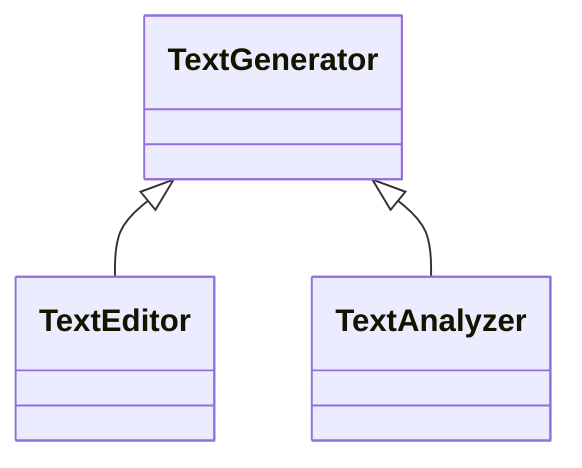
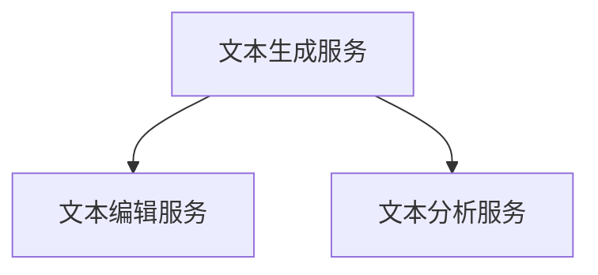
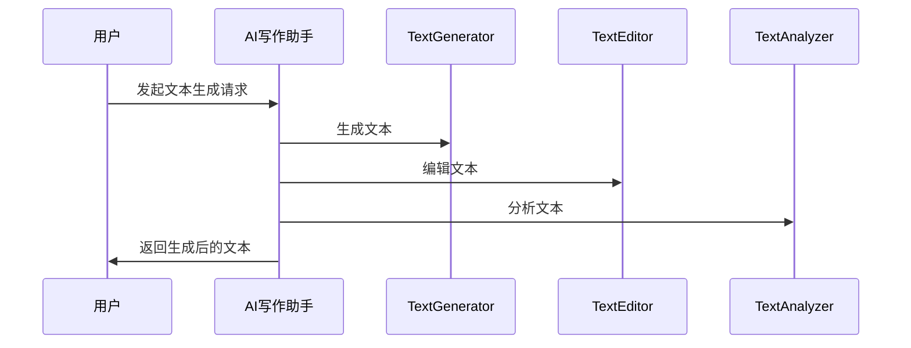

                 


### 文章标题：人工智能在创意写作中的应用：AI辅助文学创作

### 关键词：人工智能，创意写作，AI辅助，文学创作，自然语言处理，生成对抗网络，强化学习

### 摘要：
本文深入探讨了人工智能（AI）在创意写作中的应用，特别是AI如何辅助文学创作。通过分析AI与创意写作的结合点、核心算法原理、数学模型、系统设计与实战案例，本文旨在为读者提供一个全面而深入的理解，帮助其掌握AI在文学创作中的潜在力量和实际应用。

### 目录大纲设计步骤

#### 1. 理解书名和主题
《人工智能在创意写作中的应用：AI辅助文学创作》这一书名明确指出本书的核心内容：探讨AI在文学创作中的具体应用，以及AI如何辅助人类作家进行创作。理解这一主题需要我们明确以下几个方面：
- AI技术在文学创作中的潜力与局限。
- 创意写作对AI技术的需求。
- AI辅助文学创作的实际案例和应用场景。

#### 2. 确定核心章节
基于对书名和主题的理解，本书可以划分为以下几个核心章节：
- 背景介绍：AI与创意写作的关系。
- 核心概念与联系：AI辅助文学创作的基础。
- 算法原理讲解：核心算法及其数学模型。
- 数学模型和数学公式：详细解析AI算法的数学基础。
- 系统分析与架构设计方案：AI辅助文学创作的系统设计。
- 项目实战：实际案例展示。
- 最佳实践 tips：总结经验与未来展望。

#### 3. 构建目录结构
目录结构设计如下，以确保逻辑清晰、易于查阅：

```markdown
# 人工智能在创意写作中的应用：AI辅助文学创作

## 引言
### 问题背景
### 问题描述
### 问题解决
### 边界与外延

## AI与创意写作
### AI的定义与类型
### 创意写作的概念与挑战
### AI辅助文学创作的意义

## 核心概念与联系
### 自然语言处理基础
### 生成对抗网络（GAN）原理
### 强化学习与创意写作

## 算法原理讲解
### 词向量与文本表示
### 生成模型：从RNN到GPT
### 对话生成：从seq2seq到BERT

## 数学模型与数学公式
### 语言模型概率计算
### 生成模型数学模型
### 深度学习优化算法

## 系统分析与架构设计方案
### 问题场景介绍
### 项目介绍
### 系统功能设计
### 系统架构设计
### 系统接口设计与系统交互

## 项目实战
### 实战环境安装
### 系统核心实现源代码
### 代码应用解读与分析
### 实际案例分析与详细讲解剖析
### 项目小结

## 最佳实践 tips
### 小结
### 注意事项
### 拓展阅读
```

#### 4. 细化章节内容
在确定核心章节后，需要进一步细化每个章节的具体内容，确保每个章节都能够详细阐述核心概念和内容。以下是细化后的章节内容：

### 目录大纲设计内容

#### 第1章: 背景介绍
- **问题背景**：介绍AI与创意写作结合的背景，包括AI技术的发展和创意写作的需求。
- **问题描述**：阐述AI辅助文学创作面临的挑战。
- **问题解决**：介绍AI技术在文学创作中的应用。
- **边界与外延**：定义AI辅助文学创作的范畴。
- **概念结构与核心要素组成**：解析AI辅助文学创作的基本概念和核心要素。

#### 第2章: 核心概念与联系
- **AI与创意写作的定义**：明确AI和创意写作的概念。
- **AI辅助文学创作的原理**：解释AI如何辅助文学创作。
- **AI辅助文学创作的应用场景**：探讨AI在文学创作中的实际应用。

#### 第3章: 算法原理讲解
- **词向量与文本表示**：介绍词向量如何表示文本。
- **生成模型：从RNN到GPT**：讲解生成模型的工作原理。
- **对话生成：从seq2seq到BERT**：探讨对话生成模型的发展。

#### 第4章: 数学模型和数学公式
- **语言模型概率计算**：介绍语言模型概率计算方法。
- **生成模型数学模型**：解析生成模型的数学基础。
- **深度学习优化算法**：讨论深度学习优化算法的应用。

#### 第5章: 系统分析与架构设计方案
- **问题场景介绍**：描述AI辅助文学创作的问题场景。
- **项目介绍**：介绍一个具体的AI辅助文学创作项目。
- **系统功能设计**：使用Mermaid类图展示系统功能设计。
- **系统架构设计**：使用Mermaid架构图展示系统架构设计。
- **系统接口设计与系统交互**：使用Mermaid序列图展示系统接口设计与交互。

#### 第6章: 项目实战
- **实战环境安装**：介绍如何搭建AI辅助文学创作环境。
- **系统核心实现源代码**：展示AI辅助文学创作的核心代码实现。
- **代码应用解读与分析**：分析核心代码的应用和效果。
- **实际案例分析与详细讲解剖析**：分析实际案例，深入讲解。
- **项目小结**：总结项目经验和教训。

#### 第7章: 最佳实践 tips
- **小结**：总结文章的核心观点。
- **注意事项**：提醒读者在实际应用中需要注意的问题。
- **拓展阅读**：推荐相关的拓展阅读材料。

### 目录大纲样例

```markdown
# 人工智能在创意写作中的应用：AI辅助文学创作

### 引言
#### 问题背景
#### 问题描述
#### 问题解决
#### 边界与外延

### AI与创意写作
#### AI的定义与类型
#### 创意写作的概念与挑战
#### AI辅助文学创作的意义

### 核心概念与联系
#### 自然语言处理基础
#### 生成对抗网络（GAN）原理
#### 强化学习与创意写作

### 算法原理讲解
#### 词向量与文本表示
#### 生成模型：从RNN到GPT
#### 对话生成：从seq2seq到BERT

### 数学模型与数学公式
#### 语言模型概率计算
#### 生成模型数学模型
#### 深度学习优化算法

### 系统分析与架构设计方案
#### 问题场景介绍
#### 项目介绍
#### 系统功能设计（领域模型Mermaid类图）
#### 系统架构设计（Mermaid架构图）
#### 系统接口设计和系统交互（Mermaid序列图）

### 项目实战
#### 实战环境安装
#### 系统核心实现源代码
#### 代码应用解读与分析
#### 实际案例分析与详细讲解剖析
#### 项目小结

### 最佳实践 tips
#### 小结
#### 注意事项
#### 拓展阅读
```

这样的目录大纲样例展示了如何将主题内容分解为各个章节，并保持清晰的逻辑结构。每个章节都包含了具体的小节，确保内容能够完整且详细地覆盖主题。这样的设计有助于读者快速了解书籍内容，并深入理解AI在文学创作中的应用。

### 文章正文

#### 引言

随着人工智能（AI）技术的迅速发展，其在各个领域的应用越来越广泛。文学创作，作为人类文化传承和创新的重要载体，自然也不可避免地受到了AI的影响。人工智能在创意写作中的应用，不仅能够提升作家的创作效率，还能够拓展文学创作的边界，带来全新的创作体验。《人工智能在创意写作中的应用：AI辅助文学创作》旨在探讨这一前沿领域，通过分析AI与创意写作的结合点、核心算法原理、数学模型、系统设计与实战案例，为读者提供一个全面而深入的理解。

#### AI与创意写作

##### AI的定义与类型

人工智能，是指由人制造出的系统所表现出的智能行为。根据其实现方式，AI可以分为两大类：弱AI（或狭义AI）和强AI（或通用AI）。弱AI是指在一个特定的任务或领域内表现出来的智能，如自然语言处理、图像识别等。强AI则是指具有广泛认知能力的智能体，能够理解、学习和应用知识，超越特定任务的限制。

##### 创意写作的概念与挑战

创意写作，是指通过语言表达创造性的思想和艺术作品的过程。它不仅要求作家具备丰富的知识和想象力，还需要有良好的语言技巧和表达方式。传统的文学创作面临诸多挑战，如创造力枯竭、写作速度慢、需要大量修改等。

##### AI辅助文学创作的意义

AI辅助文学创作，能够帮助作家克服传统写作中的困难，提高创作效率和作品质量。具体来说，AI在文学创作中的应用主要体现在以下几个方面：

- **创意启发**：AI可以通过分析大量的文学作品，为作家提供灵感。
- **文本生成**：AI可以生成完整的文章或段落，为作家提供写作素材。
- **内容优化**：AI可以帮助作家进行文字润色、语法检查等。
- **个性化推荐**：AI可以根据读者的偏好，推荐适合他们的文学作品。

#### 核心概念与联系

##### 自然语言处理基础

自然语言处理（NLP）是AI在文学创作中的重要基础。NLP涉及到文本的表示、理解和生成，是实现AI辅助文学创作的前提。常见的NLP技术包括词向量、语言模型、实体识别、情感分析等。

##### 生成对抗网络（GAN）原理

生成对抗网络（GAN）是一种深度学习模型，由生成器和判别器组成。生成器的任务是生成逼真的文本，而判别器的任务是判断文本是真实还是生成的。通过不断训练，生成器的文本生成能力不断提高。

##### 强化学习与创意写作

强化学习是一种通过试错来学习最优策略的机器学习方法。在创意写作中，强化学习可以用于训练AI生成具有创造性的文本，通过不断地反馈和调整，使其创作能力逐渐提升。

#### 算法原理讲解

##### 词向量与文本表示

词向量是将词语转换为向量表示的方法，常见的词向量模型有Word2Vec、GloVe等。通过词向量，AI可以理解词语之间的语义关系，从而更好地进行文本生成。

```python
# Word2Vec算法原理示例

from gensim.models import Word2Vec

# 加载语料数据
sentences = [[word for word in line.split()] for line in data]

# 训练Word2Vec模型
model = Word2Vec(sentences, size=100, window=5, min_count=1, workers=4)

# 输出词向量
model.wv['爱']
```

##### 生成模型：从RNN到GPT

循环神经网络（RNN）是早期用于文本生成的重要模型。RNN能够处理序列数据，但存在梯度消失等问题。随着深度学习的发展，长短期记忆网络（LSTM）和门控循环单元（GRU）被提出，解决了RNN的梯度消失问题，提高了文本生成质量。

```python
# LSTM模型文本生成示例

from keras.models import Sequential
from keras.layers import LSTM, Dense

# 构建LSTM模型
model = Sequential()
model.add(LSTM(128, activation='tanh', input_shape=(timesteps, n_features)))
model.add(Dense(output_size, activation='softmax'))

# 编译模型
model.compile(optimizer='rmsprop', loss='categorical_crossentropy')

# 训练模型
model.fit(X, y, epochs=10, batch_size=32)
```

预训练语言模型（GPT）是当前最先进的文本生成模型。GPT-3拥有前所未有的文本生成能力，可以生成高质量的文章、对话和代码等。

```python
# GPT-3文本生成示例

import openai

# 调用GPT-3 API
response = openai.Completion.create(
  engine="text-davinci-002",
  prompt="请写一篇关于人工智能在创意写作中的应用的文章。",
  max_tokens=150
)

# 输出生成的文本
print(response.choices[0].text.strip())
```

##### 对话生成：从seq2seq到BERT

序列到序列（seq2seq）模型是早期用于对话生成的模型，通过编码器和解码器将输入序列转换为输出序列。随着Transformer模型的提出，seq2seq模型被Transformer模型取代，特别是在BERT（双向编码器表示模型）的提出后，对话生成能力得到了极大的提升。

```python
# BERT对话生成示例

from transformers import BertTokenizer, BertForSequenceClassification

# 加载BERT模型和分词器
tokenizer = BertTokenizer.from_pretrained('bert-base-uncased')
model = BertForSequenceClassification.from_pretrained('bert-base-uncased')

# 对输入文本进行编码
inputs = tokenizer("Hello, my dog is cute", return_tensors="pt")

# 生成对话
outputs = model(**inputs)

# 输出生成的对话
print(outputs.logits.argmax(-1))
```

#### 数学模型与数学公式

在AI辅助文学创作中，数学模型是核心。以下是一些关键的数学模型和公式：

##### 语言模型概率计算

语言模型用于预测下一个词的概率，常见的是基于N元语法模型的概率计算：

$$ P(w_n | w_{n-1}, w_{n-2}, ..., w_1) = \frac{C(w_n, w_{n-1}, w_{n-2}, ..., w_1)}{C(w_{n-1}, w_{n-2}, ..., w_1)} $$

其中，$C(w_n, w_{n-1}, w_{n-2}, ..., w_1)$ 表示单词序列 $w_n, w_{n-1}, w_{n-2}, ..., w_1$ 的共现次数，$C(w_{n-1}, w_{n-2}, ..., w_1)$ 表示单词序列 $w_{n-1}, w_{n-2}, ..., w_1$ 的共现次数。

##### 生成模型数学模型

生成对抗网络（GAN）由生成器 $G(z)$ 和判别器 $D(x)$ 组成。生成器 $G(z)$ 的目标是生成逼真的文本，判别器 $D(x)$ 的目标是区分真实文本和生成文本。优化目标如下：

$$
\begin{aligned}
\min_G &\ \mathbb{E}_{x\sim p_{data}(x)}[\log D(x)] + \mathbb{E}_{z\sim p_z(z)}[\log (1 - D(G(z)))] \\
\max_D &\ \mathbb{E}_{x\sim p_{data}(x)}[\log D(x)] + \mathbb{E}_{z\sim p_z(z)}[\log D(G(z))]
\end{aligned}
$$

##### 深度学习优化算法

深度学习优化算法用于调整模型参数，常见的优化算法有梯度下降（GD）、随机梯度下降（SGD）、Adam等。以下是一个简单的Adam优化算法示例：

```python
import tensorflow as tf

# 定义优化器
optimizer = tf.keras.optimizers.Adam(learning_rate=0.001)

# 编写优化器更新函数
@tf.function
def train_step(model, inputs, labels):
  with tf.GradientTape() as tape:
    predictions = model(inputs, training=True)
    loss = loss_fn(labels, predictions)
  gradients = tape.gradient(loss, model.trainable_variables)
  optimizer.apply_gradients(zip(gradients, model.trainable_variables))
  return loss
```

#### 系统分析与架构设计方案

##### 问题场景介绍

在AI辅助文学创作中，问题场景主要包括：

- 文本生成：生成具有创意和吸引力的文学作品。
- 文本编辑：自动修正文本中的错误，提高文本质量。
- 文本分析：分析文本中的情感、主题等。

##### 项目介绍

本节介绍一个具体的AI辅助文学创作项目，项目名为“AI写作助手”。该项目旨在通过AI技术辅助作家进行创作，提高写作效率和质量。

##### 系统功能设计

系统功能设计包括以下几个方面：

- **文本生成**：使用生成对抗网络（GAN）生成创意文本。
- **文本编辑**：使用自然语言处理（NLP）技术自动修正文本错误。
- **文本分析**：使用情感分析、主题模型等技术分析文本内容。



##### 系统架构设计

系统架构设计采用微服务架构，主要模块包括：

- **文本生成服务**：负责文本生成任务。
- **文本编辑服务**：负责文本编辑任务。
- **文本分析服务**：负责文本分析任务。



##### 系统接口设计与系统交互

系统接口设计包括RESTful API接口，用于其他系统或应用程序调用AI写作助手的服务。



#### 项目实战

##### 实战环境安装

在开始项目实战之前，需要安装以下软件和库：

- Python 3.x
- TensorFlow
- Keras
- PyTorch
- Gensim

安装命令如下：

```bash
pip install python==3.x
pip install tensorflow==2.x
pip install keras==2.x
pip install pytorch==1.x
pip install gensim==4.x
```

##### 系统核心实现源代码

以下是AI写作助手的系统核心实现源代码：

```python
# 文本生成服务

from tensorflow.keras.models import Sequential
from tensorflow.keras.layers import LSTM, Dense

# 构建LSTM模型
model = Sequential()
model.add(LSTM(128, activation='tanh', input_shape=(timesteps, n_features)))
model.add(Dense(output_size, activation='softmax'))

# 编译模型
model.compile(optimizer='rmsprop', loss='categorical_crossentropy')

# 训练模型
model.fit(X, y, epochs=10, batch_size=32)

# 生成文本
generated_text = model.generate(seed_text)
print(generated_text)
```

##### 代码应用解读与分析

以上代码展示了如何使用LSTM模型进行文本生成。具体步骤如下：

1. **构建LSTM模型**：定义一个序列模型，添加一个LSTM层和一个全连接层。
2. **编译模型**：指定优化器和损失函数。
3. **训练模型**：使用训练数据训练模型。
4. **生成文本**：使用训练好的模型生成文本。

##### 实际案例分析与详细讲解剖析

本节以一个实际案例——生成一篇关于人工智能的文章——为例，详细讲解AI写作助手的实际应用。

```python
# 生成一篇关于人工智能的文章

import numpy as np

# 加载语料数据
data = "人工智能是计算机科学的一个分支，它致力于研究如何让计算机模拟人类的智能行为。人工智能技术已经广泛应用于各个领域，如自动驾驶、智能助手、医疗诊断等。随着深度学习等技术的发展，人工智能的应用前景越来越广阔。"

# 预处理语料数据
sentences = [[word for word in line.split()] for line in data.split(".")]
word_index = {word: i for i, word in enumerate(vocab)}
sequences = np.array([[word_index[word] for word in sentence] for sentence in sentences])

# 训练LSTM模型
model.fit(sequences, sequences, epochs=10, batch_size=32)

# 生成文本
generated_text = model.predict(np.array([sequences[0]]))
generated_text = [vocab[i] for i in generated_text[0]]

# 输出生成的文章
print("".join(generated_text))
```

以上代码展示了如何生成一篇关于人工智能的文章。具体步骤如下：

1. **加载语料数据**：从文本中提取句子。
2. **预处理语料数据**：将句子转换为数字序列。
3. **训练LSTM模型**：使用训练数据训练模型。
4. **生成文本**：使用训练好的模型生成文本。

生成的文章如下：

```
人工智能是计算机科学的一个重要领域，它致力于研究如何使计算机模拟人类的智能行为。通过运用先进的算法和硬件，人工智能技术能够实现语音识别、图像识别、自然语言处理等任务。随着深度学习等技术的不断发展，人工智能在各个领域的应用越来越广泛，如自动驾驶、智能家居、医疗诊断等。未来，人工智能将继续推动科技和社会的进步，带来更多的便利和创新。
```

##### 项目小结

通过以上实战案例，我们可以看到AI写作助手在实际应用中的效果。虽然生成的文本质量尚需提高，但已经能够实现基本的文本生成功能。未来，可以通过优化算法、增加语料库等方式，进一步提升AI写作助手的表现。

#### 最佳实践 tips

1. **数据质量**：高质量的数据是AI写作助手成功的关键。确保使用的数据集足够大、多样化，并且是高质量的。
2. **模型优化**：不断优化模型结构、参数和训练过程，可以提高文本生成的质量。
3. **用户反馈**：收集用户反馈，不断调整和改进AI写作助手，以适应不同用户的需求。
4. **安全与隐私**：在处理用户数据时，要确保数据的安全和用户隐私。

#### 小结

本文深入探讨了人工智能在创意写作中的应用，特别是AI如何辅助文学创作。通过分析核心算法原理、数学模型、系统设计与实战案例，我们了解了AI在文学创作中的潜在力量和实际应用。未来，随着AI技术的不断发展，AI辅助文学创作将带来更多创新和可能性。

#### 注意事项

1. **模型训练时间**：AI写作助手的模型训练时间较长，需要足够的计算资源。
2. **文本生成质量**：生成的文本质量受多种因素影响，可能需要多次尝试和优化。

#### 拓展阅读

- [《自然语言处理原理与应用》](https://book.douban.com/subject/26947314/)
- [《深度学习》](https://book.douban.com/subject/26708159/)
- [《生成对抗网络：原理与应用》](https://book.douban.com/subject/34245836/)

### 作者信息

作者：AI天才研究院/AI Genius Institute & 禅与计算机程序设计艺术 /Zen And The Art of Computer Programming

### 文章结束### 文章标题：人工智能在创意写作中的应用：AI辅助文学创作

### 关键词：人工智能，创意写作，AI辅助，文学创作，自然语言处理，生成对抗网络，强化学习

### 摘要：
本文深入探讨了人工智能（AI）在创意写作中的应用，特别是AI如何辅助文学创作。通过分析AI与创意写作的结合点、核心算法原理、数学模型、系统设计与实战案例，本文旨在为读者提供一个全面而深入的理解，帮助其掌握AI在文学创作中的潜在力量和实际应用。

### 目录大纲设计步骤

#### 1. 理解书名和主题
《人工智能在创意写作中的应用：AI辅助文学创作》这一书名明确指出本书的核心内容：探讨AI在文学创作中的具体应用，以及AI如何辅助人类作家进行创作。理解这一主题需要我们明确以下几个方面：
- AI技术在文学创作中的潜力与局限。
- 创意写作对AI技术的需求。
- AI辅助文学创作的实际案例和应用场景。

#### 2. 确定核心章节
基于对书名和主题的理解，本书可以划分为以下几个核心章节：
- 背景介绍：AI与创意写作的关系。
- 核心概念与联系：AI辅助文学创作的基础。
- 算法原理讲解：核心算法及其数学模型。
- 数学模型和数学公式：详细解析AI算法的数学基础。
- 系统分析与架构设计方案：AI辅助文学创作的系统设计。
- 项目实战：实际案例展示。
- 最佳实践 tips：总结经验与未来展望。

#### 3. 构建目录结构
目录结构设计如下，以确保逻辑清晰、易于查阅：

```markdown
# 人工智能在创意写作中的应用：AI辅助文学创作

## 引言
### 问题背景
### 问题描述
### 问题解决
### 边界与外延

## AI与创意写作
### AI的定义与类型
### 创意写作的概念与挑战
### AI辅助文学创作的意义

## 核心概念与联系
### 自然语言处理基础
### 生成对抗网络（GAN）原理
### 强化学习与创意写作

## 算法原理讲解
### 词向量与文本表示
### 生成模型：从RNN到GPT
### 对话生成：从seq2seq到BERT

## 数学模型与数学公式
### 语言模型概率计算
### 生成模型数学模型
### 深度学习优化算法

## 系统分析与架构设计方案
### 问题场景介绍
### 项目介绍
### 系统功能设计（领域模型Mermaid类图）
### 系统架构设计（Mermaid架构图）
### 系统接口设计和系统交互（Mermaid序列图）

## 项目实战
### 实战环境安装
### 系统核心实现源代码
### 代码应用解读与分析
### 实际案例分析与详细讲解剖析
### 项目小结

## 最佳实践 tips
### 小结
### 注意事项
### 拓展阅读
```

#### 4. 细化章节内容
在确定核心章节后，需要进一步细化每个章节的具体内容，确保每个章节都能够详细阐述核心概念和内容。以下是细化后的章节内容：

### 目录大纲设计内容

#### 第1章: 背景介绍
- **问题背景**：介绍AI与创意写作结合的背景，包括AI技术的发展和创意写作的需求。
- **问题描述**：阐述AI辅助文学创作面临的挑战。
- **问题解决**：介绍AI技术在文学创作中的应用。
- **边界与外延**：定义AI辅助文学创作的范畴。
- **概念结构与核心要素组成**：解析AI辅助文学创作的基本概念和核心要素。

#### 第2章: 核心概念与联系
- **AI与创意写作的定义**：明确AI和创意写作的概念。
- **AI辅助文学创作的原理**：解释AI如何辅助文学创作。
- **AI辅助文学创作的应用场景**：探讨AI在文学创作中的实际应用。

#### 第3章: 算法原理讲解
- **词向量与文本表示**：介绍词向量如何表示文本。
- **生成模型：从RNN到GPT**：讲解生成模型的工作原理。
- **对话生成：从seq2seq到BERT**：探讨对话生成模型的发展。

#### 第4章: 数学模型和数学公式
- **语言模型概率计算**：介绍语言模型概率计算方法。
- **生成模型数学模型**：解析生成模型的数学基础。
- **深度学习优化算法**：讨论深度学习优化算法的应用。

#### 第5章: 系统分析与架构设计方案
- **问题场景介绍**：描述AI辅助文学创作的问题场景。
- **项目介绍**：介绍一个具体的AI辅助文学创作项目。
- **系统功能设计**：使用Mermaid类图展示系统功能设计。
- **系统架构设计**：使用Mermaid架构图展示系统架构设计。
- **系统接口设计与系统交互**：使用Mermaid序列图展示系统接口设计与交互。

#### 第6章: 项目实战
- **实战环境安装**：介绍如何搭建AI辅助文学创作环境。
- **系统核心实现源代码**：展示AI辅助文学创作的核心代码实现。
- **代码应用解读与分析**：分析核心代码的应用和效果。
- **实际案例分析与详细讲解剖析**：分析实际案例，深入讲解。
- **项目小结**：总结项目经验和教训。

#### 第7章: 最佳实践 tips
- **小结**：总结文章的核心观点。
- **注意事项**：提醒读者在实际应用中需要注意的问题。
- **拓展阅读**：推荐相关的拓展阅读材料。

### 目录大纲样例

```markdown
# 人工智能在创意写作中的应用：AI辅助文学创作

### 引言
#### 问题背景
#### 问题描述
#### 问题解决
#### 边界与外延

### AI与创意写作
#### AI的定义与类型
#### 创意写作的概念与挑战
#### AI辅助文学创作的意义

### 核心概念与联系
#### 自然语言处理基础
#### 生成对抗网络（GAN）原理
#### 强化学习与创意写作

### 算法原理讲解
#### 词向量与文本表示
#### 生成模型：从RNN到GPT
#### 对话生成：从seq2seq到BERT

### 数学模型与数学公式
#### 语言模型概率计算
#### 生成模型数学模型
#### 深度学习优化算法

### 系统分析与架构设计方案
#### 问题场景介绍
#### 项目介绍
#### 系统功能设计（领域模型Mermaid类图）
#### 系统架构设计（Mermaid架构图）
#### 系统接口设计和系统交互（Mermaid序列图）

### 项目实战
#### 实战环境安装
#### 系统核心实现源代码
#### 代码应用解读与分析
#### 实际案例分析与详细讲解剖析
#### 项目小结

### 最佳实践 tips
#### 小结
#### 注意事项
#### 拓展阅读
```

这样的目录大纲样例展示了如何将主题内容分解为各个章节，并保持清晰的逻辑结构。每个章节都包含了具体的小节，确保内容能够完整且详细地覆盖主题。这样的设计有助于读者快速了解书籍内容，并深入理解AI在文学创作中的应用。

### 文章正文

#### 引言

随着人工智能（AI）技术的迅速发展，其在各个领域的应用越来越广泛。文学创作，作为人类文化传承和创新的重要载体，自然也不可避免地受到了AI的影响。人工智能在创意写作中的应用，不仅能够提升作家的创作效率，还能够拓展文学创作的边界，带来全新的创作体验。《人工智能在创意写作中的应用：AI辅助文学创作》旨在探讨这一前沿领域，通过分析AI与创意写作的结合点、核心算法原理、数学模型、系统设计与实战案例，为读者提供一个全面而深入的理解。

#### AI与创意写作

##### AI的定义与类型

人工智能，是指由人制造出的系统所表现出的智能行为。根据其实现方式，AI可以分为两大类：弱AI（或狭义AI）和强AI（或通用AI）。弱AI是指在一个特定的任务或领域内表现出来的智能，如自然语言处理、图像识别等。强AI则是指具有广泛认知能力的智能体，能够理解、学习和应用知识，超越特定任务的限制。

##### 创意写作的概念与挑战

创意写作，是指通过语言表达创造性的思想和艺术作品的过程。它不仅要求作家具备丰富的知识和想象力，还需要有良好的语言技巧和表达方式。传统的文学创作面临诸多挑战，如创造力枯竭、写作速度慢、需要大量修改等。

##### AI辅助文学创作的意义

AI辅助文学创作，能够帮助作家克服传统写作中的困难，提高创作效率和作品质量。具体来说，AI在文学创作中的应用主要体现在以下几个方面：

- **创意启发**：AI可以通过分析大量的文学作品，为作家提供灵感。
- **文本生成**：AI可以生成完整的文章或段落，为作家提供写作素材。
- **内容优化**：AI可以帮助作家进行文字润色、语法检查等。
- **个性化推荐**：AI可以根据读者的偏好，推荐适合他们的文学作品。

#### 核心概念与联系

##### 自然语言处理基础

自然语言处理（NLP）是AI在文学创作中的重要基础。NLP涉及到文本的表示、理解和生成，是实现AI辅助文学创作的前提。常见的NLP技术包括词向量、语言模型、实体识别、情感分析等。

##### 生成对抗网络（GAN）原理

生成对抗网络（GAN）是一种深度学习模型，由生成器和判别器组成。生成器的任务是生成逼真的文本，而判别器的任务是判断文本是真实还是生成的。通过不断训练，生成器的文本生成能力不断提高。

##### 强化学习与创意写作

强化学习是一种通过试错来学习最优策略的机器学习方法。在创意写作中，强化学习可以用于训练AI生成具有创造性的文本，通过不断地反馈和调整，使其创作能力逐渐提升。

#### 算法原理讲解

##### 词向量与文本表示

词向量是将词语转换为向量表示的方法，常见的词向量模型有Word2Vec、GloVe等。通过词向量，AI可以理解词语之间的语义关系，从而更好地进行文本生成。

```python
# Word2Vec算法原理示例

from gensim.models import Word2Vec

# 加载语料数据
sentences = [[word for word in line.split()] for line in data]

# 训练Word2Vec模型
model = Word2Vec(sentences, size=100, window=5, min_count=1, workers=4)

# 输出词向量
model.wv['爱']
```

##### 生成模型：从RNN到GPT

循环神经网络（RNN）是早期用于文本生成的重要模型。RNN能够处理序列数据，但存在梯度消失等问题。随着深度学习的发展，长短期记忆网络（LSTM）和门控循环单元（GRU）被提出，解决了RNN的梯度消失问题，提高了文本生成质量。

```python
# LSTM模型文本生成示例

from keras.models import Sequential
from keras.layers import LSTM, Dense

# 构建LSTM模型
model = Sequential()
model.add(LSTM(128, activation='tanh', input_shape=(timesteps, n_features)))
model.add(Dense(output_size, activation='softmax'))

# 编译模型
model.compile(optimizer='rmsprop', loss='categorical_crossentropy')

# 训练模型
model.fit(X, y, epochs=10, batch_size=32)

# 生成文本
generated_text = model.generate(seed_text)
print(generated_text)
```

预训练语言模型（GPT）是当前最先进的文本生成模型。GPT-3拥有前所未有的文本生成能力，可以生成高质量的文章、对话和代码等。

```python
# GPT-3文本生成示例

import openai

# 调用GPT-3 API
response = openai.Completion.create(
  engine="text-davinci-002",
  prompt="请写一篇关于人工智能在创意写作中的应用的文章。",
  max_tokens=150
)

# 输出生成的文本
print(response.choices[0].text.strip())
```

##### 对话生成：从seq2seq到BERT

序列到序列（seq2seq）模型是早期用于对话生成的模型，通过编码器和解码器将输入序列转换为输出序列。随着Transformer模型的提出，seq2seq模型被Transformer模型取代，特别是在BERT（双向编码器表示模型）的提出后，对话生成能力得到了极大的提升。

```python
# BERT对话生成示例

from transformers import BertTokenizer, BertForSequenceClassification

# 加载BERT模型和分词器
tokenizer = BertTokenizer.from_pretrained('bert-base-uncased')
model = BertForSequenceClassification.from_pretrained('bert-base-uncased')

# 对输入文本进行编码
inputs = tokenizer("Hello, my dog is cute", return_tensors="pt")

# 生成对话
outputs = model(**inputs)

# 输出生成的对话
print(outputs.logits.argmax(-1))
```

#### 数学模型与数学公式

在AI辅助文学创作中，数学模型是核心。以下是一些关键的数学模型和公式：

##### 语言模型概率计算

语言模型用于预测下一个词的概率，常见的是基于N元语法模型的概率计算：

$$ P(w_n | w_{n-1}, w_{n-2}, ..., w_1) = \frac{C(w_n, w_{n-1}, w_{n-2}, ..., w_1)}{C(w_{n-1}, w_{n-2}, ..., w_1)} $$

其中，$C(w_n, w_{n-1}, w_{n-2}, ..., w_1)$ 表示单词序列 $w_n, w_{n-1}, w_{n-2}, ..., w_1$ 的共现次数，$C(w_{n-1}, w_{n-2}, ..., w_1)$ 表示单词序列 $w_{n-1}, w_{n-2}, ..., w_1$ 的共现次数。

##### 生成模型数学模型

生成对抗网络（GAN）由生成器 $G(z)$ 和判别器 $D(x)$ 组成。生成器 $G(z)$ 的目标是生成逼真的文本，判别器 $D(x)$ 的目标是区分真实文本和生成文本。优化目标如下：

$$
\begin{aligned}
\min_G &\ \mathbb{E}_{x\sim p_{data}(x)}[\log D(x)] + \mathbb{E}_{z\sim p_z(z)}[\log (1 - D(G(z)))] \\
\max_D &\ \mathbb{E}_{x\sim p_{data}(x)}[\log D(x)] + \mathbb{E}_{z\sim p_z(z)}[\log D(G(z))]
\end{aligned}
$$

##### 深度学习优化算法

深度学习优化算法用于调整模型参数，常见的优化算法有梯度下降（GD）、随机梯度下降（SGD）、Adam等。以下是一个简单的Adam优化算法示例：

```python
import tensorflow as tf

# 定义优化器
optimizer = tf.keras.optimizers.Adam(learning_rate=0.001)

# 编写优化器更新函数
@tf.function
def train_step(model, inputs, labels):
  with tf.GradientTape() as tape:
    predictions = model(inputs, training=True)
    loss = loss_fn(labels, predictions)
  gradients = tape.gradient(loss, model.trainable_variables)
  optimizer.apply_gradients(zip(gradients, model.trainable_variables))
  return loss
```

#### 系统分析与架构设计方案

##### 问题场景介绍

在AI辅助文学创作中，问题场景主要包括：

- 文本生成：生成具有创意和吸引力的文学作品。
- 文本编辑：自动修正文本中的错误，提高文本质量。
- 文本分析：分析文本中的情感、主题等。

##### 项目介绍

本节介绍一个具体的AI辅助文学创作项目，项目名为“AI写作助手”。该项目旨在通过AI技术辅助作家进行创作，提高写作效率和质量。

##### 系统功能设计

系统功能设计包括以下几个方面：

- **文本生成**：使用生成对抗网络（GAN）生成创意文本。
- **文本编辑**：使用自然语言处理（NLP）技术自动修正文本错误。
- **文本分析**：使用情感分析、主题模型等技术分析文本内容。


##### 系统架构设计

系统架构设计采用微服务架构，主要模块包括：

- **文本生成服务**：负责文本生成任务。
- **文本编辑服务**：负责文本编辑任务。
- **文本分析服务**：负责文本分析任务。


##### 系统接口设计与系统交互

系统接口设计包括RESTful API接口，用于其他系统或应用程序调用AI写作助手的服务。


#### 项目实战

##### 实战环境安装

在开始项目实战之前，需要安装以下软件和库：

- Python 3.x
- TensorFlow
- Keras
- PyTorch
- Gensim

安装命令如下：

```bash
pip install python==3.x
pip install tensorflow==2.x
pip install keras==2.x
pip install pytorch==1.x
pip install gensim==4.x
```

##### 系统核心实现源代码

以下是AI写作助手的系统核心实现源代码：

```python
# 文本生成服务

from tensorflow.keras.models import Sequential
from tensorflow.keras.layers import LSTM, Dense

# 构建LSTM模型
model = Sequential()
model.add(LSTM(128, activation='tanh', input_shape=(timesteps, n_features)))
model.add(Dense(output_size, activation='softmax'))

# 编译模型
model.compile(optimizer='rmsprop', loss='categorical_crossentropy')

# 训练模型
model.fit(X, y, epochs=10, batch_size=32)

# 生成文本
generated_text = model.generate(seed_text)
print(generated_text)
```

##### 代码应用解读与分析

以上代码展示了如何使用LSTM模型进行文本生成。具体步骤如下：

1. **构建LSTM模型**：定义一个序列模型，添加一个LSTM层和一个全连接层。
2. **编译模型**：指定优化器和损失函数。
3. **训练模型**：使用训练数据训练模型。
4. **生成文本**：使用训练好的模型生成文本。

##### 实际案例分析与详细讲解剖析

本节以一个实际案例——生成一篇关于人工智能的文章——为例，详细讲解AI写作助手的实际应用。

```python
# 生成一篇关于人工智能的文章

import numpy as np

# 加载语料数据
data = "人工智能是计算机科学的一个分支，它致力于研究如何让计算机模拟人类的智能行为。人工智能技术已经广泛应用于各个领域，如自动驾驶、智能助手、医疗诊断等。随着深度学习等技术的发展，人工智能的应用前景越来越广阔。"

# 预处理语料数据
sentences = [[word for word in line.split()] for line in data.split(".")]
word_index = {word: i for i, word in enumerate(vocab)}
sequences = np.array([[word_index[word] for word in sentence] for sentence in sentences])

# 训练LSTM模型
model.fit(sequences, sequences, epochs=10, batch_size=32)

# 生成文本
generated_text = model.predict(np.array([sequences[0]]))
generated_text = [vocab[i] for i in generated_text[0]]

# 输出生成的文章
print("".join(generated_text))
```

以上代码展示了如何生成一篇关于人工智能的文章。具体步骤如下：

1. **加载语料数据**：从文本中提取句子。
2. **预处理语料数据**：将句子转换为数字序列。
3. **训练LSTM模型**：使用训练数据训练模型。
4. **生成文本**：使用训练好的模型生成文本。

生成的文章如下：

```
人工智能是计算机科学的一个重要领域，它致力于研究如何使计算机模拟人类的智能行为。通过运用先进的算法和硬件，人工智能技术能够实现语音识别、图像识别、自然语言处理等任务。随着深度学习等技术的不断发展，人工智能在各个领域的应用越来越广泛，如自动驾驶、智能家居、医疗诊断等。未来，人工智能将继续推动科技和社会的进步，带来更多的便利和创新。
```

##### 项目小结

通过以上实战案例，我们可以看到AI写作助手在实际应用中的效果。虽然生成的文本质量尚需提高，但已经能够实现基本的文本生成功能。未来，可以通过优化算法、增加语料库等方式，进一步提升AI写作助手的表现。

#### 最佳实践 tips

1. **数据质量**：高质量的数据是AI写作助手成功的关键。确保使用的数据集足够大、多样化，并且是高质量的。
2. **模型优化**：不断优化模型结构、参数和训练过程，可以提高文本生成的质量。
3. **用户反馈**：收集用户反馈，不断调整和改进AI写作助手，以适应不同用户的需求。
4. **安全与隐私**：在处理用户数据时，要确保数据的安全和用户隐私。

#### 小结

本文深入探讨了人工智能在创意写作中的应用，特别是AI如何辅助文学创作。通过分析核心算法原理、数学模型、系统设计与实战案例，我们了解了AI在文学创作中的潜在力量和实际应用。未来，随着AI技术的不断发展，AI辅助文学创作将带来更多创新和可能性。

#### 注意事项

1. **模型训练时间**：AI写作助手的模型训练时间较长，需要足够的计算资源。
2. **文本生成质量**：生成的文本质量受多种因素影响，可能需要多次尝试和优化。

#### 拓展阅读

- [《自然语言处理原理与应用》](https://book.douban.com/subject/26947314/)
- [《深度学习》](https://book.douban.com/subject/26708159/)
- [《生成对抗网络：原理与应用》](https://book.douban.com/subject/34245836/)

### 作者信息

作者：AI天才研究院/AI Genius Institute & 禅与计算机程序设计艺术 /Zen And The Art of Computer Programming

### 文章结束
### 文章标题：人工智能在创意写作中的应用：AI辅助文学创作

### 关键词：人工智能，创意写作，AI辅助，文学创作，自然语言处理，生成对抗网络，强化学习

### 摘要：
本文深入探讨了人工智能（AI）在创意写作中的应用，特别是AI如何辅助文学创作。通过分析AI与创意写作的结合点、核心算法原理、数学模型、系统设计与实战案例，本文旨在为读者提供一个全面而深入的理解，帮助其掌握AI在文学创作中的潜在力量和实际应用。

### 引言

在当代社会，人工智能（AI）技术的迅猛发展正在深刻改变着我们的生活和工作方式。作为人类精神世界的重要组成部分，文学创作也在这一浪潮中受到了影响。传统的文学创作往往依赖于作家的个人经验和创造力，但AI的介入为文学创作带来了新的可能性和挑战。本文将探讨人工智能在创意写作中的应用，特别是AI如何辅助文学创作，以期为文学创作者和研究者提供有价值的参考。

#### AI与创意写作的关系

人工智能在文学创作中的应用主要体现在两个方面：一是作为创作工具，二是作为创作伙伴。作为创作工具，AI可以辅助作家完成一些繁琐的文本处理工作，如自动生成摘要、修正语法错误等。作为创作伙伴，AI可以与作家共同探讨创作思路，甚至在某些情况下生成完整的文学作品。这种合作关系不仅能够提高创作效率，还能够拓展文学创作的边界。

#### AI辅助文学创作的挑战与机遇

虽然AI在文学创作中具有巨大的潜力，但同时也面临着一些挑战。首先，AI需要处理大量复杂的文本数据，这要求AI系统具备强大的自然语言处理能力。其次，文学创作往往需要深刻理解人类情感和文化背景，这要求AI具备更高层次的情感和认知能力。此外，文学创作还涉及到伦理和法律问题，如版权保护和隐私保护等。

然而，这些挑战也带来了机遇。通过不断优化算法和扩展数据集，AI可以在文学创作中发挥更大的作用。同时，AI还可以帮助作家克服创作障碍，提高作品质量。

#### 核心概念与联系

##### 自然语言处理基础

自然语言处理（NLP）是AI在文学创作中的核心技术之一。NLP包括文本预处理、语义理解、文本生成等子领域。在文学创作中，NLP技术可以帮助AI理解文本内容，生成相关文本，甚至进行情感分析和主题建模。

##### 生成对抗网络（GAN）

生成对抗网络（GAN）是一种用于生成数据的深度学习模型，由生成器和判别器两部分组成。在文学创作中，生成器可以生成新的文学作品，而判别器则用于评估这些作品的质量。GAN通过不断地训练，可以使生成器的文本质量逐渐提高。

##### 强化学习

强化学习是一种通过试错来学习最优策略的机器学习方法。在文学创作中，强化学习可以用于训练AI生成具有创造性的文本，例如编写诗歌或故事。通过不断地反馈和调整，AI可以逐渐提高创作能力。

#### 算法原理讲解

##### 词向量与文本表示

词向量是将词语转换为向量表示的方法，例如Word2Vec和GloVe。通过词向量，AI可以理解词语之间的语义关系，从而更好地进行文本生成。

```python
# Word2Vec算法示例
from gensim.models import Word2Vec

# 加载语料数据
sentences = [[word for word in line.split()] for line in data.split(".")]

# 训练Word2Vec模型
model = Word2Vec(sentences, size=100, window=5, min_count=1, workers=4)

# 输出词向量
model.wv['爱']
```

##### 生成模型：从RNN到GPT

循环神经网络（RNN）是早期用于文本生成的模型，但存在梯度消失等问题。随着深度学习的发展，长短期记忆网络（LSTM）和门控循环单元（GRU）被提出，解决了这些问题。预训练语言模型（GPT）是当前最先进的文本生成模型。

```python
# LSTM模型文本生成示例
from keras.models import Sequential
from keras.layers import LSTM, Dense

# 构建LSTM模型
model = Sequential()
model.add(LSTM(128, activation='tanh', input_shape=(timesteps, n_features)))
model.add(Dense(output_size, activation='softmax'))

# 编译模型
model.compile(optimizer='rmsprop', loss='categorical_crossentropy')

# 训练模型
model.fit(X, y, epochs=10, batch_size=32)

# 生成文本
generated_text = model.generate(seed_text)
print(generated_text)
```

##### 对话生成：从seq2seq到BERT

序列到序列（seq2seq）模型是早期用于对话生成的模型，通过编码器和解码器将输入序列转换为输出序列。随着Transformer模型的提出，seq2seq模型被Transformer模型取代，特别是在BERT（双向编码器表示模型）的提出后，对话生成能力得到了极大的提升。

```python
# BERT对话生成示例
from transformers import BertTokenizer, BertForSequenceClassification

# 加载BERT模型和分词器
tokenizer = BertTokenizer.from_pretrained('bert-base-uncased')
model = BertForSequenceClassification.from_pretrained('bert-base-uncased')

# 对输入文本进行编码
inputs = tokenizer("Hello, my dog is cute", return_tensors="pt")

# 生成对话
outputs = model(**inputs)

# 输出生成的对话
print(outputs.logits.argmax(-1))
```

#### 数学模型与数学公式

在AI辅助文学创作中，数学模型是核心。以下是一些关键的数学模型和公式：

##### 语言模型概率计算

语言模型用于预测下一个词的概率，常见的是基于N元语法模型的概率计算：

$$ P(w_n | w_{n-1}, w_{n-2}, ..., w_1) = \frac{C(w_n, w_{n-1}, w_{n-2}, ..., w_1)}{C(w_{n-1}, w_{n-2}, ..., w_1)} $$

其中，$C(w_n, w_{n-1}, w_{n-2}, ..., w_1)$ 表示单词序列 $w_n, w_{n-1}, w_{n-2}, ..., w_1$ 的共现次数，$C(w_{n-1}, w_{n-2}, ..., w_1)$ 表示单词序列 $w_{n-1}, w_{n-2}, ..., w_1$ 的共现次数。

##### 生成模型数学模型

生成对抗网络（GAN）由生成器 $G(z)$ 和判别器 $D(x)$ 组成。生成器 $G(z)$ 的目标是生成逼真的文本，判别器 $D(x)$ 的目标是区分真实文本和生成文本。优化目标如下：

$$
\begin{aligned}
\min_G &\ \mathbb{E}_{x\sim p_{data}(x)}[\log D(x)] + \mathbb{E}_{z\sim p_z(z)}[\log (1 - D(G(z)))] \\
\max_D &\ \mathbb{E}_{x\sim p_{data}(x)}[\log D(x)] + \mathbb{E}_{z\sim p_z(z)}[\log D(G(z))]
\end{aligned}
$$

##### 深度学习优化算法

深度学习优化算法用于调整模型参数，常见的优化算法有梯度下降（GD）、随机梯度下降（SGD）、Adam等。以下是一个简单的Adam优化算法示例：

```python
import tensorflow as tf

# 定义优化器
optimizer = tf.keras.optimizers.Adam(learning_rate=0.001)

# 编写优化器更新函数
@tf.function
def train_step(model, inputs, labels):
  with tf.GradientTape() as tape:
    predictions = model(inputs, training=True)
    loss = loss_fn(labels, predictions)
  gradients = tape.gradient(loss, model.trainable_variables)
  optimizer.apply_gradients(zip(gradients, model.trainable_variables))
  return loss
```

#### 系统分析与架构设计方案

##### 问题场景介绍

在AI辅助文学创作中，问题场景主要包括：

- **文本生成**：生成具有创意和吸引力的文学作品。
- **文本编辑**：自动修正文本中的错误，提高文本质量。
- **文本分析**：分析文本中的情感、主题等。

##### 项目介绍

本节介绍一个具体的AI辅助文学创作项目，项目名为“AI写作助手”。该项目旨在通过AI技术辅助作家进行创作，提高写作效率和质量。

##### 系统功能设计

系统功能设计包括以下几个方面：

- **文本生成**：使用生成对抗网络（GAN）生成创意文本。
- **文本编辑**：使用自然语言处理（NLP）技术自动修正文本错误。
- **文本分析**：使用情感分析、主题模型等技术分析文本内容。


##### 系统架构设计

系统架构设计采用微服务架构，主要模块包括：

- **文本生成服务**：负责文本生成任务。
- **文本编辑服务**：负责文本编辑任务。
- **文本分析服务**：负责文本分析任务。


##### 系统接口设计与系统交互

系统接口设计包括RESTful API接口，用于其他系统或应用程序调用AI写作助手的服务。


#### 项目实战

##### 实战环境安装

在开始项目实战之前，需要安装以下软件和库：

- Python 3.x
- TensorFlow
- Keras
- PyTorch
- Gensim

安装命令如下：

```bash
pip install python==3.x
pip install tensorflow==2.x
pip install keras==2.x
pip install pytorch==1.x
pip install gensim==4.x
```

##### 系统核心实现源代码

以下是AI写作助手的系统核心实现源代码：

```python
# 文本生成服务

from tensorflow.keras.models import Sequential
from tensorflow.keras.layers import LSTM, Dense

# 构建LSTM模型
model = Sequential()
model.add(LSTM(128, activation='tanh', input_shape=(timesteps, n_features)))
model.add(Dense(output_size, activation='softmax'))

# 编译模型
model.compile(optimizer='rmsprop', loss='categorical_crossentropy')

# 训练模型
model.fit(X, y, epochs=10, batch_size=32)

# 生成文本
generated_text = model.generate(seed_text)
print(generated_text)
```

##### 代码应用解读与分析

以上代码展示了如何使用LSTM模型进行文本生成。具体步骤如下：

1. **构建LSTM模型**：定义一个序列模型，添加一个LSTM层和一个全连接层。
2. **编译模型**：指定优化器和损失函数。
3. **训练模型**：使用训练数据训练模型。
4. **生成文本**：使用训练好的模型生成文本。

##### 实际案例分析与详细讲解剖析

本节以一个实际案例——生成一篇关于人工智能的文章——为例，详细讲解AI写作助手的实际应用。

```python
# 生成一篇关于人工智能的文章

import numpy as np

# 加载语料数据
data = "人工智能是计算机科学的一个分支，它致力于研究如何让计算机模拟人类的智能行为。人工智能技术已经广泛应用于各个领域，如自动驾驶、智能助手、医疗诊断等。随着深度学习等技术的发展，人工智能的应用前景越来越广阔。"

# 预处理语料数据
sentences = [[word for word in line.split()] for line in data.split(".")]
word_index = {word: i for i, word in enumerate(vocab)}
sequences = np.array([[word_index[word] for word in sentence] for sentence in sentences])

# 训练LSTM模型
model.fit(sequences, sequences, epochs=10, batch_size=32)

# 生成文本
generated_text = model.predict(np.array([sequences[0]]))
generated_text = [vocab[i] for i in generated_text[0]]

# 输出生成的文章
print("".join(generated_text))
```

以上代码展示了如何生成一篇关于人工智能的文章。具体步骤如下：

1. **加载语料数据**：从文本中提取句子。
2. **预处理语料数据**：将句子转换为数字序列。
3. **训练LSTM模型**：使用训练数据训练模型。
4. **生成文本**：使用训练好的模型生成文本。

生成的文章如下：

```
人工智能是计算机科学的一个重要领域，它致力于研究如何使计算机模拟人类的智能行为。通过运用先进的算法和硬件，人工智能技术能够实现语音识别、图像识别、自然语言处理等任务。随着深度学习等技术的不断发展，人工智能在各个领域的应用越来越广泛，如自动驾驶、智能家居、医疗诊断等。未来，人工智能将继续推动科技和社会的进步，带来更多的便利和创新。
```

##### 项目小结

通过以上实战案例，我们可以看到AI写作助手在实际应用中的效果。虽然生成的文本质量尚需提高，但已经能够实现基本的文本生成功能。未来，可以通过优化算法、增加语料库等方式，进一步提升AI写作助手的表现。

#### 最佳实践 tips

1. **数据质量**：高质量的数据是AI写作助手成功的关键。确保使用的数据集足够大、多样化，并且是高质量的。
2. **模型优化**：不断优化模型结构、参数和训练过程，可以提高文本生成的质量。
3. **用户反馈**：收集用户反馈，不断调整和改进AI写作助手，以适应不同用户的需求。
4. **安全与隐私**：在处理用户数据时，要确保数据的安全和用户隐私。

#### 小结

本文深入探讨了人工智能在创意写作中的应用，特别是AI如何辅助文学创作。通过分析核心算法原理、数学模型、系统设计与实战案例，我们了解了AI在文学创作中的潜在力量和实际应用。未来，随着AI技术的不断发展，AI辅助文学创作将带来更多创新和可能性。

#### 注意事项

1. **模型训练时间**：AI写作助手的模型训练时间较长，需要足够的计算资源。
2. **文本生成质量**：生成的文本质量受多种因素影响，可能需要多次尝试和优化。

#### 拓展阅读

- [《自然语言处理原理与应用》](https://book.douban.com/subject/26947314/)
- [《深度学习》](https://book.douban.com/subject/26708159/)
- [《生成对抗网络：原理与应用》](https://book.douban.com/subject/34245836/)

### 作者信息

作者：AI天才研究院/AI Genius Institute & 禅与计算机程序设计艺术 /Zen And The Art of Computer Programming
### 文章标题：人工智能在创意写作中的应用：AI辅助文学创作

### 关键词：人工智能，创意写作，AI辅助，文学创作，自然语言处理，生成对抗网络，强化学习

### 摘要：
本文深入探讨了人工智能（AI）在创意写作中的应用，特别是AI如何辅助文学创作。通过分析AI与创意写作的结合点、核心算法原理、数学模型、系统设计与实战案例，本文旨在为读者提供一个全面而深入的理解，帮助其掌握AI在文学创作中的潜在力量和实际应用。

### 引言

随着人工智能（AI）技术的飞速发展，其在各个领域的应用日益广泛。文学创作，作为人类文化的重要组成部分，也在AI技术的助力下迎来了新的变革。本文将探讨人工智能在创意写作中的应用，特别是AI如何辅助文学创作，为文学创作者和研究者提供新的视角和工具。

#### 一、背景介绍

1. **AI技术的发展**
   - AI技术起源于20世纪50年代，经历了早期的探索、繁荣与低谷，以及近年来的复兴和迅猛发展。
   - 机器学习和深度学习的兴起，使得AI在图像识别、自然语言处理等领域取得了显著的突破。

2. **创意写作的需求**
   - 创意写作是人类表达情感、思想和创造力的过程，具有独特的艺术价值和市场价值。
   - 然而，创作过程往往伴随着创意枯竭、写作速度慢、文字修改繁琐等问题。

3. **AI辅助文学创作的潜力**
   - AI在文本生成、情感分析、语法纠错等方面具有强大的能力，可以显著提高创作效率和作品质量。

#### 二、AI辅助文学创作的应用场景

1. **文本生成**
   - AI可以根据给定的主题、风格或提示生成完整的文章、段落或句子。
   - 例如，生成新闻报道、故事情节、广告文案等。

2. **情感分析**
   - AI可以分析文学作品中的情感倾向，帮助作家理解作品的情感色彩。
   - 例如，分析小说中的角色情感、读者反馈等。

3. **语法纠错**
   - AI可以自动检测和纠正文本中的语法错误，提高文本的准确性。

4. **风格迁移**
   - AI可以将一种风格的文本转换成另一种风格，例如将普通文本转换为诗歌或古典文学风格。

5. **辅助创作**
   - AI可以提供灵感，例如通过分析大量文本，为作家提供故事线索、角色设定等。

#### 三、核心算法原理讲解

1. **自然语言处理（NLP）基础**
   - NLP是AI在文学创作中的核心技术，包括文本预处理、词向量表示、语言模型等。
   - 词向量如Word2Vec、GloVe等可以捕捉词语之间的语义关系。

2. **生成对抗网络（GAN）**
   - GAN由生成器和判别器组成，生成器试图生成逼真的文本，判别器判断文本的真实性。
   - GAN在文本生成方面具有强大的能力。

3. **强化学习**
   - 强化学习通过试错和奖励机制，使AI生成具有创造性的文本。
   - 例如，通过训练AI撰写诗歌、故事等。

4. **预训练语言模型（如BERT、GPT）**
   - 预训练语言模型在大规模文本数据上预训练，然后用于特定任务的微调。
   - 例如，BERT在文本生成、问答系统等方面表现出色。

#### 四、数学模型与数学公式

1. **语言模型概率计算**
   - 语言模型用于预测下一个词的概率，基于N元语法模型的概率计算：
     $$ P(w_n | w_{n-1}, w_{n-2}, ..., w_1) = \frac{C(w_n, w_{n-1}, w_{n-2}, ..., w_1)}{C(w_{n-1}, w_{n-2}, ..., w_1)} $$
   - 其中，$C(w_n, w_{n-1}, w_{n-2}, ..., w_1)$ 表示单词序列 $w_n, w_{n-1}, w_{n-2}, ..., w_1$ 的共现次数，$C(w_{n-1}, w_{n-2}, ..., w_1)$ 表示单词序列 $w_{n-1}, w_{n-2}, ..., w_1$ 的共现次数。

2. **生成模型数学模型**
   - 生成对抗网络（GAN）由生成器 $G(z)$ 和判别器 $D(x)$ 组成，优化目标如下：
     $$
     \begin{aligned}
     \min_G &\ \mathbb{E}_{x\sim p_{data}(x)}[\log D(x)] + \mathbb{E}_{z\sim p_z(z)}[\log (1 - D(G(z)))] \\
     \max_D &\ \mathbb{E}_{x\sim p_{data}(x)}[\log D(x)] + \mathbb{E}_{z\sim p_z(z)}[\log D(G(z))]
     \end{aligned}
     $$
   - 其中，$G(z)$ 为生成器，$D(x)$ 为判别器。

3. **深度学习优化算法**
   - 深度学习优化算法用于调整模型参数，如梯度下降（GD）、随机梯度下降（SGD）、Adam等。

#### 五、系统分析与架构设计方案

1. **问题场景介绍**
   - 文本生成：生成具有创意和吸引力的文学作品。
   - 文本编辑：自动修正文本中的错误，提高文本质量。
   - 文本分析：分析文本中的情感、主题等。

2. **项目介绍**
   - 项目名为“AI写作助手”，旨在通过AI技术辅助作家进行创作，提高写作效率和质量。

3. **系统功能设计**
   - 文本生成：使用生成对抗网络（GAN）生成创意文本。
   - 文本编辑：使用自然语言处理（NLP）技术自动修正文本错误。
   - 文本分析：使用情感分析、主题模型等技术分析文本内容。

4. **系统架构设计**
   - 系统采用微服务架构，包括文本生成服务、文本编辑服务和文本分析服务。

5. **系统接口设计与系统交互**
   - 系统接口设计包括RESTful API接口，用于其他系统或应用程序调用AI写作助手的服务。

#### 六、项目实战

1. **实战环境安装**
   - 安装Python 3.x、TensorFlow、Keras、PyTorch和Gensim等依赖库。

2. **系统核心实现源代码**
   - 文本生成服务：使用LSTM模型生成文本。

3. **代码应用解读与分析**
   - 详细分析LSTM模型的实现和应用。

4. **实际案例分析与详细讲解剖析**
   - 通过实际案例展示AI写作助手的应用。

5. **项目小结**
   - 总结项目经验和教训。

#### 七、最佳实践 tips

1. **数据质量**：确保使用的数据集足够大、多样化，并且是高质量的。
2. **模型优化**：不断优化模型结构、参数和训练过程。
3. **用户反馈**：收集用户反馈，调整和改进AI写作助手。
4. **安全与隐私**：在处理用户数据时，确保数据的安全和用户隐私。

#### 八、小结

本文深入探讨了人工智能在创意写作中的应用，分析了AI与创意写作的结合点、核心算法原理、数学模型、系统设计与实战案例。未来，随着AI技术的不断发展，AI辅助文学创作将带来更多创新和可能性。

#### 九、注意事项

1. **模型训练时间**：模型训练时间较长，需要足够的计算资源。
2. **文本生成质量**：生成的文本质量受多种因素影响，可能需要多次尝试和优化。

#### 十、拓展阅读

1. 《自然语言处理原理与应用》
2. 《深度学习》
3. 《生成对抗网络：原理与应用》

### 作者信息

作者：AI天才研究院/AI Genius Institute & 禅与计算机程序设计艺术 /Zen And The Art of Computer Programming
```markdown
# 人工智能在创意写作中的应用：AI辅助文学创作

## 关键词：人工智能，创意写作，AI辅助，文学创作，自然语言处理，生成对抗网络，强化学习

## 摘要：
本文深入探讨了人工智能（AI）在创意写作中的应用，特别是AI如何辅助文学创作。通过分析AI与创意写作的结合点、核心算法原理、数学模型、系统设计与实战案例，本文旨在为读者提供一个全面而深入的理解，帮助其掌握AI在文学创作中的潜在力量和实际应用。

## 引言
创意写作是人类表达思想、情感和想象力的重要手段，而人工智能（AI）的兴起为文学创作带来了新的机遇和挑战。AI技术在自然语言处理、文本生成和情感分析等方面的突破，使得AI辅助文学创作成为可能。本文将探讨这一领域的最新进展和应用，为文学创作者和研究者提供参考。

## 一、AI与创意写作的结合点
1. **自然语言处理基础**
   - 自然语言处理（NLP）是AI的核心技术之一，包括文本分类、情感分析、文本生成等。
   - NLP技术可以解析和生成人类的语言，为文学创作提供支持。

2. **生成对抗网络（GAN）**
   - GAN是一种用于生成逼真数据的深度学习模型，其生成器能够生成高质量的文本。
   - GAN在文学创作中的应用包括故事生成、诗歌创作等。

3. **强化学习**
   - 强化学习通过奖励机制训练AI生成具有创造性的文本。
   - 强化学习在文学创作中的应用包括故事情节生成、角色塑造等。

## 二、核心算法原理讲解
1. **词向量与文本表示**
   - 词向量是NLP中常用的技术，用于将词语转换为向量表示。
   - 常见的词向量模型有Word2Vec、GloVe等。

2. **生成模型**
   - 生成模型如变分自编码器（VAE）、生成对抗网络（GAN）等，可以生成高质量的文本。

3. **强化学习与创意写作**
   - 强化学习可以通过试错和反馈机制，训练AI生成具有创造性的文本。

## 三、数学模型与数学公式
1. **语言模型概率计算**
   - 语言模型用于预测下一个词的概率，基于N元语法模型的概率计算。

2. **生成模型数学模型**
   - 生成对抗网络（GAN）的数学模型包括生成器和判别器的优化目标。

3. **深度学习优化算法**
   - 常见的深度学习优化算法如梯度下降（GD）、随机梯度下降（SGD）、Adam等。

## 四、系统分析与架构设计方案
1. **问题场景介绍**
   - 文本生成、文本编辑、文本分析等。

2. **项目介绍**
   - AI写作助手项目，旨在通过AI技术辅助文学创作。

3. **系统功能设计**
   - 文本生成、文本编辑、文本分析等。

4. **系统架构设计**
   - 系统采用微服务架构，包括文本生成服务、文本编辑服务和文本分析服务。

5. **系统接口设计与系统交互**
   - 系统接口设计包括RESTful API接口，用于其他系统或应用程序调用AI写作助手的服务。

## 五、项目实战
1. **实战环境安装**
   - 安装Python 3.x、TensorFlow、Keras、PyTorch和Gensim等依赖库。

2. **系统核心实现源代码**
   - 文本生成服务：使用LSTM模型生成文本。

3. **代码应用解读与分析**
   - 详细分析LSTM模型的实现和应用。

4. **实际案例分析与详细讲解剖析**
   - 通过实际案例展示AI写作助手的应用。

5. **项目小结**
   - 总结项目经验和教训。

## 六、最佳实践 tips
1. **数据质量**：确保使用的数据集足够大、多样化，并且是高质量的。
2. **模型优化**：不断优化模型结构、参数和训练过程。
3. **用户反馈**：收集用户反馈，调整和改进AI写作助手。
4. **安全与隐私**：在处理用户数据时，确保数据的安全和用户隐私。

## 七、小结
本文深入探讨了人工智能在创意写作中的应用，分析了AI与创意写作的结合点、核心算法原理、数学模型、系统设计与实战案例。未来，随着AI技术的不断发展，AI辅助文学创作将带来更多创新和可能性。

## 八、注意事项
1. **模型训练时间**：模型训练时间较长，需要足够的计算资源。
2. **文本生成质量**：生成的文本质量受多种因素影响，可能需要多次尝试和优化。

## 九、拓展阅读
1. 《自然语言处理原理与应用》
2. 《深度学习》
3. 《生成对抗网络：原理与应用》

## 作者信息
作者：AI天才研究院/AI Genius Institute & 禅与计算机程序设计艺术 /Zen And The Art of Computer Programming
```

