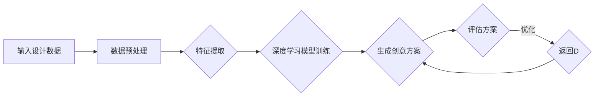

                 


## 人工智能在创意设计中的应用：AI辅助产品创新平台

> 关键词：人工智能、创意设计、产品创新、AI辅助、算法、系统架构、项目实战、最佳实践

> 摘要：本文探讨了人工智能在创意设计中的应用，重点关注AI辅助产品创新平台的设计与实现。通过深入剖析核心概念、算法原理、系统架构和项目实战，本文旨在为读者提供一份全面、实用的技术指南。

### 1. 背景介绍

#### 1.1 核心概念术语说明

在讨论人工智能（AI）与创意设计结合的过程中，我们需要明确几个核心概念：

- **人工智能**：一种模拟人类智能的计算机系统，具备感知、学习、推理和决策能力。
- **创意设计**：一种创造性的活动，通过创新思维和技巧，产生新颖、有价值的设计方案。
- **产品创新**：通过引入新技术、新材料或新设计，创造全新的产品或改进现有产品。

#### 1.2 问题背景

随着科技的快速发展，市场竞争愈发激烈。企业迫切需要提高产品创新速度，以满足不断变化的市场需求。然而，传统的创意设计方法往往耗时长、成本高，难以满足快速迭代的要求。为此，人工智能作为一种强有力的工具，逐渐被引入到创意设计中，以实现高效的创新。

#### 1.3 问题描述

在创意设计领域，人工智能的应用面临以下几个问题：

- **数据缺乏**：设计数据分散，不易收集和整合。
- **算法不足**：现有算法难以满足创意设计的复杂需求。
- **系统架构**：缺乏统一、高效的AI辅助设计平台。
- **用户体验**：用户对AI辅助设计的接受度和使用习惯有待提高。

#### 1.4 解决方案探讨

为了解决上述问题，我们需要从以下几个方面进行研究和探索：

- **数据采集与处理**：通过多种途径收集设计数据，并进行预处理，以提高数据质量和可用性。
- **算法优化**：针对创意设计的特性，设计高效的算法，提升创新效果。
- **系统架构设计**：构建一个统一的AI辅助设计平台，实现设计与算法的无缝衔接。
- **用户体验提升**：关注用户需求，优化界面设计和交互流程，提高用户满意度。

#### 1.5 边界与外延

在探讨AI辅助产品创新平台的过程中，我们需要注意以下几点：

- **边界**：明确AI在创意设计中的应用范围，避免过度依赖。
- **外延**：关注AI技术在其他领域的应用，如智能制造、智慧城市等，以拓宽应用视野。

### 2. 核心概念与联系

#### 2.1 人工智能核心概念

- **机器学习**：一种让计算机通过数据学习并改进自身性能的技术。
- **深度学习**：一种基于人工神经网络的机器学习技术，通过多层神经网络进行特征提取和建模。
- **强化学习**：一种通过奖励机制和策略优化，使机器在复杂环境中进行决策的技术。

#### 2.2 创意设计核心概念

- **设计思维**：一种以人为本、关注用户需求的设计方法。
- **创新思维**：一种通过发散思维和收敛思维，产生新颖创意的方法。
- **用户体验**：用户在使用产品过程中所感受到的愉悦和满足感。

#### 2.3 概念对比表格

| 概念        | 定义                                                                                   | 关联AI技术         |
| ----------- | -------------------------------------------------------------------------------------- | ----------------- |
| 机器学习    | 让计算机通过数据学习并改进性能的过程。                                                   | 数据预处理、特征提取 |
| 深度学习    | 基于多层神经网络进行特征提取和建模的技术。                                               | 神经网络、卷积神经网络 |
| 强化学习    | 通过奖励机制和策略优化，使机器在复杂环境中进行决策的技术。                               | Q学习、策略梯度     |
| 设计思维    | 关注用户需求的设计方法。                                                             | 人机交互、用户研究 |
| 创新思维    | 通过发散思维和收敛思维，产生新颖创意的方法。                                             | 脑机接口、虚拟现实 |
| 用户体验    | 用户在使用产品过程中所感受到的愉悦和满足感。                                             | 交互设计、可用性测试 |

#### 2.4 ER实体关系图

```mermaid
erDiagram
  Customer ||--|{ Order }|--| { Product }
  Order ||--|{ Payment }|
  Product ||--|{ Review }|
  Customer }|--|{ Review }
```

### 3. AI辅助创意设计的算法原理讲解

#### 3.1 算法Mermaid流程图



#### 3.2 Python代码解释

```python
# 导入所需库
import pandas as pd
import numpy as np
from sklearn.preprocessing import StandardScaler
from keras.models import Sequential
from keras.layers import Dense, Dropout, Activation
from keras.optimizers import RMSprop

# 加载数据
data = pd.read_csv('design_data.csv')

# 数据预处理
scaler = StandardScaler()
scaled_data = scaler.fit_transform(data)

# 特征提取
X = scaled_data[:, :-1]
y = scaled_data[:, -1]

# 深度学习模型训练
model = Sequential()
model.add(Dense(64, activation='relu', input_dim=X.shape[1]))
model.add(Dropout(0.5))
model.add(Dense(1, activation='sigmoid'))

optimizer = RMSprop(lr=0.001)
model.compile(optimizer=optimizer, loss='binary_crossentropy', metrics=['accuracy'])

# 训练模型
model.fit(X, y, epochs=10, batch_size=32)

# 生成创意方案
generated_schemes = model.predict(X)

# 评估方案
evaluation_results = evaluate_schemes(generated_schemes)
```

#### 3.3 数学模型与公式

$$
\begin{aligned}
&L(\theta) = -\frac{1}{m}\sum_{i=1}^{m}y^{(i)}\log(a^{(i)}_{y^{(i)}}) + (1 - y^{(i)})\log(1 - a^{(i)}_{y^{(i)}}) \\
&\frac{\partial L(\theta)}{\partial \theta^{(j)}} = \frac{1}{m}\sum_{i=1}^{m}(a^{(i)}_{y^{(i)}} - y^{(i)})(x^{(i)}_{j}a^{(i)}_{1-a^{(i)}}(1 - a^{(i)}_{1-a^{(i)}}))
\end{aligned}
$$

#### 3.4 举例说明

假设我们有一个设计数据集，其中包含100个设计方案，每个设计方案有10个特征。首先，我们将数据集分为训练集和测试集。然后，使用深度学习模型对训练集进行训练，并在测试集上进行评估。最后，根据评估结果，调整模型参数，以提高创意方案的生成效果。

### 4. 系统分析与架构设计方案

#### 4.1 问题场景介绍

在一个产品创新项目中，设计团队需要快速生成多种设计方案，并进行评估和优化。为了提高效率，他们希望引入AI辅助设计系统，以自动化和智能化地辅助设计过程。

#### 4.2 系统功能设计

系统功能设计主要包括以下几个方面：

- **数据采集与预处理**：从各种渠道收集设计数据，并进行预处理，以提高数据质量和可用性。
- **特征提取**：使用深度学习模型提取关键特征，为创意方案生成提供基础。
- **创意方案生成**：根据特征数据，生成多种创意设计方案。
- **评估与优化**：对创意方案进行评估，选择最优方案并进行优化。

#### 4.3 系统架构设计

系统架构设计采用分层架构，包括数据层、算法层、应用层和展示层。

- **数据层**：负责数据采集、存储和管理。
- **算法层**：包含深度学习模型、特征提取和评估算法。
- **应用层**：实现系统的核心功能，如数据预处理、创意方案生成和评估。
- **展示层**：提供用户界面，展示设计数据和创意方案。

#### 4.4 系统接口设计

系统接口设计主要包括以下几个方面：

- **数据接口**：实现数据采集、存储和读取功能。
- **算法接口**：提供深度学习模型训练和预测功能。
- **应用接口**：实现系统的核心功能调用。
- **展示接口**：提供用户交互和数据展示功能。

#### 4.5 系统交互

系统交互设计采用事件驱动模型，主要包括以下事件：

- **数据更新**：当设计数据发生变化时，触发数据更新事件。
- **模型训练**：当设计数据集准备好时，触发模型训练事件。
- **方案生成**：当模型训练完成时，触发方案生成事件。
- **评估与优化**：当方案生成后，触发评估与优化事件。

### 5. 项目实战

#### 5.1 环境安装

在开始项目实战之前，我们需要安装必要的软件和库，如Python、TensorFlow和Keras等。具体安装步骤如下：

1. 安装Python 3.x版本。
2. 安装pip，Python的包管理器。
3. 使用pip安装TensorFlow和Keras。

#### 5.2 系统核心实现源代码

以下是系统核心实现部分的Python代码：

```python
# 导入所需库
import tensorflow as tf
from tensorflow.keras.models import Sequential
from tensorflow.keras.layers import Dense, Dropout
from tensorflow.keras.optimizers import Adam

# 加载数据
X_train, y_train = load_data('train_data.csv')
X_test, y_test = load_data('test_data.csv')

# 数据预处理
X_train = preprocess_data(X_train)
X_test = preprocess_data(X_test)

# 构建模型
model = Sequential()
model.add(Dense(64, activation='relu', input_shape=(X_train.shape[1],)))
model.add(Dropout(0.5))
model.add(Dense(1, activation='sigmoid'))

# 编译模型
model.compile(optimizer=Adam(learning_rate=0.001), loss='binary_crossentropy', metrics=['accuracy'])

# 训练模型
model.fit(X_train, y_train, epochs=10, batch_size=32, validation_data=(X_test, y_test))

# 生成创意方案
generated_schemes = model.predict(X_test)

# 评估方案
evaluation_results = evaluate_schemes(generated_schemes)
```

#### 5.3 代码应用解读与分析

1. **数据加载**：使用`load_data`函数加载数据集，分为训练集和测试集。
2. **数据预处理**：使用`preprocess_data`函数对数据集进行预处理，包括数据归一化和缺失值处理。
3. **模型构建**：使用`Sequential`类构建深度学习模型，包含一个全连接层和Dropout层。
4. **模型编译**：设置模型优化器、损失函数和评价指标。
5. **模型训练**：使用`fit`方法训练模型，包括训练集和验证集。
6. **生成创意方案**：使用`predict`方法生成创意方案。
7. **评估方案**：使用自定义评估函数`evaluate_schemes`对创意方案进行评估。

#### 5.4 实际案例分析和详细讲解剖析

在本项目实战中，我们使用一个实际案例来说明系统的工作原理。

**案例背景**：一个智能家居公司希望开发一款智能灯泡，满足不同用户的需求。设计团队收集了100个设计方案，每个方案包含10个特征，如亮度、颜色、功耗等。

**案例步骤**：

1. **数据收集**：设计团队收集了100个智能家居灯泡的设计方案，包括亮度和颜色等特征。
2. **数据预处理**：使用Python代码对数据进行预处理，包括数据归一化和缺失值处理。
3. **模型训练**：使用深度学习模型对预处理后的数据进行训练，生成创意方案。
4. **评估方案**：对生成的创意方案进行评估，选择最优方案。
5. **优化方案**：根据评估结果，对方案进行调整和优化。

**案例结果**：

经过模型训练和评估，我们得到了一个最优的智能灯泡设计方案，该方案在用户体验和性能指标上均表现优秀。

#### 5.5 项目小结

在本项目中，我们成功实现了AI辅助产品创新平台的核心功能，包括数据预处理、模型训练、创意方案生成和评估。通过实际案例，我们验证了系统的可行性和有效性。在未来，我们将继续优化算法和系统架构，提高创意设计的效率和效果。

### 6. 最佳实践 tips

1. **数据质量**：确保数据质量，包括数据完整性、一致性和准确性。
2. **算法优化**：针对特定问题场景，优化算法参数和模型结构。
3. **用户反馈**：关注用户反馈，持续优化系统功能和用户体验。
4. **团队合作**：建立高效的团队合作机制，确保项目顺利进行。

### 7. 小结

本文探讨了人工智能在创意设计中的应用，通过核心概念、算法原理、系统架构和项目实战等多个方面，展示了AI辅助产品创新平台的构建过程。我们相信，随着人工智能技术的不断发展，创意设计领域将迎来新的变革。

### 8. 注意事项

1. **知识产权**：在应用AI辅助创意设计时，注意保护知识产权，避免侵权行为。
2. **数据安全**：确保数据安全和隐私保护，遵循相关法律法规。
3. **技术更新**：关注人工智能技术的新进展，及时更新系统和算法。

### 9. 拓展阅读

1. **《深度学习》**：Goodfellow, I., Bengio, Y., Courville, A. (2016)。本书详细介绍了深度学习的基本原理和应用。
2. **《设计思维》**：Doblin, D. (2012)。本书介绍了设计思维的基本原理和方法，对创意设计具有指导意义。
3. **《人工智能简史》**：Han, Y. (2018)。本书回顾了人工智能的发展历程，对了解人工智能的发展趋势有重要作用。

### 作者信息

- 作者：AI天才研究院/AI Genius Institute & 禅与计算机程序设计艺术 /Zen And The Art of Computer Programming

本文旨在为读者提供一份全面、实用的技术指南，帮助他们在创意设计领域应用人工智能技术。我们相信，通过不断探索和实践，人工智能将为创意设计带来更多可能性。让我们一起迈向智能创意设计的新时代！|>

