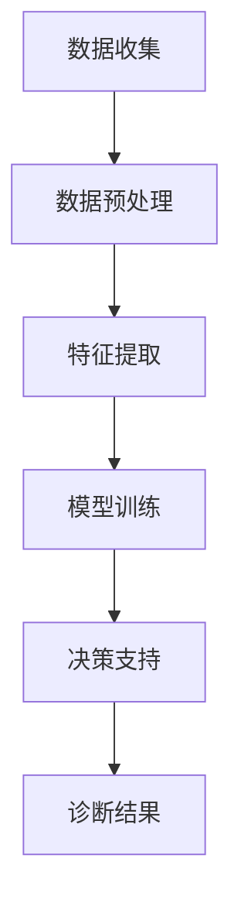
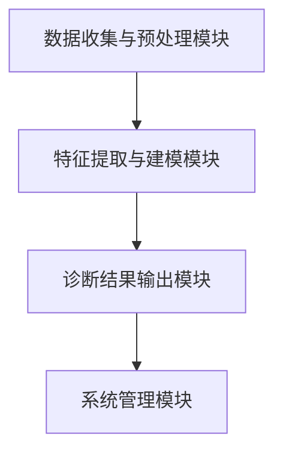

                 

# 人工智能在医疗诊断中的应用：辅助决策与医患关系的变革

> 关键词：人工智能，医疗诊断，辅助决策，医患关系，算法原理，数学模型

> 摘要：本文将深入探讨人工智能在医疗诊断中的应用，特别是辅助决策系统在医患关系变革中的重要作用。通过分析人工智能的定义、特点及其与医疗诊断的关联，我们将展示如何利用人工智能提高医疗诊断的效率和准确性。同时，本文还将探讨医患关系的重要性，以及人工智能如何促进医患关系的变革。通过实际案例和项目实战，我们将详细解析人工智能在医疗诊断中的具体应用和实现方法，为读者提供最佳实践和注意事项。

## 第一部分：背景介绍

### 1.1 问题的背景

随着科技的飞速发展，人工智能（AI）在各个领域的应用越来越广泛，尤其在医疗领域，AI技术的引入为医疗诊断带来了革命性的变化。传统医疗诊断方法存在诸多局限，如诊断效率低、误诊率高、医生依赖性强等。而人工智能的应用则有望解决这些问题，提高医疗诊断的准确性和效率。

### 1.2 问题描述

在医疗诊断中，人工智能如何发挥作用？它能替代医生的部分工作吗？医患关系在医疗诊断中扮演着怎样的角色？本文将围绕这些问题展开讨论，分析人工智能在医疗诊断中的应用及其对医患关系的影响。

### 1.3 问题解决

人工智能在医疗诊断中的应用主要包括辅助决策、图像分析、药物研发等方面。通过利用大数据和机器学习算法，AI系统能够对大量医疗数据进行处理和分析，为医生提供准确的诊断建议。此外，人工智能还能改善医患关系，提高患者的满意度和治疗效果。

### 1.4 边界与外延

本文将讨论人工智能在医疗诊断中的具体应用，包括算法原理、数学模型、系统架构设计等。同时，本文还将探讨医患关系的变革，分析人工智能如何促进医患关系的改善。

### 1.5 概念结构与核心要素组成

本文的核心概念包括人工智能、医疗诊断、辅助决策和医患关系。我们将详细探讨这些概念的定义、特点、相互关系及其在医疗诊断中的应用。

## 第二部分：核心概念与联系

### 2.1 人工智能

#### 2.1.1 定义

人工智能（AI）是指由计算机系统执行的智能行为，包括学习、推理、规划、感知和自然语言理解等。AI可以分为两大类：弱AI和强AI。弱AI具有特定领域的智能，如语音识别、图像识别等；强AI则具有通用智能，可以完成任何需要智能的任务。

#### 2.1.2 特点

人工智能具有以下特点：

1. **高效性**：AI系统可以在短时间内处理大量数据，提高医疗诊断的效率。
2. **准确性**：AI系统通过学习和分析数据，可以提高医疗诊断的准确性。
3. **自主性**：AI系统能够根据数据和算法自主做出决策，减少医生的工作负担。
4. **灵活性**：AI系统可以适应不同的医疗场景和需求，提高医疗诊断的适应性。

#### 2.1.3 与医疗诊断的联系

人工智能在医疗诊断中的应用主要体现在以下几个方面：

1. **辅助决策**：AI系统可以分析患者的病史、检查结果等信息，为医生提供诊断建议。
2. **图像分析**：AI系统可以对医学图像进行自动分析和识别，提高诊断的准确性。
3. **药物研发**：AI系统可以通过分析大量药物数据，加速新药的发现和研发。

### 2.2 医疗诊断

#### 2.2.1 流程

医疗诊断的基本流程包括病史采集、体格检查、实验室检查和影像学检查等。医生根据患者的病史和检查结果，结合临床经验和专业知识，做出最终的诊断。

#### 2.2.2 方法

医疗诊断的方法主要包括病史采集、体格检查、实验室检查和影像学检查等。其中，实验室检查和影像学检查是最常用的诊断方法。

#### 2.2.3 与人工智能的联系

人工智能在医疗诊断中的应用主要体现在以下几个方面：

1. **辅助决策**：AI系统可以分析患者的病史、检查结果等信息，为医生提供诊断建议。
2. **图像分析**：AI系统可以对医学图像进行自动分析和识别，提高诊断的准确性。
3. **药物研发**：AI系统可以通过分析大量药物数据，加速新药的发现和研发。

### 2.3 辅助决策

#### 2.3.1 原理

辅助决策系统是一种基于人工智能的决策支持系统，通过分析大量数据和算法，为医生提供诊断建议和治疗方案。辅助决策系统主要包括以下几个步骤：

1. **数据收集**：收集患者的病史、检查结果等信息。
2. **数据预处理**：对收集到的数据进行清洗、归一化等处理。
3. **特征提取**：从预处理后的数据中提取有用的特征。
4. **模型训练**：利用提取的特征训练机器学习模型。
5. **决策支持**：将训练好的模型应用于实际病例，为医生提供诊断建议。

#### 2.3.2 特点

辅助决策系统具有以下特点：

1. **高效性**：可以在短时间内处理大量数据，提高诊断效率。
2. **准确性**：通过学习和分析数据，可以提高诊断的准确性。
3. **灵活性**：可以根据不同的医疗场景和需求，提供个性化的诊断建议。

#### 2.3.3 与医患关系的联系

辅助决策系统在医患关系中发挥着重要作用：

1. **提高医生的工作效率**：辅助决策系统可以帮助医生快速分析病例，减少工作时间。
2. **改善医患沟通**：辅助决策系统可以为医生提供详细的诊断报告，帮助医生更好地与患者沟通。
3. **提高患者的信任度**：辅助决策系统提供的诊断建议可以提高患者的信任度，改善医患关系。

### 2.4 医患关系

#### 2.4.1 定义

医患关系是指医生与患者之间的互动关系，包括诊断、治疗、护理等环节。良好的医患关系对于患者的康复和治疗至关重要。

#### 2.4.2 特点

医患关系具有以下特点：

1. **信任**：患者对医生的信任是医患关系的基础。
2. **沟通**：医患之间的有效沟通是医患关系的关键。
3. **尊重**：医生对患者的人权和尊严的尊重是医患关系的重要组成部分。

#### 2.4.3 与医疗诊断的联系

医患关系在医疗诊断中起着至关重要的作用：

1. **诊断准确性**：良好的医患关系可以提高诊断的准确性，减少误诊。
2. **治疗方案选择**：医患之间的沟通可以帮助医生更好地了解患者的需求和期望，制定个性化的治疗方案。
3. **患者依从性**：良好的医患关系可以提高患者的治疗依从性，促进患者的康复。

## 第三部分：算法原理讲解

### 3.1 医疗诊断中的算法

#### 3.1.1 算法原理

医疗诊断算法是一种基于人工智能的算法，用于分析患者的病史、检查结果等信息，为医生提供诊断建议。常见的医疗诊断算法包括：

1. **分类算法**：用于分类患者疾病，如逻辑回归、决策树、支持向量机等。
2. **聚类算法**：用于对患者数据进行聚类分析，如K-means、层次聚类等。
3. **深度学习算法**：用于对复杂的数据进行建模和分析，如卷积神经网络、循环神经网络等。

#### 3.1.2 Mermaid流程图

以下是一个简单的医疗诊断算法的Mermaid流程图：



#### 3.1.3 Python源代码

以下是一个简单的医疗诊断算法的Python源代码：

```python
import pandas as pd
from sklearn.model_selection import train_test_split
from sklearn.preprocessing import StandardScaler
from sklearn.svm import SVC
from sklearn.metrics import accuracy_score

# 数据收集
data = pd.read_csv('data.csv')

# 数据预处理
X = data.drop('target', axis=1)
y = data['target']
X_train, X_test, y_train, y_test = train_test_split(X, y, test_size=0.2, random_state=42)

# 特征提取
scaler = StandardScaler()
X_train = scaler.fit_transform(X_train)
X_test = scaler.transform(X_test)

# 模型训练
model = SVC()
model.fit(X_train, y_train)

# 决策支持
y_pred = model.predict(X_test)

# 诊断结果
print("Accuracy:", accuracy_score(y_test, y_pred))
```

#### 3.1.4 算法原理讲解

医疗诊断算法的数学模型和公式如下：

1. **分类算法**：逻辑回归
   $$ P(y=1|X) = \frac{1}{1 + e^{-(\beta_0 + \beta_1X_1 + \beta_2X_2 + ... + \beta_nX_n)}} $$
   
2. **聚类算法**：K-means
   $$ C = \{c_1, c_2, ..., c_k\} $$
   $$ c_i = \frac{1}{n_i} \sum_{x_j \in S_i} x_j $$
   $$ S_i = \{x_j | x_j \in C, x_j \in c_i\} $$
   
3. **深度学习算法**：卷积神经网络（CNN）
   $$ f(x) = \sigma(W \cdot x + b) $$
   $$ \sigma(x) = \max(0, x) $$
   
通过上述算法原理和代码示例，我们可以了解到医疗诊断算法的基本原理和应用方法。

## 第四部分：数学模型和数学公式

### 4.1 医疗诊断中的数学模型

医疗诊断中的数学模型主要包括分类模型、聚类模型和深度学习模型。以下分别介绍这些模型的数学模型和公式。

#### 4.1.1 分类模型

分类模型用于对患者数据进行分类，常见的分类模型包括逻辑回归、决策树和支持向量机等。

1. **逻辑回归**
   $$ P(y=1|X) = \frac{1}{1 + e^{-(\beta_0 + \beta_1X_1 + \beta_2X_2 + ... + \beta_nX_n)}} $$
   
2. **决策树**
   $$ G(y|X) = \sum_{i=1}^{n} w_i \cdot G(y|X_i) $$
   $$ G(y|X_i) = P(y=1|X_i) $$
   
3. **支持向量机**
   $$ \min_{\beta, \beta_0} \frac{1}{2} \sum_{i=1}^{n} (\beta \cdot \beta - \beta_0^2) $$
   $$ s.t. \ y_i (\beta \cdot x_i + \beta_0) \geq 1 $$

#### 4.1.2 聚类模型

聚类模型用于对患者数据进行聚类分析，常见的聚类模型包括K-means和层次聚类等。

1. **K-means**
   $$ C = \{c_1, c_2, ..., c_k\} $$
   $$ c_i = \frac{1}{n_i} \sum_{x_j \in S_i} x_j $$
   $$ S_i = \{x_j | x_j \in C, x_j \in c_i\} $$
   
2. **层次聚类**
   $$ G(y|X) = \sum_{i=1}^{n} w_i \cdot G(y|X_i) $$
   $$ G(y|X_i) = P(y=1|X_i) $$

#### 4.1.3 深度学习模型

深度学习模型用于对患者数据进行复杂建模和分析，常见的深度学习模型包括卷积神经网络（CNN）和循环神经网络（RNN）等。

1. **卷积神经网络（CNN）**
   $$ f(x) = \sigma(W \cdot x + b) $$
   $$ \sigma(x) = \max(0, x) $$
   
2. **循环神经网络（RNN）**
   $$ h_t = \sigma(W_h \cdot [h_{t-1}, x_t] + b_h) $$
   $$ o_t = \sigma(W_o \cdot h_t + b_o) $$

### 4.2 数学公式讲解

以下是对上述数学公式的详细讲解：

#### 4.2.1 逻辑回归

逻辑回归是一种经典的分类模型，用于预测二分类问题。其数学模型为：

$$ P(y=1|X) = \frac{1}{1 + e^{-(\beta_0 + \beta_1X_1 + \beta_2X_2 + ... + \beta_nX_n)}} $$

其中，$X$表示输入特征，$\beta_0, \beta_1, \beta_2, ..., \beta_n$为模型参数。通过训练数据，我们可以求得最优参数$\beta_0, \beta_1, \beta_2, ..., \beta_n$，从而实现分类预测。

#### 4.2.2 决策树

决策树是一种基于树结构的分类模型，通过递归地将数据划分为多个子集，最终实现分类。其数学模型为：

$$ G(y|X) = \sum_{i=1}^{n} w_i \cdot G(y|X_i) $$

其中，$X$表示输入特征，$w_i$表示每个子集的概率。决策树通过递归地将数据划分为多个子集，直到达到某个停止条件，如最大深度或最小叶节点样本数。

#### 4.2.3 支持向量机

支持向量机是一种基于间隔最大化原理的分类模型，其数学模型为：

$$ \min_{\beta, \beta_0} \frac{1}{2} \sum_{i=1}^{n} (\beta \cdot \beta - \beta_0^2) $$

$$ s.t. \ y_i (\beta \cdot x_i + \beta_0) \geq 1 $$

其中，$X$表示输入特征，$\beta$表示模型参数，$\beta_0$为偏置项。支持向量机通过求解上述优化问题，求得最优参数$\beta$和$\beta_0$，从而实现分类预测。

#### 4.2.4 K-means

K-means是一种基于距离度量的聚类模型，其数学模型为：

$$ C = \{c_1, c_2, ..., c_k\} $$

$$ c_i = \frac{1}{n_i} \sum_{x_j \in S_i} x_j $$

$$ S_i = \{x_j | x_j \in C, x_j \in c_i\} $$

其中，$C$表示聚类中心，$c_i$表示第$i$个聚类中心，$S_i$表示第$i$个聚类中心对应的样本集合。K-means通过迭代优化聚类中心，使得每个聚类中心与其对应的样本集合之间的距离最小。

#### 4.2.5 层次聚类

层次聚类是一种基于层次结构的聚类模型，其数学模型为：

$$ G(y|X) = \sum_{i=1}^{n} w_i \cdot G(y|X_i) $$

$$ G(y|X_i) = P(y=1|X_i) $$

其中，$X$表示输入特征，$w_i$表示每个子集的概率。层次聚类通过递归地将数据划分为多个子集，并计算每个子集的概率，从而实现聚类。

#### 4.2.6 卷积神经网络（CNN）

卷积神经网络是一种基于卷积运算的深度学习模型，其数学模型为：

$$ f(x) = \sigma(W \cdot x + b) $$

$$ \sigma(x) = \max(0, x) $$

其中，$x$表示输入特征，$W$表示卷积核，$b$为偏置项。卷积神经网络通过多个卷积层和池化层，对输入特征进行卷积运算和池化操作，从而提取特征。

#### 4.2.7 循环神经网络（RNN）

循环神经网络是一种基于循环结构的深度学习模型，其数学模型为：

$$ h_t = \sigma(W_h \cdot [h_{t-1}, x_t] + b_h) $$

$$ o_t = \sigma(W_o \cdot h_t + b_o) $$

其中，$h_t$表示第$t$个时间步的隐藏状态，$x_t$表示第$t$个时间步的输入特征，$W_h$和$W_o$分别表示权重矩阵，$b_h$和$b_o$分别表示偏置项。循环神经网络通过递归地计算隐藏状态，实现对时间序列数据的建模。

通过上述数学公式和讲解，我们可以了解到医疗诊断中的常见算法原理及其数学模型，为实际应用提供理论支持。

## 第五部分：系统分析与架构设计方案

### 5.1 问题场景介绍

在医疗诊断中，医生需要对大量病例进行分析和诊断，但传统的医疗诊断方法存在诸多局限，如诊断效率低、误诊率高、医生依赖性强等。为了解决这些问题，我们可以设计一个基于人工智能的医疗诊断系统，以提高诊断效率和准确性。

### 5.2 项目介绍

本项目旨在设计一个基于人工智能的医疗诊断系统，该系统将利用机器学习和深度学习算法，对患者的病史、检查结果等数据进行处理和分析，为医生提供准确的诊断建议。系统主要包括以下功能模块：

1. 数据收集与预处理模块
2. 特征提取与建模模块
3. 诊断结果输出模块
4. 系统管理模块

### 5.3 系统功能设计

系统功能设计主要包括以下方面：

1. 数据收集与预处理模块：负责收集和预处理患者的医疗数据，包括病史、检查结果、实验室报告等。
2. 特征提取与建模模块：利用机器学习和深度学习算法，对预处理后的数据进行特征提取和建模，为诊断提供支持。
3. 诊断结果输出模块：根据诊断模型的结果，为医生提供诊断建议和治疗方案。
4. 系统管理模块：负责系统的日常运行、维护和更新。

### 5.4 系统架构设计

系统架构设计主要包括以下方面：

1. 系统总体架构设计：采用前后端分离的架构，前端负责界面展示，后端负责数据处理和计算。
2. 数据流架构设计：数据从前端传入后端，经过数据处理和分析，最终输出诊断结果。
3. 功能模块架构设计：系统功能模块之间通过接口进行通信和协作，实现系统的整体功能。

以下是系统架构的Mermaid架构图：



### 5.5 系统接口设计

系统接口设计主要包括以下方面：

1. 数据接口：负责数据的输入和输出，包括患者的医疗数据、诊断结果等。
2. 功能接口：负责系统功能的调用和执行，包括数据预处理、特征提取、模型训练、诊断结果输出等。
3. 管理接口：负责系统的日常运行、维护和更新。

### 5.6 系统交互

系统交互主要包括以下方面：

1. 数据交互：系统内部各模块之间通过数据接口进行数据传输和共享。
2. 功能交互：系统内部各模块之间通过功能接口进行功能调用和协作。
3. 管理交互：系统管理员通过管理接口对系统进行管理和维护。

以下是系统交互的Mermaid序列图：

```mermaid
sequenceDiagram
    participant 用户 as 用户
    participant 系统管理模块 as 系统管理
    participant 数据收集与预处理模块 as 数据预处理
    participant 特征提取与建模模块 as 特征提取
    participant 诊断结果输出模块 as 诊断结果

    用户->>系统管理模块: 登录系统
    系统

