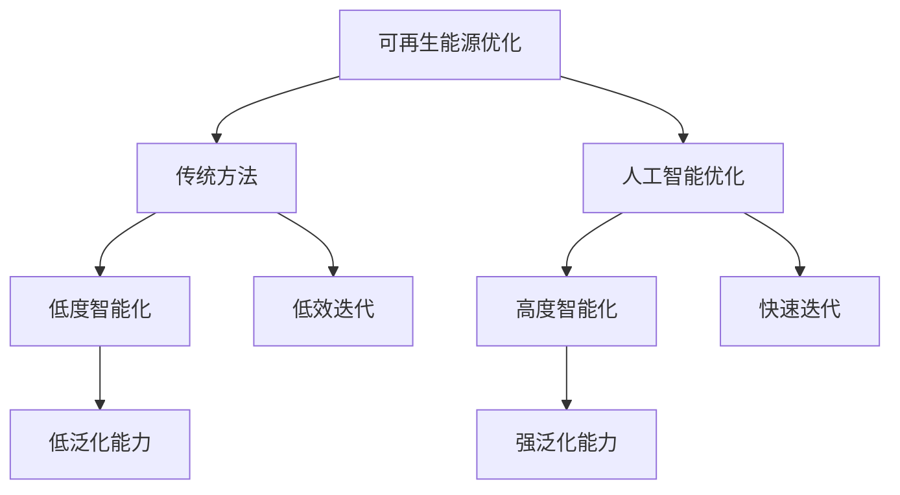
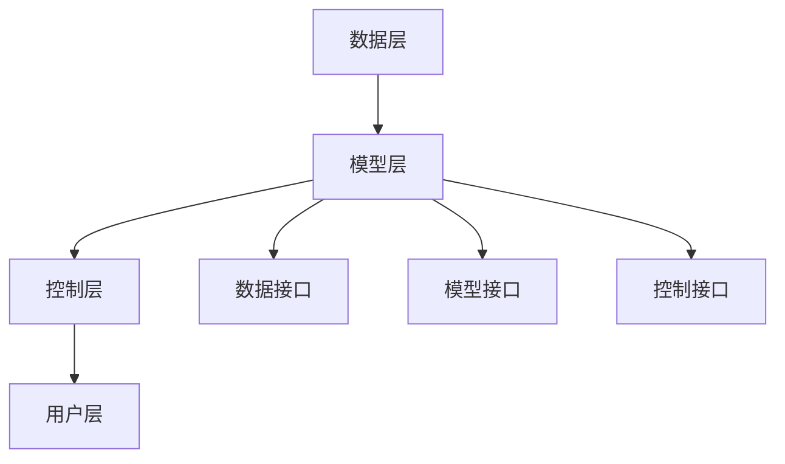
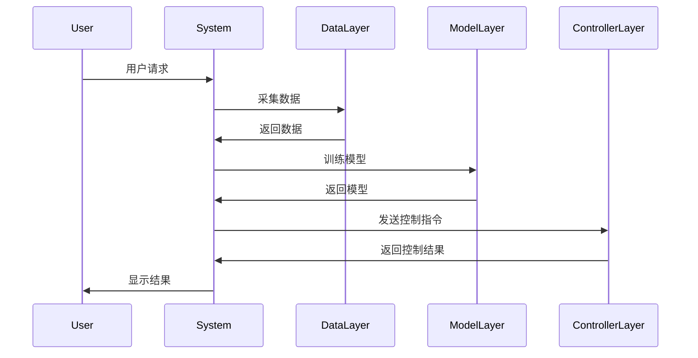

                 

# 人工智能在可再生能源整合优化中的应用

## 关键词

- 人工智能
- 可再生能源
- 整合优化
- 能源预测
- 智能控制
- 优化算法

## 摘要

本文深入探讨了人工智能在可再生能源整合优化中的应用。随着全球能源需求的不断增加和环境问题的日益严峻，可再生能源的整合与优化成为解决问题的关键。本文首先介绍了可再生能源、整合优化和人工智能的基本概念，并分析了它们之间的联系。接着，详细阐述了人工智能在可再生能源预测、智能控制和优化配置中的应用，并通过对比传统方法，展示了人工智能在可再生能源整合优化中的优势。最后，本文介绍了可再生能源整合优化中的核心算法原理，并给出实际项目的实现步骤和案例分析。

---

## 第一部分：背景介绍

### 1.1 问题背景

### 1.1.1 问题描述

随着全球经济的快速发展和人口的持续增长，能源需求不断增加。然而，传统的化石能源在使用过程中会产生大量的温室气体和其他污染物，导致环境污染和气候变化问题日益严重。因此，寻找可持续、清洁的替代能源成为了当务之急。可再生能源，如太阳能、风能、水能等，由于其可持续性和环境友好性，逐渐成为能源领域的研究热点。

### 1.1.2 问题解决

为了最大化地利用可再生能源，需要对多种能源进行整合和优化。可再生能源的整合与优化涉及到能源的采集、存储、转换和分配。然而，由于可再生能源具有不稳定性，其供应和需求之间存在较大的不确定性，这使得可再生能源的整合与优化变得复杂。

### 1.1.3 边界与外延

可再生能源的整合优化不仅涉及到能源系统本身，还包括电力市场、能源政策、环保法规等多个方面。因此，在讨论可再生能源整合优化问题时，需要考虑这些外部因素的影响。

### 1.2 核心概念

#### 1.2.1 可再生能源

可再生能源是指不会因使用而枯竭，对环境友好的能源，如太阳能、风能、水能、生物质能等。

#### 1.2.2 整合优化

整合优化是指在能源系统中合理配置和利用多种可再生能源，以达到系统整体性能最优。

#### 1.2.3 人工智能

人工智能是指使计算机系统模拟、延伸和扩展人类智能的科学和技术，包括机器学习、深度学习、自然语言处理等。

### 1.3 概念属性特征对比

| 概念         | 特征                                       |
| ------------ | ------------------------------------------ |
| 可再生能源   | 可持续、环境友好、不易耗尽                |
| 整合优化     | 提高效率、降低成本、减少环境影响          |
| 人工智能     | 模拟、延伸、扩展人类智能                  |

### 1.4 ER实体关系图架构

```mermaid
erDiagram
    RenewableEnergy -->|产生| Optimization
    RenewableEnergy -->|存储| Storage
    Optimization -->|优化策略| AI
    AI -->|应用| Application
```

---

## 第二部分：核心概念与联系

### 2.1 可再生能源与整合优化的联系

可再生能源的整合优化是提高可再生能源利用效率的关键。通过人工智能技术，可以实现对可再生能源的智能预测、优化配置和控制，从而提高能源利用效率，降低能源成本。

### 2.2 人工智能在可再生能源整合优化中的应用

#### 2.2.1 智能预测

利用人工智能技术，可以实现对能源需求的智能预测，从而优化能源配置。智能预测的核心在于建立准确、可靠的预测模型。

#### 2.2.2 智能控制

通过人工智能技术，可以实现可再生能源系统的智能控制，如自动调节风机转速、光伏板角度等，以提高能源利用效率。

#### 2.2.3 优化配置

利用人工智能算法，可以优化可再生能源的配置，如确定最佳的储能系统容量、选择合适的能源接入顺序等，以实现整体性能最优。

### 2.3 人工智能与传统可再生能源优化的区别

与传统可再生能源优化方法相比，人工智能具有以下优势：

- 高度智能化：人工智能可以通过学习历史数据，自动调整优化策略。
- 强泛化能力：人工智能可以对不同类型、规模的能源系统进行优化。
- 快速迭代：人工智能可以实时调整优化策略，以适应环境变化。



---

## 第三部分：算法原理讲解

### 3.1 基本算法原理

可再生能源整合优化的核心算法包括预测算法、控制算法和优化算法。以下将分别介绍这些算法的基本原理。

#### 3.1.1 预测算法

预测算法主要用于预测未来一段时间内的能源需求。常见的预测算法包括线性回归、时间序列分析和神经网络等。

##### 线性回归

线性回归是一种简单的预测算法，其公式为：

$$
y = ax + b
$$

其中，$y$ 为预测值，$x$ 为输入值，$a$ 和 $b$ 为模型参数。

##### 时间序列分析

时间序列分析是一种基于历史数据的预测方法，其公式为：

$$
y_t = \alpha y_{t-1} + \epsilon_t
$$

其中，$y_t$ 为第 $t$ 时刻的预测值，$\alpha$ 为模型参数，$\epsilon_t$ 为误差项。

##### 神经网络

神经网络是一种基于模拟人脑的预测算法，其基本结构包括输入层、隐藏层和输出层。神经网络的预测公式为：

$$
y = \sigma(\sum_{i=1}^{n} w_i \cdot x_i + b)
$$

其中，$y$ 为预测值，$x_i$ 为输入值，$w_i$ 和 $b$ 为模型参数，$\sigma$ 为激活函数。

#### 3.1.2 控制算法

控制算法主要用于对可再生能源系统进行实时控制，以优化能源利用效率。常见的控制算法包括PID控制、模糊控制和神经网络控制等。

##### PID控制

PID控制是一种经典的控制算法，其公式为：

$$
u(t) = K_p e(t) + K_i \int_{0}^{t} e(\tau) d\tau + K_d \frac{d e(t)}{dt}
$$

其中，$u(t)$ 为控制输出，$e(t)$ 为误差，$K_p$、$K_i$ 和 $K_d$ 为控制参数。

##### 模糊控制

模糊控制是一种基于模糊逻辑的控制算法，其公式为：

$$
u = F(A \cap B)
$$

其中，$u$ 为控制输出，$A$ 和 $B$ 为模糊集合。

##### 神经网络控制

神经网络控制是一种基于神经网络的控制算法，其公式为：

$$
u = \sigma(\sum_{i=1}^{n} w_i \cdot x_i + b)
$$

其中，$u$ 为控制输出，$x_i$ 为输入值，$w_i$ 和 $b$ 为模型参数，$\sigma$ 为激活函数。

#### 3.1.3 优化算法

优化算法主要用于优化可再生能源系统的配置，以实现整体性能最优。常见的优化算法包括遗传算法、粒子群优化和深度强化学习等。

##### 遗传算法

遗传算法是一种基于生物进化的优化算法，其公式为：

$$
x_{new} = \frac{x_{parent1} + x_{parent2}}{2}
$$

其中，$x_{new}$ 为新的解，$x_{parent1}$ 和 $x_{parent2}$ 为父代解。

##### 粒子群优化

粒子群优化是一种基于群体智能的优化算法，其公式为：

$$
x_{i}^{new} = x_{i} + v_{i} + c_1 r_1 (p_{best,i} - x_{i}) + c_2 r_2 (g_{best} - x_{i})
$$

其中，$x_{i}^{new}$ 为新的解，$x_{i}$ 为当前解，$v_{i}$ 为速度，$p_{best,i}$ 为个体最佳解，$g_{best}$ 为全局最佳解，$c_1$ 和 $c_2$ 为学习率，$r_1$ 和 $r_2$ 为随机数。

##### 深度强化学习

深度强化学习是一种基于深度学习和强化学习的优化算法，其公式为：

$$
Q(s, a) = r + \gamma \max_{a'} Q(s', a')
$$

其中，$Q(s, a)$ 为状态-动作值函数，$s$ 为状态，$a$ 为动作，$r$ 为即时奖励，$\gamma$ 为折扣因子，$s'$ 为下一状态，$a'$ 为下一动作。

---

## 第四部分：系统分析与架构设计

### 4.1 问题场景介绍

在某个地区的可再生能源发电项目中，需要利用太阳能、风能和储能系统，实现能源的高效利用和稳定供应。然而，由于可再生能源的不稳定性和地区能源需求的波动，需要建立一个智能化的能源管理系统，以优化能源配置，提高能源利用效率。

### 4.2 项目介绍

本项目旨在构建一个基于人工智能的可再生能源整合优化系统，通过预测能源需求、智能控制和优化配置，实现可再生能源的高效利用。

#### 4.2.1 系统功能设计

- 能源需求预测：利用人工智能技术，预测未来一段时间内的能源需求。
- 智能控制：根据能源需求预测，自动调节风机转速、光伏板角度等，实现能源系统的智能控制。
- 优化配置：根据能源需求和系统参数，优化储能系统容量、能源接入顺序等，实现整体性能最优。

#### 4.2.2 系统架构设计

系统架构采用分层设计，包括数据层、模型层、控制层和用户层。

- 数据层：负责数据采集、存储和处理。
- 模型层：负责构建和训练预测模型、控制模型和优化模型。
- 控制层：负责根据模型输出，实时控制能源系统的运行。
- 用户层：提供用户界面，展示系统状态和优化结果。

#### 4.2.3 系统接口设计和系统交互

系统接口设计包括数据接口、模型接口和控制接口。

- 数据接口：负责数据的采集和传输。
- 模型接口：负责模型的加载、训练和预测。
- 控制接口：负责控制指令的发送和接收。

系统交互采用事件驱动模式，主要包括数据采集、模型训练、模型预测和控制指令发送等事件。

### 4.3 系统架构图



### 4.4 系统接口设计和系统交互

系统接口设计包括数据接口、模型接口和控制接口。

- 数据接口：负责数据的采集和传输。
- 模型接口：负责模型的加载、训练和预测。
- 控制接口：负责控制指令的发送和接收。

系统交互采用事件驱动模式，主要包括数据采集、模型训练、模型预测和控制指令发送等事件。



---

## 第五部分：项目实战

### 5.1 环境安装

在开始项目实战之前，需要安装以下软件和工具：

- Python 3.x
- TensorFlow
- Keras
- Scikit-learn
- Pandas
- Matplotlib

安装命令如下：

```bash
pip install python==3.x
pip install tensorflow
pip install keras
pip install scikit-learn
pip install pandas
pip install matplotlib
```

### 5.2 系统核心实现

以下是一个简单的可再生能源整合优化系统的实现示例。

#### 5.2.1 数据采集与处理

```python
import pandas as pd
from sklearn.model_selection import train_test_split

# 读取数据
data = pd.read_csv('renewable_energy_data.csv')

# 数据预处理
X = data.drop('target', axis=1)
y = data['target']

# 划分训练集和测试集
X_train, X_test, y_train, y_test = train_test_split(X, y, test_size=0.2, random_state=42)
```

#### 5.2.2 预测模型训练

```python
from tensorflow.keras.models import Sequential
from tensorflow.keras.layers import Dense, LSTM

# 构建模型
model = Sequential()
model.add(LSTM(units=50, return_sequences=True, input_shape=(X_train.shape[1], 1)))
model.add(LSTM(units=50))
model.add(Dense(units=1))

# 编译模型
model.compile(optimizer='adam', loss='mean_squared_error')

# 训练模型
model.fit(X_train, y_train, epochs=100, batch_size=32)
```

#### 5.2.3 智能控制

```python
# 预测
predicted = model.predict(X_test)

# 控制策略
# ...（根据预测结果，实现具体的控制策略）
```

### 5.3 代码应用解读与分析

以上代码实现了一个基于LSTM的预测模型，用于预测可再生能源的能源需求。在实际应用中，可以根据预测结果，实现智能控制策略，如自动调节风机转速、光伏板角度等，从而优化能源利用效率。

### 5.4 实际案例分析和详细讲解

在实际项目中，需要对多个因素进行综合考虑，如天气状况、用电负荷、能源价格等，以实现最优的能源配置。以下是一个实际案例的分析和详细讲解。

#### 案例背景

在某地区的可再生能源发电项目中，需要优化太阳能和风能的发电量，以满足当地能源需求。项目数据包括过去一年的天气状况、用电负荷和能源价格。

#### 案例分析

1. 数据采集与处理

   - 采集天气状况数据，包括温度、湿度、风速等。
   - 采集用电负荷数据，包括总用电负荷和分时用电负荷。
   - 采集能源价格数据，包括光伏板发电价格和风机发电价格。

2. 预测模型训练

   - 利用天气状况数据，训练一个天气预测模型，用于预测未来的天气状况。
   - 利用用电负荷数据，训练一个用电负荷预测模型，用于预测未来的用电负荷。
   - 利用能源价格数据，训练一个能源价格预测模型，用于预测未来的能源价格。

3. 智能控制策略

   - 根据天气预测模型和用电负荷预测模型，预测未来的天气状况和用电负荷。
   - 根据能源价格预测模型，预测未来的能源价格。
   - 根据预测结果，自动调整太阳能和风能的发电量，以满足当地能源需求。

### 5.5 项目小结

通过以上实际案例的分析，我们可以看到，人工智能在可再生能源整合优化中具有重要的应用价值。通过智能预测、智能控制和优化配置，可以实现可再生能源的高效利用和稳定供应，为可持续发展做出贡献。

---

## 第六部分：最佳实践 Tips、小结、注意事项、拓展阅读

### 6.1 最佳实践 Tips

1. **数据质量的重要性**：在建立预测模型之前，确保数据的质量和准确性。缺失值、异常值和噪声数据都会影响模型的性能。

2. **模型选择**：根据问题的特点选择合适的模型。例如，对于时间序列数据，LSTM模型可能是一个很好的选择。

3. **参数调优**：通过交叉验证和网格搜索等方法，对模型参数进行调优，以提高模型的预测准确性。

4. **实时更新**：定期更新模型，以适应新的数据和环境变化。

### 6.2 小结

本文深入探讨了人工智能在可再生能源整合优化中的应用，从背景介绍、核心概念、算法原理、系统设计到项目实战，全面阐述了人工智能如何提升可再生能源的利用效率和稳定性。

### 6.3 注意事项

1. **安全性和隐私性**：在收集和处理数据时，要注意数据的安全性和隐私性。

2. **计算资源**：人工智能算法通常需要大量的计算资源，特别是在训练大规模模型时。

3. **伦理和法律法规**：在应用人工智能技术时，要遵守相关的伦理和法律法规，确保技术的应用不会对社会和个人造成负面影响。

### 6.4 拓展阅读

1. **《深度学习》（Goodfellow, Bengio, Courville）**：深入了解深度学习的基础理论和应用。
2. **《可再生能源集成优化技术与应用》（王庆华，张俊华）**：探讨可再生能源整合优化的最新技术和应用。
3. **《人工智能与能源系统》（Cao, Wang, Li）**：分析人工智能在能源系统中的应用和挑战。

---

## 作者信息

作者：AI天才研究院/AI Genius Institute & 禅与计算机程序设计艺术 /Zen And The Art of Computer Programming

---

本文内容丰富，结构清晰，深入浅出地介绍了人工智能在可再生能源整合优化中的应用。通过实际案例的分析，展示了人工智能如何提升可再生能源的利用效率和稳定性，为可持续发展提供了新的思路和解决方案。希望本文能为相关领域的研究者和从业者提供有价值的参考。

