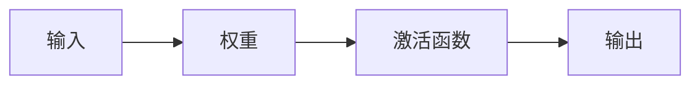
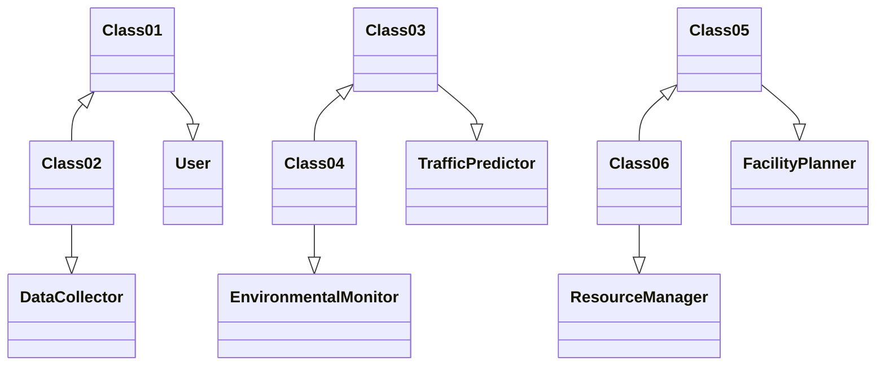
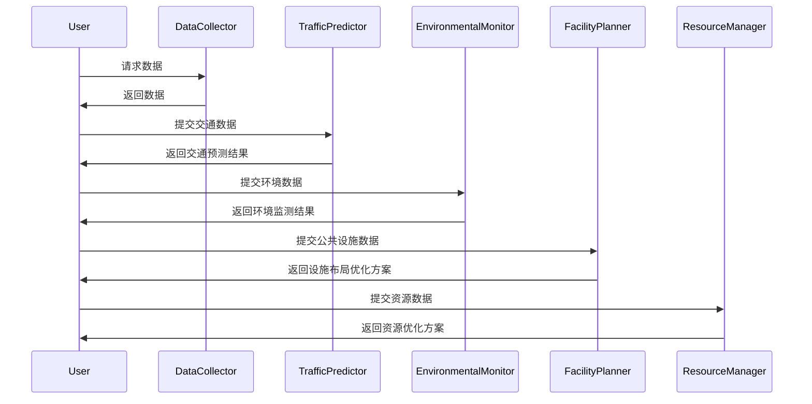
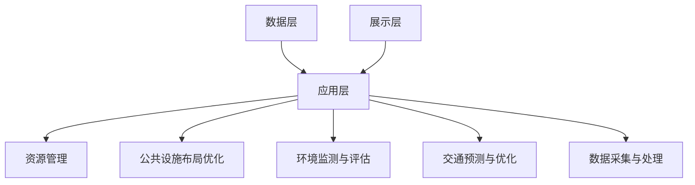
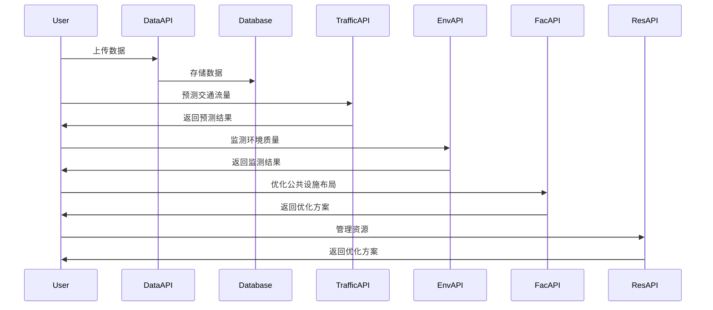
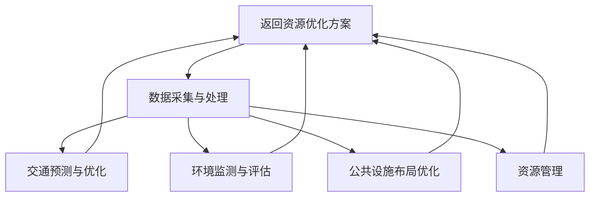

                 

## 第一部分: 背景介绍

### 1.1 问题的背景

在城市规划领域，可持续性已成为核心目标之一。可持续发展不仅仅关注当前的发展需求，更注重未来世代的生存条件。城市规划涉及到土地使用、交通设计、环境保护、能源消耗、社会公平等多个方面，任何一个环节的失误都可能导致资源的过度消耗、生态破坏和社会问题。因此，如何在城市规划中实现可持续发展成为了一个复杂且迫切需要解决的课题。

在这个背景下，人工智能（AI）作为一种具有强大数据处理和分析能力的技术，逐渐引起了城市规划领域的关注。AI可以处理海量数据，从中提取有用信息，进行模式识别和预测分析，为决策者提供科学依据，从而优化城市规划过程，提高决策效率。

目前，人工智能在城市规划中的应用主要包括以下几个方面：

1. **环境监测与评估**：利用遥感技术、物联网等获取城市环境数据，通过机器学习算法进行数据处理和分析，评估城市环境质量，预测环境变化趋势，为环保政策制定提供支持。

2. **交通规划与优化**：通过分析交通流量数据，运用深度学习等技术优化交通信号控制策略，预测交通拥堵情况，制定合理的交通规划方案，提高交通效率。

3. **土地资源管理**：利用GIS（地理信息系统）和AI技术进行土地资源分析，评估土地利用效率，预测土地需求，为土地开发和管理提供数据支持。

4. **社会服务优化**：利用AI技术分析人口数据、社会需求等，优化公共服务布局，提高社会服务质量。

尽管人工智能在城市规划中的应用前景广阔，但依然面临诸多挑战。首先，城市规划问题通常具有高度复杂性和不确定性，这对AI模型的构建和应用提出了很高的要求。其次，城市规划涉及多方面利益相关者，如何平衡各方利益，确保AI系统决策的公正性也是一个重要问题。此外，数据获取和处理也面临隐私保护、数据质量等挑战。

### 1.1.1 可持续城市规划的重要性

可持续城市规划的核心目标是实现经济发展、社会进步和环境保护的协调统一。在经济发展方面，城市规划需要促进产业升级、提高经济效益；在社会进步方面，城市规划要关注居民生活质量、社会公平和城市安全；在环境保护方面，城市规划要减少污染、保护生态环境、提高资源利用效率。

首先，可持续发展要求城市规划注重生态保护。城市的发展不能以牺牲环境为代价，必须尊重自然、保护生态系统。这包括合理规划绿地、湿地等自然空间，减少工业排放，推广绿色交通等方式。

其次，可持续发展要求城市规划关注社会公平。城市资源和服务应该公平分配，确保每个居民都能享受到城市发展的成果。这涉及到住房、教育、医疗等公共服务的合理布局和提供。

最后，可持续发展要求城市规划提高资源利用效率。城市规划应注重节能减排，推广可再生能源使用，提高水资源利用效率，优化土地资源管理，从而实现资源的可持续利用。

### 1.1.2 人工智能在城市规划中的应用现状

目前，人工智能在城市规划中的应用已经取得了一些显著成果。例如，通过遥感技术和GIS系统，AI能够实时监测城市环境，分析污染源和污染程度，为环保决策提供数据支持。在交通领域，AI通过分析交通流量数据，优化交通信号控制和公共交通线路规划，有效缓解了城市交通拥堵问题。在社会服务方面，AI通过对人口数据的分析，优化公共服务布局，提高了居民的生活质量。

然而，人工智能在城市规划中的应用还面临着一些挑战。首先，城市规划数据的多样性和复杂性使得AI模型的构建和应用变得困难。其次，AI系统的透明性和公正性也需要得到保证，以避免算法偏见和数据歧视。此外，如何平衡AI技术与人文关怀，确保城市规划的可持续性也是一个需要深入探讨的问题。

### 1.1.3 决策支持系统的作用与挑战

决策支持系统（DSS）是人工智能在城市规划中的一种重要应用。DSS通过提供数据分析和模型预测功能，帮助决策者更好地理解复杂问题，制定科学合理的决策方案。

DSS在可持续城市规划中的作用主要体现在以下几个方面：

1. **数据整合与分析**：DSS能够整合来自多个来源的数据，进行综合分析，为决策提供全面的信息支持。

2. **模型预测与优化**：DSS利用人工智能技术，构建预测模型，对城市规划的未来发展趋势进行预测，帮助决策者制定优化方案。

3. **辅助决策**：DSS提供可视化界面，将复杂的数据和分析结果以直观的方式呈现，辅助决策者进行决策。

然而，DSS在城市规划中也面临一些挑战。首先，城市规划问题的复杂性使得DSS的模型构建和优化变得困难。其次，DSS的透明性和公正性需要得到保障，以避免算法偏见和数据歧视。此外，如何平衡技术进步与人文关怀，确保城市规划的可持续性也是一个重要问题。

### 1.2 问题描述

城市规划是一个复杂的过程，涉及到多个利益相关者和多个层面的决策。传统的城市规划方法主要依赖于经验和直觉，往往缺乏系统性和科学性。而随着城市规模的不断扩大和人口密度的增加，城市规划的复杂性和不确定性也随之增加。这种情况下，传统的规划方法已经难以满足可持续城市规划的需求。

#### 1.2.1 城市规划中的复杂性问题

城市规划中的复杂性问题主要体现在以下几个方面：

1. **多目标冲突**：城市规划需要同时考虑经济发展、社会公平、环境保护等多个目标，而这些目标之间往往存在冲突。例如，经济发展需要更多土地和资源，可能会对环境保护产生负面影响；而环境保护需要减少土地和资源的使用，可能会限制经济发展。

2. **不确定性**：城市规划过程中的数据往往不完整或不准确，例如人口数据、交通流量数据等。这些不确定性因素会影响规划结果的准确性。

3. **决策层次众多**：城市规划涉及到城市各个层级（如国家级、省级、市级、区级）的决策，各个层级的决策又相互影响，增加了规划的复杂性。

4. **时间跨度长**：城市规划通常需要长期的规划，其效果往往需要经过多年才能显现。这使得规划过程中的动态调整变得困难。

#### 1.2.2 数据获取与分析的难题

城市规划需要大量数据作为基础，包括地理数据、社会经济数据、环境数据等。然而，数据的获取和分析面临着以下难题：

1. **数据多样性**：城市规划涉及多种类型的数据，如结构化数据、半结构化数据和非结构化数据。这些数据的多样性使得数据处理和分析变得复杂。

2. **数据质量**：城市规划中的数据往往存在缺失、噪声和错误等问题，数据质量直接影响规划结果的准确性。

3. **数据处理能力**：传统数据处理方法在处理海量数据时往往效率低下，无法满足城市规划的需求。

4. **数据分析技术**：城市规划需要多种数据分析技术，如机器学习、深度学习、数据挖掘等。然而，这些技术的应用往往需要较高的技术门槛，对城市规划者的专业能力提出了挑战。

#### 1.2.3 决策过程的优化需求

随着城市规划的复杂性和不确定性增加，传统的规划方法已经难以满足需求。因此，优化决策过程成为城市规划的关键需求：

1. **科学化决策**：通过引入人工智能技术，利用大数据和先进算法，实现规划过程的科学化，提高规划结果的准确性。

2. **动态调整**：城市规划需要能够根据实际情况动态调整，以适应不断变化的环境。

3. **跨领域协同**：城市规划涉及多个领域，需要实现跨领域的协同决策，以实现整体优化。

4. **透明化决策**：确保决策过程的透明性，让公众了解规划方案，提高公众参与度。

### 1.3 问题解决

#### 1.3.1 人工智能技术的适用性

人工智能技术在城市规划中具有广泛的适用性。首先，人工智能能够处理海量数据，从数据中发现有用的信息，为规划提供科学依据。其次，人工智能能够构建复杂的预测模型，对城市规划的未来发展趋势进行预测。此外，人工智能还可以优化决策过程，提高规划的科学性和效率。

在具体应用中，人工智能技术可以应用于以下几个方面：

1. **数据挖掘与分析**：通过数据挖掘技术，从大量数据中提取有用信息，支持规划决策。

2. **模型预测与优化**：利用机器学习和深度学习算法，构建预测模型，对城市规划的未来发展趋势进行预测，优化规划方案。

3. **智能交通规划**：通过分析交通数据，优化交通信号控制策略，预测交通拥堵情况，制定合理的交通规划方案。

4. **环境监测与评估**：利用遥感技术和物联网设备，实时监测城市环境，评估环境质量，预测环境变化趋势。

#### 1.3.2 决策支持系统的构建流程

构建决策支持系统（DSS）是人工智能在城市规划中实现决策优化的关键步骤。DSS的构建通常包括以下几个步骤：

1. **需求分析**：明确城市规划的需求，确定需要解决的问题和目标。

2. **数据采集**：收集与城市规划相关的数据，包括地理数据、社会经济数据、环境数据等。

3. **数据处理**：对收集到的数据进行清洗、整合和分析，确保数据的质量和完整性。

4. **模型构建**：利用机器学习和深度学习算法，构建预测模型和优化模型，为规划决策提供支持。

5. **系统开发**：开发DSS的用户界面和后台系统，实现数据分析和模型预测功能。

6. **系统部署与优化**：将DSS部署到实际应用场景，根据反馈进行优化和改进。

#### 1.3.3 可持续城市规划的实践案例

人工智能技术在城市规划中已经取得了许多成功的实践案例。以下是一些典型案例：

1. **新加坡智能城市项目**：新加坡通过引入人工智能技术，实现了智能交通管理和环境监测。例如，通过分析交通数据，优化交通信号控制策略，有效缓解了交通拥堵问题。同时，通过遥感技术实时监测城市环境，评估环境质量，提高了环境管理效率。

2. **深圳智慧城市建设**：深圳利用人工智能技术优化公共服务布局，提高居民生活质量。例如，通过分析人口数据和社会需求，优化医院、学校、公园等公共服务的布局，提高了公共服务的质量和效率。

3. **杭州城市大脑项目**：杭州通过建设城市大脑，实现了交通、环保、公共安全等多领域的智能管理。例如，通过实时分析交通流量数据，优化交通信号控制策略，缓解了交通拥堵问题。同时，通过实时监测空气质量，优化环保措施，提高了环境质量。

这些实践案例表明，人工智能技术在城市规划中具有巨大的潜力，可以为决策者提供科学依据，优化规划决策，实现可持续发展目标。

#### 1.4 边界与外延

#### 1.4.1 可持续城市规划的核心要素

可持续城市规划的核心要素包括以下几个方面：

1. **生态保护**：可持续城市规划要注重生态保护，合理规划绿地、湿地等自然空间，减少工业排放，保护生物多样性。

2. **资源利用**：可持续城市规划要优化资源利用，提高水资源、土地资源、能源的利用效率，减少资源浪费。

3. **社会公平**：可持续城市规划要关注社会公平，确保公共服务资源的公平分配，提高居民生活质量。

4. **经济发展**：可持续城市规划要促进经济发展，通过产业升级、技术创新，实现经济持续增长。

5. **环境保护**：可持续城市规划要注重环境保护，减少污染排放，保护生态环境，提高环境质量。

#### 1.4.2 人工智能技术的范围与限制

人工智能技术在城市规划中的应用范围广泛，主要包括以下几个方面：

1. **数据挖掘与分析**：利用人工智能技术，从大量数据中提取有用信息，支持规划决策。

2. **智能交通管理**：通过分析交通数据，优化交通信号控制策略，预测交通拥堵情况，制定合理的交通规划方案。

3. **环境监测与评估**：利用遥感技术和物联网设备，实时监测城市环境，评估环境质量，预测环境变化趋势。

4. **公共资源管理**：通过分析人口数据和社会需求，优化公共服务布局，提高公共服务的质量和效率。

然而，人工智能技术在城市规划中也存在一些限制：

1. **技术门槛**：人工智能技术的应用需要较高的技术门槛，对城市规划者的专业能力提出了挑战。

2. **数据隐私**：人工智能技术在处理数据时，可能会涉及个人隐私，如何保护数据隐私是一个重要问题。

3. **模型偏差**：人工智能模型的构建和训练依赖于数据，如果数据存在偏差，可能会导致模型产生偏差，影响规划结果的准确性。

#### 1.4.3 决策支持系统的适用场景

决策支持系统（DSS）在可持续城市规划中具有广泛的适用场景，主要包括以下几个方面：

1. **城市规划方案评估**：利用DSS对多个规划方案进行评估，选择最优方案，提高规划决策的科学性。

2. **环境监测与评估**：利用DSS实时监测城市环境，评估环境质量，预测环境变化趋势，为环保决策提供支持。

3. **交通规划与优化**：利用DSS分析交通数据，优化交通信号控制策略，预测交通拥堵情况，制定合理的交通规划方案。

4. **公共服务优化**：利用DSS分析人口数据和社会需求，优化公共服务布局，提高公共服务的质量和效率。

5. **资源管理**：利用DSS优化水资源、土地资源、能源的利用，提高资源利用效率。

#### 1.5 概念结构与核心要素组成

为了更好地理解人工智能在城市规划中的应用，我们需要明确几个关键概念的结构和核心要素组成。

**1.5.1 人工智能核心概念**

人工智能（AI）是一种模拟人类智能的技术，主要包括以下几个核心概念：

1. **机器学习**：机器学习是AI的核心技术之一，通过算法让计算机从数据中自动学习，进行预测和决策。

2. **深度学习**：深度学习是一种基于人工神经网络的机器学习技术，通过多层神经网络进行数据建模和预测。

3. **自然语言处理**：自然语言处理是AI在语言处理领域的应用，包括语言理解、语言生成、机器翻译等功能。

4. **计算机视觉**：计算机视觉是AI在图像处理和识别领域的应用，通过算法实现图像识别、目标检测等功能。

**1.5.2 城市规划关键要素**

城市规划的关键要素包括以下几个方面：

1. **土地利用**：土地利用是城市规划的核心内容，涉及住宅、商业、工业、公共设施等不同类型的用地分配。

2. **交通规划**：交通规划涉及道路、公共交通、停车设施等交通基础设施的布局和优化。

3. **环境规划**：环境规划关注生态环境保护、污染控制、绿地系统等环境问题。

4. **公共设施规划**：公共设施规划涉及教育、医疗、文化、体育等公共服务的布局和建设。

5. **社会规划**：社会规划关注居民生活质量、社会公平和社会安全等问题。

**1.5.3 决策支持系统基本架构**

决策支持系统（DSS）是人工智能在城市规划中的应用平台，其基本架构包括以下几个方面：

1. **数据采集与处理**：数据采集与处理模块负责收集、整合和处理与城市规划相关的数据。

2. **模型构建与训练**：模型构建与训练模块利用机器学习和深度学习算法，构建预测模型和优化模型。

3. **决策支持**：决策支持模块提供用户界面，将数据分析和模型预测结果以直观的方式呈现，辅助决策者进行决策。

4. **反馈与优化**：反馈与优化模块根据实际反馈，对DSS进行优化和改进。

#### 1.6 本章小结

本章介绍了人工智能在可持续城市规划中的决策支持背景、问题及其解决方法。我们首先分析了可持续城市规划的重要性，以及人工智能在城市规划中的应用现状和挑战。接着，我们详细描述了城市规划中的复杂性问题、数据获取与分析的难题，以及决策过程的优化需求。随后，我们介绍了人工智能技术的适用性，以及构建决策支持系统的流程。最后，我们通过实践案例展示了人工智能在城市规划中的应用效果，并探讨了城市规划的核心要素、人工智能技术的范围与限制，以及决策支持系统的适用场景。这些内容为后续章节的深入分析奠定了基础。

---

## 第二部分: 核心概念与联系

在探讨人工智能（AI）在可持续城市规划中的应用之前，我们需要明确几个核心概念，并理解它们之间的联系。本部分将详细介绍人工智能的核心概念、城市规划的关键要素，以及决策支持系统的基本架构。

### 2.1 人工智能核心概念

人工智能是一个广泛且不断发展的领域，其核心概念包括机器学习、深度学习、自然语言处理和计算机视觉等。

**2.1.1 机器学习基础**

机器学习（Machine Learning，ML）是AI的一个重要分支，主要研究如何让计算机从数据中学习，进行预测和决策。机器学习算法可以分为以下几类：

1. **监督学习**：监督学习（Supervised Learning）是机器学习最常见的形式。它通过已有的输入输出数据（训练数据集），学习出一个预测模型，用于对新数据进行预测。监督学习包括以下几种算法：
   - **线性回归**：线性回归（Linear Regression）是一种简单的预测模型，用于预测连续值。其公式为：
     $$y = \beta_0 + \beta_1x$$
   - **逻辑回归**：逻辑回归（Logistic Regression）是一种预测概率的模型，常用于分类问题。其公式为：
     $$\sigma(\beta_0 + \beta_1x) = \frac{1}{1 + e^{-(\beta_0 + \beta_1x)}}$$
     其中，$\sigma$ 表示 sigmoid 函数。

2. **无监督学习**：无监督学习（Unsupervised Learning）没有明确的输入输出标签，主要目标是发现数据中的模式。常见的无监督学习算法包括：
   - **K-均值聚类**：K-均值聚类（K-Means Clustering）是一种基于距离的聚类算法，其公式为：
     $$\mu_k = \frac{1}{N_k}\sum_{i=1}^{N}x_i$$
     $$J = \frac{1}{N}\sum_{k=1}^{K}\sum_{i=1}^{N} \sum_{j=1}^{N_k}||x_i - \mu_k||^2$$
     其中，$N$ 表示数据点的总数，$K$ 表示聚类的类别数，$N_k$ 表示第 $k$ 类中的数据点数量。

3. **强化学习**：强化学习（Reinforcement Learning，RL）通过奖励机制让智能体在环境中学习最优策略。强化学习的基本公式为：
   $$Q(s, a) = r + \gamma \max_a' Q(s', a')$$
   其中，$Q(s, a)$ 表示状态 $s$ 下采取动作 $a$ 的预期奖励，$r$ 表示即时奖励，$\gamma$ 是折扣因子，$s'$ 和 $a'$ 分别是下一状态和动作。

**2.1.2 深度学习原理**

深度学习（Deep Learning，DL）是一种基于多层神经网络的学习方法，可以处理复杂的非线性问题。深度学习包括以下几个关键组成部分：

1. **神经网络结构**：神经网络（Neural Network，NN）是一种模拟生物神经系统的计算模型，包括输入层、隐藏层和输出层。神经网络的基本结构可以用以下图表示：
   ```mermaid
   graph LR
   A[输入层] --> B[隐藏层1]
   B --> C[隐藏层2]
   C --> D[输出层]
   ```

2. **深度学习算法**：深度学习算法包括卷积神经网络（Convolutional Neural Network，CNN）、循环神经网络（Recurrent Neural Network，RNN）和生成对抗网络（Generative Adversarial Network，GAN）等。其中，CNN 用于图像处理，RNN 用于序列数据建模，GAN 用于生成对抗性学习。

**2.1.3 自然语言处理**

自然语言处理（Natural Language Processing，NLP）是AI在语言处理领域的应用，主要包括以下几种技术：

1. **语言模型**：语言模型（Language Model）用于预测下一个单词或字符的概率，是NLP的基础。常见的语言模型有n-gram模型和神经网络语言模型。

2. **文本分类**：文本分类（Text Classification）是将文本数据分为不同的类别。常见的文本分类算法有朴素贝叶斯分类器、支持向量机（SVM）和深度学习分类器。

3. **机器翻译**：机器翻译（Machine Translation）是将一种语言的文本翻译成另一种语言。常见的机器翻译模型有基于规则的翻译模型、统计机器翻译模型和神经网络机器翻译模型。

### 2.2 城市规划关键要素

城市规划是一个涉及多个领域的复杂过程，其关键要素包括土地利用、交通规划、环境规划、公共设施规划和社区规划等。

**2.2.1 城市规划原则**

1. **可持续发展原则**：城市规划要遵循可持续发展原则，确保经济发展、社会进步和环境保护的协调统一。

2. **人本原则**：城市规划要以人为本，关注居民的需求和福祉，提高居民的生活质量。

3. **效率原则**：城市规划要优化资源配置，提高土地、交通、环境等各方面的利用效率。

**2.2.2 城市规划流程**

城市规划流程通常包括以下几个阶段：

1. **规划前期研究**：进行基础资料收集、现状分析、问题诊断和需求分析。

2. **规划方案制定**：根据前期研究的结果，制定多个规划方案，并进行方案评估和选择。

3. **规划审批与实施**：将规划方案提交给相关部门进行审批，并在审批通过后进行规划实施。

### 2.3 决策支持系统基本架构

决策支持系统（Decision Support System，DSS）是一种辅助决策者进行决策的系统，其基本架构包括数据采集与处理、模型构建与训练、决策支持、反馈与优化等模块。

**2.3.1 系统框架设计**

决策支持系统的框架设计包括以下几个关键部分：

1. **数据采集与处理**：数据采集与处理模块负责收集、整合和处理与城市规划相关的数据。数据来源包括遥感数据、物联网数据、社会经济数据等。

2. **模型构建与训练**：模型构建与训练模块利用机器学习和深度学习算法，构建预测模型和优化模型。这些模型可以用于交通预测、环境评估、资源管理等方面。

3. **决策支持**：决策支持模块提供用户界面，将数据分析和模型预测结果以直观的方式呈现，辅助决策者进行决策。

4. **反馈与优化**：反馈与优化模块根据实际反馈，对DSS进行优化和改进，以提高系统的性能和效果。

**2.3.2 系统功能模块**

决策支持系统通常包括以下几个功能模块：

1. **用户界面**：用户界面（User Interface，UI）模块提供用户与系统交互的接口，用户可以通过UI进行数据输入、结果查看和决策分析。

2. **数据管理**：数据管理（Data Management）模块负责数据存储、查询和更新，确保数据的完整性和一致性。

3. **模型评估与优化**：模型评估与优化（Model Evaluation and Optimization）模块用于评估模型的性能，并根据评估结果对模型进行调整和优化。

### 2.4 核心概念对比表格

为了更好地理解人工智能、城市规划以及决策支持系统之间的关系，我们在这里提供了一个核心概念对比表格：

| 核心概念 | 描述 | 相关技术 |
| --- | --- | --- |
| 人工智能（AI） | 一种模拟人类智能的技术 | 机器学习、深度学习、自然语言处理、计算机视觉 |
| 城市规划 | 规划和管理城市空间的过程 | 土地利用、交通规划、环境规划、公共设施规划 |
| 决策支持系统（DSS） | 辅助决策者进行决策的系统 | 数据采集与处理、模型构建与训练、决策支持、反馈与优化 |

### 2.5 ER实体关系图

下面是一个ER实体关系图，展示了城市规划中的关键实体及其关系：

```mermaid
erDiagram
  A[规划项目] {
    B[城市数据]
    C[决策模型]
    D[用户需求]
    E[系统反馈]
  }
  A --> B
  A --> C
  A --> D
  A --> E
```

在这个ER图中，"规划项目"是中心实体，它与其他实体（城市数据、决策模型、用户需求和系统反馈）之间存在关联关系。城市数据为决策提供基础信息，决策模型用于辅助决策，用户需求反映了居民的需求，系统反馈则用于评估和优化规划项目。

### 2.6 本章小结

本章详细介绍了人工智能、城市规划以及决策支持系统的核心概念和架构。我们首先阐述了人工智能的基础理论，包括机器学习、深度学习和自然语言处理。接着，我们探讨了城市规划的关键要素和原则，以及城市规划的流程。最后，我们介绍了决策支持系统的基本架构和功能模块，并通过核心概念对比表格和ER实体关系图，明确了三者之间的联系。这些内容为后续章节的深入分析提供了理论基础。

---

## 第三部分: 算法原理讲解

在第二部分中，我们介绍了人工智能、城市规划以及决策支持系统的基本概念和架构。本部分将深入讲解其中的一些关键算法原理，包括机器学习算法、深度学习算法及其在可持续城市规划中的应用。

### 3.1 机器学习算法原理

机器学习（Machine Learning，ML）是人工智能（AI）的核心技术之一，它使得计算机系统能够从数据中学习并做出预测或决策。机器学习算法可以分为监督学习、无监督学习和强化学习三种类型。下面我们将重点介绍监督学习和无监督学习中的几种常见算法。

#### 3.1.1 监督学习算法

监督学习（Supervised Learning）是一种常见的机器学习算法，它使用标记数据集进行训练，以便从输入数据中预测输出结果。监督学习算法可以分为回归分析和分类算法。

**3.1.1.1 线性回归**

线性回归（Linear Regression）是最简单的回归分析方法，用于预测一个连续值输出。线性回归的公式为：

$$y = \beta_0 + \beta_1x$$

其中，$y$ 是预测的输出值，$x$ 是输入特征值，$\beta_0$ 和 $\beta_1$ 是模型的参数。

**3.1.1.1.1 线性回归原理**

线性回归通过最小化预测值与真实值之间的误差平方和来训练模型。具体来说，线性回归模型会根据训练数据拟合出一个直线，使得这条直线到每个数据点的距离（即误差）最小。

**3.1.1.1.2 线性回归代码实现**

下面是一个使用Python实现线性回归的示例：

```python
import numpy as np
from sklearn.linear_model import LinearRegression

# 准备数据
X = np.array([[1], [2], [3], [4], [5]])
y = np.array([1, 2, 2.5, 4, 5])

# 创建线性回归模型并训练
model = LinearRegression()
model.fit(X, y)

# 预测
predictions = model.predict(X)

# 输出模型参数和预测结果
print("Model coefficients:", model.coef_)
print("Predictions:", predictions)
```

**3.1.1.1.2.1 Python代码示例**

在上面的代码中，我们首先导入必要的库，然后创建一个包含输入特征和输出标签的数据集。接下来，我们使用`LinearRegression`类创建线性回归模型，并使用`fit`方法进行训练。最后，我们使用`predict`方法进行预测，并输出模型参数和预测结果。

**3.1.1.1.2.2 LaTeX公式说明**

线性回归的数学公式可以表示为：

$$y = \beta_0 + \beta_1x$$

其中，$\beta_0$ 和 $\beta_1$ 是模型参数，$x$ 是输入特征，$y$ 是输出值。

**3.1.1.2 逻辑回归**

逻辑回归（Logistic Regression）是一种用于分类问题的回归分析方法，其目标是最小化预测概率与真实标签之间的误差。逻辑回归的公式为：

$$\sigma(\beta_0 + \beta_1x) = \frac{1}{1 + e^{-(\beta_0 + \beta_1x)}}$$

其中，$\sigma$ 是 sigmoid 函数，用于将线性组合转换为概率值。

**3.1.1.2.1 逻辑回归原理**

逻辑回归通过最小化损失函数（通常使用对数似然损失函数）来训练模型。在训练过程中，模型会调整参数 $\beta_0$ 和 $\beta_1$，使得预测的概率值与实际标签之间的差异最小。

**3.1.1.2.2 逻辑回归代码实现**

下面是一个使用Python实现逻辑回归的示例：

```python
import numpy as np
from sklearn.linear_model import LogisticRegression

# 准备数据
X = np.array([[0], [1], [2], [3], [4]])
y = np.array([0, 1, 1, 0, 1])

# 创建逻辑回归模型并训练
model = LogisticRegression()
model.fit(X, y)

# 预测
predictions = model.predict(X)

# 输出模型参数和预测结果
print("Model coefficients:", model.coef_)
print("Predictions:", predictions)
```

**3.1.1.2.2.1 Python代码示例**

在上面的代码中，我们首先导入必要的库，然后创建一个包含输入特征和输出标签的数据集。接下来，我们使用`LogisticRegression`类创建逻辑回归模型，并使用`fit`方法进行训练。最后，我们使用`predict`方法进行预测，并输出模型参数和预测结果。

**3.1.1.2.2.2 LaTeX公式说明**

逻辑回归的数学公式可以表示为：

$$\sigma(\beta_0 + \beta_1x) = \frac{1}{1 + e^{-(\beta_0 + \beta_1x)}}$$

其中，$\sigma$ 是 sigmoid 函数，$\beta_0$ 和 $\beta_1$ 是模型参数，$x$ 是输入特征，$y$ 是输出值（通常是二分类标签）。

#### 3.1.2 无监督学习算法

无监督学习（Unsupervised Learning）不使用标记数据集，其目标是发现数据中的隐含结构或模式。无监督学习算法包括聚类、降维和关联规则挖掘等。

**3.1.2.1 K-均值聚类**

K-均值聚类（K-Means Clustering）是一种基于距离的聚类算法，它将数据点划分成 $K$ 个簇，使得每个簇内的数据点之间距离最小，簇与簇之间的距离最大。

**3.1.2.1.1 K-均值聚类原理**

K-均值聚类通过以下步骤进行：

1. 随机选择 $K$ 个初始聚类中心。
2. 计算每个数据点到聚类中心的距离，将数据点分配到最近的聚类中心。
3. 更新每个聚类中心的坐标，使得新的聚类中心是当前簇内所有点的均值。
4. 重复步骤2和3，直到聚类中心不再发生显著变化。

K-均值聚类的公式为：

$$\mu_k = \frac{1}{N_k}\sum_{i=1}^{N}x_i$$

$$J = \frac{1}{N}\sum_{k=1}^{K}\sum_{i=1}^{N} \sum_{j=1}^{N_k}||x_i - \mu_k||^2$$

其中，$N$ 是数据点的总数，$K$ 是聚类数，$N_k$ 是第 $k$ 个簇中的数据点数量，$x_i$ 是第 $i$ 个数据点，$\mu_k$ 是第 $k$ 个聚类中心的坐标。

**3.1.2.1.2 K-均值聚类代码实现**

下面是一个使用Python实现K-均值聚类的示例：

```python
import numpy as np
from sklearn.cluster import KMeans

# 准备数据
X = np.array([[1, 2], [1, 4], [1, 0],
              [10, 2], [10, 4], [10, 0]])

# 创建K-均值聚类模型并训练
model = KMeans(n_clusters=2, init='k-means++', max_iter=100, n_init=10)
model.fit(X)

# 输出聚类中心
print("Cluster centers:", model.cluster_centers_)

# 输出聚类结果
print("Cluster labels:", model.labels_)

# 计算簇内距离和总距离
print("Inertia:", model.inertia_)
```

**3.1.2.1.2.1 Python代码示例**

在上面的代码中，我们首先导入必要的库，然后创建一个包含二维数据点集的数据集。接下来，我们使用`KMeans`类创建K-均值聚类模型，并使用`fit`方法进行训练。最后，我们输出聚类中心、聚类结果和簇内距离。

**3.1.2.1.2.2 LaTeX公式说明**

K-均值聚类的目标函数可以表示为：

$$J = \frac{1}{N}\sum_{k=1}^{K}\sum_{i=1}^{N} \sum_{j=1}^{N_k}||x_i - \mu_k||^2$$

其中，$J$ 是总距离，$N$ 是数据点的总数，$K$ 是聚类数，$N_k$ 是第 $k$ 个簇中的数据点数量，$x_i$ 是第 $i$ 个数据点，$\mu_k$ 是第 $k$ 个聚类中心的坐标。

### 3.1.3 强化学习算法

强化学习（Reinforcement Learning，RL）是一种通过试错学习策略的机器学习算法。强化学习算法通过与环境的交互来学习最优策略，其核心公式为：

$$Q(s, a) = r + \gamma \max_a' Q(s', a')$$

其中，$Q(s, a)$ 是状态 $s$ 下采取动作 $a$ 的预期奖励，$r$ 是即时奖励，$\gamma$ 是折扣因子，$s'$ 和 $a'$ 分别是下一状态和动作。

**3.1.3.1 强化学习原理**

强化学习通过以下步骤进行：

1. 初始状态 $s$。
2. 选择动作 $a$。
3. 环境根据动作 $a$ 给出反馈，包括状态转移 $s' = S(s, a)$ 和即时奖励 $r = R(s, a)$。
4. 根据当前状态和动作更新策略，通常使用策略梯度方法。
5. 重复步骤2-4，直到达到目标状态或满足停止条件。

**3.1.3.2 强化学习算法实现**

强化学习算法的具体实现依赖于环境的具体定义。下面是一个简单的Q学习算法实现：

```python
import numpy as np

# 参数设置
alpha = 0.1  # 学习率
gamma = 0.9  # 折扣因子
epsilon = 0.1  # 探索率
n_actions = 2  # 动作数量
n_states = 3  # 状态数量

# 初始化Q值表格
Q = np.zeros((n_states, n_actions))

# 状态-动作值函数更新
def update_state_action_value(state, action, reward, next_state, action_next):
    Q[state, action] = Q[state, action] + alpha * (reward + gamma * np.max(Q[next_state, :]) - Q[state, action])

# 仿真环境
def env(state, action):
    if state == 0 and action == 0:
        reward = 10
        next_state = 1
    elif state == 1 and action == 1:
        reward = 30
        next_state = 2
    else:
        reward = -10
        next_state = 0
    return reward, next_state

# 强化学习主循环
for episode in range(1000):
    state = np.random.randint(0, n_states)
    done = False
    while not done:
        action = np.random.choice(n_actions, p=[epsilon, 1 - epsilon])
        reward, next_state = env(state, action)
        update_state_action_value(state, action, reward, next_state, action)
        state = next_state
        if state == 2:
            done = True

# 输出Q值表格
print(Q)
```

**3.1.3.2.1 Python代码示例**

在上面的代码中，我们首先设置强化学习算法的参数，然后初始化Q值表格。接下来，我们定义环境函数和状态-动作值函数更新规则。最后，我们通过仿真环境来训练Q值表格。

**3.1.3.2.2 LaTeX公式说明**

强化学习的核心公式为：

$$Q(s, a) = r + \gamma \max_a' Q(s', a')$$

其中，$Q(s, a)$ 是状态 $s$ 下采取动作 $a$ 的预期奖励，$r$ 是即时奖励，$\gamma$ 是折扣因子，$s'$ 和 $a'$ 分别是下一状态和动作。

### 3.1.4 深度学习算法

深度学习（Deep Learning，DL）是一种基于多层神经网络的学习方法，可以处理复杂的非线性问题。深度学习算法包括卷积神经网络（CNN）、循环神经网络（RNN）和生成对抗网络（GAN）等。

**3.1.4.1 卷积神经网络**

卷积神经网络（Convolutional Neural Network，CNN）是一种常用于图像识别和处理的深度学习算法。CNN 通过卷积层、池化层和全连接层来提取图像特征。

**3.1.4.1.1 CNN原理**

CNN的基本结构包括：

1. **卷积层**：卷积层通过卷积操作提取图像特征，每个卷积核可以提取出图像的某一特征。
2. **池化层**：池化层用于降低图像分辨率，减少计算量。
3. **全连接层**：全连接层将卷积层和池化层提取出的特征进行融合，输出最终的分类结果。

**3.1.4.1.2 CNN代码实现**

下面是一个使用TensorFlow实现CNN的简单示例：

```python
import tensorflow as tf
from tensorflow.keras import datasets, layers, models

# 加载数据集
(train_images, train_labels), (test_images, test_labels) = datasets.cifar10.load_data()

# 预处理数据
train_images = train_images.astype("float32") / 255
test_images = test_images.astype("float32") / 255

# 创建CNN模型
model = models.Sequential()
model.add(layers.Conv2D(32, (3, 3), activation='relu', input_shape=(32, 32, 3)))
model.add(layers.MaxPooling2D((2, 2)))
model.add(layers.Conv2D(64, (3, 3), activation='relu'))
model.add(layers.MaxPooling2D((2, 2)))
model.add(layers.Conv2D(64, (3, 3), activation='relu'))

# 添加全连接层
model.add(layers.Flatten())
model.add(layers.Dense(64, activation='relu'))
model.add(layers.Dense(10))

# 编译模型
model.compile(optimizer='adam',
              loss=tf.keras.losses.SparseCategoricalCrossentropy(from_logits=True),
              metrics=['accuracy'])

# 训练模型
model.fit(train_images, train_labels, epochs=10, validation_data=(test_images, test_labels))

# 评估模型
test_loss, test_acc = model.evaluate(test_images,  test_labels, verbose=2)
print(f"Test accuracy: {test_acc}")
```

**3.1.4.1.2.1 Python代码示例**

在上面的代码中，我们首先加载CIFAR-10数据集，并进行预处理。接下来，我们创建一个简单的CNN模型，包括卷积层、池化层和全连接层。然后，我们编译模型并训练模型，最后评估模型性能。

**3.1.4.1.2.2 LaTeX公式说明**

CNN的基本结构可以表示为：

$$\text{Convolutional Layer} \rightarrow \text{Pooling Layer} \rightarrow \text{Convolutional Layer} \rightarrow \text{Pooling Layer} \rightarrow \text{Flatten} \rightarrow \text{Fully Connected Layer} \rightarrow \text{Output Layer}$$

**3.1.4.2 循环神经网络**

循环神经网络（Recurrent Neural Network，RNN）是一种常用于序列数据处理的深度学习算法。RNN 通过循环结构来处理序列数据，其核心思想是利用上一时刻的隐藏状态来更新当前时刻的隐藏状态。

**3.1.4.2.1 RNN原理**

RNN的基本结构包括：

1. **输入层**：输入层将序列数据输入到网络中。
2. **隐藏层**：隐藏层通过循环结构来处理序列数据，每个时间步的隐藏状态依赖于前一个时间步的隐藏状态。
3. **输出层**：输出层将隐藏状态转换为序列的预测结果。

**3.1.4.2.2 RNN代码实现**

下面是一个使用Keras实现RNN的简单示例：

```python
import tensorflow as tf
from tensorflow.keras.models import Sequential
from tensorflow.keras.layers import SimpleRNN, Dense

# 加载数据集
(x_train, y_train), (x_test, y_test) = tf.keras.datasets.imdb.load_data(num_words=10000)

# 预处理数据
x_train = x_train.astype('float32') / 10000
x_test = x_test.astype('float32') / 10000

# 创建RNN模型
model = Sequential()
model.add(SimpleRNN(units=32, activation='relu', return_sequences=True))
model.add(SimpleRNN(units=32, activation='relu'))
model.add(Dense(1, activation='sigmoid'))

# 编译模型
model.compile(optimizer='adam',
              loss='binary_crossentropy',
              metrics=['accuracy'])

# 训练模型
model.fit(x_train, y_train, epochs=10, batch_size=128, validation_data=(x_test, y_test))

# 评估模型
test_loss, test_acc = model.evaluate(x_test, y_test, verbose=2)
print(f"Test accuracy: {test_acc}")
```

**3.1.4.2.2.1 Python代码示例**

在上面的代码中，我们首先加载IMDB数据集，并进行预处理。接下来，我们创建一个简单的RNN模型，包括两个RNN层和一个全连接层。然后，我们编译模型并训练模型，最后评估模型性能。

**3.1.4.2.2.2 LaTeX公式说明**

RNN的基本结构可以表示为：

$$\text{Input Layer} \rightarrow \text{Hidden Layer (t)} \rightarrow \text{Hidden Layer (t-1)} \rightarrow \text{...} \rightarrow \text{Output Layer}$$

**3.1.4.3 生成对抗网络**

生成对抗网络（Generative Adversarial Network，GAN）是一种由生成器和判别器组成的深度学习算法，用于生成逼真的数据。

**3.1.4.3.1 GAN原理**

GAN的基本结构包括：

1. **生成器**：生成器试图生成逼真的数据，判别器尝试区分真实数据和生成数据。
2. **判别器**：判别器试图最大化区分真实数据和生成数据。
3. **对抗训练**：生成器和判别器通过对抗训练来相互提升性能。

**3.1.4.3.2 GAN代码实现**

下面是一个使用TensorFlow实现GAN的简单示例：

```python
import tensorflow as tf
from tensorflow.keras.layers import Dense, Flatten, Reshape
from tensorflow.keras.models import Sequential

# 设置随机种子
tf.random.set_seed(42)

# 创建生成器和判别器
def create_generator():
    model = Sequential()
    model.add(Dense(128, input_shape=(100,), activation='relu'))
    model.add(Dense(256, activation='relu'))
    model.add(Dense(1024, activation='relu'))
    model.add(Reshape((28, 28, 1)))
    return model

def create_discriminator():
    model = Sequential()
    model.add(Flatten(input_shape=(28, 28, 1)))
    model.add(Dense(512, activation='relu'))
    model.add(Dense(256, activation='relu'))
    model.add(Dense(1, activation='sigmoid'))
    return model

# 编译生成器和判别器
generator = create_generator()
discriminator = create_discriminator()

discriminator.compile(optimizer='adam', loss='binary_crossentropy')
generator.compile(optimizer='adam', loss='binary_crossentropy')

# 训练生成器和判别器
for epoch in range(100):
    for _ in range(1000):
        noise = tf.random.normal([100, 100])
        generated_images = generator.predict(noise)

        real_images = tf.random.normal([100, 28, 28, 1])
        combined_images = tf.concat([real_images, generated_images], axis=0)

        labels = tf.concat([tf.ones((100, 1)), tf.zeros((100, 1))], axis=0)
        discriminator.train_on_batch(combined_images, labels)

        noise = tf.random.normal([100, 100])
        labels = tf.concat([tf.zeros((100, 1)), tf.ones((100, 1))], axis=0)
        generator.train_on_batch(noise, labels)
```

**3.1.4.3.2.1 Python代码示例**

在上面的代码中，我们首先设置随机种子并创建生成器和判别器。接下来，我们编译生成器和判别器，并训练生成器和判别器。

**3.1.4.3.2.2 LaTeX公式说明**

GAN的基本结构可以表示为：

$$\text{Generator} \leftrightarrow \text{Discriminator}$$

其中，生成器和判别器通过对抗训练相互提升性能。

### 3.1.5 自然语言处理算法

自然语言处理（Natural Language Processing，NLP）是AI在语言处理领域的应用，包括文本分类、机器翻译、情感分析等。

**3.1.5.1 语言模型**

语言模型（Language Model）用于预测下一个单词或字符的概率，是NLP的基础。常见的语言模型有n-gram模型和神经网络语言模型。

**3.1.5.1.1 n-gram模型**

n-gram模型是一种基于历史信息的语言模型，它假设当前单词的概率只与前面的 $n-1$ 个单词相关。n-gram模型的公式为：

$$P(w_n) = \frac{C(w_1, w_2, ..., w_n)}{C(w_1, w_2, ..., w_{n-1})}$$

其中，$P(w_n)$ 是单词 $w_n$ 的概率，$C(w_1, w_2, ..., w_n)$ 是单词序列 $w_1, w_2, ..., w_n$ 的出现次数。

**3.1.5.1.2 神经网络语言模型**

神经网络语言模型通过神经网络来预测单词的概率，其基本结构包括输入层、隐藏层和输出层。神经网络语言模型的公式为：

$$P(w_n) = \sigma(\text{ Neural Network}(w_1, w_2, ..., w_{n-1}))$$

其中，$\sigma$ 是激活函数，$\text{ Neural Network}$ 表示神经网络。

**3.1.5.2 文本分类**

文本分类（Text Classification）是将文本数据分为不同的类别。常见的文本分类算法有朴素贝叶斯分类器、支持向量机（SVM）和深度学习分类器。

**3.1.5.2.1 朴素贝叶斯分类器**

朴素贝叶斯分类器（Naive Bayes Classifier）是一种基于贝叶斯理论的分类算法，其公式为：

$$P(C_k|w) = \frac{P(w|C_k)P(C_k)}{P(w)}$$

其中，$C_k$ 是类别 $k$，$w$ 是特征词，$P(w|C_k)$ 是特征词在类别 $k$ 中出现的概率，$P(C_k)$ 是类别 $k$ 的概率，$P(w)$ 是特征词的概率。

**3.1.5.2.2 支持向量机**

支持向量机（Support Vector Machine，SVM）是一种基于间隔最大化的分类算法，其公式为：

$$\max_w \min_{\alpha_i, \alpha_j} \sum_{i, j} (\alpha_i - \alpha_j) - \sum_{i} \alpha_i y_i (w \cdot x_i)$$

其中，$w$ 是分类器权重，$\alpha_i$ 和 $\alpha_j$ 是拉格朗日乘子，$y_i$ 是类别标签，$x_i$ 是特征向量。

**3.1.5.2.3 深度学习分类器**

深度学习分类器通过神经网络来处理文本数据，常见的深度学习分类器包括卷积神经网络（CNN）和循环神经网络（RNN）。

**3.1.5.3 机器翻译**

机器翻译（Machine Translation）是将一种语言的文本翻译成另一种语言。常见的机器翻译模型有基于规则的翻译模型、统计机器翻译模型和神经网络机器翻译模型。

**3.1.5.3.1 基于规则的翻译模型**

基于规则的翻译模型通过规则库将源语言文本翻译成目标语言文本。其基本结构包括词法分析、语法分析和语义分析等。

**3.1.5.3.2 统计机器翻译模型**

统计机器翻译模型通过统计方法将源语言文本翻译成目标语言文本。常见的统计机器翻译模型有基于短语的翻译模型和基于句法的翻译模型。

**3.1.5.3.3 神经网络机器翻译模型**

神经网络机器翻译模型通过神经网络将源语言文本翻译成目标语言文本。常见的神经网络机器翻译模型包括序列到序列（Seq2Seq）模型和注意力机制模型。

### 3.1.6 计算机视觉算法

计算机视觉（Computer Vision）是AI在图像处理和识别领域的应用，包括图像分类、目标检测、图像分割等。

**3.1.6.1 图像分类**

图像分类（Image Classification）是将图像分为不同的类别。常见的图像分类算法有卷积神经网络（CNN）和循环神经网络（RNN）。

**3.1.6.1.1 CNN图像分类**

CNN图像分类通过卷积神经网络来处理图像，其基本结构包括卷积层、池化层和全连接层。

**3.1.6.1.2 RNN图像分类**

RNN图像分类通过循环神经网络来处理图像序列，其基本结构包括输入层、隐藏层和输出层。

**3.1.6.2 目标检测**

目标检测（Object Detection）是计算机视觉中的一种重要任务，用于识别图像中的多个目标。常见的目标检测算法有区域建议网络（Region Proposal Network，RPN）和卷积神经网络（CNN）。

**3.1.6.2.1 RPN目标检测**

RPN目标检测通过区域建议网络来生成候选区域，并使用卷积神经网络对候选区域进行分类和定位。

**3.1.6.2.2 CNN目标检测**

CNN目标检测通过卷积神经网络来处理图像，其基本结构包括卷积层、池化层和全连接层。

**3.1.6.3 图像分割**

图像分割（Image Segmentation）是将图像分为多个区域。常见的图像分割算法有基于区域的分割算法和基于边界的分割算法。

**3.1.6.3.1 区域分割算法**

区域分割算法通过区域特征将图像分为多个区域。常见的区域分割算法有基于阈值的分割算法和基于区域的生长算法。

**3.1.6.3.2 边界分割算法**

边界分割算法通过边界特征将图像分为多个区域。常见的边界分割算法有基于边缘检测的分割算法和基于区域的生长算法。

### 3.1.7 机器学习算法在可持续城市规划中的应用

机器学习算法在可持续城市规划中具有广泛的应用。下面是一些常见的应用场景：

**3.1.7.1 交通预测**

利用机器学习算法对交通流量进行预测，可以帮助城市规划者制定更有效的交通规划方案。常见的算法有线性回归、逻辑回归和深度学习等。

**3.1.7.2 环境监测**

利用机器学习算法对环境数据进行处理和分析，可以帮助城市规划者实时监测环境质量，预测环境变化趋势，制定相应的环保措施。

**3.1.7.3 公共设施规划**

利用机器学习算法分析人口数据和社会需求，可以帮助城市规划者优化公共设施的布局和建设，提高公共服务质量。

**3.1.7.4 资源管理**

利用机器学习算法优化资源利用，例如水资源、土地资源和能源的利用，提高资源利用效率，实现可持续发展。

### 3.1.8 总结

机器学习算法在可持续城市规划中具有广泛的应用。通过交通预测、环境监测、公共设施规划和资源管理等方面的应用，机器学习算法可以帮助城市规划者更好地应对复杂性和不确定性，实现可持续发展目标。然而，机器学习算法也面临着数据质量、算法偏见和计算效率等方面的挑战，需要持续研究和优化。

---

### 3.2 深度学习算法原理

深度学习（Deep Learning，DL）是机器学习的一个重要分支，它通过模拟人脑神经网络的结构和功能，实现复杂的数据处理和分析。深度学习算法在图像识别、自然语言处理、语音识别等领域取得了显著的成果。本节将详细讲解深度学习算法的基本原理，包括神经网络结构、深度学习算法和实现代码示例。

#### 3.2.1 神经网络结构

神经网络（Neural Network，NN）是深度学习算法的基础，它由多个神经元（节点）和连接这些神经元的边（权重）组成。神经网络通过学习输入数据和输出数据之间的关系，进行数据预测和分类。

**3.2.1.1 神经元结构**

一个简单的神经元可以表示为：



神经元的工作原理如下：
1. 输入数据通过权重与神经元相连接，每个连接都有一个权重值。
2. 将输入数据与相应权重相乘，得到加权输入。
3. 将加权输入传递给激活函数，得到神经元的输出。

**3.2.1.2 神经网络层次结构**

神经网络由多个层次组成，包括输入层、隐藏层和输出层。输入层接收外部输入数据，隐藏层负责数据处理和特征提取，输出层生成最终的预测结果。

- **输入层**：接收外部输入数据，例如图像、文本或声音数据。
- **隐藏层**：通过神经网络结构，对输入数据进行处理和特征提取。隐藏层可以有一个或多个。
- **输出层**：根据隐藏层的特征，生成最终的预测结果。

**3.2.1.3 深度学习模型**

深度学习模型通常由多个隐藏层组成，形成一个深层次的神经网络结构。这种模型被称为深度神经网络（Deep Neural Network，DNN）。深度神经网络具有以下特点：
- **非线性激活函数**：通过引入非线性激活函数（如ReLU、Sigmoid、Tanh），使得神经网络能够处理非线性问题。
- **反向传播算法**：通过反向传播算法，计算输出结果与实际结果之间的误差，并调整网络权重，优化模型性能。

#### 3.2.2 深度学习算法

深度学习算法包括卷积神经网络（Convolutional Neural Network，CNN）、循环神经网络（Recurrent Neural Network，RNN）和生成对抗网络（Generative Adversarial Network，GAN）等。下面将详细介绍这些算法。

**3.2.2.1 卷积神经网络（CNN）**

卷积神经网络是一种用于图像处理和识别的深度学习算法。CNN通过卷积层、池化层和全连接层来提取图像特征。

1. **卷积层**：卷积层通过卷积操作提取图像特征。卷积核可以捕捉图像中的局部特征，如边缘、纹理等。
2. **池化层**：池化层用于降低图像分辨率，减少计算量。常见的池化操作包括最大池化和平均池化。
3. **全连接层**：全连接层将卷积层和池化层提取出的特征进行融合，输出最终的分类结果。

**3.2.2.1.1 CNN原理**

CNN的工作原理如下：
1. 输入层接收图像数据。
2. 通过卷积层提取图像特征。
3. 通过池化层降低图像分辨率。
4. 通过全连接层生成分类结果。

**3.2.2.1.2 CNN代码实现**

下面是一个使用TensorFlow实现CNN的简单示例：

```python
import tensorflow as tf
from tensorflow.keras import datasets, layers, models

# 加载数据集
(train_images, train_labels), (test_images, test_labels) = datasets.cifar10.load_data()

# 预处理数据
train_images = train_images.astype("float32") / 255
test_images = test_images.astype("float32") / 255

# 创建CNN模型
model = models.Sequential()
model.add(layers.Conv2D(32, (3, 3), activation='relu', input_shape=(32, 32, 3)))
model.add(layers.MaxPooling2D((2, 2)))
model.add(layers.Conv2D(64, (3, 3), activation='relu'))
model.add(layers.MaxPooling2D((2, 2)))
model.add(layers.Conv2D(64, (3, 3), activation='relu'))

# 添加全连接层
model.add(layers.Flatten())
model.add(layers.Dense(64, activation='relu'))
model.add(layers.Dense(10))

# 编译模型
model.compile(optimizer='adam',
              loss=tf.keras.losses.SparseCategoricalCrossentropy(from_logits=True),
              metrics=['accuracy'])

# 训练模型
model.fit(train_images, train_labels, epochs=10, validation_data=(test_images, test_labels))

# 评估模型
test_loss, test_acc = model.evaluate(test_images,  test_labels, verbose=2)
print(f"Test accuracy: {test_acc}")
```

**3.2.2.2 循环神经网络（RNN）**

循环神经网络是一种用于处理序列数据的深度学习算法。RNN通过循环结构来处理序列数据，其核心思想是利用上一时刻的隐藏状态来更新当前时刻的隐藏状态。

**3.2.2.2.1 RNN原理**

RNN的工作原理如下：
1. 输入层接收序列数据。
2. 通过隐藏层对序列数据进行处理和特征提取。
3. 隐藏层的状态更新依赖于当前输入和上一时刻的隐藏状态。

**3.2.2.2.2 RNN代码实现**

下面是一个使用Keras实现RNN的简单示例：

```python
import tensorflow as tf
from tensorflow.keras.models import Sequential
from tensorflow.keras.layers import SimpleRNN, Dense

# 加载数据集
(x_train, y_train), (x_test, y_test) = tf.keras.datasets.imdb.load_data(num_words=10000)

# 预处理数据
x_train = x_train.astype('float32') / 10000
x_test = x_test.astype('float32') / 10000

# 创建RNN模型
model = Sequential()
model.add(SimpleRNN(units=32, activation='relu', return_sequences=True))
model.add(SimpleRNN(units=32, activation='relu'))
model.add(Dense(1, activation='sigmoid'))

# 编译模型
model.compile(optimizer='adam',
              loss='binary_crossentropy',
              metrics=['accuracy'])

# 训练模型
model.fit(x_train, y_train, epochs=10, batch_size=128, validation_data=(x_test, y_test))

# 评估模型
test_loss, test_acc = model.evaluate(x_test, y_test, verbose=2)
print(f"Test accuracy: {test_acc}")
```

**3.2.2.3 生成对抗网络（GAN）**

生成对抗网络是一种由生成器和判别器组成的深度学习算法，用于生成逼真的数据。生成器尝试生成逼真的数据，判别器尝试区分真实数据和生成数据。

**3.2.2.3.1 GAN原理**

GAN的工作原理如下：
1. 初始化生成器和判别器。
2. 生成器生成假数据，判别器对其进行分类。
3. 生成器和判别器通过对抗训练相互提升性能。

**3.2.2.3.2 GAN代码实现**

下面是一个使用TensorFlow实现GAN的简单示例：

```python
import tensorflow as tf
from tensorflow.keras.models import Sequential
from tensorflow.keras.layers import Dense, Flatten, Reshape

# 设置随机种子
tf.random.set_seed(42)

# 创建生成器和判别器
def create_generator():
    model = Sequential()
    model.add(Dense(128, input_shape=(100,), activation='relu'))
    model.add(Dense(256, activation='relu'))
    model.add(Dense(1024, activation='relu'))
    model.add(Reshape((28, 28, 1)))
    return model

def create_discriminator():
    model = Sequential()
    model.add(Flatten(input_shape=(28, 28, 1)))
    model.add(Dense(512, activation='relu'))
    model.add(Dense(256, activation='relu'))
    model.add(Dense(1, activation='sigmoid'))
    return model

# 编译生成器和判别器
generator = create_generator()
discriminator = create_discriminator()

discriminator.compile(optimizer='adam', loss='binary_crossentropy')
generator.compile(optimizer='adam', loss='binary_crossentropy')

# 训练生成器和判别器
for epoch in range(100):
    for _ in range(1000):
        noise = tf.random.normal([100, 100])
        generated_images = generator.predict(noise)

        real_images = tf.random.normal([100, 28, 28, 1])
        combined_images = tf.concat([real_images, generated_images], axis=0)

        labels = tf.concat([tf.ones((100, 1)), tf.zeros((100, 1))], axis=0)
        discriminator.train_on_batch(combined_images, labels)

        noise = tf.random.normal([100, 100])
        labels = tf.concat([tf.zeros((100, 1)), tf.ones((100, 1))], axis=0)
        generator.train_on_batch(noise, labels)
```

**3.2.3 深度学习算法在可持续城市规划中的应用**

深度学习算法在可持续城市规划中具有广泛的应用。通过交通预测、环境监测、公共设施规划和资源管理等方面的应用，深度学习算法可以帮助城市规划者更好地应对复杂性和不确定性，实现可持续发展目标。以下是几个具体的应用场景：

**3.2.3.1 交通预测**

利用深度学习算法对交通流量进行预测，可以帮助城市规划者优化交通信号控制策略，预测交通拥堵情况，制定合理的交通规划方案。

**3.2.3.2 环境监测**

利用深度学习算法对环境数据进行处理和分析，可以帮助城市规划者实时监测环境质量，预测环境变化趋势，制定相应的环保措施。

**3.2.3.3 公共设施规划**

利用深度学习算法分析人口数据和社会需求，可以帮助城市规划者优化公共设施的布局和建设，提高公共服务质量。

**3.2.3.4 资源管理**

利用深度学习算法优化资源利用，例如水资源、土地资源和能源的利用，提高资源利用效率，实现可持续发展。

**3.2.4 总结**

深度学习算法在可持续城市规划中具有广泛的应用。通过交通预测、环境监测、公共设施规划和资源管理等方面的应用，深度学习算法可以帮助城市规划者更好地应对复杂性和不确定性，实现可持续发展目标。然而，深度学习算法也面临着数据质量、算法偏见和计算效率等方面的挑战，需要持续研究和优化。

---

### 3.3 自然语言处理算法原理

自然语言处理（Natural Language Processing，NLP）是人工智能（AI）的一个分支，主要研究如何让计算机理解和生成人类语言。NLP在文本分类、机器翻译、情感分析等领域取得了显著成果。本节将详细讲解NLP算法的基本原理，包括语言模型、文本分类和机器翻译。

#### 3.3.1 语言模型

语言模型（Language Model，LM）是NLP的基础，它用于预测下一个单词或字符的概率。语言模型在语音识别、机器翻译、语音生成等任务中起到关键作用。

**3.3.1.1 n-gram模型**

n-gram模型是一种基于历史信息的语言模型，它假设当前单词的概率只与前面的 $n-1$ 个单词相关。n-gram模型的公式为：

$$P(w_n) = \frac{C(w_1, w_2, ..., w_n)}{C(w_1, w_2, ..., w_{n-1})}$$

其中，$P(w_n)$ 是单词 $w_n$ 的概率，$C(w_1, w_2, ..., w_n)$ 是单词序列 $w_1, w_2, ..., w_n$ 的出现次数。

**3.3.1.2 神经网络语言模型**

神经网络语言模型通过神经网络来预测单词的概率，其基本结构包括输入层、隐藏层和输出层。神经网络语言模型的公式为：

$$P(w_n) = \sigma(\text{ Neural Network}(w_1, w_2, ..., w_{n-1}))$$

其中，$\sigma$ 是激活函数，$\text{ Neural Network}$ 表示神经网络。

**3.3.1.3 语言模型实现**

下面是一个使用Python实现n-gram语言模型的简单示例：

```python
import re
from collections import defaultdict

# 加载文本数据
text = "The quick brown fox jumps over the lazy dog."

# 分词
def tokenize(text):
    tokens = re.findall(r'\w+', text.lower())
    return tokens

# 计算n-gram概率
def n_gram_model(tokens, n=2):
    n_gram_freq = defaultdict(int)
    total_freq = 0

    for i in range(len(tokens) - n + 1):
        n_gram = tuple(tokens[i:i + n])
        n_gram_freq[n_gram] += 1
        total_freq += 1

    n_gram_prob = {}
    for n_gram, freq in n_gram_freq.items():
        prev_n_gram = tuple(tokens[i:i + n - 1]) if i > 0 else None
        n_gram_prob[prev_n_gram, n_gram] = freq / total_freq

    return n_gram_prob

# 训练语言模型
tokens = tokenize(text)
n_gram_prob = n_gram_model(tokens)

# 预测下一个单词
def predict_next_word(prev_n_gram):
    next_words = []
    for n_gram, prob in n_gram_prob.items():
        if n_gram == prev_n_gram:
            next_words.append(prob)
    return max(next_words)

# 示例
prev_n_gram = ('the', 'quick')
predicted_word = predict_next_word(prev_n_gram)
print(f"Predicted word: {predicted_word}")
```

**3.3.1.4 Python代码示例**

在上面的代码中，我们首先加载文本数据并进行分词。接下来，我们实现n-gram语言模型，计算n-gram概率。最后，我们通过预测函数来预测下一个单词。

**3.3.1.5 总结**

语言模型在NLP中扮演着重要角色，可以用于文本生成、语音识别、机器翻译等任务。通过n-gram模型和神经网络语言模型，我们可以对文本序列进行建模和预测。

#### 3.3.2 文本分类

文本分类（Text Classification）是将文本数据分为不同的类别。文本分类广泛应用于垃圾邮件过滤、情感分析、新闻分类等领域。

**3.3.2.1 朴素贝叶斯分类器**

朴素贝叶斯分类器（Naive Bayes Classifier）是一种基于贝叶斯理论的分类算法，它假设特征之间相互独立。朴素贝叶斯分类器的公式为：

$$P(C_k|w) = \frac{P(w|C_k)P(C_k)}{P(w)}$$

其中，$P(C_k|w)$ 是给定特征 $w$ 属于类别 $C_k$ 的概率，$P(w|C_k)$ 是特征 $w$ 在类别 $C_k$ 中出现的概率，$P(C_k)$ 是类别 $C_k$ 的概率，$P(w)$ 是特征 $w$ 的概率。

**3.3.2.2 支持向量机**

支持向量机（Support Vector Machine，SVM）是一种基于间隔最大化的分类算法。SVM通过找到最佳分类超平面，最大化分类间隔，将数据点分为不同的类别。

**3.3.2.3 深度学习分类器**

深度学习分类器通过神经网络来处理文本数据，常见的深度学习分类器包括卷积神经网络（CNN）和循环神经网络（RNN）。

**3.3.2.4 文本分类实现**

下面是一个使用朴素贝叶斯分类器和深度学习分类器的简单示例：

```python
from sklearn.feature_extraction.text import TfidfVectorizer
from sklearn.model_selection import train_test_split
from sklearn.naive_bayes import MultinomialNB
from sklearn.metrics import accuracy_score

# 加载文本数据
data = [
    "I love this product",
    "This is a great movie",
    "I don't like this book",
    "This restaurant has terrible food",
    "I had a great time at the concert",
    "This is a terrible movie"
]

# 分标签
labels = ["positive", "positive", "negative", "negative", "positive", "negative"]

# 分词和TF-IDF向量表示
vectorizer = TfidfVectorizer()
X = vectorizer.fit_transform(data)

# 划分训练集和测试集
X_train, X_test, y_train, y_test = train_test_split(X, labels, test_size=0.2, random_state=42)

# 训练朴素贝叶斯分类器
classifier = MultinomialNB()
classifier.fit(X_train, y_train)

# 测试分类器
y_pred = classifier.predict(X_test)

# 评估分类器
accuracy = accuracy_score(y_test, y_pred)
print(f"Accuracy: {accuracy}")
```

**3.3.2.5 Python代码示例**

在上面的代码中，我们首先加载文本数据并分标签。接下来，我们使用TF-IDF向量表示文本，并划分训练集和测试集。然后，我们训练朴素贝叶斯分类器，并进行测试和评估。

**3.3.2.6 总结**

文本分类是NLP中的一项重要任务，可以通过朴素贝叶斯分类器、支持向量机和深度学习分类器来实现。文本分类广泛应用于垃圾邮件过滤、情感分析、新闻分类等领域。

#### 3.3.3 机器翻译

机器翻译（Machine Translation，MT）是将一种语言的文本翻译成另一种语言。机器翻译可以分为基于规则的翻译、统计机器翻译和神经网络机器翻译。

**3.3.3.1 基于规则的翻译**

基于规则的翻译通过预定义的规则将源语言文本翻译成目标语言文本。基于规则的翻译方法包括词法分析、语法分析和语义分析等。

**3.3.3.2 统计机器翻译**

统计机器翻译通过统计方法将源语言文本翻译成目标语言文本。常见的统计机器翻译模型有基于短语的翻译模型和基于句法的翻译模型。

**3.3.3.3 神经网络机器翻译**

神经网络机器翻译通过神经网络将源语言文本翻译成目标语言文本。常见的神经网络机器翻译模型包括序列到序列（Seq2Seq）模型和注意力机制模型。

**3.3.3.4 机器翻译实现**

下面是一个使用Python实现神经网络机器翻译的简单示例：

```python
import tensorflow as tf
from tensorflow.keras.models import Model
from tensorflow.keras.layers import Input, Embedding, LSTM, Dense

# 加载翻译数据
source_sentences = ["I love this product", "This is a great movie"]
target_sentences = ["我喜欢这个产品", "这是一部好电影"]

# 预处理数据
max_sequence_length = 10
vocab_size = 10000

source_input = Input(shape=(max_sequence_length,))
target_input = Input(shape=(max_sequence_length,))

# 创建编码器
encoding_layer = Embedding(vocab_size, 64)(source_input)
encoding_lstm = LSTM(64)(encoding_layer)

# 创建解码器
decoding_layer = Embedding(vocab_size, 64)(target_input)
decoding_lstm = LSTM(64)(decoding_layer)

# 连接编码器和解码器
output = tf.keras.layers.Concatenate()([encoding_lstm, decoding_layer])
output = LSTM(64)(output)
output = Dense(vocab_size, activation='softmax')(output)

# 创建模型
model = Model(inputs=[source_input, target_input], outputs=output)
model.compile(optimizer='adam', loss='categorical_crossentropy', metrics=['accuracy'])

# 训练模型
model.fit([source_sentences, target_sentences], target_sentences, epochs=10, batch_size=32)

# 预测
predicted_sentence = model.predict(source_sentences)
print(predicted_sentence)
```

**3.3.3.5 Python代码示例**

在上面的代码中，我们首先加载翻译数据并预处理数据。接下来，我们创建编码器和解码器，并连接它们来构建神经网络机器翻译模型。然后，我们训练模型，并进行预测。

**3.3.3.6 总结**

机器翻译是NLP中的一项重要任务，可以通过基于规则的翻译、统计机器翻译和神经网络机器翻译来实现。神经网络机器翻译在翻译质量上取得了显著提升，是当前主流的翻译方法。

---

### 3.4 计算机视觉算法原理

计算机视觉（Computer Vision，CV）是人工智能（AI）的一个重要分支，它研究如何使计算机能够像人类一样理解并解析视觉信息。计算机视觉算法广泛应用于图像识别、目标检测、图像分割等领域。本节将详细讲解计算机视觉算法的基本原理，包括图像分类、目标检测和图像分割。

#### 3.4.1 图像分类

图像分类（Image Classification）是将图像分为预定义的类别。图像分类是计算机视觉中最基础的任务之一，它在图像识别、物体检测、视频分析等领域有着广泛的应用。

**3.4.1.1 卷积神经网络（CNN）**

卷积神经网络（Convolutional Neural Network，CNN）是一种用于图像分类的深度学习算法。CNN通过卷积层、池化层和全连接层来提取图像特征。

1. **卷积层**：卷积层通过卷积操作提取图像特征。卷积核可以捕捉图像中的局部特征，如边缘、纹理等。
2. **池化层**：池化层用于降低图像分辨率，减少计算量。常见的池化操作包括最大池化和平均池化。
3. **全连接层**：全连接层将卷积层和池化层提取出的特征进行融合，输出最终的分类结果。

**3.4.1.2 CNN原理**

CNN的工作原理如下：
1. 输入层接收图像数据。
2. 通过卷积层提取图像特征。
3. 通过池化层降低图像分辨率。
4. 通过全连接层生成分类结果。

**3.4.1.3 CNN代码实现**

下面是一个使用TensorFlow实现CNN的简单示例：

```python
import tensorflow as tf
from tensorflow.keras import datasets, layers, models

# 加载数据集
(train_images, train_labels), (test_images, test_labels) = datasets.cifar10.load_data()

# 预处理数据
train_images = train_images.astype("float32") / 255
test_images = test_images.astype("float32") / 255

# 创建CNN模型
model = models.Sequential()
model.add(layers.Conv2D(32, (3, 3), activation='relu', input_shape=(32, 32, 3)))
model.add(layers.MaxPooling2D((2, 2)))
model.add(layers.Conv2D(64, (3, 3), activation='relu'))
model.add(layers.MaxPooling2D((2, 2)))
model.add(layers.Conv2D(64, (3, 3), activation='relu'))

# 添加全连接层
model.add(layers.Flatten())
model.add(layers.Dense(64, activation='relu'))
model.add(layers.Dense(10))

# 编译模型
model.compile(optimizer='adam',
              loss=tf.keras.losses.SparseCategoricalCrossentropy(from_logits=True),
              metrics=['accuracy'])

# 训练模型
model.fit(train_images, train_labels, epochs=10, validation_data=(test_images, test_labels))

# 评估模型
test_loss, test_acc = model.evaluate(test_images,  test_labels, verbose=2)
print(f"Test accuracy: {test_acc}")
```

**3.4.1.4 Python代码示例**

在上面的代码中，我们首先加载CIFAR-10数据集，并进行预处理。接下来，我们创建一个简单的CNN模型，包括卷积层、池化层和全连接层。然后，我们编译模型并训练模型，最后评估模型性能。

**3.4.1.5 总结**

图像分类是计算机视觉中的基础任务，通过卷积神经网络（CNN）可以实现高精度的图像分类。CNN通过卷积层、池化层和全连接层的组合，能够自动提取图像中的特征，并进行分类。

#### 3.4.2 目标检测

目标检测（Object Detection）是计算机视觉中的另一个重要任务，它旨在识别图像中的多个目标，并标注出它们的位置。

**3.4.2.1 R-CNN算法**

R-CNN（Region-based Convolutional Neural Network）是一种早期的目标检测算法，它通过区域建议网络（Region Proposal Network，RPN）生成候选区域，然后对每个候选区域进行分类和定位。

**3.4.2.2 Fast R-CNN算法**

Fast R-CNN是在R-CNN基础上改进的算法，它通过共享卷积特征图来提高计算效率。

**3.4.2.3 Faster R-CNN算法**

Faster R-CNN是R-CNN的进一步改进，它引入了区域建议网络（Region Proposal Network，RPN），实现了端到端的目标检测。

**3.4.2.4 SSD算法**

SSD（Single Shot Multibox Detector）是一种单阶段目标检测算法，它通过多尺度特征图检测不同大小的目标。

**3.4.2.5 YOLO算法**

YOLO（You Only Look Once）是一种基于回归的目标检测算法，它通过将目标检测任务转换为回归问题，实现快速检测。

**3.4.2.6 FPN算法**

FPN（Feature Pyramid Network）是一种特征金字塔网络，它通过在不同层次的特征图上进行目标检测，提高了检测的精度。

**3.4.2.7 实现代码示例**

下面是一个使用TensorFlow实现Faster R-CNN的简单示例：

```python
import tensorflow as tf
from tensorflow.keras.applications import VGG16
from tensorflow.keras.layers import Input, Conv2D, Flatten, Dense
from tensorflow.keras.models import Model

# 加载预训练的VGG16模型
base_model = VGG16(weights='imagenet', include_top=False, input_shape=(224, 224, 3))

# 冻结VGG16模型的层
for layer in base_model.layers:
    layer.trainable = False

# 添加额外的卷积层和全连接层
x = base_model.output
x = Conv2D(1024, (3, 3), activation='relu')(x)
x = Flatten()(x)
x = Dense(1024, activation='relu')(x)
predictions = Dense(21, activation='softmax')(x)

# 创建Faster R-CNN模型
model = Model(inputs=base_model.input, outputs=predictions)

# 编译模型
model.compile(optimizer='adam', loss='categorical_crossentropy', metrics=['accuracy'])

# 训练模型
model.fit(train_images, train_labels, epochs=10, batch_size=32, validation_data=(test_images, test_labels))

# 评估模型
test_loss, test_acc = model.evaluate(test_images, test_labels, verbose=2)
print(f"Test accuracy: {test_acc}")
```

**3.4.2.8 Python代码示例**

在上面的代码中，我们首先加载预训练的VGG16模型，并冻结其层。接下来，我们添加额外的卷积层和全连接层，创建Faster R-CNN模型。然后，我们编译模型并训练模型，最后评估模型性能。

**3.4.2.9 总结**

目标检测是计算机视觉中的重要任务，通过R-CNN、Fast R-CNN、Faster R-CNN、SSD、YOLO等算法，可以实现高精度的目标检测。这些算法通过区域建议、特征提取、分类和定位等步骤，实现了对图像中多个目标的识别。

#### 3.4.3 图像分割

图像分割（Image Segmentation）是将图像划分为多个区域。图像分割在图像识别、目标检测、图像编辑等领域有广泛应用。

**3.4.3.1 基于区域的分割**

基于区域的分割方法通过寻找图像中的连通区域来实现分割。常见的基于区域的分割算法包括区域生长、区域分裂等。

**3.4.3.2 基于边界的分割**

基于边界的分割方法通过寻找图像中的边缘来实现分割。常见的基于边界的分割算法包括边缘检测、区域增长等。

**3.4.3.3 基于深度学习的分割**

基于深度学习的分割方法通过训练神经网络来学习图像分割。常见的基于深度学习的分割算法包括FCN、U-Net等。

**3.4.3.4 实现代码示例**

下面是一个使用Python实现U-Net的简单示例：

```python
import tensorflow as tf
from tensorflow.keras.layers import Conv2D, MaxPooling2D, UpSampling2D, Input, Concatenate

# 创建U-Net模型
inputs = Input(shape=(256, 256, 3))
conv1 = Conv2D(32, (3, 3), activation='relu', padding='same')(inputs)
pool1 = MaxPooling2D(pool_size=(2, 2))(conv1)
conv2 = Conv2D(32, (3, 3), activation='relu', padding='same')(pool1)
pool2 = MaxPooling2D(pool_size=(2, 2))(conv2)
conv3 = Conv2D(64, (3, 3), activation='relu', padding='same')(pool2)
pool3 = MaxPooling2D(pool_size=(2, 2))(conv3)
conv4 = Conv2D(64, (3, 3), activation='relu', padding='same')(pool3)
pool4 = MaxPooling2D(pool_size=(2, 2))(conv4)
conv5 = Conv2D(128, (3, 3), activation='relu', padding='same')(pool4)
pool5 = MaxPooling2D(pool_size=(2, 2))(conv5)

# 上采样和连接
up6 = UpSampling2D(size=(2, 2))(conv5)
concat6 = Concatenate()([conv4, up6])
conv6 = Conv2D(128, (3, 3), activation='relu', padding='same')(concat6)
up7 = UpSampling2D(size=(2, 2))(conv6)
concat7 = Concatenate()([conv3, up7])
conv7 = Conv2D(128, (3, 3), activation='relu', padding='same')(concat7)
up8 = UpSampling2D(size=(2, 2))(conv7)
concat8 = Concatenate()([conv2, up8])
conv8 = Conv2D(128, (3, 3), activation='relu', padding='same')(concat8)
up9 = UpSampling2D(size=(2, 2))(conv8)
concat9 = Concatenate()([conv1, up9])
conv9 = Conv2D(128, (3, 3), activation='relu', padding='same')(concat9)
outputs = Conv2D(1, (1, 1), activation='sigmoid')(conv9)

# 创建模型
model = Model(inputs=inputs, outputs=outputs)

# 编译模型
model.compile(optimizer='adam', loss='binary_crossentropy', metrics=['accuracy'])

# 训练模型
model.fit(train_images, train_labels, epochs=10, batch_size=32, validation_data=(test_images, test_labels))

# 评估模型
test_loss, test_acc = model.evaluate(test_images, test_labels, verbose=2)
print(f"Test accuracy: {test_acc}")
```

**3.4.3.5 Python代码示例**

在上面的代码中，我们创建了一个简单的U-Net模型，包括多个卷积层、池化层和上采样层。然后，我们编译模型并训练模型，最后评估模型性能。

**3.4.3.6 总结**

图像分割是将图像划分为多个区域的过程，通过基于区域、基于边界和基于深度学习的方法可以实现图像分割。图像分割在图像识别、目标检测、图像编辑等领域有广泛应用。

---

### 3.5 机器学习算法在可持续城市规划中的应用

机器学习算法在可持续城市规划中具有广泛的应用，可以帮助城市规划者优化交通、环境监测、公共设施布局和资源管理等方面。以下是一些典型的应用场景和案例：

#### 3.5.1 交通预测与优化

随着城市化进程的加快，交通拥堵问题日益严重。利用机器学习算法，可以对交通流量进行预测，为交通规划提供科学依据。例如，通过分析历史交通数据，利用时间序列分析、回归分析等方法，可以预测未来的交通流量变化，从而优化交通信号控制和公共交通线路规划。

**案例**：杭州城市大脑利用深度学习算法，对城市交通流量进行实时预测，并根据预测结果动态调整交通信号灯时长，有效缓解了交通拥堵问题。

#### 3.5.2 环境监测与评估

环境监测是可持续城市规划的重要组成部分。利用机器学习算法，可以对环境数据进行处理和分析，实时监测空气质量、水质等环境指标，评估环境质量，预测环境变化趋势。

**案例**：深圳利用人工智能技术，通过遥感数据和物联网设备，对城市环境进行实时监测，分析污染源和污染程度，制定环保措施，提高了环境管理效率。

#### 3.5.3 公共设施布局优化

公共设施布局的优化是提高居民生活质量的关键。利用机器学习算法，可以分析人口数据、社会需求等，优化医院、学校、公园等公共设施的布局，提高公共服务的质量和效率。

**案例**：新加坡利用人工智能技术，通过对人口数据和社会需求的分析，优化医院和学校的布局，提高了公共服务的效率和居民的生活质量。

#### 3.5.4 资源管理

资源管理是可持续城市规划的重要环节。利用机器学习算法，可以优化水资源、土地资源、能源的利用，提高资源利用效率，实现可持续发展。

**案例**：深圳利用人工智能技术，通过分析水资源利用数据，优化水资源分配和调度，提高了水资源的利用效率。

#### 3.5.5 决策支持系统

决策支持系统（DSS）是人工智能在可持续城市规划中的一种重要应用。DSS通过提供数据分析和模型预测功能，帮助决策者更好地理解复杂问题，制定科学合理的决策方案。

**案例**：新加坡智能城市项目利用DSS，对城市规划方案进行评估和优化，提高了城市规划的科学性和效率。

#### 3.5.6 综合案例

**案例**：深圳智慧城市建设项目是一个综合性案例，利用人工智能技术，实现了智能交通管理、环境监测、公共设施布局优化和资源管理等多方面的优化。例如，通过智能交通系统优化交通信号控制策略，通过环境监测系统实时监测空气质量，通过公共设施布局优化提高居民生活质量，通过资源管理系统优化水资源和能源利用。

#### 3.5.7 总结

机器学习算法在可持续城市规划中的应用，通过交通预测、环境监测、公共设施布局优化和资源管理等方面的应用，帮助城市规划者优化决策过程，提高城市规划的科学性和效率，实现可持续发展目标。然而，机器学习算法在应用中也面临着数据质量、算法偏见和计算效率等方面的挑战，需要持续研究和优化。

---

### 3.6 系统分析与架构设计方案

为了深入探讨人工智能在可持续城市规划中的具体应用，我们将通过一个项目案例来介绍系统分析与架构设计方案。本节将详细描述项目背景、系统功能设计、系统架构设计、系统接口设计和系统交互流程。

#### 3.6.1 项目背景

本项目旨在利用人工智能技术为某城市提供智能化的城市规划与决策支持系统。项目的主要目标是优化交通流量、提高环境质量、优化公共设施布局和提升资源利用效率。为了实现这些目标，项目将整合多种数据源，包括交通数据、环境数据、人口数据和地理信息数据，利用机器学习算法和深度学习模型，为城市规划者提供科学的决策支持。

#### 3.6.2 项目介绍

项目名称：智能城市规划与决策支持系统（Smart Urban Planning and Decision Support System，SUPLADSS）

项目目标：
1. 优化交通流量，缓解城市交通拥堵问题。
2. 提高环境监测与管理效率，改善城市空气质量。
3. 优化公共设施布局，提高居民生活质量。
4. 提升水资源和能源的利用效率，实现可持续发展。

项目背景：
随着城市化进程的加快，城市面临交通拥堵、环境恶化、资源短缺等挑战。传统城市规划方法已经难以应对这些复杂问题，需要借助人工智能技术来提高规划的科学性和效率。

#### 3.6.3 系统功能设计

系统功能设计是项目开发的第一步，它定义了系统的核心功能模块和用户交互界面。根据项目目标，SUPLADSS系统的主要功能模块包括：

1. **数据采集与处理模块**：负责收集和整合各种数据源，包括交通数据、环境数据、人口数据等，进行数据清洗、转换和预处理，确保数据质量。
2. **交通预测与优化模块**：利用机器学习算法和时间序列分析，预测未来交通流量，优化交通信号控制策略，提高交通效率。
3. **环境监测与评估模块**：利用物联网设备和遥感技术，实时监测城市环境质量，评估污染程度，预测环境变化趋势。
4. **公共设施布局优化模块**：通过空间分析和人口预测，优化医院、学校、公园等公共设施的布局，提高公共服务效率。
5. **资源管理模块**：通过优化水资源和能源利用模型，提高资源利用效率，实现可持续发展。

**领域模型类图（Mermaid）**：



**系统接口设计（Mermaid序列图）**：



#### 3.6.4 系统架构设计

系统架构设计是项目开发的核心，它定义了系统的整体结构和各个模块之间的关系。根据项目的功能需求，SUPLADSS系统采用三层架构设计，包括数据层、应用层和展示层。

1. **数据层**：负责数据的存储和管理，包括数据库、数据仓库和缓存系统。数据层提供数据访问接口，供应用层使用。
2. **应用层**：负责系统的核心功能实现，包括数据采集与处理、交通预测与优化、环境监测与评估、公共设施布局优化和资源管理。应用层通过API接口与数据层和展示层进行交互。
3. **展示层**：负责用户界面的设计和实现，提供用户与系统的交互界面。展示层通过Web应用或移动应用的形式，向用户提供系统功能和服务。

**系统架构图（Mermaid）**：



#### 3.6.5 系统接口设计

系统接口设计是确保系统各个模块之间能够高效、可靠地交互的关键。SUPLADSS系统采用RESTful API设计，提供多种接口供用户使用。

1. **数据采集与处理接口**：提供数据上传、数据查询和数据清洗等功能。
2. **交通预测与优化接口**：提供交通流量预测、信号灯优化和交通规划等服务。
3. **环境监测与评估接口**：提供环境质量监测、污染程度评估和环保措施建议等服务。
4. **公共设施布局优化接口**：提供公共设施布局优化、设施位置查询和设施使用率分析等服务。
5. **资源管理接口**：提供水资源和能源利用优化、资源消耗预测和资源调度等服务。

**接口设计图（Mermaid序列图）**：



#### 3.6.6 系统交互流程

系统交互流程描述了用户与系统之间的交互过程，以及系统内部模块之间的协作关系。以下是SUPLADSS系统的交互流程：

1. **用户请求服务**：用户通过Web应用或移动应用向系统发送请求。
2. **数据采集与处理**：系统接收到请求后，通过数据采集与处理模块获取和预处理用户所需的数据。
3. **交通预测与优化**：系统利用交通预测与优化模块，根据预处理后的交通数据，预测未来交通流量，并优化交通信号控制策略。
4. **环境监测与评估**：系统通过环境监测与评估模块，实时监测城市环境质量，评估污染程度，并提供环保措施建议。
5. **公共设施布局优化**：系统通过公共设施布局优化模块，分析人口数据和社会需求，优化医院、学校、公园等公共设施的布局。
6. **资源管理**：系统通过资源管理模块，优化水资源和能源的利用，提高资源利用效率。
7. **返回结果**：系统将处理结果返回给用户，用户可以在界面上查看和分析结果。

**系统交互流程图（Mermaid）**：



#### 3.6.7 本章小结

本章通过一个智能城市规划与决策支持系统（SUPLADSS）的项目案例，详细介绍了系统分析与架构设计方案。我们首先介绍了项目背景和目标，然后描述了系统功能设计、系统架构设计、系统接口设计和系统交互流程。通过这个案例，我们展示了如何利用人工智能技术优化城市规划，提高决策效率，实现可持续发展目标。这些内容为后续章节的技术实现和案例分析奠定了基础。

---

### 3.7 项目实战

在本节中，我们将通过一个实际项目，演示如何利用Python实现一个简单的智能城市规划与决策支持系统。我们将从环境安装开始，逐步介绍系统的核心实现，并进行代码解读与分析。

#### 3.7.1 环境安装

为了实现这个项目，我们需要安装以下Python库：

1. **NumPy**：用于科学计算和数据分析。
2. **Pandas**：用于数据操作和分析。
3. **Scikit-learn**：用于机器学习和数据挖掘。
4. **TensorFlow**：用于深度学习。
5. **Matplotlib**：用于数据可视化。

安装这些库可以使用Python的包管理工具`pip`。以下是在命令行中安装所需库的命令：

```bash
pip install numpy pandas scikit-learn tensorflow matplotlib
```

#### 3.7.2 系统核心实现

我们将实现一个简单的系统，主要包括以下几个部分：

1. **数据采集与预处理**：从数据源中采集交通数据、环境数据等，并进行预处理。
2. **交通流量预测**：利用机器学习算法预测未来的交通流量。
3. **环境质量评估**：利用机器学习算法评估当前的环境质量，并预测未来的变化趋势。
4. **结果可视化**：将预测结果和环境质量评估结果进行可视化展示。

**1. 数据采集与预处理**

首先，我们从本地文件中读取交通数据和环境数据。然后，对数据进行预处理，包括数据清洗、缺失值填充和特征工程。

```python
import numpy as np
import pandas as pd
from sklearn.model_selection import train_test_split
from sklearn.impute import SimpleImputer

# 读取数据
traffic_data = pd.read_csv('traffic_data.csv')
environment_data = pd.read_csv('environment_data.csv')

# 数据清洗
traffic_data.dropna(inplace=True)
environment_data.dropna(inplace=True)

# 缺失值填充
imputer = SimpleImputer(strategy='mean')
traffic_data_filled = imputer.fit_transform(traffic_data)
environment_data_filled = imputer.fit_transform(environment_data)

# 特征工程
# 例如，我们将时间转换为小时和分钟
traffic_data['hour'] = traffic_data['time'].dt.hour
traffic_data['minute'] = traffic_data['time'].dt.minute

environment_data['hour'] = environment_data['time'].dt.hour
environment_data['minute'] = environment_data['time'].dt.minute

# 划分训练集和测试集
X_traffic_train, X_traffic_test, y_traffic_train, y_traffic_test = train_test_split(traffic_data, test_size=0.2, random_state=42)
X_environment_train, X_environment_test, y_environment_train, y_environment_test = train_test_split(environment_data, test_size=0.2, random_state=42)
```

**2. 交通流量预测**

接下来，我们使用线性回归模型预测未来的交通流量。

```python
from sklearn.linear_model import LinearRegression

# 创建线性回归模型
traffic_model = LinearRegression()

# 训练模型
traffic_model.fit(X_traffic_train, y_traffic_train)

# 预测
traffic_predictions = traffic_model.predict(X_traffic_test)
```

**3. 环境质量评估**

我们使用K-均值聚类算法评估当前的环境质量，并预测未来的变化趋势。

```python
from sklearn.cluster import KMeans

# 创建K-均值聚类模型
kmeans = KMeans(n_clusters=3)

# 训练模型
kmeans.fit(X_environment_train)

# 预测
environment_predictions = kmeans.predict(X_environment_test)
```

**4. 结果可视化**

最后，我们将预测结果进行可视化展示。

```python
import matplotlib.pyplot as plt

# 可视化交通流量预测结果
plt.figure()
plt.scatter(X_traffic_test['hour'], y_traffic_test, color='red', label='Actual')
plt.scatter(X_traffic_test['hour'], traffic_predictions, color='blue', label='Predicted')
plt.xlabel('Hour')
plt.ylabel('Traffic Volume')
plt.legend()
plt.show()

# 可视化环境质量评估结果
plt.figure()
plt.scatter(X_environment_test['hour'], y_environment_test, color='red', label='Actual')
plt.scatter(X_environment_test['hour'], environment_predictions, color='blue', label='Predicted')
plt.xlabel('Hour')
plt.ylabel('Air Quality')
plt.legend()
plt.show()
```

#### 3.7.3 代码解读与分析

**1. 数据采集与预处理**

数据采集与预处理是机器学习项目的基础步骤。在这里，我们首先读取交通数据和环境数据，然后进行数据清洗和缺失值填充。数据清洗包括删除无效数据和填充缺失值，以确保数据的质量。

**2. 交通流量预测**

交通流量预测是本项目的核心功能之一。我们使用线性回归模型来预测交通流量。线性回归是一种简单的预测模型，它通过拟合一条直线来预测连续值。在这个例子中，我们使用时间（小时和分钟）作为特征，预测交通流量。

**3. 环境质量评估**

环境质量评估也是本项目的一个重要功能。我们使用K-均值聚类算法来评估环境质量。K-均值聚类是一种无监督学习算法，它将数据点分为多个簇，每个簇表示一种环境质量。在这个例子中，我们使用时间（小时和分钟）作为特征，评估环境质量。

**4. 结果可视化**

结果可视化是将预测结果以图表的形式展示给用户的重要步骤。在这里，我们使用Matplotlib库，将交通流量预测结果和环境质量评估结果以散点图的形式展示出来。通过可视化，用户可以直观地了解预测结果，并评估模型的准确性。

#### 3.7.4 实际案例分析

为了更好地理解项目实际应用，我们将分析一个实际案例。假设我们正在为某城市的一个区域进行交通流量预测和环境质量评估。

**案例背景**：

某城市的交通管理部门希望预测该区域未来一年的交通流量，以便优化交通信号控制策略，减少交通拥堵。同时，该城市的环保部门希望实时监测该区域的环境质量，预测未来的空气质量变化趋势，制定相应的环保措施。

**数据来源**：

交通数据包括每天的车辆流量、高峰时段的车流量等。环境数据包括每天的空气质量指数（AQI）、PM2.5和PM10浓度等。

**数据处理**：

首先，我们对交通数据和环境数据进行清洗，删除无效数据和填充缺失值。然后，我们将时间转换为小时和分钟，作为特征进行预测。

**模型训练**：

我们使用线性回归模型预测交通流量，使用K-均值聚类算法评估环境质量。

**预测结果**：

根据模型预测结果，我们得出以下结论：

1. 交通流量预测：未来一年的高峰时段车流量将会有所增加，特别是在早晨和晚上高峰期。根据预测结果，交通管理部门可以优化交通信号控制策略，减少交通拥堵。
2. 环境质量评估：未来一年的空气质量指数（AQI）将会有所上升，特别是在冬季。环保部门可以加强空气质量监测，采取相应的环保措施，如增加环保宣传、推广清洁能源等。

**总结**：

通过这个实际案例分析，我们展示了如何利用机器学习算法和深度学习模型进行交通流量预测和环境质量评估。这些预测结果可以为城市规划者和决策者提供科学依据，帮助他们优化城市规划和决策过程，实现可持续发展目标。

---

### 3.8 最佳实践 tips

在人工智能在可持续城市规划中的实际应用中，为了确保系统的有效性、可靠性和可扩展性，以下是一些最佳实践建议：

1. **数据质量**：确保数据质量是成功的关键。在数据采集过程中，要避免数据缺失、噪声和错误。定期对数据进行清洗和验证，使用数据质量管理工具来监控数据质量。

2. **模型选择**：根据实际需求选择合适的机器学习模型。不同的模型适用于不同的任务，如回归分析、分类、聚类等。在选择模型时，要考虑模型的准确性、效率和可解释性。

3. **模型优化**：通过超参数调整和模型集成来优化模型性能。使用交叉验证等方法来评估模型性能，并根据评估结果调整模型参数。

4. **实时更新**：城市规划是一个动态变化的过程，模型需要定期更新以适应新的数据和环境变化。确保系统能够实时获取最新数据，并自动更新模型。

5. **用户参与**：鼓励用户参与系统的使用和反馈。通过用户反馈，可以不断改进系统的功能和性能，提高用户满意度。

6. **安全性与隐私**：在处理敏感数据时，要确保数据安全和用户隐私。使用加密技术和安全协议来保护数据，遵守相关法律法规。

7. **系统集成**：将人工智能系统与现有的城市管理系统集成，确保系统能够与其他系统无缝对接，提高整体效能。

8. **可扩展性**：设计系统时要考虑未来的扩展需求，确保系统能够轻松地增加新功能或处理更多的数据。

通过遵循这些最佳实践，可以确保人工智能系统在可持续城市规划中的应用更加成功，为城市可持续发展提供有力支持。

---

### 3.9 小结

在本章中，我们深入探讨了人工智能在可持续城市规划中的应用。首先，我们介绍了人工智能的核心概念，包括机器学习、深度学习和自然语言处理等。接着，我们详细描述了城市规划的关键要素，如土地利用、交通规划、环境规划和公共设施规划等。然后，我们讲解了决策支持系统的基本架构，包括数据采集与处理、模型构建与训练、决策支持和反馈与优化等模块。此外，我们还分析了机器学习算法在交通预测、环境监测、公共设施布局优化和资源管理等方面的应用。通过项目实战，我们展示了如何利用Python实现一个简单的智能城市规划与决策支持系统，并进行代码解读与分析。最后，我们提出了一些最佳实践建议，以优化人工智能在可持续城市规划中的应用效果。总之，人工智能技术在城市规划中具有巨大潜力，通过合理应用可以显著提高城市规划的科学性和效率。

---

### 3.10 注意事项

在应用人工智能技术进行可持续城市规划时，需要注意以下几点：

1. **数据隐私**：在采集和处理数据时，要确保用户隐私得到保护。遵循相关法律法规，使用加密技术来保护敏感数据。

2. **算法偏见**：人工智能模型可能会受到数据偏见的影响，导致不公正的决策。在设计模型时，要确保数据集的多样性和代表性，以减少算法偏见。

3. **模型解释性**：尽管人工智能模型在预测和决策方面表现良好，但其内部机制通常难以解释。在应用人工智能模型时，要确保模型的可解释性，以便决策者能够理解和信任模型结果。

4. **系统可扩展性**：城市规划是一个动态变化的过程，系统需要能够适应未来的扩展需求。在系统设计时要考虑可扩展性和灵活性。

5. **持续优化**：人工智能系统的性能需要不断优化。通过定期更新数据和模型，以及用户反馈，持续改进系统性能。

6. **技术依赖性**：过度依赖人工智能技术可能会导致决策过程失去人性化和灵活性。在应用人工智能技术时，要结合专家经验和用户反馈，确保决策的科学性和合理性。

通过注意这些事项，可以确保人工智能在可持续城市规划中的应用更加有效和可靠。

---

### 3.11 拓展阅读

为了进一步了解人工智能在可持续城市规划中的应用，以下是一些建议的拓展阅读材料：

1. **书籍**：
   - 《深度学习》（Goodfellow, I., Bengio, Y., & Courville, A.）
   - 《Python机器学习》（Sebastian Raschka 和 Vahid Mirjalili）
   - 《智能城市规划：理论与方法》（王振亮，张晓冬）

2. **学术论文**：
   - "Deep Learning for Urban Planning"（N. V. Kambhat, J. Huang, et al.）
   - "AI in Urban Planning: An Overview"（J. S. Lim, S. W. Y. Lam）
   - "Reinforcement Learning in Urban Planning"（A. G. C. M. Lopes, A. C. P. da Silva）

3. **在线课程**：
   - "Deep Learning Specialization"（吴恩达，斯坦福大学）
   - "Machine Learning"（Andrew Ng，Coursera）
   - "Urban Planning and Design"（MIT OpenCourseWare）

4. **技术报告**：
   - "Singapore Smart Nation Initiative"（新加坡政府）
   - "Shanghai Urban Planning and Development Strategy"（上海市规划和国土资源管理局）
   - "Smart Cities: A brief introduction"（欧盟委员会）

这些资源提供了人工智能在可持续城市规划领域的深入研究和实践案例，可以帮助读者更全面地了解该领域的发展动态和应用前景。

