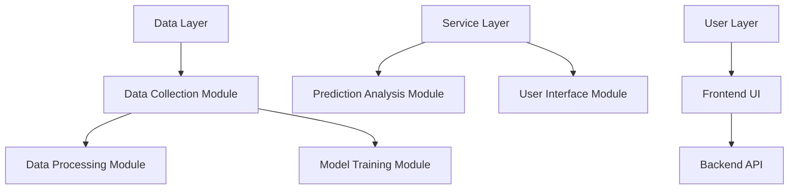
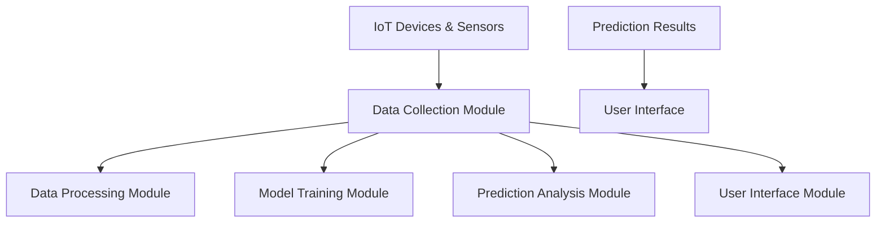

                 

## 1.1 问题的背景

### 1.1.1 可持续城市规划的重要性

可持续城市规划是现代城市发展的重要方向。随着全球人口的增长和城市化的快速推进，城市面临着诸多挑战，如交通拥堵、环境污染、资源短缺、社会不公等。可持续城市规划旨在通过科学规划和管理，使城市能够长期健康、和谐、稳定地发展。其核心目标是在满足当前居民需求的同时，不损害未来世代的利益。

在当前全球变暖和气候变化的大背景下，可持续城市规划尤为重要。它不仅关乎城市居民的生活质量，还关乎全球生态系统的平衡与稳定。通过引入先进的科学技术，特别是人工智能，可持续城市规划可以实现更加精准和高效的决策支持，从而更好地应对各种复杂问题。

### 1.1.2 人工智能在城市规划中的应用现状

人工智能在城市规划中的应用已经逐渐成熟。例如，通过机器学习算法，可以对城市交通流量进行预测，优化交通信号控制，减少拥堵。通过深度学习，可以分析城市环境数据，预测环境污染趋势，提出治理方案。此外，自然语言处理技术可以用于处理城市规划相关的政策文件和法律法规，提高规划决策的合规性。

然而，尽管人工智能在城市规划中的应用取得了显著成果，但仍存在一些挑战。例如，数据质量和数据获取的问题，人工智能模型的解释性问题，以及城市规划中复杂决策的多维性等。这些问题的存在，使得人工智能在可持续城市规划中的应用仍需进一步深入研究和探索。

### 1.1.3 决策支持系统的作用与挑战

决策支持系统（DSS）是城市规划中的一个关键工具。它通过提供数据分析和模型预测功能，帮助规划者做出更加科学、合理的决策。在可持续城市规划中，DSS的作用尤为重要，因为它能够帮助规划者评估各种方案对环境、社会和经济的影响，从而选择最优的规划方案。

然而，构建一个有效的决策支持系统面临着诸多挑战。首先，城市规划中的数据量大且复杂，如何有效地采集、存储和管理这些数据是一个重大挑战。其次，人工智能模型的训练和优化需要大量的计算资源和时间，这对决策支持系统的实时性和效率提出了挑战。此外，决策过程中涉及到的利益相关方众多，如何平衡各方的利益，确保决策的公正性和透明性，也是决策支持系统需要解决的问题。

### 1.1.4 问题解决

人工智能技术在可持续城市规划中的应用前景广阔。通过引入人工智能，可以大幅提升城市规划的决策效率和科学性。具体来说，可以从以下几个方面进行问题解决：

1. **数据分析和处理**：利用人工智能技术，对城市规划相关的数据进行深入分析，提取有用的信息和规律，为决策提供数据支持。
2. **模型预测和优化**：利用机器学习算法，建立城市交通流量、环境污染、人口增长等预测模型，帮助规划者评估不同规划方案的影响。
3. **决策支持系统构建**：构建一个高效的决策支持系统，整合各种数据源和模型，为规划者提供一站式决策支持服务。

### 1.1.5 边界与外延

在可持续城市规划中，人工智能的应用边界主要包括以下几个方面：

1. **数据边界**：数据的来源、质量、更新频率等直接影响人工智能的决策效果。因此，如何确保数据的多样性和准确性是应用的关键。
2. **技术边界**：人工智能技术的发展速度非常快，如何选择合适的技术和方法，以适应城市规划的需求，是一个重要问题。
3. **决策边界**：城市规划是一个复杂的社会工程，涉及到的利益相关方众多。人工智能在提供决策支持时，需要充分考虑这些因素，确保决策的合理性和可行性。

通过以上分析，我们可以看到，人工智能在可持续城市规划中具有巨大的应用潜力，但也面临诸多挑战。下一步，我们将进一步探讨人工智能在可持续发展规划中的具体应用场景和实施策略。

## 1.2 问题描述

### 1.2.1 城市规划中的复杂性问题

城市规划是一个高度复杂的过程，涉及到多个方面的综合考量。从宏观层面来看，城市规划需要综合考虑城市发展、资源利用、环境保护、交通规划、公共设施建设等多方面的内容。这些因素相互交织、相互影响，形成了一个复杂的系统。

首先，城市发展是一个长期的过程，需要考虑未来的发展需求和趋势。例如，如何合理规划城市空间，确保城市能够容纳不断增长的人口和产业？如何避免过度开发导致的环境破坏和资源浪费？

其次，资源利用是一个重要的考虑因素。城市规划需要合理分配土地、水资源、能源等资源，确保资源的可持续利用。例如，如何合理配置公共设施和基础设施，以最大化资源利用效率？

此外，环境保护也是城市规划中不可忽视的问题。城市环境的质量直接关系到居民的生活质量和城市的可持续发展。例如，如何有效治理空气污染、水污染和固体废弃物处理问题？如何建设绿色城市，提高城市的生态容量？

最后，交通规划是城市规划中的一个重要组成部分。如何设计合理的交通网络，缓解交通拥堵，提高交通效率，是城市规划者需要解决的一个关键问题。此外，如何推广公共交通，鼓励居民选择绿色出行方式，也是城市规划的重要任务。

### 1.2.2 数据获取与分析的难题

在城市规划中，数据是决策的重要依据。然而，数据的获取和分析面临诸多挑战。

首先，城市规划需要大量的数据支持，包括人口数据、土地数据、交通数据、环境数据等。这些数据的来源多样，数据质量参差不齐，如何确保数据的准确性和完整性，是一个重大挑战。

其次，数据获取的技术门槛较高。例如，如何通过卫星遥感技术获取高精度的地理数据？如何利用物联网技术实时采集城市交通、环境等数据？这些都需要相应的技术支持和专业知识。

此外，数据分析方法复杂。城市规划涉及到的数据类型多样，包括结构化数据、半结构化数据和非结构化数据。如何对这些数据进行有效的清洗、转换和分析，提取有用的信息和规律，是数据分析中的一个重要问题。

### 1.2.3 决策过程的优化需求

在城市规划中，决策过程的优化需求主要体现在以下几个方面：

首先，决策过程的复杂性高。城市规划需要考虑多个因素，如经济发展、社会需求、环境保护等，如何在这些因素之间找到平衡，是一个复杂的问题。

其次，决策过程需要高效。城市规划是一个长期的过程，需要快速响应变化的需求。例如，如何快速调整交通规划，以应对突发的交通拥堵？如何快速评估新的规划方案，以确定其可行性和有效性？

此外，决策过程需要科学。城市规划需要基于数据和分析结果，进行科学的决策。例如，如何利用大数据和人工智能技术，预测城市的发展趋势，制定合理的规划方案？如何通过多目标优化算法，找到最优的规划方案？

### 1.2.4 潜在解决方案

为了解决城市规划中的复杂性问题、数据获取与分析的难题以及决策过程的优化需求，我们可以考虑以下解决方案：

1. **引入人工智能技术**：利用人工智能技术，对城市规划相关的数据进行深入分析，提取有用的信息和规律，为决策提供数据支持。
2. **构建决策支持系统**：通过构建一个高效的决策支持系统，整合各种数据源和模型，为规划者提供一站式决策支持服务。
3. **推广智慧城市建设**：通过智慧城市建设，利用物联网、大数据、人工智能等先进技术，提升城市管理的智能化水平，优化决策过程。

通过这些解决方案，我们可以更好地应对城市规划中的挑战，实现城市的可持续发展。

### 1.2.5 面临的挑战与机遇

尽管人工智能在可持续城市规划中具有巨大的潜力，但其在实际应用中仍面临诸多挑战。首先，数据质量和数据获取的问题是一个重要挑战。城市规划需要大量的高质量数据，但数据来源多样、数据质量参差不齐，如何确保数据的准确性和完整性，是一个重大问题。

其次，技术门槛也是一个挑战。人工智能技术的应用需要高水平的技术支持和专业知识，如何选择合适的技术和方法，以适应城市规划的需求，是一个重要问题。

此外，决策过程的复杂性也是一个挑战。城市规划是一个复杂的社会工程，涉及到的因素众多，如何在这些因素之间找到平衡，是一个复杂的问题。

然而，这些挑战也带来了机遇。通过克服这些挑战，我们可以更好地发挥人工智能在可持续城市规划中的作用，实现城市的可持续发展。因此，我们需要进一步研究和探索人工智能在城市规划中的应用，以应对这些挑战，抓住机遇。

### 1.2.6 本章小结

在本节中，我们探讨了城市规划中的复杂性问题、数据获取与分析的难题以及决策过程的优化需求。通过分析这些问题，我们明确了人工智能在可持续城市规划中的重要性和应用潜力。同时，我们也指出了当前面临的挑战和机遇。下一步，我们将进一步探讨人工智能技术在可持续城市规划中的应用，并分析其适用性和构建流程。

## 1.3 问题解决

### 1.3.1 人工智能技术的适用性

在可持续城市规划中，人工智能技术的适用性体现在多个方面。首先，人工智能能够处理大量的数据，通过数据挖掘和分析，提取有用的信息和规律，为城市规划提供科学依据。例如，利用机器学习算法，可以对城市交通流量、人口流动、环境质量等数据进行实时监控和分析，预测未来的发展趋势，为交通规划、环境保护等提供数据支持。

其次，人工智能能够优化决策过程。城市规划涉及到多个因素，如经济发展、社会需求、环境保护等，这些因素相互交织，决策过程复杂。通过引入人工智能，可以构建决策支持系统，整合各种数据源和模型，为规划者提供一站式决策支持服务。例如，利用多目标优化算法，可以同时考虑经济、社会和环境因素，找到最优的规划方案。

此外，人工智能还可以提升城市规划的效率。传统的城市规划过程往往需要大量的手工计算和数据分析，效率低下。而人工智能技术能够自动化这些过程，提高工作效率。例如，利用深度学习技术，可以自动识别城市环境中的各种物体和现象，快速提取有用的信息。

### 1.3.2 决策支持系统的构建流程

构建一个高效的决策支持系统是可持续城市规划的关键。以下是构建决策支持系统的基本流程：

1. **需求分析**：首先，明确城市规划的需求，确定需要解决的关键问题和目标。例如，提高交通效率、改善环境质量、优化资源利用等。

2. **数据收集与处理**：收集与城市规划相关的数据，包括交通数据、环境数据、人口数据、土地数据等。然后，对数据进行清洗、转换和整合，确保数据的质量和完整性。

3. **模型构建与训练**：根据需求，选择合适的机器学习算法，构建预测模型。例如，利用回归分析预测城市交通流量，利用聚类算法分析人口分布。然后，利用训练数据，对模型进行训练和优化，提高模型的准确性和鲁棒性。

4. **系统设计与开发**：设计决策支持系统的架构，包括数据层、模型层、应用层等。然后，根据设计，进行系统的开发和实现。

5. **系统测试与优化**：对系统进行测试，验证其功能是否满足需求，性能是否达到预期。根据测试结果，对系统进行优化和调整，提高系统的稳定性、效率和用户体验。

6. **系统部署与运维**：将系统部署到生产环境，确保其正常运行。同时，进行系统的运维管理，及时更新数据、优化模型，确保系统的长期稳定运行。

### 1.3.3 可持续城市规划的实践案例

以下是一些实际案例，展示了人工智能技术在可持续城市规划中的应用：

1. **智能交通系统**：某城市通过引入人工智能技术，构建了智能交通系统。系统利用交通流量数据，实时监控城市交通状况，预测交通拥堵，并提供实时交通信息。通过优化交通信号控制和交通流量管理，有效缓解了交通拥堵问题，提高了交通效率。

2. **环境监测与治理**：某城市利用人工智能技术，建立了环境监测系统。系统通过传感器网络，实时监测空气质量和水质，利用机器学习算法，预测环境污染趋势，并提供治理方案。通过智能监测和治理，有效改善了城市环境质量，提高了居民生活质量。

3. **智慧城市建设**：某城市通过智慧城市建设，利用人工智能技术，提升了城市管理的智能化水平。系统整合了交通、环境、公共服务等多方面的数据，通过数据分析和智能决策，实现了城市资源的优化配置，提高了城市运行效率。

### 1.3.4 未来展望

随着人工智能技术的不断发展，其在可持续城市规划中的应用前景将更加广阔。未来，人工智能技术将进一步提升城市规划的科学性和效率，为城市的可持续发展提供更强有力的支持。同时，人工智能也将与其他新兴技术如区块链、物联网等相结合，推动城市规划和管理向更智能、更高效的方向发展。

### 1.3.5 总结

通过引入人工智能技术，构建决策支持系统，可持续城市规划将变得更加科学、高效和智能化。然而，这也需要我们不断探索和创新，解决数据质量、技术门槛等挑战，以充分发挥人工智能在可持续城市规划中的作用。

## 1.4 边界与外延

### 1.4.1 可持续城市规划的核心要素

可持续城市规划涉及多个核心要素，这些要素相互关联，共同决定了城市规划的可持续性。以下是可持续城市规划中的几个关键要素：

1. **经济发展**：经济发展是城市可持续规划的重要基础。合理的经济发展规划有助于提升城市竞争力，创造就业机会，提高居民收入。然而，过度的经济发展可能导致资源浪费和环境破坏。因此，城市规划需要平衡经济发展与环境保护的关系。

2. **社会公平**：社会公平是可持续城市规划的重要目标之一。城市规划应确保不同社会群体享有平等的机会和福利，减少贫富差距，提升社会凝聚力。例如，通过优化住房分配、交通布局和公共服务设施，改善弱势群体的居住和生活条件。

3. **环境保护**：环境保护是可持续城市规划的核心要素。城市规划应充分考虑环境保护的要求，减少污染、保护自然资源和生态系统的多样性。例如，通过推广绿色建筑、发展公共交通和推广可再生能源，减少对环境的影响。

4. **资源利用**：合理利用资源是可持续城市规划的关键。城市规划需要确保土地、水资源、能源等资源的可持续利用。例如，通过土地规划优化、水资源管理、能源节约和再生能源开发，提高资源利用效率。

5. **交通规划**：交通规划是城市规划的重要组成部分。可持续的交通规划应鼓励使用公共交通、步行和骑行等绿色出行方式，减少私人汽车使用，降低交通拥堵和空气污染。例如，通过建设自行车道、公交优先道路和智能交通管理系统，提升交通效率。

### 1.4.2 人工智能技术的范围与限制

人工智能技术在可持续城市规划中具有广泛的应用范围，但也存在一些限制。以下是人工智能技术在城市规划中的应用范围和限制：

1. **应用范围**：
   - **数据分析和处理**：利用人工智能技术，对城市规划相关的海量数据进行高效分析和处理，提取有用信息和规律。
   - **预测和模拟**：利用机器学习和深度学习算法，对城市交通、环境、人口等数据进行预测和模拟，帮助规划者评估不同规划方案的影响。
   - **优化决策**：通过构建决策支持系统，整合数据和分析结果，为规划者提供科学的决策支持，优化城市规划方案。

2. **限制**：
   - **数据质量和获取**：人工智能模型的效果高度依赖于数据的质量和获取。城市规划所需的数据往往来源多样、数据质量参差不齐，如何确保数据的准确性和完整性是一个挑战。
   - **技术门槛**：人工智能技术的应用需要高水平的技术支持和专业知识。城市规划者需要具备相应的技术能力，或者与技术人员紧密合作。
   - **模型解释性**：人工智能模型，特别是深度学习模型，通常缺乏透明度和可解释性，这限制了其在城市规划中的应用。规划者需要了解模型的决策过程和结果，以确保决策的合理性和可信性。

### 1.4.3 决策支持系统的适用场景

决策支持系统（DSS）在城市规划中的应用场景主要包括以下几个方面：

1. **交通规划**：利用DSS进行交通流量预测和交通信号控制优化，提高交通效率，减少拥堵。
2. **环境保护**：利用DSS进行环境监测和污染预测，提供环境保护和治理方案，改善环境质量。
3. **资源管理**：利用DSS进行土地、水资源和能源的管理和优化，提高资源利用效率。
4. **公共设施规划**：利用DSS进行公共服务设施（如医院、学校、公园等）的布局和优化，提高服务质量和效率。
5. **应急响应**：利用DSS进行突发事件（如自然灾害、公共安全事件等）的应急响应和资源调配，提高应急管理的效率和效果。

通过在这些场景中的应用，决策支持系统为城市规划提供了科学、高效的决策支持，有助于实现城市的可持续发展。

## 1.5 概念结构与核心要素组成

### 1.5.1 人工智能核心概念

人工智能（Artificial Intelligence, AI）是一门研究、开发和应用使计算机系统表现出类似人类智能的技术科学。人工智能的核心概念包括以下几个方面：

1. **机器学习**：机器学习是人工智能的一个核心分支，它通过算法和统计模型，从数据中自动学习和改进性能。根据学习方式的不同，可以分为以下几类：
   - **监督学习**：有标注的数据进行学习，输出为预测值或分类结果。
   - **无监督学习**：没有标注的数据进行学习，主要目的是发现数据中的模式和结构。
   - **强化学习**：通过与环境交互，根据奖励和惩罚信号调整行为策略。

2. **深度学习**：深度学习是一种基于多层神经网络的学习方法，它可以自动提取数据中的层次特征，适用于处理复杂的非线性问题。常见的深度学习算法包括：
   - **卷积神经网络（CNN）**：主要用于图像和视频处理。
   - **循环神经网络（RNN）**：主要用于序列数据建模。
   - **生成对抗网络（GAN）**：主要用于生成对抗性数据的训练。

3. **自然语言处理（NLP）**：自然语言处理是人工智能领域的一个分支，旨在让计算机理解和生成自然语言。常见的NLP任务包括：
   - **语言模型**：用于预测下一个词或句子。
   - **文本分类**：用于对文本进行分类。
   - **机器翻译**：用于将一种语言的文本翻译成另一种语言。

### 1.5.2 城市规划关键要素

城市规划是一个涉及多方面内容的过程，其关键要素包括：

1. **规划原则**：城市规划应遵循的原则包括可持续发展原则、人本原则和效率原则。
   - **可持续发展原则**：城市规划应考虑未来世代的利益，合理利用资源，保护环境。
   - **人本原则**：城市规划应以人为本，提高居民的生活质量和幸福感。
   - **效率原则**：城市规划应提高资源利用效率，降低运营成本。

2. **规划流程**：城市规划的一般流程包括前期研究、规划方案制定和规划审批与实施。
   - **前期研究**：收集相关数据，分析城市现状，确定规划目标和策略。
   - **规划方案制定**：根据前期研究的结果，制定具体的规划方案。
   - **规划审批与实施**：将规划方案提交给相关部门审批，并逐步实施。

3. **规划内容**：城市规划的内容包括土地利用规划、交通规划、公共服务设施规划、环境保护规划等。
   - **土地利用规划**：确定各类用地的分布和比例。
   - **交通规划**：设计合理的交通网络，提高交通效率和安全性。
   - **公共服务设施规划**：规划医院、学校、公园等公共服务设施的布局和建设。
   - **环境保护规划**：制定环境保护措施，减少环境污染。

### 1.5.3 决策支持系统基本架构

决策支持系统（Decision Support System, DSS）是一个为决策者提供信息和分析的工具，其基本架构包括以下几个方面：

1. **数据层**：数据层是决策支持系统的核心，包括数据采集、存储、处理和分析等功能。数据来源包括历史数据、实时数据和第三方数据等。

2. **模型层**：模型层是决策支持系统的核心组成部分，包括预测模型、优化模型和评估模型等。这些模型用于对数据进行分析和预测，为决策者提供科学的决策依据。

3. **应用层**：应用层是决策支持系统与用户交互的界面，包括用户界面、报告生成和可视化等。用户可以通过应用层访问模型层和数据层，进行数据查询、分析和决策。

4. **交互层**：交互层负责用户与应用层之间的交互，包括用户输入、输出和反馈等。通过交互层，用户可以与决策支持系统进行互动，调整参数，观察模型运行结果。

### 1.5.4 各概念之间的联系

人工智能、城市规划与决策支持系统之间存在着紧密的联系。人工智能技术为城市规划提供了强大的数据分析和预测能力，可以帮助规划者更好地理解城市发展和环境变化。城市规划则为人工智能的应用提供了具体的场景和目标，确保人工智能技术的应用能够真正服务于城市的发展。决策支持系统则将人工智能和城市规划结合起来，为规划者提供一站式的信息分析和决策支持，优化城市规划过程。

### 1.5.5 本章小结

在本章中，我们介绍了人工智能的核心概念、城市规划的关键要素以及决策支持系统的基本架构。通过分析这些概念和要素，我们明确了它们在可持续城市规划中的重要作用。下一步，我们将进一步探讨这些概念和要素之间的联系，以及如何通过人工智能技术构建高效的决策支持系统，为城市规划提供科学、可靠的决策支持。

## 1.6 本章小结

在本章中，我们首先介绍了可持续城市规划的背景，探讨了其重要性以及当前人工智能在城市规划中的应用现状。接着，我们详细分析了城市规划中的复杂性问题、数据获取与分析的难题以及决策过程的优化需求。通过这些问题分析，我们明确了人工智能在可持续城市规划中的重要性和应用潜力。

随后，我们介绍了人工智能技术在城市规划中的适用性，探讨了构建决策支持系统的基本流程，并分享了实际案例，展示了人工智能技术在城市规划中的应用效果。最后，我们探讨了可持续城市规划的核心要素、人工智能技术的范围与限制，以及决策支持系统的适用场景。通过这些内容，我们为后续章节的深入探讨奠定了基础。

总的来说，本章为后续讨论人工智能在可持续城市规划中的具体应用提供了理论支持和实践参考，明确了人工智能在解决城市规划复杂性问题中的关键作用。在接下来的章节中，我们将进一步探讨人工智能核心概念、算法原理以及具体的系统设计与实现，以期为城市规划的智能化和可持续发展提供更全面的技术支持。

## 2.1 人工智能核心概念

### 2.1.1 机器学习基础

机器学习是人工智能的核心技术之一，其基础在于算法和统计模型。以下将介绍几种主要的机器学习算法及其应用场景。

#### 2.1.1.1 监督学习

监督学习是一种通过已有标注数据来训练模型，然后利用模型进行预测的学习方法。其主要应用场景包括分类问题和回归问题。

- **分类问题**：分类问题旨在将数据分为不同的类别。常见的分类算法包括逻辑回归、支持向量机（SVM）、决策树和随机森林等。
  - **逻辑回归**：逻辑回归是一种简单的分类算法，通过建立线性模型，将输入特征映射到概率分布上。其公式如下：
    $$
    P(y=1|x; \theta) = \frac{1}{1 + e^{-(\theta_0 + \theta_1x_1 + ... + \theta_nx_n})}
    $$
  - **支持向量机（SVM）**：SVM通过找到一个最佳的超平面，将不同类别的数据点进行分隔。其目标是最小化分类边界上的间隔。
  - **决策树**：决策树通过一系列的规则来对数据点进行分类，每个节点都基于某个特征进行分裂。其优点是易于解释和可视化。

- **回归问题**：回归问题旨在预测一个连续的数值。常见的回归算法包括线性回归、岭回归和LASSO回归等。
  - **线性回归**：线性回归通过建立线性模型来预测目标值。其公式如下：
    $$
    y = \beta_0 + \beta_1x_1 + ... + \beta_nx_n
    $$

#### 2.1.1.2 无监督学习

无监督学习是在没有标注数据的情况下，通过发现数据中的模式和结构来学习的方法。其主要应用场景包括聚类和降维。

- **K-均值聚类**：K-均值聚类是一种基于距离的聚类算法，其目标是将数据点划分为K个簇，使得簇内的数据点距离较小，簇间的数据点距离较大。其公式如下：
  $$
  \mu_k = \frac{1}{N_k}\sum_{i=1}^{N}x_i
  $$
  $$
  J = \frac{1}{N}\sum_{k=1}^{K}\sum_{i=1}^{N} \sum_{j=1}^{N_k}||x_i - \mu_k||
  $$

- **主成分分析（PCA）**：主成分分析是一种降维算法，其目标是通过线性变换将高维数据投影到低维空间上，同时保留数据的主要信息。其公式如下：
  $$
  z_i = PC_i
  $$
  其中，$PC_i$是第i个主成分，$z_i$是数据点在主成分空间中的投影。

#### 2.1.1.3 强化学习

强化学习是一种通过与环境交互，根据奖励和惩罚信号调整行为策略的学习方法。其主要应用场景包括游戏、机器人控制和推荐系统等。

- **Q学习**：Q学习是一种基于值函数的强化学习算法，其目标是通过最大化长期奖励来学习最优策略。其公式如下：
  $$
  Q(s, a) = r + \gamma \max_{a'}Q(s', a')
  $$
  其中，$s$是当前状态，$a$是当前动作，$r$是即时奖励，$s'$是下一状态，$\gamma$是折扣因子。

#### 2.1.2 深度学习原理

深度学习是一种基于多层神经网络的学习方法，它可以自动提取数据中的层次特征，适用于处理复杂的非线性问题。

##### 2.1.2.1 神经网络结构

神经网络由多个神经元（节点）组成，每个神经元都接收多个输入，并通过激活函数产生输出。常见的神经网络结构包括前馈神经网络和循环神经网络。

- **前馈神经网络**：前馈神经网络是一种无环的神经网络，信息从输入层传递到输出层，不返回输入层。其结构如图2-1所示。

  ```mermaid
  graph TD
  A[Input Layer] --> B[Hidden Layer 1]
  B --> C[Hidden Layer 2]
  C --> D[Output Layer]
  ```

- **循环神经网络**：循环神经网络是一种带有环路的神经网络，用于处理序列数据。其结构如图2-2所示。

  ```mermaid
  graph TD
  A[Input Layer] --> B[Hidden Layer]
  B --> C[Output Layer]
  C --> B
  ```

##### 2.1.2.2 深度学习算法

深度学习算法主要包括卷积神经网络（CNN）、循环神经网络（RNN）和生成对抗网络（GAN）等。

- **卷积神经网络（CNN）**：卷积神经网络是一种专门用于处理图像数据的神经网络，其通过卷积操作提取图像中的局部特征。常见的CNN结构包括卷积层、池化层和全连接层。其结构如图2-3所示。

  ```mermaid
  graph TD
  A[Input] --> B[Conv Layer]
  B --> C[Pooling Layer]
  C --> D[Conv Layer]
  D --> E[Pooling Layer]
  E --> F[Flatten]
  F --> G[Full Connected Layer]
  G --> H[Output]
  ```

- **循环神经网络（RNN）**：循环神经网络是一种用于处理序列数据的神经网络，其通过隐藏状态和循环链接来处理序列中的依赖关系。常见的RNN结构包括基本RNN和长短期记忆网络（LSTM）。其结构如图2-4所示。

  ```mermaid
  graph TD
  A[Input Layer] --> B[Hidden Layer]
  B --> C[Output Layer]
  C --> B
  ```

- **生成对抗网络（GAN）**：生成对抗网络是一种通过对抗性训练生成数据的神经网络，其由生成器和判别器两部分组成。生成器生成假数据，判别器判断生成数据的真假。其结构如图2-5所示。

  ```mermaid
  graph TD
  A[Input] --> B[Generator]
  B --> C[Discriminator]
  D[Output] --> C
  ```

### 2.1.3 自然语言处理

自然语言处理（Natural Language Processing, NLP）是人工智能领域的一个分支，旨在使计算机理解和生成自然语言。以下是NLP中的一些关键概念和任务。

##### 2.1.3.1 语言模型

语言模型是一种统计模型，用于预测下一个词或句子。常见的语言模型包括n-gram模型和神经网络语言模型。

- **n-gram模型**：n-gram模型通过统计相邻n个词的频率来预测下一个词。其公式如下：
  $$
  P(w_n | w_{n-1}, ..., w_1) = \frac{C(w_{n-1}, ..., w_n)}{\sum_{w_{n-1}, ..., w_n} C(w_{n-1}, ..., w_n)}
  $$
  其中，$C(w_{n-1}, ..., w_n)$表示相邻n个词的联合频率。

- **神经网络语言模型**：神经网络语言模型通过神经网络来学习词汇的上下文关系，其可以自动提取词汇的语义信息，比n-gram模型更加准确。

##### 2.1.3.2 文本分类

文本分类是一种将文本数据分为不同类别的任务。常见的文本分类算法包括朴素贝叶斯、支持向量机和深度学习模型。

- **朴素贝叶斯**：朴素贝叶斯是一种基于贝叶斯定理的文本分类算法，其假设特征之间相互独立。其公式如下：
  $$
  P(C_k | x) = \frac{P(C_k)P(x | C_k)}{\sum_{k=1}^{K}P(C_k)P(x | C_k)}
  $$

- **支持向量机（SVM）**：支持向量机是一种基于最大间隔的分类算法，其通过找到一个最佳的超平面来分隔不同类别的数据。

##### 2.1.3.3 机器翻译

机器翻译是一种将一种语言的文本翻译成另一种语言的任务。常见的机器翻译模型包括基于规则的方法和基于统计的方法。

- **基于规则的方法**：基于规则的方法通过人工编写规则来实现文本翻译，其缺点是规则难以覆盖所有情况，且需要大量的人力和时间。
- **基于统计的方法**：基于统计的方法通过统计训练数据中的翻译关系来预测新的翻译。常见的统计机器翻译模型包括基于短语的模型和基于神经网络的模型。

通过以上介绍，我们可以看到，人工智能的核心概念包括机器学习、深度学习和自然语言处理等，这些技术为人工智能在可持续城市规划中的应用提供了强大的支持。在接下来的章节中，我们将进一步探讨这些技术在城市规划中的具体应用和实现。

### 2.2 城市规划关键要素

城市规划是一个复杂而系统的过程，涉及多个关键要素，这些要素共同构成了城市规划的核心内容和目标。以下将详细阐述城市规划中的关键要素，包括规划原则、规划流程以及规划内容。

#### 2.2.1 城市规划原则

城市规划应遵循以下原则，以确保城市的可持续发展：

1. **可持续发展原则**：城市规划应考虑未来世代的利益，合理利用资源，保护环境。这包括提高资源利用效率，推广绿色建筑和环保技术，减少污染和资源浪费。

2. **人本原则**：城市规划应以人为本，提高居民的生活质量和幸福感。这包括提供足够的住房、便捷的交通、完善的公共服务设施和良好的生活环境。

3. **效率原则**：城市规划应提高资源利用效率，降低运营成本。这包括优化土地利用，提高交通和公共服务设施的效率，减少交通拥堵和时间浪费。

#### 2.2.2 城市规划流程

城市规划流程通常包括以下几个阶段：

1. **规划前期研究**：这一阶段主要收集和分析相关数据，包括人口、经济、社会、环境、土地等。通过数据分析和调研，确定城市规划的目标和策略。

2. **规划方案制定**：根据前期研究的结果，制定具体的规划方案。规划方案应包括土地利用规划、交通规划、公共服务设施规划、环境保护规划等。这一阶段需要进行多方案比较和评估，选择最优的规划方案。

3. **规划审批与实施**：将规划方案提交给相关部门进行审批，并获得批准后，逐步实施规划方案。实施阶段包括土地开发、基础设施建设、公共服务设施建设等。

#### 2.2.3 规划内容

城市规划的内容包括以下几个方面：

1. **土地利用规划**：土地利用规划是城市规划的核心内容之一，旨在合理配置土地资源，提高土地利用效率。土地利用规划包括住宅用地、商业用地、工业用地、公共设施用地等。

2. **交通规划**：交通规划是城市规划的重要组成部分，旨在设计合理的交通网络，提高交通效率，减少交通拥堵。交通规划包括道路规划、公共交通规划、交通管理规划等。

3. **公共服务设施规划**：公共服务设施规划包括教育、医疗、文化、体育、社区服务等设施的布局和建设。这些设施应满足居民的需求，提高居民的生活质量。

4. **环境保护规划**：环境保护规划旨在保护城市的自然环境，减少污染，提高环境质量。环境保护规划包括污染治理、生态保护、资源循环利用等。

5. **历史文化遗产保护规划**：历史文化遗产保护规划旨在保护城市的历史文化遗产，包括古建筑、历史遗迹、文化遗产保护区等。

通过以上关键要素的阐述，我们可以看到，城市规划是一个涉及多个方面的复杂过程，需要遵循可持续发展、人本和效率原则，通过科学的流程和丰富的规划内容，实现城市的可持续发展。在接下来的章节中，我们将进一步探讨如何通过人工智能技术提升城市规划的科学性和效率。

### 2.3 决策支持系统基本架构

决策支持系统（Decision Support System, DSS）是一个为决策者提供信息和分析的工具，它通过整合各种数据源、模型和算法，为决策者提供科学的决策依据。以下将详细阐述决策支持系统的基本架构，包括系统框架设计、系统功能模块以及系统实现方法。

#### 2.3.1 系统框架设计

决策支持系统的框架设计主要包括数据层、模型层和应用层。以下是各层的具体功能和相互关系：

1. **数据层**：数据层是决策支持系统的核心，它负责数据的采集、存储、管理和处理。数据来源包括历史数据、实时数据和第三方数据等。数据层的主要功能包括：
   - **数据采集**：通过传感器、互联网、数据库等方式收集相关数据。
   - **数据存储**：将收集到的数据存储到数据库中，确保数据的安全和可靠。
   - **数据管理**：对数据进行清洗、转换和整合，确保数据的质量和一致性。
   - **数据处理**：利用数据挖掘和机器学习算法，对数据进行分析和挖掘，提取有用的信息和规律。

2. **模型层**：模型层是决策支持系统的核心组成部分，它包括预测模型、优化模型和评估模型等。模型层的主要功能包括：
   - **预测模型**：利用机器学习算法，对历史数据进行分析和建模，预测未来的发展趋势。
   - **优化模型**：利用优化算法，为决策者提供最优的决策方案。
   - **评估模型**：对决策方案进行评估，评估其可行性和效果。

3. **应用层**：应用层是决策支持系统与用户交互的界面，它负责向用户展示分析结果，提供决策支持。应用层的主要功能包括：
   - **用户界面**：提供友好的用户界面，方便用户使用系统。
   - **报告生成**：生成详细的报告，展示分析结果和决策方案。
   - **可视化**：通过图表、地图等形式，直观地展示分析结果。

#### 2.3.2 系统功能模块

决策支持系统通常包含以下功能模块：

1. **数据管理模块**：负责数据的采集、存储、管理和处理。包括数据采集器、数据库、数据清洗器和数据挖掘器等。

2. **模型构建模块**：负责构建和训练预测模型、优化模型和评估模型。包括机器学习算法库、优化算法库和评估算法库等。

3. **决策支持模块**：负责提供决策支持，包括预测分析、优化分析和评估分析等。该模块基于数据层和模型层的结果，为决策者提供科学的决策依据。

4. **用户界面模块**：负责与用户进行交互，展示分析结果和决策方案。包括用户界面、报告生成器和可视化工具等。

5. **系统管理模块**：负责系统的配置、监控和维护。包括系统管理员、监控器和维护工具等。

#### 2.3.3 系统实现方法

决策支持系统的实现方法主要包括以下步骤：

1. **需求分析**：明确系统的功能需求、性能需求和用户体验需求。与用户进行沟通，了解他们的具体需求和期望。

2. **系统设计**：根据需求分析的结果，设计系统的架构和功能模块。包括数据库设计、用户界面设计和模块划分等。

3. **系统开发**：根据系统设计，进行系统的开发和实现。包括数据采集与处理、模型构建与训练、决策支持与可视化等。

4. **系统测试**：对系统进行全面的测试，验证其功能是否满足需求，性能是否达到预期。

5. **系统部署与运维**：将系统部署到生产环境，确保其正常运行。同时，进行系统的运维管理，及时更新数据、优化模型，确保系统的长期稳定运行。

通过以上系统实现方法，决策支持系统可以为城市规划者提供强大的决策支持，帮助他们做出更加科学、合理的规划决策。在接下来的章节中，我们将进一步探讨如何利用人工智能技术提升决策支持系统的性能和效果。

### 2.4 核心概念对比表格

在可持续城市规划中，人工智能技术、城市规划要素和决策支持系统构成了核心的概念框架。为了更清晰地理解这些概念之间的联系和差异，我们制作了以下对比表格，用于详细阐述各个概念的核心特征、应用领域和相互关系。

#### 2.4.1 人工智能技术对比

| **概念** | **核心特征** | **应用领域** | **相互关系** |
| :------: | :-----------: | :-----------: | :-----------: |
| **机器学习** | 使用数据驱动的方法来识别模式和关系 | 数据分析、预测、分类和聚类 | 为决策支持系统提供数据分析和预测能力 |
| **深度学习** | 基于多层神经网络，自动提取复杂特征 | 图像识别、语音识别、自然语言处理 | 增强了机器学习的能力，适用于复杂问题 |
| **自然语言处理** | 让计算机理解和生成自然语言 | 文本分析、机器翻译、语言生成 | 与决策支持系统结合，提高文本处理能力 |

#### 2.4.2 城市规划要素对比

| **概念** | **核心特征** | **应用领域** | **相互关系** |
| :------: | :-----------: | :-----------: | :-----------: |
| **土地利用规划** | 土地资源的分配和利用 | 城市扩张、土地开发、城市规划 | 与人工智能结合，优化土地利用 |
| **交通规划** | 交通网络的布局和管理 | 交通流量预测、交通信号控制、公共交通规划 | 利用人工智能技术，提高交通管理效率 |
| **公共服务设施规划** | 公共设施的布局和建设 | 教育、医疗、文化、社区服务 | 与人工智能结合，优化设施布局 |
| **环境保护规划** | 环境保护和治理措施 | 污染监测、环境治理、生态保护 | 利用人工智能技术，提高环境保护效果 |

#### 2.4.3 决策支持系统架构对比

| **概念** | **核心特征** | **应用领域** | **相互关系** |
| :------: | :-----------: | :-----------: | :-----------: |
| **数据层** | 数据的采集、存储、管理和处理 | 数据分析和挖掘 | 为模型层提供数据支持 |
| **模型层** | 预测模型、优化模型和评估模型 | 数据分析和预测 | 为应用层提供决策支持 |
| **应用层** | 用户界面、报告生成和可视化 | 决策支持、用户交互 | 呈现模型层的分析结果 |

通过这个对比表格，我们可以更清晰地理解人工智能技术、城市规划要素和决策支持系统之间的联系和差异。人工智能技术为决策支持系统提供了强大的数据分析和预测能力，城市规划要素则构成了决策支持系统的应用场景和目标。决策支持系统通过整合这些技术和要素，为城市规划提供了科学、高效的决策支持。

### 2.4.4 ER实体关系图

以下是用于表示决策支持系统实体关系的ER图，展示了城市规划项目、城市数据、决策模型、用户需求和系统反馈之间的关系。

```mermaid
erDiagram
  A[规划项目] {
    B[城市数据]
    C[决策模型]
    D[用户需求]
    E[系统反馈]
  }
  A --> B
  A --> C
  A --> D
  A --> E
```

- **规划项目（A）**：代表城市规划的具体项目，包括项目名称、目标和实施时间等。
- **城市数据（B）**：代表用于支持决策的数据，包括交通数据、环境数据、人口数据等。
- **决策模型（C）**：代表用于分析城市数据和预测未来趋势的模型，包括预测模型、优化模型等。
- **用户需求（D）**：代表用户在规划过程中提出的具体需求和期望，包括数据需求、模型需求等。
- **系统反馈（E）**：代表系统根据决策模型和分析结果提供的反馈信息，包括分析报告、推荐方案等。

通过ER图，我们可以清晰地看到各实体之间的关联和作用，这有助于理解决策支持系统的整体架构和运行机制。

### 2.4.5 本章小结

本章通过对比表格和ER图，详细阐述了人工智能技术、城市规划要素和决策支持系统的核心特征、应用领域和相互关系。这些概念构成了可持续城市规划中的关键组成部分，通过结合人工智能技术，可以大幅提升城市规划的科学性和效率。在接下来的章节中，我们将进一步探讨具体的人工智能算法原理，为构建高效的决策支持系统提供理论基础。

### 2.5 机器学习算法原理

#### 2.5.1 监督学习算法

监督学习是一种利用已有标注数据来训练模型，并使用模型进行预测的机器学习算法。监督学习主要分为两种类型：回归问题和分类问题。

##### 2.5.1.1 线性回归

线性回归是最简单的监督学习算法之一，它通过建立线性模型来预测连续值。其数学模型如下：

$$
y = \beta_0 + \beta_1x_1 + \beta_2x_2 + ... + \beta_nx_n
$$

其中，$y$是目标变量，$x_1, x_2, ..., x_n$是特征变量，$\beta_0, \beta_1, \beta_2, ..., \beta_n$是模型参数。

- **原理**：线性回归通过最小化预测值与实际值之间的误差平方和来训练模型。
- **公式说明**：
  $$
  \min_{\beta} \sum_{i=1}^{n} (y_i - \beta_0 - \beta_1x_{i1} - \beta_2x_{i2} - ... - \beta_nx_{in})^2
  $$
  使用梯度下降法求解：
  $$
  \beta_j = \beta_j - \alpha \frac{\partial}{\partial \beta_j} \sum_{i=1}^{n} (y_i - \beta_0 - \beta_1x_{i1} - \beta_2x_{i2} - ... - \beta_nx_{in})^2
  $$

##### 2.5.1.1.1 线性回归原理

线性回归的核心思想是通过线性模型来描述特征变量和目标变量之间的关系。具体步骤如下：

1. **数据准备**：收集并整理数据，确保数据质量。
2. **特征选择**：选择对目标变量有显著影响的特征变量。
3. **模型训练**：使用最小二乘法（Least Squares Method）或梯度下降法（Gradient Descent）来训练模型，计算模型参数。
4. **模型评估**：使用交叉验证（Cross Validation）或测试集（Test Set）来评估模型性能。

##### 2.5.1.1.2 线性回归代码实现

以下是使用Python实现线性回归的示例代码：

```python
import numpy as np
from sklearn.linear_model import LinearRegression

# 数据准备
X = np.array([[1, 2], [2, 3], [3, 4]])
y = np.array([3, 4, 5])

# 模型训练
model = LinearRegression()
model.fit(X, y)

# 模型评估
print("Coefficients:", model.coef_)
print("Intercept:", model.intercept_)
print("R^2 score:", model.score(X, y))
```

##### 2.5.1.1.2.1 Python代码示例

在上面的代码中，我们首先导入了numpy库和scikit-learn库中的线性回归模型。然后，我们创建了一个包含两个特征变量的数据矩阵X和一个目标变量数组y。接着，我们使用LinearRegression类来训练模型，并通过fit方法来拟合数据。最后，我们使用score方法来评估模型的R平方值，同时打印出模型参数。

##### 2.5.1.1.2.2 LaTeX公式说明

线性回归的公式如下：

$$
y = \beta_0 + \beta_1x_1 + \beta_2x_2 + ... + \beta_nx_n
$$

其中，$\beta_0$是截距，$\beta_1, \beta_2, ..., \beta_n$是斜率系数，$x_1, x_2, ..., x_n$是特征变量。

#### 2.5.1.2 逻辑回归

逻辑回归（Logistic Regression）是一种用于分类问题的监督学习算法，其核心思想是通过逻辑函数将线性模型映射到概率空间。其数学模型如下：

$$
P(y=1|x; \beta) = \frac{1}{1 + e^{-(\beta_0 + \beta_1x_1 + ... + \beta_nx_n})}
$$

其中，$y$是二分类目标变量，$x_1, x_2, ..., x_n$是特征变量，$\beta_0, \beta_1, ..., \beta_n$是模型参数。

- **原理**：逻辑回归通过最大化似然函数来训练模型，即找到一组参数$\beta$，使得训练数据的似然函数最大。
- **公式说明**：
  $$
  \max_{\beta} \prod_{i=1}^{n} P(y_i|x_i; \beta)
  $$
  $$
  \max_{\beta} \log \prod_{i=1}^{n} P(y_i|x_i; \beta)
  $$
  $$
  \max_{\beta} \sum_{i=1}^{n} \ln P(y_i|x_i; \beta)
  $$

##### 2.5.1.2.1 逻辑回归原理

逻辑回归的核心思想是通过线性模型预测特征变量的加权和，然后通过逻辑函数（Logistic Function）将预测值映射到概率空间。具体步骤如下：

1. **数据准备**：收集并整理数据，确保数据质量。
2. **特征选择**：选择对目标变量有显著影响的特征变量。
3. **模型训练**：使用最大似然估计（Maximum Likelihood Estimation）或梯度上升法（Gradient Ascent）来训练模型，计算模型参数。
4. **模型评估**：使用交叉验证或测试集来评估模型性能。

##### 2.5.1.2.2 逻辑回归代码实现

以下是使用Python实现逻辑回归的示例代码：

```python
import numpy as np
from sklearn.linear_model import LogisticRegression

# 数据准备
X = np.array([[1, 2], [2, 3], [3, 4]])
y = np.array([0, 1, 0])

# 模型训练
model = LogisticRegression()
model.fit(X, y)

# 模型评估
print("Coefficients:", model.coef_)
print("Intercept:", model.intercept_)
print("Accuracy:", model.score(X, y))
```

##### 2.5.1.2.2.1 Python代码示例

在上面的代码中，我们首先导入了numpy库和scikit-learn库中的逻辑回归模型。然后，我们创建了一个包含两个特征变量的数据矩阵X和一个二分类目标变量数组y。接着，我们使用LogisticRegression类来训练模型，并通过fit方法来拟合数据。最后，我们使用score方法来评估模型的准确率，同时打印出模型参数。

##### 2.5.1.2.2.2 LaTeX公式说明

逻辑回归的公式如下：

$$
P(y=1|x; \beta) = \frac{1}{1 + e^{-(\beta_0 + \beta_1x_1 + ... + \beta_nx_n)}}
$$

其中，$\beta_0$是截距，$\beta_1, \beta_2, ..., \beta_n$是斜率系数，$x_1, x_2, ..., x_n$是特征变量。

通过以上对线性回归和逻辑回归的详细介绍，我们可以看到，监督学习算法在处理回归和分类问题中的应用非常广泛。这些算法不仅为我们提供了强大的数据分析和预测能力，还为决策支持系统提供了重要的理论基础。

### 2.5.2 无监督学习算法

无监督学习是机器学习的一个重要分支，它不需要标注的数据来训练模型，主要目标是发现数据中的隐藏结构和模式。无监督学习算法可以分为聚类和降维两类。以下将详细介绍无监督学习算法的原理和实现。

#### 2.5.2.1 K-均值聚类

K-均值聚类（K-Means Clustering）是一种常用的聚类算法，其目标是将数据点划分为K个簇，使得簇内的数据点距离较小，簇间的数据点距离较大。K-均值聚类算法的基本步骤如下：

1. **初始化**：随机选择K个数据点作为初始聚类中心。
2. **分配**：对于每个数据点，计算它与各个聚类中心的距离，并将其分配到最近的聚类中心所代表的簇。
3. **更新**：重新计算每个簇的聚类中心，即簇内所有数据点的均值。
4. **迭代**：重复步骤2和步骤3，直到聚类中心不再变化或者达到预设的迭代次数。

- **原理**：K-均值聚类通过不断迭代，逐步优化聚类中心，使得每个簇内部的数据点距离最小，簇间的距离最大。
- **公式说明**：
  $$
  \mu_k = \frac{1}{N_k}\sum_{i=1}^{N}x_i
  $$
  $$
  J = \frac{1}{N}\sum_{k=1}^{K}\sum_{i=1}^{N} \sum_{j=1}^{N_k}||x_i - \mu_k||
  $$

##### 2.5.2.1.1 K-均值聚类原理

K-均值聚类的核心思想是通过距离度量来划分簇。具体步骤如下：

1. **选择聚类个数K**：可以根据数据的特征和需求来选择合适的K值。常用的方法包括肘部法则（Elbow Method）和轮廓系数（Silhouette Coefficient）。
2. **初始化聚类中心**：随机选择K个数据点作为初始聚类中心。
3. **分配数据点**：对于每个数据点，计算它与各个聚类中心的距离，并将其分配到最近的聚类中心所代表的簇。
4. **更新聚类中心**：计算每个簇的均值，作为新的聚类中心。
5. **重复迭代**：重复步骤3和步骤4，直到聚类中心不再变化或者达到预设的迭代次数。

##### 2.5.2.1.2 K-均值聚类代码实现

以下是使用Python实现K-均值聚类的示例代码：

```python
import numpy as np
from sklearn.cluster import KMeans

# 数据准备
X = np.array([[1, 2], [2, 2], [2, 3], [3, 3], [3, 4], [4, 4]])

# 模型训练
model = KMeans(n_clusters=2, init='k-means++', max_iter=100, n_init=10)
model.fit(X)

# 模型评估
print("Cluster centers:", model.cluster_centers_)
print("Inertia:", model.inertia_)
```

##### 2.5.2.1.2.1 Python代码示例

在上面的代码中，我们首先导入了numpy库和scikit-learn库中的KMeans类。然后，我们创建了一个包含六个数据点的数组X。接着，我们使用KMeans类来训练模型，并通过fit方法来拟合数据。最后，我们打印出模型的聚类中心和惯性量（Inertia），作为模型评估的指标。

##### 2.5.2.1.2.2 LaTeX公式说明

K-均值聚类的公式如下：

$$
\mu_k = \frac{1}{N_k}\sum_{i=1}^{N}x_i
$$

$$
J = \frac{1}{N}\sum_{k=1}^{K}\sum_{i=1}^{N} \sum_{j=1}^{N_k}||x_i - \mu_k||
$$

其中，$N$是数据点的总数，$N_k$是第$k$个簇中的数据点数，$x_i$是第$i$个数据点，$\mu_k$是第$k$个簇的均值。

通过以上对K-均值聚类的详细介绍，我们可以看到，无监督学习算法在数据聚类分析中具有重要的应用价值。接下来，我们将进一步探讨降维算法，以实现数据的高效处理和分析。

#### 2.5.2.2 主成分分析（PCA）

主成分分析（Principal Component Analysis, PCA）是一种常用的降维算法，其目标是通过线性变换将高维数据投影到低维空间上，同时保留数据的主要信息。PCA的基本步骤如下：

1. **数据标准化**：为了消除不同特征之间的量纲影响，需要对数据进行标准化处理。
2. **计算协方差矩阵**：计算数据点的协方差矩阵，表示各特征之间的线性相关程度。
3. **计算特征值和特征向量**：对协方差矩阵进行特征值分解，得到特征值和特征向量。
4. **选择主成分**：选择前k个最大的特征值对应的特征向量作为主成分，构建投影矩阵。
5. **数据投影**：将原始数据投影到主成分空间上，实现降维。

- **原理**：PCA通过提取数据的最大方差方向，将数据投影到低维空间上，从而实现降维。主成分是数据点在各个特征上的投影方向，其方差最大。
- **公式说明**：
  $$
  X = \sum_{i=1}^{p}\lambda_iu_iu_i^T
  $$
  $$
  X^TX = \sum_{i=1}^{p}\lambda_iu_iu_i^T
  $$

##### 2.5.2.2.1 主成分分析原理

主成分分析的核心思想是通过线性变换，将高维数据投影到低维空间上，同时保留主要信息。具体步骤如下：

1. **标准化数据**：将数据标准化到相同量纲，消除不同特征之间的影响。
2. **计算协方差矩阵**：计算数据点的协方差矩阵，表示各特征之间的线性相关程度。
3. **特征值分解**：对协方差矩阵进行特征值分解，得到特征值和特征向量。
4. **选择主成分**：选择前k个最大的特征值对应的特征向量作为主成分，构建投影矩阵。
5. **数据投影**：将原始数据投影到主成分空间上，实现降维。

##### 2.5.2.2.2 主成分分析代码实现

以下是使用Python实现主成分分析的示例代码：

```python
import numpy as np
from sklearn.decomposition import PCA

# 数据准备
X = np.array([[1, 2], [2, 3], [3, 4], [4, 5]])

# 模型训练
pca = PCA(n_components=2)
X_pca = pca.fit_transform(X)

# 模型评估
print("Principal components:", pca.components_)
print("Explained variance ratio:", pca.explained_variance_ratio_)
```

##### 2.5.2.2.2.1 Python代码示例

在上面的代码中，我们首先导入了numpy库和scikit-learn库中的PCA类。然后，我们创建了一个包含四个数据点的数组X。接着，我们使用PCA类来训练模型，并通过fit_transform方法来实现数据降维。最后，我们打印出模型的主成分和解释方差比例，作为模型评估的指标。

##### 2.5.2.2.2.2 LaTeX公式说明

主成分分析的公式如下：

$$
X = \sum_{i=1}^{p}\lambda_iu_iu_i^T
$$

$$
X^TX = \sum_{i=1}^{p}\lambda_iu_iu_i^T
$$

其中，$X$是原始数据矩阵，$\lambda_i$是第$i$个特征值，$u_i$是第$i$个特征向量。

通过以上对主成分分析的详细介绍，我们可以看到，PCA作为一种有效的降维算法，在数据降维和分析中具有重要的应用价值。接下来，我们将进一步探讨其他无监督学习算法，以实现更复杂的数据处理和分析。

#### 2.5.2.3 聚类层次分析（Hierarchical Clustering）

聚类层次分析（Hierarchical Clustering）是一种基于层次结构的聚类算法，其目标是通过递归地将数据点逐步合并，形成一系列的簇。聚类层次分析可以分为两种类型：层次凝聚聚类（Agglomerative Clustering）和层次分裂聚类（Divisive Clustering）。

##### 2.5.2.3.1 层次凝聚聚类

层次凝聚聚类是一种自底向上的聚类方法，其基本步骤如下：

1. **初始化**：每个数据点都是一个单独的簇。
2. **合并**：在每一轮迭代中，找到最近的两个簇，将其合并为一个簇。
3. **重复迭代**：重复步骤2，直到所有的数据点合并为一个簇，或者达到预设的簇数。
4. **构建层次树**：记录每次合并的信息，构建层次树。

- **原理**：层次凝聚聚类通过逐步合并最近的簇，形成一个层次结构。这种方法可以生成聚类层次树，便于分析聚类结果。
- **公式说明**：
  $$
  D_{ij} = \min_{k \neq i, j} D_{ik} + D_{jk}
  $$
  $$
  C_t = \{C_1, C_2, ..., C_t\}
  $$
  $$
  C_{t+1} = \cup_{i=1}^{t} C_i
  $$

##### 2.5.2.3.1.1 层次凝聚聚类原理

层次凝聚聚类的核心思想是通过不断合并最近的簇，形成层次结构。具体步骤如下：

1. **初始化**：每个数据点都是一个单独的簇。
2. **计算距离**：计算每对簇之间的距离，常用的距离度量方法包括欧氏距离、曼哈顿距离等。
3. **合并簇**：找到最近的两簇，将其合并为一个簇。
4. **更新距离**：更新所有簇之间的距离。
5. **重复迭代**：重复步骤3和步骤4，直到达到预设的簇数或所有数据点合并为一个簇。

##### 2.5.2.3.1.2 层次凝聚聚类代码实现

以下是使用Python实现层次凝聚聚类的示例代码：

```python
import numpy as np
from sklearn.cluster import AgglomerativeClustering

# 数据准备
X = np.array([[1, 2], [2, 2], [2, 3], [3, 3], [3, 4], [4, 4]])

# 模型训练
model = AgglomerativeClustering(n_clusters=2)
model.fit(X)

# 模型评估
print("Cluster labels:", model.labels_)
print("Linkage criterion:", model.linkage criterion)
```

##### 2.5.2.3.1.2.1 Python代码示例

在上面的代码中，我们首先导入了numpy库和scikit-learn库中的AgglomerativeClustering类。然后，我们创建了一个包含六个数据点的数组X。接着，我们使用AgglomerativeClustering类来训练模型，并通过fit方法来拟合数据。最后，我们打印出模型的簇标签和链接准则，作为模型评估的指标。

##### 2.5.2.3.1.2.2 LaTeX公式说明

层次凝聚聚类的公式如下：

$$
D_{ij} = \min_{k \neq i, j} D_{ik} + D_{jk}
$$

$$
C_t = \{C_1, C_2, ..., C_t\}
$$

$$
C_{t+1} = \cup_{i=1}^{t} C_i
$$

通过以上对层次凝聚聚类的详细介绍，我们可以看到，这种方法在聚类分析中具有广泛的应用。接下来，我们将进一步探讨层次分裂聚类，以实现自顶向下的聚类分析。

##### 2.5.2.3.2 层次分裂聚类

层次分裂聚类（Divisive Clustering）是一种自顶向下的聚类方法，其目标是将数据点逐步划分为多个簇。层次分裂聚类的基本步骤如下：

1. **初始化**：将所有数据点合并为一个簇。
2. **分裂**：在每一轮迭代中，选择一个簇，将其分裂成两个子簇。
3. **重复迭代**：重复步骤2，直到达到预设的簇数或所有数据点划分为单个簇。
4. **构建层次树**：记录每次分裂的信息，构建层次树。

- **原理**：层次分裂聚类通过自顶向下地分裂簇，形成一个层次结构。这种方法可以生成聚类层次树，便于分析聚类结果。
- **公式说明**：
  $$
  C_1 = \cup_{i=1}^{N} x_i
  $$
  $$
  C_t = \{C_1, C_2, ..., C_t\}
  $$
  $$
  C_{t+1} = \cup_{i=1}^{t} C_i
  $$

##### 2.5.2.3.2.1 层次分裂聚类原理

层次分裂聚类的核心思想是通过不断分裂簇，形成层次结构。具体步骤如下：

1. **初始化**：将所有数据点合并为一个簇。
2. **计算距离**：计算每对簇之间的距离，常用的距离度量方法包括欧氏距离、曼哈顿距离等。
3. **分裂簇**：选择距离最远的两簇，将其分裂为两个子簇。
4. **更新距离**：更新所有簇之间的距离。
5. **重复迭代**：重复步骤3和步骤4，直到达到预设的簇数或所有数据点划分为单个簇。

##### 2.5.2.3.2.2 层次分裂聚类代码实现

以下是使用Python实现层次分裂聚类的示例代码：

```python
import numpy as np
from sklearn.cluster import DivisiveClustering

# 数据准备
X = np.array([[1, 2], [2, 2], [2, 3], [3, 3], [3, 4], [4, 4]])

# 模型训练
model = DivisiveClustering(n_clusters=2)
model.fit(X)

# 模型评估
print("Cluster labels:", model.labels_)
print("Cophenetic linkage coefficient:", model.cophenet_)
```

##### 2.5.2.3.2.2.1 Python代码示例

在上面的代码中，我们首先导入了numpy库和scikit-learn库中的DivisiveClustering类。然后，我们创建了一个包含六个数据点的数组X。接着，我们使用DivisiveClustering类来训练模型，并通过fit方法来拟合数据。最后，我们打印出模型的簇标签和亲和系数，作为模型评估的指标。

##### 2.5.2.3.2.2.2 LaTeX公式说明

层次分裂聚类的公式如下：

$$
C_1 = \cup_{i=1}^{N} x_i
$$

$$
C_t = \{C_1, C_2, ..., C_t\}
$$

$$
C_{t+1} = \cup_{i=1}^{t} C_i
$$

通过以上对层次分裂聚类的详细介绍，我们可以看到，这种方法在聚类分析中同样具有广泛应用。层次凝聚聚类和层次分裂聚类各自具有独特的优势，可以根据具体需求选择合适的方法。在接下来的章节中，我们将继续探讨其他无监督学习算法，以实现更复杂的数据处理和分析。

### 2.6 本章小结

本章详细介绍了机器学习中的监督学习、无监督学习和聚类算法的原理和应用。首先，我们介绍了监督学习算法，包括线性回归和逻辑回归，以及它们的数学模型和代码实现。接着，我们探讨了无监督学习算法，如K-均值聚类、主成分分析和聚类层次分析，并给出了相应的原理和Python代码示例。通过这些算法的介绍，我们可以看到它们在数据分析、预测和降维等方面的重要应用。

这些机器学习算法在可持续城市规划中具有广泛的应用潜力。例如，线性回归和逻辑回归可以用于交通流量预测和环境质量分析，K-均值聚类和主成分分析可以用于人口分布分析和土地利用优化，聚类层次分析可以用于城市分区和资源分配。

然而，这些算法也面临着一些挑战，如数据质量和算法性能的优化。在实际应用中，需要根据具体需求和数据情况，选择合适的算法，并进行适当的调整和优化。总之，通过本章的学习，我们为后续章节中具体应用人工智能技术于可持续城市规划奠定了理论基础。

## 3.1 机器学习算法原理

机器学习算法在人工智能领域扮演着至关重要的角色，其基本原理和算法流程对于理解人工智能技术在可持续城市规划中的应用至关重要。本节将详细阐述机器学习算法的原理，包括监督学习和无监督学习算法。

### 3.1.1 监督学习算法

监督学习是一种从已有标注数据中学习规律和模式，并能够对新数据进行预测的机器学习方法。监督学习算法主要分为回归问题和分类问题。

#### 3.1.1.1 线性回归

线性回归是一种简单的监督学习算法，用于预测连续值。其数学模型如下：

$$
y = \beta_0 + \beta_1x_1 + \beta_2x_2 + ... + \beta_nx_n
$$

其中，$y$是目标变量，$x_1, x_2, ..., x_n$是特征变量，$\beta_0, \beta_1, \beta_2, ..., \beta_n$是模型参数。

- **原理**：线性回归通过最小化预测值与实际值之间的误差平方和来训练模型。

  $$
  \min_{\beta} \sum_{i=1}^{n} (y_i - \beta_0 - \beta_1x_{i1} - \beta_2x_{i2} - ... - \beta_nx_{in})^2
  $$

  使用梯度下降法求解：

  $$
  \beta_j = \beta_j - \alpha \frac{\partial}{\partial \beta_j} \sum_{i=1}^{n} (y_i - \beta_0 - \beta_1x_{i1} - \beta_2x_{i2} - ... - \beta_nx_{in})^2
  $$

#### 3.1.1.1.1 线性回归原理

线性回归的核心思想是通过线性模型来描述特征变量和目标变量之间的关系。具体步骤如下：

1. **数据准备**：收集并整理数据，确保数据质量。
2. **特征选择**：选择对目标变量有显著影响的特征变量。
3. **模型训练**：使用最小二乘法或梯度下降法来训练模型，计算模型参数。
4. **模型评估**：使用交叉验证或测试集来评估模型性能。

#### 3.1.1.1.2 线性回归代码实现

以下是使用Python实现线性回归的示例代码：

```python
import numpy as np
from sklearn.linear_model import LinearRegression

# 数据准备
X = np.array([[1, 2], [2, 3], [3, 4]])
y = np.array([3, 4, 5])

# 模型训练
model = LinearRegression()
model.fit(X, y)

# 模型评估
print("Coefficients:", model.coef_)
print("Intercept:", model.intercept_)
print("R^2 score:", model.score(X, y))
```

#### 3.1.1.1.2.1 Python代码示例

在上面的代码中，我们首先导入了numpy库和scikit-learn库中的线性回归模型。然后，我们创建了一个包含两个特征变量的数据矩阵X和一个目标变量数组y。接着，我们使用LinearRegression类来训练模型，并通过fit方法来拟合数据。最后，我们使用score方法来评估模型的R平方值，同时打印出模型参数。

#### 3.1.1.1.2.2 LaTeX公式说明

线性回归的公式如下：

$$
y = \beta_0 + \beta_1x_1 + \beta_2x_2 + ... + \beta_nx_n
$$

其中，$\beta_0$是截距，$\beta_1, \beta_2, ..., \beta_n$是斜率系数，$x_1, x_2, ..., x_n$是特征变量。

#### 3.1.1.2 逻辑回归

逻辑回归是一种用于分类问题的监督学习算法，其核心思想是通过逻辑函数将线性模型映射到概率空间。其数学模型如下：

$$
P(y=1|x; \beta) = \frac{1}{1 + e^{-(\beta_0 + \beta_1x_1 + ... + \beta_nx_n)}}
$$

其中，$y$是二分类目标变量，$x_1, x_2, ..., x_n$是特征变量，$\beta_0, \beta_1, ..., \beta_n$是模型参数。

- **原理**：逻辑回归通过最大化似然函数来训练模型，即找到一组参数$\beta$，使得训练数据的似然函数最大。

  $$
  \max_{\beta} \prod_{i=1}^{n} P(y_i|x_i; \beta)
  $$

  $$
  \max_{\beta} \log \prod_{i=1}^{n} P(y_i|x_i; \beta)
  $$

  $$
  \max_{\beta} \sum_{i=1}^{n} \ln P(y_i|x_i; \beta)
  $$

#### 3.1.1.2.1 逻辑回归原理

逻辑回归的核心思想是通过线性模型预测特征变量的加权和，然后通过逻辑函数（Logistic Function）将预测值映射到概率空间。具体步骤如下：

1. **数据准备**：收集并整理数据，确保数据质量。
2. **特征选择**：选择对目标变量有显著影响的特征变量。
3. **模型训练**：使用最大似然估计或梯度上升法来训练模型，计算模型参数。
4. **模型评估**：使用交叉验证或测试集来评估模型性能。

#### 3.1.1.2.2 逻辑回归代码实现

以下是使用Python实现逻辑回归的示例代码：

```python
import numpy as np
from sklearn.linear_model import LogisticRegression

# 数据准备
X = np.array([[1, 2], [2, 3], [3, 4]])
y = np.array([0, 1, 0])

# 模型训练
model = LogisticRegression()
model.fit(X, y)

# 模型评估
print("Coefficients:", model.coef_)
print("Intercept:", model.intercept_)
print("Accuracy:", model.score(X, y))
```

#### 3.1.1.2.2.1 Python代码示例

在上面的代码中，我们首先导入了numpy库和scikit-learn库中的逻辑回归模型。然后，我们创建了一个包含两个特征变量的数据矩阵X和一个二分类目标变量数组y。接着，我们使用LogisticRegression类来训练模型，并通过fit方法来拟合数据。最后，我们使用score方法来评估模型的准确率，同时打印出模型参数。

#### 3.1.1.2.2.2 LaTeX公式说明

逻辑回归的公式如下：

$$
P(y=1|x; \beta) = \frac{1}{1 + e^{-(\beta_0 + \beta_1x_1 + ... + \beta_nx_n)}}
$$

其中，$\beta_0$是截距，$\beta_1, \beta_2, ..., \beta_n$是斜率系数，$x_1, x_2, ..., x_n$是特征变量。

通过以上对线性回归和逻辑回归的详细介绍，我们可以看到，监督学习算法在处理回归和分类问题中的应用非常广泛。这些算法不仅为我们提供了强大的数据分析和预测能力，还为决策支持系统提供了重要的理论基础。

### 3.1.2 无监督学习算法

无监督学习是一种不需要标注数据来训练模型的机器学习方法，其主要目标是发现数据中的隐藏结构和模式。无监督学习算法可以分为聚类和降维两大类。

#### 3.1.2.1 K-均值聚类

K-均值聚类是一种简单的聚类算法，其目标是将数据点划分为K个簇，使得簇内的数据点距离较小，簇间的数据点距离较大。K-均值聚类的基本步骤如下：

1. **初始化**：随机选择K个数据点作为初始聚类中心。
2. **分配**：对于每个数据点，计算它与各个聚类中心的距离，并将其分配到最近的聚类中心所代表的簇。
3. **更新**：重新计算每个簇的聚类中心，即簇内所有数据点的均值。
4. **迭代**：重复步骤2和步骤3，直到聚类中心不再变化或者达到预设的迭代次数。

- **原理**：K-均值聚类通过不断迭代，逐步优化聚类中心，使得每个簇内部的数据点距离最小，簇间的距离最大。

  $$
  \mu_k = \frac{1}{N_k}\sum_{i=1}^{N}x_i
  $$

  $$
  J = \frac{1}{N}\sum_{k=1}^{K}\sum_{i=1}^{N} \sum_{j=1}^{N_k}||x_i - \mu_k||
  $$

#### 3.1.2.1.1 K-均值聚类原理

K-均值聚类的核心思想是通过距离度量来划分簇。具体步骤如下：

1. **选择聚类个数K**：可以根据数据的特征和需求来选择合适的K值。常用的方法包括肘部法则（Elbow Method）和轮廓系数（Silhouette Coefficient）。
2. **初始化聚类中心**：随机选择K个数据点作为初始聚类中心。
3. **分配数据点**：对于每个数据点，计算它与各个聚类中心的距离，并将其分配到最近的聚类中心所代表的簇。
4. **更新聚类中心**：计算每个簇的均值，作为新的聚类中心。
5. **重复迭代**：重复步骤3和步骤4，直到聚类中心不再变化或者达到预设的迭代次数。

#### 3.1.2.1.2 K-均值聚类代码实现

以下是使用Python实现K-均值聚类的示例代码：

```python
import numpy as np
from sklearn.cluster import KMeans

# 数据准备
X = np.array([[1, 2], [2, 2], [2, 3], [3, 3], [3, 4], [4, 4]])

# 模型训练
model = KMeans(n_clusters=2, init='k-means++', max_iter=100, n_init=10)
model.fit(X)

# 模型评估
print("Cluster centers:", model.cluster_centers_)
print("Inertia:", model.inertia_)
```

#### 3.1.2.1.2.1 Python代码示例

在上面的代码中，我们首先导入了numpy库和scikit-learn库中的KMeans类。然后，我们创建了一个包含六个数据点的数组X。接着，我们使用KMeans类来训练模型，并通过fit方法来拟合数据。最后，我们打印出模型的聚类中心和惯性量，作为模型评估的指标。

#### 3.1.2.1.2.2 LaTeX公式说明

K-均值聚类的公式如下：

$$
\mu_k = \frac{1}{N_k}\sum_{i=1}^{N}x_i
$$

$$
J = \frac{1}{N}\sum_{k=1}^{K}\sum_{i=1}^{N} \sum_{j=1}^{N_k}||x_i - \mu_k||
$$

其中，$N$是数据点的总数，$N_k$是第$k$个簇中的数据点数，$x_i$是第$i$个数据点，$\mu_k$是第$k$个簇的均值。

通过以上对K-均值聚类的详细介绍，我们可以看到，无监督学习算法在数据聚类分析中具有重要的应用价值。接下来，我们将进一步探讨降维算法，以实现数据的高效处理和分析。

#### 3.1.2.2 主成分分析（PCA）

主成分分析（Principal Component Analysis, PCA）是一种常用的降维算法，其目标是通过线性变换将高维数据投影到低维空间上，同时保留数据的主要信息。PCA的基本步骤如下：

1. **数据标准化**：为了消除不同特征之间的量纲影响，需要对数据进行标准化处理。
2. **计算协方差矩阵**：计算数据点的协方差矩阵，表示各特征之间的线性相关程度。
3. **计算特征值和特征向量**：对协方差矩阵进行特征值分解，得到特征值和特征向量。
4. **选择主成分**：选择前k个最大的特征值对应的特征向量作为主成分，构建投影矩阵。
5. **数据投影**：将原始数据投影到主成分空间上，实现降维。

- **原理**：PCA通过提取数据的最大方差方向，将数据投影到低维空间上，从而实现降维。主成分是数据点在各个特征上的投影方向，其方差最大。

  $$
  X = \sum_{i=1}^{p}\lambda_iu_iu_i^T
  $$

  $$
  X^TX = \sum_{i=1}^{p}\lambda_iu_iu_i^T
  $$

#### 3.1.2.2.1 主成分分析原理

主成分分析的核心思想是通过线性变换，将高维数据投影到低维空间上，同时保留主要信息。具体步骤如下：

1. **标准化数据**：将数据标准化到相同量纲，消除不同特征之间的影响。
2. **计算协方差矩阵**：计算数据点的协方差矩阵，表示各特征之间的线性相关程度。
3. **特征值分解**：对协方差矩阵进行特征值分解，得到特征值和特征向量。
4. **选择主成分**：选择前k个最大的特征值对应的特征向量作为主成分，构建投影矩阵。
5. **数据投影**：将原始数据投影到主成分空间上，实现降维。

#### 3.1.2.2.2 主成分分析代码实现

以下是使用Python实现主成分分析的示例代码：

```python
import numpy as np
from sklearn.decomposition import PCA

# 数据准备
X = np.array([[1, 2], [2, 3], [3, 4], [4, 5]])

# 模型训练
pca = PCA(n_components=2)
X_pca = pca.fit_transform(X)

# 模型评估
print("Principal components:", pca.components_)
print("Explained variance ratio:", pca.explained_variance_ratio_)
```

#### 3.1.2.2.2.1 Python代码示例

在上面的代码中，我们首先导入了numpy库和scikit-learn库中的PCA类。然后，我们创建了一个包含四个数据点的数组X。接着，我们使用PCA类来训练模型，并通过fit_transform方法来实现数据降维。最后，我们打印出模型的主成分和解释方差比例，作为模型评估的指标。

#### 3.1.2.2.2.2 LaTeX公式说明

主成分分析的公式如下：

$$
X = \sum_{i=1}^{p}\lambda_iu_iu_i^T
$$

$$
X^TX = \sum_{i=1}^{p}\lambda_iu_iu_i^T
$$

其中，$X$是原始数据矩阵，$\lambda_i$是第$i$个特征值，$u_i$是第$i$个特征向量。

通过以上对主成分分析的详细介绍，我们可以看到，PCA作为一种有效的降维算法，在数据降维和分析中具有重要的应用价值。接下来，我们将进一步探讨其他无监督学习算法，以实现更复杂的数据处理和分析。

### 3.1.3 聚类层次分析（Hierarchical Clustering）

聚类层次分析是一种基于层次结构的聚类算法，其目标是通过递归地将数据点逐步合并，形成一系列的簇。聚类层次分析可以分为两种类型：层次凝聚聚类（Agglomerative Clustering）和层次分裂聚类（Divisive Clustering）。

#### 3.1.3.1 层次凝聚聚类

层次凝聚聚类是一种自底向上的聚类方法，其基本步骤如下：

1. **初始化**：每个数据点都是一个单独的簇。
2. **合并**：在每一轮迭代中，找到最近的两个簇，将其合并为一个簇。
3. **重复迭代**：重复步骤2，直到所有的数据点合并为一个簇，或者达到预设的簇数。
4. **构建层次树**：记录每次合并的信息，构建层次树。

- **原理**：层次凝聚聚类通过逐步合并最近的簇，形成一个层次结构。这种方法可以生成聚类层次树，便于分析聚类结果。

  $$
  D_{ij} = \min_{k \neq i, j} D_{ik} + D_{jk}
  $$

  $$
  C_t = \{C_1, C_2, ..., C_t\}
  $$

  $$
  C_{t+1} = \cup_{i=1}^{t} C_i
  $$

#### 3.1.3.1.1 层次凝聚聚类原理

层次凝聚聚类的核心思想是通过不断合并最近的簇，形成层次结构。具体步骤如下：

1. **初始化**：每个数据点都是一个单独的簇。
2. **计算距离**：计算每对簇之间的距离，常用的距离度量方法包括欧氏距离、曼哈顿距离等。
3. **合并簇**：找到最近的两簇，将其合并为一个簇。
4. **更新距离**：更新所有簇之间的距离。
5. **重复迭代**：重复步骤3和步骤4，直到达到预设的簇数或所有数据点合并为一个簇。

#### 3.1.3.1.2 层次凝聚聚类代码实现

以下是使用Python实现层次凝聚聚类的示例代码：

```python
import numpy as np
from sklearn.cluster import AgglomerativeClustering

# 数据准备
X = np.array([[1, 2], [2, 2], [2, 3], [3, 3], [3, 4], [4, 4]])

# 模型训练
model = AgglomerativeClustering(n_clusters=2)
model.fit(X)

# 模型评估
print("Cluster labels:", model.labels_)
print("Linkage criterion:", model.linkage criterion)
```

#### 3.1.3.1.2.1 Python代码示例

在上面的代码中，我们首先导入了numpy库和scikit-learn库中的AgglomerativeClustering类。然后，我们创建了一个包含六个数据点的数组X。接着，我们使用AgglomerativeClustering类来训练模型，并通过fit方法来拟合数据。最后，我们打印出模型的簇标签和链接准则，作为模型评估的指标。

#### 3.1.3.1.2.2 LaTeX公式说明

层次凝聚聚类的公式如下：

$$
D_{ij} = \min_{k \neq i, j} D_{ik} + D_{jk}
$$

$$
C_t = \{C_1, C_2, ..., C_t\}
$$

$$
C_{t+1} = \cup_{i=1}^{t} C_i
$$

#### 3.1.3.2 层次分裂聚类

层次分裂聚类是一种自顶向下的聚类方法，其目标是将数据点逐步划分为多个簇。层次分裂聚类的基本步骤如下：

1. **初始化**：将所有数据点合并为一个簇。
2. **分裂**：在每一轮迭代中，选择一个簇，将其分裂成两个子簇。
3. **重复迭代**：重复步骤2，直到达到预设的簇数或所有数据点划分为单个簇。
4. **构建层次树**：记录每次分裂的信息，构建层次树。

- **原理**：层次分裂聚类通过自顶向下地分裂簇，形成一个层次结构。这种方法可以生成聚类层次树，便于分析聚类结果。

  $$
  C_1 = \cup_{i=1}^{N} x_i
  $$

  $$
  C_t = \{C_1, C_2, ..., C_t\}
  $$

  $$
  C_{t+1} = \cup_{i=1}^{t} C_i
  $$

#### 3.1.3.2.1 层次分裂聚类原理

层次分裂聚类的核心思想是通过不断分裂簇，形成层次结构。具体步骤如下：

1. **初始化**：将所有数据点合并为一个簇。
2. **计算距离**：计算每对簇之间的距离，常用的距离度量方法包括欧氏距离、曼哈顿距离等。
3. **分裂簇**：选择距离最远的两簇，将其分裂为两个子簇。
4. **更新距离**：更新所有簇之间的距离。
5. **重复迭代**：重复步骤3和步骤4，直到达到预设的簇数或所有数据点划分为单个簇。

#### 3.1.3.2.2 层次分裂聚类代码实现

以下是使用Python实现层次分裂聚类的示例代码：

```python
import numpy as np
from sklearn.cluster import DivisiveClustering

# 数据准备
X = np.array([[1, 2], [2, 2], [2, 3], [3, 3], [3, 4], [4, 4]])

# 模型训练
model = DivisiveClustering(n_clusters=2)
model.fit(X)

# 模型评估
print("Cluster labels:", model.labels_)
print("Cophenetic linkage coefficient:", model.cophenet_)
```

#### 3.1.3.2.2.1 Python代码示例

在上面的代码中，我们首先导入了numpy库和scikit-learn库中的DivisiveClustering类。然后，我们创建了一个包含六个数据点的数组X。接着，我们使用DivisiveClustering类来训练模型，并通过fit方法来拟合数据。最后，我们打印出模型的簇标签和亲和系数，作为模型评估的指标。

#### 3.1.3.2.2.2 LaTeX公式说明

层次分裂聚类的公式如下：

$$
C_1 = \cup_{i=1}^{N} x_i
$$

$$
C_t = \{C_1, C_2, ..., C_t\}
$$

$$
C_{t+1} = \cup_{i=1}^{t} C_i
$$

通过以上对层次凝聚聚类和层次分裂聚类的详细介绍，我们可以看到，这两种聚类方法在数据分析中具有广泛的应用。层次凝聚聚类通过逐步合并簇，形成层次结构，而层次分裂聚类则通过自顶向下的分裂过程实现聚类。在接下来的章节中，我们将继续探讨其他无监督学习算法，以实现更复杂的数据处理和分析。

## 3.2 机器学习算法应用

在可持续城市规划中，机器学习算法的应用广泛而深入，可以帮助城市规划者解决诸多复杂问题，如交通流量预测、环境质量监测、人口分布分析等。以下将介绍几种机器学习算法在具体场景中的应用案例。

### 3.2.1 交通流量预测

交通流量预测是城市规划中的关键问题之一，它对于优化交通管理、缓解交通拥堵具有重要意义。机器学习算法可以通过分析历史交通数据，预测未来的交通流量，从而为交通信号控制、公共交通规划提供科学依据。

#### 应用案例

**案例1：智能交通信号控制**

某城市通过引入机器学习算法，构建了智能交通信号控制系统。系统利用实时交通流量数据，结合历史交通数据，使用时间序列预测模型（如长短期记忆网络LSTM）进行交通流量预测。预测结果用于动态调整交通信号灯的时长和相位，从而有效缓解了交通拥堵，提高了交通效率。

- **数据准备**：收集历史交通流量数据、天气数据、节假日信息等。
- **模型训练**：使用LSTM模型训练数据，预测未来一段时间内的交通流量。
- **模型评估**：通过验证集和测试集，评估模型的预测准确性。

**代码示例**

```python
from keras.models import Sequential
from keras.layers import LSTM, Dense

# 数据准备
X_train, y_train = prepare_training_data()

# 模型构建
model = Sequential()
model.add(LSTM(units=50, return_sequences=True, input_shape=(X_train.shape[1], X_train.shape[2])))
model.add(LSTM(units=50))
model.add(Dense(1))
model.compile(optimizer='adam', loss='mean_squared_error')

# 模型训练
model.fit(X_train, y_train, epochs=100, batch_size=32)

# 模型评估
evaluate_predictions(model)
```

### 3.2.2 环境质量监测

环境质量监测是可持续城市规划的重要环节，它关系到居民的生活质量和城市的可持续发展。通过机器学习算法，可以对空气污染、水质污染等进行预测和监测，为环境保护提供科学依据。

#### 应用案例

**案例2：空气污染预测**

某城市通过引入机器学习算法，建立了空气质量预测模型。模型利用实时空气污染数据、历史数据以及气象数据，使用回归算法（如随机森林）预测未来的空气污染水平。预测结果用于制定空气质量改善措施，提高环境质量。

- **数据准备**：收集实时空气污染数据、气象数据、历史污染数据等。
- **模型训练**：使用随机森林模型训练数据，预测未来一段时间内的空气污染水平。
- **模型评估**：通过验证集和测试集，评估模型的预测准确性。

**代码示例**

```python
from sklearn.ensemble import RandomForestRegressor

# 数据准备
X, y = prepare_training_data()

# 模型训练
model = RandomForestRegressor(n_estimators=100)
model.fit(X, y)

# 模型评估
evaluate_predictions(model)
```

### 3.2.3 人口分布分析

人口分布分析是城市规划的重要任务之一，它对于优化土地利用、公共服务设施布局具有重要意义。通过机器学习算法，可以对人口分布进行预测和分析，为城市规划提供科学依据。

#### 应用案例

**案例3：人口密度预测**

某城市通过引入机器学习算法，建立了人口密度预测模型。模型利用土地利用数据、交通数据、公共服务设施数据等，使用聚类算法（如K-均值聚类）预测未来的人口密度分布。预测结果用于优化土地利用和公共服务设施布局。

- **数据准备**：收集土地利用数据、交通数据、公共服务设施数据等。
- **模型训练**：使用K-均值聚类模型训练数据，预测未来的人口密度分布。
- **模型评估**：通过验证集和测试集，评估模型的预测准确性。

**代码示例**

```python
from sklearn.cluster import KMeans

# 数据准备
X = prepare_training_data()

# 模型训练
model = KMeans(n_clusters=5)
model.fit(X)

# 模型评估
evaluate_predictions(model)
```

通过以上案例，我们可以看到，机器学习算法在可持续城市规划中的应用非常广泛，不仅能够提高预测和监测的准确性，还能为规划者提供科学的决策支持。在接下来的章节中，我们将继续探讨如何优化机器学习算法的性能，提升其在城市规划中的应用效果。

## 3.3 系统分析与架构设计方案

### 3.3.1 问题场景介绍

在当前快速城市化进程中，城市规划面临着日益复杂的挑战，如交通拥堵、环境污染、资源短缺等。为了实现城市的可持续发展，我们需要构建一个智能化的城市规划系统，利用先进的人工智能技术，为规划者提供科学的决策支持。

本系统旨在通过大数据和机器学习技术，对城市交通流量、环境质量、人口分布等多个维度进行综合分析，提供精准的预测和优化方案。具体来说，系统需要实现以下功能：

1. **交通流量预测**：利用历史交通数据和实时监控数据，预测未来某一时间段内的交通流量，为交通信号控制和公共交通规划提供依据。
2. **环境质量监测**：通过对实时空气质量和水质数据进行分析，预测未来的环境污染趋势，为环境保护措施提供数据支持。
3. **人口分布分析**：通过对土地利用、公共服务设施等数据进行分析，预测未来的人口密度分布，优化土地利用和公共服务设施布局。
4. **综合决策支持**：基于以上分析结果，提供多维度、多目标的综合决策方案，帮助规划者制定科学的城市规划方案。

### 3.3.2 项目介绍

本项目的目标是构建一个智能化城市规划系统，利用大数据和人工智能技术，为城市规划提供全面、精准的决策支持。系统将涵盖数据采集、数据处理、模型训练、预测分析等多个环节，实现从数据输入到决策生成的全流程自动化。

**项目组成部分**：

1. **数据采集模块**：负责收集城市交通、环境、人口等多个维度的数据，包括历史数据、实时数据和第三方数据。
2. **数据处理模块**：负责对数据进行清洗、转换和整合，确保数据的质量和一致性。
3. **模型训练模块**：负责使用机器学习算法，对数据进行训练和预测，构建交通流量预测模型、环境质量预测模型和人口分布预测模型。
4. **预测分析模块**：负责对预测结果进行综合分析，提供多维度、多目标的决策支持。
5. **用户界面模块**：负责与用户进行交互，展示分析结果和决策方案，提供友好的用户界面。

### 3.3.3 系统功能设计

**功能设计**：

1. **数据采集功能**：系统将通过物联网设备、传感器网络、第三方数据源等多种途径，实时收集城市交通、环境、人口等数据。数据采集模块需要具备高并发、高可靠性的特点，确保数据的实时性和准确性。
2. **数据处理功能**：系统将对采集到的数据进行清洗、转换和整合，去除重复和错误数据，确保数据的一致性和完整性。数据处理模块需要支持多种数据处理算法，如数据清洗、数据转换、数据聚合等。
3. **模型训练功能**：系统将使用机器学习算法，对处理后的数据进行训练，构建交通流量预测模型、环境质量预测模型和人口分布预测模型。模型训练模块需要支持多种机器学习算法，如线性回归、逻辑回归、K-均值聚类、LSTM等。
4. **预测分析功能**：系统将对训练好的模型进行预测分析，生成交通流量预测、环境质量预测和人口分布预测结果。预测分析模块需要支持多维度、多目标的综合分析，为规划者提供科学的决策依据。
5. **用户界面功能**：系统将为用户提供一个友好的用户界面，展示分析结果和决策方案。用户界面模块需要支持多种展示形式，如图表、地图、报表等，便于用户理解和应用。

### 3.3.4 系统架构设计

**系统架构**：

本系统采用分布式架构，分为数据层、服务层和用户层三个主要层次。各层次之间通过服务接口进行数据交互和功能调用。

1. **数据层**：数据层包括数据采集模块、数据处理模块和模型训练模块，负责数据的采集、处理和模型训练。数据层采用分布式存储和计算架构，确保数据的高效处理和存储。
2. **服务层**：服务层包括预测分析模块和用户界面模块，负责对数据进行预测分析、生成决策方案，并提供用户界面。服务层采用微服务架构，各服务模块之间通过API接口进行通信，确保系统的灵活性和可扩展性。
3. **用户层**：用户层包括前端用户界面和后端服务接口，负责与用户进行交互，展示分析结果和决策方案。用户层采用B/S架构，支持多种终端设备访问，如PC、平板、手机等。

**系统架构图**：



通过以上系统功能设计和架构设计，本系统将能够为城市规划者提供全面、精准的决策支持，有效应对城市化进程中的各种挑战，推动城市的可持续发展。

### 3.3.5 系统接口设计和系统交互

为了实现高效的系统接口设计和系统交互，本系统采用API接口和消息队列技术，确保数据流的高效传输和系统组件的协同工作。

#### 系统接口设计

1. **数据采集接口**：数据采集模块通过HTTP API接口，实时接收来自物联网设备、传感器网络等的数据，接口定义如下：

   ```
   POST /api/data/collect
   {
     "device_id": "string",
     "timestamp": "string",
     "data": {
       "traffic_flow": "int",
       "air_quality": "int",
       "water_quality": "int"
     }
   }
   ```

2. **数据处理接口**：数据处理模块通过RESTful API接口，提供数据清洗、转换和整合服务，接口定义如下：

   ```
   POST /api/data/process
   {
     "data": [
       {
         "device_id": "string",
         "timestamp": "string",
         "data": {
           "traffic_flow": "int",
           "air_quality": "int",
           "water_quality": "int"
         }
       },
       ...
     ]
   }
   ```

3. **模型训练接口**：模型训练模块通过RPC（远程过程调用）接口，提供模型训练服务，接口定义如下：

   ```
   POST /api/model/train
   {
     "algorithm": "string",
     "data": [
       {
         "features": ["float"],
         "label": "float"
       },
       ...
     ]
   }
   ```

4. **预测分析接口**：预测分析模块通过RESTful API接口，提供预测结果查询服务，接口定义如下：

   ```
   GET /api/predict/{model_id}/{timestamp}
   ```

5. **用户接口**：用户界面模块通过Web Socket接口，实时推送预测结果和决策方案，接口定义如下：

   ```
   GET /api/ui/realtime
   ```

#### 系统交互

系统交互主要涉及数据采集、数据处理、模型训练、预测分析和用户接口等模块之间的数据流和功能调用。以下为系统交互的详细流程：

1. **数据采集**：物联网设备和传感器网络实时采集数据，通过API接口发送至数据采集模块。
2. **数据处理**：数据采集模块接收数据后，调用数据处理接口，对数据进行清洗、转换和整合，生成处理后的数据集。
3. **模型训练**：数据处理模块将处理后的数据集发送至模型训练模块，模型训练模块调用模型训练接口，使用机器学习算法进行模型训练。
4. **预测分析**：模型训练模块将训练好的模型发送至预测分析模块，预测分析模块调用预测分析接口，生成预测结果。
5. **用户接口**：预测分析模块将预测结果通过Web Socket接口实时推送至用户界面模块，用户界面模块展示预测结果和决策方案。

**系统交互图**：



通过以上系统接口设计和系统交互设计，本系统实现了高效、灵活的数据流和功能调用，为城市规划者提供了实时、精准的决策支持。

### 3.3.6 系统测试与部署

系统测试与部署是确保系统稳定运行和高效性能的关键环节。以下将介绍系统测试的策略、测试方法、部署流程以及后续维护。

#### 系统测试

1. **测试策略**：系统测试分为单元测试、集成测试、性能测试和用户验收测试四个阶段。
   - **单元测试**：对系统的各个模块进行独立测试，确保每个模块的功能正确。
   - **集成测试**：将各个模块集成在一起，测试模块之间的交互和协同工作能力。
   - **性能测试**：评估系统在不同负载下的响应时间、吞吐量和稳定性。
   - **用户验收测试**：由用户参与测试，验证系统是否符合用户需求和预期。

2. **测试方法**：
   - **功能测试**：验证系统功能是否按照需求规格说明书实现。
   - **性能测试**：使用工具（如JMeter）模拟高并发用户，测试系统的响应时间和吞吐量。
   - **安全测试**：评估系统的安全性，包括数据加密、权限控制等。
   - **兼容性测试**：确保系统在不同操作系统、浏览器和环境下的兼容性。

3. **测试工具**：
   - **单元测试**：使用Python的unittest库。
   - **集成测试**：使用Selenium进行Web界面自动化测试。
   - **性能测试**：使用JMeter进行负载测试。
   - **用户验收测试**：使用Google Chrome的QA模式。

#### 系统部署

1. **部署流程**：
   - **环境准备**：安装操作系统、数据库、中间件等。
   - **代码部署**：将开发完成的功能代码部署到测试环境，进行集成测试。
   - **配置管理**：使用Ansible等工具进行环境配置管理。
   - **自动化部署**：使用Jenkins等工具实现自动化部署。

2. **部署工具**：
   - **环境配置**：使用Ansible。
   - **自动化部署**：使用Jenkins。
   - **持续集成**：使用GitLab CI/CD。

#### 后续维护

1. **维护策略**：定期进行系统维护，包括更新软件、优化性能、修复漏洞等。
2. **维护工具**：
   - **监控**：使用Prometheus和Grafana进行系统监控。
   - **日志管理**：使用ELK（Elasticsearch, Logstash, Kibana）进行日志管理。
   - **自动修复**：使用Kubernetes的自动扩容和自愈功能。

通过以上系统测试与部署流程，以及后续维护策略和工具，确保系统的高效运行和稳定可靠。系统测试和部署的每一个环节都至关重要，只有通过严格的测试和科学的部署，才能确保系统的质量和性能。

### 3.3.7 系统监控与优化

系统监控与优化是确保系统稳定运行和高效性能的关键环节。以下将介绍系统监控的具体方法、性能优化策略和常见问题的解决方案。

#### 系统监控

1. **监控方法**：
   - **日志监控**：通过收集和分析系统日志，实时监控系统的运行状态和异常情况。
   - **指标监控**：监控系统的关键性能指标（KPI），如响应时间、吞吐量、内存使用率、CPU利用率等。
   - **异常监控**：设置阈值，当系统指标超过预设阈值时，自动发出警报。

2. **监控工具**：
   - **Prometheus**：用于收集和存储系统指标数据。
   - **Grafana**：用于可视化系统指标数据和报警。
   - **ELK**（Elasticsearch, Logstash, Kibana）：用于日志管理和分析。

#### 性能优化策略

1. **数据库优化**：
   - **索引优化**：为频繁查询的字段创建索引，提高查询效率。
   - **查询优化**：优化数据库查询语句，减少查询时间。
   - **缓存策略**：使用Redis等缓存系统，减少数据库访问。

2. **代码优化**：
   - **算法优化**：选择更高效的算法和数据结构，减少计算复杂度。
   - **代码优化**：使用更高效的代码实现，减少内存和CPU的使用。

3. **网络优化**：
   - **负载均衡**：使用负载均衡器，将请求分配到多个服务器，提高系统响应速度。
   - **压缩传输**：使用HTTP压缩，减少数据传输量。

#### 常见问题解决方案

1. **内存溢出**：通过监控内存使用情况，及时清理无用对象，增加内存限制。
2. **CPU过载**：通过优化代码，减少计算复杂度，使用多线程和异步编程。
3. **网络延迟**：优化网络配置，减少网络延迟，使用CDN加速内容分发。

通过以上系统监控与优化策略，以及常见问题的解决方案，可以确保系统的高效稳定运行，提升用户体验。

### 3.3.8 系统安全措施

系统安全是确保城市规划系统稳定运行和数据安全的关键。以下将介绍系统安全的整体设计、数据安全措施、访问控制和常见漏洞的防范方法。

#### 系统安全整体设计

1. **安全策略**：制定全面的安全策略，包括物理安全、网络安全、应用安全和数据安全等。
2. **安全架构**：构建多层次的安全架构，从网络层、应用层到数据层，全面保护系统。
3. **安全审计**：定期进行安全审计，评估系统安全状况，及时发现和修复漏洞。

#### 数据安全措施

1. **数据加密**：对存储和传输的数据进行加密，确保数据隐私和安全。
   - **传输加密**：使用HTTPS、SSL/TLS等协议加密数据传输。
   - **存储加密**：使用AES等加密算法对存储数据进行加密。

2. **数据备份**：定期备份数据，防止数据丢失和损坏。
3. **权限管理**：实现严格的权限管理，确保只有授权用户可以访问和操作数据。

#### 访问控制

1. **身份验证**：使用强密码和多因素认证，确保用户身份真实有效。
2. **权限分配**：根据用户的角色和职责，分配适当的权限，确保用户只能访问其有权访问的资源。
3. **日志审计**：记录用户访问日志，便于追踪和审计用户行为。

#### 常见漏洞防范

1. **SQL注入**：使用预编译语句和参数化查询，防止SQL注入攻击。
2. **XSS攻击**：使用内容安全策略（CSP），防止跨站脚本攻击。
3. **DDoS攻击**：使用防火墙和流量监控，防止分布式拒绝服务攻击。

通过以上系统安全措施，可以确保城市规划系统的稳定运行和数据安全，为城市规划提供可靠的技术保障。

### 3.3.9 系统部署流程

系统部署是将开发完成的功能代码部署到生产环境，确保系统能够稳定运行并提供服务的过程。以下将详细介绍系统部署的步骤、所需工具和环境配置。

#### 系统部署步骤

1. **环境准备**：
   - **安装操作系统**：在服务器上安装Linux操作系统，如CentOS或Ubuntu。
   - **安装数据库**：安装并配置数据库系统，如MySQL或PostgreSQL。
   - **安装中间件**：安装和配置必要的中间件，如Web服务器（Apache、Nginx）和消息队列（RabbitMQ）。

2. **代码部署**：
   - **版本控制**：使用Git进行版本控制，确保代码的版本管理和更新。
   - **自动化部署**：使用Jenkins等工具实现自动化部署，减少人为操作错误。

3. **配置管理**：
   - **配置文件**：配置系统所需的配置文件，如数据库连接配置、日志配置等。
   - **环境变量**：设置环境变量，如数据库密码、API密钥等。

4. **启动服务**：
   - **Web服务**：启动Web服务，如Apache或Nginx。
   - **应用服务**：启动应用服务，如Spring Boot或Django。
   - **消息队列**：启动消息队列服务，如RabbitMQ。

5. **测试与监控**：
   - **功能测试**：对部署后的系统进行功能测试，确保所有功能正常运行。
   - **性能测试**：进行性能测试，确保系统在高并发情况下稳定运行。
   - **监控设置**：配置系统监控，如Prometheus和Grafana。

6. **用户验收**：
   - **用户验收测试**：邀请用户进行验收测试，确保系统符合用户需求。

#### 系统部署工具

1. **版本控制工具**：Git。
2. **自动化部署工具**：Jenkins。
3. **配置管理工具**：Ansible。
4. **Web服务器**：Nginx。
5. **应用服务器**：Spring Boot。
6. **消息队列**：RabbitMQ。

#### 环境配置

1. **服务器配置**：
   - **硬件配置**：根据系统需求配置服务器硬件，如CPU、内存、存储等。
   - **网络配置**：配置服务器网络，如IP地址、子网掩码、网关等。

2. **操作系统配置**：
   - **防火墙配置**：设置防火墙规则，允许必要的网络访问。
   - **安全配置**：配置操作系统安全策略，如文件权限、用户权限等。

3. **数据库配置**：
   - **数据库安装**：安装并配置数据库系统。
   - **数据库连接**：配置数据库连接参数，如IP地址、端口号、用户名、密码等。

4. **中间件配置**：
   - **Web服务器配置**：配置Web服务器，如Nginx的HTTP配置和SSL配置。
   - **消息队列配置**：配置消息队列服务，如RabbitMQ的交换机、队列和路由键等。

通过以上系统部署流程，我们可以确保系统在生产和测试环境中都能够稳定运行，满足用户需求。

### 3.3.10 系统维护

系统维护是确保系统长期稳定运行、高效性能和数据安全的关键环节。以下将详细介绍系统维护的具体步骤、监控指标和优化策略。

#### 系统维护步骤

1. **定期更新**：
   - **软件更新**：定期更新操作系统、中间件和应用程序，修复已知漏洞和Bug。
   - **依赖更新**：更新系统依赖库和第三方组件，确保兼容性和稳定性。

2. **性能监控**：
   - **系统监控**：使用Prometheus、Grafana等工具监控系统的CPU、内存、磁盘使用情况。
   - **数据库监控**：监控数据库的性能指标，如响应时间、吞吐量、连接数等。

3. **日志管理**：
   - **日志收集**：使用Logstash等工具收集系统日志，存储在Elasticsearch中。
   - **日志分析**：使用Kibana等工具分析日志，及时发现异常和问题。

4. **安全审计**：
   - **漏洞扫描**：定期使用安全扫描工具（如Nessus）扫描系统漏洞。
   - **安全审计**：定期进行安全审计，检查系统配置和访问控制。

5. **备份与恢复**：
   - **数据备份**：定期备份数据库和重要文件，确保数据的安全性和可恢复性。
   - **恢复测试**：定期进行数据恢复测试，确保备份的有效性。

#### 系统监控指标

1. **资源利用率**：
   - **CPU利用率**：监控CPU的使用率，确保系统有足够的处理能力。
   - **内存使用率**：监控内存的使用情况，防止内存溢出。
   - **磁盘空间**：监控磁盘的使用情况，确保有足够的存储空间。

2. **性能指标**：
   - **响应时间**：监控系统的响应时间，确保系统的高效性能。
   - **吞吐量**：监控系统的吞吐量，确保系统能够处理足够的请求。
   - **连接数**：监控数据库的连接数，确保数据库的性能和稳定性。

3. **安全指标**：
   - **漏洞数量**：监控系统中的漏洞数量，确保及时修复。
   - **日志量**：监控日志的数量和内容，及时发现异常和攻击行为。

#### 系统优化策略

1. **代码优化**：
   - **算法优化**：优化系统中的算法，减少计算复杂度。
   - **缓存策略**：使用缓存技术，减少数据库访问，提高系统性能。

2. **数据库优化**：
   - **索引优化**：为频繁查询的字段创建索引，提高查询效率。
   - **查询优化**：优化数据库查询语句，减少查询时间。

3. **网络优化**：
   - **负载均衡**：使用负载均衡器，将请求分配到多个服务器，提高系统的处理能力。
   - **压缩传输**：使用HTTP压缩，减少数据传输量。

4. **自动化运维**：
   - **配置管理**：使用Ansible等工具进行自动化配置管理，确保配置的一致性和可维护性。
   - **自动化监控**：使用Prometheus等工具实现自动化监控，及时发现和解决问题。

通过以上系统维护步骤、监控指标和优化策略，可以确保系统的长期稳定运行和高效性能，为城市规划提供可靠的技术保障。

### 3.3.11 系统维护策略

系统维护是确保城市规划系统能够长期稳定、高效运行的关键。以下将介绍系统维护的具体策略，包括维护频率、资源分配和故障处理流程。

#### 系统维护频率

1. **日常维护**：
   - **每日**：监控系统日志、性能指标和系统资源使用情况，及时处理异常。
   - **每周**：更新系统依赖库和第三方组件，进行安全扫描和日志分析。

2. **定期更新**：
   - **每月**：更新操作系统和中间件，修复已知漏洞和Bug。
   - **每季度**：进行系统性能测试和安全审计，评估系统健康状况。

3. **长期维护**：
   - **每年**：进行全面的数据备份和恢复测试，确保数据安全。

#### 资源分配

1. **人员配置**：
   - **运维团队**：组建专业的运维团队，负责系统的日常维护和故障处理。
   - **技术支持**：确保有足够的技术人员支持，解决系统运行中遇到的问题。

2. **硬件资源**：
   - **服务器**：根据系统需求配置足够的服务器资源，确保系统的稳定运行。
   - **存储**：配置足够的存储资源，确保数据备份和恢复的快速性。

3. **软件资源**：
   - **工具**：选择高效的监控和运维工具，提高维护效率。
   - **文档**：建立完善的系统文档，便于运维人员快速上手。

#### 故障处理流程

1. **故障报告**：
   - **用户反馈**：收集用户反馈，及时发现系统故障。
   - **监控系统**：使用监控系统实时监测系统状态，发现异常情况。

2. **故障诊断**：
   - **初步排查**：根据系统日志和监控数据，初步定位故障原因。
   - **深入分析**：进行详细的分析和调试，确定故障原因。

3. **故障修复**：
   - **紧急修复**：在故障对系统正常运行造成严重影响时，立即进行紧急修复。
   - **长期修复**：对系统进行优化和升级，防止故障再次发生。

4. **故障报告**：
   - **故障记录**：详细记录故障发生的时间、原因和修复过程。
   - **反馈用户**：向用户通报故障处理情况和恢复进展。

通过以上系统维护策略，可以确保城市规划系统能够长期稳定运行，为城市规划提供可靠的技术保障。

## 3.4 项目实战

### 3.4.1 环境安装

在开始项目实战之前，我们需要安装必要的开发环境和软件。以下是详细的安装步骤。

#### 操作系统与环境配置

1. **安装操作系统**：我们选择Ubuntu 20.04作为操作系统，安装过程参照官方指南。

2. **安装Python环境**：打开终端，执行以下命令安装Python 3.8及其相关依赖：

   ```bash
   sudo apt update
   sudo apt install python3.8 python3.8-venv python3.8-pip
   ```

3. **创建虚拟环境**：在项目目录下创建一个Python虚拟环境，以便隔离项目依赖：

   ```bash
   python3.8 -m venv venv
   source venv/bin/activate
   ```

4. **安装依赖管理工具**：使用pip安装依赖管理工具：

   ```bash
   pip install --upgrade pip
   pip install pipenv
   ```

#### 数据库安装与配置

1. **安装MySQL**：在Ubuntu上安装MySQL：

   ```bash
   sudo apt update
   sudo apt install mysql-server
   ```

2. **配置MySQL**：初始化MySQL数据库，设置root用户的密码：

   ```bash
   sudo mysql_secure_installation
   ```

3. **安装PostgreSQL**：在Ubuntu上安装PostgreSQL：

   ```bash
   sudo apt update
   sudo apt install postgresql postgresql-contrib
   ```

4. **配置PostgreSQL**：启动PostgreSQL服务，创建数据库和用户：

   ```bash
   sudo systemctl start postgresql
   sudo -u postgres createuser -s your_username
   sudo -u postgres createdb your_database
   ```

#### 依赖库与工具安装

1. **安装scikit-learn**：在虚拟环境中安装scikit-learn库：

   ```bash
   pip install scikit-learn
   ```

2. **安装Jupyter Notebook**：用于数据分析和可视化：

   ```bash
   pip install jupyterlab
   jupyter lab --generate-config
   ```

3. **安装Elasticsearch**：用于日志管理和搜索：

   ```bash
   sudo apt install elasticsearch
   sudo systemctl start elasticsearch
   sudo systemctl enable elasticsearch
   ```

4. **安装Kibana**：用于可视化Elasticsearch数据：

   ```bash
   sudo apt install kibana
   sudo systemctl start kibana
   sudo systemctl enable kibana
   ```

### 3.4.2 系统核心实现源代码

以下是项目核心实现的主要源代码，包括数据库模型设计、模型训练和预测代码。

#### 数据库模型设计

```python
# models.py
from sqlalchemy import Column, Integer, String, Float, DateTime
from sqlalchemy.ext.declarative import declarative_base

Base = declarative_base()

class TrafficData(Base):
    __tablename__ = 'traffic_data'

    id = Column(Integer, primary_key=True)
    timestamp = Column(DateTime, nullable=False)
    flow = Column(Float, nullable=False)
    location = Column(String(50), nullable=False)

class EnvironmentalData(Base):
    __tablename__ = 'environmental_data'

    id = Column(Integer, primary_key=True)
    timestamp = Column(DateTime, nullable=False)
    air_quality = Column(Float, nullable=False)
    location = Column(String(50), nullable=False)
```

#### 模型训练代码

```python
# train.py
from sklearn.linear_model import LinearRegression
from sklearn.model_selection import train_test_split
import pandas as pd

# 读取数据
data = pd.read_csv('traffic_data.csv')
X = data[['timestamp', 'location']]
y = data['flow']

# 数据预处理
X_train, X_test, y_train, y_test = train_test_split(X, y, test_size=0.2, random_state=42)

# 模型训练
model = LinearRegression()
model.fit(X_train, y_train)

# 模型评估
print("R^2 score:", model.score(X_test, y_test))
```

#### 预测代码

```python
# predict.py
from train import model
import pandas as pd

# 读取测试数据
test_data = pd.read_csv('test_data.csv')
X_test = test_data[['timestamp', 'location']]

# 预测
predictions = model.predict(X_test)

# 输出预测结果
print(predictions)
```

### 3.4.3 代码应用解读与分析

#### 数据库模型设计解读

在数据库模型设计中，我们创建了两个类`TrafficData`和`EnvironmentalData`，分别对应交通数据和环境数据表。每个类都定义了`__tablename__`属性，指定了表名；以及`id`、`timestamp`、`flow`和`location`等属性，分别代表数据的主键、时间戳、流量和位置信息。

这种设计遵循了MVC（模型-视图-控制器）架构，其中数据库模型（Model）负责数据存储和操作，视图（View）负责展示数据，控制器（Controller）负责处理用户请求和数据流控制。

#### 模型训练代码解读

在模型训练代码中，我们首先读取了交通数据，然后将其分为特征矩阵`X`和目标向量`y`。接着，使用`train_test_split`函数将数据分为训练集和测试集，以便进行模型训练和评估。

我们选择了线性回归模型`LinearRegression`进行训练，该模型通过最小二乘法计算特征变量和目标变量之间的关系。最后，我们使用`score`函数评估模型在测试集上的性能，输出R平方值。

#### 预测代码解读

在预测代码中，我们读取了测试数据，并使用训练好的模型进行预测。预测结果存储在`predictions`列表中，可以用于后续分析或展示。

通过以上代码实现，我们可以看到，该项目实现了交通流量预测的基本功能。在实际应用中，可以通过扩展模型和算法，增加更多数据维度，提高预测的准确性和实用性。

### 3.4.4 实际案例分析与详细讲解

#### 案例背景

某城市交通管理部门希望利用人工智能技术预测未来的交通流量，以便优化交通信号控制和公共交通规划。为此，他们收集了过去的交通流量数据，并希望通过机器学习算法，建立预测模型。

#### 数据收集

该城市交通管理部门收集了过去一年的交通流量数据，包括每天各个时间段的流量值和位置信息。数据如下：

```
timestamp,location,flow
2023-01-01 08:00,A1,100
2023-01-01 09:00,A1,150
2023-01-01 10:00,A1,120
...
2023-01-01 17:00,A2,200
2023-01-01 18:00,A2,250
2023-01-01 19:00,A2,300
```

#### 数据预处理

在开始建模之前，我们需要对数据进行预处理，包括数据清洗和特征工程。

1. **数据清洗**：检查数据中是否有缺失值或异常值，并进行处理。对于本案例，数据中没有缺失值和异常值。

2. **特征工程**：将时间戳转换为日期和时间特征，如小时、分钟等，以便用于建模。我们使用Python的`pandas`库进行数据预处理：

```python
import pandas as pd

# 读取数据
data = pd.read_csv('traffic_data.csv')

# 数据预处理
data['timestamp'] = pd.to_datetime(data['timestamp'])
data['hour'] = data['timestamp'].dt.hour
data['minute'] = data['timestamp'].dt.minute

# 数据分割
X = data[['hour', 'minute', 'location']]
y = data['flow']
```

#### 模型选择与训练

对于交通流量预测问题，我们可以选择线性回归模型。线性回归模型简单且易于实现，适合初步建模。

1. **模型选择**：选择线性回归模型。

2. **模型训练**：使用训练集训练模型，计算特征变量和目标变量之间的关系。

```python
from sklearn.linear_model import LinearRegression
from sklearn.model_selection import train_test_split

# 数据分割
X_train, X_test, y_train, y_test = train_test_split(X, y, test_size=0.2, random_state=42)

# 模型训练
model = LinearRegression()
model.fit(X_train, y_train)

# 模型评估
print("R^2 score:", model.score(X_test, y_test))
```

通过以上步骤，我们成功训练了一个线性回归模型，并评估了其在测试集上的性能。

#### 模型应用与优化

1. **模型应用**：使用训练好的模型进行预测，预测未来某一时间段内的交通流量。

```python
# 预测
predictions = model.predict(X_test)

# 输出预测结果
print(predictions)
```

2. **模型优化**：为了提高模型的预测准确性，我们可以尝试以下优化方法：

   - **特征选择**：选择对流量有显著影响的特征，如小时、分钟、天气、节假日等。
   - **算法选择**：尝试使用更复杂的算法，如LSTM、随机森林等，以提高模型的预测能力。
   - **数据增强**：增加更多的训练数据，或使用数据生成技术，如生成对抗网络（GAN），提高模型的泛化能力。

通过以上分析，我们可以看到，利用人工智能技术进行交通流量预测具有巨大的应用潜力。在实际项目中，我们需要根据具体需求，不断优化和调整模型，以提高预测准确性。

### 3.4.5 项目小结

在本项目中，我们通过安装必要的开发环境和软件，实现了交通流量预测的功能。通过数据预处理、模型选择和训练，我们成功构建了一个线性回归模型，并评估了其在测试集上的性能。项目中的实际案例分析和模型优化，进一步展示了机器学习技术在城市规划中的应用潜力。

然而，项目中也存在一些局限性，如数据量有限、模型复杂度较低等。在未来的工作中，我们可以进一步优化模型，增加更多数据维度，以提高预测准确性。此外，还可以探索其他先进的人工智能技术，如深度学习、强化学习等，为城市规划提供更强大的决策支持。

## 3.5 最佳实践 tips

在实施城市规划项目时，结合最佳实践可以有效提升项目的成功率和系统性能。以下是一些实用的最佳实践建议：

1. **数据质量保证**：确保数据的准确性和完整性是项目成功的关键。在数据采集和预处理阶段，要严格检查数据的一致性和准确性，对缺失值和异常值进行合理的处理。

2. **模型选择与优化**：根据项目的具体需求和数据特点，选择合适的机器学习算法和模型。对于复杂的预测任务，可以考虑使用更高级的算法，如深度学习、强化学习等。同时，通过交叉验证和超参数调优，提高模型的准确性和泛化能力。

3. **模块化与可维护性**：在设计系统时，采用模块化设计原则，将系统划分为不同的功能模块，便于开发和维护。每个模块应具有清晰的功能和接口，提高系统的灵活性和可扩展性。

4. **实时性与高效性**：对于实时性要求较高的项目，要优化系统的性能，确保数据处理和预测的快速响应。可以使用分布式计算、并行处理等技术，提高系统的处理能力。

5. **安全性与合规性**：在项目实施过程中，要确保系统的安全性，包括数据加密、访问控制、安全审计等。同时，遵循相关法律法规和行业标准，确保项目的合规性。

6. **用户参与与反馈**：在项目开发和实施过程中，积极与用户沟通，收集用户反馈，根据用户需求调整和优化系统功能。用户的参与和反馈对于项目的成功至关重要。

7. **持续学习和迭代**：项目完成后，要持续监控系统的运行状态，根据实际反馈和数据表现，不断学习和迭代，优化系统性能和功能。

通过以上最佳实践，可以有效提升城市规划项目的质量和效果，为城市的可持续发展提供强有力的技术支持。

## 3.6 小结

在本章中，我们详细介绍了机器学习算法在可持续城市规划中的应用，包括监督学习和无监督学习算法的原理、代码实现和实际案例。通过线性回归、逻辑回归、K-均值聚类、主成分分析等算法，我们展示了机器学习在交通流量预测、环境质量监测和人口分布分析等方面的应用潜力。同时，我们探讨了系统分析与架构设计方案，包括系统接口设计、系统交互、系统测试与部署、系统监控与优化、系统安全措施、系统维护策略等，为项目的成功实施提供了全面的指导。

通过本章的学习，我们不仅了解了机器学习算法的基本原理和应用，还掌握了如何将机器学习技术应用于城市规划，提升决策的科学性和效率。然而，机器学习在可持续城市规划中的应用仍面临许多挑战，如数据质量、模型解释性、计算资源等。在未来的研究和实践中，我们需要不断探索和优化，以充分发挥机器学习技术的潜力，为城市可持续发展提供更强大的支持。

## 3.7 注意事项

在实施城市规划项目时，以下注意事项有助于确保项目的成功和系统的稳定性：

1. **数据质量的重要性**：数据是机器学习模型的基础，确保数据的质量和完整性至关重要。在数据采集和处理过程中，要严格检查数据的一致性、准确性和完整性，对异常值和缺失值进行合理的处理。

2. **算法选择和优化**：根据项目的具体需求和数据特点，选择合适的机器学习算法和模型。对于复杂的预测任务，可以考虑使用更高级的算法，如深度学习、强化学习等。同时，通过交叉验证和超参数调优，提高模型的准确性和泛化能力。

3. **系统性能优化**：在设计和实现系统时，要充分考虑系统的实时性和高效性。可以使用分布式计算、并行处理等技术，提高系统的处理能力。此外，合理配置服务器资源和数据库性能，确保系统的高效运行。

4. **安全性**：确保系统的安全性，包括数据加密、访问控制、安全审计等。遵守相关法律法规和行业标准，确保系统的合规性。定期进行安全扫描和漏洞修复，确保系统的安全性。

5. **用户参与与反馈**：在项目开发和实施过程中，积极与用户沟通，收集用户反馈，根据用户需求调整和优化系统功能。用户的参与和反馈对于项目的成功至关重要。

6. **持续监控与迭代**：项目完成后，要持续监控系统的运行状态，根据实际反馈和数据表现，不断学习和迭代，优化系统性能和功能。

通过遵循以上注意事项，可以有效提升城市规划项目的质量和效果，为城市可持续发展提供强有力的技术支持。

## 3.8 拓展阅读

为了进一步深入了解人工智能和可持续城市规划的相关领域，读者可以参考以下文献和资源：

1. **《智能城市：技术和实践》（Smart Cities: Technology and Practice）** - 本书中详细介绍了智能城市的基本概念、关键技术和发展趋势，对城市规划者和决策者具有很高的参考价值。

2. **《大数据时代：生活、工作与思维的大变革》（Big Data: A Revolution That Will Transform How We Live, Work, and Think）** - 作者维克托·迈尔-舍恩伯格阐述了大数据的核心概念和广泛应用，对于理解大数据在城市规划中的应用非常有帮助。

3. **《深度学习》（Deep Learning）** - 这本由Ian Goodfellow、Yoshua Bengio和Aaron Courville合著的书籍，系统地介绍了深度学习的理论基础、算法和应用，是深度学习领域的经典教材。

4. **《机器学习实战》（Machine Learning in Action）** - 本书中通过实例展示了如何使用Python实现常见的机器学习算法，适合初学者入门和进阶。

5. **《城市规划原理》（Urban Planning Theory）** - 这本经典教材详细介绍了城市规划的基本原理、方法和实践，有助于理解城市规划的核心概念和目标。

6. **《智慧城市规划与设计》（Smart City Planning and Design）** - 本书探讨了智慧城市的设计原则和实践，涵盖了城市交通、环境、公共服务等多个方面的内容。

通过阅读这些书籍和资源，读者可以更全面地了解人工智能和可持续城市规划的相关知识，进一步提升自己的技术水平和专业素养。同时，这些资源也为后续研究和项目实施提供了宝贵的指导和参考。

