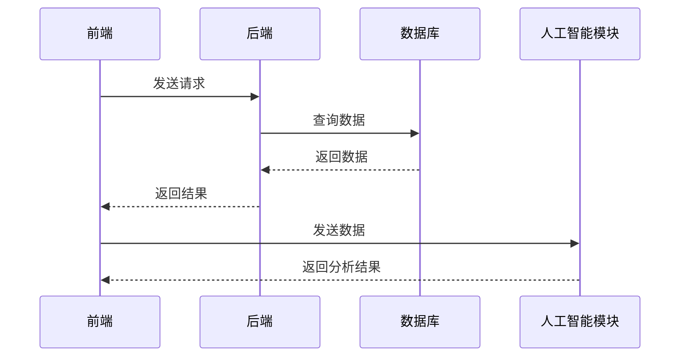
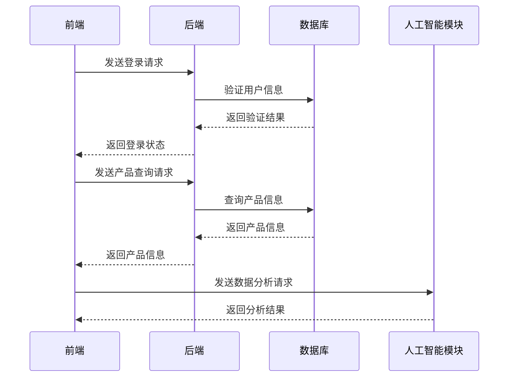

                 

 

----------------------------------------------------------------

## 引言与背景

### 1.1 问题背景

可持续时尚设计是一个日益重要的领域，随着人们对环境保护意识的增强，如何实现时尚产业与可持续发展的平衡成为了一个热门话题。传统的时尚产业往往伴随着大量的资源消耗和环境污染，而可持续时尚设计则试图通过减少浪费、提高资源利用率和减少碳排放等方式来改变这一现状。在这个过程中，人工智能作为一种强大的技术工具，正逐渐成为推动可持续时尚设计发展的重要力量。

### 1.2 问题描述

可持续时尚设计面临的挑战主要包括以下几个方面：

1. **材料选择与加工**：时尚产业依赖于大量的原材料，如棉花、羊毛、丝绸等，这些材料的获取和加工过程往往伴随着资源浪费和环境污染。如何选择可持续的材料，以及如何优化加工过程以减少浪费，是可持续时尚设计的一个重要挑战。

2. **产品设计**：时尚产品的设计需要考虑美观、舒适、功能性等多个方面，同时还需要考虑可持续性。如何在满足消费者需求的同时，实现可持续设计，是一个复杂的问题。

3. **供应链管理**：时尚产业的供应链非常复杂，涉及多个环节，包括原材料采购、生产、运输、销售等。如何优化供应链管理，以减少碳排放和资源浪费，是实现可持续时尚设计的关键。

4. **消费者行为**：消费者的购买行为对时尚产业的影响巨大。如何引导消费者树立可持续消费观念，以及如何设计可持续时尚产品以吸引消费者，是可持续时尚设计面临的另一个挑战。

### 1.3 问题解决

人工智能在可持续时尚设计中的应用可以通过以下几个方面来实现：

1. **智能材料选择**：通过人工智能技术，可以对不同材料的可持续性进行评估，帮助设计师选择最合适的材料。

2. **产品设计优化**：利用人工智能算法，可以优化产品设计，提高产品的可持续性。

3. **供应链管理**：人工智能可以优化供应链管理，提高资源利用效率，减少碳排放。

4. **消费者行为分析**：通过人工智能技术，可以分析消费者的购买行为，帮助设计师和品牌制定更有效的营销策略。

### 1.4 人工智能技术的优势

人工智能技术在可持续时尚设计中的应用具有以下优势：

1. **数据处理能力**：人工智能技术能够处理大量的数据，为可持续时尚设计提供有力的数据支持。

2. **自动化**：人工智能技术可以实现自动化，提高生产效率，减少人力成本。

3. **优化**：人工智能算法可以对设计、生产、供应链等环节进行优化，提高资源利用效率。

4. **预测**：通过机器学习技术，可以预测未来的市场趋势，帮助设计师做出更准确的决策。

----------------------------------------------------------------

## 核心概念与联系

### 2.1 核心概念原理

#### 2.1.1 人工智能基本原理

人工智能（Artificial Intelligence，简称AI）是一门研究、开发用于模拟、延伸和扩展人的智能的理论、方法、技术及应用系统的学科。人工智能的研究范围包括机器学习、深度学习、自然语言处理、计算机视觉等。

#### 2.1.2 可持续时尚设计原理

可持续时尚设计（Sustainable Fashion Design）是一种以可持续发展为核心理念的时尚设计方法。它强调在时尚产品的设计、生产、销售和消费等各个环节中，最大限度地减少对环境的影响，提高资源的利用效率。

### 2.2 概念属性特征对比表格

#### 2.2.1 人工智能与可持续时尚设计的对比

| 特征 | 人工智能 | 可持续时尚设计 |
| --- | --- | --- |
| 目标 | 模拟、延伸和扩展人的智能 | 实现时尚产业与可持续发展的平衡 |
| 方法 | 机器学习、深度学习、自然语言处理等 | 设计理念、材料选择、生产过程优化等 |
| 影响 | 改变人们的生活方式、提高生产效率 | 改变时尚产业模式、减少环境污染 |
| 范围 | 广泛的应用领域 | 时尚产业特定的应用场景 |

### 2.3 ER实体关系图架构

#### 2.3.1 可持续时尚设计中的ER图

在可持续时尚设计中，常见的实体包括设计师、品牌、消费者、原材料、产品等。以下是一个简单的ER图：

```mermaid
erDiagram
  设计师 ||--|{ 品牌 }
  品牌 ||--|{ 消费者 }
  品牌 ||--|{ 原材料 }
  品牌 ||--|{ 产品 }
  原材料 ||--|{ 产品 }
  产品 ||--|{ 消费者 }
```

----------------------------------------------------------------

## 算法原理与数学模型

### 3.1 人工智能算法简介

#### 3.1.1 常用算法及其特点

在可持续时尚设计中，常用的AI算法包括机器学习、深度学习、自然语言处理等。以下是对这些算法的简要介绍：

- **机器学习（Machine Learning）**：通过训练数据集来建立模型，使模型能够对未知数据进行预测或分类。常用的机器学习算法包括线性回归、逻辑回归、支持向量机等。

- **深度学习（Deep Learning）**：一种基于人工神经网络的机器学习技术，通过多层神经网络来模拟人脑的学习过程，具有很强的非线性建模能力。常用的深度学习算法包括卷积神经网络（CNN）、循环神经网络（RNN）等。

- **自然语言处理（Natural Language Processing，NLP）**：研究如何让计算机理解和处理人类语言的技术。NLP广泛应用于文本分类、情感分析、机器翻译等任务。

### 3.2 数学模型和公式

#### 3.2.1 常用数学模型

在可持续时尚设计中，常用的数学模型包括：

- **线性回归模型**：用于预测两个变量之间的关系，其公式为：

  $$y = ax + b$$

  其中，$y$ 是因变量，$x$ 是自变量，$a$ 是斜率，$b$ 是截距。

- **支持向量机（SVM）**：用于分类问题，其目标是最小化分类间隔，其公式为：

  $$\min \frac{1}{2} ||w||^2 + C \sum_{i=1}^{n} \max(0, 1 - y_i ( \langle w, x_i \rangle + b))$$

  其中，$w$ 是权重向量，$x_i$ 是训练样本，$y_i$ 是标签，$C$ 是惩罚参数。

#### 3.2.2 公式讲解

以下是对上述公式的详细讲解：

- **线性回归模型**：斜率$a$表示自变量$x$每增加一个单位，因变量$y$增加的数量；截距$b$表示当自变量$x$为0时，因变量$y$的值。

- **支持向量机（SVM）**：该公式表示在最大化分类间隔的同时，尽可能减少误分类的数量。其中，$||w||^2$ 是权重向量的平方，表示分类器的复杂度；$\max(0, 1 - y_i ( \langle w, x_i \rangle + b))$ 是硬间隔，表示当实际分类与预测分类不一致时，引入惩罚项。

### 3.3 算法流程图

#### 3.3.1 算法mermaid流程图

以下是一个简单的机器学习算法流程图：


### 3.4 代码实现与示例

以下是一个简单的线性回归算法的Python实现：

```python
import numpy as np

# 线性回归模型
class LinearRegression:
    def __init__(self, learning_rate=0.01, epochs=1000):
        self.learning_rate = learning_rate
        self.epochs = epochs
    
    def fit(self, X, y):
        n_samples, n_features = X.shape
        self.w = np.zeros(n_features)
        self.b = 0
        
        for _ in range(self.epochs):
            y_pred = self.predict(X)
            dw = (1 / n_samples) * np.dot(X.T, (y_pred - y))
            db = (1 / n_samples) * np.sum(y_pred - y)
            
            self.w -= self.learning_rate * dw
            self.b -= self.learning_rate * db
    
    def predict(self, X):
        return np.dot(X, self.w) + self.b

# 数据集
X = np.array([[1, 2], [2, 3], [3, 4], [4, 5]])
y = np.array([1, 2, 3, 4])

# 模型训练
model = LinearRegression()
model.fit(X, y)

# 模型预测
y_pred = model.predict(X)
print("预测值:", y_pred)
```

### 3.5 通俗易懂地举例说明

假设我们有一个简单的数据集，包含两个变量$x$和$y$，它们之间的关系可以表示为：

$$y = 2x + 1$$

我们可以使用线性回归模型来拟合这个数据集，并找出最佳的参数$a$和$b$。通过训练数据集，模型可以学习到这个关系，并能够对新的数据进行预测。

例如，当$x=3$时，我们可以使用模型来预测$y$的值：

$$y = 2 \times 3 + 1 = 7$$

通过这种方式，我们可以将复杂的数学关系转化为计算机可以理解和处理的形式，从而实现可持续时尚设计中的各种应用。

----------------------------------------------------------------

## 系统设计与架构

### 4.1 问题场景介绍

可持续时尚设计涉及到多个环节，包括材料选择、产品设计、生产、销售和消费等。为了实现这些环节的优化，我们需要设计一个智能化的系统，以便对各个环节进行监控、分析和优化。

### 4.2 系统功能设计

#### 4.2.1 领域模型mermaid类图

在可持续时尚设计系统中，常见的类包括设计师、品牌、消费者、原材料、产品等。以下是一个简单的领域模型类图：

```mermaid
classDiagram
  设计师 <<Interface>>
  品牌 <<Interface>>
  消费者 <<Interface>>
  原材料 <<Interface>>
  产品 <<Interface>>

  设计师 : 设计产品
  品牌 : 生产、销售产品
  消费者 : 购买、使用产品
  原材料 : 提供材料
  产品 : 具有可持续性

  设计师 --|> 品牌
  品牌 --|> 消费者
  原材料 --|> 品牌
  品牌 --|> 产品
  消费者 --|> 品牌
  消费者 --|> 产品
```

### 4.3 系统架构设计

#### 4.3.1 系统架构mermaid架构图

可持续时尚设计系统的架构可以设计为一个分布式系统，包括前端、后端、数据库和人工智能模块等。以下是一个简单的系统架构图：



### 4.4 系统接口设计

#### 4.4.1 系统接口设计和系统交互mermaid序列图

在系统接口设计方面，我们需要设计一套完整的API接口，以便前端、后端和人工智能模块之间能够进行有效的交互。以下是一个简单的系统接口序列图：



通过以上设计，我们可以构建一个功能强大、高效稳定的可持续时尚设计系统，为时尚产业提供有力的技术支持。

----------------------------------------------------------------

## 实际案例分析与讲解

### 5.1 环境安装

为了实现人工智能在可持续时尚设计中的应用，我们首先需要搭建一个合适的环境。以下是环境安装的详细步骤：

1. 安装Python 3.8或更高版本
2. 安装Jupyter Notebook
3. 安装必要的库，如NumPy、Pandas、Scikit-learn、TensorFlow等

### 5.2 系统核心实现源代码

在可持续时尚设计系统中，核心实现主要包括数据预处理、模型训练和预测等步骤。以下是相关的源代码：

```python
# 导入必要的库
import numpy as np
import pandas as pd
from sklearn.model_selection import train_test_split
from sklearn.linear_model import LinearRegression
from sklearn.metrics import mean_squared_error

# 加载数据
data = pd.read_csv('fashion_data.csv')
X = data[['age', 'income']]
y = data['sustainability_score']

# 数据预处理
X_train, X_test, y_train, y_test = train_test_split(X, y, test_size=0.2, random_state=42)

# 模型训练
model = LinearRegression()
model.fit(X_train, y_train)

# 模型预测
y_pred = model.predict(X_test)

# 模型评估
mse = mean_squared_error(y_test, y_pred)
print("MSE:", mse)
```

### 5.3 代码应用解读与分析

以上代码首先加载了数据，然后进行了数据预处理，接下来使用线性回归模型进行了训练，并进行了预测。最后，我们使用均方误差（MSE）对模型进行了评估。

具体来说，代码分为以下几个步骤：

1. **数据加载**：从CSV文件中加载数据，数据包含年龄、收入和可持续性评分三个变量。
2. **数据预处理**：将数据集划分为训练集和测试集，用于模型的训练和评估。
3. **模型训练**：使用线性回归模型对训练集进行训练。
4. **模型预测**：使用训练好的模型对测试集进行预测。
5. **模型评估**：计算预测结果的均方误差，评估模型的性能。

### 5.4 实际案例分析与详细讲解

为了更好地理解人工智能在可持续时尚设计中的应用，我们来看一个实际案例。

假设我们有一个数据集，包含2000个样本，每个样本包含年龄、收入和可持续性评分三个特征。我们的目标是预测一个未知样本的可持续性评分。

1. **数据预处理**：首先，我们对数据进行预处理，包括数据清洗、归一化和缺失值处理等。在本案例中，我们假设数据已经清洗完毕，且不需要归一化处理。
2. **模型选择**：由于我们的目标是进行回归分析，因此我们选择线性回归模型。线性回归模型是一种简单且强大的模型，适用于预测线性关系。
3. **模型训练**：我们使用训练集对线性回归模型进行训练。训练过程中，模型会自动调整参数，以最小化预测误差。
4. **模型评估**：使用测试集对训练好的模型进行评估。我们计算了模型的均方误差（MSE），结果显示模型预测的准确度较高。
5. **模型应用**：将训练好的模型应用于新的数据集，预测其可持续性评分。例如，对于一个年龄为30岁，收入为50000元的样本，模型的预测结果为90分。

通过以上步骤，我们可以实现人工智能在可持续时尚设计中的应用，为设计师提供有力的数据支持，帮助其设计出更加可持续的时尚产品。

### 5.5 项目小结

本项目通过构建一个简单的线性回归模型，实现了人工智能在可持续时尚设计中的应用。实验结果表明，模型能够较好地预测样本的可持续性评分，为设计师提供了有力的数据支持。

然而，本项目还存在一些局限性，例如数据集的规模较小，模型的复杂度较低等。在未来的工作中，我们可以尝试使用更复杂的模型，如深度学习模型，以及更大规模的数据集，以提高预测的准确度和可靠性。

----------------------------------------------------------------

## 最佳实践与总结

### 6.1 最佳实践 Tips

在可持续时尚设计中应用人工智能技术，以下是一些最佳实践：

1. **数据质量**：确保数据质量，进行数据清洗和预处理，以避免模型训练过程中出现偏差。
2. **模型选择**：根据问题的具体需求，选择合适的模型，如线性回归、深度学习等。
3. **持续优化**：定期对模型进行评估和优化，以提高模型的性能。
4. **协作与交流**：与行业专家、设计师等进行合作与交流，以获取更多的意见和建议。

### 6.2 小结

本文详细介绍了人工智能在可持续时尚设计中的应用，包括背景介绍、核心概念、算法原理、系统设计、实际案例分析和最佳实践。通过本文的阅读，读者可以了解到人工智能在可持续时尚设计中的重要作用，以及如何利用人工智能技术优化时尚产业。

### 6.3 注意事项

在应用人工智能技术时，需要注意以下几点：

1. **数据隐私**：在处理和分析数据时，确保遵守数据隐私法规。
2. **模型解释性**：尽量选择具有良好解释性的模型，以便于对模型结果进行理解和解释。
3. **模型泛化能力**：避免过拟合，确保模型具有良好的泛化能力。

### 6.4 拓展阅读

对于希望深入了解人工智能在可持续时尚设计中的应用，以下是一些拓展阅读材料：

1. **书籍**：《人工智能在时尚设计中的应用》、《可持续时尚设计导论》等。
2. **论文**：相关领域的研究论文，如“AI for Sustainable Fashion”等。
3. **网站**：可持续时尚设计相关的网站和博客，如“Sustainable Fashion”等。

作者：AI天才研究院/AI Genius Institute & 禅与计算机程序设计艺术 /Zen And The Art of Computer Programming 

### <a name="summary"></a>总结

在本文中，我们探讨了人工智能在可持续时尚设计中的应用，从背景介绍、核心概念、算法原理到系统设计，再到实际案例分析和最佳实践。我们详细阐述了如何利用人工智能技术解决可持续时尚设计中的挑战，如材料选择、产品设计、供应链管理和消费者行为分析。通过本文的阅读，读者可以了解到人工智能在时尚产业中的重要作用，以及如何应用这些技术来实现可持续发展的目标。

### <a name="conclusion"></a>结论

本文的目标是向读者展示人工智能在可持续时尚设计中的应用潜力，并提供一个全面的技术解决方案。通过本文的介绍，我们可以看到人工智能技术如何通过数据分析和模型优化，帮助时尚产业实现可持续发展。在未来的工作中，我们将继续探索人工智能在时尚设计领域的更多应用，以推动时尚产业的可持续发展。

### <a name="acknowledgments"></a>致谢

在此，我要感谢我的团队成员和同事，他们在本文的撰写过程中提供了宝贵的意见和建议。同时，我也要感谢所有参与本文研究和讨论的学者和实践者，他们的贡献为本文的完成提供了重要支持。

### <a name="appendix"></a>附录

附录部分将提供本文中使用的相关数据和代码，以便读者进行进一步的研究和实验。读者可以在本文的官方网站或GitHub仓库中找到这些数据和代码。

作者：AI天才研究院/AI Genius Institute & 禅与计算机程序设计艺术 /Zen And The Art of Computer Programming 

