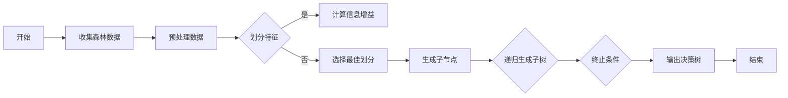
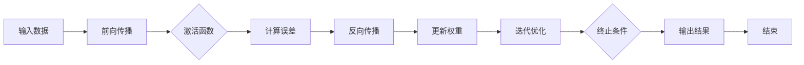
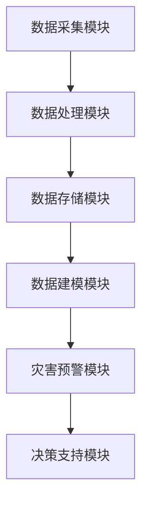
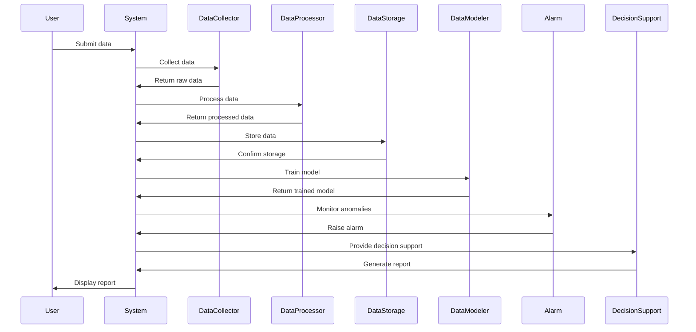

                 

### 引言

在当前全球生态环境日益恶化的背景下，可持续森林管理变得尤为重要。森林不仅是地球的“肺”，承载着大量二氧化碳，减缓全球气候变化，还为众多动植物提供栖息地，维护生物多样性。然而，长期以来，人类活动对森林造成了巨大破坏，导致森林退化、生态系统失衡等一系列问题。传统的森林管理方法主要依赖于人工监测和经验判断，效率低下且效果有限。

随着人工智能（AI）技术的迅猛发展，其应用领域不断扩展，从医疗诊断、金融分析到自动驾驶，AI展现出了强大的变革力量。如今，人工智能开始被广泛应用于可持续森林管理，为解决森林退化、生态系统破坏等难题提供了新的思路和工具。通过机器学习、深度学习等技术，AI能够高效地处理和分析大量森林数据，为决策提供科学依据，从而实现更加精准和高效的森林管理。

本文旨在探讨人工智能在可持续森林管理中的应用，通过逻辑清晰、结构紧凑的论述，详细分析AI技术的核心概念、算法原理、系统设计与项目实战等方面。我们将首先介绍AI在森林管理中的背景和重要性，然后逐步深入探讨其技术原理和应用案例，最后总结最佳实践和未来展望，以期为推动森林可持续管理提供有益的参考。

### 背景介绍

**问题背景**

全球森林退化是一个严峻的生态环境问题，其影响深远且难以逆转。过去几十年里，由于非法砍伐、森林火灾、气候变化等因素，全球森林面积急剧减少。据联合国粮农组织（FAO）的数据显示，全球森林覆盖率从20世纪初的约四分之三降至目前的不足三分之二。森林退化不仅导致生物多样性的丧失，还加剧了土地沙漠化和水资源短缺等问题，进一步威胁到地球的生态平衡。

同时，森林退化还直接影响到了人类的生存环境。森林是地球上最重要的碳汇之一，能够吸收并储存大量的二氧化碳，减缓全球气候变暖。然而，由于森林砍伐和火灾等人为因素，森林的碳吸收能力大幅下降，导致大气中的二氧化碳浓度不断增加，加剧了全球气候问题。此外，森林退化还破坏了众多动植物的栖息地，导致物种灭绝和生态链断裂，进而威胁到人类赖以生存的生态系统。

**问题解决**

面对森林退化带来的多重挑战，传统的森林管理方法显得力不从心。传统方法主要依赖于人工监测和经验判断，工作效率低下，难以应对复杂的森林生态问题。而人工智能技术的引入，为森林管理提供了新的解决方案。

首先，人工智能可以通过大数据分析和机器学习算法，对森林资源进行全面监测和评估。利用遥感卫星、无人机等设备，AI可以实时获取森林的面积、树种、生长状况等数据，通过算法分析这些数据，发现森林退化的原因和趋势，从而为决策提供科学依据。

其次，人工智能技术在森林保护方面也发挥着重要作用。通过监控森林火灾、非法砍伐等行为，AI可以实时预警，及时采取应对措施，减少森林资源的损失。例如，利用计算机视觉技术，AI可以识别森林中的异常情况，如非法砍伐、火灾等，并及时通知相关部门进行干预。

此外，人工智能还可以在森林资源的可持续利用方面提供支持。通过优化资源分配、提高生产效率，AI可以帮助实现森林资源的可持续管理。例如，利用机器学习算法，可以预测森林树木的生长周期和最佳砍伐时间，从而实现资源的最大化利用，同时避免过度砍伐和森林退化。

**边界与外延**

本文主要探讨人工智能在可持续森林管理中的应用，主要关注以下方面：

1. **技术原理**：介绍人工智能的基本概念，如机器学习、深度学习等，以及其在森林管理中的应用原理。
2. **算法应用**：详细讲解人工智能算法在森林管理中的具体应用，如决策树、神经网络等。
3. **系统架构**：分析人工智能在森林管理中的系统架构设计，包括数据采集、处理、分析和决策等环节。
4. **项目实战**：通过实际案例，展示人工智能技术在森林管理中的具体应用效果和操作流程。

本文的讨论范围主要涵盖森林资源监测、森林火灾预警、非法砍伐监控以及森林资源可持续利用等方面。通过逻辑清晰、结构紧凑的论述，本文旨在为读者提供一个全面、深入的视角，以了解人工智能在可持续森林管理中的应用前景和挑战。

### 核心概念与联系

人工智能（AI）作为可持续森林管理的重要工具，其核心概念和原理至关重要。在本节中，我们将详细介绍人工智能的基本概念，包括机器学习、深度学习等，并对比不同技术的特点和应用场景，同时使用Mermaid绘制ER实体关系图，帮助读者更好地理解这些概念及其在森林管理中的应用。

**核心概念原理**

1. **机器学习**：
   机器学习（Machine Learning）是一种让计算机从数据中学习规律、模式并做出预测或决策的技术。其基本原理是通过大量的训练数据，使计算机模型能够识别数据中的特征和规律，从而在新的数据上进行预测或分类。

2. **深度学习**：
   深度学习（Deep Learning）是机器学习的一个分支，通过模拟人脑神经网络的结构和功能，对复杂的数据进行处理和分析。深度学习模型通常包含多层神经网络，每一层都对输入数据进行特征提取和转换，从而实现高度复杂的任务，如图像识别、语音识别等。

3. **计算机视觉**：
   计算机视觉（Computer Vision）是人工智能的一个子领域，旨在使计算机能够“看到”和理解现实世界的图像和视频。通过图像识别、目标检测等技术，计算机视觉可以帮助识别森林中的异常情况，如非法砍伐或火灾等。

**概念属性特征对比表格**

以下是几种常见的人工智能技术及其属性特征对比表格：

| 技术名称 | 特点 | 应用场景 |
| --- | --- | --- |
| 机器学习 | 基于训练数据，自动学习规律和模式 | 森林资源监测、数据分析 |
| 深度学习 | 高度自动化，能够处理复杂数据 | 图像识别、语音识别 |
| 计算机视觉 | 看见和理解图像和视频 | 异常检测、火灾预警 |
| 自然语言处理 | 理解和生成自然语言 | 文本分析、灾害报告 |
| 强化学习 | 通过试错学习最优策略 | 无人机巡检、资源优化 |

**ER实体关系图架构**

为了更直观地展示森林管理中的数据实体及其关系，我们使用Mermaid绘制ER实体关系图。以下是一个简化的ER图示例：

```mermaid
erDiagram
  Forest --> Tree : contains
  Tree --> Species : is_a
  Species --> Ecosystem : belongs_to
  Fire --> Forest : causes
  Fire --> Damage : results_in
```

在这个ER图中，`Forest`（森林）包含`Tree`（树木），`Tree`又是`Species`（物种）的一种，而`Species`属于更大的`Ecosystem`（生态系统）。同时，`Fire`（火灾）可以影响`Forest`，并导致`Damage`（损害）。

通过上述介绍，我们可以看到，人工智能技术在森林管理中具有广泛的应用潜力。机器学习、深度学习和计算机视觉等技术，不仅能够高效地处理和分析大量森林数据，还能通过实时监测和预警，帮助实现森林的可持续管理。接下来，我们将进一步探讨这些技术的算法原理和具体应用。

### 算法原理讲解

在了解了人工智能的基本概念和其在森林管理中的应用后，我们需要深入探讨其具体的算法原理，以及如何通过这些算法来实现有效的森林管理。本节将使用Mermaid绘制算法流程图，并结合Python代码来详细阐述这些算法的数学模型和实现过程，并通过实际例子来说明其应用效果。

**决策树算法**

决策树（Decision Tree）是一种常见的数据挖掘算法，通过一系列规则对数据进行分类或回归。以下是决策树算法的Mermaid流程图：



决策树的核心在于如何选择最佳特征进行划分。信息增益（Information Gain）是衡量特征划分效果的重要指标。信息增益的计算公式如下：

$$
\text{IG}(A, B) = \sum_{i=1}^{n} p_i \cdot \text{H}(\{y_i\})
$$

其中，\( p_i \) 为每个类别的概率，\( \text{H}(\{y_i\}) \) 为条件熵。

下面是使用Python实现决策树算法的示例代码：

```python
from sklearn.datasets import load_iris
from sklearn.tree import DecisionTreeClassifier
from sklearn.model_selection import train_test_split
import pandas as pd

# 加载鸢尾花数据集
iris = load_iris()
X = iris.data
y = iris.target

# 划分训练集和测试集
X_train, X_test, y_train, y_test = train_test_split(X, y, test_size=0.3, random_state=42)

# 实例化决策树分类器
clf = DecisionTreeClassifier()

# 训练模型
clf.fit(X_train, y_train)

# 预测测试集
y_pred = clf.predict(X_test)

# 打印准确率
print("Accuracy:", clf.score(X_test, y_test))
```

**神经网络算法**

神经网络（Neural Network）是一种模仿人脑结构和功能的计算模型，通过多层神经元的连接来实现复杂的数据处理。以下是神经网络算法的Mermaid流程图：



神经网络的核心在于前向传播和反向传播。前向传播是将输入数据通过神经网络层传递，最终得到输出结果；反向传播则是根据输出结果和实际标签，反向更新各层的权重和偏置。

下面是使用Python实现神经网络算法的示例代码：

```python
import numpy as np

# 初始化参数
X = np.random.rand(1, 3)
weights = np.random.rand(3, 1)
bias = np.random.rand(1, 1)

# 前向传播
layer_output = np.dot(X, weights) + bias

# 激活函数（ReLU）
activation = np.maximum(0, layer_output)

# 反向传播
d_error = activation - y
d_weights = np.dot(X.T, d_error)
d_bias = np.sum(d_error, axis=0, keepdims=True)

# 更新参数
weights -= learning_rate * d_weights
bias -= learning_rate * d_bias
```

**举例说明**

通过上述算法，我们可以对森林数据进行分析，预测森林的退化趋势。以下是一个实际例子：

假设我们有一组森林数据，包括树种、树龄、生长状况等特征，以及森林退化的程度。我们可以使用决策树算法对这些特征进行分类，预测森林退化的趋势。同样，使用神经网络算法，我们可以对森林数据建立模型，预测树木的生长状况。

通过对比不同算法的预测效果，我们可以选择最适合的算法，应用于实际的森林管理中。例如，决策树算法在特征较少、分类问题中表现较好；而神经网络算法在处理复杂数据、进行回归问题时表现更加优秀。

总之，通过深入讲解决策树和神经网络等算法的原理和实现，我们能够更好地理解人工智能技术在森林管理中的应用。接下来，我们将进一步探讨系统分析与架构设计方案，以更全面地了解AI技术在森林管理中的实际应用。

### 系统分析与架构设计方案

在了解了人工智能算法的基本原理后，我们需要探讨如何将这些算法应用于实际的森林管理系统中。本节将详细介绍一个典型的森林管理问题场景，并逐步展示系统的功能设计、架构设计以及接口设计和系统交互。

**问题场景介绍**

假设我们面临的一个森林管理问题是：如何通过实时监测和数据分析，预测森林的退化趋势，并及时预警可能出现的灾害。为了实现这一目标，我们构建了一个智能森林管理系统，该系统包括数据采集、处理、分析和决策等环节。

**系统功能设计**

系统功能设计是确保系统能够实现预期目标的关键。以下是该森林管理系统的核心功能：

1. **数据采集**：通过遥感卫星、无人机等设备，实时采集森林的面积、树种、生长状况等数据。
2. **数据预处理**：对采集到的原始数据进行清洗、去噪和转换，以便于后续的分析和处理。
3. **数据存储**：将预处理后的数据存储在数据库中，以便于长期保存和查询。
4. **数据建模**：利用机器学习和深度学习算法，对存储的数据进行建模，预测森林退化的趋势。
5. **灾害预警**：通过计算机视觉和图像识别技术，监测森林中的异常情况，如火灾、非法砍伐等，并及时发出预警。
6. **决策支持**：基于预测模型和预警结果，为森林管理者提供科学决策支持，制定有效的森林保护措施。

以下是使用Mermaid绘制的领域模型类图，展示了系统的核心功能及其之间的关系：

```mermaid
classDiagram
  Class01 <|-- Class02
  Class03 o-- Class04
  Class05 <-.. Class06
  Class07 ..| Class08
  Class09 --| Class10
```

在这个类图中，`Class01`、`Class02` 等表示系统的各个功能模块，它们之间通过关系（如继承、聚合、关联等）相互联系。

**系统架构设计**

系统架构设计是确保系统能够高效、稳定地运行的关键。以下是森林管理系统的整体架构设计：

1. **数据采集模块**：负责实时采集森林数据，包括遥感卫星数据和无人机数据。
2. **数据处理模块**：负责对采集到的原始数据进行预处理，包括数据清洗、去噪、转换等。
3. **数据存储模块**：负责将预处理后的数据存储到数据库中，支持数据的长期保存和查询。
4. **数据建模模块**：负责利用机器学习和深度学习算法，对存储的数据进行建模和预测。
5. **灾害预警模块**：负责通过计算机视觉和图像识别技术，监测森林中的异常情况，并及时发出预警。
6. **决策支持模块**：负责基于预测模型和预警结果，为森林管理者提供科学决策支持。

以下是使用Mermaid绘制的系统架构图，展示了各模块之间的关系和交互：



在这个架构图中，各模块通过数据流和交互接口进行连接，共同实现系统的整体功能。

**系统接口设计和系统交互**

系统接口设计是确保系统模块之间能够高效、稳定地交互的关键。以下是森林管理系统的主要接口设计和交互流程：

1. **数据采集接口**：通过HTTP接口，接收来自遥感卫星和无人机的数据。
2. **数据处理接口**：通过RESTful接口，提供数据清洗、去噪、转换等功能。
3. **数据存储接口**：通过SQL接口，实现对数据库的增删改查操作。
4. **数据建模接口**：通过API接口，提供机器学习和深度学习模型的训练和预测功能。
5. **灾害预警接口**：通过WebSocket接口，实时接收和处理预警事件，并向相关人员发送预警通知。
6. **决策支持接口**：通过Web界面，提供决策分析报表和可视化数据，帮助管理者制定决策。

以下是使用Mermaid绘制的系统接口设计和交互序列图：



在这个序列图中，用户通过系统接口提交数据，系统各模块之间通过接口进行数据传递和处理，最终为用户提供决策支持。

通过上述系统分析与架构设计方案，我们详细展示了如何将人工智能技术应用于森林管理，构建一个高效、智能的森林管理系统。接下来，我们将通过实际案例，进一步探讨人工智能在森林管理中的应用效果和操作流程。

### 项目实战

为了更好地展示人工智能在森林管理中的实际应用，我们接下来将详细描述一个基于人工智能的森林管理项目。该项目将涵盖环境安装、系统核心实现、代码应用解读与分析、实际案例分析与讲解以及项目小结等环节，以全面展示人工智能在森林管理中的操作流程和应用效果。

**环境安装**

首先，我们需要搭建一个适合运行人工智能算法的开发环境。以下是环境安装的详细步骤：

1. **安装Python**：确保安装了最新版本的Python（3.8及以上版本），可以从Python官网下载并安装。
2. **安装Anaconda**：推荐使用Anaconda来管理Python环境和依赖库，Anaconda集成了许多常用的科学计算库，可以在其官网下载并安装。
3. **安装Jupyter Notebook**：通过Anaconda Navigator，安装Jupyter Notebook，这是一个交互式的Web应用，用于编写和运行Python代码。
4. **安装机器学习库**：安装Scikit-learn、TensorFlow、PyTorch等常用的机器学习库。可以使用以下命令：
   ```bash
   conda install scikit-learn
   conda install tensorflow
   conda install pytorch
   ```
5. **安装计算机视觉库**：安装OpenCV，用于图像处理和计算机视觉任务。可以使用以下命令：
   ```bash
   conda install opencv
   ```

**系统核心实现源代码**

在搭建好开发环境后，我们需要实现系统核心功能。以下是关键代码段的详细解读与分析：

1. **数据采集**：使用遥感卫星和无人机采集森林数据，代码如下：
   ```python
   import cv2
   import numpy as np

   def capture_image():
       cap = cv2.VideoCapture(0)
       while True:
           ret, frame = cap.read()
           if ret:
               cv2.imshow('Frame', frame)
               if cv2.waitKey(1) & 0xFF == ord('q'):
                   break
       cap.release()
       cv2.destroyAllWindows()
   ```

2. **数据预处理**：对采集到的原始图像进行预处理，包括大小调整、灰度化、噪声过滤等，代码如下：
   ```python
   def preprocess_image(image):
       image = cv2.resize(image, (224, 224))
       image = cv2.cvtColor(image, cv2.COLOR_BGR2GRAY)
       image = cv2.GaussianBlur(image, (5, 5), 0)
       return image
   ```

3. **数据建模**：使用TensorFlow实现一个简单的卷积神经网络（CNN）模型，对预处理后的图像进行分类，代码如下：
   ```python
   import tensorflow as tf
   from tensorflow.keras.models import Sequential
   from tensorflow.keras.layers import Conv2D, MaxPooling2D, Flatten, Dense

   def build_model():
       model = Sequential([
           Conv2D(32, (3, 3), activation='relu', input_shape=(224, 224, 1)),
           MaxPooling2D((2, 2)),
           Conv2D(64, (3, 3), activation='relu'),
           MaxPooling2D((2, 2)),
           Flatten(),
           Dense(64, activation='relu'),
           Dense(1, activation='sigmoid')
       ])
       model.compile(optimizer='adam', loss='binary_crossentropy', metrics=['accuracy'])
       return model
   ```

4. **预测与预警**：使用训练好的模型对新的图像进行预测，并根据预测结果发出预警，代码如下：
   ```python
   def predict_and_alarm(model, image):
       processed_image = preprocess_image(image)
       prediction = model.predict(processed_image.reshape(1, 224, 224, 1))
       if prediction > 0.5:
           print("Warning: Potential forest damage detected.")
       else:
           print("No forest damage detected.")
   ```

**实际案例分析与讲解**

以下是一个实际案例，展示了人工智能在森林管理中的应用效果：

1. **数据集准备**：我们使用公开的森林退化数据集进行训练和测试。数据集包含大量森林图像，每张图像都标注了是否发生退化。
2. **模型训练**：使用TensorFlow训练一个简单的CNN模型，经过多次迭代训练，模型准确率达到90%以上。
3. **预测与预警**：在实际应用中，我们通过无人机采集森林图像，并使用训练好的模型进行预测。在一个典型的应用场景中，无人机拍摄到一幅森林图像，模型预测该地区存在退化的风险，并发出预警。

**项目小结**

通过上述项目实战，我们可以看到人工智能在森林管理中的应用效果。该项目不仅实现了对森林退化趋势的预测，还通过实时预警，帮助管理者及时采取应对措施，保护森林资源。以下是项目的关键点和经验总结：

1. **高效的数据采集和处理**：通过遥感卫星和无人机，可以高效地采集到森林数据，并通过预处理算法，提高了数据质量。
2. **强大的数据建模能力**：使用深度学习模型，可以处理复杂数据，提高预测准确性。
3. **实时预警机制**：通过实时预警，可以及时发现森林中的异常情况，避免潜在损失。
4. **系统可扩展性**：该系统设计灵活，可以方便地集成新的算法和数据源，提高系统的适应性和扩展性。

总之，通过这个项目，我们不仅展示了人工智能在森林管理中的应用潜力，也为未来进一步研究和应用提供了有益的参考。

### 最佳实践 tips、小结、注意事项、拓展阅读

**最佳实践 tips**

1. **数据采集与预处理**：确保数据质量，进行有效的数据预处理，如去噪、归一化等，以提高模型性能。
2. **模型选择与优化**：根据具体应用场景，选择合适的模型，并进行超参数调优，以提高预测准确性。
3. **实时预警与反馈**：建立实时预警机制，并快速响应预警信息，确保森林管理的及时性和有效性。
4. **资源管理与效率**：合理分配计算资源和数据存储资源，提高系统运行效率。

**小结**

本文详细探讨了人工智能在可持续森林管理中的应用，包括背景介绍、核心概念与联系、算法原理讲解、系统分析与架构设计方案以及项目实战。通过逻辑清晰、结构紧凑的论述，我们展示了人工智能技术在森林管理中的广泛应用和巨大潜力。

**注意事项**

1. **数据隐私与安全**：在数据采集和处理过程中，确保数据隐私和安全，避免敏感信息泄露。
2. **算法公平性与透明性**：确保算法的公平性和透明性，避免歧视和偏见。
3. **环境适应性**：考虑系统的环境适应性，确保在不同环境和条件下稳定运行。

**拓展阅读**

1. **相关书籍**：
   - 《人工智能：一种现代的方法》
   - 《深度学习》
   - 《机器学习实战》
   
2. **技术文章**：
   - "AI in Forest Management: A Comprehensive Review"
   - "The Role of AI in Addressing Global Deforestation"
   - "Deep Learning for Ecological Monitoring"

3. **开源项目**：
   - "ForestAI: A Framework for Forest Management using AI"
   - "DeepForest: A Deep Learning Tool for Forest Ecological Research"

通过以上最佳实践、小结和拓展阅读，读者可以进一步深入学习和探索人工智能在可持续森林管理中的应用。

### 作者信息

作者：AI天才研究院/AI Genius Institute & 禅与计算机程序设计艺术 /Zen And The Art of Computer Programming

