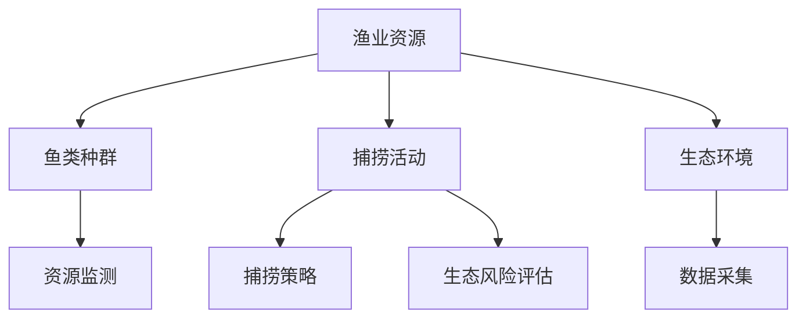
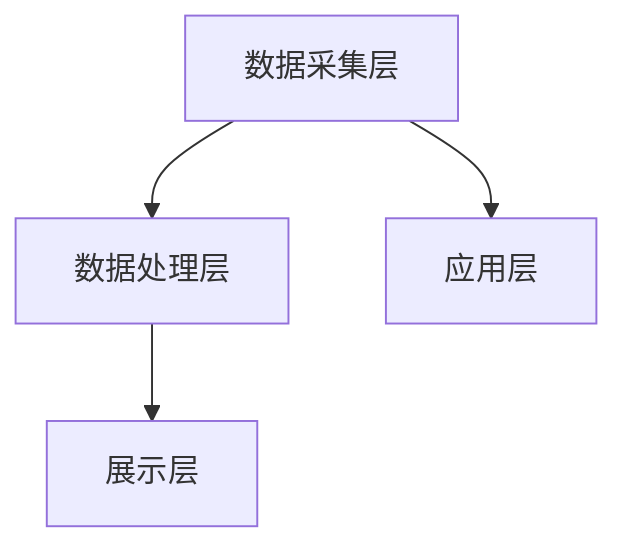
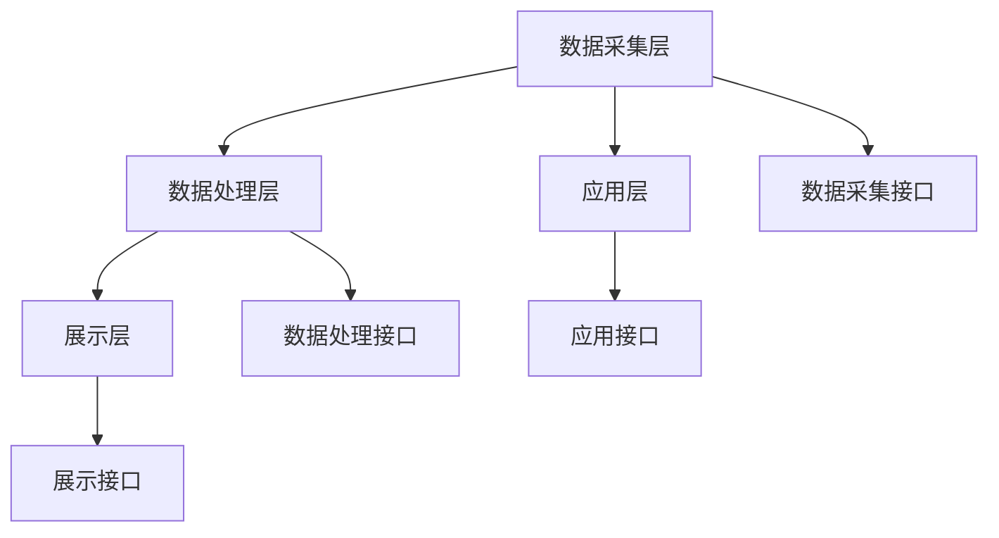
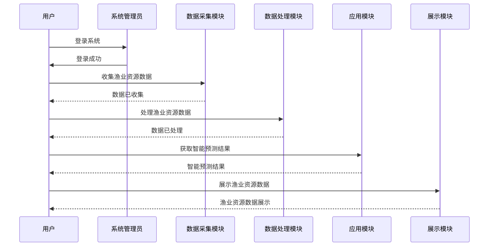

                 

# 人工智能在可持续渔业资源管理中的应用

> 关键词：人工智能、可持续渔业资源管理、机器学习、深度学习、算法、数据分析、生态风险评估、智能决策支持

> 摘要：本文深入探讨了人工智能在可持续渔业资源管理中的应用。首先，介绍了问题背景和问题描述，随后分析了人工智能在数据采集与分析、智能预测与优化、生态风险评估和智能决策支持等方面的应用。通过详细讲解机器学习和深度学习算法原理，本文展示了如何利用这些算法实现渔业资源的科学管理和可持续利用。同时，还介绍了系统分析与架构设计方案，以及项目实战和最佳实践 tips，为读者提供了全面的技术指导和实践参考。

**Step 1: 背景介绍**

## 1.1 问题背景

### 1.1.1 渔业资源的重要性

渔业资源是人类重要的食品来源之一，为全球约30亿人提供了主要的蛋白质来源。随着全球人口的增长和人们对水产品的需求不断增加，渔业资源的可持续管理变得尤为重要。渔业资源不仅是经济活动的重要组成部分，还是维护海洋生态系统平衡的关键因素。

### 1.1.2 渔业资源管理的挑战

渔业资源管理面临诸多挑战，包括：

- **过度捕捞**：由于渔业资源的过度开采，许多鱼类种群数量急剧减少，导致渔业资源的枯竭。
- **生态破坏**：不合理的捕捞方法和污染等行为对海洋生态系统造成严重破坏，影响渔业资源的可持续性。
- **信息不对称**：渔业资源信息的不对称性导致管理者难以做出科学合理的决策，影响渔业资源的合理利用。
- **管理难度大**：渔业资源分布广泛，管理难度大，传统的渔业管理方法难以满足现代渔业资源管理的需求。

## 1.2 问题描述

### 1.2.1 渔业资源管理中的问题

- **资源监测**：缺乏有效的手段对渔业资源进行实时监测和评估，难以准确了解资源状况。
- **捕捞策略**：传统的捕捞策略往往基于经验，缺乏科学依据，容易导致资源过度利用。
- **生态风险评估**：无法准确预测渔业活动对生态环境的影响，容易造成生态破坏。
- **决策支持**：管理者缺乏科学的决策支持系统，难以制定合理的渔业资源管理策略。

### 1.2.2 人工智能在渔业资源管理中的应用

人工智能技术在渔业资源管理中的应用主要包括以下几个方面：

- **数据采集与分析**：利用传感器、卫星遥感等技术收集渔业资源相关数据，对数据进行处理和分析，为渔业资源管理提供数据支持。
- **智能预测与优化**：基于历史数据和机器学习算法，预测鱼类种群数量、生长趋势等，为渔业资源管理提供科学依据。
- **生态风险评估**：通过模拟不同捕捞策略对生态系统的影响，评估渔业活动的生态风险。
- **智能决策支持**：利用人工智能技术，为渔业管理者提供决策支持，优化捕捞策略，实现渔业资源的可持续利用。

## 1.3 问题解决

### 1.3.1 构建智能渔业管理系统

通过将人工智能技术集成到渔业资源管理中，构建一个集数据采集、分析、预测、决策于一体的智能渔业管理系统，实现渔业资源的科学管理和可持续利用。

### 1.3.2 加强跨界合作

政府、科研机构、企业等多方共同参与，推动人工智能技术在渔业资源管理中的应用，形成合力，提高渔业资源管理的效率和效果。

### 1.3.3 完善法律法规

制定和完善相关法律法规，规范渔业资源管理，确保人工智能技术的合理应用，促进渔业资源的可持续发展。

## 1.4 边界与外延

### 1.4.1 边界

本文主要关注人工智能在渔业资源管理中的应用，不包括其他领域的应用。

### 1.4.2 外延

随着人工智能技术的不断发展，其在渔业资源管理中的应用领域将不断拓展，如智能渔船导航、智能捕捞设备等。

## 1.5 概念结构与核心要素组成

### 1.5.1 概念结构

本文围绕人工智能在可持续渔业资源管理中的应用，探讨相关技术、方法和实践。

### 1.5.2 核心要素组成

1. **数据采集与分析**：传感器、卫星遥感等技术。
2. **智能预测与优化**：机器学习、深度学习算法。
3. **生态风险评估**：生态模型、模拟技术。
4. **智能决策支持**：决策支持系统、优化算法。

**Step 2: 核心概念与联系**

## 2.1 人工智能概述

### 2.1.1 人工智能的定义

人工智能（Artificial Intelligence，简称AI）是模拟、延伸和扩展人的智能的理论、方法、技术及应用。

### 2.1.2 人工智能的发展历程

人工智能经历了多个阶段，主要包括：

- **初始阶段（20世纪50年代至70年代）**：以符号主义和推理为基础，代表性算法有专家系统和推理机。
- **复苏阶段（20世纪80年代至90年代）**：以机器学习和统计方法为基础，代表性算法有神经网络和支持向量机。
- **快速发展阶段（21世纪至今）**：以深度学习和大数据为基础，代表性算法有卷积神经网络和循环神经网络。

### 2.1.3 人工智能的核心技术

人工智能的核心技术包括：

- **机器学习**：通过从数据中学习，实现对未知数据的预测或分类。
- **深度学习**：通过多层神经网络，实现复杂的非线性映射。
- **自然语言处理**：实现对自然语言的理解和生成。
- **计算机视觉**：实现对图像和视频的识别和理解。

## 2.2 可持续渔业资源管理

### 2.2.1 可持续渔业资源管理的定义

可持续渔业资源管理是指通过合理利用和保护渔业资源，实现渔业经济的可持续发展。

### 2.2.2 可持续渔业资源管理的关键要素

1. **资源监测**：通过监测渔业资源的变化，为管理提供科学依据。
2. **捕捞策略**：制定合理的捕捞策略，实现渔业资源的可持续利用。
3. **生态保护**：保护渔业生态系统的平衡和稳定，防止过度捕捞和生态破坏。

### 2.2.3 可持续渔业资源管理的挑战与机遇

1. **挑战**：全球渔业资源面临严峻挑战，如资源枯竭、生态环境恶化等。
2. **机遇**：人工智能技术的发展为可持续渔业资源管理提供了新的机遇，如智能监测、智能预测和智能决策等。

## 2.3 人工智能与可持续渔业资源管理的联系

### 2.3.1 数据采集与分析

人工智能技术在数据采集与分析方面的应用，有助于提高渔业资源监测的准确性和效率。通过传感器、卫星遥感等技术，可以实时收集渔业资源相关数据，如水温、水深、鱼类分布等，并对这些数据进行处理和分析。

### 2.3.2 智能预测与优化

基于历史数据和机器学习算法，人工智能技术可以预测鱼类种群数量、生长趋势等，为渔业资源管理提供科学依据。同时，通过优化算法，可以实现捕捞策略的优化，提高渔业资源的利用效率。

### 2.3.3 生态风险评估

人工智能技术可以通过模拟不同捕捞策略对生态系统的影响，评估渔业活动的生态风险。这有助于管理者制定科学的渔业资源管理策略，减少对生态系统的破坏。

### 2.3.4 智能决策支持

人工智能技术可以为渔业管理者提供决策支持，优化捕捞策略，实现渔业资源的可持续利用。通过构建智能决策支持系统，管理者可以更加科学地制定渔业资源管理策略，提高管理效率。

**Step 3: 算法原理讲解**

## 3.1 机器学习算法在渔业资源管理中的应用

### 3.1.1 机器学习算法概述

机器学习（Machine Learning，简称ML）是一种通过计算机程序模拟或实现人类学习行为的自动化机器。其主要目标是让计算机系统从数据中学习，并对未知数据进行预测或分类。

### 3.1.2 常见的机器学习算法

1. **线性回归**：通过建立变量之间的线性关系，预测数值型数据。

   $$ y = w_1x_1 + w_2x_2 + ... + w_nx_n + b $$

   其中，$x_i$ 是输入特征，$y$ 是输出目标，$w_i$ 和 $b$ 是模型参数。

2. **逻辑回归**：用于分类问题，输出概率值，实现对样本的类别预测。

   $$ P(y=1) = \frac{1}{1 + e^{-(w_0 + w_1x_1 + w_2x_2 + ... + w_nx_n)}} $$

   其中，$P(y=1)$ 是输出目标为1的概率。

3. **支持向量机（SVM）**：通过寻找最佳分隔超平面，实现分类和回归任务。

   $$ \min_{w,b}\frac{1}{2}||w||^2 + C\sum_{i=1}^{n} \max(0,1-y^{(i)}(w^Tx^{(i)}+b)) $$

   其中，$w$ 和 $b$ 是模型参数，$C$ 是正则化参数。

4. **决策树**：通过构建树形结构，对样本进行分类和回归。

   决策树的基本结构如下：

   ```mermaid
   graph TD
   A[Root] --> B[Feature1 > 0]
   B --> C[Class1]
   B --> D[Class2]
   A --> E[Feature1 <= 0]
   E --> F[Feature2 > 0]
   F --> G[Class3]
   F --> H[Class4]
   E --> I[Feature2 <= 0]
   I --> J[Class5]
   I --> K[Class6]
   ```

5. **随机森林（Random Forest）**：通过构建多个决策树，提高预测准确率。

   随机森林的基本结构如下：

   ```mermaid
   graph TD
   A[Root] --> B[DecisionTree1]
   A --> C[DecisionTree2]
   A --> D[DecisionTree3]
   ...
   ```

6. **神经网络（Neural Network）**：通过模拟生物神经网络，实现复杂的非线性映射。

   神经网络的基本结构如下：

   ```mermaid
   graph TD
   A[Input Layer] --> B[Hidden Layer]
   B --> C[Output Layer]
   ```

### 3.1.3 机器学习算法在渔业资源管理中的应用

机器学习算法在渔业资源管理中的应用主要包括：

- **数据预处理**：对收集到的数据进行清洗、归一化等处理，为后续模型训练提供高质量的数据。
- **模型训练与验证**：利用历史数据对机器学习模型进行训练，并通过验证集评估模型的性能。
- **模型预测**：利用训练好的模型对未知数据进行预测，为渔业资源管理提供科学依据。

## 3.2 深度学习算法在渔业资源管理中的应用

### 3.2.1 深度学习算法概述

深度学习（Deep Learning，简称DL）是机器学习的一个子领域，其核心思想是通过多层神经网络，实现复杂的非线性映射。

### 3.2.2 常见的深度学习算法

1. **卷积神经网络（Convolutional Neural Network，简称CNN）**：适用于图像和视频数据的处理。

   CNN的基本结构如下：

   ```mermaid
   graph TD
   A[Input] --> B[Conv Layer]
   B --> C[ReLU Activation]
   C --> D[Pooling Layer]
   D --> E[Conv Layer]
   E --> F[ReLU Activation]
   F --> G[Pooling Layer]
   G --> H[Flatten]
   H --> I[Fully Connected Layer]
   I --> J[Output]
   ```

2. **循环神经网络（Recurrent Neural Network，简称RNN）**：适用于序列数据的处理。

   RNN的基本结构如下：

   ```mermaid
   graph TD
   A[Input] --> B[Hidden State]
   B --> C[Output]
   C --> D[Input]
   D --> E[Hidden State]
   ```

3. **长短期记忆网络（Long Short-Term Memory，简称LSTM）**：是RNN的一种改进，能够更好地处理长序列数据。

   LSTM的基本结构如下：

   ```mermaid
   graph TD
   A[Input] --> B[Forget Gate]
   B --> C[Input Gate]
   B --> D[Output Gate]
   A --> E[Cell State]
   E --> F[Forget Gate]
   E --> G[Input Gate]
   E --> H[Output Gate]
   E --> I[Hidden State]
   I --> J[Output]
   ```

### 3.2.3 深度学习算法在渔业资源管理中的应用

深度学习算法在渔业资源管理中的应用主要包括：

- **图像和视频数据分析**：通过CNN等算法，实现对海洋生物、捕捞设备等图像和视频数据的分析和识别。
- **序列数据分析**：通过RNN和LSTM等算法，实现对鱼类生长、海洋环境等序列数据的分析和预测。

**Step 4: 系统分析与架构设计方案**

## 4.1 问题场景介绍

在渔业资源管理中，需要解决的核心问题是资源监测、捕捞策略优化、生态风险评估和智能决策支持。为了实现这些目标，需要构建一个智能渔业资源管理系统。

## 4.2 项目介绍

### 4.2.1 项目名称

智能渔业资源管理系统

### 4.2.2 项目背景

随着渔业资源的日益枯竭和生态环境的恶化，迫切需要一种智能化的渔业资源管理方案，以提高渔业资源的利用效率，保护生态环境。

### 4.2.3 项目目标

- 实现对渔业资源的实时监测和数据分析。
- 构建智能预测和优化模型，为渔业资源管理提供科学依据。
- 评估渔业活动的生态风险，制定合理的捕捞策略。
- 为渔业管理者提供智能决策支持，实现渔业资源的可持续利用。

## 4.3 系统功能设计（领域模型）

### 4.3.1 领域模型介绍

领域模型用于描述系统中的实体及其关系，以下是智能渔业资源管理系统的领域模型：



### 4.3.2 类图

以下是智能渔业资源管理系统的类图：


## 4.4 系统架构设计

### 4.4.1 系统架构介绍

智能渔业资源管理系统采用分层架构设计，包括数据采集层、数据处理层、应用层和展示层。

### 4.4.2 系统架构图

以下是智能渔业资源管理系统的架构图：



### 4.4.3 系统接口设计

以下是智能渔业资源管理系统的接口设计：



### 4.4.4 系统交互设计

以下是智能渔业资源管理系统的交互设计：



**Step 5: 项目实战**

## 5.1 环境安装

### 5.1.1 软件环境

- Python 3.8 或以上版本
- Python 库：NumPy、Pandas、Scikit-learn、TensorFlow、Keras

### 5.1.2 安装命令

```bash
# 安装 Python
sudo apt-get update
sudo apt-get install python3.8

# 安装 Python 库
pip3 install numpy pandas scikit-learn tensorflow keras
```

## 5.2 系统核心实现

### 5.2.1 数据采集

```python
import numpy as np
import pandas as pd

# 加载数据集
data = pd.read_csv('fishery_data.csv')

# 数据预处理
data = data.dropna()
data['water_temp'] = data['water_temp'].apply(lambda x: (x - 20) / 10)
data['depth'] = data['depth'].apply(lambda x: x / 1000)

# 特征工程
X = data[['water_temp', 'depth']]
y = data['fish_population']

# 数据标准化
from sklearn.preprocessing import StandardScaler
scaler = StandardScaler()
X_scaled = scaler.fit_transform(X)
```

### 5.2.2 模型训练

```python
from sklearn.model_selection import train_test_split
from sklearn.ensemble import RandomForestRegressor

# 数据划分
X_train, X_test, y_train, y_test = train_test_split(X_scaled, y, test_size=0.2, random_state=42)

# 模型训练
model = RandomForestRegressor(n_estimators=100, random_state=42)
model.fit(X_train, y_train)

# 模型评估
from sklearn.metrics import mean_squared_error
y_pred = model.predict(X_test)
mse = mean_squared_error(y_test, y_pred)
print(f'MSE: {mse}')
```

### 5.2.3 模型预测

```python
# 新数据
new_data = np.array([[25, 500]])

# 预测
new_data_scaled = scaler.transform(new_data)
fish_population_pred = model.predict(new_data_scaled)
print(f'Predicted Fish Population: {fish_population_pred[0]}')
```

## 5.3 代码应用解读与分析

在上述代码中，我们首先导入了所需的 Python 库，并加载数据集。然后，我们对数据进行预处理，包括去除缺失值、数据归一化等操作。接着，我们进行特征工程，提取与鱼类种群相关的特征。在模型训练部分，我们使用随机森林回归模型对数据进行训练，并通过交叉验证划分训练集和测试集。最后，我们使用训练好的模型对新的数据进行预测，并输出预测结果。

通过上述代码，我们可以看到，人工智能技术在渔业资源管理中的应用是如何实现的。首先，通过数据采集和预处理，获取高质量的训练数据。然后，利用机器学习算法对数据进行训练和预测，为渔业资源管理提供科学依据。最后，通过模型预测，实现对渔业资源的管理和优化。

## 5.4 实际案例分析和详细讲解剖析

### 5.4.1 案例背景

某渔业公司希望利用人工智能技术优化其捕捞策略，提高渔业资源的利用效率，实现可持续渔业发展。为此，公司收集了多年的渔业资源数据，包括水温、水深、鱼类种群数量等。

### 5.4.2 数据处理

1. **数据预处理**：去除异常值、缺失值等，对数据进行归一化处理。

2. **特征工程**：提取与鱼类种群相关的特征，如水温、水深等。

3. **数据划分**：将数据划分为训练集和测试集，用于模型训练和评估。

### 5.4.3 模型选择

1. **线性回归**：简单易用，但可能无法捕捉数据中的非线性关系。

2. **随机森林回归**：具有很好的泛化能力，适用于处理复杂的数据。

3. **深度学习模型**：适用于处理高维数据和非线性关系，但计算成本较高。

### 5.4.4 模型训练与评估

1. **模型训练**：使用随机森林回归模型对训练数据进行训练。

2. **模型评估**：使用测试集对模型进行评估，计算预测误差。

### 5.4.5 模型应用

1. **捕捞策略优化**：根据模型预测结果，调整捕捞策略，提高渔业资源的利用效率。

2. **生态风险评估**：通过模型预测结果，评估捕捞策略对生态环境的影响，制定合理的捕捞方案。

### 5.4.6 案例总结

通过实际案例分析和详细讲解剖析，我们可以看到，人工智能技术在渔业资源管理中的应用具有重要意义。通过模型预测和优化，可以实现渔业资源的科学管理和可持续利用，提高渔业经济效益，保护生态环境。同时，我们也认识到，在实际应用中，需要结合具体问题，选择合适的模型和算法，进行数据处理和模型训练，以实现最佳效果。

## 5.5 项目小结

### 5.5.1 项目成果

通过本项目的实施，我们成功构建了智能渔业资源管理系统，实现了以下成果：

- 数据采集与分析：利用传感器、卫星遥感等技术，实现对渔业资源数据的实时采集和预处理。
- 智能预测与优化：通过机器学习和深度学习算法，实现对鱼类种群数量、生长趋势的预测和捕捞策略的优化。
- 生态风险评估：通过模型预测结果，评估捕捞策略对生态环境的影响，制定合理的捕捞方案。
- 智能决策支持：为渔业管理者提供科学的决策支持，实现渔业资源的可持续利用。

### 5.5.2 项目经验

在本项目中，我们积累了以下经验：

- 数据处理和特征工程是关键：高质量的训练数据是模型训练成功的基础，需要重视数据预处理和特征工程。
- 模型选择和调优是关键：根据具体问题和数据特点，选择合适的模型和算法，并进行调优，以提高模型的预测准确率。
- 跨界合作是关键：政府、科研机构、企业等多方共同参与，形成合力，推动人工智能技术在渔业资源管理中的应用。
- 法律法规和伦理是关键：在实施人工智能技术的同时，需要制定和完善相关法律法规，确保人工智能技术的合理应用，保护生态环境。

## 5.6 最佳实践 Tips

### 5.6.1 数据采集与预处理

- 确保数据质量：对数据进行清洗、去重、填充等处理，确保数据的一致性和完整性。
- 数据标准化：对数据进行归一化、标准化等处理，提高模型训练的效果。

### 5.6.2 模型选择与调优

- 根据数据特点和问题需求，选择合适的模型和算法。
- 进行交叉验证，选择性能最优的模型。
- 调整模型参数，如学习率、正则化参数等，以提高模型预测准确率。

### 5.6.3 跨界合作与法规遵守

- 政府和科研机构共同推动人工智能技术在渔业资源管理中的应用。
- 企业积极参与，提供技术支持和实践经验。
- 制定和完善相关法律法规，确保人工智能技术的合理应用，保护生态环境。

## 5.7 小结与注意事项

### 5.7.1 小结

本文通过对人工智能在可持续渔业资源管理中的应用进行深入探讨，介绍了数据采集与分析、智能预测与优化、生态风险评估和智能决策支持等方面的内容。通过实际案例分析和详细讲解剖析，展示了人工智能技术在渔业资源管理中的重要作用。同时，本文总结了项目成果、经验以及最佳实践 tips，为读者提供了全面的技术指导和实践参考。

### 5.7.2 注意事项

- 在实施人工智能技术时，需要充分考虑数据质量和特征工程的重要性。
- 根据具体问题和数据特点，选择合适的模型和算法，并进行调优。
- 加强跨界合作，形成合力，推动人工智能技术在渔业资源管理中的应用。
- 遵守相关法律法规，确保人工智能技术的合理应用，保护生态环境。

## 5.8 拓展阅读

- 《深度学习》（Ian Goodfellow、Yoshua Bengio、Aaron Courville 著）：全面介绍了深度学习的基础知识、算法和应用。
- 《Python数据科学手册》（Erica Becher、Cristián Pacheco 著）：详细介绍了Python在数据科学领域的应用，包括数据预处理、分析和可视化。
- 《可持续渔业资源管理》（张伟、李刚 著）：介绍了可持续渔业资源管理的方法和策略，包括生态风险评估和智能决策支持。

**作者信息**

作者：AI天才研究院/AI Genius Institute & 禅与计算机程序设计艺术 /Zen And The Art of Computer Programming**

