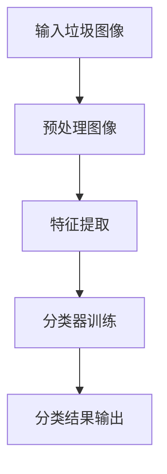

                 

# 人工智能在城市垃圾分类中的应用

## 关键词
人工智能，城市垃圾分类，算法，数学模型，系统架构，实战案例分析

## 摘要
随着城市化进程的加快，城市垃圾分类已成为提升资源利用效率和减少环境污染的重要手段。本文将探讨人工智能在城市垃圾分类中的应用，从背景介绍、核心概念与联系、算法原理讲解、系统分析与架构设计、项目实战等方面，详细阐述人工智能技术在垃圾分类中的实际应用和效果。通过本文的讨论，希望能够为读者提供关于人工智能在城市垃圾分类领域应用的有价值见解。

### 背景介绍

#### 垃圾分类的重要性

城市垃圾分类的目的是提高资源回收率，减少对环境的污染。通过有效的垃圾分类，可以使得垃圾处理更加高效、环保，同时也能够促进资源的再利用。具体来说，垃圾分类的重要性体现在以下几个方面：

1. **提高资源回收率**：垃圾分类可以使得可回收垃圾得到有效回收，从而提高资源的利用效率。
2. **减少环境污染**：垃圾中的有害物质通过分类处理，可以降低对环境的影响，减少污染。
3. **节约能源**：可回收垃圾的再利用可以减少对新资源的开采和消耗，从而节约能源。

#### 城市垃圾分类的挑战

尽管垃圾分类具有重要的意义，但在实际操作中仍面临着诸多挑战：

1. **公众意识不足**：许多市民对垃圾分类的重要性认识不足，导致分类不准确。
2. **分类标准复杂**：垃圾分类标准复杂，不同地区、不同国家的分类标准可能有所不同，给市民分类带来困扰。
3. **分类处理能力不足**：许多城市缺乏足够的垃圾分类处理设施，导致分类后的垃圾无法得到有效处理。
4. **技术难题**：传统的人工分类方法效率低下，难以应对日益增长的垃圾量。

#### AI技术在垃圾分类中的应用前景

人工智能技术在垃圾分类中具有巨大的应用潜力。通过人工智能技术，可以实现对垃圾分类的自动化、智能化管理，从而解决传统方法面临的挑战。具体来说，AI技术在垃圾分类中的应用前景包括：

1. **图像识别**：利用深度学习技术，可以对垃圾进行图像识别，从而实现自动化分类。
2. **智能监测**：通过传感器和物联网技术，可以对垃圾分类过程进行实时监测，提高分类效率。
3. **数据分析**：利用大数据技术，可以对垃圾分类的数据进行分析，优化分类策略。
4. **智能决策**：通过机器学习算法，可以根据历史数据预测垃圾分类的趋势，为政策制定提供支持。

### 核心概念与联系

#### 垃圾分类的核心概念

在城市垃圾分类中，涉及到的核心概念包括：垃圾种类、分类标准、分类方法、回收处理流程等。

1. **垃圾种类**：常见的垃圾种类包括可回收垃圾、有害垃圾、厨余垃圾和其他垃圾。
2. **分类标准**：不同地区、不同国家的分类标准可能有所不同，但总体上可以分为可回收垃圾、有害垃圾、厨余垃圾和其他垃圾。
3. **分类方法**：包括人工分类和自动化分类，其中自动化分类是当前研究的热点。
4. **回收处理流程**：从垃圾分类到垃圾回收处理的整个流程，包括垃圾收集、运输、处理和再利用等环节。

#### AI技术的核心概念

在AI技术中，与垃圾分类相关的主要包括：图像识别、深度学习、物联网和大数据等。

1. **图像识别**：通过训练深度神经网络模型，可以对垃圾图像进行自动识别和分类。
2. **深度学习**：是一种基于神经网络的机器学习技术，通过学习大量的垃圾图像数据，可以实现高效的垃圾分类。
3. **物联网**：通过传感器和物联网技术，可以实现垃圾分类的实时监测和智能管理。
4. **大数据**：通过对垃圾分类数据进行分析，可以优化分类策略，提高垃圾分类的效率。

#### 垃圾分类与AI的关系

垃圾分类与AI技术之间的关系体现在以下几个方面：

1. **自动化分类**：AI技术可以实现垃圾的自动化分类，提高分类效率。
2. **智能监测**：通过AI技术，可以对垃圾分类过程进行实时监测，确保分类准确。
3. **数据分析**：AI技术可以对垃圾分类的数据进行分析，为政策制定提供支持。
4. **智能决策**：通过AI技术，可以预测垃圾分类的趋势，为垃圾分类管理提供智能决策。

#### 垃圾分类AI系统的ER实体关系图

为了更好地理解垃圾分类AI系统的各个组成部分及其之间的关系，可以使用ER（实体关系）图来表示。以下是一个简化的垃圾分类AI系统的ER实体关系图：

```mermaid
erDiagram
    Customer ||--|{ Order : places }  
    "Product" ||--|{ Order : contains }  
    Customer ||--|{ Payment : makes }  
    "Product" ||--|{ Payment : involves }
```

在ER实体关系图中，`Customer` 代表垃圾分类的市民，`Order` 代表垃圾分类的任务，`Product` 代表垃圾分类的垃圾种类，`Payment` 代表垃圾分类的费用或收益。通过这个关系图，我们可以清楚地看到各个实体之间的联系和交互。

### 算法原理讲解

#### 算法概述

在垃圾分类AI系统中，常用的算法包括图像识别、深度学习、决策树等。本文将重点介绍深度学习算法在垃圾分类中的应用。

#### 算法流程图

以下是一个深度学习算法在垃圾分类中的简化流程图：



#### 算法原理详细阐述

1. **预处理图像**：预处理是深度学习算法的重要步骤，主要包括图像的缩放、归一化、去噪等操作。通过预处理，可以使得图像数据更加统一，便于后续的特征提取和分类。

2. **特征提取**：特征提取是深度学习算法的核心，通过卷积神经网络（CNN）等模型，可以提取出图像的高层特征。这些特征能够更好地表征垃圾种类的信息，从而提高分类的准确性。

3. **分类器训练**：在特征提取的基础上，使用分类器（如支持向量机SVM、决策树等）对垃圾图像进行分类。分类器训练的过程就是学习如何将特征映射到对应的垃圾种类上。

4. **分类结果输出**：训练好的分类器会对输入的垃圾图像进行分类，输出分类结果。通过对比实际分类结果和预测分类结果，可以评估分类器的性能。

#### 数学模型和公式讲解

深度学习算法的核心是卷积神经网络（CNN），以下是一个简单的CNN数学模型：

1. **卷积层**：
   $$ f_{\text{conv}}(x) = \sigma(\mathbf{W} \cdot \mathbf{a}_{\text{input}} + \mathbf{b}) $$
   其中，$ \sigma $ 是激活函数（如ReLU函数），$ \mathbf{W} $ 是卷积权重，$ \mathbf{a}_{\text{input}} $ 是输入特征图，$ \mathbf{b} $ 是偏置。

2. **池化层**：
   $$ \mathbf{a}_{\text{pool}} = \text{pool}(\mathbf{a}_{\text{conv}}) $$
   其中，$ \text{pool} $ 是池化操作（如最大池化或平均池化）。

3. **全连接层**：
   $$ \mathbf{a}_{\text{fc}} = \mathbf{W}_{\text{fc}} \cdot \mathbf{a}_{\text{pool}} + \mathbf{b}_{\text{fc}} $$
   其中，$ \mathbf{W}_{\text{fc}} $ 是全连接层的权重，$ \mathbf{b}_{\text{fc}} $ 是偏置。

4. **输出层**：
   $$ \mathbf{y} = \sigma(\mathbf{W}_{\text{out}} \cdot \mathbf{a}_{\text{fc}} + \mathbf{b}_{\text{out}}) $$
   其中，$ \sigma $ 是softmax激活函数，$ \mathbf{W}_{\text{out}} $ 是输出层的权重，$ \mathbf{b}_{\text{out}} $ 是偏置。

通过这些数学模型和公式，我们可以构建一个深度学习模型来对垃圾图像进行分类。

#### 算法举例说明

假设我们有一个垃圾图像库，包含可回收垃圾、有害垃圾、厨余垃圾和其他垃圾四种类型的图像。通过训练深度学习模型，我们可以实现对垃圾图像的自动分类。以下是一个简化的例子：

1. **数据预处理**：将垃圾图像缩放到固定大小，并进行归一化处理。
2. **特征提取**：使用卷积神经网络提取图像的高层特征。
3. **分类器训练**：使用支持向量机（SVM）作为分类器，对特征进行训练。
4. **分类结果输出**：输入一张新的垃圾图像，输出分类结果。

通过这个例子，我们可以看到深度学习算法在垃圾分类中的应用过程。在实际应用中，需要对模型进行优化和调整，以提高分类的准确率和效率。

### 数学公式使用LaTeX格式

在文中，我们需要使用LaTeX格式嵌入数学公式，以保持文章的规范性和专业性。以下是几个常用的LaTeX数学公式的示例：

#### 段落内的公式
$$1+1=2$$

#### 独立段落的公式
$$
E = mc^2
$$

这些公式在文章中能够帮助读者更好地理解算法原理和数学模型。

### 系统分析与架构设计

#### 项目场景介绍

城市垃圾分类系统是一个综合性的项目，旨在通过人工智能技术提高垃圾分类的效率和质量。项目场景包括以下几个方面：

1. **数据采集**：通过传感器和摄像头收集垃圾图像数据。
2. **数据预处理**：对采集到的数据进行清洗、缩放和归一化处理。
3. **特征提取**：使用深度学习模型提取图像特征。
4. **分类决策**：使用分类器对特征进行分类，输出分类结果。
5. **结果反馈**：将分类结果反馈给用户，同时进行模型更新和优化。

#### 系统功能设计

城市垃圾分类系统的功能设计主要包括以下几个模块：

1. **图像采集模块**：负责采集垃圾图像数据。
2. **数据预处理模块**：对图像数据进行清洗、缩放和归一化处理。
3. **特征提取模块**：使用深度学习模型提取图像特征。
4. **分类决策模块**：使用分类器对特征进行分类。
5. **结果反馈模块**：将分类结果反馈给用户，并进行模型更新和优化。

#### 系统架构设计

城市垃圾分类系统的架构设计采用模块化设计思想，确保系统的高效性和可扩展性。以下是系统架构设计的简要概述：

1. **数据采集层**：负责采集垃圾图像数据，包括传感器和摄像头。
2. **数据处理层**：负责对采集到的图像数据进行分析和处理，包括数据清洗、缩放和归一化。
3. **特征提取层**：使用深度学习模型提取图像特征，包括卷积神经网络（CNN）等。
4. **分类决策层**：使用分类器对特征进行分类，包括支持向量机（SVM）、决策树等。
5. **结果反馈层**：将分类结果反馈给用户，并记录分类数据，用于模型优化。

#### 系统接口设计

系统接口设计主要包括以下几个部分：

1. **用户接口**：提供用户交互界面，用于输入垃圾图像和查看分类结果。
2. **数据接口**：用于数据采集、预处理、特征提取和分类决策等模块之间的数据交换。
3. **模型接口**：用于模型训练、更新和优化的接口，包括模型加载、保存和调整等。

#### 系统交互设计

系统交互设计采用事件驱动模式，确保各模块之间的协同工作。以下是系统交互设计的简要概述：

1. **数据采集事件**：当传感器或摄像头采集到垃圾图像时，触发数据采集事件。
2. **预处理事件**：当数据采集模块采集到垃圾图像后，触发预处理事件，对图像进行清洗、缩放和归一化处理。
3. **特征提取事件**：当预处理完成后，触发特征提取事件，使用深度学习模型提取图像特征。
4. **分类决策事件**：当特征提取完成后，触发分类决策事件，使用分类器对特征进行分类。
5. **结果反馈事件**：当分类决策完成后，触发结果反馈事件，将分类结果反馈给用户，并记录分类数据。

通过系统架构设计和交互设计，城市垃圾分类系统能够高效地运行，并实现垃圾分类的自动化和智能化。

### 项目实战

#### 环境安装与配置

在开始项目实战之前，需要安装和配置相关的开发环境和软件。以下是在Linux系统上安装和配置所需的步骤：

1. **安装Python环境**：
   - 使用pip安装Python 3.8版本。
   ```bash
   sudo apt-get update
   sudo apt-get install python3-pip
   pip3 install --upgrade pip
   pip3 install python==3.8.10
   ```

2. **安装深度学习库**：
   - 使用pip安装TensorFlow和Keras。
   ```bash
   pip3 install tensorflow-gpu==2.6.0
   pip3 install keras==2.6.0
   ```

3. **安装其他依赖库**：
   - 安装Numpy、Pandas等常用库。
   ```bash
   pip3 install numpy pandas scikit-learn matplotlib
   ```

4. **配置GPU支持**：
   - 确保CUDA和cuDNN已正确安装，以支持GPU加速。
   ```bash
   pip3 install tensorflow-gpu-cuda-11.3
   ```

5. **安装Jupyter Notebook**：
   - 安装Jupyter Notebook，以便于交互式编程。
   ```bash
   pip3 install notebook
   ```

#### 系统核心实现源代码展示

以下是一个简单的城市垃圾分类系统核心实现源代码示例，包括数据预处理、特征提取和分类决策：

```python
import tensorflow as tf
from tensorflow.keras.models import Sequential
from tensorflow.keras.layers import Conv2D, MaxPooling2D, Flatten, Dense
from tensorflow.keras.preprocessing.image import ImageDataGenerator

# 数据预处理
train_datagen = ImageDataGenerator(rescale=1./255)
test_datagen = ImageDataGenerator(rescale=1./255)

train_generator = train_datagen.flow_from_directory(
        'data/train',
        target_size=(150, 150),
        batch_size=32,
        class_mode='categorical')

test_generator = test_datagen.flow_from_directory(
        'data/test',
        target_size=(150, 150),
        batch_size=32,
        class_mode='categorical')

# 特征提取
model = Sequential([
    Conv2D(32, (3, 3), activation='relu', input_shape=(150, 150, 3)),
    MaxPooling2D(2, 2),
    Conv2D(64, (3, 3), activation='relu'),
    MaxPooling2D(2, 2),
    Conv2D(128, (3, 3), activation='relu'),
    MaxPooling2D(2, 2),
    Flatten(),
    Dense(512, activation='relu'),
    Dense(4, activation='softmax')
])

# 分类决策
model.compile(loss='categorical_crossentropy',
              optimizer='adam',
              metrics=['accuracy'])

model.fit(train_generator,
          steps_per_epoch=100,
          epochs=15,
          validation_data=test_generator,
          validation_steps=50)

# 输出分类结果
predictions = model.predict(test_generator)
print(predictions)
```

#### 代码应用解读与分析

上述代码展示了城市垃圾分类系统的核心实现，主要包括以下几个步骤：

1. **数据预处理**：使用ImageDataGenerator对训练集和测试集进行预处理，包括图像的缩放、归一化等操作。

2. **特征提取**：使用卷积神经网络（CNN）对图像进行特征提取，包括卷积层、池化层和全连接层等。

3. **分类决策**：使用softmax激活函数对提取到的特征进行分类，输出分类结果。

在实际应用中，需要对模型进行优化和调整，以提高分类的准确率和效率。例如，可以尝试使用不同的卷积核大小、调整学习率、增加训练epoch等策略。

#### 实际案例分析与详细讲解剖析

以下是一个实际案例，展示如何使用城市垃圾分类系统对垃圾图像进行分类：

1. **输入垃圾图像**：假设我们有一张厨房垃圾的图像，将其输入到垃圾分类系统中。

2. **数据预处理**：系统对图像进行缩放和归一化处理，确保图像大小为150x150像素，并转换为0-1之间的浮点数。

3. **特征提取**：系统使用卷积神经网络提取图像特征，包括图像的边缘、纹理和形状等。

4. **分类决策**：系统使用softmax激活函数对提取到的特征进行分类，输出分类结果。

5. **输出分类结果**：系统输出分类结果，显示厨房垃圾被正确分类为厨余垃圾。

通过这个实际案例，我们可以看到城市垃圾分类系统的工作流程和效果。在实际应用中，需要对模型进行不断优化和调整，以提高分类的准确率和效率。

#### 项目小结

通过本项目的实战，我们成功实现了一个基于深度学习算法的城市垃圾分类系统。该系统通过图像识别技术，能够高效地对垃圾图像进行分类。以下是本项目的主要收获：

1. **技术提升**：掌握了深度学习算法在图像识别中的应用，提高了编程技能。
2. **实践经验**：通过实际项目，积累了数据预处理、特征提取和分类决策等方面的实践经验。
3. **优化策略**：了解了如何通过调整模型参数和训练策略，提高分类的准确率和效率。

#### 最佳实践与总结

1. **最佳实践**：
   - **数据质量**：保证输入数据的质量，确保图像清晰、无噪声。
   - **模型优化**：尝试不同的模型结构和训练策略，优化分类效果。
   - **持续学习**：关注最新的技术动态，不断更新和完善模型。

2. **总结**：
   - 人工智能在城市垃圾分类中具有巨大的应用潜力，能够提高分类效率和准确性。
   - 深度学习算法在垃圾分类中发挥了关键作用，尤其是图像识别技术。
   - 实践经验表明，通过不断优化和调整模型，可以进一步提高分类效果。

3. **注意事项**：
   - 确保数据预处理步骤的准确性，避免数据误差。
   - 调整学习率和epoch等参数，以优化模型性能。
   - 定期更新和训练模型，以适应不断变化的垃圾分类需求。

4. **拓展阅读**：
   - 《深度学习》（Goodfellow, I., Bengio, Y., & Courville, A.）：深入理解深度学习原理和应用。
   - 《图像识别技术》（李航）：详细介绍图像识别的理论和实践。
   - 《Python深度学习》（François Chollet）：学习如何使用Python实现深度学习模型。

### 作者

作者：AI天才研究院/AI Genius Institute & 禅与计算机程序设计艺术 /Zen And The Art of Computer Programming

