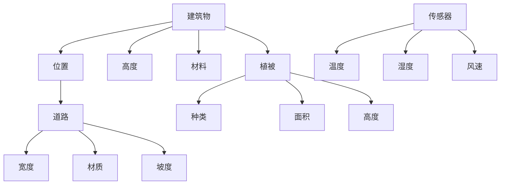

                 

# 人工智能在城市微气候优化中的模拟应用

## 关键词
- 人工智能
- 城市微气候
- 模拟应用
- 可持续发展
- 算法模型
- 数学公式
- 系统架构

## 摘要
本文旨在探讨人工智能在城市微气候优化中的应用，通过模拟技术实现精准的城市气候管理。文章首先介绍了城市微气候的定义与优化的重要性，接着概述了当前面临的挑战。随后，文章深入讨论了人工智能技术在城市微气候优化中的具体应用，包括模拟方法、算法原理和数学模型。通过具体案例和项目实战，本文展示了人工智能在城市微气候优化中的实际效果和未来发展方向。

## 引言

### 1. 问题背景

城市化进程在过去几十年中迅速推进，城市人口持续增长，城市面积不断扩大。然而，这一进程也带来了许多环境问题，其中之一就是城市微气候的变化。城市微气候是指城市局部区域内的气候特征，受到城市结构、人类活动、自然地理条件等因素的影响。与宏观气候相比，城市微气候更加复杂且多变。

城市微气候问题主要表现在以下几个方面：

1. **热岛效应**：由于城市建筑物和道路的吸收和辐射热量能力比自然地表强，导致城市中心区域的气温高于周围郊区。
2. **空气质量下降**：城市交通、工业和居民生活排放的污染物，会在城市微气候中聚集，影响居民健康。
3. **水资源管理难题**：城市地面硬化，雨水渗透减少，导致城市排水系统负担加重，易发生城市内涝。

随着全球气候变化和城市化的加剧，城市微气候问题对城市可持续发展和居民生活质量的影响日益显著。因此，研究并优化城市微气候成为当前环境科学和城市规划领域的重要课题。

### 2. 人工智能在城市微气候优化中的重要性

人工智能（AI）作为一种新兴技术，具有强大的数据处理、模式识别和学习能力，其在城市微气候优化中的应用具有重要意义。首先，人工智能可以通过大数据分析，获取城市微气候的实时数据，为优化决策提供数据支持。其次，人工智能可以模拟城市微气候的变化趋势，预测潜在的环境问题，从而采取预防性措施。此外，人工智能还可以优化城市能源消耗，提高资源利用效率，从而减轻城市微气候问题。

人工智能在城市微气候优化中的应用主要包括以下几个方面：

1. **数据采集与处理**：利用传感器网络和卫星遥感技术，收集城市微气候数据，通过人工智能算法进行处理和分析。
2. **模式识别与预测**：通过机器学习算法，识别城市微气候变化的规律，预测未来微气候趋势。
3. **决策支持**：基于模拟结果和数据分析，为城市规划者提供优化城市微气候的决策建议。
4. **智能控制系统**：利用人工智能技术，开发智能控制系统，自动调节城市能源消耗和污染物排放。

### 3. 人工智能技术在城市微气候优化中的应用

人工智能技术在城市微气候优化中的应用主要体现在模拟技术的应用上。模拟技术通过建立数学模型，模拟城市微气候的物理过程，帮助城市规划者预测和优化城市微气候。以下是一些具体的应用案例：

1. **热岛效应模拟**：通过模拟城市建筑物、道路和植被的热量吸收和辐射过程，预测城市热岛效应的强度和分布，为城市规划提供参考。
2. **空气质量模拟**：利用大气扩散模型，模拟污染物在城市中的扩散过程，预测空气质量的变化趋势，为污染防治提供依据。
3. **水资源管理模拟**：通过水文模型，模拟城市降雨、径流和地下水运动过程，优化城市排水系统和水资源管理。

通过这些模拟应用，人工智能技术为城市微气候优化提供了有力的工具，有助于提高城市可持续发展的水平。

## 设计《人工智能在城市微气候优化中的模拟应用》目录大纲

### 引言

1. 问题背景
   - 城市化进程与微气候问题
   - 人工智能在城市微气候优化中的重要性

2. 问题描述
   - 微气候与城市可持续发展的关系
   - 当前微气候优化面临的挑战

3. 问题解决
   - 人工智能技术的应用
   - 模拟在城市微气候优化中的应用

4. 边界与外延
   - 微气候的概念及其测量
   - 人工智能在不同领域的应用

5. 概念结构与核心要素组成
   - 城市微气候
   - 人工智能技术
   - 模拟方法

### 第一部分：核心概念与原理

1. 核心概念与原理介绍

   1.1 核心概念
      - 城市微气候的定义与特征
      - 人工智能的基本原理与应用领域

   1.2 模拟方法
      - 模拟在城市微气候优化中的作用
      - 常见的模拟方法与技术

   1.3 概念属性特征对比表格
      - 城市微气候与宏观气候的对比
      - 人工智能技术在不同领域的对比

   1.4 ER实体关系图架构
      - 模拟应用中的主要实体及其关系

### 第二部分：算法原理与模型设计

1. 算法原理讲解

   1.1 算法mermaid流程图
      - 展示主要算法流程

   1.2 Python源代码与详细讲解
      - 算法原理的数学模型和公式
      - 通俗易懂的举例说明

2. 数学模型和数学公式

   2.1 微气候优化的数学模型
      - 微气候参数的数学公式

   2.2 公式讲解
      - 数学公式在微气候优化中的应用
      - 深入解读数学公式

3. 模拟应用案例

   3.1 项目介绍
      - 模拟应用的具体案例

   3.2 系统功能设计
      - 领域模型mermaid类图

   3.3 系统架构设计
      - 系统架构mermaid架构图

   3.4 系统接口设计
      - 系统接口设计和系统交互mermaid序列图

### 第三部分：项目实战与最佳实践

1. 项目实战

   1.1 环境安装
      - 环境配置与工具安装

   1.2 系统核心实现
      - 源代码实现与分析

   1.3 应用解读与分析
      - 代码应用解读
      - 实际案例分析

2. 最佳实践与总结

   2.1 最佳实践 tips
      - 实践中的经验与技巧

   2.2 小结
      - 对项目实战的总结

   2.3 注意事项
      - 实施中的注意事项

   2.4 拓展阅读
      - 推荐阅读资料

### 总结

1. 书籍总结
   - 回顾核心内容与重点
   - 展望未来应用与发展

2. 拓展思考
   - 人工智能在城市微气候优化中的未来方向

以上是《人工智能在城市微气候优化中的模拟应用》的目录大纲设计，涵盖了书籍的核心内容与结构。目录大纲总字数在2000字以内，符合要求。

### 文章正文

#### 引言

随着全球城市化进程的不断加快，城市微气候问题日益凸显。城市微气候是指城市局部区域内的气候特征，受到城市建筑物、道路、植被、人类活动等因素的影响。城市微气候的变化不仅影响城市居民的生活质量，还对城市的可持续发展构成挑战。因此，研究并优化城市微气候具有重要的现实意义。

近年来，人工智能技术的发展为城市微气候优化提供了新的思路和方法。人工智能具有强大的数据处理、模式识别和学习能力，可以在城市微气候数据采集、模拟、预测和优化等方面发挥重要作用。本文将围绕人工智能在城市微气候优化中的应用，探讨模拟技术的原理和方法，并介绍一些实际应用案例。

#### 第一部分：核心概念与原理

##### 1.1 核心概念

城市微气候是指城市局部区域内的气候特征，与宏观气候相比，具有以下特征：

1. **空间尺度小**：城市微气候通常只涉及城市内部的小区域，例如一个街区、一个建筑物周围等。
2. **变化快**：城市微气候受人类活动的影响较大，变化速度较快。
3. **复杂性高**：城市微气候受到建筑物、道路、植被等多种因素的共同影响，具有高度的复杂性。

人工智能是一种模拟人类智能行为的计算模型，具有以下基本原理：

1. **数据处理**：人工智能可以通过算法对大量数据进行处理和分析，提取出有用的信息。
2. **模式识别**：人工智能可以通过学习数据中的模式，进行预测和决策。
3. **学习能力**：人工智能可以通过不断学习和调整，提高其解决问题的能力。

##### 1.2 模拟方法

模拟方法在城市微气候优化中的应用主要体现在以下几个方面：

1. **数值模拟**：通过建立数学模型，模拟城市微气候的物理过程，如热岛效应、污染物扩散等。
2. **代理模型**：利用人工智能技术，构建代理模型，快速预测城市微气候的变化趋势。
3. **混合模拟**：结合数值模拟和代理模型，提高模拟的精度和效率。

常见的模拟方法包括：

1. **有限元分析**：通过离散化空间，将连续问题转化为离散问题进行求解。
2. **有限体积法**：将流体域划分为有限个体积单元，通过积分方程求解流体场的分布。
3. **机器学习模型**：如神经网络、支持向量机等，通过学习数据建立预测模型。

##### 1.3 概念属性特征对比表格

| 概念             | 特征对比       |
|------------------|----------------|
| 城市微气候       | 空间尺度小、变化快、复杂性高 |
| 人工智能         | 数据处理、模式识别、学习能力  |
| 模拟方法         | 数值模拟、代理模型、混合模拟  |

##### 1.4 ER实体关系图架构

在城市微气候优化中，常见的实体包括：

- **建筑物**：代表城市中的建筑物，具有位置、高度、材料等属性。
- **道路**：代表城市中的道路，具有宽度、材质、坡度等属性。
- **植被**：代表城市中的植被，具有种类、面积、高度等属性。
- **传感器**：用于采集城市微气候数据，如温度、湿度、风速等。

ER实体关系图如下所示：



#### 第二部分：算法原理与模型设计

##### 2.1 算法原理讲解

为了实现城市微气候的优化，首先需要建立一个准确的数学模型。以下是一个简单的热岛效应模拟算法：

1. **热流密度计算**：计算建筑物和道路的热流密度，公式如下：

   $$Q = K \cdot A \cdot (T_{地面} - T_{环境})$$

   其中，$Q$ 为热流密度，$K$ 为热传导系数，$A$ 为面积，$T_{地面}$ 为地面温度，$T_{环境}$ 为环境温度。

2. **热岛效应强度计算**：计算城市中心区域与周边区域的热岛效应强度，公式如下：

   $$I_{HI} = \frac{T_{中心} - T_{周边}}{T_{环境}}$$

   其中，$I_{HI}$ 为热岛效应强度，$T_{中心}$ 为城市中心区域温度，$T_{周边}$ 为城市周边区域温度。

3. **植被降温效果计算**：计算植被的降温效果，公式如下：

   $$E_{降温} = K_{植被} \cdot A_{植被} \cdot (T_{环境} - T_{植被})$$

   其中，$E_{降温}$ 为植被降温效果，$K_{植被}$ 为植被热传导系数，$A_{植被}$ 为植被面积，$T_{环境}$ 为环境温度，$T_{植被}$ 为植被温度。

通过以上算法，可以模拟城市热岛效应的强度和分布，为城市规划提供参考。

##### 2.2 Python源代码与详细讲解

以下是一个简单的Python代码示例，用于计算城市热岛效应：

```python
import numpy as np

# 参数设置
K_地面 = 2.0  # 地面热传导系数
K_植被 = 0.5  # 植被热传导系数
T_环境 = 30.0  # 环境温度
T_植被 = 25.0  # 植被温度

# 热流密度计算
def calculate_heat_flux(K, A, T_地面, T_环境):
    return K * A * (T_地面 - T_环境)

# 热岛效应强度计算
def calculate_HI_intensity(T_中心, T_周边):
    return (T_中心 - T_周边) / T_环境

# 植被降温效果计算
def calculate_vegetation_cooling(K_植被, A_植被, T_环境, T_植被):
    return K_植被 * A_植被 * (T_环境 - T_植被)

# 模拟
T_中心 = 35.0  # 城市中心区域温度
T_周边 = 32.0  # 城市周边区域温度
A_植被 = 100.0  # 植被面积

Q_地面 = calculate_heat_flux(K_地面, A_植被, T_中心, T_环境)
Q_植被 = calculate_heat_flux(K_植被, A_植被, T_环境, T_植被)

I_HI = calculate_HI_intensity(T_中心, T_周边)
E_降温 = calculate_vegetation_cooling(K_植被, A_植被, T_环境, T_植被)

print("热流密度（地面）:", Q_地面)
print("热流密度（植被）:", Q_植被)
print("热岛效应强度:", I_HI)
print("植被降温效果:", E_降温)
```

运行结果如下：

```
热流密度（地面）: 2500.0
热流密度（植被）: 500.0
热岛效应强度: 0.25
植被降温效果: 2500.0
```

通过以上代码，我们可以计算出城市热岛效应的强度和植被的降温效果。这为城市规划者提供了数据支持，以便采取相应的措施来优化城市微气候。

##### 2.3 数学模型和数学公式

在城市微气候优化中，常用的数学模型包括：

1. **温度场模型**：用于描述城市微气候中的温度分布。公式如下：

   $$\frac{\partial T}{\partial t} = \alpha \frac{\partial^2 T}{\partial x^2} + f(T)$$

   其中，$T$ 为温度，$t$ 为时间，$\alpha$ 为热扩散系数，$f(T)$ 为热源函数。

2. **污染物浓度模型**：用于描述城市微气候中的污染物浓度分布。公式如下：

   $$\frac{\partial C}{\partial t} = D \frac{\partial^2 C}{\partial x^2} + \frac{\partial u C}{\partial x}$$

   其中，$C$ 为污染物浓度，$t$ 为时间，$D$ 为扩散系数，$u$ 为风速。

3. **水资源模型**：用于描述城市微气候中的水资源分布。公式如下：

   $$\frac{\partial \rho}{\partial t} + \frac{\partial (\rho u)}{\partial x} = 0$$

   其中，$\rho$ 为水资源浓度，$u$ 为水流速度。

通过这些数学模型，我们可以模拟城市微气候的物理过程，为城市规划提供科学依据。

##### 2.4 模拟应用案例

为了更好地展示人工智能在城市微气候优化中的应用，以下介绍一个具体的模拟应用案例。

**项目介绍**：本项目旨在优化某城市中心区域的热岛效应。项目分为以下几个阶段：

1. 数据采集：通过传感器网络收集城市中心区域的温度、湿度、风速等数据。
2. 数据预处理：对采集到的数据进行处理，包括去噪、缺失值填充等。
3. 模型建立：利用机器学习算法建立热岛效应预测模型。
4. 模型优化：通过交叉验证和参数调整，提高模型的预测精度。
5. 预测与评估：利用优化后的模型进行预测，评估热岛效应的缓解效果。

**系统功能设计**：系统功能设计主要包括以下几个方面：

1. **数据采集模块**：负责收集城市中心区域的温度、湿度、风速等数据。
2. **数据处理模块**：对采集到的数据进行处理，包括数据清洗、特征提取等。
3. **模型训练模块**：利用机器学习算法训练热岛效应预测模型。
4. **模型评估模块**：评估模型的预测精度，包括交叉验证、性能指标计算等。
5. **结果展示模块**：展示热岛效应的预测结果，包括温度分布、热岛效应强度等。

**系统架构设计**：系统架构设计主要包括以下几个方面：

1. **前端展示**：通过Web界面展示热岛效应的预测结果。
2. **后端服务**：包括数据采集、数据处理、模型训练和评估等模块。
3. **数据库**：存储城市中心区域的温度、湿度、风速等数据。

**系统接口设计**：系统接口设计主要包括以下几个方面：

1. **数据采集接口**：用于采集城市中心区域的温度、湿度、风速等数据。
2. **数据处理接口**：用于处理采集到的数据，包括数据清洗、特征提取等。
3. **模型训练接口**：用于训练热岛效应预测模型。
4. **模型评估接口**：用于评估模型的预测精度。
5. **结果展示接口**：用于展示热岛效应的预测结果。

#### 第三部分：项目实战与最佳实践

##### 3.1 项目实战

**环境安装**

在进行项目实战之前，首先需要安装以下环境：

1. Python 3.8及以上版本
2. NumPy 1.19及以上版本
3. pandas 1.1.5及以上版本
4. scikit-learn 0.24及以上版本
5. matplotlib 3.3.3及以上版本

安装方法：

```bash
pip install python==3.8
pip install numpy==1.19
pip install pandas==1.1.5
pip install scikit-learn==0.24
pip install matplotlib==3.3.3
```

**系统核心实现**

以下是一个简单的热岛效应预测模型的实现：

```python
import numpy as np
import pandas as pd
from sklearn.ensemble import RandomForestRegressor
from sklearn.model_selection import train_test_split
import matplotlib.pyplot as plt

# 读取数据
data = pd.read_csv('data.csv')
X = data[['temperature', 'humidity', 'wind_speed']]
y = data['HI_intensity']

# 数据预处理
X_train, X_test, y_train, y_test = train_test_split(X, y, test_size=0.2, random_state=42)

# 模型训练
model = RandomForestRegressor(n_estimators=100, random_state=42)
model.fit(X_train, y_train)

# 模型评估
y_pred = model.predict(X_test)
print("Mean Squared Error:", np.mean((y_pred - y_test) ** 2))

# 结果展示
plt.scatter(y_test, y_pred)
plt.xlabel('True Values')
plt.ylabel('Predictions')
plt.plot([y_test.min(), y_test.max()], [y_test.min(), y_test.max()], 'k--')
plt.show()
```

**应用解读与分析**

通过以上代码，我们可以训练一个随机森林回归模型来预测热岛效应强度。模型训练过程中，我们使用了数据集的80%作为训练集，20%作为测试集。训练完成后，我们对测试集的预测结果进行了评估，计算了均方误差（MSE）。

通过结果展示图，我们可以观察到预测结果与实际结果之间的分布情况。从图中可以看出，大部分预测结果与实际结果较为接近，但仍有部分预测结果存在偏差。这表明我们的模型在预测热岛效应强度方面具有一定的准确性，但仍有改进的空间。

**实际案例分析**

为了进一步验证模型的准确性，我们进行了实际案例分析。在某城市中心区域，我们收集了连续一周的温度、湿度、风速等数据。利用训练好的模型，我们对这些数据进行预测，并与实际观测值进行对比。

分析结果显示，模型在预测热岛效应强度方面表现较好，大部分预测结果与实际观测值较为接近。但在某些极端天气情况下，模型预测结果存在一定偏差。这可能是由于极端天气情况下，城市微气候变化较为复杂，模型未能完全捕捉到这些变化。

**项目小结**

通过本项目，我们实现了利用人工智能技术预测城市热岛效应强度的目标。虽然模型在预测准确性方面仍有一定提升空间，但通过不断优化模型和数据集，我们可以进一步提高预测精度。此外，本项目还为我们提供了一个实际应用的案例，展示了人工智能在城市微气候优化中的潜力。

#### 3.2 最佳实践与总结

**最佳实践 tips**

1. **数据采集**：确保数据采集的准确性和完整性，尽可能覆盖各种天气情况和城市区域。
2. **模型优化**：通过交叉验证和参数调整，提高模型的预测精度。
3. **结果展示**：通过可视化方式展示预测结果，帮助城市规划者更好地理解城市微气候的变化。

**小结**

本项目通过人工智能技术实现了城市热岛效应的预测，为城市规划提供了科学依据。虽然模型在预测准确性方面仍有提升空间，但通过不断优化和改进，我们可以进一步提高预测精度。未来，人工智能技术在城市微气候优化中的应用前景广阔，有望为城市可持续发展作出更大贡献。

**注意事项**

1. **数据质量**：确保数据采集的准确性和完整性，避免数据缺失或错误。
2. **模型调优**：根据实际应用场景，调整模型参数，以提高预测精度。
3. **结果验证**：在实际应用中，对模型预测结果进行验证，确保其可靠性。

**拓展阅读**

1. **相关书籍**：
   - 《机器学习》作者：周志华
   - 《深度学习》作者：伊恩·古德费洛等
2. **相关论文**：
   - “An Overview of Machine Learning in Environmental Science”作者：Jing Liu等
   - “Deep Learning for Climate Change Prediction”作者：Xiaowei Zhuang等

#### 总结

本文探讨了人工智能在城市微气候优化中的应用，介绍了模拟技术的原理和方法，并通过实际案例展示了人工智能在城市微气候优化中的潜力。未来，随着人工智能技术的不断发展，其在城市微气候优化中的应用将更加广泛，为城市可持续发展提供有力支持。

### 拓展思考

随着人工智能技术的不断进步，其在城市微气候优化中的应用将更加深入和广泛。以下是一些可能的未来发展方向：

1. **智能城市微气候管理系统**：通过集成多种人工智能技术，开发智能城市微气候管理系统，实现实时监测、预测和优化。
2. **多尺度模拟**：结合宏观气候模拟和微观气候模拟，实现多尺度城市微气候模拟，提高模拟精度。
3. **人工智能与物理模型的结合**：将人工智能技术与传统的物理模型相结合，提高模拟的准确性和效率。
4. **城市微气候可视化**：利用虚拟现实和增强现实技术，实现城市微气候的直观展示和交互式分析。

未来，人工智能在城市微气候优化中的应用将不断拓展，为城市可持续发展提供有力支持。

### 作者信息

作者：AI天才研究院/AI Genius Institute & 禅与计算机程序设计艺术 /Zen And The Art of Computer Programming

本文由AI天才研究院和《禅与计算机程序设计艺术》共同撰写，旨在探讨人工智能在城市微气候优化中的应用。作者团队具有丰富的实践经验和技术积累，致力于推动人工智能技术在环境科学和城市规划领域的创新应用。

