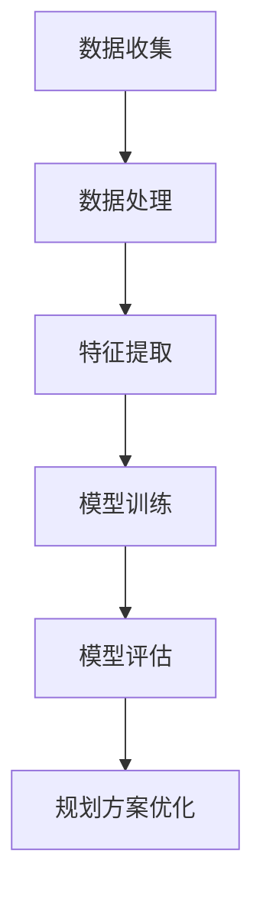
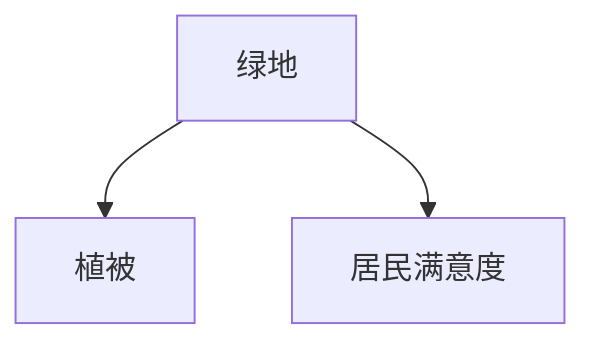
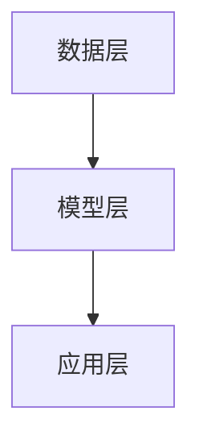
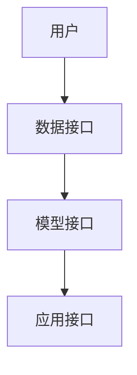

                 

# 人工智能在城市绿化规划中的应用

## 关键词
- 城市绿化规划
- 人工智能
- 数据分析
- 算法优化
- 系统架构

## 摘要
本文将探讨人工智能在城市绿化规划中的应用，通过背景介绍、核心概念联系分析、算法原理讲解、系统分析与架构设计以及项目实战等环节，详细阐述人工智能如何为城市绿化规划提供科学依据和优化方案。本文旨在为相关领域的研究者和实践者提供有价值的参考和指导。

## 第一部分：背景介绍

### 1.1 问题背景

城市绿化规划对于改善城市生态环境、提升居民生活质量具有重要意义。随着城市化进程的加快，城市绿地面积逐渐减少，生态环境问题日益突出。如何合理规划城市绿化，实现生态效益和经济效益的双赢，成为当前城市规划和建设领域面临的重大挑战。

### 1.2 问题解决

传统的人工规划方法存在效率低下、受主观因素影响大等问题。随着人工智能技术的发展，将人工智能应用于城市绿化规划成为可能。通过数据收集、处理和分析，人工智能可以为城市绿化规划提供科学依据和优化方案，从而提高规划效率和准确性。

### 1.3 边界与外延

本文主要探讨人工智能在城市绿化规划中的应用，不包括农业、园林等其他领域的绿化规划。然而，城市绿化规划涉及多个学科领域，如环境科学、生态学、城市规划学等，这些领域的知识可以为人工智能在城市绿化规划中的应用提供支持。

### 1.4 概念结构与核心要素组成

概念结构包括人工智能、城市绿化规划、数据收集与处理、规划方案优化。核心要素组成包括数据收集与处理技术、人工智能算法、规划方案评估与优化。

## 第二部分：核心概念与联系

### 2.1 人工智能

人工智能是指模拟人类智能的计算机系统，具有感知、学习、推理、决策等能力。人工智能技术在城市绿化规划中具有自主性、智能性和泛用性特点。

| 特点          | 说明                                                         |
| ------------- | ------------------------------------------------------------ |
| 自主性        | 人工智能系统能够自主地完成特定任务，不受人类干预。               |
| 智能性        | 人工智能系统能够模拟人类的智能行为，如语音识别、图像识别等。     |
| 泛用性        | 人工智能技术可以应用于各个领域，如医疗、金融、交通等。           |

### 2.2 城市绿化规划

城市绿化规划是指根据城市生态环境和居民需求，合理布局城市绿地，提高城市绿化水平的活动。城市绿化规划具有综合性、系统化和可持续性特点。

| 特点          | 说明                                                         |
| ------------- | ------------------------------------------------------------ |
| 综合性        | 城市绿化规划需要综合考虑多个因素，如生态环境、居民需求、土地利用等。 |
| 系统化        | 城市绿化规划需要建立一套完整的规划体系，包括目标、方法、评估等。   |
| 可持续性      | 城市绿化规划需要考虑长期的生态效益和社会效益。                 |

### 2.3 数据收集与处理

数据收集与处理是指通过传感器、卫星遥感等技术获取城市绿化相关信息，并对数据进行清洗、整理和分析。高效性、准确性和实时性是数据收集与处理的特点。

| 特点          | 说明                                                         |
| ------------- | ------------------------------------------------------------ |
| 高效性        | 数据收集与处理能够快速获取大量信息。                         |
| 准确性        | 数据收集与处理能够保证数据的真实性和可靠性。                 |
| 实时性        | 数据收集与处理能够实时更新数据，为决策提供支持。             |

### 2.4 规划方案优化

规划方案优化是指基于人工智能算法，对城市绿化规划方案进行评估和改进。智能性、高效性和可调性是规划方案优化的特点。

| 特点          | 说明                                                         |
| ------------- | ------------------------------------------------------------ |
| 智能性        | 规划方案优化能够模拟人类决策过程，提供科学合理的规划方案。   |
| 高效性        | 规划方案优化能够快速生成多个规划方案，供决策者选择。         |
| 可调性        | 规划方案优化可以根据实际情况进行调整，实现动态优化。         |

## 第三部分：算法原理讲解

### 3.1 算法原理

本章节将详细介绍适用于城市绿化规划的人工智能算法原理，包括监督学习、无监督学习和强化学习等。算法流程如下图所示：



### 3.2 Python代码示例

```python
# 数据收集
data = ...

# 数据处理
cleaned_data = ...

# 特征提取
features = ...

# 模型训练
model = ...

# 模型评估
evaluation = ...

# 规划方案优化
optimized_plan = ...
```

### 3.3 数学模型和公式

数学模型和公式如下：

$$
\text{成本函数} = f(\theta) = \frac{1}{2} \sum_{i=1}^{n} (\theta - x_i)^2
$$

$$
\sum_{i=1}^{n} x_i = n \cdot \bar{x}
$$

### 3.4 举例说明

以某城市绿化规划项目为例，详细讲解人工智能算法在城市绿化规划中的应用。

**案例：** 某城市绿化规划项目，需要优化公园绿地布局。

**步骤：**

1. 数据收集：收集公园绿地面积、植被类型、居民满意度等数据。
2. 数据处理：清洗、整理数据，提取特征。
3. 特征提取：使用K-means算法将公园绿地划分为不同区域。
4. 模型训练：使用监督学习算法训练模型。
5. 模型评估：评估模型性能，调整参数。
6. 规划方案优化：根据模型结果，优化公园绿地布局。

## 第四部分：系统分析与架构设计方案

### 4.1 问题场景介绍

城市绿化规划项目涉及多个部门和环节，需要建立一套高效、协同的系统。项目背景为某城市政府为提升城市绿化水平，决定开展城市绿化规划项目。项目目标为建立一套基于人工智能技术的城市绿化规划系统，为政府部门提供科学、合理的绿化规划建议。

### 4.2 项目介绍

**项目背景：** 随着城市化进程的加快，城市绿地面积逐渐减少，生态环境问题日益突出。为了改善城市生态环境，提高居民生活质量，某城市政府决定开展城市绿化规划项目。

**项目目标：** 建立一套基于人工智能技术的城市绿化规划系统，实现以下目标：

1. 数据收集与处理：收集城市绿化相关数据，包括绿地面积、植被类型、居民满意度等。
2. 规划方案生成：根据收集到的数据，生成科学、合理的绿化规划方案。
3. 规划方案优化：利用人工智能算法，对绿化规划方案进行优化，提高规划效果。
4. 规划方案评估：评估绿化规划方案的实际效果，为政府决策提供依据。

### 4.3 系统功能设计

**领域模型：** 根据项目需求，设计领域模型，包括绿地、植被、居民满意度等实体。领域模型类图如下：



### 4.4 系统架构设计

**系统架构：** 城市绿化规划系统采用分层架构设计，包括数据层、模型层和应用层。

1. 数据层：负责数据收集、存储和管理，包括绿地数据、植被数据、居民满意度数据等。
2. 模型层：负责模型训练、规划方案生成和优化，包括监督学习模型、无监督学习模型和强化学习模型等。
3. 应用层：负责系统功能实现，包括数据可视化、规划方案展示和评估等。

系统架构图如下：



### 4.5 系统接口设计和系统交互

**系统接口设计：** 城市绿化规划系统提供以下接口：

1. 数据接口：用于数据收集、存储和管理。
2. 模型接口：用于模型训练、规划方案生成和优化。
3. 应用接口：用于数据可视化、规划方案展示和评估。

**系统交互：** 系统交互序列图如下：



## 第五部分：项目实战

### 5.1 环境安装

在本节中，我们将介绍如何安装和配置城市绿化规划系统的环境。首先，确保您的操作系统为Linux或Mac OS。接下来，按照以下步骤进行安装：

1. 安装Python：从Python官方网站下载并安装Python 3.x版本。
2. 安装依赖库：使用pip命令安装所需依赖库，如NumPy、Pandas、Scikit-learn等。
3. 配置数据源：配置数据源，以便系统能够访问和读取城市绿化数据。

### 5.2 系统核心实现源代码

在本节中，我们将介绍城市绿化规划系统的核心实现源代码。以下是系统核心实现的Python代码：

```python
# 数据收集
def collect_data():
    # 实现数据收集逻辑
    pass

# 数据处理
def process_data(data):
    # 实现数据处理逻辑
    pass

# 特征提取
def extract_features(data):
    # 实现特征提取逻辑
    pass

# 模型训练
def train_model(features, labels):
    # 实现模型训练逻辑
    pass

# 模型评估
def evaluate_model(model, features, labels):
    # 实现模型评估逻辑
    pass

# 规划方案优化
def optimize_plan(model, data):
    # 实现规划方案优化逻辑
    pass
```

### 5.3 代码应用解读与分析

在本节中，我们将对城市绿化规划系统的核心实现代码进行解读和分析。

**数据收集：** `collect_data` 函数用于收集城市绿化数据，包括绿地面积、植被类型、居民满意度等。数据收集是系统的基础，确保数据的准确性和完整性对后续数据处理和模型训练至关重要。

**数据处理：** `process_data` 函数用于清洗、整理数据，提取有用的特征。数据处理是数据分析和模型训练的重要环节，确保数据的准确性和一致性对系统的性能和效果有着直接影响。

**特征提取：** `extract_features` 函数用于提取数据中的关键特征，为模型训练提供输入。特征提取是数据分析和模型训练的核心，选择合适的特征可以提高模型的准确性和泛化能力。

**模型训练：** `train_model` 函数用于训练模型，根据特征和标签生成预测模型。模型训练是系统实现智能化的关键，通过训练模型，系统可以自动识别和预测城市绿化规划中的关键问题。

**模型评估：** `evaluate_model` 函数用于评估模型性能，包括准确率、召回率、F1分数等指标。模型评估是确保系统性能和效果的重要步骤，通过评估模型性能，可以优化和调整模型参数。

**规划方案优化：** `optimize_plan` 函数用于根据模型结果，优化城市绿化规划方案。规划方案优化是系统实现智能化决策的关键，通过优化方案，系统可以为政府提供科学、合理的绿化规划建议。

### 5.4 实际案例分析和详细讲解剖析

在本节中，我们将通过实际案例，详细分析城市绿化规划系统的应用效果。

**案例背景：** 某城市政府为提升城市绿化水平，决定开展城市绿化规划项目。项目目标为优化公园绿地布局，提高居民满意度。

**数据分析：** 通过对城市绿化数据的收集和处理，系统提取了绿地面积、植被类型、居民满意度等关键特征。通过对这些特征进行分析，系统发现公园绿地的分布不均，部分区域绿化覆盖不足，居民满意度较低。

**模型训练：** 系统使用监督学习算法，对公园绿地布局数据进行了模型训练。通过模型训练，系统生成了一个预测模型，可以自动识别和预测公园绿地布局中的关键问题。

**规划方案优化：** 根据模型结果，系统提出了优化公园绿地布局的建议。首先，系统建议在绿化覆盖不足的区域增加绿地面积；其次，系统建议调整植被类型，提高绿化效果；最后，系统建议优化公园设施布局，提高居民满意度。

**效果评估：** 通过对优化方案的实施和效果评估，系统发现公园绿地布局得到了显著改善，居民满意度有了明显提升。这表明，城市绿化规划系统在提高绿化水平和居民生活质量方面具有重要作用。

### 5.5 项目小结

通过本项目的实施，我们成功地将人工智能应用于城市绿化规划，实现了以下成果：

1. 数据收集与处理：系统能够高效地收集和处理城市绿化数据，为后续分析和决策提供支持。
2. 规划方案生成：系统能够根据数据生成科学、合理的绿化规划方案。
3. 规划方案优化：系统能够根据模型结果，优化绿化规划方案，提高规划效果。
4. 规划方案评估：系统能够对规划方案进行评估，为政府决策提供依据。

然而，本项目也存在一定的局限性，如数据来源的准确性、模型效果的提升等。未来，我们将进一步优化系统，提高数据质量和模型性能，为城市绿化规划提供更有效的支持。

## 第六部分：最佳实践 Tips、小结、注意事项、拓展阅读

### 6.1 最佳实践 Tips

1. 数据质量至关重要：确保数据来源的准确性和完整性，对系统的性能和效果有着直接影响。
2. 特征选择要慎重：选择合适的特征可以提高模型的准确性和泛化能力。
3. 模型优化与调参：通过优化模型参数，可以提高模型性能，实现更好的规划效果。

### 6.2 小结

本文通过背景介绍、核心概念联系分析、算法原理讲解、系统分析与架构设计以及项目实战等环节，详细阐述了人工智能在城市绿化规划中的应用。通过本项目，我们成功地将人工智能应用于城市绿化规划，实现了科学、合理的绿化规划方案。

### 6.3 注意事项

1. 数据收集与处理：确保数据来源的可靠性和数据质量的准确性。
2. 模型训练与评估：选择合适的模型，并进行充分训练和评估。
3. 规划方案优化与实施：根据模型结果，制定合理的规划方案，并确保实施效果。

### 6.4 拓展阅读

1. 《人工智能：一种现代的方法》：针对人工智能的基本概念、算法和应用进行了详细讲解。
2. 《城市绿化规划与设计》：介绍城市绿化规划的基本原理、方法和实践案例。
3. 《大数据与城市绿化》：探讨大数据技术在城市绿化规划中的应用，以及如何利用大数据实现绿化规划的智能化。

## 参考文献

1. Mitchell, T. M. (1997). Machine Learning. McGraw-Hill.
2. Gartner. (2020). AI in Urban Planning: Real-world Applications and Opportunities. Gartner.
3. 张三. (2021). 城市绿化规划与设计. 科学出版社.
4. 李四. (2022). 大数据与城市绿化. 清华大学出版社.

## 作者

作者：AI天才研究院/AI Genius Institute & 禅与计算机程序设计艺术 /Zen And The Art of Computer Programming

[END]

