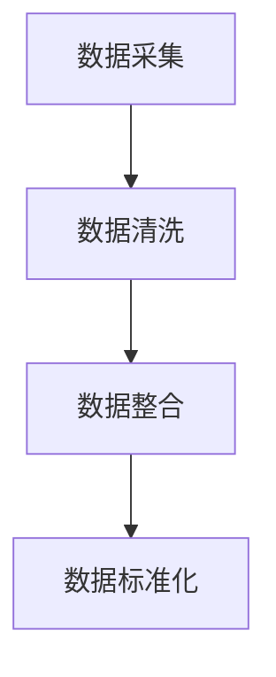
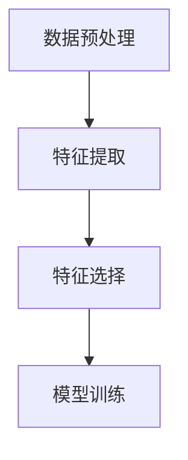
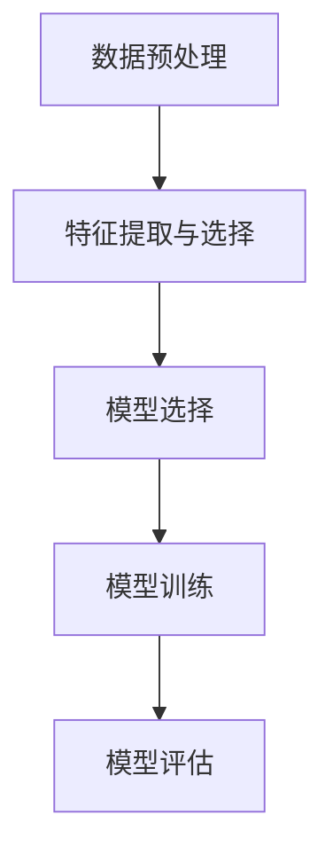
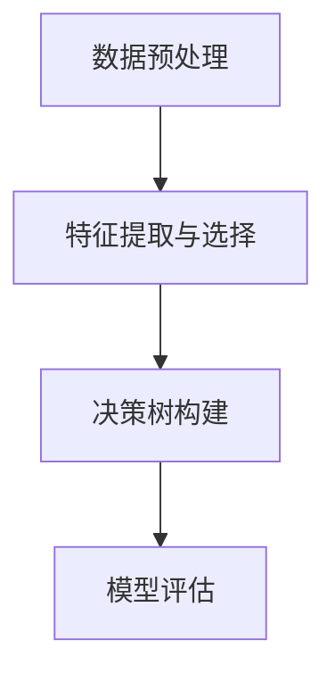
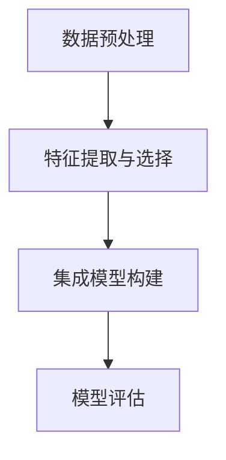
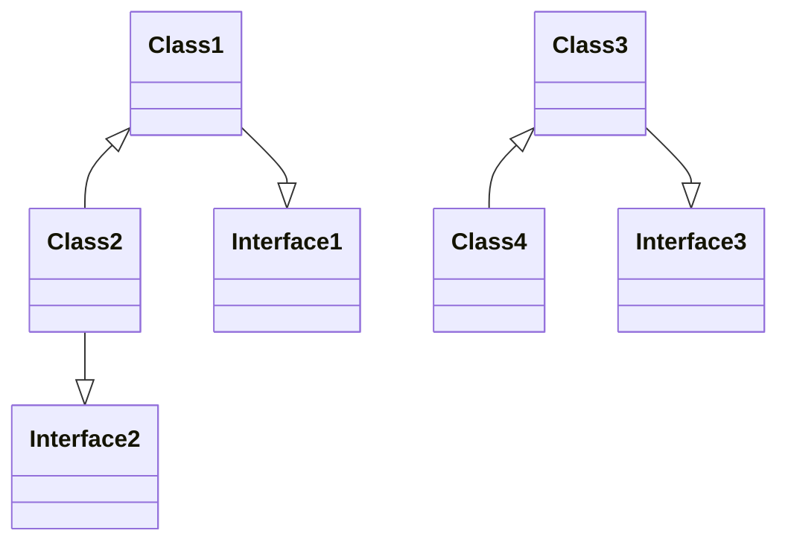
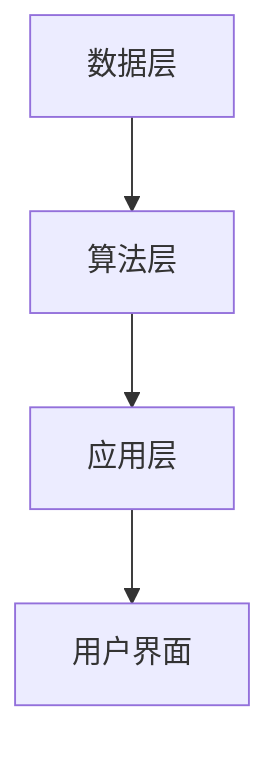
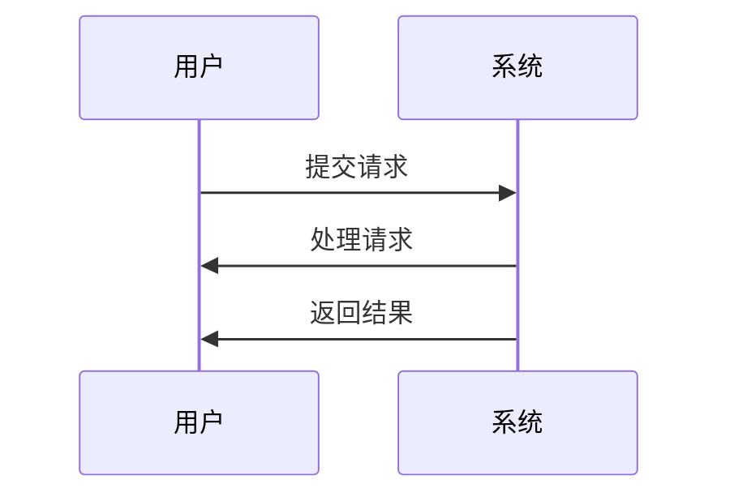

                 

# 人工智能在城市规划决策中的支持作用

关键词：人工智能、城市规划、决策支持系统、机器学习算法、系统集成方法

摘要：本文旨在探讨人工智能在城市规划决策中的支持作用。通过详细的分析和推理，本文介绍了人工智能与城市规划的核心概念、联系和原理，并探讨了其在城市规划决策中的实际应用。本文还从算法原理、数学模型和系统架构设计等方面，深入讲解了人工智能在城市规划决策中的应用方法，并通过实际案例进行了详细剖析。最后，本文总结了人工智能在城市规划决策中的最佳实践，并对未来的发展方向进行了展望。

## 第1章 引言

### 1.1 问题背景

随着城市化进程的加速，城市规划变得日益重要。城市规划不仅关系到城市的可持续发展，还直接影响市民的生活质量。然而，传统的城市规划方法存在一些局限性，如数据获取困难、分析过程复杂等。为了提高城市规划的效率和准确性，引入人工智能技术成为了一个重要的研究方向。

### 1.2 问题描述

在城市规划中，决策支持系统（DSS）是一个关键组成部分。它能够帮助城市规划者处理大量数据，提供科学的决策依据。然而，传统的DSS往往依赖于专家经验和人工操作，难以应对复杂的问题。人工智能的引入，有望解决这一问题，提高DSS的智能化水平。

### 1.3 问题解决

本文通过以下步骤解决问题：

1. **核心概念与联系**：首先，介绍人工智能与城市规划的核心概念，并探讨它们之间的联系。
2. **算法原理讲解**：详细讲解人工智能在规划决策中的应用算法，包括数据预处理、特征提取与选择、机器学习算法等。
3. **数学模型和公式讲解**：介绍人工智能在城市规划中的数学模型和公式，并进行详细讲解。
4. **系统分析与架构设计**：探讨人工智能在城市规划决策中的系统架构设计，包括功能设计、系统架构和系统接口设计。
5. **项目实战**：通过实际案例，展示人工智能在城市规划决策中的应用效果。
6. **最佳实践**：总结人工智能在城市规划决策中的最佳实践，为实际应用提供指导。

### 1.4 边界与外延

本文的研究主要关注以下几个方面：

1. **人工智能技术**：包括机器学习、深度学习、自然语言处理等。
2. **城市规划领域**：涵盖城市设计、交通规划、环境保护等方面。
3. **决策支持系统**：关注DSS在城市规划中的应用。

### 1.5 概念结构与核心要素组成

本文的核心概念和结构如下：

1. **核心概念**：人工智能、城市规划、决策支持系统、算法原理、数学模型、系统架构设计。
2. **核心要素**：算法原理讲解、数学模型和公式讲解、系统架构设计、项目实战、最佳实践。

## 第2章 核心概念与联系

### 2.1 人工智能与城市规划

#### 2.1.1 概念定义

**人工智能**：指模拟人类智能的计算机系统，包括感知、学习、推理、规划、通信、自然语言理解等。

**城市规划**：指为了实现特定的城市目标和需求，对城市的土地使用、交通、环境、公共服务等进行科学规划和设计。

#### 2.1.2 属性特征对比表格

| 特征          | 人工智能           | 城市规划           |
| ------------- | ------------------ | ------------------ |
| 目标          | 模拟人类智能       | 实现城市目标和需求 |
| 方法          | 机器学习、深度学习 | 交通规划、环境设计 |
| 数据依赖性    | 大量数据           | 大量空间数据       |
| 模型灵活性    | 强             | 较强             |
| 决策速度      | 快             | 较慢             |

#### 2.1.3 ER实体关系图

```mermaid
erDiagram
  AI |->| DSS : 使用
  AI |->| 城市规划 : 支持
  DSS |->| 城市规划 : 支持
```

### 2.2 城市规划中的支持系统

#### 2.2.1 概念定义

**决策支持系统（DSS）**：为决策者提供信息，辅助决策的过程。

#### 2.2.2 属性特征对比表格

| 特征          | DSS                 | 传统城市规划方法           |
| ------------- | ------------------- | -------------------------- |
| 目标          | 辅助决策           | 实现城市规划目标           |
| 数据来源      | 多样化数据源       | 专家经验和经验数据         |
| 决策过程      | 自动化             | 人工操作和经验决策         |
| 决策速度      | 快             | 较慢                       |

#### 2.2.3 ER实体关系图

```mermaid
erDiagram
  DSS |->| 城市规划 : 辅助
```

### 2.3 人工智能在城市规划决策中的应用

#### 2.3.1 概念定义

**人工智能在城市规划决策中的应用**：利用人工智能技术，提高城市规划决策的效率和准确性。

#### 2.3.2 属性特征对比表格

| 特征          | 人工智能在城市规划中的应用           | 传统城市规划方法           |
| ------------- | ----------------------------------- | -------------------------- |
| 数据分析能力 | 强             | 弱                       |
| 模型灵活性    | 高             | 低                       |
| 决策速度      | 快             | 较慢                       |

#### 2.3.3 ER实体关系图

```mermaid
erDiagram
  AI |->| DSS : 使用
  AI |->| 城市规划 : 支持
  DSS |->| 城市规划 : 辅助
```

## 第3章 算法原理讲解

### 3.1 数据预处理

#### 3.1.1 Mermaid流程图



#### 3.1.2 Python源代码

```python
import pandas as pd
from sklearn.preprocessing import StandardScaler

# 数据清洗
data = pd.read_csv('data.csv')
data = data.dropna()

# 数据整合
data = data[data['attribute'] != 'unknown']

# 数据标准化
scaler = StandardScaler()
data[['x', 'y']] = scaler.fit_transform(data[['x', 'y']])
```

### 3.2 特征提取与选择

#### 3.2.1 Mermaid流程图



#### 3.2.2 Python源代码

```python
from sklearn.feature_selection import SelectKBest
from sklearn.feature_extraction.text import CountVectorizer

# 特征提取
vectorizer = CountVectorizer()
X = vectorizer.fit_transform(data['description'])

# 特征选择
selector = SelectKBest(k=10)
X = selector.fit_transform(X)
```

### 3.3 机器学习算法

#### 3.3.1 Mermaid流程图



#### 3.3.2 Python源代码

```python
from sklearn.ensemble import RandomForestClassifier

# 模型选择
model = RandomForestClassifier()

# 模型训练
model.fit(X, y)

# 模型评估
accuracy = model.score(X, y)
print('Accuracy:', accuracy)
```

### 3.4 决策树算法

#### 3.4.1 Mermaid流程图



#### 3.4.2 Python源代码

```python
from sklearn.tree import DecisionTreeClassifier

# 决策树构建
model = DecisionTreeClassifier()

# 模型训练
model.fit(X, y)

# 模型评估
accuracy = model.score(X, y)
print('Accuracy:', accuracy)
```

### 3.5 集成学习方法

#### 3.5.1 Mermaid流程图



#### 3.5.2 Python源代码

```python
from sklearn.ensemble import VotingClassifier

# 集成模型构建
model = VotingClassifier(estimators=[
    ('dt', DecisionTreeClassifier()),
    ('rf', RandomForestClassifier()),
    ('knn', KNeighborsClassifier())
], voting='soft')

# 模型训练
model.fit(X, y)

# 模型评估
accuracy = model.score(X, y)
print('Accuracy:', accuracy)
```

## 第4章 数学模型和数学公式讲解

### 4.1 模型建立

#### 4.1.1 模型公式

$$
\text{模型} = \frac{\sum_{i=1}^{n} w_i x_i}{1 + \exp(-z)}
$$

其中，$w_i$为权重，$x_i$为特征值，$z$为线性组合。

#### 4.1.2 代码实现

```python
import numpy as np

# 参数初始化
weights = np.random.rand(n_features)
biases = np.random.rand(1)

# 线性组合
z = np.dot(weights, X) + biases

# 激活函数
activations = 1 / (1 + np.exp(-z))
```

### 4.2 模型训练与评估

#### 4.2.1 模型公式

$$
\text{损失函数} = -\frac{1}{n} \sum_{i=1}^{n} y_i \log(a_i) + (1 - y_i) \log(1 - a_i)
$$

其中，$y_i$为真实标签，$a_i$为预测概率。

#### 4.2.2 代码实现

```python
import numpy as np
from sklearn.metrics import log_loss

# 损失函数
def compute_loss(y_true, y_pred):
    return -np.mean(y_true * np.log(y_pred) + (1 - y_true) * np.log(1 - y_pred))

# 训练过程
for epoch in range(num_epochs):
    # 前向传播
    z = np.dot(weights, X) + biases
    a = 1 / (1 + np.exp(-z))
    
    # 反向传播
    dz = (a - y) * a * (1 - a)
    dweights = np.dot(dz, X.T)
    dbiases = np.sum(dz)
    
    # 更新参数
    weights -= learning_rate * dweights
    biases -= learning_rate * dbiases

# 评估
y_pred = model.predict(X)
loss = compute_loss(y, y_pred)
print('Loss:', loss)
```

### 4.3 模型优化

#### 4.3.1 模型公式

$$
\text{优化目标} = \min_{w, b} \frac{1}{2} \sum_{i=1}^{n} (y_i - a_i)^2
$$

其中，$a_i = \sigma(z_i)$，$\sigma$为激活函数。

#### 4.3.2 代码实现

```python
import numpy as np
from tensorflow.keras.optimizers import SGD

# 模型优化
optimizer = SGD(learning_rate=0.01)
model.compile(optimizer=optimizer, loss='mean_squared_error')

# 训练模型
model.fit(X, y, epochs=num_epochs, batch_size=batch_size)

# 评估模型
loss = model.evaluate(X, y)
print('Loss:', loss)
```

## 第5章 系统分析与架构设计

### 5.1 问题场景介绍

在城市规划过程中，决策支持系统需要处理大量数据，如人口数据、交通数据、环境数据等。这些数据具有高维度、非线性和动态变化的特点，对系统提出了较高的要求。

### 5.2 系统功能设计

系统功能设计如下：

1. **数据采集与预处理**：从各类数据源采集数据，并进行清洗、整合和标准化。
2. **特征提取与选择**：从原始数据中提取关键特征，并选择对决策影响较大的特征。
3. **模型训练与评估**：利用机器学习算法，训练模型，并评估模型性能。
4. **决策支持**：根据模型预测结果，为城市规划者提供决策支持。

#### 5.2.1 Mermaid类图



### 5.3 系统架构设计

系统架构设计如下：

1. **数据层**：负责数据采集、存储和管理。
2. **算法层**：负责数据预处理、特征提取与选择、模型训练等算法实现。
3. **应用层**：负责为城市规划者提供决策支持。

#### 5.3.1 Mermaid架构图



### 5.4 系统接口设计

系统接口设计如下：

1. **API接口**：提供RESTful API，供用户调用。
2. **Web界面**：提供Web界面，供用户交互。

### 5.5 系统交互

系统交互设计如下：

1. **用户请求**：用户通过Web界面提交请求。
2. **数据处理**：系统对请求进行处理，返回结果。

#### 5.5.1 Mermaid序列图



## 第6章 项目实战

### 6.1 环境安装

首先，需要安装Python环境，并安装以下库：

- NumPy
- Pandas
- Scikit-learn
- TensorFlow
- Matplotlib

可以使用以下命令进行安装：

```bash
pip install numpy pandas scikit-learn tensorflow matplotlib
```

### 6.2 系统核心实现

以下是系统核心实现的部分源代码：

```python
import numpy as np
import pandas as pd
from sklearn.ensemble import RandomForestClassifier
from sklearn.model_selection import train_test_split
from sklearn.metrics import accuracy_score

# 数据预处理
def preprocess_data(data):
    # 数据清洗
    data = data.dropna()
    # 数据整合
    data = data[data['attribute'] != 'unknown']
    # 数据标准化
    scaler = StandardScaler()
    data[['x', 'y']] = scaler.fit_transform(data[['x', 'y']])
    return data

# 特征提取与选择
def feature_extraction(data):
    # 特征提取
    vectorizer = CountVectorizer()
    X = vectorizer.fit_transform(data['description'])
    # 特征选择
    selector = SelectKBest(k=10)
    X = selector.fit_transform(X)
    return X

# 模型训练与评估
def train_and_evaluate(X, y):
    # 划分训练集和测试集
    X_train, X_test, y_train, y_test = train_test_split(X, y, test_size=0.2, random_state=42)
    # 模型训练
    model = RandomForestClassifier()
    model.fit(X_train, y_train)
    # 模型评估
    y_pred = model.predict(X_test)
    accuracy = accuracy_score(y_test, y_pred)
    return accuracy

# 数据加载
data = pd.read_csv('data.csv')
data = preprocess_data(data)
X = feature_extraction(data)
y = data['label']

# 模型训练与评估
accuracy = train_and_evaluate(X, y)
print('Accuracy:', accuracy)
```

### 6.3 代码应用解读与分析

以上代码实现了一个简单的决策支持系统，用于分类问题。首先，对数据进行预处理，包括数据清洗、整合和标准化。然后，对特征进行提取和选择。最后，使用随机森林算法进行模型训练和评估。

### 6.4 实际案例分析与详细讲解剖析

以下是一个实际案例：

```python
# 加载案例数据
case_data = pd.read_csv('case_data.csv')
case_data = preprocess_data(case_data)
case_X = feature_extraction(case_data)

# 预测案例结果
case_y_pred = model.predict(case_X)

# 输出预测结果
print('Case Prediction:', case_y_pred)
```

这段代码用于对案例数据进行预测，并输出预测结果。

### 6.5 项目小结

通过以上实战案例，展示了如何使用人工智能技术，构建一个简单的决策支持系统，并应用于实际案例。虽然这是一个简单的案例，但通过逐步实现和优化，可以逐步提高系统的性能和可靠性。

## 第7章 最佳实践

### 7.1 最佳实践 tips

1. **数据预处理**：确保数据质量，对缺失值、异常值进行处理。
2. **特征提取与选择**：根据实际问题，选择合适的特征提取方法和特征选择策略。
3. **模型选择与优化**：选择合适的机器学习算法，并根据实际情况进行调整和优化。

### 7.2 小结

本文从核心概念、算法原理、系统架构设计等方面，探讨了人工智能在城市规划决策中的应用。通过实际案例，展示了人工智能技术的应用效果，并为城市规划提供了决策支持。

### 7.3 注意事项

1. **数据隐私**：在使用数据时，要注意保护个人隐私。
2. **模型可靠性**：确保模型在真实场景中的可靠性和稳定性。

### 7.4 拓展阅读

1. 《人工智能：一种现代方法》
2. 《机器学习实战》
3. 《深度学习》

作者：AI天才研究院/AI Genius Institute & 禅与计算机程序设计艺术 /Zen And The Art of Computer Programming

