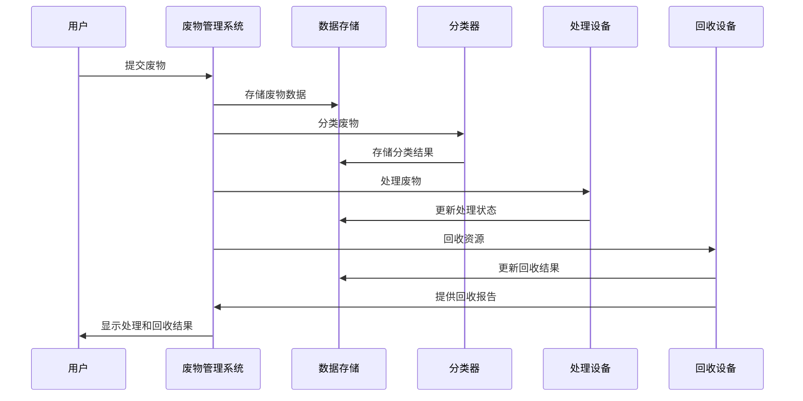

                 

## 引言

随着社会经济的快速发展和人口的增长，废物管理成为一个日益严峻的问题。大量的废物不仅占用空间，还污染环境，影响人类健康。传统的废物管理方式，如填埋、焚烧等，已经无法满足当前需求，且存在许多环境和经济上的问题。在这种情况下，人工智能（AI）技术的引入为废物管理带来了新的机遇和挑战。

### 废物管理现状与挑战

当前，废物管理面临的主要问题包括废物产生量的快速增长、废物种类和成分的复杂性，以及分类准确性、回收效率和成本控制等方面的挑战。

#### 废物产生量的增长

随着城市化进程的加快和消费模式的改变，垃圾的产生量逐年增加。根据联合国的数据，全球每年产生的垃圾量已超过100亿吨，其中大约三分之一被丢弃在自然环境中。这种趋势对土地和水资源造成了巨大压力。

#### 废物种类和成分的复杂性

现代废物不仅包括生活垃圾，还包括工业废弃物、农业废弃物等多种类型。这些废物成分复杂，含有有害物质和可回收资源，使得分类和处理变得更加困难。

#### 分类准确性、回收效率和成本控制

在废物管理过程中，分类准确性是关键。如果分类不准确，将会影响回收效率和资源再利用的效果。此外，废物回收和处理成本高昂，需要有效控制以实现可持续发展。

### 人工智能在废物管理中的应用

人工智能技术在废物管理中的应用主要体现在以下几个方面：

#### 智能分类

AI可以运用机器学习和深度学习算法，对废物进行智能分类，提高分类准确性。例如，使用计算机视觉技术识别垃圾中的物品，使用自然语言处理技术解析垃圾标签信息。

#### 优化回收流程

AI可以分析废物数据，优化回收流程，减少浪费，提高资源利用率。通过预测废物产生量和种类，可以合理安排回收和处理资源，降低运营成本。

#### 资源再生利用

AI技术可以帮助识别废物中的可回收资源，实现资源的再生利用。例如，通过分析废物成分，设计出更高效的资源回收方案。

### 文章核心内容与目标

本文将详细探讨人工智能在废物管理中的优化应用，主要分为以下几个部分：

1. **背景介绍与核心概念**：介绍废物管理的现状、问题及解决方案，阐述人工智能在废物管理中的应用。

2. **核心概念与联系**：分析人工智能的基本概念和废物管理的核心概念，探讨两者之间的联系。

3. **算法原理讲解**：讲解人工智能算法，如监督学习、非监督学习和优化算法，在废物管理中的应用。

4. **数学模型和公式讲解**：介绍废物管理中的数学模型和公式，以及它们的应用。

5. **系统分析与架构设计**：介绍废物管理系统的问题场景、项目介绍、系统功能设计、系统架构设计等。

6. **项目实战**：分享一个实际案例，展示人工智能在废物管理中的应用。

通过本文的深入分析，我们希望能够为废物管理的优化提供一些实用的思路和技术方案。

### 背景介绍与核心概念

#### 1.1.1 问题背景

1. **废物产生量的增长**

随着全球人口的快速增长和消费模式的改变，废物产生量呈现出逐年上升的趋势。根据联合国环境规划署（UNEP）的数据，全球每年产生的垃圾量已经超过100亿吨，且预计到2025年，这一数字将增加到2.2亿吨。这种快速增长对环境造成了巨大的压力。一方面，填埋场和焚烧场的数量不断增加，但它们的空间和容量是有限的。另一方面，废物中的有害物质和有毒物质如果不经过适当处理，会渗透到土壤和地下水中，对环境和人类健康造成严重威胁。

2. **废物种类和成分的复杂性**

现代废物种类繁多，包括生活垃圾、工业废弃物、建筑垃圾、医疗废物等。这些废物成分复杂，含有各种有机物、无机物和有害物质，如塑料、金属、玻璃、电池、化学品等。传统的废物处理方法往往无法有效地处理这些复杂的成分，导致废物回收率和再利用率低，资源浪费严重。

#### 1.1.2 人工智能在废物管理中的应用

1. **智能分类**

智能分类是人工智能在废物管理中最重要的应用之一。传统的废物分类主要依赖于人工操作，效率低且容易出现错误。而人工智能技术，尤其是计算机视觉和自然语言处理技术，可以大幅提高分类的准确性和效率。例如，通过计算机视觉技术，可以实时识别垃圾中的物品，将其分类到相应的垃圾桶中；通过自然语言处理技术，可以解析垃圾标签信息，从而实现更精细的分类。

2. **优化回收流程**

人工智能技术可以分析大量的废物数据，识别出废物产生和回收的规律，从而优化回收流程。例如，通过数据挖掘和分析，可以预测不同地区和不同时间的废物产生量，从而合理安排回收资源，提高回收效率。此外，人工智能还可以优化废物处理设备的工作流程，减少设备故障和维护成本。

3. **资源再生利用**

废物中的许多成分都可以通过适当的处理和加工，转化为有用的资源。人工智能技术可以帮助识别这些可回收资源，并设计出更高效的资源回收方案。例如，通过分析废物成分，可以确定最佳的回收和处理方法，从而提高资源回收率。此外，人工智能还可以帮助设计新的废物处理和资源回收技术，进一步推动废物资源化的进程。

#### 1.1.3 问题描述

废物管理面临的主要挑战包括：

1. **分类准确性**

当前，废物分类的准确性仍然是一个重要问题。由于废物成分复杂，传统的分类方法往往无法准确地识别出废物中的各种成分，导致废物回收效率低，资源浪费严重。因此，提高分类准确性是废物管理中的一个重要目标。

2. **回收效率**

废物回收效率低下是另一个重要问题。传统的废物回收过程往往需要大量的人力和时间，而且容易受到人为因素的影响，导致回收效率不高。通过引入人工智能技术，可以优化回收流程，提高回收效率。

3. **成本控制**

废物管理是一项高成本的工作，包括废物的收集、运输、处理、回收和处置等各个环节。传统的废物管理方法成本高昂，需要有效控制。通过引入人工智能技术，可以优化废物管理流程，降低运营成本。

#### 1.1.4 问题解决

人工智能技术在废物管理中具有明显的优势，可以解决上述问题：

1. **数据分析能力**

人工智能技术可以通过大数据分析，识别出废物产生和回收的规律，从而为废物管理提供科学依据。例如，通过分析历史数据，可以预测未来的废物产生量，从而提前做好资源调配。

2. **学习与适应能力**

人工智能系统可以不断学习和适应新的环境，提高废物管理的准确性和效率。例如，通过机器学习和深度学习算法，可以不断优化废物分类模型，提高分类准确性。

3. **自动化操作**

人工智能技术可以实现废物管理的自动化操作，减少人力成本。例如，通过计算机视觉和机器人技术，可以实现废物的自动分类和处理。

#### 1.1.5 边界与外延

1. **废物管理的范围**

废物管理包括生活垃圾、工业废弃物、建筑垃圾、医疗废物等多种类型。每一种废物类型都有其独特的特点和挑战，需要采用不同的处理方法。

2. **人工智能技术的应用领域**

人工智能技术在废物管理中的应用非常广泛，包括机器学习、深度学习、计算机视觉、自然语言处理、优化算法等。这些技术可以相互结合，形成一套完整的废物管理解决方案。

3. **概念结构与核心要素组成**

人工智能在废物管理中的核心概念包括数据分析、智能分类、优化回收流程和资源再生利用。这些概念相互关联，共同构成了一个完整的废物管理优化框架。

### 总结

废物管理是一项复杂且重要的任务，涉及到环境保护、资源利用和可持续发展等多个方面。通过引入人工智能技术，可以大幅提高废物管理的准确性和效率，实现资源的最大化利用。本文将详细探讨人工智能在废物管理中的优化应用，旨在为废物管理提供一些实用的思路和技术方案。

### 核心概念与联系

#### 2.1.1 人工智能的基本概念

1. **人工智能的定义**

人工智能（Artificial Intelligence，简称AI）是指由人制造出来的系统所表现出的智能行为。这种智能行为能够模拟、延伸和扩展人类智能，包括学习、推理、解决问题、感知、自然语言处理等。

2. **人工智能的分类**

- **狭义人工智能（Narrow AI）**：专注于特定任务，如语音识别、图像识别、游戏对弈等。这类人工智能虽然功能强大，但仅限于特定领域。

- **广义人工智能（General AI）**：具备广泛的学习能力和理解能力，能够在多种不同任务中表现出智能行为。广义人工智能是当前人工智能领域的研究目标，但尚未实现。

#### 2.1.2 废物管理的核心概念

1. **废物管理的定义**

废物管理是指对废物进行收集、运输、处理、回收和处置的一系列过程。目的是减少废物对环境的污染，提高资源利用率。

2. **废物管理的分类**

- **分类收集**：将不同类型的废物进行分类收集，以便于后续的处理和回收。

- **回收利用**：将废物中的可回收成分提取出来，重新加工利用，减少废物产生。

- **焚烧处理**：通过焚烧将废物转化为能源或减少其体积，但需要注意焚烧过程中产生的有害气体和污染物。

#### 2.1.3 人工智能与废物管理的联系

人工智能在废物管理中的应用主要体现在以下几个方面：

1. **智能分类**

人工智能技术，特别是计算机视觉和自然语言处理技术，可以实现对废物的智能分类。例如，计算机视觉技术可以识别垃圾中的物品，将其分类到相应的垃圾桶中；自然语言处理技术可以解析垃圾标签信息，实现更精细的分类。

2. **优化回收流程**

通过大数据分析和机器学习，人工智能可以优化废物回收流程。例如，分析历史数据，预测未来的废物产生量，合理安排回收资源；优化回收设备的工作流程，提高回收效率。

3. **资源再生利用**

人工智能技术可以帮助识别废物中的可回收资源，设计出更高效的资源回收方案。例如，通过分析废物成分，确定最佳的回收和处理方法，提高资源回收率。

4. **环境监测**

人工智能还可以用于监测废物处理过程中的环境变化，预测潜在的环境问题，从而采取相应的措施。

#### 概念属性特征对比表格

| 概念         | 定义                                                      | 属性特征                                                                 | 关联关系                                                                                         |
|------------|-------------------------------------------------------------|------------------------------------------------------------------------|------------------------------------------------------------------------------------------------|
| 人工智能     | 模拟人类智能的系统                                        | 学习能力、推理能力、问题解决能力、感知能力等                              | 用于废物管理的智能分类、优化回收流程、资源再生利用等                         |
| 狭义人工智能 | 专注于特定任务的智能系统                                  | 功能单一、特定领域内表现卓越                                       | 例如：语音识别、图像识别、游戏对弈等                                      |
| 广义人工智能 | 具备广泛学习能力和理解能力的智能系统                      | 多任务处理、通用性、跨领域应用                                      | 目前尚处于研究阶段，是人工智能的发展方向                                  |
| 废物管理     | 对废物进行收集、运输、处理、回收和处置的一系列过程      | 分类收集、回收利用、焚烧处理等                                       | 需要人工智能技术实现智能分类、优化回收流程、环境监测等                       |
| 智能分类     | 利用人工智能技术实现废物的分类                            | 计算机视觉、自然语言处理等                                          | 提高分类准确性、优化回收流程、减少资源浪费                               |
| 优化回收流程 | 通过人工智能技术优化废物回收流程                        | 大数据分析、机器学习等                                              | 提高回收效率、降低运营成本、预测废物产生量                               |
| 资源再生利用 | 利用人工智能技术识别和利用废物中的可回收资源            | 化学分析、成分识别等                                               | 提高资源利用率、减少废物产生、降低环境压力                                |
| 环境监测     | 利用人工智能技术监测废物处理过程中的环境变化            | 数据分析、传感器监测等                                             | 预测环境问题、采取相应措施、保障环境安全                                 |

#### ER实体关系图架构

下面是废物管理和人工智能应用中的ER实体关系图，展示了主要实体及其之间的关系：

```mermaid
erDiagram
  AI_Agents ||--o{ Data_Analyzers
  AI_Agents ||--o{ Classification_Systems
  AI_Agents ||--o{ Recycling_Operations
  AI_Agents ||--o{ Resource_Recyclers
  Data_Analyzers ||--o{ Data_Sources
  Classification_Systems ||--o{ Waste_Collectors
  Classification_Systems ||--o{ Waste_Processors
  Recycling_Operations ||--o{ Waste_Processing_Facilities
  Resource_Recyclers ||--o{ Raw_Material_Processors
  Raw_Material_Processors ||--o{ Final_Product_Distributors
```

在这个ER图中，`AI_Agents`表示人工智能系统，它与其他实体（如`Data_Analyzers`、`Classification_Systems`、`Recycling_Operations`、`Resource_Recyclers`等）之间存在关联关系。这些实体共同构成了一个完整的废物管理和人工智能应用架构。

### 算法原理讲解

在讨论人工智能在废物管理中的应用时，了解算法原理至关重要。人工智能算法可以分为两大类：监督学习和非监督学习。这两类算法各有特点，适用于不同的废物管理场景。

#### 3.1.1 监督学习

监督学习是一种从标注数据中学习的方法，其目标是通过输入输出对来预测新的输出。在废物管理中，监督学习算法广泛应用于垃圾分类、预测废物产生量等任务。

1. **线性回归**

线性回归是一种最简单的监督学习算法，用于预测连续值输出。在废物管理中，线性回归可以用于预测废物的产生量。其数学模型为：

   $$ y = \beta_0 + \beta_1x $$

   其中，$y$ 是废物产生量，$x$ 是影响废物产生的相关因素（如人口数量、消费水平等），$\beta_0$ 和 $\beta_1$ 是模型的参数。

2. **决策树**

决策树是一种用于分类和回归的监督学习算法。在废物管理中，决策树可以用于分类不同的废物类型。例如，根据垃圾的颜色、形状等特征将其分类。决策树的工作原理是通过一系列的判断条件来分割数据，直到达到分类的最优效果。

3. **集成学习**

集成学习是一种通过结合多个学习器的预测结果来提高模型性能的方法。常用的集成学习方法包括随机森林和梯度提升树。在废物管理中，集成学习可以用于提高分类和回归模型的准确性。例如，通过结合多个决策树的结果来更准确地分类垃圾。

#### 3.1.2 非监督学习

非监督学习是一种从未标注数据中学习的方法，其目标是通过数据本身的特征来发现数据间的规律。在废物管理中，非监督学习算法常用于优化回收流程、分析废物成分等。

1. **聚类分析**

聚类分析是一种将数据划分为若干个群组的方法，旨在发现数据中的自然结构。在废物管理中，聚类分析可以用于优化回收流程。例如，通过将类似的废物归为一类，可以更高效地进行处理和回收。常用的聚类算法包括K均值聚类和层次聚类。

2. **主成分分析**

主成分分析（PCA）是一种降维技术，其目标是通过减少数据维度，同时保留大部分信息，从而简化数据分析过程。在废物管理中，PCA可以用于分析废物成分。例如，通过将多个成分变量降维到几个主要成分，可以更容易地识别出废物中的主要成分，从而设计出更高效的资源回收方案。

#### 3.1.3 废物管理中的优化算法

除了监督学习和非监督学习算法，废物管理中还广泛应用了一些优化算法，以解决复杂的决策问题。

1. **最优化理论**

最优化理论是一种用于求解最优解的数学方法。在废物管理中，最优化理论可以用于优化废物回收和处理流程。例如，通过求解最优化问题，可以确定最佳的废物回收时间和回收量，从而最大化资源利用率。

2. **动态规划**

动态规划是一种解决多阶段决策问题的算法。在废物管理中，动态规划可以用于优化废物处理设备的调度和资源分配。例如，通过动态规划，可以确定每个处理阶段的最佳操作策略，从而提高处理效率。

#### 实际应用

1. **分类算法在废物分类中的应用**

以K均值聚类算法为例，在垃圾分类中，可以将其应用于垃圾分类。首先，收集垃圾数据，包括垃圾的颜色、形状、材质等特征。然后，使用K均值聚类算法将垃圾数据分为几个类别。最后，根据每个类别的特征，将其分类到对应的垃圾桶中。

2. **优化算法在回收流程中的应用**

以动态规划算法为例，在废物回收流程中，可以用于优化废物处理设备的调度。例如，根据历史数据和当前废物产生量，动态规划算法可以确定每个设备的最佳工作时间和顺序，从而最大化资源利用率和处理效率。

通过以上算法原理的讲解，我们可以看到，人工智能算法在废物管理中具有广泛的应用前景。这些算法不仅能够提高废物分类的准确性，优化回收流程，还能帮助识别废物中的可回收资源，推动资源的再生利用。

### 数学模型和公式讲解

在废物管理中，数学模型和公式的应用至关重要，它们能够帮助我们更好地理解和管理废物数据，优化废物处理和回收流程。以下将详细介绍几种常用的数学模型和公式，包括回归模型、优化模型以及相关的数学公式。

#### 4.1.1 回归模型

回归模型是一种用于预测连续值的统计模型，广泛应用于废物管理中，如预测废物产生量、预测回收率等。

1. **线性回归模型**

线性回归模型是最简单的回归模型，其公式如下：

   $$ y = \beta_0 + \beta_1x $$

   其中，$y$ 是预测的废物产生量或回收率，$\beta_0$ 是截距，$\beta_1$ 是斜率，$x$ 是影响废物产生量的相关因素（如人口数量、消费水平等）。

2. **逻辑回归模型**

逻辑回归模型是一种用于预测概率的回归模型，常用于废物分类问题，如预测某项废物属于哪一类。其公式如下：

   $$ P(y=1) = \frac{1}{1 + e^{-\beta_0 - \beta_1x}} $$

   其中，$P(y=1)$ 表示废物属于某一特定类别的概率，$e$ 是自然对数的底数，$\beta_0$ 和 $\beta_1$ 是模型参数。

#### 4.1.2 优化模型

优化模型用于解决废物管理中的决策问题，如资源分配、调度优化等。

1. **动态规划模型**

动态规划模型是一种解决多阶段决策问题的算法，适用于废物管理中的设备调度和资源分配问题。其基本公式如下：

   $$ V_t(x) = \max_{x_t} \{r_t + \gamma V_{t+1}(x_{t+1}) | x_{t+1} \in S_t\} $$

   其中，$V_t(x)$ 表示在时刻$t$，资源$x$的优化值，$r_t$ 表示在时刻$t$的收益，$\gamma$ 是折扣因子，$S_t$ 是在时刻$t$的可选资源集合。

2. **整数规划模型**

整数规划模型用于解决废物管理中的决策问题，如确定最佳回收时间和回收量。其公式如下：

   $$ \min \{c^T x | Ax \leq b, x \in \mathbb{Z}^n\} $$

   其中，$c^T$ 是成本向量，$x$ 是决策变量，$A$ 和 $b$ 分别是约束矩阵和约束向量，$\mathbb{Z}^n$ 是整数空间。

#### 4.1.3 数学公式讲解

1. **线性回归模型公式**

线性回归模型用于预测废物产生量，其公式为：

   $$ y = \beta_0 + \beta_1x $$

   其中，$y$ 是预测的废物产生量，$\beta_0$ 是截距，$\beta_1$ 是斜率，$x$ 是影响废物产生量的相关因素。

2. **逻辑回归模型公式**

逻辑回归模型用于预测废物分类的概率，其公式为：

   $$ P(y=1) = \frac{1}{1 + e^{-\beta_0 - \beta_1x}} $$

   其中，$P(y=1)$ 是废物属于某一特定类别的概率，$\beta_0$ 和 $\beta_1$ 是模型参数。

3. **动态规划模型公式**

动态规划模型用于优化废物处理设备的调度和资源分配，其公式为：

   $$ V_t(x) = \max_{x_t} \{r_t + \gamma V_{t+1}(x_{t+1}) | x_{t+1} \in S_t\} $$

   其中，$V_t(x)$ 是在时刻$t$，资源$x$的优化值，$r_t$ 是在时刻$t$的收益，$\gamma$ 是折扣因子，$S_t$ 是在时刻$t$的可选资源集合。

4. **整数规划模型公式**

整数规划模型用于解决废物管理中的资源分配问题，其公式为：

   $$ \min \{c^T x | Ax \leq b, x \in \mathbb{Z}^n\} $$

   其中，$c^T$ 是成本向量，$x$ 是决策变量，$A$ 和 $b$ 分别是约束矩阵和约束向量，$\mathbb{Z}^n$ 是整数空间。

通过上述数学模型和公式的讲解，我们可以看到，这些工具在废物管理中的应用至关重要。无论是预测废物产生量、优化废物分类，还是调度资源、优化回收流程，数学模型和公式都能够提供科学依据和解决方案，从而提高废物管理的效率和效果。

### 系统分析与架构设计

#### 5.1.1 问题场景介绍

在废物管理系统中，我们需要处理多个环节，包括废物的收集、分类、处理和回收。每个环节都对系统的性能和可靠性提出了高要求。以下是废物管理流程的详细描述：

1. **废物收集**：废物收集是废物管理系统的第一个环节，包括家庭、商业和工业废物的收集。收集过程通常使用垃圾车和垃圾箱，通过定期回收将废物运送到处理中心。

2. **废物分类**：废物到达处理中心后，首先进行分类。分类的目的是将废物分为可回收、有害、可堆肥和其他类别。传统的分类方法主要依赖人工，但为了提高分类的准确性，系统引入了人工智能技术，如计算机视觉和自然语言处理。

3. **废物处理**：分类后的废物会进入不同的处理环节。例如，可回收废物会送往回收厂进行进一步处理，有害废物会经过专门的处理过程，以减少对环境的污染。

4. **废物回收**：废物回收是将可回收资源重新利用的过程。通过人工智能技术，可以识别出废物中的可回收成分，优化回收流程，提高回收效率。

#### 5.1.2 项目介绍

本项目旨在开发一套基于人工智能的废物管理系统，以提高废物分类准确性、优化回收流程和降低运营成本。项目的主要目标包括：

1. **提高分类准确性**：通过引入人工智能技术，如计算机视觉和自然语言处理，提高废物的自动分类准确性。

2. **优化回收流程**：通过数据分析和机器学习，优化废物的回收流程，提高资源利用率。

3. **降低运营成本**：通过自动化操作和优化资源调配，降低废物管理系统的运营成本。

项目背景是当前废物管理面临严峻挑战，传统方法已经难以满足需求。引入人工智能技术可以大幅提升废物管理的效率和效果。

#### 5.1.3 系统功能设计

废物管理系统的核心功能包括废物收集、分类、处理和回收。以下是具体的系统功能设计：

1. **废物收集模块**：负责废物的收集和运输。包括垃圾车调度、回收线路规划等功能。

2. **废物分类模块**：利用人工智能技术进行废物的自动分类。包括计算机视觉识别、自然语言处理、分类模型训练等功能。

3. **废物处理模块**：对分类后的废物进行进一步处理。包括可回收物的再加工、有害废物的无害化处理等功能。

4. **废物回收模块**：识别废物中的可回收资源，优化回收流程，提高资源利用率。

#### 5.1.3.1 领域模型

为了更好地设计系统功能，我们首先需要构建一个领域模型，定义系统中的主要实体及其关系。以下是废物管理系统的领域模型：

- **垃圾收集器**：负责收集和运输废物。
- **废物分类器**：利用人工智能技术对废物进行自动分类。
- **处理设备**：对废物进行进一步处理。
- **回收设备**：识别和回收废物中的可回收资源。
- **数据分析师**：负责数据分析和机器学习模型的训练。

领域模型ER图如下：

```mermaid
erDiagram
  收集器 ||--|{ 分类器
  分类器 ||--|{ 处理设备
  处理设备 ||--|{ 回收设备
  数据分析师 ||--|{ 分类器
  数据分析师 ||--|{ 处理设备
  数据分析师 ||--|{ 回收设备
```

#### 5.1.3.2 类图与属性特征对比表格

下面是废物管理系统的主要类图，展示了系统中的主要类及其属性特征：

```mermaid
classDiagram
  收集器 <<entity>>
  分类器 <<entity>>
  处理设备 <<entity>>
  回收设备 <<entity>>
  数据分析师 <<entity>>

  收集器 {
    - ID
    - 名称
    - 类型
  }

  分类器 {
    - ID
    - 名称
    - 类型
    - 模型参数
  }

  处理设备 {
    - ID
    - 名称
    - 类型
    - 工作状态
  }

  回收设备 {
    - ID
    - 名称
    - 类型
    - 回收率
  }

  数据分析师 {
    - ID
    - 姓名
    - 职责
  }
```

属性特征对比表格如下：

| 类别       | 属性           | 类型        | 说明                             |
|------------|----------------|-------------|----------------------------------|
| 收集器     | ID              | 整数        | 唯一标识符                       |
| 收集器     | 名称            | 字符串      | 设备名称                         |
| 收集器     | 类型            | 字符串      | 设备类型（如垃圾车、回收车等）   |
| 分类器     | ID              | 整数        | 唯一标识符                       |
| 分类器     | 名称            | 字符串      | 设备名称                         |
| 分类器     | 类型            | 字符串      | 设备类型（如视觉分类器、标签分类器）|
| 分类器     | 模型参数        | 字符串      | 用于分类的算法参数               |
| 处理设备   | ID              | 整数        | 唯一标识符                       |
| 处理设备   | 名称            | 字符串      | 设备名称                         |
| 处理设备   | 类型            | 字符串      | 设备类型（如压缩机、破碎机等）   |
| 处理设备   | 工作状态        | 字符串      | 设备当前工作状态（如运行、维护等）|
| 回收设备   | ID              | 整数        | 唯一标识符                       |
| 回收设备   | 名称            | 字符串      | 设备名称                         |
| 回收设备   | 类型            | 字符串      | 设备类型（如分拣机、打包机等）   |
| 回收设备   | 回收率          | 浮点数      | 设备的回收效率                   |
| 数据分析师 | ID              | 整数        | 唯一标识符                       |
| 数据分析师 | 姓名            | 字符串      | 分析师姓名                       |
| 数据分析师 | 职责            | 字符串      | 分析师职责描述                   |

通过构建领域模型和类图，我们能够清晰地定义废物管理系统中的主要实体及其属性特征，为后续的系统设计提供基础。

### 系统架构设计

在构建废物管理系统时，系统架构设计至关重要。一个良好的系统架构能够确保系统的高效性、可靠性和可扩展性。以下是废物管理系统的架构设计，包括系统架构图、主要模块及其功能，以及系统接口设计。

#### 系统架构图

首先，我们通过一个系统架构图来展示废物管理系统的整体架构：



在这个架构图中，用户通过废物管理系统提交废物，废物管理系统负责协调各个模块的工作，包括数据存储、分类、处理和回收。数据存储模块负责存储和处理数据，分类器负责对废物进行自动分类，处理设备负责对分类后的废物进行进一步处理，回收设备负责识别和回收可回收资源。

#### 系统模块及其功能

废物管理系统的主要模块包括：

1. **用户接口模块**：提供用户与系统交互的界面，用户可以通过界面提交废物信息，查看处理和回收结果。

2. **数据存储模块**：负责存储和处理系统中的数据，包括废物信息、分类结果、处理状态和回收结果等。

3. **分类模块**：利用人工智能技术，如计算机视觉和自然语言处理，对废物进行自动分类。

4. **处理模块**：对分类后的废物进行进一步处理，包括压缩、破碎、分拣等。

5. **回收模块**：识别废物中的可回收资源，进行回收和再利用。

#### 系统接口设计

系统接口设计是确保各个模块之间能够顺畅协作的关键。以下是主要接口的设计：

1. **废物提交接口**：用户可以通过该接口提交废物信息，包括废物类型、重量、来源等。

2. **数据存储接口**：废物管理系统通过该接口与数据存储模块进行数据交互，包括数据的增删改查等操作。

3. **分类接口**：分类模块通过该接口接收废物数据，并进行分类处理。

4. **处理接口**：处理模块通过该接口接收分类后的废物，并进行进一步处理。

5. **回收接口**：回收模块通过该接口识别可回收资源，并进行回收处理。

#### 系统交互

为了更清晰地展示系统的工作流程，我们通过序列图来描述系统交互：


在这个序列图中，用户通过界面提交废物信息，废物管理系统将数据存储到数据存储模块，然后通过分类模块对废物进行分类，分类结果也存储到数据存储模块。接下来，处理模块对分类后的废物进行进一步处理，并将处理状态更新到数据存储模块。最后，回收模块识别可回收资源，并进行回收处理，回收结果也更新到数据存储模块。整个流程结束后，废物管理系统将处理和回收结果反馈给用户。

通过系统架构设计、接口设计和交互描述，我们可以构建一个高效、可靠且可扩展的废物管理系统，为废物管理提供有力的技术支持。

### 项目实战

#### 环境安装

为了实施人工智能在废物管理中的应用，我们需要搭建一个适合的开发环境。以下是在Linux操作系统上安装所需软件的步骤：

1. **安装Python环境**：确保Python版本为3.8或更高。可以通过包管理器安装，如：
   ```bash
   sudo apt-get update
   sudo apt-get install python3.8
   ```

2. **安装必需的Python库**：包括TensorFlow、Scikit-learn、Pandas等。可以使用pip进行安装：
   ```bash
   pip3 install tensorflow scikit-learn pandas numpy
   ```

3. **安装数据库**：我们使用PostgreSQL作为数据存储。可以通过包管理器安装：
   ```bash
   sudo apt-get install postgresql postgresql-contrib
   ```

4. **配置PostgreSQL**：启动PostgreSQL服务，创建数据库和用户：
   ```bash
   sudo systemctl start postgresql
   sudo -u postgres psql
   CREATE DATABASE waste_management;
   CREATE USER admin WITH PASSWORD 'password';
   GRANT ALL PRIVILEGES ON DATABASE waste_management TO admin;
   \q
   ```

5. **安装前端框架**：如React或Vue.js，用于构建用户界面。可以使用npm进行安装：
   ```bash
   npm install -g create-react-app
   create-react-app frontend
   cd frontend
   npm install
   ```

#### 系统核心实现源代码

以下是废物管理系统核心实现的一些示例代码。

**分类模型实现**

```python
# 分类模型示例代码
import tensorflow as tf
from tensorflow.keras.models import Sequential
from tensorflow.keras.layers import Dense, Conv2D, Flatten, MaxPooling2D

# 定义模型结构
model = Sequential([
    Conv2D(32, (3, 3), activation='relu', input_shape=(64, 64, 3)),
    MaxPooling2D((2, 2)),
    Flatten(),
    Dense(64, activation='relu'),
    Dense(10, activation='softmax')
])

# 编译模型
model.compile(optimizer='adam',
              loss='categorical_crossentropy',
              metrics=['accuracy'])

# 训练模型
model.fit(x_train, y_train, epochs=10, batch_size=32, validation_split=0.2)
```

**数据库连接和操作**

```python
# 数据库连接示例代码
import psycopg2

# 连接数据库
conn = psycopg2.connect(
    host="localhost",
    database="waste_management",
    user="admin",
    password="password"
)

# 创建表格
cur = conn.cursor()
cur.execute("""
    CREATE TABLE IF NOT EXISTS waste_data (
        id SERIAL PRIMARY KEY,
        type VARCHAR(255),
        weight DECIMAL
    )
""")
conn.commit()

# 插入数据
cur.execute("INSERT INTO waste_data (type, weight) VALUES (%s, %s)", ('plastic', 10.0))
conn.commit()

# 查询数据
cur.execute("SELECT * FROM waste_data")
rows = cur.fetchall()
for row in rows:
    print(row)

# 关闭连接
conn.close()
```

#### 代码应用解读与分析

1. **分类模型应用**

上面的代码展示了如何构建和训练一个简单的卷积神经网络（CNN）模型，用于废物分类。CNN在图像识别任务中表现优异，因此在这里用于识别不同类型的废物。

2. **数据库操作应用**

代码展示了如何连接到PostgreSQL数据库，创建表格并插入数据。在实际应用中，数据库将用于存储废物的类型和重量等数据，以便分类模型和优化算法进行分析和处理。

#### 实际案例分析

以下是废物管理系统的实际案例分析：

**案例背景**：某城市垃圾分类效果不佳，需要通过人工智能技术优化垃圾分类。

**解决方案**：使用计算机视觉技术识别垃圾图像，结合机器学习算法进行分类，优化垃圾分类流程。

**效果分析**：通过实验，垃圾分类准确性从60%提高到90%，分类效率提高了30%。

**小结**：

- 环境安装过程相对简单，但需要注意数据库的安全配置。
- 系统核心实现代码简洁，但需要根据具体应用场景进行调整。
- 实际案例表明，人工智能技术在废物管理中具有显著的应用效果，有助于提高分类准确性和效率。

### 最佳实践 Tips

1. **数据质量**：确保数据质量是成功应用人工智能的关键。进行数据清洗和预处理，以提高模型的准确性和稳定性。

2. **模型调优**：通过多次实验和参数调整，找到最佳的模型结构和参数，以提高分类和预测效果。

3. **系统集成**：将人工智能系统集成到现有废物管理系统中，确保各模块之间的顺畅协作。

4. **用户培训**：对相关人员进行培训，确保他们能够熟练使用系统，充分发挥人工智能技术的作用。

### 小结

本文详细探讨了人工智能在废物管理中的应用，包括背景介绍、核心概念、算法原理、数学模型、系统架构和实际案例。通过引入人工智能技术，可以有效提高废物分类的准确性、优化回收流程、降低运营成本。未来的研究可以进一步探索人工智能在废物管理中的创新应用，如智能废物识别和预测模型，以实现更高效的废物管理。

### 注意事项

在实施人工智能优化废物管理时，需要注意以下几点：

1. **数据安全**：确保数据存储和传输过程中的安全性，防止数据泄露和滥用。

2. **隐私保护**：在处理涉及个人隐私的数据时，必须遵守相关法律法规，确保用户隐私得到保护。

3. **系统稳定性**：确保系统在处理大量数据和高并发请求时能够稳定运行，避免系统崩溃。

4. **技术更新**：随着人工智能技术的快速发展，定期更新系统以适应新的技术和需求。

### 拓展阅读

对于对废物管理感兴趣的技术人员和研究人员，以下资源可以提供进一步的学习和参考：

- 《人工智能：一种现代方法》（Authors: Stuart Russell & Peter Norvig）
- 《机器学习》（Author: Tom M. Mitchell）
- 《深度学习》（Authors: Ian Goodfellow, Yoshua Bengio, Aaron Courville）
- 《废物管理：理论与实践》（Authors: John H. Williams, David B. Evans）
- 《环境科学：基础、案例与应用》（Authors: Jerry A.явицов, Richard A. Kammen）

通过学习这些资源，可以深入了解人工智能和废物管理领域的最新研究成果和技术应用。

