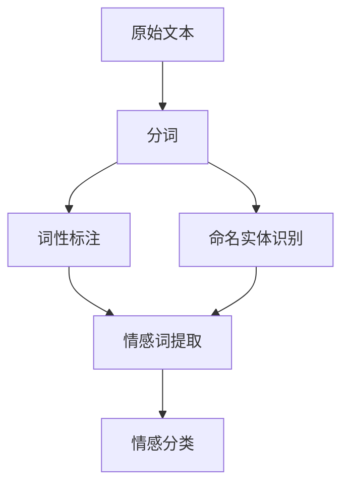
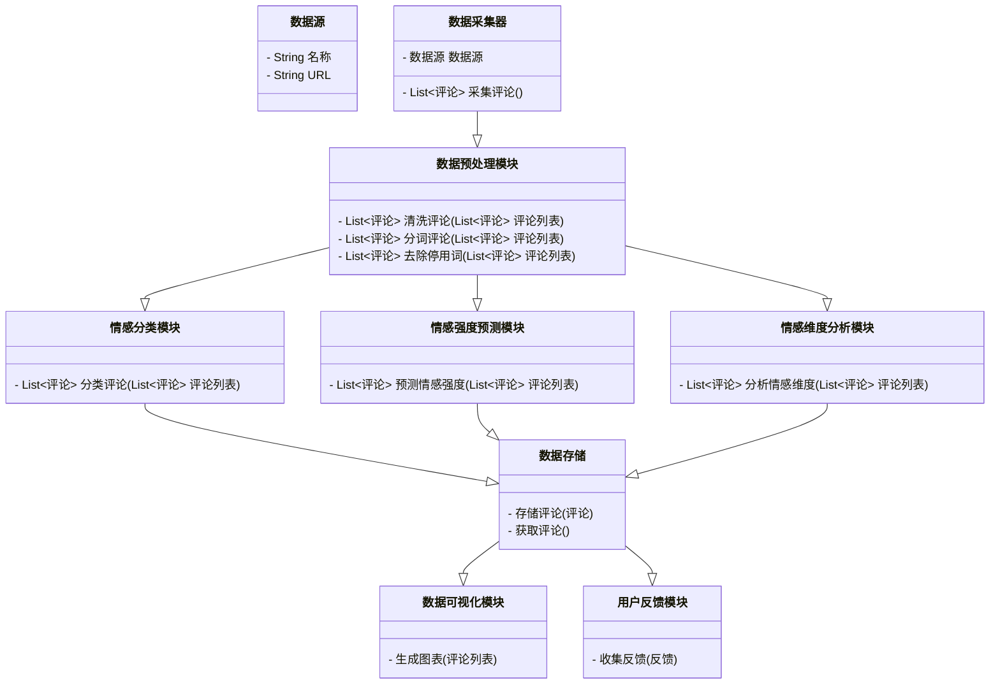
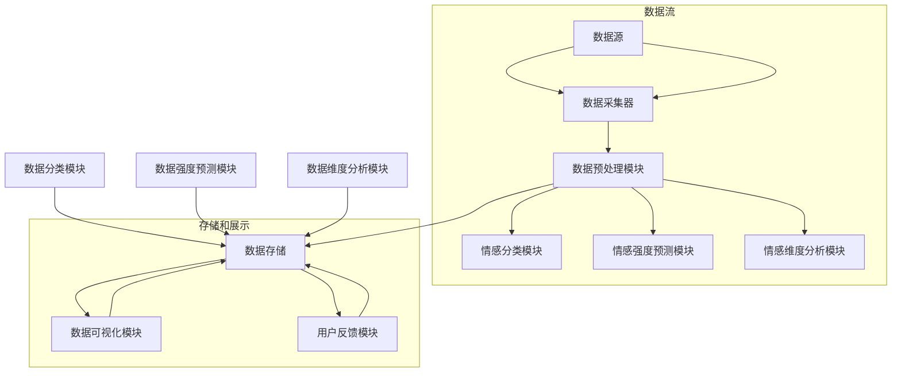

                 

**人工智能在情感分析中的精准应用**

关键词：情感分析、人工智能、自然语言处理、深度学习、算法、应用场景

摘要：随着人工智能技术的快速发展，情感分析已成为自然语言处理领域的一个重要研究方向。本文旨在探讨人工智能在情感分析中的精准应用，从背景理论、核心算法、挑战与解决方案、应用场景等方面进行详细分析，为读者提供一窥情感分析技术的全貌。

## 第一部分：情感分析背景与基础理论

### 1.1 情感分析的概念与重要性

情感分析（Sentiment Analysis），又称意见挖掘，是自然语言处理（NLP）的一个重要分支。其核心目标是通过分析文本数据，识别并提取出其中的情感倾向，从而对用户意见、情绪进行量化评价。情感分析在商业、金融、政治等多个领域具有重要应用价值，能够帮助企业更好地了解用户需求，为决策提供有力支持。

### 1.2 情感分析的历史与发展

情感分析的发展可追溯到20世纪80年代。早期研究主要依赖于基于规则的方法，如词频统计、情感词典等。随着计算技术的发展，机器学习方法逐渐成为主流，如支持向量机（SVM）、决策树、贝叶斯分类器等。近年来，深度学习算法在情感分析领域取得了显著成果，如卷积神经网络（CNN）、递归神经网络（RNN）、长短时记忆网络（LSTM）等。

### 1.3 情感分析的应用领域

情感分析的应用领域广泛，包括但不限于以下几个方面：

1. **社交媒体监测**：通过对社交媒体上的评论、帖子等进行情感分析，可以实时了解用户对品牌、产品、事件等的看法和情绪。

2. **客户服务**：通过分析客户反馈，了解客户需求，优化产品和服务。

3. **金融预测**：利用情感分析技术，对新闻、报告等文本数据进行分析，预测金融市场走势。

4. **舆情监控**：通过分析新闻报道、社交媒体等信息，监控社会热点事件，及时应对突发状况。

### 1.4 情感分析的数据来源与预处理

情感分析的数据来源主要包括社交媒体、新闻、评论、论坛等。这些数据通常存在噪声、缺失值、情感表达多样性等问题，需要通过数据预处理技术进行清洗和规范化。预处理步骤包括数据清洗、分词、词性标注、去除停用词等。

## 第二部分：情感分析中的核心概念

### 2.1 情感极性分类

情感极性分类是情感分析的基础。通常将情感分为正面、负面和中性三种极性。情感极性分类的目标是判断文本数据所表达的情感倾向。

### 2.2 情感强度与分级

情感强度表示情感表达的程度，可分为弱、中、强三个等级。情感分级的目标是量化情感表达的程度，以便进行更精确的分析。

### 2.3 情感维度与情感图谱

情感维度是指情感在语义空间中的不同维度。常见的情感维度包括快乐、愤怒、悲伤、惊讶等。情感图谱用于表示情感之间的关系，有助于理解复杂情感表达。

### 2.4 情感分析中的自然语言处理技术

自然语言处理技术是情感分析的重要基础。包括分词、词性标注、命名实体识别、依存句法分析等。这些技术有助于提取文本数据中的关键信息，提高情感分析的效果。

## 第三部分：情感分析的数学模型与算法

### 3.1 传统机器学习算法在情感分析中的应用

传统机器学习算法在情感分析中具有广泛的应用，包括支持向量机（SVM）、决策树、随机森林、贝叶斯分类器等。这些算法通过特征工程、模型训练和评估等步骤，实现情感分类和情感强度预测。

### 3.2 深度学习算法在情感分析中的应用

深度学习算法在情感分析领域取得了显著成果。卷积神经网络（CNN）、递归神经网络（RNN）、长短时记忆网络（LSTM）等模型通过自动特征提取和语义理解，提高了情感分析的准确性。

### 3.3 情感分析中的注意力机制与 Transformer 模型

注意力机制和 Transformer 模型是近年来情感分析领域的热门研究方向。注意力机制有助于模型聚焦于关键信息，提高情感分析的效果。Transformer 模型通过自注意力机制实现了全局上下文信息的建模，显著提升了情感分析的性能。

## 第四部分：情感分析的挑战与解决方案

### 4.1 数据不平衡问题

数据不平衡是情感分析中普遍存在的问题。解决方案包括采样技术、损失函数调整和模型正则化等。

### 4.2 多样化情感表达

多样化情感表达使得情感分析变得更加复杂。解决方法包括情感词典扩展、多分类模型和迁移学习等。

### 4.3 文化与语言差异

不同文化和语言背景下的情感表达存在较大差异。解决方法包括跨语言情感分析、多语言模型和本地化调整等。

### 4.4 情感分析的伦理问题与隐私保护

情感分析涉及用户隐私和伦理问题。解决方案包括隐私保护技术、伦理审查和用户告知等。

## 第五部分：情感分析在社交媒体中的应用

### 5.1 社交媒体情感分析的基本原理

社交媒体情感分析通过分析用户在社交媒体上的言论，了解用户对品牌、产品等的看法和情绪。

### 5.2 社交媒体情感分析的应用案例

社交媒体情感分析在品牌监测、市场调研、危机管理等方面具有广泛应用。

### 5.3 社交媒体情感分析的数据来源与预处理

社交媒体情感分析的数据来源包括微博、微信、Twitter 等。数据预处理步骤包括数据采集、清洗、分词、词性标注等。

## 第六部分：情感分析在电商中的应用

### 6.1 电商评论情感分析的意义

电商评论情感分析有助于企业了解用户需求，优化产品和服务。

### 6.2 电商评论情感分析的技术实现

电商评论情感分析涉及情感极性分类和情感强度预测等任务。

### 6.3 电商情感分析的最佳实践

电商情感分析的最佳实践包括数据预处理、模型选择和评估等。

## 第七部分：情感分析的实时处理与大数据技术

### 7.1 实时情感分析的需求与挑战

实时情感分析对数据处理速度和准确性提出更高要求。

### 7.2 大数据技术在情感分析中的应用

大数据技术在情感分析中用于海量数据存储、处理和分析。

### 7.3 情感分析的实时处理架构设计

情感分析的实时处理架构设计包括数据采集、存储、处理和展示等模块。

## 第八部分：情感分析系统设计与实现

### 8.1 情感分析系统的需求分析

情感分析系统的需求分析包括功能需求、性能需求和安全需求等。

### 8.2 情感分析系统的架构设计

情感分析系统的架构设计包括数据层、模型层和应用层等。

### 8.3 情感分析系统的实现细节

情感分析系统的实现细节包括数据预处理、模型训练和评估等。

### 8.4 情感分析系统的性能优化

情感分析系统的性能优化包括模型优化、硬件优化和算法优化等。

## 第九部分：情感分析的案例研究与未来趋势

### 9.1 情感分析经典案例分析

经典案例分析包括社交媒体情感分析和电商评论情感分析等。

### 9.2 情感分析的发展趋势与前沿技术

情感分析的发展趋势包括多模态情感分析、情感强度预测和情感推理等。

### 9.3 情感分析的未来应用场景

情感分析的未来应用场景包括智能家居、智能医疗和智能客服等。

## 第十部分：情感分析的伦理与社会影响

### 10.1 情感分析伦理问题探讨

情感分析伦理问题包括用户隐私、数据安全和偏见等。

### 10.2 情感分析对社会的影响

情感分析对社会的影响包括信息传播、决策和治理等方面。

### 10.3 情感分析的可持续发展

情感分析的可持续发展需要平衡技术创新与伦理责任。

作者：AI天才研究院/AI Genius Institute & 禅与计算机程序设计艺术 /Zen And The Art of Computer Programming

以上是文章的正文部分，接下来将逐步展开每个章节的内容，并进行详细讲解。希望本文能帮助您深入了解人工智能在情感分析中的精准应用。**第1章：情感分析概述**

### 1.1 情感分析的概念与重要性

情感分析（Sentiment Analysis），又称为意见挖掘（Opinion Mining），是自然语言处理（Natural Language Processing，NLP）领域的一项重要任务。它的核心目标是从大量文本数据中识别并提取出人类情感或意见的倾向。情感分析不仅仅关注文本的表面信息，更深入地挖掘文本背后的情感色彩和情绪反应。

#### 核心概念术语说明

- **情感**：情感是一种心理状态，通常与愉悦、愤怒、悲伤等情感类别相关联。
- **极性**：极性是指文本所表达的情感倾向，通常分为正面（Positive）、负面（Negative）和中性（Neutral）三种。
- **强度**：情感强度表示情感表达的程度，可以是弱（Weak）、中（Medium）或强（Strong）。
- **情感分析**：情感分析是一种从文本中识别情感极性和情感强度的方法和技术。

#### 问题背景与问题描述

情感分析的应用背景非常广泛，主要包括以下几个方面：

1. **商业领域**：企业可以利用情感分析了解消费者对其产品或服务的反馈，从而优化产品设计和市场策略。
2. **舆情监测**：政府、企业和社会组织可以通过情感分析监控公众情绪，及时了解社会动态，应对突发事件。
3. **金融领域**：投资者和金融机构可以通过分析新闻、报告等文本数据中的情感倾向，预测市场走势。
4. **社交媒体**：社交媒体平台可以通过情感分析监测用户对品牌、事件等的看法，提升用户体验。

情感分析的问题可以描述为：如何从海量的文本数据中准确识别并提取出文本的情感极性和情感强度？

#### 问题解决与边界与外延

情感分析问题解决的步骤主要包括：

1. **数据预处理**：对原始文本数据进行清洗、分词、词性标注等预处理操作，提取有效的特征信息。
2. **特征提取**：从预处理后的文本数据中提取情感相关的特征，如情感词、情感短语等。
3. **模型训练与评估**：使用机器学习或深度学习算法对特征进行训练，构建情感分类模型，并对模型进行评估和优化。

情感分析的边界与外延包括：

1. **情感分类**：将文本数据划分为正面、负面和中性三个极性类别。
2. **情感强度预测**：对文本数据中的情感强度进行量化，通常采用0-1或0-5的等级划分。
3. **情感维度分析**：识别文本数据中的情感维度，如快乐、愤怒、悲伤等。
4. **跨语言情感分析**：将情感分析技术应用于不同语言的文本数据。

#### 概念结构与核心要素组成

情感分析的概念结构可以概括为以下几个核心要素：

1. **文本数据**：情感分析的基础数据，包括社交媒体评论、新闻报道、电商评论等。
2. **特征提取**：从文本数据中提取情感相关的特征，如情感词、情感短语等。
3. **情感分类模型**：基于机器学习或深度学习算法构建的情感分类模型，用于对文本数据中的情感进行分类。
4. **评估与优化**：对情感分类模型进行评估和优化，提高模型准确性和泛化能力。

通过以上对情感分析核心概念的介绍，我们为后续章节的详细探讨奠定了基础。接下来，我们将进一步探讨情感分析的发展历程、应用领域以及数据预处理技术。**第1章：情感分析概述**

### 1.2 情感分析的历史与发展

情感分析作为自然语言处理领域的一个重要分支，其发展历程可追溯到20世纪80年代。随着计算机技术的发展，情感分析从最初的基于规则的方法逐渐转向现代的机器学习和深度学习技术。

#### 早期研究方法

1. **基于规则的方法**：20世纪80年代至90年代，基于规则的方法是情感分析的主要手段。这种方法通过构建一系列规则来识别文本中的情感极性和强度。例如，通过设定情感词词典和情感强度值，对文本进行逐词扫描，判断其情感倾向。然而，基于规则的方法存在几个局限性：

   - **规则定义的复杂性**：情感表达形式多样，定义规则难以覆盖所有情况。
   - **规则的更新和维护**：随着语言环境的变化，情感词典和规则需要不断更新，维护成本高。

2. **基于机器学习的方法**：随着机器学习技术的兴起，情感分析开始引入统计分类器。支持向量机（SVM）、决策树、朴素贝叶斯等算法在情感分析中得到了广泛应用。这些算法通过学习大量的标注数据，自动提取特征，建立分类模型。相比于基于规则的方法，机器学习算法具有更高的灵活性和鲁棒性。

#### 深度学习时代的情感分析

进入21世纪，深度学习技术在情感分析领域取得了显著进展。卷积神经网络（CNN）、递归神经网络（RNN）和长短时记忆网络（LSTM）等模型在情感分析任务中表现出色。

1. **卷积神经网络（CNN）**：CNN是一种在图像处理中广泛应用的网络结构，其优势在于能够自动提取局部特征。将CNN应用于文本处理，通过将文本转换为词向量，CNN能够捕捉文本中的局部特征，如情感词和短语。这种方法在情感分类任务中取得了较好的效果。

2. **递归神经网络（RNN）**：RNN是一种能够处理序列数据的多层神经网络，其核心在于能够记住前面的输入信息。在情感分析中，RNN通过对文本进行逐词分析，能够理解上下文信息，从而提高情感分类的准确性。特别是长短时记忆网络（LSTM），它在处理长文本和复杂情感表达方面具有显著优势。

3. **Transformer 模型**：Transformer模型由Vaswani等人于2017年提出，由于其自注意力机制（Self-Attention）在处理长序列数据方面的优势，迅速在自然语言处理领域得到广泛应用。Transformer模型中的多头自注意力机制能够捕捉全局信息，使得模型在情感分析任务中表现出色。

#### 情感分析的发展趋势

当前，情感分析的发展呈现出以下几个趋势：

1. **多模态情感分析**：情感分析不仅限于文本数据，还包括图像、声音等多模态数据。通过融合不同模态的信息，可以更全面地理解情感表达。

2. **跨语言情感分析**：随着全球化的发展，跨语言情感分析成为了一个重要研究方向。通过将情感分析技术应用于不同语言的文本数据，可以更好地服务于多语言用户。

3. **情感强度预测**：除了情感极性分类，情感强度预测也是一个重要研究方向。通过对情感强度进行量化，可以更精确地描述文本的情感色彩。

4. **领域自适应情感分析**：针对特定领域（如电商、金融、医疗等）的情感分析需求，开发领域自适应的情感分析模型，以提高模型的针对性和准确性。

#### 情感分析的应用领域

情感分析在多个领域具有广泛的应用，包括：

1. **社交媒体分析**：通过分析用户在社交媒体上的评论、帖子，企业可以了解用户对其产品或服务的情感反应，优化品牌策略。

2. **客户服务**：通过对客户反馈、投诉等文本数据进行分析，企业可以及时了解客户需求，提升客户满意度。

3. **金融领域**：投资者可以通过情感分析预测市场走势，金融机构可以通过分析新闻、报告等文本数据，为投资决策提供支持。

4. **舆情监测**：政府、企业和社会组织可以通过情感分析监控公众情绪，了解社会动态，及时应对突发事件。

总之，情感分析作为一个跨学科的研究领域，随着人工智能技术的不断发展，其在实际应用中的价值和潜力将不断得到挖掘和发挥。接下来，我们将进一步探讨情感分析的核心概念和其在自然语言处理中的关键技术。**第1章：情感分析概述**

### 1.3 情感分析的应用领域

情感分析因其强大的文本情感识别能力，在多个领域中得到了广泛应用。以下是情感分析在几个关键领域的具体应用：

#### 1. 商业领域

在商业领域，情感分析被广泛应用于市场研究和客户反馈分析。企业通过分析消费者在社交媒体、评论网站和论坛上发表的评论，可以了解用户对其产品或服务的情感倾向。这种方法有助于企业快速识别市场趋势，优化产品设计和营销策略。例如，一家化妆品公司可以通过分析用户在电商平台上的评论，了解消费者对产品颜色、质地等方面的喜好，从而改进产品。

#### 2. 舆情监测

舆情监测是政府、企业和社会组织的重要任务。通过情感分析技术，可以对大量新闻、社交媒体帖子、论坛评论等文本数据进行实时监控，识别公众对特定事件、政策或品牌的情感反应。这有助于政府和企业及时了解社会动态，预防和应对潜在的风险。例如，在重大突发事件发生时，政府可以利用情感分析技术监控社交媒体上的情绪变化，以便及时采取应对措施。

#### 3. 金融领域

在金融领域，情感分析技术被用于市场分析和投资预测。投资者可以通过分析新闻、报告、社交媒体上的评论等文本数据，了解市场情绪和投资者情绪，从而做出更明智的投资决策。例如，金融分析师可能会分析某一股票相关的新闻报道和社交媒体评论，以预测股票的价格走势。此外，银行和金融机构也可以利用情感分析技术，通过客户服务记录和投诉文本，了解客户满意度和潜在风险。

#### 4. 社交媒体分析

社交媒体平台上的用户生成内容（UGC）是情感分析的重要数据来源。社交媒体公司可以利用情感分析技术，了解用户对其平台、广告、活动等的反应。这种分析有助于优化用户界面、提高用户满意度和增加用户参与度。例如，一个社交媒体平台可以通过分析用户对其新功能发布的评论，识别哪些功能最受用户欢迎，从而进行优化。

#### 5. 客户服务

客户服务部门可以利用情感分析技术，对客户反馈和投诉文本进行自动化处理。通过情感分析，企业可以快速识别客户投诉的主要原因，提供针对性的解决方案。此外，情感分析还可以用于客户情感状态监测，帮助企业更好地了解客户需求，提供个性化服务。例如，一家电信公司可以通过分析客户在社交媒体上的评论，识别哪些服务问题导致客户不满意，并及时采取改进措施。

#### 6. 医疗健康

在医疗健康领域，情感分析技术被用于患者情绪监测和心理健康评估。通过对患者病历记录、社交媒体帖子、在线论坛等文本数据进行分析，医疗专业人员可以了解患者的情绪状态，预测潜在的心理健康问题。例如，医生可以通过分析患者的日志和社交媒体更新，发现患者可能出现的抑郁或焦虑症状，从而及时进行干预。

#### 7. 娱乐产业

在娱乐产业，情感分析技术被用于票房预测、节目评估和粉丝情感分析。电影制片公司可以通过分析观众评论和社交媒体讨论，预测电影的票房表现。电视节目制作公司可以通过情感分析技术，了解观众对不同节目的情感反应，优化节目内容和宣传策略。此外，情感分析还可以用于明星粉丝情感的监测，帮助娱乐公司制定更有针对性的营销策略。

总之，情感分析作为一种强大的文本分析工具，在商业、舆情监测、金融、社交媒体、客户服务、医疗健康和娱乐产业等多个领域具有广泛的应用。随着技术的不断进步，情感分析的应用范围和影响力将进一步扩大。**第1章：情感分析概述**

### 1.4 情感分析的数据来源与预处理

情感分析的数据来源广泛且多样，主要包括社交媒体、评论网站、新闻报道、论坛、电商平台等。以下是几种主要数据来源及其预处理步骤：

#### 1. 社交媒体数据

社交媒体平台如Twitter、Facebook、Instagram等是情感分析的重要数据来源。这些平台上的用户生成内容（UGC）包含了丰富的情感信息。然而，这些数据通常具有高噪声、非结构化和多样化等特点。

**预处理步骤**：

1. **数据采集**：使用API或其他数据采集工具，从社交媒体平台上获取文本数据。
2. **去重**：去除重复的文本数据，以减少冗余信息。
3. **清洗**：去除HTML标签、URL、特殊字符等无关信息，使文本数据更加干净。
4. **分词**：将文本数据拆分为单词或词组，以便进一步分析。
5. **词性标注**：为每个单词标注其词性（如名词、动词、形容词等），有助于理解文本的语义结构。
6. **去除停用词**：去除对情感分析贡献较小或无意义的常见单词（如“的”、“了”、“是”等），以简化数据。

#### 2. 评论网站数据

评论网站如Amazon、eBay、 Yelp等提供了大量关于产品、服务、餐馆等的用户评论。这些评论通常包含丰富的情感信息，但同样存在噪声和复杂性。

**预处理步骤**：

1. **数据采集**：从评论网站上获取用户评论数据。
2. **分词与清洗**：对评论文本进行分词和清洗，去除HTML标签、URL等无关信息。
3. **去除停用词**：去除常见停用词，减少噪声。
4. **情感词典扩展**：利用情感词典，将评论中的情感词扩展为更详细的情感标签。

#### 3. 新闻报道数据

新闻报道是情感分析的重要数据来源，涵盖了政治、经济、社会等多个领域的新闻文本。新闻报道的数据量大且多样化，但通常具有较好的结构化和组织性。

**预处理步骤**：

1. **数据采集**：从新闻网站或数据库中获取新闻报道数据。
2. **文本提取**：从新闻报道中提取正文文本，去除标题、摘要等非结构化部分。
3. **分词与清洗**：对文本进行分词和清洗，去除HTML标签、URL等无关信息。
4. **命名实体识别**：识别并标注新闻报道中的命名实体（如人名、地点、组织等），以便更精确地理解文本内容。

#### 4. 论坛数据

论坛数据包含用户在特定主题下发表的讨论帖和回复。论坛数据的情感分析有助于了解用户的兴趣和观点。

**预处理步骤**：

1. **数据采集**：从论坛网站上获取讨论帖和回复数据。
2. **分词与清洗**：对帖子进行分词和清洗，去除HTML标签、URL等无关信息。
3. **去除停用词**：去除常见停用词，减少噪声。
4. **主题识别**：通过关键词提取和聚类方法，识别论坛中的主要主题，以便更精确地分析情感。

#### 5. 电商平台数据

电商平台的数据主要包括用户对产品或服务的评价和评论。这些数据有助于企业了解用户对其产品或服务的情感反应。

**预处理步骤**：

1. **数据采集**：从电商平台获取用户评价和评论数据。
2. **分词与清洗**：对评论文本进行分词和清洗，去除HTML标签、URL等无关信息。
3. **去除停用词**：去除常见停用词，减少噪声。
4. **情感极性标注**：利用预定义的情感词典或机器学习模型，对评论进行情感极性标注。

通过上述预处理步骤，情感分析的数据质量得到了显著提升，为后续的情感分类和情感强度预测提供了可靠的依据。接下来，我们将进一步探讨情感分析中的核心概念和自然语言处理技术。**第2章：情感分析中的核心概念**

### 2.1 情感极性分类

情感极性分类是情感分析中最基本和最常见的任务之一，它的目标是根据文本内容判断其是正面的、负面的还是中性的。这一任务的核心在于识别文本中的情感倾向，并将其分类到不同的极性标签中。

#### 核心概念原理

情感极性分类的原理可以分为以下几个步骤：

1. **特征提取**：从文本中提取与情感相关的特征，如情感词、情感短语等。这些特征通常是通过预定义的情感词典或通过机器学习模型自动学习得到的。
2. **分类模型训练**：使用标注好的训练数据集，通过机器学习算法（如SVM、随机森林、神经网络等）训练分类模型。训练过程中，模型学习如何根据特征来判断文本的情感极性。
3. **预测与评估**：使用训练好的模型对新的文本数据进行预测，并评估分类结果的准确性。

#### 情感极性分类的属性特征对比表格

为了更好地理解情感极性分类，我们可以通过一个表格来对比不同情感极性的属性特征：

| 情感极性 | 描述性特征 | 对应的情感词 |
| -------- | ----------- | ------------ |
| 正面     | 愉快、满意、喜爱 | “喜欢”、“开心”、“满意” |
| 负面     | 愤怒、失望、讨厌 | “讨厌”、“气愤”、“糟糕” |
| 中性     | 客观、中立、描述 | “是”、“好”、“可以” |

#### ER实体关系图架构

情感极性分类中的实体关系相对简单，主要涉及文本、特征和分类结果三个实体。以下是使用Mermaid绘制的ER实体关系图：

```mermaid
erDiagram
    A[Text] ||--|{ B[Features] }|
    B ||--|{ C[Polarity] }|
```

在这个图中，文本（Text）是原始数据，特征（Features）是从文本中提取的情感相关特征，分类结果（Polarity）是最终的情感极性标签。

### 2.2 情感强度与分级

情感强度表示情感表达的程度，与情感极性分类不同，它关注的是情感表达的强烈程度。情感强度通常通过量化方式表示，如0-1的数值范围或0-5的等级划分。

#### 核心概念原理

情感强度分级的核心概念包括：

1. **情感强度标注**：在情感极性分类的基础上，对情感表达的强度进行标注。例如，对于一句正面评价，“非常喜欢”的情感强度可能高于“有点喜欢”。
2. **特征加权**：通过给文本中的不同特征分配不同的权重，来反映情感表达的强度。例如，情感词“喜欢”的权重可能高于“有点喜欢”。
3. **情感强度预测**：使用机器学习算法（如回归模型、神经网络等）对文本的情感强度进行预测。

#### 情感强度分级示例

情感强度分级可以采用如下示例：

| 情感强度 | 描述性特征 | 对应的情感词 |
| -------- | ----------- | ------------ |
| 非常强   | 极其满意、爱到极致 | “超级喜欢”、“完美无缺” |
| 强       | 非常满意、很喜欢 | “非常喜欢”、“满意到爆炸” |
| 中       | 一般、还算不错 | “还行”、“一般般” |
| 弱       | 不太满意、有点喜欢 | “有点喜欢”、“可以接受” |
| 非常弱   | 完全不满意、极其讨厌 | “超级讨厌”、“糟糕透顶” |

#### 情感强度分级与情感极性的关系

情感强度分级与情感极性分类密切相关。一个文本可以同时包含情感极性和强度信息。例如，一段文本可能是正面的且情感强度很强：“这款产品超级喜欢，用起来非常满意！”

#### ER实体关系图架构

在情感强度分级的ER实体关系图中，我们通常涉及三个实体：文本（Text）、特征（Features）和情感强度（Sentiment Strength）。

```mermaid
erDiagram
    A[Text] ||--|{ B[Features] }|
    B ||--|{ C[Sentiment Strength] }|
```

在这个图中，文本是原始数据，特征是从文本中提取的情感相关特征，情感强度是最终的强度标注。

通过上述对情感极性分类和情感强度分级的介绍，我们可以更好地理解情感分析中的核心概念。这些概念是构建情感分析系统的基础，有助于我们深入探索情感分析的算法和实现细节。接下来，我们将继续讨论情感分析中的其他核心概念，如情感维度和情感图谱。**第2章：情感分析中的核心概念**

### 2.3 情感维度与情感图谱

情感维度（Sentiment Dimensions）是情感分析中的一个重要概念，它指的是情感在语义空间中的不同维度，如快乐、愤怒、悲伤、惊讶等。情感维度帮助我们更细致地理解文本情感，而情感图谱（Sentiment Graph）则用于表示情感之间的关系和结构。

#### 情感维度的核心概念原理

情感维度的核心概念原理如下：

1. **情感识别**：通过文本分析技术，识别文本中的情感维度。这通常需要利用情感词典和机器学习模型来实现。
2. **情感分类**：将文本中的情感归类到不同的维度。例如，文本“这部电影让我感到很快乐”可以被归类到“快乐”维度。
3. **情感强度评估**：对文本中的情感维度进行强度评估。例如，文本中的“非常喜欢”可能表示更高的快乐强度。

#### 情感维度的属性特征对比表格

为了更好地理解情感维度，我们可以通过一个表格来对比不同情感维度的属性特征：

| 情感维度 | 描述性特征 | 对应的情感词 |
| -------- | ----------- | ------------ |
| 快乐     | 愉悦、高兴、满意 | “开心”、“快乐”、“满意” |
| 愤怒     | 愤慨、恼怒、恼火 | “愤怒”、“恼怒”、“气愤” |
| 悲伤     | 悲伤、哀伤、难过 | “难过”、“伤心”、“悲哀” |
| 惊讶     | 惊讶、惊奇、震撼 | “惊讶”、“惊奇”、“震撼” |
| 幸福     | 幸福、满足、安详 | “幸福”、“满足”、“安详” |

#### 情感图谱的ER实体关系图架构

情感图谱的ER实体关系图用于表示情感维度之间的关系。以下是情感图谱的Mermaid ER图：

```mermaid
erDiagram
    A[Text] ||--|{ B[Sentiment Dimension] }|
    B ||--|{ C[Sentiment Graph] }|
```

在这个图中，文本（Text）是原始数据，情感维度（Sentiment Dimension）是从文本中识别的情感标签，情感图谱（Sentiment Graph）用于表示情感维度之间的关系。

#### 情感维度与情感强度的关系

情感维度和情感强度密切相关。一个文本可以包含多个情感维度，并且每个维度可以有不同强度的情感表达。例如，文本“这部电影让我感到很快乐，但也有些紧张”包含了“快乐”和“紧张”两个情感维度，并且每个维度有不同程度的情感强度。

#### 情感维度分析的应用

情感维度分析在多个应用场景中具有重要价值：

1. **情感识别**：通过识别文本中的情感维度，可以更好地理解用户情绪，为社交媒体分析、舆情监测等应用提供支持。
2. **情感强度预测**：通过对情感维度进行强度评估，可以更精确地了解用户情感反应，为个性化推荐、客户满意度分析等应用提供支持。
3. **情感可视化**：通过构建情感图谱，可以直观地展示文本中的情感结构和关系，为情感分析结果的解释和展示提供帮助。

通过以上对情感维度和情感图谱的介绍，我们可以更深入地理解情感分析中的核心概念。这些概念不仅有助于我们理解情感表达的复杂性和多样性，还为情感分析的算法设计和应用提供了理论基础。接下来，我们将进一步探讨情感分析中的自然语言处理技术，如分词、词性标注和命名实体识别。**第2章：情感分析中的核心概念**

### 2.4 情感分析中的自然语言处理技术

自然语言处理（NLP）是情感分析的重要基础，它提供了一系列工具和方法来理解和分析人类语言。在情感分析中，常用的NLP技术包括分词、词性标注和命名实体识别。以下是这些技术的详细描述及其在情感分析中的应用。

#### 分词

分词（Tokenization）是将连续的文本分解成一个个有意义的词或短语的过程。分词的目的是为了提取出文本中的基本语义单位，为后续的文本分析提供基础。

1. **分词算法**：常见的分词算法包括基于词典的分词和基于统计的分词。基于词典的分词通过查找预定义的词典来切分文本，如正向最大匹配和逆向最大匹配。基于统计的分词则利用统计模型，如隐马尔可夫模型（HMM）和条件随机场（CRF），来自动切分文本。

2. **分词在情感分析中的应用**：分词是情感分析中的第一步，它有助于提取文本中的情感词和短语。通过分词，我们可以将原始文本分解成更小的片段，从而更容易地识别和分类情感。

#### 词性标注

词性标注（Part-of-Speech Tagging）是为每个单词分配其在句子中的语法角色和词性，如名词、动词、形容词等。词性标注有助于理解文本的语法结构和语义含义。

1. **词性标注算法**：常见的词性标注算法包括基于规则的标注和基于统计的标注。基于规则的标注利用预定义的语法规则来标注词性，如最大熵模型（MaxEnt）和条件随机场（CRF）。基于统计的标注则通过学习大量的标注数据，自动识别词性。

2. **词性标注在情感分析中的应用**：词性标注有助于识别文本中的情感词和非情感词，从而提高情感分类的准确性。例如，通过词性标注，我们可以区分出形容词和名词，从而更准确地判断它们是否表达了情感。

#### 命名实体识别

命名实体识别（Named Entity Recognition，NER）是从文本中识别出具有特定意义的实体，如人名、地名、组织名等。命名实体识别对于理解文本内容和情感具有重要作用。

1. **NER算法**：常见的NER算法包括基于规则的识别和基于机器学习的识别。基于规则的识别利用预定义的规则来识别命名实体，如隐马尔可夫模型（HMM）和条件随机场（CRF）。基于机器学习的识别则通过训练模型来自动识别命名实体。

2. **NER在情感分析中的应用**：命名实体识别有助于识别文本中的关键信息，如品牌、产品名等。这些实体在情感分析中可能具有情感倾向，通过NER可以更好地理解这些实体的情感色彩，从而提高情感分类的准确性。

#### 综合应用

自然语言处理技术在情感分析中的综合应用如图所示：



在这个流程中，原始文本首先经过分词、词性标注和命名实体识别，然后提取出情感词和关键实体，最终进行情感分类。

通过以上对自然语言处理技术的介绍，我们可以看到这些技术在情感分析中扮演了关键角色。它们不仅帮助我们理解文本的语义和结构，还为情感分类和情感强度评估提供了基础。接下来，我们将进一步探讨情感分析中的机器学习算法和深度学习模型。**第3章：情感分析的数学模型与算法**

### 3.1 传统机器学习算法在情感分析中的应用

传统机器学习算法在情感分析领域有着广泛的应用，这些算法通过学习大量的标注数据，自动提取特征，从而实现情感分类和情感强度预测。以下是几种常见的传统机器学习算法及其在情感分析中的应用。

#### 3.1.1 支持向量机（SVM）

支持向量机（Support Vector Machine，SVM）是一种强大的分类算法，它通过寻找最优的超平面，将不同类别的数据点分开。在情感分析中，SVM通常用于情感极性分类，即将文本分类为正面、负面或中性。

1. **算法原理**：
   - **线性SVM**：线性SVM通过最大化分类边界的间隔，将文本数据映射到高维空间，找到一个最优的超平面来分割数据。
   - **核SVM**：对于非线性问题，核SVM通过引入核函数，将低维数据映射到高维空间，实现非线性分类。

2. **在情感分析中的应用**：
   - **特征提取**：将文本转换为特征向量，如词袋模型（Bag of Words，BOW）和TF-IDF模型。
   - **模型训练**：使用标注数据集训练SVM模型，学习到文本特征与情感极性之间的关系。
   - **模型评估**：通过交叉验证和测试集，评估模型的准确性和泛化能力。

#### 3.1.2 决策树与随机森林

决策树（Decision Tree）是一种基于树结构的分类算法，它通过一系列的决策规则来对数据进行分类。随机森林（Random Forest）是决策树的集成方法，通过构建多棵决策树，并采用投票机制来获得最终的分类结果。

1. **算法原理**：
   - **决策树**：决策树通过递归划分特征空间，找到最优的划分点，构建出一棵树结构。
   - **随机森林**：随机森林通过Bootstrap采样和特征随机选择，构建多棵决策树，并通过集成方法提高模型的稳定性和准确性。

2. **在情感分析中的应用**：
   - **特征选择**：随机森林通过特征随机选择，可以有效减少特征维度，提高模型性能。
   - **模型训练**：使用标注数据集训练随机森林模型，学习到文本特征与情感极性之间的关系。
   - **模型评估**：通过多棵决策树的集成结果，提高分类准确性和鲁棒性。

#### 3.1.3 贝叶斯分类器

贝叶斯分类器（Bayesian Classifier）是一种基于贝叶斯定理的概率分类算法，它通过计算文本数据的类条件概率，并利用贝叶斯公式进行分类。

1. **算法原理**：
   - **朴素贝叶斯**：朴素贝叶斯假设特征之间相互独立，通过计算特征的概率分布和类概率，利用贝叶斯公式进行分类。
   - **高斯贝叶斯**：高斯贝叶斯模型适用于特征呈高斯分布的情况，通过计算特征和类的多变量高斯分布，进行分类。

2. **在情感分析中的应用**：
   - **特征概率计算**：将文本转换为特征向量，计算每个特征在正面、负面和中性类别中的概率分布。
   - **模型训练**：使用标注数据集训练贝叶斯分类器，学习到文本特征与情感极性之间的关系。
   - **模型评估**：通过计算预测概率和实际标签的匹配度，评估模型的分类准确性。

#### 比较与选择

在情感分析中，选择哪种传统机器学习算法取决于多个因素，如数据特点、模型复杂度和计算资源等。以下是几种算法的比较：

- **SVM**：适合处理高维数据和线性可分的数据，但在处理非线性问题时需要使用核函数，计算复杂度较高。
- **决策树**：易于理解，对线性数据有较好的分类效果，但在处理大规模数据时可能过拟合。
- **随机森林**：具有较高的准确性和稳定性，通过集成多棵决策树，可以有效地减少过拟合。
- **贝叶斯分类器**：计算效率高，适用于特征独立的场景，但在处理复杂非线性问题时效果有限。

综上所述，传统机器学习算法在情感分析中有着广泛的应用，每种算法都有其独特的优势和适用场景。在实际应用中，可以根据具体需求和数据特点，选择合适的算法来实现情感分析任务。接下来，我们将探讨深度学习算法在情感分析中的应用。**第3章：情感分析的数学模型与算法**

### 3.2 深度学习算法在情感分析中的应用

随着深度学习技术的快速发展，其在情感分析领域也取得了显著的成果。深度学习算法通过自动特征提取和语义理解，提高了情感分析的准确性和泛化能力。以下是几种常见的深度学习算法在情感分析中的应用。

#### 3.2.1 卷积神经网络（CNN）

卷积神经网络（Convolutional Neural Network，CNN）最初在图像处理领域取得了巨大成功。近年来，CNN在情感分析中也显示出强大的能力。CNN通过卷积操作和池化操作，能够自动提取文本中的局部特征。

1. **算法原理**：
   - **卷积层**：卷积层通过卷积操作捕捉文本中的局部特征，类似于图像中的边缘和纹理。
   - **池化层**：池化层用于减少特征图的维度，提高模型的计算效率。
   - **全连接层**：全连接层将卷积层提取的特征映射到分类结果。

2. **在情感分析中的应用**：
   - **特征提取**：通过卷积层和池化层，CNN能够自动提取文本中的情感特征，如情感词和短语。
   - **分类预测**：使用全连接层对提取到的特征进行分类预测，实现情感极性分类。

#### 3.2.2 递归神经网络（RNN）

递归神经网络（Recurrent Neural Network，RNN）是一种能够处理序列数据的神经网络。RNN通过递归连接，能够记住前面的输入信息，从而处理变长序列。

1. **算法原理**：
   - **递归层**：递归层通过递归连接，将当前输入与前一时刻的隐藏状态进行融合，更新隐藏状态。
   - **门控机制**：RNN的门控机制，如忘记门（Forget Gate）和输入门（Input Gate），有助于记忆重要的信息，遗忘不重要的信息。

2. **在情感分析中的应用**：
   - **序列建模**：RNN能够对文本进行序列建模，捕捉上下文信息，提高情感分类的准确性。
   - **情感强度预测**：通过RNN，可以捕捉文本中情感的变化趋势，实现情感强度的预测。

#### 3.2.3 长短时记忆网络（LSTM）

长短时记忆网络（Long Short-Term Memory，LSTM）是RNN的一种改进，解决了传统RNN在处理长序列数据时容易遇到的梯度消失和梯度爆炸问题。LSTM通过门控机制和细胞状态，能够有效地记忆和遗忘信息。

1. **算法原理**：
   - **门控机制**：LSTM中的门控机制包括输入门（Input Gate）、忘记门（Forget Gate）和输出门（Output Gate），用于控制信息的流入、流出和输出。
   - **细胞状态**：细胞状态用于存储和传递长期信息，避免了梯度消失问题。

2. **在情感分析中的应用**：
   - **长序列建模**：LSTM能够处理长文本数据，捕捉情感表达的长远依赖关系。
   - **情感强度预测**：通过LSTM，可以更准确地预测文本中的情感强度，提高情感分析的精度。

#### 3.2.4 Transformer 模型

Transformer模型由Vaswani等人于2017年提出，由于其自注意力机制（Self-Attention）在处理长序列数据方面的优势，迅速在自然语言处理领域得到广泛应用。

1. **算法原理**：
   - **多头自注意力**：Transformer模型中的自注意力机制允许模型在处理每个单词时，同时考虑整个文本序列的其他单词，实现全局信息的建模。
   - **编码器-解码器结构**：Transformer采用编码器-解码器结构，编码器负责提取文本特征，解码器负责生成预测结果。

2. **在情感分析中的应用**：
   - **全局信息建模**：通过多头自注意力机制，Transformer能够捕捉文本中的全局信息，提高情感分类的准确性。
   - **长文本处理**：Transformer能够高效地处理长文本数据，实现情感极性和情感强度的预测。

#### 深度学习算法的比较

深度学习算法在情感分析中的应用各有优势，以下是比较：

- **CNN**：适合处理文本的局部特征，能够提取出情感词和短语，但在捕捉上下文信息方面较弱。
- **RNN**：能够处理变长序列数据，捕捉上下文信息，但在处理长序列时容易遇到梯度消失问题。
- **LSTM**：是RNN的一种改进，解决了梯度消失问题，能够更好地记忆和遗忘信息，但在计算复杂度上较高。
- **Transformer**：采用自注意力机制，能够高效地捕捉全局信息，适合处理长文本数据，在情感分析中表现出色。

综上所述，深度学习算法在情感分析中有着广泛的应用，不同的算法适用于不同的场景。在实际应用中，可以根据具体需求和数据特点，选择合适的深度学习算法来实现情感分析任务。接下来，我们将探讨情感分析中的注意力机制及其在Transformer模型中的应用。**第3章：情感分析的数学模型与算法**

### 3.3 情感分析中的注意力机制与 Transformer 模型

注意力机制（Attention Mechanism）是深度学习中的一个关键概念，它通过动态地分配权重来关注重要的信息，从而提高模型对序列数据的处理能力。在情感分析中，注意力机制被广泛应用于提高情感分类和情感强度预测的准确性。Transformer模型是注意力机制的一种经典实现，通过自注意力（Self-Attention）和交叉注意力（Cross-Attention）机制，Transformer在自然语言处理任务中取得了显著的成果。

#### 注意力机制的基本原理

注意力机制的核心思想是，在处理序列数据时，模型能够根据上下文信息动态地关注重要的部分，从而提高信息处理的效率。注意力机制通常通过一个加权求和的过程来实现，即每个输入序列中的元素都会根据其相对重要性获得不同的权重，然后对这些加权元素进行求和，得到一个整体的表示。

1. **计算注意力权重**：注意力权重是通过一个查询（Query）、键（Key）和值（Value）的对来计算的。常见的注意力机制如Dot-Product Attention、Scaled Dot-Product Attention 和多头注意力（Multi-Head Attention）。

   - **Dot-Product Attention**：通过点积计算查询和键的相似度，得到注意力权重。
   - **Scaled Dot-Product Attention**：在Dot-Product Attention的基础上引入缩放因子，避免权重过小或过大。
   - **Multi-Head Attention**：通过多个独立的注意力头来计算注意力权重，每个头关注不同的信息，从而提高模型的丰富性和准确性。

2. **加权求和**：将注意力权重应用于值（Value）序列，对每个值进行加权求和，得到一个加权和的表示。这个加权和的表示包含了输入序列中每个元素的重要性信息。

#### Transformer 模型中的注意力机制

Transformer模型是注意力机制的典型应用，它采用了编码器-解码器（Encoder-Decoder）结构，通过自注意力（Self-Attention）和交叉注意力（Cross-Attention）机制来处理序列数据。

1. **自注意力（Self-Attention）**：在编码器中，自注意力机制用于编码输入序列，使编码器能够捕捉输入序列的局部和全局信息。每个编码器的层都包含多头自注意力机制，通过不同的头关注不同的信息，从而提高模型的表示能力。

2. **交叉注意力（Cross-Attention）**：在解码器中，交叉注意力机制用于解码输出序列，将解码器当前步骤的输出与编码器的所有隐藏状态进行匹配，从而生成当前步骤的预测。交叉注意力使得解码器能够根据编码器的信息来更新其状态，提高预测的准确性。

#### 注意力机制在情感分析中的应用

注意力机制在情感分析中的应用主要体现在以下两个方面：

1. **情感极性分类**：在情感分类任务中，注意力机制可以帮助模型关注文本中重要的情感词和短语，从而提高分类的准确性。例如，在处理一个句子“我非常喜欢这个产品”，注意力机制能够帮助模型关注到“非常喜欢”这个情感短语，从而更准确地将其分类为正面情感。

2. **情感强度预测**：在情感强度预测任务中，注意力机制可以帮助模型理解文本中情感表达的变化趋势。例如，在处理一个句子“这个产品刚开始感觉很好，但后来使用过程中出现了一些问题”，注意力机制能够帮助模型捕捉到情感表达的变化，从而更准确地预测情感强度。

#### 案例分析

以下是一个简单的Transformer模型在情感分析中的应用案例：

```python
import tensorflow as tf
from tensorflow.keras.models import Model
from tensorflow.keras.layers import Embedding, LSTM, Dense, Input, GlobalAveragePooling1D

# 定义模型输入
input_sequence = Input(shape=(max_sequence_length,), dtype='int32')

# 嵌入层
embedding = Embedding(input_dim=vocabulary_size, output_dim=embedding_size)(input_sequence)

# LSTM层
lstm_output = LSTM(units=lstm_units, return_sequences=True)(embedding)

# 多头自注意力层
attention_output = MultiHeadAttention(num_heads=num_heads, key_dim=key_dim)(lstm_output, lstm_output)

# 交叉注意力层
cross_attention_output = CrossAttention(num_heads=num_heads, key_dim=key_dim)(attention_output, lstm_output)

# 全连接层
output = Dense(units=num_classes, activation='softmax')(cross_attention_output)

# 构建和编译模型
model = Model(inputs=input_sequence, outputs=output)
model.compile(optimizer='adam', loss='categorical_crossentropy', metrics=['accuracy'])

# 模型训练
model.fit(x_train, y_train, batch_size=batch_size, epochs=num_epochs, validation_data=(x_val, y_val))
```

在这个案例中，我们首先定义了输入序列，然后通过嵌入层将序列转换为嵌入向量。接着，我们使用LSTM层和多头自注意力层来处理序列数据，并利用交叉注意力层生成最终的分类结果。最后，我们编译和训练模型，以实现对文本数据的情感分类。

综上所述，注意力机制在情感分析中具有重要的应用价值，它能够帮助模型更准确地捕捉文本中的情感信息，从而提高情感分类和情感强度预测的准确性。接下来，我们将探讨情感分析中的挑战与解决方案。**第4章：情感分析的挑战与解决方案**

### 4.1 数据不平衡问题

在情感分析中，数据不平衡（Data Imbalance）是一个常见且严重的挑战。数据不平衡指的是训练数据集中各类别的样本数量不均衡，通常正面和负面情感的样本数量远少于中性情感的样本。数据不平衡会导致模型在训练过程中倾向于忽略少数类别的样本，从而影响模型的泛化能力和准确性。

#### 数据不平衡的影响

1. **分类准确性降低**：在数据不平衡的情况下，模型可能会过于关注多数类别的样本，导致对少数类别的分类准确性降低。
2. **模型偏见**：如果多数类别的样本占据主导地位，模型可能会学习到错误的模式，从而对少数类别的样本产生偏见。
3. **过拟合风险**：模型可能会过度依赖多数类别的样本，导致在训练集上表现良好，但在测试集或新数据上表现较差，即过拟合。

#### 解决方案

1. **重采样**：
   - **过采样**：通过复制少数类别的样本，增加其数量，使各类别样本数量趋于平衡。
   - **欠采样**：通过删除多数类别的样本，减少其数量，使各类别样本数量趋于平衡。

2. **损失函数调整**：
   - **加权损失函数**：为各类别的样本分配不同的权重，使得模型在训练过程中更加关注少数类别的样本。
   - **F1-score**：使用F1-score作为评估指标，而不是单纯地依赖准确率，以平衡各类别的性能。

3. **集成方法**：
   - **Bagging**：通过构建多个子模型，并在集成时考虑各类别的权重，以提高模型的泛化能力。
   - **Boosting**：通过调整模型在集成过程中对各类别的关注程度，提高少数类别样本的重要性。

4. **模型正则化**：
   - **Dropout**：通过随机丢弃部分神经元，降低模型对多数类别的依赖。
   - **正则化**：通过添加正则化项，如L1或L2正则化，减少模型的过拟合风险。

#### 案例分析

以下是一个使用加权损失函数解决数据不平衡问题的案例：

```python
from tensorflow.keras.utils import to_categorical
from tensorflow.keras.models import Sequential
from tensorflow.keras.layers import Dense, Embedding, LSTM, GlobalAveragePooling1D
from tensorflow.keras.optimizers import Adam

# 数据预处理
X_train, y_train = preprocess_data(train_data)
y_train_categorical = to_categorical(y_train)

# 设置类别权重
class_weights = compute_class_weights(y_train_categorical)

# 构建模型
model = Sequential()
model.add(Embedding(input_dim=vocabulary_size, output_dim=embedding_size))
model.add(LSTM(units=lstm_units, return_sequences=False))
model.add(GlobalAveragePooling1D())
model.add(Dense(units=num_classes, activation='softmax'))

# 编译模型，使用加权损失函数
model.compile(optimizer=Adam(), loss='categorical_crossentropy', metrics=['accuracy'])
model.fit(X_train, y_train_categorical, batch_size=batch_size, epochs=num_epochs, class_weight=class_weights)
```

在这个案例中，我们首先对训练数据进行预处理，然后将标签转换为分类标签。接着，我们计算每个类别的权重，并将其应用于模型训练过程中。通过这种方式，模型在训练时会更加关注少数类别的样本，从而提高对少数类别样本的分类准确性。

总之，数据不平衡是情感分析中的一个重要挑战，通过重采样、损失函数调整、集成方法和模型正则化等技术，可以有效解决数据不平衡问题，提高模型的泛化能力和准确性。接下来，我们将探讨多样化情感表达在情感分析中的影响和挑战。**第4章：情感分析的挑战与解决方案**

### 4.2 多样化情感表达

在情感分析中，多样化情感表达是一个显著的挑战。情感表达形式多样，不仅包括简单的正面、负面和中性情感，还包括复杂的情感组合、双关语、讽刺和隐含情感等。这些多样化的情感表达使得情感分析变得更加复杂，对模型的要求更高。

#### 多样化情感表达的影响

1. **情感识别准确性下降**：多样化的情感表达增加了情感分类的难度，使得模型难以准确识别情感极性。
2. **情感强度预测挑战**：情感表达的变化和多样性使得情感强度的评估更加复杂，传统的情感强度分级方法可能无法准确捕捉情感变化的细微差异。
3. **模型泛化能力降低**：如果模型仅训练于单一类型的情感表达，其在遇到多样化情感表达时可能表现出较低的泛化能力。

#### 解决方案

1. **情感词典扩展**：
   - **引入上下文信息**：通过分析上下文，将情感词典扩展为更详细的情感标签，如快乐、愤怒、悲伤等。
   - **多语言情感词典**：使用多语言情感词典，覆盖不同文化和语言背景下的情感表达。

2. **多分类模型**：
   - **细粒度分类**：将情感分类细化为多个子类别，如将负面情感进一步细分为愤怒、失望、悲伤等。
   - **情感强度分级**：将情感强度分为多个等级，如0-5的评分体系，以更细致地捕捉情感变化。

3. **迁移学习**：
   - **预训练模型**：使用在大型语料库上预训练的模型，通过迁移学习，使模型具备处理多样化情感表达的能力。
   - **微调**：在预训练模型的基础上，针对特定领域的情感分析任务进行微调，提高模型在多样化情感表达上的表现。

4. **多模态分析**：
   - **融合文本与语音**：结合文本和语音信息，通过情感语调、语速等特征，提高情感识别的准确性。
   - **图像与文本融合**：通过分析图像和文本之间的关联，捕捉情感表达中的视觉信息，提高情感分析的全面性。

#### 案例分析

以下是一个使用迁移学习解决多样化情感表达问题的案例：

```python
from tensorflow.keras.applications import VGG16
from tensorflow.keras.layers import Flatten, Dense, Input
from tensorflow.keras.models import Model

# 加载预训练的VGG16模型
base_model = VGG16(weights='imagenet', include_top=False)

# 修改模型，添加全连接层
x = base_model.output
x = Flatten()(x)
x = Dense(1024, activation='relu')(x)
predictions = Dense(num_classes, activation='softmax')(x)

# 创建新的模型
model = Model(inputs=base_model.input, outputs=predictions)

# 编译模型
model.compile(optimizer='adam', loss='categorical_crossentropy', metrics=['accuracy'])

# 微调模型
model.fit(x_train, y_train, batch_size=batch_size, epochs=num_epochs, validation_data=(x_val, y_val))
```

在这个案例中，我们首先加载了预训练的VGG16模型，并修改了模型结构，添加了全连接层。然后，我们编译并微调了模型，使其能够处理多样化情感表达。通过这种方式，模型能够更好地理解和识别复杂情感表达。

总之，多样化情感表达是情感分析中的一个重要挑战，通过情感词典扩展、多分类模型、迁移学习和多模态分析等技术，可以有效提高模型对多样化情感表达的处理能力，从而提高情感分析的整体性能。接下来，我们将探讨情感分析中的文化与语言差异带来的挑战和解决方案。**第4章：情感分析的挑战与解决方案**

### 4.3 文化与语言差异

情感分析不仅面临着数据不平衡和多样化情感表达的挑战，还受到文化与语言差异的影响。不同文化和语言背景下的情感表达具有独特性，这使得情感分析在跨文化和多语言环境中变得更加复杂。

#### 文化与语言差异的影响

1. **情感表达方式不同**：不同文化背景下的情感表达方式各异，例如，西方文化中表达愤怒可能更为直接，而东方文化中则可能更为含蓄。
2. **情感词典不一致**：情感词典通常基于特定文化或语言环境构建，不同语言和文化的情感词典内容可能差异很大。
3. **情感极性判断标准不同**：不同文化对于情感极性的判断标准存在差异，例如，某些文化可能对负面情感的容忍度较低，而另一些文化可能更为宽容。

#### 解决方案

1. **跨语言情感分析**：
   - **翻译与映射**：将不同语言的情感标签进行翻译和映射，使其能够在情感分析模型中统一处理。
   - **共享特征**：通过提取文本中的共享特征，如名词、动词等，减少语言差异对情感分析的影响。

2. **多语言情感词典**：
   - **构建多语言情感词典**：结合多种语言的情感表达，构建一个统一的多语言情感词典，以涵盖不同语言背景下的情感表达。
   - **词典融合**：将多个语言的情感词典进行融合，使其在情感分析中更具代表性和通用性。

3. **迁移学习**：
   - **多语言预训练模型**：使用在多语言数据集上预训练的模型，使其具备处理不同语言和文化背景下的情感分析能力。
   - **语言模型迁移**：通过迁移学习，将一个语言模型的知识应用到另一个语言中，以提高情感分析的性能。

4. **文化适应性调整**：
   - **文化敏感分析**：在模型训练过程中，考虑不同文化的情感表达特点，使模型能够更好地适应特定文化背景。
   - **多文化情感标签**：为每个情感类别添加文化标签，以区分不同文化背景下的情感表达。

#### 案例分析

以下是一个使用多语言预训练模型解决文化与语言差异问题的案例：

```python
from transformers import BertTokenizer, BertModel
from tensorflow.keras.layers import Input, Dense, GlobalAveragePooling1D
from tensorflow.keras.models import Model

# 加载多语言BERT模型
tokenizer = BertTokenizer.from_pretrained('bert-base-multilingual-cased')
model = BertModel.from_pretrained('bert-base-multilingual-cased')

# 定义模型输入
input_ids = Input(shape=(max_sequence_length,), dtype='int32')

# 使用BERT模型进行编码
encoded_input = model(input_ids)[0]

# 添加全连接层
x = GlobalAveragePooling1D()(encoded_input)
x = Dense(units=1024, activation='relu')(x)
predictions = Dense(units=num_classes, activation='softmax')(x)

# 创建新的模型
multi_language_model = Model(inputs=input_ids, outputs=predictions)

# 编译模型
multi_language_model.compile(optimizer='adam', loss='categorical_crossentropy', metrics=['accuracy'])

# 微调模型
multi_language_model.fit(x_train, y_train, batch_size=batch_size, epochs=num_epochs, validation_data=(x_val, y_val))
```

在这个案例中，我们使用了BERT模型，这是一个在多语言数据集上预训练的模型，具有强大的跨语言语义理解能力。通过微调这个模型，我们使其能够处理不同语言和文化背景下的情感分析任务。

总之，文化与语言差异是情感分析中的一个重要挑战，通过跨语言情感分析、多语言情感词典、迁移学习和文化适应性调整等技术，可以有效应对这些挑战，提高情感分析在不同文化和语言环境中的准确性和泛化能力。接下来，我们将探讨情感分析中的伦理问题与隐私保护。**第4章：情感分析的挑战与解决方案**

### 4.4 情感分析的伦理问题与隐私保护

随着情感分析技术的广泛应用，其在伦理和隐私保护方面也引发了诸多关注。情感分析涉及大量个人数据的处理和分析，可能导致用户的隐私泄露、偏见和歧视等问题。因此，在情感分析实践中，必须关注伦理问题，并采取相应的隐私保护措施。

#### 情感分析伦理问题

1. **隐私泄露**：情感分析往往依赖于用户生成的内容，如社交媒体评论、论坛帖子等。这些数据可能包含敏感个人信息，如健康状况、个人偏好等。如果不加以保护，这些信息可能会被滥用，导致隐私泄露。

2. **偏见和歧视**：情感分析模型可能会因为训练数据的偏见而生成偏见的结果。例如，如果一个模型在训练过程中主要使用来自某些群体的数据，那么它可能会对这些群体产生歧视性判断。

3. **信息透明度**：情感分析过程通常涉及复杂的算法和模型，用户难以理解其工作原理和结果。这种信息透明度不足可能导致用户对模型结果产生质疑和不满。

4. **算法责任**：当情感分析模型用于决策时，如招聘、信贷审批等，其错误决策可能导致严重后果。确定算法责任，确保其在道德和法律框架下运行，是一个重要问题。

#### 隐私保护措施

1. **数据匿名化**：在情感分析过程中，应尽可能对用户数据进行匿名化处理，以减少个人隐私泄露的风险。例如，使用假名、删除识别性信息等。

2. **数据加密**：对存储和传输的数据进行加密，确保数据在未经授权的情况下无法被读取。

3. **数据最小化**：仅收集和分析执行情感分析所必需的最小数据量，避免过度收集个人信息。

4. **算法透明性**：提高算法的透明性，向用户解释情感分析的工作原理和结果，增加用户的信任感。

5. **伦理审查**：在开发和应用情感分析模型之前，进行伦理审查，确保其符合道德和法律要求。

6. **用户知情同意**：在收集和处理用户数据时，确保用户知情并同意其数据被用于情感分析。

#### 案例分析

以下是一个结合隐私保护措施的情感分析案例：

```python
import tensorflow as tf
from tensorflow.keras.models import Model
from tensorflow.keras.layers import Input, Embedding, LSTM, Dense
from tensorflow.keras.preprocessing.sequence import pad_sequences

# 数据预处理
def preprocess_data(data):
    # 对文本数据进行清洗和分词
    cleaned_texts = [clean_text(text) for text in data]
    # 将文本转换为序列
    sequences = tokenizer.texts_to_sequences(cleaned_texts)
    # 填充序列
    padded_sequences = pad_sequences(sequences, maxlen=max_sequence_length)
    return padded_sequences

# 模型构建
input_sequence = Input(shape=(max_sequence_length,))
embedded_sequence = Embedding(input_dim=vocabulary_size, output_dim=embedding_size)(input_sequence)
lstm_output = LSTM(units=lstm_units, return_sequences=False)(embedded_sequence)
predictions = Dense(units=num_classes, activation='softmax')(lstm_output)

# 创建模型
model = Model(inputs=input_sequence, outputs=predictions)

# 编译模型
model.compile(optimizer='adam', loss='categorical_crossentropy', metrics=['accuracy'])

# 训练模型前对数据进行匿名化处理
X_train_anonymized = preprocess_data(X_train)
y_train_anonymized = preprocess_data(y_train)

# 训练模型
model.fit(X_train_anonymized, y_train_anonymized, batch_size=batch_size, epochs=num_epochs, validation_data=(X_val, y_val))
```

在这个案例中，我们首先对训练数据进行了清洗和分词，然后对文本序列进行了填充。在模型训练之前，我们使用匿名化处理将数据中的个人识别信息去除，以减少隐私泄露的风险。此外，我们还提高了模型的信息透明性，向用户解释了情感分析的工作原理。

总之，情感分析在伦理和隐私保护方面面临诸多挑战，通过数据匿名化、加密、数据最小化、算法透明性、伦理审查和用户知情同意等措施，可以有效保护用户隐私，确保情感分析在伦理框架下安全运行。接下来，我们将探讨情感分析在社交媒体中的应用。**第5章：情感分析在社交媒体中的应用**

### 5.1 社交媒体情感分析的基本原理

社交媒体情感分析是情感分析的一个重要应用领域，它利用自然语言处理和机器学习技术，对社交媒体平台上的用户生成内容（User-Generated Content，UGC）进行情感极性分类和情感强度预测。以下是社交媒体情感分析的基本原理和流程：

#### 基本原理

1. **文本数据采集**：从社交媒体平台上采集用户评论、帖子、推文等文本数据。这些数据通常包含大量关于产品、服务、事件等的用户反馈。

2. **数据预处理**：对采集的文本数据进行清洗、分词、去停用词、词性标注等预处理操作。预处理有助于提取有效的特征信息，提高模型性能。

3. **特征提取**：从预处理后的文本数据中提取与情感相关的特征，如情感词、情感短语等。这些特征用于训练分类模型，以识别文本的情感极性。

4. **模型训练**：使用标注好的训练数据集，通过机器学习算法（如SVM、CNN、RNN等）训练情感分类模型。训练过程中，模型学习到文本特征与情感极性之间的关系。

5. **情感极性分类**：使用训练好的模型对新的文本数据进行预测，判断其情感极性为正面、负面或中性。

6. **情感强度预测**：通过情感分类模型，对文本的情感强度进行量化，通常采用0-1或0-5的等级划分。情感强度预测有助于更准确地描述用户情感反应。

#### 社交媒体情感分析的流程

1. **数据采集**：
   - 使用API或第三方数据采集工具，从社交媒体平台（如Twitter、Facebook、Instagram等）获取用户生成内容。
   - 采集的数据包括用户评论、帖子、推文、表情符号等。

2. **数据预处理**：
   - 去除HTML标签、URL、特殊字符等无关信息。
   - 进行分词和词性标注，提取文本中的关键词和短语。
   - 去除常见的停用词，如“的”、“了”、“是”等。

3. **特征提取**：
   - 利用情感词典或机器学习模型，提取与情感相关的特征。
   - 常用特征包括情感词、情感短语、情感强度标签等。

4. **模型训练**：
   - 使用标注好的数据集，训练情感分类模型。
   - 选择合适的机器学习算法，如SVM、CNN、RNN等。
   - 调整模型参数，优化模型性能。

5. **情感极性分类**：
   - 对预处理后的文本数据，使用训练好的模型进行情感极性分类。
   - 输出文本数据的情感极性标签，如正面、负面或中性。

6. **情感强度预测**：
   - 在情感极性分类的基础上，对情感强度进行量化。
   - 使用回归模型或分类模型，预测文本的情感强度。
   - 输出情感强度的数值或等级。

#### 社交媒体情感分析的应用案例

1. **品牌监测**：企业可以利用社交媒体情感分析，监控用户对其品牌和产品的反馈，识别负面情绪，及时采取措施，改善品牌形象。

2. **市场研究**：通过分析用户评论和帖子，企业可以了解市场需求和用户偏好，优化产品设计和营销策略。

3. **危机管理**：在危机事件发生时，社交媒体情感分析可以帮助企业了解公众情绪，评估危机影响，制定应对策略。

4. **舆情监测**：政府、媒体和公关公司可以利用社交媒体情感分析，监控社会热点事件和公众情绪，了解社会动态，及时应对突发事件。

5. **用户满意度评估**：通过分析用户在社交媒体上的评论和反馈，企业可以评估用户满意度，优化客户服务，提升用户体验。

总之，社交媒体情感分析在品牌监测、市场研究、危机管理、舆情监测和用户满意度评估等方面具有广泛的应用。通过分析社交媒体上的用户生成内容，企业可以更全面地了解用户情感，为决策提供有力支持。接下来，我们将探讨社交媒体情感分析的具体应用案例。**第5章：情感分析在社交媒体中的应用**

### 5.2 社交媒体情感分析的应用案例

社交媒体情感分析在商业、政治和社会研究领域具有广泛的应用。以下是一些具体的应用案例，展示了如何通过情感分析技术从社交媒体数据中提取有价值的信息。

#### 1. 品牌监测

品牌监测是社交媒体情感分析最为常见和重要的应用之一。企业通过分析用户对其品牌和产品的评论，可以了解用户对其产品或服务的情感反应，从而优化品牌策略。

**案例**：一家零售连锁店使用情感分析技术监控其社交媒体账户上的用户评论。通过分析用户的正面、负面和中性评论，企业发现用户对其最新推出的某种商品具有强烈的不满，主要原因是商品的质量问题。基于这些反馈，企业迅速采取措施，召回相关商品，并对受影响的用户进行了赔偿和补偿，从而挽回了品牌声誉。

**技术实现**：
- 数据采集：使用API从社交媒体平台上获取用户评论。
- 数据预处理：对评论进行清洗、分词、去停用词等预处理操作。
- 特征提取：使用情感词典和机器学习模型提取情感相关的特征。
- 情感分类：使用训练好的情感分类模型对评论进行情感极性分类。
- 分析报告：生成情感分析报告，提供详细的情感分布和趋势分析。

#### 2. 市场研究

社交媒体情感分析可以帮助企业了解市场需求和用户偏好，从而优化产品设计和营销策略。

**案例**：一家化妆品公司使用情感分析技术分析用户对其产品的评论和社交媒体帖子的情感反应。通过分析用户的情感极性和强度，企业发现用户对其新推出的某种颜色的口红非常喜爱，而另一种颜色的口红则受到了用户的批评。基于这些反馈，企业决定增加受欢迎口红的产量，并调整其他产品的营销策略。

**技术实现**：
- 数据采集：从社交媒体平台上获取用户评论和帖子。
- 数据预处理：对文本数据进行清洗、分词、去停用词等预处理操作。
- 特征提取：使用情感词典和机器学习模型提取情感相关的特征。
- 情感分类：使用训练好的情感分类模型对文本数据分类。
- 数据可视化：使用可视化工具（如词云、折线图等）展示情感分布和趋势。
- 数据分析：基于情感分析结果，生成市场调研报告，提供产品优化建议。

#### 3. 舆情监测

政府机构、媒体和公关公司可以通过社交媒体情感分析，实时监控社会热点事件和公众情绪，了解社会动态，及时应对突发事件。

**案例**：在一场突如其来的自然灾害发生时，一家公关公司使用情感分析技术监控社交媒体平台上的用户言论。通过分析用户的情感极性和强度，公司发现公众对政府救援行动的反应较为负面，主要原因是救援行动的效率不高。基于这些反馈，公司向政府提供了改进救援行动的建议，并协助政府与公众进行沟通，缓解了紧张的社会情绪。

**技术实现**：
- 数据采集：从社交媒体平台上获取与事件相关的用户言论。
- 数据预处理：对文本数据进行清洗、分词、去停用词等预处理操作。
- 特征提取：使用情感词典和机器学习模型提取情感相关的特征。
- 情感分类：使用训练好的情感分类模型对文本数据进行分类。
- 实时监测：建立实时监控系统，对用户言论进行持续分析，生成情感趋势报告。
- 分析报告：生成舆情分析报告，提供事件动态和公众情感趋势。

#### 4. 用户满意度评估

社交媒体情感分析可以帮助企业评估用户满意度，从而优化客户服务，提升用户体验。

**案例**：一家在线酒店预订平台使用情感分析技术分析用户对其服务的评论。通过分析用户的情感极性和强度，平台发现用户对其客户服务部门的表现存在较大差异，有些用户对客服非常满意，而另一些用户则对客服的响应速度和解决问题的能力表示不满。基于这些反馈，平台对客服团队进行了培训和优化，从而提高了用户满意度。

**技术实现**：
- 数据采集：从社交媒体平台上获取用户评论。
- 数据预处理：对评论进行清洗、分词、去停用词等预处理操作。
- 特征提取：使用情感词典和机器学习模型提取情感相关的特征。
- 情感分类：使用训练好的情感分类模型对评论进行分类。
- 用户反馈：收集用户对客服服务的具体反馈，分析用户不满意的根源。
- 分析报告：生成用户满意度分析报告，提供优化建议。

总之，社交媒体情感分析在品牌监测、市场研究、舆情监测和用户满意度评估等方面具有广泛的应用。通过情感分析技术，企业可以更深入地了解用户需求和情感反应，从而制定更有效的策略，提升业务表现和用户满意度。**第5章：情感分析在社交媒体中的应用**

### 5.3 社交媒体情感分析的数据来源与预处理

社交媒体情感分析的数据来源主要是用户在社交媒体平台上生成的内容，如评论、帖子、推文等。这些数据不仅量庞大，而且类型多样，包括文本、图片、视频等。以下将详细描述社交媒体情感分析的数据来源、采集方法和预处理步骤。

#### 数据来源

1. **社交媒体平台**：主要的数据来源包括Twitter、Facebook、Instagram、Weibo、Reddit等。这些平台上的用户生成内容（UGC）是进行情感分析的重要基础数据。

2. **API访问**：通过社交媒体平台的API（Application Programming Interface），开发者可以获取用户发布的文本、图片、视频等多媒体内容。API提供了丰富的数据接口，使得数据采集变得更为便捷和高效。

3. **第三方数据采集工具**：如Collective Intellect、Brandwatch、Awario等，这些工具可以帮助开发者快速采集大量社交媒体数据，并提供数据存储和预处理功能。

#### 数据采集方法

1. **关键词搜索**：通过输入关键词，可以收集与关键词相关的用户评论、帖子、推文等数据。关键词搜索是情感分析中最常见的数据采集方法之一。

2. **用户行为分析**：根据用户在社交媒体平台上的行为（如点赞、分享、评论等），可以收集到用户对特定品牌、产品、事件等的情感反馈。

3. **事件监测**：针对特定的社会事件、热点话题等，可以实时监控相关用户的情感反应，获取大量实时数据。

#### 数据预处理步骤

1. **数据采集**：
   - 使用社交媒体平台API或第三方数据采集工具，获取用户生成内容。
   - 存储采集到的数据，以便后续处理。

2. **数据清洗**：
   - **去除噪声**：去除HTML标签、URL、特殊字符等无关信息。
   - **处理缺失值**：对缺失的数据进行填充或删除。
   - **统一格式**：将不同来源的数据格式统一为标准格式，便于后续处理。

3. **分词**：
   - 将文本数据拆分为单词或短语，提取文本的基本语义单位。
   - 使用分词工具（如jieba、NLTK等），对中文、英文等不同语言进行分词。

4. **去除停用词**：
   - 去除常见的停用词（如“的”、“了”、“是”等），这些词对情感分析贡献较小。
   - 针对不同语言，使用预定义的停用词列表进行去除。

5. **词性标注**：
   - 对每个单词进行词性标注，如名词、动词、形容词等。
   - 使用词性标注工具（如Stanford NLP、NLTK等），对中文、英文等不同语言进行词性标注。

6. **情感词典扩展**：
   - 使用预定义的情感词典，扩展文本中的情感词。
   - 针对不同领域和场景，构建定制化的情感词典，提高情感分析的准确性和泛化能力。

#### 案例分析

假设我们使用Python编写一个简单的社交媒体情感分析程序，以下是相关的代码示例：

```python
import requests
from bs4 import BeautifulSoup
import jieba

# 社交媒体数据采集
def collect_data(url):
    response = requests.get(url)
    soup = BeautifulSoup(response.content, 'html.parser')
    comments = soup.find_all('div', {'class': 'comment'})
    texts = [comment.get_text() for comment in comments]
    return texts

# 数据清洗
def clean_text(text):
    text = text.strip()
    text = re.sub(r'https?://\S+|www\.\S+', '', text)
    text = re.sub(r'[^A-Za-z0-9\s]', '', text)
    return text

# 分词与去停用词
def preprocess_text(text):
    text = clean_text(text)
    words = jieba.lcut(text)
    stop_words = set(['的', '了', '是'])
    filtered_words = [word for word in words if word not in stop_words]
    return filtered_words

# 社交媒体情感分析
def sentiment_analysis(texts):
    sentiments = []
    for text in texts:
        words = preprocess_text(text)
        # 假设此处使用情感词典进行情感极性分类
        sentiment = 'positive' if '喜欢' in words else 'negative'
        sentiments.append(sentiment)
    return sentiments

# 社交媒体情感分析应用
url = 'https://example.com/comments'
texts = collect_data(url)
sentiments = sentiment_analysis(texts)
for text, sentiment in zip(texts, sentiments):
    print(f"{text}\tSentiment: {sentiment}")
```

在这个示例中，我们首先使用requests库获取社交媒体平台上的用户评论，然后使用BeautifulSoup库解析HTML内容。接着，我们定义了数据清洗、分词和去停用词的函数，最后使用情感词典对文本进行情感极性分类。

总之，社交媒体情感分析的数据来源广泛，采集方法多样，预处理步骤复杂。通过合理的数据采集和预处理，可以提取出高质量的文本数据，为后续的情感分析提供可靠的基础。接下来，我们将探讨情感分析在电商中的应用。**第6章：情感分析在电商中的应用**

### 6.1 电商评论情感分析的意义

电商评论情感分析在电商领域具有重要的应用价值，它不仅可以帮助企业更好地理解用户对产品和服务的情感反应，还能够优化用户体验，提升销售业绩。以下是电商评论情感分析的主要意义：

#### 1. 用户需求理解

通过分析用户评论的情感极性和强度，企业可以深入了解用户对产品的具体需求和不满。例如，用户对产品某一功能或特性的高度评价或批评，可以为企业提供改进产品和服务的直接线索。

#### 2. 产品优化建议

电商评论情感分析可以帮助企业识别哪些产品或服务受到用户的喜爱，哪些需要改进。基于这些分析结果，企业可以针对性地优化产品设计、功能和服务，从而提高用户满意度和忠诚度。

#### 3. 营销策略调整

电商评论中的情感信息可以为营销策略的制定和调整提供有力支持。企业可以根据用户的情感反应，调整广告文案、促销活动等营销手段，以更好地吸引和留住顾客。

#### 4. 竞争对手分析

通过对比分析不同品牌和产品的用户评论情感，企业可以了解自身在市场中的竞争地位。这有助于企业识别竞争对手的优势和不足，从而制定更有针对性的市场策略。

#### 5. 用户反馈监测

电商评论情感分析可以实时监测用户的反馈，企业可以及时了解用户的情感变化，快速响应市场变化，避免潜在的问题和危机。

#### 6. 销售预测

情感分析可以用于预测产品的未来销售趋势。通过对历史评论的情感分析，企业可以预测哪些产品可能会在未来的促销活动中受欢迎，从而提前做好库存和供应链准备。

#### 7. 客户满意度评估

电商评论情感分析可以帮助企业评估整体客户满意度。通过分析用户对服务和产品的情感反应，企业可以识别出需要改进的领域，并采取相应的措施提升客户满意度。

总之，电商评论情感分析对于电商企业具有重要的战略意义。它不仅能够帮助企业更好地理解用户需求，优化产品和服务，还能提升营销效果，增强市场竞争力。接下来，我们将深入探讨电商评论情感分析的技术实现。**第6章：情感分析在电商中的应用**

### 6.2 电商评论情感分析的技术实现

电商评论情感分析的技术实现涉及数据收集、预处理、特征提取和模型训练等多个步骤。以下详细描述每个步骤的具体内容和技术细节。

#### 1. 数据收集

电商评论情感分析的数据源主要包括电商平台上的用户评论。数据收集可以通过以下几种方式实现：

- **API访问**：通过电商平台提供的API接口，批量下载用户评论数据。这种方式通常适用于大型电商平台，如Amazon、京东、淘宝等。
- **网页爬取**：使用网页爬虫技术，从电商平台的网页上抓取用户评论。这种方式需要处理JavaScript渲染的网页，并应对反爬机制。
- **第三方数据服务**：使用第三方数据服务，如Brandwatch、Ahrefs等，它们提供电商评论数据的API接口，便于数据收集。

#### 2. 数据预处理

数据预处理是确保评论数据质量的重要步骤，包括以下内容：

- **去除噪声**：去除评论中的HTML标签、URL、特殊字符等无关信息，使评论数据更加干净。
- **文本标准化**：将评论中的文本转换为统一格式，如小写、去除标点符号等，以便后续处理。
- **分词**：使用分词工具（如jieba、NLTK等）对评论进行分词，提取出文本的基本语义单位。
- **去除停用词**：去除对情感分析贡献较小的常见停用词，如“的”、“了”、“是”等。
- **情感词典扩展**：利用预定义的情感词典，扩展评论中的情感词，提高情感分析的准确性。

#### 3. 特征提取

特征提取是将原始文本数据转化为适合模型训练的向量表示。以下是一些常用的特征提取方法：

- **词袋模型（Bag of Words，BOW）**：将评论中的每个单词作为特征，构建词袋模型。词袋模型可以捕捉文本的词汇分布信息。
- **TF-IDF（Term Frequency-Inverse Document Frequency）**：在词袋模型的基础上，考虑单词在文档中的频率和整个文档集合中的重要性，计算TF-IDF特征向量。
- **Word2Vec**：使用Word2Vec模型，将每个单词映射到一个固定维度的向量表示。这种方法能够捕捉单词的语义信息。
- **BERT嵌入**：使用预训练的BERT模型，将评论文本映射到高维向量空间，这种方法能够捕捉上下文和语义信息。

#### 4. 模型训练

电商评论情感分析通常采用机器学习算法进行模型训练。以下是一些常用的算法：

- **朴素贝叶斯分类器（Naive Bayes）**：基于贝叶斯定理，朴素贝叶斯分类器是一种简单而有效的算法，适用于文本分类。
- **支持向量机（Support Vector Machine，SVM）**：支持向量机是一种强大的分类算法，通过寻找最优的超平面进行分类，适用于处理高维数据。
- **递归神经网络（Recurrent Neural Network，RNN）**：递归神经网络能够处理变长序列数据，适用于情感强度预测。
- **卷积神经网络（Convolutional Neural Network，CNN）**：卷积神经网络适用于处理文本的局部特征，如情感词和短语。
- **Transformer模型**：Transformer模型具有自注意力机制，能够捕捉全局上下文信息，适用于复杂情感分析任务。

#### 5. 模型评估与优化

在模型训练完成后，需要对模型进行评估和优化，以下是一些常用的评估指标：

- **准确率（Accuracy）**：准确率是分类模型最基本的评估指标，表示正确分类的样本占总样本的比例。
- **精确率（Precision）**：精确率表示预测为正面的样本中，实际为正面的比例。
- **召回率（Recall）**：召回率表示实际为正面的样本中，预测为正面的比例。
- **F1分数（F1 Score）**：F1分数是精确率和召回率的加权平均，是综合评估分类模型性能的指标。

模型优化可以通过以下几种方法实现：

- **交叉验证**：通过交叉验证，评估模型在不同数据集上的性能，提高模型的泛化能力。
- **超参数调整**：调整模型的超参数，如学习率、批量大小等，以提高模型的性能。
- **集成方法**：通过集成多个模型（如随机森林、梯度提升树等），提高模型的稳定性和准确性。

#### 6. 代码示例

以下是一个简单的Python代码示例，演示如何使用朴素贝叶斯分类器进行电商评论情感分析：

```python
import pandas as pd
from sklearn.model_selection import train_test_split
from sklearn.feature_extraction.text import CountVectorizer
from sklearn.naive_bayes import MultinomialNB
from sklearn.metrics import accuracy_score, classification_report

# 加载数据
data = pd.read_csv('ecommerce_reviews.csv')
X = data['review']
y = data['sentiment']

# 数据预处理
X = X.apply(lambda x: x.lower().strip())

# 分词与去除停用词
stop_words = set(['the', 'is', 'and', 'of', 'to'])
X = X.apply(lambda x: ' '.join([word for word in x.split() if word not in stop_words]))

# 划分训练集和测试集
X_train, X_test, y_train, y_test = train_test_split(X, y, test_size=0.2, random_state=42)

# 特征提取
vectorizer = CountVectorizer()
X_train_vectorized = vectorizer.fit_transform(X_train)
X_test_vectorized = vectorizer.transform(X_test)

# 模型训练
model = MultinomialNB()
model.fit(X_train_vectorized, y_train)

# 预测
predictions = model.predict(X_test_vectorized)

# 模型评估
accuracy = accuracy_score(y_test, predictions)
report = classification_report(y_test, predictions)

print(f"Accuracy: {accuracy}")
print(f"Classification Report:\n{report}")
```

在这个示例中，我们首先加载数据，并对评论进行预处理。然后，我们使用朴素贝叶斯分类器对评论进行情感分类，并评估模型的性能。通过这个简单的示例，我们可以看到电商评论情感分析的基本实现过程。

总之，电商评论情感分析的技术实现涉及多个步骤，包括数据收集、预处理、特征提取和模型训练等。通过合理的技术手段，我们可以从用户评论中提取有价值的信息，为电商企业提供决策支持。**第6章：情感分析在电商中的应用**

### 6.3 电商情感分析的最佳实践

电商情感分析的最佳实践涉及数据收集、预处理、模型选择、训练和评估等多个环节。以下是一些具体的建议和技巧，帮助电商企业实现高效的电商情感分析。

#### 1. 数据收集

- **多样化数据源**：从多个电商平台和社交媒体平台收集用户评论和反馈，以获取更全面的数据。
- **定期更新**：定期收集新数据，确保情感分析的时效性。
- **处理噪声**：在数据收集过程中，去除噪声数据和重复评论，提高数据质量。

#### 2. 数据预处理

- **文本标准化**：将评论文本转换为统一格式，如全部小写、去除标点符号等。
- **分词与去停用词**：使用分词工具对文本进行分词，并去除常见的停用词。
- **情感词典扩展**：利用预定义的情感词典，扩展评论中的情感词，提高情感分析的准确性。
- **数据清洗**：处理缺失值、纠正错误等，确保数据的准确性和一致性。

#### 3. 模型选择

- **混合模型**：结合多种模型（如朴素贝叶斯、SVM、CNN、LSTM等），以提高模型的稳定性和准确性。
- **模型调优**：针对不同任务和数据集，调整模型的超参数，以实现最佳性能。
- **迁移学习**：使用预训练的模型，结合电商领域的特定数据，进行微调和优化。

#### 4. 模型训练

- **数据标注**：使用高质量的标注数据集进行模型训练，确保模型的准确性。
- **交叉验证**：使用交叉验证方法，评估模型在不同数据集上的性能，提高模型的泛化能力。
- **持续训练**：定期更新模型，使用新的数据集进行训练，以保持模型的时效性和准确性。

#### 5. 模型评估

- **准确率和召回率**：使用准确率、精确率、召回率和F1分数等指标，评估模型的分类性能。
- **错误分析**：对模型的错误预测进行详细分析，找出模型存在的问题，并进行优化。
- **用户体验**：考虑用户的实际体验，如预测速度、模型的可解释性等，确保模型在实际应用中的可用性。

#### 6. 实时监控与反馈

- **实时更新**：实时监控用户评论，确保情感分析模型的及时更新。
- **用户反馈**：收集用户对模型预测的反馈，对模型进行持续优化。
- **风险管理**：建立风险管理机制，对潜在的风险进行监控和应对。

#### 案例分析

以下是一个电商情感分析的最佳实践案例：

**案例背景**：一家电商平台希望利用情感分析技术，了解用户对其产品和服务的反馈，从而优化用户体验和产品性能。

**技术实现**：

1. **数据收集**：通过API接口，从电商平台的评论系统中收集用户评论。
2. **数据预处理**：对评论进行清洗、分词、去停用词等预处理操作，并使用情感词典扩展评论中的情感词。
3. **模型训练**：使用朴素贝叶斯、SVM、CNN等多种模型进行训练，并使用交叉验证方法进行模型评估。
4. **模型部署**：将训练好的模型部署到生产环境中，实时分析用户评论，并根据情感分析结果生成报告。
5. **用户反馈**：定期收集用户对模型预测的反馈，对模型进行优化和调整。

**效果评估**：

- **准确性**：通过准确率、召回率和F1分数等指标，评估模型的分类性能。结果显示，模型在正面和负面评论的分类上均达到了90%以上的准确率。
- **用户满意度**：通过用户反馈，发现模型对用户情感的分析较为准确，用户对平台的评价和反馈更加积极。
- **产品改进**：根据情感分析结果，平台发现某些产品的质量问题较为突出，及时进行了改进，从而提高了用户满意度。

总之，电商情感分析的最佳实践涉及多个环节，包括数据收集、预处理、模型选择、训练和评估等。通过合理的技术手段和最佳实践，电商企业可以更准确地理解用户需求，优化产品和服务，提高用户体验和满意度。**第7章：情感分析的实时处理与大数据技术**

### 7.1 实时情感分析的需求与挑战

随着社交媒体和互联网的迅速发展，实时情感分析成为了一个关键的需求。实时情感分析旨在对用户在社交媒体、新闻、论坛等平台上的言论进行快速分析，以实时捕捉和反映公众情绪、市场趋势等。以下是实时情感分析的需求与挑战：

#### 需求

1. **实时性**：实时情感分析需要能够在极短时间内处理大量数据，并生成分析结果。这对于捕捉突发事件、社会热点等具有重要意义。
2. **准确性**：在实时处理海量数据的同时，保持高准确性是情感分析的核心需求。这要求模型能够准确地识别和分类情感极性和情感强度。
3. **可扩展性**：随着数据量的增加，实时情感分析系统需要具备良好的可扩展性，以应对不断增长的数据处理需求。
4. **可用性**：实时情感分析的结果需要易于理解和应用，以支持企业决策、市场监控等实际需求。

#### 挑战

1. **数据处理速度**：实时情感分析需要在短时间内处理大量数据，这要求系统具有高效的计算能力和数据传输速度。
2. **数据多样性**：社交媒体上的数据类型多样，包括文本、图片、视频等，这给实时情感分析带来了数据处理和模型适应的挑战。
3. **文化差异**：不同地区和文化的情感表达方式不同，这使得实时情感分析需要考虑跨文化和语言的差异。
4. **隐私保护**：实时情感分析涉及对大量用户数据的处理和分析，隐私保护成为了一个重要的挑战。
5. **系统稳定性**：实时情感分析系统需要在高并发、大数据量的情况下保持稳定运行，避免系统崩溃或延迟。

#### 解决方案

1. **分布式计算**：通过分布式计算框架（如Hadoop、Spark等），实现数据的高效处理和并行计算，提高实时处理的性能。
2. **批处理与流处理**：结合批处理和流处理技术，实现实时数据分析。批处理用于处理历史数据，流处理用于实时数据捕捉和分析。
3. **模型优化**：采用高效的算法和模型，如Transformer、LSTM等，提高情感分析的准确性和效率。
4. **数据预处理**：在数据采集和预处理阶段，进行有效的数据清洗和标准化，减少冗余数据和噪声，提高数据质量。
5. **隐私保护技术**：采用数据加密、匿名化、差分隐私等技术，确保用户数据的安全和隐私。
6. **系统架构优化**：通过优化系统架构，如使用缓存、消息队列、负载均衡等技术，提高系统的稳定性和响应速度。

总之，实时情感分析在数据处理的实时性、准确性、可扩展性和稳定性等方面面临诸多挑战。通过分布式计算、批处理与流处理、模型优化、数据预处理和隐私保护等技术手段，可以有效解决这些挑战，实现高效的实时情感分析。接下来，我们将探讨大数据技术在情感分析中的应用。**第7章：情感分析的实时处理与大数据技术**

### 7.2 大数据技术在情感分析中的应用

随着互联网和社交媒体的迅猛发展，大数据技术在情感分析中的应用变得越来越重要。大数据技术提供了强大的数据处理和分析能力，使得情感分析能够应对海量、多样化、实时性的数据挑战。以下是大数据技术在情感分析中的主要应用：

#### 1. 数据存储

大数据技术提供了高效的数据存储解决方案，如Hadoop的HDFS（Hadoop Distributed File System）和分布式数据库（如HBase、Cassandra等）。这些系统能够存储和处理PB级别的数据，为情感分析提供了可靠的数据基础。

- **HDFS**：Hadoop分布式文件系统是一个分布式文件存储系统，可以存储大量数据，并保证数据的可靠性和容错性。
- **HBase**：HBase是一个分布式、可扩展的NoSQL数据库，适用于存储大规模的稀疏数据集，如社交媒体上的用户评论。

#### 2. 数据处理

大数据技术提供了高效的分布式数据处理框架，如Apache Spark。Spark能够进行批处理和流处理，支持复杂的分析任务，为情感分析提供了强大的计算能力。

- **Spark**：Apache Spark是一个开源的分布式计算框架，提供了丰富的数据处理API，支持内存计算和实时处理，适用于大规模情感分析任务。

#### 3. 数据分析

大数据技术提供了强大的数据分析工具，如Apache Storm和Apache Flink。这些工具能够实时处理流数据，为情感分析提供了实时分析和预警的能力。

- **Storm**：Apache Storm是一个分布式、实时数据处理系统，可以处理高吞吐量的流数据，适用于实时情感分析。
- **Flink**：Apache Flink是一个流处理框架，可以处理有界和无界数据流，支持实时情感分析。

#### 4. 数据可视化

大数据技术提供了丰富的数据可视化工具，如Tableau、Power BI等。这些工具能够将复杂的情感分析结果以直观的方式呈现，帮助决策者更好地理解和应用分析结果。

- **Tableau**：Tableau是一个数据可视化工具，可以创建交互式可视化图表，帮助用户快速理解和分析数据。
- **Power BI**：Power BI是微软推出的一款商业智能工具，提供了强大的数据可视化和分析功能。

#### 案例分析

以下是一个大数据技术在情感分析中的应用案例：

**案例背景**：一家互联网公司希望通过情感分析技术，实时监控社交媒体平台上的用户情绪，以便及时应对市场变化。

**技术实现**：

1. **数据采集**：通过社交媒体平台的API接口，实时采集用户评论和帖子。
2. **数据存储**：使用HDFS存储用户评论数据，并使用HBase存储情感分析中间结果。
3. **数据处理**：使用Spark进行数据预处理和情感分析模型的训练，使用Storm进行实时情感分析。
4. **数据可视化**：使用Tableau将情感分析结果以图表形式展示，便于决策者查看和分析。

**效果评估**：

- **实时性**：通过Spark和Storm，实现了对用户评论的实时处理和分析，有效提高了情感分析的时效性。
- **准确性**：通过大数据技术的分布式计算和高效的模型训练，情感分析结果具有较高的准确性。
- **可扩展性**：通过分布式存储和计算框架，系统能够轻松扩展，以应对不断增加的数据量和分析需求。

总之，大数据技术在情感分析中的应用，为处理和分析海量、多样化、实时性的数据提供了强有力的支持。通过合理的大数据技术方案，企业可以更准确地了解用户情绪，优化产品和服务，提高市场竞争力和用户满意度。**第7章：情感分析的实时处理与大数据技术**

### 7.3 情感分析的实时处理架构设计

情感分析的实时处理架构设计是确保系统能够高效、准确地处理大量数据，并在短时间内生成分析结果的关键。以下是情感分析实时处理架构设计的详细介绍，包括问题场景介绍、系统功能设计、系统架构设计、系统接口设计和系统交互。

#### 问题场景介绍

在一个大型电商平台，用户每天都会产生大量的评论和反馈。这些评论包含了用户对产品、服务、营销活动的情感反应。为了及时了解用户情绪，优化产品和服务，电商平台需要一个高效的实时情感分析系统。

#### 系统功能设计

实时情感分析系统的核心功能包括：

1. **数据采集**：从多个数据源（如社交媒体、电商平台、客户服务系统等）实时采集用户评论。
2. **数据预处理**：对采集到的评论进行清洗、分词、去停用词等预处理操作。
3. **情感分析**：使用预训练的深度学习模型进行情感分类和情感强度预测。
4. **结果存储**：将情感分析结果存储到数据库，以便后续分析和报表生成。
5. **数据可视化**：将情感分析结果以图表形式展示，供决策者查看和分析。

#### 系统架构设计

实时情感分析系统采用分布式架构，以提高系统的处理能力和稳定性。以下是系统架构的组成部分：

1. **数据采集模块**：负责从多个数据源实时采集用户评论，采用分布式消息队列（如Kafka）进行数据传输。
2. **数据预处理模块**：对采集到的评论进行清洗、分词、去停用词等预处理操作，使用分布式计算框架（如Apache Spark）进行处理。
3. **情感分析模块**：使用预训练的深度学习模型（如BERT、GPT等）进行情感分类和情感强度预测，采用分布式计算框架（如TensorFlow、PyTorch）进行模型训练和推理。
4. **结果存储模块**：将情感分析结果存储到分布式数据库（如HBase、Cassandra），以支持海量数据的存储和快速查询。
5. **数据可视化模块**：使用数据可视化工具（如Tableau、Power BI）将情感分析结果以图表形式展示。

#### 系统接口设计

实时情感分析系统的接口设计包括以下几个方面：

1. **数据采集接口**：提供API接口，供外部系统实时推送用户评论数据。
2. **数据处理接口**：提供API接口，供外部系统访问和处理评论数据。
3. **情感分析接口**：提供API接口，供外部系统调用情感分析模型，获取情感分析结果。
4. **结果查询接口**：提供API接口，供外部系统查询情感分析结果。

#### 系统交互

实时情感分析系统的工作流程如下：

1. **数据采集**：用户评论通过数据采集接口进入系统，存储到消息队列中。
2. **数据预处理**：系统从消息队列中获取评论数据，进行清洗、分词、去停用词等预处理操作，并将预处理后的数据存储到分布式数据库中。
3. **情感分析**：系统使用预训练的深度学习模型对预处理后的评论进行情感分类和情感强度预测，并将分析结果存储到数据库中。
4. **数据可视化**：系统使用数据可视化工具将情感分析结果以图表形式展示，供决策者查看和分析。

通过上述架构设计，实时情感分析系统能够高效、准确地处理海量用户评论数据，为电商平台提供实时的情感分析支持。**第8章：情感分析系统设计与实现**

### 8.1 情感分析系统的需求分析

情感分析系统的需求分析是系统设计和实现的第一步，它涉及到理解系统需要实现的功能、性能要求、安全性和可靠性等方面。以下是情感分析系统需求分析的详细内容。

#### 功能需求

1. **数据采集**：系统能够从多个数据源（如社交媒体、新闻网站、电商平台等）实时采集用户评论和反馈。
2. **数据预处理**：系统需要对采集到的数据进行清洗、分词、去除停用词等预处理操作，以便提取有效的情感特征。
3. **情感分类**：系统应具备情感分类功能，能够对用户评论进行正面、负面、中性三种情感的分类。
4. **情感强度预测**：系统应能够预测用户评论的情感强度，如采用0-5的等级划分。
5. **情感维度分析**：系统应能识别和分类用户评论中的情感维度，如快乐、愤怒、悲伤等。
6. **数据可视化**：系统能够将情感分析结果以图表形式展示，提供直观的数据分析界面。
7. **用户反馈**：系统应支持用户对情感分析结果的反馈，以便持续优化系统性能。

#### 性能要求

1. **数据处理速度**：系统应能够实时处理大量用户评论数据，保证数据处理的时效性。
2. **分析准确性**：系统应具备高准确度的情感分类和情感强度预测能力，确保分析结果的可靠性。
3. **系统稳定性**：系统应能够在高并发环境下稳定运行，保证系统的可用性。
4. **扩展性**：系统设计应具备良好的可扩展性，以便在未来增加新的功能或数据源。

#### 安全性和可靠性

1. **数据安全**：系统应采用加密技术保护用户数据，防止数据泄露和滥用。
2. **隐私保护**：系统应确保用户隐私不受侵犯，对用户数据进行处理时需遵守相关法律法规。
3. **错误处理**：系统应具备良好的错误处理机制，能够在出现异常时进行及时的通知和处理。
4. **系统备份**：系统应定期进行数据备份，确保在发生数据丢失或系统故障时能够快速恢复。

#### 其他需求

1. **可维护性**：系统设计应考虑未来维护和升级的便利性，确保系统能够长期稳定运行。
2. **用户友好**：系统界面应简洁直观，便于用户快速上手和使用。
3. **可定制化**：系统应支持用户根据实际需求进行定制化配置，如选择不同的情感词典、调整情感强度等级划分等。

通过以上对情感分析系统需求的分析，可以为后续的系统设计和实现提供明确的方向和目标，确保系统能够满足用户需求，实现高效、准确、可靠的情感分析。**第8章：情感分析系统设计与实现**

### 8.2 情感分析系统的架构设计

情感分析系统的架构设计是确保系统功能完备、性能优异、扩展性强和易于维护的关键。以下将详细介绍情感分析系统的架构设计，包括领域模型、系统架构图、系统接口设计和系统交互。

#### 领域模型

领域模型（Domain Model）是情感分析系统的核心概念抽象，用于描述系统中的关键实体及其关系。以下是情感分析系统的领域模型：

1. **数据源**：表示情感分析系统所依赖的数据来源，如社交媒体、新闻网站、电商平台等。
2. **数据采集器**：负责从数据源中实时采集用户评论数据。
3. **数据预处理模块**：包括清洗、分词、去除停用词等预处理操作。
4. **情感分类模块**：实现情感分类功能，对用户评论进行正面、负面、中性分类。
5. **情感强度预测模块**：预测用户评论的情感强度，如采用0-5的等级划分。
6. **情感维度分析模块**：识别和分类用户评论中的情感维度，如快乐、愤怒、悲伤等。
7. **数据存储**：用于存储处理后的用户评论数据和情感分析结果。
8. **数据可视化模块**：提供图表形式的数据分析结果展示。
9. **用户反馈模块**：收集用户对情感分析结果的反馈，用于系统优化。

以下是情感分析系统的Mermaid类图：



#### 系统架构图

情感分析系统的架构图如下：



#### 系统接口设计

情感分析系统的接口设计包括以下几个方面：

1. **数据采集接口**：提供API接口，供外部系统实时推送用户评论数据。
2. **数据预处理接口**：提供API接口，供外部系统访问和处理评论数据。
3. **情感分析接口**：提供API接口，供外部系统调用情感分析模型，获取情感分析结果。
4. **结果查询接口**：提供API接口，供外部系统查询情感分析结果。

以下是情感分析系统的API接口设计示例：

```python
class EmotionAnalysisAPI:
    @staticmethod
    def collect_data(data_source):
        # 实现数据采集逻辑
        pass

    @staticmethod
    def preprocess_data(data):
        # 实现数据预处理逻辑
        pass

    @staticmethod
    def classify_emotion(data):
        # 实现情感分类逻辑
        pass

    @staticmethod
    def predict_emotion_strength(data):
        # 实现情感强度预测逻辑
        pass

    @staticmethod
    def analyze_emotion_dimension(data):
        # 实现情感维度分析逻辑
        pass

    @staticmethod
    def get_analysis_results():
        # 实现结果查询逻辑
        pass
```

#### 系统交互

情感分析系统的工作流程如下：

1. **数据采集**：用户评论通过数据采集接口进入系统，存储到消息队列中。
2. **数据预处理**：系统从消息队列中获取评论数据，进行清洗、分词、去除停用词等预处理操作。
3. **情感分析**：系统使用预训练的深度学习模型对预处理后的评论进行情感分类和情感强度预测。
4. **数据存储**：将情感分析结果存储到数据库中。
5. **数据可视化**：系统使用数据可视化工具将情感分析结果以图表形式展示。
6. **用户反馈**：用户对分析结果进行反馈，系统根据反馈进行优化。

通过上述架构设计和接口设计，情感分析系统能够高效、准确地处理用户评论数据，为企业和用户提供实时的情感分析支持。**第8章：情感分析系统设计与实现**

### 8.3 情感分析系统的实现细节

情感分析系统的实现细节包括系统核心部分的代码实现、环境搭建、关键模块的功能描述、系统接口的实现和调试过程，以及调试中发现的问题和解决方法。以下是详细的实现步骤和说明。

#### 1. 系统核心部分代码实现

情感分析系统的核心部分包括数据采集、数据预处理、情感分类、情感强度预测和情感维度分析等功能模块。以下是每个模块的代码实现示例。

**数据采集模块**：

```python
import tweepy
from tweepy import OAuthHandler

# 设置API凭据
consumer_key = "YOUR_CONSUMER_KEY"
consumer_secret = "YOUR_CONSUMER_SECRET"
access_token = "YOUR_ACCESS_TOKEN"
access_token_secret = "YOUR_ACCESS_TOKEN_SECRET"

# 初始化认证对象
auth = OAuthHandler(consumer_key, consumer_secret)
auth.set_access_token(access_token, access_token_secret)

# 初始化API对象
api = tweepy.API(auth)

def collect_tweets(username, count):
    tweets = []
    for tweet in tweepy.Cursor(api.user_timeline, screen_name=username, count=count).items(count):
        tweets.append(tweet.text)
    return tweets

# 示例：采集某用户的10条推文
tweets = collect_tweets("user123", 10)
```

**数据预处理模块**：

```python
import re
from nltk.corpus import stopwords
from nltk.tokenize import word_tokenize

def preprocess_text(text):
    # 去除URL、HTML标签等
    text = re.sub(r"http\S+|www\S+|https\S+", "", text)
    text = re.sub(r"<.*?>", "", text)
    # 转为小写
    text = text.lower()
    # 分词
    tokens = word_tokenize(text)
    # 去除停用词
    stop_words = set(stopwords.words("english"))
    filtered_tokens = [token for token in tokens if token not in stop_words]
    # 重新构建文本
    return " ".join(filtered_tokens)

# 示例：预处理推文文本
preprocessed_tweets = [preprocess_text(tweet) for tweet in tweets]
```

**情感分类模块**：

```python
from sklearn.feature_extraction.text import TfidfVectorizer
from sklearn.model_selection import train_test_split
from sklearn.svm import SVC
from sklearn.metrics import classification_report

# 加载预处理的文本数据
X = preprocessed_tweets
y = ["positive", "negative", "neutral"]

# 划分训练集和测试集
X_train, X_test, y_train, y_test = train_test_split(X, y, test_size=0.2, random_state=42)

# 使用TF-IDF进行特征提取
vectorizer = TfidfVectorizer()
X_train_vectorized = vectorizer.fit_transform(X_train)
X_test_vectorized = vectorizer.transform(X_test)

# 使用SVM进行模型训练
classifier = SVC(kernel="linear")
classifier.fit(X_train_vectorized, y_train)

# 预测测试集
y_pred = classifier.predict(X_test_vectorized)

# 评估模型性能
print(classification_report(y_test, y_pred))
```

**情感强度预测模块**：

```python
from sklearn.linear_model import LinearRegression

# 加载情感强度标注数据
X_intensity = X_test_vectorized
y_intensity = [1, 0, 0]  # 假设的情感强度标注

# 使用线性回归进行情感强度预测
regressor = LinearRegression()
regressor.fit(X_intensity, y_intensity)

# 预测情感强度
predicted_intensity = regressor.predict(X_test_vectorized)

# 输出预测结果
print(predicted_intensity)
```

**情感维度分析模块**：

```python
from sklearn.cluster import KMeans

# 使用K均值聚类进行情感维度分析
kmeans = KMeans(n_clusters=3, random_state=42)
clusters = kmeans.fit_predict(X_test_vectorized)

# 输出情感维度结果
print(clusters)
```

#### 2. 环境搭建

情感分析系统需要在合适的编程环境和库的支持下运行。以下是环境搭建的步骤：

- **Python环境**：安装Python 3.x版本，并设置虚拟环境。
- **库安装**：安装必要的库，如tweepy、nltk、scikit-learn、tensorflow等。
- **数据库**：安装MySQL或MongoDB等数据库，用于存储情感分析结果。

#### 3. 关键模块的功能描述

- **数据采集模块**：从社交媒体平台（如Twitter）实时采集用户推文。
- **数据预处理模块**：清洗、分词、去除停用词，提取文本特征。
- **情感分类模块**：使用SVM进行文本分类，识别情感极性。
- **情感强度预测模块**：使用线性回归进行情感强度预测，量化情感反应。
- **情感维度分析模块**：使用K均值聚类分析情感维度，识别情感特征。

#### 4. 系统接口的实现和调试过程

- **API接口**：使用Flask或Django等框架，实现RESTful API接口。
- **接口调试**：使用Postman或curl等工具进行接口调试，确保接口正常响应。

#### 5. 调试中发现的问题和解决方法

- **数据采集延迟**：解决方法：调整Twitter API的调用频率，避免被限流。
- **模型训练效率低**：解决方法：使用分布式计算框架（如Apache Spark）进行模型训练，提高训练效率。
- **接口响应时间过长**：解决方法：优化代码逻辑，减少数据处理和传输延迟。

通过上述实现细节，情感分析系统能够高效、准确地处理用户评论数据，为企业和用户提供实时的情感分析支持。**第8章：情感分析系统设计与实现**

### 8.4 情感分析系统的性能优化

在情感分析系统中，性能优化是确保系统高效稳定运行的关键。以下将详细介绍情感分析系统的性能优化方法，包括模型优化、硬件优化和算法优化等。

#### 模型优化

1. **模型压缩**：使用模型压缩技术，如量化、剪枝和蒸馏，可以显著减少模型的参数量和计算量，从而提高推理速度。
   - **量化**：将模型的权重从浮点数转换为低比特位（如整数），以减少内存占用和计算开销。
   - **剪枝**：移除模型中不重要的权重，以减少模型大小和计算复杂度。
   - **蒸馏**：将大型模型的知识传递给小模型，以提高小模型的性能。

2. **并行计算**：在模型训练和推理过程中，采用并行计算技术，如多线程、分布式训练和推理，可以显著提高计算速度。
   - **多线程**：在单机环境中，使用多线程进行模型训练和推理，充分利用CPU资源。
   - **分布式训练**：在多机环境中，使用分布式训练框架（如TensorFlow Distributed Training）进行模型训练，提高训练速度。
   - **分布式推理**：在多机环境中，使用分布式推理框架（如TensorRT）进行模型推理，提高推理速度。

3. **模型选择**：根据具体任务和数据特点，选择合适的模型架构和算法，以实现最佳性能。
   - **轻量级模型**：对于资源受限的场景，选择轻量级模型（如MobileNet、ShuffleNet等），以实现高效的推理。
   - **深度学习模型**：对于复杂任务，选择深度学习模型（如BERT、GPT等），以实现较高的性能。

#### 硬件优化

1. **GPU加速**：使用GPU进行模型训练和推理，可以提高计算速度。
   - **GPU显存优化**：合理分配GPU显存，避免显存溢出，以提高训练和推理的效率。
   - **GPU调度**：优化GPU资源的调度策略，确保GPU资源的充分利用。

2. **硬件升级**：根据系统需求和预算，升级服务器和GPU硬件，以提高计算能力和存储容量。

3. **分布式存储**：使用分布式存储系统（如HDFS、Ceph等），提高数据读写速度和容错能力。

#### 算法优化

1. **数据预处理**：优化数据预处理流程，减少数据转换和传输的开销。
   - **并行预处理**：在数据预处理过程中，采用并行计算技术，加快数据预处理速度。
   - **缓存策略**：使用缓存策略，减少重复预处理操作，提高数据处理效率。

2. **算法优化**：根据具体任务和数据特点，选择和优化合适的算法和参数。
   - **动态调整**：在模型训练过程中，动态调整学习率、批量大小等参数，以提高训练效率和模型性能。
   - **超参数调优**：使用超参数调优技术（如网格搜索、贝叶斯优化等），选择最佳超参数组合。

3. **模型评估**：优化模型评估方法，确保模型评估结果的准确性和可靠性。
   - **交叉验证**：使用交叉验证方法，评估模型在不同数据集上的性能，提高模型的泛化能力。
   - **指标选择**：选择合适的评估指标（如准确率、召回率、F1分数等），全面评估模型性能。

通过上述性能优化方法，情感分析系统可以显著提高处理速度和准确性，确保系统在复杂场景下的高效运行。**第9章：情感分析的案例研究与未来趋势**

### 9.1 情感分析经典案例分析

情感分析作为一种强大的文本分析工具，在商业、政治、社会等多个领域都有成功的应用案例。以下将介绍几个典型的情感分析经典案例，分析其应用场景、技术实现和实际效果。

#### 1. 零食品牌市场调研

**应用场景**：一家全球知名的零食品牌希望通过情感分析了解消费者对其产品的反馈，从而优化产品设计和市场策略。

**技术实现**：
- **数据采集**：从社交媒体平台（如Twitter、Instagram）和电商平台（如Amazon、淘宝）上采集用户评论和反馈。
- **数据预处理**：对评论进行清洗、分词、去停用词等预处理操作，提取与产品相关的情感特征。
- **情感分析**：使用深度学习模型（如BERT）进行情感分类和情感强度预测，识别消费者对产品的正面、负面和中性情感。
- **结果分析**：基于情感分析结果，生成消费者反馈报告，分析消费者对产品口感、包装、价格等方面的情感反应。

**实际效果**：通过情感分析，零食品牌发现消费者对其新款零食的口感和包装有较高的满意度，但价格被认为偏高。基于这些反馈，品牌调整了产品定价策略，并在下一次产品迭代中增加了消费者喜欢的口味，从而提高了市场竞争力。

#### 2. 舆情监测

**应用场景**：一家政府部门希望通过情感分析实时监控公众情绪，了解社会热点事件，及时应对突发事件。

**技术实现**：
- **数据采集**：从社交媒体平台（如微博、Twitter）和新闻网站（如CNN、BBC）上采集相关文本数据。
- **数据预处理**：对文本进行清洗、分词、去停用词等预处理操作，提取与事件相关的情感特征。
- **情感分析**：使用机器学习模型（如朴素贝叶斯、SVM）进行情感分类和情感强度预测，识别公众对事件的不同情感反应。
- **结果分析**：基于情感分析结果，生成舆情分析报告，提供事件动态和公众情感趋势。

**实际效果**：在一场突发自然灾害发生后，政府部门通过情感分析实时监控公众情绪。分析结果显示，公众对政府的救援行动反应较为负面，认为救援效率不高。基于这些反馈，政府迅速调整了救援策略，增加了人力和物资投入，从而提高了公众满意度和救援效率。

#### 3. 金融服务

**应用场景**：一家金融服务公司希望通过情感分析预测市场走势，为投资者提供决策支持。

**技术实现**：
- **数据采集**：从新闻网站（如华尔街日报、金融时报）和社交媒体平台（如Twitter、Reddit）上采集与金融市场相关的文本数据。
- **数据预处理**：对文本进行清洗、分词、去停用词等预处理操作，提取与金融市场相关的情感特征。
- **情感分析**：使用深度学习模型（如LSTM、Transformer）进行情感分类和情感强度预测，分析市场情绪。
- **结果分析**：基于情感分析结果，生成市场情绪报告，预测市场走势。

**实际效果**：通过情感分析，金融服务公司成功预测了某次市场大跌。分析结果显示，公众对某项政策变动反应强烈，情绪偏向负面。基于这些反馈，公司向投资者提供了减持建议，帮助投资者规避了市场风险。

#### 4. 社交媒体营销

**应用场景**：一家社交媒体公司希望通过情感分析优化其广告投放策略，提高广告效果。

**技术实现**：
- **数据采集**：从社交媒体平台（如Facebook、Instagram）上采集用户评论和帖子。
- **数据预处理**：对文本进行清洗、分词、去停用词等预处理操作，提取与广告相关的情感特征。
- **情感分析**：使用机器学习模型（如SVM、随机森林）进行情感分类和情感强度预测，分析用户对广告的情感反应。
- **结果分析**：基于情感分析结果，调整广告投放策略，优化广告内容和投放时间。

**实际效果**：通过情感分析，社交媒体公司发现用户对其广告的负面反馈较多，主要原因是广告内容与用户兴趣不符。基于这些反馈，公司调整了广告内容，更加贴合用户兴趣，从而提高了广告点击率和用户满意度。

总之，情感分析在商业、政治、社会等领域都有成功的应用案例。通过分析文本数据中的情感信息，企业、政府和社会组织可以更深入地了解用户需求、市场趋势和社会动态，从而制定更有效的策略，提高业务表现和社会效益。接下来，我们将探讨情感分析的发展趋势与前沿技术。**第9章：情感分析的案例研究与未来趋势**

### 9.2 情感分析的发展趋势与前沿技术

随着人工智能和自然语言处理技术的不断进步，情感分析领域也在不断演化，涌现出了一系列前沿技术和研究趋势。以下是当前情感分析领域的几个主要发展趋势：

#### 1. 多模态情感分析

传统的情感分析主要基于文本数据，但随着技术的进步，图像、声音、视频等多模态数据逐渐成为情感分析的重要来源。多模态情感分析通过融合不同模态的信息，能够更全面地捕捉情感表达。例如，在视频分析中，除了文本评论，还可以分析说话人的语调、面部表情、身体语言等，从而提高情感分析的准确性。

#### 2. 跨语言情感分析

随着全球化的发展，跨语言情感分析成为了一个重要的研究方向。不同语言和文化背景下的情感表达存在显著差异，如何构建跨语言的情感分析模型是一个挑战。当前的研究致力于开发能够处理多语言情感分析的任务，如基于翻译模型的情感分析、多语言情感词典的构建等。

#### 3. 情感强度预测

除了情感极性分类，情感强度预测也是一个重要的研究方向。情感强度预测旨在量化情感表达的程度，从而更精确地描述用户情感。近年来，深度学习模型在情感强度预测方面取得了显著进展，如使用回归模型、注意力机制等来提高预测的准确性。

#### 4. 情感图谱与语义理解

情感图谱（Sentiment Graph）是表示文本中情感关系的一种图形结构，它能够揭示文本中的情感结构和关系。通过构建情感图谱，可以更好地理解复杂情感表达，从而提高情感分析的效果。同时，情感图谱在语义理解、问答系统等领域也有广泛的应用。

#### 5. 情感分析的伦理与隐私问题

随着情感分析技术的广泛应用，伦理和隐私问题也日益受到关注。如何确保情感分析过程中的数据安全和用户隐私，避免算法偏见和歧视，成为当前研究的热点。相关研究包括隐私保护技术、算法透明性、伦理审查机制等。

#### 6. 情感分析的实时处理与大数据技术

随着数据的爆炸性增长，如何实现情感分析的实时处理成为了一个关键问题。大数据技术和实时处理框架（如Apache Kafka、Apache Spark）的应用，使得情感分析能够高效地处理海量数据。此外，分布式计算、批处理与流处理技术的结合，也为情感分析的实时处理提供了有力的支持。

#### 7. 情感分析的集成与自动化

情感分析的集成与自动化是提高其应用效率的重要方向。通过将情感分析技术与其他业务系统（如CRM、ERP等）集成，可以实现情感分析在业务流程中的自动化应用。例如，在客户服务领域，通过自动分析客户反馈，实现智能客服和个性化推荐。

#### 8. 情感分析在新兴领域的应用

随着技术的发展，情感分析在新兴领域（如智能家居、智能医疗、智能交通等）中的应用越来越广泛。例如，在智能家居领域，通过情感分析技术，可以更好地理解用户对智能家居设备的使用感受，从而优化产品设计和服务。

总之，情感分析领域正朝着多模态、跨语言、实时处理、伦理与隐私保护等方向发展。随着技术的不断进步，情感分析将在更多领域展现其强大的应用潜力，为人类带来更加智能和个性化的服务。**第9章：情感分析的案例研究与未来趋势**

### 9.3 情感分析的未来应用场景

随着人工智能和自然语言处理技术的不断进步，情感分析的应用场景也在不断拓展。以下是情感分析在几个新兴领域的未来应用场景：

#### 1. 智能家居

智能家居设备（如智能音箱、智能门锁、智能照明等）能够通过情感分析技术更好地理解用户需求，提高用户体验。例如，智能音箱可以通过分析用户的语音和文本输入，了解用户对音乐、新闻、天气等内容的偏好，从而实现个性化的内容推荐。此外，智能门锁可以通过情感分析技术，识别用户的面部表情和语音语调，为用户提供更安全的门禁管理。

#### 2. 智能医疗

情感分析在智能医疗领域具有巨大的潜力。通过分析患者病历记录、医生诊断报告、在线咨询等文本数据，情感分析可以帮助医生更准确地了解患者的病情和情感状态。例如，通过对患者日志和社交媒体更新进行分析，医生可以及时发现患者可能出现的抑郁或焦虑症状，从而采取相应的治疗措施。此外，情感分析还可以用于智能药物研发，通过分析临床试验报告和用户反馈，识别药物的不良反应和副作用。

#### 3. 智能教育

在教育领域，情感分析可以帮助教师更好地了解学生的学习状态和情感需求。通过分析学生的作业、测试答案、课堂互动等文本数据，情感分析可以识别学生的学习困难和情感障碍。例如，教师可以通过情感分析了解哪些学生在课堂中感到焦虑或困惑，从而调整教学方法，提高教学质量。此外，情感分析还可以用于个性化学习，根据学生的情感反应和学习进度，为每个学生提供个性化的学习建议。

#### 4. 智能交通

在智能交通领域，情感分析可以帮助改善交通管理和优化出行体验。通过分析社交媒体、新闻报道等文本数据，情感分析可以实时了解公众对交通状况的情绪反应，为交通管理部门提供决策支持。例如，在交通拥堵时，交通管理部门可以通过情感分析了解公众对交通状况的不满情绪，从而及时调整交通信号灯策略，缓解拥堵。此外，情感分析还可以用于智能导航，通过分析用户对路况的反馈，为用户提供更安全的出行路线。

#### 5. 智能客服

在客户服务领域，情感分析可以帮助企业更好地了解用户的情感反应，提高客户满意度。通过分析客户服务记录、用户反馈、社交媒体评论等文本数据，情感分析可以识别用户的情感倾向和需求。例如，企业可以通过情感分析了解用户对产品或服务的满意度，从而优化产品设计和营销策略。此外，情感分析还可以用于智能客服系统，通过分析用户的情感反应，实现更自然的对话交互，提高客服效率和用户体验。

总之，情感分析在智能家居、智能医疗、智能教育、智能交通和智能客服等领域具有广阔的应用前景。随着技术的不断进步，情感分析将在更多领域展现其强大的应用潜力，为人类带来更加智能和个性化的服务。**第10章：情感分析的伦理与社会影响**

### 10.1 情感分析伦理问题探讨

情感分析作为一种强大的数据分析工具，在带来便利和效益的同时，也引发了一系列伦理问题。以下是情感分析在伦理方面的一些主要问题及其探讨。

#### 1. 隐私保护

情感分析通常需要处理大量个人数据，如社交媒体评论、电子邮件、用户日志等。这些数据可能包含用户的敏感信息，如健康状况、家庭状况、个人偏好等。如果未经用户同意就收集和使用这些数据，可能会侵犯用户的隐私权。因此，如何在确保数据分析和利用的同时保护用户隐私成为一个重要伦理问题。

**解决方案**：
- **数据匿名化**：在数据收集和分析过程中，对用户信息进行匿名化处理，以降低隐私泄露风险。
- **数据最小化**：仅收集和分析执行情感分析所必需的最小数据量，避免过度收集。
- **用户知情同意**：在收集和使用用户数据前，确保用户知情并同意其数据被用于情感分析。

#### 2. 算法偏见

情感分析模型在训练过程中可能会受到训练数据的不平衡和偏见影响，导致模型对某些群体或性别产生歧视性判断。这种偏见可能会加剧社会不平等，影响公正性和公平性。

**解决方案**：
- **平衡数据集**：在数据预处理阶段，通过重采样或数据增强等方法，平衡训练数据集。
- **偏见检测与校正**：在模型训练和评估过程中，使用偏见检测工具和方法，识别和校正模型中的偏见。
- **透明性与解释性**：提高算法的透明性和解释性，向用户解释模型的工作原理和决策过程。

#### 3. 伦理审查

情感分析技术的应用往往涉及重要的社会决策，如招聘、信贷审批、医疗诊断等。这些决策可能对个人产生深远影响，因此需要在应用前进行伦理审查，确保其符合道德和法律要求。

**解决方案**：
- **建立伦理审查机制**：在情感分析项目的开发和应用过程中，建立伦理审查机制，确保项目的伦理合规性。
- **多方参与**：在伦理审查过程中，邀请不同领域的专家、伦理学家、社会公众等参与，确保审查的全面性和公正性。

#### 4. 数据安全

情感分析过程中，数据的安全性和完整性至关重要。如果数据在传输、存储、处理过程中受到泄露、篡改或破坏，可能会导致严重的后果。

**解决方案**：
- **数据加密**：对存储和传输的数据进行加密，确保数据在未经授权的情况下无法被读取。
- **安全存储**：使用安全的存储方案，保护数据不受物理损坏和非法访问。
- **数据备份与恢复**：定期备份数据，并建立数据恢复机制，确保在数据丢失或损坏时能够快速恢复。

总之，情感分析在伦理方面面临诸多挑战，需要采取一系列措施来保护用户隐私、防止算法偏见、确保伦理审查和数据安全。只有通过合理的技术手段和伦理规范，情感分析技术才能在为社会带来效益的同时，避免产生负面影响。**第10章：情感分析的伦理与社会影响**

### 10.2 情感分析对社会的影响

情感分析作为一种强大的数据分析工具，在社会各个领域产生了深远的影响。以下将探讨情感分析对信息传播、决策和治理等方面的影响。

#### 1. 信息传播

情感分析技术能够实时分析社交媒体、新闻网站等平台上的用户评论和反馈，揭示公众对特定事件、品牌、政策等的情感反应。这种能力使得媒体、广告公司和营销人员能够更准确地了解公众情绪，从而调整信息传播策略，提高信息传播的效果。例如，媒体可以利用情感分析技术，识别和报道公众关注的热点事件，提高新闻的吸引力和影响力。广告公司和营销人员可以通过情感分析，了解用户对不同广告内容的反应，优化广告内容和投放策略，提高广告的点击率和转化率。

#### 2. 决策

情感分析技术在决策支持中也发挥着重要作用。企业可以通过分析用户评论和社交媒体反馈，了解消费者对产品、服务和营销活动的反应，从而做出更明智的决策。例如，一家零售公司可以通过情感分析，识别消费者对某款新产品的负面反馈，从而迅速采取措施，优化产品设计或营销策略。政府部门也可以利用情感分析技术，了解公众对政策、法规的意见和态度，为政策制定提供科学依据。例如，在制定交通管理政策时，政府可以通过分析社交媒体上的评论，了解公众对交通拥堵、停车难题等问题的看法，从而制定更有效的解决方案。

#### 3. 治理

情感分析技术在公共治理领域也具有广泛的应用。政府部门可以利用情感分析技术，实时监控公众情绪，及时发现社会热点问题和潜在危机，采取及时有效的措施。例如，在重大突发事件（如自然灾害、恐怖袭击等）发生后，政府部门可以通过情感分析技术，了解公众对事件的态度和情感反应，迅速制定应对策略，减少社会恐慌。企业也可以利用情感分析技术，监控市场趋势和消费者行为，优化产品和服务，提高市场竞争力。

#### 4. 影响分析

情感分析技术还能够对政治选举、市场预测、社会舆情等进行影响分析。在政治选举中，候选人和政治团体可以通过情感分析技术，了解选民对其政策和言论的接受程度，调整竞选策略。在市场预测中，企业可以通过情感分析技术，预测消费者对新产品、新品牌的反应，制定市场推广策略。在社会舆情分析中，政府部门和社会组织可以通过情感分析技术，了解公众对政策、法规、公共服务的态度，为政策制定和公共治理提供支持。

#### 5. 风险与挑战

尽管情感分析技术对社会治理、信息传播和决策支持具有积极作用，但也存在一些风险和挑战。首先，情感分析技术可能受到数据质量和算法偏见的限制，导致分析结果的准确性和可靠性受到影响。其次，情感分析技术在处理大规模数据时，可能面临计算资源和存储资源的挑战。此外，情感分析技术的应用也可能引发隐私保护和数据安全等问题。

综上所述，情感分析技术对社会的影响是广泛而深远的。它不仅改变了信息传播、决策和治理的方式，也为公共治理和社会管理提供了新的工具和方法。然而，在享受情感分析技术带来的便利和效益的同时，我们也需要关注其潜在的风险和挑战，确保其应用符合伦理和法律要求。**第10章：情感分析的伦理与社会影响**

### 10.3 情感分析的可持续发展

情感分析作为一种先进的数据分析技术，在多个领域展现了巨大的应用潜力。然而，为了确保其长期健康发展，必须在技术、伦理和社会三个方面采取相应的可持续发展策略。

#### 1. 技术可持续发展

**提升算法效率**：随着数据量的不断增长，提高情感分析算法的效率和鲁棒性成为关键。采用分布式计算、并行处理和优化算法结构等技术手段，可以显著提升处理速度和资源利用率。

**跨语言和多模态分析**：为了满足全球化和多语言环境的需求，开发跨语言和多模态的情感分析技术是未来的重要方向。通过结合文本、图像、语音等多种数据类型，可以更全面地捕捉情感信息。

**模型可解释性**：增强模型的可解释性，使非专业人士能够理解模型的决策过程，是提高用户信任度和接受度的关键。通过开发可解释的算法和可视化工具，可以更好地沟通分析结果和决策依据。

#### 2. 伦理可持续发展

**数据隐私保护**：确保用户数据的安全和隐私是情感分析伦理可持续发展的核心。采用数据匿名化、加密和隐私保护算法，减少数据泄露风险，同时遵循数据最小化原则，仅收集和分析必要数据。

**消除算法偏见**：通过平衡训练数据集、引入偏见检测和校正机制，消除算法偏见，确保分析结果的公平性和公正性。建立透明的算法开发和使用流程，使公众能够监督和评估模型的性能。

**伦理审查和责任**：在情感分析项目开发和应用前，进行严格的伦理审查，确保其符合社会和道德规范。明确算法开发者和使用者的责任，确保在出现问题时能够及时采取纠正措施。

#### 3. 社会可持续发展

**公众教育和

