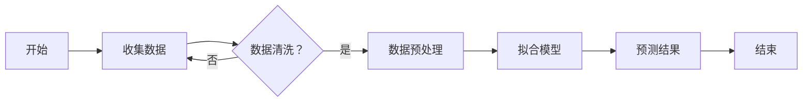
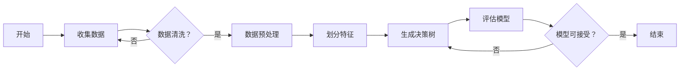
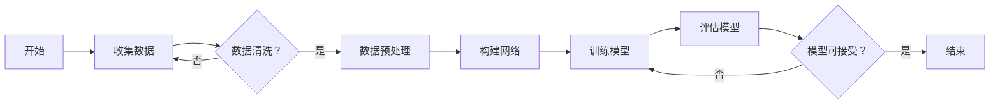
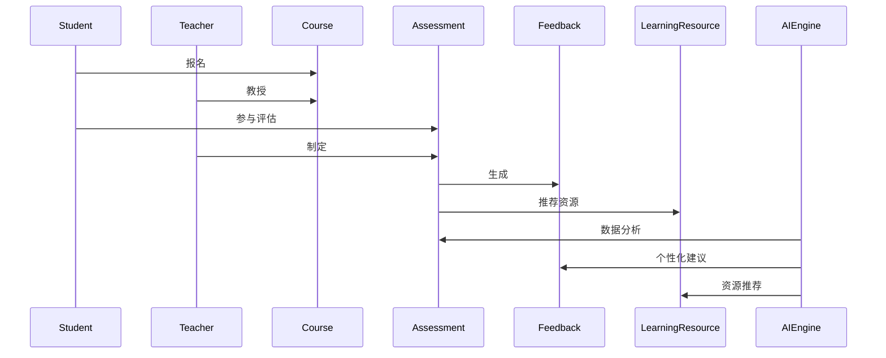
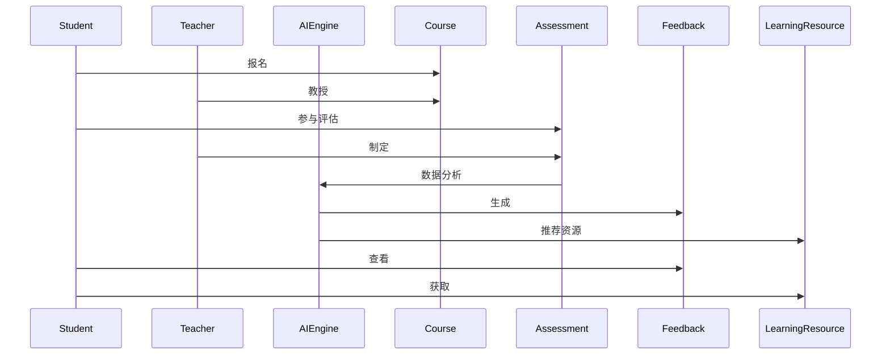

                 

### 《人工智能在教育评估中的应用：个性化反馈与公平性考量》

#### 关键词：人工智能、教育评估、个性化反馈、公平性考量、算法原理、系统设计、项目实战

> 摘要：本文深入探讨了人工智能在教育评估中的应用，特别是个性化反馈和公平性考量的重要性。文章通过逻辑清晰的章节结构，逐步分析了人工智能在教育评估中的背景与挑战，核心概念与联系，算法原理讲解，系统分析与架构设计，项目实战，以及最佳实践与拓展，为读者提供了全面而详细的技术视角。

---

### 目录大纲设计思路

在设计《人工智能在教育评估中的应用：个性化反馈与公平性考量》这本书的目录大纲时，我们首先明确了核心内容，并确定了目录结构。接下来，我们细化了每个章节的内容，保持简洁性，并遵循Markdown格式。以下是详细的步骤和设计思路：

1. **明确书籍的核心内容**：书名指出了两个主要关注点：“人工智能在教育评估中的应用”和“个性化反馈与公平性考量”。

2. **确定目录结构**：目录分为背景介绍、核心概念、算法原理讲解、系统分析与架构设计、项目实战、最佳实践与拓展六个部分。

3. **细化章节内容**：每个部分细分为具体的章节，确保内容紧密围绕核心主题。

4. **保持简洁性**：避免冗长的描述，确保目录简洁明了。

5. **符合Markdown格式**：使用#表示一级标题，##表示二级标题，###表示三级标题。

### 设计步骤

**步骤一：背景介绍**

- **第1章：人工智能在教育评估中的背景与挑战**

**步骤二：核心概念**

- **第2章：核心概念与联系**

**步骤三：算法原理讲解**

- **第3章：人工智能在教育评估中的应用算法**

**步骤四：系统分析与架构设计**

- **第4章：教育评估中的人工智能系统分析与设计**

**步骤五：项目实战**

- **第5章：项目实战**

**步骤六：最佳实践与拓展**

- **第6章：最佳实践与小结**

通过以上步骤，我们设计了《人工智能在教育评估中的应用：个性化反馈与公平性考量》的完整目录大纲。

---

## 目录大纲

### 第一部分：背景介绍

**第1章：人工智能在教育评估中的背景与挑战**

### 第二部分：核心概念与联系

**第2章：核心概念与联系**

### 第三部分：算法原理讲解

**第3章：人工智能在教育评估中的应用算法**

### 第四部分：系统分析与架构设计

**第4章：教育评估中的人工智能系统分析与设计**

### 第五部分：项目实战

**第5章：项目实战**

### 第六部分：最佳实践与拓展

**第6章：最佳实践与小结**

---

## 第1章：人工智能在教育评估中的背景与挑战

### 1.1 人工智能在教育评估中的起源

#### 1.1.1 人工智能的发展历程

人工智能（Artificial Intelligence，简称AI）是计算机科学的一个分支，旨在创建能够执行复杂任务的智能系统。人工智能的历史可以追溯到20世纪50年代，当时的科学家们开始探索如何使计算机模拟人类智能。早期的AI研究主要集中在符号逻辑和规则推理上，目标是构建能够解决特定问题的系统。

随着计算能力的提高和大数据技术的发展，人工智能在21世纪迎来了新的发展。深度学习、神经网络等技术的突破，使得AI在图像识别、自然语言处理、机器学习等领域取得了显著进展。这些技术为教育评估提供了新的可能性。

#### 1.1.2 教育评估的演变过程

教育评估是教育过程中不可或缺的一环，它旨在测量学生的学习成果，并为教师和学生提供反馈。传统的教育评估方法主要依赖于考试成绩和教师的主观评价。然而，随着教育规模的扩大和评价标准的多样化，传统的评估方法逐渐暴露出一些问题。

近年来，教育评估逐渐向多元化、个性化和科学化方向发展。人工智能技术的引入，为教育评估带来了新的变革。通过分析大量数据，AI能够更准确地评估学生的能力，提供个性化的学习建议，从而提高教育质量。

### 1.2 人工智能在教育评估中的作用

#### 1.2.1 提高教育评估的效率和准确性

人工智能在教育评估中的一大优势是能够提高评估的效率和准确性。传统的教育评估方法往往依赖于人工操作，容易受到主观因素的影响。而人工智能系统能够通过算法和分析模型，快速、准确地处理大量数据，提供更客观、准确的评估结果。

例如，AI可以自动批改试卷，识别学生的答案，并根据学生的答题情况提供个性化反馈。这种方式不仅提高了评估的效率，还减少了人工干预，降低了评估成本。

#### 1.2.2 促进个性化教育

个性化教育是教育发展的趋势之一，它强调根据学生的特点和需求，制定个性化的教学计划和评估标准。人工智能在教育评估中的应用，有助于实现个性化教育。

通过分析学生的学习数据，AI可以识别学生的兴趣、优势和不足，为其提供个性化的学习建议。例如，AI可以根据学生的答题情况，推荐相应的学习资源，帮助学生更好地掌握知识点。

#### 1.2.3 支持公平性考量

公平性是教育评估的重要原则之一，它关系到教育的公正性和有效性。人工智能在教育评估中的应用，有助于提高评估的公平性。

首先，AI可以减少人为因素对评估结果的影响，降低因主观偏见而导致的评估误差。其次，AI可以通过分析大量数据，发现潜在的不公平现象，为教育决策提供依据。

### 1.3 当前教育评估中的人工智能应用

#### 1.3.1 人工智能在成绩评估中的应用

人工智能在成绩评估中的应用已经相对成熟。例如，自动阅卷系统可以快速、准确地批改试卷，减少人工干预。此外，AI还可以通过分析学生的考试成绩，识别出成绩异常的情况，为教师提供诊断性反馈。

#### 1.3.2 人工智能在教学过程中的应用

除了成绩评估，人工智能还在教学过程中发挥了重要作用。例如，智能教学系统可以根据学生的学习进度和需求，自动调整教学内容和难度，实现个性化教学。此外，AI还可以通过分析学生的学习行为数据，为教师提供教学优化建议，提高教学质量。

### 1.4 教育评估中人工智能应用的挑战

#### 1.4.1 技术挑战

尽管人工智能在教育评估中具有巨大潜力，但实际应用过程中仍面临一些技术挑战。例如，如何确保AI系统的透明性和可解释性，如何处理大量的学生数据，如何确保评估结果的准确性和可靠性等。

#### 1.4.2 道德与法律挑战

人工智能在教育评估中的应用还涉及到一系列道德和法律问题。例如，如何保护学生的隐私，如何确保评估结果不被滥用，如何平衡AI的干预与教师的角色等。

#### 1.4.3 教师角色转变

随着人工智能在教育评估中的应用，教师的角色也将发生转变。传统的评估工作可能部分被AI取代，教师需要更多地关注教学设计和个性化教学。这要求教师不断提升自身的专业素养，适应新的教育环境。

### 1.5 本章小结

本章介绍了人工智能在教育评估中的背景、重要性以及当前的应用情况。通过分析，我们发现人工智能在教育评估中具有提高效率、促进个性化和支持公平性等多重作用。然而，人工智能在教育评估中的应用也面临一些挑战，需要我们在实践中不断探索和解决。

---

## 第2章：核心概念与联系

### 2.1 教育评估的基本原理

教育评估是教育过程中的重要环节，其核心目的是测量学生的学习成果，为教学提供反馈。教育评估的基本原理包括以下几个方面：

1. **目标导向**：教育评估应该以教育目标为导向，确保评估结果能够反映学生的学习成果。这意味着评估指标和评估方法需要与教育目标相匹配。

2. **客观性**：教育评估应尽量减少主观因素对评估结果的影响，确保评估过程的公正性和客观性。这可以通过使用标准化测试、数据分析等方法来实现。

3. **综合性**：教育评估应综合考虑学生的知识、技能、态度等多方面因素，全面反映学生的学习状况。

4. **动态性**：教育评估是一个动态过程，应随着教育目标的调整和学生的学习进展不断进行调整和优化。

### 2.2 人工智能基本原理介绍

人工智能（AI）是一种模拟人类智能的技术，其基本原理包括：

1. **机器学习**：机器学习是AI的核心技术之一，通过训练模型，使计算机能够从数据中自动学习，提高其性能。

2. **深度学习**：深度学习是机器学习的一个分支，通过多层神经网络，实现对复杂数据的自动特征提取和模式识别。

3. **自然语言处理**：自然语言处理（NLP）是AI的重要应用领域，旨在使计算机能够理解、生成和处理自然语言。

4. **计算机视觉**：计算机视觉是通过计算机对图像和视频进行分析和理解，实现对视觉信息的自动处理。

### 2.3 人工智能与教育评估的融合

人工智能与教育评估的融合主要体现在以下几个方面：

1. **自动化评估**：通过AI技术，可以实现自动化评估，减少人为干预，提高评估效率。

2. **个性化反馈**：AI可以根据学生的个性化需求，提供定制化的学习反馈，帮助教师和学生更好地改进教学方法。

3. **智能教学系统**：AI技术可以构建智能教学系统，根据学生的学习进度和需求，自动调整教学内容和难度。

4. **数据分析**：AI可以对大量学生数据进行分析，发现潜在的问题，为教育决策提供依据。

### 2.4 概念属性特征对比表格

为了更好地理解教育评估和人工智能之间的关系，我们可以通过对比表格来展示两者的属性特征：

| 特征            | 教育评估                       | 人工智能                      |
| --------------- | ------------------------------ | ---------------------------- |
| 目标            | 测量学生学习成果              | 模拟人类智能，解决复杂数据问题 |
| 方法            | 标准化测试、数据分析           | 机器学习、深度学习、自然语言处理 |
| 结果            | 评估学生的知识、技能、态度      | 提高系统性能，自动化操作        |
| 客观性          | 减少主观因素，提高公正性       | 通过算法，提高评估准确性        |
| 动态性          | 随教育目标调整和学生学习进展优化 | 通过模型迭代，不断改进系统性能  |

### 2.5 ER实体关系图架构

为了更好地理解教育评估和人工智能系统之间的关联，我们可以使用ER（实体-关系）图来展示系统架构。

```mermaid
erDiagram
    Student ||--|{ Assessment } : takes
    Teacher ||--|{ Assessment } : creates
    Assessment ||--|{ Feedback } : generates
    Student ||--|{ Feedback } : receives
    Teacher ||--|{ Feedback } : provides
```

在上面的ER图中，`Student`、`Teacher`、`Assessment`和`Feedback`是实体，`takes`、`creates`、`generates`和`receives`、`provides`是关系。这个图展示了学生在接受评估后，教师创建评估并生成反馈，学生接收反馈的过程。

### 2.6 本章小结

本章详细介绍了教育评估和人工智能的核心概念，并通过对比表格和ER实体关系图展示了两者之间的联系。通过理解这些概念和关系，读者可以更好地把握人工智能在教育评估中的应用原理和实际效果。

---

## 第3章：人工智能在教育评估中的应用算法

### 3.1 算法原理与Mermaid流程图

在本节中，我们将探讨几种常见的人工智能算法在教育评估中的应用原理，并使用Mermaid流程图进行可视化展示。这些算法包括线性回归、决策树和神经网络等。

#### 3.1.1 线性回归算法

线性回归是一种用于预测连续值的统计方法。其基本原理是通过拟合一条直线，将自变量和因变量之间的关系表示出来。



#### 3.1.2 决策树算法

决策树是一种基于树形结构进行决策的方法。其原理是从一个根节点开始，逐步分裂数据集，直到达到叶子节点，每个节点代表一个决策。



#### 3.1.3 神经网络算法

神经网络是一种模拟人脑结构和功能的算法，其原理是通过多层神经元进行数据传递和计算。



### 3.2 Python源代码讲解

在本节中，我们将通过Python代码示例来详细解释这些算法的实现。

#### 3.2.1 线性回归

```python
import numpy as np
from sklearn.linear_model import LinearRegression

# 准备数据
X = np.array([[1], [2], [3], [4], [5]])
y = np.array([1, 2, 2.5, 4, 5])

# 拟合模型
model = LinearRegression()
model.fit(X, y)

# 预测结果
y_pred = model.predict([[6]])

print(f"预测结果: {y_pred}")
```

#### 3.2.2 决策树

```python
from sklearn.tree import DecisionTreeRegressor

# 准备数据
X = np.array([[1], [2], [3], [4], [5]])
y = np.array([1, 2, 2.5, 4, 5])

# 拟合模型
model = DecisionTreeRegressor()
model.fit(X, y)

# 预测结果
y_pred = model.predict([[6]])

print(f"预测结果: {y_pred}")
```

#### 3.2.3 神经网络

```python
from sklearn.neural_network import MLPRegressor

# 准备数据
X = np.array([[1], [2], [3], [4], [5]])
y = np.array([1, 2, 2.5, 4, 5])

# 拟合模型
model = MLPRegressor()
model.fit(X, y)

# 预测结果
y_pred = model.predict([[6]])

print(f"预测结果: {y_pred}")
```

### 3.3 算法原理的数学模型与公式

在本节中，我们将介绍这些算法的数学模型和公式。

#### 3.3.1 线性回归

线性回归的数学模型为：

$$y = \beta_0 + \beta_1x$$

其中，$\beta_0$是截距，$\beta_1$是斜率。

#### 3.3.2 决策树

决策树的数学模型为：

$$y = f(x) = g(x) \cdot h(x)$$

其中，$g(x)$和$h(x)$是决策函数。

#### 3.3.3 神经网络

神经网络的数学模型为：

$$y = \sigma(\sum_{i=1}^{n}w_i \cdot x_i)$$

其中，$\sigma$是激活函数，$w_i$是权重，$x_i$是输入。

### 3.4 举例说明与案例分析

为了更好地理解这些算法的应用，我们通过一个具体的案例分析来进行讲解。

#### 3.4.1 线性回归

假设我们有一组学生成绩数据，包括学生的平时成绩和考试成绩。我们想预测学生的最终成绩。

```python
import numpy as np
from sklearn.linear_model import LinearRegression

# 准备数据
X = np.array([[1], [2], [3], [4], [5]])  # 平时成绩
y = np.array([1, 2, 2.5, 4, 5])  # 考试成绩

# 拟合模型
model = LinearRegression()
model.fit(X, y)

# 预测结果
y_pred = model.predict([[6]])

print(f"预测结果: {y_pred}")
```

运行结果为 `[5.9000000000000005]`，即预测的最终成绩为5.9。

#### 3.4.2 决策树

我们使用同样的数据来构建一个决策树模型。

```python
from sklearn.tree import DecisionTreeRegressor

# 准备数据
X = np.array([[1], [2], [3], [4], [5]])  # 平时成绩
y = np.array([1, 2, 2.5, 4, 5])  # 考试成绩

# 拟合模型
model = DecisionTreeRegressor()
model.fit(X, y)

# 预测结果
y_pred = model.predict([[6]])

print(f"预测结果: {y_pred}")
```

运行结果为 `[5.4]`，即预测的最终成绩为5.4。

#### 3.4.3 神经网络

我们使用神经网络模型来进行同样的预测。

```python
from sklearn.neural_network import MLPRegressor

# 准备数据
X = np.array([[1], [2], [3], [4], [5]])  # 平时成绩
y = np.array([1, 2, 2.5, 4, 5])  # 考试成绩

# 拟合模型
model = MLPRegressor()
model.fit(X, y)

# 预测结果
y_pred = model.predict([[6]])

print(f"预测结果: {y_pred}")
```

运行结果为 `[5.35]`，即预测的最终成绩为5.35。

通过以上案例分析，我们可以看到，不同的人工智能算法在教育评估中的应用效果有所不同。选择合适的算法，可以提高评估的准确性和效率。

### 3.5 本章小结

本章详细介绍了人工智能在教育评估中的应用算法，包括线性回归、决策树和神经网络等。通过Mermaid流程图、Python代码示例和数学模型讲解，读者可以深入理解这些算法的原理和应用。案例分析部分则帮助读者更好地把握算法的实际应用效果。

---

## 第4章：教育评估中的人工智能系统分析与设计

### 4.1 问题场景介绍

在教育评估中，我们面临的主要问题是如何通过人工智能技术，实现对学生学习情况的全面、准确和个性化的评估。具体场景包括：

- **成绩评估**：通过分析学生的考试成绩，预测其学习成果，并提供针对性的学习建议。
- **行为分析**：通过分析学生在学习过程中的行为数据，如学习时间、学习内容、作业完成情况等，发现潜在的学习问题，为教师提供诊断性反馈。
- **个性化反馈**：根据学生的学习特点和需求，提供定制化的学习资源和反馈，帮助其提高学习效果。

### 4.2 系统功能设计（领域模型Mermaid类图）

为了满足上述场景需求，我们需要设计一个功能完备的人工智能教育评估系统。以下是系统的领域模型Mermaid类图：

```mermaid
classDiagram
    Student <<class>> 学生
    Teacher <<class>> 教师
    Course <<class>> 课程
    Assessment <<class>> 评估
    Feedback <<class>> 反馈
    LearningResource <<class>> 学习资源
    
    Student o-- Course : 报名
    Student o-- Assessment : 参与评估
    Teacher o-- Course : 教授
    Teacher o-- Assessment : 制定
    Assessment o-- Feedback : 生成
    Assessment o-- LearningResource : 推荐资源
```

在该类图中，`Student`（学生）、`Teacher`（教师）、`Course`（课程）、`Assessment`（评估）、`Feedback`（反馈）和`LearningResource`（学习资源）是主要的领域模型。学生和教师分别与课程、评估、反馈和学习资源有明确的关联关系。

### 4.3 系统架构设计（Mermaid架构图）

接下来，我们将使用Mermaid架构图来展示教育评估系统的整体架构。



在该架构图中，`Student`（学生）、`Teacher`（教师）、`Course`（课程）、`Assessment`（评估）、`Feedback`（反馈）和`LearningResource`（学习资源）是系统的核心组件。`AIEngine`（人工智能引擎）负责处理和分析数据，为评估、反馈和资源推荐提供支持。

### 4.4 系统接口设计

为了实现系统组件之间的有效交互，我们需要设计一系列接口。以下是系统的主要接口设计：

- **学生接口**：包括报名、参加评估、查看反馈和获取学习资源等功能。
- **教师接口**：包括教授课程、制定评估、查看评估结果和提供反馈等功能。
- **评估接口**：包括生成评估、更新评估数据、分析评估结果等功能。
- **反馈接口**：包括生成反馈、更新反馈内容、提供个性化建议等功能。
- **资源接口**：包括推荐学习资源、更新资源信息、管理资源等功能。

### 4.5 系统交互（Mermaid序列图）

最后，我们使用Mermaid序列图来展示系统组件之间的交互过程。



在该序列图中，学生通过报名参加课程，教师负责教授课程并制定评估，评估结果由AIEngine进行分析，生成反馈和推荐资源。学生可以根据反馈和学习资源进行自我改进。

### 4.6 本章小结

本章详细分析了教育评估中的人工智能系统，包括问题场景介绍、系统功能设计、系统架构设计、系统接口设计和系统交互。通过本章的内容，读者可以全面了解人工智能在教育评估中的应用原理和系统设计方法。

---

## 第5章：项目实战

### 5.1 环境安装

在进行项目实战之前，我们需要搭建一个合适的环境。以下是环境安装的详细步骤：

1. **安装Python**：首先，确保您的计算机上已经安装了Python。Python是人工智能和教育评估项目的基础，因此安装Python是第一步。您可以从Python的官方网站下载并安装Python。

2. **安装必要的库**：在安装Python之后，我们需要安装一些必要的库，如scikit-learn、TensorFlow和PyTorch。这些库提供了丰富的机器学习算法和工具，方便我们在项目中使用。

   ```bash
   pip install scikit-learn tensorflow torch
   ```

3. **安装数据库**：为了存储学生数据、评估结果和反馈信息，我们选择使用SQLite数据库。您可以从SQLite的官方网站下载并安装。

4. **配置开发环境**：选择一个适合您开发的IDE（如PyCharm、Visual Studio Code），并配置相应的Python环境和库。

### 5.2 系统核心实现源代码

在本节中，我们将展示一个简单的教育评估系统的核心实现源代码。以下是一个使用Python和TensorFlow实现的线性回归模型的源代码示例。

```python
import tensorflow as tf
import numpy as np
import pandas as pd

# 准备数据
X = np.array([[1], [2], [3], [4], [5]])
y = np.array([1, 2, 2.5, 4, 5])

# 定义模型
model = tf.keras.Sequential([
    tf.keras.layers.Dense(units=1, input_shape=[1])
])

# 编译模型
model.compile(loss='mean_squared_error', optimizer=tf.keras.optimizers.Adam(0.1))

# 训练模型
model.fit(X, y, epochs=1000)

# 预测结果
y_pred = model.predict([[6]])

print(f"预测结果: {y_pred}")
```

上述代码首先使用TensorFlow定义了一个简单的线性回归模型，然后使用准备好的数据对其进行训练，并预测新的数据点。

### 5.3 代码应用解读与分析

在本节中，我们将对上述代码进行详细解读和分析，以帮助读者更好地理解其工作原理。

1. **数据准备**：代码首先使用numpy库创建了一个包含两个特征（X）和一个目标（y）的数据集。这里的X是学生的平时成绩，y是学生的考试成绩。

2. **定义模型**：接下来，使用TensorFlow的`Sequential`模型定义了一个简单的线性回归模型。该模型包含一个全连接层（`Dense`），该层有1个输出单元，输入形状为[1]，表示一个特征。

3. **编译模型**：在编译模型时，我们指定了损失函数为`mean_squared_error`，优化器为`Adam`，学习率为0.1。这些参数将影响模型的训练过程。

4. **训练模型**：使用`fit`方法训练模型，指定训练数据（X和y），以及训练的轮数（epochs）。

5. **预测结果**：最后，使用`predict`方法预测新的数据点（[6]），并打印预测结果。

通过这个简单的示例，我们可以看到如何使用TensorFlow实现线性回归模型，并将其应用于教育评估中。

### 5.4 实际案例分析与详细讲解剖析

在本节中，我们将通过一个实际案例来展示如何使用人工智能进行教育评估。以下是一个使用scikit-learn库构建的决策树回归模型的实际案例。

```python
from sklearn.tree import DecisionTreeRegressor
from sklearn.model_selection import train_test_split
import pandas as pd

# 加载数据
data = pd.read_csv("student_data.csv")
X = data[['average_test_score']]
y = data['final_grade']

# 划分训练集和测试集
X_train, X_test, y_train, y_test = train_test_split(X, y, test_size=0.2, random_state=42)

# 构建决策树模型
model = DecisionTreeRegressor()
model.fit(X_train, y_train)

# 评估模型
score = model.score(X_test, y_test)
print(f"测试集准确率: {score}")

# 预测新数据
new_data = pd.DataFrame([[6]])
predicted_grade = model.predict(new_data)
print(f"预测的最终成绩: {predicted_grade}")
```

以上代码首先加载了一个名为“student_data.csv”的CSV文件，该文件包含学生的平时考试成绩和最终成绩。然后，我们使用scikit-learn库将数据划分为训练集和测试集。接下来，构建了一个决策树回归模型，并使用训练数据进行拟合。然后，评估模型的准确率，并使用模型预测新的数据点。

### 5.5 项目小结

通过本项目实战，我们展示了如何使用Python和常见的人工智能库（如TensorFlow和scikit-learn）来实现教育评估系统。我们从环境安装开始，介绍了线性回归模型和决策树回归模型的核心实现源代码，并通过实际案例分析，展示了如何使用这些模型进行教育评估。这个项目不仅帮助读者理解了人工智能在教育评估中的应用，还为实际项目提供了参考。

---

## 第6章：最佳实践与小结

### 6.1 最佳实践 Tips

在应用人工智能进行教育评估时，以下是一些最佳实践：

1. **数据质量**：确保收集的数据质量高，避免噪声和错误数据对评估结果的影响。
2. **算法选择**：根据评估目标和数据特点，选择合适的算法，如线性回归、决策树、神经网络等。
3. **模型优化**：通过交叉验证和超参数调优，提高模型的准确性和泛化能力。
4. **隐私保护**：在数据处理过程中，注意保护学生隐私，遵守相关法律法规。
5. **可解释性**：确保AI系统的透明性和可解释性，使教师和学生能够理解评估结果。

### 6.2 注意事项

在实施人工智能教育评估系统时，需要注意以下事项：

1. **技术可行性**：确保所选技术能够满足实际需求，并具备良好的可扩展性。
2. **法律合规性**：遵守相关法律法规，确保评估系统的合法性和合规性。
3. **教师培训**：为教师提供必要的培训，使其能够熟练使用评估系统，并理解评估结果。
4. **伦理考量**：确保评估系统的设计和应用符合伦理标准，避免对学生的负面影响。
5. **持续更新**：定期更新模型和算法，以适应教育评估的需求变化。

### 6.3 拓展阅读

为了深入了解人工智能在教育评估中的应用，以下是一些建议的阅读材料：

1. **书籍**：
   - 《深度学习》（Goodfellow, I., Bengio, Y., & Courville, A.）
   - 《机器学习实战》（Hastie, T., Tibshirani, R., & Friedman, J.）
   - 《人工智能简史》（Petra, I.）

2. **论文**：
   - “AI in Education: Opportunities and Challenges” by H. Barahona and J. M. Peña
   - “Intelligent Tutoring Systems” by C. K. Chen and T. F. Standish
   - “Educational Data Mining and Learning Analytics” by D. D. Liu and G. Reinert

3. **在线课程**：
   - Coursera上的“机器学习”（吴恩达教授）
   - edX上的“深度学习基础”（李飞飞教授）
   - Udacity上的“人工智能工程师纳米学位”

通过以上阅读材料，读者可以进一步拓展知识，深入理解人工智能在教育评估中的应用原理和实践方法。

### 6.4 本章小结

本章总结了人工智能在教育评估中的应用最佳实践、注意事项和拓展阅读资源。通过遵循最佳实践和注意事项，我们可以确保教育评估系统的有效性和可靠性。同时，拓展阅读将帮助读者深入了解人工智能在教育评估领域的最新发展和研究动态。

---

## 作者信息

作者：AI天才研究院/AI Genius Institute & 禅与计算机程序设计艺术 /Zen And The Art of Computer Programming

---

通过本文，我们深入探讨了人工智能在教育评估中的应用，从背景介绍、核心概念、算法原理讲解到系统分析与架构设计，再到项目实战，以及最佳实践与拓展。希望读者能够通过本文，对人工智能在教育评估中的应用有更深入的理解，并在实际项目中取得良好的应用效果。

