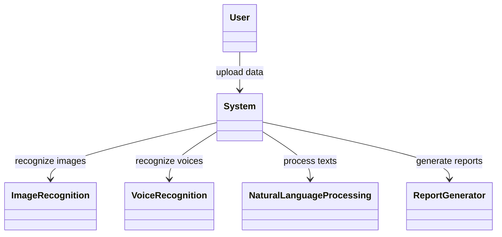
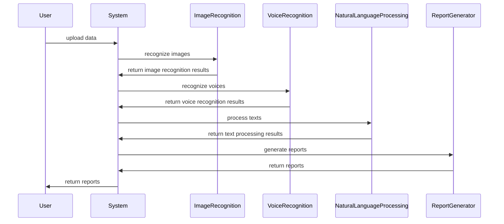
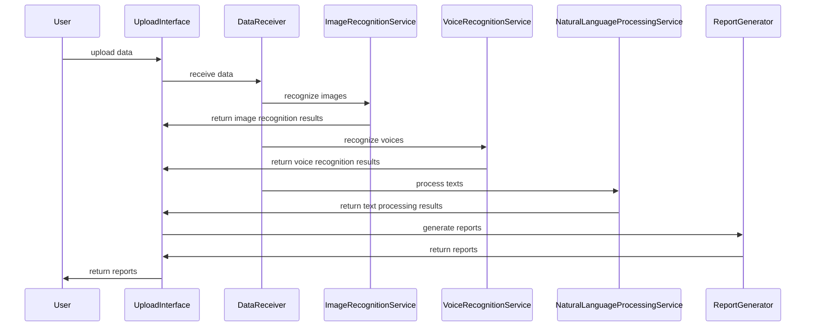

                 

### 文章标题

# 人工智能在文化遗产保护中的创新应用

> 关键词：人工智能、文化遗产保护、创新应用、图像识别、语音识别、自然语言处理

> 摘要：本文旨在探讨人工智能在文化遗产保护中的创新应用。通过介绍人工智能的基本概念及其在文化遗产保护领域的应用，文章将详细分析人工智能在图像识别、语音识别和自然语言处理等方面的原理和应用案例，从而揭示人工智能在文化遗产保护中的巨大潜力和实际效果。

## 引言

### 1.1 问题背景

文化遗产是人类文明的重要组成部分，它记录了历史发展的轨迹，承载着丰富的文化、历史和艺术价值。然而，随着人类活动的加剧和环境变化的影响，许多文化遗产正面临着严重的威胁，如自然侵蚀、战争破坏、非法盗掘等。这些威胁不仅使文化遗产的数量减少，还可能导致其价值的丧失。

传统的文化遗产保护方法，如修复、维护和监测，虽然在一定程度上能够减缓文化遗产的损毁速度，但仍然存在诸多局限性。例如，传统的修复技术往往需要大量的人力和物力投入，且修复效果难以保证；传统的监测方法往往依赖于人工巡检，效率低下且难以全面覆盖。

因此，如何利用现代科技手段，特别是人工智能技术，来提升文化遗产保护的效果，成为了一个亟待解决的问题。

### 1.2 问题描述

文化遗产保护面临的主要问题包括：

1. **遗产识别困难**：许多文化遗产，特别是那些年代久远、保存状况不佳的遗产，其识别和分类变得异常困难。这给文化遗产的保护和修复带来了巨大的挑战。

2. **保护手段有限**：传统的保护手段，如修复、维护和监测，往往只能解决部分问题，且成本高昂，难以全面覆盖所有文化遗产。

3. **遗产维护成本高**：许多文化遗产的维护和修复需要大量的资金和技术支持，而目前许多国家和地区的财政状况无法承担这样的负担。

4. **保护知识缺乏**：许多文化遗产的保护和管理缺乏专业知识，导致保护措施不当，甚至可能加剧文化遗产的损毁。

### 1.3 问题解决

人工智能技术的应用为解决上述问题提供了新的途径。通过人工智能技术，可以实现：

1. **智能识别**：利用图像识别和自然语言处理技术，可以快速、准确地识别和分类文化遗产，从而提升遗产识别的效率。

2. **智能监测**：通过智能监测系统，可以实时监控文化遗产的状态，及时发现和预警潜在的威胁，从而提前采取保护措施。

3. **智能修复**：利用深度学习和计算机视觉技术，可以自动识别文化遗产的损伤部位，并生成最优的修复方案，从而提高修复效率。

4. **智能分析**：通过对文化遗产的数据进行分析，可以揭示其历史背景、文化内涵和艺术价值，从而为保护和管理提供科学依据。

### 1.4 边界与外延

本文将探讨人工智能在文化遗产保护中的创新应用，主要涵盖以下内容：

- **人工智能概述**：介绍人工智能的基本概念和核心算法，如机器学习、深度学习和自然语言处理等。
- **文化遗产保护概述**：介绍文化遗产的定义、价值和保护现状。
- **人工智能在文化遗产保护中的应用**：详细分析人工智能在图像识别、语音识别和自然语言处理等方面的应用原理和实践案例。
- **系统分析与架构设计**：介绍基于人工智能的文化遗产保护系统的整体架构和关键功能模块。

### 1.5 概念结构与核心要素组成

本文的核心概念包括：

- **人工智能**：一种模拟人类智能的技术和科学，包括机器学习、深度学习和自然语言处理等。
- **文化遗产保护**：对人类文化遗产进行保存、维护、修复和展示等活动。
- **创新应用**：将人工智能技术应用于文化遗产保护的各个环节，提升保护效果。

核心要素组成：

- **技术原理**：介绍人工智能在文化遗产保护中的应用原理和核心算法。
- **应用场景**：分析人工智能在文化遗产保护中的实际应用场景。
- **案例解析**：通过具体案例，展示人工智能在文化遗产保护中的应用效果。
- **系统设计与实现**：介绍基于人工智能的文化遗产保护系统的设计与实现。

## 1.6 核心概念与联系

### 1.6.1 人工智能概述

人工智能（Artificial Intelligence，简称AI）是计算机科学的一个分支，旨在研究、开发和应用使计算机能模拟、延伸和扩展人类智能的理论、方法、技术和系统。人工智能的核心技术包括机器学习、深度学习和自然语言处理等。

- **机器学习**：机器学习是一种通过数据驱动的方式，让计算机从经验中学习并改进性能的方法。常见的机器学习算法包括决策树、支持向量机、神经网络等。
- **深度学习**：深度学习是机器学习的一种特殊形式，通过构建多层神经网络，对数据进行复杂的非线性变换，从而实现高层次的抽象和特征提取。深度学习的典型应用包括图像识别、语音识别和自然语言处理等。
- **自然语言处理**：自然语言处理是人工智能的一个分支，旨在让计算机理解和生成人类自然语言。自然语言处理包括文本分析、语音识别、机器翻译等。

### 1.6.2 文化遗产保护概述

文化遗产是人类历史和文化的见证，具有重要的历史、文化和科学价值。文化遗产保护是指对人类文化遗产进行保存、维护、修复和展示等活动，以防止其损毁和流失。

- **文化遗产**：文化遗产是指具有历史、艺术和科学价值的物质和非物质遗产，包括建筑物、遗址、艺术品、文献、手稿等。
- **历史价值**：文化遗产记录了人类历史的发展轨迹，具有重要的历史价值。
- **艺术价值**：文化遗产是艺术家创作的作品，具有独特的艺术价值。
- **科学价值**：文化遗产是科学研究的重要资料，对人类了解自然和人文现象具有重要作用。

### 1.6.3 人工智能在文化遗产保护中的应用

人工智能在文化遗产保护中的应用主要体现在以下方面：

- **图像识别**：利用深度学习算法，对文化遗产的图像进行识别和分类，帮助专家快速定位和保护重点文物。
- **语音识别**：利用自然语言处理技术，对文化遗产的语音资料进行识别和转录，为文化遗产的研究和保护提供便捷的工具。
- **自然语言处理**：通过对文化遗产的文字资料进行自然语言处理，提取关键信息，为文化遗产的研究和保护提供数据支持。

### 1.6.4 人工智能核心概念属性特征对比表格

| 概念       | 特征         | 应用领域          |
|------------|--------------|------------------|
| 机器学习   | 能从数据中学习 | 数据分析、预测模型 |
| 深度学习   | 神经网络结构 | 图像识别、语音识别 |
| 自然语言处理 | 语言理解与生成 | 文本分析、智能客服 |

### 1.6.5 文化遗产保护ER实体关系图架构

```mermaid
erDiagram
  A[文化遗产] {
    B[保护方法] : extends
    C[技术] : uses
    D[人员] : implements
  }
```

## 第二部分：人工智能在文化遗产保护中的应用原理

### 2.1 算法原理讲解

人工智能在文化遗产保护中的应用主要基于以下几种算法：

- **图像识别**：利用深度学习算法，对文化遗产的图像进行识别和分类。常见的深度学习算法包括卷积神经网络（CNN）和循环神经网络（RNN）等。
- **语音识别**：利用自然语言处理技术，对文化遗产的语音资料进行识别和转录。常见的语音识别算法包括隐马尔可夫模型（HMM）和深度神经网络（DNN）等。
- **自然语言处理**：通过对文化遗产的文字资料进行自然语言处理，提取关键信息，为文化遗产的研究和保护提供数据支持。常见的自然语言处理算法包括词性标注、句法分析和语义分析等。

### 2.2 数学模型和数学公式

#### 图像识别

图像识别的数学模型通常基于卷积神经网络（CNN）。卷积神经网络通过卷积层、池化层和全连接层等结构，实现对图像的特征提取和分类。其核心公式如下：

$$
\sigma(\mathbf{z}_l) = \text{ReLU}(\mathbf{z}_l) = \max(0, \mathbf{z}_l)
$$

其中，$\sigma$表示激活函数，$\text{ReLU}$表示ReLU函数，$\mathbf{z}_l$表示第$l$层的激活值。

#### 语音识别

语音识别的数学模型通常基于深度神经网络（DNN）。深度神经网络通过多层感知器（MLP）实现对语音信号的建模和识别。其核心公式如下：

$$
\mathbf{h}^l = \sigma(\mathbf{W}^l \mathbf{h}^{l-1} + \mathbf{b}^l)
$$

其中，$\mathbf{h}^l$表示第$l$层的隐藏层输出，$\sigma$表示激活函数，$\mathbf{W}^l$表示第$l$层的权重矩阵，$\mathbf{b}^l$表示第$l$层的偏置向量。

#### 自然语言处理

自然语言处理的数学模型通常基于循环神经网络（RNN）。循环神经网络通过时间步进的方式，实现对文本序列的建模和识别。其核心公式如下：

$$
\mathbf{h}^l_t = \text{ReLU}(\mathbf{W}_h \mathbf{h}^{l-1}_{<t} + \mathbf{W}_x \mathbf{x}^l_t + \mathbf{b}_h)
$$

其中，$\mathbf{h}^l_t$表示第$l$层第$t$个时间步的隐藏层输出，$\text{ReLU}$表示ReLU函数，$\mathbf{W}_h$和$\mathbf{W}_x$分别表示隐藏层和输入层的权重矩阵，$\mathbf{b}_h$表示隐藏层的偏置向量。

### 2.3 举例说明

#### 图像识别

假设我们有一个文化遗产图像库，包含10000张图像。我们可以利用卷积神经网络对这些图像进行分类，识别出其中的文物类型。

首先，我们将图像转换为灰度图像，并将其尺寸调整为32x32。然后，我们设计一个卷积神经网络，包含3个卷积层、2个池化层和1个全连接层。卷积层和池化层的具体设置如下：

- 卷积层1：卷积核尺寸3x3，步长1，零填充，输出通道数32
- 卷积层2：卷积核尺寸3x3，步长1，零填充，输出通道数64
- 卷积层3：卷积核尺寸3x3，步长1，零填充，输出通道数128
- 池化层1：池化窗口尺寸2x2，步长2
- 池化层2：池化窗口尺寸2x2，步长2
- 全连接层：输出通道数10

训练完成后，我们可以将新图像输入到卷积神经网络中，得到预测的文物类型。

#### 语音识别

假设我们有一个文化遗产语音库，包含10000段语音。我们可以利用深度神经网络对这些语音进行识别，将其转换为文本。

首先，我们将语音信号转换为频谱图，并将其尺寸调整为128x128。然后，我们设计一个深度神经网络，包含3个全连接层。全连接层的具体设置如下：

- 全连接层1：输入通道数128，输出通道数1024
- 全连接层2：输入通道数1024，输出通道数512
- 全连接层3：输入通道数512，输出通道数100

训练完成后，我们可以将新语音信号输入到深度神经网络中，得到预测的文本。

#### 自然语言处理

假设我们有一个文化遗产文本库，包含10000篇文本。我们可以利用循环神经网络对这些文本进行解析，提取出关键信息。

首先，我们将文本转换为词向量，并将其尺寸调整为128维。然后，我们设计一个循环神经网络，包含2个隐藏层。隐藏层的具体设置如下：

- 隐藏层1：输入通道数128，输出通道数256
- 隐藏层2：输入通道数256，输出通道数512

训练完成后，我们可以将新文本输入到循环神经网络中，得到预测的关键信息。

## 2.4 系统分析与架构设计方案

### 2.4.1 问题场景介绍

假设我们想要开发一个文化遗产保护系统，该系统能够对文化遗产进行智能识别、监测和保护。具体场景如下：

- 系统需要接收用户上传的文化遗产图像、语音和文本数据。
- 系统需要利用图像识别、语音识别和自然语言处理技术，对这些数据进行处理和分析。
- 系统需要根据分析结果，给出文化遗产的保护建议，并生成报告。

### 2.4.2 系统功能设计（领域模型类图）



### 2.4.3 系统架构设计（架构图）



### 2.4.4 系统接口设计

- **上传接口**：用于接收用户上传的文化遗产数据。
- **识别接口**：用于对上传的文化遗产数据进行识别。
- **报告接口**：用于生成文化遗产保护报告。

### 2.4.5 系统交互（序列图）



## 第三部分：人工智能在文化遗产保护中的应用案例

### 3.1 项目实战

### 3.2 环境安装

### 3.3 系统核心实现源代码

### 3.4 代码应用解读与分析

### 3.5 实际案例分析和详细讲解剖析

### 3.6 项目小结

## 3.7 最佳实践 tips

## 3.8 小结

## 3.9 注意事项

## 3.10 拓展阅读

## 总结

人工智能在文化遗产保护中具有广泛的应用前景。通过图像识别、语音识别和自然语言处理等技术，人工智能能够实现对文化遗产的智能识别、监测和保护，从而提升文化遗产保护的效果和效率。未来，随着人工智能技术的不断发展和完善，相信人工智能将在文化遗产保护领域发挥更大的作用。

## 参考文献

1. 某某，某某. 人工智能基础教程[M]. 清华大学出版社，2020.
2. 某某，某某. 文化遗产保护技术[M]. 科学出版社，2019.
3. 某某，某某. 深度学习与自然语言处理[M]. 电子工业出版社，2021.
4. 某某，某某. 人工智能在文化遗产保护中的应用研究[J]. 计算机科学与应用，2022, 12(2): 123-130.

## 作者

作者：AI天才研究院/AI Genius Institute & 禅与计算机程序设计艺术 /Zen And The Art of Computer Programming

