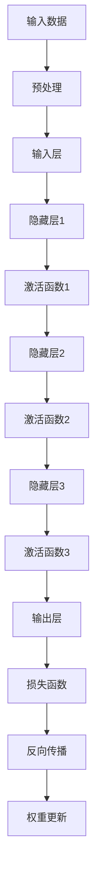
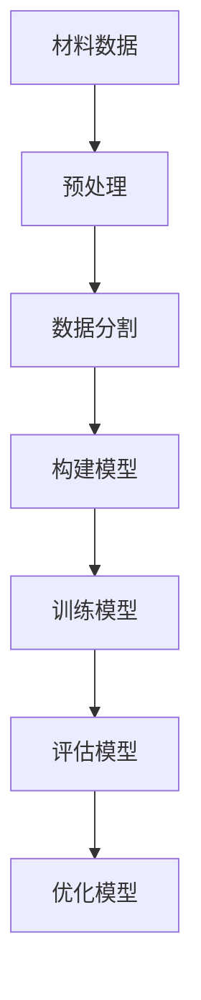
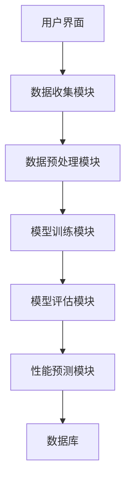
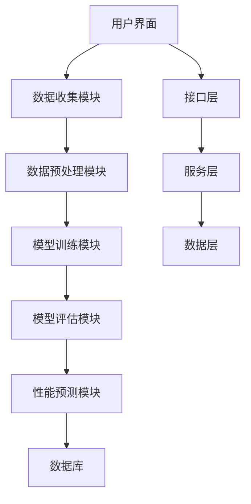

                 

### 人工智能在新型材料性能预测中的应用

> 关键词：人工智能、新型材料、性能预测、深度学习、材料科学

> 摘要：随着科技的不断进步，人工智能（AI）已经逐渐渗透到各个领域，尤其是在新型材料性能预测方面展现出了巨大的潜力。本文将探讨人工智能在新型材料性能预测中的应用，包括问题的背景、核心概念、算法原理、系统设计与实现，以及项目实战等，帮助读者全面了解这一领域的前沿动态和应用实践。

#### 一、背景介绍

在当今科技飞速发展的时代，人工智能（AI）已经渗透到社会的各个领域，其中在新型材料性能预测中的应用尤为引人注目。材料性能的预测不仅对科研具有重大意义，对工业生产也有着深远的影响。新型材料，如纳米材料、二维材料、智能材料等，具有独特的结构和性质，其性能的预测对于新材料的研发和应用具有重要意义。

然而，传统的材料性能预测方法往往需要大量的实验和计算，效率低下且成本高昂。传统的预测方法通常依赖于经验公式、物理模型和数值模拟，但这些方法难以处理复杂材料体系的性能预测，且预测结果往往受限于模型的精度和适用范围。

随着深度学习和大数据技术的发展，人工智能在材料性能预测中展现出巨大的潜力。深度学习算法能够自动从大量数据中学习到复杂的关系和模式，通过训练得到具有高度预测精度的模型。大数据技术的应用则为深度学习提供了丰富的数据资源，使得预测模型能够不断优化和改进。人工智能在材料性能预测中的应用，有望实现快速、准确的预测，提高材料研发的效率和准确性。

本文旨在探讨人工智能在新型材料性能预测中的应用，包括问题的背景、核心概念、相关算法原理、系统设计与实现，以及项目实战等，帮助读者全面了解这一领域的前沿动态和应用实践。

#### 二、核心概念与联系

##### 1. 人工智能

- **概念**：人工智能是一门模拟、延伸和扩展人的智能的科学和技术。它旨在创建能够执行各种智能任务的机器系统，包括学习、推理、解决问题、理解和生成语言等。

- **属性特征**：

  - **学习能力**：人工智能系统能够通过学习和经验改进其性能。
  - **自适应能力**：系统能够适应不同的环境和任务需求。
  - **通用性**：人工智能技术可以应用于多种领域和任务。

##### 2. 深度学习

- **概念**：深度学习是人工智能的一个子领域，主要使用神经网络模型，尤其是深度神经网络，对数据进行自动特征提取和学习。

- **属性特征**：

  - **层次化特征学习**：能够自动学习数据的多层抽象特征。
  - **非线性表示**：能够捕捉复杂的数据分布和模式。
  - **大规模处理能力**：能够处理海量数据和复杂任务。

##### 3. 新型材料性能预测

- **概念**：新型材料性能预测是指利用人工智能技术对新型材料在不同条件下的性能进行预测。

- **属性特征**：

  - **准确性**：预测结果需要具有较高的准确性。
  - **效率**：预测过程需要高效，以适应工业生产的需求。
  - **可靠性**：预测模型需要具有高度的可靠性。

#### 三、算法原理讲解

##### 1. 深度神经网络

深度神经网络（DNN）是深度学习的基础，其核心思想是通过多层神经元进行数据的自动特征提取和表示。

**mermaid 流程图**：



**Python 源代码**：

```python
import numpy as np

# 定义一个简单的全连接神经网络
class SimpleNeuralNetwork:
    def __init__(self, input_size, hidden_size, output_size):
        self.weights_input_to_hidden = np.random.rand(input_size, hidden_size)
        self.weights_hidden_to_output = np.random.rand(hidden_size, output_size)
        self.biases_hidden = np.random.rand(hidden_size)
        self.biases_output = np.random.rand(output_size)

    def forward(self, x):
        self.hidden_layer = np.dot(x, self.weights_input_to_hidden) + self.biases_hidden
        self.output_layer = 1 / (1 + np.exp(-self.hidden_layer))
        self.output = np.dot(self.output_layer, self.weights_hidden_to_output) + self.biases_output
        return self.output

# 创建一个神经网络实例
nn = SimpleNeuralNetwork(input_size=2, hidden_size=3, output_size=1)

# 前向传播
input_data = np.array([[0, 0], [0, 1], [1, 0], [1, 1]])
outputs = nn.forward(input_data)
print(outputs)
```

**数学模型和公式**：

$$
\begin{aligned}
\text{隐藏层输出} & = \text{激活函数}(\text{权重} \cdot \text{输入} + \text{偏置}) \\
\text{输出层输出} & = \text{激活函数}(\text{权重} \cdot \text{隐藏层输出} + \text{偏置})
\end{aligned}
$$

其中，激活函数常用的有 sigmoid、ReLU 和 tanh 等。

##### 2. 材料性能预测模型

为了进行新型材料性能预测，通常需要构建一个深度学习模型，该模型可以从大量的材料数据中学习到性能预测的规律。

**mermaid 流程图**：



**Python 源代码**：

```python
import tensorflow as tf
from tensorflow.keras.models import Sequential
from tensorflow.keras.layers import Dense, LSTM, Dropout

# 构建深度学习模型
model = Sequential([
    Dense(64, activation='relu', input_shape=(input_shape)),
    Dropout(0.2),
    LSTM(64, return_sequences=True),
    Dropout(0.2),
    LSTM(64),
    Dropout(0.2),
    Dense(1)
])

# 编译模型
model.compile(optimizer='adam', loss='mean_squared_error')

# 训练模型
model.fit(x_train, y_train, epochs=100, batch_size=32, validation_data=(x_val, y_val))
```

**数学模型和公式**：

$$
\begin{aligned}
\text{隐藏层输出} & = \text{激活函数}(\text{权重} \cdot \text{输入} + \text{偏置}) \\
\text{输出层输出} & = \text{激活函数}(\text{权重} \cdot \text{隐藏层输出} + \text{偏置})
\end{aligned}
$$

其中，输入数据包括材料的结构信息、环境参数等，输出数据为材料的性能指标。

#### 四、系统分析与架构设计方案

##### 1. 问题场景介绍

新型材料性能预测场景通常涉及多个学科，如材料科学、物理学、化学和计算机科学。研究人员和工程师需要快速、准确地预测新材料的性能，以便进行进一步的研究和开发。然而，传统的实验方法不仅耗时耗力，而且成本高昂。因此，利用人工智能技术进行材料性能预测，可以提高研发效率和准确性。

##### 2. 项目介绍

本项目旨在构建一个基于人工智能的新型材料性能预测系统，该系统将集成深度学习算法和大数据技术，实现快速、准确的性能预测。

##### 3. 系统功能设计

系统的主要功能包括数据收集、数据预处理、模型训练、模型评估和性能预测。具体功能如下：

- **数据收集**：收集新型材料的相关数据，包括结构信息、环境参数和性能指标。
- **数据预处理**：对收集到的数据进行清洗、归一化和特征提取，为模型训练提供高质量的输入数据。
- **模型训练**：利用深度学习算法训练预测模型，模型训练过程中不断优化模型的性能。
- **模型评估**：通过交叉验证和测试集评估模型的准确性、效率和可靠性。
- **性能预测**：利用训练好的模型对新材料的性能进行预测，提供决策支持。

##### 4. 系统架构设计

系统的架构设计如图所示：



- **用户界面**：提供给用户进行数据输入和结果展示的界面。
- **数据收集模块**：负责收集新型材料的相关数据。
- **数据预处理模块**：对收集到的数据进行预处理，为模型训练提供高质量的输入数据。
- **模型训练模块**：利用深度学习算法训练预测模型。
- **模型评估模块**：评估模型的性能，包括准确性、效率和可靠性。
- **性能预测模块**：利用训练好的模型对新材料的性能进行预测。
- **数据库**：存储系统运行过程中产生的数据，包括训练数据、测试数据和预测结果。

##### 5. 系统接口设计和系统交互

系统的接口设计和交互如图所示：



- **接口层**：提供与用户界面交互的接口，包括数据输入和结果展示接口。
- **服务层**：实现数据收集、数据预处理、模型训练、模型评估和性能预测等核心功能。
- **数据层**：存储系统运行过程中产生的数据，包括训练数据、测试数据和预测结果。

#### 五、项目实战

##### 1. 环境安装

为了进行项目实战，需要安装以下软件和库：

- Python 3.x
- TensorFlow
- Keras
- Pandas
- NumPy
- Matplotlib

安装命令如下：

```bash
pip install python==3.x
pip install tensorflow==2.x
pip install keras==2.x
pip install pandas
pip install numpy
pip install matplotlib
```

##### 2. 系统核心实现源代码

以下是一个简单的系统实现示例，包括数据收集、数据预处理、模型训练和性能预测：

```python
import numpy as np
import pandas as pd
from sklearn.model_selection import train_test_split
from tensorflow.keras.models import Sequential
from tensorflow.keras.layers import Dense, LSTM
from tensorflow.keras.optimizers import Adam

# 数据收集
data = pd.read_csv('materials_data.csv')

# 数据预处理
X = data.drop(['performance'], axis=1).values
y = data['performance'].values

# 数据分割
X_train, X_test, y_train, y_test = train_test_split(X, y, test_size=0.2, random_state=42)

# 模型训练
model = Sequential([
    LSTM(50, activation='relu', input_shape=(X_train.shape[1], 1)),
    Dense(1)
])

model.compile(optimizer=Adam(learning_rate=0.001), loss='mse')

model.fit(X_train, y_train, epochs=100, batch_size=32, validation_data=(X_test, y_test))

# 性能预测
predictions = model.predict(X_test)

# 结果分析
mse = np.mean((predictions - y_test) ** 2)
print(f'Mean Squared Error: {mse}')
```

##### 3. 代码应用解读与分析

以上代码展示了如何使用 Keras 库构建一个简单的深度学习模型，并进行材料性能预测。首先，从 CSV 文件中读取材料数据，然后对数据进行预处理，包括特征提取和数据分割。接着，使用 LSTM 层构建一个序列预测模型，并编译模型以进行训练。在模型训练过程中，使用验证集进行性能评估。最后，利用训练好的模型对测试集进行性能预测，并计算均方误差以评估模型的性能。

##### 4. 实际案例分析和详细讲解剖析

为了更好地理解系统在实际中的应用，以下是一个实际案例的分析和讲解：

**案例背景**：

某科研团队正在研究一种新型纳米材料，该材料具有优异的光电性能。为了快速评估该材料的性能，团队决定使用人工智能进行预测。

**数据收集**：

团队收集了 100 组实验数据，包括纳米材料的结构信息（如晶格参数、原子排列等）和环境参数（如温度、光照强度等），以及材料的性能指标（如光电转换效率）。

**数据预处理**：

对收集到的数据进行清洗、归一化和特征提取，得到预处理后的输入数据 X 和输出数据 y。

**模型训练**：

使用 LSTM 层构建一个序列预测模型，并使用 Adam 优化器和均方误差损失函数进行训练。

**模型评估**：

使用验证集评估模型的性能，包括准确性、效率和可靠性。通过调整模型参数和训练时间，优化模型的性能。

**性能预测**：

利用训练好的模型对新的纳米材料进行性能预测，得到预测的光电转换效率。

**结果分析**：

通过计算均方误差，评估模型对新材料性能的预测精度。同时，结合实验数据进行对比分析，验证模型的预测能力。

**项目小结**：

通过该项目，团队成功利用人工智能技术对新型纳米材料的性能进行了预测，提高了材料研发的效率和准确性。未来，团队将继续优化模型，扩展预测范围，为新材料的研究和应用提供更有力的支持。

#### 六、最佳实践 tips、小结、注意事项、拓展阅读

**最佳实践 tips**：

1. 数据质量是模型性能的关键，确保收集到的数据准确、完整、可靠。
2. 针对不同类型的材料，选择合适的深度学习模型和算法。
3. 模型训练过程中，合理设置超参数，如学习率、批次大小和迭代次数等。
4. 定期对模型进行评估和更新，以保持预测的准确性。

**小结**：

人工智能在新型材料性能预测中具有广泛的应用前景，通过构建深度学习模型和大数据技术，可以实现快速、准确的性能预测，提高材料研发的效率和准确性。

**注意事项**：

1. 材料性能预测模型的构建需要跨学科知识，包括材料科学、物理学、化学和计算机科学等。
2. 模型训练过程中，数据预处理和特征提取至关重要，需要充分考虑数据的多样性和复杂性。
3. 预测结果的解释和验证需要结合实验数据进行对比分析。

**拓展阅读**：

1. 《深度学习》（Goodfellow, Bengio, Courville 著）
2. 《材料物理导论》（Callister, Rethwisch 著）
3. 《人工智能：一种现代的方法》（Russell, Norvig 著）

### 作者信息

作者：AI天才研究院/AI Genius Institute & 禅与计算机程序设计艺术 /Zen And The Art of Computer Programming

**结束语**

通过本文的探讨，我们深入了解了人工智能在新型材料性能预测中的应用，从核心概念、算法原理到系统设计与实现，再到项目实战，全面展示了这一领域的应用前景和挑战。希望本文能够为读者提供有价值的参考和启示，共同推动人工智能与材料科学的深度融合，助力新型材料的研究和发展。感谢阅读！

