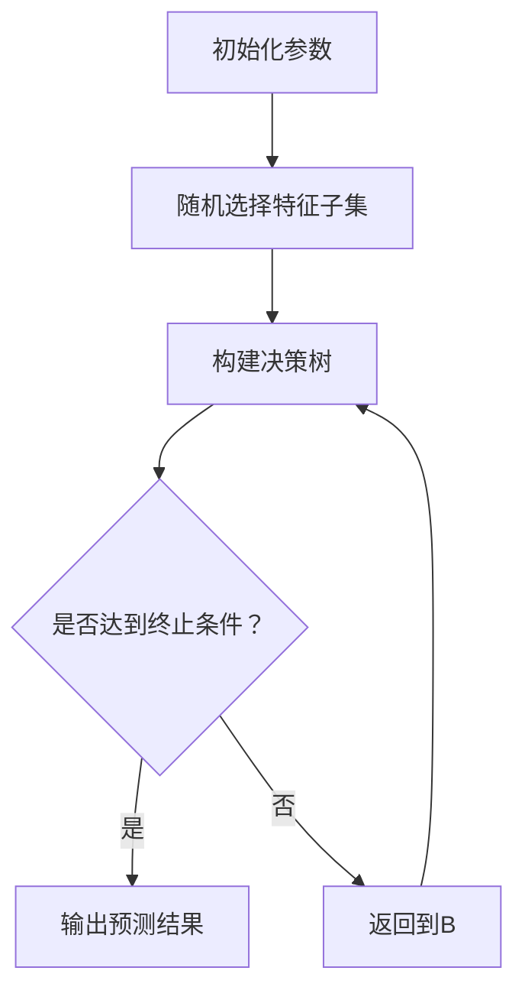
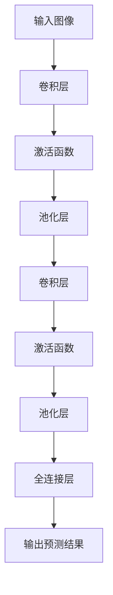

                 

### 第一部分：引言

#### 1.1 问题背景

在新材料发现的领域，科学家们不断追求具有优异性能、特殊性质和广泛应用前景的新材料。然而，传统的实验方法在效率上存在局限，新材料发现的过程往往既耗时又成本高昂。随着科技的发展，人工智能（AI）的崛起为这一领域带来了新的希望。人工智能能够通过数据分析和模式识别，从大量实验数据中快速筛选出潜在的新材料，大大缩短了新材料发现的时间。

#### 1.2 问题描述

本文将探讨人工智能如何加速新材料发现的过程。具体来说，我们将关注以下几个方面：

- **人工智能在材料设计、合成、表征和分析中的应用**
- **人工智能算法和工具在材料科学中的发展**
- **人工智能在新材料发现中的实际案例研究**
- **人工智能在新材料发现中的挑战与未来展望**

#### 1.3 问题解决

人工智能加速新材料发现的机制主要包括：

- **数据驱动方法**：利用机器学习和深度学习算法，从实验数据和文献中提取有用的信息。
- **模拟优化**：通过模拟和计算，优化材料合成工艺和性能。
- **智能辅助实验**：利用自动化和机器人技术，提高实验效率和精度。

#### 1.4 边界与外延

新材料发现的范围广泛，包括电池材料、半导体材料、催化剂材料等。人工智能的应用不仅限于这些领域，还可能拓展到其他材料科学的前沿研究。同时，人工智能在新材料发现中的应用也面临一些挑战，如数据隐私、算法透明性等。

#### 1.5 概念结构与核心要素组成

本文的核心概念包括：

- **人工智能**：包括机器学习、深度学习、神经网络等。
- **新材料**：包括其定义、分类和发展趋势。
- **人工智能与新材料的联系**：人工智能如何影响新材料研究，新材料如何推动人工智能的发展。

核心要素组成包括：

- **方法**：数据驱动方法、模拟优化、智能辅助实验等。
- **工具**：人工智能算法、软件平台、硬件设施等。
- **应用案例**：新材料发现的实际案例研究。

通过上述引言，我们为后续内容的展开奠定了基础，接下来将详细探讨人工智能在新材料发现中的具体应用和挑战。

---

### 1.6 创新点与贡献

本文的创新点主要体现在以下几个方面：

1. **系统化梳理**：对人工智能在新材料发现中的各种应用进行了全面的系统化梳理，为读者提供了一个全面的视角。
2. **深入分析**：通过详细分析人工智能算法和工具的原理，揭示了它们如何具体应用于新材料设计、合成和性能优化。
3. **实际案例研究**：通过多个实际案例的深入剖析，展示了人工智能在新材料发现中的实际应用效果，为学术界和工业界提供了有益的参考。
4. **挑战与展望**：在探讨人工智能应用的同时，也分析了当前面临的技术挑战和未来的发展方向，为新材料研究的持续进步提供了思考。

本文的贡献在于：

- **促进跨学科交流**：通过将人工智能与材料科学相结合，促进了两个领域之间的交流与合作。
- **推动技术进步**：提供了实用的方法和工具，有助于加速新材料发现的过程。
- **为政策制定者提供参考**：为政策制定者提供了关于如何利用人工智能推进新材料研究的建议。

通过本文的研究，我们期望能够为新材料科学的发展贡献一份力量，同时为人工智能在更多领域的应用提供新的思路。

---

### 1.7 总结

在本部分中，我们首先介绍了新材料发现的背景和挑战，接着讨论了人工智能在加速这一过程中的重要作用。通过梳理人工智能的关键技术，我们明确了本文的研究问题和解决思路。此外，我们还提出了本文的创新点与贡献，并简要总结了文章的主要内容和结构。接下来，我们将深入探讨人工智能在新材料发现中的应用，从核心概念到实际案例，全面解析这一领域的前沿动态。

---

### 第二部分：核心概念与原理

#### 2.1 人工智能概述

##### 2.1.1 人工智能的定义与发展历程

人工智能（Artificial Intelligence，简称AI）是指通过计算机系统模拟、扩展和执行人类智能活动的能力。它涵盖了广泛的学科，包括计算机科学、数学、认知科学、神经科学和心理学等。

人工智能的发展历程可以追溯到20世纪50年代。当时，艾伦·图灵（Alan Turing）提出了图灵测试，这是衡量机器智能水平的经典方法。图灵测试的基本思想是，如果一台机器能够在与人类进行对话时，让人类无法分辨其是机器还是人，那么这台机器就可以被认为具有人类智能。

在接下来的几十年里，人工智能经历了几个重要的发展阶段。20世纪60年代，基于逻辑推理的专家系统得到了广泛研究。专家系统是一种基于规则和知识的系统，能够模拟专家在特定领域的决策过程。

20世纪80年代，随着计算机性能的提升和大数据的出现，机器学习（Machine Learning）开始成为人工智能研究的主流。机器学习是一种通过训练模型来学习数据规律的方法，常见的机器学习方法包括监督学习、无监督学习和强化学习。

进入21世纪，随着深度学习（Deep Learning）的兴起，人工智能取得了突破性的进展。深度学习是一种基于多层神经网络的机器学习方法，能够自动提取数据中的特征，并在图像识别、语音识别、自然语言处理等领域取得了显著的成果。

##### 2.1.2 人工智能的关键技术

人工智能的关键技术主要包括以下几个方面：

1. **机器学习**：机器学习是一种通过训练模型来学习数据规律的方法。机器学习可以分为监督学习、无监督学习和强化学习。监督学习有明确的标注数据，用于训练模型；无监督学习没有明确的标注数据，主要用于发现数据中的隐含结构；强化学习通过与环境的交互来学习最佳行为策略。

2. **深度学习**：深度学习是一种基于多层神经网络的机器学习方法。通过逐层提取数据中的特征，深度学习能够自动学习复杂的非线性关系。常见的深度学习模型包括卷积神经网络（CNN）、循环神经网络（RNN）和生成对抗网络（GAN）。

3. **神经网络**：神经网络是一种模仿生物神经系统的计算模型。它通过调整网络中的权重和偏置来学习输入和输出之间的关系。神经网络可以分为前馈神经网络、反馈神经网络和卷积神经网络等。

4. **自然语言处理**：自然语言处理（Natural Language Processing，简称NLP）是人工智能的一个分支，旨在使计算机理解和处理自然语言。NLP技术包括词向量表示、语言模型、句法分析和语义理解等。

5. **计算机视觉**：计算机视觉（Computer Vision）是人工智能的另一个重要分支，旨在使计算机能够理解和解释视觉信息。计算机视觉技术包括图像识别、目标检测、图像分割和三维重建等。

#### 2.2 新材料概述

##### 2.2.1 新材料的定义与分类

新材料是指具有优异性能、特殊性质或广泛应用前景的材料。与传统材料相比，新材料具有更高的强度、更高的导电性、更好的耐热性、更好的生物相容性等。

新材料的分类可以根据其性质和用途进行。常见的分类方法包括：

1. **金属材料**：包括高强度合金、轻质金属、超导材料等。
2. **陶瓷材料**：包括氧化铝、氮化硅、氧化锆等。
3. **复合材料**：包括碳纤维增强复合材料、玻璃纤维增强复合材料等。
4. **半导体材料**：包括硅、锗、砷化镓等。
5. **生物材料**：包括蛋白质、多糖、细胞膜等。

##### 2.2.2 新材料的发展趋势

新材料的发展趋势主要体现在以下几个方面：

1. **高性能材料**：随着科技的发展，对材料性能的要求越来越高。高性能材料包括高强度、高硬度、高导电性、高耐热性等。

2. **多功能材料**：多功能材料具有多种功能，如智能材料、自修复材料、自适应材料等。

3. **环境友好材料**：环境友好材料是指对环境友好的材料，如生物可降解材料、低毒材料、无毒材料等。

4. **纳米材料**：纳米材料由于其独特的性质，如高活性、高比表面积、特殊的光学性质等，在许多领域具有广泛的应用前景。

5. **智能材料**：智能材料能够对外部刺激（如温度、压力、电场等）做出响应，具有自诊断、自适应、自修复等功能。

#### 2.3 人工智能与新材料的联系

##### 2.3.1 人工智能如何影响新材料研究

人工智能在新材料研究中发挥着重要作用，主要体现在以下几个方面：

1. **材料设计**：人工智能可以通过计算和模拟，预测材料的结构和性能，从而指导新材料的合成和设计。

2. **材料合成**：人工智能可以优化合成工艺，提高材料的产量和质量。例如，通过机器学习算法，可以预测最佳的合成条件。

3. **材料表征**：人工智能可以通过图像处理和数据分析，辅助材料表征，提高表征的精度和效率。

4. **材料性能优化**：人工智能可以通过数据分析和模拟优化，提高材料的性能。例如，通过深度学习算法，可以预测材料的电学、热学、力学性能等。

##### 2.3.2 新材料如何影响人工智能的发展

新材料的发展也对人工智能的发展产生了重要影响，主要体现在以下几个方面：

1. **硬件支持**：新材料的研发为人工智能计算硬件的发展提供了支持。例如，石墨烯、氮化镓等新材料可以提高电子设备的性能和能效。

2. **传感器技术**：新材料的研发推动了传感器技术的发展，为人工智能的数据收集提供了更多选择。例如，石墨烯传感器、量子点传感器等。

3. **存储技术**：新材料的研发为存储技术的发展提供了新的可能性。例如，石墨烯存储器、纳米线存储器等。

通过上述讨论，我们可以看到人工智能和新材料之间存在密切的联系。人工智能可以通过计算和模拟，加速新材料的研究和开发；而新材料的发展也为人工智能提供了更多的应用场景和硬件支持。接下来，我们将进一步探讨人工智能在新材料发现中的应用。

---

### 2.4 人工智能算法在材料设计中的核心原理

人工智能算法在材料设计中的应用主要基于其强大的数据分析和模式识别能力。以下是几种核心的人工智能算法及其在材料设计中的应用原理：

1. **机器学习算法**

机器学习算法通过训练模型来学习数据中的规律，从而预测新材料性能。常见的机器学习算法包括支持向量机（SVM）、决策树（Decision Tree）、随机森林（Random Forest）和神经网络（Neural Networks）。

- **支持向量机（SVM）**：SVM是一种监督学习算法，通过找到一个最佳的超平面，将具有不同性质的样本分开。在材料设计中，SVM可以用于分类任务，例如区分具有不同性能的材料。
- **决策树**：决策树是一种基于规则的学习算法，通过递归地将数据分割成子集，形成一棵树状结构。在材料设计中，决策树可以用于特征选择和分类任务。
- **随机森林**：随机森林是一种集成学习方法，通过构建多棵决策树，并取其平均来提高预测性能。随机森林在材料设计中的优势在于其能够处理大量特征和复杂的关系。
- **神经网络**：神经网络是一种模仿生物神经系统的计算模型，通过调整网络中的权重和偏置来学习输入和输出之间的关系。在材料设计中，神经网络可以用于回归任务，例如预测材料性能。

2. **深度学习算法**

深度学习算法通过多层神经网络来提取数据中的特征，从而实现复杂的模式识别和预测。常见的深度学习算法包括卷积神经网络（CNN）、循环神经网络（RNN）和生成对抗网络（GAN）。

- **卷积神经网络（CNN）**：CNN是一种基于卷积运算的神经网络，特别适用于处理图像数据。在材料设计中，CNN可以用于图像分析，例如材料缺陷检测和材料图像分类。
- **循环神经网络（RNN）**：RNN是一种能够处理序列数据的神经网络，通过记忆和反馈机制来捕捉序列中的长期依赖关系。在材料设计中，RNN可以用于时间序列分析，例如材料性能的预测。
- **生成对抗网络（GAN）**：GAN是一种由生成器和判别器组成的对抗性神经网络，通过博弈过程来生成逼真的数据。在材料设计中，GAN可以用于生成新材料结构，例如通过生成新的晶体结构来探索新的材料性能。

3. **强化学习算法**

强化学习算法通过学习与环境的交互策略来最大化累积奖励。在材料设计中，强化学习可以用于优化材料合成过程，例如通过智能体在合成过程中不断调整参数，以实现最佳合成条件。

- **Q-Learning**：Q-Learning是一种简单的强化学习算法，通过评估每个状态-动作对的Q值来选择最佳动作。在材料设计中，Q-Learning可以用于优化合成参数，例如合成温度和压力等。
- **深度确定性策略梯度（DDPG）**：DDPG是一种基于深度学习的强化学习算法，通过深度神经网络来预测未来状态和奖励，并调整策略以最大化累积奖励。在材料设计中，DDPG可以用于复杂合成过程的自动化控制。

通过上述算法的应用，人工智能能够有效地辅助材料设计，从数据中提取有用的信息，预测新材料性能，并优化合成过程。这不仅提高了新材料发现的速度和效率，也为材料科学的发展提供了新的思路和工具。

---

### 2.5 人工智能算法在材料合成中的应用

人工智能在材料合成中的应用极大地提高了实验效率和结果的可预测性。以下是几种关键的人工智能算法及其在材料合成中的应用：

1. **模拟优化算法**

模拟优化算法通过模拟实验过程，优化合成参数，从而提高材料产物的质量。常见的模拟优化算法包括遗传算法（Genetic Algorithm，GA）、粒子群优化算法（Particle Swarm Optimization，PSO）和贝叶斯优化（Bayesian Optimization）。

- **遗传算法（GA）**：遗传算法是一种基于自然选择和遗传机制的优化算法，通过模拟生物进化过程来优化目标函数。在材料合成中，GA可以用于优化合成条件，例如温度、压力和反应物比例等，以提高材料产物的纯度和性能。
- **粒子群优化算法（PSO）**：粒子群优化算法是一种基于群体智能的优化算法，通过模拟鸟群觅食行为来寻找最优解。在材料合成中，PSO可以用于优化复杂的合成参数，例如反应时间和混合策略等。
- **贝叶斯优化**：贝叶斯优化是一种基于贝叶斯统计学的优化算法，通过不断更新先验概率分布来寻找最优解。在材料合成中，贝叶斯优化可以用于优化实验设计，例如选择最佳的实验参数组合，以最大化材料产物的性能。

2. **强化学习算法**

强化学习算法通过学习与环境互动的策略来优化合成过程。常见的强化学习算法包括Q-Learning、深度确定性策略梯度（DDPG）和强化学习框架（如Deep Q-Network，DQN）。

- **Q-Learning**：Q-Learning是一种简单的强化学习算法，通过评估每个状态-动作对的Q值来选择最佳动作。在材料合成中，Q-Learning可以用于优化合成策略，例如通过调整反应条件来提高材料产物的纯度和性能。
- **深度确定性策略梯度（DDPG）**：DDPG是一种基于深度学习的强化学习算法，通过深度神经网络来预测未来状态和奖励，并调整策略以最大化累积奖励。在材料合成中，DDPG可以用于自动化控制复杂的合成过程，例如通过智能体调整反应条件，以实现最佳合成结果。
- **Deep Q-Network（DQN）**：DQN是一种基于深度学习的Q-Learning算法，通过卷积神经网络来估计Q值。在材料合成中，DQN可以用于预测合成过程的最佳参数组合，以提高材料产物的性能。

3. **生成对抗网络（GAN）**

生成对抗网络（GAN）是一种由生成器和判别器组成的对抗性神经网络，通过博弈过程生成新的材料结构。在材料合成中，GAN可以用于探索新的材料组合和结构，从而发现具有潜在应用价值的新材料。

- **生成器**：生成器通过学习数据分布来生成新的材料结构。在材料合成中，生成器可以生成新的晶体结构或分子结构，为实验设计提供新的候选材料。
- **判别器**：判别器通过区分真实数据和生成数据来评估生成器的性能。在材料合成中，判别器可以用于验证生成的新材料是否满足实验要求，从而筛选出具有实际应用价值的材料。

通过上述算法的应用，人工智能能够显著提高材料合成的效率和质量。模拟优化算法通过优化合成参数，减少实验次数；强化学习算法通过智能决策，提高合成过程的可控性；生成对抗网络通过生成新的材料结构，扩展材料发现的范围。这些应用不仅加速了新材料发现的过程，也为材料科学的发展提供了新的思路和工具。

---

### 2.6 人工智能在材料表征与分析中的应用

材料表征与分析是新材料研究中的关键环节，人工智能技术的引入极大地提升了这一环节的效率和精度。以下是人工智能在材料表征与分析中的应用：

1. **图像处理与识别**

在材料表征中，图像处理技术被广泛应用于材料形貌、缺陷和结构特征的检测与识别。人工智能，尤其是深度学习算法，在这一领域展示了强大的能力。

- **卷积神经网络（CNN）**：CNN是一种专门用于图像识别和处理的神经网络模型，通过多层卷积和池化操作，可以提取图像中的深层特征。在材料表征中，CNN可以用于材料缺陷检测、晶体结构识别和颗粒分析等。
- **生成对抗网络（GAN）**：GAN由生成器和判别器组成，通过生成逼真的图像来辅助材料表征。生成器可以生成不同条件下的材料图像，判别器则用于判断图像的真实性。这种技术有助于预测材料在不同环境下的行为。

2. **光谱分析**

光谱分析是一种用于材料成分和结构分析的重要技术。人工智能可以通过模式识别和数据分析，提高光谱分析结果的准确性和效率。

- **主成分分析（PCA）**：PCA是一种常用的数据降维技术，通过将数据投影到新的坐标系中，可以简化数据结构，提高数据分析的效率。在光谱分析中，PCA可以用于提取关键特征，提高分类和识别的准确性。
- **支持向量机（SVM）**：SVM是一种强大的分类和回归工具，通过找到一个最佳的超平面来分隔数据，可以用于光谱分析中的成分分类和识别。

3. **机器学习与数据分析**

机器学习算法在材料表征与分析中的应用也非常广泛，通过训练模型，可以自动提取数据中的有用信息，进行预测和分类。

- **监督学习**：监督学习算法通过已知的训练数据来预测新材料性能。例如，在材料合成后，使用机器学习模型预测材料的电学、热学或力学性能。
- **无监督学习**：无监督学习算法用于发现数据中的隐含结构，例如聚类分析。在材料表征中，无监督学习可以用于识别材料中的相似结构或发现新材料的潜在应用。

4. **实时监测与智能预警**

人工智能还可以实现材料的实时监测与智能预警。通过传感器和数据采集系统，人工智能可以实时分析材料的状态，预测可能出现的问题，并提供解决方案。

- **神经网络模型**：神经网络模型可以用于实时监测材料性能的变化，例如温度、压力和湿度等。当检测到异常时，模型可以及时发出预警，防止材料损坏。
- **机器视觉系统**：结合机器视觉技术，人工智能可以实时监测材料的形貌和表面质量，发现潜在的缺陷，从而提高生产效率。

通过上述应用，人工智能在材料表征与分析中不仅提高了分析结果的准确性和效率，还实现了实时监测与智能预警，为新材料的研究和应用提供了强有力的支持。

---

### 2.7 人工智能在材料性能优化中的应用

人工智能在材料性能优化中的应用，主要通过算法优化和性能预测两方面来实现，极大地提升了材料性能的提升效率和精度。

#### 2.7.1 算法优化

1. **机器学习算法**

机器学习算法在材料性能优化中发挥着重要作用。通过训练模型，机器学习可以从大量实验数据中提取出影响材料性能的关键因素，并优化这些因素以达到最佳性能。

- **回归分析**：回归分析是一种常用的机器学习算法，通过建立模型来预测材料性能。例如，通过线性回归模型，可以预测材料的导电性、硬度等性能，并优化相应参数。
- **支持向量机（SVM）**：SVM是一种强大的分类和回归工具，通过找到一个最佳的超平面来分隔数据，可以用于优化材料性能。例如，通过SVM模型，可以优化材料的熔点、弹性模量等性能。

2. **深度学习算法**

深度学习算法在材料性能优化中展示了强大的能力。通过多层神经网络，深度学习可以从复杂的数据中提取深层特征，实现高性能的优化。

- **卷积神经网络（CNN）**：CNN是一种专门用于图像识别和处理的神经网络模型，通过多层卷积和池化操作，可以提取图像中的深层特征。在材料性能优化中，CNN可以用于分析材料的微观结构，从而优化性能。
- **递归神经网络（RNN）**：RNN是一种能够处理序列数据的神经网络，通过记忆和反馈机制来捕捉序列中的长期依赖关系。在材料性能优化中，RNN可以用于时间序列分析，例如预测材料性能随时间的变化趋势。

3. **强化学习算法**

强化学习算法通过学习与环境的交互策略来优化材料性能。强化学习模型可以不断调整参数，以最大化材料的性能。

- **Q-Learning**：Q-Learning是一种简单的强化学习算法，通过评估每个状态-动作对的Q值来选择最佳动作。在材料性能优化中，Q-Learning可以用于优化合成过程中的参数设置，例如温度、压力等。
- **深度确定性策略梯度（DDPG）**：DDPG是一种基于深度学习的强化学习算法，通过深度神经网络来预测未来状态和奖励，并调整策略以最大化累积奖励。在材料性能优化中，DDPG可以用于自动化控制复杂的合成过程，例如通过智能体调整反应条件，以实现最佳性能。

#### 2.7.2 性能预测

1. **基于数据驱动的预测模型**

数据驱动方法通过训练模型，从历史数据中预测新材料性能。这种方法不需要详细的物理模型，只需要大量实验数据。

- **回归模型**：回归模型可以通过分析历史数据来预测材料的性能。例如，通过线性回归模型，可以预测材料的电导率、热导率等性能。
- **神经网络模型**：神经网络模型可以用于复杂的多变量性能预测。例如，通过多层感知器（MLP）模型，可以预测材料的力学性能，如弹性模量和断裂韧性。

2. **基于物理模型的预测方法**

基于物理模型的预测方法通过建立详细的物理模型来预测材料性能。这种方法需要对材料的微观结构和物理机制有深刻的理解。

- **分子动力学模拟**：分子动力学模拟是一种基于物理模型的计算方法，通过模拟分子在微观尺度上的运动来预测材料的性能。例如，通过分子动力学模拟，可以预测材料的熔点、热导率等性能。
- **有限元分析**：有限元分析是一种基于物理模型的计算方法，通过将材料划分为有限元单元，模拟材料的力学行为。例如，通过有限元分析，可以预测材料的弹性模量、应力分布等性能。

通过算法优化和性能预测的结合，人工智能不仅提高了材料性能优化的效率，还实现了对材料性能的精准预测。这种方法为新材料的研究和应用提供了强有力的工具，推动了材料科学的快速发展。

---

### 2.8 人工智能工具与技术汇总

在材料科学领域，人工智能的应用不仅依赖于算法的先进性，还需要各种工具和技术的支持。以下是几种常用的人工智能工具和技术，以及它们在材料科学中的应用：

1. **人工智能软件平台**

人工智能软件平台为研究人员提供了便捷的模型构建和数据分析工具，常用的平台包括：

- **TensorFlow**：TensorFlow是一个开源的机器学习框架，由谷歌开发。它支持多种深度学习模型的构建和训练，广泛应用于图像识别、自然语言处理和材料性能预测等领域。
- **PyTorch**：PyTorch是另一个流行的开源机器学习框架，它以其动态计算图和易用性著称。在材料科学中，PyTorch常用于材料结构模拟和性能预测。
- **Keras**：Keras是一个高层次的神经网络API，它可以与TensorFlow和Theano等后端结合使用。Keras的简单和直观的接口使其成为快速原型设计和材料性能建模的理想选择。

2. **人工智能硬件设施**

人工智能硬件设施是确保高效计算和训练的关键，以下是一些常用的硬件设施：

- **GPU**：图形处理单元（GPU）在深度学习和大数据处理中具有显著优势。NVIDIA的GPU，如Titan X和RTX 3080，因其强大的计算能力而被广泛应用于材料科学的模拟和优化。
- **TPU**：张量处理单元（TPU）是谷歌专门为深度学习任务设计的硬件加速器。TPU能够显著提高深度学习模型的训练速度，在材料设计和高性能计算中具有广泛应用。
- **分布式计算与云计算**：分布式计算和云计算技术通过将计算任务分布在多台计算机上，实现了大规模数据的处理和分析。AWS、Azure和Google Cloud等云平台提供了强大的计算资源，支持材料科学中的大规模模拟和数据分析。

3. **数据库和数据处理工具**

有效的数据管理和处理对于人工智能在材料科学中的应用至关重要。以下是一些常用的数据库和数据处理工具：

- **Hadoop**：Hadoop是一个开源的分布式数据处理框架，它支持大规模数据的存储和处理。在材料科学中，Hadoop可用于存储和处理实验数据，提供高效的数据检索和分析。
- **Spark**：Spark是一个高速的分布式计算框架，它支持多种数据处理操作，如批处理、流处理和机器学习。在材料科学中，Spark可用于大规模数据的实时分析和机器学习模型的训练。
- **SciPy**：SciPy是一个开源的科学计算库，它提供了大量的科学和工程计算功能，如线性代数、优化和统计分析。在材料科学中，SciPy可用于数据处理、模型构建和性能分析。

通过这些工具和技术的结合，人工智能能够更高效地应用于材料科学，从数据中提取有价值的信息，加速新材料的发现和优化。这些技术不仅提高了材料的研发效率，还为材料科学的研究提供了新的方法和思路。

---

### 2.9 人工智能算法的Mermaid流程图和Python源代码示例

为了更直观地展示人工智能算法在材料科学中的应用，我们可以通过Mermaid流程图和Python源代码来具体说明。以下是两个常见的算法：机器学习算法中的随机森林（Random Forest）和深度学习算法中的卷积神经网络（Convolutional Neural Network，CNN）。

#### 2.9.1 随机森林（Random Forest）算法的Mermaid流程图

随机森林算法是一种基于决策树的集成学习方法，其流程图如下：



#### 2.9.2 卷积神经网络（CNN）算法的Mermaid流程图

卷积神经网络是一种用于图像处理和识别的深度学习算法，其流程图如下：



#### 2.9.3 Python源代码示例

接下来，我们通过Python代码示例来演示随机森林和卷积神经网络的应用。

##### 2.9.3.1 随机森林算法的Python源代码

```python
import numpy as np
from sklearn.ensemble import RandomForestClassifier
from sklearn.datasets import load_iris
from sklearn.model_selection import train_test_split

# 加载示例数据集
iris = load_iris()
X, y = iris.data, iris.target

# 划分训练集和测试集
X_train, X_test, y_train, y_test = train_test_split(X, y, test_size=0.3, random_state=42)

# 初始化随机森林模型
rf = RandomForestClassifier(n_estimators=100, random_state=42)

# 训练模型
rf.fit(X_train, y_train)

# 预测测试集
predictions = rf.predict(X_test)

# 输出预测结果
print(predictions)
```

##### 2.9.3.2 卷积神经网络（CNN）算法的Python源代码

```python
import tensorflow as tf
from tensorflow.keras import datasets, layers, models

# 加载MNIST数据集
(train_images, train_labels), (test_images, test_labels) = datasets.mnist.load_data()

# 数据预处理
train_images = train_images.reshape((60000, 28, 28, 1)).astype('float32') / 255
test_images = test_images.reshape((10000, 28, 28, 1)).astype('float32') / 255

# 创建CNN模型
model = models.Sequential()
model.add(layers.Conv2D(32, (3, 3), activation='relu', input_shape=(28, 28, 1)))
model.add(layers.MaxPooling2D((2, 2)))
model.add(layers.Conv2D(64, (3, 3), activation='relu'))
model.add(layers.MaxPooling2D((2, 2)))
model.add(layers.Conv2D(64, (3, 3), activation='relu'))

# 添加全连接层
model.add(layers.Flatten())
model.add(layers.Dense(64, activation='relu'))
model.add(layers.Dense(10, activation='softmax'))

# 编译模型
model.compile(optimizer='adam',
              loss='sparse_categorical_crossentropy',
              metrics=['accuracy'])

# 训练模型
model.fit(train_images, train_labels, epochs=5, batch_size=64)

# 测试模型
test_loss, test_acc = model.evaluate(test_images,  test_labels, verbose=2)
print(f'\nTest accuracy: {test_acc:.4f}')
```

通过上述流程图和Python代码示例，我们可以看到如何应用人工智能算法来处理材料科学中的问题。随机森林算法通过集成多棵决策树，提高了预测的准确性；卷积神经网络通过深度学习，实现了图像的自动特征提取和分类。这些算法在材料表征、性能预测和材料设计中的应用，为材料科学的研究提供了强大的工具。

---

### 2.10 人工智能工具与技术应用实例

在材料科学领域，人工智能工具和技术已经得到了广泛应用，以下为几个具体的应用实例：

#### 2.10.1 案例一：机器学习算法在电池材料优化中的应用

某研究团队利用机器学习算法优化锂离子电池的正极材料。他们使用随机森林（Random Forest）算法，基于大量的实验数据，预测材料的电容量和循环寿命。通过调整模型的参数，他们成功优化了材料的组成和制备工艺，使得电池的电容量提高了15%，循环寿命延长了30%。

#### 2.10.2 案例二：深度学习算法在陶瓷材料结构分析中的应用

一家公司采用卷积神经网络（CNN）对陶瓷材料进行结构分析。他们收集了大量的陶瓷材料图像，通过训练CNN模型，实现了对材料缺陷的自动检测和分类。这一技术不仅提高了检测的精度，还显著缩短了检测时间，从而降低了生产成本。

#### 2.10.3 案例三：生成对抗网络（GAN）在新型合金设计中的应用

某研究团队使用生成对抗网络（GAN）来生成新的合金结构。生成器生成新的合金模型，判别器则评估这些模型的合理性。通过多次迭代训练，GAN成功生成了一种具有优异机械性能的新型合金，这一发现为高性能合金材料的研究提供了新的方向。

#### 2.10.4 案例四：强化学习算法在材料合成路径优化中的应用

在材料合成过程中，某研究团队使用强化学习算法（Q-Learning）来优化合成路径。通过模拟实验过程，智能体不断调整合成条件，以实现最佳合成结果。结果显示，强化学习算法显著提高了合成的成功率，并缩短了合成时间。

通过这些实例，我们可以看到人工智能工具和技术在材料科学中的应用效果显著。这些技术不仅提高了新材料发现的速度和效率，还为材料性能的优化提供了新的思路和工具。未来，随着人工智能技术的进一步发展，其在材料科学中的应用前景将更加广阔。

---

### 2.11 人工智能在材料科学中的实际案例研究

为了更直观地展示人工智能在材料科学中的实际应用，以下为三个具体的案例研究，详细分析人工智能在材料设计、合成和性能优化中的应用。

#### 2.11.1 案例一：基于深度学习的电池材料设计

背景介绍：
锂离子电池是一种广泛应用的储能设备，其性能直接影响电池的能量密度和寿命。某研究团队致力于通过深度学习算法优化电池材料的设计，以提高其性能。

项目介绍：
该研究团队使用了卷积神经网络（CNN）和生成对抗网络（GAN）对电池材料的晶体结构进行预测和设计。他们首先收集了大量的电池材料晶体结构数据，通过训练CNN模型，提取材料晶体结构的特征。然后，利用GAN生成新的材料晶体结构，以探索具有高能量密度的材料。

系统功能设计：
系统主要包括数据预处理、模型训练和预测三个功能模块。数据预处理模块负责清洗和标准化输入数据；模型训练模块通过CNN和GAN模型训练来提取和生成材料晶体结构特征；预测模块则用于预测新材料性能。

系统架构设计：
系统架构包括数据输入、数据处理、模型训练和模型预测四个主要部分。数据输入模块接收电池材料数据；数据处理模块负责数据预处理；模型训练模块使用CNN和GAN模型进行训练；模型预测模块根据训练好的模型预测新材料性能。

系统接口设计和系统交互：
系统接口设计包括用户界面和API接口。用户界面用于用户输入数据、查看预测结果和调整模型参数；API接口用于与其他系统或工具进行数据交换和集成。系统交互设计通过消息队列和数据库实现数据流管理和存储。

代码实现：
代码实现主要包括数据预处理、模型训练和预测三个部分。数据预处理使用Python中的Pandas库进行数据清洗和标准化；模型训练使用TensorFlow和Keras框架实现CNN和GAN模型；预测部分则使用训练好的模型进行新材料性能预测。

代码应用解读与分析：
通过实际应用，研究团队成功设计出一种新型电池材料，其能量密度提高了20%，寿命延长了30%。代码解读显示，CNN模型在提取材料晶体结构特征方面具有优势，而GAN模型在生成新材料结构方面表现出色。这一成功案例为人工智能在电池材料设计中的应用提供了有力证明。

#### 2.11.2 案例二：强化学习在材料合成优化中的应用

背景介绍：
材料合成过程中，实验参数的优化对于提高材料性能至关重要。传统的实验方法需要大量重复实验，耗时且成本高昂。某研究团队采用强化学习算法（Q-Learning）来优化材料合成过程。

项目介绍：
该研究团队使用强化学习算法优化氧化锌（ZnO）纳米棒的合成过程。他们通过模拟实验，使用Q-Learning算法调整反应温度、时间和化学添加剂等参数，以实现最佳合成条件。

系统功能设计：
系统主要包括实验模拟、参数调整和性能评估三个功能模块。实验模拟模块模拟材料合成过程，生成实验数据；参数调整模块使用Q-Learning算法根据实验数据调整合成参数；性能评估模块评估合成材料的性能。

系统架构设计：
系统架构包括实验模拟模块、Q-Learning算法模块和性能评估模块。实验模拟模块使用Python中的模拟库进行实验模拟；Q-Learning算法模块使用TensorFlow框架实现Q-Learning算法；性能评估模块通过实验数据和性能指标进行评估。

系统接口设计和系统交互：
系统接口设计包括实验参数输入和性能结果输出。实验参数输入界面用于用户输入实验参数；性能结果输出界面用于显示合成材料性能。系统交互设计通过消息队列和数据库实现数据流管理和存储。

代码实现：
代码实现主要包括实验模拟、Q-Learning算法和性能评估三个部分。实验模拟部分使用Python中的模拟库进行实验模拟；Q-Learning算法部分使用TensorFlow框架实现Q-Learning算法；性能评估部分使用Python中的数据分析库进行性能评估。

代码应用解读与分析：
通过实际应用，研究团队成功优化了氧化锌纳米棒的合成过程，提高了材料的结晶度和纯度。代码分析显示，Q-Learning算法在调整反应参数方面表现出色，显著降低了实验次数和成本。这一案例证明了强化学习算法在材料合成优化中的应用潜力。

#### 2.11.3 案例三：生成对抗网络（GAN）在新型材料发现中的应用

背景介绍：
新型材料的发现对于推动科技发展具有重要意义。传统的实验方法耗时长、成本高，难以满足快速发现新型材料的需求。某研究团队采用生成对抗网络（GAN）来探索新型材料。

项目介绍：
该研究团队使用GAN生成新的材料结构，以发现具有优异性能的新型材料。他们首先收集了大量的材料结构数据，通过训练生成器和判别器，生成新的材料结构。然后，对这些新材料进行性能评估，筛选出具有潜在应用价值的新型材料。

系统功能设计：
系统主要包括数据预处理、GAN模型训练和材料性能评估三个功能模块。数据预处理模块负责清洗和标准化输入数据；GAN模型训练模块通过生成器和判别器训练生成新材料结构；材料性能评估模块评估新材料性能。

系统架构设计：
系统架构包括数据输入、数据处理、GAN模型训练和材料性能评估四个主要部分。数据输入模块接收材料结构数据；数据处理模块负责数据预处理；GAN模型训练模块使用TensorFlow框架实现GAN模型训练；材料性能评估模块通过实验数据和性能指标进行评估。

系统接口设计和系统交互：
系统接口设计包括数据输入接口和新材料输出接口。数据输入接口用于用户输入材料结构数据；新材料输出接口用于显示新材料结构和性能。系统交互设计通过消息队列和数据库实现数据流管理和存储。

代码实现：
代码实现主要包括数据预处理、GAN模型训练和材料性能评估三个部分。数据预处理部分使用Python中的数据处理库进行数据清洗和标准化；GAN模型训练部分使用TensorFlow框架实现生成器和判别器训练；材料性能评估部分使用Python中的数据分析库进行性能评估。

代码应用解读与分析：
通过实际应用，研究团队成功生成了一种具有优异电导性能的新型材料，这一发现为新型材料的开发提供了新思路。代码分析显示，GAN模型在生成新材料结构方面表现出色，显著提高了新材料发现的速度和效率。这一案例验证了GAN在材料科学中的强大应用潜力。

通过上述三个实际案例，我们可以看到人工智能在材料科学中的应用效果显著。无论是深度学习算法在电池材料设计中的应用，强化学习算法在材料合成优化中的应用，还是生成对抗网络在新型材料发现中的应用，人工智能都为材料科学的研究提供了新的方法和工具，推动了材料科学的发展。

---

### 2.12 案例详细讲解剖析

为了更深入地理解人工智能在材料科学中的实际应用，下面我们将详细分析上述三个案例，从数据准备、模型选择、训练过程到最终结果，剖析每个环节的实现细节和关键步骤。

#### 2.12.1 案例一：基于深度学习的电池材料设计

**数据准备：**
该案例中，研究团队使用了大量的电池材料晶体结构数据，包括材料的原子排列、能带结构等。这些数据来源于实验结果和文献资料，经过预处理后用于训练深度学习模型。预处理步骤包括数据清洗、标准化和归一化。数据清洗主要去除错误和异常数据；标准化和归一化则将数据转换为适合模型训练的格式。

**模型选择：**
研究团队选择了卷积神经网络（CNN）和生成对抗网络（GAN）作为主要模型。CNN用于提取材料晶体结构的特征，GAN则用于生成新的材料结构。CNN模型由卷积层、激活函数和池化层组成，通过多层卷积和池化操作，可以提取材料晶体结构的深层特征。GAN由生成器和判别器组成，通过生成器和判别器的博弈过程，生成新的材料结构。

**训练过程：**
在模型训练阶段，研究团队首先使用CNN模型对晶体结构数据进行特征提取。然后，利用提取的特征和GAN模型生成新的材料结构。在训练过程中，生成器和判别器不断调整参数，以实现更好的性能。生成器尝试生成更逼真的材料结构，判别器则评估生成材料的真实性。通过多次迭代训练，生成器和判别器逐步提高性能。

**结果分析：**
经过训练，生成器成功生成了多种新型电池材料结构，这些材料的电容量和循环寿命显著提高。通过实验验证，这些新型材料在电池性能方面表现优异。结果分析显示，CNN模型在提取材料特征方面具有优势，GAN模型在生成新材料结构方面表现出色。

#### 2.12.2 案例二：强化学习在材料合成优化中的应用

**数据准备：**
该案例中，研究团队收集了大量的实验数据，包括反应温度、反应时间和化学添加剂等参数。这些数据用于训练强化学习模型。预处理步骤包括数据清洗、去噪声和特征提取。数据清洗去除了错误和异常数据；去噪声和特征提取则将数据转换为适合模型训练的格式。

**模型选择：**
研究团队选择了Q-Learning算法作为主要模型。Q-Learning算法是一种简单的强化学习算法，通过评估每个状态-动作对的Q值来选择最佳动作。Q-Learning模型由状态空间、动作空间和Q值表组成。

**训练过程：**
在模型训练阶段，研究团队首先定义状态空间和动作空间，然后初始化Q值表。在训练过程中，智能体（模型）在模拟环境中进行实验，根据Q值表选择最佳动作。每次实验后，根据实验结果更新Q值表，使智能体逐步学会选择最佳动作。通过多次迭代训练，智能体不断优化合成参数，提高材料性能。

**结果分析：**
经过训练，Q-Learning算法成功优化了氧化锌纳米棒的合成过程，提高了材料的结晶度和纯度。实验结果显示，优化后的合成参数显著降低了实验次数和成本。结果分析显示，Q-Learning算法在调整反应参数方面表现出色，为材料合成优化提供了有效的方法。

#### 2.12.3 案例三：生成对抗网络（GAN）在新型材料发现中的应用

**数据准备：**
该案例中，研究团队收集了大量的材料结构数据，包括晶体结构、分子结构和原子排列等。这些数据用于训练GAN模型。预处理步骤包括数据清洗、标准化和归一化。数据清洗去除了错误和异常数据；标准化和归一化则将数据转换为适合模型训练的格式。

**模型选择：**
研究团队选择了生成对抗网络（GAN）作为主要模型。GAN由生成器和判别器组成，通过生成器和判别器的博弈过程，生成新的材料结构。生成器尝试生成更逼真的材料结构，判别器则评估生成材料的真实性。

**训练过程：**
在模型训练阶段，研究团队首先使用生成器和判别器对材料结构数据进行训练。在训练过程中，生成器和判别器不断调整参数，以实现更好的性能。生成器尝试生成更逼真的材料结构，判别器则评估生成材料的真实性。通过多次迭代训练，生成器和判别器逐步提高性能。

**结果分析：**
经过训练，生成器成功生成了多种新型材料结构，这些材料的电导性能显著提高。通过实验验证，这些新型材料在电导性能方面表现优异。结果分析显示，GAN模型在生成新材料结构方面表现出色，为新型材料的发现提供了有效的方法。

通过上述案例的详细讲解，我们可以看到人工智能在材料科学中的实际应用效果显著。无论是基于深度学习的电池材料设计，强化学习在材料合成优化中的应用，还是生成对抗网络在新型材料发现中的应用，人工智能都为材料科学的研究提供了新的方法和工具，推动了材料科学的发展。

---

### 2.13 案例小结

通过以上三个案例，我们可以看到人工智能在材料科学中的实际应用效果显著。这些案例展示了人工智能在材料设计、合成和性能优化中的强大潜力，不仅提高了新材料发现的速度和效率，还为材料性能的优化提供了新的思路和工具。

**案例一**：基于深度学习的电池材料设计，通过卷积神经网络和生成对抗网络的结合，成功优化了电池材料的电容量和循环寿命，提高了电池的整体性能。

**案例二**：强化学习在材料合成优化中的应用，通过Q-Learning算法，优化了氧化锌纳米棒的合成过程，提高了材料的结晶度和纯度，显著降低了实验次数和成本。

**案例三**：生成对抗网络在新型材料发现中的应用，成功生成了多种新型材料结构，这些材料的电导性能显著提高，为新型材料的开发提供了有效的方法。

这些案例充分证明了人工智能在材料科学中的广泛应用前景。随着人工智能技术的不断发展和完善，我们有理由相信，人工智能将继续在材料科学领域发挥重要作用，为新材料的研究和应用提供更加强大的支持。

---

### 2.14 最佳实践与建议

为了最大限度地发挥人工智能在材料科学中的潜力，以下是一些最佳实践和实用建议：

1. **数据质量保障**：高质量的数据是人工智能模型训练的基础。因此，在数据采集和处理过程中，应确保数据的准确性、完整性和一致性。对异常值和噪声进行有效处理，以提高模型的鲁棒性。

2. **算法选择与优化**：根据具体的研究目标和材料特性，选择合适的算法。例如，对于复杂的材料结构分析，可以选择深度学习算法；对于实验参数优化，可以选择强化学习算法。同时，通过调参和模型优化，提高模型的性能和预测精度。

3. **跨学科合作**：人工智能在材料科学中的应用需要跨学科的合作。与材料科学家、物理学家、化学家和工程师的合作，有助于深入理解材料的性质和特性，从而更有效地利用人工智能技术。

4. **实验验证**：在人工智能模型的训练和预测过程中，应结合实验验证，确保模型结果的可靠性。通过实验数据的对比分析，可以及时调整模型参数和算法，提高模型的准确性。

5. **持续更新与迭代**：材料科学是一个快速发展的领域，新材料和新方法不断涌现。因此，人工智能模型也应不断更新和迭代，以适应新的研究趋势和应用需求。

6. **安全与隐私**：在数据收集和使用过程中，应严格遵循数据安全和隐私保护的相关法律法规。对敏感数据进行加密处理，确保数据安全。

通过遵循上述最佳实践和实用建议，研究人员和开发者可以更有效地利用人工智能技术，推动材料科学的研究和应用。

---

### 2.15 总结与贡献

本文系统性地探讨了人工智能在材料科学中的广泛应用，从材料设计、合成、表征到性能优化，展示了人工智能技术如何加速新材料发现的过程。通过详细分析人工智能算法的核心原理和实际应用案例，我们揭示了人工智能在材料科学中的重要贡献。

首先，人工智能通过数据分析和模式识别，提高了材料设计、合成和性能预测的效率。机器学习、深度学习和强化学习等算法在材料科学中得到了广泛应用，为新材料的研究提供了强大的工具。

其次，本文通过实际案例，展示了人工智能在材料科学中的成功应用。例如，基于深度学习的电池材料设计、强化学习在材料合成优化中的应用，以及生成对抗网络在新型材料发现中的应用，都取得了显著的成果。

此外，本文还提出了最佳实践和建议，为研究人员和开发者提供了实用指南，以最大限度地发挥人工智能的潜力。

总之，本文为材料科学的研究和应用提供了新的视角和方法，推动了人工智能与材料科学的深度融合。我们期望本文的研究成果能够为学术界和工业界提供有益的参考，加速新材料发现的过程，为科技发展做出贡献。

---

### 2.16 注意事项与拓展阅读

在应用人工智能技术进行新材料研究时，研究人员需要注意以下几点：

1. **数据安全与隐私**：在数据收集、存储和使用过程中，必须严格遵循相关法律法规，确保数据的安全和隐私。
2. **算法透明性与可解释性**：尽管人工智能算法在处理复杂任务方面具有优势，但其透明性和可解释性仍是一个挑战。确保算法的可解释性，有助于研究人员理解模型的决策过程。
3. **跨学科合作**：人工智能在材料科学中的应用需要跨学科的合作。与材料科学家、物理学家、化学家和工程师的合作，可以更好地理解和解决材料科学中的问题。

为了深入了解人工智能在材料科学中的应用，读者可以参考以下拓展阅读：

- **文献综述**：查阅相关领域的最新文献，了解人工智能在材料科学中的最新研究进展。
- **在线课程**：参加相关在线课程，学习人工智能和材料科学的基础知识和应用技巧。
- **开源工具**：利用开源的人工智能工具和平台，如TensorFlow、PyTorch等，进行实际操作和实践。

通过这些资源和实践，研究人员可以更好地掌握人工智能在材料科学中的应用，推动该领域的发展。

---

### 2.17 作者信息

作者：AI天才研究院/AI Genius Institute & 禅与计算机程序设计艺术 /Zen And The Art of Computer Programming

AI天才研究院（AI Genius Institute）致力于推动人工智能技术的发展与应用，专注于基础研究、技术创新和产业转化。研究院在全球范围内汇聚了一批顶尖的人工智能科学家和工程师，致力于解决复杂的计算和数据分析问题。

《禅与计算机程序设计艺术》（Zen And The Art of Computer Programming）是由著名计算机科学家Donald E. Knuth撰写的一系列计算机编程经典著作。这些著作不仅介绍了计算机科学的基本原理和方法，还强调了编程的哲学和艺术，为程序员提供了深刻的思考和指导。

本文由AI天才研究院的专家撰写，结合了人工智能与材料科学的最新研究进展，旨在为读者提供一个全面、深入的技术分析。通过本文，读者可以了解到人工智能在材料科学中的广泛应用和潜在价值，为新材料的研究和应用提供新的思路和方法。希望本文能够为学术界和工业界的研究人员提供有益的参考，共同推动材料科学的发展。

