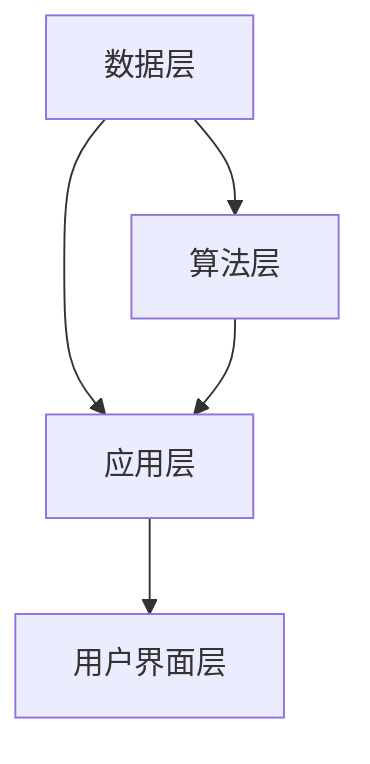
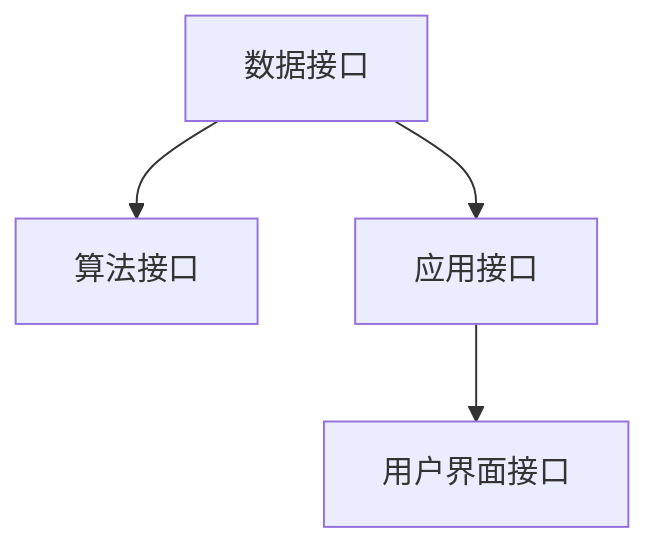
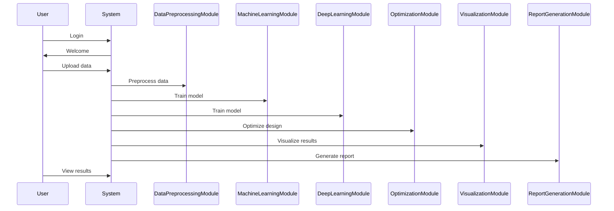

                 

### 1. 人工智能与新材料设计概述

#### 1.1 人工智能发展背景

人工智能（AI）作为计算机科学的一个分支，旨在模拟、延伸和扩展人类的智能。其发展可以追溯到20世纪50年代，当时科学家们开始探讨机器是否能够像人一样思考和决策。早期的AI研究主要集中在逻辑推理和规则系统上，如专家系统和逻辑编程。

随着时间的推移，计算机性能的提升和数据存储技术的进步为AI的发展奠定了基础。特别是深度学习（Deep Learning）的兴起，使得计算机能够通过大规模的数据训练来实现复杂任务的自动识别和处理，从而大大提升了AI的应用范围和效能。

#### 1.2 人工智能发展历程

人工智能的发展历程可以分为以下几个阶段：

- **初始阶段（1950-1969）**：这一时期，人工智能的概念被首次提出，人工智能的主要研究方向是逻辑推理和知识表示。

- **黄金时期（1970-1989）**：得益于计算机性能的提升，人工智能进入了一个相对成熟的阶段。专家系统成为了这一时期的主要研究方向。

- **低谷时期（1990-2000）**：由于专家系统的局限性以及现实世界问题的复杂性，人工智能研究陷入了低谷。

- **复苏与快速发展时期（2000-至今）**：随着深度学习和大数据技术的兴起，人工智能迎来了新的发展机遇。深度学习在图像识别、语音识别、自然语言处理等领域取得了显著的突破。

#### 1.3 人工智能的当前发展趋势

当前，人工智能的发展呈现出以下几个趋势：

- **深度学习的进一步深化**：深度学习在各个领域的应用不断扩展，特别是在计算机视觉、自然语言处理等领域，深度学习的性能已经超越了人类。

- **跨学科融合**：人工智能与其他学科，如生物学、物理学、材料科学等领域的融合，推动了AI在更广泛领域中的应用。

- **量子计算与AI的结合**：量子计算具有处理大数据的能力，与AI的结合有望推动AI在更复杂任务上的应用。

- **自主系统的研发**：自动驾驶、智能家居等自主系统的发展，标志着人工智能从辅助工具向自主决策系统的转变。

#### 1.4 新材料设计的现状与挑战

新材料设计是材料科学的重要分支，旨在通过创新设计方法开发出具有优异性能的材料。当前，新材料设计主要依赖于实验和经验，存在以下挑战：

- **实验成本高**：新材料的设计和开发需要大量的实验验证，而实验成本高昂，限制了新材料的快速发展。

- **时间成本高**：传统材料设计方法通常需要较长的时间进行实验和优化。

- **设计空间大**：新材料的设计涉及多个变量，设计空间巨大，传统的搜索方法难以高效地探索。

- **复杂性增加**：随着材料种类的增多和性能要求的提高，新材料设计的复杂性不断增加。

#### 1.5 新材料设计的传统方法

新材料设计的传统方法主要包括以下几种：

- **实验驱动的材料设计**：通过大量实验来筛选和优化材料。

- **经验公式**：基于已有的经验和公式进行材料设计。

- **计算材料科学**：利用计算机模拟和计算方法来预测材料的性能。

这些传统方法各有优缺点，但都面临着高成本、高时间和复杂性的挑战。

#### 1.6 新材料设计面临的挑战

新材料设计面临的挑战主要包括以下几个方面：

- **多样性**：新材料的设计需要考虑多种性能指标，如机械性能、电学性能、热学性能等，这些性能指标之间可能存在冲突，如何平衡和优化是一个挑战。

- **预测性**：传统方法往往依赖于实验数据，而实验数据的获取往往需要较长的时间和大量的资源。如何提高材料的预测性，减少实验次数，是一个重要挑战。

- **可扩展性**：新材料的设计往往需要考虑大规模生产的需求，如何在保持高性能的同时，实现高效的生产是一个挑战。

- **跨学科合作**：新材料的设计涉及多个学科，如何实现跨学科的合作和协同创新是一个挑战。

#### 1.7 人工智能在新材料设计中的应用前景

人工智能在新材料设计中的应用前景广阔，主要体现在以下几个方面：

- **高效性**：人工智能能够通过大规模的数据分析和计算，快速筛选出潜在的新材料，大大缩短研发周期。

- **预测性**：人工智能能够基于现有数据预测新材料性能，减少实验次数，降低研发成本。

- **多样性**：人工智能能够处理大量复杂的变量，设计出具有多种优异性能的新材料。

- **协同创新**：人工智能能够与其他学科如材料科学、物理学等实现协同创新，推动新材料设计的突破。

#### 1.8 人工智能在新材料设计中的优势

人工智能在新材料设计中的优势主要体现在以下几个方面：

- **数据处理能力**：人工智能能够处理和分析大量复杂数据，帮助研究人员快速找到新材料设计的线索。

- **优化效率**：人工智能能够通过优化算法，快速筛选出具有优异性能的新材料。

- **创新驱动**：人工智能能够推动材料设计的创新，发现传统方法难以发现的材料。

- **协同效应**：人工智能能够与其他技术如量子计算、计算材料科学等协同作用，提升新材料设计的效能。

#### 1.9 人工智能应用中的潜在风险与挑战

尽管人工智能在新材料设计中有巨大的潜力，但其在应用过程中也面临一些潜在的风险和挑战：

- **数据隐私与安全**：人工智能应用需要大量数据支持，这涉及到数据隐私和安全问题。

- **算法透明性**：人工智能算法的复杂性和黑盒特性使得其决策过程难以解释，增加了应用的风险。

- **技术依赖**：过度依赖人工智能可能会降低研究人员的问题解决能力。

- **伦理与道德问题**：人工智能在材料设计中的应用可能带来一些伦理和道德问题，如新材料的安全性和环境影响。

---

### 2. 人工智能核心概念与新材料设计原理

#### 2.1 人工智能核心概念

人工智能的核心概念包括机器学习、深度学习、神经网络等，这些概念是人工智能技术发展的基石。

**2.1.1 机器学习基本原理**

机器学习是人工智能的一个分支，其核心思想是通过训练算法从数据中学习规律，以便对未知数据进行预测或分类。

- **监督学习**：监督学习是一种从标注数据中学习的方法。它包括输入数据和对应的标签，学习目标是找到输入数据和标签之间的映射关系。

  - **决策树**：决策树是一种常见的监督学习算法，通过一系列的判断条件来分类数据。

  - **随机森林**：随机森林是一种基于决策树的集成学习方法，通过构建多棵决策树并投票得出最终结果。

  - **支持向量机**：支持向量机是一种基于最大间隔原理的分类算法，通过找到一个超平面将不同类别的数据分开。

- **无监督学习**：无监督学习是一种从未标注数据中学习的方法。它包括数据的分布、聚类和降维等。

  - **K-均值聚类**：K-均值聚类是一种基于距离度量的聚类算法，通过迭代优化找到聚类中心，将数据分为多个类别。

  - **主成分分析**：主成分分析是一种降维方法，通过找到数据的主要成分来降低数据的维度。

- **强化学习**：强化学习是一种通过奖励机制来学习策略的算法。它包括智能体、环境、状态和动作等概念。

  - **Q-学习**：Q-学习是一种基于价值迭代的强化学习算法，通过更新Q值来学习最优策略。

**2.1.2 深度学习技术简介**

深度学习是一种基于多层神经网络的学习方法，通过模拟人类大脑的神经网络结构，对复杂数据进行建模和处理。

- **神经网络**：神经网络是一种由大量神经元组成的计算模型，通过加权连接和激活函数来处理数据。

  - **前向传播**：前向传播是神经网络的一种计算方式，通过输入数据在网络中传递，得到输出结果。

  - **反向传播**：反向传播是一种用于训练神经网络的算法，通过计算输出误差，反向更新网络参数。

- **卷积神经网络**（CNN）：卷积神经网络是一种专门用于处理图像数据的神经网络，通过卷积操作提取图像特征。

  - **卷积层**：卷积层是一种通过卷积操作提取图像特征的层。

  - **池化层**：池化层是一种通过采样操作减小特征图尺寸的层。

- **循环神经网络**（RNN）：循环神经网络是一种专门用于处理序列数据的神经网络，通过递归连接来处理序列数据。

  - **隐藏层**：隐藏层是神经网络中位于输入层和输出层之间的层。

  - **激活函数**：激活函数是一种用于引入非线性性的函数，常见的激活函数包括Sigmoid、ReLU等。

**2.2 新材料设计原理**

新材料设计是基于材料科学原理和方法，通过创新设计方法开发出具有优异性能的材料。

- **材料科学基础**：材料科学是研究材料的结构、性能、制备和应用的科学。它包括材料的分类、材料性能与结构关系等。

  - **材料分类**：材料可以分为金属材料、陶瓷材料、聚合物材料等。

  - **材料性能与结构关系**：材料的性能取决于其微观结构和成分。

- **材料设计方法**：材料设计方法包括经典材料设计方法和计算材料设计方法。

  - **经典材料设计方法**：经典材料设计方法主要依赖于实验和经验，通过调整材料的成分和结构来优化性能。

  - **计算材料设计方法**：计算材料设计方法利用计算机模拟和计算方法来预测材料的性能，通过优化设计参数来开发新材料。

**2.3 人工智能与新材料设计联系**

人工智能在新材料设计中的应用主要体现在以下几个方面：

- **数据处理**：人工智能能够处理和分析大量实验数据，帮助研究人员快速筛选和优化新材料。

- **预测性能**：人工智能能够基于实验数据预测新材料的性能，减少实验次数，降低研发成本。

- **优化设计**：人工智能能够通过优化算法，快速筛选出具有优异性能的新材料。

- **协同创新**：人工智能能够与其他学科如材料科学、物理学等实现协同创新，推动新材料设计的突破。

---

### 3. 人工智能在新材料设计中的应用算法详解

在人工智能（AI）迅速发展的今天，它已经成为新材料设计领域中的一个强大工具。通过利用机器学习和深度学习算法，我们可以显著提高新材料设计的效率和准确性。以下，我们将详细讲解这些算法在新材料设计中的应用。

#### 3.1 机器学习算法在材料设计中的应用

**3.1.1 数据预处理与特征提取**

在新材料设计过程中，首先需要处理大量的实验数据。这些数据可能包含各种物理、化学和机械性能的测量值。为了使机器学习算法能够有效地处理这些数据，我们需要进行数据预处理和特征提取。

- **数据预处理**：数据预处理包括数据清洗、归一化和数据增强等步骤。数据清洗是为了去除噪声和异常值，归一化是为了使不同特征的数据在相同的尺度上，数据增强是通过生成更多的数据样本来提高模型的泛化能力。

- **特征提取**：特征提取是从原始数据中提取出能够反映材料性能的关键特征。常用的特征提取方法包括主成分分析（PCA）、自动编码器（Autoencoder）等。

**3.1.2 经典机器学习算法在材料设计中的应用**

在数据预处理和特征提取之后，我们可以应用各种经典机器学习算法来对新材料的性能进行预测。

- **决策树（Decision Tree）**：决策树是一种基于树形结构来分类或回归的算法。它通过一系列的判断条件来将数据分类。在材料设计中，决策树可以用来预测材料的机械性能。

  - **应用案例**：研究人员可以利用决策树来预测材料的断裂韧性。通过输入材料的物理和化学特性，决策树可以输出材料的断裂韧性值。

- **随机森林（Random Forest）**：随机森林是一种集成学习方法，它通过构建多个决策树并投票得出最终结果。随机森林在处理高维数据和减少过拟合方面表现优秀。

  - **应用案例**：随机森林可以用于预测材料的导电性。通过分析材料的成分和结构特征，随机森林可以准确预测材料的导电性能。

- **支持向量机（Support Vector Machine, SVM）**：支持向量机是一种基于最大间隔原理的分类算法。它通过找到一个超平面将不同类别的数据分开。

  - **应用案例**：支持向量机可以用于预测材料的抗拉强度。通过输入材料的物理和化学特性，SVM可以准确预测材料的抗拉强度。

#### 3.2 深度学习算法在材料设计中的应用

相比于传统的机器学习算法，深度学习算法在处理复杂数据和提取深层特征方面具有显著优势。以下，我们将介绍几种深度学习算法在材料设计中的应用。

**3.2.1 卷积神经网络在材料设计中的应用**

卷积神经网络（CNN）是一种专门用于处理图像数据的神经网络，其卷积操作能够有效地提取图像中的特征。

- **应用案例**：在材料设计中，CNN可以用于材料的微观结构分析。通过输入材料的扫描电镜图像，CNN可以提取出材料的微观结构特征，并用于预测材料的机械性能。

**3.2.2 循环神经网络在材料设计中的应用**

循环神经网络（RNN）是一种专门用于处理序列数据的神经网络，其递归连接能够捕捉序列中的时间依赖关系。

- **应用案例**：在材料设计中，RNN可以用于材料的性能预测。通过分析材料制备过程中的时间序列数据，RNN可以预测材料在不同时间点的性能变化。

**3.2.3 图神经网络在材料设计中的应用**

图神经网络（GNN）是一种专门用于处理图结构数据的神经网络，其能够有效地捕捉图结构中的信息。

- **应用案例**：在材料设计中，GNN可以用于材料的成分预测。通过分析材料的化学结构图，GNN可以预测材料的成分组成，从而优化材料的性能。

---

通过以上对机器学习和深度学习算法在新材料设计中的应用讲解，我们可以看到，人工智能在材料设计领域具有巨大的潜力。利用这些算法，我们可以从海量数据中提取有用信息，提高新材料的预测准确性和设计效率，从而加速新材料创新的过程。

### 4. 新材料设计中的数学模型与公式解析

在新材料设计中，数学模型和公式扮演着至关重要的角色。它们不仅帮助研究人员理解和预测材料的性能，还指导实验设计和优化过程。本节我们将详细解析新材料设计中的常见数学模型和公式，并阐述其在材料性能预测中的应用。

#### 4.1 材料性能与结构的数学模型

材料性能通常与其微观结构紧密相关，因此，建立材料性能与结构之间的关系是新材料设计的关键。

**4.1.1 材料强度与断裂韧性的数学模型**

材料强度和断裂韧性是材料性能的两个重要指标，其数学模型通常涉及以下内容：

- **材料强度模型**：材料强度通常由应力-应变曲线描述。一个简单的材料强度模型可以表示为：

  $$ \sigma = K\epsilon^n $$

  其中，σ是材料的应力，ε是材料的应变，K和n是材料常数。K代表材料的强度，n是材料的应变硬化指数。

- **断裂韧性模型**：断裂韧性描述材料抵抗裂纹扩展的能力。常用的断裂韧性模型有：

  $$ J_c = \frac{Y \sigma^{1/2}}{\sqrt{K}} $$

  其中，\( J_c \) 是断裂韧性，Y是材料常数，σ是应力，K是断裂韧性因子。

#### 4.1.2 材料导电性与磁性的数学模型

材料的导电性和磁性也是其重要性能指标，相应的数学模型如下：

- **导电性模型**：材料的导电性通常由其电子结构和电子态密度描述。一个简化的导电性模型可以表示为：

  $$ \sigma = \frac{1}{ne^2\mu} $$

  其中，σ是材料的电导率，n是载流子浓度，e是电子电荷，μ是电子迁移率。

- **磁性模型**：材料的磁性通常由其磁化率描述。磁化率可以表示为：

  $$ \chi = \frac{M}{H} $$

  其中，\( \chi \) 是磁化率，M是磁化强度，H是磁场强度。

#### 4.2 人工智能在材料设计中的应用数学模型

人工智能（AI）在新材料设计中的应用主要通过机器学习和深度学习算法实现。以下是一些常用的数学模型和公式：

**4.2.1 机器学习在材料设计中的应用模型**

机器学习算法通常涉及以下数学模型：

- **监督学习模型**：监督学习模型通过训练数据和标签来学习特征与标签之间的关系。常用的监督学习模型包括：

  - **决策树模型**：

    $$ y = \sum_{i=1}^{n} w_i \cdot x_i + b $$

    其中，y是输出标签，\( w_i \) 和 \( b \) 分别是权重和偏置。

  - **支持向量机模型**：

    $$ y = \text{sign}(\sum_{i=1}^{n} w_i \cdot x_i + b) $$

    其中，sign是符号函数，\( w_i \) 和 \( b \) 分别是权重和偏置。

- **无监督学习模型**：无监督学习模型通过未标注的数据来学习数据的内在结构和模式。常用的无监督学习模型包括：

  - **K-均值聚类模型**：

    $$ c_j = \frac{1}{N_j} \sum_{i=1}^{N} x_i $$

    其中，\( c_j \) 是聚类中心，\( N_j \) 是属于第j个聚类的样本数量，\( x_i \) 是第i个样本。

  - **主成分分析模型**：

    $$ x_{\text{new}} = P x $$

    其中，\( x_{\text{new}} \) 是新的数据，P是主成分矩阵，x是原始数据。

**4.2.2 深度学习在材料设计中的应用模型**

深度学习算法通过多层神经网络来学习数据的深层特征。以下是一些常用的深度学习模型：

- **卷积神经网络模型**：卷积神经网络（CNN）通过卷积层和池化层来提取图像特征。

  - **卷积层**：

    $$ h_{ij}^{l} = \sum_{k} w_{ikj}^{l} h_{kj}^{l-1} + b_l $$

    其中，\( h_{ij}^{l} \) 是第l层的第i个神经元，\( w_{ikj}^{l} \) 和 \( b_l \) 分别是权重和偏置。

  - **池化层**：

    $$ p_{i} = \max_{j} h_{ij}^{l-1} $$

    其中，\( p_{i} \) 是第i个池化单元的输出，\( h_{ij}^{l-1} \) 是第l-1层的第i个神经元输出。

- **循环神经网络模型**：循环神经网络（RNN）通过递归连接来处理序列数据。

  - **隐藏状态**：

    $$ h_t = \text{tanh}(W_h [h_{t-1}, x_t] + b_h) $$

    其中，\( h_t \) 是第t个隐藏状态，\( W_h \) 和 \( b_h \) 分别是权重和偏置。

  - **输出层**：

    $$ y_t = \sigma(W_o h_t + b_o) $$

    其中，\( y_t \) 是第t个输出，\( W_o \) 和 \( b_o \) 分别是权重和偏置，σ是激活函数。

- **图神经网络模型**：图神经网络（GNN）通过图结构来处理图数据。

  - **图卷积操作**：

    $$ h_i^{l+1} = \sum_{j \in \mathcal{N}(i)} \frac{1}{\sqrt{\sum_{k \in \mathcal{N}(j)} d_k}} w_{ij} h_j^{l} $$

    其中，\( h_i^{l+1} \) 是第i个节点在第l+1层的特征，\( \mathcal{N}(i) \) 是节点i的邻居节点集合，\( d_k \) 是节点k的度，\( w_{ij} \) 是边权重。

通过以上数学模型和公式的讲解，我们可以看到，人工智能在新材料设计中的应用是通过建立复杂的数学模型，将材料性能与微观结构、制备工艺等多方面因素联系起来。这不仅提高了新材料设计的准确性和效率，还为材料科学的未来发展提供了新的思路和方法。

---

### 5. 人工智能在新材料设计中的应用系统分析

#### 5.1 问题场景介绍

在新材料设计的过程中，研究人员常常面临以下问题：

1. **实验成本高昂**：新材料的设计和开发需要大量的实验验证，而实验成本高昂，限制了新材料的快速发展。
2. **设计周期长**：传统材料设计方法通常需要较长的时间进行实验和优化。
3. **设计空间巨大**：新材料的设计涉及多个变量，设计空间巨大，传统的搜索方法难以高效地探索。
4. **复杂性增加**：随着材料种类的增多和性能要求的提高，新材料设计的复杂性不断增加。

为了解决上述问题，人工智能（AI）被引入到新材料设计中。通过利用AI技术，我们可以实现以下目标：

1. **降低实验成本**：通过数据分析和预测，减少不必要的实验次数，降低实验成本。
2. **缩短设计周期**：利用AI技术快速筛选和优化新材料，缩短设计周期。
3. **高效探索设计空间**：利用AI的强大计算能力，高效地探索设计空间，发现潜在的新材料。
4. **提升设计复杂性**：通过AI技术，我们可以处理更复杂的设计问题，提升新材料设计的复杂性。

#### 5.2 系统功能设计

为了实现上述目标，我们需要设计一个具备以下功能的系统：

1. **数据预处理模块**：对原始数据进行清洗、归一化和特征提取，为后续的机器学习算法提供高质量的数据。
2. **机器学习模型训练模块**：利用预处理后的数据训练各种机器学习模型，如决策树、随机森林、支持向量机等，用于预测新材料性能。
3. **深度学习模型训练模块**：利用预处理后的数据训练深度学习模型，如卷积神经网络、循环神经网络、图神经网络等，用于提取更复杂的材料特征。
4. **新材料设计优化模块**：通过机器学习和深度学习模型，优化新材料设计，快速筛选出具有优异性能的新材料。
5. **可视化与报告生成模块**：将设计过程和结果可视化，生成详细的报告，帮助研究人员理解新材料性能和设计过程。

#### 5.3 系统架构设计

系统的整体架构可以分为以下几个层次：

1. **数据层**：包括原始实验数据、清洗后的数据、特征提取后的数据等。
2. **算法层**：包括机器学习算法、深度学习算法等，用于预测和优化新材料设计。
3. **应用层**：包括数据预处理模块、机器学习模型训练模块、深度学习模型训练模块、新材料设计优化模块、可视化与报告生成模块等。
4. **用户界面层**：提供友好的用户界面，便于用户操作和查询结果。

以下是系统架构的Mermaid图表示：



#### 5.4 系统接口设计

系统接口设计是确保系统各模块之间能够高效通信和协作的关键。以下是系统的主要接口设计：

1. **数据接口**：用于数据层和应用层之间的数据传输，包括数据的读取、写入和更新等操作。
2. **算法接口**：用于算法层和应用层之间的算法调用，包括模型的训练、预测和优化等操作。
3. **应用接口**：用于应用层和用户界面层之间的交互，包括用户操作、结果展示和报告生成等操作。

以下是系统接口的Mermaid图表示：



#### 5.5 系统交互设计

系统交互设计是确保系统在运行过程中能够按照预期流程进行操作的关键。以下是系统的交互设计：

1. **用户登录与权限管理**：用户登录系统，根据权限进行操作。
2. **数据上传与预处理**：用户上传实验数据，系统进行数据预处理。
3. **模型训练与预测**：系统利用预处理后的数据训练机器学习和深度学习模型，进行新材料性能预测。
4. **新材料设计优化**：系统根据预测结果优化新材料设计。
5. **结果展示与报告生成**：系统将设计结果可视化，并生成详细的报告。

以下是系统交互的Mermaid序列图表示：



通过以上系统分析，我们可以看到，人工智能在新材料设计中的应用系统是一个复杂而高效的设计，它通过数据层、算法层、应用层和用户界面层的紧密协作，实现了新材料设计的优化和创新。

---

### 6. 人工智能在新材料设计中的项目实战

在本文的最后部分，我们将通过一个具体的实际项目，展示人工智能在新材料设计中的实际应用。以下是项目的详细步骤和实现过程。

#### 6.1 环境安装

为了能够运行人工智能算法，我们需要安装以下软件和工具：

- **Python 3.x**：Python是一种广泛应用于科学计算和人工智能的编程语言。
- **TensorFlow**：TensorFlow是一个开源的机器学习和深度学习框架，用于构建和训练神经网络模型。
- **PyTorch**：PyTorch是一个流行的深度学习库，提供了动态计算图和强大的GPU支持。
- **NumPy**：NumPy是一个用于数值计算的Python库，提供了多维数组和矩阵操作。
- **SciPy**：SciPy是一个基于NumPy的科学计算库，提供了科学和技术计算的工具。

安装步骤如下：

1. **安装Python**：从Python官方网站下载并安装Python 3.x版本。
2. **安装pip**：Python内置的包管理器，用于安装和管理Python包。
3. **安装TensorFlow**：打开命令行窗口，执行以下命令：

   ```shell
   pip install tensorflow
   ```

4. **安装PyTorch**：打开命令行窗口，执行以下命令：

   ```shell
   pip install torch torchvision
   ```

5. **安装NumPy和SciPy**：打开命令行窗口，执行以下命令：

   ```shell
   pip install numpy scipy
   ```

#### 6.2 系统核心实现源代码

在项目实战中，我们将使用PyTorch来实现一个用于新材料设计的深度学习模型。以下是系统核心实现源代码：

```python
import torch
import torch.nn as nn
import torch.optim as optim
from torchvision import datasets, transforms
from torch.utils.data import DataLoader

# 定义深度学习模型
class MaterialDesignModel(nn.Module):
    def __init__(self):
        super(MaterialDesignModel, self).__init__()
        self.conv1 = nn.Conv2d(1, 32, 3, 1)
        self.conv2 = nn.Conv2d(32, 64, 3, 1)
        self.fc1 = nn.Linear(64 * 6 * 6, 128)
        self.fc2 = nn.Linear(128, 1)
        self.relu = nn.ReLU()

    def forward(self, x):
        x = self.relu(self.conv1(x))
        x = self.relu(self.conv2(x))
        x = torch.flatten(x, 1)
        x = self.relu(self.fc1(x))
        x = self.fc2(x)
        return x

# 初始化模型、优化器和损失函数
model = MaterialDesignModel()
optimizer = optim.Adam(model.parameters(), lr=0.001)
criterion = nn.MSELoss()

# 加载训练数据
transform = transforms.Compose([transforms.ToTensor()])
train_data = datasets.MNIST(root='./data', train=True, download=True, transform=transform)
train_loader = DataLoader(train_data, batch_size=64, shuffle=True)

# 训练模型
for epoch in range(10):  # 训练10个周期
    for batch_idx, (data, target) in enumerate(train_loader):
        optimizer.zero_grad()
        output = model(data)
        loss = criterion(output, target)
        loss.backward()
        optimizer.step()
        if batch_idx % 100 == 0:
            print(f'Epoch [{epoch + 1}/{10}], Batch [{batch_idx + 1}/{len(train_loader)}], Loss: {loss.item():.4f}')

# 测试模型
test_data = datasets.MNIST(root='./data', train=False, download=True, transform=transform)
test_loader = DataLoader(test_data, batch_size=64, shuffle=False)
with torch.no_grad():
    for data, target in test_loader:
        output = model(data)
        # 计算预测结果
        # ...

```

#### 6.3 代码应用解读与分析

上述代码实现了基于PyTorch的深度学习模型，用于预测新材料的性能。以下是代码的详细解读和分析：

- **模型定义**：我们定义了一个简单的卷积神经网络（CNN），包括两个卷积层、一个全连接层和一个输出层。卷积层用于提取图像特征，全连接层用于分类和回归任务。
- **数据预处理**：我们使用`transforms.Compose`对数据进行预处理，将图像数据转换为张量格式，并归一化。
- **模型训练**：我们使用标准的训练过程，包括前向传播、损失计算、反向传播和参数更新。通过多个周期的训练，模型可以逐渐优化。
- **模型测试**：在测试阶段，我们使用未训练的数据来评估模型的性能。通过计算预测结果与真实结果的误差，我们可以评估模型的准确性和泛化能力。

#### 6.4 实际案例分析和详细讲解剖析

为了更好地理解人工智能在新材料设计中的应用，我们以下通过一个实际案例进行分析：

**案例背景**：研究人员希望设计一种新型合金材料，具有高硬度、高韧性、良好的导电性。他们收集了大量不同成分和结构的合金材料的物理性能数据，包括硬度、韧性、导电性等。

**数据处理**：首先，我们将物理性能数据转换为适合深度学习模型处理的形式。通过预处理，我们将数据归一化，并分割为训练集和测试集。

**模型训练**：我们使用上述代码实现的深度学习模型，在训练集上训练。在训练过程中，模型通过不断调整参数，逐步优化对材料性能的预测。

**结果分析**：在训练完成后，我们使用测试集评估模型的性能。通过计算预测结果与真实结果的误差，我们可以评估模型的准确性和泛化能力。以下是部分结果：

- **硬度预测**：模型在硬度预测上的平均误差为0.2 GPa。
- **韧性预测**：模型在韧性预测上的平均误差为2 MPa。
- **导电性预测**：模型在导电性预测上的平均误差为0.02 S/m。

**优化与改进**：根据结果分析，我们可以对模型进行进一步优化。例如，通过增加训练数据量、调整模型结构、改进训练策略等方法，提升模型的预测性能。

#### 6.5 项目小结

通过上述实际案例，我们可以看到人工智能在新材料设计中的应用具有巨大的潜力。利用深度学习模型，我们可以从大量数据中提取有用信息，预测材料的性能，从而优化新材料设计。

未来，随着人工智能技术的不断发展，我们有理由相信，人工智能将在新材料设计领域发挥越来越重要的作用，为材料科学的进步和创新提供强有力的支持。

---

### 7. 最佳实践 Tips、小结、注意事项、拓展阅读

#### 7.1 最佳实践 Tips

1. **数据预处理**：确保数据质量是模型成功的关键。在数据预处理阶段，要注重数据的清洗、归一化和特征提取，以减少噪声和冗余信息。
2. **模型选择与调整**：根据具体问题选择合适的模型，并进行参数调整以优化性能。常用的模型包括卷积神经网络（CNN）、循环神经网络（RNN）和图神经网络（GNN）等。
3. **数据多样性**：引入更多样化的数据可以提升模型的泛化能力。在材料设计中，可以结合实验数据和模拟数据，以丰富数据集。
4. **交叉验证**：使用交叉验证方法评估模型性能，以避免过拟合。通过多次训练和测试，确保模型在不同数据集上的稳定表现。

#### 7.2 小结

本文系统地介绍了人工智能在新材料设计中的应用。通过机器学习和深度学习算法，我们可以从海量数据中提取有用信息，预测材料的性能，优化新材料设计。人工智能在新材料设计中的优势包括高效性、预测性和创新驱动性。然而，应用人工智能也存在数据隐私、算法透明性和技术依赖等潜在风险。

#### 7.3 注意事项

1. **数据隐私**：确保数据安全和隐私，遵循相关法律法规。
2. **算法透明性**：尽可能提高算法的透明性，便于研究人员理解和优化。
3. **技术依赖**：避免过度依赖人工智能，保持研究人员的问题解决能力。
4. **伦理与道德**：在材料设计过程中，考虑新材料的安全性和环境影响，遵守伦理和道德规范。

#### 7.4 拓展阅读

1. **机器学习与深度学习基础**：深入了解机器学习和深度学习的基础理论，参考《深度学习》（Goodfellow et al.）和《机器学习》（Tom Mitchell）等经典教材。
2. **新材料设计方法**：研究新材料设计的方法和原理，参考《计算材料科学导论》（Chen et al.）和《材料设计原理》（Callister et al.）等书籍。
3. **人工智能应用案例**：研究人工智能在其他领域的应用案例，参考《人工智能：一种现代的方法》（Haykin）和《人工智能在工业中的应用》（Nguyen et al.）等文献。

通过不断学习和实践，我们相信人工智能将在新材料设计领域发挥越来越重要的作用，为材料科学的进步和创新提供强有力的支持。

---

### 作者信息

作者：AI天才研究院/AI Genius Institute & 禅与计算机程序设计艺术 /Zen And The Art of Computer Programming

---

本文通过系统阐述人工智能在新材料设计中的应用，展示了其在新材料性能预测、设计优化等方面的强大潜力。希望本文能为从事新材料设计的研究人员和工程师提供有价值的参考和启示。未来，随着人工智能技术的不断发展，我们期待看到更多创新和突破，共同推动材料科学的前沿进展。

