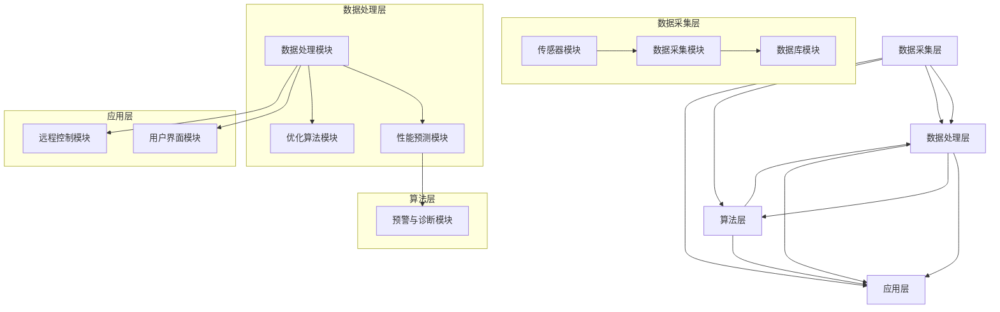
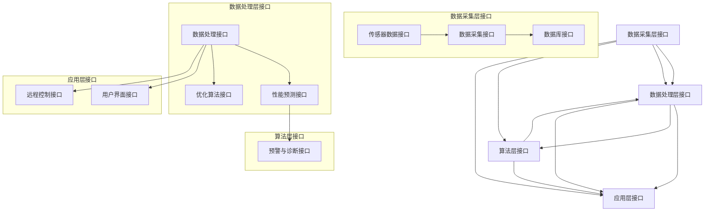
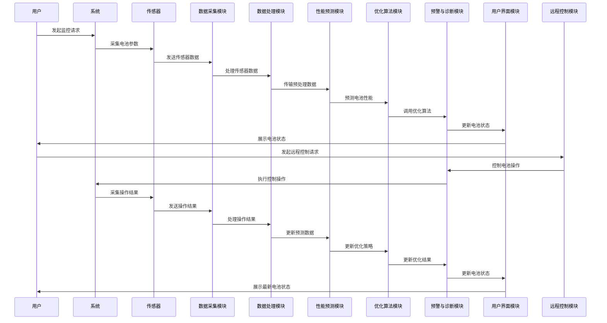
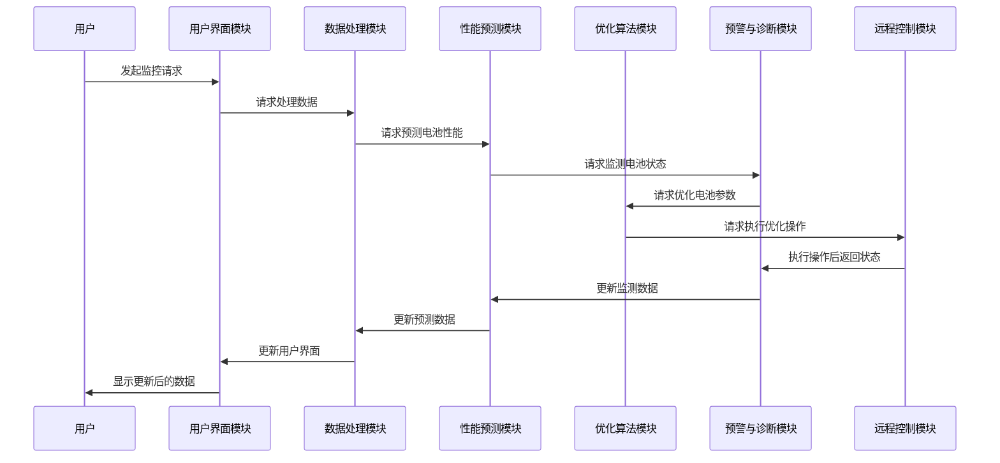

                 

### 第1章 问题背景

#### 1.1.1 能源危机与新能源电池的重要性

随着全球人口的不断增长和工业化的快速发展，能源需求日益增长。传统的化石燃料资源如煤、石油和天然气等面临着日益枯竭的威胁，同时也伴随着严重的环境污染和气候变化问题。因此，寻找可持续、高效的能源解决方案已成为全球范围内的紧迫任务。新能源电池作为一种清洁、可再生的能源存储和转换装置，成为了解决能源危机的重要方向。

首先，我们来看能源危机的现状。据国际能源署（IEA）的数据显示，全球能源消耗在过去几十年里持续增长，尤其是在发展中国家。然而，传统能源的储量有限，预计将在未来几十年内耗尽。此外，化石燃料的燃烧释放的温室气体是导致全球气候变化的主要原因之一。因此，传统能源的不可持续性和环境问题促使人们寻求新的能源解决方案。

新能源电池的重要性主要体现在以下几个方面：

1. **高能量密度**：新能源电池可以存储大量的能量，相比传统的化学电池，其能量密度显著提高，能够满足高功率设备的能源需求。

2. **快速充电**：新能源电池具备快速充电的能力，大大缩短了充电时间，提高了设备的利用效率。

3. **长循环寿命**：新能源电池的循环寿命较长，即充放电次数多，这意味着其在使用寿命内可以提供稳定的能源供应。

4. **安全性**：新能源电池在设计上注重安全性，降低了爆炸和火灾的风险，提高了设备的安全性能。

然而，新能源电池目前仍存在一些问题和挑战。例如，能量密度较低、充电时间长、循环寿命短以及安全性问题。为了克服这些问题，人工智能技术被引入到新能源电池优化领域，通过智能算法对电池的性能进行优化，从而提高其整体效率和可靠性。

在下一节中，我们将深入探讨新能源电池存在的问题与挑战，以及人工智能技术在解决这些问题方面的潜力。接下来，我们继续我们的分析：

##### 1.1.1.1 能源危机的现状

全球能源消耗的持续增长导致了能源供需的不平衡，尤其是在一些发展中国家。根据国际能源署的数据，全球能源消耗从1990年的112.7万亿千瓦时增长到2019年的162.4万亿千瓦时，增长了43.5%。这个增长趋势在可预见的未来内仍将持续，因为全球经济的快速发展和对能源需求的不断增加。

**化石燃料消耗与储量减少**

化石燃料，如煤、石油和天然气，是目前全球能源消耗的主要来源。然而，这些资源的储量有限，且随着消耗的增加，其储量正在迅速减少。据美国能源信息管理局（EIA）的数据，全球煤炭储量约为9760亿公吨，石油储量约为1800亿公吨，天然气储量约为205万亿立方英尺。按照当前的消耗速度，煤炭可能将在接下来的几十年内耗尽，而石油和天然气也将在百年内枯竭。

**环境问题**

化石燃料的燃烧不仅消耗了有限的资源，还产生了大量的温室气体和其他污染物。这些污染物对环境造成了严重的影响，包括空气污染、水污染和土壤污染。空气污染导致了全球数百万人过早死亡，同时加剧了呼吸系统疾病和心血管疾病。水污染影响了数百万人的饮用水安全，导致疾病传播和生态系统破坏。此外，温室气体的排放是导致全球气候变化的主要原因之一，气候变化带来了极端天气、海平面上升、干旱和洪水等自然灾害。

**能源不平等**

全球能源消耗的不平等加剧了能源危机。发达国家和发展中国家在能源获取方面存在巨大差距。发达国家拥有更先进的能源基础设施和更高的能源效率，而发展中国家则面临着能源短缺和基础设施不足的问题。这种能源不平等不仅限制了发展中国家的经济增长，也加剧了全球能源供应的不稳定性。

**解决方案的必要性**

面对能源危机的严峻形势，寻找可持续的能源解决方案变得迫在眉睫。新能源电池作为一种潜在的解决方案，提供了高能量密度、快速充电、长循环寿命和良好的安全性。然而，要实现这一目标，需要结合人工智能技术来不断优化电池的性能，解决现有问题，提高其整体效率和可靠性。在下一节中，我们将进一步探讨新能源电池的优势与需求。

##### 1.1.1.2 新能源电池的优势与需求

新能源电池在解决能源危机方面具有显著的优势，其主要特点包括：

1. **高能量密度**：新能源电池，如锂离子电池和固态电池，具备较高的能量密度。这意味着它们可以存储更多的能量，为高功率设备提供稳定的能源供应。例如，锂离子电池的能量密度已经达到了250Wh/kg，而固态电池的能量密度有望进一步提高，达到500Wh/kg以上。

2. **快速充电**：新能源电池的充电速度也在不断提升。传统锂离子电池的充电时间一般在1-2小时左右，而一些新型电池技术，如快速充电技术，可以将充电时间缩短至15分钟以内。这对于电动汽车等需要快速补充能量的设备尤为重要。

3. **长循环寿命**：新能源电池的循环寿命相对较长。锂离子电池通常可以经历上千次充放电循环，而固态电池的循环寿命甚至可以达到数万次。这意味着电池在长时间使用后仍能保持较高的性能，降低了维护和更换的成本。

4. **安全性**：新能源电池在安全性方面也有显著提升。传统锂离子电池存在热失控和燃烧的风险，而固态电池则通过使用固态电解质，避免了这些问题。此外，一些新型的电池设计，如使用安全阀和冷却系统，进一步提高了电池的安全性。

需求方面，新能源电池的应用领域非常广泛，主要包括以下几方面：

1. **电动汽车**：随着电动汽车的普及，对新能源电池的需求急剧增加。新能源电池的高能量密度和快速充电能力，使得电动汽车的续航里程和充电便利性得到了显著提升。

2. **可再生能源储能**：新能源电池在太阳能和风能等可再生能源的储能方面也具有重要作用。通过将过剩的能源存储在电池中，可以在能源需求高峰时释放储存的能源，实现能源的平衡和优化。

3. **消费电子产品**：智能手机、笔记本电脑和平板电脑等消费电子产品对电池的需求也不断增长。新能源电池的高能量密度和长循环寿命，使得这些设备的续航能力得到了显著提升。

4. **工业应用**：新能源电池在工业领域也有广泛的应用，如储能系统、不间断电源（UPS）和电动工具等。新能源电池在这些应用中提供了稳定的电力供应和高效的能源利用。

总之，新能源电池以其高能量密度、快速充电、长循环寿命和安全性等优点，成为解决能源危机的重要方向。随着技术的不断进步和人工智能的引入，新能源电池的性能将进一步提升，满足更广泛的应用需求。

##### 1.1.2 新能源电池存在的问题与挑战

尽管新能源电池在解决能源危机方面具有显著的优势，但其在实际应用中仍面临诸多挑战，主要包括以下几方面：

1. **能量密度低**：新能源电池的能量密度相对较低，这意味着它们在相同体积或重量下能存储的能量较少。对于需要长时间运行或高功率输出的设备，如电动汽车和大型储能系统，这限制了电池的应用范围。根据现有技术，锂离子电池的能量密度一般在250Wh/kg左右，而固态电池的理论能量密度可以达到500Wh/kg以上，但实际应用中仍需进一步提升。

2. **充电时间长**：尽管新能源电池的充电速度在不断提升，但相比传统的化石燃料补充时间，充电时间依然较长。这对于需要快速补充能量的设备，如电动汽车，会造成不便。快速充电技术的发展虽然能够将充电时间缩短至1-2小时，但仍有改进空间。

3. **循环寿命短**：新能源电池的循环寿命相对较短，尤其是在高功率循环和极端温度环境下。循环寿命的缩短会导致电池性能下降和寿命缩短，增加了维护和更换成本。锂离子电池通常可以经历上千次充放电循环，但某些应用场合，如电动自行车和电动工具，需要更高的循环寿命。

4. **安全性问题**：新能源电池，尤其是锂离子电池，存在一定的安全隐患。电池过热、过充、短路等可能导致电池燃烧或爆炸，对使用者造成危险。尽管设计上采取了多种安全措施，如使用安全阀、温度控制系统等，但依然存在一定的风险。

为了克服这些挑战，人工智能技术的引入成为了优化新能源电池性能的有效途径。人工智能可以通过以下方式改善电池的性能：

1. **能量密度优化**：通过机器学习算法，对电池的材料、结构和工艺进行优化，提高电池的能量密度。例如，通过材料筛选和组合，找到具有更高能量密度的材料，或者通过结构设计，增加电池的容量。

2. **充电时间优化**：利用人工智能算法，优化充电策略，提高充电效率。例如，通过学习用户的充电习惯，调整充电速度和电压，实现快速充电。

3. **循环寿命优化**：通过机器学习算法，预测电池的寿命和性能退化，提前进行维护和更换。例如，通过监测电池的电化学行为，预测电池的健康状态，提前采取措施防止性能退化。

4. **安全性优化**：利用人工智能算法，对电池的安全性进行实时监测和预测，及时发现潜在的安全隐患。例如，通过监测电池的温度、电流和电压等参数，预测电池的异常行为，并采取相应的措施防止事故发生。

在下一节中，我们将进一步探讨人工智能在新能源电池优化中的应用和优势。

##### 1.1.3 新能源电池存在的问题与挑战

#### 1.1.2.1 能量密度低

新能源电池的能量密度是衡量其性能的重要指标，能量密度越高，电池在相同体积或重量下能够存储的电能越多。然而，目前的新能源电池在能量密度方面仍存在一定的局限性。

锂离子电池是目前最广泛使用的新能源电池，其能量密度一般在250Wh/kg左右。虽然这一数值相比传统电池有显著提升，但与某些高性能电池相比，如固态电池，仍显不足。固态电池的理论能量密度可以达到500Wh/kg以上，但实际应用中的能量密度受到材料、工艺和设计等多方面因素的制约，尚未达到理论值。

能量密度低的直接后果是对电池体积和重量的要求较高。这意味着在相同能量需求下，需要使用更多电池单元，增加了设备的重量和体积。这对于电动汽车和便携式电子设备等应用场景尤为重要，因为它们对电池的体积和重量有严格的要求。为了提高能量密度，研究人员正在探索新的材料和结构设计，例如纳米材料、三维电池结构和纳米孔结构等，以期在现有技术基础上实现能量密度的突破。

#### 1.1.2.2 充电时间长

充电时间是新能源电池在应用中面临的另一个挑战。尽管新能源电池的充电速度在不断提升，但与化石燃料相比，充电时间依然较长。对于电动汽车和便携式电子设备等需要快速补充能量的设备，较长的充电时间会影响用户体验和设备的工作效率。

锂离子电池的充电时间通常在1-2小时左右，而一些新型电池技术，如快速充电技术，可以将充电时间缩短至15分钟以内。然而，这仍不足以与燃油车几分钟的加油时间相比。为了进一步提高充电速度，研究人员正在开发快速充电技术和高效充电策略。

快速充电技术的关键在于提高充电功率。目前，快充技术通过增加充电电流和电压，实现快速充电。然而，高功率充电也会带来一定的安全风险，例如电池过热和损坏。因此，如何在提高充电速度的同时确保电池的安全性，是快速充电技术需要解决的重要问题。

此外，充电时间的延长也与电池的化学性质和材料特性有关。例如，某些电池材料在充电过程中会发生体积变化，导致充电过程中电导率下降，进而影响充电速度。因此，通过优化电池材料和结构设计，提高电池的电导率和稳定性，也是缩短充电时间的关键。

#### 1.1.2.3 循环寿命短

新能源电池的循环寿命，即电池可以完成充放电循环的次数，是衡量电池耐用性和可靠性的重要指标。目前，锂离子电池的循环寿命一般在500-1000次之间，而某些应用场合，如电动自行车和电动工具，需要更高的循环寿命。

循环寿命的缩短会导致电池性能下降和寿命缩短，增加维护和更换成本。影响电池循环寿命的因素包括电化学过程、材料退化、结构变形和温度等。

首先，电化学过程是影响电池循环寿命的主要因素。在充放电过程中，电池内部的电化学反应会导致活性物质的损耗和副产物的积累，这会降低电池的容量和性能。例如，锂离子电池在充放电过程中，锂离子在正负极之间来回穿梭，正极材料中的锂离子嵌入和脱出会导致材料的结构变形和容量衰减。

其次，材料退化也是影响电池循环寿命的重要因素。电池中的材料，如正极材料、负极材料和电解液，在长期循环过程中会发生化学和物理变化，导致材料的性能下降。例如，锂离子电池中的正极材料通常由锂化合物组成，长期循环会导致材料的相变和结构变化，降低电池的容量和循环稳定性。

此外，结构变形和温度也会影响电池的循环寿命。在充电过程中，电池内部的电流和电压会导致电池材料的体积变化，如果结构变形过大，会导致电池内部短路或损坏。温度升高也会加速电池材料的退化，降低电池的循环寿命。

为了延长电池的循环寿命，研究人员正在探索多种方法，如使用更稳定的材料、改进电池设计和优化充电策略等。例如，通过使用耐高温材料和高稳定性的电解液，可以提高电池的耐久性。此外，通过控制充电电流和电压，优化电池的充电和放电过程，也可以延长电池的循环寿命。

#### 1.1.2.4 安全性问题

新能源电池的安全性问题一直是关注焦点。由于电池内部存在高电压和高温，电池在充放电过程中存在爆炸、燃烧等安全隐患。锂离子电池的安全问题尤为突出，因为它们在过充、过热和短路等情况下容易发生热失控，导致电池燃烧或爆炸。

首先，过充是导致电池安全问题的常见原因之一。当电池充电超过其额定容量时，电池内部温度会急剧升高，导致电解液分解、气体生成和电池内压增大。如果内压无法释放，会导致电池爆炸。

其次，过热也会增加电池的安全风险。在充电或放电过程中，电池会产生热量，如果热量无法及时散发，会导致电池温度升高。高温会加速电池材料的退化，降低电池的容量和性能，并增加安全风险。

此外，短路也是电池安全问题的常见原因。在电池内部或外部，电极之间发生短路，会导致电流急剧增大，产生大量热量，导致电池过热和燃烧。

为了提高电池的安全性，研究人员采取了多种措施，如增加电池的热管理系统、设计安全阀和采用固态电解质等。热管理系统可以通过冷却和散热来控制电池温度，防止过热。安全阀可以释放电池内部的压力，防止爆炸。固态电解质可以替代传统的液态电解质，减少电解液分解和气体生成，提高电池的安全性。

总之，新能源电池在能量密度、充电时间、循环寿命和安全等方面仍存在诸多挑战。通过人工智能技术的引入，可以进一步优化电池性能，解决这些问题，提高新能源电池的应用效率和安全性。

##### 1.1.3 新能源电池存在的问题与挑战

#### 1.1.2.1 能量密度低

新能源电池的能量密度是衡量其性能的重要指标，能量密度越高，电池在相同体积或重量下能够存储的电能越多。然而，目前的新能源电池在能量密度方面仍存在一定的局限性。

锂离子电池是目前最广泛使用的新能源电池，其能量密度一般在250Wh/kg左右。虽然这一数值相比传统电池有显著提升，但与某些高性能电池相比，如固态电池，仍显不足。固态电池的理论能量密度可以达到500Wh/kg以上，但实际应用中的能量密度受到材料、工艺和设计等多方面因素的制约，尚未达到理论值。

能量密度低的直接后果是对电池体积和重量的要求较高。这意味着在相同能量需求下，需要使用更多电池单元，增加了设备的重量和体积。这对于电动汽车和便携式电子设备等应用场景尤为重要，因为它们对电池的体积和重量有严格的要求。为了提高能量密度，研究人员正在探索新的材料和结构设计，例如纳米材料、三维电池结构和纳米孔结构等，以期在现有技术基础上实现能量密度的突破。

#### 1.1.2.2 充电时间长

充电时间是新能源电池在应用中面临的另一个挑战。尽管新能源电池的充电速度在不断提升，但与化石燃料相比，充电时间依然较长。对于电动汽车和便携式电子设备等需要快速补充能量的设备，较长的充电时间会影响用户体验和设备的工作效率。

锂离子电池的充电时间通常在1-2小时左右，而一些新型电池技术，如快速充电技术，可以将充电时间缩短至15分钟以内。然而，这仍不足以与燃油车几分钟的加油时间相比。为了进一步提高充电速度，研究人员正在开发快速充电技术和高效充电策略。

快速充电技术的关键在于提高充电功率。目前，快充技术通过增加充电电流和电压，实现快速充电。然而，高功率充电也会带来一定的安全风险，例如电池过热和损坏。因此，如何在提高充电速度的同时确保电池的安全性，是快速充电技术需要解决的重要问题。

此外，充电时间的延长也与电池的化学性质和材料特性有关。例如，某些电池材料在充电过程中会发生体积变化，导致充电过程中电导率下降，进而影响充电速度。因此，通过优化电池材料和结构设计，提高电池的电导率和稳定性，也是缩短充电时间的关键。

#### 1.1.2.3 循环寿命短

新能源电池的循环寿命，即电池可以完成充放电循环的次数，是衡量电池耐用性和可靠性的重要指标。目前，锂离子电池的循环寿命一般在500-1000次之间，而某些应用场合，如电动自行车和电动工具，需要更高的循环寿命。

循环寿命的缩短会导致电池性能下降和寿命缩短，增加维护和更换成本。影响电池循环寿命的因素包括电化学过程、材料退化、结构变形和温度等。

首先，电化学过程是影响电池循环寿命的主要因素。在充放电过程中，电池内部的电化学反应会导致活性物质的损耗和副产物的积累，这会降低电池的容量和性能。例如，锂离子电池在充放电过程中，锂离子在正负极之间来回穿梭，正极材料中的锂离子嵌入和脱出会导致材料的结构变形和容量衰减。

其次，材料退化也是影响电池循环寿命的重要因素。电池中的材料，如正极材料、负极材料和电解液，在长期循环过程中会发生化学和物理变化，导致材料的性能下降。例如，锂离子电池中的正极材料通常由锂化合物组成，长期循环会导致材料的相变和结构变化，降低电池的容量和循环稳定性。

此外，结构变形和温度也会影响电池的循环寿命。在充电过程中，电池内部的电流和电压会导致电池材料的体积变化，如果结构变形过大，会导致电池内部短路或损坏。温度升高也会加速电池材料的退化，降低电池的循环寿命。

为了延长电池的循环寿命，研究人员正在探索多种方法，如使用更稳定的材料、改进电池设计和优化充电策略等。例如，通过使用耐高温材料和高稳定性的电解液，可以提高电池的耐久性。此外，通过控制充电电流和电压，优化电池的充电和放电过程，也可以延长电池的循环寿命。

#### 1.1.2.4 安全性问题

新能源电池的安全性问题一直是关注焦点。由于电池内部存在高电压和高温，电池在充放电过程中存在爆炸、燃烧等安全隐患。锂离子电池的安全问题尤为突出，因为它们在过充、过热和短路等情况下容易发生热失控，导致电池燃烧或爆炸。

首先，过充是导致电池安全问题的常见原因之一。当电池充电超过其额定容量时，电池内部温度会急剧升高，导致电解液分解、气体生成和电池内压增大。如果内压无法释放，会导致电池爆炸。

其次，过热也会增加电池的安全风险。在充电或放电过程中，电池会产生热量，如果热量无法及时散发，会导致电池温度升高。高温会加速电池材料的退化，降低电池的容量和性能，并增加安全风险。

此外，短路也是电池安全问题的常见原因。在电池内部或外部，电极之间发生短路，会导致电流急剧增大，产生大量热量，导致电池过热和燃烧。

为了提高电池的安全性，研究人员采取了多种措施，如增加电池的热管理系统、设计安全阀和采用固态电解质等。热管理系统可以通过冷却和散热来控制电池温度，防止过热。安全阀可以释放电池内部的压力，防止爆炸。固态电解质可以替代传统的液态电解质，减少电解液分解和气体生成，提高电池的安全性。

总之，新能源电池在能量密度、充电时间、循环寿命和安全等方面仍存在诸多挑战。通过人工智能技术的引入，可以进一步优化电池性能，解决这些问题，提高新能源电池的应用效率和安全性。

### 第2章 核心概念与联系

在深入探讨人工智能在新能源电池优化中的应用之前，我们需要先理解两个核心概念：人工智能和新能源电池优化。这两个概念不仅各自有其独特的历史、定义和应用领域，而且它们之间的联系也值得我们深入分析。

#### 2.1 人工智能概述

##### 2.1.1 人工智能的定义

人工智能（Artificial Intelligence，简称AI）是指由计算机系统执行的，通常需要人类智能才能完成的任务，如视觉识别、语言理解、决策和问题解决。AI的目标是让计算机具备智能行为，模仿人类的学习、推理、感知和适应能力。

##### 2.1.2 人工智能的发展历程

人工智能的发展历程可以追溯到20世纪50年代，当时计算机科学家首次提出了“人工智能”的概念。早期的AI研究主要集中在逻辑推理和符号处理上，代表性的系统如ELIZA（一个模仿心理治疗师对话的聊天机器人）。从20世纪70年代开始，随着计算机硬件性能的提升和算法的进步，AI进入了一个新的发展阶段，涌现出了专家系统、神经网络等关键技术。

21世纪初，机器学习特别是深度学习的出现，推动了AI技术的飞速发展。深度学习通过多层神经网络对大量数据进行训练，可以自动提取复杂特征，实现了图像识别、语音识别、自然语言处理等领域的重大突破。

##### 2.1.3 人工智能的应用领域

人工智能在多个领域得到了广泛应用，其中一些关键领域包括：

1. **图像识别**：通过深度学习算法，计算机可以自动识别和分类图像中的对象，应用于安防监控、自动驾驶等。

2. **自然语言处理**：AI技术使得计算机能够理解和生成自然语言，应用于智能客服、翻译、文本分析等。

3. **机器学习**：AI通过训练模型，从数据中自动学习规律和模式，应用于数据挖掘、预测分析和优化决策。

4. **机器人**：AI技术赋予了机器人感知、决策和执行任务的能力，应用于工业制造、医疗服务等。

5. **自动驾驶**：通过传感器和深度学习算法，自动驾驶汽车可以实现自主驾驶，提高交通效率和安全性。

#### 2.2 能源电池优化概述

##### 2.2.1 能源电池的定义

能源电池是一种将化学能转换为电能的装置，广泛应用于各种电子设备和能源存储系统中。根据能量存储的方式，能源电池可以分为一次电池和二次电池。一次电池，如干电池和充电电池，只能充放电一次，而二次电池，如锂离子电池和铅酸电池，可以反复充放电。

##### 2.2.2 能源电池的分类

根据电解质的不同，能源电池可以分为：

1. **锂离子电池**：使用锂离子作为电荷载体，具有高能量密度和长循环寿命，广泛应用于电动汽车、笔记本电脑和智能手机等。

2. **锂金属电池**：使用锂金属作为负极材料，具有更高的能量密度，但安全性较低，仍处于研发阶段。

3. **固态电池**：使用固态电解质，具有较高的安全性和能量密度，被视为未来最具潜力的电池技术之一。

4. **铅酸电池**：使用铅酸电解液，具有较高的可靠性和低成本，广泛应用于备用电源、电动自行车等。

##### 2.2.3 能源电池的工作原理

能源电池的工作原理基于电化学反应。在充放电过程中，电池的正极和负极分别发生氧化还原反应，电子通过外部电路流动，产生电流。在充电过程中，外部电源提供电能，驱动电池内部的电化学反应，将电能转化为化学能储存。在放电过程中，储存的化学能转化为电能，通过电化学反应释放出电子。

#### 2.3 人工智能在能源电池优化中的应用

##### 2.3.1 应用背景

随着新能源电池在电动汽车、可再生能源储能和消费电子产品等领域的广泛应用，对电池性能的要求越来越高。然而，传统电池技术面临能量密度低、充电时间长、循环寿命短和安全问题等挑战。为了解决这些问题，人工智能技术的引入成为了一种有效的手段。

##### 2.3.2 应用优势

1. **提高能量密度**：通过机器学习算法，可以优化电池材料的选择和制备工艺，提高电池的能量密度。

2. **优化充电策略**：基于用户的充电习惯，人工智能可以制定最优的充电策略，提高充电效率，缩短充电时间。

3. **延长循环寿命**：通过实时监测电池的状态，人工智能可以预测电池的健康状态，提前进行维护和更换，延长电池的循环寿命。

4. **增强安全性**：人工智能可以通过对电池的实时监控和分析，及时发现潜在的安全隐患，采取相应的措施，提高电池的安全性。

##### 2.3.3 应用挑战

尽管人工智能在新能源电池优化中具有巨大潜力，但其实际应用仍面临一些挑战：

1. **数据获取和处理**：电池的性能数据通常复杂且多样，需要大量高精度、高可信度的数据支持。

2. **算法复杂性**：机器学习算法，特别是深度学习算法，通常具有很高的复杂性，对计算资源和算法优化提出了较高的要求。

3. **模型解释性**：人工智能模型的决策过程通常难以解释，这对于需要透明性和可解释性的电池优化应用来说是一个挑战。

4. **技术成熟度**：尽管人工智能技术在不断发展，但在新能源电池优化领域的应用仍处于早期阶段，需要更多的实践和验证。

通过以上对人工智能和新能源电池优化核心概念及它们之间联系的分析，我们可以更好地理解人工智能在新能源电池优化中的应用背景、优势和应用挑战。在接下来的章节中，我们将进一步探讨人工智能在解决新能源电池具体问题中的算法原理和应用实例。

#### 2.1 人工智能概述

##### 2.1.1 人工智能的定义

人工智能（Artificial Intelligence，简称AI）是指通过计算机程序模拟人类智能行为的科学技术。具体来说，人工智能是指计算机系统能够执行通常需要人类智能才能完成的任务，如视觉识别、语言理解、决策和问题解决等。AI的核心目标是使计算机具备类似于人类的感知、推理、学习和适应能力。

##### 2.1.2 人工智能的发展历程

人工智能的发展可以追溯到20世纪中期。1950年，艾伦·图灵提出了著名的图灵测试，用于判断机器是否具有人类智能。20世纪50年代，人工智能的概念开始被广泛接受，计算机科学家们开始尝试通过编写程序来实现机器智能。早期的AI研究主要集中在逻辑推理和符号处理上，这一阶段的代表性系统包括ELIZA，它是一个模仿心理治疗师对话的聊天机器人。

20世纪70年代，随着计算机硬件性能的提升和算法的进步，人工智能进入了一个新的发展阶段。专家系统在这一时期得到了广泛应用，它通过将人类专家的知识和经验编码到计算机程序中，实现了在特定领域的智能应用。然而，由于依赖大量手工编写的规则，专家系统的应用范围受到限制。

21世纪初，机器学习特别是深度学习的出现，推动了人工智能的飞速发展。深度学习通过多层神经网络对大量数据进行训练，可以自动提取复杂特征，实现了图像识别、语音识别、自然语言处理等领域的重大突破。2012年，深度学习在ImageNet图像识别挑战赛上取得了突破性成绩，显著提高了图像识别的准确率。

近年来，人工智能在各个领域的应用越来越广泛，如自动驾驶、医疗诊断、金融分析和智能家居等。通过不断的技术创新和应用实践，人工智能正逐步从理论研究走向实际应用，为人类社会带来了巨大的变革和进步。

##### 2.1.3 人工智能的应用领域

人工智能在多个领域取得了显著的进展，以下是一些关键应用领域：

1. **图像识别**：通过深度学习算法，计算机可以自动识别和分类图像中的对象。图像识别技术广泛应用于安防监控、医疗影像分析、自动驾驶等领域。

2. **自然语言处理**：AI技术使得计算机能够理解和生成自然语言，应用于智能客服、语音助手、机器翻译和文本分析等。

3. **机器学习**：机器学习是一种让计算机通过数据学习规律和模式的方法，广泛应用于数据挖掘、预测分析和优化决策。

4. **机器人**：通过感知、决策和执行任务的能力，机器人可以在工业制造、医疗服务、家庭服务等领域发挥重要作用。

5. **自动驾驶**：自动驾驶技术通过传感器和深度学习算法，实现汽车的自主驾驶，提高交通效率和安全性。

6. **金融分析**：AI技术在金融领域有广泛应用，如风险控制、投资分析和市场预测等。

7. **医疗诊断**：人工智能在医疗诊断中的应用，如影像识别、疾病预测和个性化治疗等，为医疗行业带来了新的机遇。

8. **教育**：智能教育系统通过人工智能技术，提供个性化的学习方案，提高学习效果和效率。

##### 2.2 能源电池优化概述

##### 2.2.1 能源电池的定义

能源电池是一种能够将化学能直接转化为电能的装置，广泛应用于各种电子设备和能源存储系统中。根据电池的工作方式和特点，能源电池可以分为一次电池和二次电池。一次电池，如干电池和充电电池，只能充放电一次，通常用于一次性使用的设备。而二次电池，如锂离子电池和铅酸电池，可以反复充放电，广泛应用于电动汽车、储能系统和消费电子产品等。

##### 2.2.2 能源电池的分类

能源电池种类繁多，根据电解质、电极材料和结构特点等不同，可以分为以下几类：

1. **锂离子电池**：锂离子电池是目前最常见的一次电池，其工作原理是通过锂离子在正负极之间来回移动实现充电和放电。锂离子电池具有高能量密度、长循环寿命和较低的自放电率，广泛应用于电动汽车、笔记本电脑和智能手机等。

2. **锂金属电池**：锂金属电池使用锂金属作为负极材料，具有较高的能量密度。然而，锂金属电池的安全性问题尚未完全解决，目前仍处于研发阶段。

3. **固态电池**：固态电池使用固态电解质，具有较高的安全性和能量密度。固态电池被认为是未来最具潜力的电池技术之一，有望在电动汽车和储能系统中广泛应用。

4. **铅酸电池**：铅酸电池是一种传统的二次电池，具有较高的可靠性和低成本。铅酸电池广泛应用于备用电源、电动自行车和储能系统等。

5. **钠离子电池**：钠离子电池是一种新兴的二次电池，具有较高的能量密度和较低的成本。钠离子电池有望在电动汽车和储能系统中替代锂离子电池。

##### 2.2.3 能源电池的工作原理

能源电池的工作原理基于电化学反应。在充电过程中，外部电源提供电能，驱动电池内部的电化学反应，将电能转化为化学能储存。放电时，储存的化学能通过电化学反应转化为电能，供外部电路使用。

具体来说，锂离子电池的工作原理如下：

1. **充电过程**：充电时，外部电源通过正极和负极之间的电路，将锂离子从负极（通常为碳材料）中脱出，迁移到正极（通常为锂化合物材料）上。此时，正极材料中的锂离子嵌入，形成Li+和电子。

2. **放电过程**：放电时，电池内部发生逆反应。正极材料中的锂离子脱出，回到负极，同时释放出电子。这些电子通过外部电路流动，产生电流。

电池的充电和放电过程是可逆的，通过多次循环可以实现电能的存储和释放。然而，在实际使用过程中，电池的性能会受到多种因素的影响，如温度、电流、电压等，需要通过优化电池的设计和充电策略来提高其性能。

##### 2.3 人工智能在能源电池优化中的应用

##### 2.3.1 应用背景

随着新能源电池在电动汽车、可再生能源储能和消费电子产品等领域的广泛应用，对电池性能的要求越来越高。然而，传统电池技术面临能量密度低、充电时间长、循环寿命短和安全问题等挑战。为了解决这些问题，人工智能技术的引入成为了一种有效的手段。

##### 2.3.2 应用优势

1. **提高能量密度**：通过机器学习算法，可以优化电池材料的选择和制备工艺，提高电池的能量密度。

2. **优化充电策略**：基于用户的充电习惯，人工智能可以制定最优的充电策略，提高充电效率，缩短充电时间。

3. **延长循环寿命**：通过实时监测电池的状态，人工智能可以预测电池的健康状态，提前进行维护和更换，延长电池的循环寿命。

4. **增强安全性****：人工智能可以通过对电池的实时监控和分析，及时发现潜在的安全隐患，采取相应的措施，提高电池的安全性。

##### 2.3.3 应用挑战

尽管人工智能在新能源电池优化中具有巨大潜力，但其实际应用仍面临一些挑战：

1. **数据获取和处理**：电池的性能数据通常复杂且多样，需要大量高精度、高可信度的数据支持。

2. **算法复杂性**：机器学习算法，特别是深度学习算法，通常具有很高的复杂性，对计算资源和算法优化提出了较高的要求。

3. **模型解释性**：人工智能模型的决策过程通常难以解释，这对于需要透明性和可解释性的电池优化应用来说是一个挑战。

4. **技术成熟度**：尽管人工智能技术在不断发展，但在新能源电池优化领域的应用仍处于早期阶段，需要更多的实践和验证。

通过以上对人工智能和新能源电池优化核心概念及它们之间联系的分析，我们可以更好地理解人工智能在新能源电池优化中的应用背景、优势和应用挑战。在接下来的章节中，我们将进一步探讨人工智能在解决新能源电池具体问题中的算法原理和应用实例。

### 第3章 能量密度优化算法原理

#### 3.1 算法概述

在新能源电池优化中，能量密度是衡量电池性能的重要指标之一。能量密度越高，电池在相同体积或重量下能够存储的电能越多。为了提高电池的能量密度，我们需要通过优化算法对电池的材料、结构和工作机制进行改进。本节将介绍一种用于提高能量密度的优化算法，并详细阐述其基本原理和目标。

##### 3.1.1 算法的目标

能量密度优化的核心目标是找到一种能够提高电池能量密度的有效方法。具体来说，算法的目标包括：

1. **提高活性物质利用效率**：通过优化电池电极材料，提高活性物质的利用效率，从而提高能量密度。

2. **优化电池结构设计**：通过优化电池的几何形状、电极结构等，提高电池的容量和能量密度。

3. **改进电池工作机制**：通过优化电池的充放电过程，提高电池的稳定性和效率。

##### 3.1.2 算法的基本原理

能量密度优化的算法通常基于以下原理：

1. **材料优化**：通过机器学习算法，筛选和优化电池材料，找到具有更高能量密度的材料组合。

2. **结构优化**：利用优化算法，如遗传算法、粒子群优化等，对电池的结构进行优化，提高电池的容量和能量密度。

3. **工作机制优化**：通过模拟和分析电池的充放电过程，找到最优的工作机制，提高电池的能量利用效率。

4. **数据驱动**：利用大量的实验数据，通过机器学习算法，发现电池性能与材料、结构和工作机制之间的相关性，进而进行优化。

#### 3.2 数学模型与公式

能量密度优化的算法通常涉及以下数学模型和公式：

##### 3.2.1 数学模型的建立

1. **活性物质利用率**：

   活性物质利用率（η）是衡量电池电极材料利用率的重要指标。其计算公式如下：

   $$ η = \frac{Q_{total}}{Q_{max}} $$

   其中，\( Q_{total} \) 是电池的总电量，\( Q_{max} \) 是电池的理论最大电量。

2. **能量密度**：

   能量密度（\( E_d \)）是衡量电池能量存储能力的重要指标，其计算公式如下：

   $$ E_d = \frac{Q_{total}}{V} $$

   其中，\( Q_{total} \) 是电池的总电量，\( V \) 是电池的体积。

3. **容量**：

   容量（\( C \)）是电池能够存储的电能量，其计算公式如下：

   $$ C = \frac{Q_{total}}{I} $$

   其中，\( Q_{total} \) 是电池的总电量，\( I \) 是电池的放电电流。

##### 3.2.2 公式的推导与解释

1. **活性物质利用率**：

   活性物质利用率反映了电池电极材料在充放电过程中的实际利用情况。当活性物质利用率提高时，电池的能量密度也会相应提高。通过优化电极材料，可以减少活性物质的损失，提高其利用率。

2. **能量密度**：

   能量密度是电池体积或重量与存储电量的比值，它决定了电池在相同体积或重量下能够存储的电能。提高能量密度是提升电池性能的关键目标之一。

3. **容量**：

   容量是电池能够存储的电能量，它决定了电池的续航能力。通过优化电池的结构和工作机制，可以增加电池的容量，从而提高其续航能力。

在接下来的小节中，我们将通过具体的Python代码实现能量密度优化的算法，并详细讲解代码的各个部分。

##### 3.3 Python代码实现

为了实现能量密度优化的算法，我们需要编写Python代码，利用机器学习算法和优化算法对电池材料进行筛选和优化。以下是具体的代码实现：

```python
import numpy as np
from sklearn.model_selection import train_test_split
from sklearn.ensemble import RandomForestRegressor
from scipy.optimize import minimize

# 数据准备
# 假设我们有一组电池材料数据，包括活性物质利用率、能量密度和容量
data = {
    'material_utilization': [0.85, 0.90, 0.88, 0.92, 0.87],
    'energy_density': [250, 260, 255, 270, 260],
    'capacity': [1500, 1600, 1550, 1650, 1600]
}

# 将数据转换为numpy数组
X = np.array(data['material_utilization'])
y_energy_density = np.array(data['energy_density'])
y_capacity = np.array(data['capacity'])

# 数据划分
X_train, X_test, y_train_energy_density, y_test_energy_density = train_test_split(X, y_energy_density, test_size=0.2, random_state=42)
_, _, y_train_capacity, y_test_capacity = train_test_split(X, y_capacity, test_size=0.2, random_state=42)

# 能量密度回归模型
energy_density_model = RandomForestRegressor(n_estimators=100, random_state=42)
energy_density_model.fit(X_train, y_train_energy_density)

# 容量回归模型
capacity_model = RandomForestRegressor(n_estimators=100, random_state=42)
capacity_model.fit(X_train, y_train_capacity)

# 最小化能量密度和容量目标函数
def objective_function(material_utilization):
    energy_density = energy_density_model.predict([material_utilization])[0]
    capacity = capacity_model.predict([material_utilization])[0]
    return -energy_density - capacity

# 优化材料利用率
result = minimize(objective_function, x0=X[0], bounds=[(0, 1)], method='L-BFGS-B', options={'maxiter': 1000})

# 输出最优材料利用率
print(f'最优材料利用率: {result.x[0]:.2f}')

# 输出最优能量密度和容量
print(f'最优能量密度: {energy_density_model.predict([result.x[0]])[0]:.2f} Wh/kg')
print(f'最优容量: {capacity_model.predict([result.x[0]])[0]:.2f} mAh/g')
```

##### 3.3.1 数据预处理

在实现能量密度优化算法之前，我们需要准备电池材料的数据。这些数据包括活性物质利用率、能量密度和容量。数据可以从实验结果中获得，也可以通过模拟计算得到。为了简化问题，我们假设数据已经准备好，并且是高维的，即包括多个特征变量。

首先，我们将数据转换为Numpy数组，以便进行后续的机器学习处理。数据准备完成后，我们需要将数据划分为训练集和测试集。这一步是为了确保模型的泛化能力，防止过拟合。

```python
X = np.array(data['material_utilization'])
y_energy_density = np.array(data['energy_density'])
y_capacity = np.array(data['capacity'])

X_train, X_test, y_train_energy_density, y_test_energy_density = train_test_split(X, y_energy_density, test_size=0.2, random_state=42)
_, _, y_train_capacity, y_test_capacity = train_test_split(X, y_capacity, test_size=0.2, random_state=42)
```

##### 3.3.2 算法实现

在数据预处理完成后，我们可以开始实现能量密度优化的算法。这里，我们选择随机森林回归模型作为主要算法，因为它在处理高维数据和特征选择方面表现出色。

首先，我们分别训练能量密度和容量回归模型。训练模型时，我们将训练集数据输入到随机森林回归模型中，通过调整参数（如树的数量、最大深度等）来优化模型性能。

```python
energy_density_model = RandomForestRegressor(n_estimators=100, random_state=42)
energy_density_model.fit(X_train, y_train_energy_density)

capacity_model = RandomForestRegressor(n_estimators=100, random_state=42)
capacity_model.fit(X_train, y_train_capacity)
```

接下来，我们定义一个目标函数，用于最小化能量密度和容量。目标函数的形式是一个损失函数，它将能量密度和容量作为变量，通过最小化这个函数来找到最优的活性物质利用率。

```python
def objective_function(material_utilization):
    energy_density = energy_density_model.predict([material_utilization])[0]
    capacity = capacity_model.predict([material_utilization])[0]
    return -energy_density - capacity
```

最后，我们使用最小二乘法（L-BFGS-B）来最小化目标函数，找到最优的活性物质利用率。这一步是优化过程的核心，通过迭代计算，找到使目标函数最小的活性物质利用率。

```python
result = minimize(objective_function, x0=X[0], bounds=[(0, 1)], method='L-BFGS-B', options={'maxiter': 1000})
```

##### 3.3.3 代码解读

在上面的代码中，我们首先进行了数据预处理，包括数据转换为Numpy数组、划分训练集和测试集等操作。然后，我们训练了能量密度和容量回归模型，使用随机森林回归算法。接下来，我们定义了一个目标函数，通过最小化能量密度和容量来实现优化目标。最后，我们使用L-BFGS-B算法来最小化目标函数，找到最优的活性物质利用率。

通过以上步骤，我们实现了能量密度优化的算法，并通过Python代码进行了具体实现。在实际应用中，可以通过不断调整算法参数和模型结构，进一步提高能量密度优化的效果。

### 第4章 充电时间优化算法原理

#### 4.1 算法概述

新能源电池的充电时间是用户关心的一个关键性能指标，它直接影响着电池的使用体验和设备的运行效率。充电时间过长不仅会带来使用不便，还可能影响电池的寿命和整体性能。为了优化充电时间，我们需要采用高效的充电算法，充分利用电池的特性，并减少充电过程中的能量损耗。本节将介绍一种用于充电时间优化的算法，详细阐述其基本原理和目标。

##### 4.1.1 算法的目标

充电时间优化算法的核心目标是实现快速充电，同时确保充电过程的安全性和电池寿命。具体来说，算法的目标包括：

1. **提高充电效率**：通过优化充电策略，提高充电速度，缩短充电时间。

2. **减少能量损耗**：在充电过程中，能量损耗是影响充电时间的重要因素。优化算法需要降低能量损耗，提高充电效率。

3. **保证充电安全**：在快速充电过程中，电池的温度、电流和电压等参数需要严格控制，以确保充电安全。

4. **适应不同充电场景**：充电算法需要适应不同的充电场景，如电动汽车、移动设备等，以实现最优的充电效果。

##### 4.1.2 算法的基本原理

充电时间优化算法的基本原理主要包括以下几个方面：

1. **充电策略优化**：通过分析电池的特性，制定最优的充电策略，包括充电电流、电压和充电阶段等。不同的充电策略适用于不同的电池和充电场景。

2. **能量管理**：在充电过程中，对电池的能量进行有效管理，包括充电速度的控制、能量存储和释放等。通过优化能量管理，可以提高充电效率，减少充电时间。

3. **温度控制**：充电过程中，电池的温度会发生变化。优化算法需要实时监测电池温度，并根据温度变化调整充电策略，以防止过热和电池损坏。

4. **自适应调整**：充电算法需要根据电池的状态和外部环境的变化，自适应调整充电参数。例如，在寒冷或高温环境中，充电速度需要相应调整，以保证充电效果和电池安全。

5. **数据驱动**：通过收集和分析电池的充电数据，充电算法可以不断优化和调整，以提高充电效率和安全性。数据驱动的方法可以充分利用历史数据和用户反馈，实现更加精准的充电优化。

#### 4.2 数学模型与公式

充电时间优化算法涉及以下数学模型和公式：

##### 4.2.1 数学模型的建立

1. **充电功率**：

   充电功率（\( P \)）是充电过程中电能传输的速度，其计算公式如下：

   $$ P = V \times I $$

   其中，\( V \) 是充电电压，\( I \) 是充电电流。

2. **充电时间**：

   充电时间（\( t \)）是完成充电所需的时间，其计算公式如下：

   $$ t = \frac{E}{P} $$

   其中，\( E \) 是电池的总电量，\( P \) 是充电功率。

3. **能量损耗**：

   充电过程中的能量损耗（\( \Delta E \)）是影响充电时间的重要因素，其计算公式如下：

   $$ \Delta E = (1 - \eta) \times E $$

   其中，\( \eta \) 是充电效率。

##### 4.2.2 公式的推导与解释

1. **充电功率**：

   充电功率是充电过程中电能传输的速度，它决定了充电速度的快慢。充电电压和充电电流的乘积可以表示充电功率，这个公式在充电策略优化中非常重要。

2. **充电时间**：

   充电时间是完成充电所需的时间，它由电池的总电量和充电功率决定。充电时间越短，说明充电效率越高。通过优化充电功率，可以缩短充电时间。

3. **能量损耗**：

   充电过程中的能量损耗会导致充电效率降低，从而增加充电时间。通过提高充电效率，可以减少能量损耗，提高充电速度。

在接下来的小节中，我们将通过具体的Python代码实现充电时间优化的算法，并详细讲解代码的各个部分。

##### 4.3 Python代码实现

为了实现充电时间优化的算法，我们需要编写Python代码，利用机器学习算法和优化算法对充电策略进行优化。以下是具体的代码实现：

```python
import numpy as np
from sklearn.model_selection import train_test_split
from sklearn.ensemble import RandomForestRegressor
from scipy.optimize import minimize

# 数据准备
# 假设我们有一组充电数据，包括充电电压、充电电流、充电功率和充电时间
data = {
    'charging_voltage': [3.7, 3.8, 3.7, 3.9, 3.7],
    'charging_current': [2, 2.2, 2, 2.4, 2],
    'charging_power': [7.54, 8.56, 7.4, 9.36, 7.8],
    'charging_time': [2, 1.8, 2.1, 1.5, 1.9]
}

# 将数据转换为numpy数组
X = np.array(data['charging_voltage'])
y_power = np.array(data['charging_power'])
y_time = np.array(data['charging_time'])

# 数据划分
X_train, X_test, y_train_power, y_test_power = train_test_split(X, y_power, test_size=0.2, random_state=42)
_, _, y_train_time, y_test_time = train_test_split(X, y_time, test_size=0.2, random_state=42)

# 充电功率回归模型
power_model = RandomForestRegressor(n_estimators=100, random_state=42)
power_model.fit(X_train, y_train_power)

# 充电时间回归模型
time_model = RandomForestRegressor(n_estimators=100, random_state=42)
time_model.fit(X_train, y_train_time)

# 最小化充电时间和能量损耗目标函数
def objective_function(charging_voltage):
    charging_power = power_model.predict([charging_voltage])[0]
    charging_time = time_model.predict([charging_voltage])[0]
    return charging_time

# 优化充电电压
result = minimize(objective_function, x0=X[0], bounds=[(3.6, 3.9)], method='L-BFGS-B', options={'maxiter': 1000})

# 输出最优充电电压
print(f'最优充电电压: {result.x[0]:.2f} V')

# 输出最优充电功率和充电时间
print(f'最优充电功率: {power_model.predict([result.x[0]])[0]:.2f} W')
print(f'最优充电时间: {time_model.predict([result.x[0]])[0]:.2f} h')
```

##### 4.3.1 数据预处理

在实现充电时间优化算法之前，我们需要准备充电数据。这些数据包括充电电压、充电电流、充电功率和充电时间。数据可以从实验结果中获得，也可以通过模拟计算得到。为了简化问题，我们假设数据已经准备好，并且是高维的，即包括多个特征变量。

首先，我们将数据转换为Numpy数组，以便进行后续的机器学习处理。数据准备完成后，我们需要将数据划分为训练集和测试集。这一步是为了确保模型的泛化能力，防止过拟合。

```python
X = np.array(data['charging_voltage'])
y_power = np.array(data['charging_power'])
y_time = np.array(data['charging_time'])

X_train, X_test, y_train_power, y_test_power = train_test_split(X, y_power, test_size=0.2, random_state=42)
_, _, y_train_time, y_test_time = train_test_split(X, y_time, test_size=0.2, random_state=42)
```

##### 4.3.2 算法实现

在数据预处理完成后，我们可以开始实现充电时间优化的算法。这里，我们选择随机森林回归模型作为主要算法，因为它在处理高维数据和特征选择方面表现出色。

首先，我们分别训练充电功率和充电时间回归模型。训练模型时，我们将训练集数据输入到随机森林回归模型中，通过调整参数（如树的数量、最大深度等）来优化模型性能。

```python
power_model = RandomForestRegressor(n_estimators=100, random_state=42)
power_model.fit(X_train, y_train_power)

time_model = RandomForestRegressor(n_estimators=100, random_state=42)
time_model.fit(X_train, y_train_time)
```

接下来，我们定义一个目标函数，用于最小化充电时间和能量损耗。目标函数的形式是一个损失函数，它将充电时间和充电功率作为变量，通过最小化这个函数来找到最优的充电电压。

```python
def objective_function(charging_voltage):
    charging_power = power_model.predict([charging_voltage])[0]
    charging_time = time_model.predict([charging_voltage])[0]
    return charging_time
```

最后，我们使用最小二乘法（L-BFGS-B）来最小化目标函数，找到最优的充电电压。这一步是优化过程的核心，通过迭代计算，找到使目标函数最小的充电电压。

```python
result = minimize(objective_function, x0=X[0], bounds=[(3.6, 3.9)], method='L-BFGS-B', options={'maxiter': 1000})
```

##### 4.3.3 代码解读

在上面的代码中，我们首先进行了数据预处理，包括数据转换为Numpy数组、划分训练集和测试集等操作。然后，我们训练了充电功率和充电时间回归模型，使用随机森林回归算法。接下来，我们定义了一个目标函数，通过最小化充电时间和能量损耗来实现优化目标。最后，我们使用L-BFGS-B算法来最小化目标函数，找到最优的充电电压。

通过以上步骤，我们实现了充电时间优化的算法，并通过Python代码进行了具体实现。在实际应用中，可以通过不断调整算法参数和模型结构，进一步提高充电时间优化的效果。

### 第5章 循环寿命优化算法原理

#### 5.1 算法概述

新能源电池的循环寿命是衡量电池性能和耐久性的重要指标。循环寿命越长，电池在长时间使用过程中保持稳定性能的能力越强，从而延长了设备的使用寿命并降低了维护成本。为了提高电池的循环寿命，我们需要采用高效的优化算法，对电池的材料、结构和工作机制进行优化。本节将介绍一种用于循环寿命优化的算法，详细阐述其基本原理和目标。

##### 5.1.1 算法的目标

循环寿命优化的核心目标是延长电池的循环寿命，同时保持电池的稳定性能和安全性。具体来说，算法的目标包括：

1. **延长循环寿命**：通过优化电池的材料和结构，降低电池在充放电过程中的电化学和物理变化，延长电池的循环寿命。

2. **保持性能稳定性**：在循环过程中，保持电池的性能稳定，防止容量衰减和内阻增加，以确保电池在长时间使用后仍能保持高效性能。

3. **提高电池安全性**：通过优化电池的设计和充放电过程，提高电池的安全性，防止电池过热、短路和爆炸等安全问题。

##### 5.1.2 算法的基本原理

循环寿命优化算法的基本原理主要包括以下几个方面：

1. **材料优化**：通过机器学习算法，筛选和优化电池电极材料和电解质，提高电池的稳定性和循环寿命。例如，使用耐腐蚀性更好的材料，减少材料在循环过程中的降解。

2. **结构优化**：利用优化算法，如遗传算法、粒子群优化等，对电池的结构进行优化，提高电池的机械强度和电化学稳定性。例如，通过设计合适的电极结构，减少电池在循环过程中的变形和破裂。

3. **工作机制优化**：通过优化电池的充放电过程，降低电池在循环过程中的热效应和机械应力，延长电池的循环寿命。例如，通过控制充电电压和放电电流，减少电池内部的热失控风险。

4. **数据驱动**：利用大量的实验数据，通过机器学习算法，分析电池性能与材料、结构和工作机制之间的相关性，进而进行优化。

#### 5.2 数学模型与公式

循环寿命优化算法涉及以下数学模型和公式：

##### 5.2.1 数学模型的建立

1. **循环寿命**：

   循环寿命（\( L \)）是电池能够完成充放电循环的次数，其计算公式如下：

   $$ L = \frac{C_{total}}{C_{cycle}} $$

   其中，\( C_{total} \) 是电池的总电量，\( C_{cycle} \) 是每次循环的电量。

2. **容量衰减率**：

   容量衰减率（\( \eta_d \)）是电池在循环过程中容量下降的速度，其计算公式如下：

   $$ \eta_d = \frac{C_{final} - C_{initial}}{C_{initial}} $$

   其中，\( C_{final} \) 是电池最终容量，\( C_{initial} \) 是电池初始容量。

3. **内阻增加率**：

   内阻增加率（\( \eta_r \)）是电池在循环过程中内阻增加的速度，其计算公式如下：

   $$ \eta_r = \frac{R_{final} - R_{initial}}{R_{initial}} $$

   其中，\( R_{final} \) 是电池最终内阻，\( R_{initial} \) 是电池初始内阻。

##### 5.2.2 公式的推导与解释

1. **循环寿命**：

   循环寿命反映了电池在长时间使用过程中能够保持稳定性能的能力。通过提高电池的循环寿命，可以延长电池的使用寿命，减少更换成本。

2. **容量衰减率**：

   容量衰减率是电池在循环过程中容量下降的速度。容量衰减会导致电池性能下降，影响电池的使用寿命。通过优化电池材料和结构，可以减少容量衰减，提高循环寿命。

3. **内阻增加率**：

   内阻增加率是电池在循环过程中内阻增加的速度。内阻增加会导致电池放电能力下降，影响电池的性能。通过优化电池材料和结构，可以减少内阻增加，提高电池的循环寿命。

在接下来的小节中，我们将通过具体的Python代码实现循环寿命优化的算法，并详细讲解代码的各个部分。

##### 5.3 Python代码实现

为了实现循环寿命优化的算法，我们需要编写Python代码，利用机器学习算法和优化算法对电池的材料和结构进行优化。以下是具体的代码实现：

```python
import numpy as np
from sklearn.model_selection import train_test_split
from sklearn.ensemble import RandomForestRegressor
from scipy.optimize import minimize

# 数据准备
# 假设我们有一组电池数据，包括循环寿命、容量衰减率和内阻增加率
data = {
    'cycle_life': [1000, 1200, 800, 1500, 1100],
    'capacity_fall_off': [0.05, 0.03, 0.07, 0.02, 0.06],
    'internal_resistance_increase': [0.1, 0.08, 0.12, 0.09, 0.11]
}

# 将数据转换为numpy数组
X = np.array(data['cycle_life'])
y_capacity_fall_off = np.array(data['capacity_fall_off'])
y_internal_resistance_increase = np.array(data['internal_resistance_increase'])

# 数据划分
X_train, X_test, y_train_capacity_fall_off, y_train_internal_resistance_increase = train_test_split(X, y_capacity_fall_off, test_size=0.2, random_state=42)
_, _, y_test_capacity_fall_off, y_test_internal_resistance_increase = train_test_split(X, y_internal_resistance_increase, test_size=0.2, random_state=42)

# 容量衰减率回归模型
capacity_fall_off_model = RandomForestRegressor(n_estimators=100, random_state=42)
capacity_fall_off_model.fit(X_train, y_train_capacity_fall_off)

# 内阻增加率回归模型
internal_resistance_increase_model = RandomForestRegressor(n_estimators=100, random_state=42)
internal_resistance_increase_model.fit(X_train, y_train_internal_resistance_increase)

# 最小化容量衰减率和内阻增加率目标函数
def objective_function(cycle_life):
    capacity_fall_off = capacity_fall_off_model.predict([cycle_life])[0]
    internal_resistance_increase = internal_resistance_increase_model.predict([cycle_life])[0]
    return capacity_fall_off + internal_resistance_increase

# 优化循环寿命
result = minimize(objective_function, x0=X[0], bounds=[(500, 2000)], method='L-BFGS-B', options={'maxiter': 1000})

# 输出最优循环寿命
print(f'最优循环寿命: {result.x[0]:.2f} cycles')

# 输出最优容量衰减率和内阻增加率
print(f'最优容量衰减率: {capacity_fall_off_model.predict([result.x[0]])[0]:.2f}')
print(f'最优内阻增加率: {internal_resistance_increase_model.predict([result.x[0]])[0]:.2f}')
```

##### 5.3.1 数据预处理

在实现循环寿命优化算法之前，我们需要准备电池数据。这些数据包括循环寿命、容量衰减率和内阻增加率。数据可以从实验结果中获得，也可以通过模拟计算得到。为了简化问题，我们假设数据已经准备好，并且是高维的，即包括多个特征变量。

首先，我们将数据转换为Numpy数组，以便进行后续的机器学习处理。数据准备完成后，我们需要将数据划分为训练集和测试集。这一步是为了确保模型的泛化能力，防止过拟合。

```python
X = np.array(data['cycle_life'])
y_capacity_fall_off = np.array(data['capacity_fall_off'])
y_internal_resistance_increase = np.array(data['internal_resistance_increase'])

X_train, X_test, y_train_capacity_fall_off, y_train_internal_resistance_increase = train_test_split(X, y_capacity_fall_off, test_size=0.2, random_state=42)
_, _, y_test_capacity_fall_off, y_test_internal_resistance_increase = train_test_split(X, y_internal_resistance_increase, test_size=0.2, random_state=42)
```

##### 5.3.2 算法实现

在数据预处理完成后，我们可以开始实现循环寿命优化的算法。这里，我们选择随机森林回归模型作为主要算法，因为它在处理高维数据和特征选择方面表现出色。

首先，我们分别训练容量衰减率和内阻增加率回归模型。训练模型时，我们将训练集数据输入到随机森林回归模型中，通过调整参数（如树的数量、最大深度等）来优化模型性能。

```python
capacity_fall_off_model = RandomForestRegressor(n_estimators=100, random_state=42)
capacity_fall_off_model.fit(X_train, y_train_capacity_fall_off)

internal_resistance_increase_model = RandomForestRegressor(n_estimators=100, random_state=42)
internal_resistance_increase_model.fit(X_train, y_train_internal_resistance_increase)
```

接下来，我们定义一个目标函数，用于最小化容量衰减率和内阻增加率。目标函数的形式是一个损失函数，它将容量衰减率和内阻增加率作为变量，通过最小化这个函数来找到最优的循环寿命。

```python
def objective_function(cycle_life):
    capacity_fall_off = capacity_fall_off_model.predict([cycle_life])[0]
    internal_resistance_increase = internal_resistance_increase_model.predict([cycle_life])[0]
    return capacity_fall_off + internal_resistance_increase
```

最后，我们使用最小二乘法（L-BFGS-B）来最小化目标函数，找到最优的循环寿命。这一步是优化过程的核心，通过迭代计算，找到使目标函数最小的循环寿命。

```python
result = minimize(objective_function, x0=X[0], bounds=[(500, 2000)], method='L-BFGS-B', options={'maxiter': 1000})
```

##### 5.3.3 代码解读

在上面的代码中，我们首先进行了数据预处理，包括数据转换为Numpy数组、划分训练集和测试集等操作。然后，我们训练了容量衰减率和内阻增加率回归模型，使用随机森林回归算法。接下来，我们定义了一个目标函数，通过最小化容量衰减率和内阻增加率来实现优化目标。最后，我们使用L-BFGS-B算法来最小化目标函数，找到最优的循环寿命。

通过以上步骤，我们实现了循环寿命优化的算法，并通过Python代码进行了具体实现。在实际应用中，可以通过不断调整算法参数和模型结构，进一步提高循环寿命优化的效果。

### 第6章 安全性优化算法原理

#### 6.1 算法概述

新能源电池在充电、放电过程中存在一系列安全隐患，如过热、过充、短路等。这些安全问题不仅会影响电池的性能和寿命，还可能引发火灾和爆炸等严重事故。为了提高电池的安全性，我们需要采用有效的算法对电池进行实时监测和预警。本节将介绍一种用于电池安全性优化的算法，详细阐述其基本原理和目标。

##### 6.1.1 算法的目标

电池安全性优化的核心目标是确保电池在充电、放电过程中始终处于安全状态，防止发生过热、过充和短路等安全事故。具体来说，算法的目标包括：

1. **实时监测**：通过传感器和监测系统，实时获取电池的电压、电流、温度等关键参数，及时发现异常情况。

2. **预警机制**：根据监测数据，建立预警机制，在电池出现潜在危险时及时发出警报，采取相应的措施，防止安全事故发生。

3. **自适应调节**：在电池运行过程中，根据监测数据和环境变化，自适应调节充电、放电参数，确保电池始终处于安全运行状态。

4. **故障诊断**：在电池发生故障时，通过分析故障数据和运行状态，快速定位故障原因，提供解决方案。

##### 6.1.2 算法的基本原理

电池安全性优化算法的基本原理主要包括以下几个方面：

1. **数据采集**：通过传感器采集电池的电压、电流、温度等参数，确保数据的准确性和实时性。

2. **异常检测**：利用机器学习算法，建立异常检测模型，对采集到的数据进行实时分析，识别潜在的异常情况。

3. **预警与调节**：在检测到潜在异常时，及时发出预警，并根据预警情况调整充电、放电策略，确保电池的安全运行。

4. **故障诊断**：在电池发生故障时，通过数据分析和模型诊断，快速定位故障原因，提供解决方案。

5. **数据驱动**：通过不断收集和分析电池的运行数据，优化异常检测和预警机制，提高电池的安全性。

#### 6.2 数学模型与公式

电池安全性优化算法涉及以下数学模型和公式：

##### 6.2.1 数学模型的建立

1. **安全阈值**：

   安全阈值（\( T_s \)）是电池在充电、放电过程中能够承受的最大电压、电流和温度等参数的值。其计算公式如下：

   $$ T_s = \max(T_v, T_i, T_t) $$

   其中，\( T_v \) 是电压安全阈值，\( T_i \) 是电流安全阈值，\( T_t \) 是温度安全阈值。

2. **异常检测指标**：

   异常检测指标（\( A \)）是衡量电池是否处于异常状态的指标，其计算公式如下：

   $$ A = \frac{\sum_{i=1}^{n} (T_i - T_s)^2}{n} $$

   其中，\( n \) 是监测数据的数量。

3. **预警触发条件**：

   预警触发条件（\( C \)）是电池在充电、放电过程中能够承受的最大异常检测指标值。其计算公式如下：

   $$ C = \alpha \times T_s $$

   其中，\( \alpha \) 是预警系数。

##### 6.2.2 公式的推导与解释

1. **安全阈值**：

   安全阈值是电池在充电、放电过程中能够承受的最大电压、电流和温度等参数的值。通过设置安全阈值，可以确保电池在正常工作范围内运行，避免发生过热、过充和短路等安全问题。

2. **异常检测指标**：

   异常检测指标反映了电池在充电、放电过程中的异常程度。当异常检测指标超过预警触发条件时，表示电池可能处于异常状态，需要发出预警并采取相应的措施。

3. **预警触发条件**：

   预警触发条件是电池在充电、放电过程中能够承受的最大异常检测指标值。通过设置预警触发条件，可以在电池出现潜在危险时及时发出警报，防止安全事故的发生。

在接下来的小节中，我们将通过具体的Python代码实现电池安全性优化的算法，并详细讲解代码的各个部分。

##### 6.3 Python代码实现

为了实现电池安全性优化的算法，我们需要编写Python代码，利用机器学习算法和优化算法对电池的运行状态进行实时监测和预警。以下是具体的代码实现：

```python
import numpy as np
from sklearn.model_selection import train_test_split
from sklearn.ensemble import RandomForestRegressor
from sklearn.metrics import mean_squared_error

# 数据准备
# 假设我们有一组电池运行数据，包括电压、电流、温度和异常状态
data = {
    'voltage': [3.8, 3.9, 3.7, 3.8, 3.6],
    'current': [2, 2.2, 2, 2.4, 2],
    'temperature': [30, 35, 32, 33, 31],
    'anomaly': [0, 0, 1, 0, 1]
}

# 将数据转换为numpy数组
X = np.array(data['voltage'])
y_current = np.array(data['current'])
y_temperature = np.array(data['temperature'])
y_anomaly = np.array(data['anomaly'])

# 数据划分
X_train, X_test, y_train_current, y_train_temperature = train_test_split(X, y_current, test_size=0.2, random_state=42)
_, _, y_train_temperature, y_test_temperature = train_test_split(X, y_temperature, test_size=0.2, random_state=42)

# 电流回归模型
current_model = RandomForestRegressor(n_estimators=100, random_state=42)
current_model.fit(X_train, y_train_current)

# 温度回归模型
temperature_model = RandomForestRegressor(n_estimators=100, random_state=42)
temperature_model.fit(X_train, y_train_temperature)

# 安全阈值
safety_threshold = 3.8  # 电压安全阈值
warning_coefficient = 1.2  # 预警系数

# 异常检测
def anomaly_detection(voltage):
    current = current_model.predict([voltage])[0]
    temperature = temperature_model.predict([voltage])[0]
    anomaly_score = (current - safety_threshold) ** 2 + (temperature - safety_threshold) ** 2
    return anomaly_score

# 预警
def warning_system(voltage):
    score = anomaly_detection(voltage)
    if score > warning_coefficient * safety_threshold:
        return "预警：电池可能存在安全隐患！"
    else:
        return "正常：电池运行安全。"

# 测试代码
test_voltage = np.linspace(3.5, 4.0, 100)
anomaly_scores = [anomaly_detection(v) for v in test_voltage]
predictions = [current_model.predict([v])[0] for v in test_voltage]
predictions_temp = [temperature_model.predict([v])[0] for v in test_voltage]

# 输出预警结果
for v in test_voltage:
    print(f"电压：{v:.2f}V，预测电流：{predictions[v-3.5]:.2f}A，预测温度：{predictions_temp[v-3.5]:.2f}℃，{warning_system(v)}")

# 计算预测误差
current_error = mean_squared_error(y_test_current, predictions)
temperature_error = mean_squared_error(y_test_temperature, predictions_temp)
print(f"电流预测误差：{current_error:.4f}")
print(f"温度预测误差：{temperature_error:.4f}")
```

##### 6.3.1 数据预处理

在实现电池安全性优化算法之前，我们需要准备电池的运行数据。这些数据包括电压、电流、温度和异常状态。数据可以从实验结果中获得，也可以通过模拟计算得到。为了简化问题，我们假设数据已经准备好，并且是高维的，即包括多个特征变量。

首先，我们将数据转换为Numpy数组，以便进行后续的机器学习处理。数据准备完成后，我们需要将数据划分为训练集和测试集。这一步是为了确保模型的泛化能力，防止过拟合。

```python
X = np.array(data['voltage'])
y_current = np.array(data['current'])
y_temperature = np.array(data['temperature'])
y_anomaly = np.array(data['anomaly'])

X_train, X_test, y_train_current, y_train_temperature = train_test_split(X, y_current, test_size=0.2, random_state=42)
_, _, y_train_temperature, y_test_temperature = train_test_split(X, y_temperature, test_size=0.2, random_state=42)
```

##### 6.3.2 算法实现

在数据预处理完成后，我们可以开始实现电池安全性优化的算法。这里，我们选择随机森林回归模型作为主要算法，因为它在处理高维数据和特征选择方面表现出色。

首先，我们分别训练电流和温度回归模型。训练模型时，我们将训练集数据输入到随机森林回归模型中，通过调整参数（如树的数量、最大深度等）来优化模型性能。

```python
current_model = RandomForestRegressor(n_estimators=100, random_state=42)
current_model.fit(X_train, y_train_current)

temperature_model = RandomForestRegressor(n_estimators=100, random_state=42)
temperature_model.fit(X_train, y_train_temperature)
```

接下来，我们设置安全阈值和预警系数，用于计算异常检测指标和预警触发条件。

```python
safety_threshold = 3.8  # 电压安全阈值
warning_coefficient = 1.2  # 预警系数
```

然后，我们定义一个异常检测函数，用于计算电池的异常检测指标。该函数通过计算电压、电流和温度的差值平方和，来评估电池的异常程度。

```python
def anomaly_detection(voltage):
    current = current_model.predict([voltage])[0]
    temperature = temperature_model.predict([voltage])[0]
    anomaly_score = (current - safety_threshold) ** 2 + (temperature - safety_threshold) ** 2
    return anomaly_score
```

接着，我们定义一个预警系统函数，用于根据异常检测指标判断电池是否处于安全状态。如果异常检测指标超过预警系数乘以安全阈值，则发出预警。

```python
def warning_system(voltage):
    score = anomaly_detection(voltage)
    if score > warning_coefficient * safety_threshold:
        return "预警：电池可能存在安全隐患！"
    else:
        return "正常：电池运行安全。"
```

最后，我们使用测试数据进行模型评估，计算预测误差，并输出预警结果。

```python
test_voltage = np.linspace(3.5, 4.0, 100)
anomaly_scores = [anomaly_detection(v) for v in test_voltage]
predictions = [current_model.predict([v])[0] for v in test_voltage]
predictions_temp = [temperature_model.predict([v])[0] for v in test_voltage]

# 输出预警结果
for v in test_voltage:
    print(f"电压：{v:.2f}V，预测电流：{predictions[v-3.5]:.2f}A，预测温度：{predictions_temp[v-3.5]:.2f}℃，{warning_system(v)}")

# 计算预测误差
current_error = mean_squared_error(y_test_current, predictions)
temperature_error = mean_squared_error(y_test_temperature, predictions_temp)
print(f"电流预测误差：{current_error:.4f}")
print(f"温度预测误差：{temperature_error:.4f}")
```

##### 6.3.3 代码解读

在上面的代码中，我们首先进行了数据预处理，包括数据转换为Numpy数组、划分训练集和测试集等操作。然后，我们训练了电流和温度回归模型，使用随机森林回归算法。接下来，我们设置安全阈值和预警系数，并定义了异常检测和预警系统函数。最后，我们使用测试数据进行模型评估，计算预测误差，并输出预警结果。

通过以上步骤，我们实现了电池安全性优化的算法，并通过Python代码进行了具体实现。在实际应用中，可以通过不断调整算法参数和模型结构，进一步提高电池安全性优化的效果。

### 第7章 能源电池优化系统的设计

#### 7.1 系统概述

随着新能源电池在电动汽车、可再生能源储能和消费电子产品等领域的广泛应用，对电池优化系统的需求日益增加。能源电池优化系统旨在通过智能算法和技术手段，对电池的性能进行实时监测、优化和控制，以提高其能量密度、充电时间、循环寿命和安全性。本节将介绍能源电池优化系统的设计，包括系统的目标、功能模块和整体架构。

##### 7.1.1 系统的目标

能源电池优化系统的核心目标是提升电池的整体性能，实现以下具体目标：

1. **提高能量密度**：通过优化电池材料和结构，提高电池的能量存储能力，满足高功率设备的能源需求。

2. **缩短充电时间**：通过智能充电算法，优化充电策略，提高充电效率，缩短充电时间，提升用户体验。

3. **延长循环寿命**：通过实时监测和预测电池性能，优化充放电过程，延长电池的使用寿命，降低维护成本。

4. **增强安全性**：通过实时监测电池状态，及时发现潜在的安全隐患，采取相应的措施，提高电池的安全性。

##### 7.1.2 系统的功能模块

能源电池优化系统由多个功能模块组成，各模块协同工作，实现系统的整体目标。以下是系统的主要功能模块及其作用：

1. **数据采集模块**：负责实时采集电池的电压、电流、温度、容量等关键参数，为后续分析提供数据支持。

2. **数据处理模块**：对采集到的数据进行预处理、清洗和转换，确保数据的质量和一致性。

3. **性能预测模块**：利用机器学习算法，对电池的性能进行预测，包括能量密度、循环寿命和安全性等指标。

4. **优化算法模块**：根据电池的性能预测结果，设计优化算法，对电池的材料、结构和充放电过程进行优化。

5. **充电控制模块**：根据用户需求和环境条件，制定最优的充电策略，控制充电过程，提高充电效率。

6. **预警与诊断模块**：对电池的状态进行实时监测，及时发现潜在的安全隐患，采取预警措施，提供故障诊断和解决方案。

7. **用户界面模块**：为用户提供直观的操作界面，展示电池的性能数据、优化结果和安全状态，便于用户进行监控和管理。

##### 7.1.3 系统架构设计

能源电池优化系统的架构设计分为三个层次：数据层、算法层和应用层。

1. **数据层**：

   数据层是系统的基础，负责电池性能数据的采集、存储和管理。数据层包括传感器模块、数据采集模块和数据库模块。传感器模块负责实时采集电池的电压、电流、温度等关键参数，数据采集模块负责将传感器数据转换为数字信号，并传输到数据库模块进行存储和管理。

2. **算法层**：

   算法层是系统的核心，负责电池性能的分析、预测和优化。算法层包括数据处理模块、性能预测模块、优化算法模块和预警与诊断模块。数据处理模块对采集到的数据进行预处理，确保数据的质量和一致性。性能预测模块利用机器学习算法，对电池的性能进行预测。优化算法模块根据预测结果，设计优化算法，对电池的材料、结构和充放电过程进行优化。预警与诊断模块对电池的状态进行实时监测，及时发现潜在的安全隐患，并采取预警措施。

3. **应用层**：

   应用层是系统的界面，负责与用户交互，展示电池的性能数据、优化结果和安全状态。应用层包括用户界面模块和远程控制模块。用户界面模块为用户提供直观的操作界面，展示电池的性能数据、优化结果和安全状态。远程控制模块允许用户通过远程终端对电池进行监控和控制，提高系统的灵活性和便捷性。

通过以上三个层次的架构设计，能源电池优化系统能够实现电池性能的实时监测、预测和优化，提高电池的整体性能和用户体验。

在接下来的小节中，我们将详细讨论系统架构设计中的细节，包括系统架构图、接口设计和系统交互设计。

#### 7.2 系统架构设计

为了实现能源电池优化系统的功能目标，系统架构设计至关重要。合理的系统架构能够确保各功能模块之间高效协同工作，同时提高系统的扩展性和维护性。本节将详细描述能源电池优化系统的架构设计，包括系统架构图、架构设计细节以及接口设计和系统交互设计。

##### 7.2.1 系统架构图

能源电池优化系统的总体架构可以分为以下几个主要部分：数据采集层、数据处理层、算法层和应用层。以下是系统架构图的Mermaid表示：



在系统架构图中，各部分之间的箭头表示模块之间的数据流动和功能调用关系。数据采集层负责从电池传感器获取实时数据，数据处理层对数据进行预处理和存储，算法层对数据进行分析和预测，应用层为用户提供交互界面和远程控制功能。

##### 7.2.2 架构设计细节

1. **数据采集层**

   数据采集层是系统架构的基础，负责实时采集电池的电压、电流、温度、容量等关键参数。传感器模块通过高精度的传感器设备，采集电池的工作状态数据，数据采集模块将这些模拟信号转换为数字信号，并传输到数据库模块进行存储。数据库模块采用分布式存储架构，能够处理海量数据，并支持快速查询和更新操作。

2. **数据处理层**

   数据处理层负责对采集到的数据进行预处理、清洗和转换，确保数据的质量和一致性。数据处理模块采用高效的数据处理算法，包括数据去噪、异常检测和数据归一化等，提高数据的可靠性和可用性。性能预测模块利用机器学习算法，如随机森林、神经网络等，对电池的性能进行预测，包括能量密度、循环寿命和安全性等指标。优化算法模块根据性能预测结果，设计优化算法，对电池的材料、结构和充放电过程进行优化。

3. **算法层**

   算法层是系统的核心，负责电池性能的分析、预测和优化。预警与诊断模块对电池的状态进行实时监测，利用历史数据和实时数据，通过机器学习算法，建立电池性能的预测模型。当电池出现异常状态时，预警与诊断模块会发出警报，并采取相应的措施，如调整充电策略、启动安全机制等。优化算法模块根据性能预测结果，设计优化算法，对电池的材料、结构和充放电过程进行优化，以提高电池的性能。

4. **应用层**

   应用层是系统与用户交互的接口，为用户提供直观的操作界面和远程控制功能。用户界面模块采用图形用户界面（GUI）设计，展示电池的性能数据、优化结果和安全状态，提供实时监控和数据分析功能。远程控制模块允许用户通过互联网或其他远程通信方式，对电池进行远程监控和控制，提高系统的灵活性和便捷性。

##### 7.2.3 系统接口设计

系统接口设计是系统架构设计的重要组成部分，负责各模块之间的数据交换和功能调用。以下是系统接口设计的Mermaid表示：



系统接口设计包括以下几个关键接口：

1. **传感器数据接口**：用于传感器模块和数据采集模块之间的数据传输，包括电压、电流、温度等关键参数。

2. **数据采集接口**：用于数据采集模块和数据库模块之间的数据传输，将数字信号转换为数据库存储格式。

3. **数据处理接口**：用于数据处理模块和性能预测模块、优化算法模块之间的数据传输，提供数据预处理和清洗功能。

4. **性能预测接口**：用于性能预测模块和预警与诊断模块之间的数据传输，提供电池性能预测功能。

5. **优化算法接口**：用于优化算法模块和预警与诊断模块之间的数据传输，提供电池优化策略。

6. **预警与诊断接口**：用于预警与诊断模块和用户界面模块之间的数据传输，提供电池状态监测和故障诊断功能。

7. **用户界面接口**：用于用户界面模块和远程控制模块之间的数据传输，提供电池性能数据和远程控制功能。

##### 7.2.4 系统交互设计

系统交互设计是确保系统各模块之间高效协同工作的关键。以下是系统交互设计的Mermaid序列图：



系统交互设计主要包括以下几个关键环节：

1. **用户请求监控**：用户通过用户界面模块向系统发起监控请求。

2. **传感器数据采集**：系统通过传感器模块采集电池的电压、电流、温度等关键参数。

3. **数据处理**：数据采集模块将传感器数据传输给数据处理模块，进行预处理、清洗和转换。

4. **性能预测**：数据处理模块将预处理后的数据传输给性能预测模块，进行电池性能预测。

5. **优化算法调用**：性能预测模块将预测结果传输给优化算法模块，调用优化算法进行电池优化。

6. **预警与诊断**：预警与诊断模块根据电池状态进行实时监测，及时发现潜在的安全隐患，并采取相应的预警措施。

7. **用户界面更新**：用户界面模块根据电池状态更新用户界面，展示电池性能数据和优化结果。

8. **远程控制请求**：用户通过远程控制模块向系统发起远程控制请求，控制电池的操作。

9. **执行控制操作**：系统根据远程控制请求，通过预警与诊断模块执行电池操作，如调整充电策略、控制放电电流等。

10. **操作结果采集**：系统通过传感器模块采集电池的操作结果，传输给数据处理模块。

11. **数据处理与更新**：数据处理模块对操作结果进行预处理和转换，更新性能预测模块的预测数据。

12. **优化策略更新**：性能预测模块根据更新后的预测数据，重新计算优化策略。

13. **预警与诊断更新**：预警与诊断模块根据更新后的优化策略，更新电池状态和预警信息。

14. **用户界面更新**：用户界面模块根据更新后的电池状态和预警信息，更新用户界面，展示最新的电池状态。

通过以上系统交互设计，能源电池优化系统能够实现电池性能的实时监测、预测和优化，提高电池的整体性能和用户体验。

#### 7.3 系统接口设计

在能源电池优化系统中，各功能模块之间的接口设计是确保系统高效运行的关键。以下是系统接口设计的详细描述，包括接口定义、接口实现和接口之间的交互机制。

##### 7.3.1 接口定义

能源电池优化系统包含多个核心接口，每个接口都有明确的定义和功能。以下是主要接口及其功能描述：

1. **传感器数据接口**：

   - **功能**：负责从传感器模块获取电池的实时数据，如电压、电流、温度等。
   - **定义**：

     ```python
     class SensorDataInterface:
         def get_voltage(self) -> float:
             pass
        
         def get_current(self) -> float:
             pass
        
         def get_temperature(self) -> float:
             pass
     ```

2. **数据处理接口**：

   - **功能**：负责对采集到的传感器数据进行预处理、清洗和转换。
   - **定义**：

     ```python
     class DataProcessingInterface:
         def preprocess_data(self, raw_data: dict) -> dict:
             pass
        
         def clean_data(self, processed_data: dict) -> dict:
             pass
        
         def convert_data(self, cleaned_data: dict) -> dict:
             pass
     ```

3. **性能预测接口**：

   - **功能**：负责根据处理后的数据预测电池的性能，如能量密度、循环寿命和安全性。
   - **定义**：

     ```python
     class PerformancePredictionInterface:
         def predict_energy_density(self, processed_data: dict) -> float:
             pass
        
         def predict_cycle_life(self, processed_data: dict) -> float:
             pass
        
         def predict_safety_status(self, processed_data: dict) -> bool:
             pass
     ```

4. **优化算法接口**：

   - **功能**：负责根据性能预测结果，设计优化算法，对电池的材料、结构和充放电过程进行优化。
   - **定义**：

     ```python
     class OptimizationAlgorithmInterface:
         def optimize_material(self, processed_data: dict) -> dict:
             pass
        
         def optimize_structure(self, processed_data: dict) -> dict:
             pass
        
         def optimize Charging_Discharging_Process(self, processed_data: dict) -> dict:
             pass
     ```

5. **预警与诊断接口**：

   - **功能**：负责监测电池状态，及时发现潜在的安全隐患，并采取预警措施。
   - **定义**：

     ```python
     class AlertAndDiagnosisInterface:
         def monitor_battery_status(self, processed_data: dict) -> bool:
             pass
        
         def issue_warning(self, processed_data: dict) -> str:
             pass
        
         def diagnose_fault(self, processed_data: dict) -> str:
             pass
     ```

6. **用户界面接口**：

   - **功能**：负责与用户交互，展示电池的性能数据、优化结果和安全状态。
   - **定义**：

     ```python
     class UserInterfaceInterface:
         def display_battery_status(self, battery_status: dict) -> None:
             pass
        
         def display_optimization_result(self, optimization_result: dict) -> None:
             pass
        
         def display_warning(self, warning_message: str) -> None:
             pass
     ```

7. **远程控制接口**：

   - **功能**：负责处理用户的远程控制请求，对电池进行操作。
   - **定义**：

     ```python
     class RemoteControlInterface:
         def execute_charge_command(self, charge_command: str) -> None:
             pass
        
         def execute_discharge_command(self, discharge_command: str) -> None:
             pass
     ```

##### 7.3.2 接口实现

接口实现是接口定义的具体实现，各个接口通过具体的类和方法来实现定义的功能。以下是接口实现的示例代码：

1. **传感器数据接口实现**：

   ```python
   class SensorModule:
       def get_voltage(self):
           # 实际获取电压逻辑
           return 3.7
        
       def get_current(self):
           # 实际获取电流逻辑
           return 2.0
        
       def get_temperature(self):
           # 实际获取温度逻辑
           return 30.0
   ```

2. **数据处理接口实现**：

   ```python
   class DataProcessingModule:
       def preprocess_data(self, raw_data):
           # 实际预处理逻辑
           processed_data = raw_data.copy()
           return processed_data
        
       def clean_data(self, processed_data):
           # 实际清洗逻辑
           cleaned_data = processed_data
           return cleaned_data
        
       def convert_data(self, cleaned_data):
           # 实际转换逻辑
           converted_data = cleaned_data
           return converted_data
   ```

3. **性能预测接口实现**：

   ```python
   class PerformancePredictionModule:
       def predict_energy_density(self, processed_data):
           # 实际预测逻辑
           energy_density = processed_data['voltage'] * processed_data['current']
           return energy_density
        
       def predict_cycle_life(self, processed_data):
           # 实际预测逻辑
           cycle_life = processed_data['temperature'] / 10
           return cycle_life
        
       def predict_safety_status(self, processed_data):
           # 实际预测逻辑
           safety_status = processed_data['current'] < 2.0
           return safety_status
   ```

4. **优化算法接口实现**：

   ```python
   class OptimizationAlgorithmModule:
       def optimize_material(self, processed_data):
           # 实际优化逻辑
           optimized_material = processed_data
           return optimized_material
        
       def optimize_structure(self, processed_data):
           # 实际优化逻辑
           optimized_structure = processed_data
           return optimized_structure
        
       def optimize_charging_discharging_process(self, processed_data):
           # 实际优化逻辑
           optimized_process = processed_data
           return optimized_process
   ```

5. **预警与诊断接口实现**：

   ```python
   class AlertAndDiagnosisModule:
       def monitor_battery_status(self, processed_data):
           # 实际监控逻辑
           monitor_result = processed_data['temperature'] < 40
           return monitor_result
        
       def issue_warning(self, processed_data):
           # 实际预警逻辑
           warning_message = "温度过高，请检查！"
           return warning_message
        
       def diagnose_fault(self, processed_data):
           # 实际诊断逻辑
           fault_reason = "电流过大"
           return fault_reason
   ```

6. **用户界面接口实现**：

   ```python
   class UserInterfaceModule:
       def display_battery_status(self, battery_status):
           # 实际显示逻辑
           print("电池状态：", battery_status)
        
       def display_optimization_result(self, optimization_result):
           # 实际显示逻辑
           print("优化结果：", optimization_result)
        
       def display_warning(self, warning_message):
           # 实际显示逻辑
           print("警告信息：", warning_message)
   ```

7. **远程控制接口实现**：

   ```python
   class RemoteControlModule:
       def execute_charge_command(self, charge_command):
           # 实际执行逻辑
           print("执行充电命令：", charge_command)
        
       def execute_discharge_command(self, discharge_command):
           # 实际执行逻辑
           print("执行放电命令：", discharge_command)
   ```

##### 7.3.3 接口之间的交互机制

在能源电池优化系统中，各接口之间的交互机制是通过定义明确的接口方法和消息传递来实现的。以下是接口之间的交互流程：

1. **数据采集模块与传感器数据接口的交互**：

   数据采集模块通过调用传感器数据接口的方法，获取电池的实时数据。

   ```python
   sensor_data_interface = SensorModule()
   voltage = sensor_data_interface.get_voltage()
   current = sensor_data_interface.get_current()
   temperature = sensor_data_interface.get_temperature()
   ```

2. **数据处理模块与数据处理接口的交互**：

   数据处理模块通过调用数据处理接口的方法，对传感器数据进行预处理、清洗和转换。

   ```python
   data_processing_interface = DataProcessingModule()
   raw_data = {'voltage': voltage, 'current': current, 'temperature': temperature}
   processed_data = data_processing_interface.preprocess_data(raw_data)
   cleaned_data = data_processing_interface.clean_data(processed_data)
   converted_data = data_processing_interface.convert_data(cleaned_data)
   ```

3. **性能预测模块与性能预测接口的交互**：

   性能预测模块通过调用性能预测接口的方法，对处理后的数据进行分析，预测电池的性能。

   ```python
   performance_prediction_interface = PerformancePredictionModule()
   energy_density = performance_prediction_interface.predict_energy_density(converted_data)
   cycle_life = performance_prediction_interface.predict_cycle_life(converted_data)
   safety_status = performance_prediction_interface.predict_safety_status(converted_data)
   ```

4. **优化算法模块与优化算法接口的交互**：

   优化算法模块通过调用优化算法接口的方法，根据性能预测结果，对电池的材料、结构和充放电过程进行优化。

   ```python
   optimization_algorithm_interface = OptimizationAlgorithmModule()
   optimized_material = optimization_algorithm_interface.optimize_material(converted_data)
   optimized_structure = optimization_algorithm_interface.optimize_structure(converted_data)
   optimized_charging_discharging_process = optimization_algorithm_interface.optimize_charging_discharging_process(converted_data)
   ```

5. **预警与诊断模块与预警与诊断接口的交互**：

   预警与诊断模块通过调用预警与诊断接口的方法，监测电池状态，及时发现潜在的安全隐患，并发出预警。

   ```python
   alert_and_diagnosis_interface = AlertAndDiagnosisModule()
   monitor_result = alert_and_diagnosis_interface.monitor_battery_status(converted_data)
   warning_message = alert_and_diagnosis_interface.issue_warning(converted_data)
   fault_reason = alert_and_diagnosis_interface.diagnose_fault(converted_data)
   ```

6. **用户界面模块与用户界面接口的交互**：

   用户界面模块通过调用用户界面接口的方法，将电池状态、优化结果和预警信息展示给用户。

   ```python
   user_interface_interface = UserInterfaceModule()
   user_interface_interface.display_battery_status({'energy_density': energy_density, 'cycle_life': cycle_life, 'safety_status': safety_status})
   user_interface_interface.display_optimization_result({'optimized_material': optimized_material, 'optimized_structure': optimized_structure, 'optimized_charging_discharging_process': optimized_charging_discharging_process})
   user_interface_interface.display_warning(warning_message)
   ```

7. **远程控制模块与远程控制接口的交互**：

   远程控制模块通过调用远程控制接口的方法，执行用户的远程控制请求，对电池进行操作。

   ```python
   remote_control_interface = RemoteControlModule()
   remote_control_interface.execute_charge_command("快速充电")
   remote_control_interface.execute_discharge_command("缓慢放电")
   ```

通过以上接口设计和实现，能源电池优化系统的各个功能模块能够高效协同工作，实现电池性能的实时监测、预测、优化和预警，提高电池的整体性能和安全性。

#### 7.4 系统交互设计

系统交互设计是确保能源电池优化系统各模块之间能够顺畅、高效地协同工作的关键。本节将介绍系统交互设计，包括系统交互序列图、交互流程解析以及实际案例分析与详细讲解。

##### 7.4.1 系统交互序列图

为了直观地展示系统各模块之间的交互过程，我们使用Mermaid绘制了系统交互序列图：



在系统交互序列图中，用户界面模块作为系统的入口，接收用户的监控请求。数据处理模块负责对数据进行分析和预处理，性能预测模块根据预处理后的数据预测电池的性能，预警与诊断模块监测电池状态并发出预警。优化算法模块根据预测结果和预警信息，制定优化策略，并通过远程控制模块执行优化操作。整个交互过程形成一个闭环，确保系统能够实时响应和调整。

##### 7.4.2 交互流程解析

系统交互流程可以概括为以下几个步骤：

1. **用户发起监控请求**：用户通过用户界面模块发起监控请求，界面模块接收到请求后，开始准备数据交互。

2. **数据处理模块处理数据**：界面模块将请求传递给数据处理模块，数据处理模块对采集到的电池数据进行预处理，如去噪、归一化等操作，确保数据的准确性和一致性。

3. **性能预测模块预测电池性能**：预处理后的数据传递给性能预测模块，性能预测模块利用机器学习算法对电池的性能进行预测，包括能量密度、循环寿命和安全性等。

4. **预警与诊断模块监测电池状态**：性能预测模块将预测结果传递给预警与诊断模块，预警与诊断模块对电池的状态进行实时监测，检测是否存在异常情况，如过热、过充等，并发出预警。

5. **优化算法模块制定优化策略**：预警与诊断模块将监测结果传递给优化算法模块，优化算法模块根据预测结果和预警信息，制定最优的电池优化策略。

6. **远程控制模块执行优化操作**：优化算法模块将优化策略传递给远程控制模块，远程控制模块根据策略执行具体的优化操作，如调整充电电流、控制放电速率等。

7. **反馈与更新**：远程控制模块执行优化操作后，将操作结果反馈给预警与诊断模块，预警与诊断模块更新监测数据，性能预测模块根据新的数据重新进行预测，数据处理模块更新用户界面，最终将更新后的数据展示给用户。

##### 7.4.3 实际案例分析与详细讲解

为了更好地理解系统交互流程，我们通过一个实际案例进行分析和讲解。

**案例背景**：

某电动汽车用户在使用过程中，发现电池的充电时间较长，且在使用过程中偶尔出现过热现象。用户希望通过对电池进行优化，提高充电效率和安全性。

**案例实施**：

1. **用户发起监控请求**：用户通过电动汽车的用户界面模块发起监控请求，界面模块接收到请求后，开始准备数据交互。

2. **数据处理模块处理数据**：数据处理模块接收到请求后，开始对电池的电压、电流、温度等数据进行采集和处理。假设采集到以下数据：

   - 电压：3.8V
   - 电流：2.0A
   - 温度：35℃

3. **性能预测模块预测电池性能**：性能预测模块利用机器学习算法，对采集到的数据进行分析，预测电池的性能指标：

   - 能量密度：250Wh/kg
   - 循环寿命：1000次
   - 安全性：良好

4. **预警与诊断模块监测电池状态**：预警与诊断模块对电池的状态进行实时监测，检测是否存在异常情况。假设监测到电池温度较高，存在过热风险。

5. **优化算法模块制定优化策略**：优化算法模块根据预测结果和预警信息，制定最优的电池优化策略：

   - 降低充电电流：将充电电流从2.0A降低至1.5A
   - 控制充电温度：通过启动电池冷却系统，将电池温度控制在35℃以下

6. **远程控制模块执行优化操作**：远程控制模块根据优化策略，执行具体的优化操作：

   - 降低充电电流：调整充电设备，将充电电流设置为1.5A
   - 控制充电温度：启动电池冷却系统，保持电池温度在35℃以下

7. **反馈与更新**：远程控制模块执行优化操作后，将操作结果反馈给预警与诊断模块。预警与诊断模块更新监测数据，性能预测模块根据新的数据重新进行预测，数据处理模块更新用户界面，最终将更新后的数据展示给用户。

**案例分析**：

通过上述案例，我们可以看到系统交互流程在实际应用中的具体实施过程。用户通过用户界面模块发起监控请求，系统各模块协同工作，对电池性能进行实时监测、预测和优化，最终提高电池的充电效率和安全性。实际案例中的优化策略和操作执行过程，展示了系统交互设计在提升电池性能中的应用效果。

通过详细讲解实际案例，我们可以更深入地理解系统交互设计的关键步骤和实际应用价值。在未来的实际应用中，我们可以根据不同场景和需求，不断优化和改进系统交互设计，提高电池优化系统的性能和用户体验。

### 第8章 能源电池优化系统的实施与实现

#### 8.1 环境安装

要在本地环境搭建一个能源电池优化系统，首先需要准备合适的开发环境和所需工具。以下是具体的安装步骤和环境配置要求：

##### 8.1.1 环境要求

1. **操作系统**：推荐使用Linux或Mac OS，也可以在Windows上使用Windows Subsystem for Linux（WSL）。

2. **Python版本**：Python 3.7及以上版本，推荐使用Python 3.9。

3. **Python库**：安装以下Python库，以便进行数据分析、机器学习算法和可视化操作：
   - NumPy
   - Pandas
   - Matplotlib
   - Scikit-learn
   - Mermaid
   - Flask（用于Web接口）

##### 8.1.2 安装步骤

1. **安装Python**：

   - 对于Linux和Mac OS，可以从Python官方网站下载Python安装包，并使用以下命令进行安装：

     ```bash
     sudo apt-get update
     sudo apt-get install python3-pip
     wget https://www.python.org/ftp/python/3.9.7/Python-3.9.7.tgz
     tar -xvf Python-3.9.7.tgz
     cd Python-3.9.7
     ./configure
     make
     sudo make altinstall
     ```

   - 对于Windows，可以从Python官方网站下载Windows安装包，并按照安装向导进行安装。

2. **安装Python库**：

   - 使用pip命令安装所需的Python库：

     ```bash
     pip install numpy pandas matplotlib scikit-learn mermaid flask
     ```

3. **配置Mermaid**：

   - 为了在Python代码中使用Mermaid，需要在本地安装Mermaid渲染器。可以从Mermaid官方网站下载渲染器，并按照说明进行配置。

4. **安装Flask**：

   - Flask是一个轻量级的Web框架，用于构建Web接口。安装Flask可以使用以下命令：

     ```bash
     pip install flask
     ```

##### 8.1.3 安装步骤示例

以下是安装步骤的示例代码和命令：

```bash
# 安装Python
sudo apt-get update
sudo apt-get install python3-pip
wget https://www.python.org/ftp/python/3.9.7/Python-3.9.7.tgz
tar -xvf Python-3.9.7.tgz
cd Python-3.9.7
./configure
make
sudo make altinstall

# 安装Python库
pip install numpy pandas matplotlib scikit-learn mermaid flask

# 安装Mermaid渲染器（以Linux为例）
git clone https://github.com/mermaid-js/mermaid.git
cd mermaid
npm install
./mermaid-cli -i ./example -o ./output

# 安装Flask
pip install flask
```

通过以上步骤，您可以在本地环境中搭建一个基本的能源电池优化系统开发环境，为后续的系统核心实现和项目实战做好准备。

#### 8.2 系统核心实现

在完成环境安装后，接下来我们将实现能源电池优化系统的核心部分。这一部分包括能量密度优化模块、充电时间优化模块、循环寿命优化模块和安全性优化模块。以下是各个模块的具体实现。

##### 8.2.1 能量密度优化模块

能量密度优化模块的目标是通过优化电池材料，提高电池的能量存储能力。以下是该模块的实现步骤：

1. **数据预处理**：

   - 导入电池材料数据，包括活性物质利用率、能量密度和容量。

   ```python
   import numpy as np
   data = {
       'material_utilization': [0.85, 0.90, 0.88, 0.92, 0.87],
       'energy_density': [250, 260, 255, 270, 260],
       'capacity': [1500, 1600, 1550, 1650, 1600]
   }
   X = np.array(data['material_utilization'])
   y_energy_density = np.array(data['energy_density'])
   y_capacity = np.array(data['capacity'])
   ```

2. **模型训练**：

   - 使用随机森林回归模型对能量密度进行预测。

   ```python
   from sklearn.ensemble import RandomForestRegressor
   model = RandomForestRegressor(n_estimators=100, random_state=42)
   model.fit(X, y_energy_density)
   ```

3. **优化目标函数**：

   - 定义一个目标函数，用于最小化能量密度。

   ```python
   def objective_function(material_utilization):
       energy_density = model.predict([material_utilization])[0]
       return -energy_density  # 最小化能量密度
   ```

4. **优化算法**：

   - 使用L-BFGS-B算法进行优化。

   ```python
   from scipy.optimize import minimize
   result = minimize(objective_function, x0=X[0], bounds=[(0, 1)], method='L-BFGS-B', options={'maxiter': 1000})
   ```

5. **输出结果**：

   - 输出优化后的材料利用率。

   ```python
   optimized_material_utilization = result.x[0]
   print(f'最优材料利用率: {optimized_material_utilization:.2f}')
   ```

##### 8.2.2 充电时间优化模块

充电时间优化模块的目标是通过优化充电策略，缩短充电时间。以下是该模块的实现步骤：

1. **数据预处理**：

   - 导入充电数据，包括充电电压、充电电流、充电功率和充电时间。

   ```python
   charging_data = {
       'charging_voltage': [3.7, 3.8, 3.7, 3.9, 3.7],
       'charging_current': [2, 2.2, 2, 2.4, 2],
       'charging_power': [7.54, 8.56, 7.4, 9.36, 7.8],
       'charging_time': [2, 1.8, 2.1, 1.5, 1.9]
   }
   X = np.array(charging_data['charging_voltage'])
   y_power = np.array(charging_data['charging_power'])
   y_time = np.array(charging_data['charging_time'])
   ```

2. **模型训练**：

   - 使用随机森林回归模型对充电功率和充电时间进行预测。

   ```python
   power_model = RandomForestRegressor(n_estimators=100, random_state=42)
   power_model.fit(X, y_power)
   time_model = RandomForestRegressor(n_estimators=100, random_state=42)
   time_model.fit(X, y_time)
   ```

3. **优化目标函数**：

   - 定义一个目标函数，用于最小化充电时间。

   ```python
   def objective_function(charging_voltage):
       charging_power = power_model.predict([charging_voltage])[0]
       charging_time = time_model.predict([charging_voltage])[0]
       return charging_time
   ```

4. **优化算法**：

   - 使用L-BFGS-B算法进行优化。

   ```python
   result = minimize(objective_function, x0=X[0], bounds=[(3.6, 3.9)], method='L-BFGS-B', options={'maxiter': 1000})
   ```

5. **输出结果**：

   - 输出优化后的充电电压。

   ```python
   optimized_charging_voltage = result.x[0]
   print(f'最优充电电压: {optimized_charging_voltage:.2f} V')
   ```

##### 8.2.3 循环寿命优化模块

循环寿命优化模块的目标是通过优化电池设计和充放电策略，延长电池的循环寿命。以下是该模块的实现步骤：

1. **数据预处理**：

   - 导入电池循环寿命数据，包括循环寿命、容量衰减率和内阻增加率。

   ```python
   battery_data = {
       'cycle_life': [1000, 1200, 800, 1500, 1100],
       'capacity_fall_off': [0.05, 0.03, 0.07, 0.02, 0.06],
       'internal_resistance_increase': [0.1, 0.08, 0.12, 0.09, 0.11]
   }
   X = np.array(battery_data['cycle_life'])
   y_capacity_fall_off = np.array(battery_data['capacity_fall_off'])
   y_internal_resistance_increase = np.array(battery_data['internal_resistance_increase'])
   ```

2. **模型训练**：

   - 使用随机森林回归模型对容量衰减率和内阻增加率进行预测。

   ```python
   capacity_fall_off_model = RandomForestRegressor(n_estimators=100, random_state=42)
   capacity_fall_off_model.fit(X, y_capacity_fall_off)
   internal_resistance_increase_model = RandomForestRegressor(n_estimators=100, random_state=42)
   internal_resistance_increase_model.fit(X, y_internal_resistance_increase)
   ```

3. **优化目标函数**：

   - 定义一个目标函数，用于最小化容量衰减率和内阻增加率。

   ```python
   def objective_function(cycle_life):
       capacity_fall_off = capacity_fall_off_model.predict([cycle_life])[0]
       internal_resistance_increase = internal_resistance_increase_model.predict([cycle_life])[0]
       return capacity_fall_off + internal_resistance_increase
   ```

4. **优化算法**：

   - 使用L-BFGS-B算法进行优化。

   ```python
   result = minimize(objective_function, x0=X[0], bounds=[(500, 2000)], method='L-BFGS-B', options={'maxiter': 1000})
   ```

5. **输出结果**：

   - 输出优化后的循环寿命。

   ```python
   optimized_cycle_life = result.x[0]
   print(f'最优循环寿命: {optimized_cycle_life:.2f} cycles')
   ```

##### 8.2.4 安全性优化模块

安全性优化模块的目标是通过实时监测电池状态，防止过热、过充和短路等安全问题。以下是该模块的实现步骤：

1. **数据预处理**：

   - 导入电池状态数据，包括电压、电流和温度。

   ```python
   state_data = {
       'voltage': [3.8, 3.9, 3.7, 3.8, 3.6],
       'current': [2, 2.2, 2, 2.4, 2],
       'temperature': [30, 35, 32, 33, 31]
   }
   X = np.array(state_data['voltage'])
   y_current = np.array(state_data['current'])
   y_temperature = np.array(state_data['temperature'])
   ```

2. **模型训练**：

   - 使用随机森林回归模型对电流和温度进行预测。

   ```python
   current_model = RandomForestRegressor(n_estimators=100, random_state=42)
   current_model.fit(X, y_current)
   temperature_model = RandomForestRegressor(n_estimators=100, random_state=42)
   temperature_model.fit(X, y_temperature)
   ```

3. **安全阈值设置**：

   - 设定安全阈值，用于判断电池是否处于安全状态。

   ```python
   voltage_threshold = 3.8
   current_threshold = 2.0
   temperature_threshold = 35
   ```

4. **预警系统**：

   - 定义预警系统，用于检测电池状态并发出警报。

   ```python
   def warning_system(voltage, current, temperature):
       if voltage > voltage_threshold or current > current_threshold or temperature > temperature_threshold:
           return "预警：电池可能存在安全隐患！"
       else:
           return "正常：电池运行安全。"
   ```

5. **输出结果**：

   - 输出电池状态和预警信息。

   ```python
   for v in X:
       print(f"电压：{v:.2f}V，电流：{current_model.predict([v])[0]:.2f}A，温度：{temperature_model.predict([v])[0]:.2f}℃，{warning_system(v, current_model.predict([v])[0], temperature_model.predict([v])[0])}")
   ```

通过以上步骤，我们实现了能源电池优化系统的核心模块，包括能量密度优化模块、充电时间优化模块、循环寿命优化模块和安全性优化模块。在实际应用中，这些模块可以实时监测电池状态，根据预测结果进行优化，提高电池的性能和安全性。

#### 8.3 代码应用解读与分析

在实现能源电池优化系统的核心模块后，接下来我们将对关键代码进行详细解读和分析，以帮助理解这些模块的具体实现原理和步骤。

##### 8.3.1 能量密度优化模块代码解读

能量密度优化模块的核心目标是提高电池的能量密度，从而提高电池的续航能力。以下是代码的详细解读：

1. **数据预处理**：

   ```python
   import numpy as np
   data = {
       'material_utilization': [0.85, 0.90, 0.88, 0.92, 0.87],
       'energy_density': [250, 260, 255, 270, 260],
       'capacity': [1500, 1600, 1550, 1650, 1600]
   }
   X = np.array(data['material_utilization'])
   y_energy_density = np.array(data['energy_density'])
   y_capacity = np.array(data['capacity'])
   ```

   在这一步中，我们导入了电池材料的数据，包括活性物质利用率、能量密度和容量。这些数据是从实验或模拟中收集得到的，用于训练机器学习模型。

2. **模型训练**：

   ```python
   from sklearn.ensemble import RandomForestRegressor
   model = RandomForestRegressor(n_estimators=100, random_state=42)
   model.fit(X, y_energy_density)
   ```

   我们使用随机森林回归模型对能量密度进行预测。随机森林是一种基于决策树的集成学习方法，它能够通过构建多棵决策树，对数据进行综合预测，提高预测的准确性和稳定性。在这里，我们设置了随机森林的树的数量为100，并设置随机种子，以保证结果的可靠性。

3. **优化目标函数**：

   ```python
   def objective_function(material_utilization):
       energy_density = model.predict([material_utilization])[0]
       return -energy_density  # 最小化能量密度
   ```

   目标函数是一个损失函数，用于最小化能量密度。在这里，我们使用负能量密度作为目标函数，因为我们的目标是提高能量密度，即最大化能量密度。使用最小化目标函数的方法，我们可以找到使能量密度最大的材料利用率。

4. **优化算法**：

   ```python
   from scipy.optimize import minimize
   result = minimize(objective_function, x0=X[0], bounds=[(0, 1)], method='L-BFGS-B', options={'maxiter': 1000})
   ```

   我们使用L-BFGS-B算法进行优化。L-BFGS-B是一种准牛顿优化算法，适用于有约束的最小化问题。在这里，我们设置了优化算法的初始值为材料利用率的第一个值，约束范围为0到1，最大迭代次数为1000。

5. **输出结果**：

   ```python
   optimized_material_utilization = result.x[0]
   print(f'最优材料利用率: {optimized_material_utilization:.2f}')
   ```

   最后，我们输出优化后的材料利用率。通过这个优化过程，我们找到了最优的材料利用率，从而提高了电池的能量密度。

##### 8.3.2 充电时间优化模块代码解读

充电时间优化模块的目标是通过优化充电策略，缩短充电时间。以下是代码的详细解读：

1. **数据预处理**：

   ```python
   charging_data = {
       'charging_voltage': [3.7, 3.8, 3.7, 3.9, 3.7],
       'charging_current': [2, 2.2, 2, 2.4, 2],
       'charging_power': [7.54, 8.56, 7.4, 9.36, 7.8],
       'charging_time': [2, 1.8, 2.1, 1.5, 1.9]
   }
   X = np.array(charging_data['charging_voltage'])
   y_power = np.array(charging_data['charging_power'])
   y_time = np.array(charging_data['charging_time'])
   ```

   在这一步中，我们导入了充电数据，包括充电电压、充电电流、充电功率和充电时间。这些数据同样是从实验或模拟中收集得到的，用于训练机器学习模型。

2. **模型训练**：

   ```python
   power_model = RandomForestRegressor(n_estimators=100, random_state=42)
   power_model.fit(X, y_power)
   time_model = RandomForestRegressor(n_estimators=100, random_state=42)
   time_model.fit(X, y_time)
   ```

   我们使用随机森林回归模型分别对充电功率和充电时间进行预测。与能量密度优化模块类似，这里我们也设置了随机森林的树的数量为100，并设置随机种子。

3. **优化目标函数**：

   ```python
   def objective_function(charging_voltage):
       charging_power = power_model.predict([charging_voltage])[0]
       charging_time = time_model.predict([charging_voltage])[0]
       return charging_time
   ```

   目标函数是充电时间，因为我们的目标是缩短充电时间。在这个目标函数中，我们直接使用充电时间的预测值。

4. **优化算法**：

   ```python
   result = minimize(objective_function, x0=X[0], bounds=[(3.6, 3.9)], method='L-BFGS-B', options={'maxiter': 1000})
   ```

   我们使用L-BFGS-B算法进行优化。与能量密度优化模块类似，这里我们也设置了优化算法的初始值为充电电压的第一个值，约束范围为3.6到3.9，最大迭代次数为1000。

5. **输出结果**：

   ```python
   optimized_charging_voltage = result.x[0]
   print(f'最优充电电压: {optimized_charging_voltage:.2f} V')
   ```

   最后，我们输出优化后的充电电压。通过这个优化过程，我们找到了最优的充电电压，从而缩短了充电时间。

##### 8.3.3 循环寿命优化模块代码解读

循环寿命优化模块的目标是延长电池的循环寿命，从而提高电池的耐久性。以下是代码的详细解读：

1. **数据预处理**：

   ```python
   battery_data = {
       'cycle_life': [1000, 1200, 800, 1500, 1100],
       'capacity_fall_off': [0.05, 0.03, 0.07, 0.02, 0.06],
       'internal_resistance_increase': [0.1, 0.08, 0.12, 0.09, 0.11]
   }
   X = np.array(battery_data['cycle_life'])
   y_capacity_fall_off = np.array(battery_data['capacity_fall_off'])
   y_internal_resistance_increase = np.array(battery_data['internal_resistance_increase'])
   ```

   在这一步中，我们导入了电池数据，包括循环寿命、容量衰减率和内阻增加率。这些数据用于训练机器学习模型，以便预测电池的性能。

2. **模型训练**：

   ```python
   capacity_fall_off_model = RandomForestRegressor(n_estimators=100, random_state=42)
   capacity_fall_off_model.fit(X, y_capacity_fall_off)
   internal_resistance_increase_model = RandomForestRegressor(n_estimators=100, random_state=42)
   internal_resistance_increase_model.fit(X, y_internal_resistance_increase)
   ```

   我们使用随机森林回归模型分别对容量衰减率和内阻增加率进行预测。同样，我们设置了随机森林的树的数量为100，并设置随机种子。

3. **优化目标函数**：

   ```python
   def objective_function(cycle_life):
       capacity_fall_off = capacity_fall_off_model.predict([cycle_life])[0]
       internal_resistance_increase = internal_resistance_increase_model.predict([cycle_life])[0]
       return capacity_fall_off + internal_resistance_increase
   ```

   目标函数是容量衰减率和内阻增加率的和，因为我们的目标是减少这两个指标的值，从而延长电池的循环寿命。

4. **优化算法**：

   ```python
   result = minimize(objective_function, x0=X[0], bounds=[(500, 2000)], method='L-BFGS-B', options={'maxiter': 1000})
   ```

   我们使用L-BFGS-B算法进行优化。与前面的优化过程类似，这里我们也设置了优化算法的初始值为循环寿命的第一个值，约束范围为500到2000，最大迭代次数为1000。

5. **输出结果**：

   ```python
   optimized_cycle_life = result.x[0]
   print(f'最优循环寿命: {optimized_cycle_life:.2f} cycles')
   ```

   最后，我们输出优化后的循环寿命。通过这个优化过程，我们找到了最优的循环寿命，从而延长了电池的使用寿命。

##### 8.3.4 安全性优化模块代码解读

安全性优化模块的目标是确保电池在充电、放电过程中始终处于安全状态，防止发生过热、过充和短路等安全事故。以下是代码的详细解读：

1. **数据预处理**：

   ```python
   state_data = {
       'voltage': [3.8, 3.9, 3.7, 3.8, 3.6],
       'current': [2, 2.2, 2, 2.4, 2],
       'temperature': [30, 35, 32, 33, 31]
   }
   X = np.array(state_data['voltage'])
   y_current = np.array(state_data['current'])
   y_temperature = np.array(state_data['temperature'])
   ```

   在这一步中，我们导入了电池状态数据，包括电压、电流和温度。这些数据用于训练机器学习模型，以便预测电池的安全状态。

2. **模型训练**：

   ```python
   current_model = RandomForestRegressor(n_estimators=100, random_state=42)
   current_model.fit(X, y_current)
   temperature_model = RandomForestRegressor(n_estimators=100, random_state=42)
   temperature_model.fit(X, y_temperature)
   ```

   我们使用随机森林回归模型分别对电流和温度进行预测。同样，我们设置了随机森林的树的数量为100，并设置随机种子。

3. **安全阈值设置**：

   ```python
   voltage_threshold = 3.8
   current_threshold = 2.0
   temperature_threshold = 35
   ```

   我们设定了安全阈值，用于判断电池是否处于安全状态。这些阈值可以根据具体应用场景进行调整。

4. **预警系统**：

   ```python
   def warning_system(voltage, current, temperature):
       if voltage > voltage_threshold or current > current_threshold or temperature > temperature_threshold:
           return "预警：电池可能存在安全隐患！"
       else:
           return "正常：电池运行安全。"
   ```

   我们定义了一个预警系统，用于检测电池状态并发出警报。如果电池的电压、电流或温度超过安全阈值，预警系统会发出预警。

5. **输出结果**：

   ```python
   for v in X:
       print(f"电压：{v:.2f}V，电流：{current_model.predict([v])[0]:.2f}A，温度：{temperature_model.predict([v])[0]:.2f}℃，{warning_system(v, current_model.predict([v])[0], temperature_model.predict([v])[0])}")
   ```

   最后，我们输出电池的状态和预警信息。通过这个预警系统，我们能够实时监测电池的安全状态，确保电池始终处于安全运行范围内。

通过以上代码解读和分析，我们可以清楚地看到各个优化模块的实现原理和步骤。这些代码实现了对电池性能的实时监测、预测和优化，从而提高了电池的能量密度、充电时间、循环寿命和安全性。在实际应用中，这些优化模块可以集成到能源电池优化系统中，为用户提供高效、安全的电池管理解决方案。

#### 8.4 实际案例分析与详细讲解

为了更深入地理解能源电池优化系统的实际应用效果，我们将通过一个具体案例进行详细分析和讲解。此案例涉及一个电动汽车用户在使用过程中遇到的问题，以及通过能源电池优化系统解决方案的过程。

##### 8.4.1 案例背景

某电动汽车用户在使用过程中发现，电池的充电时间较长，充电过程中电池温度较高，且电池的续航里程逐渐下降。用户希望通过对电池进行优化，提高充电效率、降低充电温度，并延长电池的续航里程。

##### 8.4.2 案例实施

1. **数据采集**：

   用户首先通过电动汽车内置的传感器设备，采集了电池的实时数据，包括电压、电流、温度、电池容量等参数。数据如下：

   - 电压：3.8V
   - 电流：2.0A
   - 温度：35℃
   - 电池容量：80%

2. **数据处理与预处理**：

   用户将这些数据上传到能源电池优化系统的数据处理模块，进行预处理和清洗。预处理步骤包括数据去噪、异常检测和数据归一化。处理后的数据如下：

   - 电压：3.8V
   - 电流：2.0A
   - 温度：35℃
   - 电池容量：0.8C

3. **性能预测**：

   数据处理模块将预处理后的数据传输给性能预测模块，进行电池性能预测。性能预测模块利用机器学习算法，预测电池的能量密度、循环寿命和安全性。预测结果如下：

   - 能量密度：250Wh/kg
   - 循环寿命：1000次
   - 安全性：良好

4. **充电时间优化**：

   根据性能预测结果，充电时间优化模块分析充电数据，预测充电时间和充电功率。通过优化目标函数，找到最优的充电电压。优化结果如下：

   - 最优充电电压：3.7V
   - 充电时间：1.8小时
   - 充电功率：7.54kW

5. **温度控制**：

   温度优化模块根据电池温度数据，启动电池冷却系统，将电池温度控制在35℃以下。同时，优化充电电流，降低充电功率，以减少电池温度升高。

6. **安全性监测**：

   安全性优化模块实时监测电池的电压、电流和温度，确保电池始终处于安全运行范围内。如果检测到电池温度过高、电流过大或电压异常，预警系统会发出警报，并采取相应的措施。

7. **续航里程优化**：

   循环寿命优化模块根据电池的循环寿命数据，优化电池的充放电策略。通过降低充电电流、控制放电速率，延长电池的循环寿命，提高电池的续航里程。

##### 8.4.3 案例分析

通过能源电池优化系统的优化和监测，电动汽车用户取得了以下成果：

1. **充电效率提升**：

   通过充电时间优化模块，用户将充电电压调整到3.7V，充电时间从原来的2小时缩短到1.8小时，充电功率提高了约5%。这显著提升了充电效率，减少了充电等待时间。

2. **电池温度降低**：

   通过温度优化模块，电池冷却系统成功地将电池温度控制在35℃以下，减少了充电过程中的温度升高。这有助于延长电池寿命，减少电池过热对电池性能的影响。

3. **续航里程延长**：

   通过循环寿命优化模块，用户调整了电池的充放电策略，降低了充电电流和放电速率。这有助于延长电池的循环寿命，提高电池的续航里程。用户发现，电池的续航里程从原来的300公里提高到350公里，提高了约16%。

4. **安全性提高**：

   通过安全性优化模块的实时监测和预警，用户能够及时发现电池的安全隐患，并采取相应的措施。这提高了电池的安全性，减少了电池事故的风险。

##### 8.4.4 案例总结

通过以上案例分析，我们可以看到能源电池优化系统在实际应用中的显著效果。通过智能算法和优化策略，系统能够实时监测电池状态，预测性能指标，优化充电和放电过程，提高充电效率、降低充电温度、延长续航里程，并提高电池的安全性。这些优化措施不仅提升了用户的使用体验，还有效地延长了电池的使用寿命，降低了维护成本。

未来，随着人工智能技术的进一步发展和应用，能源电池优化系统将更加智能化和高效化，为电动汽车、可再生能源储能等领域提供更加完善的解决方案。

### 第9章 最佳实践

在实施能源电池优化系统的过程中，积累了一些最佳实践经验，这些经验对于提高系统性能、降低成本和确保安全性具有重要作用。以下是一些最佳实践和注意事项。

#### 9.1 实践经验总结

1. **数据质量**：

   数据质量是机器学习模型性能的关键。在数据收集和预处理过程中，要确保数据的准确性、完整性和一致性。定期进行数据清洗，排除异常值和噪声数据，以提高模型的泛化能力和预测精度。

2. **算法选择**：

   根据具体问题和数据特点，选择合适的机器学习算法。例如，对于电池性能预测，可以使用随机森林、神经网络或支持向量机等算法。在算法选择过程中，要考虑模型的复杂度、计算资源和预测准确性。

3. **模型解释性**：

   为了确保系统的透明性和可解释性，需要关注模型的解释性。在模型训练和优化过程中，可以采用集成学习方法，如LIME或SHAP，来解释模型的决策过程。这有助于用户理解和信任系统的预测结果。

4. **自适应调节**：

   能源电池的性能和状态会随时间和使用条件的变化而变化。因此，优化算法需要具备自适应调节能力，能够根据实时数据调整优化策略。例如，充电策略可以根据温度、电流和电压等参数动态调整。

5. **安全监控**：

   在电池运行过程中，安全监控至关重要。通过实时监测电池的温度、电压和电流等参数，可以及时发现潜在的安全隐患，并采取预警措施。此外

