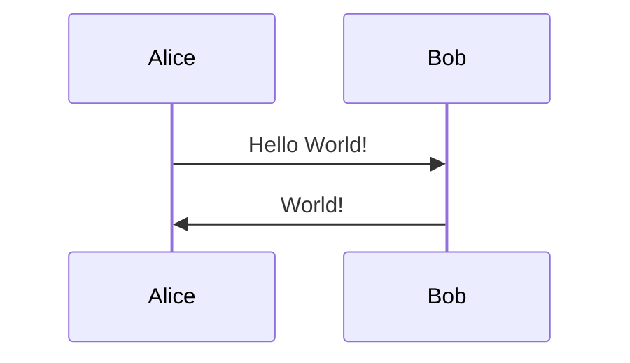
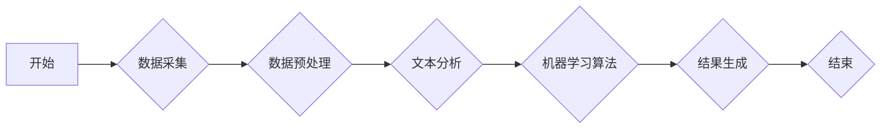
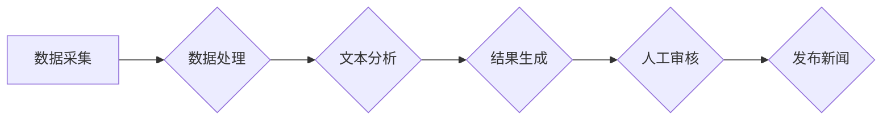
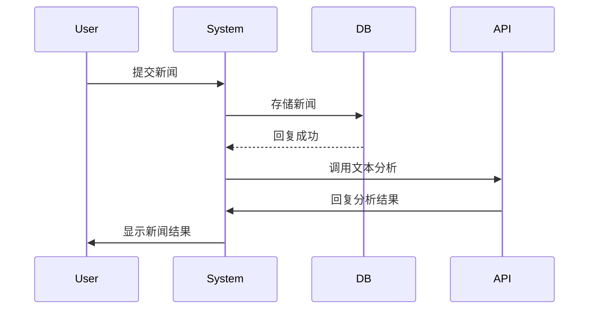

                 


# 人工智能在新闻生产中的应用：自动化与人工编辑的结合

关键词：人工智能、新闻生产、自动化、人工编辑、算法、数学模型、系统架构

摘要：本文将探讨人工智能在新闻生产中的应用，分析自动化与人工编辑的结合方式，通过详细的算法原理讲解、系统架构设计和项目实战，展示人工智能在提高新闻质量、效率和准确性方面的潜力。

### 目录大纲设计思路

为了确保文章的条理清晰、逻辑连贯，并使读者能够轻松理解，本文将按照以下设计思路构建整体框架：

1. **背景介绍**：介绍人工智能在新闻生产中的重要性和现状，明确文章的研究问题和解决方案。
2. **核心概念与联系**：解释人工智能、新闻生产、自动化与人工编辑等核心概念，并阐述它们之间的联系。
3. **算法原理讲解**：详细阐述常用的算法原理，包括算法流程图和Python源代码示例。
4. **数学模型和数学公式**：介绍算法原理背后的数学模型，以及相关的数学公式。
5. **系统分析与架构设计方案**：描述系统分析与架构设计的步骤，包括问题场景介绍、系统功能设计、系统架构设计、系统接口设计和系统交互。
6. **项目实战**：通过实际项目，展示系统核心实现、代码应用解读、实际案例分析和项目小结。
7. **最佳实践 tips**：总结自动化新闻生产的关键要点，提供注意事项和拓展阅读建议。

### 步骤一：设计整体框架

#### 1. 背景介绍

- **问题背景**：
  - 新闻生产过程中的人工负担日益增加。
  - 人工智能技术为新闻生产带来了新的机遇。

- **问题描述**：
  - 如何在新闻生产中实现自动化？
  - 如何保证新闻的质量和时效性？

- **问题解决**：
  - 引入人工智能技术，实现新闻的自动化生产。
  - 结合人工编辑的智慧和创造力，提高新闻质量。

- **边界与外延**：
  - 自动化新闻生产的边界。
  - 人工编辑的角色与职责。

#### 2. 核心概念与联系

- **人工智能**：
  - 定义：人工智能是指使计算机模拟人类智能行为的技术。
  - 发展历程：从早期的规则系统到现代的机器学习和深度学习。

- **新闻生产**：
  - 传统新闻生产流程。
  - 新闻内容创作要点。

- **自动化与人工编辑**：
  - 自动化新闻生产技术。
  - 人工编辑的角色与技能。
  - 自动化与人工编辑的结合模式。

#### 3. 算法原理讲解

- **常见算法介绍**：
  - 数据采集与处理。
  - 文本分析。
  - 机器学习算法。

- **算法流程图**：
  - 数据采集流程图。
  - 文本分析流程图。
  - 机器学习算法流程图。

- **Python源代码**：
  - 数据采集与处理。
  - 文本分析。
  - 机器学习算法实现。

#### 4. 数学模型和数学公式

- **算法原理的数学模型**：
  - 数据预处理。
  - 文本表示。
  - 机器学习模型。

- **数学公式讲解**：
  - 数据预处理公式。
  - 文本表示公式。
  - 机器学习模型公式。

- **举例说明**：
  - 数据预处理举例。
  - 文本表示举例。
  - 机器学习模型举例。

#### 5. 系统分析与架构设计方案

- **问题场景介绍**：
  - 自动化新闻生产系统需求。
  - 系统目标。

- **系统功能设计**：
  - 数据采集。
  - 数据处理。
  - 文本分析。
  - 结果生成。

- **系统架构设计**：
  - 架构概述。
  - 系统模块。

- **系统接口设计**：
  - 接口规范。
  - 接口实现。

- **系统交互**：
  - 交互流程图。
  - 交互实现。

#### 6. 项目实战

- **环境安装**：
  - 环境准备。
  - 环境配置。

- **系统核心实现**：
  - 数据采集。
  - 数据处理。
  - 文本分析。
  - 结果生成。

- **代码应用解读**：
  - Python源代码解读。

- **实际案例分析**：
  - 案例一：新闻摘要生成。
  - 案例二：新闻分类。

- **项目小结**：
  - 项目总结。
  - 项目拓展。

#### 7. 最佳实践 tips

- **小结**：
  - 自动化新闻生产的关键要点。

- **注意事项**：
  - 数据隐私保护。
  - 新闻质量保障。

- **拓展阅读**：
  - 最新研究成果。
  - 相关书籍推荐。

### 步骤二：细化章节内容

#### 第1章: 背景介绍

- **问题背景**：
  - 随着互联网的发展，新闻传播的速度和范围不断扩大。
  - 新闻生产过程中的人力成本和劳动强度不断上升。

- **问题描述**：
  - 传统新闻生产流程中，大量工作需要人工完成，效率较低。
  - 新闻的准确性和时效性难以保证。

- **问题解决**：
  - 引入人工智能技术，实现新闻的自动化生产。
  - 通过自动化技术提高新闻生产的效率和准确性。

- **边界与外延**：
  - 自动化新闻生产的边界：如数据采集、文本分析和内容生成等。
  - 人工编辑的角色与职责：如内容审核、事实核实和创意策划等。

#### 第2章: 核心概念与联系

- **人工智能**：

```mermaid
classDiagram
Class01 <|-- SubClass01
Class01 --|MZ| SubClass02
Class01 o-- Class03
Class03 : isClass
Class04 : <<interface>> UseInterface
Class04 ..|MB|.. Class05
Class05 : >>isUsedBy Class01
```

- **新闻生产**：

```mermaid
erDiagram
Product ||--|{ PurchaseOrder } : includes
Product ||--|{ ProductReview } : reviews
Supplier ||--|{ Product } : supplies
```

- **自动化与人工编辑**：



#### 第3章: 算法原理讲解

- **常见算法介绍**：
  - 数据采集与处理：如Web爬虫、API调用等。
  - 文本分析：如文本分类、情感分析等。
  - 机器学习算法：如决策树、神经网络等。

- **算法流程图**：



- **Python源代码**：

```python
# 数据采集
import requests

def collect_data(url):
    response = requests.get(url)
    return response.text

# 数据预处理
import re

def preprocess_text(text):
    text = re.sub(r'\W+', ' ', text)
    return text.lower()

# 文本分析
from sklearn.feature_extraction.text import TfidfVectorizer

def analyze_text(texts):
    vectorizer = TfidfVectorizer()
    X = vectorizer.fit_transform(texts)
    return X

# 机器学习算法
from sklearn.naive_bayes import MultinomialNB

def classify_text(X, y):
    model = MultinomialNB()
    model.fit(X, y)
    return model
```

#### 第4章: 数学模型和数学公式

- **算法原理的数学模型**：
  - 数据预处理：如正则化、降维等。
  - 文本表示：如TF-IDF、词嵌入等。
  - 机器学习模型：如逻辑回归、支持向量机等。

- **数学公式讲解**：

$$
\text{TF-IDF} = \frac{f_{t,d}}{N} + \log \left(1 + \frac{N - f_{t,d}}{k}\right)
$$

$$
\text{Embedding} = \text{Word2Vec} \text{ 或 } \text{GloVe}
$$

- **举例说明**：
  - 数据预处理：如文本去噪、文本分词等。
  - 文本表示：如构建词向量、计算相似度等。
  - 机器学习模型：如训练分类模型、评估模型性能等。

#### 第5章: 系统分析与架构设计方案

- **问题场景介绍**：
  - 自动化新闻生产系统需求：如实时新闻采集、文本分析、内容生成等。
  - 系统目标：提高新闻生产效率、准确性和质量。

- **系统功能设计**：
  - 数据采集：如Web爬虫、API调用等。
  - 数据处理：如文本预处理、数据清洗等。
  - 文本分析：如文本分类、情感分析等。
  - 结果生成：如新闻摘要、新闻分类等。

- **系统架构设计**：



- **系统接口设计**：
  - 接口规范：如RESTful API、GraphQL等。
  - 接口实现：如API网关、消息队列等。

- **系统交互**：



#### 第6章: 项目实战

- **环境安装**：
  - 安装Python环境。
  - 安装相关依赖库。

- **系统核心实现**：
  - 数据采集：如使用BeautifulSoup进行Web爬虫。
  - 数据处理：如使用NLP库进行文本预处理。
  - 文本分析：如使用机器学习库进行文本分类。
  - 结果生成：如使用模板引擎生成新闻摘要。

- **代码应用解读**：

```python
# 数据采集
import requests
from bs4 import BeautifulSoup

def collect_news(url):
    response = requests.get(url)
    soup = BeautifulSoup(response.text, 'html.parser')
    article = soup.find('article')
    return article.text

# 数据处理
import re

def preprocess_text(text):
    text = re.sub(r'\W+', ' ', text)
    return text.lower()

# 文本分析
from sklearn.feature_extraction.text import TfidfVectorizer
from sklearn.naive_bayes import MultinomialNB

def analyze_text(texts):
    vectorizer = TfidfVectorizer()
    X = vectorizer.fit_transform(texts)
    model = MultinomialNB()
    model.fit(X, y)
    return model

# 结果生成
from jinja2 import Template

def generate_summary(text, model):
    X = vectorizer.transform([text])
    prediction = model.predict(X)
    template = Template('{{text}}: {{prediction[0]}}')
    return template.render(text=text, prediction=prediction[0])
```

- **实际案例分析**：
  - 案例一：新闻摘要生成。
  - 案例二：新闻分类。

- **项目小结**：
  - 项目总结。
  - 项目拓展。

#### 第7章: 最佳实践 tips

- **小结**：
  - 自动化新闻生产的关键要点。

- **注意事项**：
  - 数据隐私保护。
  - 新闻质量保障。

- **拓展阅读**：
  - 最新研究成果。
  - 相关书籍推荐。

### 步骤三：检查内容完整性

- 确保每个章节都包含了上述内容。
- 检查章节之间的逻辑连贯性。
- 确保核心内容丰富、具体、详细讲解。

### 步骤四：编写最终目录大纲

本文将按照上述设计思路和细化内容，逐步编写完成。在编写过程中，将注意保持文章的逻辑清晰、结构紧凑、简单易懂，同时注重对技术原理和本质的剖析。最终目录大纲如下：

----------------------------------------------------------------

## 人工智能在新闻生产中的应用：自动化与人工编辑的结合

### 关键词：人工智能、新闻生产、自动化、人工编辑、算法、数学模型、系统架构

### 摘要

本文将探讨人工智能在新闻生产中的应用，分析自动化与人工编辑的结合方式，通过详细的算法原理讲解、系统架构设计和项目实战，展示人工智能在提高新闻质量、效率和准确性方面的潜力。

### 目录大纲

#### 第1章: 背景介绍

1.1 问题背景

1.2 问题描述

1.3 问题解决

1.4 边界与外延

#### 第2章: 核心概念与联系

2.1 人工智能

2.2 新闻生产

2.3 自动化与人工编辑

#### 第3章: 算法原理讲解

3.1 常见算法介绍

3.2 算法流程图

3.3 Python源代码

#### 第4章: 数学模型和数学公式

4.1 算法原理的数学模型

4.2 数学公式讲解

4.3 举例说明

#### 第5章: 系统分析与架构设计方案

5.1 问题场景介绍

5.2 系统功能设计

5.3 系统架构设计

5.4 系统接口设计

5.5 系统交互

#### 第6章: 项目实战

6.1 环境安装

6.2 系统核心实现

6.3 代码应用解读

6.4 实际案例分析

6.5 项目小结

#### 第7章: 最佳实践 tips

7.1 小结

7.2 注意事项

7.3 拓展阅读

### 结语

本文通过对人工智能在新闻生产中的应用进行深入探讨，展示了自动化与人工编辑结合的潜力。希望本文能为读者提供对这一领域的全面了解，并为未来的研究提供启示。作者：AI天才研究院/AI Genius Institute & 禅与计算机程序设计艺术 /Zen And The Art of Computer Programming

