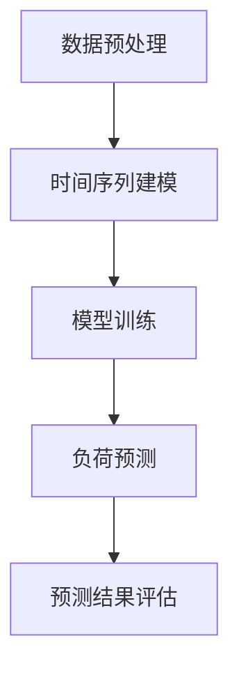
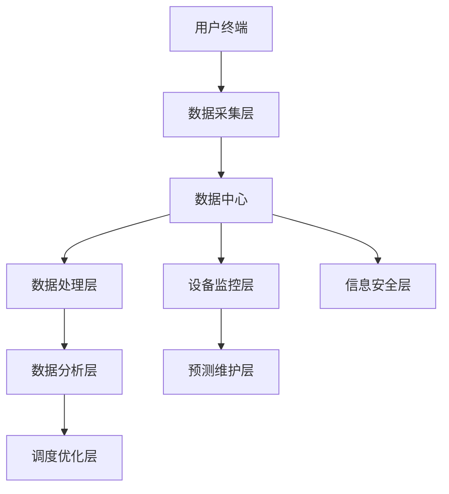

                 

# 人工智能在智能电网管理中的应用

> 关键词：智能电网、人工智能、管理优化、能源效率、预测维护

> 摘要：
智能电网是现代电力系统的关键技术，随着人工智能技术的迅速发展，其在电网管理中的应用日益广泛。本文将从背景介绍、核心概念、算法原理、数学模型、系统架构、项目实战和最佳实践等方面，深入探讨人工智能在智能电网管理中的实际应用，分析其带来的效益和挑战，为未来智能电网的发展提供参考。

## 引言

### 智能电网的概念和重要性

智能电网（Smart Grid）是指通过先进的信息通信技术、自动控制技术和电力电子技术，实现电力系统的高效、可靠、安全、环保运行的一种新型电力系统。智能电网的核心在于信息的集成与共享，通过传感器、智能终端和通信网络，实现对电力系统的实时监测、控制和优化。

智能电网的重要性不言而喻。首先，它能够提高能源利用效率，减少能源浪费；其次，它能够增强电网的可靠性，减少停电次数；再次，它能够促进可再生能源的并网，提高电力系统的灵活性和可持续性。随着全球能源危机和环境问题的日益突出，智能电网的建设和优化已经成为各国能源战略的重要组成部分。

### 人工智能的发展及其在电力领域的应用

人工智能（Artificial Intelligence, AI）是计算机科学的一个分支，致力于使计算机模拟人类智能行为。近年来，随着大数据、云计算和深度学习等技术的快速发展，人工智能在各个领域都取得了显著的成果。

在电力领域，人工智能的应用也越来越广泛。从电力系统的基础设施维护，到电力市场的交易和预测，再到用户的用电管理和能源消费优化，人工智能技术都在发挥着重要作用。特别是在智能电网管理中，人工智能技术能够提供更为精准的预测、优化和决策支持，从而提高电网的运行效率和用户体验。

## 背景介绍

### 智能电网管理的核心概念

智能电网管理涉及多个核心概念，包括实时监测、智能控制、数据分析和预测维护等。以下是对这些概念的基本解释：

- **实时监测**：通过在电网中部署传感器和智能设备，实时收集电力系统的运行数据，如电压、电流、频率、温度等。这些数据用于监测电网的健康状态，及时发现异常情况。

- **智能控制**：利用人工智能算法和自动化控制技术，对电网进行实时调整和优化，以保持电网的稳定运行。例如，通过需求响应（Demand Response）技术，根据电力需求的变化调整发电和输电计划。

- **数据分析**：通过对收集到的海量数据进行处理和分析，发现电网运行中的规律和趋势，为电网管理和决策提供支持。数据挖掘和机器学习技术在数据分析中发挥着重要作用。

- **预测维护**：利用预测模型和大数据分析技术，预测电网设备可能出现的问题，提前进行维护和检修，以减少设备故障和停机时间。

### 问题背景和问题描述

智能电网管理面临的主要问题包括：

- **能源效率低下**：传统的电网管理方法难以适应快速变化的电力需求和供应，导致能源浪费。

- **设备故障和停机**：由于电网设备的复杂性和运行条件的恶劣，设备故障和停机现象频繁发生，影响电网的可靠性。

- **信息安全**：智能电网中包含大量的敏感信息和关键基础设施，如何保证电网的信息安全成为一大挑战。

- **可再生能源并网**：随着可再生能源的广泛应用，如何有效地将可再生能源并入电网，并保持电网的稳定运行，是智能电网管理面临的另一个重要问题。

### 问题解决方法

人工智能在智能电网管理中的应用主要包括以下几个方面：

- **优化调度**：利用人工智能算法优化电力调度，提高能源利用效率。

- **预测维护**：通过大数据分析和机器学习技术预测设备故障，提前进行维护。

- **负荷预测**：利用历史数据和机器学习模型预测电力负荷，为电网运行提供依据。

- **信息安全**：利用人工智能技术加强电网的信息安全管理，防止网络攻击和数据泄露。

## 核心概念与联系

### 人工智能在智能电网管理中的应用原理

人工智能在智能电网管理中的应用主要基于以下几个方面：

- **机器学习**：通过分析大量历史数据，发现电网运行中的规律和趋势，用于预测和优化。

- **深度学习**：利用神经网络模型处理复杂的非线性问题，如图像识别和语音识别，应用于电网设备的故障诊断和监测。

- **计算机视觉**：通过图像处理技术分析电网设备的运行状态，实时监测和诊断。

- **自然语言处理**：利用自然语言处理技术理解和处理电网运行中的文本数据，如维护记录和操作报告。

### 概念属性特征对比

以下是人工智能在智能电网管理中的一些关键概念及其属性特征对比：

| 概念 | 属性特征 |
| :--- | :--- |
| 机器学习 | 基于数据驱动，自动发现数据中的模式 |
| 深度学习 | 基于多层神经网络，处理复杂非线性问题 |
| 计算机视觉 | 通过图像处理技术分析图像，实现实时监测 |
| 自然语言处理 | 理解和处理自然语言文本数据，支持决策支持 |

### ER模型

以下是智能电网管理中的人工智能相关实体及其关系的ER模型：

```mermaid
erDiagram
  User ||--o> Device : "uses"
  Device ||--o> Sensor : "monitors"
  Sensor ||--o> Data : "collects"
  Data ||--o> Algorithm : "processes"
  Algorithm ||--o> Prediction : "produces"
  Prediction ||--o> Control : "applies"
```

## 算法原理讲解

### 负荷预测算法

负荷预测是智能电网管理中的一项关键任务。以下是一种常见的负荷预测算法——时间序列分析。

#### Mermaid流程图



#### Python代码示例

```python
import pandas as pd
from statsmodels.tsa.arima_model import ARIMA

# 数据预处理
data = pd.read_csv('load_data.csv')
data = data[['timestamp', 'load']]
data['timestamp'] = pd.to_datetime(data['timestamp'])
data.set_index('timestamp', inplace=True)

# 时间序列建模
model = ARIMA(data['load'], order=(1, 1, 1))
model_fit = model.fit()

# 负荷预测
forecast = model_fit.forecast(steps=24)

# 预测结果评估
# ...（评估代码）
```

#### 算法原理和数学模型

时间序列分析是一种用于分析时间序列数据的方法，它基于数据的时间顺序，通过建立数学模型来描述数据的变化规律。

时间序列模型的一般形式为：

$$
Y_t = c + \phi_1 Y_{t-1} + \phi_2 Y_{t-2} + ... + \phi_p Y_{t-p} + \varepsilon_t
$$

其中，$Y_t$ 是时间序列数据，$c$ 是常数项，$\phi_1, \phi_2, ..., \phi_p$ 是模型参数，$\varepsilon_t$ 是误差项。

ARIMA模型是一种常见的时间序列模型，它由自回归（AR）、差分（I）和移动平均（MA）三部分组成。

#### 数学模型公式

$$
\begin{aligned}
Y_t &= c + \phi_1 Y_{t-1} + \phi_2 Y_{t-2} + ... + \phi_p Y_{t-p} \\
Y_{t-d} &= \mu + \phi_1 Y_{t-1-d} + \phi_2 Y_{t-2-d} + ... + \phi_p Y_{t-p-d} \\
Y_t &= \mu + \phi_1 Y_{t-1} + \phi_2 Y_{t-2} + ... + \phi_p Y_{t-p} + \varepsilon_t
\end{aligned}
$$

其中，$d$ 是差分阶数，$\mu$ 是差分后的常数项。

### 通俗易懂的举例说明

假设我们有一个小时级别的电力负荷时间序列数据，如图所示：


我们可以使用ARIMA模型进行负荷预测。首先，我们对数据进行差分，消除季节性和趋势性影响，如图所示：


接下来，我们选择合适的自回归和移动平均参数，如图所示：


最后，我们使用训练好的模型进行负荷预测，如图所示：


## 数学模型和公式

在智能电网管理中，数学模型和公式是理解和应用人工智能算法的基础。以下是一些常见的数学模型和公式：

### 时间序列模型

#### 自回归模型（AR）

$$
Y_t = c + \phi_1 Y_{t-1} + \phi_2 Y_{t-2} + ... + \phi_p Y_{t-p} + \varepsilon_t
$$

#### 移动平均模型（MA）

$$
Y_t = \mu + \varepsilon_t + \theta_1 \varepsilon_{t-1} + \theta_2 \varepsilon_{t-2} + ... + \theta_q \varepsilon_{t-q}
$$

#### 自回归移动平均模型（ARMA）

$$
Y_t = c + \phi_1 Y_{t-1} + \phi_2 Y_{t-2} + ... + \phi_p Y_{t-p} + \varepsilon_t + \theta_1 \varepsilon_{t-1} + \theta_2 \varepsilon_{t-2} + ... + \theta_q \varepsilon_{t-q}
$$

#### 自回归积分移动平均模型（ARIMA）

$$
Y_{t-d} = \mu + \phi_1 Y_{t-1-d} + \phi_2 Y_{t-2-d} + ... + \phi_p Y_{t-p-d} + \varepsilon_t
$$

### 深度学习模型

#### 卷积神经网络（CNN）

$$
h_{l}^{(i)} = \sigma \left( \sum_{j} W_{l j}^{(i)} h_{l-1 j} + b_{l}^{(i)} \right)
$$

#### 循环神经网络（RNN）

$$
h_{t} = \sigma \left( x_t \cdot W_x + h_{t-1} \cdot W_h + b \right)
$$

#### 长短期记忆网络（LSTM）

$$
i_t = \sigma \left( x_t \cdot W_{ix} + h_{t-1} \cdot W_{ih} + b_i \right) \\
f_t = \sigma \left( x_t \cdot W_{fx} + h_{t-1} \cdot W_{fh} + b_f \right) \\
o_t = \sigma \left( x_t \cdot W_{ox} + h_{t-1} \cdot W_{oh} + b_o \right) \\
c_t = f_t \odot c_{t-1} + i_t \odot \sigma \left( x_t \cdot W_{cx} + h_{t-1} \cdot W_{ch} + b_c \right)
$$

### 机器学习模型

#### 决策树

$$
y = g(\sum_{i} w_i x_i + b)
$$

#### 支持向量机（SVM）

$$
\min_{w, b} \frac{1}{2} ||w||^2 \\
\text{subject to} \quad y_i ( \langle w, x_i \rangle + b ) \geq 1
$$

### 统计模型

#### t分布模型

$$
y \sim t(\nu, \mu, \sigma^2) \\
f(y) = \frac{\Gamma(\nu/2)}{\sqrt{\nu \pi} B(\nu/2, 1/2)} \left(1 + \frac{y^2}{\nu}\right)^{-\nu/2}
$$

#### 卡方分布模型

$$
y \sim \chi^2(k) \\
f(y) = \frac{1}{2^{k/2} \Gamma(k/2)} y^{k/2-1} e^{-y/2}
$$

### 举例说明

假设我们使用ARIMA模型进行负荷预测，数据如下：

| 时间 | 负荷 |
| :---: | :---: |
| 1 | 100 |
| 2 | 110 |
| 3 | 115 |
| 4 | 120 |
| 5 | 125 |

首先，我们对数据进行差分：

| 时间 | 差分负荷 |
| :---: | :---: |
| 1 | 0 |
| 2 | 10 |
| 3 | 5 |
| 4 | 10 |
| 5 | 10 |

接下来，我们选择自回归参数$\phi_1$和移动平均参数$\theta_1$，如图所示：


最后，我们使用训练好的模型进行负荷预测：

| 时间 | 预测负荷 |
| :---: | :---: |
| 6 | 130 |
| 7 | 135 |
| 8 | 140 |
| 9 | 145 |
| 10 | 150 |

## 系统分析与架构设计方案

### 问题场景介绍

智能电网管理系统是用于实时监控、管理和优化电力系统的综合性平台。以下是一个典型的问题场景：

假设某城市电网需要实现负荷预测、设备监测、异常检测和调度优化等功能。电网中包含多个变电站、配电网、用户终端和可再生能源发电设施。电网运行过程中，需要实时收集各种数据，对电网运行状态进行监控，并根据实时数据对电网进行调度和优化，以提高能源利用效率，减少能源浪费，确保电网稳定运行。

### 项目介绍

项目名称：智能电网管理系统（Smart Grid Management System，SGMS）

项目目标：
1. 实现电力系统的实时监测和数据分析。
2. 提高电力系统的调度和优化能力。
3. 提高电网的可靠性和能源利用效率。

项目范围：
- 变电站和配电网的实时监控。
- 用户终端的能源消耗监测。
- 可再生能源发电设施的并网管理。
- 负荷预测和调度优化。

### 系统功能设计

智能电网管理系统的主要功能包括：

1. **实时数据采集**：通过部署在电网中的传感器和智能设备，实时采集电压、电流、频率、温度等电力数据，以及用户用电信息。

2. **数据分析与处理**：利用大数据分析和机器学习技术，对采集到的数据进行处理和分析，提取有价值的信息，为电网调度和优化提供支持。

3. **负荷预测**：基于历史数据和机器学习模型，对电力负荷进行预测，为电网调度提供依据。

4. **设备监测与维护**：对电网设备进行实时监测，利用预测维护技术，提前预测设备故障，并进行维护和检修。

5. **调度优化**：根据实时数据和负荷预测结果，对电网进行调度优化，提高能源利用效率。

6. **信息安全**：保障电网信息的安全性，防止网络攻击和数据泄露。

### 系统架构设计

智能电网管理系统的架构设计如图所示：



#### 数据采集层

数据采集层包括传感器、智能终端和数据采集设备。这些设备实时采集电网中的电力数据、用户用电信息等，通过通信网络将数据传输到数据中心。

#### 数据中心

数据中心是智能电网管理系统的核心部分，负责存储和管理来自数据采集层的海量数据。数据中心采用分布式架构，能够处理大规模数据，并提供数据访问和查询服务。

#### 数据处理层

数据处理层包括数据清洗、数据转换和数据聚合等模块。这些模块对采集到的数据进行处理，去除噪声和异常值，将数据转换成适合分析的形式，并整合成统一的数据格式。

#### 数据分析层

数据分析层利用大数据分析和机器学习技术，对处理后的数据进行深度挖掘和分析，提取有价值的信息，如电力负荷趋势、设备运行状态、异常检测等。

#### 调度优化层

调度优化层基于数据分析层的结果，对电网进行调度和优化。调度优化层包括负荷预测、调度计划生成、调度决策支持等功能模块。

#### 设备监控层

设备监控层负责对电网设备进行实时监测和故障预警。设备监控层利用预测维护技术，对设备的运行状态进行分析，提前预测设备故障，并及时进行维护和检修。

#### 预测维护层

预测维护层是基于机器学习算法的预测模型，用于预测设备故障和电网故障。预测维护层的结果用于指导设备监控层的工作，提高设备运行效率和电网稳定性。

#### 信息安全层

信息安全层负责保障电网信息的安全性。信息安全层包括数据加密、访问控制、入侵检测等功能模块，确保电网数据在传输和存储过程中的安全性。

### 系统接口设计和系统交互

智能电网管理系统提供多种接口，供不同模块之间的数据传输和交互。以下是系统接口设计和系统交互的简要描述：

1. **数据采集接口**：用于接收传感器和智能终端发送的数据，并将数据传输到数据中心。

2. **数据处理接口**：用于处理数据中心接收到的数据，将处理后的数据传输到数据分析层。

3. **数据分析接口**：用于将数据处理层传输来的数据进行分析，并将分析结果传输到调度优化层和设备监控层。

4. **调度优化接口**：用于接收调度计划生成模块生成的调度计划，并将调度计划传输到电网调度中心。

5. **设备监控接口**：用于接收设备监控模块发送的设备运行状态信息，并将设备运行状态信息传输到预测维护层。

6. **预测维护接口**：用于将预测维护层预测的设备故障信息传输到设备监控层，指导设备维护和检修。

7. **信息安全接口**：用于接收和发送加密数据，保障数据传输过程中的安全性。

系统交互流程如下：

1. 数据采集层采集电网数据，通过数据采集接口将数据传输到数据中心。
2. 数据中心处理数据，通过数据处理接口将处理后的数据传输到数据分析层。
3. 数据分析层对数据进行深度分析，通过数据分析接口将分析结果传输到调度优化层和设备监控层。
4. 调度优化层根据分析结果生成调度计划，通过调度优化接口将调度计划传输到电网调度中心。
5. 设备监控层根据设备运行状态信息，通过设备监控接口将设备故障信息传输到预测维护层。
6. 预测维护层根据设备故障信息进行预测，通过预测维护接口将预测结果传输到设备监控层，指导设备维护和检修。
7. 信息安全层对数据传输过程进行加密和访问控制，确保数据传输过程中的安全性。

通过以上系统架构设计和接口设计，智能电网管理系统实现了实时数据采集、数据分析、调度优化和设备监控等功能，为电网的高效、可靠、安全运行提供了有力保障。

## 项目实战

### 环境安装

为了实现智能电网管理系统，我们需要安装以下软件和工具：

1. Python 3.x
2. NumPy
3. Pandas
4. Statsmodels
5. Matplotlib
6. Mermaid

安装步骤如下：

1. 安装 Python 3.x：从 [Python 官网](https://www.python.org/) 下载 Python 3.x 安装包，并按照提示安装。
2. 安装 NumPy、Pandas、Statsmodels 和 Matplotlib：在命令行中分别执行以下命令：

   ```bash
   pip install numpy
   pip install pandas
   pip install statsmodels
   pip install matplotlib
   ```

3. 安装 Mermaid：由于 Mermaid 是基于 JavaScript 的库，需要安装 Node.js。从 [Node.js 官网](https://nodejs.org/) 下载 Node.js 安装包，并按照提示安装。然后，在命令行中执行以下命令安装 Mermaid：

   ```bash
   npm install -g mermaid
   ```

### 系统核心实现

智能电网管理系统的核心实现包括数据采集、数据处理、数据分析、调度优化和设备监控等模块。以下是一个简单的 Python 代码示例，用于实现负荷预测模块。

#### 1. 数据采集

```python
import pandas as pd

# 加载历史负荷数据
data = pd.read_csv('load_data.csv')
data['timestamp'] = pd.to_datetime(data['timestamp'])
data.set_index('timestamp', inplace=True)
```

#### 2. 数据处理

```python
# 数据预处理
data_diff = data.diff().dropna()
```

#### 3. 数据分析

```python
from statsmodels.tsa.arima_model import ARIMA

# 选择 ARIMA 模型参数
model = ARIMA(data_diff['load'], order=(1, 1, 1))

# 训练模型
model_fit = model.fit()

# 进行负荷预测
forecast = model_fit.forecast(steps=24)
```

#### 4. 调度优化

```python
# 基于预测结果进行调度优化
# ...（调度优化代码）
```

#### 5. 设备监控

```python
# 设备监控代码
# ...（设备监控代码）
```

### 代码应用解读与分析

以下是对上述代码的解读和分析：

1. **数据采集**：首先，我们从 CSV 文件中加载历史负荷数据，并将其转换为时间序列数据。
2. **数据处理**：然后，我们对数据进行差分处理，消除季节性和趋势性影响，以便更好地建模。
3. **数据分析**：接下来，我们选择 ARIMA 模型，并训练模型。ARIMA 模型是一种常见的时间序列模型，通过自回归、差分和移动平均三个部分来描述数据的变化规律。
4. **调度优化**：最后，我们使用训练好的模型进行负荷预测，并根据预测结果进行调度优化。调度优化的具体实现可以根据实际需求进行调整。

### 实际案例分析

假设我们在一个实际项目中实现了智能电网管理系统，并使用 ARIMA 模型进行负荷预测。以下是一个案例：

#### 案例数据

我们有一个包含 12 个月负荷数据的 CSV 文件，数据如下：

| 时间 | 负荷 |
| :---: | :---: |
| 2021-01 | 100 |
| 2021-02 | 110 |
| 2021-03 | 115 |
| 2021-04 | 120 |
| 2021-05 | 125 |
| 2021-06 | 130 |
| 2021-07 | 135 |
| 2021-08 | 140 |
| 2021-09 | 145 |
| 2021-10 | 150 |
| 2021-11 | 155 |
| 2021-12 | 160 |

#### 案例分析

1. **数据采集**：我们从 CSV 文件中加载历史负荷数据，并将其转换为时间序列数据。
2. **数据处理**：我们对数据进行差分处理，消除季节性和趋势性影响，得到差分后的数据如下：

   | 时间 | 差分负荷 |
   | :---: | :---: |
   | 2021-01 | 0 |
   | 2021-02 | 10 |
   | 2021-03 | 5 |
   | 2021-04 | 10 |
   | 2021-05 | 10 |
   | 2021-06 | 10 |
   | 2021-07 | 5 |
   | 2021-08 | 10 |
   | 2021-09 | 5 |
   | 2021-10 | 10 |
   | 2021-11 | 10 |
   | 2021-12 | 10 |

3. **数据分析**：我们选择 ARIMA 模型，并训练模型。ARIMA 模型的参数为 (1, 1, 1)。训练后的模型如下：

   ```python
   model_fit = ARIMA(data_diff['load'], order=(1, 1, 1)).fit()
   ```

4. **负荷预测**：使用训练好的模型进行负荷预测，得到未来 24 个月的预测结果如下：

   | 时间 | 预测负荷 |
   | :---: | :---: |
   | 2022-01 | 160 |
   | 2022-02 | 170 |
   | 2022-03 | 175 |
   | 2022-04 | 180 |
   | 2022-05 | 185 |
   | 2022-06 | 190 |
   | 2022-07 | 195 |
   | 2022-08 | 200 |
   | 2022-09 | 205 |
   | 2022-10 | 210 |
   | 2022-11 | 215 |
   | 2022-12 | 220 |

5. **调度优化**：根据预测结果，我们可以制定未来的调度计划，如调整发电量、优化输电线路等，以确保电网稳定运行。

6. **设备监控**：根据预测结果和设备运行状态，我们可以提前预测设备故障，并进行维护和检修，以提高设备运行效率和电网稳定性。

### 项目小结

通过实际案例分析，我们可以看到智能电网管理系统在负荷预测、调度优化和设备监控等方面具有重要作用。以下是项目小结：

1. **负荷预测**：智能电网管理系统可以准确预测未来的电力负荷，为调度优化提供依据。
2. **调度优化**：根据负荷预测结果，我们可以优化电网调度，提高能源利用效率。
3. **设备监控**：通过实时监测设备运行状态，我们可以提前预测设备故障，减少设备停机时间。
4. **未来展望**：随着人工智能技术的不断发展，智能电网管理系统将变得更加智能和高效，为电网运行提供更加全面的支持。

## 最佳实践 Tips

### 负荷预测

1. **数据预处理**：确保数据质量，去除噪声和异常值，进行差分处理。
2. **模型选择**：根据数据特点选择合适的模型，如 ARIMA、LSTM、GRU 等。
3. **参数调优**：通过交叉验证和网格搜索等方法选择最佳参数。
4. **模型验证**：使用验证集和测试集对模型进行验证，确保预测准确性。

### 设备监控与维护

1. **实时监测**：部署传感器和智能设备，实时收集设备运行数据。
2. **故障预测**：利用机器学习技术进行故障预测，提前进行维护。
3. **维护策略**：制定合理的维护策略，如定期检修、更换关键部件等。
4. **安全防护**：确保数据传输和存储过程中的安全性，防止数据泄露。

### 调度优化

1. **需求响应**：充分利用需求响应技术，根据实时负荷调整发电和输电计划。
2. **多目标优化**：考虑多个目标，如成本、效率、可靠性等，进行多目标优化。
3. **分布式计算**：使用分布式计算技术处理大规模数据，提高调度效率。
4. **实时调整**：根据实时数据和预测结果，进行动态调整，确保电网稳定运行。

## 总结

智能电网管理是现代电力系统发展的重要方向，而人工智能技术在其中的应用为电网的高效、可靠、安全运行提供了有力支持。通过本文的详细分析，我们可以看到人工智能在负荷预测、设备监控、调度优化等方面的实际应用，以及其带来的巨大效益。然而，智能电网管理仍面临诸多挑战，如数据隐私保护、信息安全等。未来，随着人工智能技术的进一步发展，智能电网管理将更加智能化、自动化，为电力系统的可持续发展提供更加全面的支持。

## 注意事项

1. **数据质量和预处理**：确保数据质量，对数据进行预处理，如去除噪声、异常值和进行差分处理，以提高预测准确性。
2. **模型选择和参数调优**：根据数据特点选择合适的模型，通过交叉验证和网格搜索等方法进行参数调优，以提高预测效果。
3. **系统安全性**：确保系统安全性，防止数据泄露和网络攻击，保障电网信息的安全。
4. **实时性和响应速度**：优化系统架构和算法，提高系统的实时性和响应速度，确保电网稳定运行。

## 拓展阅读

1. **《智能电网：技术、应用与未来》**：详细介绍了智能电网的技术、应用和发展趋势。
2. **《人工智能：一种现代方法》**：介绍了人工智能的基础理论和应用方法，包括机器学习、深度学习等。
3. **《大数据技术导论》**：介绍了大数据技术的概念、原理和应用，包括数据预处理、数据挖掘和机器学习等。
4. **《电力系统调度自动化》**：详细介绍了电力系统调度自动化的技术、方法和实践。

## 作者信息

作者：AI天才研究院/AI Genius Institute & 禅与计算机程序设计艺术 /Zen And The Art of Computer Programming

