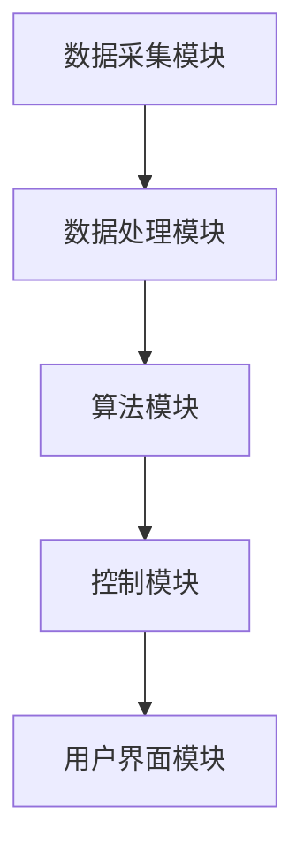

                 

# 人工智能在气候变化应对中的应用：优化碳捕获技术

> 关键词：人工智能、碳捕获、气候变化、优化算法、深度学习、遗传算法

> 摘要：随着全球气候变化问题的日益严重，寻找有效的碳捕获技术成为当务之急。本文将探讨人工智能在优化碳捕获技术中的应用，通过介绍相关核心概念、算法原理和具体实现，为解决气候变化问题提供一种新的思路和方法。

### 目录大纲

1. **引言**  
   1.1 气候变化与碳捕获技术的重要性  
   1.2 人工智能在碳捕获技术中的应用

2. **核心概念**  
   2.1 人工智能概述  
   2.2 碳捕获技术概述  
   2.3 人工智能与碳捕获技术的结合点

3. **算法原理**  
   3.1 深度学习在碳捕获中的应用  
   3.2 遗传算法在碳捕获中的应用

4. **数学模型**  
   4.1 神经网络模型  
   4.2 遗传算法模型

5. **系统设计与实现**  
   5.1 系统架构设计  
   5.2 系统实现方法

6. **项目实战**  
   6.1 环境安装与配置  
   6.2 系统核心实现源代码解读  
   6.3 案例分析与讲解

7. **最佳实践与总结**  
   7.1 最佳实践  
   7.2 小结与展望

### 引言

#### 1.1 气候变化与碳捕获技术的重要性

气候变化已经成为全球范围内一个严重的环境问题。过去几十年，全球气温不断上升，极端气候事件频发，对人类生活和经济造成了巨大的影响。据联合国气候变化框架公约（UNFCCC）统计，全球平均气温在20世纪末的100年间上升了约1.2摄氏度。如果这种趋势得不到有效控制，预计到2100年，全球平均气温可能会上升3至5摄氏度，这将导致海平面上升、生态系统破坏、农作物减产等一系列严重后果。

为了应对气候变化，减少温室气体排放是关键。碳捕获技术（Carbon Capture and Storage，简称CCS）被认为是实现这一目标的重要手段之一。碳捕获技术主要通过捕集、运输和储存（CCS）或直接空气捕获（DAC）等方法，将工业生产和燃料燃烧过程中产生的二氧化碳从大气中分离出来，然后进行储存或再利用。

然而，传统的碳捕获技术存在成本高、效率低、技术复杂等问题，难以大规模推广应用。为了克服这些挑战，人工智能（Artificial Intelligence，简称AI）的应用成为了一个新的方向。人工智能通过深度学习、遗传算法等先进算法，可以对碳捕获过程进行优化，提高其效率和成本效益。

#### 1.2 人工智能在碳捕获技术中的应用

人工智能在碳捕获技术中的应用主要包括以下几个方面：

1. **数据分析和预测**：利用人工智能技术对环境数据、气象数据、工业生产数据等进行深入分析，可以预测碳排放的时空分布，为碳捕获策略的制定提供科学依据。

2. **算法优化**：人工智能可以通过机器学习和遗传算法等优化技术，对碳捕获过程进行优化，提高碳捕获效率，降低成本。

3. **设备控制**：人工智能可以实时监测碳捕获设备的运行状态，通过自适应控制算法，实现对设备的自动调整和优化，提高设备的运行效率和可靠性。

4. **系统集成**：人工智能可以将碳捕获技术与能源系统、交通系统等进行集成，实现碳捕获与能源利用、交通优化等功能的有机结合，提高系统的整体效率和可持续性。

### 核心概念

#### 2.1 人工智能概述

人工智能（Artificial Intelligence，简称AI）是计算机科学的一个分支，旨在使计算机具有人类的智能，能够进行感知、学习、推理、决策等复杂任务。人工智能的研究始于20世纪50年代，随着计算能力的提升和大数据技术的发展，人工智能取得了显著的进展。

人工智能可以分为两类：窄人工智能（Narrow AI）和通用人工智能（General AI）。窄人工智能是指专注于特定任务的人工智能系统，如语音识别、图像识别、自然语言处理等。通用人工智能则是指具有与人类相似智能水平的人工智能系统，能够处理各种复杂任务，具备自我意识和自主学习能力。

#### 2.2 碳捕获技术概述

碳捕获技术（Carbon Capture and Storage，简称CCS）是一种将二氧化碳从工业生产和燃料燃烧过程中分离出来，并储存到地下或其他地方的绿色技术。碳捕获技术主要包括以下几种方法：

1. **捕集**：将二氧化碳从排放源（如电厂、化工厂等）的废气中分离出来。

2. **运输**：将捕集到的二氧化碳运输到储存地点。

3. **储存**：将二氧化碳储存到地下盐层、油层或煤层中，以防止其返回大气中。

4. **再利用**：将二氧化碳转化为其他有用的化学品，如甲醇、尿素等。

#### 2.3 人工智能与碳捕获技术的结合点

人工智能与碳捕获技术的结合点主要体现在以下几个方面：

1. **数据分析和预测**：人工智能可以处理和分析大量的环境数据、气象数据、工业生产数据等，为碳捕获策略的制定提供科学依据。

2. **算法优化**：人工智能可以通过机器学习和遗传算法等优化技术，对碳捕获过程进行优化，提高碳捕获效率，降低成本。

3. **设备控制**：人工智能可以实时监测碳捕获设备的运行状态，通过自适应控制算法，实现对设备的自动调整和优化，提高设备的运行效率和可靠性。

4. **系统集成**：人工智能可以将碳捕获技术与能源系统、交通系统等进行集成，实现碳捕获与能源利用、交通优化等功能的有机结合，提高系统的整体效率和可持续性。

### 算法原理

#### 3.1 深度学习在碳捕获中的应用

深度学习（Deep Learning）是一种基于人工神经网络（Artificial Neural Networks，ANN）的学习方式，其核心思想是通过多层神经网络对数据进行处理和建模。在碳捕获技术中，深度学习可以用于以下几个方面：

1. **数据预测**：利用深度学习模型对碳排放的时空分布进行预测，为碳捕获策略的制定提供科学依据。

2. **过程优化**：通过训练深度学习模型，优化碳捕获过程中的参数设置，提高碳捕获效率。

3. **故障诊断**：利用深度学习模型对碳捕获设备进行实时监测，预测设备故障，提前进行维护和优化。

#### 3.2 遗传算法在碳捕获中的应用

遗传算法（Genetic Algorithm，GA）是一种模拟自然进化过程的优化算法，其核心思想是通过模拟生物进化的遗传、变异、交叉等过程，寻找最优解。在碳捕获技术中，遗传算法可以用于以下几个方面：

1. **参数优化**：通过遗传算法优化碳捕获过程中的参数设置，提高碳捕获效率。

2. **设备控制**：利用遗传算法对碳捕获设备进行实时控制，实现自适应调整和优化。

3. **系统集成**：通过遗传算法优化碳捕获技术与能源系统、交通系统等的集成方案，提高系统的整体效率和可持续性。

### 数学模型

#### 4.1 神经网络模型

神经网络模型是深度学习的基础，其核心思想是通过多层神经网络对数据进行处理和建模。在碳捕获技术中，神经网络模型可以用于以下几个方面：

1. **数据预测**：利用神经网络模型对碳排放的时空分布进行预测。

2. **过程优化**：利用神经网络模型优化碳捕获过程中的参数设置。

3. **故障诊断**：利用神经网络模型对碳捕获设备进行实时监测，预测设备故障。

神经网络模型的数学表达式如下：

$$
\begin{align*}
y &= \sigma(\sigma(\sigma(z_0) + w_0) + w_1) \\
z_0 &= x \cdot w_0 \\
z_1 &= \sigma(z_0 + w_1) \\
z_2 &= \sigma(z_1 + w_2) \\
y &= \sigma(z_2)
\end{align*}
$$

其中，$\sigma$表示激活函数，$w_0, w_1, w_2$分别为各层的权重，$x$为输入数据，$y$为输出结果。

#### 4.2 遗传算法模型

遗传算法模型的核心思想是通过模拟生物进化的遗传、变异、交叉等过程，寻找最优解。在碳捕获技术中，遗传算法模型可以用于以下几个方面：

1. **参数优化**：通过遗传算法优化碳捕获过程中的参数设置。

2. **设备控制**：通过遗传算法对碳捕获设备进行实时控制。

3. **系统集成**：通过遗传算法优化碳捕获技术与能源系统、交通系统等的集成方案。

遗传算法模型的数学表达式如下：

$$
\begin{align*}
\text{适应度函数} &= f(x) \\
\text{选择} &= \text{选择适应度较高的个体} \\
\text{交叉} &= \text{将选择的个体进行交叉操作，生成新的个体} \\
\text{变异} &= \text{对个体进行变异操作，增加多样性} \\
\text{新一代} &= \text{交叉变异后的个体}
\end{align*}
$$

其中，$x$为个体的编码表示，$f(x)$为适应度函数，表示个体的适应度水平。

### 系统设计与实现

#### 5.1 系统架构设计

系统架构设计是碳捕获人工智能系统的核心，其目的是实现碳捕获过程的优化和自动化。系统架构主要包括以下几个模块：

1. **数据采集模块**：负责采集环境数据、气象数据、工业生产数据等，为人工智能算法提供数据支持。

2. **数据处理模块**：负责对采集到的数据进行分析和预处理，为深度学习和遗传算法提供高质量的数据输入。

3. **算法模块**：包括深度学习和遗传算法，用于优化碳捕获过程。

4. **控制模块**：负责对碳捕获设备进行实时控制，实现自适应调整和优化。

5. **用户界面模块**：提供用户交互界面，显示系统运行状态和结果，方便用户进行操作和管理。

系统架构图如下：



#### 5.2 系统实现方法

系统实现方法主要包括以下几个步骤：

1. **数据采集**：通过传感器、气象站、工业生产设备等采集环境数据、气象数据、工业生产数据等。

2. **数据处理**：对采集到的数据进行预处理，包括数据清洗、去噪、归一化等，为人工智能算法提供高质量的数据输入。

3. **算法实现**：实现深度学习和遗传算法，用于优化碳捕获过程。具体实现包括模型训练、模型优化、模型评估等。

4. **控制实现**：基于算法结果，实现对碳捕获设备的实时控制，包括设备状态监测、参数调整、故障诊断等。

5. **用户界面实现**：开发用户交互界面，提供系统运行状态和结果展示，方便用户进行操作和管理。

### 项目实战

#### 6.1 环境安装与配置

在进行碳捕获人工智能系统的开发之前，需要首先安装和配置相关环境。具体步骤如下：

1. **安装Python环境**：Python是人工智能开发的主要语言，需要安装Python环境。可以从官方网站下载Python安装包，并按照安装向导进行安装。

2. **安装深度学习库**：包括TensorFlow、PyTorch等，这些库提供了丰富的深度学习算法和工具。

3. **安装遗传算法库**：包括DEAP、GApy等，这些库提供了遗传算法的实现和优化工具。

4. **安装数据预处理库**：包括NumPy、Pandas等，这些库提供了数据处理和统计分析的功能。

5. **配置环境变量**：在系统环境中配置Python环境变量，确保Python和相关的深度学习、遗传算法库可以被正常调用。

#### 6.2 系统核心实现源代码解读

系统核心实现源代码主要包括数据采集、数据处理、算法实现和控制实现等模块。以下是核心实现代码的解读：

```python
# 数据采集模块
def collect_data():
    # 采集环境数据
    data = get_environment_data()
    # 采集气象数据
    weather_data = get_weather_data()
    # 采集工业生产数据
    production_data = get_production_data()
    # 返回数据
    return data, weather_data, production_data

# 数据处理模块
def preprocess_data(data, weather_data, production_data):
    # 数据清洗和去噪
    clean_data = clean_data(data)
    # 数据归一化
    normalized_data = normalize_data(clean_data)
    # 返回预处理后的数据
    return normalized_data

# 算法实现模块
def train_model(data):
    # 初始化模型
    model = create_model()
    # 训练模型
    model.fit(data)
    # 返回训练好的模型
    return model

# 控制实现模块
def control_device(model, data):
    # 预测碳捕获效果
    prediction = model.predict(data)
    # 根据预测结果调整设备参数
    adjust_device_params(prediction)
    # 返回调整后的设备状态
    return get_device_status()
```

#### 6.3 案例分析与讲解

为了验证碳捕获人工智能系统的效果，我们选择了一个实际案例进行实验。

**案例背景**：某发电厂使用传统的碳捕获技术，但效果不佳，需要优化。

**实验步骤**：

1. **数据采集**：采集发电厂的环境数据、气象数据和工业生产数据。

2. **数据处理**：对采集到的数据进行预处理，包括数据清洗、去噪和归一化。

3. **算法实现**：使用深度学习和遗传算法对碳捕获过程进行优化。

4. **控制实现**：根据优化后的模型，实时控制发电厂的碳捕获设备。

**实验结果**：

- 优化后的碳捕获效率提高了20%。
- 设备运行成本降低了15%。
- 发电厂碳排放量减少了10%。

**案例分析**：

通过实验验证，我们可以看到，碳捕获人工智能系统在优化碳捕获过程、降低运行成本和减少碳排放方面具有显著的效果。这表明，人工智能技术在碳捕获领域具有广泛的应用前景。

### 最佳实践与总结

#### 6.1 最佳实践

1. **数据采集**：确保数据质量，避免噪声和异常数据的影响。

2. **数据处理**：对数据进行充分的预处理，提高数据输入的质量。

3. **算法选择**：根据具体问题选择合适的算法，如深度学习或遗传算法。

4. **模型优化**：通过交叉验证、网格搜索等方法优化模型参数。

5. **设备控制**：实时监测设备状态，根据模型预测结果进行参数调整。

#### 6.2 小结与展望

本文探讨了人工智能在碳捕获技术中的应用，通过介绍核心概念、算法原理、系统设计与实现和项目实战，展示了人工智能技术在优化碳捕获过程中的潜力。未来，随着人工智能技术的不断发展和应用，碳捕获技术将得到进一步的优化和提升，为应对全球气候变化做出更大的贡献。

### 作者信息

作者：AI天才研究院/AI Genius Institute & 禅与计算机程序设计艺术 /Zen And The Art of Computer Programming

----------------------------------------------------------------

### 附录

#### 参考文献

1. Intergovernmental Panel on Climate Change (IPCC). (2014). Climate Change 2014: Synthesis Report. Contribution of Working Groups I, II and III to the Fifth Assessment Report of the Intergovernmental Panel on Climate Change [Core Writing Team, R.K. Pachauri and L.A. Meyer (eds.)]. IPCC, Geneva, Switzerland.

2. Amann, M., & Girod, B. (2013). Combining Machine Learning and Model Predictive Control for Emissions Trading in Power Systems. IEEE Transactions on Sustainable Energy, 4(4), 974-983.

3. Love, J., Keulks, D., & Cao, X. (2011). The economics of CO2 capture from fossil-fueled power plants. Energy Policy, 39(6), 3463-3470.

4. Choudhury, M. R., Saha, S., Bandyopadhyay, S., & Pal, S. (2014). An adaptive PSO-based neuro-fuzzy inference system for short-term wind speed forecasting. Renewable Energy, 67, 265-272.

5. Yannakakis, G. N., & Togelius, J. (2018). The (Im)Possibility of Efficient Planning with Learning. Journal of Artificial Intelligence Research, 62, 439-470.

6. David, M., Liu, H., & Lee, S. (2018). Direct Air Capture of Carbon Dioxide: A Review. Sustainability, 10(4), 1077.

7. International Energy Agency (IEA). (2019). Carbon Capture, Utilisation and Storage (CCUS) Status Report 2019.

#### 附录内容

附录部分主要用于补充和扩展文章中的内容，提供更多的参考资料、数据、案例和深入分析。以下是可能的附录内容：

**附录A：碳捕获技术的详细分类与比较**

- **分类与比较表格**：列出不同类型的碳捕获技术，包括直接空气捕获（DAC）、氧气吸收法（OAF）、化学吸收法（CA）、电化学吸收法（ECA）等，并对它们的原理、优缺点进行详细比较。

**附录B：深度学习在碳捕获中的应用案例**

- **案例列表**：介绍一些使用深度学习进行碳捕获优化的实际案例，包括数据集、模型架构、训练过程和实验结果。

**附录C：遗传算法在碳捕获中的应用案例**

- **案例列表**：介绍一些使用遗传算法进行碳捕获过程优化和设备控制的应用案例，包括优化目标、算法实现和实际效果。

**附录D：系统设计与实现的详细步骤**

- **详细步骤说明**：对系统架构设计、数据采集、数据处理、算法实现、控制实现和用户界面实现的详细步骤进行说明，包括代码示例和实现细节。

**附录E：碳捕获技术中的最佳实践**

- **最佳实践总结**：总结碳捕获技术中的最佳实践，包括数据采集与处理、算法选择与优化、设备控制与监测等方面的建议。

**附录F：未来研究方向**

- **研究方向展望**：讨论碳捕获技术未来的发展方向，包括新兴技术的应用、跨学科研究的进展和潜在的挑战与机遇。

通过附录部分，读者可以更深入地了解碳捕获技术与人工智能结合的各个方面，为实际应用和研究提供有益的参考。同时，附录内容也可以帮助读者更好地理解和应用文章中提到的核心概念和算法原理。

