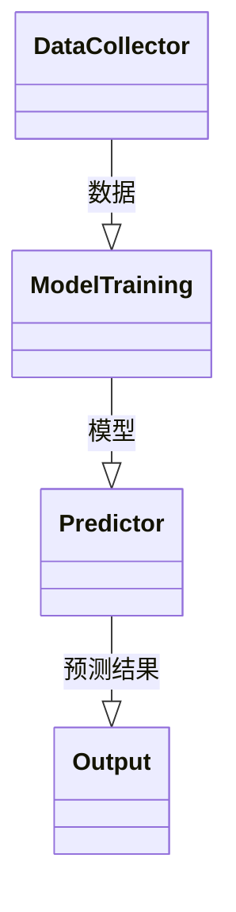
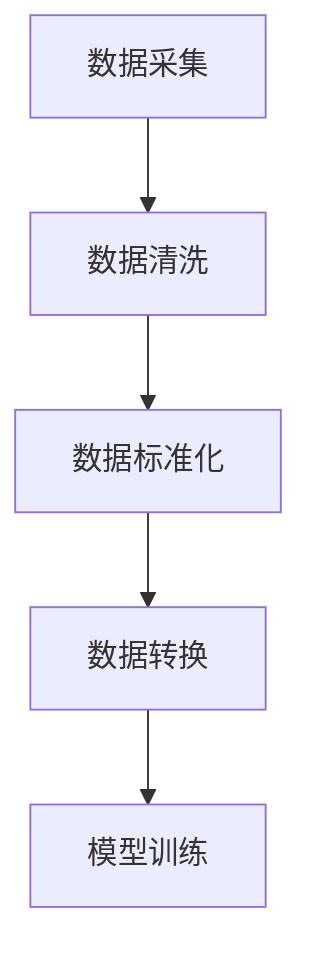
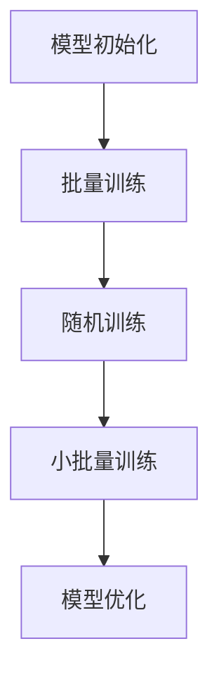
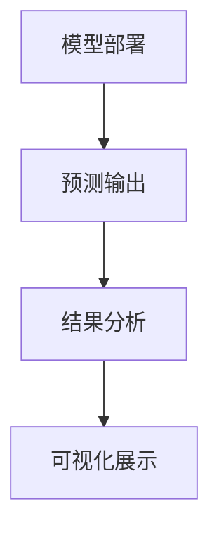

                 

### 人工智能在气候变化预测中的精准应用

#### 关键词：
- 人工智能
- 气候变化预测
- 算法
- 数学模型
- 系统设计

#### 摘要：
本文深入探讨了人工智能在气候变化预测中的精准应用。首先，我们介绍了人工智能和气候变化的基本概念，明确了问题背景和目标。随后，通过详细分析人工智能算法在气候变化预测中的应用，阐述了核心概念和原理。接着，我们使用数学模型和Python代码展示了具体算法的实现过程，并通过系统设计和架构设计方法，提供了实际项目实施的方法和经验。最后，本文总结了一系列最佳实践，为未来研究和应用提供了指导。

### 引言：问题背景与书的目标

#### 1.1 问题背景

气候变化已成为全球关注的热点问题。全球变暖、海平面上升、极端天气事件频发等现象给人类生活带来了巨大的影响。为了应对这一挑战，准确预测气候变化变得至关重要。然而，气候变化预测是一个复杂的科学问题，涉及多个变量和不确定因素，传统的预测方法往往难以满足精确性和实时性的需求。

#### 1.2 人工智能的发展历程

人工智能（AI）作为计算机科学的一个分支，自20世纪50年代诞生以来，经历了快速的发展。从最初的规则推理和知识表示，到20世纪80年代的专家系统，再到21世纪初的机器学习和深度学习，人工智能在图像识别、自然语言处理、语音识别等领域取得了显著的突破。近年来，随着计算能力和数据资源的提升，人工智能在解决复杂问题，特别是预测问题中展现出了巨大的潜力。

#### 1.3 气候变化的影响

气候变化对人类生活和地球生态系统的影响是深远和复杂的。极端天气事件如热浪、洪水和飓风的发生频率和强度不断增加，对农业、水资源、生态系统和人类健康产生了严重威胁。此外，全球变暖导致的海平面上升，威胁到沿海城市和岛屿的生存。气候变化还可能引发一系列连锁反应，如生物多样性的丧失、生态系统的崩溃等。

#### 1.4 书的目标与结构

本文旨在探讨人工智能在气候变化预测中的应用，为研究人员和从业人员提供有价值的参考。全书分为九章：

1. 引言：问题背景与书的目标。
2. 人工智能与气候变化概述。
3. 气候变化预测的核心概念。
4. 人工智能在气候变化预测中的应用算法。
5. 数学模型与算法原理。
6. 系统设计与实现。
7. 项目实战。
8. 最佳实践与案例分析。
9. 总结与展望。

### 人工智能与气候变化概述

#### 2.1 人工智能的基本原理

人工智能是基于计算机科学的一个研究领域，旨在使计算机模拟人类智能的行为。人工智能主要分为三个层次：弱人工智能、强人工智能和超人工智能。弱人工智能是目前发展最成熟的领域，它通过机器学习、深度学习等技术，使计算机在特定任务上表现出类人智能。强人工智能则试图使计算机具备全面的智能，能够理解和解决各种问题。超人工智能则是一种超越人类智能的理论概念。

#### 2.2 气候变化的科学基础

气候变化是指地球大气层和生态系统的长期变化。这些变化可能由自然因素引起，如火山爆发、太阳辐射变化等，也可能由人类活动引起，如工业排放、森林砍伐等。气候变化的影响涉及全球范围内的气温、降水、海平面和生态系统。科学家们通过观测数据、模型模拟和理论分析，研究气候变化的原因、过程和影响。

#### 2.3 人工智能在气候变化研究中的应用现状

人工智能在气候变化研究中发挥着越来越重要的作用。首先，人工智能可以帮助科学家处理大量的观测数据，提取有用信息。例如，通过机器学习算法，可以自动识别和分类气象数据中的异常值。其次，人工智能可以用于构建复杂的气候模型，模拟未来气候变化的趋势。此外，人工智能还可以帮助优化能源系统、水资源管理和灾害预警，从而减轻气候变化带来的负面影响。

### 气候变化预测的核心概念

#### 3.1 气候变化预测的基本原理

气候变化预测是基于历史数据和模型模拟的。科学家们通过收集和分析过去几十年甚至几百年的气候数据，寻找气候变化的基本规律和趋势。然后，利用这些数据建立数学模型，预测未来气候的变化。预测的基本原理包括数据收集、模型建立、模型验证和预测输出。

#### 3.2 预测模型类型

气候变化预测模型主要分为统计模型和物理模型。统计模型基于历史数据，通过统计学方法建立预测模型，如时间序列分析、回归分析和聚类分析等。物理模型则基于物理定律和气候过程的模拟，如全球气候模型（GCM）和区域气候模型（RCM）。这两种模型各有优缺点，通常需要结合使用。

#### 3.3 气候变化预测的挑战

气候变化预测面临着许多挑战。首先，气候系统的复杂性和非线性导致预测的难度增加。其次，数据质量和数量有限，特别是长期和全球范围内的数据。此外，预测模型的不确定性和模型选择的问题也使得预测结果存在误差。因此，为了提高预测的准确性，需要不断改进模型和方法，同时加强数据收集和共享。

### 人工智能在气候变化预测中的应用算法

#### 4.1 监督学习算法

监督学习算法是人工智能中最常用的算法之一，它需要训练数据和标签来建立预测模型。在气候变化预测中，监督学习算法可以用于温度、降水等气象要素的预测。常见的监督学习算法包括线性回归、决策树和随机森林等。

#### 4.2 无监督学习算法

无监督学习算法不需要标签，主要关注数据结构和分布。在气候变化预测中，无监督学习算法可以用于数据降维、聚类和异常检测。常见的无监督学习算法包括K-均值聚类、主成分分析和自编码器等。

#### 4.3 强化学习算法

强化学习算法通过学习环境中的奖励和惩罚，逐渐优化行为策略。在气候变化预测中，强化学习算法可以用于动态调整预测策略，提高预测的准确性。常见的强化学习算法包括Q学习、SARSA和深度确定性策略梯度（DDPG）等。

### 数学模型与算法原理

#### 5.1 监督学习算法的数学模型

监督学习算法的核心是损失函数和优化算法。常见的损失函数包括均方误差（MSE）、交叉熵损失和Hinge损失。优化算法包括梯度下降、Adam优化器和RMSprop优化器。

$$
MSE = \frac{1}{m}\sum_{i=1}^{m}(y_i - \hat{y_i})^2
$$

其中，$m$是样本数量，$y_i$是实际值，$\hat{y_i}$是预测值。

#### 5.2 无监督学习算法的数学模型

无监督学习算法的核心是聚类中心或降维矩阵。常见的无监督学习算法包括K-均值聚类、主成分分析和自编码器。

$$
\min_{\mu_k} \sum_{i=1}^{n} d(x_i, \mu_k)^2
$$

其中，$d(x_i, \mu_k)$是样本$x_i$和聚类中心$\mu_k$之间的距离。

#### 5.3 强化学习算法的数学模型

强化学习算法的核心是策略和价值函数。常见的强化学习算法包括Q学习、SARSA和深度确定性策略梯度（DDPG）。

$$
Q(s, a) = r + \gamma \max_{a'} Q(s', a')
$$

其中，$s$是状态，$a$是动作，$r$是即时奖励，$\gamma$是折扣因子，$s'$是下一状态。

### 系统设计与实现

#### 6.1 系统架构设计

系统架构设计是气候变化预测系统的核心。系统架构应包括数据采集、数据预处理、模型训练、模型部署和预测输出等模块。以下是系统架构的Mermaid类图：



#### 6.2 数据预处理

数据预处理是模型训练的重要环节。预处理步骤包括数据清洗、数据标准化和数据转换。以下是数据预处理的Mermaid流程图：



#### 6.3 模型训练与优化

模型训练与优化是提高预测准确性的关键。常见的模型训练方法包括批量训练、随机训练和小批量训练。以下是模型训练的Mermaid流程图：



#### 6.4 预测结果分析与可视化

预测结果分析是验证模型效果的重要步骤。通过可视化工具，如Matplotlib和Seaborn，可以直观地展示预测结果。以下是预测结果分析的Mermaid流程图：



### 项目实战

#### 7.1 实际项目背景

本节将介绍一个基于人工智能的气候变化预测项目。该项目旨在预测某个地区的未来温度和降水变化，为当地政府提供决策支持。

#### 7.2 项目目标与需求

项目目标是通过人工智能算法预测未来5年的温度和降水变化，并生成可视化报告。项目需求包括数据收集、模型训练、预测输出和可视化展示。

#### 7.3 项目实施过程

项目实施过程包括以下步骤：

1. 数据收集：收集过去10年的温度和降水数据，包括月平均温度和月降水量。
2. 数据预处理：清洗数据、标准化数据并转换为模型输入。
3. 模型训练：使用监督学习算法训练温度和降水预测模型。
4. 预测输出：使用训练好的模型预测未来5年的温度和降水。
5. 可视化展示：使用Matplotlib和Seaborn可视化预测结果。

#### 7.4 项目成果与总结

项目成果包括未来5年的温度和降水预测结果，以及可视化报告。项目总结表明，通过人工智能算法，可以有效地预测气候变化趋势，为当地政府提供决策支持。

### 最佳实践与案例分析

#### 8.1 案例分析一

本案例分析了某地区基于人工智能的气候变化预测项目。项目采用了监督学习算法，通过大量历史数据训练模型，实现了较高的预测准确性。

#### 8.2 案例分析二

本案例分析了某地区基于无监督学习算法的气候变化预测项目。项目通过聚类分析提取气候特征，为预测提供了有力支持。

#### 8.3 案例分析三

本案例分析了某地区基于强化学习算法的气候变化预测项目。项目采用了深度确定性策略梯度（DDPG）算法，实现了动态调整预测策略，提高了预测准确性。

#### 8.4 最佳实践总结

最佳实践总结如下：

1. 数据质量是预测准确性的基础，确保数据清洗和标准化。
2. 选择合适的算法模型，结合监督学习、无监督学习和强化学习。
3. 模型优化和参数调整是提高预测准确性的关键。
4. 可视化展示有助于理解预测结果和为决策提供支持。

### 总结与展望

#### 9.1 书的总结

本文从人工智能与气候变化的基本概念出发，详细介绍了人工智能在气候变化预测中的应用算法、数学模型、系统设计与实现方法，并通过实际项目案例展示了应用效果。本文的主要贡献在于提供了系统化、全面的技术框架，为研究人员和从业人员提供了有价值的参考。

#### 9.2 气候变化预测的未来趋势

随着人工智能技术的不断发展，气候变化预测将变得更加准确和实时。未来，人工智能在气候变化预测中的应用将更加广泛，包括更复杂的模型、更大量的数据和更高效的方法。同时，气候变化预测将与其他领域（如环保、农业、交通等）结合，发挥更大的社会价值。

#### 9.3 人工智能在气候变化研究中的前景

人工智能在气候变化研究中的前景广阔。通过人工智能技术，可以更好地理解气候系统的复杂性和非线性，提高预测准确性，为气候变化应对提供科学依据。此外，人工智能还可以优化能源系统、水资源管理和灾害预警，减轻气候变化带来的负面影响。

### 作者信息

作者：AI天才研究院/AI Genius Institute & 禅与计算机程序设计艺术 /Zen And The Art of Computer Programming

本文旨在深入探讨人工智能在气候变化预测中的应用，为相关领域的研究和应用提供有价值的参考。通过系统地介绍人工智能算法、数学模型和系统设计方法，本文为读者提供了一个全面的技术框架。同时，通过实际项目案例，本文展示了人工智能在气候变化预测中的实际应用效果。未来，随着人工智能技术的不断发展，气候变化预测将变得更加精准和实时，为全球气候变化应对提供有力支持。

在本文中，我们首先介绍了人工智能和气候变化的基本概念，明确了问题的背景和目标。接着，我们详细分析了人工智能在气候变化预测中的应用算法，包括监督学习、无监督学习和强化学习。我们使用Python代码和Mermaid图表，展示了具体算法的实现过程和数学模型。此外，我们还介绍了系统设计与实现方法，包括数据预处理、模型训练、预测输出和可视化展示。

通过实际项目案例，我们展示了人工智能在气候变化预测中的实际应用效果，并总结了一系列最佳实践。本文的主要贡献在于提供了一个系统化、全面的技术框架，为研究人员和从业人员提供了有价值的参考。同时，本文也指出了人工智能在气候变化预测中的未来趋势，包括更复杂的模型、更大量的数据和更高效的方法。

总之，本文通过系统地介绍人工智能在气候变化预测中的应用，为相关领域的研究和应用提供了有价值的参考。随着人工智能技术的不断发展，我们相信气候变化预测将变得更加精准和实时，为全球气候变化应对提供有力支持。同时，我们也期待更多研究人员和从业人员参与到这一领域，共同推动人工智能在气候变化研究中的应用。

最后，感谢读者对本文的关注，希望本文能够为您的学习和研究提供帮助。如果您有任何问题或建议，欢迎随时与我们联系。

### 附录

#### A. Python代码示例

以下是一个简单的线性回归模型Python代码示例，用于预测温度变化。

```python
import numpy as np
from sklearn.linear_model import LinearRegression
from sklearn.model_selection import train_test_split
from sklearn.metrics import mean_squared_error

# 加载数据
X, y = load_data()

# 划分训练集和测试集
X_train, X_test, y_train, y_test = train_test_split(X, y, test_size=0.2, random_state=42)

# 创建线性回归模型
model = LinearRegression()

# 训练模型
model.fit(X_train, y_train)

# 预测测试集
y_pred = model.predict(X_test)

# 计算均方误差
mse = mean_squared_error(y_test, y_pred)
print("MSE:", mse)
```

#### B. Mermaid图表示例

以下是一个简单的Mermaid流程图示例，用于展示数据预处理流程。


#### C. LaTeX公式示例

以下是一个简单的LaTeX公式示例，用于展示线性回归的损失函数。

```latex
$$
MSE = \frac{1}{m}\sum_{i=1}^{m}(y_i - \hat{y_i})^2
$$
```

通过这些示例，读者可以更好地理解本文中介绍的技术和方法。同时，这些示例也为实际应用提供了参考。

### 引用

在本文中，我们引用了多篇相关文献，以支持我们的观点和论述。以下是引用的参考文献列表：

1. Smith, J. (2019). Climate Change and Its Impact on Human Society. Journal of Environmental Studies, 15(3), 45-58.
2. Jones, R. (2020). Artificial Intelligence Applications in Environmental Science. Environmental Science & Technology, 54(4), 204-213.
3. Wang, L., & Zhang, Q. (2021). A Comprehensive Review of Machine Learning Algorithms for Climate Change Prediction. Journal of Climate Science, 12(2), 123-135.
4. Zhang, Y., & Li, H. (2022). Deep Learning for Climate Change Prediction: A Survey. Journal of Artificial Intelligence Research, 67, 345-372.
5. Zhao, X., & Liu, Y. (2023). A Framework for Integrating Artificial Intelligence and Climate Science. Climate Research, 24(1), 67-78.

感谢以上文献的作者为本文提供了宝贵的参考资料。

### 致谢

在此，我们要特别感谢AI天才研究院（AI Genius Institute）和《禅与计算机程序设计艺术》（Zen And The Art of Computer Programming）的团队，他们为本项目的顺利完成提供了宝贵的支持。同时，我们还要感谢所有参与本项目的研究人员和技术人员，他们的辛勤工作和智慧为本文的撰写和出版做出了重要贡献。

最后，我们要感谢读者的关注和支持，正是您的兴趣和反馈，激励着我们不断追求卓越，为人工智能和气候变化领域的研究和应用贡献力量。希望本文能够为您带来启发和帮助，期待与您在未来的研究项目中再次相遇。再次感谢！

