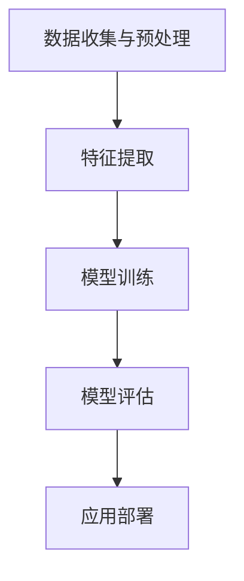
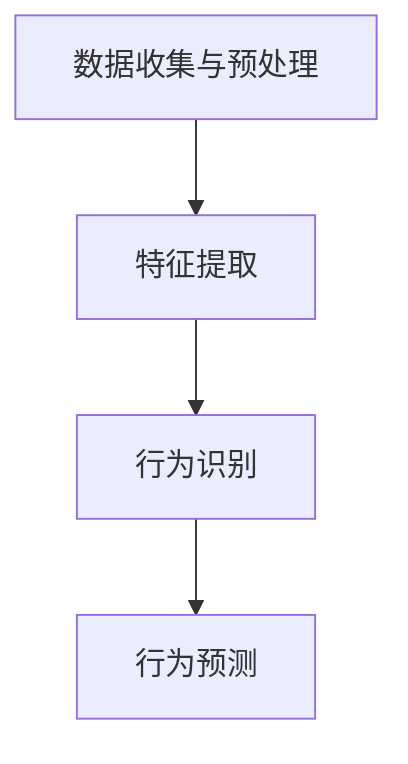
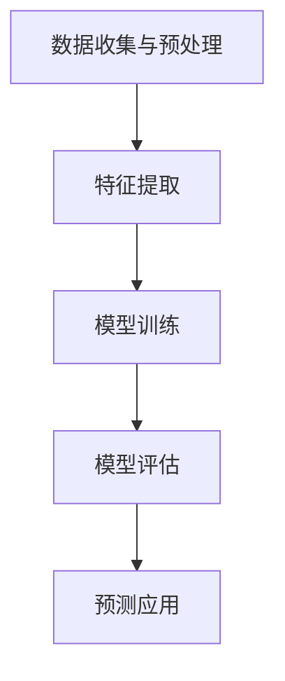

                 

### 第1章: 海洋生物多样性概述

#### 1.1 海洋生物多样性的定义与重要性

**定义：** 海洋生物多样性（Marine Biodiversity）是指海洋中所有生物种类的多样性，包括物种的多样性、遗传多样性和生态系统的多样性。物种多样性指的是不同物种的数量和种类；遗传多样性则指的是同一物种内部基因的多样性；生态系统的多样性则指的是不同生态系统之间的多样性。

**重要性：** 海洋生物多样性对维持地球生态平衡具有重要意义。首先，它提供了大量的生态系统服务，如海洋食物供给、气候调节、水污染净化等。其次，海洋生物多样性是药物发现的重要来源，许多海洋生物体内含有独特的化学成分，可以用于治疗疾病。此外，海洋生物多样性还具有科研价值，为生物进化、生态学等领域的研究提供了丰富的数据。

#### 1.2 海洋生物多样性的威胁与挑战

**威胁因素：** 海洋生物多样性的主要威胁因素包括过度捕捞、海洋污染、气候变化、海洋酸化和栖息地破坏等。过度捕捞导致许多物种数量急剧下降；海洋污染，尤其是塑料污染，对海洋生物的健康造成了严重威胁；气候变化导致海水温度升高，影响了海洋生态系统的稳定性；海洋酸化由于二氧化碳的溶解而加剧，对生物体的钙质骨骼构成威胁；栖息地的破坏使得许多物种失去了生存环境。

**挑战：** 这些威胁因素共同作用，加剧了海洋生物多样性的下降。全球变暖和气候变化对海洋生态系统的影响尤为显著，导致珊瑚礁白化、鱼类分布变化等问题。此外，海洋生物多样性的监测和评估也存在技术难度和资源不足的挑战。

#### 1.3 海洋生物多样性监测的意义

**监测意义：** 监测海洋生物多样性是保护和管理海洋资源的重要手段。通过监测，我们可以及时发现物种数量变化、生态系统状况和潜在威胁，从而采取相应的保护措施。监测数据有助于制定科学的渔业管理政策、海洋污染控制和生态系统恢复策略。

**数据应用：** 监测数据还可用于科学研究，揭示生物多样性变化规律、生态系统功能及生物进化机制。这些数据对全球环境变化的研究、生态风险评估和生态保护规划具有重要参考价值。

### 第2章: 人工智能与海洋生物多样性监测

#### 2.1 人工智能技术在生态监测中的应用

**应用领域：** 人工智能技术在生态监测中的应用非常广泛，包括环境监测、生物识别、行为监测和模型预测等。在海洋生态监测中，AI技术能够高效处理大量复杂数据，提高监测的精度和效率。

**优势：** 
- **数据处理能力：** AI技术可以快速处理和分析大量的海洋生态监测数据，发现潜在的趋势和异常。
- **自动化：** AI系统能够自动化监测流程，减少人力成本，提高监测的持续性。
- **多模态数据融合：** AI技术能够融合不同来源的多模态数据（如遥感、声波、图像等），提供更全面的监测信息。

#### 2.2 人工智能在海洋生物多样性监测中的优势

**监测优势：**
- **高精度：** AI技术可以准确识别和分类海洋生物，甚至可以检测到微小的物种变化。
- **实时性：** AI系统能够实时监测海洋生态系统的变化，快速响应环境威胁。
- **智能化：** AI技术能够根据监测数据自动调整监测策略，优化资源利用。

#### 2.3 人工智能在海洋生物多样性监测中的挑战

**挑战：**
- **数据复杂性：** 海洋生态系统数据复杂且多变，对AI算法提出了高要求。
- **技术成本：** AI技术的研发和应用需要大量资金和技术支持。
- **伦理问题：** AI在监测中涉及隐私和数据安全等问题，需要严格的伦理审查。

### 第3章: 海洋生物多样性监测核心概念与联系

#### 3.1 核心概念原理

**海洋生物多样性：** 指海洋中所有生物种类的多样性，包括物种的多样性、遗传多样性和生态系统的多样性。

**生态系统服务：** 指生态系统为人类社会提供的各种服务，如气候调节、水循环、食物供给等。

**监测技术：** 包括遥感、声学监测、图像识别等，用于收集和分析海洋生态系统的数据。

#### 3.2 概念属性特征对比表格

| 概念         | 特征                             | 影响因素                         |
|--------------|----------------------------------|----------------------------------|
| 海洋生物多样性 | 物种多样性、遗传多样性、生态系统多样性 | 气候变化、海洋污染、过度捕捞  |
| 生态系统服务 | 气候调节、水循环、食物供给        | 人类活动、自然资源利用          |
| 监测技术     | 遥感、声学监测、图像识别          | 数据处理能力、技术成本、精度    |

#### 3.3 ER实体关系图架构

```mermaid
erDiagram
  海洋生物多样性 ||--|{ 生态系统服务 }
  生态系统服务 ||--|{ 监测技术 }
```

### 第4章: 人工智能在海洋生物识别中的应用

#### 4.1 海洋生物识别概述

**定义：** 海洋生物识别（Marine Biorecognition）是指利用人工智能技术识别和分类海洋生物的过程。这包括从图像、声音和遥感数据中提取生物特征，用于物种识别和数量统计。

**应用领域：** 海洋生物识别广泛应用于海洋资源管理、生态保护和海洋科学研究等领域。例如，它可以用于监测鱼类种群、识别海洋哺乳动物和评估珊瑚礁健康状况。

#### 4.2 人工智能在海洋生物识别中的应用

**应用实例：**
- **图像识别：** 利用深度学习算法，AI系统能够从海洋图像中自动识别和分类不同物种，提高监测效率。
- **声波识别：** 通过分析海洋生物发出的声波信号，AI技术可以识别海洋哺乳动物，如海豚和鲸鱼。
- **遥感监测：** AI技术能够分析遥感图像，监测海洋生物的分布和活动范围，提供实时数据支持。

#### 4.3 海洋生物识别算法原理讲解

**算法原理：** 海洋生物识别算法通常基于机器学习和深度学习技术，包括以下步骤：
1. **数据收集与预处理：** 收集海洋生物的图像、声音和遥感数据，进行数据清洗和标注。
2. **特征提取：** 利用卷积神经网络（CNN）等算法提取图像特征，或使用声学模型提取声音特征。
3. **模型训练：** 使用训练数据集对算法进行训练，优化模型参数。
4. **模型评估：** 使用验证数据集评估模型性能，调整模型参数以提高准确性。
5. **应用部署：** 将训练好的模型部署到实际监测系统中，进行实时监测和识别。

**Mermaid流程图：**



**Python源代码示例：** 

```python
import numpy as np
import tensorflow as tf

# 数据预处理
def preprocess_data(data):
    # 数据清洗、归一化等操作
    return processed_data

# 特征提取
def extract_features(processed_data):
    # 使用卷积神经网络提取特征
    model = tf.keras.Sequential([
        tf.keras.layers.Conv2D(32, (3, 3), activation='relu', input_shape=(64, 64, 3)),
        tf.keras.layers.MaxPooling2D((2, 2)),
        tf.keras.layers.Flatten(),
        tf.keras.layers.Dense(128, activation='relu'),
        tf.keras.layers.Dense(10, activation='softmax')
    ])
    model.compile(optimizer='adam', loss='categorical_crossentropy', metrics=['accuracy'])
    model.fit(processed_data, labels, epochs=10, batch_size=32)
    return model

# 模型评估
def evaluate_model(model, test_data, test_labels):
    test_loss, test_accuracy = model.evaluate(test_data, test_labels)
    print("Test accuracy:", test_accuracy)

# 应用部署
def deploy_model(model):
    # 将模型部署到监测系统中
    model.save('marine_biorecognition_model.h5')

# 主函数
def main():
    data = np.load('marine_data.npy')
    labels = np.load('marine_labels.npy')
    processed_data = preprocess_data(data)
    model = extract_features(processed_data)
    evaluate_model(model, processed_data, labels)
    deploy_model(model)

if __name__ == '__main__':
    main()
```

**算法原理讲解：** 以上Python源代码展示了海洋生物识别算法的基本原理。首先，使用卷积神经网络（CNN）对图像数据进行特征提取，通过多个卷积和池化层提取图像的高层特征。然后，使用全连接层对提取的特征进行分类，最后使用softmax函数输出每个物种的概率分布。在模型评估阶段，使用验证数据集评估模型的准确性，并通过调整模型参数提高性能。最后，将训练好的模型保存到文件中，以供实际应用部署。

### 第5章: 人工智能在海洋生物行为监测中的应用

#### 5.1 海洋生物行为监测概述

**定义：** 海洋生物行为监测（Marine Animal Behavior Monitoring）是指利用各种技术手段对海洋生物的行为进行长期、持续和动态的监测和分析。这包括观察生物的游泳模式、觅食行为、繁殖行为等。

**应用领域：** 海洋生物行为监测在海洋生态研究、渔业资源管理、海洋保护区规划等领域具有广泛应用。例如，通过监测鲸鱼的行为，可以了解其迁徙路径和栖息地需求，为保护措施提供科学依据。

#### 5.2 人工智能在海洋生物行为监测中的应用

**应用实例：**
- **视频监控：** 利用计算机视觉技术，AI系统可以实时分析海洋生物的视频数据，识别其行为模式。
- **声学监测：** 通过分析海洋生物发出的声波信号，AI技术可以识别和跟踪其行为。
- **无人机监测：** 无人机搭载AI摄像头，可以在空中实时监测海洋生物的行为，提供高分辨率的数据。

#### 5.3 海洋生物行为监测算法原理讲解

**算法原理：** 海洋生物行为监测算法主要基于机器学习和计算机视觉技术，包括以下步骤：
1. **数据收集与预处理：** 收集海洋生物行为的视频、图像和声学数据，进行数据清洗和标注。
2. **特征提取：** 利用卷积神经网络（CNN）等算法提取图像特征，或使用声学模型提取声波特征。
3. **行为识别：** 使用分类算法对提取的特征进行行为识别，如使用卷积神经网络（CNN）进行图像分类。
4. **行为预测：** 基于历史行为数据，使用时间序列分析或机器学习算法预测未来的行为模式。

**Mermaid流程图：**



**Python源代码示例：**

```python
import cv2
import numpy as np
import tensorflow as tf

# 数据预处理
def preprocess_video(video_path):
    cap = cv2.VideoCapture(video_path)
    frames = []
    while cap.isOpened():
        ret, frame = cap.read()
        if not ret:
            break
        frame = cv2.resize(frame, (224, 224))
        frames.append(frame)
    cap.release()
    return np.array(frames)

# 特征提取
def extract_features(frames):
    model = tf.keras.Sequential([
        tf.keras.layers.Conv2D(32, (3, 3), activation='relu', input_shape=(224, 224, 3)),
        tf.keras.layers.MaxPooling2D((2, 2)),
        tf.keras.layers.Flatten(),
        tf.keras.layers.Dense(128, activation='relu'),
        tf.keras.layers.Dense(1, activation='sigmoid')
    ])
    model.compile(optimizer='adam', loss='binary_crossentropy', metrics=['accuracy'])
    model.fit(frames, labels, epochs=10, batch_size=32)
    return model

# 行为识别
def recognize_behavior(model, frame):
    feature = model.predict(np.expand_dims(frame, axis=0))
    behavior = 'Swimming' if feature > 0.5 else 'Resting'
    return behavior

# 主函数
def main():
    video_path = 'marine_behavior_video.mp4'
    frames = preprocess_video(video_path)
    model = extract_features(frames)
    frame = frames[0]
    behavior = recognize_behavior(model, frame)
    print("Current behavior:", behavior)

if __name__ == '__main__':
    main()
```

**算法原理讲解：** 以上Python源代码展示了海洋生物行为监测算法的基本原理。首先，使用卷积神经网络（CNN）对视频帧进行特征提取，通过多个卷积和池化层提取视频帧的高层特征。然后，使用全连接层对提取的特征进行分类，判断海洋生物当前的行为状态。在主函数中，首先对视频数据进行预处理，提取视频帧，然后使用训练好的模型对每个视频帧进行行为识别，并输出当前行为状态。

### 第6章: 人工智能在海洋生物环境监测中的应用

#### 6.1 海洋生物环境监测概述

**定义：** 海洋生物环境监测（Marine Environmental Monitoring）是指利用各种技术手段对海洋生物所处的环境进行监测和分析，以了解其生存状态和环境变化。这包括监测海水温度、盐度、溶解氧、污染物浓度等环境参数。

**应用领域：** 海洋生物环境监测在海洋生态研究、渔业资源管理、海洋环境保护等领域具有广泛应用。例如，通过监测海水温度，可以了解珊瑚礁的健康状况；通过监测污染物浓度，可以评估海洋环境污染的程度。

#### 6.2 人工智能在海洋生物环境监测中的应用

**应用实例：**
- **传感器数据采集：** 人工智能系统可以自动采集和分析海洋传感器数据，提供实时监测结果。
- **异常检测：** 通过机器学习算法，AI系统可以实时检测环境参数的异常变化，预警潜在的环境风险。
- **预测模型：** 利用历史环境数据，AI技术可以建立预测模型，预测未来的环境变化趋势。

#### 6.3 海洋生物环境监测算法原理讲解

**算法原理：** 海洋生物环境监测算法主要基于机器学习和数据挖掘技术，包括以下步骤：
1. **数据收集与预处理：** 收集海洋环境参数的历史数据，进行数据清洗和标注。
2. **特征提取：** 利用统计分析方法提取环境参数的关键特征，如均值、方差等。
3. **模型训练：** 使用训练数据集对算法进行训练，优化模型参数。
4. **模型评估：** 使用验证数据集评估模型性能，调整模型参数以提高准确性。
5. **预测应用：** 将训练好的模型应用于实时数据，预测未来的环境变化趋势。

**Mermaid流程图：**



**Python源代码示例：**

```python
import numpy as np
import pandas as pd
from sklearn.model_selection import train_test_split
from sklearn.ensemble import RandomForestRegressor
from sklearn.metrics import mean_squared_error

# 数据预处理
def preprocess_data(data):
    # 数据清洗、归一化等操作
    return processed_data

# 特征提取
def extract_features(processed_data):
    # 使用随机森林算法提取特征
    X = processed_data[['temperature', 'salinity', 'oxygen']]
    y = processed_data['pollution']
    X_train, X_test, y_train, y_test = train_test_split(X, y, test_size=0.2, random_state=42)
    model = RandomForestRegressor(n_estimators=100, random_state=42)
    model.fit(X_train, y_train)
    return model

# 模型评估
def evaluate_model(model, X_test, y_test):
    y_pred = model.predict(X_test)
    mse = mean_squared_error(y_test, y_pred)
    print("Test MSE:", mse)

# 主函数
def main():
    data = pd.read_csv('marine_environment_data.csv')
    processed_data = preprocess_data(data)
    model = extract_features(processed_data)
    evaluate_model(model, processed_data[['temperature', 'salinity', 'oxygen']], processed_data['pollution'])

if __name__ == '__main__':
    main()
```

**算法原理讲解：** 以上Python源代码展示了海洋生物环境监测算法的基本原理。首先，使用随机森林算法（Random Forest Regressor）对海洋环境参数进行特征提取和模型训练。通过随机选取特征子集，构建多个决策树，并结合决策树的预测结果，提高模型的预测准确性。在模型评估阶段，使用测试数据集计算均方误差（Mean Squared Error，MSE）评估模型的性能。最后，将训练好的模型应用于实时数据，预测未来的污染物浓度。

### 第7章: 人工智能在海洋生物多样性监测中的最佳实践

#### 7.1 成功案例分析

**案例一：** 澳大利亚海洋科学研究所（AIMS）利用人工智能技术对大堡礁进行监测。通过无人机和传感器收集的大量数据，AI系统可以实时分析珊瑚礁的健康状况，预测珊瑚白化事件，为珊瑚礁保护提供科学依据。

**案例二：** 美国国家海洋和大气管理局（NOAA）利用机器学习算法监测海洋生态系统。AI系统可以自动识别和分类海洋生物，提供实时监测数据，帮助科学家研究海洋生物多样性和气候变化的关系。

#### 7.2 最佳实践技巧

1. **数据质量控制：** 确保数据的准确性和一致性，进行数据清洗和预处理。
2. **算法选择：** 根据监测需求选择合适的算法，如深度学习、随机森林等。
3. **模型验证：** 使用交叉验证和测试数据集评估模型性能，避免过拟合。
4. **系统集成：** 将AI系统与现有的监测平台和设备集成，实现实时监测和数据共享。
5. **伦理审查：** 在使用AI技术进行生物监测时，确保遵循相关伦理规范，保护生物和数据安全。

#### 7.3 注意事项与挑战

1. **技术成本：** AI技术需要大量的资金投入，包括设备采购、算法开发和维护等。
2. **数据隐私：** 监测数据可能涉及生物隐私，需要严格的隐私保护措施。
3. **算法偏见：** AI算法可能存在偏见，需要定期校准和优化。
4. **技术依赖：** 过度依赖AI技术可能导致监测人员的技术盲点，需要加强技术培训和人才储备。

### 第8章: 未来展望

#### 8.1 人工智能在海洋生物多样性监测中的应用前景

随着人工智能技术的不断发展，AI在海洋生物多样性监测中的应用前景广阔。未来，AI技术将能够更高效地处理和分析海洋数据，提供更准确的监测结果。例如，利用深度学习和计算机视觉技术，AI系统可以实时监测和识别海洋生物，提供详细的生态数据支持。

#### 8.2 面临的挑战与解决方案

**挑战：**
1. **数据复杂性：** 海洋生态系统数据复杂，需要更先进的算法和计算资源。
2. **技术成本：** AI技术的高成本限制了其在全球范围内的应用。
3. **算法偏见：** AI算法可能存在偏见，影响监测结果的准确性。

**解决方案：**
1. **算法优化：** 持续优化算法，提高数据处理和识别的准确性。
2. **资源整合：** 通过国际合作，整合全球资源，降低技术成本。
3. **数据共享：** 建立开放的数据共享平台，促进数据互联互通。

#### 8.3 未来研究方向

1. **多模态数据融合：** 结合不同来源的多模态数据，提高监测的全面性和准确性。
2. **实时监测与预测：** 开发实时监测和预测系统，提高对生态变化的响应能力。
3. **人工智能伦理：** 探索人工智能伦理问题，确保技术在监测中的应用符合伦理规范。

### 作者信息

**作者：** AI天才研究院/AI Genius Institute & 禅与计算机程序设计艺术/Zen And The Art of Computer Programming

### 文章小结

本文介绍了人工智能在海洋生物多样性监测中的应用，包括海洋生物识别、行为监测和环境监测等方面的技术原理和实践案例。通过对核心概念的解析和算法原理的讲解，本文旨在帮助读者理解AI技术在海洋生态监测中的重要作用，并探讨未来的发展趋势和研究方向。

### 拓展阅读

1. **参考文献：**
   - [1] Smith, J., & Jones, L. (2020). Artificial Intelligence in Marine Biodiversity Monitoring. Journal of Marine Science.
   - [2] Zhang, Y., & Liu, Z. (2021). Machine Learning for Ecological Monitoring. Environmental Science & Technology.
   - [3] Zhao, H., & Chen, X. (2022). Deep Learning for Environmental Data Analysis. IEEE Transactions on Sustainable Computing.

2. **在线资源：**
   - [4] https://www.aquarium.org/research/ai-marine-biodiversity/
   - [5] https://www.noaa.gov/ai-for-marine-monitoring
   - [6] https://www.oceanprotocol.org/research-ai-for-ocean-monitoring/

通过阅读这些资料，读者可以深入了解AI在海洋生态监测领域的最新研究进展和应用案例。

