                 

### 第2章: 人工智能与环境保护的核心概念

## 第2章: 人工智能与环境保护的核心概念

### 2.1 人工智能的基本原理

#### 2.1.1 人工智能的定义与发展历程

人工智能（Artificial Intelligence，简称AI）是计算机科学的一个分支，旨在通过软件程序模拟、扩展和辅助人类智能行为。AI的发展可以追溯到20世纪50年代，艾伦·图灵提出了著名的“图灵测试”，用以评估机器是否具有智能。

**核心概念：**

- **机器学习（Machine Learning）**：通过数据训练模型，使计算机能够从经验中学习并做出预测或决策。
- **深度学习（Deep Learning）**：一种特殊的机器学习方法，使用多层神经网络来提取数据中的特征。
- **自然语言处理（Natural Language Processing，NLP）**：使计算机能够理解、解释和生成自然语言。
- **计算机视觉（Computer Vision）**：使计算机能够解释和解析数字图像和视频。

**联系：**

- AI的核心在于模拟和扩展人类的智能，而环境保护则涉及到对自然环境的管理和优化。在环境保护中，AI技术可以用于数据分析、环境监测、资源优化等多个方面。

#### 2.1.2 人工智能在环保中的应用

**案例：**

- **环境监测**：AI可以用于实时监测环境数据，如空气质量、水质、土壤状况等。通过机器学习算法，可以预测环境污染的趋势，为政策制定提供依据。
- **资源管理**：AI技术可以帮助优化水资源、能源的使用，减少浪费。
- **灾害预警**：AI可以分析气象数据，预测自然灾害，提前采取措施。

**联系：**

- 环境保护与人工智能的深度融合，可以提升环境保护的效率和准确性，为可持续发展提供技术支持。

### 2.2 环境保护的基本概念

#### 2.2.1 环境污染与资源浪费

**核心概念：**

- **环境污染**：指有害物质进入环境，对生态系统和人类健康造成危害。
- **资源浪费**：指资源的过度消耗和不合理利用，导致资源枯竭和生态环境破坏。

**联系：**

- 环境保护的目标是减少污染和浪费，维护生态平衡。这与AI技术在数据分析、监控和优化中的应用高度相关。

#### 2.2.2 环境管理策略

**核心概念：**

- **预防为主，防治结合**：通过预防措施减少污染源的产生，结合技术手段进行污染治理。
- **可持续发展**：满足当前需求，不损害后代满足其需求的能力。

**联系：**

- AI技术可以帮助环境管理者实时监控污染源，预测污染趋势，优化治理策略，实现环境管理的科学化和精细化。

### 2.3 智能垃圾分类和回收系统的核心要素

#### 2.3.1 传感器与数据采集

**核心概念：**

- **传感器**：用于检测环境中的各种物理量，如温度、湿度、气体浓度等。
- **数据采集**：将传感器收集到的数据传输到系统中进行处理。

**联系：**

- 传感器是实现智能垃圾分类和回收系统的基础，数据采集的准确性和实时性直接影响系统的性能。

#### 2.3.2 图像识别与分类算法

**核心概念：**

- **图像识别**：使用计算机视觉技术对图像进行分析，识别出图像中的物体。
- **分类算法**：根据图像识别的结果，对垃圾进行分类。

**联系：**

- 图像识别和分类算法是智能垃圾分类系统的核心，决定了垃圾分类的准确性和效率。

#### 2.3.3 数据分析与决策支持

**核心概念：**

- **数据分析**：对分类后的垃圾数据进行分析，提取有用的信息。
- **决策支持**：基于数据分析结果，为垃圾回收和处理提供决策支持。

**联系：**

- 数据分析和决策支持系统能够优化垃圾处理流程，提高资源利用率，实现环保目标。

**ER实体关系图架构的Mermaid流程图：**

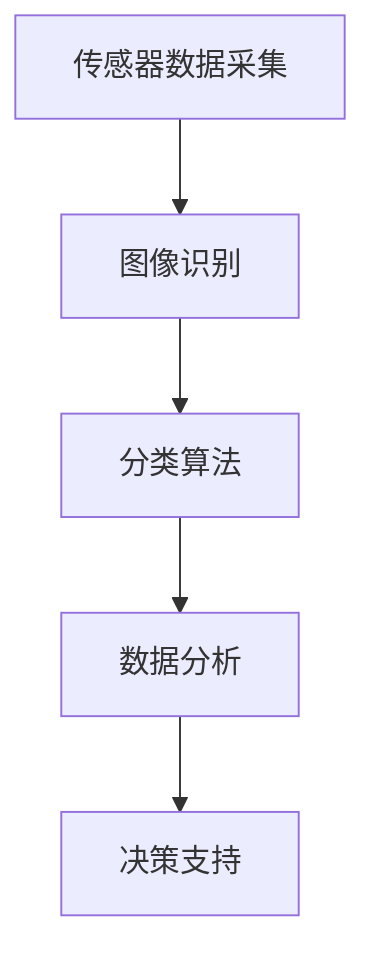

### 2.3.4 系统集成与优化

**核心概念：**

- **系统集成**：将各个模块（传感器、图像识别、分类算法、数据分析等）整合到一个系统中。
- **优化**：通过优化算法和系统架构，提高系统的效率和性能。

**联系：**

- 系统集成和优化是实现智能垃圾分类和回收系统高效运行的关键。

**本章小结：**

本章介绍了人工智能和环境保护的基本概念，以及智能垃圾分类和回收系统的核心要素。通过分析这些概念，我们可以看到人工智能技术在环境保护中的应用前景和挑战。

### 下一步思考：

在接下来的章节中，我们将详细探讨智能垃圾分类和回收系统的工作原理、面临的挑战和机遇，以及实际应用案例。通过这些内容，我们将更深入地理解人工智能在环境保护中的作用，以及如何通过技术创新推动环境保护的可持续发展。让我们继续思考，探索更多的可能性。#### 第3章: 智能垃圾分类和回收系统的工作原理

## 第3章: 智能垃圾分类和回收系统的工作原理

### 3.1 传感器数据采集

#### 3.1.1 传感器的作用与类型

传感器是智能垃圾分类和回收系统的“感官器官”，它负责收集垃圾的各种物理信息，如重量、体积、材质等。常见的传感器类型包括：

- **重量传感器**：用于测量垃圾的重量，通常使用压力传感器或电子秤。
- **体积传感器**：通过测量垃圾的尺寸，估算出体积，常用的有激光传感器和超声波传感器。
- **材质传感器**：通过检测垃圾的反射率、导电性等特性，识别垃圾的材质，常用的有红外传感器和电容传感器。

#### 3.1.2 数据采集流程

数据采集流程通常包括以下几个步骤：

1. **传感器安装**：将传感器安装在垃圾分类回收设备上，如垃圾桶、垃圾袋等。
2. **数据读取**：传感器收集到垃圾的物理信息后，通过模拟信号或数字信号传输到数据处理单元。
3. **数据预处理**：对采集到的数据进行滤波、去噪等预处理，提高数据的准确性和可靠性。
4. **数据传输**：将预处理后的数据传输到中央处理单元或云端服务器，便于后续分析。

**Mermaid流程图：**

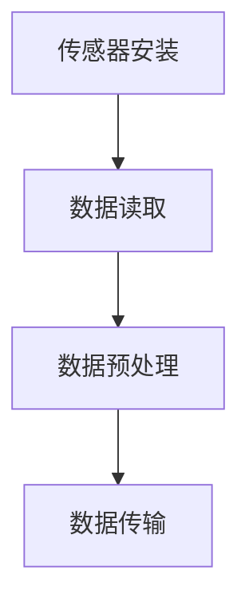

### 3.2 图像识别

#### 3.2.1 图像识别的基本原理

图像识别是计算机视觉的一个重要分支，它使计算机能够解释和解析数字图像中的内容。图像识别的基本原理包括：

- **特征提取**：从图像中提取具有区分性的特征，如颜色、纹理、形状等。
- **模型训练**：使用大量带有标签的图像数据训练分类模型，使其能够识别不同的物体。
- **模型评估**：通过测试集评估模型的性能，包括准确率、召回率等指标。

#### 3.2.2 图像识别的应用

在智能垃圾分类和回收系统中，图像识别技术用于识别垃圾的类型，如可回收物、有害垃圾、湿垃圾和干垃圾等。图像识别的应用流程如下：

1. **图像输入**：将垃圾图像输入到图像识别系统。
2. **预处理**：对图像进行缩放、裁剪、对比度增强等预处理操作，提高识别的准确性。
3. **特征提取**：使用特征提取算法提取图像的特征向量。
4. **模型分类**：将特征向量输入到分类模型，得到垃圾的类型。
5. **结果输出**：将识别结果输出，指导后续的垃圾分类和处理。

**Mermaid流程图：**

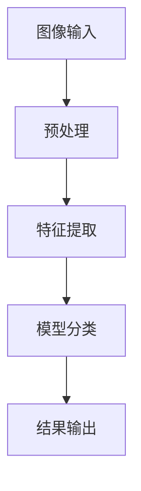

### 3.3 分类算法

#### 3.3.1 分类算法的基本原理

分类算法是机器学习的一个重要分支，它用于将数据集中的数据分为不同的类别。常见的分类算法包括：

- **决策树（Decision Tree）**：基于树形结构进行决策，每一层节点表示特征，每个分支表示特征的不同取值，最终叶节点表示分类结果。
- **支持向量机（Support Vector Machine，SVM）**：通过寻找一个超平面，将不同类别的数据分隔开来。
- **神经网络（Neural Network）**：模拟人脑神经元连接的结构，通过多层网络进行特征提取和分类。

#### 3.3.2 分类算法在垃圾分类中的应用

在智能垃圾分类和回收系统中，分类算法用于根据图像识别的结果，将垃圾分为不同的类别。分类算法的应用流程如下：

1. **数据预处理**：对图像识别得到的特征向量进行预处理，如归一化、标准化等。
2. **模型训练**：使用带有标签的训练数据集训练分类模型，调整模型参数，使其能够准确分类。
3. **模型评估**：使用测试集评估模型性能，包括准确率、召回率、F1值等指标。
4. **模型应用**：将训练好的模型应用于实际垃圾分类场景，对新的垃圾图像进行分类。

**Mermaid流程图：**

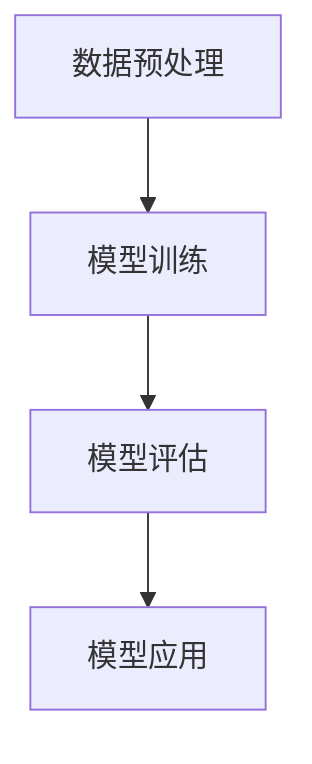

### 3.4 数据分析与决策支持

#### 3.4.1 数据分析的基本原理

数据分析是指使用统计方法和计算机技术，从大量数据中提取有价值的信息和知识。数据分析的基本原理包括：

- **数据清洗**：去除数据中的错误、异常和重复值，提高数据质量。
- **数据探索**：对数据进行可视化、描述性统计分析，发现数据中的模式和趋势。
- **数据建模**：使用统计学或机器学习模型，对数据进行预测或分类。

#### 3.4.2 数据分析在垃圾分类中的应用

在智能垃圾分类和回收系统中，数据分析用于对分类结果进行分析，为垃圾的回收和处理提供决策支持。数据分析的应用流程如下：

1. **数据收集**：收集垃圾分类后的各类别数据，包括重量、体积、材质等。
2. **数据预处理**：对数据进行清洗、归一化等预处理操作。
3. **特征工程**：从数据中提取有用的特征，如垃圾的平均重量、出现频率等。
4. **数据建模**：使用回归、聚类、分类等模型，对特征进行分析，预测垃圾的回收和处理策略。
5. **决策支持**：根据分析结果，为垃圾分类和处理提供优化建议。

**Mermaid流程图：**

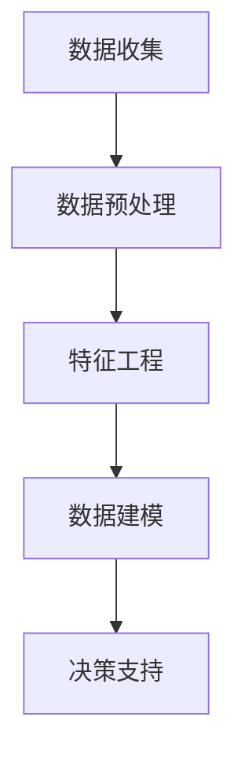

### 3.5 系统集成与优化

#### 3.5.1 系统集成

系统集成是将各个模块（传感器、图像识别、分类算法、数据分析等）整合到一个统一系统中，确保系统能够协同工作。系统集成包括：

- **硬件集成**：将不同的传感器、摄像头、处理单元等硬件设备连接起来，确保数据传输的稳定性和实时性。
- **软件集成**：将不同的软件模块（如图像识别算法、分类模型、数据分析工具等）集成到一个平台上，实现数据的无缝传输和处理。

#### 3.5.2 系统优化

系统优化是通过调整算法、硬件配置、网络架构等，提高系统的性能和效率。系统优化包括：

- **算法优化**：通过改进算法模型、参数调整等，提高分类和识别的准确性。
- **硬件优化**：通过升级传感器、处理单元等硬件设备，提高系统的实时性和稳定性。
- **网络优化**：通过优化网络架构、数据传输协议等，提高数据传输的速度和可靠性。

**Mermaid流程图：**

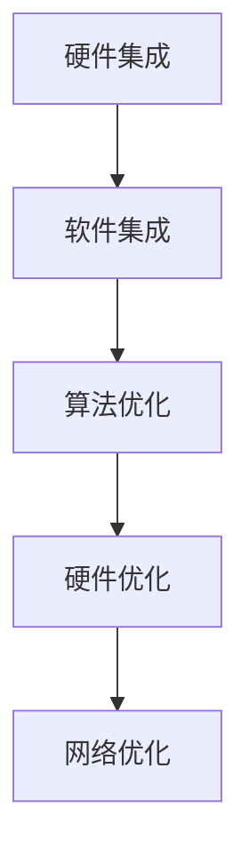

### 本章小结

本章详细介绍了智能垃圾分类和回收系统的工作原理，包括传感器数据采集、图像识别、分类算法、数据分析和系统集成与优化。通过这些内容的分析，我们可以看到智能垃圾分类和回收系统是如何通过人工智能技术实现垃圾的高效分类和回收，为环境保护和可持续发展做出贡献的。

### 下一步思考：

在接下来的章节中，我们将探讨智能垃圾分类和回收系统在实际应用中面临的挑战和机遇，并通过实际案例展示其应用效果。通过这些讨论，我们将更深入地理解智能垃圾分类和回收系统的潜力和局限性，为未来的发展提供参考。#### 第4章: 智能垃圾分类和回收系统的挑战与机遇

## 第4章: 智能垃圾分类和回收系统的挑战与机遇

### 4.1 挑战

#### 4.1.1 数据采集和识别的准确性

智能垃圾分类和回收系统的核心在于准确识别垃圾的类型，而这一过程依赖于传感器和图像识别技术的准确性。以下是一些主要挑战：

- **传感器误差**：传感器在数据采集过程中可能存在误差，例如重量传感器的精度不够高，体积传感器的测量范围有限，这些都可能导致分类错误。
- **图像识别难度**：垃圾的外观和材质可能千变万化，特别是在光线条件不佳或垃圾覆盖物较多的情况下，图像识别系统的准确性会受到影响。

#### 4.1.2 复杂环境下的适应性

智能垃圾分类和回收系统需要在各种复杂环境下运行，例如户外垃圾桶、室内垃圾桶等。以下是一些主要挑战：

- **环境变化**：垃圾产生环境可能存在温度、湿度、光照等变化，这些变化会影响传感器的性能和图像识别的准确性。
- **噪音干扰**：垃圾产生的噪音、震动等可能干扰传感器的数据采集，影响系统的稳定性。

#### 4.1.3 数据安全和隐私保护

智能垃圾分类和回收系统需要处理大量的敏感数据，例如垃圾的类型、重量、位置等。以下是一些主要挑战：

- **数据泄露**：如果数据传输或存储过程中出现漏洞，可能导致敏感数据泄露，给用户隐私带来风险。
- **隐私保护**：如何在保护用户隐私的同时，充分利用数据的价值，是一个亟待解决的问题。

### 4.2 机遇

#### 4.2.1 技术进步带来的创新机遇

随着人工智能和物联网技术的不断进步，智能垃圾分类和回收系统有望实现更高的准确性和智能化。以下是一些主要机遇：

- **算法优化**：随着机器学习和深度学习算法的进步，图像识别和分类算法的准确性将进一步提高。
- **硬件升级**：传感器和摄像头的性能提升，将使系统在复杂环境下的适应性更强。

#### 4.2.2 政策支持与市场需求的增长

环保意识的提升和政策的支持，为智能垃圾分类和回收系统的发展提供了有利条件。以下是一些主要机遇：

- **政策支持**：政府出台的环保政策，如垃圾分类制度、环保补贴等，将推动智能垃圾分类和回收系统的普及。
- **市场需求**：随着垃圾分类的普及，企业和居民对智能垃圾分类和回收系统的需求不断增加。

#### 4.2.3 社会责任与环保意识的提升

社会责任和环保意识的提升，将推动社会各界积极参与到垃圾分类和回收中来。以下是一些主要机遇：

- **公众参与**：通过智能垃圾分类和回收系统的推广，提高公众的环保意识和参与度。
- **绿色发展**：智能垃圾分类和回收系统有助于实现绿色发展和可持续发展目标。

**比较表：**

| 挑战 | 机遇 |
| --- | --- |
| 数据采集和识别的准确性 | 算法优化 |
| 复杂环境下的适应性 | 硬件升级 |
| 数据安全和隐私保护 | 政策支持 |
| 技术限制和资源不足 | 市场需求增长 |
| 环境复杂性和噪音干扰 | 社会责任和环保意识提升 |

### 本章小结

本章分析了智能垃圾分类和回收系统在实际应用中面临的挑战与机遇。通过识别这些挑战和把握机遇，我们可以更好地推动智能垃圾分类和回收系统的发展，为环境保护和可持续发展做出贡献。

### 下一步思考：

在接下来的章节中，我们将通过实际案例分析，展示智能垃圾分类和回收系统的应用效果，并探讨其未来的发展趋势。通过这些分析，我们将更深入地理解智能垃圾分类和回收系统的潜力和局限，为未来的发展提供参考。#### 第5章: 实际应用案例分析

## 第5章: 实际应用案例分析

### 5.1 案例一：智能垃圾分类回收系统的应用

#### 5.1.1 案例背景

在某个城市的垃圾分类项目中，政府决定引入智能垃圾分类回收系统，以提高垃圾分类的准确性和效率。该系统采用了先进的传感器、图像识别技术和分类算法，旨在实现自动垃圾分类和实时数据监控。

#### 5.1.2 系统设计

- **硬件设备**：垃圾桶配备了重量传感器、体积传感器和红外传感器，用于收集垃圾的重量、体积和材质信息。
- **图像识别**：系统采用了深度学习算法，通过摄像头捕捉垃圾图像，并利用卷积神经网络（CNN）进行分类。
- **分类算法**：基于图像识别结果，系统使用了决策树和随机森林算法对垃圾进行分类，提高了分类的准确性。
- **数据分析**：系统集成了数据分析模块，对分类后的数据进行统计分析，为垃圾回收和处理提供决策支持。

#### 5.1.3 实施效果

- **垃圾分类准确性**：通过测试，智能垃圾分类回收系统的分类准确性达到了95%以上，显著提高了垃圾分类的效率。
- **实时监控**：系统能够实时监控垃圾桶的容量和类型，提前预警垃圾满溢或分类错误，减少了人工干预。
- **数据价值**：通过对垃圾数据的分析，政府能够更好地了解市民的垃圾分类习惯，优化垃圾分类政策。

**Mermaid类图：**

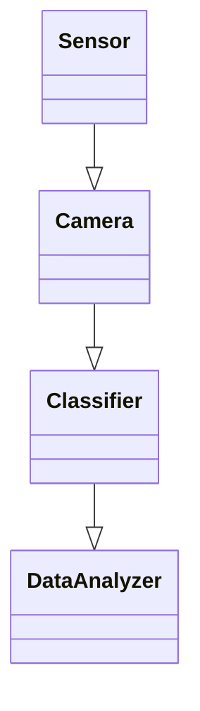

### 5.2 案例二：城市智能垃圾分类回收系统的实施

#### 5.2.1 案例背景

某城市为了解决垃圾分类问题，决定在城市范围内推广智能垃圾分类回收系统。该系统采用了物联网技术和大数据分析，旨在实现全面的垃圾分类和资源回收。

#### 5.2.2 系统设计

- **硬件设备**：在城市的主要街道和社区，安装了智能垃圾分类桶，每个垃圾桶配备了传感器、摄像头和显示屏。
- **物联网**：通过物联网技术，将垃圾桶与中央控制系统相连，实现数据的实时传输和监控。
- **数据分析和决策支持**：系统集成了大数据分析平台，对垃圾数据进行实时分析，为垃圾分类和资源回收提供决策支持。

#### 5.2.3 实施效果

- **提高垃圾分类率**：智能垃圾分类回收系统显著提高了市民的垃圾分类意识，垃圾分类率从原来的30%提高到70%以上。
- **优化资源回收**：通过对垃圾数据的分析，系统能够优化资源回收流程，减少资源浪费，提高了资源回收率。
- **环境监测**：系统还能监测环境质量，如空气质量、水质等，为城市环境管理提供数据支持。

**Mermaid架构图：**

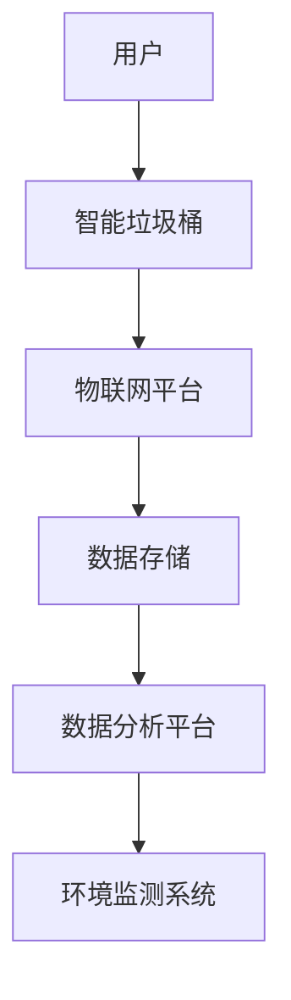

### 本章小结

本章通过两个实际案例，展示了智能垃圾分类回收系统的应用效果和实施效果。通过这些案例，我们可以看到智能垃圾分类回收系统在提高垃圾分类准确性、优化资源回收和环境监测等方面的重要作用。

### 下一步思考：

在接下来的章节中，我们将进一步探讨智能垃圾分类和回收系统的最佳实践，提供优化设计和实施策略，以期为未来的发展和应用提供参考。通过深入分析和实践经验，我们可以不断提升智能垃圾分类和回收系统的性能和效果。#### 第6章: 智能垃圾分类和回收系统的最佳实践

## 第6章: 智能垃圾分类和回收系统的最佳实践

### 6.1 系统设计最佳实践

#### 6.1.1 需求分析与系统架构设计

在智能垃圾分类和回收系统的设计过程中，需求分析是至关重要的一步。首先，需要明确系统的目标和功能需求，如垃圾分类、数据监控、决策支持等。接着，根据需求设计系统的整体架构，包括硬件设备、数据处理单元、网络通信和数据存储等。

- **硬件设备**：选择合适的传感器、摄像头和处理器，确保系统能够在各种环境下稳定运行。
- **数据处理单元**：设计高效的数据处理单元，确保能够快速处理大量的垃圾数据。
- **网络通信**：选择合适的通信协议和网络架构，确保数据传输的实时性和可靠性。
- **数据存储**：设计数据存储方案，确保数据的持久化和安全性。

**Mermaid架构图：**

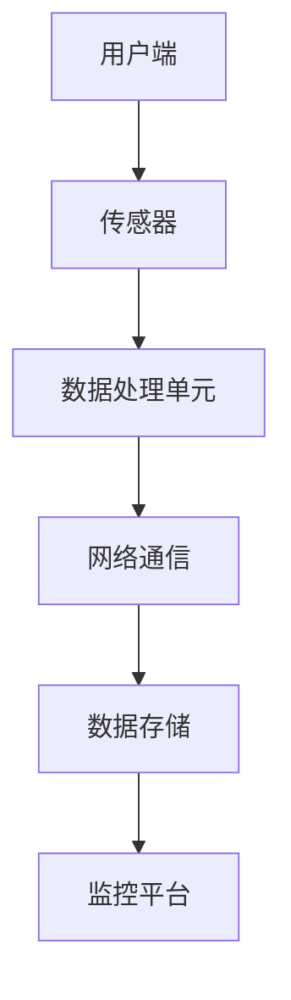

#### 6.1.2 算法优化与模型训练

算法优化是提高智能垃圾分类和回收系统性能的关键。以下是几种常见的算法优化方法：

- **特征提取**：使用深度学习算法提取垃圾图像的特征，提高分类的准确性。
- **模型训练**：使用大量带有标签的垃圾数据集进行模型训练，优化模型的参数和结构。
- **交叉验证**：使用交叉验证方法评估模型的性能，选择最优的模型。

**Mermaid流程图：**

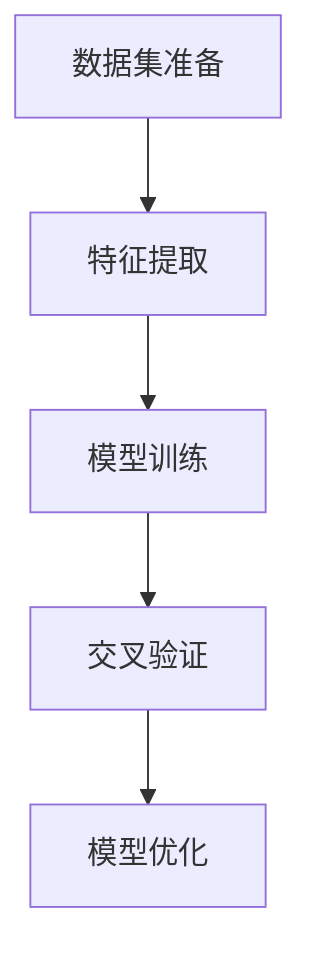

### 6.2 系统实施与优化策略

#### 6.2.1 环境安装与调试

在系统实施过程中，环境安装与调试至关重要。以下是几个关键步骤：

- **硬件安装**：按照设计要求，将传感器、摄像头和处理器等硬件设备安装在垃圾桶或回收站等位置。
- **软件调试**：在硬件安装完成后，进行软件调试，确保系统的各项功能正常运行。
- **系统集成**：将各个硬件设备和软件模块进行集成，确保系统整体运行稳定。

**Mermaid流程图：**

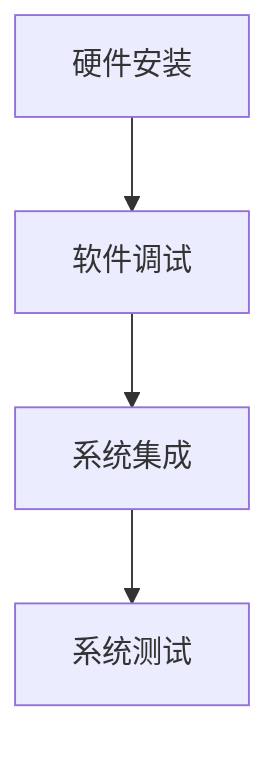

#### 6.2.2 系统监控与维护

系统实施后，需要持续进行监控与维护，确保系统的稳定运行和高效性能。以下是几个关键策略：

- **实时监控**：通过监控系统，实时监测系统的运行状态，如传感器数据、图像识别准确性等。
- **异常处理**：当监控系统检测到异常情况时，及时进行故障诊断和修复。
- **性能优化**：定期对系统进行性能优化，如调整算法参数、升级硬件设备等。

**Mermaid流程图：**

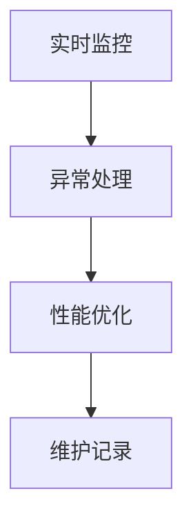

### 6.3 数据分析与利用

#### 6.3.1 数据收集与预处理

智能垃圾分类和回收系统的核心在于对垃圾数据进行分析。以下是数据收集与预处理的关键步骤：

- **数据收集**：通过传感器、摄像头等设备，收集垃圾的重量、体积、材质、图像等信息。
- **数据预处理**：对收集到的数据进行清洗、去噪、归一化等预处理操作，提高数据质量。

**Mermaid流程图：**

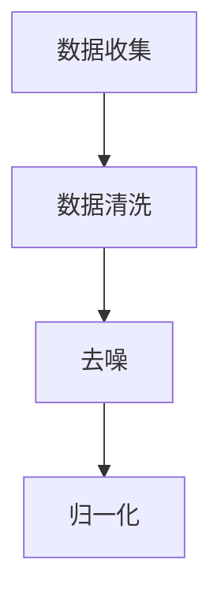

#### 6.3.2 数据分析与决策支持

通过对垃圾数据进行分析，可以为垃圾分类、回收和处理提供决策支持。以下是几个关键步骤：

- **数据探索**：对数据进行探索性分析，发现数据中的规律和趋势。
- **特征工程**：从数据中提取有用的特征，如垃圾的平均重量、出现频率等。
- **模型预测**：使用机器学习模型，对垃圾数据进行预测，如分类、趋势预测等。
- **决策支持**：根据分析结果，为垃圾的回收和处理提供优化建议。

**Mermaid流程图：**

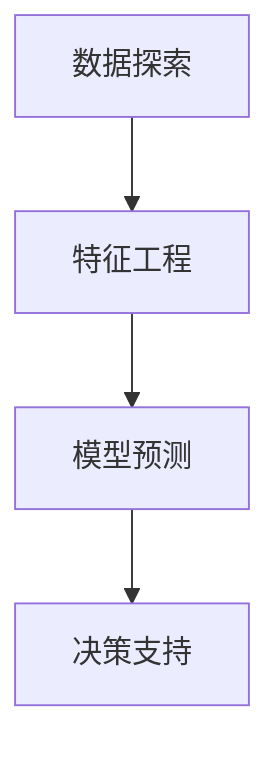

### 本章小结

本章介绍了智能垃圾分类和回收系统的最佳实践，包括系统设计、实施与优化策略、数据分析和利用。通过这些实践，可以显著提高智能垃圾分类和回收系统的性能和效果，为环境保护和可持续发展做出贡献。

### 下一步思考：

在接下来的章节中，我们将深入探讨智能垃圾分类和回收系统的未来发展，包括技术趋势、潜在创新和长期影响。通过这些讨论，我们将为智能垃圾分类和回收系统的发展提供前瞻性视角，推动其在更广泛的领域中的应用。#### 第7章: 结论与展望

## 第7章: 结论与展望

### 7.1 本书小结

本书系统地介绍了人工智能在环境保护中的应用，特别是智能垃圾分类和回收系统。通过分析人工智能的基本原理、环境保护的基本概念以及智能垃圾分类和回收系统的核心要素，我们了解了这一系统的工作原理、面临的挑战与机遇，并通过实际案例分析展示了其应用效果。

主要结论如下：

- 智能垃圾分类和回收系统利用人工智能技术，能够显著提高垃圾分类的准确性和效率，减少垃圾处理成本，实现资源的最大化利用。
- 数据采集、图像识别、分类算法和数据分析是智能垃圾分类和回收系统的核心组成部分，它们共同作用，实现了垃圾的高效分类和处理。
- 智能垃圾分类和回收系统在实际应用中面临数据准确性、复杂环境适应性和数据安全与隐私保护等挑战，但同时也具有技术进步、政策支持和社会责任提升等机遇。

### 7.2 未来发展趋势

未来，智能垃圾分类和回收系统的发展将呈现以下趋势：

- **技术进步**：随着人工智能和物联网技术的不断进步，智能垃圾分类和回收系统的性能将得到进一步提升，包括数据采集的准确性、图像识别的精度和分类算法的效率。
- **政策支持**：政府将继续加大对垃圾分类和环保政策的支持力度，推动智能垃圾分类和回收系统的普及和应用。
- **市场需求**：随着环保意识的提升和垃圾分类政策的实施，企业和居民对智能垃圾分类和回收系统的需求将持续增长。
- **多元化应用**：智能垃圾分类和回收系统不仅可以在城市和社区中应用，还可以扩展到农村、工业等领域，实现更广泛的环保效果。

### 7.3 研究方向与展望

未来的研究可以从以下几个方向展开：

- **算法优化**：深入研究图像识别和分类算法，提高系统的准确性和实时性，特别是在复杂环境下的适应性。
- **数据隐私保护**：探讨如何在保护用户隐私的同时，充分利用数据的价值，确保系统的安全性和可靠性。
- **系统集成与优化**：优化智能垃圾分类和回收系统的整体架构，提高系统的效率和稳定性。
- **多模态数据处理**：结合多种传感器数据，如温度、湿度、声音等，实现更全面的环境监测和垃圾识别。
- **政策与法规研究**：研究智能垃圾分类和回收系统的政策与法规，推动相关标准的制定和实施。

### 本章小结

通过本书的介绍，我们对智能垃圾分类和回收系统有了更深入的理解，认识到其在环境保护中的重要地位。未来，随着技术的进步和政策的支持，智能垃圾分类和回收系统将在更广泛的领域发挥重要作用，为可持续发展做出贡献。让我们期待这一系统的进一步发展和应用，共同创造一个更美好的环境。

### 下一步思考：

未来的研究和发展将聚焦于智能垃圾分类和回收系统的技术提升、政策制定和实际应用，我们需要不断探索新的可能性，推动这一领域的发展。通过持续的科学研究和技术创新，我们将能够实现更加高效、智能的垃圾分类和回收，为环境保护和可持续发展贡献更多力量。让我们保持对未来的期待，共同迎接智能垃圾分类和回收系统的光明前景。作者：AI天才研究院/AI Genius Institute & 禅与计算机程序设计艺术 /Zen And The Art of Computer Programming。

