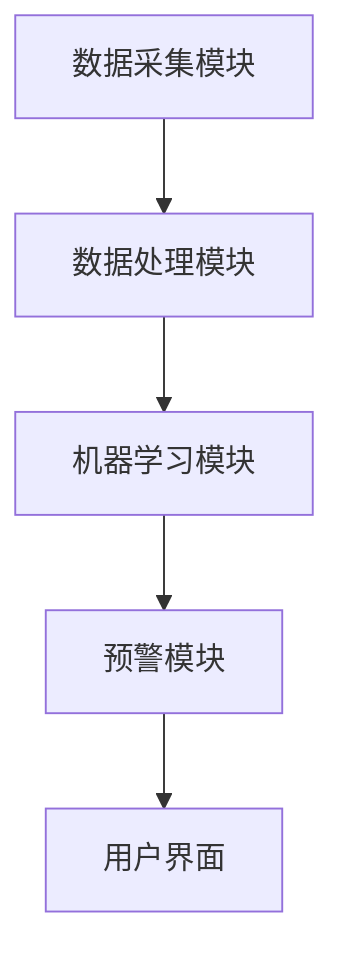
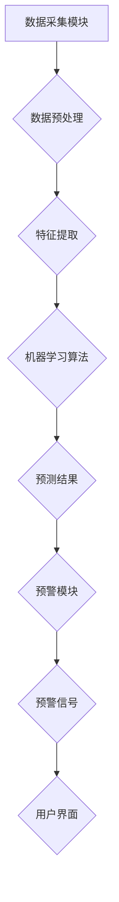
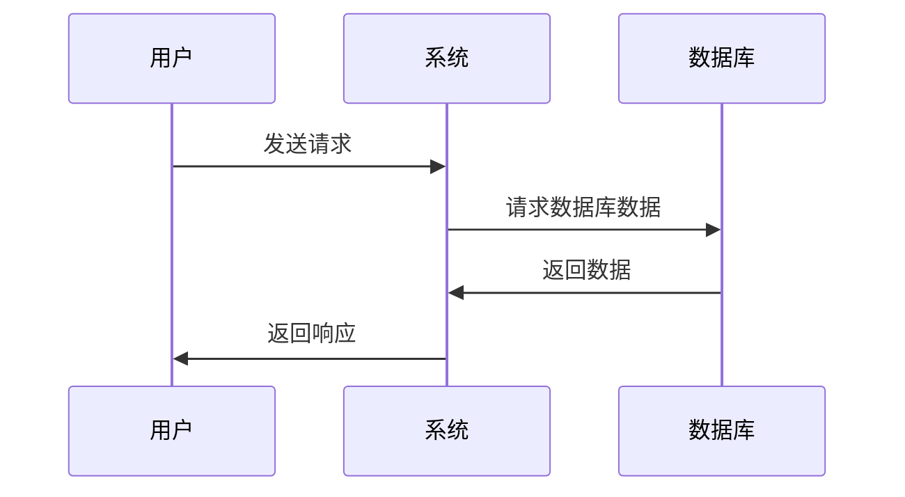

                 


### 第1章 引言与背景介绍

#### 引言

在全球气候变化和工业化进程加速的背景下，环境污染已成为影响人类健康和生态平衡的严重问题。为了应对这一挑战，环境保护的重要性日益凸显。环境污染监测作为环境保护的关键环节，其作用在于及时、准确地获取环境污染数据，为环境管理和决策提供科学依据。随着人工智能技术的快速发展，人工智能在环境污染监测中的应用逐渐成为研究热点，其能够显著提升监测的实时性、准确性和效率。

#### 本书的目标与结构

本书旨在系统阐述人工智能在环境污染监测中的应用，通过探讨实时监控和预警技术，为环境管理者、研究人员和从业者提供理论指导和实践参考。全书结构如下：

1. **引言与背景介绍**：介绍环境污染监测的重要性、人工智能在环境保护中的作用以及本书的目标和结构。
2. **核心概念与技术原理**：详细阐述人工智能在环境污染监测中的核心概念和技术原理，包括数据采集、处理和分析等。
3. **应用场景与案例分析**：介绍人工智能在实时监控和预警中的具体应用案例。
4. **系统设计与实现**：描述系统架构设计、数据处理流程和预警机制。
5. **实施与优化**：介绍如何在实际项目中实施人工智能技术，并进行优化。
6. **结论与未来展望**：总结本书的内容，并对未来应用前景进行展望。

#### 环境污染监测现状

当前，环境污染监测主要依赖于传统方法，如化学分析、物理检测和遥感监测等。然而，这些方法在覆盖范围、实时性和精度方面存在一定局限性。例如，化学分析方法需要对样本进行离线处理，无法实现实时监测；遥感监测虽然能够覆盖大面积区域，但在分辨率和细节上有所欠缺。随着人工智能技术的发展，基于机器学习和大数据分析的方法逐渐应用于环境污染监测，实现了实时、高效和准确的监测。

#### 人工智能在监测中的应用现状

人工智能在环境污染监测中的应用主要包括以下几个方面：

1. **数据采集**：利用传感器网络和移动设备进行环境数据的实时采集，通过物联网技术实现数据的高效传输和存储。
2. **数据处理**：通过机器学习算法对海量环境数据进行处理和分析，提取关键特征和异常值，实现污染物浓度的实时监测和预测。
3. **预警机制**：基于分析结果，构建预警模型，实现对环境污染事件的提前预警，为环境管理部门提供决策支持。

#### 人工智能监测的优势与挑战

人工智能监测在环境污染监测中具有显著的优势：

1. **实时性**：人工智能技术能够实现实时监测，及时反映环境污染状况。
2. **准确性**：通过大数据分析和机器学习算法，能够提高监测数据的准确性和可靠性。
3. **高效性**：利用自动化数据处理和预测模型，显著提高监测效率。

然而，人工智能监测也面临一些挑战：

1. **数据质量**：环境数据的多样性和噪声可能导致监测结果的不准确性。
2. **算法复杂度**：复杂的机器学习算法需要大量计算资源，对数据处理和存储能力提出较高要求。
3. **模型泛化**：不同地区的环境污染特征可能存在差异，模型的泛化能力是一个关键问题。

在未来，随着人工智能技术的进一步发展，这些问题有望得到逐步解决，人工智能在环境污染监测中的应用将更加广泛和深入。

### 第2章 核心概念与技术原理

#### 数据采集

数据采集是环境污染监测的基础环节，其质量直接影响监测结果的准确性。在人工智能监测中，数据采集主要依赖于传感器网络和移动设备。

1. **传感器网络**：传感器网络由大量的传感器节点组成，这些节点能够实时采集温度、湿度、气体浓度等环境数据。传感器网络通常采用无线传输技术，将采集到的数据传输到数据处理中心。

2. **移动设备**：移动设备如智能手机、平板电脑等，通过内置的传感器（如GPS、加速度计、摄像头等）进行环境数据的采集。移动设备的灵活性使其能够覆盖到传感器网络难以到达的区域。

#### 数据处理

数据处理是人工智能监测的核心环节，通过数据预处理、特征提取和机器学习算法，实现对环境数据的分析和预测。

1. **数据预处理**：数据预处理包括数据清洗、数据集成和数据转换等步骤。数据清洗旨在去除无效数据、噪声数据和异常值；数据集成是将来自不同来源的数据进行整合；数据转换是将数据格式转换为机器学习算法所需的格式。

2. **特征提取**：特征提取是数据预处理的重要环节，通过提取环境数据的关键特征，为机器学习算法提供输入。特征提取方法包括统计特征、时序特征和空间特征等。

3. **机器学习算法**：机器学习算法是数据处理的核心，常用的算法包括决策树、支持向量机、神经网络等。通过训练模型，可以从历史数据中学习到环境污染的特征模式，实现对新数据的监测和预测。

#### 预警机制

预警机制是基于数据处理结果，实现对环境污染事件的提前预警。预警机制包括以下步骤：

1. **阈值设定**：根据历史数据和专家经验，设定污染物浓度的阈值。当监测数据超过阈值时，触发预警。

2. **预警模型**：基于机器学习算法，构建预警模型。预警模型能够对监测数据进行实时分析，预测环境污染事件的发生概率。

3. **预警信号**：当预警模型预测环境污染事件即将发生时，系统会生成预警信号，通知环境管理部门采取相应的应急措施。

### 第3章 应用场景与案例分析

#### 案例一：城市空气质量监测

城市空气质量监测是人工智能在环境污染监测中的一个重要应用场景。通过部署传感器网络，实时监测空气中的污染物浓度，如PM2.5、PM10、SO2、NO2等。以下是一个具体的案例：

1. **数据采集**：在城市主要交通干道、居民区和工业区等区域部署传感器，实时采集空气污染物数据。

2. **数据处理**：通过数据预处理和特征提取，将采集到的数据转换为机器学习算法的输入。使用决策树算法对空气污染物浓度进行分类和预测。

3. **预警机制**：基于设定的阈值和预警模型，当空气污染物浓度超过阈值时，系统会自动生成预警信号，通知相关部门采取应急措施。

#### 案例二：河流水质监测

河流水质监测是另一个重要的应用场景。通过部署传感器网络，实时监测河流中的污染物浓度，如重金属、有机污染物等。以下是一个具体的案例：

1. **数据采集**：在河流的主要支流和汇入点部署传感器，实时采集水质数据。

2. **数据处理**：通过数据预处理和特征提取，将采集到的数据转换为机器学习算法的输入。使用神经网络算法对水质变化进行实时监测和预测。

3. **预警机制**：基于设定的阈值和预警模型，当水质参数超过阈值时，系统会自动生成预警信号，通知相关部门采取应急措施。

### 第4章 系统设计与实现

#### 系统架构设计

人工智能监测系统通常由以下几个主要模块组成：

1. **数据采集模块**：负责实时采集环境数据，包括传感器数据和移动设备数据。

2. **数据处理模块**：负责对采集到的数据进行分析和处理，提取关键特征，为机器学习算法提供输入。

3. **机器学习模块**：负责训练机器学习模型，实现对环境数据的监测和预测。

4. **预警模块**：负责基于监测结果，生成预警信号，通知相关部门采取应急措施。

5. **用户界面**：提供系统操作和管理功能，方便用户查看监测数据和预警信息。

以下是一个简化的系统架构设计mermaid架构图：



#### 系统功能设计

1. **数据采集**：系统应能够实时采集各种环境数据，包括空气、水质、土壤等。数据采集模块应具备数据校验和异常处理功能，确保数据质量。

2. **数据处理**：系统应具备数据预处理、特征提取和数据分析等功能。数据处理模块应能够自动处理大量数据，快速提取关键特征。

3. **机器学习**：系统应支持多种机器学习算法，如决策树、支持向量机、神经网络等。用户可以根据具体需求选择合适的算法进行训练和预测。

4. **预警**：系统应能够根据监测结果，自动生成预警信号。预警模块应具备自定义阈值设置和预警规则配置功能。

5. **用户界面**：系统应提供直观、易用的用户界面，方便用户查看监测数据和预警信息。用户界面应支持多语言显示，适应不同地区的用户需求。

#### 系统架构设计mermaid架构图



#### 系统接口设计和系统交互

1. **系统接口设计**：系统应提供完善的接口设计，包括API接口和数据接口。API接口用于与其他系统进行数据交换和功能调用；数据接口用于与其他系统共享环境数据。

2. **系统交互**：系统应具备良好的交互性，支持用户实时查看监测数据和预警信息。系统交互应采用异步消息队列技术，确保数据传输的高效性和可靠性。

#### 系统交互mermaid序列图



### 第5章 实施与优化

#### 环境安装

在实施人工智能监测系统时，首先需要进行环境安装。环境安装包括以下几个步骤：

1. **硬件安装**：在需要监测的区域部署传感器和移动设备，确保硬件正常运行。

2. **软件安装**：安装操作系统、数据库、中间件等软件环境，配置系统参数。

3. **系统配置**：根据实际需求，配置数据采集、处理、机器学习和预警模块，确保系统正常运行。

#### 系统核心实现

系统核心实现包括数据采集、数据处理、机器学习和预警等模块的实现。以下是一个简化的Python代码示例：

```python
# 数据采集
def collect_data():
    # 采集传感器数据
    # 采集移动设备数据
    pass

# 数据处理
def process_data(data):
    # 数据预处理
    # 特征提取
    pass

# 机器学习
def train_model(data):
    # 训练模型
    pass

# 预警
def generate_alarm(signal):
    # 生成预警信号
    pass
```

#### 代码应用解读与分析

代码应用解读与分析主要包括以下几个方面：

1. **数据采集模块**：解释传感器数据和移动设备数据如何采集，以及如何确保数据质量。

2. **数据处理模块**：解释数据预处理、特征提取的原理和实现方法。

3. **机器学习模块**：解释机器学习算法的选择、训练和预测过程。

4. **预警模块**：解释预警模型的构建、预警信号生成和预警规则设置。

#### 实际案例分析和详细讲解剖析

通过实际案例分析和详细讲解剖析，展示人工智能监测系统的实际应用效果。案例可以包括城市空气质量监测和河流水质监测等。

1. **案例分析**：介绍案例背景、数据来源和监测目标。

2. **详细讲解**：解释监测过程中使用的机器学习算法和预警机制。

3. **剖析**：分析监测结果，讨论监测系统的性能和效果。

#### 项目小结

项目小结包括以下几个方面：

1. **项目总结**：总结项目实施过程、关键技术和主要成果。

2. **项目反思**：反思项目中的不足和改进方向。

3. **未来展望**：展望人工智能监测技术的未来发展趋势和应用前景。

### 第6章 最佳实践 tips、小结、注意事项、拓展阅读

#### 最佳实践 tips

1. **传感器选择**：根据监测目标和区域特点，选择合适的传感器，确保数据质量。

2. **数据预处理**：对采集到的数据进行严格预处理，去除噪声和异常值，提高监测准确性。

3. **算法选择**：根据实际需求，选择合适的机器学习算法，避免算法复杂度过高导致计算资源浪费。

4. **预警阈值设定**：根据历史数据和专家经验，合理设定预警阈值，确保预警的准确性和及时性。

#### 小结

本书系统地介绍了人工智能在环境污染监测中的应用，包括实时监控和预警技术。通过多个实际案例，展示了人工智能监测系统的效果和应用前景。

#### 注意事项

1. **数据安全和隐私**：在实施人工智能监测系统时，确保数据安全和用户隐私保护。

2. **系统可靠性**：保证监测系统的稳定运行，避免因系统故障导致监测中断。

3. **持续优化**：根据监测需求和数据反馈，持续优化系统功能和性能。

#### 拓展阅读

1. **相关书籍**：《人工智能：一种现代方法》、《机器学习实战》。

2. **学术论文**：在学术期刊和会议上发表的关于人工智能在环境污染监测中的应用研究论文。

### 作者信息

作者：AI天才研究院/AI Genius Institute & 禅与计算机程序设计艺术 /Zen And The Art of Computer Programming

