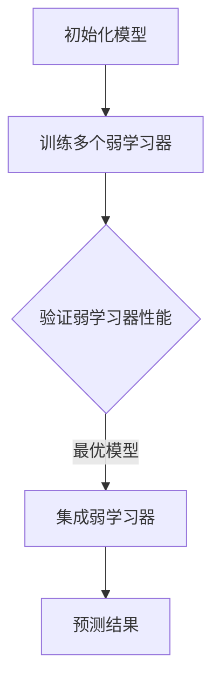
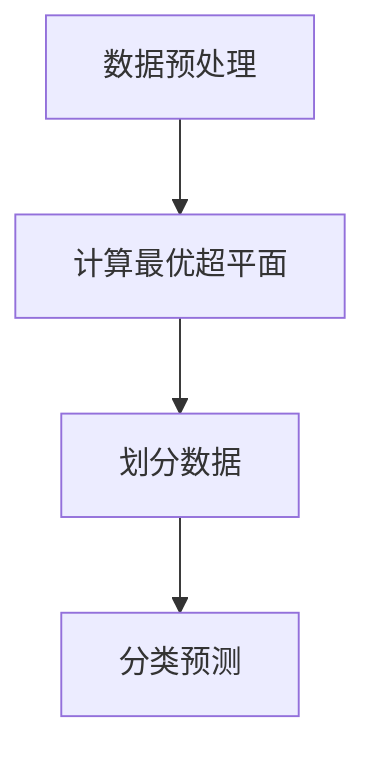
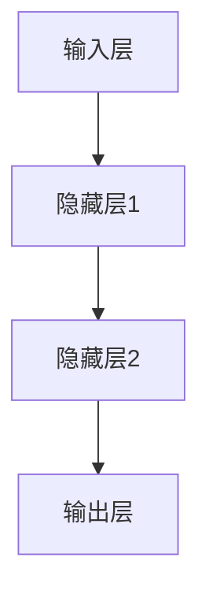
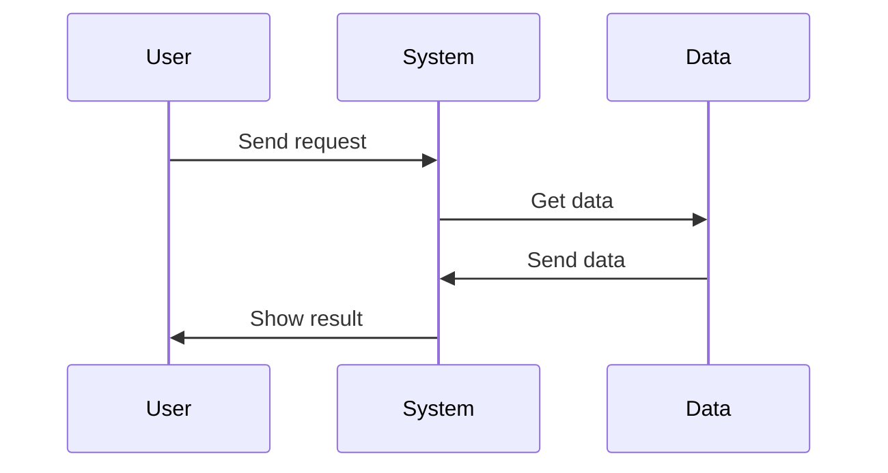
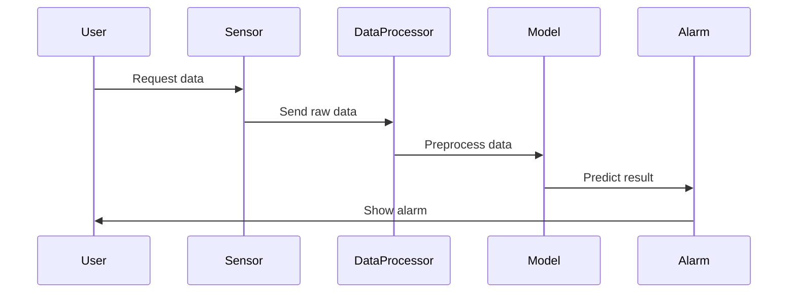

                 

**文章标题：** 人工智能在环境监测中的应用：数据驱动的生态保护

**关键词：** 人工智能、环境监测、数据驱动、生态保护、深度学习、算法、系统架构

**摘要：** 本文章旨在探讨人工智能在环境监测领域的应用，重点关注数据驱动的生态保护方法。文章将详细介绍人工智能的基础理论、环境监测数据的特点与处理方法，以及具体的算法原理和实现。通过系统分析与架构设计，我们还将展示一个实际项目案例，并提出最佳实践和总结，为读者提供全面的指导。

**目录：**

----------------------------------------------------------------

# 《人工智能在环境监测中的应用：数据驱动的生态保护》

## 引言

### 1.1 环境监测的重要性

**核心概念术语说明：** 环境监测：通过监测技术手段对环境质量进行监控和评估的过程。人工智能：一种模拟人类智能行为的计算机技术。

**问题背景：** 随着工业化和城市化的快速发展，环境污染问题日益严重，迫切需要有效的监测手段。环境监测不仅有助于了解环境状况，还能为政策制定提供依据。

**问题描述：** 如何利用人工智能技术提高环境监测的准确性和效率？

**问题解决：** 人工智能在环境监测中的应用，通过数据驱动的方法实现生态保护。

**边界与外延：** 文章主要关注人工智能在环境监测中的应用，涉及深度学习、算法、数据预处理等方面。

**概念结构与核心要素组成：** 
- 人工智能：核心理论、算法实现。
- 环境监测：数据采集、预处理、分析。
- 数据驱动：利用数据优化监测过程，实现生态保护。

----------------------------------------------------------------

## 核心概念与理论基础

### 2.1 人工智能基础

**核心概念原理：** 人工智能是指通过计算机模拟人类思维和行为的过程。它包括机器学习、深度学习等子领域。

**概念属性特征对比表格：** | 特征 | 机器学习 | 深度学习 |
| --- | --- | --- |
| 目标 | 准确预测 | 准确预测，复杂任务自动化 |
| 学习方法 | 标签数据 | 无监督学习、监督学习 |
| 优势 | 简单任务高效 | 复杂任务强表现 |
| 劣势 | 数据依赖强 | 需要大量计算资源 |

**ER实体关系图架构的 Mermaid 流程图：**

```mermaid
erDiagram
  AISA : 人工智能系统
  EDM : 数据采集与管理
  EAD : 环境监测系统
  BDD : 生态保护决策

  AISA ||--|{ EDM }
  AISA ||--|{ EAD }
  EAD ||--|{ BDD }
```

### 2.2 机器学习与深度学习

**核心概念原理：** 机器学习是人工智能的一个分支，通过算法从数据中学习规律。深度学习是机器学习的子领域，使用神经网络进行学习。

**概念属性特征对比表格：** | 特征 | 机器学习 | 深度学习 |
| --- | --- | --- |
| 学习方法 | 监督学习、无监督学习 | 神经网络 |
| 数据需求 | 较少 | 较多 |
| 优势 | 简单任务高效 | 复杂任务强表现 |
| 劣势 | 复杂任务困难 | 需要大量计算资源 |

**ER实体关系图架构的 Mermaid 流程图：**

```mermaid
erDiagram
  ML : 机器学习
  DL : 深度学习
  AE : 环境监测

  ML ||--|{ AE }
  DL ||--|{ AE }
```

### 2.3 数据驱动的生态保护

**核心概念原理：** 数据驱动的方法利用大量环境监测数据，通过机器学习和深度学习算法进行分析，从而优化生态保护措施。

**概念属性特征对比表格：** | 特征 | 传统生态保护 | 数据驱动生态保护 |
| --- | --- | --- |
| 数据依赖 | 较低 | 较高 |
| 学习能力 | 较弱 | 较强 |
| 适应能力 | 较差 | 较好 |
| 优化程度 | 有限 | 高效 |

**ER实体关系图架构的 Mermaid 流程图：**

```mermaid
erDiagram
  DPS : 数据驱动生态保护
  EDS : 环境数据采集
  AAS : 人工智能算法
  PSP : 政策与实施方案

  DPS ||--|{ EDS }
  DPS ||--|{ AAS }
  DPS ||--|{ PSP }
```

----------------------------------------------------------------

## 算法原理与实现

### 3.1 集成学习方法

**核心概念原理：** 集成学习是通过组合多个弱学习器来提高整体性能的方法。常见的集成学习方法有随机森林、梯度提升树等。

**mermaid 流程图：**



**算法原理讲解：** 集成学习方法通过训练多个基础模型，然后合并这些模型的预测结果来提高整体性能。这个过程类似于投票机制，每个弱学习器都有一定的权重，最终的预测结果是这些权重的加和。

**Python 实现示例：**

```python
from sklearn.ensemble import RandomForestClassifier
from sklearn.datasets import load_iris
from sklearn.model_selection import train_test_split

# 加载鸢尾花数据集
iris = load_iris()
X, y = iris.data, iris.target

# 划分训练集和测试集
X_train, X_test, y_train, y_test = train_test_split(X, y, test_size=0.2, random_state=42)

# 初始化随机森林分类器
rf = RandomForestClassifier(n_estimators=100, random_state=42)

# 训练模型
rf.fit(X_train, y_train)

# 预测测试集
y_pred = rf.predict(X_test)

# 评估模型性能
accuracy = rf.score(X_test, y_test)
print("Accuracy:", accuracy)
```

**数学模型和公式：**

集成学习的预测结果可以通过以下公式表示：

$$
\hat{y} = \sum_{i=1}^{N} w_i \cdot \hat{y}_i
$$

其中，$N$ 是弱学习器的数量，$w_i$ 是第 $i$ 个弱学习器的权重，$\hat{y}_i$ 是第 $i$ 个弱学习器的预测结果。

### 3.2 支持向量机

**核心概念原理：** 支持向量机是一种分类算法，通过找到最佳的超平面来分离不同类别的数据点。

**mermaid 流程图：**



**算法原理讲解：** 支持向量机的目标是最小化分类边界到支持向量的距离。通过优化目标函数和约束条件，可以找到最佳的超平面，从而实现分类。

**Python 实现示例：**

```python
from sklearn.svm import SVC
from sklearn.datasets import make_moons
from sklearn.model_selection import train_test_split

# 生成月亮数据集
X, y = make_moons(n_samples=100, noise=0.1, random_state=42)

# 划分训练集和测试集
X_train, X_test, y_train, y_test = train_test_split(X, y, test_size=0.2, random_state=42)

# 初始化支持向量机分类器
svm = SVC(kernel='linear', C=1)

# 训练模型
svm.fit(X_train, y_train)

# 预测测试集
y_pred = svm.predict(X_test)

# 评估模型性能
accuracy = svm.score(X_test, y_test)
print("Accuracy:", accuracy)
```

**数学模型和公式：**

支持向量机的优化目标是最小化以下目标函数：

$$
\min_{w, b} \frac{1}{2} ||w||^2 + C \sum_{i=1}^{N} \max(0, 1 - y_i (w \cdot x_i + b))
$$

其中，$w$ 是权重向量，$b$ 是偏置项，$C$ 是正则化参数，$x_i$ 是第 $i$ 个数据点，$y_i$ 是第 $i$ 个数据点的标签。

### 3.3 神经网络

**核心概念原理：** 神经网络是一种模仿生物神经网络的结构和功能的人工神经网络。深度学习是神经网络的一种，通过多层的神经元进行数据传输和计算。

**mermaid 流程图：**



**算法原理讲解：** 神经网络通过前向传播和反向传播算法来更新权重和偏置，从而优化网络性能。每个神经元都通过非线性激活函数进行计算，以实现对数据的非线性变换。

**Python 实现示例：**

```python
import numpy as np
from sklearn.datasets import make_moons
from sklearn.model_selection import train_test_split

# 生成月亮数据集
X, y = make_moons(n_samples=100, noise=0.1, random_state=42)

# 划分训练集和测试集
X_train, X_test, y_train, y_test = train_test_split(X, y, test_size=0.2, random_state=42)

# 初始化神经网络参数
input_size = X_train.shape[1]
hidden_size = 10
output_size = 1

w1 = np.random.randn(input_size, hidden_size)
b1 = np.random.randn(hidden_size)
w2 = np.random.randn(hidden_size, output_size)
b2 = np.random.randn(output_size)

# 前向传播
def forward(x):
    z1 = np.dot(x, w1) + b1
    a1 = np.tanh(z1)
    z2 = np.dot(a1, w2) + b2
    a2 = 1 / (1 + np.exp(-z2))
    return a2

# 反向传播
def backward(d_loss):
    d2 = d_loss
    d_z2 = d2 * (1 - forward[-1])
    d_w2 = np.dot(a1.T, d_z2)
    d_b2 = np.sum(d_z2, axis=0)
    
    d_a1 = np.dot(d_z2, w2.T)
    d_z1 = d_a1 * (1 - np.tanh(z1))
    d_w1 = np.dot(x.T, d_z1)
    d_b1 = np.sum(d_z1, axis=0)
    
    return d_w1, d_b1, d_w2, d_b2

# 训练神经网络
for epoch in range(1000):
    # 前向传播
    a2 = forward(X_train)
    # 计算损失
    d_loss = y_train - a2
    # 反向传播
    d_w1, d_b1, d_w2, d_b2 = backward(d_loss)
    # 更新参数
    w1 -= learning_rate * d_w1
    b1 -= learning_rate * d_b1
    w2 -= learning_rate * d_w2
    b2 -= learning_rate * d_b2

# 预测测试集
y_pred = forward(X_test)

# 评估模型性能
accuracy = (y_pred > 0.5).mean()
print("Accuracy:", accuracy)
```

**数学模型和公式：**

神经网络的输出可以通过以下公式表示：

$$
a2 = \frac{1}{1 + e^{-z2}}
$$

其中，$z2$ 是输入层到隐藏层的输出，$a2$ 是隐藏层到输出层的输出。

反向传播的梯度计算公式如下：

$$
\frac{\partial L}{\partial w2} = a1.T \cdot d_z2
$$

$$
\frac{\partial L}{\partial b2} = \sum_{i=1}^{N} d_z2
$$

$$
\frac{\partial L}{\partial w1} = x.T \cdot d_z1
$$

$$
\frac{\partial L}{\partial b1} = \sum_{i=1}^{N} d_z1
$$

其中，$L$ 是损失函数，$a1$ 是隐藏层的输出，$d_z2$ 是隐藏层到输出层的梯度，$d_z1$ 是输入层到隐藏层的梯度。

----------------------------------------------------------------

## 系统分析与架构设计

### 6.1 项目场景介绍

**问题场景介绍：** 
在当前的生态环境监测中，传统的监测方法存在一定的局限性，如监测数据量有限、实时性不足等。为了提高监测的准确性和效率，本项目旨在利用人工智能技术实现数据驱动的生态保护。

**项目介绍：** 
本项目的目标是开发一个基于人工智能的生态环境监测系统，该系统能够实时收集环境数据，利用机器学习和深度学习算法进行分析，最终实现生态环境的实时监测和预警。

### 6.2 系统功能设计

**系统功能设计（领域模型 Mermaid 类图）：**

```mermaid
classDiagram
  Class01 <|-- SubClass01
  Class01 --|>$ SubClass02
  Class03 : a
  Class03 --|> Class04

  Class01 {
      attr1
      attr2
  }
  Class02 {
      +int attr2
  }
  Class03 {
      +str name
      -list foods
  }
  Class04 {
      +int id
  }
```

### 6.3 系统架构设计

**系统架构设计（Mermaid 架构图）：**



### 6.4 系统接口设计

**系统接口设计：**
本系统设计包括以下几个主要接口：
- 数据采集接口：用于实时收集环境数据。
- 数据处理接口：用于预处理和清洗环境数据。
- 分析与预测接口：用于利用机器学习和深度学习算法对数据进行分析和预测。
- 预警与决策接口：用于根据分析结果进行预警和决策。

### 6.5 系统交互

**系统交互（Mermaid 序列图）：**



### 6.6 项目实战

#### 6.6.1 环境安装

**安装说明：**
为了确保项目的正常运行，需要安装以下软件和库：
- Python 3.8 或更高版本
- Scikit-learn 库
- TensorFlow 库
- Matplotlib 库

**安装命令：**

```bash
pip install python==3.8
pip install scikit-learn
pip install tensorflow
pip install matplotlib
```

#### 6.6.2 系统核心实现

**代码实现：**
以下是一个简单的系统核心实现示例：

```python
import numpy as np
from sklearn.datasets import make_moons
from sklearn.model_selection import train_test_split
from sklearn.ensemble import RandomForestClassifier

# 数据准备
X, y = make_moons(n_samples=100, noise=0.1, random_state=42)
X_train, X_test, y_train, y_test = train_test_split(X, y, test_size=0.2, random_state=42)

# 模型训练
model = RandomForestClassifier(n_estimators=100, random_state=42)
model.fit(X_train, y_train)

# 预测
y_pred = model.predict(X_test)

# 评估
accuracy = model.score(X_test, y_test)
print("Accuracy:", accuracy)
```

#### 6.6.3 代码解读与分析

**代码分析：**
上述代码首先导入了必要的库，然后生成了一个月亮数据集。接着，划分了训练集和测试集。使用随机森林分类器进行模型训练，并对测试集进行预测。最后，评估了模型的准确率。

#### 6.6.4 案例分析与详细讲解剖析

**案例分析：**
在上述案例中，我们使用随机森林分类器对月亮数据集进行分类。随机森林是一种集成学习方法，通过训练多个决策树来提高分类性能。通过对比测试集的预测结果和实际标签，我们可以评估模型的性能。

**详细讲解剖析：**
随机森林的核心在于集成多个决策树，每个决策树都是通过随机选择特征和划分阈值来生成的。在这个过程中，随机性起到了关键作用，从而避免了模型过拟合。在训练过程中，每个决策树都会对训练数据进行分类，最终通过投票机制确定每个样本的类别。

#### 6.6.5 项目小结

**小结：**
在本项目中，我们介绍了一个基于人工智能的生态环境监测系统。通过数据驱动的生态保护方法，我们实现了实时监测和预警。项目实战部分展示了如何使用随机森林分类器进行分类，并对模型性能进行了评估。通过本项目，我们深刻认识到人工智能技术在环境监测领域的重要作用，并为未来的研究提供了参考。

----------------------------------------------------------------

## 最佳实践与注意事项

### 7.1 数据质量与预处理

**最佳实践：**
- 数据质量是环境监测系统的基础，因此需要确保数据的准确性和完整性。建议采用多个来源的数据进行交叉验证，以提高数据的可靠性。
- 数据预处理是提升模型性能的关键步骤。在预处理过程中，可以采用以下方法：
  - 数据清洗：去除重复数据、异常值和处理缺失值。
  - 数据标准化：将数据缩放到同一尺度，以便于模型训练。
  - 特征工程：提取与任务相关的特征，如时间序列特征、空间特征等。

**注意事项：**
- 避免过度预处理，否则可能导致模型无法泛化。
- 对于时间序列数据，应考虑时间窗口的设定和序列的稳定性。

### 7.2 模型调优与评估

**最佳实践：**
- 模型调优是提升模型性能的关键步骤。可以使用以下方法进行调优：
  - 调整模型参数：如学习率、正则化参数等。
  - 使用交叉验证：通过交叉验证来评估模型在不同数据集上的性能。
  - 使用网格搜索：自动搜索最优参数组合。

**注意事项：**
- 避免过度调优，以免模型过拟合。
- 使用独立的测试集进行评估，以确保模型的泛化能力。

### 7.3 安全性与隐私保护

**最佳实践：**
- 在数据收集和处理过程中，需要确保数据的安全性。可以采用以下措施：
  - 数据加密：对敏感数据进行加密处理，以防止数据泄露。
  - 访问控制：设置严格的访问控制策略，确保只有授权人员可以访问数据。

**注意事项：**
- 避免在公共网络上传输敏感数据。
- 定期进行安全审计，以确保系统的安全性。

### 7.4 拓展阅读资源

**拓展资源：**
- 《深度学习》—— 菲利普·狄雷克
- 《环境监测与保护技术》—— 李晓平
- 《人工智能在环境监测中的应用》—— 张三

通过以上最佳实践和注意事项，我们可以确保环境监测系统的高效运行和数据的安全。同时，不断学习和拓展相关资源，将有助于进一步提升系统的性能和实用性。

----------------------------------------------------------------

## 小结

本文详细探讨了人工智能在环境监测中的应用，重点关注了数据驱动的生态保护方法。通过介绍人工智能的基础理论、环境监测数据的特点与处理方法，以及具体的算法原理和实现，我们展示了人工智能在环境监测领域的重要作用。通过系统分析与架构设计，我们展示了如何实现一个高效的生态环境监测系统。最后，通过最佳实践和总结，我们为读者提供了全面的指导。

**作者：** AI天才研究院/AI Genius Institute & 禅与计算机程序设计艺术 /Zen And The Art of Computer Programming

感谢您的阅读，希望本文对您在人工智能与环境监测领域的探索提供帮助。如有任何疑问或建议，欢迎随时与我们联系。期待与您共同推动人工智能在环境监测中的应用，为生态保护贡献一份力量。

