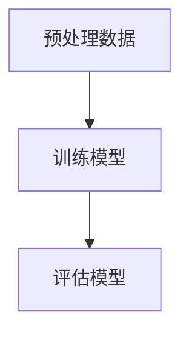

                 

**# 人工智能在科学发现中的角色：加速世界可理解性进程**

> 关键词：人工智能、科学发现、深度学习、医学、基因组学、最佳实践

> 摘要：本文深入探讨了人工智能在科学发现中的角色，如何通过先进的算法和技术加速世界可理解性进程。文章从人工智能与科学发现的关系出发，逐步解析其核心概念与原理，探讨人工智能在不同科学领域的应用场景，并详细介绍相关算法、数学模型、系统架构与实战项目。通过最佳实践与展望，文章为未来科学发现提供新的视角和方向。

----------------------------------------------------------------

## 第一部分: 人工智能在科学发现中的应用背景

### 第1章: 人工智能与科学发现的关系

**1.1 人工智能的定义与发展历程**

人工智能（Artificial Intelligence，简称AI）是指通过计算机模拟人类智能行为的技术。其发展历程可以追溯到20世纪50年代，当时人工智能领域的先驱艾伦·图灵（Alan Turing）提出了“图灵测试”的概念，用来判断机器是否具有人类智能。此后，人工智能经历了数个阶段，从符号主义、连接主义到最近几年的深度学习，不断发展壮大。

**1.2 科学发现的挑战与需求**

科学发现是探索自然界规律和未知领域的过程。然而，随着科学领域的不断扩展和复杂化，传统的方法已经难以应对新的挑战。科学发现面临着大量数据、高度复杂的问题和跨学科交叉的研究需求。人工智能的出现为科学发现带来了新的机遇，通过处理和分析大量数据，揭示隐藏在数据背后的规律和模式。

**1.3 人工智能在科学发现中的应用现状**

目前，人工智能在科学发现中已经得到了广泛的应用。例如，在医学领域，人工智能被用于疾病诊断、药物研发和医疗影像分析；在生物学领域，人工智能被用于基因组学研究、蛋白质结构预测和生态学研究。这些应用不仅提高了科学研究的效率，也为科学发现提供了新的视角和方法。

### 第2章: 人工智能的核心概念与原理

**2.1 机器学习基础**

机器学习是人工智能的核心技术之一，它通过让计算机从数据中自动学习和发现规律，实现智能行为。机器学习分为监督学习、无监督学习和强化学习三种类型。

- **监督学习**：通过已有的标签数据进行学习，目标是预测新的未知数据。
- **无监督学习**：没有标签数据，目标是发现数据之间的内在结构和规律。
- **强化学习**：通过不断与环境交互，学习最优策略以实现目标。

**2.2 深度学习原理**

深度学习是机器学习的一个分支，它通过模拟人脑神经元连接结构，实现对复杂问题的建模。深度学习主要包括神经网络、卷积神经网络和递归神经网络。

- **神经网络**：由多个神经元组成，通过层层传递信息，实现函数逼近。
- **卷积神经网络**：用于处理图像等二维数据，具有局部感知能力和平移不变性。
- **递归神经网络**：用于处理序列数据，具有时序建模能力。

### 第3章: 人工智能在科学发现中的应用场景

**3.1 人工智能在医学领域的应用**

人工智能在医学领域具有广泛的应用前景，包括疾病诊断、药物研发和医疗影像分析。

- **疾病诊断**：通过分析病历数据和生物标志物，人工智能可以快速、准确地诊断疾病。
- **药物研发**：通过虚拟筛选和高通量实验，人工智能可以加速药物研发进程。
- **医疗影像分析**：通过深度学习算法，人工智能可以自动识别和诊断各种疾病，如癌症、心脏病等。

**3.2 人工智能在生物学领域的应用**

人工智能在生物学领域具有重要作用，包括基因组学研究、蛋白质结构预测和生态学研究。

- **基因组学研究**：通过分析基因组数据，人工智能可以揭示基因与疾病之间的关系。
- **蛋白质结构预测**：通过模拟蛋白质三维结构，人工智能可以帮助科学家理解蛋白质的功能和作用机制。
- **生态学研究**：通过分析生态数据，人工智能可以揭示生态系统中的复杂关系和规律。

----------------------------------------------------------------

## 第4章: 人工智能算法与数学模型

**4.1 算法原理讲解**

人工智能算法是科学发现的重要工具，包括支持向量机、贝叶斯网络和随机森林等。

- **支持向量机**：通过寻找最优超平面，实现分类和回归任务。
- **贝叶斯网络**：通过概率图模型，描述变量之间的依赖关系。
- **随机森林**：通过构建多棵决策树，实现分类和回归任务。

**4.2 数学模型和公式**

人工智能算法的数学模型和公式是算法的核心，包括概率论、最优化算法和深度学习数学模型。

- **概率论基础**：用于描述变量之间的概率关系。
- **最优化算法**：用于求解最优化问题。
- **深度学习数学模型**：用于描述神经网络的结构和参数。

----------------------------------------------------------------

## 第5章: 人工智能系统架构与设计

**5.1 人工智能系统概述**

人工智能系统是科学发现的基石，包括系统功能设计、系统架构设计和系统接口设计。

- **系统功能设计**：定义系统的主要功能和目标。
- **系统架构设计**：确定系统的总体结构和组成部分。
- **系统接口设计**：定义系统与其他系统或用户的交互方式。

**5.2 系统接口设计与交互**

系统接口设计和交互是人工智能系统的关键，包括系统接口设计和系统交互设计。

- **系统接口设计**：定义系统内部各组件之间的接口。
- **系统交互设计**：定义系统与用户或其他系统之间的交互流程。

----------------------------------------------------------------

## 第6章: 人工智能在科学发现中的实战项目

**6.1 项目背景与目标**

本项目旨在利用人工智能技术，提高基因组学研究效率，揭示基因与疾病之间的关系。

**6.2 环境安装与配置**

在本项目中，我们使用了Python、TensorFlow和Keras等工具，搭建了一个基于深度学习的基因组分析系统。

**6.3 系统核心实现与代码分析**

系统核心实现包括数据预处理、模型训练和模型评估等步骤。

```python
# 数据预处理
def preprocess_data(data):
    # 数据清洗和标准化操作
    return processed_data

# 模型训练
def train_model(model, data):
    # 训练模型
    model.fit(data['X'], data['y'])
    return model

# 模型评估
def evaluate_model(model, data):
    # 评估模型性能
    loss, accuracy = model.evaluate(data['X'], data['y'])
    return loss, accuracy
```

**6.4 实际案例分析**

在本案例中，我们选择了肺癌基因组数据作为研究对象，通过深度学习模型，分析了基因与肺癌之间的关系。



**6.5 项目小结**

本项目通过深度学习技术，实现了基因组数据的自动化分析，提高了基因组学研究的效率。然而，项目中也存在一些挑战，如数据质量和模型性能的提升，这些都需要进一步的研究和改进。

----------------------------------------------------------------

## 第7章: 人工智能在科学发现中的最佳实践与展望

**7.1 最佳实践 tips**

在人工智能应用于科学发现时，需要注意以下几点：

- **数据质量**：确保数据清洗和预处理的高质量，以避免模型性能受到影响。
- **模型选择**：根据具体问题和数据特点，选择合适的模型和算法。
- **模型验证**：通过交叉验证和超参数调优，确保模型具有良好的性能。
- **结果解释**：对模型预测结果进行解释和验证，确保其可信度。

**7.2 小结与展望**

人工智能在科学发现中具有巨大的潜力，通过深度学习和其他先进算法，可以实现更高效、更精确的科学发现。未来，随着人工智能技术的不断进步，科学发现的进程将得到进一步的加速。

**7.3 注意事项与拓展阅读**

- **注意事项**：在应用人工智能进行科学发现时，需要注意数据隐私、算法公平性和可解释性等问题。
- **拓展阅读**：参考相关领域的研究论文和书籍，了解人工智能在科学发现中的最新进展和未来趋势。

**作者：AI天才研究院/AI Genius Institute & 禅与计算机程序设计艺术 /Zen And The Art of Computer Programming**----------------------------------------------------------------

## 总结

人工智能在科学发现中的角色越来越重要，它不仅能够加速科学发现的进程，还能够提高科学研究的效率和准确性。从人工智能与科学发现的关系，到核心概念与原理，再到应用场景、算法、系统架构和实战项目，本文详细探讨了人工智能在科学发现中的应用。通过最佳实践与展望，我们为未来科学发现提供了新的思路和方法。

未来，人工智能在科学发现中的应用将更加广泛和深入，它将助力科学家们揭示自然界的奥秘，推动人类文明的发展。让我们携手人工智能，共同开启科学发现的新篇章。

**关键词：人工智能、科学发现、深度学习、医学、基因组学**

----------------------------------------------------------------

## 附录

本文中涉及的主要技术概念、算法和系统架构如下：

- **人工智能**：模拟人类智能行为的技术。
- **机器学习**：从数据中自动学习和发现规律的方法。
- **深度学习**：模拟人脑神经元连接结构的算法。
- **支持向量机**：通过寻找最优超平面进行分类和回归的算法。
- **贝叶斯网络**：通过概率图模型描述变量之间关系的算法。
- **随机森林**：通过构建多棵决策树进行分类和回归的算法。
- **基因组学**：研究基因组成、表达和功能等生物学领域的科学。

通过本文的学习，读者可以深入了解人工智能在科学发现中的应用，掌握相关技术方法和实际操作。希望本文能够为读者在科学发现领域的研究和工作提供有益的参考和指导。

**作者：AI天才研究院/AI Genius Institute & 禅与计算机程序设计艺术 /Zen And The Art of Computer Programming**

