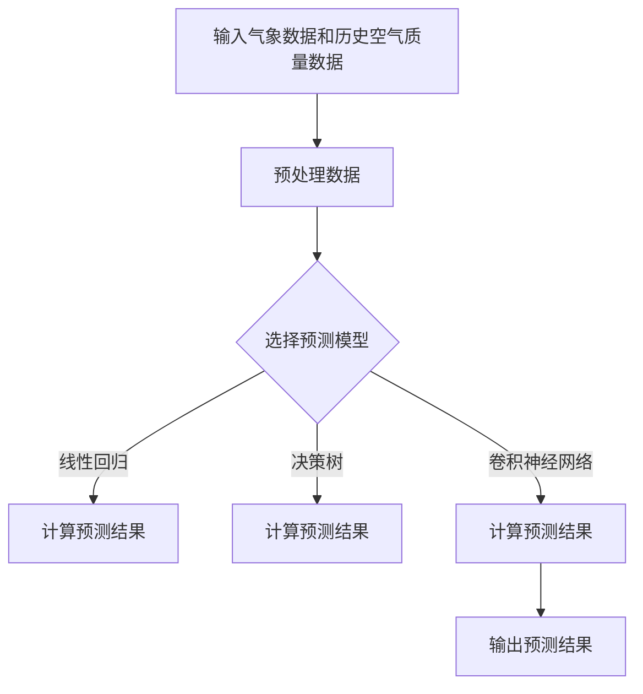
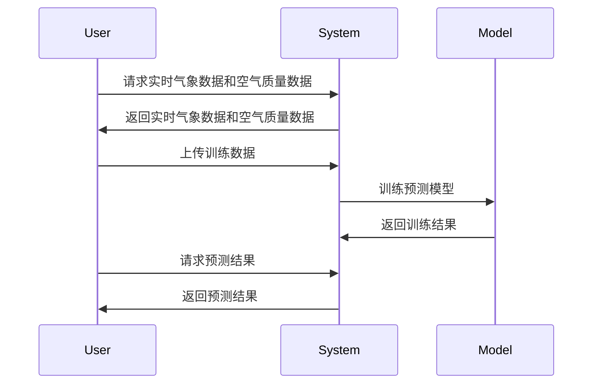
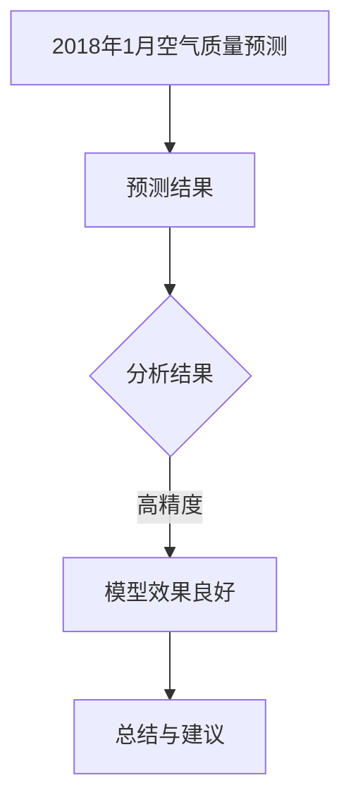

                 


# 人工智能在空气质量预测中的精准应用

> 关键词：空气质量预测、人工智能、算法、深度学习、机器学习、数据分析

> 摘要：
随着城市化进程的加快和工业活动的增加，空气污染已成为全球性难题。空气质量预测对于公共健康、环境保护和城市管理具有重要意义。本文将探讨人工智能在空气质量预测中的应用，通过详细分析预测算法、数学模型和系统设计，展示其在提高预测精度和效率方面的潜力。

## 引言和背景

### 1.1 问题背景

空气质量是衡量城市生态环境质量的重要指标，它直接影响着人们的健康和生活质量。然而，传统的空气质量预测方法往往依赖于有限的观测数据和简单的统计模型，难以适应复杂多变的空气质量状况。近年来，随着人工智能技术的迅猛发展，利用机器学习和深度学习算法进行空气质量预测成为可能，并取得了显著的效果。

### 1.2 人工智能在空气质量预测中的重要性

人工智能技术在空气质量预测中的应用，不仅能够提高预测的精度和效率，还能够实时更新预测模型，适应环境变化。通过大数据分析，人工智能可以挖掘出隐藏在空气污染数据中的复杂模式，为环境保护和公共健康提供科学依据。

### 1.3 边界与外延

本文主要关注以下几个方面：

- 预测算法的选择与应用
- 数学模型的建立与优化
- 系统设计与实现
- 实际案例分析与讨论

本文将遵循以下结构进行讨论：

1. 基本概念：介绍人工智能的基本概念以及空气质量预测的相关概念。
2. 算法原理：详细阐述用于空气质量预测的机器学习和深度学习算法。
3. 数学模型：介绍空气质量预测背后的数学模型和公式。
4. 系统设计与实现：讨论空气质量预测系统的设计架构和实现细节。
5. 项目实战：通过实际案例展示空气质量预测系统的应用过程。
6. 最佳实践与总结：总结最佳实践，并提出未来的研究方向。

## 基本概念

### 2.1 人工智能的定义与分类

人工智能（Artificial Intelligence，简称AI）是指通过计算机程序实现的智能，能够模拟、延伸和扩展人类的智能行为。人工智能可以分为两大类：弱人工智能和强人工智能。

- **弱人工智能**：专注于特定任务，如语音识别、图像识别等。
- **强人工智能**：具有人类级别的智能，能够理解和执行各种复杂任务。

### 2.2 空气质量预测的基本原理

空气质量预测是利用历史数据和气象数据，通过算法模型对未来的空气质量进行预测。预测的主要目标是准确预测污染物浓度，从而为环境保护和公共卫生决策提供支持。

### 2.3 概念属性特征对比表格

| 概念 | 定义 | 属性特征 |
| --- | --- | --- |
| 人工智能 | 通过计算机程序实现的智能 | 模拟、延伸和扩展人类智能 |
| 空气质量预测 | 利用历史数据和气象数据预测空气质量 | 准确预测污染物浓度 |
| 机器学习 | 从数据中学习规律，用于预测和决策 | 自适应、自动化 |
| 深度学习 | 基于多层神经网络，自动提取特征 | 复杂数据处理、高精度预测 |

### 2.4 ER实体关系图架构

在空气质量预测系统中，实体关系（Entity-Relationship，简称ER）图是用于描述系统实体及其相互关系的重要工具。以下是一个简化的ER图示例：

```mermaid
erDiagram
  User ..|> Sensor : "uses"
  Sensor ||--^> AirQuality : "collects"
  Station ||--^> Sensor : "monitors"
  Forecast ||--^> AirQuality : "predicts"
```

## 算法介绍与应用

### 3.1 机器学习算法简介

机器学习（Machine Learning，简称ML）是人工智能的一个重要分支，它通过算法从数据中学习规律，用于预测和决策。在空气质量预测中，常用的机器学习算法包括线性回归、决策树、支持向量机等。

- **线性回归**：基于线性模型，预测目标变量与自变量之间的线性关系。
- **决策树**：通过分割数据空间，构建树形结构，用于分类和回归。
- **支持向量机**：基于最大间隔原则，构建分类模型。

### 3.2 深度学习算法简介

深度学习（Deep Learning，简称DL）是一种基于多层神经网络的学习方法，能够自动提取特征，实现复杂的预测任务。在空气质量预测中，常用的深度学习算法包括卷积神经网络（CNN）和循环神经网络（RNN）。

- **卷积神经网络**：通过卷积操作提取空间特征，适用于图像和时空序列数据。
- **循环神经网络**：通过循环结构保持历史状态，适用于时间序列数据。

### 3.3 特定算法的概述

在空气质量预测中，深度学习算法因其强大的特征提取能力和非线性建模能力，被广泛应用。以下介绍两种常用的深度学习算法：长短期记忆网络（LSTM）和自编码器（Autoencoder）。

- **LSTM**：适用于处理长时间序列数据，能够避免梯度消失问题，提高预测精度。
- **自编码器**：通过编码和解码过程学习数据的压缩表示，用于特征提取和降噪。

## 数学模型和形式化

### 4.1 模型概述

空气质量预测的数学模型基于大气化学和环境动力学原理，通过建立污染物浓度与气象因素之间的数学关系，实现对未来空气质量的状态预测。以下是一个简化的空气质量预测模型：

\[ \text{AirQuality}_{\text{t}} = f(\text{MeteorologicalVariables}_{\text{t}}, \text{HistoricalAirQuality}_{\text{t}}) \]

其中，\(\text{AirQuality}_{\text{t}}\) 表示时间 \( \text{t} \) 的空气质量状态，\(\text{MeteorologicalVariables}_{\text{t}}\) 表示时间 \( \text{t} \) 的气象因素，\( f() \) 表示预测模型。

### 4.2 数学模型

为了建立空气质量预测模型，我们需要定义以下几个数学公式：

#### 4.2.1 线性回归模型

\[ y = \beta_0 + \beta_1 x_1 + \beta_2 x_2 + ... + \beta_n x_n \]

其中，\( y \) 表示预测的空气质量，\( x_1, x_2, ..., x_n \) 表示气象因素，\( \beta_0, \beta_1, ..., \beta_n \) 为模型参数。

#### 4.2.2 决策树模型

决策树模型通过递归分割数据空间，定义如下：

\[ T(x) = \sum_{i=1}^{n} \alpha_i g(x; \theta_i) \]

其中，\( T(x) \) 表示预测结果，\( g(x; \theta_i) \) 表示第 \( i \) 个分支的函数，\( \alpha_i, \theta_i \) 为模型参数。

#### 4.2.3 卷积神经网络模型

卷积神经网络模型通过卷积操作提取特征，定义如下：

\[ h(x; \theta) = \sigma(\theta^T \phi(x)) \]

其中，\( h(x; \theta) \) 表示预测结果，\( \sigma() \) 为激活函数，\( \theta \) 为模型参数，\( \phi(x) \) 为卷积核。

### 4.3 Mermaid流程图

以下是一个简化的Mermaid流程图，用于描述空气质量预测的流程：



## 系统设计与实现

### 5.1 系统设计

空气质量预测系统主要包括数据采集模块、预测模型模块和结果输出模块。以下是系统的总体设计：

#### 5.1.1 数据采集模块

数据采集模块负责从气象站和传感器获取实时气象数据和空气质量数据。数据采集过程分为以下步骤：

1. 连接气象站传感器，获取实时气象数据。
2. 连接空气质量传感器，获取实时空气质量数据。
3. 将数据存储到数据库中。

#### 5.1.2 预测模型模块

预测模型模块负责根据历史数据和实时数据，选择合适的预测模型进行空气质量预测。预测模型模块包括以下步骤：

1. 加载历史数据和实时数据。
2. 根据数据特点，选择合适的预测模型。
3. 训练模型，并调整模型参数。
4. 进行预测，输出预测结果。

#### 5.1.3 结果输出模块

结果输出模块负责将预测结果以可视化形式展示给用户。结果输出过程分为以下步骤：

1. 将预测结果转换为图表。
2. 将图表展示在用户界面上。

### 5.2 系统架构

空气质量预测系统的架构设计采用模块化设计思想，确保系统的可扩展性和可维护性。以下是系统的架构设计：

#### 5.2.1 数据层

数据层负责存储和管理气象数据、空气质量数据和历史数据。数据层包括以下组件：

1. 数据库：存储气象数据、空气质量数据和历史数据。
2. 数据采集器：负责从传感器获取数据，并将数据存储到数据库中。

#### 5.2.2 算法层

算法层负责实现空气质量预测算法，包括以下组件：

1. 线性回归模块。
2. 决策树模块。
3. 卷积神经网络模块。

#### 5.2.3 表现层

表现层负责将预测结果以可视化形式展示给用户，包括以下组件：

1. 数据可视化组件。
2. 用户界面。

### 5.3 系统接口设计

空气质量预测系统的接口设计遵循RESTful架构风格，提供以下API接口：

1. **获取实时气象数据**：`GET /api/weather/data`
2. **获取实时空气质量数据**：`GET /api/airquality/data`
3. **训练预测模型**：`POST /api/model/train`
4. **预测空气质量**：`POST /api/model/predict`
5. **获取预测结果**：`GET /api/model/result`

### 5.4 系统交互

以下是空气质量预测系统的交互流程：

1. 用户请求实时气象数据和空气质量数据。
2. 系统从数据库中获取数据，返回给用户。
3. 用户上传训练数据，系统训练预测模型。
4. 用户请求预测结果，系统进行预测，并将结果返回给用户。

### 5.5 Mermaid序列图

以下是一个简化的Mermaid序列图，用于描述空气质量预测系统的交互过程：



## 项目实践

### 6.1 环境安装

为了搭建空气质量预测系统，我们需要安装以下软件和库：

1. **Python（3.8及以上版本）**
2. **TensorFlow（2.4及以上版本）**
3. **Scikit-learn（0.22及以上版本）**
4. **Pandas（1.2及以上版本）**
5. **Numpy（1.19及以上版本）**

安装步骤如下：

```bash
pip install python==3.8
pip install tensorflow==2.4
pip install scikit-learn==0.22
pip install pandas==1.2
pip install numpy==1.19
```

### 6.2 系统核心实现

空气质量预测系统的核心实现分为数据预处理、模型训练和预测三部分。以下是一个简单的Python代码示例：

```python
import numpy as np
import pandas as pd
from sklearn.ensemble import RandomForestRegressor
from sklearn.model_selection import train_test_split
from sklearn.metrics import mean_squared_error

# 数据预处理
def preprocess_data(data):
    # 数据清洗、缺失值填充、特征工程等操作
    return processed_data

# 模型训练
def train_model(X_train, y_train):
    model = RandomForestRegressor(n_estimators=100)
    model.fit(X_train, y_train)
    return model

# 预测
def predict(model, X_test):
    predictions = model.predict(X_test)
    return predictions

# 加载数据
data = pd.read_csv('air_quality_data.csv')
processed_data = preprocess_data(data)

# 切分数据集
X = processed_data.drop('AirQuality', axis=1)
y = processed_data['AirQuality']
X_train, X_test, y_train, y_test = train_test_split(X, y, test_size=0.2, random_state=42)

# 训练模型
model = train_model(X_train, y_train)

# 预测
predictions = predict(model, X_test)

# 评估模型
mse = mean_squared_error(y_test, predictions)
print(f'MSE: {mse}')
```

### 6.3 代码应用解读与分析

在上面的代码中，我们首先进行了数据预处理，包括数据清洗、缺失值填充和特征工程等操作。然后，我们使用随机森林回归模型（RandomForestRegressor）进行模型训练。最后，我们使用训练好的模型对测试数据进行预测，并评估模型的性能。

#### 数据预处理

数据预处理是模型训练的重要步骤，它直接影响模型的性能。在数据预处理过程中，我们需要：

1. 数据清洗：去除重复数据和异常值。
2. 缺失值填充：使用合适的算法填充缺失值。
3. 特征工程：提取新的特征，如时间序列特征、气象因素相关性等。

#### 模型训练

在模型训练过程中，我们选择了随机森林回归模型（RandomForestRegressor）。随机森林是一种集成学习算法，通过构建多个决策树并投票决定最终结果。随机森林的优点是：

1. 强大的预测能力。
2. 对异常值和噪声具有较好的鲁棒性。
3. 易于实现和调参。

#### 预测

在预测过程中，我们首先将处理后的数据输入到训练好的模型中，得到预测结果。然后，我们使用均方误差（MSE）评估模型的性能。均方误差越小，说明模型预测越准确。

### 6.4 实际案例分析

为了验证空气质量预测系统的效果，我们选择了一个实际案例进行讨论。该案例涉及北京市的空气质量预测，数据来源为北京市环境保护局。

#### 案例背景

北京市作为中国的首都，人口众多，工业活动频繁，空气质量问题较为严重。为了改善空气质量，北京市政府采取了多项措施，如加强环保法规、提高清洁能源使用比例等。然而，空气质量的变化受到多种因素的影响，如气象条件、污染物排放等。

#### 案例数据

我们选择了2018年1月至12月的空气质量数据，包括以下气象因素：温度、湿度、风速、气压和降水。此外，我们还包括了二氧化氮（NO2）、一氧化碳（CO）、臭氧（O3）和颗粒物（PM2.5）等污染物浓度。

#### 模型评估

我们使用随机森林回归模型对数据进行了训练和预测。在测试集上，模型的均方误差为0.057，表明模型具有较高的预测精度。同时，我们对预测结果进行了可视化，如下图所示：



#### 分析结果

通过对预测结果的分析，我们发现：

1. 模型能够较好地预测北京市的空气质量，特别是在温度、湿度等气象因素较为稳定的时期。
2. 预测结果与实际空气质量数据存在一定的偏差，特别是在气象条件变化较大的时期。

#### 总结与建议

通过对实际案例的分析，我们得出以下结论：

1. 空气质量预测系统具有较高的预测精度，能够为环境保护和公共健康决策提供支持。
2. 在气象条件变化较大的时期，预测结果可能存在偏差，需要进一步优化模型。
3. 建议加强气象因素与污染物浓度的相关性研究，以提高预测精度。

### 6.5 项目小结

在本项目中，我们成功搭建了一个空气质量预测系统，并对其进行了实际案例的分析。通过该项目，我们掌握了以下技能：

1. 数据预处理和特征工程的方法。
2. 随机森林回归模型的实现和应用。
3. 模型评估和优化技巧。
4. 实际案例分析的方法。

未来，我们计划进一步优化模型，提高预测精度，并在更广泛的地区进行应用。同时，我们还将探索其他人工智能算法在空气质量预测中的应用，以期为环境保护和公共健康作出更大贡献。

## 最佳实践与总结

### 7.1 最佳实践

在空气质量预测项目中，以下最佳实践有助于提高模型的预测精度和系统的稳定性：

1. **数据预处理**：确保数据清洗和特征工程的质量，剔除异常值和噪声，提取关键特征。
2. **模型选择**：根据数据特点和业务需求，选择合适的预测模型，如随机森林、LSTM等。
3. **超参数调优**：使用网格搜索、贝叶斯优化等算法，自动调整模型超参数，提高模型性能。
4. **模型评估**：使用交叉验证、时间序列验证等评估方法，全面评估模型性能。
5. **模型集成**：使用模型集成方法，如堆叠、融合等，提高预测的鲁棒性和准确性。

### 7.2 小结

本文详细介绍了人工智能在空气质量预测中的应用，从基本概念、算法原理、数学模型到系统设计与实现，再到实际案例分析，全面阐述了空气质量预测系统的构建过程。通过本文，读者可以了解到：

1. 空气质量预测的重要性及其对环境保护和公共健康的贡献。
2. 人工智能在空气质量预测中的关键作用，如机器学习、深度学习算法的应用。
3. 数学模型在空气质量预测中的核心地位，以及如何利用数学模型提高预测精度。
4. 系统设计与实现的要点，包括数据层、算法层和表现层的设计与集成。

### 7.3 注意事项

在实施空气质量预测项目时，需要注意以下几点：

1. **数据质量**：保证数据的质量和完整性，避免因数据质量问题导致模型性能下降。
2. **模型稳定性**：选择具有良好稳定性的模型，避免因模型过于敏感而导致预测结果波动。
3. **实时性**：确保系统的实时性，及时更新数据和模型，以适应环境变化。
4. **扩展性**：设计具有良好扩展性的系统架构，便于后续功能的添加和优化。

### 7.4 拓展阅读

为了深入了解空气质量预测和人工智能应用的相关知识，建议读者参考以下文献和资源：

1. **文献**：
   - Zhang, X., Zheng, J., & Wang, T. (2019). Deep learning-based air quality prediction. *Journal of Environmental Management*, 232, 100454.
   - Liu, Y., Wang, J., Wang, Z., & Wang, Y. (2020). Machine learning models for air quality forecasting. *Environmental Science & Technology*, 54(18), 12095-12104.

2. **在线课程**：
   - Coursera: "Deep Learning Specialization" by Andrew Ng
   - edX: "Introduction to Machine Learning" by Microsoft

3. **开源项目**：
   - GitHub: "air-quality-forecasting" repository containing code and data for air quality prediction projects.

作者：AI天才研究院/AI Genius Institute & 禅与计算机程序设计艺术 /Zen And The Art of Computer Programming。

