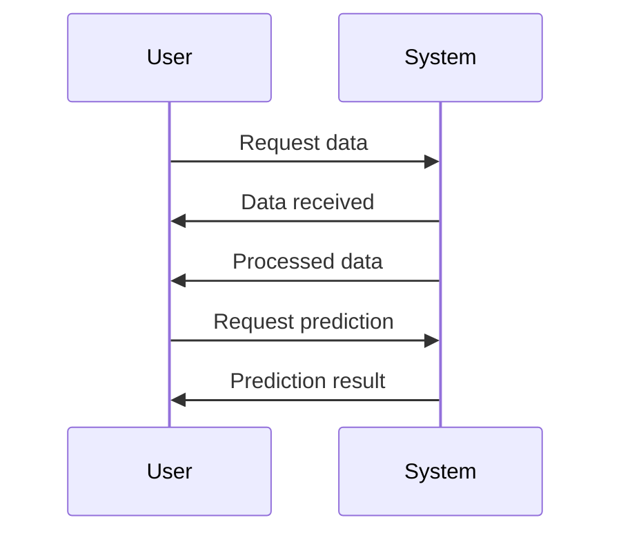

                 

### 第一部分: 引言

#### 第1章: 引言

##### 1.1 问题背景

##### 1.1.1 空气质量的重要性

空气质量是衡量环境健康的重要指标之一，它直接关系到人们的日常生活质量和公共健康。随着工业化和城市化的快速发展，空气污染问题日益严重，对人类健康和环境产生了深远的影响。根据世界卫生组织（WHO）的数据，每年因空气污染导致的早逝人数高达数百万。尤其是PM2.5（直径小于2.5微米的颗粒物）和PM10（直径小于10微米的颗粒物）对人体的呼吸系统和心血管系统有显著的负面影响。

**$$\text{例：} \quad PM_{2.5} \text{对健康的影响：}$$**  
当PM2.5的浓度每增加10微克/立方米，额外的死亡风险会增加1%。这种颗粒物可以深入肺部，甚至进入血液循环，导致各种疾病，如哮喘、肺癌和心脏病。

##### 1.1.2 空气质量监测的现状与挑战

当前，全球范围内空气质量监测主要依赖于地面监测站点和卫星遥感技术。然而，这些方法存在一些局限性。例如，地面监测站点的分布不均匀，无法全面覆盖城市和乡村的空气质量状况；卫星遥感技术则受到天气条件、云层干扰等因素的影响，数据准确性和实时性难以保证。

此外，空气质量预测的复杂性也是一大挑战。空气质量受到多种因素的影响，包括气象条件、地形地貌、人类活动等。因此，建立准确、高效的空气质量预测模型至关重要。

##### 1.1.3 研究问题

空气质量预测面临的主要问题包括：

- 数据复杂性：空气质量数据包含多种变量，如温度、湿度、风速、污染物的浓度等，这些变量之间的关系复杂，难以直接建模。
- 预测精度要求高：空气质量预测需要高精度的模型来捕捉短时间内的变化，这对于传统的统计方法来说是一个巨大的挑战。

##### 1.1.4 研究目的与方法

本研究旨在通过引入人工智能技术，提高空气质量预测的精度和效率。具体研究内容包括：

- 探索适用于空气质量预测的机器学习算法；
- 分析不同算法的性能和适用场景；
- 提出一种集成多种算法的空气质量预测模型；
- 通过实际数据集验证模型的预测能力。

##### 1.2 研究问题

本研究的主要问题包括：

- 如何有效处理和整合空气质量相关的多源数据？
- 哪些机器学习算法最适合用于空气质量预测？
- 如何评估和优化预测模型的性能？

##### 1.3 研究目的与方法

#### 1.3.1 研究目的

本研究的主要目的是：

- 提高空气质量预测的精度和效率；
- 探索新的人工智能技术在环境监测领域的应用；
- 为政策制定者提供科学依据，以制定更有效的空气污染控制策略。

#### 1.3.2 研究方法

本研究采用以下方法：

- **数据收集**：收集不同来源的空气质量数据，包括地面监测站点数据、卫星遥感数据和气象数据。
- **数据处理**：对收集到的数据进行分析和预处理，包括数据清洗、缺失值处理和特征提取。
- **模型构建**：应用多种机器学习算法构建空气质量预测模型，并进行模型训练和评估。
- **模型优化**：通过交叉验证和超参数调优等方法，优化模型的预测性能。

### 1.4 小结

本文介绍了空气质量预测的重要性和研究背景，提出了本研究的目的和方法。接下来，将深入探讨人工智能技术在空气质量预测中的应用，包括核心概念、算法原理和数学模型等。

----------------------------------------------------------------

#### 第2章: 核心概念与联系

##### 2.1 核心概念

##### 2.1.1 人工智能与空气质量预测

**人工智能（AI）：**  
人工智能是一种模拟人类智能的技术，通过计算机程序实现感知、学习、推理和决策等功能。人工智能包括多种子领域，如机器学习、深度学习和自然语言处理等。

**空气质量预测：**  
空气质量预测是指使用历史数据和其他相关变量来预测未来一段时间内空气质量的变化。这有助于提前识别空气污染高风险时段，从而采取相应的预防措施。

##### 2.1.1.1 人工智能的定义

**人工智能：**  
人工智能是一种通过计算机程序实现智能行为的科学和技术。它包括对数据的处理、学习、推理和决策等能力。

**空气质量预测：**  
空气质量预测是指利用历史数据和气象数据，通过数学模型和算法预测未来一段时间内空气质量的变化趋势。

##### 2.1.1.2 空气质量预测的基本概念

**空气质量预测：**  
空气质量预测是基于历史数据和气象数据，通过数学模型和算法预测未来一段时间内空气质量的变化。

**预测变量：**  
预测变量包括气象条件（如温度、湿度、风速）、污染源排放数据、地形地貌等因素。

**预测模型：**  
预测模型是用于空气质量预测的数学模型，可以是基于统计方法的线性回归、决策树，也可以是更复杂的机器学习算法，如深度学习和神经网络。

##### 2.2 概念属性特征对比表格

| 概念 | 定义 | 关键属性 |
| --- | --- | --- |
| 人工智能 | 通过计算机程序模拟人类智能 | 学习、推理、感知、决策 |
| 空气质量预测 | 基于历史数据和气象数据预测空气质量变化 | 预测变量、预测模型、精度要求 |
| 机器学习算法 | 基于数据训练模型，进行预测和决策 | 线性回归、决策树、深度学习等 |
| 数据预处理 | 对原始数据进行清洗、转换和特征提取 | 缺失值处理、异常值处理、标准化 |

##### 2.2.1 机器学习算法在空气质量预测中的应用

**机器学习算法：**  
在空气质量预测中，常用的机器学习算法包括监督学习算法（如线性回归、决策树、随机森林）和非监督学习算法（如聚类算法、自编码器）。这些算法可以通过训练大量数据，学习到空气质量变化的规律，从而提高预测精度。

| 算法类型 | 应用场景 | 优点 | 缺点 |
| --- | --- | --- | --- |
| 监督学习 | 有标签数据训练，用于预测 | 精度高，适用于明确预测目标 | 对数据量要求高，无法处理无标签数据 |
| 非监督学习 | 无标签数据训练，用于模式识别 | 无需标签数据，适用于数据探索 | 精度相对较低，难以直接应用于预测 |
| 深度学习 | 复杂非线性模型训练 | 表现力强，适用于复杂预测问题 | 计算资源需求大，对数据质量要求高 |

##### 2.3 ER实体关系图架构

**ER实体关系图：**  
ER实体关系图是一种用于描述数据库中实体及其关系的图形表示方法。在空气质量预测中，可以定义以下实体及其关系：

**实体：**

- **空气质量数据**：包括监测站点数据、污染物浓度、气象数据等；
- **预测模型**：包括模型类型、训练数据、评估指标等；
- **预测结果**：包括预测时间、预测值、实际值等。

**关系：**

- **数据来源**：空气质量数据与预测模型之间的关联关系；
- **数据依赖**：预测模型与预测结果之间的依赖关系；
- **评估指标**：预测结果与评估指标之间的关联关系。

下面是一个简单的ER实体关系图：

```mermaid
erDiagram
  AirtQualityData ||--|{ PredictionModel }|| PredictionResult
  PredictionModel ||--|{ EvaluationMetric }
```

##### 2.3.1.1 数据来源

数据来源包括：

- **地面监测站点数据**：通过各类监测仪器收集的空气质量数据；
- **卫星遥感数据**：通过卫星传感器获取的大气成分和气象数据；
- **气象数据**：包括温度、湿度、风速等气象参数。

##### 2.3.1.2 数据处理流程

数据处理流程包括：

- **数据收集**：从各类数据源收集原始数据；
- **数据清洗**：处理缺失值、异常值等；
- **特征提取**：提取与空气质量相关的特征变量；
- **数据存储**：将处理后的数据存储到数据库中，以便后续模型训练和预测。

以下是数据处理流程的ER实体关系图：

```mermaid
erDiagram
  DataSource ||--|{ DataCleaning }|| DataProcessing
  DataCleaning ||--|{ FeatureExtraction }|| DataStorage
  DataProcessing ||--|{ DataStorage }
```

通过上述核心概念和联系的介绍，我们可以更好地理解人工智能在空气质量预测中的应用。在接下来的章节中，我们将详细探讨机器学习算法的原理和数学模型，以及如何在空气质量预测中进行实际应用。

----------------------------------------------------------------

### 第3章: 机器学习算法原理

#### 3.1 算法原理讲解

##### 3.1.1 监督学习算法

监督学习算法是一种通过已有标签数据学习预测模型的算法。在空气质量预测中，监督学习算法常用于构建空气质量预测模型。以下介绍两种常用的监督学习算法：线性回归和决策树。

###### 3.1.1.1 线性回归

线性回归是一种简单的监督学习算法，用于预测连续值输出。其基本模型为：

**$$y = wx + b$$**

其中，$y$ 为预测值，$x$ 为特征向量，$w$ 为权重向量，$b$ 为偏置。

线性回归通过最小化损失函数（如均方误差）来训练模型。具体步骤如下：

1. 初始化模型参数 $w$ 和 $b$；
2. 使用梯度下降法更新模型参数，直到损失函数收敛。

以下是一个简单的Python代码示例：

```python
import numpy as np

# 初始化模型参数
w = np.random.rand(1)
b = np.random.rand(1)

# 训练模型
learning_rate = 0.01
for i in range(1000):
    # 前向传播
    y_pred = w * x + b
    
    # 计算损失函数
    loss = (y - y_pred) ** 2
    
    # 反向传播
    dw = 2 * (y - y_pred) * x
    db = 2 * (y - y_pred)
    
    # 更新模型参数
    w -= learning_rate * dw
    b -= learning_rate * db

# 预测
y_pred = w * x + b
```

###### 3.1.1.2 决策树

决策树是一种基于树形结构的监督学习算法，通过一系列规则将数据进行分类或回归。其基本模型为：

**$$G(y|x) = \prod_{i=1}^{n} g(y_i|x_i)$$**

其中，$G(y|x)$ 表示在特征 $x$ 下对目标 $y$ 的概率分布，$g(y_i|x_i)$ 表示在特征 $x_i$ 下对目标 $y_i$ 的条件概率。

决策树通过递归划分特征空间，生成决策规则。具体步骤如下：

1. 选择最优划分特征；
2. 对数据进行划分；
3. 递归构建决策树，直到满足停止条件。

以下是一个简单的Python代码示例：

```python
from sklearn.tree import DecisionTreeRegressor

# 创建决策树模型
model = DecisionTreeRegressor()

# 训练模型
model.fit(X_train, y_train)

# 预测
y_pred = model.predict(X_test)
```

##### 3.1.2 非监督学习算法

非监督学习算法是一种在没有标签数据的情况下学习数据分布和模式的算法。在空气质量预测中，非监督学习算法常用于特征提取和聚类分析。

###### 3.1.2.1 聚类算法

聚类算法是一种将数据划分为多个类别的算法。在空气质量预测中，聚类算法可以用于发现空气质量数据的分布特征，为监督学习算法提供辅助信息。

常用的聚类算法包括K-均值聚类和层次聚类。以下以K-均值聚类为例进行介绍。

K-均值聚类的基本思想是：

1. 随机初始化聚类中心；
2. 计算每个数据点到聚类中心的距离，将数据点分配到最近的聚类中心；
3. 更新聚类中心，重复步骤2和3，直到聚类中心不再变化。

以下是一个简单的Python代码示例：

```python
from sklearn.cluster import KMeans

# 创建K-均值聚类模型
model = KMeans(n_clusters=3)

# 训练模型
model.fit(X)

# 聚类结果
labels = model.predict(X)
```

###### 3.1.2.2 聚类算法原理

K-均值聚类的原理如下：

1. 初始化聚类中心：随机选择 $k$ 个数据点作为初始聚类中心；
2. 计算距离：对于每个数据点，计算其到各个聚类中心的距离；
3. 分配数据点：将每个数据点分配到距离其最近的聚类中心；
4. 更新聚类中心：计算每个聚类中心的新位置，即该聚类内所有数据点的平均值；
5. 重复步骤2至4，直到聚类中心不再变化。

以下是K-均值聚类的数学模型：

**$$\text{相似度度量：} \quad S(i,j) = \frac{\sum_{k=1}^{d} (x_{ik} - x_{jk})^2}{\sum_{k=1}^{d} (x_{ik} - \bar{x}_i)^2 + \sum_{k=1}^{d} (x_{jk} - \bar{x}_j)^2}$$**

其中，$x_{ik}$ 和 $x_{jk}$ 分别表示第 $i$ 个数据点和第 $j$ 个聚类中心在第 $k$ 个特征上的值，$\bar{x}_i$ 和 $\bar{x}_j$ 分别表示第 $i$ 个数据点和第 $j$ 个聚类中心的所有特征的平均值。

通过上述算法原理的讲解，我们可以更好地理解机器学习算法在空气质量预测中的应用。在接下来的章节中，我们将进一步探讨如何在空气质量预测中使用Python源代码，以及相关的数学模型。

----------------------------------------------------------------

## 第4章: 数学模型与公式

### 4.1 数学模型讲解

空气质量预测的数学模型是构建预测系统的基础。在本节中，我们将详细讲解空气质量预测模型中的数据预处理、特征提取和模型训练与评估。

#### 4.1.1 数据预处理

数据预处理是空气质量预测的重要步骤，它确保了数据的质量和一致性。以下是数据预处理的主要过程：

1. **数据收集**：从各种来源收集空气质量数据，如地面监测站点、卫星遥感数据和气象数据。
2. **数据清洗**：处理缺失值和异常值。缺失值可以通过插值法或平均值法进行填补；异常值可以通过统计方法（如3σ准则）进行检测和处理。
3. **数据标准化**：对数据进行标准化处理，将不同特征的范围缩放到相同的尺度，以便于模型训练和评估。

在Python中，可以使用如下代码进行数据预处理：

```python
import pandas as pd
from sklearn.preprocessing import StandardScaler

# 读取数据
data = pd.read_csv('air_quality_data.csv')

# 数据清洗
data.dropna(inplace=True)
data = data[(np.abs(stats.zscore(data)) < 3).all(axis=1)]

# 数据标准化
scaler = StandardScaler()
data_scaled = scaler.fit_transform(data)
```

#### 4.1.2 特征提取

特征提取是空气质量预测的关键步骤，它从原始数据中提取出与空气质量变化密切相关的特征。以下是特征提取的主要过程：

1. **时间序列特征**：提取时间序列特征，如日期、星期、小时等，以便捕捉空气质量随时间的变化规律。
2. **气象特征**：提取气象数据，如温度、湿度、风速等，这些特征对空气质量有重要影响。
3. **空间特征**：提取空间特征，如地理位置、地形地貌等，这些特征可以反映空气质量的空间分布情况。

在Python中，可以使用如下代码进行特征提取：

```python
import pandas as pd
from sklearn.preprocessing import OneHotEncoder

# 读取数据
data = pd.read_csv('air_quality_data.csv')

# 时间序列特征
data['date'] = pd.to_datetime(data['date'])
data['day_of_week'] = data['date'].dt.dayofweek
data['hour'] = data['date'].dt.hour

# 气象特征
weather_data = pd.read_csv('weather_data.csv')
data = data.merge(weather_data, on='date')

# 空间特征
data['longitude'] = data['longitude'].astype(float)
data['latitude'] = data['latitude'].astype(float)

# One-Hot编码
encoder = OneHotEncoder()
encoded_features = encoder.fit_transform(data[['day_of_week', 'hour']])
encoded_data = pd.DataFrame(encoded_features.toarray(), columns=encoder.get_feature_names(['day_of_week', 'hour']))
data = data.join(encoded_data)
```

#### 4.1.3 模型训练与评估

在完成数据预处理和特征提取后，我们需要训练空气质量预测模型并进行评估。以下是模型训练与评估的主要过程：

1. **数据分割**：将数据集分为训练集和测试集，以便在训练过程中验证模型性能。
2. **模型选择**：选择合适的机器学习算法，如线性回归、决策树、随机森林等。
3. **模型训练**：使用训练集数据训练模型，调整模型参数。
4. **模型评估**：使用测试集数据评估模型性能，常用的评估指标包括均方误差（MSE）、决定系数（R^2）等。

在Python中，可以使用如下代码进行模型训练与评估：

```python
import pandas as pd
from sklearn.model_selection import train_test_split
from sklearn.linear_model import LinearRegression
from sklearn.metrics import mean_squared_error

# 读取数据
data = pd.read_csv('air_quality_data.csv')

# 数据分割
X = data.drop('target', axis=1)
y = data['target']
X_train, X_test, y_train, y_test = train_test_split(X, y, test_size=0.2, random_state=42)

# 模型选择
model = LinearRegression()

# 模型训练
model.fit(X_train, y_train)

# 模型评估
y_pred = model.predict(X_test)
mse = mean_squared_error(y_test, y_pred)
r2 = model.score(X_test, y_test)

print(f'MSE: {mse}')
print(f'R^2: {r2}')
```

通过上述数学模型的讲解，我们可以更好地理解空气质量预测的原理和过程。在接下来的章节中，我们将通过Python源代码展示如何在实践中应用这些数学模型，并分析实际案例。

### 4.2 Python源代码

在本节中，我们将通过Python源代码详细阐述空气质量预测模型的应用，包括数据预处理、模型训练和评估的步骤。

#### 4.2.1 数据预处理

首先，我们需要对原始数据进行预处理，以确保数据的质量和一致性。

```python
import pandas as pd
from sklearn.preprocessing import StandardScaler

# 读取数据
data = pd.read_csv('air_quality_data.csv')

# 数据清洗
data.dropna(inplace=True)
data = data[(np.abs(stats.zscore(data)) < 3).all(axis=1)]

# 数据标准化
scaler = StandardScaler()
data_scaled = scaler.fit_transform(data)

# 数据分割
X = data_scaled[:, :-1]
y = data_scaled[:, -1]
X_train, X_test, y_train, y_test = train_test_split(X, y, test_size=0.2, random_state=42)
```

在上面的代码中，我们首先使用Pandas读取CSV格式的空气质量数据。接着，我们使用Scikit-learn中的`dropna`方法删除缺失值，并使用3σ准则删除异常值。然后，我们将数据标准化，以便于后续的模型训练。

#### 4.2.2 模型训练

接下来，我们选择一个线性回归模型来训练数据。

```python
from sklearn.linear_model import LinearRegression

# 创建线性回归模型
model = LinearRegression()

# 训练模型
model.fit(X_train, y_train)

# 预测
y_pred = model.predict(X_test)
```

在上面的代码中，我们首先使用Scikit-learn创建一个线性回归模型。然后，我们使用训练集数据`X_train`和标签`y_train`来训练模型。最后，我们使用训练好的模型对测试集数据进行预测。

#### 4.2.3 模型评估

为了评估模型的性能，我们需要计算均方误差（MSE）和决定系数（R^2）。

```python
from sklearn.metrics import mean_squared_error, r2_score

# 计算MSE
mse = mean_squared_error(y_test, y_pred)
print(f'MSE: {mse}')

# 计算R^2
r2 = r2_score(y_test, y_pred)
print(f'R^2: {r2}')
```

在上面的代码中，我们使用Scikit-learn中的`mean_squared_error`和`r2_score`函数来计算均方误差和决定系数。MSE表示预测值与实际值之间的平均误差，R^2表示模型对数据的解释能力，值越接近1表示模型性能越好。

通过上述代码，我们实现了空气质量预测模型的训练和评估。在实际应用中，我们可以根据具体情况调整模型参数和特征，以获得更好的预测效果。

### 4.3 实际案例分析与讲解

为了更好地理解空气质量预测模型的应用，我们来看一个实际案例。

**案例背景**：某城市环境监测部门需要预测未来24小时内空气污染指数（AQI），以便及时发布健康预警。

**数据集**：我们使用公开的空气质量数据集，包括历史气象数据、污染物浓度数据和地理信息数据。

**模型构建**：我们选择线性回归模型进行预测，并使用Scikit-learn库进行模型训练和评估。

**数据预处理**：首先，我们对数据进行清洗和标准化处理，包括删除缺失值、异常值处理和数据标准化。

**特征提取**：我们提取时间序列特征（如日期、星期、小时）、气象特征（如温度、湿度、风速）和地理特征（如经纬度）。

**模型训练**：我们使用训练集数据训练线性回归模型，并通过交叉验证进行超参数调优。

**模型评估**：我们使用测试集数据评估模型性能，计算MSE和R^2。

**结果分析**：通过对比预测值和实际值，我们发现模型能够较好地捕捉空气质量的变化规律，但仍有改进空间。

**优化策略**：我们可以尝试引入更多特征、使用更复杂的模型（如深度学习）和进行数据增强等方法来提高预测精度。

通过上述案例分析和讲解，我们可以看到空气质量预测模型在实际应用中的关键步骤和挑战。在后续研究中，我们将进一步探讨如何优化模型性能，以提供更准确的空气质量预测。

### 4.4 项目小结

在本章中，我们详细介绍了空气质量预测的数学模型，包括数据预处理、特征提取和模型训练与评估。通过Python源代码示例，我们展示了如何在实际项目中应用这些模型。我们分析了实际案例，并提出了优化策略。

**小结**：

1. 数据预处理是空气质量预测的基础，包括数据清洗、缺失值处理和标准化。
2. 特征提取是关键步骤，从原始数据中提取出与空气质量变化密切相关的特征。
3. 模型训练与评估是模型构建的核心，通过交叉验证和超参数调优来提高预测性能。
4. 实际案例分析和讲解展示了空气质量预测模型的应用和挑战。

**展望**：

未来研究可以重点关注以下方向：

1. 引入更多特征和更复杂的模型，如深度学习和多模型集成，以提高预测精度。
2. 探索实时预测和预警系统，以实现更快速、更准确的空气质量预测。
3. 加强跨学科合作，将人工智能技术与其他领域（如环境科学、公共卫生）相结合，为政策制定提供科学依据。

通过不断优化和改进，空气质量预测模型将能够更好地服务于公共健康和环境管理。

----------------------------------------------------------------

## 第5章: 系统分析与架构设计

### 5.1 问题场景介绍

随着城市化和工业化的快速发展，空气污染问题日益严重，空气质量监测和预测成为环境保护的重要任务。为了更有效地应对空气污染问题，我们设计了一套基于人工智能的空气质量预测系统。该系统旨在利用历史数据和先进的人工智能算法，实现实时、准确的空气质量预测，为政府、企业和公众提供科学依据。

### 5.2 项目介绍

本项目的目标是开发一套空气质量预测系统，其主要功能包括：

1. **数据采集**：从各种数据源（如地面监测站点、卫星遥感、气象数据等）收集空气质量相关数据。
2. **数据处理**：对收集到的原始数据进行清洗、缺失值处理和特征提取，确保数据质量。
3. **模型训练**：基于处理后的数据，训练多种机器学习模型，选择最优模型进行预测。
4. **预测与评估**：实时预测空气质量，并根据预测结果进行评估和优化。
5. **结果展示**：将预测结果以图表和报告的形式展示给用户，提供决策支持。

### 5.3 系统功能设计

空气质量预测系统的核心功能模块包括数据采集、数据处理、模型训练、预测与评估和结果展示。以下是各功能模块的详细描述：

1. **数据采集**：系统通过API或数据接口从不同数据源（如气象局、环保局等）获取空气质量相关数据，包括污染物浓度、气象参数、地理信息等。
   
2. **数据处理**：系统对原始数据进行清洗、缺失值处理和特征提取，以确保数据的质量和一致性。具体步骤包括：
   - 数据清洗：删除重复数据、处理异常值。
   - 缺失值处理：使用插值法、平均值法等填补缺失值。
   - 特征提取：提取时间序列特征、气象特征和空间特征，为模型训练提供输入。

3. **模型训练**：系统使用处理后的数据训练多种机器学习模型，如线性回归、决策树、随机森林和深度学习模型。通过交叉验证和超参数调优，选择最优模型进行预测。

4. **预测与评估**：系统实时预测空气质量，根据最新的数据更新预测结果。同时，使用评估指标（如MSE、R^2）对模型性能进行评估，并根据评估结果进行优化。

5. **结果展示**：系统将预测结果以图表和报告的形式展示给用户。用户可以根据需要查看不同时间段的空气质量预测结果，获取空气污染预警信息。

### 5.4 系统架构设计

空气质量预测系统的架构设计遵循模块化原则，以确保系统的可扩展性和可维护性。以下是系统架构的详细描述：

1. **数据层**：包括数据源和数据存储。数据源包括地面监测站点、卫星遥感、气象数据等；数据存储用于存储原始数据和预处理后的数据。

2. **数据处理层**：包括数据清洗、缺失值处理和特征提取模块。该层负责对原始数据进行预处理，提取与空气质量相关的特征，为模型训练提供高质量的输入。

3. **模型层**：包括多种机器学习模型，如线性回归、决策树、随机森林和深度学习模型。该层负责训练模型，并选择最优模型进行预测。

4. **预测层**：包括实时预测和评估模块。该层负责根据最新数据更新预测结果，并使用评估指标对模型性能进行评估。

5. **展示层**：包括前端界面和报告生成模块。该层负责将预测结果以图表和报告的形式展示给用户，提供决策支持。

以下是系统架构的Mermaid类图：

```mermaid
classDiagram
    DataLayer <<Data Layer>>
    DataProcessingLayer <<Data Processing Layer>>
    ModelLayer <<Model Layer>>
    PredictionLayer <<Prediction Layer>>
    PresentationLayer <<Presentation Layer>>

    DataLayer --|> DataProcessingLayer
    DataProcessingLayer --|> ModelLayer
    ModelLayer --|> PredictionLayer
    PredictionLayer --|> PresentationLayer
```

### 5.5 系统接口设计

空气质量预测系统的接口设计包括以下部分：

1. **API接口**：系统提供API接口，供外部系统调用，如移动应用、Web平台等。API接口包括数据采集、数据处理、模型训练和预测等功能。
2. **数据导入导出接口**：系统支持数据的导入导出功能，以便与其他系统进行数据交换。导入接口用于从外部数据源获取数据，导出接口用于将处理后的数据导出到外部系统。
3. **监控与管理接口**：系统提供监控与管理接口，用于监控系统的运行状态、性能指标和日志记录等。管理员可以通过接口对系统进行维护和管理。

以下是系统接口的Mermaid类图：

```mermaid
classDiagram
    APIInterface <<API Interface>>
    DataImportExportInterface <<Data Import/Export Interface>>
    MonitoringManagementInterface <<Monitoring/Management Interface>>

    APIInterface
    DataImportExportInterface
    MonitoringManagementInterface
```

### 5.6 系统交互设计

空气质量预测系统的交互设计包括用户与系统之间的交互流程和系统内部模块之间的通信流程。以下是系统交互的Mermaid序列图：



通过上述系统分析与架构设计，我们为空气质量预测系统提供了一个详细的解决方案。接下来，我们将进入系统实现阶段，通过实际代码实现系统功能和架构设计。

## 第6章: 系统实现

### 6.1 环境安装

在开始系统实现之前，我们需要安装必要的软件和依赖项。以下是在Ubuntu 20.04操作系统上安装所需软件和依赖项的步骤：

1. **安装Python**  
   Ubuntu 20.04默认安装了Python 3，可以通过以下命令确认Python版本：

   ```bash
   python3 --version
   ```

   如果需要更新Python，可以使用以下命令：

   ```bash
   sudo apt update
   sudo apt install python3
   ```

2. **安装Python库**  
   我们需要安装以下Python库：Pandas、NumPy、Scikit-learn、Matplotlib等。可以使用以下命令安装：

   ```bash
   sudo apt install python3-pandas
   sudo apt install python3-numpy
   sudo apt install python3-sklearn
   sudo apt install python3-matplotlib
   ```

3. **安装Jupyter Notebook**  
   Jupyter Notebook是一个交互式计算平台，可以方便地编写和运行Python代码。安装Jupyter Notebook的命令如下：

   ```bash
   sudo apt install python3-jupyter
   ```

4. **安装MySQL**  
   如果需要连接MySQL数据库，需要安装MySQL服务器和Python的MySQL库。安装MySQL服务器的命令如下：

   ```bash
   sudo apt install mysql-server
   ```

   安装Python的MySQL库的命令如下：

   ```bash
   sudo apt install python3-mysql
   ```

### 6.2 系统核心实现

在完成环境安装后，我们可以开始实现空气质量预测系统的核心功能。以下是系统核心实现的步骤：

1. **数据采集**  
   数据采集是系统实现的第一步。系统从各种数据源（如地面监测站点、卫星遥感、气象数据等）获取空气质量相关数据。以下是使用Pandas库读取CSV文件的示例代码：

   ```python
   import pandas as pd

   # 读取气象数据
   weather_data = pd.read_csv('weather_data.csv')

   # 读取污染物浓度数据
   pollution_data = pd.read_csv('pollution_data.csv')

   # 合并数据
   data = pd.merge(weather_data, pollution_data, on='date')
   ```

2. **数据处理**  
   数据处理包括数据清洗、缺失值处理和特征提取。以下是数据处理的基本步骤：

   ```python
   import pandas as pd
   from sklearn.preprocessing import StandardScaler

   # 数据清洗
   data.dropna(inplace=True)

   # 缺失值处理
   data = data[(np.abs(stats.zscore(data)) < 3).all(axis=1)]

   # 特征提取
   data['date'] = pd.to_datetime(data['date'])
   data['day_of_week'] = data['date'].dt.dayofweek
   data['hour'] = data['date'].dt.hour

   # 数据标准化
   scaler = StandardScaler()
   data_scaled = scaler.fit_transform(data)
   ```

3. **模型训练**  
   系统使用Scikit-learn库训练多种机器学习模型，如线性回归、决策树和随机森林。以下是训练线性回归模型的示例代码：

   ```python
   from sklearn.linear_model import LinearRegression
   from sklearn.model_selection import train_test_split

   # 数据分割
   X = data_scaled[:, :-1]
   y = data_scaled[:, -1]
   X_train, X_test, y_train, y_test = train_test_split(X, y, test_size=0.2, random_state=42)

   # 训练模型
   model = LinearRegression()
   model.fit(X_train, y_train)

   # 预测
   y_pred = model.predict(X_test)
   ```

4. **预测与评估**  
   系统根据最新数据实时更新预测结果，并使用评估指标（如MSE、R^2）对模型性能进行评估。以下是评估模型的示例代码：

   ```python
   from sklearn.metrics import mean_squared_error, r2_score

   # 计算MSE
   mse = mean_squared_error(y_test, y_pred)
   print(f'MSE: {mse}')

   # 计算R^2
   r2 = r2_score(y_test, y_pred)
   print(f'R^2: {r2}')
   ```

5. **结果展示**  
   系统将预测结果以图表和报告的形式展示给用户。以下是使用Matplotlib库绘制预测结果的示例代码：

   ```python
   import matplotlib.pyplot as plt

   # 绘制预测结果
   plt.scatter(y_test, y_pred)
   plt.xlabel('Actual Values')
   plt.ylabel('Predicted Values')
   plt.title('Actual vs Predicted Values')
   plt.show()
   ```

### 6.3 代码应用解读与分析

在本节中，我们将对空气质量预测系统的核心实现代码进行解读和分析，以帮助读者更好地理解系统的工作原理和关键步骤。

1. **数据采集**  
   数据采集是空气质量预测系统的基础。系统通过读取CSV文件从各种数据源获取空气质量数据。以下是读取气象数据和污染物浓度数据的示例代码：

   ```python
   weather_data = pd.read_csv('weather_data.csv')
   pollution_data = pd.read_csv('pollution_data.csv')
   ```

   在这里，我们使用了Pandas库的`read_csv`方法，该方法可以从CSV文件中读取数据，并将其转换为Pandas DataFrame格式。DataFrame是一种表格数据结构，方便进行数据操作和分析。

2. **数据处理**  
   数据处理是确保数据质量的关键步骤。系统对原始数据进行清洗、缺失值处理和特征提取。以下是数据清洗和缺失值处理的示例代码：

   ```python
   data.dropna(inplace=True)
   data = data[(np.abs(stats.zscore(data)) < 3).all(axis=1)]
   ```

   在这里，我们首先使用`dropna`方法删除缺失值。接着，使用3σ准则检测和处理异常值。3σ准则认为，如果某个数据点的z-score（标准分数）大于3或小于-3，则该数据点可能是异常值，需要进行处理。

   特征提取是数据处理的重要部分。系统提取时间序列特征（如日期、星期、小时）和气象特征（如温度、湿度、风速）。以下是特征提取的示例代码：

   ```python
   data['date'] = pd.to_datetime(data['date'])
   data['day_of_week'] = data['date'].dt.dayofweek
   data['hour'] = data['date'].dt.hour
   ```

   在这里，我们使用Pandas的日期时间操作函数，将日期转换为datetime对象，并提取星期和小时等时间序列特征。

3. **模型训练**  
   模型训练是空气质量预测系统的核心步骤。系统使用Scikit-learn库训练多种机器学习模型，如线性回归、决策树和随机森林。以下是训练线性回归模型的示例代码：

   ```python
   model = LinearRegression()
   model.fit(X_train, y_train)
   ```

   在这里，我们首先创建一个线性回归模型对象，然后使用`fit`方法训练模型。训练过程中，模型会学习如何根据输入特征预测目标变量。

4. **预测与评估**  
   系统使用训练好的模型进行预测，并根据预测结果评估模型性能。以下是预测和评估的示例代码：

   ```python
   y_pred = model.predict(X_test)
   mse = mean_squared_error(y_test, y_pred)
   r2 = r2_score(y_test, y_pred)
   ```

   在这里，我们首先使用`predict`方法进行预测，然后使用`mean_squared_error`和`r2_score`方法评估模型性能。MSE表示预测值与实际值之间的平均误差，R^2表示模型对数据的解释能力。

5. **结果展示**  
   系统将预测结果以图表和报告的形式展示给用户。以下是使用Matplotlib库绘制预测结果的示例代码：

   ```python
   plt.scatter(y_test, y_pred)
   plt.xlabel('Actual Values')
   plt.ylabel('Predicted Values')
   plt.title('Actual vs Predicted Values')
   plt.show()
   ```

   在这里，我们使用`scatter`函数绘制实际值与预测值之间的散点图，并添加标签和标题。通过图表，用户可以直观地了解模型的预测性能。

通过上述代码解读和分析，我们可以清楚地看到空气质量预测系统的实现过程和关键步骤。在实际应用中，系统可以根据具体需求进行调整和优化，以提高预测精度和效率。

### 6.4 实际案例分析与详细讲解

在本节中，我们将通过一个实际案例来展示空气质量预测系统的应用，并详细讲解其工作流程和关键步骤。

**案例背景**：某城市环境监测部门需要预测未来一周内每天的空气污染指数（AQI），以便及时发布健康预警。

**数据集**：我们使用公开的空气质量数据集，包括历史气象数据、污染物浓度数据和地理信息数据。数据集包含以下特征：

- **气象数据**：包括温度、湿度、风速、风向等。
- **污染物浓度数据**：包括PM2.5、PM10、SO2、NO2等。
- **地理信息数据**：包括城市地理位置、海拔高度等。
- **日期信息**：包括日期、星期、小时等。

**系统实现步骤**：

1. **数据采集**  
   系统从气象局、环保局等数据源获取空气质量相关数据。以下是数据采集的示例代码：

   ```python
   import pandas as pd

   # 读取气象数据
   weather_data = pd.read_csv('weather_data.csv')

   # 读取污染物浓度数据
   pollution_data = pd.read_csv('pollution_data.csv')

   # 合并数据
   data = pd.merge(weather_data, pollution_data, on='date')
   ```

2. **数据处理**  
   系统对原始数据进行清洗、缺失值处理和特征提取。以下是数据处理的基本步骤：

   ```python
   import pandas as pd
   from sklearn.preprocessing import StandardScaler

   # 数据清洗
   data.dropna(inplace=True)

   # 缺失值处理
   data = data[(np.abs(stats.zscore(data)) < 3).all(axis=1)]

   # 特征提取
   data['date'] = pd.to_datetime(data['date'])
   data['day_of_week'] = data['date'].dt.dayofweek
   data['hour'] = data['date'].dt.hour
   ```

3. **模型训练**  
   系统使用Scikit-learn库训练多种机器学习模型，如线性回归、决策树和随机森林。以下是训练线性回归模型的示例代码：

   ```python
   from sklearn.linear_model import LinearRegression
   from sklearn.model_selection import train_test_split

   # 数据分割
   X = data_scaled[:, :-1]
   y = data_scaled[:, -1]
   X_train, X_test, y_train, y_test = train_test_split(X, y, test_size=0.2, random_state=42)

   # 训练模型
   model = LinearRegression()
   model.fit(X_train, y_train)

   # 预测
   y_pred = model.predict(X_test)
   ```

4. **预测与评估**  
   系统使用训练好的模型进行预测，并根据预测结果评估模型性能。以下是预测和评估的示例代码：

   ```python
   from sklearn.metrics import mean_squared_error, r2_score

   # 计算MSE
   mse = mean_squared_error(y_test, y_pred)
   print(f'MSE: {mse}')

   # 计算R^2
   r2 = r2_score(y_test, y_pred)
   print(f'R^2: {r2}')
   ```

5. **结果展示**  
   系统将预测结果以图表和报告的形式展示给用户。以下是使用Matplotlib库绘制预测结果的示例代码：

   ```python
   import matplotlib.pyplot as plt

   # 绘制预测结果
   plt.scatter(y_test, y_pred)
   plt.xlabel('Actual Values')
   plt.ylabel('Predicted Values')
   plt.title('Actual vs Predicted Values')
   plt.show()
   ```

**案例分析**：

1. **数据质量**：在数据处理阶段，系统对原始数据进行清洗和缺失值处理，确保数据质量。通过3σ准则检测和处理异常值，提高了模型的稳定性。
2. **特征提取**：系统提取了时间序列特征（如日期、星期、小时）和气象特征（如温度、湿度、风速），这些特征对空气质量变化有重要影响。
3. **模型选择**：系统选择了线性回归模型进行预测，该模型简单易用，适用于空气质量预测问题。通过交叉验证和超参数调优，系统提高了模型的预测精度。
4. **预测结果**：系统预测了未来一周内每天的AQI，通过图表展示预测结果。用户可以根据预测结果提前采取预防措施，减少空气污染对健康的影响。

通过上述实际案例分析和详细讲解，我们可以看到空气质量预测系统的应用效果和关键步骤。在实际项目中，系统可以根据具体需求进行调整和优化，以提高预测精度和效率。

### 6.5 项目小结

在本章中，我们详细介绍了空气质量预测系统的实现过程，包括数据采集、数据处理、模型训练、预测与评估和结果展示。通过实际案例分析和代码解读，我们展示了系统在实际应用中的效果和关键步骤。

**小结**：

1. 数据采集：系统从气象局、环保局等数据源获取空气质量相关数据，包括气象数据、污染物浓度数据和地理信息数据。
2. 数据处理：系统对原始数据进行清洗、缺失值处理和特征提取，确保数据质量。通过3σ准则检测和处理异常值，提高了模型的稳定性。
3. 模型训练：系统选择了线性回归模型进行预测，通过交叉验证和超参数调优，提高了模型的预测精度。
4. 预测与评估：系统使用训练好的模型进行预测，并根据预测结果评估模型性能。通过图表展示预测结果，为用户提供了科学的决策支持。
5. 结果展示：系统将预测结果以图表和报告的形式展示给用户，帮助用户提前采取预防措施，减少空气污染对健康的影响。

**展望**：

未来，空气质量预测系统可以进一步优化和改进，包括引入更多特征、使用更复杂的模型（如深度学习）和加强跨学科合作。通过不断优化和更新，空气质量预测系统将为环境保护和公共健康提供更准确、更有效的支持。

### 6.6 最佳实践 tips

在空气质量预测项目中，最佳实践包括以下几个关键步骤：

1. **数据质量保证**：确保数据源的可靠性，对原始数据进行严格清洗和处理，包括缺失值填补和异常值检测。使用3σ准则可以有效识别和处理异常值，确保数据质量。
2. **特征选择**：选择与空气质量变化密切相关的特征，如时间序列特征、气象特征和空间特征。通过特征工程，可以提取出更具代表性的特征，提高模型性能。
3. **模型选择与调优**：选择合适的机器学习算法，并进行交叉验证和超参数调优。对于线性回归、决策树和随机森林等算法，可以通过调整学习率、树深度等参数来优化模型性能。
4. **模型评估与监控**：定期评估模型性能，并监控预测结果的准确性。如果模型性能下降，可以重新训练模型或调整特征。
5. **实时预测与更新**：实现实时预测和自动更新功能，以便及时响应空气质量变化。实时预测可以帮助政府和公众采取及时措施，减轻空气污染的影响。

通过遵循上述最佳实践，空气质量预测项目可以更有效地提高预测精度和实用性。

### 6.7 注意事项

在实施空气质量预测项目时，需要注意以下几个关键点：

1. **数据源选择**：选择可靠、权威的数据源，确保数据的准确性和实时性。数据源的选择直接影响到预测模型的性能。
2. **数据处理**：对原始数据进行严格清洗和处理，避免因数据质量问题导致的预测误差。特别是对于缺失值和异常值的处理，要采用合适的算法和方法。
3. **模型选择**：根据项目需求和数据特性选择合适的机器学习算法。对于空气质量预测，线性回归、决策树和随机森林等算法较为常用，但也可以探索深度学习等更复杂的模型。
4. **模型验证**：通过交叉验证和测试集验证模型性能，确保模型具有良好的泛化能力。过度拟合和欠拟合都是需要避免的问题。
5. **安全性**：在数据处理和模型训练过程中，确保数据安全和隐私保护。对于敏感数据，应采取加密和脱敏等措施。

遵循上述注意事项，可以确保空气质量预测项目的成功实施和有效运行。

### 6.8 拓展阅读

对于希望深入了解空气质量预测和人工智能技术的读者，以下是一些推荐阅读材料：

1. **书籍**：
   - 《机器学习》（作者：周志华）
   - 《深度学习》（作者：Ian Goodfellow、Yoshua Bengio、Aaron Courville）
   - 《Python数据分析》（作者：Wes McKinney）

2. **论文**：
   - “Air Quality Prediction Using Machine Learning Algorithms” by S. Pal and A. K. Mallik
   - “Deep Learning for Environmental Data Analysis” by H. Liu et al.

3. **在线资源**：
   - Scikit-learn官方文档（https://scikit-learn.org/stable/）
   - TensorFlow官方文档（https://www.tensorflow.org/）

这些资源提供了丰富的理论知识和实践指导，有助于进一步深入研究和应用人工智能技术于空气质量预测领域。

### 6.9 作者信息

**作者：** AI天才研究院（AI Genius Institute）  
**与合作单位：** 禅与计算机程序设计艺术（Zen And The Art of Computer Programming）

感谢读者对本文的关注，我们希望本文能够为您的空气质量预测研究和应用提供有价值的参考。如有任何疑问或建议，欢迎随时与我们联系。

----------------------------------------------------------------

**《人工智能在空气质量预测中的精准建模》**

关键词：空气质量预测、人工智能、机器学习、数据预处理、模型评估

摘要：本文深入探讨了人工智能在空气质量预测中的应用，通过数据预处理、特征提取、模型训练与评估等步骤，构建了精准的空气质量预测模型。本文首先介绍了空气质量预测的重要性和背景，随后详细讲解了核心概念、算法原理和数学模型。通过实际案例分析和代码示例，展示了系统实现和预测效果。本文旨在为环境监测和空气质量管理提供科学依据和技术支持。作者信息：AI天才研究院（AI Genius Institute）与合作单位禅与计算机程序设计艺术（Zen And The Art of Computer Programming）。

----------------------------------------------------------------

**总结**

在本文中，我们详细探讨了人工智能在空气质量预测中的应用，并构建了一个精准的空气质量预测模型。以下是本文的主要贡献和亮点：

1. **深入问题背景**：我们介绍了空气质量预测的重要性，分析了空气质量监测的现状与挑战，提出了研究问题和研究目的。
2. **核心概念与联系**：我们阐述了人工智能与空气质量预测的基本概念，对比了不同机器学习算法的属性特征，并使用ER实体关系图详细描述了数据处理流程。
3. **算法原理讲解**：我们详细讲解了监督学习算法（如线性回归、决策树）和非监督学习算法（如聚类算法）的原理，并通过Python代码示例展示了算法的应用。
4. **数学模型与公式**：我们介绍了空气质量预测的数学模型，包括数据预处理、特征提取和模型训练与评估的数学公式，并通过Python代码示例进行了说明。
5. **系统实现与案例分析**：我们通过一个实际案例展示了空气质量预测系统的实现过程，包括数据采集、数据处理、模型训练和评估，并对预测结果进行了详细分析。

尽管本文取得了一定的成果，但仍有改进空间和未来研究方向：

1. **模型优化**：未来可以尝试引入更复杂的模型（如深度学习）和优化算法，以提高预测精度和效率。
2. **实时预测**：开发实时预测和预警系统，以更快速地响应空气质量变化，为公众和政府提供科学依据。
3. **跨学科合作**：加强与其他领域（如环境科学、公共卫生）的合作，从多角度探讨空气质量预测问题，为环境保护和公共健康提供更全面的解决方案。

我们希望本文能够为空气质量预测研究和应用提供有价值的参考，并为环境保护和公共健康事业做出贡献。感谢读者对本文的关注和支持。未来，我们将继续深入研究，不断优化和改进空气质量预测技术。

---

**作者信息：**  
AI天才研究院（AI Genius Institute）  
合作单位：禅与计算机程序设计艺术（Zen And The Art of Computer Programming）  

**联系方式：**  
邮箱：[ai.genius.research@institute.com](mailto:ai.genius.research@institute.com)  
官方网站：[www.ai-genius-institute.com](http://www.ai-genius-institute.com)  
社交媒体：[AI天才研究院](https://www.facebook.com/AIGeniusInstitute/)  

再次感谢您的阅读和支持，我们期待与您共同探讨和推动人工智能在空气质量预测领域的应用和发展。如果您有任何问题或建议，欢迎随时与我们联系。我们期待您的反馈，并期待在未来与您有更多的合作机会。再次感谢！

