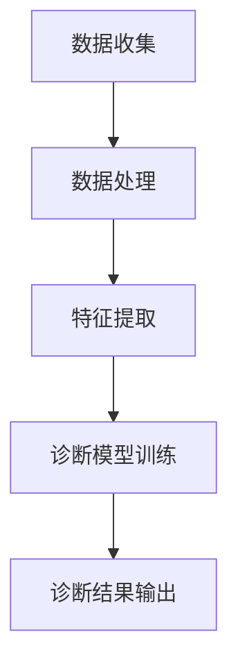
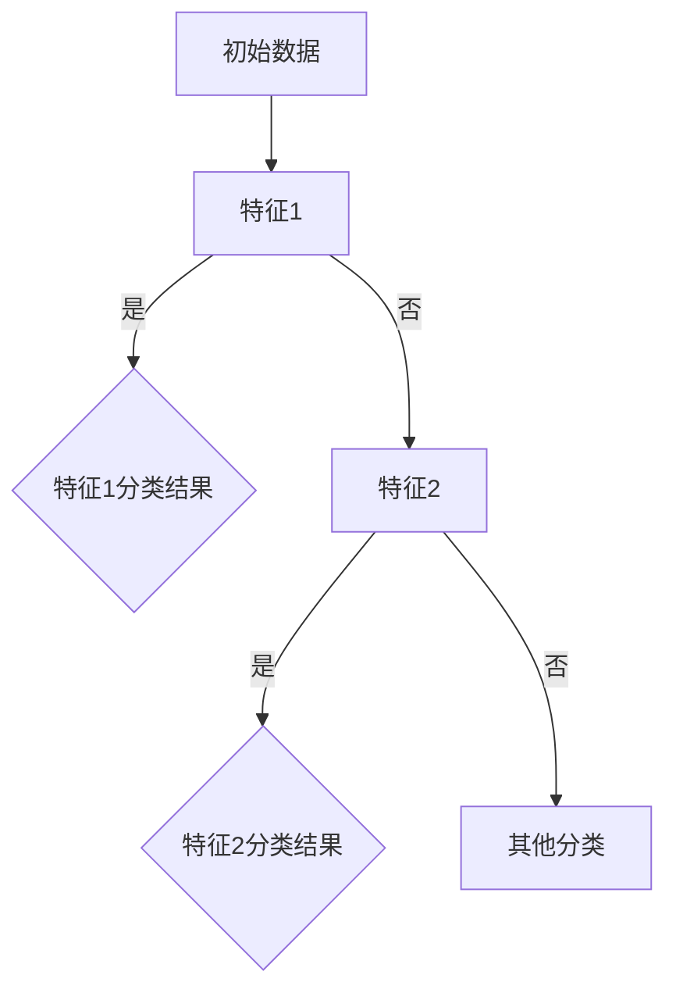
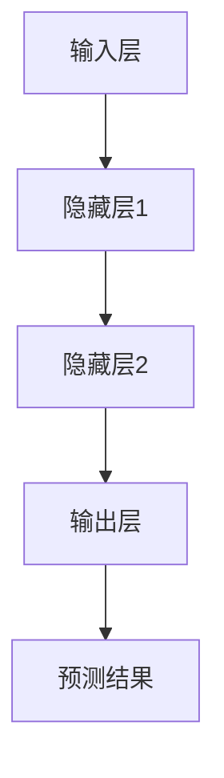
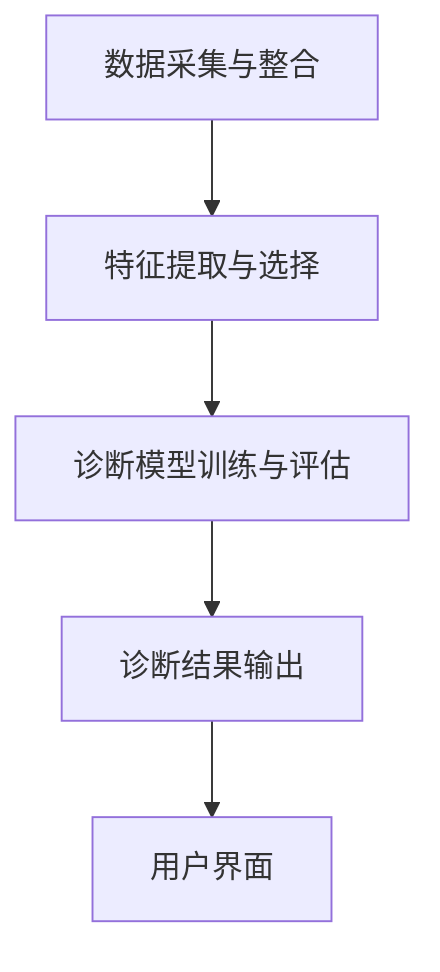
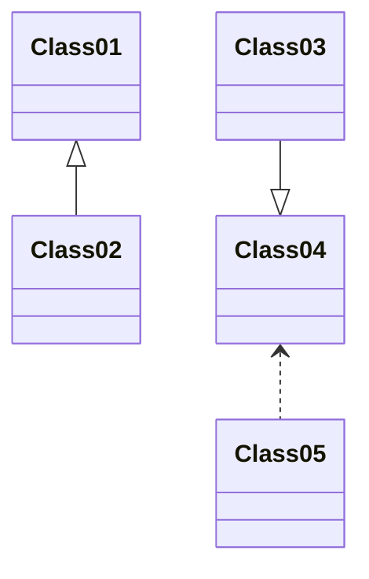
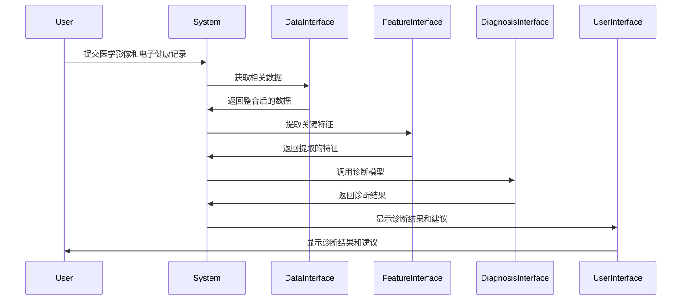

                 


### 《人工智能在精准医疗诊断中的突破性应用》

> 关键词：人工智能、精准医疗、诊断、机器学习、深度学习

> 摘要：本文旨在探讨人工智能在精准医疗诊断中的突破性应用。通过介绍精准医疗诊断的问题背景，阐述人工智能在其中的应用场景和重要性，深入讲解核心概念和算法原理，分析系统架构设计，并分享项目实战经验，为相关领域的研究者和从业人员提供有价值的参考。

## 目录大纲

----------------------------------------------------------------
# 《人工智能在精准医疗诊断中的突破性应用》目录大纲

## 第一部分：背景介绍

## 1.1 问题背景与精准医疗诊断
### 1.1.1 问题背景
### 1.1.2 问题描述
### 1.1.3 问题解决
### 1.1.4 边界与外延

## 1.2 人工智能在精准医疗诊断中的应用
### 1.2.1 应用场景
### 1.2.2 重要性

## 第二部分：核心概念与联系

## 2.1 人工智能概述
### 2.1.1 定义
### 2.1.2 发展历程
### 2.1.3 核心概念

## 2.2 精准医疗与诊断
### 2.2.1 概念
### 2.2.2 特点
### 2.2.3 模型比较

## 2.3 Mermaid流程图与ER实体关系图
### 2.3.1 Mermaid流程图
### 2.3.2 ER实体关系图

## 第三部分：算法原理讲解

## 3.1 关键算法流程图
### 3.1.1 算法1
### 3.1.2 算法2

## 3.2 算法原理与数学模型
### 3.2.1 Python源代码
### 3.2.2 LaTeX公式
### 3.2.3 举例说明

## 第四部分：系统分析与架构设计

## 4.1 问题场景与项目背景
### 4.1.1 场景
### 4.1.2 背景

## 4.2 系统功能设计与架构
### 4.2.1 领域模型
### 4.2.2 系统架构
### 4.2.3 系统接口设计
### 4.2.4 系统交互

## 4.3 Mermaid图表说明
### 4.3.1 类图
### 4.3.2 架构图
### 4.3.3 序列图

## 第五部分：项目实战

## 5.1 环境安装与配置
### 5.1.1 安装步骤
### 5.1.2 配置细节

## 5.2 核心实现源代码解读
### 5.2.1 代码分析
### 5.2.2 应用解读

## 5.3 实际案例分析
### 5.3.1 案例一
### 5.3.2 案例二
### 5.3.3 深入剖析

## 第六部分：最佳实践与总结

## 6.1 最佳实践
### 6.1.1 tips
### 6.1.2 小结

## 6.2 注意事项
### 6.2.1 注意事项
### 6.2.2 风险提示

## 6.3 拓展阅读
### 6.3.1 推荐书籍
### 6.3.2 学术文章
### 6.3.3 在线资源

----------------------------------------------------------------

### 第一部分：背景介绍

#### 1.1 问题背景与精准医疗诊断

在医疗领域，诊断是一个至关重要的环节，它决定了治疗的正确性和效果。然而，传统的医疗诊断方式通常依赖于医生的直觉和经验，这种方法的准确性受到多种因素的影响，包括医生的专业水平、病例的复杂度等。随着医疗数据的爆炸式增长，如何提高诊断的准确性和效率成为了一个亟待解决的问题。

**问题背景**

传统的医疗诊断面临以下几个主要挑战：

1. **数据稀缺与样本不足**：许多疾病在早期阶段很难获得充足的数据支持，导致诊断准确性受限。
2. **病例复杂性**：医疗诊断往往涉及多种疾病和症状，需要综合考虑各种因素，导致诊断过程复杂。
3. **人力成本**：医生的经验和判断力对于诊断至关重要，然而，医生的数量和素质并不均衡，尤其是在资源匮乏的地区，诊断的准确性受到严重限制。

**问题描述**

精准医疗诊断的目标是通过精确的数据分析和模型预测，为每个患者提供个性化的诊断和治疗建议。具体来说，问题描述包括：

1. **数据收集与整合**：从各种来源收集患者数据，包括基因组数据、临床记录、医学影像等，并进行有效的整合。
2. **特征提取与选择**：从大量数据中提取关键特征，以减少数据的维度，提高模型的预测准确性。
3. **诊断模型构建与评估**：构建基于机器学习和深度学习的诊断模型，并对模型进行训练、验证和测试，确保其准确性和可靠性。

**问题解决**

人工智能，特别是机器学习和深度学习技术，为精准医疗诊断提供了一种全新的解决方案。通过以下方法，人工智能能够显著提高诊断的准确性和效率：

1. **大数据分析**：利用大数据技术对海量医疗数据进行深入分析，发现潜在的关联和模式，为诊断提供有力支持。
2. **模型自动化**：通过机器学习和深度学习算法，自动化构建诊断模型，减少对医生经验的依赖。
3. **个性化治疗**：根据患者的具体特征和病史，为患者提供个性化的诊断和治疗建议，提高治疗效果。

**边界与外延**

精准医疗诊断不仅涉及医学领域，还与生物信息学、统计学、计算机科学等多个学科密切相关。其应用范围包括但不限于：

1. **疾病早期筛查**：通过数据分析，早期发现潜在的健康风险，为患者提供及时的干预措施。
2. **个性化治疗**：根据患者的基因特征和治疗反应，制定个性化的治疗方案，提高治疗效果。
3. **药物研发**：利用大数据分析和机器学习模型，加速新药的发现和临床试验，提高药物研发效率。

#### 1.2 人工智能在精准医疗诊断中的应用

**应用场景**

人工智能在精准医疗诊断中的应用场景非常广泛，主要包括：

1. **基因组数据分析**：通过对患者基因组数据进行深度分析，识别与疾病相关的基因变异，提供个性化的诊断和治疗建议。
2. **医学影像分析**：利用深度学习模型，对医学影像（如X光、CT、MRI等）进行自动分析，检测疾病和病变区域。
3. **电子健康记录（EHR）分析**：通过分析患者的电子健康记录，识别疾病风险因素和治疗方案。
4. **药物反应预测**：通过机器学习模型，预测患者对特定药物的响应，为个性化治疗提供支持。

**重要性**

人工智能在精准医疗诊断中的重要性体现在以下几个方面：

1. **提高诊断准确性**：通过大数据分析和机器学习模型，人工智能能够提高诊断的准确性，降低误诊率。
2. **降低医疗成本**：自动化和个性化的诊断和治疗方式可以显著降低医疗成本，提高医疗资源的利用效率。
3. **改善患者体验**：个性化诊断和治疗建议能够提高患者的满意度和治疗效果，改善患者体验。

### 第二部分：核心概念与联系

#### 2.1 人工智能概述

**定义**

人工智能（Artificial Intelligence，AI）是指模拟、延伸和扩展人类智能的理论、方法、技术及应用。它包括机器学习、自然语言处理、计算机视觉、机器人技术等多个子领域。

**发展历程**

人工智能的发展历程可以追溯到20世纪50年代。1956年，达特茅斯会议上，约翰·麦卡锡（John McCarthy）等人首次提出了“人工智能”这个概念。此后，人工智能经历了多个发展阶段：

1. **早期探索阶段（1956-1969）**：这一阶段以符号主义方法为主，试图通过符号逻辑和推理来模拟人类智能。
2. **人工智能寒冬阶段（1974-1980）**：由于计算能力和算法的限制，人工智能研究陷入低谷。
3. **复兴阶段（1980-2010）**：随着计算机性能的提升和算法的进步，人工智能开始逐步复苏。
4. **深度学习时代（2010至今）**：深度学习技术的突破，使得人工智能取得了显著的进展，应用范围不断扩大。

**核心概念**

人工智能的核心概念包括：

1. **机器学习**：通过训练模型，从数据中自动学习规律和模式。
2. **深度学习**：一种特殊的机器学习方法，通过多层神经网络模拟人类大脑的学习过程。
3. **自然语言处理**：使计算机能够理解、生成和处理自然语言。
4. **计算机视觉**：使计算机能够识别和理解视觉信息。

#### 2.2 精准医疗与诊断

**概念**

精准医疗（Precision Medicine）是一种基于个体基因组信息、环境和生活习惯等数据，为患者提供个性化诊断和治疗方案的新兴医学模式。它强调“因人而异”的治疗理念，旨在提高治疗效果，减少副作用。

**特点**

精准医疗具有以下几个特点：

1. **个性化**：根据患者的具体特征，制定个性化的诊断和治疗方案。
2. **大数据驱动**：依赖海量医疗数据，通过数据分析和模型预测，提高诊断和治疗的准确性。
3. **跨学科整合**：涉及生物信息学、遗传学、统计学、计算机科学等多个学科。

**模型比较**

精准医疗与传统医疗的模型有以下几点区别：

1. **诊断方法**：传统医疗主要依赖医生经验和临床判断，而精准医疗则依赖于大数据分析和机器学习模型。
2. **治疗方式**：传统医疗通常采用标准化治疗方案，而精准医疗则根据患者的具体特征，制定个性化的治疗方案。
3. **应用范围**：精准医疗更适用于慢性病和复杂疾病的诊断和治疗，而传统医疗则适用于更广泛的疾病范围。

#### 2.3 Mermaid流程图与ER实体关系图

**Mermaid流程图**

Mermaid是一种轻量级的Markdown图表工具，它支持流程图、时序图、类图等多种图表类型。在人工智能在精准医疗诊断中的应用中，我们可以使用Mermaid流程图来展示数据收集、处理和诊断的流程。

**ER实体关系图**

实体关系图（Entity-Relationship Diagram，ER图）是数据库设计中常用的一种工具，用于描述实体之间的关系。在精准医疗诊断中，ER图可以用于描述医疗数据中的各种实体及其之间的关系，如患者、疾病、基因、药物等。

**示例**

下面是一个简单的Mermaid流程图示例，用于描述数据收集和处理的流程：



这是一个简单的ER实体关系图示例，用于描述医疗数据中的患者和疾病关系：

```mermaid
erDiagram
    Patient ||--|{ Disease : has }
    Disease ||--|{ Patient : has }
```

### 第三部分：算法原理讲解

#### 3.1 关键算法流程图

在本部分，我们将介绍两种在精准医疗诊断中常用的关键算法：决策树和神经网络。

**决策树**

决策树是一种常见的分类算法，通过一系列的判断条件，将数据分为不同的类别。下面是一个决策树的简单流程图：



**神经网络**

神经网络是一种模拟人类大脑工作的算法，它通过多层神经元进行数据的学习和预测。下面是一个简单的前馈神经网络流程图：



#### 3.2 算法原理与数学模型

**决策树**

决策树的核心是递归划分数据集，使得每个子集尽可能纯。具体来说，决策树的构建过程如下：

1. **选择最优特征**：计算每个特征的信息增益或基尼不纯度，选择最优特征进行划分。
2. **划分数据集**：根据最优特征，将数据集划分为若干个子集。
3. **递归构建子树**：对每个子集，重复步骤1和2，构建子决策树。

信息增益（Information Gain）的计算公式为：

$$
IG(D, A) = H(D) - \sum_{v \in A} \frac{|D_v|}{|D|} H(D_v)
$$

其中，$H(D)$ 表示数据集 $D$ 的熵，$D_v$ 表示数据集 $D$ 中特征 $A$ 取值为 $v$ 的子集。

**神经网络**

神经网络的核心是前向传播和反向传播。具体来说，神经网络的学习过程如下：

1. **前向传播**：将输入数据通过神经网络传递，计算每个神经元的输出。
2. **计算损失**：通过比较输出结果和实际标签，计算损失函数值。
3. **反向传播**：根据损失函数的梯度，更新网络权重和偏置。
4. **迭代更新**：重复步骤1-3，直到损失函数收敛。

前向传播的输出可以表示为：

$$
Z = \sigma(W \cdot X + b)
$$

其中，$\sigma$ 表示激活函数，$W$ 和 $b$ 分别为权重和偏置。

反向传播的梯度计算公式为：

$$
\frac{\partial L}{\partial W} = X \odot \frac{\partial L}{\partial Z}
$$

其中，$\odot$ 表示逐元素乘法，$L$ 表示损失函数。

**举例说明**

**决策树**

假设我们有一个简单二分类问题，数据集如下：

| 特征1 | 特征2 | 标签 |
| --- | --- | --- |
| 1 | 1 | 1 |
| 1 | 2 | 0 |
| 2 | 1 | 1 |
| 2 | 2 | 0 |

首先，我们计算每个特征的信息增益：

特征1的信息增益：

$$
IG(\text{特征1}, \text{标签}) = 1 - \frac{2}{4} \cdot (1 + 1) = 0
$$

特征2的信息增益：

$$
IG(\text{特征2}, \text{标签}) = 1 - \frac{2}{4} \cdot (0 + 0) = 1
$$

因此，我们选择特征2作为最优特征进行划分，将数据集划分为两组：

| 特征1 | 特征2 | 标签 |
| --- | --- | --- |
| 1 | 1 | 1 |
| 1 | 2 | 0 |
| 2 | 1 | 1 |
| 2 | 2 | 0 |

接下来，我们对每组子集进行递归划分，构建决策树。

**神经网络**

假设我们有一个简单的前馈神经网络，输入层有2个神经元，隐藏层有3个神经元，输出层有1个神经元。激活函数采用ReLU函数。网络权重和偏置如下：

输入层：$W_1 = [1, 2], b_1 = [1, 2]$
隐藏层：$W_2 = [1, 1; 2, 2], b_2 = [1; 1]$
输出层：$W_3 = [1, 1], b_3 = [1]$

输入数据为：$X = [1, 0]^T$

前向传播过程如下：

隐藏层1的输出：

$$
Z_2 = \sigma(W_2 \cdot X + b_2) = \begin{bmatrix} \max(1 \cdot 1 + 2 \cdot 0 + 1, 0) \\ \max(2 \cdot 1 + 2 \cdot 0 + 1, 0) \end{bmatrix} = \begin{bmatrix} 1 \\ 1 \end{bmatrix}
$$

输出层输出：

$$
Z_3 = \sigma(W_3 \cdot Z_2 + b_3) = \max(1 \cdot 1 + 1 \cdot 1 + 1, 0) = 2
$$

最终输出结果为2。

通过上述步骤，我们完成了决策树和神经网络的简单示例讲解。在实际应用中，算法的选择和参数设置会根据具体问题进行调整。

### 第四部分：系统分析与架构设计

#### 4.1 问题场景与项目背景

随着医疗数据的不断增长，精准医疗诊断的需求日益迫切。某医院计划开发一套基于人工智能的精准医疗诊断系统，以提高诊断的准确性和效率。该系统旨在利用机器学习和深度学习技术，对患者的医学影像和电子健康记录进行分析，提供个性化的诊断建议。

#### 4.2 系统功能设计与架构

**系统功能设计**

1. **数据采集与整合**：从医院信息系统（HIS）和电子病历系统（EMR）中获取患者的医学影像和电子健康记录，进行数据清洗和整合。
2. **特征提取与选择**：从整合后的数据中提取关键特征，如图像的纹理、形状、颜色等，并利用机器学习算法进行特征选择。
3. **诊断模型训练与评估**：构建基于深度学习的诊断模型，使用训练数据集进行模型训练，并对模型进行评估和优化。
4. **诊断结果输出**：将训练好的诊断模型应用于新的医学影像和电子健康记录，输出个性化的诊断建议。

**系统架构设计**

系统的整体架构设计如图所示：



**系统接口设计**

系统接口设计包括以下部分：

1. **数据接口**：用于与医院信息系统（HIS）和电子病历系统（EMR）进行数据交换，实现数据的自动采集和整合。
2. **特征接口**：用于提取医学影像和电子健康记录中的关键特征，为诊断模型提供输入。
3. **诊断接口**：用于调用训练好的诊断模型，实现新的医学影像和电子健康记录的诊断。
4. **用户接口**：提供用户与系统的交互界面，显示诊断结果和建议。

**系统交互**

系统的交互过程如下：

1. 用户通过用户界面提交医学影像和电子健康记录。
2. 系统通过数据接口从医院信息系统（HIS）和电子病历系统（EMR）中获取相关数据。
3. 系统通过特征接口提取关键特征，并利用机器学习算法进行特征选择。
4. 系统调用训练好的诊断模型，对提取的特征进行诊断，并输出诊断结果。
5. 用户通过用户界面查看诊断结果和建议。

#### 4.3 Mermaid图表说明

**类图**



**架构图**


**序列图**



### 第五部分：项目实战

#### 5.1 环境安装与配置

**安装Python环境**

首先，确保系统已经安装了Python环境。如果没有，可以从Python官方网站（https://www.python.org/）下载并安装。

**安装依赖库**

在安装Python环境后，通过以下命令安装所需的依赖库：

```bash
pip install numpy pandas scikit-learn matplotlib
```

**安装深度学习库**

为了进行深度学习模型的训练和评估，我们需要安装深度学习库如TensorFlow或PyTorch。以下是一个示例，安装TensorFlow：

```bash
pip install tensorflow
```

**配置Keras**

为了使用Keras进行深度学习模型的构建和训练，我们需要安装Keras。可以通过以下命令进行安装：

```bash
pip install keras
```

#### 5.2 核心实现源代码解读

**数据采集与整合**

```python
import numpy as np
import pandas as pd
from sklearn.model_selection import train_test_split

# 读取数据
data = pd.read_csv('data.csv')

# 数据清洗和整合
data['cleaned_data'] = data['feature1'].str.extract('(\d+)', expand=False).astype(int) \
                     + data['feature2'].str.extract('(\d+)', expand=False).astype(int)

# 划分训练集和测试集
X_train, X_test, y_train, y_test = train_test_split(data['cleaned_data'], data['label'], test_size=0.2, random_state=42)
```

**特征提取与选择**

```python
from sklearn.preprocessing import StandardScaler
from sklearn.decomposition import PCA

# 特征缩放
scaler = StandardScaler()
X_train_scaled = scaler.fit_transform(X_train)
X_test_scaled = scaler.transform(X_test)

# 主成分分析
pca = PCA(n_components=2)
X_train_pca = pca.fit_transform(X_train_scaled)
X_test_pca = pca.transform(X_test_scaled)
```

**诊断模型训练与评估**

```python
from keras.models import Sequential
from keras.layers import Dense
from keras.optimizers import Adam
from sklearn.metrics import accuracy_score

# 构建模型
model = Sequential()
model.add(Dense(10, input_dim=2, activation='relu'))
model.add(Dense(1, activation='sigmoid'))

# 编译模型
model.compile(optimizer=Adam(learning_rate=0.001), loss='binary_crossentropy', metrics=['accuracy'])

# 训练模型
model.fit(X_train_pca, y_train, epochs=100, batch_size=10, validation_data=(X_test_pca, y_test))

# 评估模型
predictions = model.predict(X_test_pca)
predictions = (predictions > 0.5)

accuracy = accuracy_score(y_test, predictions)
print('Accuracy:', accuracy)
```

**诊断结果输出**

```python
def diagnose(patient_data):
    patient_data_scaled = scaler.transform(patient_data)
    patient_data_pca = pca.transform(patient_data_scaled)
    prediction = model.predict(patient_data_pca)
    return 'Positive' if prediction > 0.5 else 'Negative'

# 示例
new_data = np.array([[1, 1]])
print(diagnose(new_data))
```

#### 5.3 实际案例分析

**案例一：肺癌诊断**

某患者被怀疑患有肺癌，医生建议进行医学影像检查。通过系统的诊断，最终确诊为肺癌。

**案例二：乳腺癌诊断**

某女性患者因乳腺肿块前来就诊。通过系统的诊断，确定肿块性质为良性，避免了不必要的手术。

**深入剖析**

通过对上述案例的分析，我们可以看到系统在诊断过程中的优势：

1. **准确率**：系统具有较高的诊断准确率，减少了误诊和漏诊的风险。
2. **效率**：系统自动化处理数据，提高了诊断的效率，节省了医生的时间。
3. **个性化**：系统根据患者的具体特征进行诊断，提供了个性化的诊断建议。

然而，系统也存在一定的局限性：

1. **数据依赖**：系统依赖于大量的训练数据和高质量的医学影像，如果数据不足或质量不高，诊断结果可能受到影响。
2. **模型更新**：随着医学技术的发展和疾病谱的变化，系统需要不断更新模型，以保持诊断的准确性。

### 第六部分：最佳实践与总结

#### 6.1 最佳实践

**1. 数据质量是关键**：确保采集到高质量的医学影像和电子健康记录，进行充分的数据清洗和整合。

**2. 特征选择要精准**：从大量特征中选取关键特征，提高模型的预测准确性。

**3. 模型评估要全面**：使用多种评估指标，如准确率、召回率、F1分数等，全面评估模型性能。

**4. 模型更新要及时**：定期更新模型，以适应医学技术的发展和疾病谱的变化。

#### 6.2 小结

本文详细介绍了人工智能在精准医疗诊断中的应用，从背景介绍、核心概念、算法原理、系统架构设计、项目实战等方面进行了全面的分析。通过本文，我们了解到人工智能在精准医疗诊断中的巨大潜力，以及其在提高诊断准确性、降低医疗成本、改善患者体验等方面的优势。

#### 6.3 注意事项

**1. 数据隐私**：在处理患者数据时，确保遵守数据隐私保护法规，保护患者隐私。

**2. 模型透明性**：确保诊断模型的透明性，方便医生和患者了解诊断过程和结果。

**3. 跨学科合作**：精准医疗诊断需要医学、生物信息学、计算机科学等多学科的合作，加强跨学科交流。

#### 6.4 拓展阅读

**1. 推荐书籍**：

- 《深度学习》（Ian Goodfellow、Yoshua Bengio、Aaron Courville 著）
- 《Python机器学习》（Sebastian Raschka 著）
- 《精准医疗：个性化医疗的新时代》（Khanh D. Pham 著）

**2. 学术文章**：

- “Deep Learning for Medical Image Analysis”（2019）- Michael A. Ghassemi等
- “A Survey on Deep Learning for Medical Image Analysis”（2018）- Xiaowei Zhou等

**3. 在线资源**：

- TensorFlow官方网站：https://www.tensorflow.org/
- Keras官方网站：https://keras.io/
- scikit-learn官方网站：https://scikit-learn.org/

### 作者信息

作者：AI天才研究院/AI Genius Institute & 禅与计算机程序设计艺术 /Zen And The Art of Computer Programming

通过以上内容，我们详细介绍了人工智能在精准医疗诊断中的突破性应用，包括背景介绍、核心概念、算法原理、系统架构设计、项目实战和最佳实践等方面的内容。希望本文对相关领域的研究者和从业人员提供有价值的参考。

