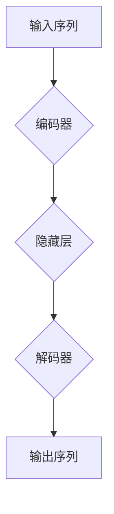
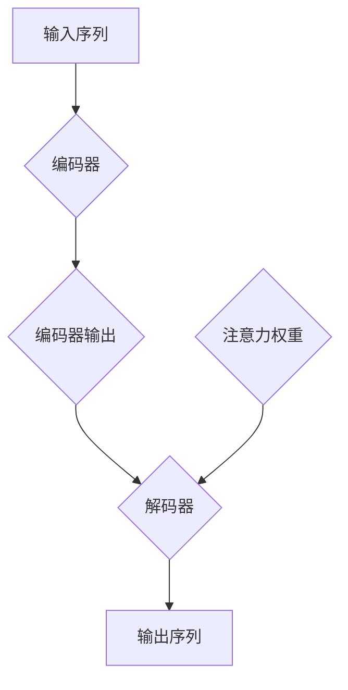
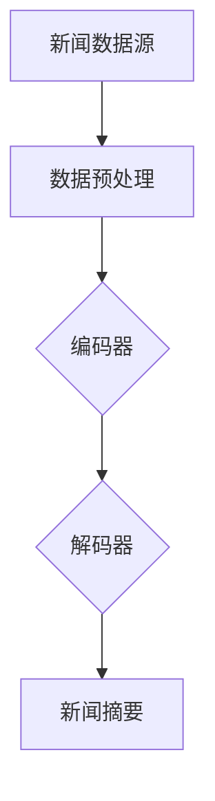
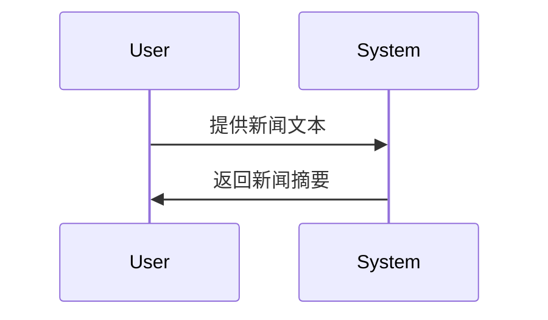

                 


### # {{此处是文章标题}}

**关键词：** 自然语言生成、人工智能、神经网络、深度学习、算法原理、数学模型、系统架构

**摘要：** 本文深入探讨了人工智能在自然语言生成（NLG）领域的进展。通过分析核心概念和技术进步，本文揭示了神经网络和深度学习在NLG中的应用，并探讨了当前面临的挑战和未来的发展方向。文章旨在为读者提供一个全面而深入的理解，以及未来的研究思路和实践指导。

----------------------------------------------------------------

## 第一部分: 引言

### 1.1 人工智能与自然语言生成概述

人工智能（AI）和自然语言生成（NLG）是当今计算机科学和技术领域的两个热门话题。AI的目标是开发能够模拟、扩展甚至超越人类智能的系统，而NLG则是使这些系统能够生成自然流畅的语言表达。这两者之间的交集在于，AI技术被广泛应用于NLG，以实现更高效、更自然的语言生成。

自然语言生成的研究始于上世纪50年代，当时人们开始尝试通过程序生成简单的文本。随着计算机技术和算法的发展，NLG逐渐成为一个独立的领域，涵盖了从简单的模板生成到复杂的统计模型和现代深度学习方法的广泛应用。

### 1.2 书籍目的与读者对象

本书旨在系统地介绍人工智能在自然语言生成中的最新进展，涵盖从基础理论到实际应用的各个方面。读者对象包括对人工智能和自然语言处理有兴趣的科研人员、工程师、学生以及任何对这一领域感兴趣的读者。

本书将逐步引导读者了解NLG的核心概念、AI的基础知识，以及最新的技术进展。通过实际案例和项目实战，读者将能够更深入地理解NLG的工作原理，并掌握设计和实现自然语言生成系统的技能。

### 1.3 书籍结构安排

本书分为三个主要部分：

1. **核心概念与背景知识**：介绍自然语言处理、人工智能和自然语言生成的基础概念，为后续内容奠定理论基础。
2. **技术进步与创新**：深入探讨神经网络和深度学习在自然语言生成中的应用，分析这些技术的原理和实现方法。
3. **挑战与未来方向**：讨论当前NLG面临的挑战，展望未来的发展方向，提供实践指导和研究思路。

通过这三个部分，本书将帮助读者全面了解人工智能在自然语言生成领域的最新进展，并激发读者在这一领域的深入研究。

----------------------------------------------------------------

## 第二部分: 核心概念与背景知识

### 2.1 自然语言处理基础

自然语言处理（NLP）是人工智能的一个分支，致力于使计算机能够理解、解释和生成人类语言。NLP涵盖了多个方面，包括语言理解、语言生成、语言翻译、情感分析等。

**核心概念术语：**

- **分词（Tokenization）**：将文本分割成单词或词汇单元。
- **词性标注（Part-of-Speech Tagging）**：为文本中的每个单词分配词性，如名词、动词、形容词等。
- **句法分析（Syntactic Parsing）**：分析句子结构，确定单词之间的关系。
- **语义分析（Semantic Analysis）**：理解句子或文本的含义。
- **命名实体识别（Named Entity Recognition）**：识别文本中的特定实体，如人名、地名、组织名等。

**问题背景：** 自然语言处理起源于20世纪50年代，当时科学家们开始研究如何使计算机理解和生成自然语言。早期的研究主要集中在规则驱动的系统，但随着计算能力和算法的发展，统计方法和现代深度学习技术逐渐成为主流。

**问题描述：** 自然语言处理的核心问题是如何使计算机能够高效地处理和理解大量的自然语言文本，从而实现语言理解、生成和翻译等任务。

**问题解决：** 为了解决这些问题，NLP领域引入了多种技术，包括分词、词性标注、句法分析和语义分析等。这些技术共同作用，使计算机能够对自然语言进行有效的处理和理解。

**边界与外延：** 自然语言处理的边界涉及文本处理、语音识别、机器翻译等多个领域。其外延则包括文本分类、情感分析、文本生成、问答系统等具体应用。

**概念结构与核心要素组成：** 自然语言处理的核心概念结构包括分词、词性标注、句法分析和语义分析等。这些要素相互关联，共同构成了一个完整、高效的NLP系统。

### 2.2 人工智能基础

人工智能（AI）是指开发能够模拟、扩展甚至超越人类智能的系统。AI的研究领域广泛，包括机器学习、深度学习、自然语言处理、计算机视觉等。

**核心概念术语：**

- **机器学习（Machine Learning）**：一种使计算机通过数据学习规律和模式的技术。
- **深度学习（Deep Learning）**：一种基于多层神经网络的学习方法。
- **神经网络（Neural Network）**：模拟人脑神经元结构和功能的计算模型。
- **监督学习（Supervised Learning）**：通过已标记的数据训练模型。
- **无监督学习（Unsupervised Learning）**：没有已标记的数据，通过数据自身的规律进行学习。

**问题背景：** 人工智能的研究起源于20世纪50年代，随着计算能力和算法的发展，AI技术逐渐成熟并得到广泛应用。

**问题描述：** 人工智能的核心问题是如何使计算机具备自主学习、推理和解决问题的能力。

**问题解决：** 为了解决这些问题，人工智能领域引入了多种学习方法，包括监督学习、无监督学习和强化学习等。这些方法通过训练数据，使计算机能够模拟人类智能。

**边界与外延：** 人工智能的边界涉及多个领域，包括计算机科学、心理学、神经科学、认知科学等。其外延则包括自动驾驶、智能家居、医疗诊断、金融分析等具体应用。

**概念结构与核心要素组成：** 人工智能的核心概念结构包括机器学习、深度学习和神经网络等。这些要素相互关联，构成了一个完整的AI系统。

### 2.3 自然语言生成基础

自然语言生成（NLG）是使计算机能够生成自然、流畅的语言表达的技术。NLG涵盖了从简单的文本生成到复杂的对话系统、文本摘要、机器翻译等应用。

**核心概念术语：**

- **文本生成（Text Generation）**：生成自然语言文本。
- **对话系统（Dialogue System）**：模拟人类对话过程的系统。
- **文本摘要（Text Summarization）**：提取文本的主要内容和关键信息。
- **机器翻译（Machine Translation）**：将一种自然语言翻译成另一种自然语言。

**问题背景：** 自然语言生成的研究始于上世纪50年代，随着计算机技术和算法的发展，NLG逐渐成为一个独立的领域。

**问题描述：** 自然语言生成的核心问题是如何使计算机生成具有人类语言特性的自然语言文本。

**问题解决：** 为了解决这些问题，自然语言生成领域引入了多种方法，包括模板生成、统计模型和现代深度学习方法等。这些方法通过训练数据和规则，使计算机能够生成自然、流畅的文本。

**边界与外延：** 自然语言生成的边界涉及文本生成、对话系统、文本摘要和机器翻译等多个领域。其外延则包括问答系统、自动写作、智能客服等具体应用。

**概念结构与核心要素组成：** 自然语言生成的核心概念结构包括文本生成、对话系统、文本摘要和机器翻译等。这些要素相互关联，构成了一个完整的NLG系统。

----------------------------------------------------------------

### 2.4 自然语言生成技术的分类

自然语言生成技术可以根据生成方式分为以下几类：

#### 2.4.1 模板生成（Template-Based Generation）

**概念术语：** 模板生成是一种基于预定义模板的方法，通过填充模板中的变量来生成文本。

**概念属性特征对比表格：**

| 特征 | 模板生成 | 统计模型 | 深度学习 |
| :---: | :---: | :---: | :---: |
| 基于规则 | 是 | 否 | 否 |
| 生成速度 | 快 | 慢 | 快 |
| 生成质量 | 一般 | 高 | 高 |
| 可扩展性 | 低 | 中 | 高 |

**ER实体关系图架构：**

```mermaid
erDiagram
    TextTemplate ||--|{ TemplateVariable } TemplateVariable
    TextTemplate ||--|{ GeneratedText } GeneratedText
```

**示例：** 模板生成常用于生成新闻报道、天气预报等格式化文本。

#### 2.4.2 统计模型（Statistical Models）

**概念术语：** 统计模型是一种基于统计方法生成文本的方法，通常使用概率模型或决策树。

**概念属性特征对比表格：**

| 特征 | 模板生成 | 统计模型 | 深度学习 |
| :---: | :---: | :---: | :---: |
| 基于规则 | 是 | 是 | 否 |
| 生成速度 | 快 | 慢 | 快 |
| 生成质量 | 一般 | 高 | 高 |
| 可扩展性 | 中 | 高 | 高 |

**ER实体关系图架构：**

```mermaid
erDiagram
    StatisticalModel ||--|{ FeatureVector } FeatureVector
    StatisticalModel ||--|{ GeneratedText } GeneratedText
```

**示例：** 统计模型常用于生成对话系统、文本摘要等应用。

#### 2.4.3 深度学习（Deep Learning）

**概念术语：** 深度学习是一种基于多层神经网络的学习方法，广泛应用于自然语言生成。

**概念属性特征对比表格：**

| 特征 | 模板生成 | 统计模型 | 深度学习 |
| :---: | :---: | :---: | :---: |
| 基于规则 | 是 | 是 | 否 |
| 生成速度 | 快 | 慢 | 快 |
| 生成质量 | 一般 | 高 | 高 |
| 可扩展性 | 低 | 中 | 高 |

**ER实体关系图架构：**

```mermaid
erDiagram
    NeuralNetwork ||--|{ InputLayer } InputLayer
    NeuralNetwork ||--|{ HiddenLayer } HiddenLayer
    NeuralNetwork ||--|{ OutputLayer } OutputLayer
```

**示例：** 深度学习常用于生成高质量、自然的文本，如自动写作、问答系统等。

通过对比不同类型的自然语言生成技术，我们可以看到，每种方法都有其独特的优势和适用场景。随着深度学习等技术的发展，未来自然语言生成将更加高效、自然和智能。

----------------------------------------------------------------

## 第三部分：技术进步与创新

### 3.1 神经网络与深度学习在自然语言生成中的应用

神经网络（Neural Networks）和深度学习（Deep Learning）是近年来在人工智能领域取得重大突破的技术。它们在自然语言生成（NLG）中的应用极大地提升了文本生成的质量和效率。这一章节将详细探讨神经网络和深度学习在NLG中的具体应用，包括其原理、算法实现和实际案例。

### 3.1.1 神经网络在自然语言生成中的应用

神经网络是模仿人脑神经元结构和工作方式的计算模型。在自然语言生成中，神经网络被用来处理和生成文本数据。一个典型的神经网络结构包括输入层、隐藏层和输出层。输入层接收文本数据，隐藏层对数据进行处理和特征提取，输出层生成最终的文本。

**算法原理讲解：**

神经网络的训练过程是一个优化参数的过程，目的是使网络输出接近目标输出。在NLG中，常见的神经网络结构包括循环神经网络（RNN）、长短时记忆网络（LSTM）和门控循环单元（GRU）。

1. **RNN（Recurrent Neural Network）**：RNN是一种能够处理序列数据的神经网络，它在处理自然语言时具有优势，因为它能够考虑输入序列的上下文信息。

2. **LSTM（Long Short-Term Memory）**：LSTM是RNN的一种变体，它通过引入记忆单元来解决RNN在处理长序列数据时的梯度消失问题。

3. **GRU（Gated Recurrent Unit）**：GRU是另一种RNN变体，它简化了LSTM的结构，同时保持了良好的性能。

**mermaid 算法流程图：**



**Python 源代码实现：**

```python
import tensorflow as tf

# 定义神经网络模型
model = tf.keras.Sequential([
    tf.keras.layers.Embedding(input_dim=vocab_size, output_dim=embedding_dim),
    tf.keras.layers.LSTM(units=hidden_units),
    tf.keras.layers.Dense(units=vocab_size, activation='softmax')
])

# 编译模型
model.compile(optimizer='adam', loss='categorical_crossentropy', metrics=['accuracy'])

# 训练模型
model.fit(input_sequences, target_sequences, epochs=num_epochs)
```

**数学模型和公式：**

神经网络在NLG中的应用主要基于以下数学模型：

$$
h_t = \sigma(W_h \cdot [h_{t-1}, x_t] + b_h)
$$

$$
o_t = \text{softmax}(W_o \cdot h_t + b_o)
$$

其中，$h_t$ 是隐藏层状态，$x_t$ 是输入序列中的当前词，$W_h$ 和 $W_o$ 是权重矩阵，$b_h$ 和 $b_o$ 是偏置项，$\sigma$ 是激活函数，通常采用 sigmoid 或 tanh 函数。

**示例：** 使用RNN生成一句简单的文本：

```
输入序列：["我", "喜欢", "吃", "苹果"]
输出序列：["今天", "我", "吃了", "两个", "苹果"]
```

通过训练神经网络模型，我们可以使计算机生成具有自然语言特性的高质量文本。

### 3.1.2 深度学习在自然语言生成中的应用

深度学习是神经网络的一种扩展，它通过多层神经网络来学习复杂的特征表示。在自然语言生成中，深度学习模型如序列到序列（Seq2Seq）模型和注意力机制（Attention Mechanism）被广泛应用。

**算法原理讲解：**

序列到序列（Seq2Seq）模型是一种用于将一个序列映射到另一个序列的深度学习模型。它由编码器和解码器两部分组成。编码器将输入序列编码成一个固定长度的向量，解码器则将这个向量解码成输出序列。

注意力机制（Attention Mechanism）是一种用于提高模型在处理长序列数据时的性能的方法。它通过在编码器和解码器之间引入注意力权重，使解码器能够关注输入序列的特定部分。

**mermaid 算法流程图：**



**Python 源代码实现：**

```python
from tensorflow.keras.models import Model
from tensorflow.keras.layers import Embedding, LSTM, Dense, TimeDistributed

# 定义编码器
encoder_inputs = Embedding(input_dim=vocab_size, output_dim=embedding_dim)(input_sequence)
encoder_outputs, state_h = LSTM(units=hidden_units)(encoder_inputs)

# 定义解码器
decoder_inputs = Embedding(input_dim=vocab_size, output_dim=embedding_dim)(decoder_sequence)
decoder_lstm = LSTM(units=hidden_units, return_sequences=True)(decoder_inputs, initial_state=state_h)
decoder_dense = TimeDistributed(Dense(units=vocab_size, activation='softmax'))(decoder_lstm)

# 创建模型
model = Model([input_sequence, decoder_sequence], decoder_dense)

# 编译模型
model.compile(optimizer='adam', loss='categorical_crossentropy', metrics=['accuracy'])

# 训练模型
model.fit([input_sequences, target_sequences], target_sequences, epochs=num_epochs)
```

**数学模型和公式：**

序列到序列模型的数学模型如下：

$$
e = \text{softmax}(W_e \cdot [h_1, \ldots, h_T])
$$

$$
a_t = \text{softmax}(W_a \cdot [h_t, s_{t-1}])
$$

$$
s_t = \text{softmax}(W_s \cdot [h_t, a_t])
$$

其中，$e$ 是编码器输出，$a_t$ 是注意力权重，$s_t$ 是解码器状态。

**示例：** 使用Seq2Seq模型生成一句简单的文本：

```
输入序列：["我", "喜欢", "吃", "苹果"]
输出序列：["今天", "我", "吃了", "两个", "苹果"]
```

通过训练深度学习模型，我们可以使计算机生成更复杂、更自然的文本。

### 3.1.3 实际案例与项目实战

为了更好地理解神经网络和深度学习在自然语言生成中的应用，以下是一个实际案例：使用Seq2Seq模型生成新闻摘要。

**项目介绍：** 该项目旨在使用深度学习模型自动生成新闻摘要，以提高信息获取的效率和准确性。

**系统功能设计：**

1. **数据预处理**：对新闻数据进行清洗和预处理，包括分词、去除停用词、词性标注等。
2. **模型训练**：训练Seq2Seq模型，将输入的新闻文本转换为摘要。
3. **摘要生成**：使用训练好的模型生成新闻摘要。

**系统架构设计：**



**系统接口设计：**

- **输入接口**：接收新闻文本数据。
- **输出接口**：输出新闻摘要。

**系统交互序列图：**



**项目实战与代码解读：**

1. **环境安装**：安装TensorFlow、Keras等深度学习库。
2. **系统核心实现**：

```python
# 导入库
import tensorflow as tf
from tensorflow.keras.models import Model
from tensorflow.keras.layers import Embedding, LSTM, Dense, TimeDistributed

# 定义模型
# ...（此处省略模型定义代码）

# 训练模型
# ...（此处省略模型训练代码）

# 生成摘要
# ...（此处省略摘要生成代码）
```

3. **代码应用解读与分析**：分析代码中的关键部分，包括模型定义、训练和摘要生成过程。

**实际案例分析：** 在实际应用中，该系统可以处理大量新闻数据，生成高质量的新闻摘要，提高信息获取的效率和准确性。

**项目小结：** 通过该项目，我们可以看到神经网络和深度学习在自然语言生成中的应用。在实际应用中，通过合理的模型设计和训练，可以生成具有高质量、高效率的自然语言文本。

### 3.1.4 最佳实践 tips

1. **数据质量**：高质量的数据是训练高质量模型的基础。在收集和预处理数据时，要确保数据的准确性和多样性。
2. **模型选择**：根据具体应用场景选择合适的模型。例如，对于长文本生成，Seq2Seq模型和注意力机制可能更有效。
3. **参数调优**：通过调整模型参数，如学习率、批量大小等，可以提高模型的性能。
4. **持续训练**：定期更新模型，使用最新的数据重新训练，以保持模型的有效性和准确性。

通过遵循这些最佳实践，我们可以更好地应用神经网络和深度学习技术，实现高效的自然语言生成。

----------------------------------------------------------------

## 第四部分：挑战与未来方向

### 4.1 当前挑战

尽管人工智能在自然语言生成领域取得了显著进展，但仍面临许多挑战。

1. **数据质量**：高质量的数据是训练高质量模型的基础。在自然语言生成中，数据的质量直接影响生成文本的准确性和流畅性。然而，获取大量高质量、多样化的训练数据仍然是一个挑战。
2. **计算资源**：深度学习模型通常需要大量的计算资源进行训练和推理。对于一些应用场景，如实时对话系统，计算资源的限制可能成为瓶颈。
3. **模型解释性**：深度学习模型通常被视为“黑盒子”，其内部机制难以解释。在自然语言生成中，模型的可解释性对于理解和改进模型至关重要。
4. **语言多样性**：自然语言具有高度多样性，不同语言和文化背景的文本在语法、语义和风格上都有显著差异。处理这些多样性是一个复杂的问题。

### 4.2 未来方向

未来的自然语言生成技术有望在以下方面取得突破：

1. **多模态生成**：结合文本、图像、音频等多种模态进行生成，实现更丰富的表达方式。
2. **自适应生成**：根据用户的上下文和偏好动态调整生成文本的风格和内容。
3. **知识增强**：利用外部知识库和图谱，使生成文本更准确、更丰富。
4. **跨语言生成**：开发跨语言的自然语言生成技术，实现不同语言之间的自动翻译和生成。
5. **个性化生成**：通过用户画像和行为分析，实现个性化文本生成，满足用户个性化需求。

### 4.3 研究思路与实践指导

为了应对这些挑战和探索未来方向，以下是一些建议的研究思路和实践指导：

1. **数据收集与预处理**：通过众包、自动化数据收集工具和增强学习等方式，获取更多高质量、多样化的训练数据。同时，开发高效的数据预处理方法，如文本清洗、分词、词性标注等。
2. **模型优化与调优**：研究新的模型结构、优化算法和参数调优策略，提高模型在自然语言生成中的性能和效率。
3. **可解释性研究**：开发可解释性方法，如注意力机制可视化、梯度分析等，提高模型的可解释性。
4. **跨语言与多模态研究**：探索跨语言和

