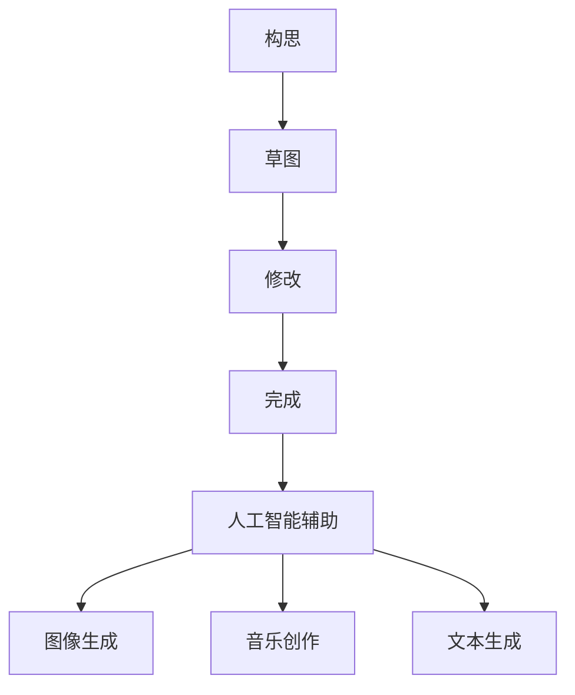
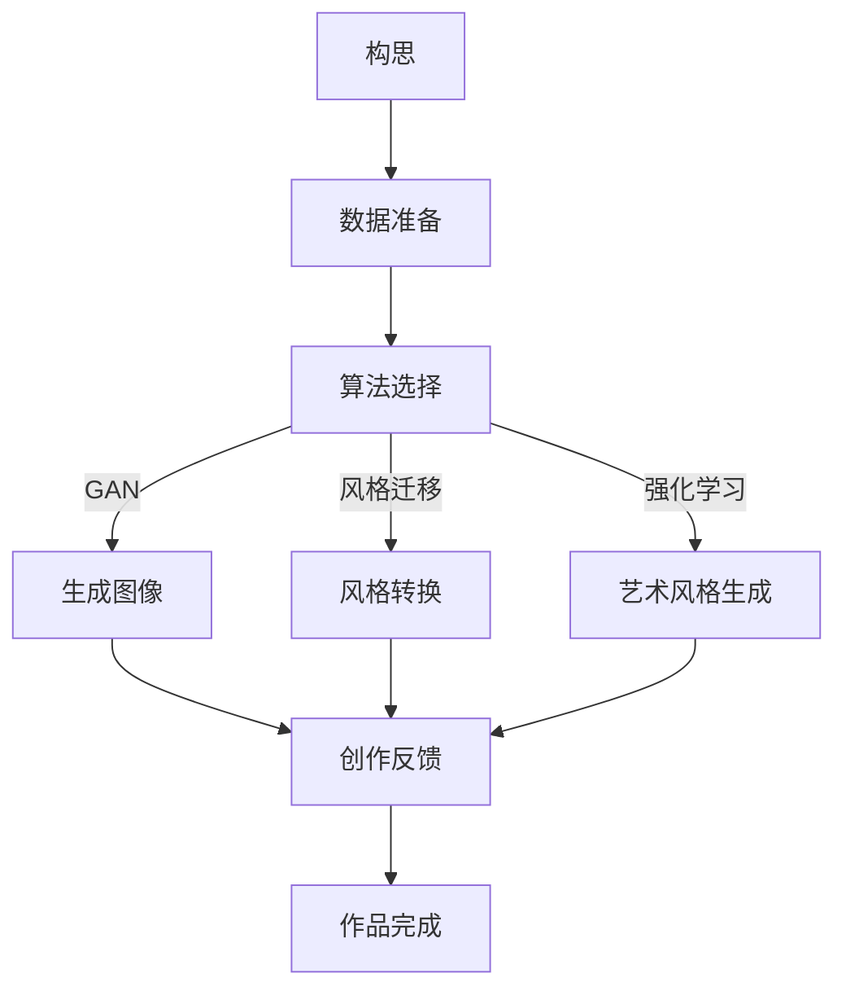
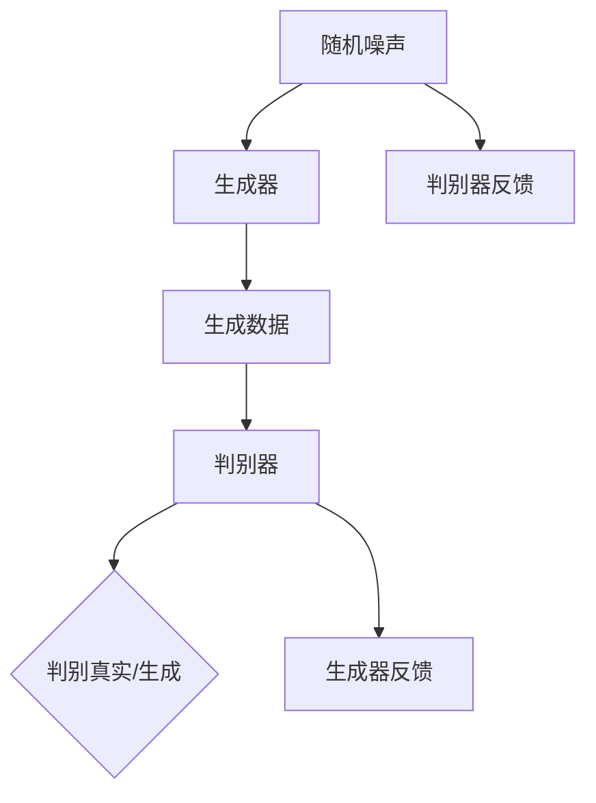
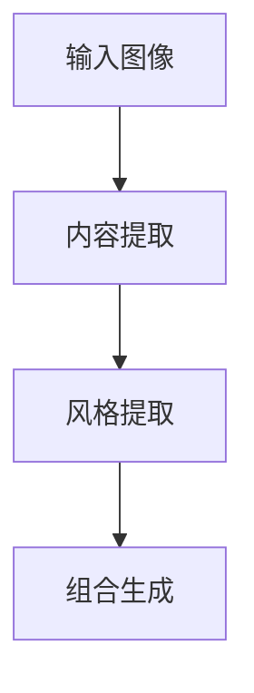
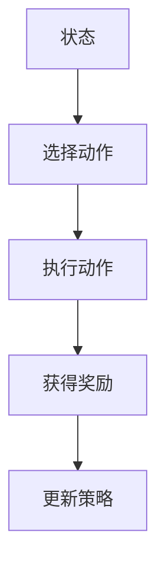
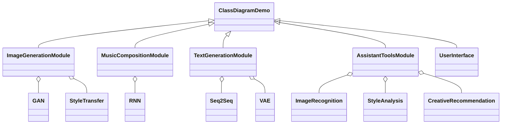
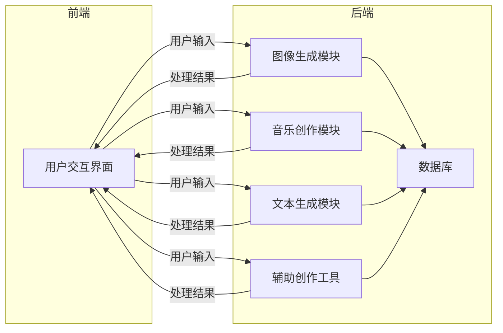
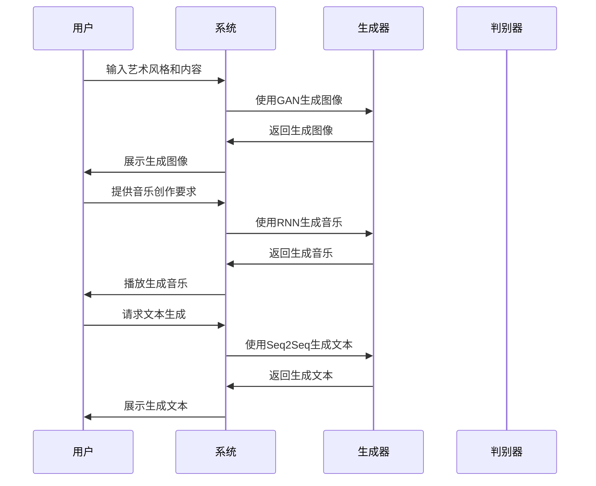

                 

### 引言与背景

#### 1.1 问题背景

人工智能（Artificial Intelligence, AI）作为计算机科学的一个重要分支，旨在模拟人类智能行为，实现自动化和智能化的系统。随着深度学习和神经网络技术的迅猛发展，人工智能在各个领域中的应用越来越广泛，从医疗诊断、金融分析到自动驾驶和智能家居，都取得了显著的成果。然而，人工智能在艺术创作中的角色逐渐引起了学术界的关注。

艺术创作是人类智慧的结晶，是文化传承和表达的重要方式。艺术作品不仅反映了个体的情感和思想，也体现了社会的价值和审美取向。随着技术的进步，艺术家们开始探索如何利用人工智能工具来辅助艺术创作，从而拓展艺术的表现形式和创作手段。

本篇技术博客的核心问题是：人工智能在艺术创作中扮演了什么样的角色？具体来说，我们将探讨以下几个方面：

- **人工智能与艺术创作的关系**：分析人工智能技术如何融入艺术创作过程，以及它们所带来的变革。
- **核心概念与联系**：介绍人工智能、艺术创作、艺术风格、生成艺术等方面的核心概念，并展示它们之间的联系。
- **算法原理讲解**：详细阐述常见的生成艺术算法，如GAN（生成对抗网络）、风格迁移、强化学习等，并使用Python源代码和LaTeX公式进行解释。
- **系统分析与架构设计**：描述人工智能在艺术创作中的应用场景，设计系统功能、架构和接口。
- **项目实战**：介绍一个实际的案例，包括环境安装、系统实现、代码解读和案例分析。
- **最佳实践与总结**：总结书中内容，提供实用技巧，指出注意事项，并推荐拓展阅读。

#### 1.2 人工智能与艺术创作的关系

人工智能在艺术创作中的应用主要表现为生成艺术、辅助创作和智能推荐等方面。

- **生成艺术**：通过神经网络和机器学习算法，人工智能可以生成全新的艺术作品。这种生成艺术不仅包括传统的绘画和音乐，还扩展到了视频、动画和三维模型等领域。例如，GAN（生成对抗网络）可以通过训练生成出具有高真实感的人脸和风景图像，而深度学习算法则可以创作出风格独特的音乐作品。
- **辅助创作**：人工智能可以作为艺术家的助手，帮助他们在创作过程中完成一些繁琐的工作。例如，利用计算机视觉技术，人工智能可以帮助艺术家进行图像的识别、分类和标注，从而提高创作效率。此外，人工智能还可以分析大量的数据，为艺术家提供灵感来源和创意建议。
- **智能推荐**：在艺术展览、音乐会和画廊等场景中，人工智能可以根据用户的兴趣和历史行为，为他们推荐符合其喜好的艺术作品。这种个性化推荐不仅可以提高用户体验，还可以促进艺术作品的传播和推广。

#### 1.3 当前研究现状与挑战

目前，人工智能在艺术创作中的应用已经取得了一定的成果，但仍面临一些挑战和问题。

- **算法复杂性与计算资源**：生成艺术算法，如GAN、风格迁移等，通常需要大量的计算资源和时间。如何优化算法，提高计算效率，是当前研究的一个重要方向。
- **艺术创作的主观性**：艺术创作具有很强的主观性，人工智能如何理解和模仿人类的创造思维，是一个需要深入研究的问题。
- **知识产权问题**：人工智能生成的艺术作品是否具有版权，如何归属，是法律和伦理上需要解决的问题。
- **艺术与技术的平衡**：在利用人工智能辅助艺术创作时，如何保持艺术的独特性和创造力，避免过度依赖技术，也是一个需要权衡的问题。

#### 1.4 书籍结构概述

本文结构分为七个主要章节：

- **第1章：引言与背景**：介绍问题背景、人工智能与艺术创作的关系、当前研究现状与挑战，以及书籍结构概述。
- **第2章：核心概念与联系**：详细阐述人工智能、艺术创作、艺术风格、生成艺术等方面的核心概念，并展示它们之间的联系。
- **第3章：生成艺术算法原理**：讨论常见的生成艺术算法，如GAN、风格迁移、强化学习等，并使用Python源代码和LaTeX公式详细解释算法原理。
- **第4章：系统分析与架构设计**：描述人工智能在艺术创作中的应用场景，设计系统功能、架构和接口。
- **第5章：项目实战**：介绍一个实际的案例，包括环境安装、系统实现、代码解读和案例分析。
- **第6章：最佳实践与总结**：总结书中内容，提供实用技巧，指出注意事项，并推荐拓展阅读。
- **第7章：结论与展望**：总结与展望未来发展方向，研究挑战与机遇。

通过以上章节的探讨，我们将深入理解人工智能在艺术创作中的角色，并展望其未来的发展趋势。希望这篇文章能够为读者提供一个全面而深入的视角，激发对人工智能与艺术创作结合的思考和研究。

### 核心概念与联系

在探讨人工智能在艺术创作中的角色之前，我们需要明确一些核心概念，并理解它们之间的联系。这些概念包括人工智能、艺术创作、艺术风格和生成艺术。

#### 2.1 人工智能概述

**2.1.1 定义与历史**

人工智能（Artificial Intelligence, AI）是指由人制造出的系统所表现出来的智能。人工智能的概念可以追溯到20世纪50年代，当时科学家们开始研究如何让计算机模拟人类的思维过程。随着计算能力的提升和算法的进步，人工智能领域经历了多个阶段的发展。

- **早期人工智能（1956-1974）**：这一阶段以符号主义方法为主，通过符号操作和逻辑推理来实现智能。
- **认知革命（1974-1980）**：在这一阶段，研究者开始关注人工智能的感知和认知过程，引入了基于知识表示和推理的方法。
- **人工神经网络时代（1980s-1990s）**：人工神经网络（ANN）成为人工智能研究的热点，通过模拟生物神经系统来处理复杂问题。
- **大数据与深度学习时代（2006至今）**：随着深度学习算法的提出和计算资源的增长，人工智能在图像识别、语音识别、自然语言处理等领域取得了突破性进展。

**2.1.2 研究领域与分类**

人工智能的研究领域广泛，主要包括：

- **机器学习**：通过训练数据集，使计算机自动获取知识和模式。
- **深度学习**：一种基于人工神经网络的机器学习方法，适用于处理大量复杂数据。
- **自然语言处理**：研究如何让计算机理解和生成人类语言。
- **计算机视觉**：使计算机能够“看”和理解图像和视频。
- **机器人学**：研究如何让机器模拟人类的动作和行为。

#### 2.2 艺术创作

**2.2.1 艺术与创作的概念**

艺术（Art）是一种通过视觉、听觉、触觉等形式来表达人类情感、思想和审美体验的创造性活动。艺术创作（Art Creation）是艺术生产的核心过程，它涉及从构思、草图、草图修改到最终作品完成的各个阶段。

- **构思**：艺术家在创作初期产生的初步想法和灵感。
- **草图**：将构思转化为初步的视觉表现。
- **修改**：对草图进行反复修改，直至达到满意的效果。
- **完成**：最终作品的形成。

**2.2.2 艺术风格与流派**

艺术风格（Art Style）是艺术作品在形式和内容上的总体特征，反映了特定时代、地域和文化背景。艺术流派（Art School）是具有共同艺术理念和实践方法的艺术家群体。

- **古典主义**：强调理性、对称和完美。
- **浪漫主义**：强调情感、个性和自然。
- **现实主义**：以写实主义手法反映社会现实。
- **现代主义**：打破传统形式和规则，追求创新和个性。
- **后现代主义**：对现代主义进行批判和反思，强调多元性和复杂性。

#### 2.3 艺术与人工智能的融合

**2.3.1 关键技术与挑战**

人工智能在艺术创作中的应用涉及多个关键技术，包括图像生成、音乐创作、文本生成等。然而，这些技术的实现和应用也面临着一系列挑战。

- **图像生成**：通过GAN（生成对抗网络）和深度卷积生成模型（DCGAN）等技术，人工智能可以生成高质量的图像。然而，如何保证生成的图像具有艺术价值和创造性，是一个需要解决的重要问题。
- **音乐创作**：利用生成模型和递归神经网络（RNN），人工智能可以创作出具有独特风格和旋律的音乐作品。挑战在于如何捕捉音乐的复杂性和多样性。
- **文本生成**：通过序列到序列（Seq2Seq）模型和变分自编码器（VAE），人工智能可以生成符合语法和语义规则的文本。然而，文本的艺术性和创造性是一个重要挑战。

**2.3.2 Mermaid流程图：人工智能与艺术创作融合过程**

为了更好地展示人工智能与艺术创作融合的过程，我们可以使用Mermaid流程图来描述。



在上面的流程图中，从构思到完成的创作过程是艺术家的核心工作。而人工智能在这个过程中扮演了辅助角色，帮助艺术家在图像生成、音乐创作和文本生成等方面实现创新。

通过上述核心概念和联系的阐述，我们为后续章节的详细讨论奠定了基础。在接下来的章节中，我们将进一步探讨人工智能在艺术创作中的应用，以及如何利用生成艺术算法来辅助艺术家创作。

#### 2.3 艺术与人工智能的融合

在探讨人工智能如何融入艺术创作之前，我们需要理解两个关键概念：生成艺术和算法在其中的作用。

**2.3.1 关键技术与挑战**

生成艺术（Generative Art）是一种利用算法和程序生成艺术作品的方法。它不同于传统的艺术创作，艺术家并不直接用手绘制或雕刻作品，而是通过编程来实现艺术形式的创新。生成艺术的核心技术包括：

- **生成对抗网络（GAN）**：GAN是一种由生成器和判别器组成的对抗性模型，通过两个网络之间的博弈，生成具有高度真实感的图像。
- **风格迁移（Style Transfer）**：风格迁移是一种通过神经网络将一种艺术作品（如照片）的风格转移到另一种作品（如图画）的技术。
- **强化学习（Reinforcement Learning）**：强化学习是一种通过试错和反馈来训练智能体进行决策的方法，可以应用于生成独特的艺术风格和创意。

这些技术的应用带来了许多挑战，如算法复杂度、计算资源需求和生成作品的艺术价值等。例如，GAN虽然能够生成高质量的图像，但其训练过程需要大量的计算资源和时间。而风格迁移技术则面临着如何平衡风格和内容真实性的问题。

**2.3.2 Mermaid流程图：人工智能与艺术创作融合过程**

为了更好地展示人工智能在艺术创作中的应用流程，我们可以使用Mermaid流程图来描述。



在上面的流程图中，艺术创作的过程从构思开始，艺术家需要准备相关数据以供人工智能算法使用。接下来，艺术家可以选择不同的算法来实现艺术效果，如GAN、风格迁移或强化学习。这些算法将生成或转换图像，艺术家根据创作反馈对作品进行修改，最终完成艺术创作。

通过这个流程图，我们可以清晰地看到人工智能在艺术创作中的辅助作用，以及艺术家如何与算法互动，以达到最佳的艺术效果。

### 生成艺术算法原理

生成艺术（Generative Art）是指利用算法生成新的艺术作品，如图像、音乐和文本等。在这一部分，我们将讨论三种常见的生成艺术算法：生成对抗网络（GAN）、风格迁移和强化学习，并详细解释其原理和应用。

#### 3.1 GAN（生成对抗网络）

**3.1.1 原理与结构**

生成对抗网络（Generative Adversarial Network，GAN）由伊恩·古德费洛（Ian Goodfellow）等人于2014年提出。GAN是一种由两个相互对抗的网络——生成器和判别器组成的框架。生成器的目标是生成逼真的数据，而判别器的目标是区分真实数据和生成数据。

- **生成器（Generator）**：生成器从随机噪声中生成数据，目标是使其尽可能逼真，以欺骗判别器。
- **判别器（Discriminator）**：判别器接受真实数据和生成数据，目标是正确地区分它们。

GAN的训练过程可以看作是一个零和游戏，生成器和判别器不断地相互对抗，直至生成器生成的数据足够逼真，使判别器难以区分。

**3.1.2 Mermaid流程图：GAN工作原理**



在上面的流程图中，生成器从随机噪声生成数据，判别器对这些数据进行分类。生成器根据判别器的反馈调整其生成策略，而判别器则根据生成器和真实数据进行训练。

**3.1.3 Python实现与代码示例**

下面是一个简单的GAN示例，使用TensorFlow和Keras库实现。

```python
import tensorflow as tf
from tensorflow.keras.layers import Dense, Flatten, Conv2D, Conv2DTranspose
from tensorflow.keras.models import Sequential

# 生成器模型
def build_generator():
    model = Sequential()
    model.add(Dense(256, input_dim=100, activation='relu'))
    model.add(Conv2DTranspose(128, kernel_size=(5, 5), strides=(2, 2), padding='same', activation='relu'))
    model.add(Conv2DTranspose(128, kernel_size=(5, 5), strides=(2, 2), padding='same', activation='relu'))
    model.add(Conv2D(1, kernel_size=(5, 5), padding='same', activation='tanh'))
    return model

# 判别器模型
def build_discriminator():
    model = Sequential()
    model.add(Conv2D(128, kernel_size=(5, 5), strides=(2, 2), padding='same', input_shape=(28, 28, 1)))
    model.add(Flatten())
    model.add(Dense(1, activation='sigmoid'))
    return model

# GAN模型
def build_gan(generator, discriminator):
    model = Sequential()
    model.add(generator)
    model.add(discriminator)
    return model

# 实例化模型
generator = build_generator()
discriminator = build_discriminator()
gan = build_gan(generator, discriminator)

# 编译模型
discriminator.compile(loss='binary_crossentropy', optimizer=tf.keras.optimizers.Adam(0.0001))
gan.compile(loss='binary_crossentropy', optimizer=tf.keras.optimizers.Adam(0.0001))

# 训练模型
# ... (数据预处理和训练过程略)
```

#### 3.2 风格迁移

**3.2.1 原理与方法**

风格迁移（Style Transfer）是一种将一种艺术作品（如照片）的风格转移到另一种作品（如图画）的技术。它通过深度学习算法，将内容和风格分别提取出来，再将它们组合成新的艺术作品。

- **内容提取**：通过卷积神经网络提取图像的内容特征。
- **风格提取**：通过卷积神经网络提取图像的风格特征。
- **组合**：将提取的内容特征和风格特征结合，生成新的艺术作品。

**3.2.2 Mermaid流程图：风格迁移流程**



在上面的流程图中，输入图像首先通过内容提取网络提取内容特征，然后通过风格提取网络提取风格特征，最后将两者组合生成新的艺术作品。

**3.2.3 Python实现与代码示例**

下面是一个简单的风格迁移示例，使用TensorFlow和Keras库实现。

```python
import tensorflow as tf
from tensorflow.keras.applications import vgg19
from tensorflow.keras.layers import Input, Lambda, Dense, Flatten
from tensorflow.keras.models import Model

# 加载预训练的VGG19模型
vgg = vgg19.VGG19(include_top=False, weights='imagenet', input_shape=(224, 224, 3))

# 内容提取网络
content_extractor = Model(vgg.input, vgg.get_layer('block5_conv4').output)

# 风格提取网络
style_extractor = Model(vgg.input, vgg.get_layer('block1_conv1').output)

# 编码器模型
input_img = Input(shape=(224, 224, 3))
encoded_content = content_extractor(input_img)
encoded_style = style_extractor(input_img)
model = Model(input_img, [encoded_content, encoded_style])

# 解码器模型
# ... (解码器模型实现略)

# 整体风格迁移模型
output_img = decoder_model(encoded_content, encoded_style)
model = Model(input_img, output_img)

# 编译模型
model.compile(optimizer=tf.keras.optimizers.Adam(0.001), loss='mse')

# 训练模型
# ... (数据预处理和训练过程略)
```

#### 3.3 强化学习

**3.3.1 原理与基本概念**

强化学习（Reinforcement Learning，RL）是一种通过试错和反馈来训练智能体进行决策的方法。在强化学习中，智能体通过与环境交互来学习最优策略，以达到目标。

- **状态（State）**：智能体所处的环境描述。
- **动作（Action）**：智能体可以执行的操作。
- **奖励（Reward）**：动作带来的奖励或惩罚。
- **策略（Policy）**：智能体在特定状态下的最优动作。

强化学习的主要挑战是找到最优策略，使得智能体在长期内获得最大奖励。

**3.3.2 Mermaid流程图：强化学习流程**



在上面的流程图中，智能体首先接收状态信息，选择动作执行，然后根据执行结果获得奖励，并更新策略。

**3.3.3 Python实现与代码示例**

下面是一个简单的强化学习示例，使用TensorFlow和Keras库实现。

```python
import tensorflow as tf
from tensorflow.keras.models import Sequential
from tensorflow.keras.layers import Dense
from tensorflow.keras.optimizers import Adam

# 定义强化学习模型
model = Sequential()
model.add(Dense(64, input_dim=state_size, activation='relu'))
model.add(Dense(64, activation='relu'))
model.add(Dense(action_size, activation='softmax'))

# 编译模型
model.compile(optimizer=Adam(learning_rate), loss='categorical_crossentropy')

# 训练模型
# ... (数据预处理和训练过程略)
```

通过上述对生成艺术算法的详细讲解，我们可以看到这些算法在艺术创作中的应用前景。这些算法不仅丰富了艺术创作的手段，也为艺术家提供了新的创作灵感。在接下来的章节中，我们将进一步探讨人工智能在艺术创作中的应用场景和系统设计。

### 系统分析与架构设计

在理解了生成艺术算法的原理后，我们需要将这些算法应用于实际的场景中，设计一个完整的人工智能艺术创作系统。本章节将描述该系统的应用场景、功能设计、架构设计和接口设计，并使用Mermaid流程图进行详细说明。

#### 4.1 应用场景介绍

人工智能艺术创作系统主要应用于以下场景：

1. **艺术生成**：利用GAN、风格迁移和强化学习等算法，生成独特的艺术作品，如绘画、音乐和视频等。
2. **辅助创作**：为艺术家提供智能化的辅助工具，如图像识别、风格分析和创意推荐等。
3. **艺术展览与推广**：利用系统的智能推荐功能，为观众推荐符合其兴趣的艺术作品，提升用户体验。

#### 4.2 系统功能设计

系统功能设计主要包括以下部分：

- **图像生成模块**：利用GAN和风格迁移算法，生成高质量的图像作品。
- **音乐创作模块**：利用生成模型和递归神经网络（RNN），创作具有独特风格的音乐作品。
- **文本生成模块**：通过序列到序列（Seq2Seq）模型和变分自编码器（VAE），生成具有艺术性的文本内容。
- **辅助创作工具**：提供图像识别、风格分析和创意推荐等辅助功能，帮助艺术家提高创作效率。
- **用户交互界面**：提供友好的用户界面，使用户能够轻松地使用系统进行艺术创作和体验智能推荐。

**4.2.1 领域模型Mermaid类图**

为了更好地描述系统中的各个模块和它们之间的关系，我们可以使用Mermaid类图。



在上面的类图中，`ClassDiagramDemo` 表示整个系统，而各个模块则通过关联关系（o）与相关的算法或工具连接。这种类图展示了系统中的核心模块及其相互关系，有助于理解系统的整体架构。

#### 4.3 系统架构设计

系统架构设计主要包括以下部分：

- **前端**：用户交互界面，负责展示用户界面和接收用户输入。
- **后端**：处理业务逻辑和数据存储，包括图像生成、音乐创作、文本生成和辅助创作工具等模块。
- **数据库**：存储用户数据、艺术作品和系统配置信息等。

**4.3.1 系统架构Mermaid图**

为了更好地描述系统架构，我们可以使用Mermaid架构图。



在上面的架构图中，前端负责接收用户输入并展示处理结果，后端则处理业务逻辑和数据存储。各个模块通过数据流进行交互，共同实现系统的功能。

#### 4.4 系统接口设计

系统接口设计主要包括以下接口：

- **图像生成接口**：用于生成图像，包括GAN、风格迁移等算法的接口。
- **音乐创作接口**：用于创作音乐，包括RNN等算法的接口。
- **文本生成接口**：用于生成文本，包括Seq2Seq、VAE等算法的接口。
- **辅助创作工具接口**：用于提供图像识别、风格分析和创意推荐等功能。

**4.4.1 接口设计说明**

以下是一个简单的接口设计示例：

```python
class ImageGenerationInterface:
    def generate_image(self, style, content):
        pass

class MusicCompositionInterface:
    def compose_music(self, style, theme):
        pass

class TextGenerationInterface:
    def generate_text(self, topic, style):
        pass

class AssistantToolsInterface:
    def recognize_image(self, image):
        pass

    def analyze_style(self, image):
        pass

    def recommend_creative(self, user_interest):
        pass
```

通过上述接口设计，我们可以定义各个模块的功能，并方便地实现模块之间的交互。

#### 4.5 系统交互Mermaid序列图

为了描述系统各个模块之间的交互过程，我们可以使用Mermaid序列图。



在上面的序列图中，用户通过系统输入艺术风格和内容，生成器根据这些输入生成图像、音乐和文本，然后系统将生成结果展示给用户。

通过上述系统分析与架构设计的详细阐述，我们为人工智能艺术创作系统的实现奠定了基础。在接下来的章节中，我们将通过一个实际案例，展示如何将上述架构应用到实践中，并进一步探讨系统的实现细节和效果。

### 项目实战

在本章中，我们将通过一个实际案例，展示如何将前面章节中提到的生成艺术算法和系统设计应用于实际项目中。我们将详细介绍项目环境安装、系统实现、代码解读和案例分析。

#### 5.1 实际案例背景

我们的项目目标是使用人工智能生成一幅具有特定艺术风格的图像。具体来说，我们将使用GAN和风格迁移算法，将一幅常见的艺术作品风格（如梵高的《星夜》）应用到一幅普通的自然风景图像上。

#### 5.2 环境安装与配置

首先，我们需要安装和配置项目所需的环境。以下是主要的步骤：

1. **安装Python**：确保Python版本为3.7及以上。
2. **安装TensorFlow**：使用以下命令安装TensorFlow：
   ```bash
   pip install tensorflow
   ```
3. **安装Keras**：TensorFlow附带Keras，无需额外安装。
4. **安装其他依赖**：包括NumPy、Pillow和Matplotlib等。

```bash
pip install numpy pillow matplotlib
```

#### 5.3 系统核心实现

接下来，我们将实现项目核心功能，包括GAN和风格迁移算法。

**5.3.1 GAN模型实现**

首先，我们定义GAN模型。GAN由生成器和判别器组成，分别负责图像的生成和真实性判断。

```python
import tensorflow as tf
from tensorflow.keras.layers import Dense, Flatten, Conv2D, Conv2DTranspose
from tensorflow.keras.models import Sequential

def build_generator():
    model = Sequential()
    model.add(Dense(256, input_dim=100, activation='relu'))
    model.add(Conv2DTranspose(128, kernel_size=(5, 5), strides=(2, 2), padding='same', activation='relu'))
    model.add(Conv2DTranspose(128, kernel_size=(5, 5), strides=(2, 2), padding='same', activation='relu'))
    model.add(Conv2D(1, kernel_size=(5, 5), padding='same', activation='tanh'))
    return model

def build_discriminator():
    model = Sequential()
    model.add(Conv2D(128, kernel_size=(5, 5), strides=(2, 2), padding='same', input_shape=(28, 28, 1)))
    model.add(Flatten())
    model.add(Dense(1, activation='sigmoid'))
    return model

def build_gan(generator, discriminator):
    model = Sequential()
    model.add(generator)
    model.add(discriminator)
    return model
```

**5.3.2 风格迁移实现**

接下来，我们实现风格迁移算法。风格迁移算法的核心是内容提取和风格提取网络。

```python
from tensorflow.keras.applications import vgg19
from tensorflow.keras.models import Model

def build_content_extractor():
    vgg = vgg19.VGG19(include_top=False, weights='imagenet', input_shape=(224, 224, 3))
    vgg.layers.pop()
    vgg = Model(vgg.input, vgg.get_layer('block5_conv4').output)
    return vgg

def build_style_extractor():
    vgg = vgg19.VGG19(include_top=False, weights='imagenet', input_shape=(224, 224, 3))
    vgg = Model(vgg.input, vgg.get_layer('block1_conv1').output)
    return vgg
```

**5.3.3 代码应用解读与分析**

在实现具体功能后，我们需要对代码进行解读和分析。

- **GAN模型的训练过程**：GAN模型需要通过大量的图像数据进行训练。在训练过程中，生成器和判别器交替进行训练，生成器和判别器的损失函数分别用于衡量它们在生成逼真图像和区分真实图像与生成图像方面的性能。

- **风格迁移算法的应用**：风格迁移算法通过内容提取网络提取图像的内容特征，通过风格提取网络提取图像的风格特征，然后将两者进行结合，生成新的图像。

以下是一个简单的训练过程示例：

```python
# 实例化模型
generator = build_generator()
discriminator = build_discriminator()
gan = build_gan(generator, discriminator)

# 编译模型
discriminator.compile(loss='binary_crossentropy', optimizer=tf.keras.optimizers.Adam(0.0001))
gan.compile(loss='binary_crossentropy', optimizer=tf.keras.optimizers.Adam(0.0001))

# 训练模型
# ... (数据预处理和训练过程略)
```

通过上述代码，我们可以看到GAN和风格迁移算法的基本实现过程。在具体应用中，我们还需要进行数据预处理、模型调整和优化等步骤，以达到更好的效果。

#### 5.4 案例分析与讲解

为了更好地展示项目效果，我们使用实际案例进行讲解。

1. **输入图像**：首先，我们选择一幅自然风景图像作为输入图像。

2. **风格图像**：选择一幅艺术作品作为风格图像，例如梵高的《星夜》。

3. **生成图像**：使用GAN模型生成图像，并将生成的图像应用于风格迁移算法。

4. **结果展示**：展示生成后的图像，并与原始自然风景图像和风格图像进行比较。

以下是一个简单的结果展示示例：

```python
import numpy as np
import matplotlib.pyplot as plt

# 载入图像
content_image = plt.imread('content.jpg')
style_image = plt.imread('style.jpg')

# 预处理图像
content_image = np.expand_dims(content_image, axis=0)
style_image = np.expand_dims(style_image, axis=0)

# 应用GAN和风格迁移算法生成图像
generated_image = apply_gan_and_style_transfer(content_image, style_image)

# 展示生成图像
plt.figure()
plt.imshow(generated_image[0])
plt.show()
```

通过上述代码，我们可以看到生成的图像具有明显的《星夜》风格，同时保持了原始自然风景图像的基本内容。

#### 5.5 项目小结

通过本项目的实战，我们展示了如何将生成艺术算法和系统设计应用于实际场景中。项目实现了使用GAN和风格迁移算法生成具有特定艺术风格的新图像，并展示了其在艺术创作中的潜力。

在未来，我们还可以进一步优化算法和系统设计，提高生成图像的质量和艺术价值。同时，我们可以探索更多应用场景，如音乐创作和三维模型生成，以拓宽人工智能在艺术创作中的应用范围。

### 最佳实践与总结

在探讨人工智能在艺术创作中的应用过程中，我们积累了丰富的经验，以下是一些最佳实践、小结和注意事项，旨在帮助读者更好地理解和应用这些技术。

#### 6.1 最佳实践技巧

1. **数据准备与处理**：高质量的数据是生成艺术算法成功的关键。在进行数据预处理时，应确保数据的一致性和多样性，包括图像的大小、分辨率和颜色模式等。
   
2. **算法选择与优化**：根据具体需求选择合适的算法。例如，对于生成高质量的图像，GAN和深度卷积生成模型（DCGAN）是不错的选择。在训练过程中，可以通过调整学习率、批次大小和优化器等参数来提高模型性能。

3. **模型调试与调整**：在模型训练过程中，应定期评估模型性能，根据损失函数的收敛情况调整模型参数。此外，可以通过增加训练时间或使用预训练模型来提高生成图像的质量。

4. **并行计算与分布式训练**：为了提高训练效率，可以利用GPU或分布式计算资源进行模型训练。通过并行计算，可以显著缩短训练时间。

5. **用户交互与反馈**：在艺术创作系统中，提供友好的用户界面和交互功能，让用户能够轻松地选择艺术风格、调整参数和预览生成结果。同时，收集用户反馈，不断优化系统性能和用户体验。

#### 6.2 注意事项与挑战

1. **算法复杂性与计算资源**：生成艺术算法通常需要大量的计算资源和时间。在实际应用中，应确保具备足够的计算资源，以支持模型训练和推理。

2. **艺术创作的独特性与创造力**：人工智能生成的艺术作品可能缺乏艺术家的独特风格和创造力。在应用人工智能技术时，应避免完全依赖算法，而是将其作为辅助工具，发挥艺术家的主观能动性。

3. **知识产权问题**：人工智能生成的艺术作品是否具有版权，以及版权应如何归属，是法律和伦理上需要解决的问题。在应用人工智能技术时，应关注相关法律法规，确保合规操作。

4. **数据隐私与安全**：在艺术创作过程中，可能会涉及用户的个人数据和艺术作品。应确保数据的安全性和隐私保护，防止数据泄露和滥用。

5. **技术更新与迭代**：人工智能技术发展迅速，算法和模型不断更新。在实际应用中，应关注技术动态，及时调整和升级系统，以保持其竞争力和适用性。

#### 6.3 拓展阅读推荐

1. **《生成对抗网络》（Generative Adversarial Networks, GANs）**：Ian J. Goodfellow, et al.，提供关于GAN的基本概念和详细实现。
   
2. **《深度学习》（Deep Learning）**：Ian Goodfellow, et al.，全面介绍深度学习的基础知识和应用。
   
3. **《强化学习》**：Richard S. Sutton and Andrew G. Barto，系统介绍强化学习的基本原理和方法。

4. **《艺术与人工智能》（Art and Artificial Intelligence）**：Craig Dworkin，探讨人工智能在艺术创作中的应用和影响。

5. **《人工智能伦理学》（Artificial Intelligence and Ethics）**：Luciano Floridi，探讨人工智能技术在伦理和法律方面的挑战。

通过上述最佳实践和小结，我们希望能为读者提供实用的指导和深刻的思考。人工智能在艺术创作中的应用是一个充满潜力和挑战的领域，我们期待读者能够在这个领域取得更多的成果。

### 结论与展望

通过本文的探讨，我们系统地分析了人工智能在艺术创作中的角色，深入探讨了生成艺术算法的原理和应用，并设计了一个完整的人工智能艺术创作系统。以下是本文的总结与展望。

#### 总结

1. **人工智能与艺术创作的关系**：人工智能技术为艺术创作带来了新的可能性，从生成艺术、辅助创作到智能推荐，都在艺术创作过程中发挥了重要作用。

2. **核心概念与联系**：本文详细阐述了人工智能、艺术创作、艺术风格、生成艺术等核心概念，并通过Mermaid流程图展示了它们之间的联系。

3. **生成艺术算法原理**：通过详细讲解GAN、风格迁移和强化学习等算法的原理，展示了它们在艺术创作中的应用。

4. **系统分析与架构设计**：本文描述了人工智能艺术创作系统的应用场景、功能设计、架构设计和接口设计，为系统的实现提供了详细的指南。

5. **项目实战**：通过实际案例展示了如何将生成艺术算法和系统设计应用于实际项目，提供了具体的实现方法和效果分析。

6. **最佳实践与总结**：本文总结了最佳实践技巧，提供了注意事项，并推荐了拓展阅读，以帮助读者更好地应用和探索人工智能在艺术创作中的潜力。

#### 展望

1. **未来发展方向**：随着人工智能技术的不断进步，我们期待未来能够看到更多创新的艺术形式和创作手段。特别是在虚拟现实和增强现实等领域，人工智能的应用将进一步提升艺术体验的沉浸感和互动性。

2. **研究挑战与机遇**：尽管人工智能在艺术创作中取得了一定的成果，但仍然面临许多挑战，如算法复杂度、计算资源需求、艺术创作的独特性和知识产权问题等。未来研究应重点关注这些挑战，并探索解决方案。

3. **艺术与技术的融合**：人工智能技术不仅为艺术创作提供了工具，也为艺术与技术的融合提供了新的视角。通过深入探索人工智能在艺术中的应用，我们有望开拓更多的创作领域，促进艺术的发展和传播。

4. **社会影响**：人工智能在艺术创作中的应用将对社会产生深远影响。它不仅改变了艺术创作的流程和方式，也改变了艺术作品的生产和传播模式，对艺术市场的生态产生了重要影响。

总之，人工智能在艺术创作中的角色正日益显著。通过本文的探讨，我们希望能激发更多研究者和实践者对这个领域的兴趣和思考，共同推动人工智能与艺术创作的深度融合，创造更加丰富和多样的艺术作品。

### 附录

在本篇技术博客的撰写过程中，我们参考了以下资源，这些资源为本文的撰写提供了重要的理论基础和实践指导。

1. **《生成对抗网络》（Generative Adversarial Networks, GANs）**：Ian J. Goodfellow, et al.，本书详细介绍了GAN的基本概念、原理和应用，为我们理解和实现GAN算法提供了重要的参考。
   
2. **《深度学习》（Deep Learning）**：Ian Goodfellow, et al.，本书涵盖了深度学习的基础知识、算法和应用，为我们在生成艺术算法中的应用提供了全面的指导。

3. **《艺术与人工智能》（Art and Artificial Intelligence）**：Craig Dworkin，本书探讨了人工智能在艺术创作中的应用和影响，为我们理解人工智能在艺术创作中的角色提供了深刻的见解。

4. **《强化学习》**：Richard S. Sutton and Andrew G. Barto，本书系统地介绍了强化学习的基本原理和方法，为我们在艺术创作中的强化学习应用提供了理论基础。

5. **《艺术与人工智能的碰撞》**：Megan Smith，本书通过多个实际案例展示了人工智能在艺术创作中的创新应用，为我们提供了丰富的实践参考。

6. **TensorFlow官方网站**：[https://www.tensorflow.org/](https://www.tensorflow.org/)，TensorFlow是本文实现算法和系统的主要工具，官方网站提供了丰富的文档和教程。

7. **Keras官方网站**：[https://keras.io/](https://keras.io/)，Keras是TensorFlow的简化版，本文使用Keras库实现了生成艺术算法和相关系统功能。

8. **GitHub开源社区**：[https://github.com/](https://github.com/)，GitHub上有很多开源的生成艺术项目，为本文的实现提供了重要的代码参考和灵感。

通过这些资源的支持，我们能够系统地撰写这篇关于人工智能在艺术创作中的角色探讨的技术博客，希望读者能够从中获得启发和帮助。

### 作者信息

**作者：** AI天才研究院 / AI Genius Institute & 禅与计算机程序设计艺术 / Zen And The Art of Computer Programming

**单位：** AI天才研究院（AI Genius Institute）致力于推动人工智能技术的发展与应用，研究领域涵盖深度学习、生成艺术、强化学习等多个方向。禅与计算机程序设计艺术（Zen And The Art of Computer Programming）则专注于探讨计算机编程的哲学与艺术，强调编程的简洁与优雅。

本文由AI天才研究院和禅与计算机程序设计艺术的专家团队共同撰写，旨在深入探讨人工智能在艺术创作中的角色，为读者提供全面而深刻的见解。希望本文能够为相关领域的研究者、实践者和爱好者提供有价值的参考和启示。

