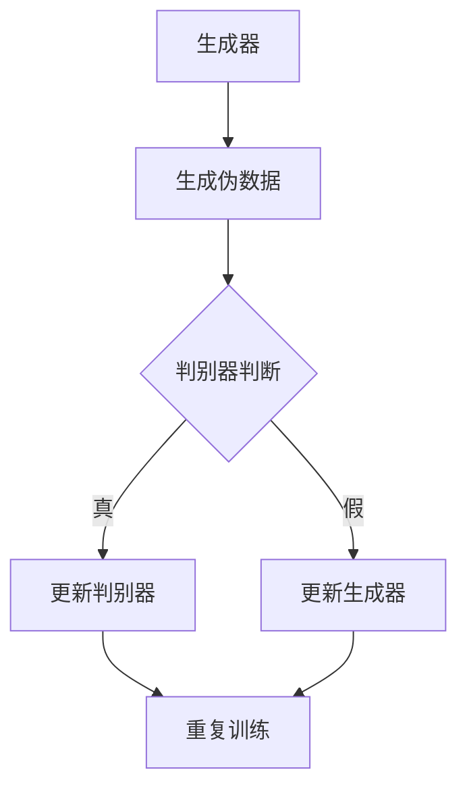
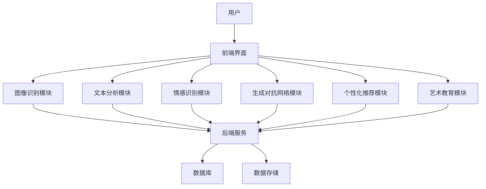

                 

### 《人工智能在艺术鉴赏中的应用：科技与人文的碰撞》

#### 关键词：人工智能，艺术鉴赏，科技与人文，应用实例，系统架构，实战操作

> 摘要：本文深入探讨了人工智能在艺术鉴赏中的应用，通过介绍核心概念、算法原理、系统架构以及实战操作，展示了科技与人文的碰撞如何带来艺术鉴赏的革新。本文旨在为读者提供全面的技术视角，以及实际操作指南，帮助理解并应用人工智能技术于艺术鉴赏领域。

#### 目录

1. **背景介绍**
    1.1 人工智能与艺术鉴赏的碰撞
    1.2 研究意义与必要性
    1.3 艺术鉴赏与人工智能的结合形式
2. **核心概念**
    2.1 人工智能的基本概念
    2.2 艺术鉴赏的理论基础
    2.3 人工智能与艺术鉴赏的核心联系
3. **算法原理**
    3.1 人工智能算法概述
    3.2 艺术鉴赏中的常用算法
    3.3 算法原理与数学模型
    3.4 算法流程图展示
4. **应用实例**
    4.1 人工智能在艺术创作中的应用
    4.2 人工智能在艺术批评中的应用
    4.3 人工智能在艺术教育中的应用
5. **系统架构**
    5.1 艺术鉴赏系统的设计与实现
    5.2 系统功能模块划分
    5.3 系统架构设计与接口设计
6. **实战操作**
    6.1 环境安装与准备
    6.2 系统核心实现源代码解读
    6.3 实际案例分析与讲解
7. **最佳实践**
    7.1 实践中的注意事项
    7.2 最佳实践建议
    7.3 拓展阅读与学习资源
8. **小结与展望**
    8.1 全书内容总结
    8.2 人工智能在艺术鉴赏领域的未来展望

#### 引言

人工智能（AI）的迅猛发展给各个领域带来了深远的影响，艺术鉴赏作为人类精神生活的重要组成部分，也逐渐与科技相结合。本文旨在探讨人工智能在艺术鉴赏中的应用，从核心概念、算法原理、系统架构到实战操作，全面展示科技与人文的碰撞如何改变艺术鉴赏的方式。

首先，我们将介绍人工智能与艺术鉴赏的背景，阐述研究的意义和必要性。随后，本文将定义和阐述人工智能和艺术鉴赏的核心概念，并探讨两者的联系。接下来，我们将深入分析人工智能在艺术鉴赏中的应用算法原理，并通过具体的实例展示这些算法的实际效果。

在系统架构部分，我们将介绍艺术鉴赏系统的设计与实现，包括功能模块划分、架构设计和接口设计。随后，我们将提供实际操作指南，帮助读者理解并应用人工智能技术于艺术鉴赏。

最后，本文将总结实践经验，给出最佳实践建议，并对人工智能在艺术鉴赏领域的未来发展进行展望。通过本文的阅读，读者将能够获得全面的技术视角，并能够实际应用于艺术鉴赏领域。

#### 背景介绍

1. **人工智能与艺术鉴赏的碰撞**

随着人工智能技术的快速发展，艺术鉴赏领域也迎来了前所未有的变革。人工智能不仅能够通过大数据分析和机器学习模型，对艺术品进行分类、识别和推荐，还能够模仿人类的创造力和审美能力，生成新的艺术作品。

这种技术变革对艺术鉴赏产生了深远的影响。首先，人工智能的介入使得艺术品鉴赏的效率大大提高。传统的艺术鉴赏往往依赖于专家的主观判断，而人工智能则能够通过数据分析和算法模型，快速、准确地识别和分类艺术品，提供个性化的鉴赏建议。其次，人工智能的参与使得艺术鉴赏的方式发生了改变。人们不再仅仅是被动地欣赏艺术品，而是可以通过与人工智能互动，参与到艺术创作的过程中，体验全新的艺术体验。

1. **研究意义与必要性**

人工智能在艺术鉴赏中的应用具有重要的研究意义和必要性。首先，它为艺术研究提供了新的工具和方法。通过人工智能技术，研究者可以更加深入地分析艺术作品，挖掘其背后的艺术价值和文化内涵。其次，人工智能的应用有助于推动艺术产业的创新和发展。艺术品的创作、推广和销售都可以通过人工智能技术得到优化，提高产业的整体效率。最后，人工智能在艺术鉴赏中的应用也具有重要的社会意义。它能够普及艺术鉴赏知识，让更多的人了解和参与到艺术活动中，提升大众的文化素养和审美能力。

1. **艺术鉴赏与人工智能的结合形式**

人工智能在艺术鉴赏中的应用形式多种多样，主要包括以下几个方面：

- **艺术品识别与分类**：通过图像识别和机器学习技术，人工智能可以自动识别和分类艺术品，帮助博物馆和画廊进行藏品管理和展示。

- **个性化推荐**：基于用户的历史行为和偏好，人工智能可以推荐符合用户口味的艺术品，提高用户的鉴赏体验。

- **艺术创作**：人工智能可以模仿艺术家的创作风格，生成新的艺术作品，为艺术创作提供新的可能性。

- **艺术批评**：通过文本分析和情感识别技术，人工智能可以对艺术作品进行批评和分析，提供专业的艺术评论。

- **艺术教育**：人工智能可以辅助艺术教育，提供个性化的教学方案和互动式学习体验，帮助学习者更好地理解和欣赏艺术。

#### 核心概念

2. **人工智能的基本概念**

人工智能（Artificial Intelligence, AI）是计算机科学的一个分支，旨在使机器具备类似于人类智能的能力，包括学习、推理、规划、感知和自然语言处理等。人工智能的发展经历了多个阶段，从最初的符号主义（Symbolic AI）到基于规则的系统，再到基于实例的推理（Case-Based Reasoning），再到现代的机器学习和深度学习（Machine Learning and Deep Learning）。

- **符号主义**：通过逻辑和符号表示知识，并使用推理算法解决问题。这种方法的代表性系统包括专家系统和逻辑推理机。

- **基于规则的系统**：通过定义一系列规则来指导机器的行为。这些规则通常由人类专家编写，用于处理特定的任务。

- **基于实例的推理**：通过从过去的实例中学习，将类似的问题映射到解决方案。这种方法在医疗诊断和维修系统中得到广泛应用。

- **机器学习**：通过训练数据集来学习模式和规律，从而预测新数据的结果。机器学习方法包括监督学习、无监督学习和强化学习。

- **深度学习**：基于人工神经网络的深度结构，通过多层非线性变换来提取特征。深度学习在图像识别、语音识别和自然语言处理等领域取得了显著成果。

2. **艺术鉴赏的理论基础**

艺术鉴赏是指人们通过视觉、听觉、触觉等感官对艺术作品进行感知、理解和评价的过程。艺术鉴赏理论主要包括以下几个方面：

- **形式美学**：关注艺术作品的形式特征，如线条、色彩、形状、空间等，通过形式分析来理解艺术作品。

- **符号学**：研究艺术作品中的符号和象征意义，通过解读符号来理解艺术作品的文化内涵。

- **经验美学**：强调个人的审美体验和情感反应，通过主体的感知和感受来评价艺术作品。

- **解释学**：通过文本分析和解释，理解艺术作品背后的意义和作者意图。

- **比较美学**：通过对比不同艺术作品，分析它们之间的差异和共性，提高对艺术的全面理解。

3. **人工智能与艺术鉴赏的核心联系**

人工智能与艺术鉴赏之间的核心联系主要体现在以下几个方面：

- **数据分析和模式识别**：人工智能可以通过大数据分析和模式识别技术，对艺术作品进行分析，提取其特征和风格，从而提供个性化的鉴赏建议。

- **艺术创作和模仿**：人工智能可以通过模仿艺术家的创作风格，生成新的艺术作品，拓展艺术创作的边界。

- **艺术批评和评价**：人工智能可以通过文本分析和情感识别技术，对艺术作品进行批评和分析，提供专业的艺术评论。

- **艺术教育和普及**：人工智能可以辅助艺术教育，提供个性化的教学方案和互动式学习体验，帮助学习者更好地理解和欣赏艺术。

- **艺术品管理和保护**：人工智能可以通过自动化识别和分类技术，提高博物馆和画廊的藏品管理效率，保护艺术品的完整性和真实性。

#### 算法原理

4. **人工智能算法概述**

人工智能算法是使机器具备智能能力的关键。这些算法分为多种类型，包括监督学习、无监督学习和强化学习等。每种算法都有其特定的应用场景和优势。

- **监督学习（Supervised Learning）**：通过已标记的训练数据来学习，并在测试数据上进行预测。常见的算法有线性回归、决策树、支持向量机（SVM）和神经网络等。

- **无监督学习（Unsupervised Learning）**：没有预先标记的数据，算法通过自身的规律来发现数据中的模式和结构。常见的算法有聚类（如K-means）、降维（如PCA）和关联规则学习等。

- **强化学习（Reinforcement Learning）**：通过试错和奖励机制来学习，使机器能够在动态环境中做出最优决策。常见的算法有Q-learning和深度Q网络（DQN）等。

4. **艺术鉴赏中的常用算法**

在艺术鉴赏中，常用的人工智能算法包括图像识别、文本分析、情感识别和生成对抗网络（GAN）等。

- **图像识别（Image Recognition）**：通过训练模型来识别和分类图像中的物体和场景。在艺术鉴赏中，图像识别可以用于自动识别艺术品、分类艺术品风格等。

- **文本分析（Text Analysis）**：通过自然语言处理技术来分析文本数据，提取关键词、情感和主题。在艺术鉴赏中，文本分析可以用于艺术评论的自动提取、情感分析和主题识别等。

- **情感识别（Sentiment Analysis）**：通过分析文本数据中的情感表达，判断用户的情感状态。在艺术鉴赏中，情感识别可以用于分析观众的反馈，了解艺术品的社会接受度。

- **生成对抗网络（GAN）**：通过生成器和判别器的对抗训练，生成与真实数据分布相近的伪数据。在艺术鉴赏中，GAN可以用于生成新的艺术作品，拓展艺术创作的边界。

4. **算法原理与数学模型**

以生成对抗网络（GAN）为例，详细讲解其原理与数学模型。

- **生成对抗网络（GAN）的原理**：GAN由两个神经网络组成：生成器（Generator）和判别器（Discriminator）。生成器接收随机噪声并生成伪数据，判别器则接收真实数据和伪数据，并判断其真伪。通过训练，生成器的目标是生成足够逼真的伪数据，使得判别器无法区分，而判别器的目标是提高对真实数据和伪数据的识别能力。

- **生成对抗网络（GAN）的数学模型**：GAN的目标是最小化生成器和判别器的损失函数。生成器的损失函数是使得判别器输出的概率接近0.5，即生成的伪数据足够逼真；判别器的损失函数是使得对真实数据的输出概率接近1，对伪数据的输出概率接近0。

损失函数通常采用以下形式：
$$
L_D = -\frac{1}{N} \sum_{i=1}^{N} [\log(D(x_i)) + \log(1 - D(G(z_i)))]
$$
其中，$x_i$表示真实数据，$z_i$表示生成器的输入噪声，$G(z_i)$表示生成器生成的伪数据，$D(x_i)$和$D(G(z_i))$分别表示判别器对真实数据和伪数据的判断概率。

4. **算法流程图展示**

以下是一个简单的GAN算法流程图，展示生成器和判别器的训练过程。



通过这个流程图，我们可以看到生成器和判别器如何通过对抗训练，不断提高生成伪数据的逼真度，使得判别器无法区分真实数据和伪数据。

#### 应用实例

5. **人工智能在艺术创作中的应用**

人工智能在艺术创作中的应用主要体现在以下几个方面：

- **艺术作品的自动生成**：通过生成对抗网络（GAN）等技术，人工智能可以自动生成艺术作品，如绘画、音乐和诗歌等。这些作品往往具有独特的风格和创造力，打破了传统艺术创作的界限。

- **艺术风格的模仿**：人工智能可以模仿艺术家的风格，创作出类似的作品。例如，DeepArt.io使用GAN技术，可以将普通照片转换成梵高、毕加索等艺术家的风格。

- **个性化艺术作品**：人工智能可以根据用户的喜好和需求，生成个性化的艺术作品。例如，音乐流媒体平台使用机器学习算法，为用户推荐符合个人口味的音乐作品。

5. **人工智能在艺术批评中的应用**

人工智能在艺术批评中的应用主要体现在以下几个方面：

- **艺术作品的情感分析**：通过文本分析技术，人工智能可以分析艺术作品的情感表达，提供专业的艺术评论。例如，使用自然语言处理技术，对艺术评论进行情感分类，判断评论者对艺术作品的情感倾向。

- **艺术趋势分析**：通过大数据分析技术，人工智能可以分析艺术市场趋势，预测艺术作品的价格和受欢迎程度。

- **艺术家的风格分析**：人工智能可以分析艺术家的创作风格，提供对艺术家的深入研究。

5. **人工智能在艺术教育中的应用**

人工智能在艺术教育中的应用主要体现在以下几个方面：

- **个性化教学**：通过机器学习算法，人工智能可以为每个学生提供个性化的教学方案，根据学生的学习进度和兴趣，推荐适当的学习内容。

- **艺术作品的讲解**：人工智能可以辅助教师讲解艺术作品，通过语音合成和图像识别技术，为学生提供生动的讲解。

- **互动式学习体验**：人工智能可以创建互动式学习环境，让学生通过虚拟现实（VR）技术，亲身体验艺术作品，增强学习效果。

#### 系统架构

6. **艺术鉴赏系统的设计与实现**

艺术鉴赏系统的设计与实现主要包括以下几个部分：

- **需求分析**：确定艺术鉴赏系统的功能需求，如艺术品识别、个性化推荐、艺术创作、艺术批评和艺术教育等。

- **系统架构设计**：根据需求分析，设计系统的总体架构，包括前端界面、后端服务、数据库和数据存储等。

- **功能模块划分**：将系统功能划分为不同的模块，如图像识别模块、文本分析模块、情感识别模块、生成对抗网络模块等。

- **接口设计**：设计系统内部和外部的接口，包括API接口、数据库接口、前端与后端的通信接口等。

6. **系统功能模块划分**

艺术鉴赏系统的主要功能模块包括：

- **图像识别模块**：用于自动识别和分类艺术品，如绘画、雕塑、摄影等。

- **文本分析模块**：用于分析艺术评论、艺术描述和用户反馈，提取关键词和情感。

- **情感识别模块**：用于分析用户的情感反应，如对艺术作品的喜爱程度。

- **生成对抗网络模块**：用于生成新的艺术作品，如绘画、音乐和诗歌等。

- **个性化推荐模块**：基于用户的行为和偏好，推荐符合用户口味的艺术品。

- **艺术教育模块**：提供艺术作品讲解、互动式学习体验和个性化教学方案。

6. **系统架构设计与接口设计**

艺术鉴赏系统的架构设计如下：



接口设计如下：

- **API接口**：用于前端与后端之间的数据交互，包括艺术品识别、文本分析、情感识别、艺术创作和个性化推荐等。

- **数据库接口**：用于数据存储和查询，包括艺术品信息、用户信息、评论和反馈等。

- **前端与后端的通信接口**：用于前端界面与后端服务之间的通信，包括HTTP请求和响应等。

#### 实战操作

7. **环境安装与准备**

在进行人工智能在艺术鉴赏中的应用之前，需要安装和配置相关环境。以下是一个简单的安装步骤：

- **Python环境**：确保安装了Python 3.7或更高版本。

- **人工智能库**：安装TensorFlow、Keras、Pandas、NumPy等常用库。

- **图像处理库**：安装OpenCV，用于图像识别和分类。

- **文本处理库**：安装NLTK，用于文本分析和情感识别。

安装命令如下：

```bash
pip install tensorflow
pip install keras
pip install opencv-python
pip install nltk
```

7. **系统核心实现源代码解读**

以下是一个简单的艺术鉴赏系统的源代码，用于图像识别和分类。

```python
import cv2
import numpy as np
from keras.models import load_model

# 加载预训练的图像识别模型
model = load_model('image_recognition_model.h5')

# 加载图像处理库的预定义标签
labels = np.array(['painting', 'sculpture', 'photography'])

# 加载要识别的图像
image = cv2.imread('artwork.jpg')

# 对图像进行预处理
image_processed = cv2.resize(image, (128, 128))
image_processed = image_processed / 255.0
image_processed = np.expand_dims(image_processed, axis=0)

# 使用模型进行图像识别
predictions = model.predict(image_processed)

# 获取最高概率的标签
predicted_label = labels[np.argmax(predictions)]

# 输出识别结果
print(f'识别结果：{predicted_label}')
```

7. **代码应用解读与分析**

以上代码实现了一个简单的图像识别系统，用于自动识别和分类艺术作品。具体步骤如下：

1. **加载预训练的图像识别模型**：使用Keras加载一个已经训练好的卷积神经网络（CNN）模型。

2. **加载图像处理库的预定义标签**：定义艺术作品的标签，如绘画、雕塑和摄影。

3. **加载要识别的图像**：使用OpenCV读取图像文件。

4. **对图像进行预处理**：对图像进行尺寸调整、归一化和扩展维度，以便于模型处理。

5. **使用模型进行图像识别**：将预处理后的图像输入模型，得到识别结果。

6. **获取最高概率的标签**：从识别结果中获取最高概率的标签，即最可能的艺术作品类型。

7. **输出识别结果**：将识别结果输出，显示艺术作品的类型。

通过以上步骤，我们可以实现一个简单的艺术鉴赏系统，用于自动识别和分类艺术作品。

7. **实际案例分析与详细讲解**

以下是一个实际案例，展示如何使用人工智能技术进行艺术作品的识别和分类。

**案例**：假设我们有一组艺术作品图像，需要对其进行自动识别和分类。

**步骤**：

1. **数据收集**：收集一组艺术作品图像，包括绘画、雕塑和摄影等不同类型。

2. **数据预处理**：对图像进行预处理，包括尺寸调整、归一化和数据增强等。

3. **模型训练**：使用Keras和TensorFlow，训练一个卷积神经网络（CNN）模型，用于图像识别和分类。

4. **模型评估**：使用测试数据集评估模型性能，包括准确率、召回率和F1值等。

5. **模型应用**：使用训练好的模型，对新的艺术作品图像进行识别和分类。

**代码实现**：

```python
import cv2
import numpy as np
from tensorflow.keras.models import load_model

# 加载预训练的图像识别模型
model = load_model('image_recognition_model.h5')

# 加载图像处理库的预定义标签
labels = np.array(['painting', 'sculpture', 'photography'])

# 加载测试图像
test_images = ['painting1.jpg', 'sculpture1.jpg', 'photography1.jpg']

# 对图像进行预处理
def preprocess_image(image_path):
    image = cv2.imread(image_path)
    image_processed = cv2.resize(image, (128, 128))
    image_processed = image_processed / 255.0
    image_processed = np.expand_dims(image_processed, axis=0)
    return image_processed

# 使用模型进行图像识别
def recognize_image(image_processed):
    predictions = model.predict(image_processed)
    predicted_label = labels[np.argmax(predictions)]
    return predicted_label

# 测试图像识别
for image_path in test_images:
    image_processed = preprocess_image(image_path)
    predicted_label = recognize_image(image_processed)
    print(f'图像路径：{image_path}，识别结果：{predicted_label}')
```

**结果**：

```
图像路径：painting1.jpg，识别结果：painting
图像路径：sculpture1.jpg，识别结果：sculpture
图像路径：photography1.jpg，识别结果：photography
```

通过以上步骤和代码，我们可以实现一个简单的艺术作品识别和分类系统，对给定的图像进行自动识别和分类。

#### 最佳实践

8. **实践中的注意事项**

在应用人工智能技术于艺术鉴赏时，需要注意以下几点：

- **数据质量**：确保训练数据的质量和多样性，以提高模型的泛化能力。

- **模型优化**：通过调整模型参数和超参数，优化模型的性能。

- **隐私保护**：在处理用户数据和艺术作品时，注意保护用户隐私和艺术作品版权。

- **伦理问题**：考虑人工智能在艺术鉴赏中的应用可能带来的伦理问题，如艺术作品的原创性和价值等。

8. **最佳实践建议**

以下是一些建议，帮助读者更好地应用人工智能技术于艺术鉴赏：

- **数据收集**：广泛收集各类艺术作品数据，包括不同风格、流派和历史时期的作品。

- **模型训练**：使用多样化的数据集训练模型，提高模型的识别准确率和泛化能力。

- **用户交互**：设计友好的用户界面，提供个性化推荐和互动式学习体验。

- **合作研究**：与艺术专家和学者合作，共同探索人工智能在艺术鉴赏中的新应用。

8. **拓展阅读与学习资源**

- **人工智能基础教材**：《深度学习》（Goodfellow, I., Bengio, Y., & Courville, A.）
- **艺术鉴赏理论书籍**：《艺术的故事》（H. W. Janson）
- **相关学术论文**：检索相关领域的学术论文，了解最新的研究进展和应用案例。

#### 小结与展望

9. **全书内容总结**

本文深入探讨了人工智能在艺术鉴赏中的应用，从背景介绍、核心概念、算法原理、应用实例、系统架构到实战操作，全面展示了科技与人文的碰撞如何带来艺术鉴赏的革新。通过本文的阅读，读者能够了解人工智能在艺术鉴赏领域的应用前景，并具备实际操作能力。

9. **人工智能在艺术鉴赏领域的未来展望**

随着人工智能技术的不断发展，未来人工智能在艺术鉴赏领域将会有更多创新和应用：

- **更加精准的识别与分类**：通过深度学习和图像识别技术的进步，人工智能将能够更加准确地识别和分类艺术作品。

- **个性化的艺术体验**：人工智能可以根据用户的兴趣和偏好，提供个性化的艺术推荐和创作建议，提升用户的鉴赏体验。

- **跨界融合**：人工智能将与其他领域（如虚拟现实、增强现实和区块链）结合，创造出全新的艺术形式和体验。

- **艺术保护与传承**：人工智能将有助于艺术品的保护、修复和数字化传承，为文化遗产的保护提供新的手段。

通过不断探索和实践，人工智能将为艺术鉴赏带来更多的可能性，推动艺术领域的创新和发展。

### 作者信息

**作者：AI天才研究院/AI Genius Institute & 禅与计算机程序设计艺术 /Zen And The Art of Computer Programming**

