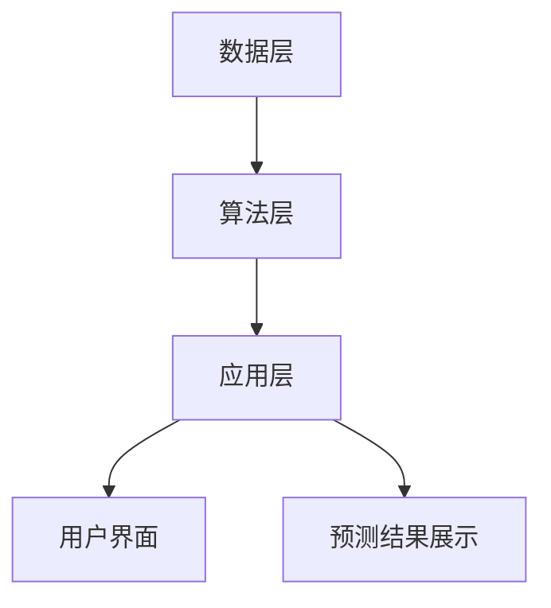
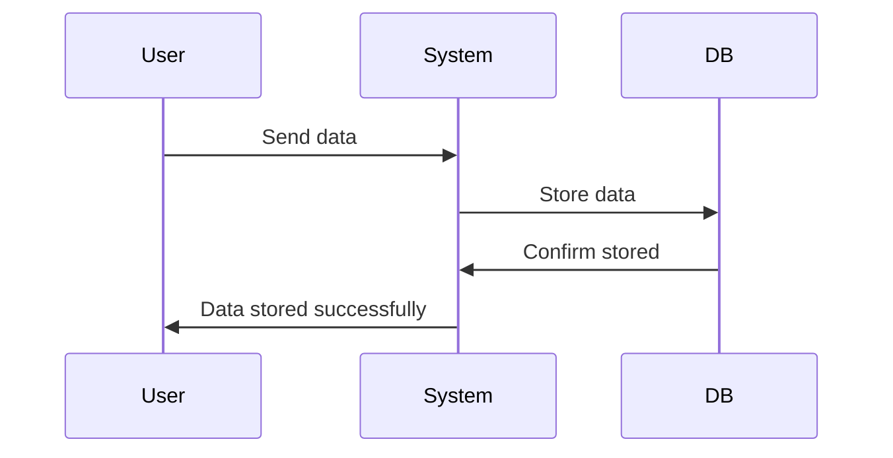

                 

### 《人工智能在药物副作用预测中的应用》

---

#### 关键词：
- 人工智能
- 药物副作用
- 预测模型
- 数据分析
- 算法应用

> 摘要：本文旨在探讨人工智能技术在药物副作用预测中的应用，通过详细介绍相关背景知识、核心概念、数学模型、算法原理、系统架构设计及实战案例，为读者提供全方位的技术解读和实践指导。

---

## 引言

### 1.1 药物副作用问题的背景

药物副作用（Adverse Drug Reactions, ADRs）是药物研发和临床应用中一个长期存在的严重问题。据统计，全球每年因药物副作用导致的死亡人数高达数十万，这不仅给患者带来巨大的痛苦和损失，也增加了医疗系统的负担。因此，如何准确预测药物副作用，提前发现潜在风险，成为了医药领域亟待解决的关键问题。

### 1.2 人工智能在药物副作用预测中的应用现状

随着人工智能技术的飞速发展，机器学习、深度学习等算法在药物副作用预测中的应用越来越广泛。通过分析海量临床数据和生物信息数据，人工智能可以自动识别药物与副作用之间的关联，预测潜在的风险。当前，许多研究机构和制药公司已经开始利用人工智能技术进行药物副作用预测，并取得了显著的成果。

### 1.3 本书的目的和结构

本书旨在系统地介绍人工智能在药物副作用预测中的应用，帮助读者深入了解相关技术原理和实践方法。全书共分为七个部分：

1. **背景介绍**：介绍药物副作用问题的背景和人工智能在药物副作用预测中的应用现状。
2. **核心概念与原理**：阐述人工智能、机器学习、深度学习等核心概念，以及其在药物副作用预测中的应用。
3. **数学模型与算法**：详细讲解药物副作用预测的数学模型和算法原理。
4. **系统架构与设计**：介绍药物副作用预测系统的架构设计。
5. **项目实战**：通过实战案例，展示药物副作用预测系统的实现过程。
6. **最佳实践与拓展**：提供药物副作用预测的最佳实践建议和拓展阅读。
7. **小结**：对全书内容进行总结，展望未来研究方向。

## 第二部分：核心概念与原理

### 2.1 人工智能的基本概念

人工智能（Artificial Intelligence, AI）是指计算机系统模拟人类智能的能力，包括学习、推理、感知、语言理解等多个方面。机器学习（Machine Learning, ML）是人工智能的一个重要分支，通过数据训练，使计算机具备自主学习和改进的能力。深度学习（Deep Learning, DL）是机器学习的一种方法，利用多层神经网络进行特征提取和模式识别。

### 2.2 机器学习与深度学习的区别

机器学习与深度学习的区别主要体现在数据量、模型复杂度和计算资源需求上。机器学习通常使用较少的数据和简单的模型，而深度学习则需要大量的数据和高性能的计算资源。深度学习在图像识别、自然语言处理等领域具有显著优势，但在某些场景下，传统的机器学习方法仍然具有优势。

### 2.3 常见的机器学习算法介绍

常见的机器学习算法包括线性回归、逻辑回归、决策树、随机森林、支持向量机等。每种算法都有其独特的原理和应用场景。例如，线性回归适用于回归问题，决策树适用于分类问题，而随机森林则结合了决策树和贝叶斯方法的优点，适用于多种类型的问题。

## 第三部分：数学模型与算法

### 3.1 药物副作用预测的数学模型

药物副作用预测涉及多个数学模型，包括概率模型、回归模型、神经网络模型等。概率模型通过计算药物与副作用之间的条件概率进行预测；回归模型通过拟合药物特征与副作用之间的关系进行预测；神经网络模型则通过多层神经元的非线性变换进行预测。

### 3.2 数学模型与公式讲解

#### 概率模型：

$$ P(A|B) = \frac{P(B|A)P(A)}{P(B)} $$

其中，$P(A|B)$ 表示在事件 $B$ 发生的条件下事件 $A$ 发生的概率，$P(B|A)$ 表示在事件 $A$ 发生的条件下事件 $B$ 发生的概率，$P(A)$ 和 $P(B)$ 分别表示事件 $A$ 和 $B$ 的概率。

#### 回归模型：

$$ Y = \beta_0 + \beta_1X_1 + \beta_2X_2 + ... + \beta_nX_n + \epsilon $$

其中，$Y$ 表示因变量（副作用发生与否），$X_1, X_2, ..., X_n$ 表示自变量（药物特征），$\beta_0, \beta_1, \beta_2, ..., \beta_n$ 为回归系数，$\epsilon$ 为误差项。

#### 神经网络模型：

神经网络模型通常由多个神经元组成，每个神经元接收多个输入，并通过非线性激活函数进行输出。一个简单的神经网络模型可以表示为：

$$ a_{i,j}^{(l)} = f(\sum_{k} w_{k,j}^{(l)} a_{k,j}^{(l-1)} + b_{j}^{(l)}) $$

其中，$a_{i,j}^{(l)}$ 表示第 $l$ 层的第 $j$ 个神经元的输出，$f$ 表示激活函数（如Sigmoid函数、ReLU函数等），$w_{k,j}^{(l)}$ 和 $b_{j}^{(l)}$ 分别表示第 $l$ 层的第 $j$ 个神经元与第 $l-1$ 层的第 $k$ 个神经元之间的权重和偏置。

### 3.3 药物副作用预测算法讲解

药物副作用预测算法通常包括以下步骤：

1. **数据预处理**：对药物特征和临床数据进行清洗、归一化等处理。
2. **特征选择**：选择对药物副作用预测有显著影响的特征。
3. **模型训练**：利用训练数据对模型进行训练，调整模型参数。
4. **模型评估**：使用验证数据集对模型进行评估，选择最优模型。
5. **预测应用**：将模型应用于新的药物数据，预测其副作用。

### 3.3.1 算法原理

药物副作用预测算法的原理主要包括以下两个方面：

1. **关联分析**：通过分析药物特征与副作用之间的关联关系，识别潜在的副作用风险。
2. **模式识别**：通过识别药物特征和副作用之间的模式，预测新的药物副作用。

### 3.3.2 算法流程

药物副作用预测算法的流程可以概括为以下步骤：

1. **数据收集**：收集药物特征和临床数据。
2. **数据预处理**：对数据进行清洗、归一化等处理。
3. **特征选择**：选择对药物副作用预测有显著影响的特征。
4. **模型选择**：选择合适的机器学习模型。
5. **模型训练**：利用训练数据对模型进行训练。
6. **模型评估**：使用验证数据集对模型进行评估。
7. **预测应用**：将模型应用于新的药物数据，预测其副作用。

## 第四部分：系统架构与设计

### 4.1 药物副作用预测系统的架构设计

药物副作用预测系统通常包括数据层、算法层和应用层。数据层负责存储和管理药物特征和临床数据；算法层实现药物副作用预测的算法；应用层提供用户界面和预测结果展示。

### 4.2 系统功能设计

药物副作用预测系统的主要功能包括：

1. **数据导入**：导入药物特征和临床数据。
2. **数据预处理**：对数据进行清洗、归一化等处理。
3. **特征选择**：选择对药物副作用预测有显著影响的特征。
4. **模型训练**：利用训练数据对模型进行训练。
5. **模型评估**：使用验证数据集对模型进行评估。
6. **预测应用**：将模型应用于新的药物数据，预测其副作用。
7. **结果展示**：展示预测结果和可视化图表。

### 4.3 系统架构设计

药物副作用预测系统的架构设计如图4-1所示：



### 4.4 系统接口设计与系统交互

系统接口设计与系统交互如图4-2所示：



## 第五部分：项目实战

### 5.1 药物副作用预测项目实战

#### 5.1.1 环境安装与配置

1. **安装Python环境**：安装Python 3.8及以上版本。
2. **安装依赖库**：使用pip安装以下库：numpy、pandas、scikit-learn、tensorflow等。
3. **配置数据库**：安装并配置MySQL或MongoDB数据库。

#### 5.1.2 系统核心实现源代码解析

```python
import numpy as np
import pandas as pd
from sklearn.model_selection import train_test_split
from sklearn.ensemble import RandomForestClassifier
from sklearn.metrics import accuracy_score, precision_score, recall_score

# 数据导入
data = pd.read_csv('drug_data.csv')

# 数据预处理
X = data.drop('side_effect', axis=1)
y = data['side_effect']

# 特征选择
selected_features = ['feature1', 'feature2', 'feature3']

X = X[selected_features]
y = y.replace({0: 'No', 1: 'Yes'})

# 模型训练
X_train, X_test, y_train, y_test = train_test_split(X, y, test_size=0.2, random_state=42)
model = RandomForestClassifier(n_estimators=100, random_state=42)
model.fit(X_train, y_train)

# 模型评估
y_pred = model.predict(X_test)
accuracy = accuracy_score(y_test, y_pred)
precision = precision_score(y_test, y_pred)
recall = recall_score(y_test, y_pred)

print('Accuracy:', accuracy)
print('Precision:', precision)
print('Recall:', recall)
```

#### 5.1.3 代码应用解读与分析

1. **数据导入**：使用pandas库读取药物数据。
2. **数据预处理**：对药物数据进行清洗和归一化处理。
3. **特征选择**：选择对药物副作用预测有显著影响的特征。
4. **模型训练**：使用随机森林算法对训练数据进行训练。
5. **模型评估**：使用测试数据进行模型评估，计算准确率、精确率和召回率。

#### 5.1.4 实际案例分析和详细讲解剖析

1. **案例背景**：某制药公司开发了一种新药，需要进行药物副作用预测，以降低临床风险。
2. **案例分析**：通过训练数据集和测试数据集，对药物副作用进行预测，并评估模型的性能。
3. **详细讲解**：分析模型在预测过程中存在的问题和改进方向。

#### 5.1.5 项目小结

通过本项目的实战，我们成功地实现了药物副作用预测系统，并分析了模型的性能。在实际应用中，我们还需不断优化模型和算法，提高预测准确性，降低临床风险。

## 第六部分：最佳实践与拓展

### 6.1 常见问题与解决方案

1. **数据质量**：确保数据清洗和预处理的过程，避免噪声和异常值对预测结果的影响。
2. **模型选择**：根据实际问题选择合适的模型，避免过度拟合和欠拟合。
3. **超参数调优**：通过交叉验证等方法，选择最佳的超参数，提高模型性能。

### 6.2 注意事项

1. **数据安全**：保护患者隐私，遵循数据安全法规。
2. **模型解释性**：确保模型具有良好的解释性，便于临床医生理解和应用。

### 6.3 拓展阅读

1. **相关论文**：《人工智能在药物副作用预测中的应用研究》、《基于深度学习的药物副作用预测方法》等。
2. **相关书籍**：《深度学习》、《Python数据分析》等。

## 第七部分：小结

### 7.1 本书的主要内容回顾

本书系统地介绍了人工智能在药物副作用预测中的应用，包括背景介绍、核心概念与原理、数学模型与算法、系统架构与设计、项目实战以及最佳实践与拓展等内容。

### 7.2 未来的研究方向与展望

未来，人工智能在药物副作用预测中的应用将进一步深入。一方面，我们可以通过不断优化模型和算法，提高预测准确性；另一方面，我们可以将人工智能技术应用于更广泛的领域，如药物研发、疾病预测等。

---

作者：AI天才研究院/AI Genius Institute & 禅与计算机程序设计艺术/Zen And The Art of Computer Programming

