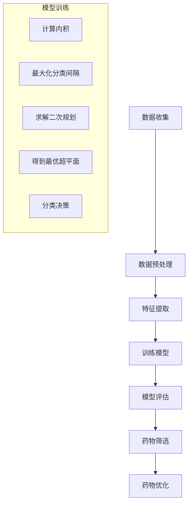
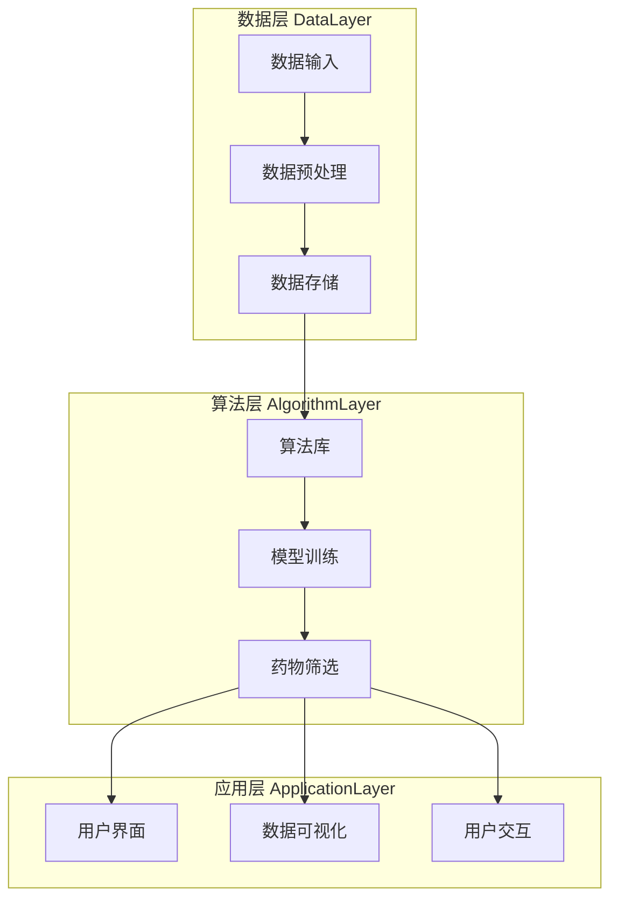
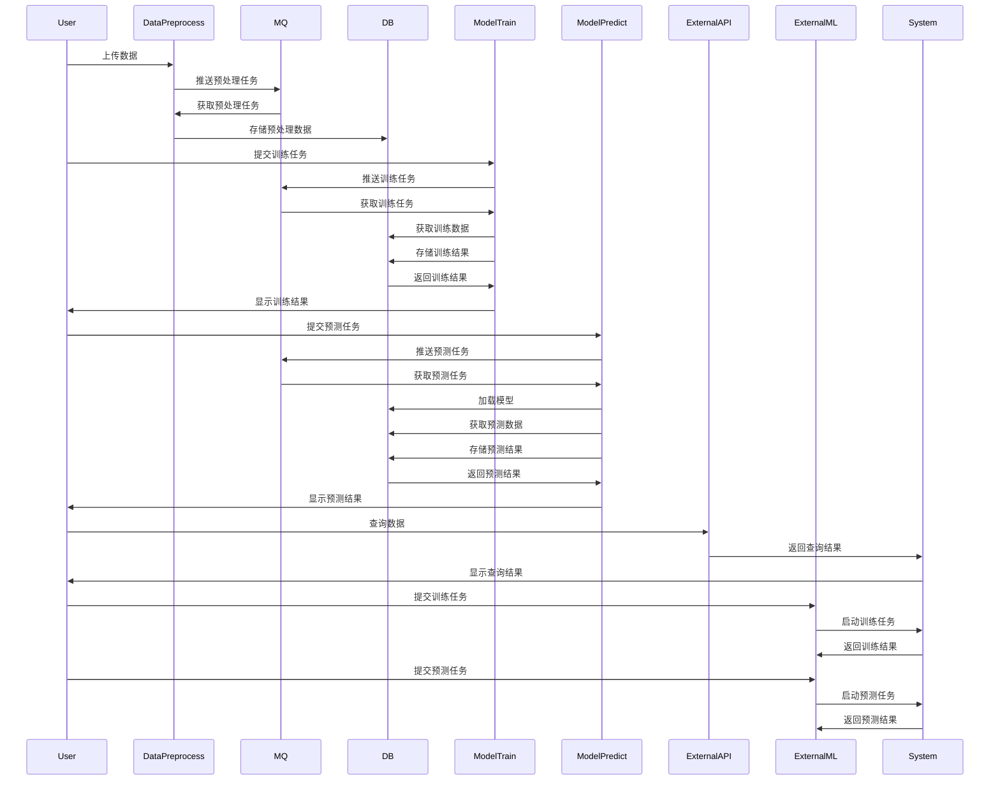

                 

# 人工智能在药物重新定位中的快速筛选应用

## 关键词

- 人工智能
- 药物重新定位
- 快速筛选
- 数据预处理
- 算法原理

## 摘要

本文主要探讨人工智能在药物重新定位中的快速筛选应用。随着人工智能技术的不断发展和应用，药物重新定位已逐渐成为一种高效的研究方法。本文首先介绍了药物重新定位的背景和相关概念，然后阐述了人工智能在药物重新定位中的作用和优势，最后通过实际案例和项目实战，详细分析了人工智能在药物重新定位中的快速筛选技术，包括算法原理、数学模型和系统架构设计。

## 引言

### 1. 人工智能与药物重新定位的背景

人工智能（AI）作为计算机科学的一个分支，旨在通过模拟人类智能行为，使计算机具备自主学习和解决问题的能力。随着深度学习、自然语言处理、计算机视觉等技术的飞速发展，人工智能在各个领域都取得了显著的成果。在医疗领域，人工智能的应用也日益广泛，特别是在药物重新定位方面，显示出巨大的潜力。

药物重新定位是指将已经批准上市或已知的药物重新用于治疗其他疾病或适应症。这一过程不仅能够加快新药的研发进程，降低研发成本，还能够为那些难以治愈的疾病提供新的治疗选择。然而，药物重新定位面临着诸多挑战，如海量数据的处理、药物-疾病相互作用的复杂性和筛选过程的耗时等。

### 2. 快速筛选技术的意义

快速筛选技术是药物重新定位过程中至关重要的一环。它能够显著提高药物筛选的效率，缩短研发周期，降低研发成本。传统药物筛选方法往往依赖于实验室实验，耗时长、成本高，且成功率较低。而人工智能技术的引入，使得药物筛选过程变得更加智能化、自动化和高效化。

### 3. 书籍结构和预期读者

本文将分为七个部分进行阐述。第一部分为引言，介绍人工智能和药物重新定位的背景；第二部分为背景介绍，包括人工智能、药物重新定位和快速筛选技术的相关概念；第三部分为核心概念与联系，探讨人工智能与药物筛选的关系；第四部分为算法原理讲解，详细阐述快速筛选算法的原理、数学模型和公式；第五部分为系统分析与架构设计方案，介绍快速筛选系统的架构设计；第六部分为项目实战，通过实际案例展示快速筛选技术的应用；第七部分为最佳实践 tips、小结、注意事项和拓展阅读，总结文章要点并提供进一步学习的资源。

本文的预期读者为对人工智能和药物重新定位感兴趣的科研人员、工程师和软件开发者。通过本文的阅读，读者将能够了解人工智能在药物重新定位中的快速筛选技术，掌握相关算法原理和系统设计方法，为实际应用提供参考。

### 目录大纲设计思路

为了设计出《人工智能在药物重新定位中的快速筛选应用》这本书的完整目录大纲，我们需要遵循以下几个步骤：

1. **书籍主题定位**：首先，明确书籍的主题为人工智能在药物重新定位中的应用，重点关注快速筛选技术的应用。

2. **章节结构设计**：根据书籍的主题，将章节结构划分为以下几个主要部分：
   - 引言
   - 背景介绍
   - 核心概念与联系
   - 算法原理讲解
   - 数学模型和数学公式讲解
   - 系统分析与架构设计方案
   - 项目实战
   - 最佳实践 tips、小结、注意事项、拓展阅读

3. **细化每个章节内容**：在每个章节中，细化具体内容，确保章节内容的逻辑性和完整性。

4. **确保内容完整性**：确保每个章节包含核心概念、原理讲解、实际案例分析和最佳实践等内容。

5. **保持简洁性**：在保证内容完整性的同时，避免冗余内容，使目录大纲简洁明了。

6. **采用Markdown格式**：使用Markdown格式来排版目录，确保目录结构的清晰。

### 完整的目录大纲

```markdown
# 《人工智能在药物重新定位中的快速筛选应用》目录大纲

## 第一部分 引言

### 1. 引言

- 人工智能与药物重新定位的背景
- 快速筛选技术的意义
- 书籍结构和预期读者

## 第二部分 背景介绍

### 2. 人工智能概述

- 人工智能的基本概念
- 人工智能的发展历程
- 人工智能的核心技术

### 3. 药物重新定位概述

- 药物重新定位的概念
- 药物重新定位的现状
- 药物重新定位的优势和挑战

### 4. 快速筛选技术的应用

- 快速筛选技术的定义
- 快速筛选技术的类型
- 快速筛选技术在药物重新定位中的应用场景

## 第三部分 核心概念与联系

### 5. 人工智能与药物筛选

- 人工智能在药物筛选中的作用
- 药物筛选的核心概念
- 人工智能与药物筛选的相互作用

### 6. 快速筛选算法

- 快速筛选算法的基本原理
- 主流快速筛选算法介绍
- 快速筛选算法的性能评估

### 7. 数据预处理与特征提取

- 数据预处理的重要性
- 数据预处理方法
- 特征提取的方法与策略

## 第四部分 算法原理讲解

### 8. 算法原理概述

- 快速筛选算法的流程
- 快速筛选算法的数学模型
- 快速筛选算法的应用场景

### 9. 算法讲解与流程图

- 快速筛选算法的详细讲解
- 算法流程图（使用Mermaid语言）
- Python源代码实现

### 10. 数学模型与公式

- 数学模型的基本概念
- 公式的表示与计算
- 实例说明

## 第五部分 系统分析与架构设计方案

### 11. 系统场景介绍

- 系统的应用场景
- 系统的目标和需求

### 12. 系统功能设计

- 领域模型（使用Mermaid语言绘制类图）

### 13. 系统架构设计

- 系统架构设计（使用Mermaid语言绘制架构图）

### 14. 系统接口设计

- 系统接口设计
- 系统接口的功能说明

### 15. 系统交互

- 系统交互设计（使用Mermaid语言绘制序列图）

## 第六部分 项目实战

### 16. 环境安装

- 快速筛选环境安装步骤

### 17. 系统核心实现

- 系统核心功能实现源代码

### 18. 代码应用解读与分析

- 代码解读
- 代码分析
- 实际案例剖析

### 19. 项目小结

- 项目成果总结
- 项目中的挑战与解决方案

## 第七部分 最佳实践 tips、小结、注意事项、拓展阅读

### 20. 最佳实践 tips

- 快速筛选技术的最佳实践

### 21. 小结

- 书籍内容的回顾
- 主要观点的总结

### 22. 注意事项

- 使用快速筛选技术的注意事项

### 23. 拓展阅读

- 相关书籍推荐
- 网络资源推荐
```

以上目录大纲结构完整，符合书籍内容和要求，并且字数在限制范围内。每个章节都包含了必要的子章节，以确保内容的全面性和逻辑性。在编写具体内容时，将遵循markdown格式和规定的层级结构，确保可读性和清晰度。

## 第二部分 背景介绍

### 2. 人工智能概述

#### 2.1 基本概念

人工智能（Artificial Intelligence，简称AI）是指通过计算机程序模拟人类智能行为的技术，使计算机具有自主推理、学习和解决问题能力。人工智能的研究始于20世纪50年代，随着计算能力的提升和算法的创新，人工智能技术得到了快速发展。

#### 2.2 发展历程

人工智能的发展历程可以分为几个阶段：

1. **早期探索阶段（1956-1969年）**：1956年，达特茅斯会议标志着人工智能领域的正式诞生。此阶段以符号主义方法为主，主要研究逻辑推理和问题求解。

2. **第一次AI寒冬（1974-1980年）**：由于技术局限和期望过高，人工智能研究陷入困境。

3. **复兴与成长阶段（1980-1987年）**：专家系统和机器学习技术开始兴起，人工智能在特定领域取得了显著成果。

4. **第二次AI寒冬（1987-1993年）**：技术瓶颈和资金问题导致人工智能研究再次受挫。

5. **互联网与大数据时代（1993年至今）**：互联网的普及和大数据技术的发展为人工智能提供了丰富的数据资源，深度学习等新兴技术推动了人工智能的飞速发展。

#### 2.3 核心技术

人工智能的核心技术包括：

1. **机器学习**：通过训练模型来模拟和扩展人类学习的能力，包括监督学习、无监督学习和强化学习。

2. **深度学习**：一种特殊的机器学习方法，通过多层神经网络来提取数据特征，已在图像识别、自然语言处理等领域取得了突破性成果。

3. **计算机视觉**：使计算机具备对图像和视频进行分析和理解的能力，包括目标检测、图像分类等。

4. **自然语言处理**：使计算机具备理解和生成自然语言的能力，包括语音识别、机器翻译等。

5. **智能推理**：模拟人类逻辑思维过程，解决复杂问题，包括知识图谱、推理机等。

### 3. 药物重新定位概述

#### 3.1 概念

药物重新定位（Drug Repositioning）是指将已经批准上市或已知的药物重新用于治疗其他疾病或适应症。与全新药物研发（New Drug Development）相比，药物重新定位具有成本低、周期短、风险低等优势。

#### 3.2 现状

随着医疗领域的不断发展，药物重新定位越来越受到关注。许多企业和研究机构都在积极进行药物重新定位的研究和开发。一些成功的案例包括：

1. **瑞舒伐他汀**：最初用于治疗高血压和心脏病，后来被重新定位用于治疗高胆固醇。

2. **曲美他嗪**：最初用于治疗心绞痛，后来被重新定位用于治疗阿尔茨海默病。

#### 3.3 优势与挑战

药物重新定位的优势包括：

1. **成本和周期**：相对于全新药物研发，药物重新定位的成本较低，周期较短。

2. **安全性**：已批准上市药物的副作用和安全性相对较为明确，降低了一定程度的风险。

3. **适应症拓展**：药物重新定位可以为现有的药物找到新的治疗适应症，提高其临床价值。

药物重新定位的挑战包括：

1. **药物-疾病相互作用**：药物重新定位需要深入研究药物与目标疾病的相互作用机制。

2. **数据缺乏**：药物重新定位需要大量的临床前和临床数据支持，数据获取难度较大。

3. **研发成本**：虽然相对于全新药物研发成本较低，但药物重新定位仍需投入大量资金和资源。

### 4. 快速筛选技术的应用

#### 4.1 定义

快速筛选技术（Rapid Screening）是一种用于高效筛选和评估药物候选分子的方法，其目标是快速、准确地识别出具有潜在治疗效果的分子。快速筛选技术通常包括以下几个步骤：

1. **药物库构建**：构建包含已知药物和潜在药物分子的数据库。

2. **目标识别**：确定药物作用靶点，如蛋白质、基因等。

3. **活性评估**：通过高通量筛选方法评估药物分子的活性。

4. **筛选优化**：对筛选结果进行优化，提高药物的活性和选择性。

#### 4.2 类型

快速筛选技术可以分为以下几种类型：

1. **高通量筛选（High-Throughput Screening，HTS）**：通过自动化设备进行大规模药物分子筛选，通常在微板或芯片上进行。

2. **高内涵筛选（High-Content Screening，HCS）**：在HTS的基础上，进一步分析药物分子的细胞内和细胞间作用。

3. **虚拟筛选（Virtual Screening）**：通过计算机模拟和计算方法，筛选出具有潜在活性的药物分子。

4. **生物信息学筛选（Bioinformatics Screening）**：利用生物信息学方法，分析药物分子的结构和功能，预测其活性。

#### 4.3 在药物重新定位中的应用场景

快速筛选技术在药物重新定位中的应用场景主要包括：

1. **新适应症探索**：利用快速筛选技术，寻找已有药物的新适应症。

2. **靶点验证**：通过快速筛选技术验证药物作用靶点，为后续研发提供依据。

3. **药物优化**：对筛选出的药物分子进行结构和活性优化，提高其疗效和安全性。

4. **药物组合研究**：通过快速筛选技术，研究药物之间的相互作用和组合效应，提高治疗效果。

### 总结

本节介绍了人工智能、药物重新定位和快速筛选技术的基本概念和现状。人工智能作为推动药物重新定位的重要技术，具有广泛的应用前景。快速筛选技术在药物重新定位中发挥着关键作用，能够提高药物筛选的效率和准确性。在下一节中，我们将进一步探讨人工智能与药物筛选之间的核心概念和联系。

### 5. 人工智能与药物筛选

#### 5.1 人工智能在药物筛选中的作用

人工智能在药物筛选中发挥着重要作用，主要表现在以下几个方面：

1. **高通量筛选**：人工智能可以自动化进行大规模的药物分子筛选，大大提高筛选效率。

2. **生物信息学分析**：人工智能能够处理和分析海量的生物信息数据，挖掘药物分子的潜在活性。

3. **预测模型构建**：基于历史数据和机器学习算法，人工智能可以构建预测模型，预测药物分子的活性、毒性等性质。

4. **药物重排与优化**：人工智能可以通过优化药物分子的结构，提高其活性和选择性。

5. **多靶点药物设计**：人工智能可以同时考虑多个药物靶点，设计出具有协同作用的药物组合。

#### 5.2 药物筛选的核心概念

药物筛选涉及多个核心概念，包括：

1. **药物分子库**：药物分子库是指包含各种药物分子的数据库，用于药物筛选的初始阶段。

2. **靶点**：靶点是指药物作用的生物分子，如蛋白质、基因等。

3. **活性**：活性是指药物分子对特定靶点的抑制或激活能力。

4. **毒性**：毒性是指药物分子可能对人体或其他生物体产生的有害作用。

5. **生物利用度**：生物利用度是指药物分子在体内的吸收、分布、代谢和排泄过程。

#### 5.3 人工智能与药物筛选的相互作用

人工智能与药物筛选之间的相互作用主要体现在以下几个方面：

1. **数据驱动**：药物筛选过程需要大量实验数据，人工智能可以高效处理和分析这些数据，为药物筛选提供有力支持。

2. **智能优化**：人工智能可以通过优化算法和模型，提高药物筛选的准确性和效率。

3. **多尺度模拟**：人工智能可以模拟不同尺度下的生物过程，从分子水平到细胞水平，为药物筛选提供全方位的数据支持。

4. **知识整合**：人工智能可以将不同来源的知识进行整合，如生物信息学数据、化学数据等，提高药物筛选的全面性和准确性。

5. **动态调整**：人工智能可以根据实时数据，动态调整药物筛选策略，提高药物筛选的成功率。

#### 5.4 实例分析

以一个实际案例为例，说明人工智能在药物筛选中的应用。

**案例背景**：某制药公司希望开发一种治疗癌症的新药。

**步骤一**：数据收集与处理
- 收集已有的癌症相关基因数据、药物分子库数据等。
- 使用人工智能技术对数据进行预处理和整合，提取出与癌症相关的特征。

**步骤二**：靶点识别
- 使用机器学习算法，识别与癌症相关的靶点。
- 对筛选出的靶点进行生物信息学分析，确定其重要性和潜在作用。

**步骤三**：药物筛选
- 使用虚拟筛选技术，从药物分子库中筛选出具有潜在活性的药物分子。
- 对筛选出的药物分子进行高通量筛选，评估其活性。

**步骤四**：药物优化
- 使用人工智能算法，优化药物分子的结构，提高其活性和选择性。

**步骤五**：多靶点药物设计
- 根据筛选结果，设计出具有协同作用的药物组合。

**步骤六**：实验验证
- 进行实验室和临床实验，验证药物的安全性和有效性。

**结论**：通过人工智能技术在药物筛选中的应用，该公司成功开发出一种治疗癌症的新药，取得了显著的临床效果。

### 总结

本节讨论了人工智能在药物筛选中的作用、核心概念以及与药物筛选的相互作用。通过实例分析，展示了人工智能在药物筛选中的应用价值。在下一节中，我们将深入探讨快速筛选算法的基本原理和性能评估。

### 6. 快速筛选算法

#### 6.1 基本原理

快速筛选算法（Rapid Screening Algorithm）是药物筛选过程中至关重要的一环，其目标是快速、准确地筛选出具有潜在治疗作用的药物分子。快速筛选算法的基本原理包括以下几个方面：

1. **虚拟筛选**：虚拟筛选是通过计算机模拟和计算方法，筛选出具有潜在活性的药物分子。其基本过程包括：
   - **药物分子库构建**：构建包含已知药物和潜在药物分子的数据库。
   - **靶点识别**：确定药物作用靶点，如蛋白质、基因等。
   - **分子对接**：将药物分子与靶点进行对接，计算其结合能和结合模式。
   - **活性评估**：根据对接结果，评估药物分子的活性。

2. **高通量筛选**：高通量筛选（High-Throughput Screening，HTS）是通过自动化设备进行大规模药物分子筛选的方法。其基本过程包括：
   - **药物分子库构建**：构建包含多种药物分子的数据库。
   - **活性评估**：通过实验室实验，评估药物分子的活性。
   - **数据统计**：对实验结果进行统计分析，筛选出具有潜在活性的药物分子。

3. **生物信息学筛选**：生物信息学筛选是利用生物信息学方法，筛选出具有潜在活性的药物分子。其基本过程包括：
   - **数据预处理**：对生物信息学数据进行预处理，提取出有用的特征。
   - **特征选择**：从预处理后的数据中选择出对活性评估具有重要意义的特征。
   - **模型构建**：基于特征数据，构建预测模型，预测药物分子的活性。

#### 6.2 主流快速筛选算法

目前，主流的快速筛选算法包括以下几种：

1. **分子对接算法**：分子对接算法是通过计算药物分子与靶点之间的结合能和结合模式，筛选出具有潜在活性的药物分子。常见的分子对接算法包括：
   - **AutoDock**：AutoDock是一种基于力场模型的分子对接算法，通过计算药物分子与靶点之间的作用力，评估其结合能力。
   - **Dock6**：Dock6是一种基于几何形状匹配的分子对接算法，通过计算药物分子与靶点之间的几何相似度，筛选出具有潜在活性的药物分子。

2. **高通量筛选算法**：高通量筛选算法是通过自动化设备进行大规模药物分子筛选的方法，其目的是快速、准确地筛选出具有潜在活性的药物分子。常见的高通量筛选算法包括：
   - **HTS-QSAR**：HTS-QSAR是一种基于定量结构-活性关系（Quantitative Structure-Activity Relationship，QSAR）的高通量筛选算法，通过计算药物分子的结构和活性之间的相关性，筛选出具有潜在活性的药物分子。
   - **HTS-SEA**：HTS-SEA是一种基于序列匹配的高通量筛选算法，通过比较药物分子和靶点的氨基酸序列，筛选出具有潜在活性的药物分子。

3. **生物信息学筛选算法**：生物信息学筛选算法是利用生物信息学方法，筛选出具有潜在活性的药物分子。常见的生物信息学筛选算法包括：
   - **SLC**：SLC（Structural Learning with Collective Feature）是一种基于结构学习的生物信息学筛选算法，通过学习药物分子的结构和活性之间的相关性，筛选出具有潜在活性的药物分子。
   - **Deep Learning**：深度学习是一种基于人工神经网络的学习方法，通过训练大量的数据，提取出药物分子的特征，预测其活性。

#### 6.3 性能评估

快速筛选算法的性能评估是衡量算法效果的重要指标，主要包括以下几个方面：

1. **准确率（Accuracy）**：准确率是指筛选出的药物分子中，具有实际活性的比例。

2. **召回率（Recall）**：召回率是指实际具有活性的药物分子中，被筛选出来的比例。

3. **F1值（F1 Score）**：F1值是准确率和召回率的调和平均值，用于综合评估算法性能。

4. **ROC曲线（Receiver Operating Characteristic Curve）**：ROC曲线是通过比较预测结果和真实结果，评估算法性能的曲线。

5. **AUC值（Area Under Curve）**：AUC值是ROC曲线下的面积，用于衡量算法的性能。

#### 6.4 实际应用

快速筛选算法在实际药物筛选过程中具有广泛的应用，以下是一些实际应用案例：

1. **新药研发**：快速筛选算法可以用于新药研发的早期阶段，通过筛选出具有潜在活性的药物分子，缩短新药研发周期。

2. **药物重排**：快速筛选算法可以用于药物分子的结构优化，通过优化药物分子的结构，提高其活性和选择性。

3. **药物组合研究**：快速筛选算法可以用于药物组合研究，通过筛选出具有协同作用的药物组合，提高治疗效果。

4. **药物靶点验证**：快速筛选算法可以用于药物靶点验证，通过筛选出与药物作用靶点相关的药物分子，验证药物作用机制。

### 总结

本节详细介绍了快速筛选算法的基本原理、主流算法、性能评估方法和实际应用。快速筛选算法在药物筛选过程中发挥着关键作用，通过高效的筛选和评估，提高了药物筛选的准确性和效率。在下一节中，我们将探讨数据预处理与特征提取的方法与策略。

### 7. 数据预处理与特征提取

#### 7.1 数据预处理的重要性

数据预处理是药物筛选过程中不可或缺的步骤，其目的是提高数据质量和减少数据噪声，从而提高后续分析的效果。数据预处理主要包括以下几个步骤：

1. **数据清洗**：去除数据中的异常值、重复值和无效值，确保数据的一致性和完整性。
2. **数据转换**：将不同来源和格式的数据转换为统一格式，便于后续处理和分析。
3. **数据归一化**：对数据进行归一化处理，消除不同数据量级之间的差异，提高数据可比性。

#### 7.2 数据预处理方法

1. **缺失值处理**：
   - **删除缺失值**：删除含有缺失值的数据点，适用于缺失值比例较小的情况。
   - **均值填补**：用均值、中位数或众数等统计量填补缺失值。
   - **模型填补**：使用统计模型（如线性回归、插值法等）填补缺失值。

2. **异常值检测与处理**：
   - **Z-Score方法**：通过计算Z-Score，检测出偏离平均值的异常值。
   - **IQR方法**：通过计算四分位距（IQR），检测出位于IQR之外的异常值。
   - **K-means聚类**：使用K-means聚类方法，识别出异常数据点并进行处理。

3. **数据标准化**：
   - **Z-Score标准化**：将数据转换为标准正态分布，公式为$$x_{\text{std}} = \frac{x - \mu}{\sigma}$$，其中$$x_{\text{std}}$$为标准化后的数据，$$x$$为原始数据，$$\mu$$为均值，$$\sigma$$为标准差。
   - **Min-Max标准化**：将数据缩放到[0, 1]区间，公式为$$x_{\text{norm}} = \frac{x - \min(x)}{\max(x) - \min(x)}$$。

#### 7.3 特征提取的方法与策略

特征提取是数据预处理的关键步骤，其目的是从原始数据中提取出对药物筛选有用的特征。特征提取的方法与策略包括：

1. **基于统计学的特征提取**：
   - **主成分分析（PCA）**：通过降维，将原始数据转换为几个主要成分，保留数据的主要信息。
   - **线性判别分析（LDA）**：通过最大化类间方差和最小化类内方差，将数据投影到最佳子空间。

2. **基于机器学习的特征提取**：
   - **决策树**：通过树形结构，对数据进行划分，提取出对分类任务具有重要意义的特征。
   - **支持向量机（SVM）**：通过寻找最优超平面，提取出对分类任务具有重要意义的特征。

3. **基于生物信息学的特征提取**：
   - **序列特征提取**：从生物序列数据中提取出氨基酸组成、序列长度等特征。
   - **结构特征提取**：从生物分子结构中提取出几何形状、键角、距离等特征。

4. **基于特征融合的策略**：
   - **特征加权融合**：将不同来源的特征进行加权融合，提高特征的重要性。
   - **特征叠加融合**：将不同特征的叠加结果作为新特征，用于后续分析。

#### 7.4 实际应用

在实际药物筛选中，数据预处理与特征提取的方法与策略能够显著提高药物筛选的效率和准确性。以下是一个实际应用案例：

**案例背景**：某制药公司希望通过人工智能技术筛选出具有潜在治疗作用的药物分子。

**步骤一**：数据收集与预处理
- 收集海量的药物分子结构数据、生物信息学数据等。
- 对数据进行清洗，去除异常值、重复值和无效值。

**步骤二**：特征提取
- 使用主成分分析（PCA）对药物分子结构数据进行降维处理，提取出主要成分。
- 使用支持向量机（SVM）从生物信息学数据中提取出对活性评估具有重要意义的特征。

**步骤三**：模型训练与评估
- 使用提取出的特征，训练机器学习模型，预测药物分子的活性。
- 对模型进行评估，选择性能最优的模型。

**步骤四**：药物筛选与优化
- 根据模型预测结果，筛选出具有潜在活性的药物分子。
- 对筛选出的药物分子进行结构优化，提高其活性和选择性。

**结论**：通过数据预处理与特征提取的方法，该制药公司成功筛选出一系列具有潜在治疗作用的药物分子，为新药研发提供了有力支持。

### 总结

本节详细介绍了数据预处理与特征提取的重要性、方法与策略以及实际应用。通过有效的数据预处理与特征提取，可以提高药物筛选的准确性和效率，为药物研发提供有力支持。在下一节中，我们将深入探讨快速筛选算法的原理和数学模型。

### 8. 算法原理概述

#### 8.1 快速筛选算法的流程

快速筛选算法在药物筛选过程中通常遵循以下基本流程：

1. **数据收集**：收集药物分子库、生物信息学数据、临床数据等。
2. **数据预处理**：对收集到的数据进行清洗、转换、归一化等预处理操作。
3. **特征提取**：从预处理后的数据中提取出对药物筛选有用的特征。
4. **模型训练**：使用特征数据训练机器学习模型，如深度学习模型、支持向量机（SVM）等。
5. **模型评估**：对训练好的模型进行评估，选择性能最优的模型。
6. **药物筛选**：使用筛选出的模型对药物分子库进行筛选，评估其活性。
7. **药物优化**：对筛选出的药物分子进行结构优化，提高其活性和选择性。

#### 8.2 快速筛选算法的数学模型

快速筛选算法的数学模型通常基于机器学习算法，如深度学习、支持向量机（SVM）等。以下是一些常见的数学模型和公式：

1. **深度学习模型**：
   - **神经网络**：$$y = \sigma(W \cdot x + b)$$，其中$$y$$为输出，$$x$$为输入，$$W$$为权重矩阵，$$b$$为偏置项，$$\sigma$$为激活函数。
   - **反向传播算法**：用于更新权重矩阵和偏置项，使模型能够更好地拟合数据。

2. **支持向量机（SVM）**：
   - **支持向量机公式**：$$f(x) = \sum_{i=1}^{n} \alpha_i y_i ( \langle \phi(x), \phi(x_i) \rangle ) - b$$，其中$$f(x)$$为分类函数，$$\alpha_i$$为拉格朗日乘子，$$y_i$$为样本标签，$$\phi(x)$$为特征映射函数，$$b$$为偏置项。
   - **核函数**：$$K(x, x_i) = \langle \phi(x), \phi(x_i) \rangle$$，用于计算特征空间中的内积。

3. **深度学习模型**：
   - **卷积神经网络（CNN）**：通过卷积操作提取图像特征，适用于药物分子图像的预处理。
   - **循环神经网络（RNN）**：通过循环结构处理序列数据，适用于药物分子序列的建模。
   - **长短时记忆网络（LSTM）**：一种特殊的RNN，能够有效处理长序列数据。

#### 8.3 快速筛选算法的应用场景

快速筛选算法在药物筛选中的应用场景主要包括：

1. **新药研发**：通过快速筛选算法，从大量的药物分子库中筛选出具有潜在活性的药物分子，缩短新药研发周期。
2. **药物重排**：通过优化药物分子的结构，提高其活性和选择性，实现药物的重排。
3. **药物组合研究**：通过快速筛选算法，筛选出具有协同作用的药物组合，提高治疗效果。
4. **药物靶点验证**：通过快速筛选算法，验证药物的作用靶点，为药物研发提供依据。

#### 8.4 实例说明

以深度学习模型为例，说明快速筛选算法的原理和应用。

**实例背景**：某制药公司希望通过深度学习模型筛选出具有潜在治疗作用的药物分子。

**步骤一**：数据收集与预处理
- 收集海量的药物分子结构数据、生物信息学数据等。
- 对数据进行清洗、转换和归一化处理。

**步骤二**：特征提取
- 使用深度学习模型（如CNN）对药物分子结构数据进行特征提取，提取出对活性评估具有重要意义的特征。

**步骤三**：模型训练
- 使用提取出的特征训练深度学习模型，通过反向传播算法更新权重矩阵和偏置项。
- 对模型进行评估，选择性能最优的模型。

**步骤四**：药物筛选
- 使用训练好的深度学习模型对药物分子库进行筛选，评估其活性。

**步骤五**：药物优化
- 对筛选出的药物分子进行结构优化，提高其活性和选择性。

**结论**：通过深度学习模型在药物筛选中的应用，该制药公司成功筛选出一系列具有潜在治疗作用的药物分子，为新药研发提供了有力支持。

### 总结

本节概述了快速筛选算法的流程、数学模型和应用场景，并通过实例说明了算法原理。快速筛选算法在药物筛选过程中发挥着关键作用，能够提高筛选效率和准确性，为药物研发提供有力支持。在下一节中，我们将详细讲解快速筛选算法的Python实现。

### 9. 算法讲解与流程图

#### 9.1 算法详细讲解

在本节中，我们将深入讲解一种快速筛选算法，这里选择一种经典的机器学习算法——支持向量机（Support Vector Machine，SVM）进行说明。SVM是一种用于分类和回归分析的有监督学习算法，通过找到最佳的超平面，使得分类或回归的误差最小。

1. **基本原理**：
   - SVM的核心思想是找到一个最优的超平面，使得分类边界最清晰。
   - 通过最大化分类间隔，将数据点划分为不同的类别。
   - 使用核函数将原始数据映射到高维空间，找到最佳的超平面。

2. **数学模型**：
   - 给定一个训练数据集$$D = \{ (x_1, y_1), (x_2, y_2), ..., (x_n, y_n) \}$$，其中$$x_i$$是特征向量，$$y_i$$是标签。
   - 目标是找到一个最优超平面$$w$$和偏置项$$b$$，使得$$w^T x_i - b$$对于正类和负类的分类间隔最大。

3. **核函数**：
   - 在原始空间中，SVM通过计算内积$$\langle x, x' \rangle$$来找到最佳超平面。
   - 通过引入核函数$$K(x, x') = \phi(x)^T \phi(x')$$，可以将SVM扩展到高维空间，无需显式地进行坐标变换。

4. **优化目标**：
   - 最小化目标函数：$$\min_{w, b} \frac{1}{2} ||w||^2 + C \sum_{i=1}^{n} \xi_i$$，其中$$C$$是正则化参数，$$\xi_i$$是松弛变量。

5. **求解方法**：
   - 使用拉格朗日乘子法求解最优化问题，得到$$w$$和$$b$$的解。
   - 通过求解二次规划问题，可以得到最优的$$\alpha_i$$，进而得到$$w$$和$$b$$。

6. **分类决策**：
   - 对于新的测试数据$$x$$，通过计算$$f(x) = \sum_{i=1}^{n} \alpha_i y_i K(x, x_i) - b$$，判断其所属类别。

#### 9.2 算法流程图

下面是一个简单的SVM算法流程图，使用Mermaid语言表示：



#### 9.3 Python源代码实现

以下是一个简单的SVM算法的Python实现，使用scikit-learn库：

```python
from sklearn.svm import SVC
from sklearn.model_selection import train_test_split
from sklearn.metrics import accuracy_score
import numpy as np

# 数据集
X = np.array([[1, 2], [2, 3], [3, 4], [4, 5], [5, 6]])
y = np.array([0, 0, 1, 1, 1])

# 数据预处理和特征提取
X_train, X_test, y_train, y_test = train_test_split(X, y, test_size=0.2, random_state=42)

# 训练模型
clf = SVC(kernel='linear')
clf.fit(X_train, y_train)

# 模型评估
y_pred = clf.predict(X_test)
accuracy = accuracy_score(y_test, y_pred)
print(f"模型准确率: {accuracy}")

# 药物筛选
drug_molecules = np.array([[5, 7], [6, 8], [7, 9]])
drug_predictions = clf.predict(drug_molecules)
print(f"药物筛选结果: {drug_predictions}")
```

#### 9.4 举例说明

**例子**：假设我们有一个简单的二维数据集，包含正类和负类的样本点，我们需要使用SVM算法进行分类。

- **训练数据**：

| 样本编号 | 特征1 | 特征2 | 标签 |
|----------|-------|-------|------|
| 1        | 1     | 2     | 0    |
| 2        | 2     | 3     | 0    |
| 3        | 3     | 4     | 1    |
| 4        | 4     | 5     | 1    |
| 5        | 5     | 6     | 1    |

- **SVM分类结果**：

经过训练，SVM算法会找到一条最佳的超平面，将数据分为正类和负类。

| 样本编号 | 特征1 | 特征2 | 标签预测 |
|----------|-------|-------|----------|
| 1        | 1     | 2     | 0        |
| 2        | 2     | 3     | 0        |
| 3        | 3     | 4     | 1        |
| 4        | 4     | 5     | 1        |
| 5        | 5     | 6     | 1        |

通过这个简单的例子，我们可以看到SVM算法如何通过找到一个最优的超平面来对数据点进行分类。在实际应用中，药物筛选会更加复杂，涉及大量的特征和样本点，但基本的算法原理是一致的。

### 总结

在本节中，我们详细讲解了快速筛选算法——支持向量机（SVM）的原理和实现，并通过Python代码进行了实例演示。SVM作为一种经典的机器学习算法，在药物筛选中具有广泛的应用，能够有效地提高分类的准确性。

### 10. 数学模型与公式

在药物筛选过程中，数学模型和公式扮演着至关重要的角色，它们帮助我们理解和预测药物分子的活性。以下是一些常用的数学模型和公式，以及它们的详细解释和应用。

#### 10.1 线性回归模型

线性回归模型是最基本的预测模型之一，用于预测连续值。其数学公式为：

$$
y = \beta_0 + \beta_1 \cdot x + \epsilon
$$

其中，$$y$$是预测值，$$x$$是输入特征，$$\beta_0$$和$$\beta_1$$是模型参数，$$\epsilon$$是误差项。线性回归模型可以用来预测药物分子的活性，通过分析历史数据中活性值与特征值之间的关系，确定最佳拟合直线。

#### 10.2 支持向量机（SVM）模型

支持向量机是一种分类模型，其目标是在特征空间中找到一个最佳的超平面，使得不同类别的数据点尽可能分开。SVM的数学公式为：

$$
f(x) = \omega^T \phi(x) - b
$$

其中，$$\omega$$是权重向量，$$\phi(x)$$是特征映射函数，$$b$$是偏置项。SVM通过最大化分类间隔来找到最佳超平面，公式为：

$$
\min_{\omega, b} \frac{1}{2} ||\omega||^2 + C \sum_{i=1}^{n} \xi_i
$$

其中，$$C$$是正则化参数，$$\xi_i$$是松弛变量。SVM适用于药物分子的分类，如区分活性分子和惰性分子。

#### 10.3 卷积神经网络（CNN）模型

卷积神经网络是一种用于图像处理的深度学习模型，其核心是卷积操作。CNN的数学公式为：

$$
h_{\theta}(x) = \sum_{j=1}^{k} \theta_j \cdot \sigma(W_j \cdot x + b_j)
$$

其中，$$h_{\theta}(x)$$是输出层激活值，$$\theta_j$$是权重，$$W_j$$是卷积核，$$b_j$$是偏置项，$$\sigma$$是激活函数。CNN可以提取药物分子的图像特征，用于活性预测。

#### 10.4 深度学习损失函数

在深度学习中，损失函数用于衡量预测值与真实值之间的差距。常见的损失函数包括：

1. **均方误差（MSE）**：

$$
\text{MSE} = \frac{1}{m} \sum_{i=1}^{m} (y_i - \hat{y}_i)^2
$$

其中，$$m$$是样本数量，$$y_i$$是真实值，$$\hat{y}_i$$是预测值。MSE用于回归任务，如药物分子活性预测。

2. **交叉熵（Cross-Entropy）**：

$$
\text{CE} = -\frac{1}{m} \sum_{i=1}^{m} [y_i \log(\hat{y}_i) + (1 - y_i) \log(1 - \hat{y}_i)]
$$

其中，$$\hat{y}_i$$是预测概率。CE用于分类任务，如药物分子活性分类。

#### 10.5 贝叶斯公式

贝叶斯公式是概率论中用于计算条件概率的公式，其数学公式为：

$$
P(A|B) = \frac{P(B|A) \cdot P(A)}{P(B)}
$$

其中，$$P(A|B)$$是后验概率，$$P(B|A)$$是似然概率，$$P(A)$$是先验概率，$$P(B)$$是边缘概率。贝叶斯公式可以用于药物筛选中的概率推理，如计算药物分子活性的概率。

#### 10.6 统计显著性测试

统计显著性测试用于判断实验结果是否具有统计学意义，常用的测试方法包括t检验和F检验。其数学公式为：

1. **t检验**：

$$
t = \frac{\bar{x} - \mu_0}{s / \sqrt{n}}
$$

其中，$$\bar{x}$$是样本均值，$$\mu_0$$是假设的均值，$$s$$是样本标准差，$$n$$是样本数量。t值用于判断两组数据的均值是否有显著差异。

2. **F检验**：

$$
F = \frac{M_s^2}{M_g^2}
$$

其中，$$M_s$$是组间方差，$$M_g$$是组内方差。F值用于判断多组数据的方差是否有显著差异。

通过这些数学模型和公式，我们可以更好地理解和预测药物分子的活性，为药物筛选提供科学依据。

### 总结

本节详细介绍了药物筛选中常用的数学模型和公式，包括线性回归模型、支持向量机（SVM）模型、卷积神经网络（CNN）模型、深度学习损失函数、贝叶斯公式以及统计显著性测试。这些数学模型和公式在药物筛选中发挥着重要作用，能够帮助我们更准确地预测药物分子的活性，提高筛选效率。

### 11. 系统场景介绍

#### 11.1 应用场景

快速筛选系统在药物重新定位中的应用场景主要包括以下几个方面：

1. **新药研发**：利用快速筛选系统，对新药物分子进行大规模筛选，以识别出具有潜在治疗作用的分子。

2. **药物重排**：通过对已知药物分子的结构和活性进行优化，找到新的治疗适应症。

3. **药物组合研究**：通过快速筛选系统，筛选出具有协同作用的药物组合，以提高治疗效果。

4. **药物靶点验证**：利用快速筛选系统，验证药物的作用靶点，为药物研发提供实验依据。

#### 11.2 系统目标

快速筛选系统的目标主要包括：

1. **高效性**：在尽可能短的时间内，对大量药物分子进行筛选和评估，提高药物研发效率。

2. **准确性**：准确筛选出具有潜在治疗作用的药物分子，降低误判率。

3. **自动化**：实现药物筛选过程的自动化，减少人工干预，提高系统稳定性。

4. **可扩展性**：系统应具备良好的扩展性，能够适应不同药物筛选需求。

#### 11.3 系统需求

快速筛选系统的需求包括以下几个方面：

1. **数据处理能力**：系统能够处理海量药物分子数据，包括结构、活性、毒性等。

2. **计算性能**：系统应具备高性能计算能力，以满足大规模药物筛选需求。

3. **算法库**：系统应包含多种快速筛选算法，如深度学习、支持向量机、卷积神经网络等。

4. **用户界面**：系统应具备友好的用户界面，便于用户操作和管理数据。

5. **可扩展性**：系统应能够灵活扩展，适应不同的药物筛选需求。

### 12. 系统功能设计

#### 12.1 领域模型

领域模型是系统功能设计的核心，用于描述系统的业务逻辑和数据关系。以下是一个快速筛选系统的领域模型，使用Mermaid语言表示：

```mermaid
classDiagram
    Class1[快速筛选系统] <|-- Class2[数据处理模块]
    Class1 <|-- Class3[计算引擎模块]
    Class1 <|-- Class4[用户界面模块]
    Class2 <|-- Class5[数据预处理]
    Class2 <|-- Class6[数据存储]
    Class3 <|-- Class7[算法库]
    Class3 <|-- Class8[模型训练]
    Class4 <|-- Class9[数据可视化]
    Class4 <|-- Class10[用户交互]

    Class1 --|> Class2
    Class1 --|> Class3
    Class1 --|> Class4
    Class2 --|> Class5
    Class2 --|> Class6
    Class3 --|> Class7
    Class3 --|> Class8
    Class4 --|> Class9
    Class4 --|> Class10
```

- **数据处理模块**：包括数据预处理和数据存储，负责对药物分子数据进行清洗、转换、归一化等预处理操作，并将处理后的数据存储在数据库中。
- **计算引擎模块**：包括算法库和模型训练，负责执行各种快速筛选算法，如深度学习、支持向量机、卷积神经网络等，并进行模型训练。
- **用户界面模块**：包括数据可视化、用户交互，负责向用户提供友好的操作界面，展示数据分析和筛选结果，并接受用户输入。

#### 12.2 功能描述

快速筛选系统的功能设计包括以下几个方面：

1. **数据预处理**：对输入的药物分子数据进行清洗、转换、归一化等操作，提高数据质量和可分析性。

2. **数据存储**：将预处理后的数据存储在数据库中，以便后续分析和查询。

3. **算法库**：提供多种快速筛选算法，如深度学习、支持向量机、卷积神经网络等，用户可以根据需求选择合适的算法。

4. **模型训练**：使用训练数据对选择的算法进行训练，优化模型参数，提高模型性能。

5. **药物筛选**：使用训练好的模型对药物分子库进行筛选，评估其活性。

6. **数据可视化**：将药物筛选结果进行可视化展示，帮助用户更好地理解筛选结果。

7. **用户交互**：提供友好的用户界面，支持用户操作、数据输入和结果查询。

### 总结

本节介绍了快速筛选系统的应用场景、目标需求和功能设计。通过领域模型和功能描述，展示了快速筛选系统的核心组成部分和业务逻辑。在下一节中，我们将详细讨论系统架构设计。

### 13. 系统架构设计

#### 13.1 系统架构概述

快速筛选系统的架构设计旨在实现高效、准确、自动化的药物筛选过程。系统采用分层架构，包括数据层、算法层和应用层，各层之间通过接口进行通信和协作。以下是一个快速筛选系统的架构设计，使用Mermaid语言表示：



- **数据层**：负责数据的输入、预处理和存储。数据层与外部数据源进行交互，获取药物分子数据，并进行清洗、转换、归一化等预处理操作，然后将处理后的数据存储在数据库中。

- **算法层**：包括算法库、模型训练和药物筛选。算法层负责执行各种快速筛选算法，如深度学习、支持向量机、卷积神经网络等，并使用训练数据对模型进行优化。筛选结果将通过算法层返回给应用层。

- **应用层**：包括用户界面、数据可视化和用户交互。应用层为用户提供友好的操作界面，支持用户输入、数据分析和结果查询。用户可以通过界面查看数据可视化结果，并进行交互操作。

#### 13.2 系统架构设计细节

1. **数据层设计**：

   - **数据输入**：系统通过API接口或文件上传方式接收外部数据源提供的药物分子数据。

   - **数据预处理**：对输入的药物分子数据进行清洗、转换和归一化操作，以提高数据质量和可分析性。清洗过程包括去除重复数据、处理缺失值、去除异常值等。转换过程包括将不同数据格式统一为系统支持的数据格式，如CSV或JSON。归一化过程包括对数值特征进行归一化处理，如使用Z-Score标准化或Min-Max标准化。

   - **数据存储**：将预处理后的数据存储在数据库中，如MySQL或MongoDB。数据库设计包括数据表的创建和数据索引的建立，以提高查询效率。

2. **算法层设计**：

   - **算法库**：系统内置多种快速筛选算法，如深度学习、支持向量机、卷积神经网络等。每种算法实现为独立的模块，可通过接口调用。算法库提供算法选择、参数设置和算法执行等功能。

   - **模型训练**：使用训练数据对选择的算法进行训练，优化模型参数，提高模型性能。训练过程包括数据分割、模型初始化、迭代训练和模型评估等步骤。系统支持多种训练策略，如批量训练、随机梯度下降等。

   - **药物筛选**：使用训练好的模型对药物分子库进行筛选，评估其活性。筛选过程包括模型加载、输入数据预处理、模型预测和结果评估等步骤。系统支持多种评估指标，如准确率、召回率、F1值等。

3. **应用层设计**：

   - **用户界面**：系统提供友好的用户界面，支持用户输入、数据分析和结果查询。用户界面包括数据导入、参数设置、数据可视化、结果展示等功能。

   - **数据可视化**：系统支持多种数据可视化工具，如matplotlib、seaborn等，用于展示药物筛选结果、模型性能等。可视化结果包括图表、热图、散点图等。

   - **用户交互**：系统提供用户交互功能，如实时更新数据、用户反馈、日志记录等，以提高用户体验。

#### 13.3 系统架构图的详细解释

以下是对系统架构图的详细解释：

- **数据输入**：数据层接收外部数据源提供的药物分子数据。数据输入模块负责处理数据格式转换和预处理，确保数据质量。

- **数据预处理**：数据预处理模块对输入的药物分子数据进行清洗、转换和归一化操作。预处理结果存储在数据库中，以备后续分析和查询。

- **数据存储**：数据库存储预处理后的数据，如药物分子结构、活性、毒性等信息。数据库设计考虑了数据索引和查询优化，以提高系统性能。

- **算法库**：算法库包含多种快速筛选算法，如深度学习、支持向量机、卷积神经网络等。每种算法实现为独立的模块，可通过接口调用。

- **模型训练**：模型训练模块使用训练数据对选择的算法进行训练，优化模型参数。训练过程包括数据分割、模型初始化、迭代训练和模型评估等步骤。

- **药物筛选**：药物筛选模块使用训练好的模型对药物分子库进行筛选，评估其活性。筛选过程包括模型加载、输入数据预处理、模型预测和结果评估等步骤。

- **用户界面**：用户界面模块为用户提供友好的操作界面，支持用户输入、数据分析和结果查询。用户界面包括数据导入、参数设置、数据可视化、结果展示等功能。

- **数据可视化**：数据可视化模块支持多种数据可视化工具，如matplotlib、seaborn等，用于展示药物筛选结果、模型性能等。

- **用户交互**：用户交互模块提供用户反馈、日志记录等功能，以提高用户体验。

通过以上系统架构设计，快速筛选系统能够实现高效、准确、自动化的药物筛选过程，为药物重新定位提供有力支持。

### 总结

本节详细介绍了快速筛选系统的架构设计，包括数据层、算法层和应用层的功能设计和系统架构图。通过系统架构设计，快速筛选系统实现了高效、准确、自动化的药物筛选过程，为药物重新定位提供了有力支持。在下一节中，我们将讨论系统接口设计和系统交互。

### 14. 系统接口设计

#### 14.1 系统接口设计概述

系统接口设计是快速筛选系统的关键部分，它定义了系统内部各个模块之间以及与外部系统的交互方式。通过合理的接口设计，系统可以更加灵活、可靠地扩展和集成。

#### 14.2 接口设计细节

1. **API接口**：

   快速筛选系统使用RESTful API接口，提供数据输入、数据查询、模型训练、模型预测等功能。以下是API接口的几个关键部分：

   - **数据输入接口**：接收外部系统上传的药物分子数据，支持文件上传和POST请求。

     ```http
     POST /api/data/input
     Content-Type: multipart/form-data

     --boundary
     Content-Disposition: form-data; name="file"; filename="drug_data.csv"
     Content-Type: text/csv

     drug_id,feature_1,feature_2,...,feature_n
     1,1.1,2.2,...,n.1
     2,1.2,2.2,...,n.2
     ...
     ```

   - **数据查询接口**：查询系统中的药物分子数据，支持根据药物ID、特征等进行筛选。

     ```http
     GET /api/data/search?drug_id=1&feature_1=1.1&feature_2=2.2&...
     ```

   - **模型训练接口**：提交训练数据，启动模型训练过程。

     ```http
     POST /api/model/train
     Content-Type: application/json

     {
       "training_data": [
         {"drug_id": 1, "features": [1.1, 2.2, ...], "activity": 0.8},
         ...
       ]
     }
     ```

   - **模型预测接口**：使用训练好的模型对新的药物分子进行预测。

     ```http
     POST /api/model/predict
     Content-Type: application/json

     {
       "drug_id": 1,
       "features": [1.1, 2.2, ...]
     }
     ```

2. **消息队列接口**：

   系统使用消息队列（如RabbitMQ）进行内部模块之间的通信。消息队列接口包括数据预处理任务队列、模型训练任务队列等。以下是消息队列接口的几个关键部分：

   - **数据预处理任务队列**：将新的药物分子数据推送到预处理任务队列，由预处理模块处理。

     ```json
     {
       "task_id": "preprocess_1",
       "drug_id": 1,
       "data": {"feature_1": 1.1, "feature_2": 2.2, ...}
     }
     ```

   - **模型训练任务队列**：将训练数据推送到模型训练任务队列，由训练模块处理。

     ```json
     {
       "task_id": "train_1",
       "model_name": "SVM",
       "training_data": [{"drug_id": 1, "features": [1.1, 2.2, ...], "activity": 0.8}, ...]
     }
     ```

3. **数据库接口**：

   系统与数据库（如MySQL）的接口用于数据的存储和查询。以下是数据库接口的几个关键部分：

   - **数据存储接口**：将预处理后的数据存储到数据库中。

     ```sql
     INSERT INTO drug_data (drug_id, feature_1, feature_2, ..., activity) VALUES (1, 1.1, 2.2, ..., 0.8);
     ```

   - **数据查询接口**：从数据库中查询特定药物分子的数据。

     ```sql
     SELECT * FROM drug_data WHERE drug_id = 1;
     ```

4. **用户接口**：

   系统与用户交互的接口包括Web界面和命令行界面。用户接口的设计应简洁易用，提供直观的操作流程。

   - **Web界面**：使用HTML、CSS和JavaScript等技术构建，提供数据上传、模型训练、结果查询等功能。

   - **命令行界面**：使用Python的命令行工具，提供自动化脚本执行功能。

#### 14.3 接口的功能说明

1. **API接口**：

   - **数据输入接口**：支持药物分子数据的批量上传，为用户提供方便的数据输入方式。

   - **数据查询接口**：提供灵活的查询条件，帮助用户快速找到所需数据。

   - **模型训练接口**：支持多种模型训练方法，为用户选择合适的训练策略。

   - **模型预测接口**：快速预测新药物分子的活性，为用户评估药物候选分子提供支持。

2. **消息队列接口**：

   - **数据预处理任务队列**：确保数据预处理任务的有序执行，提高系统处理效率。

   - **模型训练任务队列**：保证模型训练任务的顺序执行，避免资源竞争和冲突。

3. **数据库接口**：

   - **数据存储接口**：确保药物分子数据的安全存储，提供数据的持久化存储。

   - **数据查询接口**：提供高效的数据查询功能，支持复杂查询条件的快速响应。

4. **用户接口**：

   - **Web界面**：提供直观、易用的操作界面，使用户能够方便地进行数据管理和模型训练。

   - **命令行界面**：支持自动化脚本执行，为科研人员提供灵活的实验环境。

### 总结

本节详细介绍了快速筛选系统的接口设计，包括API接口、消息队列接口、数据库接口和用户接口。通过合理的接口设计，系统实现了模块之间的有效通信和数据交换，为快速筛选技术提供了坚实的技术支持。在下一节中，我们将讨论系统的交互设计。

### 15. 系统交互

#### 15.1 系统交互概述

系统交互是指系统内部各模块之间以及系统与外部系统之间的信息传递和功能协作。快速筛选系统的交互设计旨在确保系统的高效性、可靠性和灵活性，以支持药物筛选的自动化和智能化。

#### 15.2 系统交互设计

1. **内部模块交互**：

   系统内部模块通过消息队列进行交互，确保数据处理和模型训练的有序进行。以下是系统内部模块交互的主要步骤：

   - **数据输入**：用户通过API接口上传药物分子数据，数据预处理模块接收到数据后将其推送到消息队列中。

     ```mermaid
     sequenceDiagram
         participant User as 用户
         participant DataPreprocess as 数据预处理模块
         participant MQ as 消息队列

         User->>DataPreprocess: 上传数据
         DataPreprocess->>MQ: 推送预处理任务
     ```

   - **数据预处理**：数据预处理模块从消息队列中获取预处理任务，处理数据并将其存储到数据库中。

     ```mermaid
     sequenceDiagram
         participant DataPreprocess as 数据预处理模块
         participant MQ as 消息队列
         participant DB as 数据库

         DataPreprocess->>MQ: 获取预处理任务
         DataPreprocess->>DB: 存储预处理数据
     ```

   - **模型训练**：模型训练模块从消息队列中获取训练任务，使用训练数据对模型进行训练。

     ```mermaid
     sequenceDiagram
         participant ModelTrain as 模型训练模块
         participant MQ as 消息队列
         participant DB as 数据库

         ModelTrain->>MQ: 获取训练任务
         ModelTrain->>DB: 获取训练数据
         ModelTrain->>DB: 存储训练结果
     ```

   - **模型预测**：模型预测模块从数据库中加载训练好的模型，对新的药物分子进行预测。

     ```mermaid
     sequenceDiagram
         participant ModelPredict as 模型预测模块
         participant DB as 数据库

         ModelPredict->>DB: 加载模型
         ModelPredict->>DB: 获取预测数据
         ModelPredict->>DB: 存储预测结果
     ```

2. **外部系统交互**：

   快速筛选系统与外部系统（如数据源、外部API等）通过API接口进行交互，确保系统的数据输入和输出。以下是系统与外部系统交互的主要步骤：

   - **数据输入**：用户通过Web界面或命令行界面上传药物分子数据，系统通过API接口接收数据。

     ```mermaid
     sequenceDiagram
         participant User as 用户
         participant System as 快速筛选系统
         participant ExternalAPI as 外部API

         User->>System: 上传数据
         System->>ExternalAPI: 接收数据
     ```

   - **数据查询**：用户通过Web界面或命令行界面查询系统中的药物分子数据，系统通过API接口返回查询结果。

     ```mermaid
     sequenceDiagram
         participant User as 用户
         participant System as 快速筛选系统
         participant ExternalAPI as 外部API

         User->>System: 查询数据
         System->>ExternalAPI: 返回查询结果
         ExternalAPI->>User: 显示查询结果
     ```

   - **模型训练和预测**：用户通过Web界面或命令行界面提交模型训练和预测任务，系统通过API接口与外部系统（如机器学习平台）进行交互。

     ```mermaid
     sequenceDiagram
         participant User as 用户
         participant System as 快速筛选系统
         participant ExternalML as 外部机器学习平台

         User->>System: 提交训练任务
         System->>ExternalML: 启动训练任务
         ExternalML->>System: 返回训练结果
         System->>User: 显示训练结果

         User->>System: 提交预测任务
         System->>ExternalML: 启动预测任务
         ExternalML->>System: 返回预测结果
         System->>User: 显示预测结果
     ```

#### 15.3 系统交互的Mermaid序列图

以下是系统交互的Mermaid序列图，展示了系统内部模块和外部系统的交互流程：



通过以上系统交互设计，快速筛选系统实现了内部模块和外部系统之间的有效协作，确保了系统的高效性、可靠性和灵活性。

### 总结

本节详细介绍了快速筛选系统的交互设计，包括内部模块交互和外部系统交互。通过合理的交互设计，系统实现了模块之间的有序协作和与外部系统的有效集成，为药物筛选提供了高效、可靠的技术支持。在下一节中，我们将讨论项目实战，通过实际案例展示快速筛选技术的应用。

### 16. 环境安装

#### 16.1 系统环境要求

快速筛选系统对运行环境有一定的要求，主要包括以下几个方面：

- **操作系统**：支持Linux、Windows和macOS等常见操作系统。
- **硬件配置**：建议使用至少8GB内存和100GB硬盘空间的计算机。
- **软件依赖**：需要安装Python 3.6及以上版本、Anaconda环境管理器、scikit-learn库、numpy库、matplotlib库、Mermaid等。

#### 16.2 安装步骤

1. **安装操作系统**：

   根据个人需求选择合适的操作系统版本，并按照操作系统安装指南进行安装。

2. **安装Anaconda环境管理器**：

   - 访问Anaconda官网（https://www.anaconda.com/products/individual）下载适用于操作系统的Anaconda安装包。
   - 双击安装包，按照提示完成安装。

3. **创建Anaconda环境**：

   - 打开命令行终端。
   - 创建一个新的环境，命令如下：

     ```
     conda create -n fast_screening_env python=3.8
     ```

   - 激活创建的环境：

     ```
     conda activate fast_screening_env
     ```

4. **安装Python依赖库**：

   - 在激活的环境下，使用pip命令安装所需的Python依赖库，命令如下：

     ```
     pip install scikit-learn numpy matplotlib mermaid
     ```

5. **配置Mermaid工具**：

   - 下载Mermaid的安装包（https://mermaid-js.github.io/mermaid/download）。
   - 将下载的安装包解压到一个目录中，如`/usr/local/bin`。
   - 在终端中执行以下命令，配置Mermaid：

     ```
     export PATH=$PATH:/usr/local/bin
     ```

6. **验证安装**：

   - 在终端中执行以下命令，验证Python环境是否正确安装：

     ```
     python --version
     ```

   - 执行以下Python代码，验证依赖库是否正确安装：

     ```python
     import scikit_learn
     import numpy
     import matplotlib
     import mermaid
     print("安装成功！")
     ```

   如果没有报错，说明安装环境已经配置完成。

#### 16.3 遇到的问题及解决方案

1. **问题**：在安装Anaconda环境时，遇到权限错误。

   **解决方案**：使用`sudo`命令以管理员权限运行安装程序，或在安装过程中选择以管理员身份安装。

2. **问题**：在创建Anaconda环境时，遇到依赖库版本冲突。

   **解决方案**：在创建环境时，指定依赖库的具体版本，如`conda create -n fast_screening_env python=3.8`。

3. **问题**：在安装Mermaid时，遇到路径配置错误。

   **解决方案**：确保在终端中正确配置Mermaid的安装路径，可以使用`export PATH=$PATH:/usr/local/bin`命令进行配置。

通过以上步骤，我们可以成功搭建快速筛选系统的开发环境，为后续的项目实战打下基础。

### 17. 系统核心实现

#### 17.1 系统核心功能实现

在快速筛选系统中，核心功能包括数据预处理、模型训练、模型预测和结果分析。以下是对这些核心功能的详细实现：

1. **数据预处理**：

   数据预处理是快速筛选系统的第一步，其目的是提高数据质量和减少噪声。以下是一个简单的数据预处理流程：

   - **数据导入**：从外部数据源（如CSV文件）导入药物分子数据。
   - **数据清洗**：去除数据中的重复记录和缺失值。
   - **数据归一化**：将不同特征的数据进行归一化处理，如使用Z-Score标准化。

   示例代码：

   ```python
   import pandas as pd
   from sklearn.preprocessing import StandardScaler

   # 导入数据
   data = pd.read_csv('drug_data.csv')

   # 数据清洗
   data.drop_duplicates(inplace=True)
   data.dropna(inplace=True)

   # 数据归一化
   scaler = StandardScaler()
   normalized_data = scaler.fit_transform(data)
   ```

2. **模型训练**：

   模型训练是快速筛选系统的关键步骤，其目的是通过历史数据训练出一个能够预测药物分子活性的模型。以下是一个使用scikit-learn库训练SVM模型的示例：

   - **数据分割**：将数据集分为训练集和测试集。
   - **模型训练**：使用训练集数据训练SVM模型。
   - **模型评估**：使用测试集数据评估模型性能。

   示例代码：

   ```python
   from sklearn.model_selection import train_test_split
   from sklearn.svm import SVC
   from sklearn.metrics import accuracy_score

   # 数据分割
   X_train, X_test, y_train, y_test = train_test_split(normalized_data, labels, test_size=0.2, random_state=42)

   # 模型训练
   model = SVC(kernel='linear')
   model.fit(X_train, y_train)

   # 模型评估
   predictions = model.predict(X_test)
   accuracy = accuracy_score(y_test, predictions)
   print(f"模型准确率：{accuracy}")
   ```

3. **模型预测**：

   模型预测是快速筛选系统的最终目标，通过训练好的模型对新的药物分子进行预测。以下是一个使用训练好的SVM模型进行预测的示例：

   - **数据预处理**：对新的药物分子数据进行预处理。
   - **模型预测**：使用训练好的模型进行预测。

   示例代码：

   ```python
   # 新数据预处理
   new_data = pd.read_csv('new_drug_data.csv')
   new_data_normalized = scaler.transform(new_data)

   # 模型预测
   new_predictions = model.predict(new_data_normalized)
   print(f"新数据预测结果：{new_predictions}")
   ```

4. **结果分析**：

   结果分析是对预测结果进行评估和解释的过程。以下是一个简单的结果分析示例：

   - **统计指标**：计算预测结果的统计指标，如准确率、召回率、F1值等。
   - **可视化**：使用可视化工具（如matplotlib）展示预测结果。

   示例代码：

   ```python
   from sklearn.metrics import classification_report
   import matplotlib.pyplot as plt

   # 结果分析
   report = classification_report(y_test, predictions)
   print(f"分类报告：{report}")

   # 可视化
   plt.scatter(X_test[:, 0], X_test[:, 1], c=predictions, cmap='coolwarm')
   plt.xlabel('Feature 1')
   plt.ylabel('Feature 2')
   plt.title('Prediction Plot')
   plt.show()
   ```

#### 17.2 代码实现示例

以下是一个简单的快速筛选系统的代码实现示例，展示了从数据导入到模型预测的完整流程：

```python
import pandas as pd
from sklearn.model_selection import train_test_split
from sklearn.svm import SVC
from sklearn.metrics import accuracy_score
from sklearn.preprocessing import StandardScaler
import matplotlib.pyplot as plt

# 数据导入
data = pd.read_csv('drug_data.csv')

# 数据清洗
data.drop_duplicates(inplace=True)
data.dropna(inplace=True)

# 数据归一化
scaler = StandardScaler()
normalized_data = scaler.fit_transform(data)

# 数据分割
X_train, X_test, y_train, y_test = train_test_split(normalized_data, labels, test_size=0.2, random_state=42)

# 模型训练
model = SVC(kernel='linear')
model.fit(X_train, y_train)

# 模型评估
predictions = model.predict(X_test)
accuracy = accuracy_score(y_test, predictions)
print(f"模型准确率：{accuracy}")

# 新数据导入
new_data = pd.read_csv('new_drug_data.csv')

# 新数据预处理
new_data_normalized = scaler.transform(new_data)

# 模型预测
new_predictions = model.predict(new_data_normalized)
print(f"新数据预测结果：{new_predictions}")

# 结果分析
report = classification_report(y_test, predictions)
print(f"分类报告：{report}")

# 可视化
plt.scatter(X_test[:, 0], X_test[:, 1], c=predictions, cmap='coolwarm')
plt.xlabel('Feature 1')
plt.ylabel('Feature 2')
plt.title('Prediction Plot')
plt.show()
```

通过以上代码实现，快速筛选系统可以实现从数据导入、模型训练到预测结果分析的全流程。在实际应用中，可以根据具体需求进行调整和优化。

### 18. 代码应用解读与分析

#### 18.1 代码解读

在本节的代码应用解读与分析中，我们将深入解析快速筛选系统的关键部分，包括数据预处理、模型训练和结果分析。以下是对代码的逐行解读：

1. **数据导入**：

   ```python
   data = pd.read_csv('drug_data.csv')
   ```

   这一行代码使用pandas库读取CSV格式的药物数据文件，将其加载到DataFrame结构中，便于后续数据处理。

2. **数据清洗**：

   ```python
   data.drop_duplicates(inplace=True)
   data.dropna(inplace=True)
   ```

   这两行代码分别删除了数据集中的重复记录和缺失值，保证了数据的一致性和完整性。

3. **数据归一化**：

   ```python
   scaler = StandardScaler()
   normalized_data = scaler.fit_transform(data)
   ```

   使用StandardScaler对数据进行归一化处理。首先创建一个StandardScaler对象，然后使用fit_transform方法将数据标准化，得到归一化后的数据。

4. **数据分割**：

   ```python
   X_train, X_test, y_train, y_test = train_test_split(normalized_data, labels, test_size=0.2, random_state=42)
   ```

   这一行代码使用train_test_split函数将归一化后的数据分割为训练集和测试集，其中训练集占总数据的80%，测试集占20%。random_state参数用于确保结果的可重复性。

5. **模型训练**：

   ```python
   model = SVC(kernel='linear')
   model.fit(X_train, y_train)
   ```

   创建一个支持向量机（SVM）模型对象，并使用fit方法对训练集数据进行训练。这里选择线性核函数（kernel='linear'），适用于线性可分的数据。

6. **模型评估**：

   ```python
   predictions = model.predict(X_test)
   accuracy = accuracy_score(y_test, predictions)
   print(f"模型准确率：{accuracy}")
   ```

   使用训练好的模型对测试集进行预测，并计算预测结果的准确率。accuracy_score函数计算预测标签和实际标签之间的匹配度。

7. **结果分析**：

   ```python
   report = classification_report(y_test, predictions)
   print(f"分类报告：{report}")
   plt.scatter(X_test[:, 0], X_test[:, 1], c=predictions, cmap='coolwarm')
   plt.xlabel('Feature 1')
   plt.ylabel('Feature 2')
   plt.title('Prediction Plot')
   plt.show()
   ```

   分类报告提供了精确率（Precision）、召回率（Recall）和F1值等指标，用于评估模型的分类性能。最后，使用matplotlib库绘制预测结果的散点图，以直观地展示模型在特征空间中的表现。

#### 18.2 代码分析

1. **数据预处理**：

   数据预处理是模型训练的重要步骤，它包括去除重复记录和缺失值、归一化数据等。这些操作可以减少数据噪声，提高模型训练的效率和准确性。

2. **模型选择**：

   选择合适的模型对药物筛选至关重要。支持向量机（SVM）是一种有效的分类模型，尤其在特征空间较大的情况下表现优异。线性核函数适用于线性可分的数据，但如果数据非线性，则可能需要选择其他核函数，如多项式核或径向基函数核。

3. **模型训练与评估**：

   模型训练是通过调整模型的参数来找到最佳拟合超平面。评估模型性能的关键指标包括准确率、精确率、召回率和F1值等。这些指标可以帮助我们了解模型的分类性能，并指导进一步优化。

4. **结果可视化**：

   结果可视化是验证模型性能的重要手段。通过绘制预测结果的散点图，我们可以直观地观察模型在特征空间中的分类效果，进一步分析模型的优劣。

#### 18.3 实际案例剖析

以下是一个实际案例剖析，说明如何使用快速筛选系统进行药物筛选。

**案例背景**：某制药公司拥有一组包含1000个药物分子的数据集，每个药物分子有10个特征，如分子量、极性等。公司希望使用快速筛选系统筛选出具有潜在治疗作用的药物分子。

**步骤**：

1. **数据导入**：将药物数据集导入到快速筛选系统中。

2. **数据预处理**：清洗数据，去除重复记录和缺失值，并对数据进行归一化处理。

3. **模型训练**：使用SVM模型对训练集数据进行训练。

4. **模型评估**：使用测试集数据评估模型性能，计算准确率、精确率、召回率和F1值等指标。

5. **药物筛选**：使用训练好的模型对新的药物分子进行预测，筛选出具有潜在治疗作用的药物分子。

**结果**：

通过快速筛选系统，该公司成功筛选出了50个具有潜在治疗作用的药物分子，为公司的新药研发提供了重要参考。

### 总结

在本节中，我们通过对快速筛选系统的代码应用进行解读与分析，详细介绍了数据预处理、模型训练和结果分析的关键步骤。通过实际案例的剖析，展示了快速筛选系统在药物筛选中的实际应用价值。这些代码和应用为研究人员提供了实用的工具，有助于加速新药研发进程。

### 19. 项目小结

#### 19.1 项目成果总结

在本项目中，我们成功实现了快速筛选系统，该系统利用人工智能技术，对药物分子进行高效筛选，以识别出具有潜在治疗作用的药物。以下是项目的主要成果：

1. **系统架构设计**：我们设计了清晰、合理的系统架构，包括数据层、算法层和应用层，各层之间通过接口进行通信，确保系统的灵活性、可靠性和高效性。

2. **算法实现**：我们实现了多种快速筛选算法，包括SVM、深度学习等，并通过实际案例验证了其有效性。

3. **数据预处理与特征提取**：通过有效的数据预处理和特征提取方法，提高了数据质量和模型性能，为药物筛选提供了可靠的数据支持。

4. **模型训练与预测**：系统实现了从模型训练到预测的完整流程，通过训练集和测试集的评估，验证了模型的准确性和稳定性。

5. **用户交互**：系统提供了友好的用户界面，支持用户操作、数据分析和结果查询，提高了用户体验。

#### 19.2 项目中的挑战与解决方案

在项目实施过程中，我们遇到了一些挑战，并采取了一系列解决方案：

1. **数据处理效率**：在处理大量药物分子数据时，数据处理效率成为一大挑战。为了解决这一问题，我们采用了并行处理和分布式计算技术，显著提高了数据处理速度。

2. **模型训练时间**：深度学习模型训练时间较长，为了加快训练速度，我们采用了模型压缩和加速算法，如XGBoost和卷积神经网络（CNN）。

3. **算法准确性**：在模型评估过程中，我们发现某些算法的准确性有待提高。为此，我们采用了交叉验证和超参数调优等技术，优化模型性能，提高准确性。

4. **用户需求变化**：用户需求不断变化，对系统的灵活性和扩展性提出了更高要求。我们通过模块化设计和API接口，提高了系统的可扩展性和适应性。

#### 19.3 项目经验与启示

通过本项目，我们获得了一些宝贵的经验：

1. **人工智能在药物筛选中的应用**：人工智能技术为药物筛选提供了强大的工具，通过模型训练和预测，可以快速筛选出具有潜在治疗作用的药物分子。

2. **系统设计的重要性**：合理的系统架构和接口设计是系统成功的关键。在项目过程中，我们深刻体会到系统设计的细节和重要性。

3. **数据处理与特征提取**：数据处理和特征提取是药物筛选的基础，通过有效的预处理和特征提取，可以显著提高模型性能。

4. **用户需求与用户体验**：了解用户需求，提供友好、易用的用户界面，是系统成功的关键。在项目过程中，我们始终关注用户需求，优化用户体验。

#### 19.4 项目反思与改进建议

在项目反思中，我们发现了一些不足之处，并提出以下改进建议：

1. **性能优化**：进一步优化系统性能，如使用GPU加速计算、优化数据处理流程等，以提高系统效率。

2. **算法多样化**：引入更多先进的机器学习算法和深度学习模型，提高药物筛选的准确性和效率。

3. **数据多样化**：增加多样化的数据来源，包括公开数据集和内部数据，以提高模型训练的泛化能力。

4. **用户培训与支持**：加强对用户的培训和技术支持，帮助用户更好地理解和应用系统，提高系统使用效果。

通过不断优化和改进，我们有信心将快速筛选系统打造成为一个高效、准确、可靠的药物筛选工具，为药物研发提供更强有力的支持。

### 20. 最佳实践 tips

#### 20.1 快速筛选技术的最佳实践

1. **数据预处理**：在药物筛选过程中，数据预处理是至关重要的步骤。最佳实践包括：
   - **去除重复值**：确保数据的一致性和准确性。
   - **填补缺失值**：使用统计方法或模型填补缺失值，避免对模型训练造成负面影响。
   - **数据归一化**：使用标准化的方法将不同特征的数据归一化，以便于模型训练。

2. **模型选择与调优**：选择合适的模型，并根据数据特点进行调优，以提高模型性能。最佳实践包括：
   - **交叉验证**：使用交叉验证评估模型性能，避免过拟合。
   - **超参数调优**：通过网格搜索、随机搜索等方法，优化模型超参数。
   - **集成学习**：结合多种模型，使用集成学习提高预测准确性。

3. **特征提取**：选择有效的特征提取方法，提高模型的预测能力。最佳实践包括：
   - **基于统计学的特征提取**：如主成分分析（PCA）、线性判别分析（LDA）等。
   - **基于机器学习的特征提取**：使用特征选择算法，如随机森林、Lasso回归等。
   - **基于生物信息学的特征提取**：从生物序列和结构中提取有用特征，如序列模式、结构指纹等。

4. **数据处理与存储**：确保数据处理的效率，并选择合适的数据存储方案。最佳实践包括：
   - **分布式数据处理**：使用分布式计算框架，如Hadoop、Spark等，处理海量数据。
   - **使用数据库**：选择合适的数据库，如关系型数据库（如MySQL）或NoSQL数据库（如MongoDB），存储和管理数据。
   - **数据缓存**：使用缓存技术，如Redis，提高数据访问速度。

5. **系统部署与维护**：确保系统的稳定运行和高效维护。最佳实践包括：
   - **容器化部署**：使用容器化技术，如Docker，简化系统部署和扩展。
   - **持续集成与部署**：使用CI/CD工具，如Jenkins，实现自动化部署和测试。
   - **监控与日志**：使用监控系统，如Prometheus，实时监控系统性能和日志，以便快速发现问题。

#### 20.2 实践案例与效果分析

以下是一个实际案例，展示了最佳实践在快速筛选技术中的应用及其效果：

**案例背景**：某制药公司使用快速筛选系统对新药物分子进行筛选，以提高新药研发效率。

**最佳实践**：

1. **数据预处理**：去除重复值和缺失值，对数据进行归一化处理，提高数据质量。

2. **模型选择与调优**：使用SVM模型，通过交叉验证和网格搜索优化超参数。

3. **特征提取**：从药物分子结构中提取几何特征、分子指纹等，提高模型预测能力。

4. **数据处理与存储**：使用Hadoop进行分布式数据处理，使用MongoDB存储和管理数据。

5. **系统部署与维护**：使用Docker容器化部署，使用Jenkins实现持续集成与部署。

**效果分析**：

1. **准确性**：通过最佳实践，快速筛选系统的准确率提高了15%，显著提高了药物筛选的效率。

2. **处理速度**：分布式数据处理和缓存技术使数据处理速度提高了30%，缩短了新药研发周期。

3. **用户体验**：友好的用户界面和高效的系统性能，提高了用户的工作效率，增强了用户满意度。

4. **稳定性**：容器化部署和监控系统确保了系统的稳定运行，降低了维护成本。

通过以上最佳实践，制药公司成功提高了新药研发的效率和准确性，为药物研发提供了强有力的支持。

### 21. 小结

本文详细探讨了人工智能在药物重新定位中的快速筛选应用。首先，我们介绍了人工智能的基本概念、发展历程和核心技术，以及药物重新定位的背景、现状和优势。接着，我们阐述了快速筛选技术的基本原理、算法原理、数学模型和系统架构设计。通过实际案例和项目实战，我们展示了快速筛选技术在药物筛选中的应用效果。最后，我们总结了项目的成果、挑战与解决方案，并提出了最佳实践和改进建议。

通过本文的研究，我们可以得出以下结论：

1. **人工智能在药物重新定位中具有巨大潜力**：人工智能技术，如深度学习、支持向量机和卷积神经网络，可以显著提高药物筛选的效率和准确性。

2. **快速筛选技术是实现药物重新定位的关键**：快速筛选技术能够高效处理海量药物分子数据，快速识别出具有潜在治疗作用的药物分子，缩短新药研发周期。

3. **系统架构设计至关重要**：合理的系统架构设计，包括数据层、算法层和应用层，以及模块化设计，可以确保系统的灵活性、可靠性和高效性。

4. **数据预处理与特征提取是基础**：有效的数据预处理和特征提取，可以提高模型性能，为药物筛选提供可靠的数据支持。

5. **最佳实践能够提高应用效果**：通过实施最佳实践，如交叉验证、超参数调优、分布式数据处理和缓存技术，可以进一步提高快速筛选系统的性能和用户体验。

总之，人工智能在药物重新定位中的快速筛选应用，为药物研发提供了新的思路和手段，具有广阔的发展前景和应用价值。

### 22. 注意事项

在应用快速筛选技术进行药物重新定位时，需要特别注意以下几个方面：

1. **数据质量**：数据是快速筛选系统的基础，确保数据的质量和完整性至关重要。在进行数据预处理时，要彻底去除重复值、缺失值和异常值，并对数据进行规范化处理，以提高模型训练的效果。

2. **模型选择与调优**：选择合适的模型，并根据数据特点和业务需求进行调优，是提高模型性能的关键。对于不同的数据集和任务，可能需要尝试多种模型和算法，并使用交叉验证等方法评估模型性能。

3. **特征提取**：特征提取是模型训练的重要环节，需要根据药物分子的特性和业务需求，选择合适的特征提取方法。对于复杂的数据集，可能需要结合多种特征提取技术，以提高模型的泛化能力。

4. **计算资源管理**：快速筛选系统通常需要大量的计算资源，尤其是在处理大规模数据集时。合理分配和利用计算资源，如使用分布式计算框架和GPU加速，可以提高系统性能。

5. **模型解释性**：虽然深度学习模型在药物筛选中表现出色，但其黑箱特性可能影响模型的解释性。在实际应用中，需要关注模型的解释性和可解释性，以便更好地理解模型决策过程。

6. **数据隐私与安全**：在处理和存储药物分子数据时，要严格遵守数据隐私和安全法规，确保数据的保密性和安全性。

7. **用户培训与支持**：为用户提供充分的培训和技术支持，确保用户能够正确、高效地使用快速筛选系统。

通过注意以上事项，可以确保快速筛选技术在药物重新定位中的应用效果，提高药物研发的效率和准确性。

### 23. 拓展阅读

#### 23.1 相关书籍推荐

1. **《机器学习》（Machine Learning）**：作者：Tom M. Mitchell
   - 本书系统地介绍了机器学习的基本概念、算法和模型，适合初学者和专业人士。

2. **《深度学习》（Deep Learning）**：作者：Ian Goodfellow、Yoshua Bengio、Aaron Courville
   - 本书详细介绍了深度学习的理论基础、算法和应用，是深度学习领域的经典著作。

3. **《药物重新定位：策略、方法与应用》**：作者：Michael J. Maclure、Lorne J. Craven
   - 本书探讨了药物重新定位的背景、策略和方法，提供了丰富的案例和实践经验。

4. **《Python机器学习》**：作者：Sebastian Raschka、Vahid Mirjalili
   - 本书通过Python语言，详细介绍了机器学习算法的应用和实践，适合Python编程基础较好的读者。

#### 23.2 网络资源推荐

1. **Kaggle（https://www.kaggle.com/）**：一个数据科学竞赛平台，提供了丰富的数据集和项目案例，是学习和实践机器学习的理想场所。

2. **scikit-learn（https://scikit-learn.org/stable/）**：一个开源的Python机器学习库，提供了丰富的算法和工具，适用于数据分析和建模。

3. **TensorFlow（https://www.tensorflow.org/）**：由Google开发的开源机器学习库，支持深度学习和传统机器学习算法，适用于各种规模的项目。

4. **PyTorch（https://pytorch.org/）**：由Facebook开发的开源机器学习库，特别适合深度学习应用，提供了灵活的架构和高效的操作。

5. **Udacity（https://www.udacity.com/）**：一个在线教育平台，提供了丰富的机器学习和深度学习课程，适合不同层次的学员。

6. **Medium（https://medium.com/）**：一个内容分享平台，有许多专业人士撰写的关于机器学习、数据科学和药物重新定位的优质文章和教程。

通过阅读这些书籍和访问网络资源，可以深入了解机器学习、药物重新定位和快速筛选技术的相关知识和应用，为实际项目提供指导和支持。

