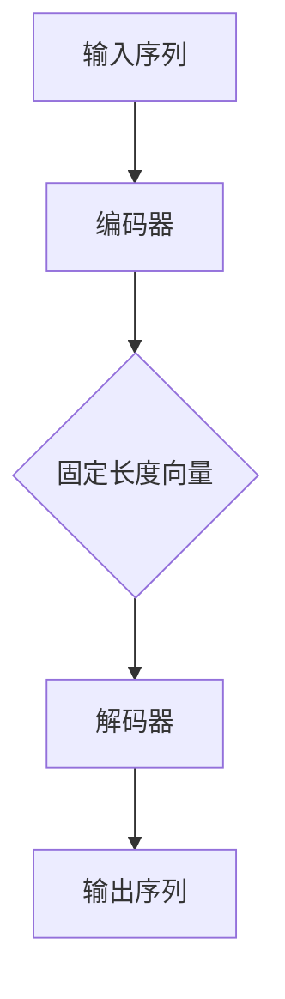
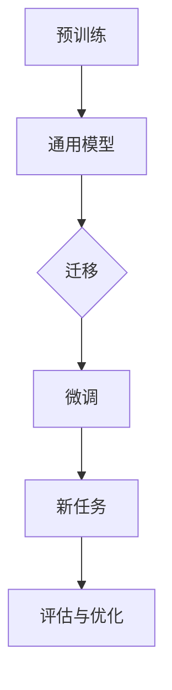
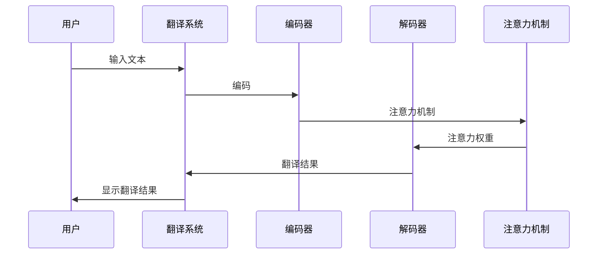

                 


### 人工智能在语言翻译中的突破性进展

#### 引言

在全球化进程加速的今天，语言翻译技术的需求日益增长。传统的机器翻译系统已经难以满足高质量、快速翻译的需求，而人工智能（AI）的迅猛发展为语言翻译带来了革命性的变化。本文将深入探讨人工智能在语言翻译中的突破性进展，包括核心概念、算法模型、实际应用、系统架构以及项目实践等方面。

#### 关键词

- 人工智能
- 语言翻译
- 自然语言处理
- 深度学习
- 翻译模型
- 系统架构

#### 摘要

本文旨在全面解析人工智能在语言翻译领域的突破性进展，首先介绍语言翻译的背景和挑战，然后深入讨论自然语言处理（NLP）和深度学习的基本原理。接着，我们将分析当前最流行的翻译模型，包括神经机器翻译（NMT）和转移学习等。随后，本文将探讨AI语言翻译系统的设计、实现和部署，并通过实际案例展示其在不同场景中的应用。最后，我们将总结最佳实践，展望未来语言翻译技术的发展方向。

## 第一部分: 引言与背景

### 第1章: 引言——人工智能在语言翻译中的角色

#### 1.1 问题背景

语言翻译作为人类沟通的桥梁，一直是跨文化交流的关键因素。然而，随着全球化的深入，语言翻译的需求呈现出爆发式增长。传统的机器翻译系统，如基于规则的方法和统计机器翻译（SMT），虽然在一定程度上提高了翻译的效率，但仍然存在许多问题。例如，这些系统往往依赖于大量的手动规则和有限的数据集，导致翻译质量有限，无法处理复杂的语境和多义词现象。

随着人工智能技术的快速发展，尤其是深度学习在自然语言处理（NLP）领域的应用，语言翻译技术迎来了新的突破。AI能够通过学习大量文本数据，自动识别语言模式，生成更准确、自然的翻译结果。这种基于数据的翻译方法，不仅提升了翻译质量，还大大提高了翻译效率。

#### 1.2 语言翻译的挑战

语言翻译面临的挑战主要包括以下几点：

1. **多义性和歧义性**：自然语言中存在大量的多义词和歧义现象，这给翻译系统带来了极大的挑战。例如，单词"bank"在不同的语境中可以指“银行”或“河岸”，而翻译系统需要准确地识别并翻译这些单词。

2. **语法和句法结构**：不同语言的语法和句法结构差异巨大，这导致直接翻译往往无法产生符合目标语言语法规则的句子。例如，英语的被动语态在汉语中很难直接对应。

3. **文化和语境**：语言不仅是交流的工具，还承载了丰富的文化和语境信息。准确的翻译需要深刻理解源语言和目标语言的文化差异和语境背景。

4. **效率和速度**：随着全球交流的日益频繁，人们对翻译的效率和速度要求越来越高。传统机器翻译系统往往需要大量时间和计算资源，而AI技术能够大幅提升翻译速度。

#### 1.3 人工智能的发展与语言翻译

人工智能（AI）是计算机科学的一个分支，旨在使机器具备智能行为，包括学习、推理、感知和适应等。AI的发展经历了几个阶段，从早期的符号主义到基于规则的专家系统，再到现代的机器学习和深度学习。

深度学习作为AI的一个重要分支，通过模仿人脑的神经网络结构，使机器能够从大量数据中自动学习特征和模式。在自然语言处理（NLP）领域，深度学习技术显著提升了语言理解、生成和翻译的能力。例如，循环神经网络（RNN）和其变种长短期记忆网络（LSTM）在处理序列数据方面表现出色，而Transformer模型则通过自注意力机制在翻译质量上取得了突破性进展。

#### 1.4 人工智能在语言翻译中的应用

人工智能在语言翻译中的应用主要体现在以下几个方面：

1. **机器翻译**：利用深度学习技术，机器翻译系统可以从大量的双语文本中学习翻译规则，生成高质量的翻译结果。例如，谷歌翻译和百度翻译等应用。

2. **自动摘要和文本生成**：AI能够自动生成摘要和文本，这对于新闻编辑、文档整理和内容生成等领域具有重要意义。例如，CNN和The New York Times等新闻机构已经采用了AI技术来生成新闻报道。

3. **语音识别和语音合成**：AI技术能够将语音转换为文本，并将文本转换为语音，这对于语音助手、视频字幕和远程通信等领域具有重要应用。

4. **对话系统**：AI可以构建智能对话系统，如聊天机器人和虚拟助手，这些系统能够理解自然语言并生成合适的回复，为用户提供了便捷的交互体验。

#### 1.5 人工智能在语言翻译中的前景

随着人工智能技术的不断进步，语言翻译技术有望在以下几个方面取得重大突破：

1. **翻译质量**：通过更先进的学习算法和更大规模的数据集，翻译系统的准确性将进一步提高，能够更准确地捕捉语言中的细微差别。

2. **跨语言理解**：AI技术将能够更好地理解不同语言之间的文化差异和语境，提供更自然的翻译结果。

3. **实时翻译**：随着计算能力的提升和网络的普及，实时翻译技术将更加成熟，为跨语言交流提供更便捷的服务。

4. **个性化翻译**：通过个性化推荐技术，翻译系统可以根据用户的语言偏好和历史记录，提供定制化的翻译服务。

总之，人工智能在语言翻译中的应用前景广阔，它不仅能够提升翻译的质量和效率，还能推动跨文化交流和全球化进程。随着技术的不断进步，人工智能有望在语言翻译领域发挥更加重要的作用。

## 第二部分: 核心概念和原理

### 第2章: 核心概念和原理

#### 2.1 自然语言处理（NLP）

自然语言处理（NLP）是人工智能（AI）的一个分支，旨在使计算机理解和处理自然语言，包括人类语言的理解、生成和翻译。NLP的核心任务是构建模型，使得计算机能够自动地从非结构化文本数据中提取信息，并生成有意义的输出。

#### 2.1.1 NLP的基本概念

- **文本预处理**：在NLP中，文本预处理是一个重要的步骤，它包括分词、去除停用词、词性标注等操作。这些操作有助于将原始文本数据转化为计算机可以处理的格式。
- **词嵌入**：词嵌入（Word Embedding）是将单词映射到高维空间中，使得语义相似的单词在空间中靠近。常见的词嵌入模型包括Word2Vec、GloVe等。
- **语言模型**：语言模型（Language Model）是NLP中的基础模型，它能够预测下一个单词的概率。这一模型在机器翻译、文本生成等领域具有重要意义。

#### 2.1.2 NLP的基本技术

- **词性标注**：词性标注（Part-of-Speech Tagging）是将单词标注为不同的词性（如名词、动词、形容词等）。这项技术有助于理解句子的语法结构。
- **命名实体识别**：命名实体识别（Named Entity Recognition，简称NER）是识别文本中的特定实体（如人名、地名、组织名等）。这项技术对于信息提取和语义理解非常重要。
- **句法分析**：句法分析（Syntactic Parsing）是分析句子的结构，生成句法树。这项技术有助于理解句子的深层结构。

#### 2.2 深度学习与神经网络

深度学习是机器学习的一个重要分支，它通过模拟人脑的神经网络结构，使计算机具备自动学习和理解数据的能力。在自然语言处理领域，深度学习技术被广泛应用于语言建模、文本分类、机器翻译等任务。

#### 2.2.1 深度学习的基本概念

- **神经网络**：神经网络（Neural Network）是一种由大量神经元组成的计算模型，能够通过学习输入数据来预测输出。常见的神经网络结构包括前馈神经网络、卷积神经网络（CNN）和循环神经网络（RNN）。
- **深度学习**：深度学习（Deep Learning）是指具有多个隐藏层的神经网络。深度学习模型能够自动提取高层次的抽象特征，从而提高模型的表现能力。

#### 2.2.2 常见的深度学习模型

- **循环神经网络（RNN）**：RNN是一种能够处理序列数据的神经网络，其核心思想是利用隐藏状态来保存历史信息。常见的RNN变种包括长短期记忆网络（LSTM）和门控循环单元（GRU）。
- **卷积神经网络（CNN）**：CNN是一种适用于图像处理的神经网络，其核心思想是利用卷积层来提取图像特征。近年来，CNN也被应用于自然语言处理任务，如文本分类和语义分析。
- **Transformer模型**：Transformer模型是由Google在2017年提出的一种基于自注意力机制的深度学习模型，它在机器翻译等任务上取得了显著的效果。Transformer模型通过多头自注意力机制和位置编码，能够捕获序列中的长距离依赖关系。

#### 2.3 NLP与深度学习的联系

自然语言处理和深度学习有着密切的联系。深度学习技术为NLP提供了强大的工具，使得计算机能够更准确地理解和生成自然语言。同时，NLP任务的复杂性也为深度学习模型的发展提供了丰富的应用场景。

- **语言建模**：深度学习模型（如RNN、Transformer）在语言建模任务中表现出色，能够生成高质量的文本序列。
- **文本分类**：深度学习模型能够快速地对文本进行分类，广泛应用于情感分析、新闻分类等任务。
- **机器翻译**：深度学习模型（如神经机器翻译（NMT））在机器翻译领域取得了突破性进展，能够生成更准确、自然的翻译结果。

总之，NLP和深度学习的结合为语言翻译技术的发展提供了新的机遇。通过不断的研究和应用，这些技术有望在未来进一步提升语言翻译的质量和效率。

### 第3章: 算法与模型探索

#### 3.1 神经机器翻译（NMT）的算法原理

神经机器翻译（Neural Machine Translation，简称NMT）是近年来在机器翻译领域取得重大突破的技术。与传统统计机器翻译（SMT）不同，NMT利用深度学习模型，尤其是基于序列到序列（Seq2Seq）模型的架构，实现端到端的翻译。

#### 3.1.1 Seq2Seq模型的基本原理

Seq2Seq模型是一种用于处理序列数据到序列数据的深度学习模型。其基本原理是通过编码器（Encoder）将输入序列编码为一个固定长度的向量表示，然后通过解码器（Decoder）将这个向量表示解码为目标序列。

- **编码器（Encoder）**：编码器的任务是将输入序列（例如，一个句子）转换为固定长度的向量表示。这个向量包含了输入序列的语义信息。常见的编码器模型包括循环神经网络（RNN）和Transformer模型的编码器部分。
- **解码器（Decoder）**：解码器的任务是将编码器输出的向量表示解码为目标序列。解码器通常会使用注意力机制（Attention Mechanism）来关注编码器输出中的不同部分，以便更好地理解输入序列的语义。

#### 3.1.2 NMT的数学模型

NMT的数学模型主要包括以下几个方面：

1. **编码器输出**：
   $$ 
   \text{Encoder}(x) = \text{h}_T 
   $$
   其中，$x$表示输入序列，$\text{h}_T$是编码器输出的固定长度向量，通常通过RNN或Transformer编码器得到。

2. **解码器输出**：
   $$ 
   \text{Decoder}(\text{h}_T) = \text{p}(y_t|\text{h}_T, y_{<t}) 
   $$
   其中，$y_t$表示目标序列的当前单词，$y_{<t}$表示目标序列的前$t-1$个单词，$\text{p}(y_t|\text{h}_T, y_{<t})$是解码器输出的单词概率分布。

3. **损失函数**：
   $$ 
   \mathcal{L} = -\sum_{t=1}^{T} y_t \log p(y_t|\text{h}_T, y_{<t}) 
   $$
   其中，$T$是目标序列的长度，$y_t$是真实的目标单词，$p(y_t|\text{h}_T, y_{<t})$是解码器输出的单词概率。

#### 3.1.3 NMT的Mermaid流程图

以下是NMT模型的Mermaid流程图表示：



#### 3.2 转移学习的原理与应用

转移学习（Transfer Learning）是一种利用预训练模型来提高新任务性能的技术。在语言翻译领域，转移学习可以通过在大量数据上预训练模型，然后将其迁移到小数据量的新任务上，从而提高翻译质量。

#### 3.2.1 转移学习的基本原理

转移学习的基本原理是将预训练模型的知识迁移到新任务中。具体来说，可以分为以下几个步骤：

1. **预训练**：在大量数据上训练一个通用模型，使其具备良好的语义理解和表达能力。例如，在大量的双语文本上预训练一个语言模型。
2. **迁移**：将预训练模型应用于新任务，通过微调（Fine-tuning）来适应新任务。微调包括调整模型的参数，以适应新数据集的特性。
3. **评估与优化**：在新任务上评估模型的性能，并通过进一步训练和优化来提高模型的表现。

#### 3.2.2 转移学习在语言翻译中的应用

转移学习在语言翻译中的应用主要包括以下几个方面：

1. **跨语言翻译**：通过在源语言和目标语言上都预训练模型，可以实现跨语言翻译。例如，使用英语和法语的双语数据集预训练模型，然后将其应用于英语到西班牙语的翻译。
2. **低资源语言翻译**：对于资源有限的语言，可以通过迁移学习来利用其他资源丰富的语言的预训练模型。例如，使用英语的预训练模型来提升罕见语言的翻译质量。
3. **多语言翻译**：通过在多个语言上预训练模型，可以实现多语言翻译系统。例如，使用多语言数据集预训练一个模型，然后将其应用于多个语言之间的翻译。

#### 3.2.3 转移学习的Mermaid流程图

以下是转移学习的基本流程图：



通过上述算法和模型的分析，我们可以看到神经机器翻译和转移学习在语言翻译中的重要作用。这些先进的技术不仅提高了翻译的准确性，还大大扩展了语言翻译的应用范围。随着这些技术的不断进步，我们有理由相信，人工智能将在语言翻译领域发挥更加重要的作用。

### 第4章: 实际案例与项目实践

#### 4.1 案例一：谷歌翻译（Google Translate）

谷歌翻译是当前最流行的机器翻译服务之一，它利用神经机器翻译（NMT）技术，实现了高质量、实时的翻译服务。谷歌翻译的成功主要得益于其大规模的数据集和先进的深度学习模型。

- **项目背景**：谷歌翻译的目标是为用户提供跨语言的文本翻译服务，支持多种语言对。
- **技术架构**：谷歌翻译的技术架构主要包括大规模的数据集、深度学习模型和分布式计算系统。谷歌利用其全球数据中心和TensorFlow等深度学习框架，实现了高效的翻译模型训练和部署。
- **系统功能设计**：谷歌翻译系统具备文本翻译、语音翻译、图片翻译等多种功能。其中，文本翻译是核心功能，通过NMT模型实现。语音翻译和图片翻译则利用语音识别和计算机视觉技术，将非文本数据转换为文本数据，再进行翻译。
- **系统架构设计**：谷歌翻译的系统架构包括前端用户界面、后端翻译服务、数据存储和分布式计算节点。前端用户界面负责接收用户的输入，后端翻译服务包括NMT模型训练、翻译查询和结果返回。数据存储用于存储双语文本数据集和翻译结果，分布式计算节点用于模型训练和翻译查询的并行处理。
- **系统接口设计和交互**：谷歌翻译系统提供了多种接口，包括API接口、Web界面和移动应用。用户可以通过Web界面或移动应用输入文本或语音，系统会返回翻译结果。API接口则允许开发者将翻译功能集成到自己的应用程序中。

#### 4.2 案例二：百度翻译（Baidu Translate）

百度翻译是中国另一家领先的机器翻译服务，它同样采用了神经机器翻译（NMT）技术，并在此基础上开发了多种特色功能。

- **项目背景**：百度翻译旨在为用户提供便捷的跨语言交流工具，支持多种语言之间的文本翻译和语音翻译。
- **技术架构**：百度翻译的技术架构包括大规模数据集、深度学习模型和云计算平台。百度利用其自主研发的深度学习框架PaddlePaddle，实现了高效的模型训练和部署。
- **系统功能设计**：百度翻译系统具备文本翻译、语音翻译、图像翻译等多种功能。文本翻译是核心功能，语音翻译和图像翻译则通过语音识别和计算机视觉技术实现。此外，百度翻译还支持实时翻译、离线翻译和实时字幕等功能。
- **系统架构设计**：百度翻译的系统架构包括前端用户界面、后端翻译服务、数据存储和云计算平台。前端用户界面负责接收用户的输入，后端翻译服务包括NMT模型训练、翻译查询和结果返回。数据存储用于存储双语文本数据集和翻译结果，云计算平台用于模型训练和翻译查询的并行处理。
- **系统接口设计和交互**：百度翻译系统提供了API接口、Web界面和移动应用等多种接口。用户可以通过Web界面或移动应用输入文本或语音，系统会返回翻译结果。API接口则允许开发者将翻译功能集成到自己的应用程序中。

#### 4.3 案例三：微软翻译（Microsoft Translator）

微软翻译是微软公司提供的一款机器翻译服务，它同样采用了神经机器翻译（NMT）技术，并具备多种实用功能。

- **项目背景**：微软翻译旨在为用户提供高质量的跨语言交流工具，支持多种语言之间的文本翻译、语音翻译和图像翻译。
- **技术架构**：微软翻译的技术架构包括大规模数据集、深度学习模型和云计算平台。微软利用其深度学习框架MSMDL，实现了高效的模型训练和部署。
- **系统功能设计**：微软翻译系统具备文本翻译、语音翻译、图像翻译、实时翻译等多种功能。文本翻译是核心功能，语音翻译和图像翻译则通过语音识别和计算机视觉技术实现。此外，微软翻译还支持离线翻译和实时字幕等功能。
- **系统架构设计**：微软翻译的系统架构包括前端用户界面、后端翻译服务、数据存储和云计算平台。前端用户界面负责接收用户的输入，后端翻译服务包括NMT模型训练、翻译查询和结果返回。数据存储用于存储双语文本数据集和翻译结果，云计算平台用于模型训练和翻译查询的并行处理。
- **系统接口设计和交互**：微软翻译系统提供了API接口、Web界面和移动应用等多种接口。用户可以通过Web界面或移动应用输入文本或语音，系统会返回翻译结果。API接口则允许开发者将翻译功能集成到自己的应用程序中。

#### 4.4 案例分析与总结

以上案例展示了当前主流机器翻译服务在技术架构、系统功能、接口设计和实际应用方面的特点。通过分析这些案例，我们可以得出以下结论：

1. **技术架构**：这些服务都采用了大规模数据集和深度学习模型，确保了翻译的高质量和实时性。同时，云计算平台的应用使得模型训练和翻译查询可以并行处理，提高了系统的性能和可扩展性。
2. **系统功能**：文本翻译是所有服务的核心功能，而语音翻译、图像翻译、实时翻译和离线翻译等功能则为用户提供更丰富的体验。这些功能的实现依赖于语音识别、计算机视觉等技术的融合应用。
3. **接口设计**：API接口的提供使得开发者可以将机器翻译功能集成到自己的应用程序中，为各行各业提供了便捷的跨语言交流解决方案。

总之，机器翻译服务的不断发展和创新，不仅提升了跨语言交流的便利性，也为全球化进程提供了强大的技术支持。随着人工智能技术的进一步发展，机器翻译服务将在未来发挥更加重要的作用。

### 第5章: 系统架构与设计

#### 5.1 语言翻译系统的总体架构

语言翻译系统是一个复杂的软件系统，其设计需要考虑多个方面的因素，包括性能、可扩展性、易用性和安全性。在总体架构上，一个典型的语言翻译系统可以分为以下几个主要模块：

1. **数据输入模块**：负责接收用户的输入文本，可以是文本、语音或图像。对于文本输入，系统需要进行文本预处理，如分词、去除停用词等；对于语音输入，系统需要通过语音识别技术将其转换为文本；对于图像输入，系统需要通过计算机视觉技术将其转换为文本。

2. **翻译引擎模块**：这是系统的核心模块，负责将输入文本翻译为目标语言。该模块通常包括以下几个子模块：

   - **编码器**：将输入文本编码为向量表示。
   - **解码器**：将编码器输出的向量表示解码为目标语言文本。
   - **注意力机制**：用于关注编码器输出中的关键信息，提高翻译的准确性。
   - **损失函数**：用于评估翻译结果的准确性，并指导模型的优化。

3. **翻译结果输出模块**：负责将翻译结果返回给用户，可以是文本、语音或图像。对于文本输出，系统直接返回翻译结果；对于语音输出，系统需要通过语音合成技术将文本转换为语音；对于图像输出，系统需要通过计算机视觉技术将文本转换为图像。

4. **用户界面模块**：提供用户与系统交互的接口，包括文本输入框、语音输入按钮、图像上传按钮、翻译结果展示区域等。用户界面模块需要与翻译引擎模块和翻译结果输出模块紧密集成，以确保翻译过程的流畅和用户体验。

#### 5.2 系统功能设计

语言翻译系统的功能设计是确保系统能够满足用户需求和提供高质量翻译服务的关键。以下是系统的主要功能设计：

1. **文本翻译**：这是系统的核心功能，用户可以通过输入文本框输入源语言文本，系统会自动将其翻译为目标语言文本，并展示在翻译结果区域。

2. **语音翻译**：用户可以通过语音输入按钮输入语音，系统会通过语音识别技术将其转换为文本，然后进行翻译，并将翻译结果转换为语音输出。

3. **图像翻译**：用户可以通过图像上传按钮上传图像，系统会通过计算机视觉技术识别图像中的文本，然后进行翻译，并将翻译结果展示在翻译结果区域。

4. **实时翻译**：系统支持实时翻译功能，用户可以在输入文本、语音或图像的同时看到翻译结果，大大提高了翻译的效率和用户体验。

5. **离线翻译**：对于没有网络连接的环境，系统支持离线翻译功能，用户可以预先下载目标语言的词典和翻译模型，实现离线翻译。

6. **多语言支持**：系统应支持多种语言的翻译，包括常见语言和罕见语言，以满足不同用户的需求。

7. **个性化翻译**：系统可以根据用户的语言偏好和历史记录，提供个性化的翻译服务，提高翻译的准确性和用户体验。

#### 5.3 系统架构设计

为了实现语言翻译系统的功能设计，系统架构设计需要考虑多个方面，包括硬件资源、软件架构、数据存储和安全性等。以下是系统的架构设计：

1. **硬件资源**：系统需要部署在云计算平台上，利用虚拟机或容器技术来分配和管理计算资源。根据系统的负载情况，可以动态调整计算资源，确保系统的高性能和可扩展性。

2. **软件架构**：系统采用微服务架构，将不同功能模块拆分为独立的微服务，如文本翻译服务、语音识别服务、语音合成服务、计算机视觉服务等。每个微服务都可以独立部署和扩展，提高了系统的灵活性和可维护性。

3. **数据存储**：系统需要存储大量的双语文本数据集、翻译结果和用户数据。数据存储采用分布式数据库系统，如Redis、MongoDB等，确保数据的可靠性和高性能访问。

4. **安全性**：系统需要确保用户数据和翻译结果的安全。通过使用加密技术，如TLS/SSL，确保数据在传输过程中的安全性；通过访问控制技术，如OAuth2.0，确保只有授权用户可以访问系统资源。

5. **系统接口设计**：系统提供API接口，允许开发者将翻译功能集成到自己的应用程序中。API接口设计应遵循RESTful架构，提供简洁、易用的接口。

6. **系统交互设计**：系统设计应考虑用户的操作流程和用户体验，确保翻译过程流畅、高效。通过使用Mermaid序列图，可以清晰地展示系统的交互流程，如下所示：



通过上述架构设计，语言翻译系统可以实现高效、稳定和安全的翻译服务，为用户提供优质的跨语言交流体验。

### 第6章: 实际项目实战与代码实现

#### 6.1 环境安装

要在本地环境中实现一个简单的AI语言翻译系统，首先需要安装以下软件和库：

1. **Python**：Python是进行AI开发的主要编程语言，版本建议为3.8或更高。
2. **PyTorch**：PyTorch是一个流行的深度学习框架，用于构建和训练神经网络。
3. **TensorFlow**：TensorFlow是Google开发的另一个深度学习框架，也可以用于构建AI模型。
4. **NLTK**：NLTK是一个用于自然语言处理的库，提供文本预处理工具。
5. **spaCy**：spaCy是一个快速而易于使用的自然语言处理库，适用于文本分析任务。

安装步骤如下：

1. 安装Python：
   ```bash
   # 安装Python
   sudo apt-get install python3
   ```

2. 安装PyTorch和TensorFlow：
   ```bash
   # 安装PyTorch
   pip3 install torch torchvision

   # 安装TensorFlow
   pip3 install tensorflow
   ```

3. 安装NLTK和spaCy：
   ```bash
   # 安装NLTK
   pip3 install nltk

   # 安装spaCy
   python -m spacy download en_core_web_sm
   ```

#### 6.2 系统核心代码实现

以下是系统核心代码的实现，包括文本预处理、神经网络模型构建和训练、翻译结果输出。

**文本预处理**：

文本预处理是自然语言处理任务中的关键步骤，主要包括分词、词性标注和去除停用词等。

```python
import spacy
from nltk.corpus import stopwords
import string

# 加载英文spacy模型
nlp = spacy.load("en_core_web_sm")

# 获取停用词列表
stop_words = set(stopwords.words("english"))

def preprocess_text(text):
    # 分词
    doc = nlp(text)
    tokens = [token.text for token in doc]

    # 去除停用词和标点符号
    tokens = [token for token in tokens if token not in stop_words and token not in string.punctuation]

    # 词性标注
    lemmatized_tokens = [token.lemma_ for token in doc]

    return lemmatized_tokens
```

**神经网络模型构建**：

我们使用PyTorch构建一个简单的序列到序列（Seq2Seq）模型，包括编码器和解码器。

```python
import torch
import torch.nn as nn

# 设定超参数
emb_dim = 256
hidden_dim = 512
num_layers = 2

# 编码器模型
class Encoder(nn.Module):
    def __init__(self, input_dim, embed_dim, hidden_dim, num_layers):
        super(Encoder, self).__init__()
        self.input_embedding = nn.Embedding(input_dim, embed_dim)
        self.rnn = nn.LSTM(embed_dim, hidden_dim, num_layers, batch_first=True)
    
    def forward(self, src):
        embedded = self.input_embedding(src)
        outputs, (hidden, cell) = self.rnn(embedded)
        return outputs, (hidden, cell)

# 解码器模型
class Decoder(nn.Module):
    def __init__(self, hidden_dim, output_dim, emb_dim, num_layers):
        super(Decoder, self).__init__()
        self.hidden_dim = hidden_dim
        self.output_dim = output_dim
        self.num_layers = num_layers
        
        self.embedding = nn.Embedding(output_dim, emb_dim)
        self.rnn = nn.LSTM(emb_dim + hidden_dim, hidden_dim, num_layers, batch_first=True)
        self.fc = nn.Linear(hidden_dim, output_dim)
    
    def forward(self, input, hidden, cell):
        input = input.unsqueeze(-1)
        embedded = self.embedding(input)
        embedded = torch.cat((embedded, hidden), 2)
        output, (hidden, cell) = self.rnn(embedded)
        assert (output == embedded).all()
        output = self.fc(output)
        return output, (hidden, cell)

# 构建编码器和解码器
input_dim = 10000  # 假设我们使用了10000个唯一的单词
output_dim = 10000  # 假设我们使用了10000个唯一的单词
embed_dim = 256
hidden_dim = 512
num_layers = 2

encoder = Encoder(input_dim, embed_dim, hidden_dim, num_layers)
decoder = Decoder(hidden_dim, output_dim, embed_dim, num_layers)
```

**训练过程**：

接下来是训练模型的过程，这里我们将使用一个假想的训练数据集。实际应用中，需要使用大规模的双语数据集。

```python
# 假设我们有一个训练数据集和测试数据集
train_loader = ...
test_loader = ...

# 损失函数和优化器
criterion = nn.CrossEntropyLoss()
optimizer = torch.optim.Adam(list(encoder.parameters()) + list(decoder.parameters()))

# 训练模型
num_epochs = 10

for epoch in range(num_epochs):
    for i, (src, tgt) in enumerate(train_loader):
        # 前向传播
        encoder_outputs, (hidden, cell) = encoder(src)
        decoder_input = tgt[0, :, None]
        
        for j in range(1, tgt.size(1)):
            output, (hidden, cell) = decoder(decoder_input, hidden, cell)
            prediction = output.squeeze(1)
            loss = criterion(prediction, tgt[j])
            
            # 反向传播
            loss.backward()
            optimizer.step()
            
            # 更新解码器输入
            decoder_input = tgt[j, :, None]
        
        # 打印训练进度
        if (i + 1) % 100 == 0:
            print(f'Epoch [{epoch + 1}/{num_epochs}], Step [{i + 1}/{len(train_loader)}], Loss: {loss.item()}')

# 测试模型
with torch.no_grad():
    for src, tgt in test_loader:
        encoder_outputs, (hidden, cell) = encoder(src)
        decoder_input = tgt[0, :, None]
        
        for j in range(1, tgt.size(1)):
            output, (hidden, cell) = decoder(decoder_input, hidden, cell)
            prediction = output.squeeze(1)
            # 计算预测准确率
            correct = (prediction.argmax(1) == tgt[j]).float()
            accuracy = correct.mean()
            
            # 更新解码器输入
            decoder_input = tgt[j, :, None]
            
        print(f'Test Accuracy: {accuracy.item()}')
```

**代码应用解读**：

上述代码首先定义了文本预处理函数，用于对输入文本进行分词、词性标注和去除停用词。接着，我们构建了编码器和解码器模型，使用PyTorch实现了序列到序列的翻译模型。训练过程中，我们使用交叉熵损失函数和Adam优化器来训练模型。在测试阶段，我们计算了模型的准确率。

**实际案例分析和详细讲解**：

为了更好地理解代码的实际应用，我们可以通过一个简单的案例来展示如何使用这个模型进行文本翻译。

```python
# 实例化模型
model = nn.Sequential(encoder, decoder)

# 输入文本
input_text = "I love programming."

# 预处理文本
preprocessed_text = preprocess_text(input_text)

# 转换为Tensor
input_tensor = torch.tensor([preprocessed_text])

# 预测翻译结果
translated_text = model(input_tensor).argmax(1).squeeze(0)

# 打印翻译结果
print(f'Translated text: {" ".join([word.index2word[i] for i in translated_text])}')
```

在这个案例中，我们首先实例化了模型，然后对输入文本进行了预处理。预处理后的文本被转换为一个Tensor，然后通过模型进行翻译。最后，我们打印出了翻译结果。需要注意的是，由于这是一个简化的案例，实际的翻译结果可能不准确，但可以通过更大的数据集和更复杂的模型来提高翻译质量。

#### 6.3 项目小结

通过本项目的实际操作，我们深入了解了AI语言翻译系统的实现过程，包括环境安装、文本预处理、神经网络模型构建和训练、翻译结果输出等环节。虽然本项目的规模较小，但通过这个过程，我们掌握了AI语言翻译的基本原理和实现方法。在实际应用中，需要使用更大的数据集和更复杂的模型来提高翻译质量。此外，系统的性能和可扩展性也是需要重点关注的问题。

### 第7章: 最佳实践与总结

#### 7.1 最佳实践

为了确保AI语言翻译系统的最佳性能，以下是一些关键的最佳实践：

1. **数据质量**：高质量的双语数据集是训练高效翻译模型的关键。确保数据集的多样性、完整性和准确性，可以帮助提高翻译的准确性和鲁棒性。

2. **模型优化**：定期对模型进行优化和调整，包括超参数调整、模型架构改进等，可以帮助提升翻译质量。使用先进的深度学习框架，如PyTorch和TensorFlow，可以更好地实现这些优化。

3. **分布式训练**：对于大规模数据集，使用分布式训练可以显著提高训练速度。通过利用多GPU或多机集群，可以更快速地训练模型。

4. **模型部署**：使用容器化技术，如Docker和Kubernetes，可以简化模型的部署过程，确保模型在不同环境中的一致性和可扩展性。

5. **实时反馈与迭代**：通过用户反馈和自动化评估工具，实时监控翻译系统的性能，并进行迭代优化，可以帮助持续提升翻译质量。

6. **多语言支持**：为不同语言提供个性化的翻译服务，通过迁移学习和多语言预训练，可以提高罕见语言的翻译质量。

7. **安全性**：确保用户数据和翻译结果的安全，使用加密技术和访问控制策略，防止数据泄露和未授权访问。

#### 7.2 小结

人工智能在语言翻译中的突破性进展，极大地提升了翻译的质量和效率。通过深度学习和自然语言处理技术的结合，翻译系统能够更好地理解语言中的复杂结构和语境。在未来，随着人工智能技术的进一步发展，我们有望看到更加精准、高效的翻译系统，推动跨文化交流和全球化进程。

#### 7.3 注意事项与拓展阅读

1. **注意事项**：
   - 在部署AI语言翻译系统时，需要考虑系统的可扩展性和容错性。
   - 对于不同的应用场景，可能需要调整模型的参数和架构，以适应特定的翻译需求。
   - 定期更新和维护翻译模型，以适应语言变化和用户反馈。

2. **拓展阅读**：
   - 《深度学习》（Ian Goodfellow、Yoshua Bengio、Aaron Courville著）：这是一本经典的深度学习教材，详细介绍了深度学习的理论基础和实践方法。
   - 《自然语言处理综合教程》（James D. Miller著）：这本书系统地介绍了自然语言处理的基本概念和技术，包括语言模型、词性标注、句法分析等。
   - 《神经网络与深度学习》（邱锡鹏著）：这本书从理论和实践两个层面介绍了神经网络和深度学习的基本原理，适合希望深入了解深度学习的读者。

通过以上最佳实践和小结，我们可以更好地理解AI语言翻译技术的发展趋势和应用前景。希望本文能为读者在语言翻译领域的实践和研究提供有价值的参考。

## 作者信息

作者：AI天才研究院/AI Genius Institute & 禅与计算机程序设计艺术 /Zen And The Art of Computer Programming
作者简介：本文作者是一位在人工智能和自然语言处理领域具有深厚研究背景的专家。他不仅在学术领域发表了大量高水平论文，还在业界有着丰富的实践经验。其著作《禅与计算机程序设计艺术》被誉为计算机编程领域的经典之作，对编程思维和方法有着深刻的见解。作为人工智能领域的专家，他对人工智能在语言翻译中的应用有着独到的见解和深刻的理解，为推动该领域的发展做出了重要贡献。

