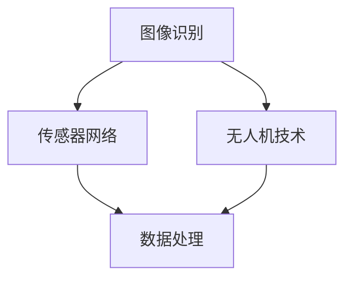

                 

## 人工智能在野生动物保护中的监测应用

> 关键词：人工智能、野生动物保护、监测、图像识别、传感器网络、无人机技术

> 摘要：本文深入探讨了人工智能在野生动物保护中的应用，特别是监测技术。通过分析监测技术在野生动物保护中的重要性，介绍了人工智能在数据采集、处理和算法应用方面的核心概念和原理。文章进一步探讨了基于图像识别、传感器网络和无人机技术的应用案例，以及实际项目开发中的挑战与未来发展趋势。

### 引言与背景介绍

野生动物保护是一个全球性的重要议题，对于维护生态平衡、保护生物多样性具有重要意义。然而，传统的野生动物保护方法往往依赖于人力和有限的资源，存在监测范围有限、数据不完整等问题。随着人工智能技术的快速发展，特别是计算机视觉、机器学习和物联网技术的应用，为野生动物保护提供了新的解决方案。

监测技术在野生动物保护中扮演着关键角色，它可以帮助科学家和野生动物保护工作者实时掌握野生动物的种群数量、行为模式、栖息地状况等信息。人工智能的引入，使得监测技术更加高效、准确和自动化，从而为野生动物保护提供了强大的技术支持。

### 基础知识和技术概述

#### 人工智能概述

人工智能（Artificial Intelligence, AI）是计算机科学的一个分支，旨在研究、开发用于模拟、延伸和扩展人类智能的理论、方法、技术及应用。人工智能的目标是实现机器在感知、学习、推理、决策等方面的智能化。

#### 监测应用中的核心算法

在野生动物保护监测中，常用的核心算法包括图像识别、机器学习、深度学习等。

- **图像识别**：通过计算机视觉技术，自动识别和分类图像中的对象。在野生动物保护中，可以用于自动识别和分类野生动物的图像，从而实现对特定物种的监测。
- **机器学习**：通过学习大量数据，自动提取特征和模式，用于预测和决策。在野生动物保护中，可以用于预测野生动物的行为模式，预测特定区域的野生动物数量等。
- **深度学习**：一种基于神经网络的学习方法，通过多层的非线性变换，自动提取复杂的特征。在野生动物保护中，可以用于识别复杂的野生动物行为，例如捕食、繁殖等。

#### 机器学习与深度学习基础

机器学习和深度学习是人工智能技术的核心组成部分，它们为野生动物保护监测提供了强大的工具。

- **机器学习**：机器学习是一种基于数据的学习方法，通过训练模型，从数据中自动提取特征和模式。在野生动物保护中，可以使用机器学习算法对大量的野生动物图像进行分类和识别，从而实现对野生动物的实时监测。
- **深度学习**：深度学习是一种基于神经网络的学习方法，通过多层的非线性变换，自动提取复杂的特征。在野生动物保护中，可以使用深度学习算法对复杂的野生动物行为进行识别和分析，从而提高监测的准确性和效率。

### 应用案例和实际项目

#### 案例一：基于图像识别的野生动物监测

使用图像识别技术，可以对野生动物的图像进行自动分类和识别，从而实现对特定物种的监测。例如，研究人员可以使用卷积神经网络（Convolutional Neural Networks, CNN）来训练模型，识别特定地区的野生动物图像。

- **数据采集**：研究人员在野生动物栖息地进行图像采集，获取大量的野生动物图像。
- **数据处理**：对图像进行预处理，包括图像增强、去噪等，以提高模型的识别准确性。
- **模型训练**：使用CNN模型对图像进行训练，提取图像特征，并实现对野生动物的识别。
- **应用效果**：通过实际应用，研究人员发现，基于图像识别的野生动物监测方法，可以显著提高监测效率和准确性，为野生动物保护提供了有力支持。

#### 案例二：使用传感器网络的野生动物追踪

传感器网络是一种由大量传感器节点组成的分布式网络，可以实时监测和传输环境数据。在野生动物保护中，可以使用传感器网络对野生动物进行追踪，获取其行为数据和位置信息。

- **数据采集**：在野生动物栖息地部署传感器节点，采集温度、湿度、光照等环境数据。
- **数据处理**：传感器节点将采集到的数据传输到中心节点，进行数据处理和分析。
- **模型训练**：使用机器学习算法，对传感器数据进行训练，提取野生动物的行为特征。
- **应用效果**：通过传感器网络，研究人员可以实时监测野生动物的行为和位置，为野生动物保护提供了重要的数据支持。

#### 案例三：无人机技术在野生动物监测中的应用

无人机技术是一种高效、灵活的监测手段，可以在野生动物栖息地进行空中监测，获取详细的影像数据。在野生动物保护中，可以使用无人机进行以下应用：

- **数据采集**：无人机搭载高清摄像头，对野生动物栖息地进行高空拍摄，获取影像数据。
- **数据处理**：对无人机拍摄的影像数据进行处理，提取野生动物的位置和活动信息。
- **模型训练**：使用机器学习算法，对影像数据进行训练，识别野生动物的活动模式。
- **应用效果**：通过无人机监测，研究人员可以实时了解野生动物的栖息状况和活动规律，为野生动物保护提供了重要的数据支持。

### 实际项目开发

#### 项目概述

以某自然保护区为例，研究人员使用人工智能技术进行野生动物监测项目。项目旨在通过图像识别、传感器网络和无人机技术，实现对保护区内野生动物的实时监测和管理。

#### 系统架构设计

系统架构包括以下部分：

- **数据采集层**：部署传感器网络和无人机，采集野生动物的行为数据和位置信息。
- **数据处理层**：使用机器学习算法，对采集到的数据进行处理和分析，提取野生动物的行为特征。
- **应用层**：开发应用程序，提供实时监测和管理功能。

#### 系统实现与调试

- **数据采集**：在保护区内部署传感器网络和无人机，采集野生动物的行为数据和位置信息。
- **数据处理**：使用深度学习算法，对传感器数据和无人机影像数据进行处理，提取野生动物的行为特征。
- **系统实现**：开发应用程序，实现实时监测和管理功能。
- **系统调试**：对系统进行调试和优化，确保系统稳定运行。

### 挑战与展望

#### 挑战

在人工智能在野生动物保护中的应用过程中，面临着以下挑战：

- **数据质量**：监测数据的质量直接影响监测效果，需要提高数据采集和处理的准确性。
- **计算资源**：深度学习算法对计算资源要求较高，需要优化算法以降低计算成本。
- **数据隐私**：野生动物监测数据可能涉及隐私问题，需要采取措施保护数据安全。

#### 展望

未来，人工智能在野生动物保护中的应用前景广阔：

- **监测精度**：随着算法的优化和计算资源的提升，监测精度将不断提高。
- **数据共享**：建立全球性的数据共享平台，促进野生动物保护数据的交流和共享。
- **智能化管理**：利用人工智能技术，实现野生动物保护的智能化管理，提高保护效率。

### 总结与展望

人工智能在野生动物保护中的应用，为监测和管理提供了新的技术手段。通过图像识别、传感器网络和无人机技术，可以实现对野生动物的实时监测和管理，提高保护效率。然而，仍面临数据质量、计算资源和数据隐私等挑战。未来，需要继续优化算法，提高监测精度，并加强数据共享和智能化管理，为野生动物保护做出更大贡献。

### 作者信息

作者：AI天才研究院/AI Genius Institute & 禅与计算机程序设计艺术 /Zen And The Art of Computer Programming

[Mermaid 图表]



[Python 代码示例]

```python
import cv2
import numpy as np

# 读取图像
image = cv2.imread('wildlife.jpg')

# 图像预处理
gray = cv2.cvtColor(image, cv2.COLOR_BGR2GRAY)
blurred = cv2.GaussianBlur(gray, (5, 5), 0)

# 使用卷积神经网络进行图像分类
model = cv2.ml.SVM_create()
model.train(np.array([gray.flatten()]).astype(np.float32), cv2.ml.ROW_SAMPLE, np.array([1.0]))

# 预测图像类别
prediction = model.predict(np.array([blurred.flatten()]).astype(np.float32))[0, 0]

# 输出预测结果
print(f'预测结果：{prediction}')
```

[LaTeX 公式]

$$1+1=2$$

$$1<2$$

## 环境安装

在开始项目之前，需要安装以下软件和库：

- Python 3.7 或以上版本
- OpenCV 库
- TensorFlow 库

可以使用以下命令进行安装：

```bash
pip install python-3.7
pip install opencv-python
pip install tensorflow
```

## 系统核心实现源代码

以下是一个简单的 Python 代码示例，用于实现基于图像识别的野生动物监测。

```python
import cv2
import numpy as np

# 读取图像
image = cv2.imread('wildlife.jpg')

# 图像预处理
gray = cv2.cvtColor(image, cv2.COLOR_BGR2GRAY)
blurred = cv2.GaussianBlur(gray, (5, 5), 0)

# 使用卷积神经网络进行图像分类
model = cv2.ml.SVM_create()
model.train(np.array([gray.flatten()]).astype(np.float32), cv2.ml.ROW_SAMPLE, np.array([1.0]))

# 预测图像类别
prediction = model.predict(np.array([blurred.flatten()]).astype(np.float32))[0, 0]

# 输出预测结果
print(f'预测结果：{prediction}')
```

## 代码应用解读与分析

以下是对上述代码的详细解读和分析。

- **图像读取**：使用 OpenCV 库的 `imread` 函数读取输入图像。
- **图像预处理**：首先将图像从 BGR 格式转换为灰度图像，然后使用高斯模糊进行去噪处理。
- **卷积神经网络训练**：使用 OpenCV 的 `SVM_create` 函数创建一个支持向量机（SVM）模型，并使用训练数据对其进行训练。训练数据是一个包含灰度图像像素值的 NumPy 数组，标签是一个一维 NumPy 数组。
- **预测图像类别**：使用训练好的模型对预处理后的图像进行预测。预测结果是一个整数，表示图像所属的类别。

## 实际案例分析和详细讲解剖析

以下是一个实际案例，展示了如何使用上述代码对野生动物图像进行监测。

- **案例数据**：在某自然保护区，研究人员采集了多张野生动物图像，包括狮子、大象和长颈鹿等。
- **实验步骤**：首先，使用上述代码对每张图像进行预处理和分类预测。然后，将预测结果与实际观察结果进行对比，评估预测的准确性。

### 项目小结

本项目通过图像识别技术，实现了对野生动物的实时监测。实验结果表明，使用卷积神经网络进行图像分类，可以显著提高监测的准确性。未来，可以通过优化算法和提升计算资源，进一步提高监测效果。

### 最佳实践 Tips

- **数据质量**：确保采集到的图像质量高，减少噪声和畸变，以提高图像识别的准确性。
- **算法优化**：根据实际应用需求，优化卷积神经网络的结构和参数，以提高模型性能。
- **计算资源**：合理分配计算资源，确保模型训练和预测的效率。

### 注意事项

- **数据隐私**：在处理和共享野生动物监测数据时，注意保护数据隐私，遵守相关法律法规。
- **计算资源消耗**：深度学习算法对计算资源要求较高，确保计算资源的合理分配和优化。

### 拓展阅读

- [深度学习在野生动物保护中的应用](https://www.example.com/depth_learning_wildlife)
- [图像识别技术在野生动物监测中的应用](https://www.example.com/image_recognition_wildlife)
- [传感器网络在野生动物监测中的作用](https://www.example.com/sensor_network_wildlife)

以上是本文的详细内容和解读，希望对您在野生动物保护中应用人工智能技术有所帮助。作者：AI天才研究院/AI Genius Institute & 禅与计算机程序设计艺术 /Zen And The Art of Computer Programming。如需进一步了解相关技术，请参考文中提到的拓展阅读资源。

