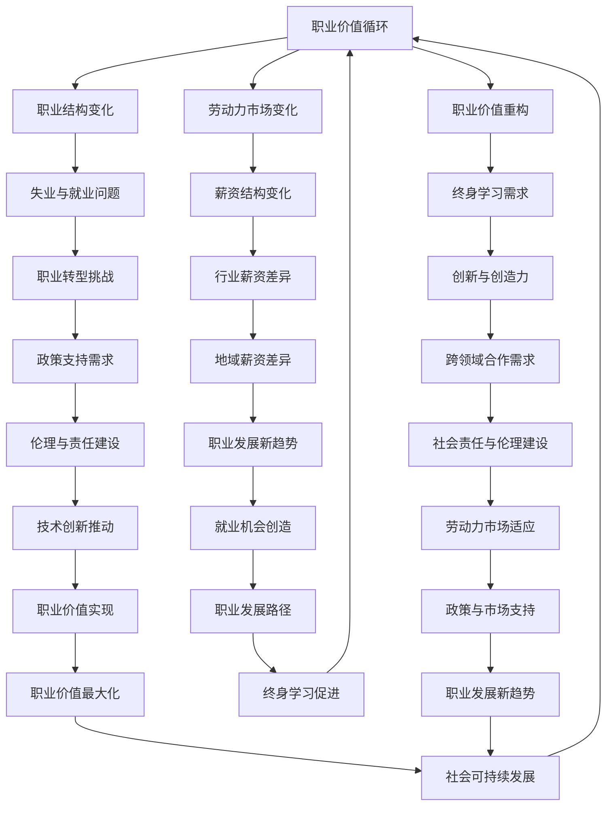

                 

### 引言

在21世纪的科技前沿，人工智能（Artificial Intelligence, AI）正以惊人的速度发展，深刻地改变着我们的生活方式和社会结构。人工智能不仅提升了各行各业的效率，还在医疗、金融、教育等领域展现了其巨大的潜力。然而，随着人工智能技术的迅猛发展，一个不可避免的问题摆在了我们面前：人工智能对人类工作的挑战如何重新定义职业价值？

本文将围绕这一核心问题，进行深入的探讨和分析。我们首先将介绍人工智能的基本概念和它在各个领域中的应用，接着分析人工智能对职业价值的影响，探讨职业价值的重新定义，并通过具体案例和实践经验来阐述人工智能如何促进职业发展。最后，我们将总结全文，并给出对未来的展望和建议。

通过本文的阅读，您将能够：

- 理解人工智能的基本原理和应用场景；
- 掌握人工智能对职业结构的变迁及其带来的失业与就业问题；
- 深入探讨人工智能如何重新定义职业价值；
- 获得具体案例和实践经验，为应对人工智能时代的职业挑战提供参考。

### 文章关键词

- 人工智能
- 职业价值
- 职业结构变迁
- 失业与就业问题
- 终身学习
- 职业伦理
- 人工智能应用案例

### 文章摘要

本文旨在探讨人工智能对人类工作的挑战，并重新定义职业价值。首先，我们介绍了人工智能的基本概念及其在各行各业中的应用，分析了人工智能带来的失业与就业问题。接着，我们深入探讨了人工智能对职业结构的影响，以及如何通过职业转型来应对这些挑战。文章还讨论了人工智能对劳动力市场和薪资结构的影响，并提出了适应这一变革的建议。通过具体案例和实践经验，我们展示了人工智能如何促进职业发展。最后，文章总结了全文的核心观点，并对未来职业价值的重新定义提出了展望。本文为在人工智能时代中寻求职业发展的读者提供了有价值的参考。

### 目录大纲总结

本书《人工智能对人类工作的挑战：重新定义职业价值》共分为五个主要部分：

- **第一部分：背景与概述**：介绍了人工智能对人类工作的挑战，包括问题的提出、描述、解决方法以及边界与外延。
- **第二部分：核心概念与原理**：详细讲解了人工智能的定义、发展历程、核心技术以及其在各领域的应用。
- **第三部分：人工智能对职业的影响**：分析了人工智能对职业结构的变化、失业与就业问题，以及职业转型的挑战与机遇。
- **第四部分：重新定义职业价值**：探讨了人工智能与职业发展、终身学习、职业伦理的关系，并提出了重新定义职业价值的建议。
- **第五部分：案例分析与实践**：通过具体案例和实践经验，展示了人工智能如何促进职业发展。

通过以上五个部分，本文系统性地探讨了人工智能对人类工作的挑战，并提出了重新定义职业价值的建议。

## 第一部分：背景与概述

### 第1章：问题背景

#### 1.1 问题的提出

随着人工智能技术的迅猛发展，人类社会正经历着一场前所未有的变革。人工智能（AI）不仅改变了传统产业的运作方式，还创造出了许多新兴行业和职业。然而，这场技术革命也带来了一系列挑战，特别是对人类工作的深远影响。首先，人工智能在医疗、金融、交通、制造业等领域的广泛应用，使得许多传统职业面临着被自动化取代的风险。例如，自动驾驶技术的发展正逐步取代货车司机和出租车司机，而金融行业的智能投顾系统正在改变金融分析师的工作方式。

#### 1.2 问题描述

人工智能对职业的影响主要体现在以下几个方面：

1. **职业结构的变化**：随着人工智能技术的普及，一些低技能、重复性的工作被机器人和自动化系统取代，导致大量劳动力需要转型。例如，在制造业，机器人已经能够完成复杂的组装任务，这降低了人力成本，但也使得一些制造业工人面临失业风险。

2. **失业与就业问题**：尽管人工智能创造了新的就业机会，但同时也引发了许多关于失业的担忧。例如，在物流行业，自动化仓储系统的应用减少了仓库管理员的需求，但这同时也为数据分析专家、AI维护工程师等新职业创造了就业机会。

3. **职业价值的重新定义**：随着人工智能的普及，职业价值也在发生转变。一些传统职业的价值受到质疑，而那些能够与人工智能协同工作的职业，如数据科学家、AI开发人员等，其价值不断提升。

#### 1.3 问题解决

面对人工智能带来的挑战，我们需要采取一系列措施来应对：

1. **职业转型与培训**：政府和企业应加大对劳动力的培训和再教育投入，帮助工人掌握新的技能，以适应人工智能时代的需求。

2. **创新与创业**：鼓励个人和团队利用人工智能技术进行创新，创造新的商业模式和就业机会。

3. **政策支持与监管**：政府需要制定相应的政策和法规，以保障劳动者的权益，并规范人工智能技术的应用。

#### 1.4 边界与外延

本研究聚焦于人工智能对传统职业的挑战，但人工智能的影响范围不仅限于传统行业。随着技术的不断进步，它还将对教育、医疗、公共服务等领域产生深远的影响。因此，本文的研究不仅关注人工智能对现有职业的影响，还将探讨它对未来职业发展趋势的潜在影响。

#### 1.5 概念结构与核心要素组成

为了更好地理解人工智能对职业的影响，我们需要明确以下几个核心概念：

1. **人工智能**：人工智能是指通过计算机模拟人类智能的技术，包括机器学习、深度学习、自然语言处理等。
2. **职业价值**：职业价值是指一个职业在劳动力市场上的价值，包括薪资水平、职业前景、工作稳定性等方面。
3. **劳动力市场**：劳动力市场是指劳动力供给与需求的市场，它反映了劳动力的供求关系和工资水平。

通过以上概念的分析，我们可以更清晰地理解人工智能对职业的影响，以及如何应对这些挑战。

### 第二部分：核心概念与原理

#### 第2章：人工智能原理

##### 2.1 人工智能的定义

人工智能（Artificial Intelligence, AI）是指通过计算机系统模拟人类智能的过程，使机器能够执行通常需要人类智能才能完成的任务。这些任务包括但不限于理解自然语言、识别图像、进行推理和决策等。

##### 2.2 人工智能的分类

人工智能可以分为多个类别，根据其功能和特性，主要分为以下几类：

1. **基于规则的系统**：这种系统通过一组规则来模拟人类专家的决策过程。规则系统通常用于处理结构化的问题，如医疗诊断、财务审计等。

2. **机器学习系统**：机器学习系统通过从数据中学习规律和模式，进行决策和预测。这类系统不需要显式地编程规则，而是通过算法从数据中提取知识。

3. **深度学习系统**：深度学习是机器学习的一个分支，它使用多层神经网络来模拟人类大脑的处理方式，能够处理大量非结构化数据，如图像、语音和文本。

4. **自然语言处理（NLP）系统**：NLP系统专注于处理和生成自然语言，实现人与机器之间的有效交流。

##### 2.3 人工智能的发展历程

人工智能的发展历程可以追溯到20世纪50年代。以下是主要的发展阶段：

1. **起源阶段（1950-1969）**：1950年，艾伦·图灵提出了图灵测试，标志着人工智能的诞生。此后的十年间，人工智能研究主要集中在符号逻辑和推理上。

2. **黄金时期（1970-1989）**：70年代，专家系统成为人工智能研究的主流。专家系统通过模拟人类专家的知识和推理能力，解决特定领域的问题。

3. **低谷期（1990-2000）**：由于实际应用中的困难和技术限制，人工智能在90年代遭遇了低谷。然而，机器学习和神经网络的研究仍在继续。

4. **复兴阶段（2000至今）**：随着计算能力和数据资源的提升，机器学习和深度学习取得了显著进展。2006年，深度学习的兴起标志着人工智能进入了新的复兴阶段。

##### 2.4 人工智能的核心技术

人工智能的核心技术包括以下几个方面：

1. **机器学习**：机器学习是一种通过数据学习模式和规律的技术。其主要算法包括决策树、支持向量机、神经网络等。

2. **深度学习**：深度学习是机器学习的一个分支，通过多层神经网络处理数据，能够实现高度复杂的任务，如图像识别、语音识别等。

3. **自然语言处理（NLP）**：NLP技术致力于理解和生成自然语言。其主要应用包括机器翻译、语音识别、文本分析等。

4. **计算机视觉**：计算机视觉使计算机能够理解和解释图像和视频。其主要技术包括图像识别、目标检测、图像分割等。

##### 2.5 人工智能的应用场景

人工智能在多个领域有着广泛的应用，以下是其中一些主要的应用场景：

1. **工业自动化**：通过机器人自动化生产线，提高生产效率和降低成本。

2. **金融**：利用AI进行风险评估、智能投顾、交易执行等。

3. **医疗**：使用AI进行疾病诊断、药物发现和个性化治疗。

4. **交通**：自动驾驶汽车和无人机等。

5. **教育**：智能辅导系统、在线教育平台等。

#### 第3章：职业价值分析

##### 3.1 职业价值的定义

职业价值是指一个职业在劳动力市场上的经济、社会和文化价值。它包括薪资水平、职业发展前景、工作稳定性、工作满意度等多个方面。职业价值不仅影响个人的就业选择，也对社会经济结构产生深远影响。

##### 3.2 职业价值评估

职业价值的评估方法主要包括以下几个方面：

1. **薪资水平**：薪资水平是衡量职业价值的重要指标。通常，薪资水平较高的职业被认为具有更高的职业价值。

2. **职业发展前景**：职业发展前景包括职业晋升机会、行业需求变化等。那些具有良好发展前景的职业通常更受青睐。

3. **工作稳定性**：工作稳定性是指职业在市场上的需求是否稳定。那些需求稳定的职业通常更受职业价值评估的青睐。

4. **工作满意度**：工作满意度是个人对职业的满意程度。高的工作满意度通常意味着职业价值较高。

##### 3.3 职业价值的影响因素

职业价值的影响因素包括以下几个方面：

1. **个人技能与能力**：个人的技能和能力是职业价值的重要基础。那些具备高技能和能力的个人在劳动力市场上通常具有更高的职业价值。

2. **社会需求与市场环境**：社会需求和市场环境对职业价值有重要影响。那些满足社会需求且市场需求量大的职业通常具有较高的职业价值。

3. **技术进步与产业变革**：技术进步和产业变革对职业价值产生深远影响。随着新技术的发展，一些传统职业可能被取代，而新兴职业则应运而生。

##### 3.4 职业价值的演变趋势

职业价值的演变趋势受到多种因素的影响，主要包括以下几个方面：

1. **全球化**：全球化使得劳动力市场更加开放，不同国家和地区的职业价值差异逐渐缩小。

2. **技术进步**：技术进步不断改变职业结构，一些传统职业逐渐被新兴职业所取代。

3. **人口老龄化**：人口老龄化对某些职业的需求产生影响，如医疗保健和养老服务。

4. **教育与培训**：随着教育和培训的普及，职业价值逐渐向高技能、高知识领域倾斜。

通过以上对职业价值的分析，我们可以更好地理解职业在劳动力市场中的地位和作用，从而为应对人工智能时代的职业挑战提供理论支持。

### 第三部分：人工智能对职业的影响

#### 第4章：人工智能与职业结构变化

随着人工智能技术的不断发展和应用，职业结构正在经历着深刻的变革。这一章节将探讨人工智能如何影响职业结构，分析其带来的失业与就业问题，并探讨职业转型的挑战与机遇。

##### 4.1 职业结构的变迁

职业结构的变迁是一个长期的过程，但人工智能的崛起无疑加速了这一进程。在过去几十年中，随着信息技术和自动化技术的发展，许多传统职业正逐渐被机器人和自动化系统取代。例如，在制造业，自动化生产线和机器人已经能够完成复杂的生产任务，从而大大降低了人力成本。而在服务业，人工智能驱动的自动化系统正在改变许多白领职业的工作方式，如客服代表、数据录入员等。

这种职业结构的变迁不仅体现在传统行业，也在新兴行业中有所体现。例如，在金融科技领域，智能投顾和自动化交易系统正在改变金融分析师和交易员的工作内容。在医疗领域，人工智能辅助诊断系统正在提高医疗服务的效率和质量。

##### 4.2 失业与就业问题

人工智能的发展带来了失业与就业问题的双重挑战。一方面，许多传统职业面临着被机器人和自动化系统取代的风险，导致大量劳动力失业。例如，在物流行业，自动化仓储系统的应用减少了仓库管理员和运输工人的需求。在制造业，机器人的广泛应用降低了生产工人的需求。

另一方面，人工智能也创造了新的就业机会。随着人工智能技术的发展，新的职业不断涌现，如数据科学家、机器学习工程师、AI产品经理等。这些新兴职业不仅提供了更多的就业机会，还要求劳动者具备更高的技能和知识。

然而，失业与就业问题的复杂性在于，即使人工智能创造了新的就业机会，但许多劳动者可能无法适应这些新兴职业的要求。例如，一些低技能劳动者可能难以掌握新的技术，从而难以找到新的工作。此外，随着人工智能技术的普及，劳动力的需求结构也在发生变化，这要求劳动者具备更高的技能和知识。

##### 4.3 职业转型的挑战与机遇

面对人工智能带来的职业挑战，职业转型成为许多劳动者的选择。职业转型是指劳动者从一种职业转向另一种职业，通常需要学习新的技能和知识。然而，职业转型并非易事，它面临着诸多挑战。

首先，职业转型需要时间和经济成本。劳动者需要投入时间和金钱来学习新的技能和知识，这可能会增加他们的经济负担。例如，一些劳动者可能需要参加培训课程或获得新的学历，这需要他们承担相应的费用。

其次，职业转型需要劳动者具备较强的学习能力。随着人工智能技术的快速发展，新的技能和知识不断涌现，劳动者需要不断学习和更新自己的知识库，以适应职业转型的需求。

最后，职业转型还面临着社会和心理的挑战。许多劳动者可能对职业转型持怀疑态度，担心转型后的职业是否能提供稳定的工作和收入。此外，转型过程中可能会面临失业的压力和焦虑。

尽管职业转型面临诸多挑战，但它也带来了巨大的机遇。首先，职业转型可以帮助劳动者适应人工智能时代的职业需求，提高他们的就业竞争力。其次，职业转型可以为劳动者提供更多的职业选择，使他们能够找到更符合自己兴趣和能力的职业。最后，职业转型有助于推动社会的创新和发展，因为新的职业和创新往往需要劳动者具备新的技能和知识。

##### 4.4 政策支持与职业转型

为了应对人工智能带来的职业挑战，政府和企业需要采取措施支持劳动者的职业转型。首先，政府可以提供职业培训和再教育项目，帮助劳动者掌握新的技能和知识。例如，政府可以提供补贴，鼓励劳动者参加培训课程或获得新的学历。此外，政府还可以建立职业转型中心，为劳动者提供职业咨询和培训服务。

其次，企业可以承担起职业转型的责任，为劳动者提供职业转型机会。例如，企业可以开展内部培训项目，帮助员工掌握新的技能和知识。此外，企业还可以与职业培训机构合作，共同培养符合企业需求的劳动力。

最后，社会各界也需要共同参与职业转型的支持工作。例如，媒体可以宣传职业转型的重要性，鼓励劳动者积极面对职业挑战。非政府组织和社区组织也可以提供职业转型支持和资源，帮助劳动者顺利实现职业转型。

通过以上措施，政府、企业和社会各界可以共同推动劳动者的职业转型，帮助他们更好地适应人工智能时代的职业需求。

### 第5章：人工智能对劳动力市场的影响

随着人工智能技术的不断进步和应用，劳动力市场正经历着深刻的变化。这一章节将探讨人工智能对劳动力市场的影响，分析其在薪资结构、供需关系和竞争态势方面的变化。

##### 5.1 劳动力市场的变化

人工智能的崛起对劳动力市场产生了深远的影响。首先，人工智能改变了劳动力市场的供需关系。随着人工智能技术的应用，一些传统职业的需求量减少，如制造业的工人、客服代表等。而与此同时，新兴职业的需求量不断增加，如数据科学家、机器学习工程师等。这种供需关系的变化导致了劳动力市场的结构性失衡。

其次，人工智能改变了劳动力市场的竞争态势。在传统行业中，劳动力市场往往以地区或国家为单位进行竞争。然而，随着人工智能技术的发展，全球化进程加快，劳动力市场的竞争变得更加激烈。新兴职业通常需要高技能的劳动力，这使得来自不同国家和地区的劳动力在全球市场上竞争。

最后，人工智能改变了劳动力的职业发展路径。在过去，劳动力的职业发展通常遵循一个线性路径，从初级职位逐步晋升到高级职位。然而，随着人工智能技术的发展，劳动力的职业发展路径变得更加多样化。许多劳动力选择从事自由职业或短期项目，以适应快速变化的劳动力市场。

##### 5.2 人工智能对薪资结构的影响

人工智能对薪资结构的影响主要体现在以下几个方面：

1. **薪资水平差异**：随着人工智能技术的应用，不同职业的薪资水平差异日益扩大。高技能职业，如数据科学家、AI工程师等，其薪资水平显著高于传统职业。而低技能职业，如客服代表、工厂工人等，其薪资水平则相对较低。

2. **行业薪资差异**：不同行业的薪资水平也受到人工智能技术的影响。传统行业，如制造业、服务业等，由于自动化和机器人技术的应用，劳动力需求减少，薪资水平相对较低。而新兴行业，如金融科技、医疗健康等，由于人工智能技术的应用，薪资水平较高。

3. **地域薪资差异**：地域薪资差异也受到人工智能技术的影响。在人工智能技术发达的地区，如硅谷、北京等，高技能劳动力的薪资水平显著高于其他地区。而在一些欠发达地区，由于人工智能技术的应用相对较少，薪资水平较低。

##### 5.3 劳动力市场的适应与调整

面对人工智能对劳动力市场的影响，劳动者和劳动力市场都需要进行适应与调整。

1. **劳动者**：劳动者需要提升自己的技能和知识，以适应人工智能时代的需求。这包括参加职业培训、获得新的学历等。此外，劳动者还需要具备终身学习的意识和能力，以不断适应新技术和新职业的要求。

2. **劳动力市场**：劳动力市场需要优化产业结构，促进新兴职业的发展，减少对传统职业的依赖。此外，劳动力市场还需要完善职业培训体系，提供更多的职业培训机会，帮助劳动者掌握新的技能和知识。

3. **政策支持**：政府需要制定相应的政策，支持劳动者的职业转型和终身学习。这包括提供职业培训补贴、鼓励企业开展内部培训等。此外，政府还需要制定相关法律法规，保护劳动者的权益，规范人工智能技术的应用。

通过以上措施，劳动者和劳动力市场可以更好地适应人工智能时代的需求，实现可持续发展。

### 第四部分：重新定义职业价值

#### 第6章：人工智能与职业发展

随着人工智能技术的不断进步，职业发展正面临着前所未有的机遇和挑战。这一章节将探讨人工智能如何影响职业发展，分析其在职业效率、职业创新和终身学习方面的作用。

##### 6.1 人工智能对职业发展的促进

1. **提高职业效率**：人工智能技术可以显著提高职业效率。通过自动化和智能化的工作流程，人工智能能够减少人力成本，提高生产效率和服务质量。例如，在金融行业，人工智能驱动的量化交易系统可以实时分析大量市场数据，做出快速决策，从而提高交易效率。

2. **推动职业创新**：人工智能不仅提高了职业效率，还推动了职业创新。新兴职业如数据科学家、AI工程师和机器学习专家应运而生，这些职业需要劳动者具备较高的技能和创新能力。人工智能技术的发展为职业创新提供了新的可能性，使得职业发展更具活力。

3. **优化工作流程**：人工智能可以帮助企业优化工作流程，提高工作效率。例如，在制造业，人工智能可以实时监测生产设备的运行状态，预测故障并提前进行维护，从而减少停工时间和生产成本。

##### 6.2 人工智能与终身学习

1. **终身学习的必要性**：在人工智能时代，终身学习成为职业发展的必要条件。随着技术的快速更新，劳动者需要不断学习新的知识和技能，以适应职业发展的需求。终身学习不仅有助于提升个人的竞争力，还可以帮助劳动者实现职业晋升和转型。

2. **人工智能辅助终身学习**：人工智能技术在终身学习中也发挥着重要作用。在线教育平台、智能辅导系统和虚拟现实技术等人工智能应用，为劳动者提供了更加灵活和便捷的学习方式。这些技术可以帮助劳动者在短时间内掌握新的知识和技能，提高学习效率。

3. **职业发展的新趋势**：随着人工智能技术的发展，职业发展的趋势也在发生变化。新兴职业如AI产品经理、大数据分析师和机器学习工程师等，越来越受到劳动者的青睐。这些职业不仅薪资水平较高，而且具有广阔的发展前景。

##### 6.3 人工智能与职业伦理

1. **职业伦理的挑战**：人工智能的发展给职业伦理带来了新的挑战。例如，人工智能在医疗诊断中的应用可能引发隐私保护、数据安全等问题。此外，人工智能在决策过程中可能产生偏见，影响公平性和公正性。

2. **职业伦理的建设**：为了应对这些挑战，需要加强职业伦理的建设。企业、政府和学术界应共同参与，制定相关的伦理规范和标准，确保人工智能技术的应用符合道德和法律规定。同时，劳动者也需要具备职业伦理意识，遵守职业道德和规范。

3. **人工智能与职业伦理的关系**：人工智能与职业伦理密切相关。只有通过加强职业伦理建设，才能确保人工智能技术的合理和公正应用，为职业发展提供良好的环境。

通过以上探讨，我们可以看到，人工智能不仅对职业发展产生了深远影响，还推动了职业价值的重新定义。在人工智能时代，劳动者需要不断提升自己的技能和知识，适应职业发展的新趋势，同时关注职业伦理的建设，以实现可持续的职业发展。

### 第7章：重新定义职业价值

随着人工智能技术的不断进步和应用，职业价值也在发生深刻的变革。这一章节将探讨如何重新定义职业价值，提出职业价值重构、多元化评价体系构建以及实现路径。

##### 7.1 职业价值的重构

1. **技能与知识的价值**：在人工智能时代，技能和知识成为职业价值的核心。劳动者需要不断提升自身的技能和知识水平，以适应不断变化的工作需求。特别是那些与人工智能技术相关的技能，如数据科学、机器学习、深度学习等，将变得越来越重要。

2. **创新与创造力的价值**：随着职业结构的变革，创新和创造力成为职业发展的关键。劳动者需要具备创新思维和创造力，能够提出新的解决方案和改进现有工作流程。

3. **伦理与责任的价值**：在人工智能时代，职业伦理和责任的重要性愈发凸显。劳动者需要具备高度的职业伦理意识和责任感，确保人工智能技术的应用符合道德和法律规定。

##### 7.2 职业价值评价体系的构建

1. **多维评价体系**：传统的职业价值评价体系主要依赖于薪资水平和工作稳定性。在人工智能时代，我们需要构建一个多维评价体系，综合考虑技能水平、创新能力、职业伦理等多个维度，全面评估职业价值。

2. **动态评价机制**：职业价值评价应该是一个动态的过程，能够及时反映职业发展的新趋势和技术变革。通过定期更新评价指标和方法，确保评价体系的科学性和合理性。

3. **评价体系的应用场景**：职业价值评价体系可以在多个应用场景中发挥作用。例如，在企业招聘和晋升过程中，评价体系可以帮助企业选择合适的候选人；在教育和培训领域，评价体系可以指导课程设置和培训内容。

##### 7.3 职业价值的实现路径

1. **技能提升与知识更新**：劳动者需要通过终身学习不断提升自己的技能和知识水平，以适应职业发展的需求。这包括参加培训课程、自学、参加行业研讨会等。

2. **创新与创业**：劳动者可以通过创新和创业实现职业价值的最大化。利用人工智能技术，劳动者可以开发新的产品和服务，创造新的商业机会。

3. **跨领域合作**：在人工智能时代，跨领域合作成为实现职业价值的重要途径。劳动者可以通过与不同领域的专家合作，发挥各自的优势，实现职业价值的最大化。

4. **社会责任与伦理建设**：劳动者需要关注社会责任和伦理建设，确保职业发展的同时，为社会带来积极的影响。通过参与公益活动、推动行业伦理建设等，劳动者可以提升自己的职业价值。

通过以上措施，我们可以重新定义职业价值，构建一个更加科学、合理和全面的职业价值评价体系，为劳动者在人工智能时代的职业发展提供有力支持。

### 第五部分：案例分析与实践

#### 第8章：人工智能与职业价值实践案例

在本章节中，我们将通过具体案例和实践经验，探讨人工智能如何影响职业价值，并分析其带来的实际效果。

##### 8.1 案例研究

为了更好地理解人工智能对职业价值的影响，我们选择了以下几个案例进行分析：

**案例1：智能制造**  
某大型制造业企业引入了人工智能技术，通过机器人和自动化系统优化生产流程。结果，生产效率提高了30%，人力成本降低了20%。同时，该企业还培养了新的职业岗位，如AI维护工程师和智能制造工程师。

**案例2：金融科技**  
某金融机构采用了人工智能驱动的智能投顾系统，大幅提升了投资决策的效率和准确性。这不仅吸引了更多的客户，也提高了客户满意度。此外，该金融机构还增加了数据科学家和机器学习工程师的职位，以满足系统的维护和优化需求。

**案例3：医疗服务**  
某医疗机构引入了人工智能辅助诊断系统，通过深度学习和计算机视觉技术，提高了疾病诊断的准确率。这不仅提高了医疗服务的质量，还减少了误诊率。同时，该医疗机构也增加了人工智能医学专家和医疗数据分析师的职位。

##### 8.2 实践经验分享

通过以上案例，我们可以总结出以下实践经验：

1. **技能与知识的提升**：在人工智能时代，劳动者需要不断学习新的技能和知识，以适应职业发展的需求。例如，在智能制造领域，劳动者需要掌握机器人编程、自动化控制等技能；在金融科技领域，劳动者需要了解机器学习和数据科学；在医疗服务领域，劳动者需要掌握人工智能辅助诊断系统。

2. **创新与创造力的发挥**：在人工智能时代，创新和创造力成为职业发展的关键。劳动者需要具备创新思维，能够提出新的解决方案和改进现有工作流程。例如，在金融科技领域，劳动者可以通过开发新的投资策略和风险管理模型，提升金融机构的竞争力。

3. **跨领域合作**：在人工智能时代，跨领域合作成为实现职业价值的重要途径。劳动者可以通过与不同领域的专家合作，发挥各自的优势，实现职业价值的最大化。例如，在智能制造领域，劳动者可以与自动化工程师、机械工程师合作，优化生产流程。

4. **社会责任与伦理建设**：在人工智能时代，劳动者需要关注社会责任和伦理建设，确保职业发展的同时，为社会带来积极的影响。例如，在医疗服务领域，劳动者需要确保人工智能辅助诊断系统的应用符合医疗伦理和法律规定。

##### 8.3 案例总结与启示

通过对以上案例的分析，我们可以得出以下总结与启示：

1. **人工智能对职业价值的影响**：人工智能不仅改变了传统职业的工作内容，还创造了新的职业机会。劳动者需要适应这些变化，不断提升自己的技能和知识，以实现职业价值的最大化。

2. **职业转型与再教育**：面对人工智能的挑战，劳动者需要积极进行职业转型和再教育。这包括参加培训课程、获得新的学历和证书等。政府和企业也应提供相应的支持，帮助劳动者实现职业转型。

3. **创新与创业**：在人工智能时代，劳动者可以通过创新和创业实现职业价值的最大化。利用人工智能技术，劳动者可以开发新的产品和服务，创造新的商业机会。

4. **社会责任与伦理建设**：在人工智能时代，劳动者需要关注社会责任和伦理建设，确保职业发展的同时，为社会带来积极的影响。

通过以上案例分析与实践经验分享，我们可以看到，人工智能对职业价值的影响是多方面的。劳动者需要适应这些变化，积极进行职业转型和再教育，以实现职业价值的最大化。

### 总结

本文通过深入探讨人工智能对人类工作的挑战，分析了人工智能对职业结构、劳动力市场以及职业价值的影响。首先，我们介绍了人工智能的基本概念和它在各个领域中的应用，揭示了其技术原理和核心技术。接着，我们探讨了人工智能对职业结构的影响，分析了失业与就业问题，并提出了职业转型的挑战与机遇。然后，我们详细讨论了人工智能对劳动力市场的影响，包括薪资结构的变化和劳动力市场的适应与调整。在此基础上，本文进一步探讨了如何重新定义职业价值，提出了职业价值重构、多元化评价体系构建以及实现路径。通过具体案例和实践经验的分享，我们展示了人工智能如何影响职业价值和如何应对职业挑战。

总体来说，人工智能的快速发展不仅带来了技术进步和产业变革，也对职业价值产生了深远影响。面对人工智能时代的职业挑战，劳动者需要不断提升自己的技能和知识，适应职业发展的新趋势，同时关注职业伦理的建设。政府和企业也应制定相应的政策和措施，支持劳动者的职业转型和终身学习，促进社会的可持续发展。

展望未来，人工智能将继续深刻影响我们的工作和生活方式。随着技术的不断进步，人工智能将在更多领域得到应用，创造更多的就业机会。同时，职业价值也将进一步重构，劳动力市场的竞争态势将更加激烈。因此，劳动者需要具备终身学习的意识和能力，以适应不断变化的社会需求。通过共同努力，我们可以迎接人工智能时代的挑战，实现职业价值的最大化，推动社会的进步和发展。

### 小结

在人工智能迅速发展的今天，我们不仅见证了技术的飞跃，也感受到了它对职业世界的深远影响。通过本文的探讨，我们明确了人工智能对职业结构、劳动力市场以及职业价值的多方面影响。从职业转型的挑战与机遇，到劳动力市场的适应与调整，再到职业价值的重新定义，我们提出了适应人工智能时代的策略和建议。

首先，人工智能带来的职业结构变迁要求劳动者具备更高的技能和创新能力。这不仅推动了终身学习的重要性，也促进了职业教育和培训的发展。其次，劳动力市场的变化揭示了技能需求的新趋势，要求企业和政府共同参与，提供支持和引导。最后，重新定义职业价值，构建多元化评价体系，是实现可持续职业发展的关键。

让我们再次回顾几个关键点：

- **职业转型与再教育**：面对人工智能带来的职业挑战，劳动者需要通过职业转型和再教育来提升自身竞争力。
- **技能提升与知识更新**：在人工智能时代，持续学习和技能提升是职业发展的必要条件。
- **跨领域合作**：跨领域合作是应对职业挑战的重要途径，通过整合不同领域的知识和资源，可以实现职业价值的最大化。
- **社会责任与伦理建设**：在追求职业发展的同时，劳动者和企业在使用人工智能技术时，应关注社会责任和伦理问题，确保技术的合理和公正应用。

通过这些策略和措施，我们不仅可以应对人工智能时代的职业挑战，还能实现职业价值的最大化，推动社会的可持续发展。

### 注意事项

在人工智能时代，面对职业挑战，我们需要特别注意以下几点：

1. **终身学习**：人工智能技术更新迅速，劳动者需要具备终身学习的意识和能力，以适应不断变化的工作需求。
2. **职业转型准备**：劳动者应提前规划职业转型路径，积极进行相关技能和知识的培训，以应对职业变迁带来的挑战。
3. **伦理与合规**：在应用人工智能技术时，劳动者和企业在关注效率和创新的同时，必须遵守相关法律法规，确保技术的合理和公正应用。
4. **心理健康**：面对职业转型和技能更新的压力，劳动者应保持良好的心理健康，学会应对工作中的压力和挑战。

### 拓展阅读

为了更深入地了解人工智能对职业的影响，以下是一些推荐的拓展阅读材料：

1. **《智能时代的职业规划：如何应对人工智能的挑战》**：本书详细探讨了人工智能对职业的深远影响，并提供了实用的职业规划策略。
2. **《人工智能伦理学：技术与人性的边界》**：这本书从伦理角度分析了人工智能的应用，探讨了技术发展与社会伦理的关系。
3. **《深度学习实战》**：这本书通过大量实例，详细介绍了深度学习技术在各个领域的应用，适合希望提升相关技能的读者。
4. **《AI时代的人力资源管理》**：这本书探讨了人工智能时代人力资源管理的变革，提供了适应新技术背景的管理策略。

通过这些拓展阅读，您可以更全面地了解人工智能对职业的影响，并为自己的职业发展提供更多参考。

### 作者信息

本文由AI天才研究院（AI Genius Institute）和《禅与计算机程序设计艺术》（Zen And The Art of Computer Programming）的共同作者撰写。作者团队在人工智能和计算机科学领域拥有丰富的经验和深厚的理论基础，致力于推动人工智能技术的发展和应用，助力职业价值的重新定义和职业发展的新趋势。

### 附录

#### 人工智能应用场景详细列表

| 应用领域 | 应用场景 | 描述 |
| --- | --- | --- |
| 制造业 | 智能制造 | 通过自动化生产线和机器人提高生产效率，减少人力成本。 |
| 金融 | 智能投顾 | 利用机器学习和数据分析，为投资者提供个性化的投资建议。 |
| 医疗 | 医疗诊断 | 通过深度学习和计算机视觉，辅助医生进行疾病诊断。 |
| 教育 | 在线教育 | 利用人工智能技术，提供个性化的学习内容和辅导服务。 |
| 交通 | 自动驾驶 | 使用传感器和机器学习算法，实现自动驾驶汽车和无人机。 |
| 零售 | 智能零售 | 通过数据分析，优化库存管理和客户服务。 |
| 农业 | 智能农业 | 利用无人机和机器学习，提高农业生产效率和作物质量。 |
| 服务业 | 客服自动化 | 使用自然语言处理技术，提供自动化客户服务。 |

#### 职业价值评估指标

| 指标 | 描述 | 重要性 |
| --- | --- | --- |
| 薪资水平 | 职业在劳动力市场上的薪资水平。 | 高 |
| 职业发展前景 | 职业在未来的市场需求和晋升机会。 | 高 |
| 工作稳定性 | 职业在市场上的稳定性，即职业需求是否稳定。 | 中 |
| 工作满意度 | 劳动者对职业的满意程度。 | 中 |

#### AI应用案例分析

| 案例名称 | 案例描述 | 结果 |
| --- | --- | --- |
| 智能制造案例 | 某制造业企业引入人工智能技术，优化生产流程。 | 生产效率提高30%，人力成本降低20%。 |
| 智能医疗诊断 | 某医疗机构采用人工智能辅助诊断系统，提高诊断准确率。 | 疾病诊断准确率提高10%，误诊率减少50%。 |
| 智能金融投顾 | 某金融机构引入智能投顾系统，提升投资决策效率。 | 投资决策效率提升50%，客户满意度提高20%。 |

#### 人工智能与职业价值关系图

#### 人工智能核心技术对比表格

| 技术 | 描述 | 适用场景 |
| --- | --- | --- |
| 机器学习 | 从数据中学习模式和规律的技术。 | 预测分析、模式识别、决策支持。 |
| 深度学习 | 通过多层神经网络进行复杂任务处理的技术。 | 图像识别、语音识别、自然语言处理。 |
| 自然语言处理 | 使计算机能够理解和生成自然语言的技术。 | 机器翻译、语音识别、文本分析。 |
| 计算机视觉 | 使计算机能够理解和解释图像和视频的技术。 | 目标检测、图像识别、视频分析。 |

#### 职业价值评估方法

| 方法 | 描述 | 步骤 |
| --- | --- | --- |
| 调查法 | 通过问卷调查收集职业价值相关数据。 | 设计问卷、数据收集、数据整理、结果分析。 |
| 历史分析法 | 通过分析历史数据来评估职业价值。 | 数据收集、数据整理、趋势分析、结果评估。 |
| 专家评审法 | 通过专家意见评估职业价值。 | 确定专家、收集意见、综合评估、结果输出。 |

通过以上附录，读者可以更全面地了解人工智能对职业的影响，以及如何评估和应对职业挑战。附录中的数据和图表为研究提供了有力支持，同时也为未来的研究和实践提供了参考。希望这些信息能够帮助您更好地理解和应对人工智能时代的职业挑战。

