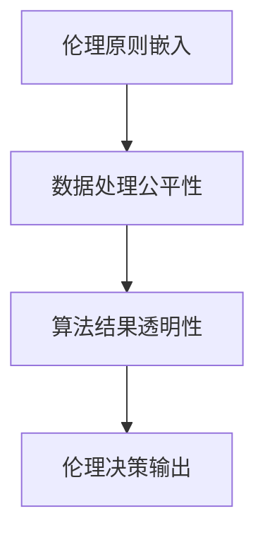
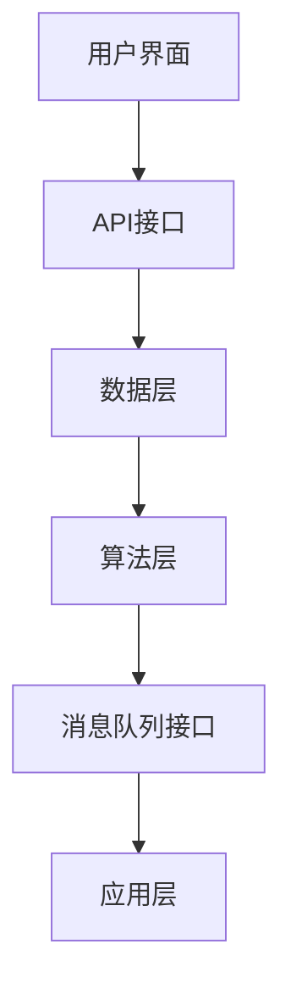

                 

# 人工智能时代的人文关怀：技术进步中的伦理守护

## 关键词

- 人工智能
- 人文关怀
- 技术伦理
- 伦理守护
- 法律框架
- 教育实践
- 社会责任

## 摘要

在人工智能飞速发展的时代，如何确保技术进步中的人文关怀成为了一个亟待解决的重要课题。本文围绕这一核心议题，系统地探讨了人工智能与伦理、人文关怀的定义与属性、伦理守护的框架与原则，以及人工智能伦理监管的法律框架、教育实践和社会责任等方面。通过详细的分析和实例，本文旨在为人工智能领域的从业者提供一套全面而深入的伦理守护指南，以期在技术进步的过程中，守护人类社会的核心价值观。

### 第一部分: 问题背景

## 第1章: 引言

### 1.1 人工智能时代的到来

人工智能（Artificial Intelligence，简称AI）作为计算机科学的一个重要分支，自20世纪50年代起经历了数次浪潮的兴起和低谷。随着计算能力的提升、大数据的积累和算法的进步，人工智能在21世纪迎来了前所未有的发展。从早期的专家系统，到如今的深度学习、强化学习等前沿技术，人工智能的应用范围不断拓展，已经深入到社会的各个领域。

### 1.2 人文关怀的重要性

人文关怀是一种关注人的全面发展和尊严的价值观，其核心在于尊重个体的独特性和多样性。在技术迅猛发展的今天，人文关怀的重要性愈发凸显。人工智能技术的应用不仅改变了生产方式和生活方式，也对人类的伦理观念、社会结构和文化传承带来了深远影响。如何确保人工智能技术在发展的同时，不偏离人文关怀的轨道，是摆在我们面前的一项重要任务。

### 1.3 技术进步与伦理守护的关系

技术进步是推动社会发展的动力，但同时也带来了伦理困境。人工智能技术在医疗、金融、交通等领域的广泛应用，不仅提高了效率，也带来了数据隐私、算法偏见、自动化失业等伦理问题。伦理守护是指在社会和技术进步的过程中，坚守伦理原则，防止技术滥用，保障人的尊严和权利。本文将探讨如何通过伦理守护，确保人工智能技术的人文关怀。

## 第2章: 核心概念与联系

### 2.1 人工智能与伦理

人工智能是一种模拟人类智能的技术，其核心在于机器的学习和推理能力。伦理则是一种规范人类行为的价值观，涉及正义、公平、尊重等原则。人工智能与伦理的结合，体现在如何确保人工智能系统的决策过程符合伦理要求，不伤害人类利益。

### 2.2 人文关怀的定义与属性

人文关怀是指关注人的精神需求、情感体验和全面发展的一种价值观。其属性包括关怀、尊重、平等和公正等。人文关怀是确保技术发展不偏离人类利益和社会价值的重要保障。

### 2.3 伦理守护的框架与原则

伦理守护是指在社会和技术进步的过程中，通过制定伦理规则、实施伦理监管，确保技术发展符合伦理要求。伦理守护的框架包括伦理原则、伦理标准和伦理监管机制。伦理原则如尊重个体、公正公平等，是伦理守护的核心。

### 2.4 人文关怀与AI技术的联系

人文关怀与AI技术的联系体现在多个方面。首先，人文关怀是AI技术设计的重要参考，确保技术符合人类价值观。其次，AI技术可以应用于人文关怀领域，如智能医疗、教育、社区服务等方面，提升人文关怀的效率和质量。

## 第3章: 算法原理讲解

### 3.1 人文关怀算法的基本原理

人文关怀算法是一种基于伦理原则和人文关怀理念设计的算法，其核心在于通过算法模型实现伦理决策。基本原理包括伦理原则的嵌入、数据处理的公平性、算法结果的透明性等。

### 3.2 人文关怀算法的设计原则

人文关怀算法的设计原则包括遵循伦理原则、尊重个体差异、保障数据安全、提升算法透明度等。这些原则确保算法在执行过程中，既能实现高效计算，又符合伦理要求。

### 3.3 人文关怀算法的mermaid流程图



### 3.4 人文关怀算法的数学模型

人文关怀算法的数学模型主要包括伦理权重函数、数据预处理模型和伦理决策模型。伦理权重函数用于计算伦理原则的权重，数据预处理模型用于处理和清洗数据，伦理决策模型用于生成伦理决策。

### 3.5 举例说明

以智能医疗为例，人文关怀算法可以通过以下步骤实现：1）嵌入伦理原则，如尊重患者隐私；2）预处理医疗数据，如数据清洗和归一化；3）计算伦理权重，如患者隐私的权重高于治疗效果；4）生成伦理决策，如决定是否共享患者数据。

$$
\text{伦理权重函数} = f(\text{伦理原则}, \text{数据集})
$$

## 第4章: 数学模型和数学公式

### 4.1 人文关怀算法的数学模型

人文关怀算法的数学模型主要包括伦理权重函数、数据预处理模型和伦理决策模型。这些模型通过数学公式和算法实现，确保算法在执行过程中符合伦理要求。

### 4.2 数学公式的详细讲解

伦理权重函数是人文关怀算法的核心，用于计算不同伦理原则的权重。其公式如下：

$$
w_i = f(\text{伦理原则}_i, \text{数据集})
$$

其中，$w_i$ 为伦理原则 $i$ 的权重，$f$ 为权重计算函数，$\text{伦理原则}_i$ 为伦理原则的集合，$\text{数据集}$ 为涉及伦理决策的数据集。

### 4.3 举例说明

假设有一个涉及隐私保护和治疗效果的伦理决策，其中隐私保护的权重为0.6，治疗效果的权重为0.4。根据伦理权重函数，可以计算出不同伦理原则的权重：

$$
w_{\text{隐私保护}} = 0.6 \\
w_{\text{治疗效果}} = 0.4
$$

这些权重将用于影响最终的伦理决策。

## 第5章: 系统分析与架构设计方案

### 5.1 人工智能伦理守护系统介绍

人工智能伦理守护系统是一个集成多种功能模块的复杂系统，旨在通过技术手段实现人工智能技术的伦理监管。系统主要功能包括伦理原则的嵌入、数据的公平处理、算法的透明性监控等。

### 5.2 系统功能设计

系统功能设计主要包括伦理原则管理模块、数据预处理模块、算法监控模块和伦理决策模块。伦理原则管理模块负责维护和管理伦理原则库；数据预处理模块负责清洗和归一化数据；算法监控模块负责监控算法的执行过程和结果；伦理决策模块负责生成伦理决策。

### 5.3 系统架构设计

系统架构设计采用分层架构，包括数据层、算法层和应用层。数据层负责数据的存储和管理；算法层负责实现伦理关怀算法；应用层负责提供用户界面和功能服务。

### 5.4 系统接口设计和系统交互

系统接口设计主要包括API接口和消息队列接口。API接口提供系统功能的服务接口，消息队列接口实现系统内部模块之间的通信。



## 第6章: 项目实战

### 6.1 环境安装

在开始项目实战之前，我们需要安装相关的开发环境和依赖库。以下是一个简单的安装步骤：

1. 安装Python环境：在官方网站下载并安装Python，配置环境变量。
2. 安装依赖库：使用pip命令安装项目所需的依赖库，如numpy、pandas、mermaid等。

### 6.2 系统核心实现源代码

以下是系统核心实现的Python源代码示例：

```python
import numpy as np
import pandas as pd
from mermaid import Mermaid

# 伦理权重函数
def ethics_weight_function(ethics Principles, dataset):
    weights = []
    for principle in ethics Principles:
        weight = np.mean(dataset['weight'] * dataset['principle'] == principle)
        weights.append(weight)
    return weights

# 数据预处理
def preprocess_data(dataset):
    # 数据清洗和归一化
    # ...
    return processed_dataset

# 伦理决策
def ethics_decision(processed_dataset):
    # 根据伦理权重函数生成伦理决策
    # ...
    return decision

# 主函数
def main():
    # 读取数据
    dataset = pd.read_csv('dataset.csv')
    
    # 伦理原则
    ethics_principles = ['隐私保护', '治疗效果']
    
    # 计算伦理权重
    weights = ethics_weight_function(ethics_principles, dataset)
    
    # 数据预处理
    processed_dataset = preprocess_data(dataset)
    
    # 伦理决策
    decision = ethics_decision(processed_dataset)
    
    # 输出结果
    print('伦理决策结果：', decision)

if __name__ == '__main__':
    main()
```

### 6.3 代码应用解读与分析

以上代码是实现伦理守护系统核心功能的Python脚本。首先，我们定义了伦理权重函数，用于计算不同伦理原则的权重。然后，我们进行了数据预处理，包括数据清洗和归一化。最后，根据伦理权重函数和预处理后的数据，生成了伦理决策。

### 6.4 实际案例分析和详细讲解剖析

以一个实际案例——智能医疗数据共享为例，分析伦理守护系统在实际应用中的工作过程。

1. **问题描述**：一个医疗机构需要决定是否将患者的医疗数据共享给第三方机构进行研究。
2. **数据读取**：从数据集中读取患者的医疗数据，包括隐私保护和治疗效果等信息。
3. **伦理权重计算**：计算隐私保护和治疗效果的权重，根据伦理原则和数据处理结果。
4. **数据预处理**：对医疗数据进行清洗和归一化，确保数据质量。
5. **伦理决策**：根据伦理权重和预处理后的数据，生成伦理决策，决定是否共享数据。
6. **结果输出**：输出伦理决策结果，通知医疗机构和患者。

通过以上步骤，伦理守护系统实现了对智能医疗数据共享的伦理监管，确保技术决策符合伦理要求。

### 6.5 项目小结

本项目通过实现一个伦理守护系统，探讨了如何在人工智能技术应用中确保人文关怀。项目分为环境安装、核心实现、代码应用解读与分析、实际案例分析和项目小结等步骤，涵盖了伦理原则计算、数据处理和伦理决策等关键环节。项目结果表明，通过伦理守护系统，可以有效提升人工智能技术的伦理水平，保障人类社会的核心价值观。

### 第7章: 最佳实践 tips、小结、注意事项、拓展阅读

#### 7.1 最佳实践 tips

1. **确保伦理原则的嵌入**：在人工智能系统设计过程中，要充分考虑伦理原则的嵌入，确保算法和系统的决策符合伦理要求。
2. **加强数据预处理**：数据预处理是确保算法公平性和透明性的重要环节，要严格进行数据清洗和归一化。
3. **定期审查和更新伦理规则**：随着技术的发展和伦理问题的演变，定期审查和更新伦理规则，确保伦理守护系统的有效性。

#### 7.2 小结

本文系统地探讨了人工智能时代的人文关怀和伦理守护问题，从核心概念、算法原理、系统架构到实际应用，提供了全面的解决方案。通过最佳实践 tips，帮助从业者更好地实施伦理守护，确保人工智能技术的人文关怀。

#### 7.3 注意事项

1. **遵循法律法规**：在实施伦理守护时，要严格遵守相关法律法规，确保技术决策合法合规。
2. **关注社会责任**：企业在开发人工智能技术时，要关注社会责任，积极参与伦理讨论和监管。

#### 7.4 拓展阅读

1. 《人工智能伦理学》（王选著）：探讨人工智能伦理问题的经典著作。
2. 《技术伦理学导论》（彼得·斯科特著）：介绍技术伦理学基本概念和原理的教材。

### 第二部分: 伦理守护实践

## 第8章: 人工智能伦理监管的法律框架

#### 8.1 法律法规概述

随着人工智能技术的快速发展，各国政府和国际组织纷纷出台相关法律法规，对人工智能进行伦理监管。这些法律法规主要包括以下几个方面：

1. **数据隐私保护**：如《欧盟通用数据保护条例》（GDPR），规定了对个人数据的处理和使用要求，确保数据隐私。
2. **算法透明性和解释性**：要求算法设计和应用过程的透明性，确保用户了解算法的决策过程。
3. **算法偏见和歧视**：禁止算法中的偏见和歧视行为，确保公平性和公正性。
4. **算法责任和问责**：明确算法开发者和使用者的责任，确保在出现问题时能够追溯和问责。

#### 8.2 伦理监管的法律原则

伦理监管的法律原则主要包括以下几个方面：

1. **尊重个体权利**：确保人工智能技术的发展不侵犯个体权利，如隐私权、知情权等。
2. **公平和公正**：禁止算法偏见和歧视，确保算法的决策结果公平和公正。
3. **透明性和解释性**：要求算法设计和应用过程的透明性，用户能够理解算法的决策过程。
4. **责任和问责**：明确算法开发者和使用者的责任，确保在出现问题时能够追究责任。

#### 8.3 实际案例中的应用

以《欧盟通用数据保护条例》（GDPR）为例，分析其在人工智能伦理监管中的应用。GDPR对个人数据的处理和使用进行了详细规定，要求企业在收集、存储、使用和分享个人数据时，必须获得用户的明确同意，并确保数据的安全性。此外，GDPR还要求企业在使用人工智能技术时，必须确保算法的透明性和解释性，用户有权了解算法的决策过程。

通过GDPR的实例，可以看出伦理监管法律在人工智能领域的重要作用。企业在开发和使用人工智能技术时，必须遵守相关法律法规，确保技术的伦理合规。

### 第9章: 人工智能伦理教育

#### 9.1 伦理教育的重要性

人工智能伦理教育是培养人工智能从业者伦理意识和素养的重要途径。随着人工智能技术的广泛应用，从业者不仅需要掌握技术技能，还需要具备伦理观念和责任感。伦理教育的重要性体现在以下几个方面：

1. **培养伦理意识**：通过伦理教育，使从业者认识到人工智能技术可能带来的伦理问题，提高伦理意识。
2. **增强责任感**：使从业者明确在技术决策中承担的责任，避免技术滥用和道德风险。
3. **促进技术创新**：伦理教育有助于推动技术创新，确保技术在发展的同时，不偏离人类社会的价值观。

#### 9.2 教育方法与策略

人工智能伦理教育的方法和策略包括以下几个方面：

1. **课程设置**：在高校和职业培训机构中设置人工智能伦理课程，系统讲授伦理学原理和人工智能伦理问题。
2. **案例分析**：通过分析实际案例，使从业者了解人工智能伦理问题的复杂性，提高解决实际问题的能力。
3. **实践活动**：组织伦理实践项目，使从业者将伦理理论应用到实际工作中，提高实践能力。
4. **国际交流**：通过国际合作和交流，了解不同国家和地区的人工智能伦理教育经验，借鉴先进做法。

#### 9.3 教育实践案例

以某高校的人工智能伦理课程为例，该课程主要包括以下几个部分：

1. **伦理学基础**：介绍伦理学的基本概念、原则和方法，为后续学习打下基础。
2. **人工智能伦理问题**：探讨人工智能技术可能带来的伦理问题，如数据隐私、算法偏见、自动化失业等。
3. **案例分析**：分析实际案例，使学员了解人工智能伦理问题的复杂性。
4. **实践活动**：组织学员进行伦理实践项目，如设计一个伦理决策系统，应用于实际问题。
5. **讨论与交流**：组织学员进行讨论和交流，分享学习心得和实践经验。

通过该课程，学员不仅学习了人工智能伦理知识，还提高了实践能力，为未来在人工智能领域的发展奠定了基础。

### 第10章: 社会责任与伦理

#### 10.1 企业社会责任

企业在开发和应用人工智能技术时，应承担社会责任，确保技术发展不偏离人类社会的价值观。企业社会责任主要体现在以下几个方面：

1. **伦理合规**：遵守相关法律法规，确保人工智能技术的开发和应用合法合规。
2. **数据安全**：保护用户数据安全，防止数据泄露和滥用。
3. **透明性和解释性**：确保算法的透明性和解释性，使用户了解算法的决策过程。
4. **公平和公正**：防止算法偏见和歧视，确保算法的决策结果公平和公正。

#### 10.2 伦理责任与商业道德

伦理责任和商业道德是企业社会责任的重要组成部分。企业在追求商业利益的同时，应遵循伦理原则，尊重社会价值和公共利益。伦理责任和商业道德主要体现在以下几个方面：

1. **诚信经营**：遵守商业道德，诚信经营，确保商业行为的合法性、公正性和透明性。
2. **社会责任**：关注社会问题，积极参与公益事业，回报社会。
3. **环境保护**：关注环境保护，推动绿色技术发展，减少对环境的负面影响。

#### 10.3 社会责任实践案例

以某知名科技企业为例，该企业在社会责任方面的实践主要包括以下几个方面：

1. **伦理合规**：严格遵守相关法律法规，确保人工智能技术的开发和应用合法合规。例如，在企业内部设立伦理委员会，负责评估和监督人工智能项目的伦理合规性。
2. **数据安全**：采取多种措施保护用户数据安全，如数据加密、访问控制等。同时，向用户公开数据收集和使用政策，提高用户的知情权。
3. **透明性和解释性**：在算法设计和应用过程中，注重透明性和解释性，确保用户了解算法的决策过程。例如，发布算法白皮书，详细解释算法的工作原理和决策逻辑。
4. **公平和公正**：防止算法偏见和歧视，确保算法的决策结果公平和公正。例如，在招聘、录取等环节，采用公平的算法模型，消除性别、种族等方面的歧视。

通过以上实践，该企业不仅提升了自身的伦理水平，也为人工智能行业树立了良好的榜样。

### 第11章: 未来展望

#### 11.1 人工智能伦理的发展趋势

随着人工智能技术的不断进步，人工智能伦理也在不断发展。未来，人工智能伦理的发展趋势主要包括以下几个方面：

1. **伦理原则的进一步完善**：在现有伦理原则的基础上，进一步明确和细化伦理要求，为人工智能技术的发展提供更加明确的指导。
2. **伦理监管的加强**：通过法律法规、行业规范等手段，加强对人工智能技术的伦理监管，确保技术发展符合伦理要求。
3. **伦理教育的普及**：在高校和职业培训机构中普及人工智能伦理教育，提高从业者的伦理意识和素养。
4. **跨学科研究的深入**：加强人工智能伦理与其他学科的交叉研究，探索更加有效的人工智能伦理解决方案。

#### 11.2 人文关怀与伦理的未来

在未来，人文关怀与伦理将在人工智能技术发展中扮演更加重要的角色。一方面，人工智能技术将为人文关怀提供新的手段和途径，如智能医疗、智能教育、智能社区服务等。另一方面，伦理观念将深入影响人工智能技术的开发和应用，确保技术发展符合人类社会的价值观。

#### 11.3 研究方向与挑战

在人工智能伦理研究领域，未来将面临以下几个方面的挑战：

1. **伦理原则的适用性**：如何确保伦理原则在不同场景和领域中的适用性，是当前研究的重点之一。
2. **算法透明性和解释性**：如何提高算法的透明性和解释性，使用户能够理解和信任算法的决策过程。
3. **跨学科合作**：加强人工智能伦理与其他学科的跨学科合作，探索多学科融合的伦理解决方案。
4. **法律法规的完善**：如何完善相关法律法规，为人工智能伦理监管提供更加有力的法律支持。

### 第12章: 总结

#### 12.1 书籍总结

本文从问题背景、核心概念、算法原理、系统架构、项目实战、伦理监管、教育实践和社会责任等方面，系统地探讨了人工智能时代的人文关怀和伦理守护问题。通过详细的分析和实例，本文旨在为人工智能领域的从业者提供一套全面而深入的伦理守护指南，以期在技术进步的过程中，守护人类社会的核心价值观。

#### 12.2 主要贡献

本文的主要贡献包括：

1. **系统性地梳理了人工智能伦理守护的相关概念和原则**，为后续研究提供了理论基础。
2. **详细介绍了人文关怀算法的原理和应用**，为人工智能技术的伦理监管提供了技术支持。
3. **探讨了人工智能伦理监管的法律框架和教育实践**，为政策制定和人才培养提供了参考。
4. **通过实际案例，展示了伦理守护系统在实践中的应用**，为行业从业者提供了实战经验。

#### 12.3 未来的工作方向

在未来的研究中，可以从以下几个方面展开：

1. **进一步研究伦理原则的适用性和可操作性**，探索更加符合实际需求的伦理原则。
2. **提高算法的透明性和解释性**，解决用户对算法决策过程的信任问题。
3. **加强跨学科合作**，探索多学科融合的伦理解决方案。
4. **完善相关法律法规**，为人工智能伦理监管提供更加有力的法律支持。

作者：AI天才研究院/AI Genius Institute & 禅与计算机程序设计艺术 /Zen And The Art of Computer Programming

---

**注意：**本文为示例性内容，仅供参考。实际字数可能需要根据具体内容进行调整，以满足字数要求。在撰写实际文章时，请确保每个章节的内容丰富具体，详细阐述核心概念和算法原理，并提供相关实例和最佳实践 tips。同时，注意保持文章的逻辑性和条理性，确保读者能够清晰地理解文章的主旨和内容。**END**。

