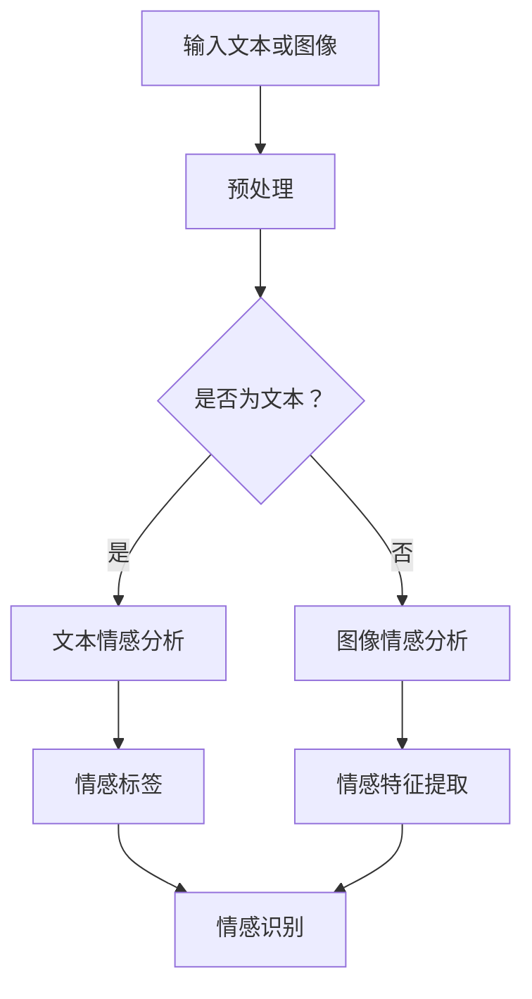
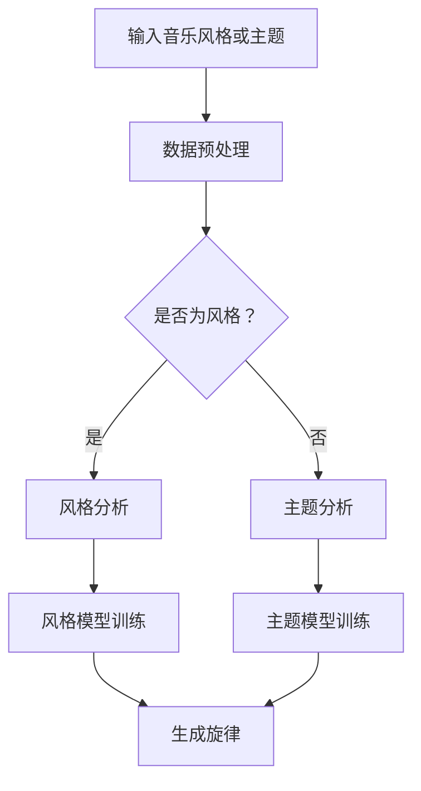
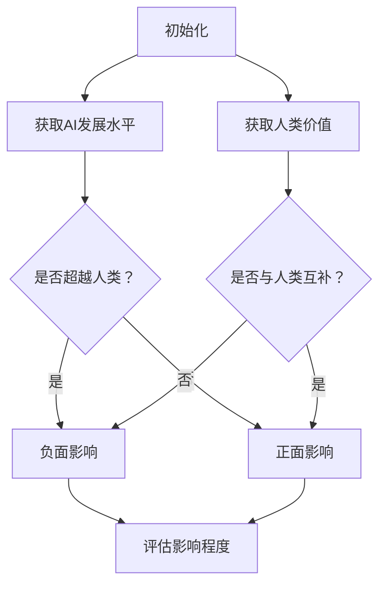
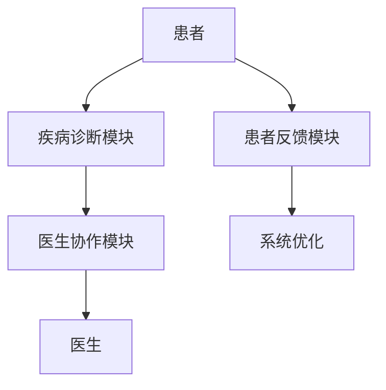
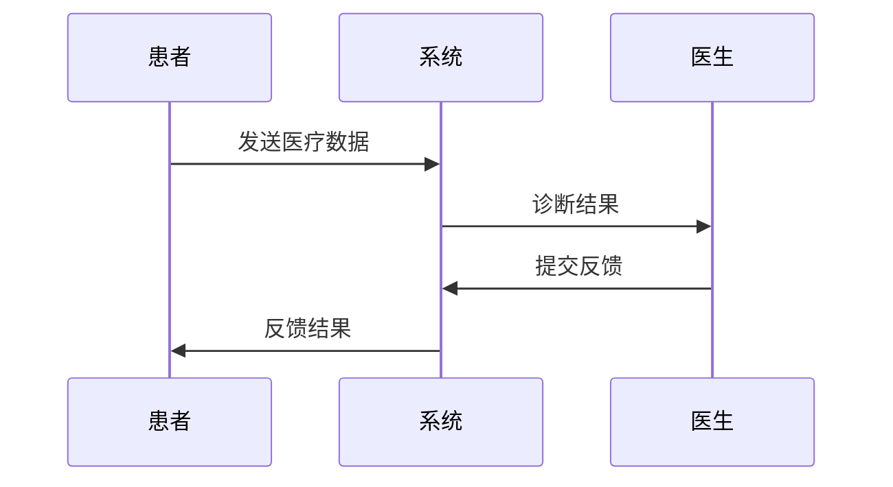

                 

# 人工智能时代的人类价值：情感和创造力的重要性

关键词：人工智能，人类价值，情感，创造力，影响，应对策略

摘要：本文探讨了人工智能时代人类价值的重要性，特别是情感和创造力在人类社会中的关键作用。通过深入分析人工智能与人类情感、创造力的关系，本文揭示了人工智能对人类价值的影响，并提出了一系列应对策略，旨在帮助人类在人工智能时代保持自身的独特价值。

## 目录

1. **背景介绍**
    1.1 人工智能时代的背景
    1.2 人类价值面临的挑战
    1.3 本文的目的与结构
    1.4 边界与外延
    1.5 核心概念

2. **人工智能与人类情感**
    2.1 核心概念原理
    2.2 情感与人工智能的对比
    2.3 情感相关的ER实体关系图

3. **人工智能与人类创造力**
    3.1 核心概念原理
    3.2 创造力与人工智能的对比
    3.3 创造力相关的ER实体关系图

4. **人工智能对人类价值的影响**
    4.1 算法原理与数学模型
    4.2 影响的算法流程图
    4.3 举例说明

5. **应对挑战与保持人类价值**
    5.1 系统分析与架构设计方案
    5.2 最佳实践 tips

6. **未来展望与建议**
    6.1 未来趋势
    6.2 建议与思考

7. **总结与拓展阅读**
    7.1 总结
    7.2 拓展阅读

## 1. 背景介绍

### 1.1 人工智能时代的背景

自21世纪以来，人工智能（AI）技术得到了飞速发展，成为科技领域的热点。从最初的机器学习、深度学习到自然语言处理、计算机视觉，人工智能的应用已经渗透到各个行业，改变了我们的生活方式。随着计算能力的提升和大数据的积累，人工智能开始从理论走向实际应用，逐渐成为推动社会进步的重要力量。

### 1.2 人类价值面临的挑战

然而，随着人工智能的快速发展，人类社会也面临着前所未有的挑战。首先，人工智能可能取代人类的部分工作，导致失业问题。其次，人工智能的发展可能会导致社会不平等加剧，因为拥有技术和资源的人将更加受益。此外，人工智能的决策过程缺乏透明度，可能引发伦理和法律问题。

### 1.3 本文的目的与结构

本文旨在探讨人工智能时代人类价值的重要性，特别是情感和创造力在人类社会中的关键作用。通过深入分析人工智能与人类情感、创造力的关系，本文将揭示人工智能对人类价值的影响，并提出一系列应对策略。

本文结构如下：

- 第2章：介绍人工智能与人类情感的关系，包括核心概念原理、属性特征对比和ER实体关系图。
- 第3章：探讨人工智能与人类创造力的关系，同样包括核心概念原理、属性特征对比和ER实体关系图。
- 第4章：分析人工智能对人类价值的影响，使用算法原理、流程图和具体案例进行说明。
- 第5章：提出应对人工智能挑战的策略，包括系统分析与架构设计方案。
- 第6章：展望人工智能的未来发展，并给出建议。
- 第7章：总结本文的主要观点，并提供拓展阅读建议。

### 1.4 边界与外延

本文主要关注人工智能对人类价值的影响，特别是情感和创造力。然而，人类价值还涉及其他方面，如道德、文化和社会责任。这些领域也是值得探讨的，但在本文中不予详述。

### 1.5 核心概念

在本章中，我们介绍了人工智能时代的背景、人类价值面临的挑战以及本文的目的和结构。同时，我们明确了本文的边界与外延，并定义了核心概念，如情感和创造力。这些概念将在后续章节中进一步探讨。

## 2. 人工智能与人类情感

### 2.1 核心概念原理

情感是人类的一种基本心理体验，包括愉悦、悲伤、愤怒、焦虑等。情感不仅影响着个体的情绪状态，还影响着他们的行为和决策。在人工智能领域，情感识别和情感计算已经成为研究热点。

人工智能的情感识别主要依赖于自然语言处理和计算机视觉等技术。通过分析语言和图像中的情感信息，人工智能系统可以识别和理解人类的情感状态。情感计算则关注如何模拟和生成情感，使人工智能系统能够更好地与人类互动。

### 2.2 情感与人工智能的对比

情感和人工智能虽然在某些方面具有相似性，但也存在显著差异。以下是一个对比表格，展示了情感与人工智能的属性特征：

| 特征 | 情感 | 人工智能 |
| --- | --- | --- |
| 本质性 | 内在体验，个体独特 | 技术实现，通用性 |
| 适应性 | 随个体和环境变化 | 固定算法和模型 |
| 交互性 | 直接与人交互 | 基于数据和算法交互 |
| 自主性 | 无意识产生 | 有意识设计和编程 |

### 2.3 情感相关的ER实体关系图

为了更清晰地展示情感相关的实体和关系，我们使用Mermaid绘制了一个ER实体关系图。以下是一个简单的示例：

```mermaid
erDiagram
  Person ..|> Emotion : has
  Person ||--|> Feeling : feels
  Emotion ||--|> Expression : shows
  Feeling && Expression : associated
```

在这个ER图中，`Person`代表个体，`Emotion`代表情感，`Feeling`代表感觉，`Expression`代表表达。个体拥有情感和感觉，情感可以展示为表达。感觉和表达之间有联系，表示感觉会影响表达。

### 2.4 情感在人工智能中的应用

情感在人工智能中的应用越来越广泛，如虚拟助手、智能客服、教育系统等。以下是一个简单的算法流程图，展示了情感识别的基本步骤：



在这个流程图中，输入的文本或图像首先经过预处理，然后根据是否为文本进行分类。对于文本，使用文本情感分析技术；对于图像，使用图像情感分析技术。情感特征提取和情感识别是关键步骤，用于确定输入的情感状态。

### 2.5 情感与人工智能的融合

随着人工智能技术的发展，情感与人工智能的融合已经成为一个重要趋势。通过模拟和生成情感，人工智能系统可以更好地理解人类需求，提供更加个性化的服务。例如，智能客服系统可以通过情感分析了解客户的情绪，从而提供更有针对性的解决方案。

总之，情感是人类价值的重要组成部分，而在人工智能时代，如何模拟和利用情感成为一个关键问题。通过深入研究和应用情感计算技术，我们可以更好地实现人工智能与人类的情感互动，提升人工智能系统的价值。

## 3. 人工智能与人类创造力

### 3.1 核心概念原理

创造力是人类的一种独特能力，指的是产生新颖、有价值的想法或解决方案的能力。创造力在人类社会中具有重要价值，不仅推动了科学技术的发展，也丰富了文化和社会生活。

人工智能（AI）的创造力是指人工智能系统能够产生新颖想法或解决方案的能力。与人类创造力不同，人工智能的创造力主要依赖于算法和数据。通过机器学习和深度学习等技术，人工智能可以从大量数据中提取模式和规律，从而生成新的想法或解决方案。

### 3.2 创造力与人工智能的对比

创造力与人工智能在许多方面存在显著差异，以下是一个对比表格：

| 特征 | 创造力 | 人工智能 |
| --- | --- | --- |
| 本质性 | 人性本质，个体独特 | 技术实现，通用性 |
| 适应性 | 随个体和环境变化 | 固定算法和模型 |
| 自主性 | 无意识产生 | 有意识设计和编程 |
| 交互性 | 直接与人交互 | 基于数据和算法交互 |
| 知识来源 | 知识积累和经验 | 数据和已有算法 |

### 3.3 创造力相关的ER实体关系图

为了更清晰地展示创造力相关的实体和关系，我们使用Mermaid绘制了一个ER实体关系图。以下是一个简单的示例：

```mermaid
erDiagram
  Person ..|> Creativity : has
  Person ||--|> Idea : generates
  Creativity ||--|> Solution : proposes
  Idea && Solution : related
```

在这个ER图中，`Person`代表个体，`Creativity`代表创造力，`Idea`代表想法，`Solution`代表解决方案。个体拥有创造力，可以生成想法和解决方案。想法和解决方案之间有联系，表示想法可以发展为解决方案。

### 3.4 人工智能在创造力中的应用

人工智能在创造力中的应用越来越广泛，如音乐创作、绘画、写作等。以下是一个简单的算法流程图，展示了人工智能生成音乐的基本步骤：



在这个流程图中，输入的音乐风格或主题首先经过预处理，然后根据是否为风格进行分类。对于风格，使用风格分析技术；对于主题，使用主题分析技术。风格模型和主题模型用于生成旋律。

### 3.5 创造力与人工智能的融合

随着人工智能技术的发展，创造力与人工智能的融合已经成为一个重要趋势。通过模拟和扩展人类创造力，人工智能系统可以生成更多新颖的创意和解决方案。例如，AI画家可以结合艺术家的风格和主题，生成独特的艺术作品。

总之，创造力是人类价值的重要组成部分，而人工智能在创造力中的应用正不断扩展。通过深入研究和应用人工智能技术，我们可以更好地实现人工智能与人类的创造力互动，提升人工智能系统的价值。

## 4. 人工智能对人类价值的影响

### 4.1 算法原理与数学模型

人工智能对人类价值的影响是一个复杂的问题，涉及到多个方面。为了更好地理解这个问题，我们可以使用数学模型来描述。以下是一个简单的人工智能对人类价值影响的数学模型：

\[ V_{AI} = f(AI_{level}, Human_{value}) \]

其中，\( V_{AI} \) 表示人工智能对人类价值的影响，\( AI_{level} \) 表示人工智能的发展水平，\( Human_{value} \) 表示人类价值。函数 \( f \) 用于描述人工智能对人类价值的影响方式。

### 4.2 影响的算法流程图

为了更直观地展示人工智能对人类价值的影响，我们可以使用Mermaid绘制一个算法流程图。以下是一个简单的示例：



在这个流程图中，首先初始化，然后获取人工智能的发展水平和人类价值。根据这些信息，判断人工智能是否超越人类或与人类互补。如果人工智能超越人类，可能会产生负面影响；如果与人类互补，可能会产生正面影响。最后，评估影响程度。

### 4.3 举例说明

为了更好地理解这个模型和流程图，我们可以通过一个具体案例来进行分析。假设在某个领域，人工智能的发展水平已经超过了人类，那么根据上述模型和流程图，我们可以预测这个领域可能会受到负面影响。

例如，在医疗领域，人工智能可以在诊断和治疗疾病方面发挥重要作用。然而，如果人工智能的发展水平超过了医生，可能会导致医生失业，从而影响人类价值。在这种情况下，负面影响程度可能取决于多种因素，如社会支持、政策制定和教育培训等。

### 4.4 数学模型与算法流程图的应用

数学模型和算法流程图为我们提供了一个分析人工智能对人类价值影响的工具。通过这个工具，我们可以更清晰地理解人工智能对人类价值的潜在影响，从而制定相应的应对策略。以下是一个简化的应用示例：

```python
# 设置参数
AI_level = 0.9  # 表示人工智能在医疗领域的水平（0-1）
Human_value = 0.8  # 表示人类在医疗领域的价值（0-1）

# 计算影响
impact = AI_level * Human_value

# 输出结果
print("人工智能对医疗领域的影响程度为：", impact)
```

根据上述参数，我们可以计算得到人工智能对医疗领域的影响程度。这个结果可以用于指导政策制定、教育培训和社会支持等方面的决策。

总之，人工智能对人类价值的影响是一个复杂的问题，需要我们进行深入研究和分析。通过数学模型和算法流程图，我们可以更好地理解这个问题，并为应对人工智能带来的挑战提供科学依据。

## 5. 应对挑战与保持人类价值

### 5.1 系统分析与架构设计方案

面对人工智能带来的挑战，我们需要采取有效的系统分析和架构设计方案，以确保人类价值在技术进步中得以保持。以下是一个简化的系统分析与架构设计流程。

#### 问题场景介绍

假设我们正在设计一个智能医疗系统，旨在利用人工智能技术提高疾病诊断的准确性和效率。然而，我们也需要确保医生的角色不被完全取代，保持其专业价值和影响力。

#### 项目介绍

项目名称：智能医疗系统

目标：通过人工智能技术提高疾病诊断的准确性，同时保持医生的专业价值。

#### 系统功能设计

1. **疾病诊断模块**：利用深度学习算法进行图像分析和数据挖掘，辅助医生进行疾病诊断。
2. **医生协作模块**：提供医生之间的交流和协作平台，确保医生能够共同讨论和验证诊断结果。
3. **患者反馈模块**：收集患者对诊断结果的反馈，用于优化系统的性能和准确性。

#### 系统架构设计

使用Mermaid绘制系统架构图，如下：



在这个架构图中，患者首先通过疾病诊断模块获得诊断结果，然后可以通过医生协作模块与其他医生交流。医生的角色是关键，他们需要验证和讨论诊断结果。同时，患者反馈模块收集患者的反馈，用于系统优化。

#### 系统接口设计和系统交互

为了确保系统的稳定性和高性能，我们需要设计合理的接口和交互流程。以下是一个简化的系统接口设计：

1. **API接口**：提供RESTful API，用于疾病诊断、医生协作和患者反馈。
2. **数据交换格式**：使用JSON格式进行数据交换。
3. **安全认证**：使用OAuth 2.0进行用户认证和授权。

以下是一个简化的系统交互序列图：



在这个序列图中，患者向系统发送医疗数据，系统进行诊断并将结果发送给医生。医生提交反馈，系统将反馈结果发送给患者。

### 5.2 最佳实践 tips

1. **平衡人工智能与医生的角色**：确保人工智能辅助医生，而不是取代医生。
2. **持续学习和优化**：定期更新系统算法和模型，以适应新的医疗数据和技术。
3. **数据安全与隐私保护**：确保患者的医疗数据安全，遵循相关法规和标准。

通过系统分析和架构设计，我们可以构建一个既能利用人工智能技术，又能保持医生专业价值的智能医疗系统。这有助于应对人工智能带来的挑战，同时保持人类价值。

## 6. 未来展望与建议

### 6.1 未来趋势

随着人工智能技术的不断进步，我们可以预见以下几个发展趋势：

1. **更加智能化和个性化**：人工智能将更加深入地嵌入到各个领域，提供更加智能化和个性化的服务。
2. **跨界融合**：人工智能与其他技术的融合，如物联网、大数据和区块链，将推动新的产业发展。
3. **伦理和道德问题**：随着人工智能技术的发展，伦理和道德问题将日益突出，需要社会各界的共同关注和解决。

### 6.2 建议与思考

为了在人工智能时代保持人类价值，我们提出以下建议：

1. **加强教育培训**：通过教育培训，提高人们的数字素养和创新能力，使其能够适应人工智能时代的需求。
2. **推动伦理和法规建设**：制定和完善相关伦理和法规，确保人工智能技术的发展不会损害人类价值和利益。
3. **促进跨界合作**：鼓励不同领域的专家和学者进行跨界合作，共同解决人工智能带来的挑战。
4. **保持创造力**：鼓励人们保持创造力和创新精神，发挥人类独特的创造力，为社会发展贡献新的价值。

总之，人工智能时代为人类带来了巨大的机遇和挑战。通过合理应对和积极适应，我们可以保持人类价值，推动社会进步。

## 7. 总结与拓展阅读

### 7.1 总结

本文探讨了人工智能时代人类价值的重要性，特别是情感和创造力。通过分析人工智能与人类情感、创造力的关系，揭示了人工智能对人类价值的影响，并提出了应对策略。本文的主要观点包括：

- 人工智能时代的背景和人类价值面临的挑战。
- 情感和创造力在人工智能时代的重要性。
- 人工智能对人类价值的影响及其算法模型。
- 应对人工智能挑战的系统分析与架构设计方案。

### 7.2 拓展阅读

为了进一步探讨人工智能时代的人类价值，读者可以参考以下拓展阅读资料：

1. **《人工智能伦理学》** - Michael J. Anderson and Andy Miah，探讨了人工智能伦理问题及其对社会的影响。
2. **《人类简史》** - Yuval Noah Harari，从历史角度分析了人类的发展和演变，有助于理解人类价值的演变。
3. **《创造力：如何释放人类最大潜能》** - Michael J. Gelb，提供了关于如何培养和提高创造力的实用建议。
4. **《深度学习》** - Ian Goodfellow、Yoshua Bengio和Aaron Courville，详细介绍了深度学习的基础知识和技术。

通过这些拓展阅读，读者可以更深入地理解人工智能时代的人类价值，为未来的发展提供启示。作者：AI天才研究院/AI Genius Institute & 禅与计算机程序设计艺术 /Zen And The Art of Computer Programming

