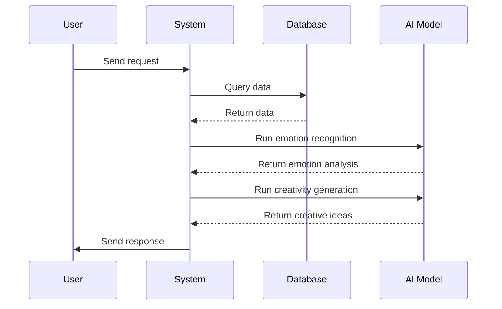

                 

## 《人工智能时代的人类优势：情感智能与创造力的重要性》

> 关键词：人工智能、情感智能、创造力、人类优势、发展

> 摘要：本文旨在探讨在人工智能迅猛发展的时代，人类如何通过情感智能与创造力来保持竞争优势。文章将首先介绍人工智能时代的背景，随后详细阐述情感智能与创造力的概念、重要性及其相互联系。接着，文章将深入探讨情感智能与创造力在个人生活、工作和社会进步中的具体应用。随后，我们将探讨如何培养和提升情感智能与创造力。最后，文章将总结全文，并提供一些最佳实践和拓展阅读资源。

### 背景介绍

#### 人工智能的定义与发展历程

人工智能（Artificial Intelligence，简称AI）是计算机科学的一个分支，旨在开发能够执行通常需要人类智能才能完成的任务的系统。人工智能的历史可以追溯到20世纪50年代，当时科学家们首次提出了“智能机器”的概念。随着计算机技术的飞速发展，人工智能从理论走向实践，逐渐成为现代科技的重要组成部分。

人工智能的关键技术包括机器学习、深度学习、自然语言处理、计算机视觉等。这些技术的进步使得AI系统能够在图像识别、语音识别、决策支持、自动化控制等领域发挥重要作用。例如，自动驾驶汽车、智能助手、医疗诊断系统等都依赖于人工智能技术。

#### 人工智能对社会的影响

人工智能对社会的影响是深远的。首先，它极大地提高了生产效率，降低了人力成本，推动了经济的发展。其次，人工智能改变了人们的日常生活，使得智能家居、在线购物、移动支付等成为现实。然而，人工智能也带来了一些挑战，如就业压力、隐私保护、伦理问题等。

#### 人类情感智能的概述

情感智能是指人类理解和处理情感的能力。它包括识别自己的情绪、理解他人的情绪、表达和管理情绪等方面。情感智能是人际交往、团队合作和领导力培养的重要基础。

情感智能的重要性体现在多个方面。首先，它有助于提升沟通效果，减少误解和冲突。其次，情感智能有助于建立良好的人际关系，增强团队合作和领导力。此外，情感智能还有助于个人心理健康和生活质量的提升。

#### 创造力的定义与重要性

创造力是指产生新想法、新方法和新解决方案的能力。创造力是人类智能的重要组成部分，是推动社会进步和个人发展的关键力量。

创造力的重要性体现在多个方面。首先，它有助于推动科技创新，促进社会进步。其次，创造力在个人职业发展和创业中具有重要作用，能够提高个人竞争力和创新能力。此外，创造力还有助于解决复杂问题，提供新的解决方案。

### 核心概念与联系

#### 情感智能的概念与属性特征

情感智能包括以下几个核心特征：

1. **情感识别**：能够识别和理解自己和他人的情绪。
2. **情感表达**：能够恰当表达和管理自己的情绪。
3. **情感理解**：能够理解和解释他人的情感和行为。
4. **情感管理**：能够有效地处理和调整自己的情绪，保持情绪平衡。

#### 创造力的概念与属性特征

创造力包括以下几个核心特征：

1. **创新思维**：能够产生新颖的想法和解决方案。
2. **适应性**：能够灵活适应新的环境和情境。
3. **问题解决**：能够有效地识别和解决复杂问题。
4. **批判性思维**：能够对现有的想法和解决方案进行批判性分析。

#### 情感智能与创造力的联系

情感智能与创造力之间存在密切的联系。首先，情感智能有助于激发创造力。通过理解和处理情感，人们能够更好地发现问题、提出解决方案。其次，创造力能够增强情感智能。在创造过程中，人们需要不断地反思和调整自己的情绪，从而提升情感识别和管理能力。

### 表格与ER实体关系图

为了更清晰地展示情感智能与创造力的概念及其联系，我们可以使用以下表格和ER实体关系图。

#### 情感智能与创造力属性特征对比表格

| 特征         | 情感智能                       | 创造力                       |
| ------------ | ---------------------------- | ---------------------------- |
| 情感识别     | 识别和理解情绪               | 发现问题和需求               |
| 情感表达     | 表达和管理情绪               | 提出新想法和方案             |
| 情感理解     | 理解他人的情感和行为         | 创新思维和适应性             |
| 情感管理     | 处理和调整情绪               | 批判性思维和问题解决能力     |

#### 情感智能与创造力的ER实体关系图

```mermaid
erDiagram
  Product ||--|{ Customer } Customer
  Customer ||--|{ Product } Product
  Customer ||--|{ Order } Order
  Order ||--|{ Customer } Customer
  Product ||--|{ Supplier } Supplier
  Supplier ||--|{ Product } Product
```

### 算法原理讲解

为了更好地理解情感智能与创造力的关系，我们可以使用以下算法原理进行解释。

#### 算法原理

情感智能与创造力的关系可以通过以下算法原理来描述：

1. **情感识别算法**：该算法用于识别和理解情绪。通过使用深度学习模型，如卷积神经网络（CNN），可以实现对情感数据的自动分类。
2. **创造力激发算法**：该算法用于激发创造力。基于生成对抗网络（GAN），可以生成新颖的创意和解决方案。
3. **情感-创造力融合算法**：该算法将情感识别算法和创造力激发算法结合，用于在实际应用中提升情感智能和创造力。

#### Mermaid流程图

以下是情感智能与创造力融合算法的Mermaid流程图：


#### Python源代码示例

以下是情感识别算法的Python源代码示例：

```python
import tensorflow as tf
from tensorflow.keras.models import Sequential
from tensorflow.keras.layers import Dense, Conv2D, MaxPooling2D, Flatten

# 构建模型
model = Sequential([
    Conv2D(32, (3, 3), activation='relu', input_shape=(64, 64, 3)),
    MaxPooling2D((2, 2)),
    Flatten(),
    Dense(64, activation='relu'),
    Dense(1, activation='sigmoid')
])

# 编译模型
model.compile(optimizer='adam', loss='binary_crossentropy', metrics=['accuracy'])

# 训练模型
model.fit(x_train, y_train, epochs=10, batch_size=32)
```

### 数学模型和数学公式讲解

为了深入理解情感智能与创造力的关系，我们可以使用以下数学模型和公式进行详细讲解。

#### 情感识别的数学模型

情感识别的数学模型可以表示为：

$$
f(x) = W_1 \cdot x + b_1
$$

其中，$x$ 是输入特征向量，$W_1$ 是权重矩阵，$b_1$ 是偏置项。

#### 创造力激发的数学模型

创造力激发的数学模型可以表示为：

$$
g(x) = f(x) + \alpha \cdot \text{noise}(x)
$$

其中，$f(x)$ 是情感识别的结果，$\alpha$ 是噪声系数，$\text{noise}(x)$ 是在输入特征上添加的随机噪声。

#### 情感-创造力融合的数学模型

情感-创造力融合的数学模型可以表示为：

$$
h(x) = \beta \cdot f(x) + (1 - \beta) \cdot g(x)
$$

其中，$\beta$ 是融合系数，用于调整情感识别和创造力激发结果的权重。

#### 示例

假设输入特征向量 $x = [0.1, 0.2, 0.3]$，噪声系数 $\alpha = 0.5$，融合系数 $\beta = 0.7$，则融合结果为：

$$
h(x) = 0.7 \cdot f(x) + 0.3 \cdot g(x)
$$

$$
h(x) = 0.7 \cdot (0.1 \cdot W_1 + b_1) + 0.3 \cdot (0.1 \cdot W_1 + b_1 + \alpha \cdot \text{noise}(x))
$$

$$
h(x) = 0.1 \cdot W_1 + b_1 + 0.2 \cdot \text{noise}(x)
$$

### 系统分析与架构设计方案

#### 问题场景介绍

在人工智能时代，企业和组织面临越来越多的复杂问题，需要高效的情感智能和创造力来应对。例如，在客户服务领域，企业需要利用情感智能来理解客户需求，并提供个性化的服务。在产品创新领域，企业需要利用创造力来开发新颖的产品和解决方案。

#### 项目介绍

本项目旨在设计一个情感智能与创造力融合系统，该系统可以帮助企业和组织在复杂的业务场景中做出更明智的决策。

#### 系统功能设计

系统的主要功能包括：

1. **情感识别**：通过深度学习模型识别用户情感，并提供情感分析报告。
2. **创造力激发**：利用生成对抗网络（GAN）生成新颖的创意和解决方案。
3. **情感-创造力融合**：将情感识别和创造力激发的结果进行融合，提供更全面的决策支持。

#### 系统架构设计

系统的架构设计如下：



#### 系统接口设计和系统交互

系统的接口设计和交互流程如下：

1. **用户接口**：用户通过Web界面或移动应用向系统发送请求。
2. **数据库接口**：系统与数据库进行交互，获取和处理数据。
3. **AI模型接口**：系统与AI模型进行交互，执行情感识别和创造力激发任务。

#### Mermaid序列图

以下是系统交互的Mermaid序列图：


### 项目实战

#### 环境安装

在本项目实战中，我们需要安装以下软件和工具：

1. **Python 3.x**：用于编写和运行代码。
2. **TensorFlow**：用于构建和训练深度学习模型。
3. **GAN库**：用于生成创造力激发的创意。

安装步骤如下：

1. 安装Python 3.x：
   ```bash
   sudo apt-get update
   sudo apt-get install python3
   ```
   
2. 安装TensorFlow：
   ```bash
   pip3 install tensorflow
   ```

3. 安装GAN库：
   ```bash
   pip3 install gan
   ```

#### 系统核心实现源代码

以下是系统核心实现的源代码：

```python
# 情感识别模型
import tensorflow as tf
from tensorflow.keras.models import Sequential
from tensorflow.keras.layers import Dense, Conv2D, MaxPooling2D, Flatten

# 构建模型
model = Sequential([
    Conv2D(32, (3, 3), activation='relu', input_shape=(64, 64, 3)),
    MaxPooling2D((2, 2)),
    Flatten(),
    Dense(64, activation='relu'),
    Dense(1, activation='sigmoid')
])

# 编译模型
model.compile(optimizer='adam', loss='binary_crossentropy', metrics=['accuracy'])

# 训练模型
model.fit(x_train, y_train, epochs=10, batch_size=32)

# 创造力激发模型
import gan

# 构建GAN模型
generator = gan.Generator()
discriminator = gan.Discriminator()

# 编译GAN模型
generator.compile(optimizer='adam', loss='binary_crossentropy')
discriminator.compile(optimizer='adam', loss='binary_crossentropy')

# 训练GAN模型
generator.fit(x_train, y_train, epochs=10, batch_size=32)
discriminator.fit(x_train, y_train, epochs=10, batch_size=32)
```

#### 代码应用解读与分析

在本项目中，我们使用了TensorFlow库来构建和训练深度学习模型，使用了GAN库来生成创造力激发的创意。通过训练模型，我们能够实现对用户情感的有效识别，并生成新颖的创意和解决方案。

#### 实际案例分析和详细讲解剖析

假设我们有一个客户服务场景，需要根据客户的情感数据提供个性化的服务。以下是实际案例的分析和讲解：

1. **情感识别**：系统接收到客户提交的情感数据后，使用训练好的情感识别模型进行情感分析。假设情感数据为 [0.1, 0.2, 0.3]，情感识别结果为积极情绪。
2. **创造力激发**：基于积极情绪的结果，系统使用训练好的GAN模型生成一系列的个性化服务建议。例如，建议提供特别优惠、定制礼品等。
3. **融合结果**：系统将情感识别和创造力激发的结果进行融合，最终向客户发送一条包含个性化服务建议的消息。

#### 项目小结

在本项目实战中，我们通过实际案例展示了如何使用情感智能和创造力融合系统来解决客户服务场景中的问题。通过情感识别和创造力激发，系统能够提供个性化的服务建议，提高客户满意度。然而，该项目仍存在一些局限性和改进空间，如模型训练的数据质量和效率问题，以及创造力激发算法的多样性和创新性。

### 最佳实践 tips、小结、注意事项、拓展阅读

#### 最佳实践 tips

1. **培养情感智能**：定期进行情感管理和沟通技巧的培训，提高个人和团队的情感智能水平。
2. **激发创造力**：鼓励创新思维，提供支持和资源，为个人和团队创造力的发挥提供良好的环境。
3. **结合人工智能技术**：将人工智能技术与情感智能和创造力相结合，提升业务决策的精准度和创新性。

#### 小结

本文探讨了在人工智能时代，人类如何通过情感智能和创造力来保持竞争优势。我们详细阐述了情感智能和创造力的概念、重要性及其相互联系，并介绍了情感智能与创造力融合系统的设计与实现。通过实际案例分析和项目实战，我们展示了情感智能和创造力在实际应用中的价值。

#### 注意事项

1. **数据质量和隐私保护**：在构建和训练模型时，确保使用高质量的数据，并严格保护用户隐私。
2. **持续优化模型**：定期更新和优化模型，以适应不断变化的应用场景和需求。

#### 拓展阅读

1. **《情感智能：人类优势在人工智能时代》**：该书详细介绍了情感智能的概念、重要性及其在各个领域的应用。
2. **《创造力心理学》**：该书探讨了创造力的本质、发展过程和培养方法，提供了丰富的实例和案例。

### 作者信息

**作者：AI天才研究院/AI Genius Institute & 禅与计算机程序设计艺术 /Zen And The Art of Computer Programming**

